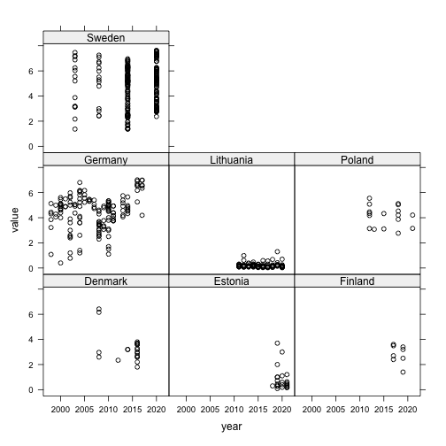
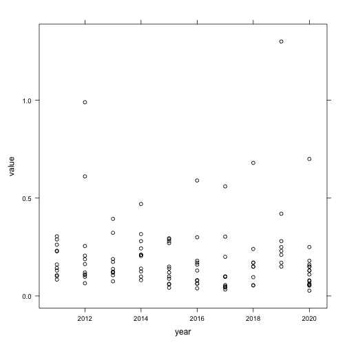
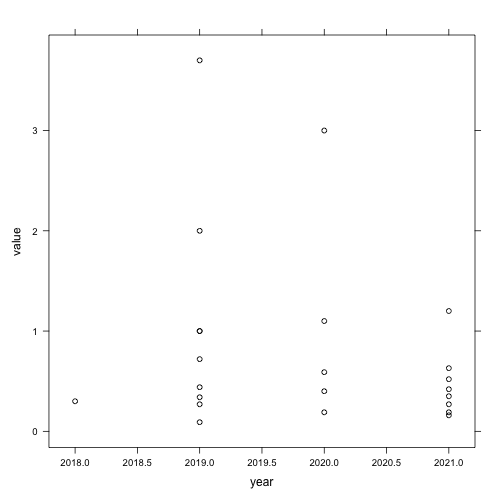
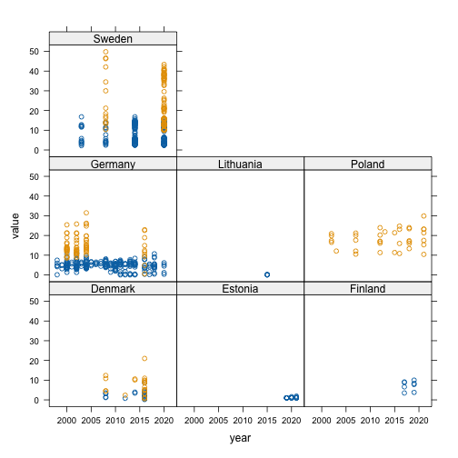
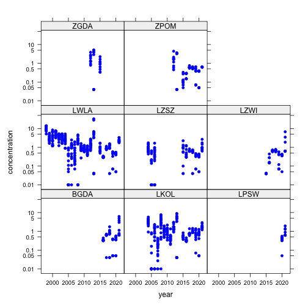

This is a brief example of using the `harsat` with HELCOM-style
data.


First, load the `harsat` library


```r
library(harsat)
```

And load the R package `here`, because we use the working directory to find
the data files. If you use your own data files, you will need to point to
a directory containing a copy.


```r
library(here)
#> here() starts at /Users/stuart/git/HARSAT
working.directory <- here()
```

Load the biota data, using HELCOM-style.


```r
biota_data <- read_data(
  compartment = "biota",
  purpose = "HELCOM",
  contaminants = "biota_data.csv", 
  stations = "station_dictionary.csv", 
  QA = "quality_assurance.csv",
  data_dir = file.path(working.directory, "data", "example_HELCOM"),
  data_format = "ICES_old",
  info_dir = file.path(working.directory, "information"),
  extraction = "2022/10/06",
  max_year = 2021L
)
#> Reading station dictionary from:
#>  '/Users/stuart/git/HARSAT/data/example_HELCOM/station_dictionary.csv'
#> 
#> Reading contaminant and biological effects data from:
#>  '/Users/stuart/git/HARSAT/data/example_HELCOM/biota_data.csv'
#> 
#> Reading QA data from '/Users/stuart/git/HARSAT/data/example_HELCOM/quality_assurance.csv'
```

Next, load the sediment data, again using HELCOM-style.


```r
sediment_data <- read_data(
  compartment = "sediment",
  purpose = "HELCOM",
  contaminants = file.path("..", "example_HELCOM_new_format", "sediment_data.csv"),
  stations = "station_dictionary.csv",
  data_dir = file.path(working.directory, "data", "example_HELCOM"),
  data_format = "ICES_new",
  info_dir = file.path(working.directory, "information"),
  extraction = "2022/10/06",
  max_year = 2021L
)
#> Reading station dictionary from:
#>  '/Users/stuart/git/HARSAT/data/example_HELCOM/station_dictionary.csv'
#> 
#> Reading contaminant and biological effects data from:
#>  '/Users/stuart/git/HARSAT/data/example_HELCOM/../example_HELCOM_new_format/sediment_data.csv'
```

And finally, read the water data.


```r
water_data <- read_data(
  compartment = "water",
  purpose = "HELCOM",
  contaminants = file.path("..", "example_HELCOM_new_format", "water_data.csv"),
  stations = "station_dictionary.csv",
  data_dir = file.path(working.directory, "data", "example_HELCOM"),
  data_format = "ICES_new",
  info_dir = file.path(working.directory, "information"),
  extraction = "2022/10/06",
  max_year = 2021L
)
#> Reading station dictionary from:
#>  '/Users/stuart/git/HARSAT/data/example_HELCOM/station_dictionary.csv'
#> 
#> Reading contaminant and biological effects data from:
#>  '/Users/stuart/git/HARSAT/data/example_HELCOM/../example_HELCOM_new_format/water_data.csv'
```

Now we can perform any adjustments we need to make. In this
case, we're correcting known errors in the data. 


```r
info_TEQ <- c(
  "CB77" = 0.0001, "CB81" = 0.0003, "CB105" = 0.00003, "CB118" = 0.00003,
  "CB126" = 0.1, "CB156" = 0.00003, "CB157" = 0.00003, "CB167" = 0.00003,
  "CB169" = 0.03, "CDD1N" = 1, "CDD4X" = 0.1, "CDD6P" = 0.01, "CDD6X" = 0.1,
  "CDD9X" = 0.1, "CDDO" = 0.0003, "CDF2N" = 0.3, "CDF2T" = 0.1, "CDF4X" = 0.1,
  "CDF6P" = 0.01, "CDF6X" = 0.1, "CDF9P" = 0.01,
  "CDF9X" = 0.1, "CDFO" = 0.00003, "CDFP2" = 0.03, "CDFX1" = 0.1, "TCDD" = 1
)
```


## Data adjustments: water

We'll use the `lattice` function to plot some of the data so we can see it as we go.


```r
library(tidyverse)
#> ── Attaching core tidyverse packages ─────────────────────────────────────────────────────────────────────────────────────────────────────────────────────────────────── tidyverse 2.0.0 ──
#> ✔ dplyr     1.1.2     ✔ readr     2.1.4
#> ✔ forcats   1.0.0     ✔ stringr   1.5.0
#> ✔ ggplot2   3.4.2     ✔ tibble    3.2.1
#> ✔ lubridate 1.9.2     ✔ tidyr     1.3.0
#> ✔ purrr     1.0.1     
#> ── Conflicts ───────────────────────────────────────────────────────────────────────────────────────────────────────────────────────────────────────────────────── tidyverse_conflicts() ──
#> ✖ dplyr::filter() masks stats::filter()
#> ✖ dplyr::lag()    masks stats::lag()
#> ℹ Use the conflicted package (<http://conflicted.r-lib.org/>) to force all conflicts to become errors
library(lattice)
```

### Data summary

Here is a summary of the submissions for each country, first by determinand and then by year. 


```r
water_data$data %>% 
  with(table(country, determinand)) %>% 
  print(zero.print = ".")
#>            determinand
#> country       CD   PB PFOS TBSN+
#>   Estonia     29   29   28    23
#>   Germany   1371 1349    5   156
#>   Lithuania  267  267   47    55
#>   Poland     862  854   36   375
#>   Russia      23   23    .     .

water_data$data %>% 
  with(table(country, year)) %>% 
  print(zero.print = ".")
#>            year
#> country     1995 1998 1999 2000 2003 2004 2005 2006 2007 2008 2009 2010 2011
#>   Estonia      .    .    .    .    .    .    .    .    .    .    .    .    .
#>   Germany      .   88   87  176   73  154  158  114  138  206  189  213   82
#>   Lithuania    .    .    .    .    .    .    .    .   46   46   48   38   49
#>   Poland       .    .    .    .    .    .    .    .    .    .    .    .  133
#>   Russia       4   42    .    .    .    .    .    .    .    .    .    .    .
#>            year
#> country     2012 2013 2014 2015 2016 2017 2018 2019 2020 2021
#>   Estonia      .    .    .    .    .   17    4   36   20   32
#>   Germany     98  134   82  122  121  142  136  129  135  104
#>   Lithuania   52   42   42   66   16    .   81   46   64    .
#>   Poland     181   72  144   72  479  540  143  159  108   96
#>   Russia       .    .    .    .    .    .    .    .    .    .
```

### Matrix issues

Here is a summary of the matrix and filtration data. Data with matrix SPM are deleted.


```r
water_data$data <- mutate(
  water_data$data,
  filtered = if_else(grepl("NF", method_pretreatment), "No", "Yes")
)

water_data$data %>% 
  with(table(matrix, filtered, useNA = "ifany")) %>% 
  print(zero.print = ".")
#>       filtered
#> matrix   No  Yes
#>    SPM   36    .
#>    WT  2074 3689

water_data$data <- filter(
  water_data$data, 
  matrix == "WT"
)
```

### Duplicate records

The following samples have duplicated records - only the first is retained.


```r

wk <- water_data$data %>%  
  group_by(sample, determinand, filtered) %>% 
  filter(n() >= 2) %>% 
  ungroup()
  
wk %>% 
  select(country, year, station_name, sample, determinand, filtered, replicate, value) %>% 
  arrange(country, year, sample, determinand, replicate) %>%
  as.data.frame() %>%
  knitr::kable(format = "html", table.attr = "class=\'datatable\'")
```

<table class='datatable'>
 <thead>
  <tr>
   <th style="text-align:left;"> country </th>
   <th style="text-align:right;"> year </th>
   <th style="text-align:left;"> station_name </th>
   <th style="text-align:left;"> sample </th>
   <th style="text-align:left;"> determinand </th>
   <th style="text-align:left;"> filtered </th>
   <th style="text-align:right;"> replicate </th>
   <th style="text-align:right;"> value </th>
  </tr>
 </thead>
<tbody>
  <tr>
   <td style="text-align:left;"> Germany </td>
   <td style="text-align:right;"> 2005 </td>
   <td style="text-align:left;"> OMBMPM2 </td>
   <td style="text-align:left;"> 319540 </td>
   <td style="text-align:left;"> CD </td>
   <td style="text-align:left;"> No </td>
   <td style="text-align:right;"> 21310563 </td>
   <td style="text-align:right;"> 8.50e+02 </td>
  </tr>
  <tr>
   <td style="text-align:left;"> Germany </td>
   <td style="text-align:right;"> 2005 </td>
   <td style="text-align:left;"> OMBMPM2 </td>
   <td style="text-align:left;"> 319540 </td>
   <td style="text-align:left;"> CD </td>
   <td style="text-align:left;"> No </td>
   <td style="text-align:right;"> 21310564 </td>
   <td style="text-align:right;"> 8.50e+02 </td>
  </tr>
  <tr>
   <td style="text-align:left;"> Germany </td>
   <td style="text-align:right;"> 2005 </td>
   <td style="text-align:left;"> OMBMPM2 </td>
   <td style="text-align:left;"> 319540 </td>
   <td style="text-align:left;"> CD </td>
   <td style="text-align:left;"> Yes </td>
   <td style="text-align:right;"> 21317207 </td>
   <td style="text-align:right;"> 1.33e-02 </td>
  </tr>
  <tr>
   <td style="text-align:left;"> Germany </td>
   <td style="text-align:right;"> 2005 </td>
   <td style="text-align:left;"> OMBMPM2 </td>
   <td style="text-align:left;"> 319540 </td>
   <td style="text-align:left;"> CD </td>
   <td style="text-align:left;"> Yes </td>
   <td style="text-align:right;"> 21317208 </td>
   <td style="text-align:right;"> 1.33e-02 </td>
  </tr>
  <tr>
   <td style="text-align:left;"> Germany </td>
   <td style="text-align:right;"> 2005 </td>
   <td style="text-align:left;"> OMBMPM1 </td>
   <td style="text-align:left;"> 319601 </td>
   <td style="text-align:left;"> CD </td>
   <td style="text-align:left;"> No </td>
   <td style="text-align:right;"> 21310571 </td>
   <td style="text-align:right;"> 2.99e+03 </td>
  </tr>
  <tr>
   <td style="text-align:left;"> Germany </td>
   <td style="text-align:right;"> 2005 </td>
   <td style="text-align:left;"> OMBMPM1 </td>
   <td style="text-align:left;"> 319601 </td>
   <td style="text-align:left;"> CD </td>
   <td style="text-align:left;"> No </td>
   <td style="text-align:right;"> 21310572 </td>
   <td style="text-align:right;"> 2.99e+03 </td>
  </tr>
  <tr>
   <td style="text-align:left;"> Germany </td>
   <td style="text-align:right;"> 2005 </td>
   <td style="text-align:left;"> OMBMPM1 </td>
   <td style="text-align:left;"> 319601 </td>
   <td style="text-align:left;"> CD </td>
   <td style="text-align:left;"> Yes </td>
   <td style="text-align:right;"> 21317213 </td>
   <td style="text-align:right;"> 1.93e-02 </td>
  </tr>
  <tr>
   <td style="text-align:left;"> Germany </td>
   <td style="text-align:right;"> 2005 </td>
   <td style="text-align:left;"> OMBMPM1 </td>
   <td style="text-align:left;"> 319601 </td>
   <td style="text-align:left;"> CD </td>
   <td style="text-align:left;"> Yes </td>
   <td style="text-align:right;"> 21317214 </td>
   <td style="text-align:right;"> 1.93e-02 </td>
  </tr>
  <tr>
   <td style="text-align:left;"> Germany </td>
   <td style="text-align:right;"> 2005 </td>
   <td style="text-align:left;"> OMBMPK8 </td>
   <td style="text-align:left;"> 319629 </td>
   <td style="text-align:left;"> CD </td>
   <td style="text-align:left;"> No </td>
   <td style="text-align:right;"> 21310583 </td>
   <td style="text-align:right;"> 8.60e+02 </td>
  </tr>
  <tr>
   <td style="text-align:left;"> Germany </td>
   <td style="text-align:right;"> 2005 </td>
   <td style="text-align:left;"> OMBMPK8 </td>
   <td style="text-align:left;"> 319629 </td>
   <td style="text-align:left;"> CD </td>
   <td style="text-align:left;"> No </td>
   <td style="text-align:right;"> 21310584 </td>
   <td style="text-align:right;"> 8.60e+02 </td>
  </tr>
  <tr>
   <td style="text-align:left;"> Germany </td>
   <td style="text-align:right;"> 2005 </td>
   <td style="text-align:left;"> OMBMPK8 </td>
   <td style="text-align:left;"> 319629 </td>
   <td style="text-align:left;"> CD </td>
   <td style="text-align:left;"> Yes </td>
   <td style="text-align:right;"> 21317273 </td>
   <td style="text-align:right;"> 1.11e-02 </td>
  </tr>
  <tr>
   <td style="text-align:left;"> Germany </td>
   <td style="text-align:right;"> 2005 </td>
   <td style="text-align:left;"> OMBMPK8 </td>
   <td style="text-align:left;"> 319629 </td>
   <td style="text-align:left;"> CD </td>
   <td style="text-align:left;"> Yes </td>
   <td style="text-align:right;"> 21317274 </td>
   <td style="text-align:right;"> 1.11e-02 </td>
  </tr>
  <tr>
   <td style="text-align:left;"> Germany </td>
   <td style="text-align:right;"> 2005 </td>
   <td style="text-align:left;"> OMBMPK5 </td>
   <td style="text-align:left;"> 319686 </td>
   <td style="text-align:left;"> CD </td>
   <td style="text-align:left;"> No </td>
   <td style="text-align:right;"> 21310591 </td>
   <td style="text-align:right;"> 1.82e+03 </td>
  </tr>
  <tr>
   <td style="text-align:left;"> Germany </td>
   <td style="text-align:right;"> 2005 </td>
   <td style="text-align:left;"> OMBMPK5 </td>
   <td style="text-align:left;"> 319686 </td>
   <td style="text-align:left;"> CD </td>
   <td style="text-align:left;"> No </td>
   <td style="text-align:right;"> 21310592 </td>
   <td style="text-align:right;"> 1.82e+03 </td>
  </tr>
  <tr>
   <td style="text-align:left;"> Germany </td>
   <td style="text-align:right;"> 2005 </td>
   <td style="text-align:left;"> OMBMPK5 </td>
   <td style="text-align:left;"> 319686 </td>
   <td style="text-align:left;"> CD </td>
   <td style="text-align:left;"> Yes </td>
   <td style="text-align:right;"> 21317289 </td>
   <td style="text-align:right;"> 1.11e-02 </td>
  </tr>
  <tr>
   <td style="text-align:left;"> Germany </td>
   <td style="text-align:right;"> 2005 </td>
   <td style="text-align:left;"> OMBMPK5 </td>
   <td style="text-align:left;"> 319686 </td>
   <td style="text-align:left;"> CD </td>
   <td style="text-align:left;"> Yes </td>
   <td style="text-align:right;"> 21317290 </td>
   <td style="text-align:right;"> 1.11e-02 </td>
  </tr>
  <tr>
   <td style="text-align:left;"> Germany </td>
   <td style="text-align:right;"> 2005 </td>
   <td style="text-align:left;"> OMBMPK4 </td>
   <td style="text-align:left;"> 319705 </td>
   <td style="text-align:left;"> CD </td>
   <td style="text-align:left;"> No </td>
   <td style="text-align:right;"> 21310609 </td>
   <td style="text-align:right;"> 6.60e+02 </td>
  </tr>
  <tr>
   <td style="text-align:left;"> Germany </td>
   <td style="text-align:right;"> 2005 </td>
   <td style="text-align:left;"> OMBMPK4 </td>
   <td style="text-align:left;"> 319705 </td>
   <td style="text-align:left;"> CD </td>
   <td style="text-align:left;"> No </td>
   <td style="text-align:right;"> 21310610 </td>
   <td style="text-align:right;"> 6.60e+02 </td>
  </tr>
  <tr>
   <td style="text-align:left;"> Germany </td>
   <td style="text-align:right;"> 2005 </td>
   <td style="text-align:left;"> OMBMPK4 </td>
   <td style="text-align:left;"> 319705 </td>
   <td style="text-align:left;"> CD </td>
   <td style="text-align:left;"> Yes </td>
   <td style="text-align:right;"> 21317305 </td>
   <td style="text-align:right;"> 8.96e-03 </td>
  </tr>
  <tr>
   <td style="text-align:left;"> Germany </td>
   <td style="text-align:right;"> 2005 </td>
   <td style="text-align:left;"> OMBMPK4 </td>
   <td style="text-align:left;"> 319705 </td>
   <td style="text-align:left;"> CD </td>
   <td style="text-align:left;"> Yes </td>
   <td style="text-align:right;"> 21317306 </td>
   <td style="text-align:right;"> 8.96e-03 </td>
  </tr>
  <tr>
   <td style="text-align:left;"> Germany </td>
   <td style="text-align:right;"> 2005 </td>
   <td style="text-align:left;"> OMBMPK7 </td>
   <td style="text-align:left;"> 319723 </td>
   <td style="text-align:left;"> CD </td>
   <td style="text-align:left;"> No </td>
   <td style="text-align:right;"> 21310625 </td>
   <td style="text-align:right;"> 1.34e+03 </td>
  </tr>
  <tr>
   <td style="text-align:left;"> Germany </td>
   <td style="text-align:right;"> 2005 </td>
   <td style="text-align:left;"> OMBMPK7 </td>
   <td style="text-align:left;"> 319723 </td>
   <td style="text-align:left;"> CD </td>
   <td style="text-align:left;"> No </td>
   <td style="text-align:right;"> 21310626 </td>
   <td style="text-align:right;"> 1.34e+03 </td>
  </tr>
  <tr>
   <td style="text-align:left;"> Germany </td>
   <td style="text-align:right;"> 2005 </td>
   <td style="text-align:left;"> OMBMPK7 </td>
   <td style="text-align:left;"> 319723 </td>
   <td style="text-align:left;"> CD </td>
   <td style="text-align:left;"> Yes </td>
   <td style="text-align:right;"> 21317307 </td>
   <td style="text-align:right;"> 1.09e-02 </td>
  </tr>
  <tr>
   <td style="text-align:left;"> Germany </td>
   <td style="text-align:right;"> 2005 </td>
   <td style="text-align:left;"> OMBMPK7 </td>
   <td style="text-align:left;"> 319723 </td>
   <td style="text-align:left;"> CD </td>
   <td style="text-align:left;"> Yes </td>
   <td style="text-align:right;"> 21317308 </td>
   <td style="text-align:right;"> 1.09e-02 </td>
  </tr>
  <tr>
   <td style="text-align:left;"> Germany </td>
   <td style="text-align:right;"> 2005 </td>
   <td style="text-align:left;"> OM222 </td>
   <td style="text-align:left;"> 319814 </td>
   <td style="text-align:left;"> CD </td>
   <td style="text-align:left;"> No </td>
   <td style="text-align:right;"> 21310637 </td>
   <td style="text-align:right;"> 8.20e+02 </td>
  </tr>
  <tr>
   <td style="text-align:left;"> Germany </td>
   <td style="text-align:right;"> 2005 </td>
   <td style="text-align:left;"> OM222 </td>
   <td style="text-align:left;"> 319814 </td>
   <td style="text-align:left;"> CD </td>
   <td style="text-align:left;"> No </td>
   <td style="text-align:right;"> 21310638 </td>
   <td style="text-align:right;"> 8.20e+02 </td>
  </tr>
  <tr>
   <td style="text-align:left;"> Germany </td>
   <td style="text-align:right;"> 2005 </td>
   <td style="text-align:left;"> OM222 </td>
   <td style="text-align:left;"> 319814 </td>
   <td style="text-align:left;"> CD </td>
   <td style="text-align:left;"> Yes </td>
   <td style="text-align:right;"> 21317339 </td>
   <td style="text-align:right;"> 9.62e-03 </td>
  </tr>
  <tr>
   <td style="text-align:left;"> Germany </td>
   <td style="text-align:right;"> 2005 </td>
   <td style="text-align:left;"> OM222 </td>
   <td style="text-align:left;"> 319814 </td>
   <td style="text-align:left;"> CD </td>
   <td style="text-align:left;"> Yes </td>
   <td style="text-align:right;"> 21317340 </td>
   <td style="text-align:right;"> 9.62e-03 </td>
  </tr>
  <tr>
   <td style="text-align:left;"> Germany </td>
   <td style="text-align:right;"> 2005 </td>
   <td style="text-align:left;"> NA </td>
   <td style="text-align:left;"> 319901 </td>
   <td style="text-align:left;"> CD </td>
   <td style="text-align:left;"> No </td>
   <td style="text-align:right;"> 21310671 </td>
   <td style="text-align:right;"> 1.18e+03 </td>
  </tr>
  <tr>
   <td style="text-align:left;"> Germany </td>
   <td style="text-align:right;"> 2005 </td>
   <td style="text-align:left;"> NA </td>
   <td style="text-align:left;"> 319901 </td>
   <td style="text-align:left;"> CD </td>
   <td style="text-align:left;"> No </td>
   <td style="text-align:right;"> 21310672 </td>
   <td style="text-align:right;"> 1.18e+03 </td>
  </tr>
  <tr>
   <td style="text-align:left;"> Germany </td>
   <td style="text-align:right;"> 2005 </td>
   <td style="text-align:left;"> NA </td>
   <td style="text-align:left;"> 319901 </td>
   <td style="text-align:left;"> CD </td>
   <td style="text-align:left;"> Yes </td>
   <td style="text-align:right;"> 21317471 </td>
   <td style="text-align:right;"> 1.02e-02 </td>
  </tr>
  <tr>
   <td style="text-align:left;"> Germany </td>
   <td style="text-align:right;"> 2005 </td>
   <td style="text-align:left;"> NA </td>
   <td style="text-align:left;"> 319901 </td>
   <td style="text-align:left;"> CD </td>
   <td style="text-align:left;"> Yes </td>
   <td style="text-align:right;"> 21317472 </td>
   <td style="text-align:right;"> 1.02e-02 </td>
  </tr>
  <tr>
   <td style="text-align:left;"> Germany </td>
   <td style="text-align:right;"> 2005 </td>
   <td style="text-align:left;"> OM253 </td>
   <td style="text-align:left;"> 319945 </td>
   <td style="text-align:left;"> CD </td>
   <td style="text-align:left;"> No </td>
   <td style="text-align:right;"> 21310695 </td>
   <td style="text-align:right;"> 9.60e+02 </td>
  </tr>
  <tr>
   <td style="text-align:left;"> Germany </td>
   <td style="text-align:right;"> 2005 </td>
   <td style="text-align:left;"> OM253 </td>
   <td style="text-align:left;"> 319945 </td>
   <td style="text-align:left;"> CD </td>
   <td style="text-align:left;"> No </td>
   <td style="text-align:right;"> 21310696 </td>
   <td style="text-align:right;"> 9.60e+02 </td>
  </tr>
  <tr>
   <td style="text-align:left;"> Germany </td>
   <td style="text-align:right;"> 2005 </td>
   <td style="text-align:left;"> OM253 </td>
   <td style="text-align:left;"> 319945 </td>
   <td style="text-align:left;"> CD </td>
   <td style="text-align:left;"> Yes </td>
   <td style="text-align:right;"> 21317543 </td>
   <td style="text-align:right;"> 1.00e-02 </td>
  </tr>
  <tr>
   <td style="text-align:left;"> Germany </td>
   <td style="text-align:right;"> 2005 </td>
   <td style="text-align:left;"> OM253 </td>
   <td style="text-align:left;"> 319945 </td>
   <td style="text-align:left;"> CD </td>
   <td style="text-align:left;"> Yes </td>
   <td style="text-align:right;"> 21317544 </td>
   <td style="text-align:right;"> 1.00e-02 </td>
  </tr>
  <tr>
   <td style="text-align:left;"> Germany </td>
   <td style="text-align:right;"> 2005 </td>
   <td style="text-align:left;"> OM250 </td>
   <td style="text-align:left;"> 319957 </td>
   <td style="text-align:left;"> CD </td>
   <td style="text-align:left;"> No </td>
   <td style="text-align:right;"> 21310699 </td>
   <td style="text-align:right;"> 8.50e+02 </td>
  </tr>
  <tr>
   <td style="text-align:left;"> Germany </td>
   <td style="text-align:right;"> 2005 </td>
   <td style="text-align:left;"> OM250 </td>
   <td style="text-align:left;"> 319957 </td>
   <td style="text-align:left;"> CD </td>
   <td style="text-align:left;"> No </td>
   <td style="text-align:right;"> 21310700 </td>
   <td style="text-align:right;"> 8.50e+02 </td>
  </tr>
  <tr>
   <td style="text-align:left;"> Germany </td>
   <td style="text-align:right;"> 2005 </td>
   <td style="text-align:left;"> OM250 </td>
   <td style="text-align:left;"> 319957 </td>
   <td style="text-align:left;"> CD </td>
   <td style="text-align:left;"> Yes </td>
   <td style="text-align:right;"> 21317545 </td>
   <td style="text-align:right;"> 9.40e-03 </td>
  </tr>
  <tr>
   <td style="text-align:left;"> Germany </td>
   <td style="text-align:right;"> 2005 </td>
   <td style="text-align:left;"> OM250 </td>
   <td style="text-align:left;"> 319957 </td>
   <td style="text-align:left;"> CD </td>
   <td style="text-align:left;"> Yes </td>
   <td style="text-align:right;"> 21317546 </td>
   <td style="text-align:right;"> 9.40e-03 </td>
  </tr>
  <tr>
   <td style="text-align:left;"> Germany </td>
   <td style="text-align:right;"> 2005 </td>
   <td style="text-align:left;"> OM263 </td>
   <td style="text-align:left;"> 319972 </td>
   <td style="text-align:left;"> CD </td>
   <td style="text-align:left;"> No </td>
   <td style="text-align:right;"> 21310707 </td>
   <td style="text-align:right;"> 7.70e+02 </td>
  </tr>
  <tr>
   <td style="text-align:left;"> Germany </td>
   <td style="text-align:right;"> 2005 </td>
   <td style="text-align:left;"> OM263 </td>
   <td style="text-align:left;"> 319972 </td>
   <td style="text-align:left;"> CD </td>
   <td style="text-align:left;"> No </td>
   <td style="text-align:right;"> 21310708 </td>
   <td style="text-align:right;"> 7.70e+02 </td>
  </tr>
  <tr>
   <td style="text-align:left;"> Germany </td>
   <td style="text-align:right;"> 2005 </td>
   <td style="text-align:left;"> OM263 </td>
   <td style="text-align:left;"> 319972 </td>
   <td style="text-align:left;"> CD </td>
   <td style="text-align:left;"> Yes </td>
   <td style="text-align:right;"> 21317555 </td>
   <td style="text-align:right;"> 9.40e-03 </td>
  </tr>
  <tr>
   <td style="text-align:left;"> Germany </td>
   <td style="text-align:right;"> 2005 </td>
   <td style="text-align:left;"> OM263 </td>
   <td style="text-align:left;"> 319972 </td>
   <td style="text-align:left;"> CD </td>
   <td style="text-align:left;"> Yes </td>
   <td style="text-align:right;"> 21317556 </td>
   <td style="text-align:right;"> 9.40e-03 </td>
  </tr>
  <tr>
   <td style="text-align:left;"> Germany </td>
   <td style="text-align:right;"> 2005 </td>
   <td style="text-align:left;"> OM260 </td>
   <td style="text-align:left;"> 319989 </td>
   <td style="text-align:left;"> CD </td>
   <td style="text-align:left;"> No </td>
   <td style="text-align:right;"> 21310715 </td>
   <td style="text-align:right;"> 5.00e+02 </td>
  </tr>
  <tr>
   <td style="text-align:left;"> Germany </td>
   <td style="text-align:right;"> 2005 </td>
   <td style="text-align:left;"> OM260 </td>
   <td style="text-align:left;"> 319989 </td>
   <td style="text-align:left;"> CD </td>
   <td style="text-align:left;"> No </td>
   <td style="text-align:right;"> 21310716 </td>
   <td style="text-align:right;"> 5.00e+02 </td>
  </tr>
  <tr>
   <td style="text-align:left;"> Germany </td>
   <td style="text-align:right;"> 2005 </td>
   <td style="text-align:left;"> OM260 </td>
   <td style="text-align:left;"> 319989 </td>
   <td style="text-align:left;"> CD </td>
   <td style="text-align:left;"> Yes </td>
   <td style="text-align:right;"> 21317565 </td>
   <td style="text-align:right;"> 8.60e-03 </td>
  </tr>
  <tr>
   <td style="text-align:left;"> Germany </td>
   <td style="text-align:right;"> 2005 </td>
   <td style="text-align:left;"> OM260 </td>
   <td style="text-align:left;"> 319989 </td>
   <td style="text-align:left;"> CD </td>
   <td style="text-align:left;"> Yes </td>
   <td style="text-align:right;"> 21317566 </td>
   <td style="text-align:right;"> 8.60e-03 </td>
  </tr>
  <tr>
   <td style="text-align:left;"> Germany </td>
   <td style="text-align:right;"> 2005 </td>
   <td style="text-align:left;"> OM272 </td>
   <td style="text-align:left;"> 320005 </td>
   <td style="text-align:left;"> CD </td>
   <td style="text-align:left;"> No </td>
   <td style="text-align:right;"> 21310723 </td>
   <td style="text-align:right;"> 1.59e+03 </td>
  </tr>
  <tr>
   <td style="text-align:left;"> Germany </td>
   <td style="text-align:right;"> 2005 </td>
   <td style="text-align:left;"> OM272 </td>
   <td style="text-align:left;"> 320005 </td>
   <td style="text-align:left;"> CD </td>
   <td style="text-align:left;"> No </td>
   <td style="text-align:right;"> 21310724 </td>
   <td style="text-align:right;"> 1.59e+03 </td>
  </tr>
  <tr>
   <td style="text-align:left;"> Germany </td>
   <td style="text-align:right;"> 2005 </td>
   <td style="text-align:left;"> OM272 </td>
   <td style="text-align:left;"> 320005 </td>
   <td style="text-align:left;"> CD </td>
   <td style="text-align:left;"> Yes </td>
   <td style="text-align:right;"> 21317581 </td>
   <td style="text-align:right;"> 9.20e-03 </td>
  </tr>
  <tr>
   <td style="text-align:left;"> Germany </td>
   <td style="text-align:right;"> 2005 </td>
   <td style="text-align:left;"> OM272 </td>
   <td style="text-align:left;"> 320005 </td>
   <td style="text-align:left;"> CD </td>
   <td style="text-align:left;"> Yes </td>
   <td style="text-align:right;"> 21317582 </td>
   <td style="text-align:right;"> 9.20e-03 </td>
  </tr>
</tbody>
</table>


```r
wk_rep <- wk$replicate

wk_keep <- wk %>% 
  select(sample, determinand, filtered, replicate, station_name, value) %>% 
  arrange(replicate) %>% 
  distinct(sample, determinand, filtered, value, .keep_all = TRUE) %>% 
  pull(replicate)

wk_drop <- setdiff(wk_rep, wk_keep)

water_data$data <- filter(
  water_data$data, 
  !replicate %in% wk_drop
)
```

### Filtration issues

Here's a summary of whether the data have been filtered or not by determinand. All PFOS and TBSN+ are unfiltered, which is fine. However, there could be issues with the metals data, since there are both filtered (preferred) and unfiltered samples.  


```r
water_data$data %>% 
  with(table(determinand, filtered)) %>% 
  print(zero.print = ".")
#>            filtered
#> determinand   No  Yes
#>       CD     677 1831
#>       PB     659 1845
#>       PFOS   116    .
#>       TBSN+  609    .
```

Here's a more detailed look at the metals data (having excluded the Russian data which are too old).  

* **Estonia**: all samples are filtered.
* **Germany**: a real mixture which is explored more below. 
* **Lithuania**: the only unfiltered data are from 2007 (the first year of data). Maybe these were filtered data and have been submitted incorrectly. For now they are treated as unfiltered (and will drop out of the assessment because there are no unfiltered data in the last six monitoring years)
* **Poland**: all samples are filtered.


```r
wk <- filter(
  water_data$data, 
  country != "Russia",
  determinand %in% c("CD", "PB")
) 
  
wk %>% 
  with(table(filtered, country)) %>% 
  print(zero.print = ".")
#>         country
#> filtered Estonia Germany Lithuania Poland
#>      No        .    1244        46      .
#>      Yes      58    1414       488   1716

wk %>% 
  with(table(filtered, year, country)) %>% 
  print(zero.print = ".")
#> , , country = Estonia
#> 
#>         year
#> filtered 1998 1999 2000 2003 2004 2005 2006 2007 2008 2009 2010 2011 2012 2013
#>      No     .    .    .    .    .    .    .    .    .    .    .    .    .    .
#>      Yes    .    .    .    .    .    .    .    .    .    .    .    .    .    .
#>         year
#> filtered 2014 2015 2016 2017 2018 2019 2020 2021
#>      No     .    .    .    .    .    .    .    .
#>      Yes    .    .    .   12    2   18   10   16
#> 
#> , , country = Germany
#> 
#>         year
#> filtered 1998 1999 2000 2003 2004 2005 2006 2007 2008 2009 2010 2011 2012 2013
#>      No    88   87  176   73  154  119   24   24   32   32   69   62   36   32
#>      Yes    .    .    .    .    .   13   90  114  174  121  144   20   62  102
#>         year
#> filtered 2014 2015 2016 2017 2018 2019 2020 2021
#>      No    24   32   20   44   48   22   46    .
#>      Yes   58   90   96   68   66   72   58   66
#> 
#> , , country = Lithuania
#> 
#>         year
#> filtered 1998 1999 2000 2003 2004 2005 2006 2007 2008 2009 2010 2011 2012 2013
#>      No     .    .    .    .    .    .    .   46    .    .    .    .    .    .
#>      Yes    .    .    .    .    .    .    .    .   46   48   34   40   40   42
#>         year
#> filtered 2014 2015 2016 2017 2018 2019 2020 2021
#>      No     .    .    .    .    .    .    .    .
#>      Yes   42   34    .    .   58   46   58    .
#> 
#> , , country = Poland
#> 
#>         year
#> filtered 1998 1999 2000 2003 2004 2005 2006 2007 2008 2009 2010 2011 2012 2013
#>      No     .    .    .    .    .    .    .    .    .    .    .    .    .    .
#>      Yes    .    .    .    .    .    .    .    .    .    .    .  123  151   72
#>         year
#> filtered 2014 2015 2016 2017 2018 2019 2020 2021
#>      No     .    .    .    .    .    .    .    .
#>      Yes  144   72  336  348  143  147   96   84
```

#### German metals data

Here are the stations with metals data in the last six monitoring years (2016-2021); the second column shows whether the metal samples in this period were all filtered, all unfiltered, or a mixture.


```r
wk <- wk %>% 
  filter(country == "Germany") %>%
  group_by(station_name) %>% 
  filter(max(year) >= 2016) %>%
  ungroup()


wk_fun <- function(x) {
  if (all(x == "Yes")) return("filtered")
  if (all(x == "No")) return("unfiltered")
  "mixture"
}

wk1 <- wk %>% 
  filter(year >= 2016) %>% 
  group_by(station_name) %>% 
  summarise(type = wk_fun(filtered), .groups = "drop_last")

as.data.frame(wk1) %>%
  knitr::kable(format = "html", table.attr = "class=\'datatable\'")
```

<table class='datatable'>
 <thead>
  <tr>
   <th style="text-align:left;"> station_name </th>
   <th style="text-align:left;"> type </th>
  </tr>
 </thead>
<tbody>
  <tr>
   <td style="text-align:left;"> BMP K4 </td>
   <td style="text-align:left;"> filtered </td>
  </tr>
  <tr>
   <td style="text-align:left;"> OM225019 </td>
   <td style="text-align:left;"> unfiltered </td>
  </tr>
  <tr>
   <td style="text-align:left;"> OM225025 </td>
   <td style="text-align:left;"> unfiltered </td>
  </tr>
  <tr>
   <td style="text-align:left;"> OM225049 </td>
   <td style="text-align:left;"> unfiltered </td>
  </tr>
  <tr>
   <td style="text-align:left;"> OM225054 </td>
   <td style="text-align:left;"> unfiltered </td>
  </tr>
  <tr>
   <td style="text-align:left;"> OM225059 </td>
   <td style="text-align:left;"> unfiltered </td>
  </tr>
  <tr>
   <td style="text-align:left;"> OM225103 </td>
   <td style="text-align:left;"> unfiltered </td>
  </tr>
  <tr>
   <td style="text-align:left;"> OM225109 </td>
   <td style="text-align:left;"> unfiltered </td>
  </tr>
  <tr>
   <td style="text-align:left;"> OM707 </td>
   <td style="text-align:left;"> unfiltered </td>
  </tr>
  <tr>
   <td style="text-align:left;"> OMBMPK3 </td>
   <td style="text-align:left;"> filtered </td>
  </tr>
  <tr>
   <td style="text-align:left;"> OMBMPK5 </td>
   <td style="text-align:left;"> filtered </td>
  </tr>
  <tr>
   <td style="text-align:left;"> OMBMPK8 </td>
   <td style="text-align:left;"> filtered </td>
  </tr>
  <tr>
   <td style="text-align:left;"> OMBMPM1 </td>
   <td style="text-align:left;"> filtered </td>
  </tr>
  <tr>
   <td style="text-align:left;"> OMBMPM2 </td>
   <td style="text-align:left;"> mixture </td>
  </tr>
  <tr>
   <td style="text-align:left;"> OMBMPN1 </td>
   <td style="text-align:left;"> filtered </td>
  </tr>
  <tr>
   <td style="text-align:left;"> OMBMPN3 </td>
   <td style="text-align:left;"> mixture </td>
  </tr>
  <tr>
   <td style="text-align:left;"> OMMVDB16 </td>
   <td style="text-align:left;"> filtered </td>
  </tr>
  <tr>
   <td style="text-align:left;"> OMMVGB19 </td>
   <td style="text-align:left;"> filtered </td>
  </tr>
  <tr>
   <td style="text-align:left;"> OMMVKHM </td>
   <td style="text-align:left;"> filtered </td>
  </tr>
  <tr>
   <td style="text-align:left;"> OMMVMYT5 </td>
   <td style="text-align:left;"> filtered </td>
  </tr>
  <tr>
   <td style="text-align:left;"> OMMVUW4 </td>
   <td style="text-align:left;"> filtered </td>
  </tr>
  <tr>
   <td style="text-align:left;"> OMMVWB3 </td>
   <td style="text-align:left;"> filtered </td>
  </tr>
  <tr>
   <td style="text-align:left;"> OMO22 </td>
   <td style="text-align:left;"> mixture </td>
  </tr>
  <tr>
   <td style="text-align:left;"> OMO9 </td>
   <td style="text-align:left;"> filtered </td>
  </tr>
  <tr>
   <td style="text-align:left;"> OMOB4 </td>
   <td style="text-align:left;"> filtered </td>
  </tr>
  <tr>
   <td style="text-align:left;"> OMS2 </td>
   <td style="text-align:left;"> unfiltered </td>
  </tr>
  <tr>
   <td style="text-align:left;"> Oderbank </td>
   <td style="text-align:left;"> filtered </td>
  </tr>
</tbody>
</table>


There are three stations where there is a mixture. Here are the full records of 
samples at these stations. These look intentional. Filtered and unfiltered 
samples will be analysed as separate time series.


```r
wk_id <- wk1 %>% 
  filter(type == "mixture") %>% 
  pull(station_name)

wk %>% 
  filter(station_name %in% wk_id) %>% 
  with(table(filtered, year, station_name)) %>% 
  print(zero.print = ".")
#> , , station_name = OMBMPM2
#> 
#>         year
#> filtered 2005 2006 2007 2008 2009 2010 2011 2012 2013 2014 2015 2016 2017 2018
#>      No     1    2    4    4    4    8    4    4    4    2    2    2    4    4
#>      Yes    1    2    2    2    4    .    .    .    .    .    .    2    .    .
#>         year
#> filtered 2019 2020
#>      No     2    4
#>      Yes    .    .
#> 
#> , , station_name = OMBMPN3
#> 
#>         year
#> filtered 2005 2006 2007 2008 2009 2010 2011 2012 2013 2014 2015 2016 2017 2018
#>      No     .    .    .    4    4    8    4    4    4    2    4    2    4    4
#>      Yes    .    .    .    2    4    .    .    .    .    .    .    2    .    .
#>         year
#> filtered 2019 2020
#>      No     2    2
#>      Yes    .    .
#> 
#> , , station_name = OMO22
#> 
#>         year
#> filtered 2005 2006 2007 2008 2009 2010 2011 2012 2013 2014 2015 2016 2017 2018
#>      No     .    .    4    4    4    4    4    4    4    2    2    2    4    4
#>      Yes    .    .    .    .    .   20    .    .    .    .    .    .   12    .
#>         year
#> filtered 2019 2020
#>      No     2    4
#>      Yes    .    8
```

#### Zero concentrations

Some metals concentrations from Lithuania in 2008 have been reported with value = 0. These measurements are less than the LoQ (Nijole 22 August) so the value has been replaced by the LoQ. (There are no uncertainties reported, so there is no need to adjust these.)


```r
water_data$data <- mutate(
  water_data$data, 
  .id = value == 0
)

if (sum(water_data$data$.id) != 23) {
  stop("something has changed - investigate")
}  

water_data$data %>% 
  filter(.id) %>% 
  select(
    country, year, determinand, value, censoring, limit_detection, 
    limit_quantification, uncertainty, unit_uncertainty
  ) %>% 
  as.data.frame() %>%
  knitr::kable(format = "html", table.attr = "class=\'datatable\'")
```

<table class='datatable'>
 <thead>
  <tr>
   <th style="text-align:left;"> country </th>
   <th style="text-align:right;"> year </th>
   <th style="text-align:left;"> determinand </th>
   <th style="text-align:right;"> value </th>
   <th style="text-align:left;"> censoring </th>
   <th style="text-align:right;"> limit_detection </th>
   <th style="text-align:right;"> limit_quantification </th>
   <th style="text-align:right;"> uncertainty </th>
   <th style="text-align:left;"> unit_uncertainty </th>
  </tr>
 </thead>
<tbody>
  <tr>
   <td style="text-align:left;"> Lithuania </td>
   <td style="text-align:right;"> 2008 </td>
   <td style="text-align:left;"> CD </td>
   <td style="text-align:right;"> 0 </td>
   <td style="text-align:left;"> &lt;~Q </td>
   <td style="text-align:right;"> NA </td>
   <td style="text-align:right;"> 0.08 </td>
   <td style="text-align:right;"> NA </td>
   <td style="text-align:left;"> NA </td>
  </tr>
  <tr>
   <td style="text-align:left;"> Lithuania </td>
   <td style="text-align:right;"> 2008 </td>
   <td style="text-align:left;"> CD </td>
   <td style="text-align:right;"> 0 </td>
   <td style="text-align:left;"> &lt;~Q </td>
   <td style="text-align:right;"> NA </td>
   <td style="text-align:right;"> 0.08 </td>
   <td style="text-align:right;"> NA </td>
   <td style="text-align:left;"> NA </td>
  </tr>
  <tr>
   <td style="text-align:left;"> Lithuania </td>
   <td style="text-align:right;"> 2008 </td>
   <td style="text-align:left;"> CD </td>
   <td style="text-align:right;"> 0 </td>
   <td style="text-align:left;"> &lt;~Q </td>
   <td style="text-align:right;"> NA </td>
   <td style="text-align:right;"> 0.08 </td>
   <td style="text-align:right;"> NA </td>
   <td style="text-align:left;"> NA </td>
  </tr>
  <tr>
   <td style="text-align:left;"> Lithuania </td>
   <td style="text-align:right;"> 2008 </td>
   <td style="text-align:left;"> CD </td>
   <td style="text-align:right;"> 0 </td>
   <td style="text-align:left;"> &lt;~Q </td>
   <td style="text-align:right;"> NA </td>
   <td style="text-align:right;"> 0.08 </td>
   <td style="text-align:right;"> NA </td>
   <td style="text-align:left;"> NA </td>
  </tr>
  <tr>
   <td style="text-align:left;"> Lithuania </td>
   <td style="text-align:right;"> 2008 </td>
   <td style="text-align:left;"> CD </td>
   <td style="text-align:right;"> 0 </td>
   <td style="text-align:left;"> &lt;~Q </td>
   <td style="text-align:right;"> NA </td>
   <td style="text-align:right;"> 0.08 </td>
   <td style="text-align:right;"> NA </td>
   <td style="text-align:left;"> NA </td>
  </tr>
  <tr>
   <td style="text-align:left;"> Lithuania </td>
   <td style="text-align:right;"> 2008 </td>
   <td style="text-align:left;"> CD </td>
   <td style="text-align:right;"> 0 </td>
   <td style="text-align:left;"> &lt;~Q </td>
   <td style="text-align:right;"> NA </td>
   <td style="text-align:right;"> 0.08 </td>
   <td style="text-align:right;"> NA </td>
   <td style="text-align:left;"> NA </td>
  </tr>
  <tr>
   <td style="text-align:left;"> Lithuania </td>
   <td style="text-align:right;"> 2008 </td>
   <td style="text-align:left;"> CD </td>
   <td style="text-align:right;"> 0 </td>
   <td style="text-align:left;"> &lt;~Q </td>
   <td style="text-align:right;"> NA </td>
   <td style="text-align:right;"> 0.08 </td>
   <td style="text-align:right;"> NA </td>
   <td style="text-align:left;"> NA </td>
  </tr>
  <tr>
   <td style="text-align:left;"> Lithuania </td>
   <td style="text-align:right;"> 2008 </td>
   <td style="text-align:left;"> CD </td>
   <td style="text-align:right;"> 0 </td>
   <td style="text-align:left;"> &lt;~Q </td>
   <td style="text-align:right;"> NA </td>
   <td style="text-align:right;"> 0.08 </td>
   <td style="text-align:right;"> NA </td>
   <td style="text-align:left;"> NA </td>
  </tr>
  <tr>
   <td style="text-align:left;"> Lithuania </td>
   <td style="text-align:right;"> 2008 </td>
   <td style="text-align:left;"> CD </td>
   <td style="text-align:right;"> 0 </td>
   <td style="text-align:left;"> &lt;~Q </td>
   <td style="text-align:right;"> NA </td>
   <td style="text-align:right;"> 0.08 </td>
   <td style="text-align:right;"> NA </td>
   <td style="text-align:left;"> NA </td>
  </tr>
  <tr>
   <td style="text-align:left;"> Lithuania </td>
   <td style="text-align:right;"> 2008 </td>
   <td style="text-align:left;"> CD </td>
   <td style="text-align:right;"> 0 </td>
   <td style="text-align:left;"> &lt;~Q </td>
   <td style="text-align:right;"> NA </td>
   <td style="text-align:right;"> 0.08 </td>
   <td style="text-align:right;"> NA </td>
   <td style="text-align:left;"> NA </td>
  </tr>
  <tr>
   <td style="text-align:left;"> Lithuania </td>
   <td style="text-align:right;"> 2008 </td>
   <td style="text-align:left;"> PB </td>
   <td style="text-align:right;"> 0 </td>
   <td style="text-align:left;"> &lt;~Q </td>
   <td style="text-align:right;"> NA </td>
   <td style="text-align:right;"> 1.20 </td>
   <td style="text-align:right;"> NA </td>
   <td style="text-align:left;"> NA </td>
  </tr>
  <tr>
   <td style="text-align:left;"> Lithuania </td>
   <td style="text-align:right;"> 2008 </td>
   <td style="text-align:left;"> PB </td>
   <td style="text-align:right;"> 0 </td>
   <td style="text-align:left;"> &lt;~Q </td>
   <td style="text-align:right;"> NA </td>
   <td style="text-align:right;"> 1.20 </td>
   <td style="text-align:right;"> NA </td>
   <td style="text-align:left;"> NA </td>
  </tr>
  <tr>
   <td style="text-align:left;"> Lithuania </td>
   <td style="text-align:right;"> 2008 </td>
   <td style="text-align:left;"> PB </td>
   <td style="text-align:right;"> 0 </td>
   <td style="text-align:left;"> &lt;~Q </td>
   <td style="text-align:right;"> NA </td>
   <td style="text-align:right;"> 1.20 </td>
   <td style="text-align:right;"> NA </td>
   <td style="text-align:left;"> NA </td>
  </tr>
  <tr>
   <td style="text-align:left;"> Lithuania </td>
   <td style="text-align:right;"> 2008 </td>
   <td style="text-align:left;"> PB </td>
   <td style="text-align:right;"> 0 </td>
   <td style="text-align:left;"> &lt;~Q </td>
   <td style="text-align:right;"> NA </td>
   <td style="text-align:right;"> 1.20 </td>
   <td style="text-align:right;"> NA </td>
   <td style="text-align:left;"> NA </td>
  </tr>
  <tr>
   <td style="text-align:left;"> Lithuania </td>
   <td style="text-align:right;"> 2008 </td>
   <td style="text-align:left;"> PB </td>
   <td style="text-align:right;"> 0 </td>
   <td style="text-align:left;"> &lt;~Q </td>
   <td style="text-align:right;"> NA </td>
   <td style="text-align:right;"> 1.20 </td>
   <td style="text-align:right;"> NA </td>
   <td style="text-align:left;"> NA </td>
  </tr>
  <tr>
   <td style="text-align:left;"> Lithuania </td>
   <td style="text-align:right;"> 2008 </td>
   <td style="text-align:left;"> PB </td>
   <td style="text-align:right;"> 0 </td>
   <td style="text-align:left;"> &lt;~Q </td>
   <td style="text-align:right;"> NA </td>
   <td style="text-align:right;"> 1.20 </td>
   <td style="text-align:right;"> NA </td>
   <td style="text-align:left;"> NA </td>
  </tr>
  <tr>
   <td style="text-align:left;"> Lithuania </td>
   <td style="text-align:right;"> 2008 </td>
   <td style="text-align:left;"> PB </td>
   <td style="text-align:right;"> 0 </td>
   <td style="text-align:left;"> &lt;~Q </td>
   <td style="text-align:right;"> NA </td>
   <td style="text-align:right;"> 1.20 </td>
   <td style="text-align:right;"> NA </td>
   <td style="text-align:left;"> NA </td>
  </tr>
  <tr>
   <td style="text-align:left;"> Lithuania </td>
   <td style="text-align:right;"> 2008 </td>
   <td style="text-align:left;"> PB </td>
   <td style="text-align:right;"> 0 </td>
   <td style="text-align:left;"> &lt;~Q </td>
   <td style="text-align:right;"> NA </td>
   <td style="text-align:right;"> 1.20 </td>
   <td style="text-align:right;"> NA </td>
   <td style="text-align:left;"> NA </td>
  </tr>
  <tr>
   <td style="text-align:left;"> Lithuania </td>
   <td style="text-align:right;"> 2008 </td>
   <td style="text-align:left;"> PB </td>
   <td style="text-align:right;"> 0 </td>
   <td style="text-align:left;"> &lt;~Q </td>
   <td style="text-align:right;"> NA </td>
   <td style="text-align:right;"> 1.20 </td>
   <td style="text-align:right;"> NA </td>
   <td style="text-align:left;"> NA </td>
  </tr>
  <tr>
   <td style="text-align:left;"> Lithuania </td>
   <td style="text-align:right;"> 2008 </td>
   <td style="text-align:left;"> PB </td>
   <td style="text-align:right;"> 0 </td>
   <td style="text-align:left;"> &lt;~Q </td>
   <td style="text-align:right;"> NA </td>
   <td style="text-align:right;"> 1.20 </td>
   <td style="text-align:right;"> NA </td>
   <td style="text-align:left;"> NA </td>
  </tr>
  <tr>
   <td style="text-align:left;"> Lithuania </td>
   <td style="text-align:right;"> 2008 </td>
   <td style="text-align:left;"> PB </td>
   <td style="text-align:right;"> 0 </td>
   <td style="text-align:left;"> &lt;~Q </td>
   <td style="text-align:right;"> NA </td>
   <td style="text-align:right;"> 1.20 </td>
   <td style="text-align:right;"> NA </td>
   <td style="text-align:left;"> NA </td>
  </tr>
  <tr>
   <td style="text-align:left;"> Lithuania </td>
   <td style="text-align:right;"> 2008 </td>
   <td style="text-align:left;"> PB </td>
   <td style="text-align:right;"> 0 </td>
   <td style="text-align:left;"> &lt;~Q </td>
   <td style="text-align:right;"> NA </td>
   <td style="text-align:right;"> 1.20 </td>
   <td style="text-align:right;"> NA </td>
   <td style="text-align:left;"> NA </td>
  </tr>
  <tr>
   <td style="text-align:left;"> Lithuania </td>
   <td style="text-align:right;"> 2008 </td>
   <td style="text-align:left;"> PB </td>
   <td style="text-align:right;"> 0 </td>
   <td style="text-align:left;"> &lt;~Q </td>
   <td style="text-align:right;"> NA </td>
   <td style="text-align:right;"> 1.20 </td>
   <td style="text-align:right;"> NA </td>
   <td style="text-align:left;"> NA </td>
  </tr>
</tbody>
</table>


```r
water_data$data <- mutate(
  water_data$data, 
  value = if_else(.id, limit_quantification, value),
  .id = NULL
)
```

## Sediment

### Data summary

Here is a summary of the submissions for each country, first by determinand and then 
by year. The grain size fraction data have been omitted for simplicity.  


```r
wk <- filter(
  sediment_data$data, 
  !grepl("GSMF", determinand)
)

wk %>% 
  with(table(country, determinand)) %>% 
  print(zero.print = ".")
#>            determinand
#> country      AL ANT BD100 BD153 BD154 BDE28 BDE47 BDE99  CD CORG CTOT  CU
#>   Denmark   498 374   111    56   114     .    98   104 479  467   30 485
#>   Estonia    23  28    30    30    30    30    30    30  28   23    .  28
#>   Finland     8  22     9     9     9     9     9     9  20    8    .   8
#>   Germany   307 129     4     4     3     5     4     4 362  411    . 327
#>   Latvia      .   .     .     .     .     .     .     .   .    .    .   1
#>   Lithuania 125  43    14    14    14    12    14    14 187    8    . 172
#>   Norway      6   6     .     .     .     .     .     .   6    6    .   6
#>   Poland    136  10     .     .     .     .     .     .  43    .    .  43
#>   Russia      .  13     .     .     .     .     .     .   9    .    .   9
#>   Sweden    237  60    56    42    42    28    56    56 245  225  126 245
#>            determinand
#> country     DRYWT% FLU HBCD HBCDA HBCDB HBCDG  LI LOIGN  PB TBSN+ TBTIN
#>   Denmark      481 448    .     .     .     . 469   515 482     .   402
#>   Estonia        2  28    .     .     .     .   .     .  28    28     .
#>   Finland        8  22    .     4     4     4   8     .  20    21     .
#>   Germany       15 127    .     .     .     . 233    70 367   102    34
#>   Latvia         .   .    .     .     .     .   .     .   1     .     .
#>   Lithuania      8  43    8     8     8     8   .     . 187     7     .
#>   Norway         .   6    .     .     .     .   6     .   6     .     .
#>   Poland       327  27    .     .     .     .   .   278  43     8     .
#>   Russia         .  13    .     .     .     .   .     .   9     .     .
#>   Sweden       255  60   14    14    14    14 139   108 245    56     4

wk %>% 
  with(table(country, year)) %>% 
  print(zero.print = ".")
#>            year
#> country     1985 1990 1991 1993 1995 1996 1997 1998 1999 2000 2001 2002 2003
#>   Denmark     10    .  135    .    .    .    .    .  217  452  152    .  711
#>   Estonia      .    .    .    .    .    .    .    .    .    .    .    .    .
#>   Finland      .    .    .    .    .    .    .    .    .    .    .    .    .
#>   Germany      .    .    .  461    .    .    .   94   75  138   48  166   42
#>   Latvia       .    .    .    .    .    2    .    .    .    .    .    .    .
#>   Lithuania    .    .    .    .    .    .    .    .    .    .    .    .    .
#>   Norway       .   48    .    .    .    .    .    .    .    .    .    .    .
#>   Poland       .    .    .    .    .    .    .    6    6   12    .   78   39
#>   Russia       .    .    .    .   10    .   35    8    .    .    .    .    .
#>   Sweden       .   28    .    .    .    .    .    .    .    .    4    .  196
#>            year
#> country     2004 2005 2006 2007 2008 2009 2010 2011 2012 2013 2014 2015 2016
#>   Denmark     40    .    .  329 1221  328  121  351  360  351  451  209  175
#>   Estonia      .    .    .    .    .    .    .    .    .    .    .    .    .
#>   Finland      .    .    .    .    .    .    .    .   28    .    .    4    .
#>   Germany    138   84   40   56  184   70  175  191  107   98   81    .  105
#>   Latvia       .    .    .    .    .    .    .    .    .    .    .    .    .
#>   Lithuania   21    .    .   45   33   51   44   65   70   60   92  116   44
#>   Norway       .    .    .    .    .    .    .    .    .    .    .    .    .
#>   Poland       .    .    .   95    .    .    .    .  189   27    .   56   80
#>   Russia       .    .    .    .    .    .    .    .    .    .    .    .    .
#>   Sweden       .    .    5    .  238    .    .    5    .    .  859    .    .
#>            year
#> country     2017 2018 2019 2020 2021
#>   Denmark      .    .    .    .    .
#>   Estonia     60   13  128   83  112
#>   Finland     42    .   68   31   38
#>   Germany     45   90    .   20    .
#>   Latvia       .    .    .    .    .
#>   Lithuania   44   48   42  119    .
#>   Norway       .    .    .    .    .
#>   Poland       .  174    .   35  118
#>   Russia       .    .    .    .    .
#>   Sweden       .    .    .  910   96
```

### Organotins

Denmark, Germany and Sweden have submitted TBTIN data (as opposed to TBSN+ data). 
TBTIN data are ambiguous and are no longer allowed.  They could represent the
tin ion concentration or the trybutyltin cation concentration. (TBSN+ is the 
cation concentration). Here is a more detailed breakdown by year.


```r
wk <- sediment_data$data %>% 
  filter(
    determinand %in% c("TBSN+", "TBTIN"),
    country %in% c("Denmark", "Germany", "Sweden")
  )    

wk %>% 
  with(table(determinand, year, country)) %>%
  print(zero.print = ".")
#> , , country = Denmark
#> 
#>            year
#> determinand 1990 1999 2000 2001 2002 2003 2004 2007 2008 2009 2010 2011 2012
#>       TBSN+    .    .    .    .    .    .    .    .    .    .    .    .    .
#>       TBTIN    .   12   41   14    .   72    4    6   59   15    2   32   33
#>            year
#> determinand 2013 2014 2015 2016 2018 2020 2021
#>       TBSN+    .    .    .    .    .    .    .
#>       TBTIN   32   43   21   16    .    .    .
#> 
#> , , country = Germany
#> 
#>            year
#> determinand 1990 1999 2000 2001 2002 2003 2004 2007 2008 2009 2010 2011 2012
#>       TBSN+    .    .    .    .    .    .    .    .   16    7   18   12    9
#>       TBTIN    .    .   10    .   14    .   10    .    .    .    .    .    .
#>            year
#> determinand 2013 2014 2015 2016 2018 2020 2021
#>       TBSN+    8    2    .   10   15    5    .
#>       TBTIN    .    .    .    .    .    .    .
#> 
#> , , country = Sweden
#> 
#>            year
#> determinand 1990 1999 2000 2001 2002 2003 2004 2007 2008 2009 2010 2011 2012
#>       TBSN+    .    .    .    .    .   14    .    .   14    .    .    .    .
#>       TBTIN    4    .    .    .    .    .    .    .    .    .    .    .    .
#>            year
#> determinand 2013 2014 2015 2016 2018 2020 2021
#>       TBSN+    .   14    .    .    .    6    8
#>       TBTIN    .    .    .    .    .    .    .
```

* **Sweden**: the four TBTIN samples are from 1990 and would drop out of the 
  assessment anyway because there is too big a gap until the next monitoring 
  year in 2003 - they are deleted below to avoid any ambiguity
* **Germany**: the 34 TBTIN samples are from 2000, 2002 and 2004 - they are 
  all 'old' data, so they are deleted to avoid any ambiguity
* **Denmark**: all the data are reported as TBTIN. These are tin 
  concentrations (Owen 22 August) so are converted to cation concentrations 
  below by multiplying by 2.44. Use the `ctsm_TBT_convert` helper function to 
  help with this.


```r
sediment_data$data <- filter(
  sediment_data$data, 
  !(determinand %in% "TBTIN" & country %in% c("Germany", "Sweden"))
)

sediment_data$data <- ctsm_TBT_convert(
  sediment_data$data, 
  country %in% "Denmark", 
  action = c("relabel", "convert")
)
```

## Stations

### Germany station BMP K4

Data submitted as stations BMP K4 and OMBMPK4 should both be regarded as 
BMP K4 (Berit, 6 October 2022).  The submitted stations and the resulting 
station names from the extraction procedure (based on coordinates) are 
given below by year.   


```r
wk_data <- filter(
  sediment_data$data,
  submitted.station %in% c("BMP K4", "OMBMPK4")
) 

wk_data %>% 
  with(table(station_name, year, submitted.station)) %>% 
  print(zero.print = ".")
#> , , submitted.station = BMP K4
#> 
#>             year
#> station_name 2003 2004 2005 2006 2007 2008 2009 2010 2011 2012 2013 2014 2016
#>      BMP K4     .    .    .    .    .    .    .    .    9    3    9    .    6
#>      OMBMPK4    .    .    .    .    .    .    .    .    .    .    .    .    .
#>             year
#> station_name 2017 2018 2020
#>      BMP K4     7    .    .
#>      OMBMPK4    .    .    .
#> 
#> , , submitted.station = OMBMPK4
#> 
#>             year
#> station_name 2003 2004 2005 2006 2007 2008 2009 2010 2011 2012 2013 2014 2016
#>      BMP K4     .    .    .    7   10    8    8   14    8    .    .    9    .
#>      OMBMPK4    8   10   18    2    .    .    .    .    .    .    .    .    .
#>             year
#> station_name 2017 2018 2020
#>      BMP K4     .    .    .
#>      OMBMPK4    3    4    4
```


There is the possibility of some duplication in 2011 and 2017 when data were 
submitted as both BMP K4 and OMBPK4. Here are the determinands submitted in 
each year. There is no duplication in 2017, but eight values have been submitted 
twice in 2011. Delete the 2011 values from OMBPK4 and then relabel OMBPK4 data 
as BMP K4


```r
wk_data %>% 
  filter(year %in% c(2011, 2017)) %>% 
  with(table(submitted.station, determinand, year)) %>% 
  print(zero.print = ".")
#> , , year = 2011
#> 
#>                  determinand
#> submitted.station AL ANT CD CORG CU FLU GSMF20 GSMF2000 LI PB
#>           BMP K4   1   1  1    2  1   1      .        .  1  1
#>           OMBMPK4  1   1  1    1  1   1      .        .  1  1
#> 
#> , , year = 2017
#> 
#>                  determinand
#> submitted.station AL ANT CD CORG CU FLU GSMF20 GSMF2000 LI PB
#>           BMP K4   1   .  1    .  1   .      1        1  1  1
#>           OMBMPK4  .   1  .    1  .   1      .        .  .  .

wk_data %>% 
  filter(year %in% 2011) %>%
  select(submitted.station, determinand, matrix, value) %>% 
  arrange(determinand, submitted.station)
#>    submitted.station determinand matrix     value
#> 1             BMP K4          AL  SED20    39.300
#> 2            OMBMPK4          AL  SED20    39.300
#> 3             BMP K4         ANT SEDTOT     1.057
#> 4            OMBMPK4         ANT SEDTOT     1.057
#> 5             BMP K4          CD  SED20   120.000
#> 6            OMBMPK4          CD  SED20   120.000
#> 7             BMP K4        CORG  SED20    58.400
#> 8             BMP K4        CORG SEDTOT    60.900
#> 9            OMBMPK4        CORG  SED20    58.400
#> 10            BMP K4          CU  SED20 41000.000
#> 11           OMBMPK4          CU  SED20 41000.000
#> 12            BMP K4         FLU SEDTOT     4.917
#> 13           OMBMPK4         FLU SEDTOT     4.917
#> 14            BMP K4          LI  SED20    41.000
#> 15           OMBMPK4          LI  SED20    41.000
#> 16            BMP K4          PB  SED20 79000.000
#> 17           OMBMPK4          PB  SED20 79000.000

wk_code <- get_station_code("BMP K4", "Germany", sediment_data$stations)
#> Warning: There was 1 warning in `mutate()`.
#> ℹ In argument: `across(.fns = as.character)`.
#> Caused by warning:
#> ! Using `across()` without supplying `.cols` was deprecated in dplyr 1.1.0.
#> ℹ Please supply `.cols` instead.

sediment_data$data <- sediment_data$data %>% 
  filter(!(year == 2011 & submitted.station == "OMBMPK4")) %>% 
  mutate(
    .change = submitted.station == "OMBMPK4",
    station_name = if_else(.change, "BMP K4", station_name),
    station_code = if_else(.change, wk_code, station_code),
    .change = NULL
  )
```

### Matrix issues

Here is a summary of matrix submissions by country. To focus on 'relevant' 
data, only stations that have been monitored in the last six monitoring 
years (2016-2021) have been considered. Grain size fraction data have also 
been omitted. Only Germany and Poland have submitted in multiple matrices 
and it is worth investigating what is going on. Note that SED62 is treated 
as SED63 in the code; similarly SED2000 is treated as SEDTOT. 


```r
wk <- sediment_data$data %>% 
  filter(
    !is.na(station_name), 
    !grepl("GSMF", determinand)
  ) %>% 
  group_by(station_name) %>% 
  filter(any(year >= 2016)) %>% 
  ungroup()  

wk %>% 
  with(table(matrix, country)) %>% 
  print(zero.print = ".")
#>          country
#> matrix    Denmark Estonia Finland Germany Lithuania Poland Sweden
#>   SED20         .       .       .     849         .      .      .
#>   SED2000     247       .       .     229         .     12      .
#>   SED62         .       .       .       .         .      1      .
#>   SED63         .       .       .      82         .    838   2294
#>   SEDTOT        .     396     183     213       787      .      .
```

### Poland

All SED2000 data are from 2000 or earlier, so they are deleted to 
avoid confusion with the SED63 (or SED62) data.


```r
wk %>% 
  filter(country == "Poland") %>% 
  with(table(matrix, year)) %>% 
  print(zero.print = ".")
#>          year
#> matrix    1998 1999 2000 2002 2003 2007 2012 2013 2015 2016 2018 2020 2021
#>   SED2000    6    3    3    .    .    .    .    .    .    .    .    .    .
#>   SED62      .    .    .    1    .    .    .    .    .    .    .    .    .
#>   SED63      .    .    .   51   13   95  189   27   56   80  174   35  118

sediment_data$data <- filter(
  sediment_data$data,  
  !(country == "Poland" & matrix == "SED2000")
)
```

### Germany

Here is a summary of German data by matrix. All organics (apart 
from three TBSN+ samples) are measured in SED2000 (or SEDTOT). 
The metals are measured in SED20, SED63 or SED2000.  


```r
wk <- filter(wk, country == "Germany")

wk %>% 
  with(table(determinand, matrix)) %>% 
  print(zero.print = ".")
#>            matrix
#> determinand SED20 SED2000 SED63 SEDTOT
#>      AL       148       3     .      .
#>      ANT        .      47     .     58
#>      BD100      .       3     .      .
#>      BD153      .       3     .      .
#>      BD154      .       3     .      .
#>      BDE28      .       4     .      .
#>      BDE47      .       3     .      .
#>      BDE99      .       3     .      .
#>      CD       147       3    38      .
#>      CORG     134      33     3     61
#>      CU       147       3     .      .
#>      DRYWT%     .       .     .     15
#>      FLU        .      44     .     59
#>      LI        97       3     .      .
#>      LOIGN     30      30     .     10
#>      PB       146       3    38      .
#>      TBSN+      .      41     3     10
```

The three TBSN+ samples in SED63 are the only TBSN+ data from 
station OMBMPK8 and were last sampled in 2012, so we don't need 
to worry about them. Here is a summary of the TBSN+ submissions 
from stations where SDE63 has been used.


```r
wk %>% 
  filter(determinand %in% "TBSN+") %>% 
  group_by(station_name) %>% 
  filter(any(matrix %in% "SED63")) %>% 
  ungroup() %>% 
  with(table(matrix, year, station_name)) %>% 
  print(zero.print = ".")
#> , , station_name = OMBMPK8
#> 
#>        year
#> matrix  2009 2011 2012
#>   SED63    1    1    1
```

Here is a summary of matrix sumbissions for the metals by station 
and matrix. Most of the data are in SED20. 


```r
sediment_data$data <- sediment_data$data %>%
  mutate(
    .id = country %in% "Germany" & determinand %in% c("CD", "PB", "CU"), 
    .recent = station_name %in% wk$station_name,
    .target_matrix = matrix %in% "SED20"
  ) %>% 
  unite(".sample", sample, determinand, remove = FALSE)

sediment_data$data %>% 
  filter(.id & .recent) %>%
  with(table(station_name, matrix)) %>% 
  print(zero.print = ".")
#>             matrix
#> station_name SED20 SED2000 SED63
#>     BMP K4      42       .     .
#>     Oderbank    12       .     .
#>     OM225027    15       .     8
#>     OM225054     .       .     2
#>     OM225059    15       .     8
#>     OM701       15       .     8
#>     OM708       15       .     8
#>     OM714       15       .     8
#>     OMBMPK7     55       3     .
#>     OMBMPK8     58       3     .
#>     OMBMPM2     63       3     .
#>     OMBMPN1     30       .     .
#>     OMBMPN3     30       .     .
#>     OMF1        15       .     8
#>     OMMB3       15       .     8
#>     OMMB6       15       .     6
#>     OMS2        15       .     6
#>     OMS3        15       .     6
```

It turns out that the SED2000 measurements are 'replicates' in the sense 
that the same samples already have SED20 measurements. Since SED20 
appears to be the target matrix, it makes sense to delete the SED2000 
measurements. Here is what is left.


```r

wk_sample <- sediment_data$data %>% 
  filter(.id & .target_matrix) %>% 
  pull(.sample) %>% 
  unique()

sediment_data$data <- filter(
  sediment_data$data,
  !(.sample %in% wk_sample & matrix %in% "SED2000")
)

sediment_data$data %>% 
  filter(.id & .recent) %>%
  with(table(station_name, matrix)) %>% 
  print(zero.print = ".")
#>             matrix
#> station_name SED20 SED63
#>     BMP K4      42     .
#>     Oderbank    12     .
#>     OM225027    15     8
#>     OM225054     .     2
#>     OM225059    15     8
#>     OM701       15     8
#>     OM708       15     8
#>     OM714       15     8
#>     OMBMPK7     55     .
#>     OMBMPK8     58     .
#>     OMBMPM2     63     .
#>     OMBMPN1     30     .
#>     OMBMPN3     30     .
#>     OMF1        15     8
#>     OMMB3       15     8
#>     OMMB6       15     6
#>     OMS2        15     6
#>     OMS3        15     6
```

There appears to have been a change in strategy at some stations, 
switching to SED63 in 2012. Here are the matrix records for those 
stations where metals have been sampled in both SED20 and SED63.  


```r

wk_id <- sediment_data$data %>% 
  filter(.id & .recent) %>% 
  group_by(station_name) %>% 
  filter(all(c("SED63", "SED20") %in% matrix)) %>% 
  ungroup() %>% 
  pull(station_name) %>% 
  unique()

sediment_data$data %>% 
  filter(.id & .recent & station_name %in% wk_id) %>%
  with(table(matrix, year)) %>% 
  print(zero.print = ".")
#>        year
#> matrix  2000 2002 2004 2008 2010 2012 2014 2016 2018
#>   SED20   30   30   30   30   30    .    .    .    .
#>   SED63    .    .    .    .    .   20   16   18   20
```

To ensure the time series have a consistent matrix, the SED20 records 
from these stations from before 2012 are deleted. 


```r

sediment_data$data <- sediment_data$data %>% 
  filter(!(.id & station_name %in% wk_id & matrix %in% "SED20")) %>%
  mutate(
    .id = NULL, 
    .recent = NULL,
    .sample = NULL,
    .target_matrix = NULL
  )
```

### SBDE6

For info, here are the PBDE measurements by country (again filtered on 
stations that have been monitored in the last six years). When constructing 
the sum of the six PBDEs, we will lose the following data due to incomplete 
submissions: 2012 data from Lithuania (no BDE28) and 2003 and 2008 data from 
Sweden. (Note that HOLAS 2 required all six PBDEs to be present, although 
it turned out that no sample had a corresponding organic carbon measurement, 
so all the data dropped out anyway.)     


```r
wk <- sediment_data$data %>%
  filter(grepl("BD", determinand)) %>% 
  group_by(station_name) %>% 
  filter(any(year >= 2016)) %>% 
  ungroup()

wk %>% 
  with(table(determinand, year, country)) %>% 
  print(zero.print = ".")
#> , , country = Estonia
#> 
#>            year
#> determinand 2003 2008 2012 2014 2017 2018 2019 2020 2021
#>       BD100    .    .    .    .    5    1    9    7    8
#>       BD153    .    .    .    .    5    1    9    7    8
#>       BD154    .    .    .    .    5    1    9    7    8
#>       BDE28    .    .    .    .    5    1    9    7    8
#>       BDE47    .    .    .    .    5    1    9    7    8
#>       BDE99    .    .    .    .    5    1    9    7    8
#> 
#> , , country = Finland
#> 
#>            year
#> determinand 2003 2008 2012 2014 2017 2018 2019 2020 2021
#>       BD100    .    .    .    .    .    .    4    2    3
#>       BD153    .    .    .    .    .    .    4    2    3
#>       BD154    .    .    .    .    .    .    4    2    3
#>       BDE28    .    .    .    .    .    .    4    2    3
#>       BDE47    .    .    .    .    .    .    4    2    3
#>       BDE99    .    .    .    .    .    .    4    2    3
#> 
#> , , country = Lithuania
#> 
#>            year
#> determinand 2003 2008 2012 2014 2017 2018 2019 2020 2021
#>       BD100    .    .    2    3    .    .    .    8    .
#>       BD153    .    .    2    3    .    .    .    8    .
#>       BD154    .    .    2    3    .    .    .    8    .
#>       BDE28    .    .    .    3    .    .    .    8    .
#>       BDE47    .    .    2    3    .    .    .    8    .
#>       BDE99    .    .    2    3    .    .    .    8    .
#> 
#> , , country = Sweden
#> 
#>            year
#> determinand 2003 2008 2012 2014 2017 2018 2019 2020 2021
#>       BD100   14   14    .   14    .    .    .    6    8
#>       BD153    .   14    .   14    .    .    .    6    8
#>       BD154    .   14    .   14    .    .    .    6    8
#>       BDE28    .    .    .   14    .    .    .    6    8
#>       BDE47   14   14    .   14    .    .    .    6    8
#>       BDE99   14   14    .   14    .    .    .    6    8
```

### Basis

Here is the basis of submissions (apart from grain size fractions 
and drywt%). 


```r
wk <- sediment_data$data %>% 
  filter(
    !grepl("GSMF", determinand), 
    determinand != "DRYWT%", 
    !is.na(station_name)
  ) %>% 
  group_by(station_name) %>% 
  filter(any(year >= 2016)) %>%
  ungroup()

wk %>% 
  with(table(country, basis)) %>% 
  print(zero.print = ".")
#>            basis
#> country        D    W
#>   Denmark    227    .
#>   Estonia    394    .
#>   Finland    169    6
#>   Germany   1199    .
#>   Lithuania  748   33
#>   Poland     532    .
#>   Sweden    2043    .
```

Wet weight submissions are unusual. The Lithuanian submissions have been 
confirmed as correct (Nijole, 19 August 2022). The Finnish submissions 
should be dry weight (Emmi, 16 August 2022) and this is corrected below.


```r
wk %>% 
  filter(basis == "W") %>% 
  with(table(determinand, year, country)) %>% 
  print(zero.print = ".")
#> , , country = Finland
#> 
#>            year
#> determinand 2015 2020
#>       CD       .    3
#>       CORG     .    .
#>       HBCD     .    .
#>       HBCDA    .    .
#>       HBCDB    .    .
#>       HBCDG    .    .
#>       PB       .    3
#>       TBSN+    .    .
#> 
#> , , country = Lithuania
#> 
#>            year
#> determinand 2015 2020
#>       CD       .    .
#>       CORG     6    .
#>       HBCD     6    .
#>       HBCDA    6    .
#>       HBCDB    6    .
#>       HBCDG    6    .
#>       PB       .    .
#>       TBSN+    3    .

sediment_data$data <- mutate(
  sediment_data$data, 
  .id = basis == "W" & country == "Finland" & year == 2020
)

if (sum(sediment_data$data$.id) != 6) {
  stop("something has changed - investigate")
}

sediment_data$data <- mutate(
  sediment_data$data, 
  basis = if_else(.id, "D", basis),
  .id = NULL
)
```

### Poland - multiple depths

Poland have analysed auxiliary data (AL, DRYWT% and LOIGN) at multiple 
depths. Just retain the surface measurements for compatibility with 
the contaminant measurements.


```r
sediment_data$data %>% 
  filter(
    country == "Poland"
  ) %>% 
  with(table(determinand, depth)) %>% 
  print(zero.print = ".")
#>            depth
#> determinand  0 0.01 0.02 0.03 0.04 0.06 0.08 0.15 0.22 0.29
#>      AL     17    .   17    .   17   17   17   17   17   17
#>      ANT    10    .    .    .    .    .    .    .    .    .
#>      CD     35    .    .    .    .    .    .    .    .    .
#>      CU     35    .    .    .    .    .    .    .    .    .
#>      DRYWT% 48   10   48   10   48   38   38   29   29   29
#>      FLU    27    .    .    .    .    .    .    .    .    .
#>      LOIGN  40    5   40    5   40   35   35   26   26   26
#>      PB     35    .    .    .    .    .    .    .    .    .
#>      TBSN+   8    .    .    .    .    .    .    .    .    .

sediment_data$data <- filter(
  sediment_data$data, 
  !(country == "Poland" & depth >= 0.01)
)
```

## Normalisers

#### Aluminium

Here is a plot of the aluminium concentrations (%) in 'relevant' time 
series by year and country. Most values seem broadly compatible with 
normalising to 5% aluminium. However, the values from Lithuania and 
Estonia are suspiciously small and worth looking at in more detail.  


```r
wk <- sediment_data$data %>% 
  filter(!is.na(station_name)) %>% 
  group_by(station_name) %>% 
  filter(any(year >= 2016)) %>% 
  ungroup() 

wk <- wk %>% 
  filter(determinand %in% c("AL", "CORG", "LOIGN")) %>% 
  mutate(value = convert_units(value, unit, "%"))

lattice::xyplot(
  value ~ year | country, 
  data = subset(wk, determinand == "AL"), 
  col = "black", 
  scales = list(alternating = FALSE)
)
```



Here are the Lithuanian aluminium measurements on their own. They 
have been confirmed correct (Nijole, 19 August 2022) but are mostly 
lower than the values you would find in pure sand (even with a weak 
digestion method). 


```r
wk1 <- filter(wk, determinand == "AL" & country == "Lithuania")

lattice::xyplot(
  value ~ year, 
  data = wk1, 
  col = "black", 
)
```



Here are the Estonian aluminium measurements. They are low relative to 
other countries, but not as pronounced as for Lithuania. The corresponding 
organic carbon measurements are also very low, so they are probably 
monitoring very sandy sediments without sieving. 


```r
wk1 <- filter(wk, determinand == "AL" & country == "Estonia")

lattice::xyplot(
  value ~ year, 
  data = wk1, 
  col = "black", 
)
```



### CORG / LOIGN

Here is a plot of the CORG (blue) and LOIGN (purple) concentrations 
(%) in 'relevant' time series by year and country. LOIGN will be used 
for normalising whenever CORG is not available. Assuming 
CORG = 0.35 $\times$ LOIGN (Owen, 17 August 2022) then normalising 
to 5% CORG is equivalent to normalising to 14.3% LOIGN.
 

```r
lattice::xyplot(
  value ~ year | country, 
  data = subset(wk, determinand %in% c("CORG", "LOIGN")), 
  groups = determinand,
  scales = list(alternating = FALSE)
)
```



Here is a plot of the CORG values on their own, without the distortion 
caused by the LOIGN values. The values for Estonia are nearly all 
less-thans (<0.1%) which supports the interpretation that their 
sediments are nearly pure sand.


```r
wk <- sediment_data$data %>% 
  filter(!is.na(station_name)) %>% 
  group_by(station_name) %>% 
  filter(any(year >= 2016)) %>% 
  ungroup() 

wk <- wk %>% 
  filter(determinand %in% "CORG") %>% 
  mutate(value = convert_units(value, unit, "%"))


lattice::xyplot(
  value ~ year | country, 
  data = wk, 
  col = "black",
  scales = list(alternating = FALSE)
)
```


### Sweden - missing CORG

Sweden is missing CORG from sediment samples in 2020 and 2021 in which 
organic contaminants were measured. Apparently, the samples were 
damaged / lost before CORG could be measured. For 2021, values are provided 
by Johan (3 October 2022) based on new samples taken at the same locations. 
Here are the 2021 samples in the extraction:


```r
wk_data <- sediment_data$data %>% 
  filter(
    country == "Sweden", 
    year == 2021
  ) 

with(wk_data, table(sample, determinand))
#>          determinand
#> sample    ANT BD100 BD153 BD154 BDE28 BDE47 BDE99 FLU HBCDA HBCDB HBCDG TBSN+
#>   3624467   1     1     1     1     1     1     1   1     1     1     1     1
#>   3624468   1     1     1     1     1     1     1   1     1     1     1     1
#>   3624469   1     1     1     1     1     1     1   1     1     1     1     1
#>   3624470   1     1     1     1     1     1     1   1     1     1     1     1
#>   3624471   1     1     1     1     1     1     1   1     1     1     1     1
#>   3624472   1     1     1     1     1     1     1   1     1     1     1     1
#>   3624473   1     1     1     1     1     1     1   1     1     1     1     1
#>   3624476   1     1     1     1     1     1     1   1     1     1     1     1
```

Next, let's find out whether we're using an "old" or "new" data format,
and store that in a variable so we can use it.


```r

# By default, set a format flag to "old"
wk_data_format <- "old"

# Overwrite this value if a format was specified in the call
if (!is.null(sediment_data$call$data_format)) {
  wk_data_format <- sediment_data$call$data_format
}
```

And here are the values of CORG provided by Johan, which are merged with 
the main data set.


```r
wk_new <- 
  read.csv(
    file.path(working.directory, "data", "example_HELCOM", "SE_missing_CORG_sediment.csv"),
    na.string = ""
  ) %>%
  select(tblSampleID, Value, MUNIT)

wk_new
#>   tblSampleID Value MUNIT
#> 1     3624469 12.27     %
#> 2     3624467  5.79     %
#> 3     3624468  6.08     %
#> 4     3624476  2.42     %
#> 5     3624471 12.37     %
#> 6     3624470 11.41     %
#> 7     3624473 14.02     %
#> 8     3624472 11.48     %

wk_new <- wk_new %>%
  select(- MUNIT) %>%
  mutate(tblSampleID = as.character(tblSampleID))

wk_data <- filter(wk_data, determinand == "ANT")

wk_data <- left_join(wk_data, wk_new, by = c("sample" = "tblSampleID"))

wk_data <- mutate(
  wk_data,
  indicator = "Supplemental",
  pargroup = "O-MAJ",
  determinand = "CORG",
  value = Value,
  unit = "%",
  censoring = NA_character_,
  method_analysis = NA_character_,
  limit_detection = NA_real_,
  limit_quantification = NA_real_, 
  uncertainty = NA_real_, 
  unit_uncertainty = NA_character_, 
  alabo = "NSLS",
  qalink = 0,
  replicate = 1:nrow(wk_data) + max(sediment_data$data$replicate),
  Value = NULL
)

if (wk_data_format == "new") wk_data$indicator <- NULL

sediment_data$data <- bind_rows(sediment_data$data, wk_data)
```

In 2020, some samples have supporting CORG and others don't. Here are the 
number of samples by station, and the corresponding number of CORG 
measurements. (At some stations there are replicate measurements in the 
same sample.) The 'missing' CORG values are taken to be the median CORG 
measurement from the station.


```r
wk_data <- filter(
  sediment_data$data,
  country == "Sweden",
  year == 2020
)

wk_data %>% 
  group_by(station_name) %>%
  summarise(n_sample = length(unique(sample)), n_CORG = sum(determinand %in% "CORG"), .groups = "drop") %>%
  as.data.frame() %>%
  knitr::kable(format = "html", table.attr = "class=\'datatable\'")
```

<table class='datatable'>
 <thead>
  <tr>
   <th style="text-align:left;"> station_name </th>
   <th style="text-align:right;"> n_sample </th>
   <th style="text-align:right;"> n_CORG </th>
  </tr>
 </thead>
<tbody>
  <tr>
   <td style="text-align:left;"> SE-1 </td>
   <td style="text-align:right;"> 9 </td>
   <td style="text-align:right;"> 5 </td>
  </tr>
  <tr>
   <td style="text-align:left;"> SE-10 </td>
   <td style="text-align:right;"> 8 </td>
   <td style="text-align:right;"> 5 </td>
  </tr>
  <tr>
   <td style="text-align:left;"> SE-11 </td>
   <td style="text-align:right;"> 8 </td>
   <td style="text-align:right;"> 5 </td>
  </tr>
  <tr>
   <td style="text-align:left;"> SE-12 </td>
   <td style="text-align:right;"> 8 </td>
   <td style="text-align:right;"> 9 </td>
  </tr>
  <tr>
   <td style="text-align:left;"> SE-13 </td>
   <td style="text-align:right;"> 8 </td>
   <td style="text-align:right;"> 5 </td>
  </tr>
  <tr>
   <td style="text-align:left;"> SE-17 </td>
   <td style="text-align:right;"> 9 </td>
   <td style="text-align:right;"> 5 </td>
  </tr>
  <tr>
   <td style="text-align:left;"> SE-2 </td>
   <td style="text-align:right;"> 9 </td>
   <td style="text-align:right;"> 5 </td>
  </tr>
  <tr>
   <td style="text-align:left;"> SE-3 </td>
   <td style="text-align:right;"> 9 </td>
   <td style="text-align:right;"> 5 </td>
  </tr>
  <tr>
   <td style="text-align:left;"> SE-4 </td>
   <td style="text-align:right;"> 9 </td>
   <td style="text-align:right;"> 5 </td>
  </tr>
  <tr>
   <td style="text-align:left;"> SE-5 </td>
   <td style="text-align:right;"> 9 </td>
   <td style="text-align:right;"> 9 </td>
  </tr>
  <tr>
   <td style="text-align:left;"> SE-6 </td>
   <td style="text-align:right;"> 7 </td>
   <td style="text-align:right;"> 5 </td>
  </tr>
  <tr>
   <td style="text-align:left;"> SE-7 </td>
   <td style="text-align:right;"> 8 </td>
   <td style="text-align:right;"> 5 </td>
  </tr>
  <tr>
   <td style="text-align:left;"> SE-8 </td>
   <td style="text-align:right;"> 8 </td>
   <td style="text-align:right;"> 5 </td>
  </tr>
  <tr>
   <td style="text-align:left;"> SE-9 </td>
   <td style="text-align:right;"> 8 </td>
   <td style="text-align:right;"> 5 </td>
  </tr>
</tbody>
</table>


```r
wk_CORG <- filter(wk_data, determinand %in% "CORG")

# identify samples in wk_data with no CORG

wk_data <- wk_data %>% 
  filter(!(sample %in% wk_CORG$sample)) %>%
  distinct(sample, .keep_all = TRUE)

wk_CORG <- by(wk_CORG, wk_CORG$station_name, function(x) {
  x <- arrange(x, value)
  id <- floor((nrow(x) + 1) / 2)
  x[id, ]
})

wk_CORG <- do.call(rbind, wk_CORG)


wk_id <- c(
  "pargroup", "determinand", "basis", "unit",
  "value", "censoring", "limit_detection", "limit_quantification", "uncertainty",
  "unit_uncertainty", "alabo", "method_analysis", "smtyp", "qalink"
)

if (wk_data_format == "old") {
  wk_id <- append(wk_id, c("indicator", "ges_matrix"), after = 0)
}

wk_data[, wk_id] <- wk_CORG[wk_data$station_name, wk_id]

wk_data$replicate <- 1:nrow(wk_data) + max(sediment_data$data$replicate)

sediment_data$data <- bind_rows(sediment_data$data, wk_data)

rm(wk_data, wk_CORG)
```

### Multiple method_extraction

 There are a few instances of multiple method_extraction for sediment in the QA file. These are unusual. If they are single methods, new method_extraction codes should be set up. Unfortunately, the R code can't currently deal with them, so we have to modify them sensibly. Here are the methods and the determinands they are used for (relevant to the HELCOM assessment)


```r

sediment_data$QA %>% 
  filter(
    data_type == "CS",
    determinand %in% c(
      ctsm_get_determinands("sediment"),
      "BDE28", "BDE47", "BDE99", "BD100", "BD153", "BD154", "HBCDA", "HBCDB", "HBCDG"
    ),
    grepl("~", method_extraction, fixed = TRUE)
  ) %>%
  distinct(method_extraction, determinand, alabo) %>%
  arrange(method_extraction, alabo) %>%
  select(method_extraction, alabo, determinand) %>%
  as.data.frame() %>%
  knitr::kable(format = "html", table.attr = "class=\'datatable\'")
```

Fortunately, most of these are for organics, for which method_extraction 
isn't used. So replace e.g. `ACH~PLE` by `ACE` etc. 

`HNO-CM~LMF-A-L` is more problematic, because it is for metals and is a 
combination of a strong and a total digestion method, which doesn't make 
sense. Fortunately, it doesn't matter because the only time series with 
metals data analysed by this method finished in 2014 (see below). So we 
can replace this code by `HNO-CM` without it having any impact on the assessment.


```r

sediment_data$QA <- mutate(
  sediment_data$QA,
  method_extraction = recode(
    method_extraction,
    "ACH~PLE" = "ACH",
    "ACE~PLE~TOL" = "ACE",
    "DCM~METH" = "DCM",
    "HAC~METH" = "HAC",
    "HX~SPE-DCM~PLE" = "HX",
    "SOX~TOL" = "SOX"
  )
)

wk_id <- sediment_data$QA %>%
  filter(
    data_type == "CS", 
    determinand %in% c("CD", "HG", "CU"),
    method_extraction == "HNO-CM~LMF-A-L"
  ) %>%
  distinct(alabo, year) %>%
  unite(.id) %>%
  pull(.id)

wk_id <- sediment_data$data %>%
  unite(".id", alabo, year) %>%
  filter(.id %in% wk_id) %>%
  pull(station_code) %>%
  unique()

sediment_data$data %>%
  filter(
    determinand %in% c("CD", "PB", "CU"),
    station_code == 11167
  ) %>%
  select(country, station_code, station_name, alabo, determinand, year) %>%
  arrange(year)

sediment_data$QA <- mutate(
  sediment_data$QA,
  method_extraction = recode(method_extraction, "HNO-CM~LMF-A-L" = "HNO-CM")
)
```

### Missing uncertainties LOIGN

Missing uncertainties for all determinands other than LOIGN are imputed 
using the fixed and relative standard deviations derived for the 
OSPAR 2022 assessment. Fixed and relative standard deviations for LOIGN 
need to be estimated from the HELCOM data (because LOIGN was not used in 
the OSPAR 2022 assessment). Here is a plot of the relative uncertainties 
for LOIGN that have been reported, by country. (Some very large Danish 
uncertainties have been omitted - these are probably due to unit errors.) 


```r

wk <- sediment_data$data %>% 
  filter(determinand %in% "LOIGN") %>%
  mutate(
    value = convert_units(value, unit, "%"),
    uncertainty = case_when(
      unit_uncertainty == "U2" ~ 100 * (uncertainty / 2) / value,
      unit_uncertainty == "SD" ~ 100 * uncertainty / value,
      TRUE                      ~ uncertainty
    ),
    uncertainty = if_else(uncertainty >= 100, NA_real_, uncertainty)
  ) %>%
  drop_na(uncertainty)

xyplot(
  uncertainty ~ value | country,
  data = wk,
  col = "black",
  scales = list(alternating = FALSE),
  ylab = "relative uncertainty (%)",
  xlab = "concentration (%)"
)
```


The relative standard deviations is estimated using the same procedures 
as used by OSPAR, and gives a value of 0.1 (10%). The constant standard 
deviation is set to 0 (because there are hardly any less-than measurements 
on which to base it). 


```r
out_relative <- wk %>%
  filter(
    is.na(.data$censoring),
    !is.na(alabo)
  ) %>% 
  group_by(.data$determinand, .data$alabo, .data$country) %>%
  summarise(sd_variable = median(.data$uncertainty) / 100, .groups = "drop")

# now the median value across alabos
out_relative <- summarise(out_relative, sd_variable = median(sd_variable))
```

## Biota

### Data summary

Here is a summary of the submissions for each country, first by determinand 
and then by year. Some of the less useful supporting data have been omitted 
for simplicity (as have the four UK records from 1999).


```r
wk <- filter(
  biota_data$data,
  !grepl("TIN", determinand),
  determinand != "IMPF%",
  country != "United Kingdom",
)

wk %>%
  with(table(country, determinand)) %>%
  print(zero.print = ".")
#>            determinand
#> country     %FEMALEPOP   BAP BD100 BD153 BD154 BDE28 BDE47 BDE99 BR-PFOS CB101
#>   Denmark            .  1012   124   123   124    88   107   119       .   519
#>   Estonia            .     .    27    27    27    27    27    27       .   210
#>   Finland            .     .   134   134   134   134   134   134       .   749
#>   Germany            .   156   353   314   367   355   358   367       .   569
#>   Latvia             .     .     6     6     6     6     6     6       .     9
#>   Lithuania          .     4    12    12    12    12    12    12       .     .
#>   Poland             .    18   620   620   620   620   620   620       .  1152
#>   Sweden           298    31  1103  1078   467   470  2011  1997     282  2783
#>            determinand
#> country     CB105 CB110 CB114 CB118 CB122 CB123 CB126 CB128 CB138 CB138+163
#>   Denmark     522   294    38   513     .    38    88   425   520         .
#>   Estonia      28     .    28   211     .    28    28     .   211         .
#>   Finland     155   119   107   749    48   107   107    71   748         .
#>   Germany     443     .    14   524     .    14    14    99   569         .
#>   Latvia        6     .     6     9     .     6     6     .     9         .
#>   Lithuania    12     .    12    12     .    12    12     .     .         .
#>   Poland        .     .     .  1152     .     .     .     .  1152         .
#>   Sweden      505     .   425  3328     .   425   425     .  2283       503
#>            determinand
#> country     CB141 CB149 CB151 CB153 CB156 CB157 CB167 CB169 CB170  CB18 CB180
#>   Denmark       .   377   246   521   523   108    38    89   446     .   520
#>   Estonia       .     .     .   211    28    28    28    28     .     .   208
#>   Finland      71    48     .   749   155   107   107   107   119    71   747
#>   Germany       .    98     .   568   445    14    14    14    24     .   569
#>   Latvia        .     .     .     9     6     6     6     6     .     .     9
#>   Lithuania     .     .     .     .    12    12    12    12     .     .     .
#>   Poland        .     .     .  1152     .     .     .     .     .     .  1152
#>   Sweden        .     .     .  2785   505   505   505   505     .     .  2785
#>            determinand
#> country     CB183 CB187 CB189 CB194 CB206 CB209  CB28  CB31  CB33  CB44  CB47
#>   Denmark       .   174    38     .     .     6   517   504     .   246     .
#>   Estonia       .     .    28    10     .     .   209     .     .     .     .
#>   Finland      71   119   107    71    71    71   708    48    71     .    71
#>   Germany       .     .    14     .     .     .   559     .     .     .     .
#>   Latvia        .     .     6     .     .     .     8     .     .     .     .
#>   Lithuania     .     .    12     .     .     .     .     .     .     .     .
#>   Poland        .     .     .     .     .     .  1152     .     .     .     .
#>   Sweden        .     .   425     .     .     .  2663     .     .     .     .
#>            determinand
#> country      CB49  CB51  CB52  CB60  CB66  CB74  CB77  CB81  CB99    CD CDD1N
#>   Denmark     246     .   519     .     .     .    88    37   247  1913   105
#>   Estonia       .     .   211     .     .     .    28    28     .    98    26
#>   Finland      71    48   730    48   119    71   107   107    71   780   109
#>   Germany       .     .   559     .     .     .    14    14     .   743    14
#>   Latvia        .     .     9     .     .     .     6     6     .   262     .
#>   Lithuania     .     .     .     .     .     .    12    12     .    96    12
#>   Poland        .     .  1152     .     .     .     .     .     .  1419     .
#>   Sweden        .     .  2674     .     .     .   505   425     .  2835   585
#>            determinand
#> country     CDD4X CDD6P CDD6X CDD9X  CDDO CDDSN CDDSP CDDST CDDSX CDF2N CDF2T
#>   Denmark     106   105   106   105    80     .     .     .     .   105   105
#>   Estonia      26    26    26    26    26     .     .     .     .    26    26
#>   Finland     109   109   109   109   109     .     .     .     .   109   109
#>   Germany      14    14    14    14    14     .     .     .     .    14    14
#>   Latvia        .     .     .     .     6     6     6     6     6     .     6
#>   Lithuania    12    12    12    10     7     .     .     .     .    12    12
#>   Poland        .     .     .     .     .     .     .     .     .     .     .
#>   Sweden      585   585   585   585   585     .     .     .     .   665   585
#>            determinand
#> country     CDF4X CDF6P CDF6X CDF9P CDF9X CDFDN  CDFO CDFP2 CDFSN CDFSP CDFST
#>   Denmark     105   104   106   105   105     .   102   105     .     .     .
#>   Estonia      26    26    26    26    26     .     .    26     .     .     .
#>   Finland     109   109   109   109   109     .     .   109     .     .     .
#>   Germany      14    14    14    14    14     3     .    11     .     .     .
#>   Latvia        .     .     .     .     .     .     .     .     6     6     6
#>   Lithuania    12    12    12    12    12     .     .    12     .     .     .
#>   Poland        .     .     .     .     .     .     .     .     .     .     .
#>   Sweden      585   585   585   585   585   320   583   425     .     .     .
#>            determinand
#> country     CDFSX CDFX1 DRYWT% EXLIP% FATWT%   FLU  HBCD HBCDA HBCDB HBCDG
#>   Denmark       .   105   2562    617   1107  1034     .    93    89    89
#>   Estonia       .    26     63      .     18     .     1    21    21    21
#>   Finland       .   109   1006    309    558     .     .    70    70    70
#>   Germany       .    14    805    345    910   156    10     1     1     1
#>   Latvia        6     .    429      .      6     .     2     2     2     2
#>   Lithuania     .    12     51      .      .     4    12    12    12    12
#>   Poland        .     .   1702    380      .    18   620     .     .     .
#>   Sweden        .   425   5781   3843      5    31  1957     .     .     .
#>            determinand
#> country        HG  IMPS  INTS LIPIDWT% LNMEA N-PFOS  OCDF    PB   PCB  PFOS
#>   Denmark    2370   813  4718        .  1878      .     .  1782     .   102
#>   Estonia     175     .     .      156     .      .    26    98     .    22
#>   Finland    1412     .     .        .   697      .   109   779    28   164
#>   Germany     918     .     .        .  2151      .    14   770     .    12
#>   Latvia      294     .     .        .   267      .     6   170     .     4
#>   Lithuania   103     .     .       31    17      .    12    96     .    12
#>   Poland     1429     .     .      909  2538      .     .  1411     .   532
#>   Sweden     3279     .     .        . 12673    282     2  2834     .   241
#>            determinand
#> country     PYR1OH   SCB  SCB7 SUM_PCB SUM_PCDD_PCDF SUM_PCDD_PCDF_PCB  TCDD
#>   Denmark        .     .     .       .             .                 .   105
#>   Estonia        .    10     .       .             .                 .    26
#>   Finland        .     .   181       .             .                 .   109
#>   Germany     1311     .     .       .             .                 .    14
#>   Latvia         .     .     .       .             .                 .     6
#>   Lithuania      .     .     .      18            32                32     7
#>   Poland        54     .     .       .             .                 .     .
#>   Sweden         .     .     .       .             .                 .   585
#>            determinand
#> country       VDS  VDSI
#>   Denmark    3273    76
#>   Estonia       .     .
#>   Finland       .     .
#>   Germany       .     .
#>   Latvia        .     .
#>   Lithuania     .     .
#>   Poland        .     .
#>   Sweden     8942   298

wk %>%
  with(table(country, year)) %>%
  print(zero.print = ".")
#>            year
#> country     1979 1981 1982 1983 1984 1985 1986 1987 1988 1989 1990 1991 1992
#>   Denmark      .    .    .    .    .    .    .    .    .    .    .    .    .
#>   Estonia      .    .    .    .    .    .    .    .    .    .    .    .    .
#>   Finland     13   14   14   44   39   49   59   60   73  163   92  108   81
#>   Germany      .    .    .    .    .    .    .    .    .    .    .    .    .
#>   Latvia       .    .    .    .    .    .    .    .    .    .    .    .    .
#>   Lithuania    .    .    .    .    .    .    .    .    .    .    .    .    .
#>   Poland       .    .    .    .    .    .    .    .    .    .    .    .    .
#>   Sweden       .    .    .    .    .    .    .    .    .    .    .    .    .
#>            year
#> country     1993 1995 1996 1997 1998 1999 2000 2001 2002 2003 2004 2005 2006
#>   Denmark      .    .    .  300 1232  893  980 1646 1475 1624 1331  993 1012
#>   Estonia      .    .    .    .    .    .    .    .    .    .    4  108  126
#>   Finland    108   79   81   28  905  909  234  369  450  142  144  571  576
#>   Germany      .    .    .    .  110  209  211   81   96  110    .  159  156
#>   Latvia       .    .    .    .    .    .    2   37  120    .    .    .   44
#>   Lithuania    .    .    .    .    .    .    .    .    .    .    .    .    .
#>   Poland       .    .    .    .  284  241  315  318  307  280  785  785  785
#>   Sweden       .    .    . 1663 2049 2235 2148 2413 2180 2720 2446 2439 2193
#>            year
#> country     2007 2008 2009 2010 2011 2012 2013 2014 2015 2016 2017 2018 2019
#>   Denmark   1034 1540 2442 1306 3732 1789 3208 1546  585  793 1132 1107  965
#>   Estonia     84   14    .    .  276  368  296  246  247    .   54  235  303
#>   Finland    557  320  317  371 1019 1382  439 1451  366 1683   47  410 1269
#>   Germany    839  545 1372 1237 1118 1063 1623 1526 1602  602  915  500  446
#>   Latvia      67    .    .    .  143   91  149   76   45   85  160  164  125
#>   Lithuania    8    .   12   21   37   73   58   40  246  353    8   40   24
#>   Poland     525  525  525  525  525 1226 1428 1700 1588 1600 1590 1596 1639
#>   Sweden    2404 3544 5325 4670 5447 5395 5192 4562 1492 4559 4892 5227 4920
#>            year
#> country     2020 2021
#>   Denmark   1151  603
#>   Estonia    400  336
#>   Finland   1023  743
#>   Germany    859  415
#>   Latvia     368    .
#>   Lithuania   32    .
#>   Poland    1824 1898
#>   Sweden    4635  972
```

### Duplicate records

#### Finland - PFOS, FATWT%

Some PFOS and FATWT% records from Finland in 2014 and 2015 appear to be 
duplicated (see below). Only the first are retained. (There is one set 
of FATWT% records which differ, and these are both kept for now - I wonder 
whether one of these should actually be MU.)


```r
wk <- biota_data$data %>%
  filter(
    country == "Finland",
    year >= 2014
  ) %>%
  group_by(sub.sample, determinand, matrix) %>%
  filter(n() >= 2) %>%
  ungroup()

wk %>%
  select(country, year, station_name, sub.sample, determinand, matrix, replicate, value) %>%
  arrange(sub.sample, determinand, replicate) %>%
  as.data.frame() %>%
  knitr::kable(format = "html", table.attr = "class=\'datatable\'")
```

<table class='datatable'>
 <thead>
  <tr>
   <th style="text-align:left;"> country </th>
   <th style="text-align:right;"> year </th>
   <th style="text-align:left;"> station_name </th>
   <th style="text-align:left;"> sub.sample </th>
   <th style="text-align:left;"> determinand </th>
   <th style="text-align:left;"> matrix </th>
   <th style="text-align:right;"> replicate </th>
   <th style="text-align:right;"> value </th>
  </tr>
 </thead>
<tbody>
  <tr>
   <td style="text-align:left;"> Finland </td>
   <td style="text-align:right;"> 2014 </td>
   <td style="text-align:left;"> Kellonlahti </td>
   <td style="text-align:left;"> 3796797 </td>
   <td style="text-align:left;"> FATWT% </td>
   <td style="text-align:left;"> MU </td>
   <td style="text-align:right;"> 50619431 </td>
   <td style="text-align:right;"> 0.62 </td>
  </tr>
  <tr>
   <td style="text-align:left;"> Finland </td>
   <td style="text-align:right;"> 2014 </td>
   <td style="text-align:left;"> Kellonlahti </td>
   <td style="text-align:left;"> 3796797 </td>
   <td style="text-align:left;"> FATWT% </td>
   <td style="text-align:left;"> MU </td>
   <td style="text-align:right;"> 50619432 </td>
   <td style="text-align:right;"> 0.62 </td>
  </tr>
  <tr>
   <td style="text-align:left;"> Finland </td>
   <td style="text-align:right;"> 2014 </td>
   <td style="text-align:left;"> Kellonlahti </td>
   <td style="text-align:left;"> 3796797 </td>
   <td style="text-align:left;"> PFOS </td>
   <td style="text-align:left;"> MU </td>
   <td style="text-align:right;"> 50619122 </td>
   <td style="text-align:right;"> 1.37 </td>
  </tr>
  <tr>
   <td style="text-align:left;"> Finland </td>
   <td style="text-align:right;"> 2014 </td>
   <td style="text-align:left;"> Kellonlahti </td>
   <td style="text-align:left;"> 3796797 </td>
   <td style="text-align:left;"> PFOS </td>
   <td style="text-align:left;"> MU </td>
   <td style="text-align:right;"> 50619123 </td>
   <td style="text-align:right;"> 1.37 </td>
  </tr>
  <tr>
   <td style="text-align:left;"> Finland </td>
   <td style="text-align:right;"> 2014 </td>
   <td style="text-align:left;"> Kellonlahti </td>
   <td style="text-align:left;"> 3796798 </td>
   <td style="text-align:left;"> PFOS </td>
   <td style="text-align:left;"> LI </td>
   <td style="text-align:right;"> 50619131 </td>
   <td style="text-align:right;"> 12.80 </td>
  </tr>
  <tr>
   <td style="text-align:left;"> Finland </td>
   <td style="text-align:right;"> 2014 </td>
   <td style="text-align:left;"> Kellonlahti </td>
   <td style="text-align:left;"> 3796798 </td>
   <td style="text-align:left;"> PFOS </td>
   <td style="text-align:left;"> LI </td>
   <td style="text-align:right;"> 50619132 </td>
   <td style="text-align:right;"> 12.80 </td>
  </tr>
  <tr>
   <td style="text-align:left;"> Finland </td>
   <td style="text-align:right;"> 2014 </td>
   <td style="text-align:left;"> Kellonlahti </td>
   <td style="text-align:left;"> 3796799 </td>
   <td style="text-align:left;"> FATWT% </td>
   <td style="text-align:left;"> MU&amp;EP </td>
   <td style="text-align:right;"> 50619433 </td>
   <td style="text-align:right;"> 1.10 </td>
  </tr>
  <tr>
   <td style="text-align:left;"> Finland </td>
   <td style="text-align:right;"> 2014 </td>
   <td style="text-align:left;"> Kellonlahti </td>
   <td style="text-align:left;"> 3796799 </td>
   <td style="text-align:left;"> FATWT% </td>
   <td style="text-align:left;"> MU&amp;EP </td>
   <td style="text-align:right;"> 50619434 </td>
   <td style="text-align:right;"> 1.10 </td>
  </tr>
  <tr>
   <td style="text-align:left;"> Finland </td>
   <td style="text-align:right;"> 2014 </td>
   <td style="text-align:left;"> Kellonlahti </td>
   <td style="text-align:left;"> 3796799 </td>
   <td style="text-align:left;"> PFOS </td>
   <td style="text-align:left;"> MU&amp;EP </td>
   <td style="text-align:right;"> 50619129 </td>
   <td style="text-align:right;"> 2.42 </td>
  </tr>
  <tr>
   <td style="text-align:left;"> Finland </td>
   <td style="text-align:right;"> 2014 </td>
   <td style="text-align:left;"> Kellonlahti </td>
   <td style="text-align:left;"> 3796799 </td>
   <td style="text-align:left;"> PFOS </td>
   <td style="text-align:left;"> MU&amp;EP </td>
   <td style="text-align:right;"> 50619130 </td>
   <td style="text-align:right;"> 2.42 </td>
  </tr>
  <tr>
   <td style="text-align:left;"> Finland </td>
   <td style="text-align:right;"> 2014 </td>
   <td style="text-align:left;"> Vaskiluoto </td>
   <td style="text-align:left;"> 3796801 </td>
   <td style="text-align:left;"> PFOS </td>
   <td style="text-align:left;"> LI </td>
   <td style="text-align:right;"> 50619127 </td>
   <td style="text-align:right;"> 52.50 </td>
  </tr>
  <tr>
   <td style="text-align:left;"> Finland </td>
   <td style="text-align:right;"> 2014 </td>
   <td style="text-align:left;"> Vaskiluoto </td>
   <td style="text-align:left;"> 3796801 </td>
   <td style="text-align:left;"> PFOS </td>
   <td style="text-align:left;"> LI </td>
   <td style="text-align:right;"> 50619128 </td>
   <td style="text-align:right;"> 52.50 </td>
  </tr>
  <tr>
   <td style="text-align:left;"> Finland </td>
   <td style="text-align:right;"> 2014 </td>
   <td style="text-align:left;"> Vaskiluoto </td>
   <td style="text-align:left;"> 3796802 </td>
   <td style="text-align:left;"> FATWT% </td>
   <td style="text-align:left;"> MU </td>
   <td style="text-align:right;"> 50619436 </td>
   <td style="text-align:right;"> 0.62 </td>
  </tr>
  <tr>
   <td style="text-align:left;"> Finland </td>
   <td style="text-align:right;"> 2014 </td>
   <td style="text-align:left;"> Vaskiluoto </td>
   <td style="text-align:left;"> 3796802 </td>
   <td style="text-align:left;"> FATWT% </td>
   <td style="text-align:left;"> MU </td>
   <td style="text-align:right;"> 50619437 </td>
   <td style="text-align:right;"> 0.62 </td>
  </tr>
  <tr>
   <td style="text-align:left;"> Finland </td>
   <td style="text-align:right;"> 2014 </td>
   <td style="text-align:left;"> Vaskiluoto </td>
   <td style="text-align:left;"> 3796802 </td>
   <td style="text-align:left;"> PFOS </td>
   <td style="text-align:left;"> MU </td>
   <td style="text-align:right;"> 50619137 </td>
   <td style="text-align:right;"> 4.98 </td>
  </tr>
  <tr>
   <td style="text-align:left;"> Finland </td>
   <td style="text-align:right;"> 2014 </td>
   <td style="text-align:left;"> Vaskiluoto </td>
   <td style="text-align:left;"> 3796802 </td>
   <td style="text-align:left;"> PFOS </td>
   <td style="text-align:left;"> MU </td>
   <td style="text-align:right;"> 50619138 </td>
   <td style="text-align:right;"> 4.98 </td>
  </tr>
  <tr>
   <td style="text-align:left;"> Finland </td>
   <td style="text-align:right;"> 2014 </td>
   <td style="text-align:left;"> Vaskiluoto </td>
   <td style="text-align:left;"> 3796803 </td>
   <td style="text-align:left;"> FATWT% </td>
   <td style="text-align:left;"> MU&amp;EP </td>
   <td style="text-align:right;"> 50619438 </td>
   <td style="text-align:right;"> 0.90 </td>
  </tr>
  <tr>
   <td style="text-align:left;"> Finland </td>
   <td style="text-align:right;"> 2014 </td>
   <td style="text-align:left;"> Vaskiluoto </td>
   <td style="text-align:left;"> 3796803 </td>
   <td style="text-align:left;"> FATWT% </td>
   <td style="text-align:left;"> MU&amp;EP </td>
   <td style="text-align:right;"> 50619439 </td>
   <td style="text-align:right;"> 0.90 </td>
  </tr>
  <tr>
   <td style="text-align:left;"> Finland </td>
   <td style="text-align:right;"> 2014 </td>
   <td style="text-align:left;"> Vaskiluoto </td>
   <td style="text-align:left;"> 3796803 </td>
   <td style="text-align:left;"> PFOS </td>
   <td style="text-align:left;"> MU&amp;EP </td>
   <td style="text-align:right;"> 50619135 </td>
   <td style="text-align:right;"> 7.92 </td>
  </tr>
  <tr>
   <td style="text-align:left;"> Finland </td>
   <td style="text-align:right;"> 2014 </td>
   <td style="text-align:left;"> Vaskiluoto </td>
   <td style="text-align:left;"> 3796803 </td>
   <td style="text-align:left;"> PFOS </td>
   <td style="text-align:left;"> MU&amp;EP </td>
   <td style="text-align:right;"> 50619136 </td>
   <td style="text-align:right;"> 7.92 </td>
  </tr>
  <tr>
   <td style="text-align:left;"> Finland </td>
   <td style="text-align:right;"> 2014 </td>
   <td style="text-align:left;"> Sarvilahti </td>
   <td style="text-align:left;"> 3796805 </td>
   <td style="text-align:left;"> FATWT% </td>
   <td style="text-align:left;"> MU </td>
   <td style="text-align:right;"> 50619441 </td>
   <td style="text-align:right;"> 0.62 </td>
  </tr>
  <tr>
   <td style="text-align:left;"> Finland </td>
   <td style="text-align:right;"> 2014 </td>
   <td style="text-align:left;"> Sarvilahti </td>
   <td style="text-align:left;"> 3796805 </td>
   <td style="text-align:left;"> FATWT% </td>
   <td style="text-align:left;"> MU </td>
   <td style="text-align:right;"> 50619442 </td>
   <td style="text-align:right;"> 0.62 </td>
  </tr>
  <tr>
   <td style="text-align:left;"> Finland </td>
   <td style="text-align:right;"> 2014 </td>
   <td style="text-align:left;"> Sarvilahti </td>
   <td style="text-align:left;"> 3796805 </td>
   <td style="text-align:left;"> PFOS </td>
   <td style="text-align:left;"> MU </td>
   <td style="text-align:right;"> 50619133 </td>
   <td style="text-align:right;"> 0.81 </td>
  </tr>
  <tr>
   <td style="text-align:left;"> Finland </td>
   <td style="text-align:right;"> 2014 </td>
   <td style="text-align:left;"> Sarvilahti </td>
   <td style="text-align:left;"> 3796805 </td>
   <td style="text-align:left;"> PFOS </td>
   <td style="text-align:left;"> MU </td>
   <td style="text-align:right;"> 50619134 </td>
   <td style="text-align:right;"> 0.81 </td>
  </tr>
  <tr>
   <td style="text-align:left;"> Finland </td>
   <td style="text-align:right;"> 2014 </td>
   <td style="text-align:left;"> Sarvilahti </td>
   <td style="text-align:left;"> 3796806 </td>
   <td style="text-align:left;"> FATWT% </td>
   <td style="text-align:left;"> MU&amp;EP </td>
   <td style="text-align:right;"> 50619443 </td>
   <td style="text-align:right;"> 4.10 </td>
  </tr>
  <tr>
   <td style="text-align:left;"> Finland </td>
   <td style="text-align:right;"> 2014 </td>
   <td style="text-align:left;"> Sarvilahti </td>
   <td style="text-align:left;"> 3796806 </td>
   <td style="text-align:left;"> FATWT% </td>
   <td style="text-align:left;"> MU&amp;EP </td>
   <td style="text-align:right;"> 50619444 </td>
   <td style="text-align:right;"> 1.21 </td>
  </tr>
  <tr>
   <td style="text-align:left;"> Finland </td>
   <td style="text-align:right;"> 2014 </td>
   <td style="text-align:left;"> Sarvilahti </td>
   <td style="text-align:left;"> 3796806 </td>
   <td style="text-align:left;"> PFOS </td>
   <td style="text-align:left;"> MU&amp;EP </td>
   <td style="text-align:right;"> 50619143 </td>
   <td style="text-align:right;"> 1.61 </td>
  </tr>
  <tr>
   <td style="text-align:left;"> Finland </td>
   <td style="text-align:right;"> 2014 </td>
   <td style="text-align:left;"> Sarvilahti </td>
   <td style="text-align:left;"> 3796806 </td>
   <td style="text-align:left;"> PFOS </td>
   <td style="text-align:left;"> MU&amp;EP </td>
   <td style="text-align:right;"> 50619144 </td>
   <td style="text-align:right;"> 1.61 </td>
  </tr>
  <tr>
   <td style="text-align:left;"> Finland </td>
   <td style="text-align:right;"> 2014 </td>
   <td style="text-align:left;"> Sarvilahti </td>
   <td style="text-align:left;"> 3796808 </td>
   <td style="text-align:left;"> PFOS </td>
   <td style="text-align:left;"> LI </td>
   <td style="text-align:right;"> 50619141 </td>
   <td style="text-align:right;"> 11.80 </td>
  </tr>
  <tr>
   <td style="text-align:left;"> Finland </td>
   <td style="text-align:right;"> 2014 </td>
   <td style="text-align:left;"> Sarvilahti </td>
   <td style="text-align:left;"> 3796808 </td>
   <td style="text-align:left;"> PFOS </td>
   <td style="text-align:left;"> LI </td>
   <td style="text-align:right;"> 50619142 </td>
   <td style="text-align:right;"> 11.80 </td>
  </tr>
  <tr>
   <td style="text-align:left;"> Finland </td>
   <td style="text-align:right;"> 2014 </td>
   <td style="text-align:left;"> Lautvesi-SW </td>
   <td style="text-align:left;"> 3796809 </td>
   <td style="text-align:left;"> FATWT% </td>
   <td style="text-align:left;"> MU </td>
   <td style="text-align:right;"> 50619446 </td>
   <td style="text-align:right;"> 0.62 </td>
  </tr>
  <tr>
   <td style="text-align:left;"> Finland </td>
   <td style="text-align:right;"> 2014 </td>
   <td style="text-align:left;"> Lautvesi-SW </td>
   <td style="text-align:left;"> 3796809 </td>
   <td style="text-align:left;"> FATWT% </td>
   <td style="text-align:left;"> MU </td>
   <td style="text-align:right;"> 50619447 </td>
   <td style="text-align:right;"> 0.62 </td>
  </tr>
  <tr>
   <td style="text-align:left;"> Finland </td>
   <td style="text-align:right;"> 2014 </td>
   <td style="text-align:left;"> Lautvesi-SW </td>
   <td style="text-align:left;"> 3796809 </td>
   <td style="text-align:left;"> PFOS </td>
   <td style="text-align:left;"> MU </td>
   <td style="text-align:right;"> 50619139 </td>
   <td style="text-align:right;"> 0.74 </td>
  </tr>
  <tr>
   <td style="text-align:left;"> Finland </td>
   <td style="text-align:right;"> 2014 </td>
   <td style="text-align:left;"> Lautvesi-SW </td>
   <td style="text-align:left;"> 3796809 </td>
   <td style="text-align:left;"> PFOS </td>
   <td style="text-align:left;"> MU </td>
   <td style="text-align:right;"> 50619140 </td>
   <td style="text-align:right;"> 0.74 </td>
  </tr>
  <tr>
   <td style="text-align:left;"> Finland </td>
   <td style="text-align:right;"> 2014 </td>
   <td style="text-align:left;"> Lautvesi-SW </td>
   <td style="text-align:left;"> 3796810 </td>
   <td style="text-align:left;"> FATWT% </td>
   <td style="text-align:left;"> MU&amp;EP </td>
   <td style="text-align:right;"> 50619448 </td>
   <td style="text-align:right;"> 1.21 </td>
  </tr>
  <tr>
   <td style="text-align:left;"> Finland </td>
   <td style="text-align:right;"> 2014 </td>
   <td style="text-align:left;"> Lautvesi-SW </td>
   <td style="text-align:left;"> 3796810 </td>
   <td style="text-align:left;"> FATWT% </td>
   <td style="text-align:left;"> MU&amp;EP </td>
   <td style="text-align:right;"> 50619449 </td>
   <td style="text-align:right;"> 1.21 </td>
  </tr>
  <tr>
   <td style="text-align:left;"> Finland </td>
   <td style="text-align:right;"> 2014 </td>
   <td style="text-align:left;"> Lautvesi-SW </td>
   <td style="text-align:left;"> 3796810 </td>
   <td style="text-align:left;"> PFOS </td>
   <td style="text-align:left;"> MU&amp;EP </td>
   <td style="text-align:right;"> 50619147 </td>
   <td style="text-align:right;"> 1.37 </td>
  </tr>
  <tr>
   <td style="text-align:left;"> Finland </td>
   <td style="text-align:right;"> 2014 </td>
   <td style="text-align:left;"> Lautvesi-SW </td>
   <td style="text-align:left;"> 3796810 </td>
   <td style="text-align:left;"> PFOS </td>
   <td style="text-align:left;"> MU&amp;EP </td>
   <td style="text-align:right;"> 50619148 </td>
   <td style="text-align:right;"> 1.37 </td>
  </tr>
  <tr>
   <td style="text-align:left;"> Finland </td>
   <td style="text-align:right;"> 2014 </td>
   <td style="text-align:left;"> Lautvesi-SW </td>
   <td style="text-align:left;"> 3796812 </td>
   <td style="text-align:left;"> PFOS </td>
   <td style="text-align:left;"> LI </td>
   <td style="text-align:right;"> 50619145 </td>
   <td style="text-align:right;"> 7.59 </td>
  </tr>
  <tr>
   <td style="text-align:left;"> Finland </td>
   <td style="text-align:right;"> 2014 </td>
   <td style="text-align:left;"> Lautvesi-SW </td>
   <td style="text-align:left;"> 3796812 </td>
   <td style="text-align:left;"> PFOS </td>
   <td style="text-align:left;"> LI </td>
   <td style="text-align:right;"> 50619146 </td>
   <td style="text-align:right;"> 7.59 </td>
  </tr>
  <tr>
   <td style="text-align:left;"> Finland </td>
   <td style="text-align:right;"> 2015 </td>
   <td style="text-align:left;"> Vanhankaupunginlahti </td>
   <td style="text-align:left;"> 3796862 </td>
   <td style="text-align:left;"> FATWT% </td>
   <td style="text-align:left;"> MU </td>
   <td style="text-align:right;"> 50621586 </td>
   <td style="text-align:right;"> 0.62 </td>
  </tr>
  <tr>
   <td style="text-align:left;"> Finland </td>
   <td style="text-align:right;"> 2015 </td>
   <td style="text-align:left;"> Vanhankaupunginlahti </td>
   <td style="text-align:left;"> 3796862 </td>
   <td style="text-align:left;"> FATWT% </td>
   <td style="text-align:left;"> MU </td>
   <td style="text-align:right;"> 50621587 </td>
   <td style="text-align:right;"> 0.62 </td>
  </tr>
  <tr>
   <td style="text-align:left;"> Finland </td>
   <td style="text-align:right;"> 2015 </td>
   <td style="text-align:left;"> Vanhankaupunginlahti </td>
   <td style="text-align:left;"> 3796862 </td>
   <td style="text-align:left;"> PFOS </td>
   <td style="text-align:left;"> MU </td>
   <td style="text-align:right;"> 50622026 </td>
   <td style="text-align:right;"> 10.60 </td>
  </tr>
  <tr>
   <td style="text-align:left;"> Finland </td>
   <td style="text-align:right;"> 2015 </td>
   <td style="text-align:left;"> Vanhankaupunginlahti </td>
   <td style="text-align:left;"> 3796862 </td>
   <td style="text-align:left;"> PFOS </td>
   <td style="text-align:left;"> MU </td>
   <td style="text-align:right;"> 50622027 </td>
   <td style="text-align:right;"> 10.60 </td>
  </tr>
  <tr>
   <td style="text-align:left;"> Finland </td>
   <td style="text-align:right;"> 2015 </td>
   <td style="text-align:left;"> Vanhankaupunginlahti </td>
   <td style="text-align:left;"> 3796863 </td>
   <td style="text-align:left;"> FATWT% </td>
   <td style="text-align:left;"> MU&amp;EP </td>
   <td style="text-align:right;"> 50621588 </td>
   <td style="text-align:right;"> 1.50 </td>
  </tr>
  <tr>
   <td style="text-align:left;"> Finland </td>
   <td style="text-align:right;"> 2015 </td>
   <td style="text-align:left;"> Vanhankaupunginlahti </td>
   <td style="text-align:left;"> 3796863 </td>
   <td style="text-align:left;"> FATWT% </td>
   <td style="text-align:left;"> MU&amp;EP </td>
   <td style="text-align:right;"> 50621589 </td>
   <td style="text-align:right;"> 1.50 </td>
  </tr>
  <tr>
   <td style="text-align:left;"> Finland </td>
   <td style="text-align:right;"> 2015 </td>
   <td style="text-align:left;"> Vanhankaupunginlahti </td>
   <td style="text-align:left;"> 3796863 </td>
   <td style="text-align:left;"> PFOS </td>
   <td style="text-align:left;"> MU&amp;EP </td>
   <td style="text-align:right;"> 50622031 </td>
   <td style="text-align:right;"> 18.00 </td>
  </tr>
  <tr>
   <td style="text-align:left;"> Finland </td>
   <td style="text-align:right;"> 2015 </td>
   <td style="text-align:left;"> Vanhankaupunginlahti </td>
   <td style="text-align:left;"> 3796863 </td>
   <td style="text-align:left;"> PFOS </td>
   <td style="text-align:left;"> MU&amp;EP </td>
   <td style="text-align:right;"> 50622032 </td>
   <td style="text-align:right;"> 18.00 </td>
  </tr>
  <tr>
   <td style="text-align:left;"> Finland </td>
   <td style="text-align:right;"> 2015 </td>
   <td style="text-align:left;"> Vanhankaupunginlahti </td>
   <td style="text-align:left;"> 3796869 </td>
   <td style="text-align:left;"> PFOS </td>
   <td style="text-align:left;"> LI </td>
   <td style="text-align:right;"> 50622029 </td>
   <td style="text-align:right;"> 214.00 </td>
  </tr>
  <tr>
   <td style="text-align:left;"> Finland </td>
   <td style="text-align:right;"> 2015 </td>
   <td style="text-align:left;"> Vanhankaupunginlahti </td>
   <td style="text-align:left;"> 3796869 </td>
   <td style="text-align:left;"> PFOS </td>
   <td style="text-align:left;"> LI </td>
   <td style="text-align:right;"> 50622030 </td>
   <td style="text-align:right;"> 214.00 </td>
  </tr>
  <tr>
   <td style="text-align:left;"> Finland </td>
   <td style="text-align:right;"> 2015 </td>
   <td style="text-align:left;"> Parainen </td>
   <td style="text-align:left;"> 3796870 </td>
   <td style="text-align:left;"> FATWT% </td>
   <td style="text-align:left;"> MU </td>
   <td style="text-align:right;"> 50621595 </td>
   <td style="text-align:right;"> 1.60 </td>
  </tr>
  <tr>
   <td style="text-align:left;"> Finland </td>
   <td style="text-align:right;"> 2015 </td>
   <td style="text-align:left;"> Parainen </td>
   <td style="text-align:left;"> 3796870 </td>
   <td style="text-align:left;"> FATWT% </td>
   <td style="text-align:left;"> MU </td>
   <td style="text-align:right;"> 50621596 </td>
   <td style="text-align:right;"> 1.60 </td>
  </tr>
  <tr>
   <td style="text-align:left;"> Finland </td>
   <td style="text-align:right;"> 2015 </td>
   <td style="text-align:left;"> Parainen </td>
   <td style="text-align:left;"> 3796870 </td>
   <td style="text-align:left;"> PFOS </td>
   <td style="text-align:left;"> MU </td>
   <td style="text-align:right;"> 50622028 </td>
   <td style="text-align:right;"> 1.00 </td>
  </tr>
  <tr>
   <td style="text-align:left;"> Finland </td>
   <td style="text-align:right;"> 2015 </td>
   <td style="text-align:left;"> Parainen </td>
   <td style="text-align:left;"> 3796870 </td>
   <td style="text-align:left;"> PFOS </td>
   <td style="text-align:left;"> MU </td>
   <td style="text-align:right;"> 50622037 </td>
   <td style="text-align:right;"> 1.00 </td>
  </tr>
  <tr>
   <td style="text-align:left;"> Finland </td>
   <td style="text-align:right;"> 2015 </td>
   <td style="text-align:left;"> Parainen </td>
   <td style="text-align:left;"> 3796871 </td>
   <td style="text-align:left;"> PFOS </td>
   <td style="text-align:left;"> MU&amp;EP </td>
   <td style="text-align:right;"> 50622035 </td>
   <td style="text-align:right;"> 1.61 </td>
  </tr>
  <tr>
   <td style="text-align:left;"> Finland </td>
   <td style="text-align:right;"> 2015 </td>
   <td style="text-align:left;"> Parainen </td>
   <td style="text-align:left;"> 3796871 </td>
   <td style="text-align:left;"> PFOS </td>
   <td style="text-align:left;"> MU&amp;EP </td>
   <td style="text-align:right;"> 50622036 </td>
   <td style="text-align:right;"> 1.61 </td>
  </tr>
  <tr>
   <td style="text-align:left;"> Finland </td>
   <td style="text-align:right;"> 2015 </td>
   <td style="text-align:left;"> Parainen </td>
   <td style="text-align:left;"> 3796877 </td>
   <td style="text-align:left;"> PFOS </td>
   <td style="text-align:left;"> LI </td>
   <td style="text-align:right;"> 50622033 </td>
   <td style="text-align:right;"> 25.10 </td>
  </tr>
  <tr>
   <td style="text-align:left;"> Finland </td>
   <td style="text-align:right;"> 2015 </td>
   <td style="text-align:left;"> Parainen </td>
   <td style="text-align:left;"> 3796877 </td>
   <td style="text-align:left;"> PFOS </td>
   <td style="text-align:left;"> LI </td>
   <td style="text-align:right;"> 50622034 </td>
   <td style="text-align:right;"> 25.10 </td>
  </tr>
  <tr>
   <td style="text-align:left;"> Finland </td>
   <td style="text-align:right;"> 2015 </td>
   <td style="text-align:left;"> Ahlainen </td>
   <td style="text-align:left;"> 3796878 </td>
   <td style="text-align:left;"> FATWT% </td>
   <td style="text-align:left;"> MU </td>
   <td style="text-align:right;"> 50621592 </td>
   <td style="text-align:right;"> 0.62 </td>
  </tr>
  <tr>
   <td style="text-align:left;"> Finland </td>
   <td style="text-align:right;"> 2015 </td>
   <td style="text-align:left;"> Ahlainen </td>
   <td style="text-align:left;"> 3796878 </td>
   <td style="text-align:left;"> FATWT% </td>
   <td style="text-align:left;"> MU </td>
   <td style="text-align:right;"> 50621603 </td>
   <td style="text-align:right;"> 0.62 </td>
  </tr>
  <tr>
   <td style="text-align:left;"> Finland </td>
   <td style="text-align:right;"> 2015 </td>
   <td style="text-align:left;"> Ahlainen </td>
   <td style="text-align:left;"> 3796878 </td>
   <td style="text-align:left;"> PFOS </td>
   <td style="text-align:left;"> MU </td>
   <td style="text-align:right;"> 50622041 </td>
   <td style="text-align:right;"> 1.45 </td>
  </tr>
  <tr>
   <td style="text-align:left;"> Finland </td>
   <td style="text-align:right;"> 2015 </td>
   <td style="text-align:left;"> Ahlainen </td>
   <td style="text-align:left;"> 3796878 </td>
   <td style="text-align:left;"> PFOS </td>
   <td style="text-align:left;"> MU </td>
   <td style="text-align:right;"> 50622042 </td>
   <td style="text-align:right;"> 1.45 </td>
  </tr>
  <tr>
   <td style="text-align:left;"> Finland </td>
   <td style="text-align:right;"> 2015 </td>
   <td style="text-align:left;"> Ahlainen </td>
   <td style="text-align:left;"> 3796879 </td>
   <td style="text-align:left;"> FATWT% </td>
   <td style="text-align:left;"> MU&amp;EP </td>
   <td style="text-align:right;"> 50621607 </td>
   <td style="text-align:right;"> 2.10 </td>
  </tr>
  <tr>
   <td style="text-align:left;"> Finland </td>
   <td style="text-align:right;"> 2015 </td>
   <td style="text-align:left;"> Ahlainen </td>
   <td style="text-align:left;"> 3796879 </td>
   <td style="text-align:left;"> FATWT% </td>
   <td style="text-align:left;"> MU&amp;EP </td>
   <td style="text-align:right;"> 50621608 </td>
   <td style="text-align:right;"> 2.10 </td>
  </tr>
  <tr>
   <td style="text-align:left;"> Finland </td>
   <td style="text-align:right;"> 2015 </td>
   <td style="text-align:left;"> Ahlainen </td>
   <td style="text-align:left;"> 3796879 </td>
   <td style="text-align:left;"> PFOS </td>
   <td style="text-align:left;"> MU&amp;EP </td>
   <td style="text-align:right;"> 50622039 </td>
   <td style="text-align:right;"> 2.37 </td>
  </tr>
  <tr>
   <td style="text-align:left;"> Finland </td>
   <td style="text-align:right;"> 2015 </td>
   <td style="text-align:left;"> Ahlainen </td>
   <td style="text-align:left;"> 3796879 </td>
   <td style="text-align:left;"> PFOS </td>
   <td style="text-align:left;"> MU&amp;EP </td>
   <td style="text-align:right;"> 50622040 </td>
   <td style="text-align:right;"> 2.37 </td>
  </tr>
  <tr>
   <td style="text-align:left;"> Finland </td>
   <td style="text-align:right;"> 2015 </td>
   <td style="text-align:left;"> Ahlainen </td>
   <td style="text-align:left;"> 3796885 </td>
   <td style="text-align:left;"> PFOS </td>
   <td style="text-align:left;"> LI </td>
   <td style="text-align:right;"> 50622038 </td>
   <td style="text-align:right;"> 33.70 </td>
  </tr>
  <tr>
   <td style="text-align:left;"> Finland </td>
   <td style="text-align:right;"> 2015 </td>
   <td style="text-align:left;"> Ahlainen </td>
   <td style="text-align:left;"> 3796885 </td>
   <td style="text-align:left;"> PFOS </td>
   <td style="text-align:left;"> LI </td>
   <td style="text-align:right;"> 50622047 </td>
   <td style="text-align:right;"> 33.70 </td>
  </tr>
  <tr>
   <td style="text-align:left;"> Finland </td>
   <td style="text-align:right;"> 2015 </td>
   <td style="text-align:left;"> Äyspäänselkä </td>
   <td style="text-align:left;"> 3796886 </td>
   <td style="text-align:left;"> FATWT% </td>
   <td style="text-align:left;"> MU </td>
   <td style="text-align:right;"> 50621614 </td>
   <td style="text-align:right;"> 0.62 </td>
  </tr>
  <tr>
   <td style="text-align:left;"> Finland </td>
   <td style="text-align:right;"> 2015 </td>
   <td style="text-align:left;"> Äyspäänselkä </td>
   <td style="text-align:left;"> 3796886 </td>
   <td style="text-align:left;"> FATWT% </td>
   <td style="text-align:left;"> MU </td>
   <td style="text-align:right;"> 50621615 </td>
   <td style="text-align:right;"> 0.62 </td>
  </tr>
  <tr>
   <td style="text-align:left;"> Finland </td>
   <td style="text-align:right;"> 2015 </td>
   <td style="text-align:left;"> Äyspäänselkä </td>
   <td style="text-align:left;"> 3796886 </td>
   <td style="text-align:left;"> PFOS </td>
   <td style="text-align:left;"> MU </td>
   <td style="text-align:right;"> 50622045 </td>
   <td style="text-align:right;"> 1.92 </td>
  </tr>
  <tr>
   <td style="text-align:left;"> Finland </td>
   <td style="text-align:right;"> 2015 </td>
   <td style="text-align:left;"> Äyspäänselkä </td>
   <td style="text-align:left;"> 3796886 </td>
   <td style="text-align:left;"> PFOS </td>
   <td style="text-align:left;"> MU </td>
   <td style="text-align:right;"> 50622046 </td>
   <td style="text-align:right;"> 1.92 </td>
  </tr>
  <tr>
   <td style="text-align:left;"> Finland </td>
   <td style="text-align:right;"> 2015 </td>
   <td style="text-align:left;"> Äyspäänselkä </td>
   <td style="text-align:left;"> 3796887 </td>
   <td style="text-align:left;"> FATWT% </td>
   <td style="text-align:left;"> MU&amp;EP </td>
   <td style="text-align:right;"> 50621604 </td>
   <td style="text-align:right;"> 1.70 </td>
  </tr>
  <tr>
   <td style="text-align:left;"> Finland </td>
   <td style="text-align:right;"> 2015 </td>
   <td style="text-align:left;"> Äyspäänselkä </td>
   <td style="text-align:left;"> 3796887 </td>
   <td style="text-align:left;"> FATWT% </td>
   <td style="text-align:left;"> MU&amp;EP </td>
   <td style="text-align:right;"> 50621605 </td>
   <td style="text-align:right;"> 1.70 </td>
  </tr>
  <tr>
   <td style="text-align:left;"> Finland </td>
   <td style="text-align:right;"> 2015 </td>
   <td style="text-align:left;"> Äyspäänselkä </td>
   <td style="text-align:left;"> 3796887 </td>
   <td style="text-align:left;"> PFOS </td>
   <td style="text-align:left;"> MU&amp;EP </td>
   <td style="text-align:right;"> 50622043 </td>
   <td style="text-align:right;"> 3.54 </td>
  </tr>
  <tr>
   <td style="text-align:left;"> Finland </td>
   <td style="text-align:right;"> 2015 </td>
   <td style="text-align:left;"> Äyspäänselkä </td>
   <td style="text-align:left;"> 3796887 </td>
   <td style="text-align:left;"> PFOS </td>
   <td style="text-align:left;"> MU&amp;EP </td>
   <td style="text-align:right;"> 50622044 </td>
   <td style="text-align:right;"> 3.54 </td>
  </tr>
  <tr>
   <td style="text-align:left;"> Finland </td>
   <td style="text-align:right;"> 2015 </td>
   <td style="text-align:left;"> Äyspäänselkä </td>
   <td style="text-align:left;"> 3796893 </td>
   <td style="text-align:left;"> PFOS </td>
   <td style="text-align:left;"> LI </td>
   <td style="text-align:right;"> 50622024 </td>
   <td style="text-align:right;"> 68.80 </td>
  </tr>
  <tr>
   <td style="text-align:left;"> Finland </td>
   <td style="text-align:right;"> 2015 </td>
   <td style="text-align:left;"> Äyspäänselkä </td>
   <td style="text-align:left;"> 3796893 </td>
   <td style="text-align:left;"> PFOS </td>
   <td style="text-align:left;"> LI </td>
   <td style="text-align:right;"> 50622025 </td>
   <td style="text-align:right;"> 68.80 </td>
  </tr>
</tbody>
</table>


```r
wk_rep <- wk$replicate

wk_keep <- wk %>% 
  select(sub.sample, matrix, determinand, replicate, value) %>%
  arrange(replicate) %>%
  distinct(sub.sample, matrix, determinand, value, .keep_all = TRUE) %>%
  pull(replicate)

wk_drop <- setdiff(wk_rep, wk_keep)

biota_data$data <- filter(
  biota_data$data,
  !replicate %in% wk_drop
)
```

#### Sweden - dioxins

There are some dioxin measurements from Sweden in 2009 and 2011 which have 
been submitted on both a wet and a lipid basis. These are summarised below 
for relevant stations (where there are some data in the last six monitoring 
years). The 'duplicates' should be interchangeable, and I have retained the 
measurements on a lipid basis.  


```r
get_relevant_biota <- function() {
  biota_data$data %>% 
    filter(!is.na(station_name)) %>%
    group_by(station_name) %>%
    filter(any(year >= 2016)) %>%
    ungroup()
}

relevant_biota <- get_relevant_biota()

wk <- relevant_biota %>% 
  filter(pargroup %in% c("OC-DX", "O-BR", "OC-CB")) %>%
  group_by(sub.sample, matrix, determinand) %>%
  filter(all(c("L", "W") %in% basis)) %>%
  ungroup() %>%
  arrange(country, station_name, year, determinand, sub.sample, basis)

wk %>%
  mutate(across(where(is.character), factor)) %>%
  summary()
#>                           indicator      ges_matrix     country    
#>  dl-PCBs and dioxins and furans:2432   Primary:2432   Sweden:2432  
#>                                                                    
#>                                                                    
#>                                                                    
#>                                                                    
#>                                                                    
#>                                                                    
#>        mprog       rlabo                    HELCOM_subbasin   HELCOM_L3  
#>  CEMP~COMB: 128   SERI:2432   Bothnian Sea          :576    6      :448  
#>  COMB     :2304               Bornholm Basin        :384    2      :384  
#>                               Bothnian Bay          :384    SEA-007:384  
#>                               Western Gotland Basin :320    4      :256  
#>                               Northern Baltic Proper:256    SEA-010:256  
#>                               The Quark             :256    9      :128  
#>                               (Other)               :256    (Other):576  
#>    HELCOM_L4                submitted.station    sd_code    
#>  SEA-007:384   Ängskärsklubb         : 256    6140   : 256  
#>  SWE-016:384   Utlängan              : 256    6226   : 256  
#>  SEA-010:256   Holmöarna             : 192    5809   : 192  
#>  SWE-022:256   Abbekås               : 128    11188  : 128  
#>  SWE-021:192   Bothnian Sea off shore: 128    11189  : 128  
#>  SEA-001:128   Byxelkrok             : 128    5803   : 128  
#>  (Other):832   (Other)               :1344    (Other):1344  
#>                    sd_name      station_code                  station_name 
#>  Ängskärsklubb         : 256   6140   : 256   Ängskärsklubb         : 256  
#>  Utlängan              : 256   6226   : 256   Utlängan              : 256  
#>  Holmöarna             : 192   5809   : 192   Holmöarna             : 192  
#>  Abbekås               : 128   11188  : 128   Abbekås               : 128  
#>  Bothnian Sea off shore: 128   11189  : 128   Bothnian Sea off shore: 128  
#>  Byxelkrok             : 128   5803   : 128   Byxelkrok             : 128  
#>  (Other)               :1344   (Other):1344   (Other)               :1344  
#>       year              date      sample_latitude sample_longitude purpm   
#>  Min.   :2009   11/05/2009: 128   Min.   :55.32   Min.   :11.83    T:2432  
#>  1st Qu.:2009   12/10/2010: 128   1st Qu.:57.22   1st Qu.:15.78            
#>  Median :2009   01/10/2010:  64   Median :60.05   Median :18.16            
#>  Mean   :2009   04/10/2010:  64   Mean   :60.13   Mean   :18.14            
#>  3rd Qu.:2010   06/09/2010:  64   3rd Qu.:63.53   3rd Qu.:20.50            
#>  Max.   :2010   07/08/2009:  64   Max.   :65.76   Max.   :22.88            
#>                 (Other)   :1920                                            
#>   finfl                   species       sex        n_individual    pargroup   
#>  NA's:2432   Clupea harengus  :2240   F   :1280   Min.   : 7.00   OC-DX:2432  
#>              Perca fluviatilis: 192   M   :1120   1st Qu.:12.00               
#>                                       NA's:  32   Median :12.00               
#>                                                   Mean   :11.78               
#>                                                   3rd Qu.:12.00               
#>                                                   Max.   :12.00               
#>                                                                               
#>   determinand   matrix    basis       unit          value           censoring  
#>  CDD1N  : 152   MU:2432   L:1216   ng/kg:  76   Min.   :  0.00047   D   : 336  
#>  CDD4X  : 152             W:1216   pg/g :2356   1st Qu.:  0.07486   NA's:2096  
#>  CDD6P  : 152                                   Median :  0.69600              
#>  CDD6X  : 152                                   Mean   :  4.14714              
#>  CDD9X  : 152                                   3rd Qu.:  3.10000              
#>  CDDO   : 152                                   Max.   :150.00000              
#>  (Other):1520                                                                  
#>   vflag      limit_detection    limit_quantification  uncertainty  
#>  NA's:2432   Min.   : 0.00047   Min.   : NA          Min.   : NA   
#>              1st Qu.: 0.07486   1st Qu.: NA          1st Qu.: NA   
#>              Median : 0.20000   Median : NA          Median : NA   
#>              Mean   : 0.40771   Mean   :NaN          Mean   :NaN   
#>              3rd Qu.: 0.60970   3rd Qu.: NA          3rd Qu.: NA   
#>              Max.   :15.00000   Max.   : NA          Max.   : NA   
#>                                 NA's   :2432         NA's   :2432  
#>  unit_uncertainty  alabo      method_analysis  smtyp       dcflgs    
#>  NA's:2432        UMSC:2432   GC-MS:2432      NA's:2432   NA's:2432  
#>                                                                      
#>                                                                      
#>                                                                      
#>                                                                      
#>                                                                      
#>                                                                      
#>      smpno             subno          qalink         replicate       
#>  34649  :  64   1022010229:  32   Min.   :516368   Min.   :47976502  
#>  34650  :  64   1070810719:  32   1st Qu.:516375   1st Qu.:47984157  
#>  34651  :  64   1072010731:  32   Median :516383   Median :47985670  
#>  34652  :  64   1098710998:  32   Mean   :516416   Mean   :47988683  
#>  34653  :  64   1099911010:  32   3rd Qu.:516458   3rd Qu.:47994241  
#>  34654  :  64   1125311259:  32   Max.   :516466   Max.   :47996074  
#>  (Other):2048   (Other)   :2240                                      
#>    sub.sample       sample       tblspotid          upload      subseries  
#>  3741770:  32   2112871:  64   Min.   :367894   Min.   :10335   NA's:2432  
#>  3741771:  32   2112872:  64   1st Qu.:367929   1st Qu.:10335              
#>  3741784:  32   2112873:  64   Median :367950   Median :10335              
#>  3741785:  32   2112875:  64   Mean   :367952   Mean   :10335              
#>  3741798:  32   2112876:  64   3rd Qu.:367982   3rd Qu.:10336              
#>  3741799:  32   2112877:  64   Max.   :368010   Max.   :10336              
#>  (Other):2240   (Other):2048

wk_id <- wk %>% 
  filter(basis == "W") %>%
  pull(replicate)

biota_data$data <- filter(
  biota_data$data, 
  !replicate %in% wk_id
)
```

#### Germany - FATWT%

Some FATWT% records from Germany appear to be duplicated (see below). 
One set of uncertainty measurements are unusually small, so accept the 
other (where either uncertainty is reported as a percentage, or where 
the U2 is ten percent of the value).


```r
wk <- biota_data$data %>%
  filter(
    country == "Germany", 
    determinand %in% "FATWT%"
  ) %>%
  group_by(sub.sample, determinand, matrix) %>%
  filter(n() >= 2) %>%
  ungroup()
  
wk %>% 
  select(year, station_name, sub.sample, determinand, matrix, 
         replicate, value, uncertainty, unit_uncertainty) %>% 
  arrange(year, sub.sample, determinand, replicate) %>%
  as.data.frame() %>%
  knitr::kable(format = "html", table.attr = "class=\'datatable\'")
```

<table class='datatable'>
 <thead>
  <tr>
   <th style="text-align:right;"> year </th>
   <th style="text-align:left;"> station_name </th>
   <th style="text-align:left;"> sub.sample </th>
   <th style="text-align:left;"> determinand </th>
   <th style="text-align:left;"> matrix </th>
   <th style="text-align:right;"> replicate </th>
   <th style="text-align:right;"> value </th>
   <th style="text-align:right;"> uncertainty </th>
   <th style="text-align:left;"> unit_uncertainty </th>
  </tr>
 </thead>
<tbody>
  <tr>
   <td style="text-align:right;"> 2018 </td>
   <td style="text-align:left;"> OMMVWB3 </td>
   <td style="text-align:left;"> 3958871 </td>
   <td style="text-align:left;"> FATWT% </td>
   <td style="text-align:left;"> LI </td>
   <td style="text-align:right;"> 62740845 </td>
   <td style="text-align:right;"> 17.00 </td>
   <td style="text-align:right;"> 0.289000 </td>
   <td style="text-align:left;"> U2 </td>
  </tr>
  <tr>
   <td style="text-align:right;"> 2018 </td>
   <td style="text-align:left;"> OMMVWB3 </td>
   <td style="text-align:left;"> 3958871 </td>
   <td style="text-align:left;"> FATWT% </td>
   <td style="text-align:left;"> LI </td>
   <td style="text-align:right;"> 62740850 </td>
   <td style="text-align:right;"> 17.00 </td>
   <td style="text-align:right;"> 15.000000 </td>
   <td style="text-align:left;"> % </td>
  </tr>
  <tr>
   <td style="text-align:right;"> 2018 </td>
   <td style="text-align:left;"> OMMVWB3 </td>
   <td style="text-align:left;"> 3958872 </td>
   <td style="text-align:left;"> FATWT% </td>
   <td style="text-align:left;"> MU </td>
   <td style="text-align:right;"> 62740858 </td>
   <td style="text-align:right;"> 1.10 </td>
   <td style="text-align:right;"> 0.001210 </td>
   <td style="text-align:left;"> U2 </td>
  </tr>
  <tr>
   <td style="text-align:right;"> 2018 </td>
   <td style="text-align:left;"> OMMVWB3 </td>
   <td style="text-align:left;"> 3958872 </td>
   <td style="text-align:left;"> FATWT% </td>
   <td style="text-align:left;"> MU </td>
   <td style="text-align:right;"> 62740859 </td>
   <td style="text-align:right;"> 1.10 </td>
   <td style="text-align:right;"> 15.000000 </td>
   <td style="text-align:left;"> % </td>
  </tr>
  <tr>
   <td style="text-align:right;"> 2019 </td>
   <td style="text-align:left;"> OMMVMYT6 </td>
   <td style="text-align:left;"> 3958468 </td>
   <td style="text-align:left;"> FATWT% </td>
   <td style="text-align:left;"> SB </td>
   <td style="text-align:right;"> 62736572 </td>
   <td style="text-align:right;"> 0.70 </td>
   <td style="text-align:right;"> 0.000490 </td>
   <td style="text-align:left;"> U2 </td>
  </tr>
  <tr>
   <td style="text-align:right;"> 2019 </td>
   <td style="text-align:left;"> OMMVMYT6 </td>
   <td style="text-align:left;"> 3958468 </td>
   <td style="text-align:left;"> FATWT% </td>
   <td style="text-align:left;"> SB </td>
   <td style="text-align:right;"> 62736573 </td>
   <td style="text-align:right;"> 0.70 </td>
   <td style="text-align:right;"> 0.070000 </td>
   <td style="text-align:left;"> U2 </td>
  </tr>
  <tr>
   <td style="text-align:right;"> 2019 </td>
   <td style="text-align:left;"> OMMVMYT5 </td>
   <td style="text-align:left;"> 3958469 </td>
   <td style="text-align:left;"> FATWT% </td>
   <td style="text-align:left;"> SB </td>
   <td style="text-align:right;"> 62736562 </td>
   <td style="text-align:right;"> 1.00 </td>
   <td style="text-align:right;"> 0.001000 </td>
   <td style="text-align:left;"> U2 </td>
  </tr>
  <tr>
   <td style="text-align:right;"> 2019 </td>
   <td style="text-align:left;"> OMMVMYT5 </td>
   <td style="text-align:left;"> 3958469 </td>
   <td style="text-align:left;"> FATWT% </td>
   <td style="text-align:left;"> SB </td>
   <td style="text-align:right;"> 62736563 </td>
   <td style="text-align:right;"> 1.00 </td>
   <td style="text-align:right;"> 0.100000 </td>
   <td style="text-align:left;"> U2 </td>
  </tr>
  <tr>
   <td style="text-align:right;"> 2019 </td>
   <td style="text-align:left;"> OMMVKB90 </td>
   <td style="text-align:left;"> 3958470 </td>
   <td style="text-align:left;"> FATWT% </td>
   <td style="text-align:left;"> LI </td>
   <td style="text-align:right;"> 62736568 </td>
   <td style="text-align:right;"> 3.80 </td>
   <td style="text-align:right;"> 0.014440 </td>
   <td style="text-align:left;"> U2 </td>
  </tr>
  <tr>
   <td style="text-align:right;"> 2019 </td>
   <td style="text-align:left;"> OMMVKB90 </td>
   <td style="text-align:left;"> 3958470 </td>
   <td style="text-align:left;"> FATWT% </td>
   <td style="text-align:left;"> LI </td>
   <td style="text-align:right;"> 62736569 </td>
   <td style="text-align:right;"> 3.80 </td>
   <td style="text-align:right;"> 15.000000 </td>
   <td style="text-align:left;"> % </td>
  </tr>
  <tr>
   <td style="text-align:right;"> 2019 </td>
   <td style="text-align:left;"> OMMVKB90 </td>
   <td style="text-align:left;"> 3958471 </td>
   <td style="text-align:left;"> FATWT% </td>
   <td style="text-align:left;"> MU </td>
   <td style="text-align:right;"> 62736578 </td>
   <td style="text-align:right;"> 0.73 </td>
   <td style="text-align:right;"> 0.000533 </td>
   <td style="text-align:left;"> U2 </td>
  </tr>
  <tr>
   <td style="text-align:right;"> 2019 </td>
   <td style="text-align:left;"> OMMVKB90 </td>
   <td style="text-align:left;"> 3958471 </td>
   <td style="text-align:left;"> FATWT% </td>
   <td style="text-align:left;"> MU </td>
   <td style="text-align:right;"> 62736579 </td>
   <td style="text-align:right;"> 0.73 </td>
   <td style="text-align:right;"> 15.000000 </td>
   <td style="text-align:left;"> % </td>
  </tr>
  <tr>
   <td style="text-align:right;"> 2020 </td>
   <td style="text-align:left;"> OMMVMYT1 </td>
   <td style="text-align:left;"> 3962724 </td>
   <td style="text-align:left;"> FATWT% </td>
   <td style="text-align:left;"> SB </td>
   <td style="text-align:right;"> 63340378 </td>
   <td style="text-align:right;"> 0.90 </td>
   <td style="text-align:right;"> 0.000810 </td>
   <td style="text-align:left;"> U2 </td>
  </tr>
  <tr>
   <td style="text-align:right;"> 2020 </td>
   <td style="text-align:left;"> OMMVMYT1 </td>
   <td style="text-align:left;"> 3962724 </td>
   <td style="text-align:left;"> FATWT% </td>
   <td style="text-align:left;"> SB </td>
   <td style="text-align:right;"> 63340554 </td>
   <td style="text-align:right;"> 0.90 </td>
   <td style="text-align:right;"> 0.090000 </td>
   <td style="text-align:left;"> U2 </td>
  </tr>
  <tr>
   <td style="text-align:right;"> 2020 </td>
   <td style="text-align:left;"> OMMVMYT1 </td>
   <td style="text-align:left;"> 3962725 </td>
   <td style="text-align:left;"> FATWT% </td>
   <td style="text-align:left;"> SB </td>
   <td style="text-align:right;"> 63340455 </td>
   <td style="text-align:right;"> 0.90 </td>
   <td style="text-align:right;"> 0.000810 </td>
   <td style="text-align:left;"> U2 </td>
  </tr>
  <tr>
   <td style="text-align:right;"> 2020 </td>
   <td style="text-align:left;"> OMMVMYT1 </td>
   <td style="text-align:left;"> 3962725 </td>
   <td style="text-align:left;"> FATWT% </td>
   <td style="text-align:left;"> SB </td>
   <td style="text-align:right;"> 63340456 </td>
   <td style="text-align:right;"> 0.90 </td>
   <td style="text-align:right;"> 0.090000 </td>
   <td style="text-align:left;"> U2 </td>
  </tr>
  <tr>
   <td style="text-align:right;"> 2020 </td>
   <td style="text-align:left;"> OMMVMYT1 </td>
   <td style="text-align:left;"> 3962726 </td>
   <td style="text-align:left;"> FATWT% </td>
   <td style="text-align:left;"> SB </td>
   <td style="text-align:right;"> 63340446 </td>
   <td style="text-align:right;"> 0.70 </td>
   <td style="text-align:right;"> 0.070000 </td>
   <td style="text-align:left;"> U2 </td>
  </tr>
  <tr>
   <td style="text-align:right;"> 2020 </td>
   <td style="text-align:left;"> OMMVMYT1 </td>
   <td style="text-align:left;"> 3962726 </td>
   <td style="text-align:left;"> FATWT% </td>
   <td style="text-align:left;"> SB </td>
   <td style="text-align:right;"> 63340457 </td>
   <td style="text-align:right;"> 0.70 </td>
   <td style="text-align:right;"> 0.000490 </td>
   <td style="text-align:left;"> U2 </td>
  </tr>
  <tr>
   <td style="text-align:right;"> 2020 </td>
   <td style="text-align:left;"> OMMVMYT2 </td>
   <td style="text-align:left;"> 3962727 </td>
   <td style="text-align:left;"> FATWT% </td>
   <td style="text-align:left;"> SB </td>
   <td style="text-align:right;"> 63340400 </td>
   <td style="text-align:right;"> 1.20 </td>
   <td style="text-align:right;"> 0.001440 </td>
   <td style="text-align:left;"> U2 </td>
  </tr>
  <tr>
   <td style="text-align:right;"> 2020 </td>
   <td style="text-align:left;"> OMMVMYT2 </td>
   <td style="text-align:left;"> 3962727 </td>
   <td style="text-align:left;"> FATWT% </td>
   <td style="text-align:left;"> SB </td>
   <td style="text-align:right;"> 63340408 </td>
   <td style="text-align:right;"> 1.20 </td>
   <td style="text-align:right;"> 0.120000 </td>
   <td style="text-align:left;"> U2 </td>
  </tr>
  <tr>
   <td style="text-align:right;"> 2020 </td>
   <td style="text-align:left;"> OMMVMYT2 </td>
   <td style="text-align:left;"> 3962728 </td>
   <td style="text-align:left;"> FATWT% </td>
   <td style="text-align:left;"> SB </td>
   <td style="text-align:right;"> 63340464 </td>
   <td style="text-align:right;"> 1.60 </td>
   <td style="text-align:right;"> 0.002560 </td>
   <td style="text-align:left;"> U2 </td>
  </tr>
  <tr>
   <td style="text-align:right;"> 2020 </td>
   <td style="text-align:left;"> OMMVMYT2 </td>
   <td style="text-align:left;"> 3962728 </td>
   <td style="text-align:left;"> FATWT% </td>
   <td style="text-align:left;"> SB </td>
   <td style="text-align:right;"> 63340465 </td>
   <td style="text-align:right;"> 1.60 </td>
   <td style="text-align:right;"> 0.160000 </td>
   <td style="text-align:left;"> U2 </td>
  </tr>
  <tr>
   <td style="text-align:right;"> 2020 </td>
   <td style="text-align:left;"> OMMVMYT2 </td>
   <td style="text-align:left;"> 3962729 </td>
   <td style="text-align:left;"> FATWT% </td>
   <td style="text-align:left;"> SB </td>
   <td style="text-align:right;"> 63340498 </td>
   <td style="text-align:right;"> 1.20 </td>
   <td style="text-align:right;"> 0.001440 </td>
   <td style="text-align:left;"> U2 </td>
  </tr>
  <tr>
   <td style="text-align:right;"> 2020 </td>
   <td style="text-align:left;"> OMMVMYT2 </td>
   <td style="text-align:left;"> 3962729 </td>
   <td style="text-align:left;"> FATWT% </td>
   <td style="text-align:left;"> SB </td>
   <td style="text-align:right;"> 63340499 </td>
   <td style="text-align:right;"> 1.20 </td>
   <td style="text-align:right;"> 0.120000 </td>
   <td style="text-align:left;"> U2 </td>
  </tr>
  <tr>
   <td style="text-align:right;"> 2020 </td>
   <td style="text-align:left;"> OMMVMYT3 </td>
   <td style="text-align:left;"> 3962730 </td>
   <td style="text-align:left;"> FATWT% </td>
   <td style="text-align:left;"> SB </td>
   <td style="text-align:right;"> 63340513 </td>
   <td style="text-align:right;"> 1.20 </td>
   <td style="text-align:right;"> 0.001440 </td>
   <td style="text-align:left;"> U2 </td>
  </tr>
  <tr>
   <td style="text-align:right;"> 2020 </td>
   <td style="text-align:left;"> OMMVMYT3 </td>
   <td style="text-align:left;"> 3962730 </td>
   <td style="text-align:left;"> FATWT% </td>
   <td style="text-align:left;"> SB </td>
   <td style="text-align:right;"> 63340514 </td>
   <td style="text-align:right;"> 1.20 </td>
   <td style="text-align:right;"> 0.120000 </td>
   <td style="text-align:left;"> U2 </td>
  </tr>
  <tr>
   <td style="text-align:right;"> 2020 </td>
   <td style="text-align:left;"> OMMVMYT3 </td>
   <td style="text-align:left;"> 3962731 </td>
   <td style="text-align:left;"> FATWT% </td>
   <td style="text-align:left;"> SB </td>
   <td style="text-align:right;"> 63340525 </td>
   <td style="text-align:right;"> 1.30 </td>
   <td style="text-align:right;"> 0.001690 </td>
   <td style="text-align:left;"> U2 </td>
  </tr>
  <tr>
   <td style="text-align:right;"> 2020 </td>
   <td style="text-align:left;"> OMMVMYT3 </td>
   <td style="text-align:left;"> 3962731 </td>
   <td style="text-align:left;"> FATWT% </td>
   <td style="text-align:left;"> SB </td>
   <td style="text-align:right;"> 63340532 </td>
   <td style="text-align:right;"> 1.30 </td>
   <td style="text-align:right;"> 0.130000 </td>
   <td style="text-align:left;"> U2 </td>
  </tr>
  <tr>
   <td style="text-align:right;"> 2020 </td>
   <td style="text-align:left;"> OMMVMYT3 </td>
   <td style="text-align:left;"> 3962732 </td>
   <td style="text-align:left;"> FATWT% </td>
   <td style="text-align:left;"> SB </td>
   <td style="text-align:right;"> 63340406 </td>
   <td style="text-align:right;"> 1.40 </td>
   <td style="text-align:right;"> 0.001960 </td>
   <td style="text-align:left;"> U2 </td>
  </tr>
  <tr>
   <td style="text-align:right;"> 2020 </td>
   <td style="text-align:left;"> OMMVMYT3 </td>
   <td style="text-align:left;"> 3962732 </td>
   <td style="text-align:left;"> FATWT% </td>
   <td style="text-align:left;"> SB </td>
   <td style="text-align:right;"> 63340407 </td>
   <td style="text-align:right;"> 1.40 </td>
   <td style="text-align:right;"> 0.140000 </td>
   <td style="text-align:left;"> U2 </td>
  </tr>
  <tr>
   <td style="text-align:right;"> 2020 </td>
   <td style="text-align:left;"> OMMVMYT4 </td>
   <td style="text-align:left;"> 3962733 </td>
   <td style="text-align:left;"> FATWT% </td>
   <td style="text-align:left;"> SB </td>
   <td style="text-align:right;"> 63340419 </td>
   <td style="text-align:right;"> 1.20 </td>
   <td style="text-align:right;"> 0.001440 </td>
   <td style="text-align:left;"> U2 </td>
  </tr>
  <tr>
   <td style="text-align:right;"> 2020 </td>
   <td style="text-align:left;"> OMMVMYT4 </td>
   <td style="text-align:left;"> 3962733 </td>
   <td style="text-align:left;"> FATWT% </td>
   <td style="text-align:left;"> SB </td>
   <td style="text-align:right;"> 63340420 </td>
   <td style="text-align:right;"> 1.20 </td>
   <td style="text-align:right;"> 0.120000 </td>
   <td style="text-align:left;"> U2 </td>
  </tr>
  <tr>
   <td style="text-align:right;"> 2020 </td>
   <td style="text-align:left;"> OMMVMYT4 </td>
   <td style="text-align:left;"> 3962734 </td>
   <td style="text-align:left;"> FATWT% </td>
   <td style="text-align:left;"> SB </td>
   <td style="text-align:right;"> 63340503 </td>
   <td style="text-align:right;"> 1.00 </td>
   <td style="text-align:right;"> 0.001000 </td>
   <td style="text-align:left;"> U2 </td>
  </tr>
  <tr>
   <td style="text-align:right;"> 2020 </td>
   <td style="text-align:left;"> OMMVMYT4 </td>
   <td style="text-align:left;"> 3962734 </td>
   <td style="text-align:left;"> FATWT% </td>
   <td style="text-align:left;"> SB </td>
   <td style="text-align:right;"> 63340504 </td>
   <td style="text-align:right;"> 1.00 </td>
   <td style="text-align:right;"> 0.100000 </td>
   <td style="text-align:left;"> U2 </td>
  </tr>
  <tr>
   <td style="text-align:right;"> 2020 </td>
   <td style="text-align:left;"> OMMVMYT4 </td>
   <td style="text-align:left;"> 3962735 </td>
   <td style="text-align:left;"> FATWT% </td>
   <td style="text-align:left;"> SB </td>
   <td style="text-align:right;"> 63340521 </td>
   <td style="text-align:right;"> 1.00 </td>
   <td style="text-align:right;"> 0.001000 </td>
   <td style="text-align:left;"> U2 </td>
  </tr>
  <tr>
   <td style="text-align:right;"> 2020 </td>
   <td style="text-align:left;"> OMMVMYT4 </td>
   <td style="text-align:left;"> 3962735 </td>
   <td style="text-align:left;"> FATWT% </td>
   <td style="text-align:left;"> SB </td>
   <td style="text-align:right;"> 63340522 </td>
   <td style="text-align:right;"> 1.00 </td>
   <td style="text-align:right;"> 0.100000 </td>
   <td style="text-align:left;"> U2 </td>
  </tr>
  <tr>
   <td style="text-align:right;"> 2020 </td>
   <td style="text-align:left;"> NA </td>
   <td style="text-align:left;"> 3962736 </td>
   <td style="text-align:left;"> FATWT% </td>
   <td style="text-align:left;"> LI </td>
   <td style="text-align:right;"> 63340539 </td>
   <td style="text-align:right;"> 8.40 </td>
   <td style="text-align:right;"> 0.070560 </td>
   <td style="text-align:left;"> U2 </td>
  </tr>
  <tr>
   <td style="text-align:right;"> 2020 </td>
   <td style="text-align:left;"> NA </td>
   <td style="text-align:left;"> 3962736 </td>
   <td style="text-align:left;"> FATWT% </td>
   <td style="text-align:left;"> LI </td>
   <td style="text-align:right;"> 63340540 </td>
   <td style="text-align:right;"> 8.40 </td>
   <td style="text-align:right;"> 15.000000 </td>
   <td style="text-align:left;"> % </td>
  </tr>
  <tr>
   <td style="text-align:right;"> 2020 </td>
   <td style="text-align:left;"> NA </td>
   <td style="text-align:left;"> 3962737 </td>
   <td style="text-align:left;"> FATWT% </td>
   <td style="text-align:left;"> MU </td>
   <td style="text-align:right;"> 63340376 </td>
   <td style="text-align:right;"> 1.10 </td>
   <td style="text-align:right;"> 15.000000 </td>
   <td style="text-align:left;"> % </td>
  </tr>
  <tr>
   <td style="text-align:right;"> 2020 </td>
   <td style="text-align:left;"> NA </td>
   <td style="text-align:left;"> 3962737 </td>
   <td style="text-align:left;"> FATWT% </td>
   <td style="text-align:left;"> MU </td>
   <td style="text-align:right;"> 63340555 </td>
   <td style="text-align:right;"> 1.10 </td>
   <td style="text-align:right;"> 0.001210 </td>
   <td style="text-align:left;"> U2 </td>
  </tr>
  <tr>
   <td style="text-align:right;"> 2020 </td>
   <td style="text-align:left;"> NA </td>
   <td style="text-align:left;"> 3962741 </td>
   <td style="text-align:left;"> FATWT% </td>
   <td style="text-align:left;"> MU </td>
   <td style="text-align:right;"> 63340441 </td>
   <td style="text-align:right;"> 1.10 </td>
   <td style="text-align:right;"> 0.001210 </td>
   <td style="text-align:left;"> U2 </td>
  </tr>
  <tr>
   <td style="text-align:right;"> 2020 </td>
   <td style="text-align:left;"> NA </td>
   <td style="text-align:left;"> 3962741 </td>
   <td style="text-align:left;"> FATWT% </td>
   <td style="text-align:left;"> MU </td>
   <td style="text-align:right;"> 63340442 </td>
   <td style="text-align:right;"> 1.10 </td>
   <td style="text-align:right;"> 15.000000 </td>
   <td style="text-align:left;"> % </td>
  </tr>
  <tr>
   <td style="text-align:right;"> 2021 </td>
   <td style="text-align:left;"> OMMVMYT6 </td>
   <td style="text-align:left;"> 3965041 </td>
   <td style="text-align:left;"> FATWT% </td>
   <td style="text-align:left;"> SB </td>
   <td style="text-align:right;"> 64757670 </td>
   <td style="text-align:right;"> 2.00 </td>
   <td style="text-align:right;"> 0.004000 </td>
   <td style="text-align:left;"> U2 </td>
  </tr>
  <tr>
   <td style="text-align:right;"> 2021 </td>
   <td style="text-align:left;"> OMMVMYT6 </td>
   <td style="text-align:left;"> 3965041 </td>
   <td style="text-align:left;"> FATWT% </td>
   <td style="text-align:left;"> SB </td>
   <td style="text-align:right;"> 64757671 </td>
   <td style="text-align:right;"> 2.00 </td>
   <td style="text-align:right;"> 0.200000 </td>
   <td style="text-align:left;"> U2 </td>
  </tr>
  <tr>
   <td style="text-align:right;"> 2021 </td>
   <td style="text-align:left;"> OMMVMYT6 </td>
   <td style="text-align:left;"> 3965042 </td>
   <td style="text-align:left;"> FATWT% </td>
   <td style="text-align:left;"> SB </td>
   <td style="text-align:right;"> 64757660 </td>
   <td style="text-align:right;"> 1.00 </td>
   <td style="text-align:right;"> 0.001000 </td>
   <td style="text-align:left;"> U2 </td>
  </tr>
  <tr>
   <td style="text-align:right;"> 2021 </td>
   <td style="text-align:left;"> OMMVMYT6 </td>
   <td style="text-align:left;"> 3965042 </td>
   <td style="text-align:left;"> FATWT% </td>
   <td style="text-align:left;"> SB </td>
   <td style="text-align:right;"> 64757661 </td>
   <td style="text-align:right;"> 1.00 </td>
   <td style="text-align:right;"> 0.100000 </td>
   <td style="text-align:left;"> U2 </td>
  </tr>
  <tr>
   <td style="text-align:right;"> 2021 </td>
   <td style="text-align:left;"> OMMVMYT6 </td>
   <td style="text-align:left;"> 3965043 </td>
   <td style="text-align:left;"> FATWT% </td>
   <td style="text-align:left;"> SB </td>
   <td style="text-align:right;"> 64757666 </td>
   <td style="text-align:right;"> 0.90 </td>
   <td style="text-align:right;"> 0.000810 </td>
   <td style="text-align:left;"> U2 </td>
  </tr>
  <tr>
   <td style="text-align:right;"> 2021 </td>
   <td style="text-align:left;"> OMMVMYT6 </td>
   <td style="text-align:left;"> 3965043 </td>
   <td style="text-align:left;"> FATWT% </td>
   <td style="text-align:left;"> SB </td>
   <td style="text-align:right;"> 64757667 </td>
   <td style="text-align:right;"> 0.90 </td>
   <td style="text-align:right;"> 0.090000 </td>
   <td style="text-align:left;"> U2 </td>
  </tr>
  <tr>
   <td style="text-align:right;"> 2021 </td>
   <td style="text-align:left;"> OMMVMYT5 </td>
   <td style="text-align:left;"> 3965044 </td>
   <td style="text-align:left;"> FATWT% </td>
   <td style="text-align:left;"> SB </td>
   <td style="text-align:right;"> 64757668 </td>
   <td style="text-align:right;"> 0.80 </td>
   <td style="text-align:right;"> 0.000640 </td>
   <td style="text-align:left;"> U2 </td>
  </tr>
  <tr>
   <td style="text-align:right;"> 2021 </td>
   <td style="text-align:left;"> OMMVMYT5 </td>
   <td style="text-align:left;"> 3965044 </td>
   <td style="text-align:left;"> FATWT% </td>
   <td style="text-align:left;"> SB </td>
   <td style="text-align:right;"> 64757669 </td>
   <td style="text-align:right;"> 0.80 </td>
   <td style="text-align:right;"> 0.080000 </td>
   <td style="text-align:left;"> U2 </td>
  </tr>
  <tr>
   <td style="text-align:right;"> 2021 </td>
   <td style="text-align:left;"> OMMVMYT5 </td>
   <td style="text-align:left;"> 3965045 </td>
   <td style="text-align:left;"> FATWT% </td>
   <td style="text-align:left;"> SB </td>
   <td style="text-align:right;"> 64757673 </td>
   <td style="text-align:right;"> 1.10 </td>
   <td style="text-align:right;"> 0.001210 </td>
   <td style="text-align:left;"> U2 </td>
  </tr>
  <tr>
   <td style="text-align:right;"> 2021 </td>
   <td style="text-align:left;"> OMMVMYT5 </td>
   <td style="text-align:left;"> 3965045 </td>
   <td style="text-align:left;"> FATWT% </td>
   <td style="text-align:left;"> SB </td>
   <td style="text-align:right;"> 64757674 </td>
   <td style="text-align:right;"> 1.10 </td>
   <td style="text-align:right;"> 0.110000 </td>
   <td style="text-align:left;"> U2 </td>
  </tr>
  <tr>
   <td style="text-align:right;"> 2021 </td>
   <td style="text-align:left;"> OMMVMYT5 </td>
   <td style="text-align:left;"> 3965046 </td>
   <td style="text-align:left;"> FATWT% </td>
   <td style="text-align:left;"> SB </td>
   <td style="text-align:right;"> 64757675 </td>
   <td style="text-align:right;"> 1.10 </td>
   <td style="text-align:right;"> 0.001210 </td>
   <td style="text-align:left;"> U2 </td>
  </tr>
  <tr>
   <td style="text-align:right;"> 2021 </td>
   <td style="text-align:left;"> OMMVMYT5 </td>
   <td style="text-align:left;"> 3965046 </td>
   <td style="text-align:left;"> FATWT% </td>
   <td style="text-align:left;"> SB </td>
   <td style="text-align:right;"> 64757676 </td>
   <td style="text-align:right;"> 1.10 </td>
   <td style="text-align:right;"> 0.110000 </td>
   <td style="text-align:left;"> U2 </td>
  </tr>
  <tr>
   <td style="text-align:right;"> 2021 </td>
   <td style="text-align:left;"> OMMVWB3 </td>
   <td style="text-align:left;"> 3965049 </td>
   <td style="text-align:left;"> FATWT% </td>
   <td style="text-align:left;"> LI </td>
   <td style="text-align:right;"> 64757612 </td>
   <td style="text-align:right;"> 21.00 </td>
   <td style="text-align:right;"> 0.441000 </td>
   <td style="text-align:left;"> U2 </td>
  </tr>
  <tr>
   <td style="text-align:right;"> 2021 </td>
   <td style="text-align:left;"> OMMVWB3 </td>
   <td style="text-align:left;"> 3965049 </td>
   <td style="text-align:left;"> FATWT% </td>
   <td style="text-align:left;"> LI </td>
   <td style="text-align:right;"> 64757613 </td>
   <td style="text-align:right;"> 21.00 </td>
   <td style="text-align:right;"> 15.000000 </td>
   <td style="text-align:left;"> % </td>
  </tr>
  <tr>
   <td style="text-align:right;"> 2021 </td>
   <td style="text-align:left;"> OMMVWB3 </td>
   <td style="text-align:left;"> 3965050 </td>
   <td style="text-align:left;"> FATWT% </td>
   <td style="text-align:left;"> MU </td>
   <td style="text-align:right;"> 64757618 </td>
   <td style="text-align:right;"> 1.30 </td>
   <td style="text-align:right;"> 15.000000 </td>
   <td style="text-align:left;"> % </td>
  </tr>
  <tr>
   <td style="text-align:right;"> 2021 </td>
   <td style="text-align:left;"> OMMVWB3 </td>
   <td style="text-align:left;"> 3965050 </td>
   <td style="text-align:left;"> FATWT% </td>
   <td style="text-align:left;"> MU </td>
   <td style="text-align:right;"> 64757622 </td>
   <td style="text-align:right;"> 1.30 </td>
   <td style="text-align:right;"> 0.001690 </td>
   <td style="text-align:left;"> U2 </td>
  </tr>
</tbody>
</table>


```r
wk_rep <- wk$replicate

wk_keep <- wk %>% 
  filter(
    unit_uncertainty == "%" |
      100 * uncertainty / value > 5  
  ) %>% 
  pull(replicate)

stopifnot(2 * length(wk_keep) == length(wk_rep))

wk_drop <- setdiff(wk_rep, wk_keep)

biota_data$data <- filter(
  biota_data$data, 
  !replicate %in% wk_drop
)
```

### PCBs and dioxins

Here's a summary of the determinands submitted for PCBs, 
dioxins and furans.


```r
wk <- biota_data$data %>%
  filter(
    !is.na(station_name),
    pargroup %in% c("OC-CB", "OC-DX", "OC-DX~OC-CB")
  )

table(wk$determinand)
#> 
#>             CB101             CB105             CB110             CB114 
#>              5963              1643               411               605 
#>             CB118             CB122             CB123             CB126 
#>              6469                48               605               655 
#>             CB128             CB138         CB138+163             CB141 
#>               593              5464               503                69 
#>             CB149             CB151             CB153             CB156 
#>               523               246              5967              1646 
#>             CB157             CB167             CB169             CB170 
#>               755               685               736               587 
#>              CB18             CB180             CB183             CB187 
#>                69              5962                69               291 
#>             CB189             CB194             CB206             CB209 
#>               605                76                69                75 
#>              CB28              CB31              CB33              CB44 
#>              5788               545                69               246 
#>              CB47              CB49              CB51              CB52 
#>                69               315                48              5826 
#>              CB60              CB66              CB74              CB77 
#>                48               117                69               735 
#>              CB81              CB99             CDD1N             CDD4X 
#>               604               316               750               751 
#>             CDD6P             CDD6X             CDD9X              CDDO 
#>               750               751               748               726 
#>             CDDSN             CDDSP             CDDST             CDDSX 
#>                 6                 6                 6                 6 
#>             CDF2N             CDF2T             CDF4X             CDF6P 
#>               830               756               750               749 
#>             CDF6X             CDF9P             CDF9X             CDFDN 
#>               751               750               750               247 
#>              CDFO             CDFP2             CDFSN             CDFSP 
#>               605               663                 6                 6 
#>             CDFST             CDFSX             CDFX1              OCDF 
#>                 6                 6               666               148 
#>               PCB               SCB              SCB7           SUM_PCB 
#>                28                10               181                18 
#>     SUM_PCDD_PCDF SUM_PCDD_PCDF_PCB              TCDD 
#>                32                32               751
```

There are some summed values which need to be accounted for. Here they are 
by year.


```r
wk_id <- c("PCB", "SCB", "SCB7", "SUM_PCB", "SUM_PCDD_PCDF", "SUM_PCDD_PCDF_PCB")

wk %>%
  filter(determinand %in% wk_id) %>%
  with(table(determinand, year)) %>%
  print(zero.print = ".")
#>                    year
#> determinand         1979 1981 1982 1983 1984 1985 1986 1987 1988 1989 1990 1991
#>   PCB                  2    2    2    4    6    4    4    4    .    .    .    .
#>   SCB                  .    .    .    .    .    .    .    .    .    .    .    .
#>   SCB7                 .    .    .    .    .    .    .    .    6   15    8    8
#>   SUM_PCB              .    .    .    .    .    .    .    .    .    .    .    .
#>   SUM_PCDD_PCDF        .    .    .    .    .    .    .    .    .    .    .    .
#>   SUM_PCDD_PCDF_PCB    .    .    .    .    .    .    .    .    .    .    .    .
#>                    year
#> determinand         1992 1993 1995 1996 1998 1999 2006 2010 2011 2012 2013 2014
#>   PCB                  .    .    .    .    .    .    .    .    .    .    .    .
#>   SCB                  .    .    .    .    .    .   10    .    .    .    .    .
#>   SCB7                 6    8    6    6   60   58    .    .    .    .    .    .
#>   SUM_PCB              .    .    .    .    .    .    .    .    .    5    4    4
#>   SUM_PCDD_PCDF        .    .    .    .    .    .    .    5    5    8    5    4
#>   SUM_PCDD_PCDF_PCB    .    .    .    .    .    .    .    5    5    8    5    4
#>                    year
#> determinand         2015
#>   PCB                  .
#>   SCB                  .
#>   SCB7                 .
#>   SUM_PCB              5
#>   SUM_PCDD_PCDF        5
#>   SUM_PCDD_PCDF_PCB    5
```

* PCB is ambiguous, deprecated and old
* SCB is ambiguous, deprecated and only occurs in 2006
* SCB7 is not relevant because it combines non-planar CBs 
  with the dioxin-like CB118 (and is also pretty old)
* SUM_PCB, SUM_PCDD_PCDF and SUM_PCDD_PCDF_PCB are, I think, 
  Lithuanian food safety data which we made special arrangements 
  for last time; however, there are no data in the last six 
  monitoring years for these combinations, nor for individual 
  congeners at the same stations; these data therefore fall out 
  of the assessment

The assessment code doesn't recognise some of these ad-hoc determinands 
without modification, so it is a lot easier to get rid of them here.


```r
wk_check <- wk %>%
  group_by(station_name) %>%
  filter(any(year >= 2016)) %>%
  ungroup()

wk_id2 <- c("SUM_PCB", "SUM_PCDD_PCDF", "SUM_PCDD_PCDF_PCB")

if (any(wk_id2 %in% wk_check$determinand)) {
  stop("have current summed Lithuanian data")
}

biota_data$data <- filter(
  biota_data$data, 
  !determinand %in% wk_id
)
```

### Replicate measurements

#### Sweden - PCBs

Some Swedish PCBs (predominantly CB118) have been measured twice in the 
same individual, I presume once for the standard set of PCB reporting 
and once for dioxin reporting. Here are the number of measurements 
affected, with the corresponding analytical laboratory (restricted to 
relevant stations where there are data in the last six monitoring years).


```r
relevant_biota <- get_relevant_biota()

wk <- relevant_biota %>%
  filter(
    pargroup %in% "OC-CB",
    country == "Sweden"
  ) %>%
  group_by(sub.sample, matrix, determinand) %>%
  filter(n() >= 2) %>%
  ungroup() %>%
  as.data.frame() %>%
  knitr::kable(format = "html", table.attr = "class=\'datatable\'")

wk %>%
  with(table(determinand, alabo))
#> Error in eval(substitute(expr), data, enclos = parent.frame()): invalid 'envir' argument of type 'character'
```

Here are the analtyical laboratories that also measured dioxins in 
these sub-samples.


```r
wk_id <- wk$sub.sample
#> Error in wk$sub.sample: $ operator is invalid for atomic vectors

relevant_biota %>%
  filter(
    sub.sample %in% wk_id,
    pargroup == "OC-DX"
  ) %>%
  with(table(determinand, alabo))
#> < table of extent 0 x 0 >
```

Sensible decision seems to be to retain the CB118 measurements from analytical 
laboratory UMSC, since they are part of the same analysis suite.  This leaves 
two replicates for six PCBs in a single sub.sample. These appear to be genuine 
replicates. Will leave them both in, and the code will select one of them for 
the analysis.


```r
wk_id <- wk %>%
  filter(!alabo %in% "UMSC") %>%
  pull(replicate)
#> Error in UseMethod("filter"): no applicable method for 'filter' applied to an object of class "knitr_kable"

biota_data$data <- filter(
  biota_data$data,
  !replicate %in% wk_id
)

get_relevant_biota() %>%
  filter(
    pargroup %in% "OC-CB",
    country == "Sweden"
  ) %>% 
  group_by(sub.sample, matrix, determinand) %>%
  filter(n() >= 2) %>%
  ungroup() %>%
  as.data.frame() %>%
  knitr::kable(format = "html", table.attr = "class=\'datatable\'")
```

<table class='datatable'>
 <thead>
  <tr>
   <th style="text-align:left;"> indicator </th>
   <th style="text-align:left;"> ges_matrix </th>
   <th style="text-align:left;"> country </th>
   <th style="text-align:left;"> mprog </th>
   <th style="text-align:left;"> rlabo </th>
   <th style="text-align:left;"> HELCOM_subbasin </th>
   <th style="text-align:left;"> HELCOM_L3 </th>
   <th style="text-align:left;"> HELCOM_L4 </th>
   <th style="text-align:left;"> submitted.station </th>
   <th style="text-align:left;"> sd_code </th>
   <th style="text-align:left;"> sd_name </th>
   <th style="text-align:left;"> station_code </th>
   <th style="text-align:left;"> station_name </th>
   <th style="text-align:right;"> year </th>
   <th style="text-align:left;"> date </th>
   <th style="text-align:right;"> sample_latitude </th>
   <th style="text-align:right;"> sample_longitude </th>
   <th style="text-align:left;"> purpm </th>
   <th style="text-align:left;"> finfl </th>
   <th style="text-align:left;"> species </th>
   <th style="text-align:left;"> sex </th>
   <th style="text-align:right;"> n_individual </th>
   <th style="text-align:left;"> pargroup </th>
   <th style="text-align:left;"> determinand </th>
   <th style="text-align:left;"> matrix </th>
   <th style="text-align:left;"> basis </th>
   <th style="text-align:left;"> unit </th>
   <th style="text-align:right;"> value </th>
   <th style="text-align:left;"> censoring </th>
   <th style="text-align:left;"> vflag </th>
   <th style="text-align:right;"> limit_detection </th>
   <th style="text-align:right;"> limit_quantification </th>
   <th style="text-align:right;"> uncertainty </th>
   <th style="text-align:left;"> unit_uncertainty </th>
   <th style="text-align:left;"> alabo </th>
   <th style="text-align:left;"> method_analysis </th>
   <th style="text-align:left;"> smtyp </th>
   <th style="text-align:left;"> dcflgs </th>
   <th style="text-align:left;"> smpno </th>
   <th style="text-align:left;"> subno </th>
   <th style="text-align:right;"> qalink </th>
   <th style="text-align:right;"> replicate </th>
   <th style="text-align:left;"> sub.sample </th>
   <th style="text-align:left;"> sample </th>
   <th style="text-align:right;"> tblspotid </th>
   <th style="text-align:right;"> upload </th>
   <th style="text-align:left;"> subseries </th>
  </tr>
 </thead>
<tbody>
  <tr>
   <td style="text-align:left;"> Non dl-PCBs (PCBs) </td>
   <td style="text-align:left;"> Primary </td>
   <td style="text-align:left;"> Sweden </td>
   <td style="text-align:left;"> COMB </td>
   <td style="text-align:left;"> SERI </td>
   <td style="text-align:left;"> Bothnian Sea </td>
   <td style="text-align:left;"> 6 </td>
   <td style="text-align:left;"> SWE-016 </td>
   <td style="text-align:left;"> Långvindsfjärden </td>
   <td style="text-align:left;"> 5844 </td>
   <td style="text-align:left;"> Långvindsfjärden </td>
   <td style="text-align:left;"> 5844 </td>
   <td style="text-align:left;"> Långvindsfjärden </td>
   <td style="text-align:right;"> 2013 </td>
   <td style="text-align:left;"> 14/08/2013 </td>
   <td style="text-align:right;"> 61.45540 </td>
   <td style="text-align:right;"> 17.16220 </td>
   <td style="text-align:left;"> T </td>
   <td style="text-align:left;"> NA </td>
   <td style="text-align:left;"> Clupea harengus </td>
   <td style="text-align:left;"> F </td>
   <td style="text-align:right;"> 12 </td>
   <td style="text-align:left;"> OC-CB </td>
   <td style="text-align:left;"> CB118 </td>
   <td style="text-align:left;"> MU </td>
   <td style="text-align:left;"> L </td>
   <td style="text-align:left;"> ug/kg </td>
   <td style="text-align:right;"> 16.00000 </td>
   <td style="text-align:left;"> NA </td>
   <td style="text-align:left;"> NA </td>
   <td style="text-align:right;"> 5.0000 </td>
   <td style="text-align:right;"> NA </td>
   <td style="text-align:right;"> 5.77400e+00 </td>
   <td style="text-align:left;"> U2 </td>
   <td style="text-align:left;"> NSLS </td>
   <td style="text-align:left;"> GC-ECD </td>
   <td style="text-align:left;"> NA </td>
   <td style="text-align:left;"> NA </td>
   <td style="text-align:left;"> 37275 </td>
   <td style="text-align:left;"> 37500386 </td>
   <td style="text-align:right;"> 569166 </td>
   <td style="text-align:right;"> 49429098 </td>
   <td style="text-align:left;"> 3791361 </td>
   <td style="text-align:left;"> 2178045 </td>
   <td style="text-align:right;"> 396732 </td>
   <td style="text-align:right;"> 10589 </td>
   <td style="text-align:left;"> NA </td>
  </tr>
  <tr>
   <td style="text-align:left;"> Non dl-PCBs (PCBs) </td>
   <td style="text-align:left;"> Primary </td>
   <td style="text-align:left;"> Sweden </td>
   <td style="text-align:left;"> COMB </td>
   <td style="text-align:left;"> SERI </td>
   <td style="text-align:left;"> Bothnian Sea </td>
   <td style="text-align:left;"> 6 </td>
   <td style="text-align:left;"> SWE-016 </td>
   <td style="text-align:left;"> Långvindsfjärden </td>
   <td style="text-align:left;"> 5844 </td>
   <td style="text-align:left;"> Långvindsfjärden </td>
   <td style="text-align:left;"> 5844 </td>
   <td style="text-align:left;"> Långvindsfjärden </td>
   <td style="text-align:right;"> 2013 </td>
   <td style="text-align:left;"> 14/08/2013 </td>
   <td style="text-align:right;"> 61.45540 </td>
   <td style="text-align:right;"> 17.16220 </td>
   <td style="text-align:left;"> T </td>
   <td style="text-align:left;"> NA </td>
   <td style="text-align:left;"> Clupea harengus </td>
   <td style="text-align:left;"> F </td>
   <td style="text-align:right;"> 12 </td>
   <td style="text-align:left;"> OC-CB </td>
   <td style="text-align:left;"> CB118 </td>
   <td style="text-align:left;"> MU </td>
   <td style="text-align:left;"> L </td>
   <td style="text-align:left;"> pg/g </td>
   <td style="text-align:right;"> 15000.00000 </td>
   <td style="text-align:left;"> NA </td>
   <td style="text-align:left;"> NA </td>
   <td style="text-align:right;"> NA </td>
   <td style="text-align:right;"> NA </td>
   <td style="text-align:right;"> 2.60000e+01 </td>
   <td style="text-align:left;"> % </td>
   <td style="text-align:left;"> UMSC </td>
   <td style="text-align:left;"> GC-MS </td>
   <td style="text-align:left;"> NA </td>
   <td style="text-align:left;"> NA </td>
   <td style="text-align:left;"> 37275 </td>
   <td style="text-align:left;"> 37500386 </td>
   <td style="text-align:right;"> 569219 </td>
   <td style="text-align:right;"> 49436610 </td>
   <td style="text-align:left;"> 3791361 </td>
   <td style="text-align:left;"> 2178045 </td>
   <td style="text-align:right;"> 396732 </td>
   <td style="text-align:right;"> 10589 </td>
   <td style="text-align:left;"> NA </td>
  </tr>
  <tr>
   <td style="text-align:left;"> Non dl-PCBs (PCBs) </td>
   <td style="text-align:left;"> Primary </td>
   <td style="text-align:left;"> Sweden </td>
   <td style="text-align:left;"> COMB </td>
   <td style="text-align:left;"> SERI </td>
   <td style="text-align:left;"> Bothnian Sea </td>
   <td style="text-align:left;"> 6 </td>
   <td style="text-align:left;"> SWE-016 </td>
   <td style="text-align:left;"> Långvindsfjärden </td>
   <td style="text-align:left;"> 5844 </td>
   <td style="text-align:left;"> Långvindsfjärden </td>
   <td style="text-align:left;"> 5844 </td>
   <td style="text-align:left;"> Långvindsfjärden </td>
   <td style="text-align:right;"> 2013 </td>
   <td style="text-align:left;"> 14/08/2013 </td>
   <td style="text-align:right;"> 61.45540 </td>
   <td style="text-align:right;"> 17.16220 </td>
   <td style="text-align:left;"> T </td>
   <td style="text-align:left;"> NA </td>
   <td style="text-align:left;"> Clupea harengus </td>
   <td style="text-align:left;"> M </td>
   <td style="text-align:right;"> 12 </td>
   <td style="text-align:left;"> OC-CB </td>
   <td style="text-align:left;"> CB118 </td>
   <td style="text-align:left;"> MU </td>
   <td style="text-align:left;"> L </td>
   <td style="text-align:left;"> pg/g </td>
   <td style="text-align:right;"> 17000.00000 </td>
   <td style="text-align:left;"> NA </td>
   <td style="text-align:left;"> NA </td>
   <td style="text-align:right;"> NA </td>
   <td style="text-align:right;"> NA </td>
   <td style="text-align:right;"> 2.60000e+01 </td>
   <td style="text-align:left;"> % </td>
   <td style="text-align:left;"> UMSC </td>
   <td style="text-align:left;"> GC-MS </td>
   <td style="text-align:left;"> NA </td>
   <td style="text-align:left;"> NA </td>
   <td style="text-align:left;"> 37275 </td>
   <td style="text-align:left;"> 38700398 </td>
   <td style="text-align:right;"> 569219 </td>
   <td style="text-align:right;"> 49436611 </td>
   <td style="text-align:left;"> 3791362 </td>
   <td style="text-align:left;"> 2178045 </td>
   <td style="text-align:right;"> 396732 </td>
   <td style="text-align:right;"> 10589 </td>
   <td style="text-align:left;"> NA </td>
  </tr>
  <tr>
   <td style="text-align:left;"> Non dl-PCBs (PCBs) </td>
   <td style="text-align:left;"> Primary </td>
   <td style="text-align:left;"> Sweden </td>
   <td style="text-align:left;"> COMB </td>
   <td style="text-align:left;"> SERI </td>
   <td style="text-align:left;"> Bothnian Sea </td>
   <td style="text-align:left;"> 6 </td>
   <td style="text-align:left;"> SWE-016 </td>
   <td style="text-align:left;"> Långvindsfjärden </td>
   <td style="text-align:left;"> 5844 </td>
   <td style="text-align:left;"> Långvindsfjärden </td>
   <td style="text-align:left;"> 5844 </td>
   <td style="text-align:left;"> Långvindsfjärden </td>
   <td style="text-align:right;"> 2013 </td>
   <td style="text-align:left;"> 14/08/2013 </td>
   <td style="text-align:right;"> 61.45540 </td>
   <td style="text-align:right;"> 17.16220 </td>
   <td style="text-align:left;"> T </td>
   <td style="text-align:left;"> NA </td>
   <td style="text-align:left;"> Clupea harengus </td>
   <td style="text-align:left;"> M </td>
   <td style="text-align:right;"> 12 </td>
   <td style="text-align:left;"> OC-CB </td>
   <td style="text-align:left;"> CB118 </td>
   <td style="text-align:left;"> MU </td>
   <td style="text-align:left;"> L </td>
   <td style="text-align:left;"> ug/kg </td>
   <td style="text-align:right;"> 19.80000 </td>
   <td style="text-align:left;"> NA </td>
   <td style="text-align:left;"> NA </td>
   <td style="text-align:right;"> 5.0000 </td>
   <td style="text-align:right;"> NA </td>
   <td style="text-align:right;"> 7.14300e+00 </td>
   <td style="text-align:left;"> U2 </td>
   <td style="text-align:left;"> NSLS </td>
   <td style="text-align:left;"> GC-ECD </td>
   <td style="text-align:left;"> NA </td>
   <td style="text-align:left;"> NA </td>
   <td style="text-align:left;"> 37275 </td>
   <td style="text-align:left;"> 38700398 </td>
   <td style="text-align:right;"> 569166 </td>
   <td style="text-align:right;"> 49429093 </td>
   <td style="text-align:left;"> 3791362 </td>
   <td style="text-align:left;"> 2178045 </td>
   <td style="text-align:right;"> 396732 </td>
   <td style="text-align:right;"> 10589 </td>
   <td style="text-align:left;"> NA </td>
  </tr>
  <tr>
   <td style="text-align:left;"> Non dl-PCBs (PCBs) </td>
   <td style="text-align:left;"> Primary </td>
   <td style="text-align:left;"> Sweden </td>
   <td style="text-align:left;"> COMB </td>
   <td style="text-align:left;"> SERI </td>
   <td style="text-align:left;"> Arkona Basin </td>
   <td style="text-align:left;"> SEA-006 </td>
   <td style="text-align:left;"> SEA-006 </td>
   <td style="text-align:left;"> Abbekås </td>
   <td style="text-align:left;"> 6212 </td>
   <td style="text-align:left;"> Abbekås </td>
   <td style="text-align:left;"> 6212 </td>
   <td style="text-align:left;"> Abbekås </td>
   <td style="text-align:right;"> 2013 </td>
   <td style="text-align:left;"> 05/11/2013 </td>
   <td style="text-align:right;"> 55.31630 </td>
   <td style="text-align:right;"> 13.61100 </td>
   <td style="text-align:left;"> T </td>
   <td style="text-align:left;"> NA </td>
   <td style="text-align:left;"> Clupea harengus </td>
   <td style="text-align:left;"> F </td>
   <td style="text-align:right;"> 12 </td>
   <td style="text-align:left;"> OC-CB </td>
   <td style="text-align:left;"> CB118 </td>
   <td style="text-align:left;"> MU </td>
   <td style="text-align:left;"> L </td>
   <td style="text-align:left;"> pg/g </td>
   <td style="text-align:right;"> 17000.00000 </td>
   <td style="text-align:left;"> NA </td>
   <td style="text-align:left;"> NA </td>
   <td style="text-align:right;"> NA </td>
   <td style="text-align:right;"> NA </td>
   <td style="text-align:right;"> 2.60000e+01 </td>
   <td style="text-align:left;"> % </td>
   <td style="text-align:left;"> UMSC </td>
   <td style="text-align:left;"> GC-MS </td>
   <td style="text-align:left;"> NA </td>
   <td style="text-align:left;"> NA </td>
   <td style="text-align:left;"> 37270 </td>
   <td style="text-align:left;"> 455504566 </td>
   <td style="text-align:right;"> 569219 </td>
   <td style="text-align:right;"> 49436623 </td>
   <td style="text-align:left;"> 3791351 </td>
   <td style="text-align:left;"> 2178040 </td>
   <td style="text-align:right;"> 396748 </td>
   <td style="text-align:right;"> 10589 </td>
   <td style="text-align:left;"> NA </td>
  </tr>
  <tr>
   <td style="text-align:left;"> Non dl-PCBs (PCBs) </td>
   <td style="text-align:left;"> Primary </td>
   <td style="text-align:left;"> Sweden </td>
   <td style="text-align:left;"> COMB </td>
   <td style="text-align:left;"> SERI </td>
   <td style="text-align:left;"> Arkona Basin </td>
   <td style="text-align:left;"> SEA-006 </td>
   <td style="text-align:left;"> SEA-006 </td>
   <td style="text-align:left;"> Abbekås </td>
   <td style="text-align:left;"> 6212 </td>
   <td style="text-align:left;"> Abbekås </td>
   <td style="text-align:left;"> 6212 </td>
   <td style="text-align:left;"> Abbekås </td>
   <td style="text-align:right;"> 2013 </td>
   <td style="text-align:left;"> 05/11/2013 </td>
   <td style="text-align:right;"> 55.31630 </td>
   <td style="text-align:right;"> 13.61100 </td>
   <td style="text-align:left;"> T </td>
   <td style="text-align:left;"> NA </td>
   <td style="text-align:left;"> Clupea harengus </td>
   <td style="text-align:left;"> F </td>
   <td style="text-align:right;"> 12 </td>
   <td style="text-align:left;"> OC-CB </td>
   <td style="text-align:left;"> CB118 </td>
   <td style="text-align:left;"> MU </td>
   <td style="text-align:left;"> L </td>
   <td style="text-align:left;"> ug/kg </td>
   <td style="text-align:right;"> 18.20000 </td>
   <td style="text-align:left;"> NA </td>
   <td style="text-align:left;"> NA </td>
   <td style="text-align:right;"> 5.0000 </td>
   <td style="text-align:right;"> NA </td>
   <td style="text-align:right;"> 6.55400e+00 </td>
   <td style="text-align:left;"> U2 </td>
   <td style="text-align:left;"> NSLS </td>
   <td style="text-align:left;"> GC-ECD </td>
   <td style="text-align:left;"> NA </td>
   <td style="text-align:left;"> NA </td>
   <td style="text-align:left;"> 37270 </td>
   <td style="text-align:left;"> 455504566 </td>
   <td style="text-align:right;"> 569166 </td>
   <td style="text-align:right;"> 49429107 </td>
   <td style="text-align:left;"> 3791351 </td>
   <td style="text-align:left;"> 2178040 </td>
   <td style="text-align:right;"> 396748 </td>
   <td style="text-align:right;"> 10589 </td>
   <td style="text-align:left;"> NA </td>
  </tr>
  <tr>
   <td style="text-align:left;"> Non dl-PCBs (PCBs) </td>
   <td style="text-align:left;"> Primary </td>
   <td style="text-align:left;"> Sweden </td>
   <td style="text-align:left;"> COMB </td>
   <td style="text-align:left;"> SERI </td>
   <td style="text-align:left;"> Western Gotland Basin </td>
   <td style="text-align:left;"> SEA-010 </td>
   <td style="text-align:left;"> SEA-010 </td>
   <td style="text-align:left;"> Byxelkrok </td>
   <td style="text-align:left;"> 6285 </td>
   <td style="text-align:left;"> Byxelkrok </td>
   <td style="text-align:left;"> 6285 </td>
   <td style="text-align:left;"> Byxelkrok </td>
   <td style="text-align:right;"> 2013 </td>
   <td style="text-align:left;"> 28/10/2013 </td>
   <td style="text-align:right;"> 57.31670 </td>
   <td style="text-align:right;"> 17.50000 </td>
   <td style="text-align:left;"> T </td>
   <td style="text-align:left;"> NA </td>
   <td style="text-align:left;"> Clupea harengus </td>
   <td style="text-align:left;"> F </td>
   <td style="text-align:right;"> 12 </td>
   <td style="text-align:left;"> OC-CB </td>
   <td style="text-align:left;"> CB118 </td>
   <td style="text-align:left;"> MU </td>
   <td style="text-align:left;"> L </td>
   <td style="text-align:left;"> pg/g </td>
   <td style="text-align:right;"> 23000.00000 </td>
   <td style="text-align:left;"> NA </td>
   <td style="text-align:left;"> NA </td>
   <td style="text-align:right;"> NA </td>
   <td style="text-align:right;"> NA </td>
   <td style="text-align:right;"> 2.60000e+01 </td>
   <td style="text-align:left;"> % </td>
   <td style="text-align:left;"> UMSC </td>
   <td style="text-align:left;"> GC-MS </td>
   <td style="text-align:left;"> NA </td>
   <td style="text-align:left;"> NA </td>
   <td style="text-align:left;"> 37279 </td>
   <td style="text-align:left;"> 844908460 </td>
   <td style="text-align:right;"> 569219 </td>
   <td style="text-align:right;"> 49436620 </td>
   <td style="text-align:left;"> 3791353 </td>
   <td style="text-align:left;"> 2178041 </td>
   <td style="text-align:right;"> 396749 </td>
   <td style="text-align:right;"> 10589 </td>
   <td style="text-align:left;"> NA </td>
  </tr>
  <tr>
   <td style="text-align:left;"> Non dl-PCBs (PCBs) </td>
   <td style="text-align:left;"> Primary </td>
   <td style="text-align:left;"> Sweden </td>
   <td style="text-align:left;"> COMB </td>
   <td style="text-align:left;"> SERI </td>
   <td style="text-align:left;"> Western Gotland Basin </td>
   <td style="text-align:left;"> SEA-010 </td>
   <td style="text-align:left;"> SEA-010 </td>
   <td style="text-align:left;"> Byxelkrok </td>
   <td style="text-align:left;"> 6285 </td>
   <td style="text-align:left;"> Byxelkrok </td>
   <td style="text-align:left;"> 6285 </td>
   <td style="text-align:left;"> Byxelkrok </td>
   <td style="text-align:right;"> 2013 </td>
   <td style="text-align:left;"> 28/10/2013 </td>
   <td style="text-align:right;"> 57.31670 </td>
   <td style="text-align:right;"> 17.50000 </td>
   <td style="text-align:left;"> T </td>
   <td style="text-align:left;"> NA </td>
   <td style="text-align:left;"> Clupea harengus </td>
   <td style="text-align:left;"> F </td>
   <td style="text-align:right;"> 12 </td>
   <td style="text-align:left;"> OC-CB </td>
   <td style="text-align:left;"> CB118 </td>
   <td style="text-align:left;"> MU </td>
   <td style="text-align:left;"> L </td>
   <td style="text-align:left;"> ug/kg </td>
   <td style="text-align:right;"> 25.00000 </td>
   <td style="text-align:left;"> NA </td>
   <td style="text-align:left;"> NA </td>
   <td style="text-align:right;"> 5.0000 </td>
   <td style="text-align:right;"> NA </td>
   <td style="text-align:right;"> 9.00900e+00 </td>
   <td style="text-align:left;"> U2 </td>
   <td style="text-align:left;"> NSLS </td>
   <td style="text-align:left;"> GC-ECD </td>
   <td style="text-align:left;"> NA </td>
   <td style="text-align:left;"> NA </td>
   <td style="text-align:left;"> 37279 </td>
   <td style="text-align:left;"> 844908460 </td>
   <td style="text-align:right;"> 569166 </td>
   <td style="text-align:right;"> 49429102 </td>
   <td style="text-align:left;"> 3791353 </td>
   <td style="text-align:left;"> 2178041 </td>
   <td style="text-align:right;"> 396749 </td>
   <td style="text-align:right;"> 10589 </td>
   <td style="text-align:left;"> NA </td>
  </tr>
  <tr>
   <td style="text-align:left;"> Non dl-PCBs (PCBs) </td>
   <td style="text-align:left;"> Primary </td>
   <td style="text-align:left;"> Sweden </td>
   <td style="text-align:left;"> COMB </td>
   <td style="text-align:left;"> SERI </td>
   <td style="text-align:left;"> Bornholm Basin </td>
   <td style="text-align:left;"> SEA-007 </td>
   <td style="text-align:left;"> SEA-007 </td>
   <td style="text-align:left;"> Västra Hanöbukten </td>
   <td style="text-align:left;"> 6152 </td>
   <td style="text-align:left;"> Västra Hanöbukten </td>
   <td style="text-align:left;"> 6152 </td>
   <td style="text-align:left;"> Västra Hanöbukten </td>
   <td style="text-align:right;"> 2013 </td>
   <td style="text-align:left;"> 23/10/2013 </td>
   <td style="text-align:right;"> 55.75070 </td>
   <td style="text-align:right;"> 14.28330 </td>
   <td style="text-align:left;"> T </td>
   <td style="text-align:left;"> NA </td>
   <td style="text-align:left;"> Clupea harengus </td>
   <td style="text-align:left;"> F </td>
   <td style="text-align:right;"> 12 </td>
   <td style="text-align:left;"> OC-CB </td>
   <td style="text-align:left;"> CB118 </td>
   <td style="text-align:left;"> MU </td>
   <td style="text-align:left;"> L </td>
   <td style="text-align:left;"> pg/g </td>
   <td style="text-align:right;"> 22000.00000 </td>
   <td style="text-align:left;"> NA </td>
   <td style="text-align:left;"> NA </td>
   <td style="text-align:right;"> NA </td>
   <td style="text-align:right;"> NA </td>
   <td style="text-align:right;"> 2.60000e+01 </td>
   <td style="text-align:left;"> % </td>
   <td style="text-align:left;"> UMSC </td>
   <td style="text-align:left;"> GC-MS </td>
   <td style="text-align:left;"> NA </td>
   <td style="text-align:left;"> NA </td>
   <td style="text-align:left;"> 37266 </td>
   <td style="text-align:left;"> 407204083 </td>
   <td style="text-align:right;"> 569219 </td>
   <td style="text-align:right;"> 49436618 </td>
   <td style="text-align:left;"> 3791357 </td>
   <td style="text-align:left;"> 2178043 </td>
   <td style="text-align:right;"> 396759 </td>
   <td style="text-align:right;"> 10589 </td>
   <td style="text-align:left;"> NA </td>
  </tr>
  <tr>
   <td style="text-align:left;"> Non dl-PCBs (PCBs) </td>
   <td style="text-align:left;"> Primary </td>
   <td style="text-align:left;"> Sweden </td>
   <td style="text-align:left;"> COMB </td>
   <td style="text-align:left;"> SERI </td>
   <td style="text-align:left;"> Bornholm Basin </td>
   <td style="text-align:left;"> SEA-007 </td>
   <td style="text-align:left;"> SEA-007 </td>
   <td style="text-align:left;"> Västra Hanöbukten </td>
   <td style="text-align:left;"> 6152 </td>
   <td style="text-align:left;"> Västra Hanöbukten </td>
   <td style="text-align:left;"> 6152 </td>
   <td style="text-align:left;"> Västra Hanöbukten </td>
   <td style="text-align:right;"> 2013 </td>
   <td style="text-align:left;"> 23/10/2013 </td>
   <td style="text-align:right;"> 55.75070 </td>
   <td style="text-align:right;"> 14.28330 </td>
   <td style="text-align:left;"> T </td>
   <td style="text-align:left;"> NA </td>
   <td style="text-align:left;"> Clupea harengus </td>
   <td style="text-align:left;"> F </td>
   <td style="text-align:right;"> 12 </td>
   <td style="text-align:left;"> OC-CB </td>
   <td style="text-align:left;"> CB118 </td>
   <td style="text-align:left;"> MU </td>
   <td style="text-align:left;"> L </td>
   <td style="text-align:left;"> ug/kg </td>
   <td style="text-align:right;"> 27.90000 </td>
   <td style="text-align:left;"> NA </td>
   <td style="text-align:left;"> NA </td>
   <td style="text-align:right;"> 5.0000 </td>
   <td style="text-align:right;"> NA </td>
   <td style="text-align:right;"> 1.00270e+01 </td>
   <td style="text-align:left;"> U2 </td>
   <td style="text-align:left;"> NSLS </td>
   <td style="text-align:left;"> GC-ECD </td>
   <td style="text-align:left;"> NA </td>
   <td style="text-align:left;"> NA </td>
   <td style="text-align:left;"> 37266 </td>
   <td style="text-align:left;"> 407204083 </td>
   <td style="text-align:right;"> 569166 </td>
   <td style="text-align:right;"> 49429100 </td>
   <td style="text-align:left;"> 3791357 </td>
   <td style="text-align:left;"> 2178043 </td>
   <td style="text-align:right;"> 396759 </td>
   <td style="text-align:right;"> 10589 </td>
   <td style="text-align:left;"> NA </td>
  </tr>
  <tr>
   <td style="text-align:left;"> Non dl-PCBs (PCBs) </td>
   <td style="text-align:left;"> Primary </td>
   <td style="text-align:left;"> Sweden </td>
   <td style="text-align:left;"> COMB </td>
   <td style="text-align:left;"> SERI </td>
   <td style="text-align:left;"> Bornholm Basin </td>
   <td style="text-align:left;"> SEA-007 </td>
   <td style="text-align:left;"> SEA-007 </td>
   <td style="text-align:left;"> Västra Hanöbukten </td>
   <td style="text-align:left;"> 6152 </td>
   <td style="text-align:left;"> Västra Hanöbukten </td>
   <td style="text-align:left;"> 6152 </td>
   <td style="text-align:left;"> Västra Hanöbukten </td>
   <td style="text-align:right;"> 2013 </td>
   <td style="text-align:left;"> 23/10/2013 </td>
   <td style="text-align:right;"> 55.75070 </td>
   <td style="text-align:right;"> 14.28330 </td>
   <td style="text-align:left;"> T </td>
   <td style="text-align:left;"> NA </td>
   <td style="text-align:left;"> Clupea harengus </td>
   <td style="text-align:left;"> M </td>
   <td style="text-align:right;"> 12 </td>
   <td style="text-align:left;"> OC-CB </td>
   <td style="text-align:left;"> CB118 </td>
   <td style="text-align:left;"> MU </td>
   <td style="text-align:left;"> L </td>
   <td style="text-align:left;"> pg/g </td>
   <td style="text-align:right;"> 18000.00000 </td>
   <td style="text-align:left;"> NA </td>
   <td style="text-align:left;"> NA </td>
   <td style="text-align:right;"> NA </td>
   <td style="text-align:right;"> NA </td>
   <td style="text-align:right;"> 2.60000e+01 </td>
   <td style="text-align:left;"> % </td>
   <td style="text-align:left;"> UMSC </td>
   <td style="text-align:left;"> GC-MS </td>
   <td style="text-align:left;"> NA </td>
   <td style="text-align:left;"> NA </td>
   <td style="text-align:left;"> 37266 </td>
   <td style="text-align:left;"> 408404095 </td>
   <td style="text-align:right;"> 569219 </td>
   <td style="text-align:right;"> 49436613 </td>
   <td style="text-align:left;"> 3791358 </td>
   <td style="text-align:left;"> 2178043 </td>
   <td style="text-align:right;"> 396759 </td>
   <td style="text-align:right;"> 10589 </td>
   <td style="text-align:left;"> NA </td>
  </tr>
  <tr>
   <td style="text-align:left;"> Non dl-PCBs (PCBs) </td>
   <td style="text-align:left;"> Primary </td>
   <td style="text-align:left;"> Sweden </td>
   <td style="text-align:left;"> COMB </td>
   <td style="text-align:left;"> SERI </td>
   <td style="text-align:left;"> Bornholm Basin </td>
   <td style="text-align:left;"> SEA-007 </td>
   <td style="text-align:left;"> SEA-007 </td>
   <td style="text-align:left;"> Västra Hanöbukten </td>
   <td style="text-align:left;"> 6152 </td>
   <td style="text-align:left;"> Västra Hanöbukten </td>
   <td style="text-align:left;"> 6152 </td>
   <td style="text-align:left;"> Västra Hanöbukten </td>
   <td style="text-align:right;"> 2013 </td>
   <td style="text-align:left;"> 23/10/2013 </td>
   <td style="text-align:right;"> 55.75070 </td>
   <td style="text-align:right;"> 14.28330 </td>
   <td style="text-align:left;"> T </td>
   <td style="text-align:left;"> NA </td>
   <td style="text-align:left;"> Clupea harengus </td>
   <td style="text-align:left;"> M </td>
   <td style="text-align:right;"> 12 </td>
   <td style="text-align:left;"> OC-CB </td>
   <td style="text-align:left;"> CB118 </td>
   <td style="text-align:left;"> MU </td>
   <td style="text-align:left;"> L </td>
   <td style="text-align:left;"> ug/kg </td>
   <td style="text-align:right;"> 20.30000 </td>
   <td style="text-align:left;"> NA </td>
   <td style="text-align:left;"> NA </td>
   <td style="text-align:right;"> 5.0000 </td>
   <td style="text-align:right;"> NA </td>
   <td style="text-align:right;"> 7.30900e+00 </td>
   <td style="text-align:left;"> U2 </td>
   <td style="text-align:left;"> NSLS </td>
   <td style="text-align:left;"> GC-ECD </td>
   <td style="text-align:left;"> NA </td>
   <td style="text-align:left;"> NA </td>
   <td style="text-align:left;"> 37266 </td>
   <td style="text-align:left;"> 408404095 </td>
   <td style="text-align:right;"> 569166 </td>
   <td style="text-align:right;"> 49429101 </td>
   <td style="text-align:left;"> 3791358 </td>
   <td style="text-align:left;"> 2178043 </td>
   <td style="text-align:right;"> 396759 </td>
   <td style="text-align:right;"> 10589 </td>
   <td style="text-align:left;"> NA </td>
  </tr>
  <tr>
   <td style="text-align:left;"> Non dl-PCBs (PCBs) </td>
   <td style="text-align:left;"> Primary </td>
   <td style="text-align:left;"> Sweden </td>
   <td style="text-align:left;"> COMB </td>
   <td style="text-align:left;"> SERI </td>
   <td style="text-align:left;"> Bothnian Sea </td>
   <td style="text-align:left;"> 6 </td>
   <td style="text-align:left;"> SWE-018 </td>
   <td style="text-align:left;"> Gaviksfjärden </td>
   <td style="text-align:left;"> 5758 </td>
   <td style="text-align:left;"> Gaviksfjärden </td>
   <td style="text-align:left;"> 5758 </td>
   <td style="text-align:left;"> Gaviksfjärden </td>
   <td style="text-align:right;"> 2013 </td>
   <td style="text-align:left;"> 02/08/2013 </td>
   <td style="text-align:right;"> 62.86450 </td>
   <td style="text-align:right;"> 18.24120 </td>
   <td style="text-align:left;"> T </td>
   <td style="text-align:left;"> NA </td>
   <td style="text-align:left;"> Clupea harengus </td>
   <td style="text-align:left;"> F </td>
   <td style="text-align:right;"> 12 </td>
   <td style="text-align:left;"> OC-CB </td>
   <td style="text-align:left;"> CB118 </td>
   <td style="text-align:left;"> MU </td>
   <td style="text-align:left;"> L </td>
   <td style="text-align:left;"> pg/g </td>
   <td style="text-align:right;"> 13000.00000 </td>
   <td style="text-align:left;"> NA </td>
   <td style="text-align:left;"> NA </td>
   <td style="text-align:right;"> NA </td>
   <td style="text-align:right;"> NA </td>
   <td style="text-align:right;"> 2.60000e+01 </td>
   <td style="text-align:left;"> % </td>
   <td style="text-align:left;"> UMSC </td>
   <td style="text-align:left;"> GC-MS </td>
   <td style="text-align:left;"> NA </td>
   <td style="text-align:left;"> NA </td>
   <td style="text-align:left;"> 37265 </td>
   <td style="text-align:left;"> 399604007 </td>
   <td style="text-align:right;"> 569219 </td>
   <td style="text-align:right;"> 49436616 </td>
   <td style="text-align:left;"> 3791355 </td>
   <td style="text-align:left;"> 2178042 </td>
   <td style="text-align:right;"> 396731 </td>
   <td style="text-align:right;"> 10589 </td>
   <td style="text-align:left;"> NA </td>
  </tr>
  <tr>
   <td style="text-align:left;"> Non dl-PCBs (PCBs) </td>
   <td style="text-align:left;"> Primary </td>
   <td style="text-align:left;"> Sweden </td>
   <td style="text-align:left;"> COMB </td>
   <td style="text-align:left;"> SERI </td>
   <td style="text-align:left;"> Bothnian Sea </td>
   <td style="text-align:left;"> 6 </td>
   <td style="text-align:left;"> SWE-018 </td>
   <td style="text-align:left;"> Gaviksfjärden </td>
   <td style="text-align:left;"> 5758 </td>
   <td style="text-align:left;"> Gaviksfjärden </td>
   <td style="text-align:left;"> 5758 </td>
   <td style="text-align:left;"> Gaviksfjärden </td>
   <td style="text-align:right;"> 2013 </td>
   <td style="text-align:left;"> 02/08/2013 </td>
   <td style="text-align:right;"> 62.86450 </td>
   <td style="text-align:right;"> 18.24120 </td>
   <td style="text-align:left;"> T </td>
   <td style="text-align:left;"> NA </td>
   <td style="text-align:left;"> Clupea harengus </td>
   <td style="text-align:left;"> F </td>
   <td style="text-align:right;"> 12 </td>
   <td style="text-align:left;"> OC-CB </td>
   <td style="text-align:left;"> CB118 </td>
   <td style="text-align:left;"> MU </td>
   <td style="text-align:left;"> L </td>
   <td style="text-align:left;"> ug/kg </td>
   <td style="text-align:right;"> 13.50000 </td>
   <td style="text-align:left;"> NA </td>
   <td style="text-align:left;"> NA </td>
   <td style="text-align:right;"> 5.0000 </td>
   <td style="text-align:right;"> NA </td>
   <td style="text-align:right;"> 4.84800e+00 </td>
   <td style="text-align:left;"> U2 </td>
   <td style="text-align:left;"> NSLS </td>
   <td style="text-align:left;"> GC-ECD </td>
   <td style="text-align:left;"> NA </td>
   <td style="text-align:left;"> NA </td>
   <td style="text-align:left;"> 37265 </td>
   <td style="text-align:left;"> 399604007 </td>
   <td style="text-align:right;"> 569166 </td>
   <td style="text-align:right;"> 49429104 </td>
   <td style="text-align:left;"> 3791355 </td>
   <td style="text-align:left;"> 2178042 </td>
   <td style="text-align:right;"> 396731 </td>
   <td style="text-align:right;"> 10589 </td>
   <td style="text-align:left;"> NA </td>
  </tr>
  <tr>
   <td style="text-align:left;"> Non dl-PCBs (PCBs) </td>
   <td style="text-align:left;"> Primary </td>
   <td style="text-align:left;"> Sweden </td>
   <td style="text-align:left;"> COMB </td>
   <td style="text-align:left;"> SERI </td>
   <td style="text-align:left;"> Bothnian Sea </td>
   <td style="text-align:left;"> 6 </td>
   <td style="text-align:left;"> SWE-018 </td>
   <td style="text-align:left;"> Gaviksfjärden </td>
   <td style="text-align:left;"> 5758 </td>
   <td style="text-align:left;"> Gaviksfjärden </td>
   <td style="text-align:left;"> 5758 </td>
   <td style="text-align:left;"> Gaviksfjärden </td>
   <td style="text-align:right;"> 2013 </td>
   <td style="text-align:left;"> 02/08/2013 </td>
   <td style="text-align:right;"> 62.86450 </td>
   <td style="text-align:right;"> 18.24120 </td>
   <td style="text-align:left;"> T </td>
   <td style="text-align:left;"> NA </td>
   <td style="text-align:left;"> Clupea harengus </td>
   <td style="text-align:left;"> M </td>
   <td style="text-align:right;"> 12 </td>
   <td style="text-align:left;"> OC-CB </td>
   <td style="text-align:left;"> CB118 </td>
   <td style="text-align:left;"> MU </td>
   <td style="text-align:left;"> L </td>
   <td style="text-align:left;"> pg/g </td>
   <td style="text-align:right;"> 13000.00000 </td>
   <td style="text-align:left;"> NA </td>
   <td style="text-align:left;"> NA </td>
   <td style="text-align:right;"> NA </td>
   <td style="text-align:right;"> NA </td>
   <td style="text-align:right;"> 2.60000e+01 </td>
   <td style="text-align:left;"> % </td>
   <td style="text-align:left;"> UMSC </td>
   <td style="text-align:left;"> GC-MS </td>
   <td style="text-align:left;"> NA </td>
   <td style="text-align:left;"> NA </td>
   <td style="text-align:left;"> 37265 </td>
   <td style="text-align:left;"> 400804019 </td>
   <td style="text-align:right;"> 569219 </td>
   <td style="text-align:right;"> 49436617 </td>
   <td style="text-align:left;"> 3791356 </td>
   <td style="text-align:left;"> 2178042 </td>
   <td style="text-align:right;"> 396731 </td>
   <td style="text-align:right;"> 10589 </td>
   <td style="text-align:left;"> NA </td>
  </tr>
  <tr>
   <td style="text-align:left;"> Non dl-PCBs (PCBs) </td>
   <td style="text-align:left;"> Primary </td>
   <td style="text-align:left;"> Sweden </td>
   <td style="text-align:left;"> COMB </td>
   <td style="text-align:left;"> SERI </td>
   <td style="text-align:left;"> Bothnian Sea </td>
   <td style="text-align:left;"> 6 </td>
   <td style="text-align:left;"> SWE-018 </td>
   <td style="text-align:left;"> Gaviksfjärden </td>
   <td style="text-align:left;"> 5758 </td>
   <td style="text-align:left;"> Gaviksfjärden </td>
   <td style="text-align:left;"> 5758 </td>
   <td style="text-align:left;"> Gaviksfjärden </td>
   <td style="text-align:right;"> 2013 </td>
   <td style="text-align:left;"> 02/08/2013 </td>
   <td style="text-align:right;"> 62.86450 </td>
   <td style="text-align:right;"> 18.24120 </td>
   <td style="text-align:left;"> T </td>
   <td style="text-align:left;"> NA </td>
   <td style="text-align:left;"> Clupea harengus </td>
   <td style="text-align:left;"> M </td>
   <td style="text-align:right;"> 12 </td>
   <td style="text-align:left;"> OC-CB </td>
   <td style="text-align:left;"> CB118 </td>
   <td style="text-align:left;"> MU </td>
   <td style="text-align:left;"> L </td>
   <td style="text-align:left;"> ug/kg </td>
   <td style="text-align:right;"> 13.70000 </td>
   <td style="text-align:left;"> NA </td>
   <td style="text-align:left;"> NA </td>
   <td style="text-align:right;"> 5.0000 </td>
   <td style="text-align:right;"> NA </td>
   <td style="text-align:right;"> 4.95000e+00 </td>
   <td style="text-align:left;"> U2 </td>
   <td style="text-align:left;"> NSLS </td>
   <td style="text-align:left;"> GC-ECD </td>
   <td style="text-align:left;"> NA </td>
   <td style="text-align:left;"> NA </td>
   <td style="text-align:left;"> 37265 </td>
   <td style="text-align:left;"> 400804019 </td>
   <td style="text-align:right;"> 569166 </td>
   <td style="text-align:right;"> 49429099 </td>
   <td style="text-align:left;"> 3791356 </td>
   <td style="text-align:left;"> 2178042 </td>
   <td style="text-align:right;"> 396731 </td>
   <td style="text-align:right;"> 10589 </td>
   <td style="text-align:left;"> NA </td>
  </tr>
  <tr>
   <td style="text-align:left;"> Non dl-PCBs (PCBs) </td>
   <td style="text-align:left;"> Primary </td>
   <td style="text-align:left;"> Sweden </td>
   <td style="text-align:left;"> COMB </td>
   <td style="text-align:left;"> SERI </td>
   <td style="text-align:left;"> The Quark </td>
   <td style="text-align:left;"> 4 </td>
   <td style="text-align:left;"> SWE-020 </td>
   <td style="text-align:left;"> Örefjärden </td>
   <td style="text-align:left;"> 5965 </td>
   <td style="text-align:left;"> Örefjärden </td>
   <td style="text-align:left;"> 5965 </td>
   <td style="text-align:left;"> Örefjärden </td>
   <td style="text-align:right;"> 2013 </td>
   <td style="text-align:left;"> 13/08/2013 </td>
   <td style="text-align:right;"> 63.53100 </td>
   <td style="text-align:right;"> 19.82940 </td>
   <td style="text-align:left;"> T </td>
   <td style="text-align:left;"> NA </td>
   <td style="text-align:left;"> Perca fluviatilis </td>
   <td style="text-align:left;"> F </td>
   <td style="text-align:right;"> 10 </td>
   <td style="text-align:left;"> OC-CB </td>
   <td style="text-align:left;"> CB118 </td>
   <td style="text-align:left;"> MU </td>
   <td style="text-align:left;"> L </td>
   <td style="text-align:left;"> pg/g </td>
   <td style="text-align:right;"> 12000.00000 </td>
   <td style="text-align:left;"> NA </td>
   <td style="text-align:left;"> NA </td>
   <td style="text-align:right;"> NA </td>
   <td style="text-align:right;"> NA </td>
   <td style="text-align:right;"> 2.60000e+01 </td>
   <td style="text-align:left;"> % </td>
   <td style="text-align:left;"> UMSC </td>
   <td style="text-align:left;"> GC-MS </td>
   <td style="text-align:left;"> NA </td>
   <td style="text-align:left;"> NA </td>
   <td style="text-align:left;"> 37287 </td>
   <td style="text-align:left;"> 165401663 </td>
   <td style="text-align:right;"> 569219 </td>
   <td style="text-align:right;"> 49436622 </td>
   <td style="text-align:left;"> 3791349 </td>
   <td style="text-align:left;"> 2178039 </td>
   <td style="text-align:right;"> 396747 </td>
   <td style="text-align:right;"> 10589 </td>
   <td style="text-align:left;"> NA </td>
  </tr>
  <tr>
   <td style="text-align:left;"> Non dl-PCBs (PCBs) </td>
   <td style="text-align:left;"> Primary </td>
   <td style="text-align:left;"> Sweden </td>
   <td style="text-align:left;"> COMB </td>
   <td style="text-align:left;"> SERI </td>
   <td style="text-align:left;"> The Quark </td>
   <td style="text-align:left;"> 4 </td>
   <td style="text-align:left;"> SWE-020 </td>
   <td style="text-align:left;"> Örefjärden </td>
   <td style="text-align:left;"> 5965 </td>
   <td style="text-align:left;"> Örefjärden </td>
   <td style="text-align:left;"> 5965 </td>
   <td style="text-align:left;"> Örefjärden </td>
   <td style="text-align:right;"> 2013 </td>
   <td style="text-align:left;"> 13/08/2013 </td>
   <td style="text-align:right;"> 63.53100 </td>
   <td style="text-align:right;"> 19.82940 </td>
   <td style="text-align:left;"> T </td>
   <td style="text-align:left;"> NA </td>
   <td style="text-align:left;"> Perca fluviatilis </td>
   <td style="text-align:left;"> F </td>
   <td style="text-align:right;"> 10 </td>
   <td style="text-align:left;"> OC-CB </td>
   <td style="text-align:left;"> CB118 </td>
   <td style="text-align:left;"> MU </td>
   <td style="text-align:left;"> L </td>
   <td style="text-align:left;"> ug/kg </td>
   <td style="text-align:right;"> 12.00000 </td>
   <td style="text-align:left;"> NA </td>
   <td style="text-align:left;"> NA </td>
   <td style="text-align:right;"> 5.0000 </td>
   <td style="text-align:right;"> NA </td>
   <td style="text-align:right;"> 4.32000e+00 </td>
   <td style="text-align:left;"> U2 </td>
   <td style="text-align:left;"> NSLS </td>
   <td style="text-align:left;"> GC-ECD </td>
   <td style="text-align:left;"> NA </td>
   <td style="text-align:left;"> NA </td>
   <td style="text-align:left;"> 37287 </td>
   <td style="text-align:left;"> 165401663 </td>
   <td style="text-align:right;"> 569166 </td>
   <td style="text-align:right;"> 49429105 </td>
   <td style="text-align:left;"> 3791349 </td>
   <td style="text-align:left;"> 2178039 </td>
   <td style="text-align:right;"> 396747 </td>
   <td style="text-align:right;"> 10589 </td>
   <td style="text-align:left;"> NA </td>
  </tr>
  <tr>
   <td style="text-align:left;"> Non dl-PCBs (PCBs) </td>
   <td style="text-align:left;"> Primary </td>
   <td style="text-align:left;"> Sweden </td>
   <td style="text-align:left;"> COMB </td>
   <td style="text-align:left;"> SERI </td>
   <td style="text-align:left;"> Bothnian Bay </td>
   <td style="text-align:left;"> 2 </td>
   <td style="text-align:left;"> SWE-022 </td>
   <td style="text-align:left;"> Kinnbäcksfjärden </td>
   <td style="text-align:left;"> 5830 </td>
   <td style="text-align:left;"> Kinnbäcksfjärden </td>
   <td style="text-align:left;"> 5830 </td>
   <td style="text-align:left;"> Kinnbäcksfjärden </td>
   <td style="text-align:right;"> 2013 </td>
   <td style="text-align:left;"> 30/09/2013 </td>
   <td style="text-align:right;"> 65.05680 </td>
   <td style="text-align:right;"> 21.47500 </td>
   <td style="text-align:left;"> T </td>
   <td style="text-align:left;"> NA </td>
   <td style="text-align:left;"> Clupea harengus </td>
   <td style="text-align:left;"> F </td>
   <td style="text-align:right;"> 12 </td>
   <td style="text-align:left;"> OC-CB </td>
   <td style="text-align:left;"> CB118 </td>
   <td style="text-align:left;"> MU </td>
   <td style="text-align:left;"> L </td>
   <td style="text-align:left;"> pg/g </td>
   <td style="text-align:right;"> 15000.00000 </td>
   <td style="text-align:left;"> NA </td>
   <td style="text-align:left;"> NA </td>
   <td style="text-align:right;"> NA </td>
   <td style="text-align:right;"> NA </td>
   <td style="text-align:right;"> 2.60000e+01 </td>
   <td style="text-align:left;"> % </td>
   <td style="text-align:left;"> UMSC </td>
   <td style="text-align:left;"> GC-MS </td>
   <td style="text-align:left;"> NA </td>
   <td style="text-align:left;"> NA </td>
   <td style="text-align:left;"> 37267 </td>
   <td style="text-align:left;"> 419404205 </td>
   <td style="text-align:right;"> 569219 </td>
   <td style="text-align:right;"> 49436631 </td>
   <td style="text-align:left;"> 3790692 </td>
   <td style="text-align:left;"> 2178020 </td>
   <td style="text-align:right;"> 396743 </td>
   <td style="text-align:right;"> 10589 </td>
   <td style="text-align:left;"> NA </td>
  </tr>
  <tr>
   <td style="text-align:left;"> Non dl-PCBs (PCBs) </td>
   <td style="text-align:left;"> Primary </td>
   <td style="text-align:left;"> Sweden </td>
   <td style="text-align:left;"> COMB </td>
   <td style="text-align:left;"> SERI </td>
   <td style="text-align:left;"> Bothnian Bay </td>
   <td style="text-align:left;"> 2 </td>
   <td style="text-align:left;"> SWE-022 </td>
   <td style="text-align:left;"> Kinnbäcksfjärden </td>
   <td style="text-align:left;"> 5830 </td>
   <td style="text-align:left;"> Kinnbäcksfjärden </td>
   <td style="text-align:left;"> 5830 </td>
   <td style="text-align:left;"> Kinnbäcksfjärden </td>
   <td style="text-align:right;"> 2013 </td>
   <td style="text-align:left;"> 30/09/2013 </td>
   <td style="text-align:right;"> 65.05680 </td>
   <td style="text-align:right;"> 21.47500 </td>
   <td style="text-align:left;"> T </td>
   <td style="text-align:left;"> NA </td>
   <td style="text-align:left;"> Clupea harengus </td>
   <td style="text-align:left;"> F </td>
   <td style="text-align:right;"> 12 </td>
   <td style="text-align:left;"> OC-CB </td>
   <td style="text-align:left;"> CB118 </td>
   <td style="text-align:left;"> MU </td>
   <td style="text-align:left;"> L </td>
   <td style="text-align:left;"> ug/kg </td>
   <td style="text-align:right;"> 13.80000 </td>
   <td style="text-align:left;"> NA </td>
   <td style="text-align:left;"> NA </td>
   <td style="text-align:right;"> 5.0000 </td>
   <td style="text-align:right;"> NA </td>
   <td style="text-align:right;"> 4.96600e+00 </td>
   <td style="text-align:left;"> U2 </td>
   <td style="text-align:left;"> NSLS </td>
   <td style="text-align:left;"> GC-ECD </td>
   <td style="text-align:left;"> NA </td>
   <td style="text-align:left;"> NA </td>
   <td style="text-align:left;"> 37267 </td>
   <td style="text-align:left;"> 419404205 </td>
   <td style="text-align:right;"> 569166 </td>
   <td style="text-align:right;"> 49429153 </td>
   <td style="text-align:left;"> 3790692 </td>
   <td style="text-align:left;"> 2178020 </td>
   <td style="text-align:right;"> 396743 </td>
   <td style="text-align:right;"> 10589 </td>
   <td style="text-align:left;"> NA </td>
  </tr>
  <tr>
   <td style="text-align:left;"> Non dl-PCBs (PCBs) </td>
   <td style="text-align:left;"> Primary </td>
   <td style="text-align:left;"> Sweden </td>
   <td style="text-align:left;"> COMB </td>
   <td style="text-align:left;"> SERI </td>
   <td style="text-align:left;"> Bothnian Bay </td>
   <td style="text-align:left;"> 2 </td>
   <td style="text-align:left;"> SWE-022 </td>
   <td style="text-align:left;"> Kinnbäcksfjärden </td>
   <td style="text-align:left;"> 5830 </td>
   <td style="text-align:left;"> Kinnbäcksfjärden </td>
   <td style="text-align:left;"> 5830 </td>
   <td style="text-align:left;"> Kinnbäcksfjärden </td>
   <td style="text-align:right;"> 2013 </td>
   <td style="text-align:left;"> 30/09/2013 </td>
   <td style="text-align:right;"> 65.05680 </td>
   <td style="text-align:right;"> 21.47500 </td>
   <td style="text-align:left;"> T </td>
   <td style="text-align:left;"> NA </td>
   <td style="text-align:left;"> Clupea harengus </td>
   <td style="text-align:left;"> NA </td>
   <td style="text-align:right;"> 12 </td>
   <td style="text-align:left;"> OC-CB </td>
   <td style="text-align:left;"> CB118 </td>
   <td style="text-align:left;"> MU </td>
   <td style="text-align:left;"> L </td>
   <td style="text-align:left;"> pg/g </td>
   <td style="text-align:right;"> 13000.00000 </td>
   <td style="text-align:left;"> NA </td>
   <td style="text-align:left;"> NA </td>
   <td style="text-align:right;"> NA </td>
   <td style="text-align:right;"> NA </td>
   <td style="text-align:right;"> 2.60000e+01 </td>
   <td style="text-align:left;"> % </td>
   <td style="text-align:left;"> UMSC </td>
   <td style="text-align:left;"> GC-MS </td>
   <td style="text-align:left;"> NA </td>
   <td style="text-align:left;"> NA </td>
   <td style="text-align:left;"> 37267 </td>
   <td style="text-align:left;"> 420604217 </td>
   <td style="text-align:right;"> 569219 </td>
   <td style="text-align:right;"> 49436630 </td>
   <td style="text-align:left;"> 3790693 </td>
   <td style="text-align:left;"> 2178020 </td>
   <td style="text-align:right;"> 396743 </td>
   <td style="text-align:right;"> 10589 </td>
   <td style="text-align:left;"> NA </td>
  </tr>
  <tr>
   <td style="text-align:left;"> Non dl-PCBs (PCBs) </td>
   <td style="text-align:left;"> Primary </td>
   <td style="text-align:left;"> Sweden </td>
   <td style="text-align:left;"> COMB </td>
   <td style="text-align:left;"> SERI </td>
   <td style="text-align:left;"> Bothnian Bay </td>
   <td style="text-align:left;"> 2 </td>
   <td style="text-align:left;"> SWE-022 </td>
   <td style="text-align:left;"> Kinnbäcksfjärden </td>
   <td style="text-align:left;"> 5830 </td>
   <td style="text-align:left;"> Kinnbäcksfjärden </td>
   <td style="text-align:left;"> 5830 </td>
   <td style="text-align:left;"> Kinnbäcksfjärden </td>
   <td style="text-align:right;"> 2013 </td>
   <td style="text-align:left;"> 30/09/2013 </td>
   <td style="text-align:right;"> 65.05680 </td>
   <td style="text-align:right;"> 21.47500 </td>
   <td style="text-align:left;"> T </td>
   <td style="text-align:left;"> NA </td>
   <td style="text-align:left;"> Clupea harengus </td>
   <td style="text-align:left;"> NA </td>
   <td style="text-align:right;"> 12 </td>
   <td style="text-align:left;"> OC-CB </td>
   <td style="text-align:left;"> CB118 </td>
   <td style="text-align:left;"> MU </td>
   <td style="text-align:left;"> L </td>
   <td style="text-align:left;"> ug/kg </td>
   <td style="text-align:right;"> 13.90000 </td>
   <td style="text-align:left;"> NA </td>
   <td style="text-align:left;"> NA </td>
   <td style="text-align:right;"> 5.0000 </td>
   <td style="text-align:right;"> NA </td>
   <td style="text-align:right;"> 5.01800e+00 </td>
   <td style="text-align:left;"> U2 </td>
   <td style="text-align:left;"> NSLS </td>
   <td style="text-align:left;"> GC-ECD </td>
   <td style="text-align:left;"> NA </td>
   <td style="text-align:left;"> NA </td>
   <td style="text-align:left;"> 37267 </td>
   <td style="text-align:left;"> 420604217 </td>
   <td style="text-align:right;"> 569166 </td>
   <td style="text-align:right;"> 49429154 </td>
   <td style="text-align:left;"> 3790693 </td>
   <td style="text-align:left;"> 2178020 </td>
   <td style="text-align:right;"> 396743 </td>
   <td style="text-align:right;"> 10589 </td>
   <td style="text-align:left;"> NA </td>
  </tr>
  <tr>
   <td style="text-align:left;"> Non dl-PCBs (PCBs) </td>
   <td style="text-align:left;"> Primary </td>
   <td style="text-align:left;"> Sweden </td>
   <td style="text-align:left;"> COMB </td>
   <td style="text-align:left;"> SERI </td>
   <td style="text-align:left;"> The Quark </td>
   <td style="text-align:left;"> 4 </td>
   <td style="text-align:left;"> SWE-021 </td>
   <td style="text-align:left;"> Holmöarna </td>
   <td style="text-align:left;"> 5809 </td>
   <td style="text-align:left;"> Holmöarna </td>
   <td style="text-align:left;"> 5809 </td>
   <td style="text-align:left;"> Holmöarna </td>
   <td style="text-align:right;"> 2013 </td>
   <td style="text-align:left;"> 02/09/2013 </td>
   <td style="text-align:right;"> 63.68080 </td>
   <td style="text-align:right;"> 20.87680 </td>
   <td style="text-align:left;"> T </td>
   <td style="text-align:left;"> NA </td>
   <td style="text-align:left;"> Clupea harengus </td>
   <td style="text-align:left;"> M </td>
   <td style="text-align:right;"> 12 </td>
   <td style="text-align:left;"> OC-CB </td>
   <td style="text-align:left;"> CB118 </td>
   <td style="text-align:left;"> MU </td>
   <td style="text-align:left;"> L </td>
   <td style="text-align:left;"> pg/g </td>
   <td style="text-align:right;"> 8400.00000 </td>
   <td style="text-align:left;"> NA </td>
   <td style="text-align:left;"> NA </td>
   <td style="text-align:right;"> NA </td>
   <td style="text-align:right;"> NA </td>
   <td style="text-align:right;"> 2.60000e+01 </td>
   <td style="text-align:left;"> % </td>
   <td style="text-align:left;"> UMSC </td>
   <td style="text-align:left;"> GC-MS </td>
   <td style="text-align:left;"> NA </td>
   <td style="text-align:left;"> NA </td>
   <td style="text-align:left;"> 37276 </td>
   <td style="text-align:left;"> 146401475 </td>
   <td style="text-align:right;"> 569219 </td>
   <td style="text-align:right;"> 49436628 </td>
   <td style="text-align:left;"> 3790999 </td>
   <td style="text-align:left;"> 2178028 </td>
   <td style="text-align:right;"> 396734 </td>
   <td style="text-align:right;"> 10589 </td>
   <td style="text-align:left;"> NA </td>
  </tr>
  <tr>
   <td style="text-align:left;"> Non dl-PCBs (PCBs) </td>
   <td style="text-align:left;"> Primary </td>
   <td style="text-align:left;"> Sweden </td>
   <td style="text-align:left;"> COMB </td>
   <td style="text-align:left;"> SERI </td>
   <td style="text-align:left;"> The Quark </td>
   <td style="text-align:left;"> 4 </td>
   <td style="text-align:left;"> SWE-021 </td>
   <td style="text-align:left;"> Holmöarna </td>
   <td style="text-align:left;"> 5809 </td>
   <td style="text-align:left;"> Holmöarna </td>
   <td style="text-align:left;"> 5809 </td>
   <td style="text-align:left;"> Holmöarna </td>
   <td style="text-align:right;"> 2013 </td>
   <td style="text-align:left;"> 02/09/2013 </td>
   <td style="text-align:right;"> 63.68080 </td>
   <td style="text-align:right;"> 20.87680 </td>
   <td style="text-align:left;"> T </td>
   <td style="text-align:left;"> NA </td>
   <td style="text-align:left;"> Clupea harengus </td>
   <td style="text-align:left;"> M </td>
   <td style="text-align:right;"> 12 </td>
   <td style="text-align:left;"> OC-CB </td>
   <td style="text-align:left;"> CB118 </td>
   <td style="text-align:left;"> MU </td>
   <td style="text-align:left;"> L </td>
   <td style="text-align:left;"> ug/kg </td>
   <td style="text-align:right;"> 7.60000 </td>
   <td style="text-align:left;"> NA </td>
   <td style="text-align:left;"> NA </td>
   <td style="text-align:right;"> 5.0000 </td>
   <td style="text-align:right;"> NA </td>
   <td style="text-align:right;"> 2.71900e+00 </td>
   <td style="text-align:left;"> U2 </td>
   <td style="text-align:left;"> NSLS </td>
   <td style="text-align:left;"> GC-ECD </td>
   <td style="text-align:left;"> NA </td>
   <td style="text-align:left;"> NA </td>
   <td style="text-align:left;"> 37276 </td>
   <td style="text-align:left;"> 146401475 </td>
   <td style="text-align:right;"> 569166 </td>
   <td style="text-align:right;"> 49429137 </td>
   <td style="text-align:left;"> 3790999 </td>
   <td style="text-align:left;"> 2178028 </td>
   <td style="text-align:right;"> 396734 </td>
   <td style="text-align:right;"> 10589 </td>
   <td style="text-align:left;"> NA </td>
  </tr>
  <tr>
   <td style="text-align:left;"> Non dl-PCBs (PCBs) </td>
   <td style="text-align:left;"> Primary </td>
   <td style="text-align:left;"> Sweden </td>
   <td style="text-align:left;"> COMB </td>
   <td style="text-align:left;"> SERI </td>
   <td style="text-align:left;"> The Quark </td>
   <td style="text-align:left;"> 4 </td>
   <td style="text-align:left;"> SWE-021 </td>
   <td style="text-align:left;"> Holmöarna </td>
   <td style="text-align:left;"> 5809 </td>
   <td style="text-align:left;"> Holmöarna </td>
   <td style="text-align:left;"> 5809 </td>
   <td style="text-align:left;"> Holmöarna </td>
   <td style="text-align:right;"> 2013 </td>
   <td style="text-align:left;"> 02/09/2013 </td>
   <td style="text-align:right;"> 63.68080 </td>
   <td style="text-align:right;"> 20.87680 </td>
   <td style="text-align:left;"> T </td>
   <td style="text-align:left;"> NA </td>
   <td style="text-align:left;"> Clupea harengus </td>
   <td style="text-align:left;"> F </td>
   <td style="text-align:right;"> 12 </td>
   <td style="text-align:left;"> OC-CB </td>
   <td style="text-align:left;"> CB118 </td>
   <td style="text-align:left;"> MU </td>
   <td style="text-align:left;"> L </td>
   <td style="text-align:left;"> pg/g </td>
   <td style="text-align:right;"> 12000.00000 </td>
   <td style="text-align:left;"> NA </td>
   <td style="text-align:left;"> NA </td>
   <td style="text-align:right;"> NA </td>
   <td style="text-align:right;"> NA </td>
   <td style="text-align:right;"> 2.60000e+01 </td>
   <td style="text-align:left;"> % </td>
   <td style="text-align:left;"> UMSC </td>
   <td style="text-align:left;"> GC-MS </td>
   <td style="text-align:left;"> NA </td>
   <td style="text-align:left;"> NA </td>
   <td style="text-align:left;"> 37276 </td>
   <td style="text-align:left;"> 145201463 </td>
   <td style="text-align:right;"> 569219 </td>
   <td style="text-align:right;"> 49436627 </td>
   <td style="text-align:left;"> 3790998 </td>
   <td style="text-align:left;"> 2178028 </td>
   <td style="text-align:right;"> 396734 </td>
   <td style="text-align:right;"> 10589 </td>
   <td style="text-align:left;"> NA </td>
  </tr>
  <tr>
   <td style="text-align:left;"> Non dl-PCBs (PCBs) </td>
   <td style="text-align:left;"> Primary </td>
   <td style="text-align:left;"> Sweden </td>
   <td style="text-align:left;"> COMB </td>
   <td style="text-align:left;"> SERI </td>
   <td style="text-align:left;"> The Quark </td>
   <td style="text-align:left;"> 4 </td>
   <td style="text-align:left;"> SWE-021 </td>
   <td style="text-align:left;"> Holmöarna </td>
   <td style="text-align:left;"> 5809 </td>
   <td style="text-align:left;"> Holmöarna </td>
   <td style="text-align:left;"> 5809 </td>
   <td style="text-align:left;"> Holmöarna </td>
   <td style="text-align:right;"> 2013 </td>
   <td style="text-align:left;"> 02/09/2013 </td>
   <td style="text-align:right;"> 63.68080 </td>
   <td style="text-align:right;"> 20.87680 </td>
   <td style="text-align:left;"> T </td>
   <td style="text-align:left;"> NA </td>
   <td style="text-align:left;"> Clupea harengus </td>
   <td style="text-align:left;"> F </td>
   <td style="text-align:right;"> 12 </td>
   <td style="text-align:left;"> OC-CB </td>
   <td style="text-align:left;"> CB118 </td>
   <td style="text-align:left;"> MU </td>
   <td style="text-align:left;"> L </td>
   <td style="text-align:left;"> ug/kg </td>
   <td style="text-align:right;"> 11.40000 </td>
   <td style="text-align:left;"> NA </td>
   <td style="text-align:left;"> NA </td>
   <td style="text-align:right;"> 5.0000 </td>
   <td style="text-align:right;"> NA </td>
   <td style="text-align:right;"> 4.11700e+00 </td>
   <td style="text-align:left;"> U2 </td>
   <td style="text-align:left;"> NSLS </td>
   <td style="text-align:left;"> GC-ECD </td>
   <td style="text-align:left;"> NA </td>
   <td style="text-align:left;"> NA </td>
   <td style="text-align:left;"> 37276 </td>
   <td style="text-align:left;"> 145201463 </td>
   <td style="text-align:right;"> 569166 </td>
   <td style="text-align:right;"> 49429136 </td>
   <td style="text-align:left;"> 3790998 </td>
   <td style="text-align:left;"> 2178028 </td>
   <td style="text-align:right;"> 396734 </td>
   <td style="text-align:right;"> 10589 </td>
   <td style="text-align:left;"> NA </td>
  </tr>
  <tr>
   <td style="text-align:left;"> Non dl-PCBs (PCBs) </td>
   <td style="text-align:left;"> Primary </td>
   <td style="text-align:left;"> Sweden </td>
   <td style="text-align:left;"> COMB </td>
   <td style="text-align:left;"> SERI </td>
   <td style="text-align:left;"> Bornholm Basin </td>
   <td style="text-align:left;"> SEA-007 </td>
   <td style="text-align:left;"> SEA-007 </td>
   <td style="text-align:left;"> Utlängan </td>
   <td style="text-align:left;"> 6140 </td>
   <td style="text-align:left;"> Utlängan </td>
   <td style="text-align:left;"> 6140 </td>
   <td style="text-align:left;"> Utlängan </td>
   <td style="text-align:right;"> 2013 </td>
   <td style="text-align:left;"> 27/05/2013 </td>
   <td style="text-align:right;"> 55.94910 </td>
   <td style="text-align:right;"> 15.78100 </td>
   <td style="text-align:left;"> T </td>
   <td style="text-align:left;"> NA </td>
   <td style="text-align:left;"> Clupea harengus </td>
   <td style="text-align:left;"> M </td>
   <td style="text-align:right;"> 12 </td>
   <td style="text-align:left;"> OC-CB </td>
   <td style="text-align:left;"> CB118 </td>
   <td style="text-align:left;"> MU </td>
   <td style="text-align:left;"> L </td>
   <td style="text-align:left;"> pg/g </td>
   <td style="text-align:right;"> 41000.00000 </td>
   <td style="text-align:left;"> NA </td>
   <td style="text-align:left;"> NA </td>
   <td style="text-align:right;"> NA </td>
   <td style="text-align:right;"> NA </td>
   <td style="text-align:right;"> 2.60000e+01 </td>
   <td style="text-align:left;"> % </td>
   <td style="text-align:left;"> UMSC </td>
   <td style="text-align:left;"> GC-MS </td>
   <td style="text-align:left;"> NA </td>
   <td style="text-align:left;"> NA </td>
   <td style="text-align:left;"> 37274 </td>
   <td style="text-align:left;"> 14300154 </td>
   <td style="text-align:right;"> 569219 </td>
   <td style="text-align:right;"> 49436602 </td>
   <td style="text-align:left;"> 3789605 </td>
   <td style="text-align:left;"> 2177991 </td>
   <td style="text-align:right;"> 396702 </td>
   <td style="text-align:right;"> 10589 </td>
   <td style="text-align:left;"> NA </td>
  </tr>
  <tr>
   <td style="text-align:left;"> Non dl-PCBs (PCBs) </td>
   <td style="text-align:left;"> Primary </td>
   <td style="text-align:left;"> Sweden </td>
   <td style="text-align:left;"> COMB </td>
   <td style="text-align:left;"> SERI </td>
   <td style="text-align:left;"> Bornholm Basin </td>
   <td style="text-align:left;"> SEA-007 </td>
   <td style="text-align:left;"> SEA-007 </td>
   <td style="text-align:left;"> Utlängan </td>
   <td style="text-align:left;"> 6140 </td>
   <td style="text-align:left;"> Utlängan </td>
   <td style="text-align:left;"> 6140 </td>
   <td style="text-align:left;"> Utlängan </td>
   <td style="text-align:right;"> 2013 </td>
   <td style="text-align:left;"> 27/05/2013 </td>
   <td style="text-align:right;"> 55.94910 </td>
   <td style="text-align:right;"> 15.78100 </td>
   <td style="text-align:left;"> T </td>
   <td style="text-align:left;"> NA </td>
   <td style="text-align:left;"> Clupea harengus </td>
   <td style="text-align:left;"> M </td>
   <td style="text-align:right;"> 12 </td>
   <td style="text-align:left;"> OC-CB </td>
   <td style="text-align:left;"> CB118 </td>
   <td style="text-align:left;"> MU </td>
   <td style="text-align:left;"> L </td>
   <td style="text-align:left;"> ug/kg </td>
   <td style="text-align:right;"> 42.90000 </td>
   <td style="text-align:left;"> NA </td>
   <td style="text-align:left;"> NA </td>
   <td style="text-align:right;"> 5.0000 </td>
   <td style="text-align:right;"> NA </td>
   <td style="text-align:right;"> 1.54350e+01 </td>
   <td style="text-align:left;"> U2 </td>
   <td style="text-align:left;"> NSLS </td>
   <td style="text-align:left;"> GC-ECD </td>
   <td style="text-align:left;"> NA </td>
   <td style="text-align:left;"> NA </td>
   <td style="text-align:left;"> 37274 </td>
   <td style="text-align:left;"> 14300154 </td>
   <td style="text-align:right;"> 569166 </td>
   <td style="text-align:right;"> 49429077 </td>
   <td style="text-align:left;"> 3789605 </td>
   <td style="text-align:left;"> 2177991 </td>
   <td style="text-align:right;"> 396702 </td>
   <td style="text-align:right;"> 10589 </td>
   <td style="text-align:left;"> NA </td>
  </tr>
  <tr>
   <td style="text-align:left;"> Non dl-PCBs (PCBs) </td>
   <td style="text-align:left;"> Primary </td>
   <td style="text-align:left;"> Sweden </td>
   <td style="text-align:left;"> COMB </td>
   <td style="text-align:left;"> SERI </td>
   <td style="text-align:left;"> Northern Baltic Proper </td>
   <td style="text-align:left;"> 9 </td>
   <td style="text-align:left;"> SWE-011 </td>
   <td style="text-align:left;"> Lagnö </td>
   <td style="text-align:left;"> 5839 </td>
   <td style="text-align:left;"> Lagnö </td>
   <td style="text-align:left;"> 5839 </td>
   <td style="text-align:left;"> Lagnö </td>
   <td style="text-align:right;"> 2013 </td>
   <td style="text-align:left;"> 22/08/2013 </td>
   <td style="text-align:right;"> 59.56520 </td>
   <td style="text-align:right;"> 18.83480 </td>
   <td style="text-align:left;"> T </td>
   <td style="text-align:left;"> NA </td>
   <td style="text-align:left;"> Clupea harengus </td>
   <td style="text-align:left;"> M </td>
   <td style="text-align:right;"> 12 </td>
   <td style="text-align:left;"> OC-CB </td>
   <td style="text-align:left;"> CB118 </td>
   <td style="text-align:left;"> MU </td>
   <td style="text-align:left;"> L </td>
   <td style="text-align:left;"> pg/g </td>
   <td style="text-align:right;"> 13000.00000 </td>
   <td style="text-align:left;"> NA </td>
   <td style="text-align:left;"> NA </td>
   <td style="text-align:right;"> NA </td>
   <td style="text-align:right;"> NA </td>
   <td style="text-align:right;"> 2.60000e+01 </td>
   <td style="text-align:left;"> % </td>
   <td style="text-align:left;"> UMSC </td>
   <td style="text-align:left;"> GC-MS </td>
   <td style="text-align:left;"> NA </td>
   <td style="text-align:left;"> NA </td>
   <td style="text-align:left;"> 37261 </td>
   <td style="text-align:left;"> 238702398 </td>
   <td style="text-align:right;"> 569219 </td>
   <td style="text-align:right;"> 49436607 </td>
   <td style="text-align:left;"> 3791364 </td>
   <td style="text-align:left;"> 2178046 </td>
   <td style="text-align:right;"> 396733 </td>
   <td style="text-align:right;"> 10589 </td>
   <td style="text-align:left;"> NA </td>
  </tr>
  <tr>
   <td style="text-align:left;"> Non dl-PCBs (PCBs) </td>
   <td style="text-align:left;"> Primary </td>
   <td style="text-align:left;"> Sweden </td>
   <td style="text-align:left;"> COMB </td>
   <td style="text-align:left;"> SERI </td>
   <td style="text-align:left;"> Northern Baltic Proper </td>
   <td style="text-align:left;"> 9 </td>
   <td style="text-align:left;"> SWE-011 </td>
   <td style="text-align:left;"> Lagnö </td>
   <td style="text-align:left;"> 5839 </td>
   <td style="text-align:left;"> Lagnö </td>
   <td style="text-align:left;"> 5839 </td>
   <td style="text-align:left;"> Lagnö </td>
   <td style="text-align:right;"> 2013 </td>
   <td style="text-align:left;"> 22/08/2013 </td>
   <td style="text-align:right;"> 59.56520 </td>
   <td style="text-align:right;"> 18.83480 </td>
   <td style="text-align:left;"> T </td>
   <td style="text-align:left;"> NA </td>
   <td style="text-align:left;"> Clupea harengus </td>
   <td style="text-align:left;"> M </td>
   <td style="text-align:right;"> 12 </td>
   <td style="text-align:left;"> OC-CB </td>
   <td style="text-align:left;"> CB118 </td>
   <td style="text-align:left;"> MU </td>
   <td style="text-align:left;"> L </td>
   <td style="text-align:left;"> ug/kg </td>
   <td style="text-align:right;"> 41.20000 </td>
   <td style="text-align:left;"> NA </td>
   <td style="text-align:left;"> NA </td>
   <td style="text-align:right;"> 5.0000 </td>
   <td style="text-align:right;"> NA </td>
   <td style="text-align:right;"> 1.48160e+01 </td>
   <td style="text-align:left;"> U2 </td>
   <td style="text-align:left;"> NSLS </td>
   <td style="text-align:left;"> GC-ECD </td>
   <td style="text-align:left;"> NA </td>
   <td style="text-align:left;"> NA </td>
   <td style="text-align:left;"> 37261 </td>
   <td style="text-align:left;"> 238702398 </td>
   <td style="text-align:right;"> 569166 </td>
   <td style="text-align:right;"> 49429095 </td>
   <td style="text-align:left;"> 3791364 </td>
   <td style="text-align:left;"> 2178046 </td>
   <td style="text-align:right;"> 396733 </td>
   <td style="text-align:right;"> 10589 </td>
   <td style="text-align:left;"> NA </td>
  </tr>
  <tr>
   <td style="text-align:left;"> Non dl-PCBs (PCBs) </td>
   <td style="text-align:left;"> Primary </td>
   <td style="text-align:left;"> Sweden </td>
   <td style="text-align:left;"> COMB </td>
   <td style="text-align:left;"> SERI </td>
   <td style="text-align:left;"> Northern Baltic Proper </td>
   <td style="text-align:left;"> 9 </td>
   <td style="text-align:left;"> SWE-011 </td>
   <td style="text-align:left;"> Lagnö </td>
   <td style="text-align:left;"> 5839 </td>
   <td style="text-align:left;"> Lagnö </td>
   <td style="text-align:left;"> 5839 </td>
   <td style="text-align:left;"> Lagnö </td>
   <td style="text-align:right;"> 2013 </td>
   <td style="text-align:left;"> 22/08/2013 </td>
   <td style="text-align:right;"> 59.56520 </td>
   <td style="text-align:right;"> 18.83480 </td>
   <td style="text-align:left;"> T </td>
   <td style="text-align:left;"> NA </td>
   <td style="text-align:left;"> Clupea harengus </td>
   <td style="text-align:left;"> F </td>
   <td style="text-align:right;"> 12 </td>
   <td style="text-align:left;"> OC-CB </td>
   <td style="text-align:left;"> CB118 </td>
   <td style="text-align:left;"> MU </td>
   <td style="text-align:left;"> L </td>
   <td style="text-align:left;"> ug/kg </td>
   <td style="text-align:right;"> 69.40000 </td>
   <td style="text-align:left;"> NA </td>
   <td style="text-align:left;"> NA </td>
   <td style="text-align:right;"> 5.0000 </td>
   <td style="text-align:right;"> NA </td>
   <td style="text-align:right;"> 2.01280e+01 </td>
   <td style="text-align:left;"> U2 </td>
   <td style="text-align:left;"> NSLS </td>
   <td style="text-align:left;"> GC-ECD </td>
   <td style="text-align:left;"> NA </td>
   <td style="text-align:left;"> NA </td>
   <td style="text-align:left;"> 37261 </td>
   <td style="text-align:left;"> 237502386 </td>
   <td style="text-align:right;"> 569166 </td>
   <td style="text-align:right;"> 49429094 </td>
   <td style="text-align:left;"> 3791363 </td>
   <td style="text-align:left;"> 2178046 </td>
   <td style="text-align:right;"> 396733 </td>
   <td style="text-align:right;"> 10589 </td>
   <td style="text-align:left;"> NA </td>
  </tr>
  <tr>
   <td style="text-align:left;"> Non dl-PCBs (PCBs) </td>
   <td style="text-align:left;"> Primary </td>
   <td style="text-align:left;"> Sweden </td>
   <td style="text-align:left;"> COMB </td>
   <td style="text-align:left;"> SERI </td>
   <td style="text-align:left;"> Northern Baltic Proper </td>
   <td style="text-align:left;"> 9 </td>
   <td style="text-align:left;"> SWE-011 </td>
   <td style="text-align:left;"> Lagnö </td>
   <td style="text-align:left;"> 5839 </td>
   <td style="text-align:left;"> Lagnö </td>
   <td style="text-align:left;"> 5839 </td>
   <td style="text-align:left;"> Lagnö </td>
   <td style="text-align:right;"> 2013 </td>
   <td style="text-align:left;"> 22/08/2013 </td>
   <td style="text-align:right;"> 59.56520 </td>
   <td style="text-align:right;"> 18.83480 </td>
   <td style="text-align:left;"> T </td>
   <td style="text-align:left;"> NA </td>
   <td style="text-align:left;"> Clupea harengus </td>
   <td style="text-align:left;"> F </td>
   <td style="text-align:right;"> 12 </td>
   <td style="text-align:left;"> OC-CB </td>
   <td style="text-align:left;"> CB118 </td>
   <td style="text-align:left;"> MU </td>
   <td style="text-align:left;"> L </td>
   <td style="text-align:left;"> pg/g </td>
   <td style="text-align:right;"> 59000.00000 </td>
   <td style="text-align:left;"> NA </td>
   <td style="text-align:left;"> NA </td>
   <td style="text-align:right;"> NA </td>
   <td style="text-align:right;"> NA </td>
   <td style="text-align:right;"> 2.60000e+01 </td>
   <td style="text-align:left;"> % </td>
   <td style="text-align:left;"> UMSC </td>
   <td style="text-align:left;"> GC-MS </td>
   <td style="text-align:left;"> NA </td>
   <td style="text-align:left;"> NA </td>
   <td style="text-align:left;"> 37261 </td>
   <td style="text-align:left;"> 237502386 </td>
   <td style="text-align:right;"> 569219 </td>
   <td style="text-align:right;"> 49436612 </td>
   <td style="text-align:left;"> 3791363 </td>
   <td style="text-align:left;"> 2178046 </td>
   <td style="text-align:right;"> 396733 </td>
   <td style="text-align:right;"> 10589 </td>
   <td style="text-align:left;"> NA </td>
  </tr>
  <tr>
   <td style="text-align:left;"> Non dl-PCBs (PCBs) </td>
   <td style="text-align:left;"> Primary </td>
   <td style="text-align:left;"> Sweden </td>
   <td style="text-align:left;"> COMB </td>
   <td style="text-align:left;"> SERI </td>
   <td style="text-align:left;"> Bornholm Basin </td>
   <td style="text-align:left;"> SEA-007 </td>
   <td style="text-align:left;"> SEA-007 </td>
   <td style="text-align:left;"> Utlängan </td>
   <td style="text-align:left;"> 6140 </td>
   <td style="text-align:left;"> Utlängan </td>
   <td style="text-align:left;"> 6140 </td>
   <td style="text-align:left;"> Utlängan </td>
   <td style="text-align:right;"> 2013 </td>
   <td style="text-align:left;"> 27/05/2013 </td>
   <td style="text-align:right;"> 55.94910 </td>
   <td style="text-align:right;"> 15.78100 </td>
   <td style="text-align:left;"> T </td>
   <td style="text-align:left;"> NA </td>
   <td style="text-align:left;"> Clupea harengus </td>
   <td style="text-align:left;"> F </td>
   <td style="text-align:right;"> 12 </td>
   <td style="text-align:left;"> OC-CB </td>
   <td style="text-align:left;"> CB118 </td>
   <td style="text-align:left;"> MU </td>
   <td style="text-align:left;"> L </td>
   <td style="text-align:left;"> pg/g </td>
   <td style="text-align:right;"> 38000.00000 </td>
   <td style="text-align:left;"> NA </td>
   <td style="text-align:left;"> NA </td>
   <td style="text-align:right;"> NA </td>
   <td style="text-align:right;"> NA </td>
   <td style="text-align:right;"> 2.60000e+01 </td>
   <td style="text-align:left;"> % </td>
   <td style="text-align:left;"> UMSC </td>
   <td style="text-align:left;"> GC-MS </td>
   <td style="text-align:left;"> NA </td>
   <td style="text-align:left;"> NA </td>
   <td style="text-align:left;"> 37274 </td>
   <td style="text-align:left;"> 13100142 </td>
   <td style="text-align:right;"> 569219 </td>
   <td style="text-align:right;"> 49436601 </td>
   <td style="text-align:left;"> 3789604 </td>
   <td style="text-align:left;"> 2177991 </td>
   <td style="text-align:right;"> 396702 </td>
   <td style="text-align:right;"> 10589 </td>
   <td style="text-align:left;"> NA </td>
  </tr>
  <tr>
   <td style="text-align:left;"> Non dl-PCBs (PCBs) </td>
   <td style="text-align:left;"> Primary </td>
   <td style="text-align:left;"> Sweden </td>
   <td style="text-align:left;"> COMB </td>
   <td style="text-align:left;"> SERI </td>
   <td style="text-align:left;"> Bornholm Basin </td>
   <td style="text-align:left;"> SEA-007 </td>
   <td style="text-align:left;"> SEA-007 </td>
   <td style="text-align:left;"> Utlängan </td>
   <td style="text-align:left;"> 6140 </td>
   <td style="text-align:left;"> Utlängan </td>
   <td style="text-align:left;"> 6140 </td>
   <td style="text-align:left;"> Utlängan </td>
   <td style="text-align:right;"> 2013 </td>
   <td style="text-align:left;"> 27/05/2013 </td>
   <td style="text-align:right;"> 55.94910 </td>
   <td style="text-align:right;"> 15.78100 </td>
   <td style="text-align:left;"> T </td>
   <td style="text-align:left;"> NA </td>
   <td style="text-align:left;"> Clupea harengus </td>
   <td style="text-align:left;"> F </td>
   <td style="text-align:right;"> 12 </td>
   <td style="text-align:left;"> OC-CB </td>
   <td style="text-align:left;"> CB118 </td>
   <td style="text-align:left;"> MU </td>
   <td style="text-align:left;"> L </td>
   <td style="text-align:left;"> ug/kg </td>
   <td style="text-align:right;"> 47.00000 </td>
   <td style="text-align:left;"> NA </td>
   <td style="text-align:left;"> NA </td>
   <td style="text-align:right;"> 5.0000 </td>
   <td style="text-align:right;"> NA </td>
   <td style="text-align:right;"> 1.69260e+01 </td>
   <td style="text-align:left;"> U2 </td>
   <td style="text-align:left;"> NSLS </td>
   <td style="text-align:left;"> GC-ECD </td>
   <td style="text-align:left;"> NA </td>
   <td style="text-align:left;"> NA </td>
   <td style="text-align:left;"> 37274 </td>
   <td style="text-align:left;"> 13100142 </td>
   <td style="text-align:right;"> 569166 </td>
   <td style="text-align:right;"> 49429076 </td>
   <td style="text-align:left;"> 3789604 </td>
   <td style="text-align:left;"> 2177991 </td>
   <td style="text-align:right;"> 396702 </td>
   <td style="text-align:right;"> 10589 </td>
   <td style="text-align:left;"> NA </td>
  </tr>
  <tr>
   <td style="text-align:left;"> Non dl-PCBs (PCBs) </td>
   <td style="text-align:left;"> Primary </td>
   <td style="text-align:left;"> Sweden </td>
   <td style="text-align:left;"> COMB </td>
   <td style="text-align:left;"> SERI </td>
   <td style="text-align:left;"> Bothnian Bay </td>
   <td style="text-align:left;"> 2 </td>
   <td style="text-align:left;"> SWE-022 </td>
   <td style="text-align:left;"> Rånefjärden </td>
   <td style="text-align:left;"> 6016 </td>
   <td style="text-align:left;"> Rånefjärden </td>
   <td style="text-align:left;"> 6016 </td>
   <td style="text-align:left;"> Rånefjärden </td>
   <td style="text-align:right;"> 2013 </td>
   <td style="text-align:left;"> 09/09/2013 </td>
   <td style="text-align:right;"> 65.75550 </td>
   <td style="text-align:right;"> 22.41810 </td>
   <td style="text-align:left;"> T </td>
   <td style="text-align:left;"> NA </td>
   <td style="text-align:left;"> Clupea harengus </td>
   <td style="text-align:left;"> F </td>
   <td style="text-align:right;"> 12 </td>
   <td style="text-align:left;"> OC-CB </td>
   <td style="text-align:left;"> CB118 </td>
   <td style="text-align:left;"> MU </td>
   <td style="text-align:left;"> L </td>
   <td style="text-align:left;"> pg/g </td>
   <td style="text-align:right;"> 9400.00000 </td>
   <td style="text-align:left;"> NA </td>
   <td style="text-align:left;"> NA </td>
   <td style="text-align:right;"> NA </td>
   <td style="text-align:right;"> NA </td>
   <td style="text-align:right;"> 2.60000e+01 </td>
   <td style="text-align:left;"> % </td>
   <td style="text-align:left;"> UMSC </td>
   <td style="text-align:left;"> GC-MS </td>
   <td style="text-align:left;"> NA </td>
   <td style="text-align:left;"> NA </td>
   <td style="text-align:left;"> 37284 </td>
   <td style="text-align:left;"> 593705948 </td>
   <td style="text-align:right;"> 569219 </td>
   <td style="text-align:right;"> 49436608 </td>
   <td style="text-align:left;"> 3791365 </td>
   <td style="text-align:left;"> 2178047 </td>
   <td style="text-align:right;"> 396761 </td>
   <td style="text-align:right;"> 10589 </td>
   <td style="text-align:left;"> NA </td>
  </tr>
  <tr>
   <td style="text-align:left;"> Non dl-PCBs (PCBs) </td>
   <td style="text-align:left;"> Primary </td>
   <td style="text-align:left;"> Sweden </td>
   <td style="text-align:left;"> COMB </td>
   <td style="text-align:left;"> SERI </td>
   <td style="text-align:left;"> Bothnian Bay </td>
   <td style="text-align:left;"> 2 </td>
   <td style="text-align:left;"> SWE-022 </td>
   <td style="text-align:left;"> Rånefjärden </td>
   <td style="text-align:left;"> 6016 </td>
   <td style="text-align:left;"> Rånefjärden </td>
   <td style="text-align:left;"> 6016 </td>
   <td style="text-align:left;"> Rånefjärden </td>
   <td style="text-align:right;"> 2013 </td>
   <td style="text-align:left;"> 09/09/2013 </td>
   <td style="text-align:right;"> 65.75550 </td>
   <td style="text-align:right;"> 22.41810 </td>
   <td style="text-align:left;"> T </td>
   <td style="text-align:left;"> NA </td>
   <td style="text-align:left;"> Clupea harengus </td>
   <td style="text-align:left;"> F </td>
   <td style="text-align:right;"> 12 </td>
   <td style="text-align:left;"> OC-CB </td>
   <td style="text-align:left;"> CB118 </td>
   <td style="text-align:left;"> MU </td>
   <td style="text-align:left;"> L </td>
   <td style="text-align:left;"> ug/kg </td>
   <td style="text-align:right;"> 11.00000 </td>
   <td style="text-align:left;"> NA </td>
   <td style="text-align:left;"> NA </td>
   <td style="text-align:right;"> 5.0000 </td>
   <td style="text-align:right;"> NA </td>
   <td style="text-align:right;"> 3.95600e+00 </td>
   <td style="text-align:left;"> U2 </td>
   <td style="text-align:left;"> NSLS </td>
   <td style="text-align:left;"> GC-ECD </td>
   <td style="text-align:left;"> NA </td>
   <td style="text-align:left;"> NA </td>
   <td style="text-align:left;"> 37284 </td>
   <td style="text-align:left;"> 593705948 </td>
   <td style="text-align:right;"> 569166 </td>
   <td style="text-align:right;"> 49429090 </td>
   <td style="text-align:left;"> 3791365 </td>
   <td style="text-align:left;"> 2178047 </td>
   <td style="text-align:right;"> 396761 </td>
   <td style="text-align:right;"> 10589 </td>
   <td style="text-align:left;"> NA </td>
  </tr>
  <tr>
   <td style="text-align:left;"> Non dl-PCBs (PCBs) </td>
   <td style="text-align:left;"> Primary </td>
   <td style="text-align:left;"> Sweden </td>
   <td style="text-align:left;"> COMB </td>
   <td style="text-align:left;"> SERI </td>
   <td style="text-align:left;"> Bothnian Bay </td>
   <td style="text-align:left;"> 2 </td>
   <td style="text-align:left;"> SWE-022 </td>
   <td style="text-align:left;"> Rånefjärden </td>
   <td style="text-align:left;"> 6016 </td>
   <td style="text-align:left;"> Rånefjärden </td>
   <td style="text-align:left;"> 6016 </td>
   <td style="text-align:left;"> Rånefjärden </td>
   <td style="text-align:right;"> 2013 </td>
   <td style="text-align:left;"> 09/09/2013 </td>
   <td style="text-align:right;"> 65.75550 </td>
   <td style="text-align:right;"> 22.41810 </td>
   <td style="text-align:left;"> T </td>
   <td style="text-align:left;"> NA </td>
   <td style="text-align:left;"> Clupea harengus </td>
   <td style="text-align:left;"> M </td>
   <td style="text-align:right;"> 12 </td>
   <td style="text-align:left;"> OC-CB </td>
   <td style="text-align:left;"> CB118 </td>
   <td style="text-align:left;"> MU </td>
   <td style="text-align:left;"> L </td>
   <td style="text-align:left;"> pg/g </td>
   <td style="text-align:right;"> 12000.00000 </td>
   <td style="text-align:left;"> NA </td>
   <td style="text-align:left;"> NA </td>
   <td style="text-align:right;"> NA </td>
   <td style="text-align:right;"> NA </td>
   <td style="text-align:right;"> 2.60000e+01 </td>
   <td style="text-align:left;"> % </td>
   <td style="text-align:left;"> UMSC </td>
   <td style="text-align:left;"> GC-MS </td>
   <td style="text-align:left;"> NA </td>
   <td style="text-align:left;"> NA </td>
   <td style="text-align:left;"> 37284 </td>
   <td style="text-align:left;"> 594905960 </td>
   <td style="text-align:right;"> 569219 </td>
   <td style="text-align:right;"> 49436609 </td>
   <td style="text-align:left;"> 3791366 </td>
   <td style="text-align:left;"> 2178047 </td>
   <td style="text-align:right;"> 396761 </td>
   <td style="text-align:right;"> 10589 </td>
   <td style="text-align:left;"> NA </td>
  </tr>
  <tr>
   <td style="text-align:left;"> Non dl-PCBs (PCBs) </td>
   <td style="text-align:left;"> Primary </td>
   <td style="text-align:left;"> Sweden </td>
   <td style="text-align:left;"> COMB </td>
   <td style="text-align:left;"> SERI </td>
   <td style="text-align:left;"> Bothnian Bay </td>
   <td style="text-align:left;"> 2 </td>
   <td style="text-align:left;"> SWE-022 </td>
   <td style="text-align:left;"> Rånefjärden </td>
   <td style="text-align:left;"> 6016 </td>
   <td style="text-align:left;"> Rånefjärden </td>
   <td style="text-align:left;"> 6016 </td>
   <td style="text-align:left;"> Rånefjärden </td>
   <td style="text-align:right;"> 2013 </td>
   <td style="text-align:left;"> 09/09/2013 </td>
   <td style="text-align:right;"> 65.75550 </td>
   <td style="text-align:right;"> 22.41810 </td>
   <td style="text-align:left;"> T </td>
   <td style="text-align:left;"> NA </td>
   <td style="text-align:left;"> Clupea harengus </td>
   <td style="text-align:left;"> M </td>
   <td style="text-align:right;"> 12 </td>
   <td style="text-align:left;"> OC-CB </td>
   <td style="text-align:left;"> CB118 </td>
   <td style="text-align:left;"> MU </td>
   <td style="text-align:left;"> L </td>
   <td style="text-align:left;"> ug/kg </td>
   <td style="text-align:right;"> 9.50000 </td>
   <td style="text-align:left;"> NA </td>
   <td style="text-align:left;"> NA </td>
   <td style="text-align:right;"> 5.0000 </td>
   <td style="text-align:right;"> NA </td>
   <td style="text-align:right;"> 3.41300e+00 </td>
   <td style="text-align:left;"> U2 </td>
   <td style="text-align:left;"> NSLS </td>
   <td style="text-align:left;"> GC-ECD </td>
   <td style="text-align:left;"> NA </td>
   <td style="text-align:left;"> NA </td>
   <td style="text-align:left;"> 37284 </td>
   <td style="text-align:left;"> 594905960 </td>
   <td style="text-align:right;"> 569166 </td>
   <td style="text-align:right;"> 49429091 </td>
   <td style="text-align:left;"> 3791366 </td>
   <td style="text-align:left;"> 2178047 </td>
   <td style="text-align:right;"> 396761 </td>
   <td style="text-align:right;"> 10589 </td>
   <td style="text-align:left;"> NA </td>
  </tr>
  <tr>
   <td style="text-align:left;"> Non dl-PCBs (PCBs) </td>
   <td style="text-align:left;"> Primary </td>
   <td style="text-align:left;"> Sweden </td>
   <td style="text-align:left;"> COMB </td>
   <td style="text-align:left;"> SERI </td>
   <td style="text-align:left;"> Northern Baltic Proper </td>
   <td style="text-align:left;"> SEA-012 </td>
   <td style="text-align:left;"> SEA-012 </td>
   <td style="text-align:left;"> N Baltic Proper off shore </td>
   <td style="text-align:left;"> 11189 </td>
   <td style="text-align:left;"> N Baltic Proper off shore </td>
   <td style="text-align:left;"> 11189 </td>
   <td style="text-align:left;"> N Baltic Proper off shore </td>
   <td style="text-align:right;"> 2013 </td>
   <td style="text-align:left;"> 08/10/2013 </td>
   <td style="text-align:right;"> 58.75000 </td>
   <td style="text-align:right;"> 20.50000 </td>
   <td style="text-align:left;"> T </td>
   <td style="text-align:left;"> NA </td>
   <td style="text-align:left;"> Clupea harengus </td>
   <td style="text-align:left;"> M </td>
   <td style="text-align:right;"> 12 </td>
   <td style="text-align:left;"> OC-CB </td>
   <td style="text-align:left;"> CB118 </td>
   <td style="text-align:left;"> MU </td>
   <td style="text-align:left;"> L </td>
   <td style="text-align:left;"> ug/kg </td>
   <td style="text-align:right;"> 24.00000 </td>
   <td style="text-align:left;"> NA </td>
   <td style="text-align:left;"> NA </td>
   <td style="text-align:right;"> 5.0000 </td>
   <td style="text-align:right;"> NA </td>
   <td style="text-align:right;"> 8.65500e+00 </td>
   <td style="text-align:left;"> U2 </td>
   <td style="text-align:left;"> NSLS </td>
   <td style="text-align:left;"> GC-ECD </td>
   <td style="text-align:left;"> NA </td>
   <td style="text-align:left;"> NA </td>
   <td style="text-align:left;"> 37271 </td>
   <td style="text-align:left;"> 472204733 </td>
   <td style="text-align:right;"> 569166 </td>
   <td style="text-align:right;"> 49429089 </td>
   <td style="text-align:left;"> 3791370 </td>
   <td style="text-align:left;"> 2178049 </td>
   <td style="text-align:right;"> 396763 </td>
   <td style="text-align:right;"> 10589 </td>
   <td style="text-align:left;"> NA </td>
  </tr>
  <tr>
   <td style="text-align:left;"> Non dl-PCBs (PCBs) </td>
   <td style="text-align:left;"> Primary </td>
   <td style="text-align:left;"> Sweden </td>
   <td style="text-align:left;"> COMB </td>
   <td style="text-align:left;"> SERI </td>
   <td style="text-align:left;"> Northern Baltic Proper </td>
   <td style="text-align:left;"> SEA-012 </td>
   <td style="text-align:left;"> SEA-012 </td>
   <td style="text-align:left;"> N Baltic Proper off shore </td>
   <td style="text-align:left;"> 11189 </td>
   <td style="text-align:left;"> N Baltic Proper off shore </td>
   <td style="text-align:left;"> 11189 </td>
   <td style="text-align:left;"> N Baltic Proper off shore </td>
   <td style="text-align:right;"> 2013 </td>
   <td style="text-align:left;"> 08/10/2013 </td>
   <td style="text-align:right;"> 58.75000 </td>
   <td style="text-align:right;"> 20.50000 </td>
   <td style="text-align:left;"> T </td>
   <td style="text-align:left;"> NA </td>
   <td style="text-align:left;"> Clupea harengus </td>
   <td style="text-align:left;"> M </td>
   <td style="text-align:right;"> 12 </td>
   <td style="text-align:left;"> OC-CB </td>
   <td style="text-align:left;"> CB118 </td>
   <td style="text-align:left;"> MU </td>
   <td style="text-align:left;"> L </td>
   <td style="text-align:left;"> pg/g </td>
   <td style="text-align:right;"> 27000.00000 </td>
   <td style="text-align:left;"> NA </td>
   <td style="text-align:left;"> NA </td>
   <td style="text-align:right;"> NA </td>
   <td style="text-align:right;"> NA </td>
   <td style="text-align:right;"> 2.60000e+01 </td>
   <td style="text-align:left;"> % </td>
   <td style="text-align:left;"> UMSC </td>
   <td style="text-align:left;"> GC-MS </td>
   <td style="text-align:left;"> NA </td>
   <td style="text-align:left;"> NA </td>
   <td style="text-align:left;"> 37271 </td>
   <td style="text-align:left;"> 472204733 </td>
   <td style="text-align:right;"> 569219 </td>
   <td style="text-align:right;"> 49436603 </td>
   <td style="text-align:left;"> 3791370 </td>
   <td style="text-align:left;"> 2178049 </td>
   <td style="text-align:right;"> 396763 </td>
   <td style="text-align:right;"> 10589 </td>
   <td style="text-align:left;"> NA </td>
  </tr>
  <tr>
   <td style="text-align:left;"> Non dl-PCBs (PCBs) </td>
   <td style="text-align:left;"> Primary </td>
   <td style="text-align:left;"> Sweden </td>
   <td style="text-align:left;"> COMB </td>
   <td style="text-align:left;"> SERI </td>
   <td style="text-align:left;"> Northern Baltic Proper </td>
   <td style="text-align:left;"> SEA-012 </td>
   <td style="text-align:left;"> SEA-012 </td>
   <td style="text-align:left;"> N Baltic Proper off shore </td>
   <td style="text-align:left;"> 11189 </td>
   <td style="text-align:left;"> N Baltic Proper off shore </td>
   <td style="text-align:left;"> 11189 </td>
   <td style="text-align:left;"> N Baltic Proper off shore </td>
   <td style="text-align:right;"> 2013 </td>
   <td style="text-align:left;"> 08/10/2013 </td>
   <td style="text-align:right;"> 58.75000 </td>
   <td style="text-align:right;"> 20.50000 </td>
   <td style="text-align:left;"> T </td>
   <td style="text-align:left;"> NA </td>
   <td style="text-align:left;"> Clupea harengus </td>
   <td style="text-align:left;"> F </td>
   <td style="text-align:right;"> 12 </td>
   <td style="text-align:left;"> OC-CB </td>
   <td style="text-align:left;"> CB118 </td>
   <td style="text-align:left;"> MU </td>
   <td style="text-align:left;"> L </td>
   <td style="text-align:left;"> pg/g </td>
   <td style="text-align:right;"> 40000.00000 </td>
   <td style="text-align:left;"> NA </td>
   <td style="text-align:left;"> NA </td>
   <td style="text-align:right;"> NA </td>
   <td style="text-align:right;"> NA </td>
   <td style="text-align:right;"> 2.60000e+01 </td>
   <td style="text-align:left;"> % </td>
   <td style="text-align:left;"> UMSC </td>
   <td style="text-align:left;"> GC-MS </td>
   <td style="text-align:left;"> NA </td>
   <td style="text-align:left;"> NA </td>
   <td style="text-align:left;"> 37271 </td>
   <td style="text-align:left;"> 471004721 </td>
   <td style="text-align:right;"> 569219 </td>
   <td style="text-align:right;"> 49436606 </td>
   <td style="text-align:left;"> 3791369 </td>
   <td style="text-align:left;"> 2178049 </td>
   <td style="text-align:right;"> 396763 </td>
   <td style="text-align:right;"> 10589 </td>
   <td style="text-align:left;"> NA </td>
  </tr>
  <tr>
   <td style="text-align:left;"> Non dl-PCBs (PCBs) </td>
   <td style="text-align:left;"> Primary </td>
   <td style="text-align:left;"> Sweden </td>
   <td style="text-align:left;"> COMB </td>
   <td style="text-align:left;"> SERI </td>
   <td style="text-align:left;"> Northern Baltic Proper </td>
   <td style="text-align:left;"> SEA-012 </td>
   <td style="text-align:left;"> SEA-012 </td>
   <td style="text-align:left;"> N Baltic Proper off shore </td>
   <td style="text-align:left;"> 11189 </td>
   <td style="text-align:left;"> N Baltic Proper off shore </td>
   <td style="text-align:left;"> 11189 </td>
   <td style="text-align:left;"> N Baltic Proper off shore </td>
   <td style="text-align:right;"> 2013 </td>
   <td style="text-align:left;"> 08/10/2013 </td>
   <td style="text-align:right;"> 58.75000 </td>
   <td style="text-align:right;"> 20.50000 </td>
   <td style="text-align:left;"> T </td>
   <td style="text-align:left;"> NA </td>
   <td style="text-align:left;"> Clupea harengus </td>
   <td style="text-align:left;"> F </td>
   <td style="text-align:right;"> 12 </td>
   <td style="text-align:left;"> OC-CB </td>
   <td style="text-align:left;"> CB118 </td>
   <td style="text-align:left;"> MU </td>
   <td style="text-align:left;"> L </td>
   <td style="text-align:left;"> ug/kg </td>
   <td style="text-align:right;"> 27.70000 </td>
   <td style="text-align:left;"> NA </td>
   <td style="text-align:left;"> NA </td>
   <td style="text-align:right;"> 5.0000 </td>
   <td style="text-align:right;"> NA </td>
   <td style="text-align:right;"> 9.95800e+00 </td>
   <td style="text-align:left;"> U2 </td>
   <td style="text-align:left;"> NSLS </td>
   <td style="text-align:left;"> GC-ECD </td>
   <td style="text-align:left;"> NA </td>
   <td style="text-align:left;"> NA </td>
   <td style="text-align:left;"> 37271 </td>
   <td style="text-align:left;"> 471004721 </td>
   <td style="text-align:right;"> 569166 </td>
   <td style="text-align:right;"> 49429088 </td>
   <td style="text-align:left;"> 3791369 </td>
   <td style="text-align:left;"> 2178049 </td>
   <td style="text-align:right;"> 396763 </td>
   <td style="text-align:right;"> 10589 </td>
   <td style="text-align:left;"> NA </td>
  </tr>
  <tr>
   <td style="text-align:left;"> Non dl-PCBs (PCBs) </td>
   <td style="text-align:left;"> Primary </td>
   <td style="text-align:left;"> Sweden </td>
   <td style="text-align:left;"> COMB </td>
   <td style="text-align:left;"> SERI </td>
   <td style="text-align:left;"> Bothnian Sea </td>
   <td style="text-align:left;"> SEA-015 </td>
   <td style="text-align:left;"> SEA-015 </td>
   <td style="text-align:left;"> Bothnian Sea off shore </td>
   <td style="text-align:left;"> 11188 </td>
   <td style="text-align:left;"> Bothnian Sea off shore </td>
   <td style="text-align:left;"> 11188 </td>
   <td style="text-align:left;"> Bothnian Sea off shore </td>
   <td style="text-align:right;"> 2013 </td>
   <td style="text-align:left;"> 03/10/2013 </td>
   <td style="text-align:right;"> 61.25000 </td>
   <td style="text-align:right;"> 19.50000 </td>
   <td style="text-align:left;"> T </td>
   <td style="text-align:left;"> NA </td>
   <td style="text-align:left;"> Clupea harengus </td>
   <td style="text-align:left;"> M </td>
   <td style="text-align:right;"> 12 </td>
   <td style="text-align:left;"> OC-CB </td>
   <td style="text-align:left;"> CB118 </td>
   <td style="text-align:left;"> MU </td>
   <td style="text-align:left;"> L </td>
   <td style="text-align:left;"> pg/g </td>
   <td style="text-align:right;"> 27000.00000 </td>
   <td style="text-align:left;"> NA </td>
   <td style="text-align:left;"> NA </td>
   <td style="text-align:right;"> NA </td>
   <td style="text-align:right;"> NA </td>
   <td style="text-align:right;"> 2.60000e+01 </td>
   <td style="text-align:left;"> % </td>
   <td style="text-align:left;"> UMSC </td>
   <td style="text-align:left;"> GC-MS </td>
   <td style="text-align:left;"> NA </td>
   <td style="text-align:left;"> NA </td>
   <td style="text-align:left;"> 37263 </td>
   <td style="text-align:left;"> 374203753 </td>
   <td style="text-align:right;"> 569219 </td>
   <td style="text-align:right;"> 49436605 </td>
   <td style="text-align:left;"> 3791368 </td>
   <td style="text-align:left;"> 2178048 </td>
   <td style="text-align:right;"> 396762 </td>
   <td style="text-align:right;"> 10589 </td>
   <td style="text-align:left;"> NA </td>
  </tr>
  <tr>
   <td style="text-align:left;"> Non dl-PCBs (PCBs) </td>
   <td style="text-align:left;"> Primary </td>
   <td style="text-align:left;"> Sweden </td>
   <td style="text-align:left;"> COMB </td>
   <td style="text-align:left;"> SERI </td>
   <td style="text-align:left;"> Bothnian Sea </td>
   <td style="text-align:left;"> SEA-015 </td>
   <td style="text-align:left;"> SEA-015 </td>
   <td style="text-align:left;"> Bothnian Sea off shore </td>
   <td style="text-align:left;"> 11188 </td>
   <td style="text-align:left;"> Bothnian Sea off shore </td>
   <td style="text-align:left;"> 11188 </td>
   <td style="text-align:left;"> Bothnian Sea off shore </td>
   <td style="text-align:right;"> 2013 </td>
   <td style="text-align:left;"> 03/10/2013 </td>
   <td style="text-align:right;"> 61.25000 </td>
   <td style="text-align:right;"> 19.50000 </td>
   <td style="text-align:left;"> T </td>
   <td style="text-align:left;"> NA </td>
   <td style="text-align:left;"> Clupea harengus </td>
   <td style="text-align:left;"> M </td>
   <td style="text-align:right;"> 12 </td>
   <td style="text-align:left;"> OC-CB </td>
   <td style="text-align:left;"> CB118 </td>
   <td style="text-align:left;"> MU </td>
   <td style="text-align:left;"> L </td>
   <td style="text-align:left;"> ug/kg </td>
   <td style="text-align:right;"> 29.90000 </td>
   <td style="text-align:left;"> NA </td>
   <td style="text-align:left;"> NA </td>
   <td style="text-align:right;"> 5.0000 </td>
   <td style="text-align:right;"> NA </td>
   <td style="text-align:right;"> 1.07790e+01 </td>
   <td style="text-align:left;"> U2 </td>
   <td style="text-align:left;"> NSLS </td>
   <td style="text-align:left;"> GC-ECD </td>
   <td style="text-align:left;"> NA </td>
   <td style="text-align:left;"> NA </td>
   <td style="text-align:left;"> 37263 </td>
   <td style="text-align:left;"> 374203753 </td>
   <td style="text-align:right;"> 569166 </td>
   <td style="text-align:right;"> 49429087 </td>
   <td style="text-align:left;"> 3791368 </td>
   <td style="text-align:left;"> 2178048 </td>
   <td style="text-align:right;"> 396762 </td>
   <td style="text-align:right;"> 10589 </td>
   <td style="text-align:left;"> NA </td>
  </tr>
  <tr>
   <td style="text-align:left;"> Non dl-PCBs (PCBs) </td>
   <td style="text-align:left;"> Primary </td>
   <td style="text-align:left;"> Sweden </td>
   <td style="text-align:left;"> COMB </td>
   <td style="text-align:left;"> SERI </td>
   <td style="text-align:left;"> Bothnian Sea </td>
   <td style="text-align:left;"> SEA-015 </td>
   <td style="text-align:left;"> SEA-015 </td>
   <td style="text-align:left;"> Bothnian Sea off shore </td>
   <td style="text-align:left;"> 11188 </td>
   <td style="text-align:left;"> Bothnian Sea off shore </td>
   <td style="text-align:left;"> 11188 </td>
   <td style="text-align:left;"> Bothnian Sea off shore </td>
   <td style="text-align:right;"> 2013 </td>
   <td style="text-align:left;"> 03/10/2013 </td>
   <td style="text-align:right;"> 61.25000 </td>
   <td style="text-align:right;"> 19.50000 </td>
   <td style="text-align:left;"> T </td>
   <td style="text-align:left;"> NA </td>
   <td style="text-align:left;"> Clupea harengus </td>
   <td style="text-align:left;"> F </td>
   <td style="text-align:right;"> 12 </td>
   <td style="text-align:left;"> OC-CB </td>
   <td style="text-align:left;"> CB118 </td>
   <td style="text-align:left;"> MU </td>
   <td style="text-align:left;"> L </td>
   <td style="text-align:left;"> pg/g </td>
   <td style="text-align:right;"> 17000.00000 </td>
   <td style="text-align:left;"> NA </td>
   <td style="text-align:left;"> NA </td>
   <td style="text-align:right;"> NA </td>
   <td style="text-align:right;"> NA </td>
   <td style="text-align:right;"> 2.60000e+01 </td>
   <td style="text-align:left;"> % </td>
   <td style="text-align:left;"> UMSC </td>
   <td style="text-align:left;"> GC-MS </td>
   <td style="text-align:left;"> NA </td>
   <td style="text-align:left;"> NA </td>
   <td style="text-align:left;"> 37263 </td>
   <td style="text-align:left;"> 373003741 </td>
   <td style="text-align:right;"> 569219 </td>
   <td style="text-align:right;"> 49436604 </td>
   <td style="text-align:left;"> 3791367 </td>
   <td style="text-align:left;"> 2178048 </td>
   <td style="text-align:right;"> 396762 </td>
   <td style="text-align:right;"> 10589 </td>
   <td style="text-align:left;"> NA </td>
  </tr>
  <tr>
   <td style="text-align:left;"> Non dl-PCBs (PCBs) </td>
   <td style="text-align:left;"> Primary </td>
   <td style="text-align:left;"> Sweden </td>
   <td style="text-align:left;"> COMB </td>
   <td style="text-align:left;"> SERI </td>
   <td style="text-align:left;"> Bothnian Sea </td>
   <td style="text-align:left;"> SEA-015 </td>
   <td style="text-align:left;"> SEA-015 </td>
   <td style="text-align:left;"> Bothnian Sea off shore </td>
   <td style="text-align:left;"> 11188 </td>
   <td style="text-align:left;"> Bothnian Sea off shore </td>
   <td style="text-align:left;"> 11188 </td>
   <td style="text-align:left;"> Bothnian Sea off shore </td>
   <td style="text-align:right;"> 2013 </td>
   <td style="text-align:left;"> 03/10/2013 </td>
   <td style="text-align:right;"> 61.25000 </td>
   <td style="text-align:right;"> 19.50000 </td>
   <td style="text-align:left;"> T </td>
   <td style="text-align:left;"> NA </td>
   <td style="text-align:left;"> Clupea harengus </td>
   <td style="text-align:left;"> F </td>
   <td style="text-align:right;"> 12 </td>
   <td style="text-align:left;"> OC-CB </td>
   <td style="text-align:left;"> CB118 </td>
   <td style="text-align:left;"> MU </td>
   <td style="text-align:left;"> L </td>
   <td style="text-align:left;"> ug/kg </td>
   <td style="text-align:right;"> 19.50000 </td>
   <td style="text-align:left;"> NA </td>
   <td style="text-align:left;"> NA </td>
   <td style="text-align:right;"> 5.0000 </td>
   <td style="text-align:right;"> NA </td>
   <td style="text-align:right;"> 7.02500e+00 </td>
   <td style="text-align:left;"> U2 </td>
   <td style="text-align:left;"> NSLS </td>
   <td style="text-align:left;"> GC-ECD </td>
   <td style="text-align:left;"> NA </td>
   <td style="text-align:left;"> NA </td>
   <td style="text-align:left;"> 37263 </td>
   <td style="text-align:left;"> 373003741 </td>
   <td style="text-align:right;"> 569166 </td>
   <td style="text-align:right;"> 49429092 </td>
   <td style="text-align:left;"> 3791367 </td>
   <td style="text-align:left;"> 2178048 </td>
   <td style="text-align:right;"> 396762 </td>
   <td style="text-align:right;"> 10589 </td>
   <td style="text-align:left;"> NA </td>
  </tr>
  <tr>
   <td style="text-align:left;"> Non dl-PCBs (PCBs) </td>
   <td style="text-align:left;"> Primary </td>
   <td style="text-align:left;"> Sweden </td>
   <td style="text-align:left;"> COMB </td>
   <td style="text-align:left;"> SERI </td>
   <td style="text-align:left;"> Western Gotland Basin </td>
   <td style="text-align:left;"> SEA-010 </td>
   <td style="text-align:left;"> SEA-010 </td>
   <td style="text-align:left;"> Byxelkrok </td>
   <td style="text-align:left;"> 6285 </td>
   <td style="text-align:left;"> Byxelkrok </td>
   <td style="text-align:left;"> 6285 </td>
   <td style="text-align:left;"> Byxelkrok </td>
   <td style="text-align:right;"> 2013 </td>
   <td style="text-align:left;"> 28/10/2013 </td>
   <td style="text-align:right;"> 57.31670 </td>
   <td style="text-align:right;"> 17.50000 </td>
   <td style="text-align:left;"> T </td>
   <td style="text-align:left;"> NA </td>
   <td style="text-align:left;"> Clupea harengus </td>
   <td style="text-align:left;"> M </td>
   <td style="text-align:right;"> 12 </td>
   <td style="text-align:left;"> OC-CB </td>
   <td style="text-align:left;"> CB118 </td>
   <td style="text-align:left;"> MU </td>
   <td style="text-align:left;"> L </td>
   <td style="text-align:left;"> pg/g </td>
   <td style="text-align:right;"> 20000.00000 </td>
   <td style="text-align:left;"> NA </td>
   <td style="text-align:left;"> NA </td>
   <td style="text-align:right;"> NA </td>
   <td style="text-align:right;"> NA </td>
   <td style="text-align:right;"> 2.60000e+01 </td>
   <td style="text-align:left;"> % </td>
   <td style="text-align:left;"> UMSC </td>
   <td style="text-align:left;"> GC-MS </td>
   <td style="text-align:left;"> NA </td>
   <td style="text-align:left;"> NA </td>
   <td style="text-align:left;"> 37279 </td>
   <td style="text-align:left;"> 846108472 </td>
   <td style="text-align:right;"> 569219 </td>
   <td style="text-align:right;"> 49436621 </td>
   <td style="text-align:left;"> 3791354 </td>
   <td style="text-align:left;"> 2178041 </td>
   <td style="text-align:right;"> 396749 </td>
   <td style="text-align:right;"> 10589 </td>
   <td style="text-align:left;"> NA </td>
  </tr>
  <tr>
   <td style="text-align:left;"> Non dl-PCBs (PCBs) </td>
   <td style="text-align:left;"> Primary </td>
   <td style="text-align:left;"> Sweden </td>
   <td style="text-align:left;"> COMB </td>
   <td style="text-align:left;"> SERI </td>
   <td style="text-align:left;"> Western Gotland Basin </td>
   <td style="text-align:left;"> SEA-010 </td>
   <td style="text-align:left;"> SEA-010 </td>
   <td style="text-align:left;"> Byxelkrok </td>
   <td style="text-align:left;"> 6285 </td>
   <td style="text-align:left;"> Byxelkrok </td>
   <td style="text-align:left;"> 6285 </td>
   <td style="text-align:left;"> Byxelkrok </td>
   <td style="text-align:right;"> 2013 </td>
   <td style="text-align:left;"> 28/10/2013 </td>
   <td style="text-align:right;"> 57.31670 </td>
   <td style="text-align:right;"> 17.50000 </td>
   <td style="text-align:left;"> T </td>
   <td style="text-align:left;"> NA </td>
   <td style="text-align:left;"> Clupea harengus </td>
   <td style="text-align:left;"> M </td>
   <td style="text-align:right;"> 12 </td>
   <td style="text-align:left;"> OC-CB </td>
   <td style="text-align:left;"> CB118 </td>
   <td style="text-align:left;"> MU </td>
   <td style="text-align:left;"> L </td>
   <td style="text-align:left;"> ug/kg </td>
   <td style="text-align:right;"> 21.70000 </td>
   <td style="text-align:left;"> NA </td>
   <td style="text-align:left;"> NA </td>
   <td style="text-align:right;"> 5.0000 </td>
   <td style="text-align:right;"> NA </td>
   <td style="text-align:right;"> 7.79500e+00 </td>
   <td style="text-align:left;"> U2 </td>
   <td style="text-align:left;"> NSLS </td>
   <td style="text-align:left;"> GC-ECD </td>
   <td style="text-align:left;"> NA </td>
   <td style="text-align:left;"> NA </td>
   <td style="text-align:left;"> 37279 </td>
   <td style="text-align:left;"> 846108472 </td>
   <td style="text-align:right;"> 569166 </td>
   <td style="text-align:right;"> 49429103 </td>
   <td style="text-align:left;"> 3791354 </td>
   <td style="text-align:left;"> 2178041 </td>
   <td style="text-align:right;"> 396749 </td>
   <td style="text-align:right;"> 10589 </td>
   <td style="text-align:left;"> NA </td>
  </tr>
  <tr>
   <td style="text-align:left;"> Non dl-PCBs (PCBs) </td>
   <td style="text-align:left;"> Primary </td>
   <td style="text-align:left;"> Sweden </td>
   <td style="text-align:left;"> COMB </td>
   <td style="text-align:left;"> SERI </td>
   <td style="text-align:left;"> Arkona Basin </td>
   <td style="text-align:left;"> SEA-006 </td>
   <td style="text-align:left;"> SEA-006 </td>
   <td style="text-align:left;"> Abbekås </td>
   <td style="text-align:left;"> 6212 </td>
   <td style="text-align:left;"> Abbekås </td>
   <td style="text-align:left;"> 6212 </td>
   <td style="text-align:left;"> Abbekås </td>
   <td style="text-align:right;"> 2013 </td>
   <td style="text-align:left;"> 05/11/2013 </td>
   <td style="text-align:right;"> 55.31630 </td>
   <td style="text-align:right;"> 13.61100 </td>
   <td style="text-align:left;"> T </td>
   <td style="text-align:left;"> NA </td>
   <td style="text-align:left;"> Clupea harengus </td>
   <td style="text-align:left;"> M </td>
   <td style="text-align:right;"> 12 </td>
   <td style="text-align:left;"> OC-CB </td>
   <td style="text-align:left;"> CB118 </td>
   <td style="text-align:left;"> MU </td>
   <td style="text-align:left;"> L </td>
   <td style="text-align:left;"> ug/kg </td>
   <td style="text-align:right;"> 21.70000 </td>
   <td style="text-align:left;"> NA </td>
   <td style="text-align:left;"> NA </td>
   <td style="text-align:right;"> 5.0000 </td>
   <td style="text-align:right;"> NA </td>
   <td style="text-align:right;"> 7.81400e+00 </td>
   <td style="text-align:left;"> U2 </td>
   <td style="text-align:left;"> NSLS </td>
   <td style="text-align:left;"> GC-ECD </td>
   <td style="text-align:left;"> NA </td>
   <td style="text-align:left;"> NA </td>
   <td style="text-align:left;"> 37270 </td>
   <td style="text-align:left;"> 456704578 </td>
   <td style="text-align:right;"> 569166 </td>
   <td style="text-align:right;"> 49429108 </td>
   <td style="text-align:left;"> 3791352 </td>
   <td style="text-align:left;"> 2178040 </td>
   <td style="text-align:right;"> 396748 </td>
   <td style="text-align:right;"> 10589 </td>
   <td style="text-align:left;"> NA </td>
  </tr>
  <tr>
   <td style="text-align:left;"> Non dl-PCBs (PCBs) </td>
   <td style="text-align:left;"> Primary </td>
   <td style="text-align:left;"> Sweden </td>
   <td style="text-align:left;"> COMB </td>
   <td style="text-align:left;"> SERI </td>
   <td style="text-align:left;"> Arkona Basin </td>
   <td style="text-align:left;"> SEA-006 </td>
   <td style="text-align:left;"> SEA-006 </td>
   <td style="text-align:left;"> Abbekås </td>
   <td style="text-align:left;"> 6212 </td>
   <td style="text-align:left;"> Abbekås </td>
   <td style="text-align:left;"> 6212 </td>
   <td style="text-align:left;"> Abbekås </td>
   <td style="text-align:right;"> 2013 </td>
   <td style="text-align:left;"> 05/11/2013 </td>
   <td style="text-align:right;"> 55.31630 </td>
   <td style="text-align:right;"> 13.61100 </td>
   <td style="text-align:left;"> T </td>
   <td style="text-align:left;"> NA </td>
   <td style="text-align:left;"> Clupea harengus </td>
   <td style="text-align:left;"> M </td>
   <td style="text-align:right;"> 12 </td>
   <td style="text-align:left;"> OC-CB </td>
   <td style="text-align:left;"> CB118 </td>
   <td style="text-align:left;"> MU </td>
   <td style="text-align:left;"> L </td>
   <td style="text-align:left;"> pg/g </td>
   <td style="text-align:right;"> 21000.00000 </td>
   <td style="text-align:left;"> NA </td>
   <td style="text-align:left;"> NA </td>
   <td style="text-align:right;"> NA </td>
   <td style="text-align:right;"> NA </td>
   <td style="text-align:right;"> 2.60000e+01 </td>
   <td style="text-align:left;"> % </td>
   <td style="text-align:left;"> UMSC </td>
   <td style="text-align:left;"> GC-MS </td>
   <td style="text-align:left;"> NA </td>
   <td style="text-align:left;"> NA </td>
   <td style="text-align:left;"> 37270 </td>
   <td style="text-align:left;"> 456704578 </td>
   <td style="text-align:right;"> 569219 </td>
   <td style="text-align:right;"> 49436619 </td>
   <td style="text-align:left;"> 3791352 </td>
   <td style="text-align:left;"> 2178040 </td>
   <td style="text-align:right;"> 396748 </td>
   <td style="text-align:right;"> 10589 </td>
   <td style="text-align:left;"> NA </td>
  </tr>
  <tr>
   <td style="text-align:left;"> Non dl-PCBs (PCBs) </td>
   <td style="text-align:left;"> Primary </td>
   <td style="text-align:left;"> Sweden </td>
   <td style="text-align:left;"> NATL~COMB </td>
   <td style="text-align:left;"> SGUS </td>
   <td style="text-align:left;"> Bothnian Sea </td>
   <td style="text-align:left;"> 6 </td>
   <td style="text-align:left;"> SWE-016 </td>
   <td style="text-align:left;"> Långvindsfjärden </td>
   <td style="text-align:left;"> 5844 </td>
   <td style="text-align:left;"> Långvindsfjärden </td>
   <td style="text-align:left;"> 5844 </td>
   <td style="text-align:left;"> Långvindsfjärden </td>
   <td style="text-align:right;"> 2016 </td>
   <td style="text-align:left;"> 16/08/2016 </td>
   <td style="text-align:right;"> 61.46320 </td>
   <td style="text-align:right;"> 17.13681 </td>
   <td style="text-align:left;"> T </td>
   <td style="text-align:left;"> NA </td>
   <td style="text-align:left;"> Clupea harengus </td>
   <td style="text-align:left;"> M </td>
   <td style="text-align:right;"> 12 </td>
   <td style="text-align:left;"> OC-CB </td>
   <td style="text-align:left;"> CB118 </td>
   <td style="text-align:left;"> MU </td>
   <td style="text-align:left;"> L </td>
   <td style="text-align:left;"> ug/g </td>
   <td style="text-align:right;"> 0.01810 </td>
   <td style="text-align:left;"> NA </td>
   <td style="text-align:left;"> NA </td>
   <td style="text-align:right;"> NA </td>
   <td style="text-align:right;"> NA </td>
   <td style="text-align:right;"> 6.52000e-03 </td>
   <td style="text-align:left;"> U2 </td>
   <td style="text-align:left;"> NSLS </td>
   <td style="text-align:left;"> GC-ECD </td>
   <td style="text-align:left;"> NET </td>
   <td style="text-align:left;"> NA </td>
   <td style="text-align:left;"> LN01CH </td>
   <td style="text-align:left;"> C2016/04083-04094 </td>
   <td style="text-align:right;"> 635166 </td>
   <td style="text-align:right;"> 54727448 </td>
   <td style="text-align:left;"> 3866235 </td>
   <td style="text-align:left;"> 2438047 </td>
   <td style="text-align:right;"> 486076 </td>
   <td style="text-align:right;"> 11480 </td>
   <td style="text-align:left;"> NA </td>
  </tr>
  <tr>
   <td style="text-align:left;"> Non dl-PCBs (PCBs) </td>
   <td style="text-align:left;"> Primary </td>
   <td style="text-align:left;"> Sweden </td>
   <td style="text-align:left;"> NATL~COMB </td>
   <td style="text-align:left;"> SGUS </td>
   <td style="text-align:left;"> Bothnian Sea </td>
   <td style="text-align:left;"> 6 </td>
   <td style="text-align:left;"> SWE-016 </td>
   <td style="text-align:left;"> Långvindsfjärden </td>
   <td style="text-align:left;"> 5844 </td>
   <td style="text-align:left;"> Långvindsfjärden </td>
   <td style="text-align:left;"> 5844 </td>
   <td style="text-align:left;"> Långvindsfjärden </td>
   <td style="text-align:right;"> 2016 </td>
   <td style="text-align:left;"> 16/08/2016 </td>
   <td style="text-align:right;"> 61.46320 </td>
   <td style="text-align:right;"> 17.13681 </td>
   <td style="text-align:left;"> T </td>
   <td style="text-align:left;"> NA </td>
   <td style="text-align:left;"> Clupea harengus </td>
   <td style="text-align:left;"> M </td>
   <td style="text-align:right;"> 12 </td>
   <td style="text-align:left;"> OC-CB </td>
   <td style="text-align:left;"> CB118 </td>
   <td style="text-align:left;"> MU </td>
   <td style="text-align:left;"> L </td>
   <td style="text-align:left;"> pg/g </td>
   <td style="text-align:right;"> 19000.00000 </td>
   <td style="text-align:left;"> NA </td>
   <td style="text-align:left;"> NA </td>
   <td style="text-align:right;"> NA </td>
   <td style="text-align:right;"> NA </td>
   <td style="text-align:right;"> 4.94000e+03 </td>
   <td style="text-align:left;"> U2 </td>
   <td style="text-align:left;"> UMSC </td>
   <td style="text-align:left;"> GC-HRMS </td>
   <td style="text-align:left;"> NET </td>
   <td style="text-align:left;"> NA </td>
   <td style="text-align:left;"> LN01CH </td>
   <td style="text-align:left;"> C2016/04083-04094 </td>
   <td style="text-align:right;"> 635178 </td>
   <td style="text-align:right;"> 54722316 </td>
   <td style="text-align:left;"> 3866235 </td>
   <td style="text-align:left;"> 2438047 </td>
   <td style="text-align:right;"> 486076 </td>
   <td style="text-align:right;"> 11480 </td>
   <td style="text-align:left;"> NA </td>
  </tr>
  <tr>
   <td style="text-align:left;"> Non dl-PCBs (PCBs) </td>
   <td style="text-align:left;"> Primary </td>
   <td style="text-align:left;"> Sweden </td>
   <td style="text-align:left;"> NATL~COMB </td>
   <td style="text-align:left;"> SGUS </td>
   <td style="text-align:left;"> Bothnian Sea </td>
   <td style="text-align:left;"> 6 </td>
   <td style="text-align:left;"> SWE-016 </td>
   <td style="text-align:left;"> Långvindsfjärden </td>
   <td style="text-align:left;"> 5844 </td>
   <td style="text-align:left;"> Långvindsfjärden </td>
   <td style="text-align:left;"> 5844 </td>
   <td style="text-align:left;"> Långvindsfjärden </td>
   <td style="text-align:right;"> 2016 </td>
   <td style="text-align:left;"> 16/08/2016 </td>
   <td style="text-align:right;"> 61.46320 </td>
   <td style="text-align:right;"> 17.13681 </td>
   <td style="text-align:left;"> T </td>
   <td style="text-align:left;"> NA </td>
   <td style="text-align:left;"> Clupea harengus </td>
   <td style="text-align:left;"> F </td>
   <td style="text-align:right;"> 12 </td>
   <td style="text-align:left;"> OC-CB </td>
   <td style="text-align:left;"> CB118 </td>
   <td style="text-align:left;"> MU </td>
   <td style="text-align:left;"> L </td>
   <td style="text-align:left;"> pg/g </td>
   <td style="text-align:right;"> 12000.00000 </td>
   <td style="text-align:left;"> NA </td>
   <td style="text-align:left;"> NA </td>
   <td style="text-align:right;"> NA </td>
   <td style="text-align:right;"> NA </td>
   <td style="text-align:right;"> 3.12000e+03 </td>
   <td style="text-align:left;"> U2 </td>
   <td style="text-align:left;"> UMSC </td>
   <td style="text-align:left;"> GC-HRMS </td>
   <td style="text-align:left;"> NET </td>
   <td style="text-align:left;"> NA </td>
   <td style="text-align:left;"> LN01CH </td>
   <td style="text-align:left;"> C2016/04071-04082 </td>
   <td style="text-align:right;"> 635178 </td>
   <td style="text-align:right;"> 54722315 </td>
   <td style="text-align:left;"> 3866234 </td>
   <td style="text-align:left;"> 2438047 </td>
   <td style="text-align:right;"> 486076 </td>
   <td style="text-align:right;"> 11480 </td>
   <td style="text-align:left;"> NA </td>
  </tr>
  <tr>
   <td style="text-align:left;"> Non dl-PCBs (PCBs) </td>
   <td style="text-align:left;"> Primary </td>
   <td style="text-align:left;"> Sweden </td>
   <td style="text-align:left;"> NATL~COMB </td>
   <td style="text-align:left;"> SGUS </td>
   <td style="text-align:left;"> Bothnian Sea </td>
   <td style="text-align:left;"> 6 </td>
   <td style="text-align:left;"> SWE-016 </td>
   <td style="text-align:left;"> Långvindsfjärden </td>
   <td style="text-align:left;"> 5844 </td>
   <td style="text-align:left;"> Långvindsfjärden </td>
   <td style="text-align:left;"> 5844 </td>
   <td style="text-align:left;"> Långvindsfjärden </td>
   <td style="text-align:right;"> 2016 </td>
   <td style="text-align:left;"> 16/08/2016 </td>
   <td style="text-align:right;"> 61.46320 </td>
   <td style="text-align:right;"> 17.13681 </td>
   <td style="text-align:left;"> T </td>
   <td style="text-align:left;"> NA </td>
   <td style="text-align:left;"> Clupea harengus </td>
   <td style="text-align:left;"> F </td>
   <td style="text-align:right;"> 12 </td>
   <td style="text-align:left;"> OC-CB </td>
   <td style="text-align:left;"> CB118 </td>
   <td style="text-align:left;"> MU </td>
   <td style="text-align:left;"> L </td>
   <td style="text-align:left;"> ug/g </td>
   <td style="text-align:right;"> 0.01320 </td>
   <td style="text-align:left;"> NA </td>
   <td style="text-align:left;"> NA </td>
   <td style="text-align:right;"> NA </td>
   <td style="text-align:right;"> NA </td>
   <td style="text-align:right;"> 4.74000e-03 </td>
   <td style="text-align:left;"> U2 </td>
   <td style="text-align:left;"> NSLS </td>
   <td style="text-align:left;"> GC-ECD </td>
   <td style="text-align:left;"> NET </td>
   <td style="text-align:left;"> NA </td>
   <td style="text-align:left;"> LN01CH </td>
   <td style="text-align:left;"> C2016/04071-04082 </td>
   <td style="text-align:right;"> 635166 </td>
   <td style="text-align:right;"> 54727447 </td>
   <td style="text-align:left;"> 3866234 </td>
   <td style="text-align:left;"> 2438047 </td>
   <td style="text-align:right;"> 486076 </td>
   <td style="text-align:right;"> 11480 </td>
   <td style="text-align:left;"> NA </td>
  </tr>
  <tr>
   <td style="text-align:left;"> Non dl-PCBs (PCBs) </td>
   <td style="text-align:left;"> Primary </td>
   <td style="text-align:left;"> Sweden </td>
   <td style="text-align:left;"> NATL~COMB </td>
   <td style="text-align:left;"> SGUS </td>
   <td style="text-align:left;"> The Quark </td>
   <td style="text-align:left;"> 4 </td>
   <td style="text-align:left;"> SWE-021 </td>
   <td style="text-align:left;"> Holmöarna </td>
   <td style="text-align:left;"> 5809 </td>
   <td style="text-align:left;"> Holmöarna </td>
   <td style="text-align:left;"> 5809 </td>
   <td style="text-align:left;"> Holmöarna </td>
   <td style="text-align:right;"> 2016 </td>
   <td style="text-align:left;"> 14/10/2016 </td>
   <td style="text-align:right;"> 63.68080 </td>
   <td style="text-align:right;"> 20.87680 </td>
   <td style="text-align:left;"> T </td>
   <td style="text-align:left;"> NA </td>
   <td style="text-align:left;"> Clupea harengus </td>
   <td style="text-align:left;"> F </td>
   <td style="text-align:right;"> 12 </td>
   <td style="text-align:left;"> OC-CB </td>
   <td style="text-align:left;"> CB118 </td>
   <td style="text-align:left;"> MU </td>
   <td style="text-align:left;"> L </td>
   <td style="text-align:left;"> pg/g </td>
   <td style="text-align:right;"> 40000.00000 </td>
   <td style="text-align:left;"> NA </td>
   <td style="text-align:left;"> NA </td>
   <td style="text-align:right;"> NA </td>
   <td style="text-align:right;"> NA </td>
   <td style="text-align:right;"> 1.04000e+04 </td>
   <td style="text-align:left;"> U2 </td>
   <td style="text-align:left;"> UMSC </td>
   <td style="text-align:left;"> GC-HRMS </td>
   <td style="text-align:left;"> NET </td>
   <td style="text-align:left;"> NA </td>
   <td style="text-align:left;"> HO02CH </td>
   <td style="text-align:left;"> C2016/05109-05120 </td>
   <td style="text-align:right;"> 635178 </td>
   <td style="text-align:right;"> 54722332 </td>
   <td style="text-align:left;"> 3866284 </td>
   <td style="text-align:left;"> 2438038 </td>
   <td style="text-align:right;"> 486067 </td>
   <td style="text-align:right;"> 11480 </td>
   <td style="text-align:left;"> NA </td>
  </tr>
  <tr>
   <td style="text-align:left;"> Non dl-PCBs (PCBs) </td>
   <td style="text-align:left;"> Primary </td>
   <td style="text-align:left;"> Sweden </td>
   <td style="text-align:left;"> NATL~COMB </td>
   <td style="text-align:left;"> SGUS </td>
   <td style="text-align:left;"> The Quark </td>
   <td style="text-align:left;"> 4 </td>
   <td style="text-align:left;"> SWE-021 </td>
   <td style="text-align:left;"> Holmöarna </td>
   <td style="text-align:left;"> 5809 </td>
   <td style="text-align:left;"> Holmöarna </td>
   <td style="text-align:left;"> 5809 </td>
   <td style="text-align:left;"> Holmöarna </td>
   <td style="text-align:right;"> 2016 </td>
   <td style="text-align:left;"> 14/10/2016 </td>
   <td style="text-align:right;"> 63.68080 </td>
   <td style="text-align:right;"> 20.87680 </td>
   <td style="text-align:left;"> T </td>
   <td style="text-align:left;"> NA </td>
   <td style="text-align:left;"> Clupea harengus </td>
   <td style="text-align:left;"> F </td>
   <td style="text-align:right;"> 12 </td>
   <td style="text-align:left;"> OC-CB </td>
   <td style="text-align:left;"> CB118 </td>
   <td style="text-align:left;"> MU </td>
   <td style="text-align:left;"> L </td>
   <td style="text-align:left;"> ug/g </td>
   <td style="text-align:right;"> 0.03670 </td>
   <td style="text-align:left;"> NA </td>
   <td style="text-align:left;"> NA </td>
   <td style="text-align:right;"> NA </td>
   <td style="text-align:right;"> NA </td>
   <td style="text-align:right;"> 1.32000e-02 </td>
   <td style="text-align:left;"> U2 </td>
   <td style="text-align:left;"> NSLS </td>
   <td style="text-align:left;"> GC-ECD </td>
   <td style="text-align:left;"> NET </td>
   <td style="text-align:left;"> NA </td>
   <td style="text-align:left;"> HO02CH </td>
   <td style="text-align:left;"> C2016/05109-05120 </td>
   <td style="text-align:right;"> 635166 </td>
   <td style="text-align:right;"> 54727419 </td>
   <td style="text-align:left;"> 3866284 </td>
   <td style="text-align:left;"> 2438038 </td>
   <td style="text-align:right;"> 486067 </td>
   <td style="text-align:right;"> 11480 </td>
   <td style="text-align:left;"> NA </td>
  </tr>
  <tr>
   <td style="text-align:left;"> Non dl-PCBs (PCBs) </td>
   <td style="text-align:left;"> Primary </td>
   <td style="text-align:left;"> Sweden </td>
   <td style="text-align:left;"> NATL~COMB </td>
   <td style="text-align:left;"> SGUS </td>
   <td style="text-align:left;"> Bothnian Sea </td>
   <td style="text-align:left;"> 6 </td>
   <td style="text-align:left;"> SWE-016 </td>
   <td style="text-align:left;"> Ängskärsklubb </td>
   <td style="text-align:left;"> 6226 </td>
   <td style="text-align:left;"> Ängskärsklubb </td>
   <td style="text-align:left;"> 6226 </td>
   <td style="text-align:left;"> Ängskärsklubb </td>
   <td style="text-align:right;"> 2016 </td>
   <td style="text-align:left;"> 19/05/2016 </td>
   <td style="text-align:right;"> 60.53260 </td>
   <td style="text-align:right;"> 18.16240 </td>
   <td style="text-align:left;"> T </td>
   <td style="text-align:left;"> NA </td>
   <td style="text-align:left;"> Clupea harengus </td>
   <td style="text-align:left;"> M </td>
   <td style="text-align:right;"> 12 </td>
   <td style="text-align:left;"> OC-CB </td>
   <td style="text-align:left;"> CB118 </td>
   <td style="text-align:left;"> MU </td>
   <td style="text-align:left;"> L </td>
   <td style="text-align:left;"> pg/g </td>
   <td style="text-align:right;"> 62000.00000 </td>
   <td style="text-align:left;"> NA </td>
   <td style="text-align:left;"> NA </td>
   <td style="text-align:right;"> NA </td>
   <td style="text-align:right;"> NA </td>
   <td style="text-align:right;"> 1.61200e+04 </td>
   <td style="text-align:left;"> U2 </td>
   <td style="text-align:left;"> UMSC </td>
   <td style="text-align:left;"> GC-HRMS </td>
   <td style="text-align:left;"> NET </td>
   <td style="text-align:left;"> NA </td>
   <td style="text-align:left;"> AN01CH </td>
   <td style="text-align:left;"> C2016/00034-00045 </td>
   <td style="text-align:right;"> 635178 </td>
   <td style="text-align:right;"> 54722301 </td>
   <td style="text-align:left;"> 3866174 </td>
   <td style="text-align:left;"> 2438011 </td>
   <td style="text-align:right;"> 486038 </td>
   <td style="text-align:right;"> 11480 </td>
   <td style="text-align:left;"> NA </td>
  </tr>
  <tr>
   <td style="text-align:left;"> Non dl-PCBs (PCBs) </td>
   <td style="text-align:left;"> Primary </td>
   <td style="text-align:left;"> Sweden </td>
   <td style="text-align:left;"> NATL~COMB </td>
   <td style="text-align:left;"> SGUS </td>
   <td style="text-align:left;"> Bothnian Sea </td>
   <td style="text-align:left;"> 6 </td>
   <td style="text-align:left;"> SWE-016 </td>
   <td style="text-align:left;"> Ängskärsklubb </td>
   <td style="text-align:left;"> 6226 </td>
   <td style="text-align:left;"> Ängskärsklubb </td>
   <td style="text-align:left;"> 6226 </td>
   <td style="text-align:left;"> Ängskärsklubb </td>
   <td style="text-align:right;"> 2016 </td>
   <td style="text-align:left;"> 19/05/2016 </td>
   <td style="text-align:right;"> 60.53260 </td>
   <td style="text-align:right;"> 18.16240 </td>
   <td style="text-align:left;"> T </td>
   <td style="text-align:left;"> NA </td>
   <td style="text-align:left;"> Clupea harengus </td>
   <td style="text-align:left;"> M </td>
   <td style="text-align:right;"> 12 </td>
   <td style="text-align:left;"> OC-CB </td>
   <td style="text-align:left;"> CB118 </td>
   <td style="text-align:left;"> MU </td>
   <td style="text-align:left;"> L </td>
   <td style="text-align:left;"> ug/g </td>
   <td style="text-align:right;"> 0.06590 </td>
   <td style="text-align:left;"> NA </td>
   <td style="text-align:left;"> NA </td>
   <td style="text-align:right;"> NA </td>
   <td style="text-align:right;"> NA </td>
   <td style="text-align:right;"> 1.91200e-02 </td>
   <td style="text-align:left;"> U2 </td>
   <td style="text-align:left;"> NSLS </td>
   <td style="text-align:left;"> GC-ECD </td>
   <td style="text-align:left;"> NET </td>
   <td style="text-align:left;"> NA </td>
   <td style="text-align:left;"> AN01CH </td>
   <td style="text-align:left;"> C2016/00034-00045 </td>
   <td style="text-align:right;"> 635166 </td>
   <td style="text-align:right;"> 54727355 </td>
   <td style="text-align:left;"> 3866174 </td>
   <td style="text-align:left;"> 2438011 </td>
   <td style="text-align:right;"> 486038 </td>
   <td style="text-align:right;"> 11480 </td>
   <td style="text-align:left;"> NA </td>
  </tr>
  <tr>
   <td style="text-align:left;"> Non dl-PCBs (PCBs) </td>
   <td style="text-align:left;"> Primary </td>
   <td style="text-align:left;"> Sweden </td>
   <td style="text-align:left;"> NATL~COMB </td>
   <td style="text-align:left;"> SGUS </td>
   <td style="text-align:left;"> Bothnian Bay </td>
   <td style="text-align:left;"> 2 </td>
   <td style="text-align:left;"> SWE-022 </td>
   <td style="text-align:left;"> Rånefjärden </td>
   <td style="text-align:left;"> 6016 </td>
   <td style="text-align:left;"> Rånefjärden </td>
   <td style="text-align:left;"> 6016 </td>
   <td style="text-align:left;"> Rånefjärden </td>
   <td style="text-align:right;"> 2016 </td>
   <td style="text-align:left;"> 13/10/2016 </td>
   <td style="text-align:right;"> 65.75550 </td>
   <td style="text-align:right;"> 22.41810 </td>
   <td style="text-align:left;"> T </td>
   <td style="text-align:left;"> NA </td>
   <td style="text-align:left;"> Clupea harengus </td>
   <td style="text-align:left;"> F </td>
   <td style="text-align:right;"> 12 </td>
   <td style="text-align:left;"> OC-CB </td>
   <td style="text-align:left;"> CB118 </td>
   <td style="text-align:left;"> MU </td>
   <td style="text-align:left;"> L </td>
   <td style="text-align:left;"> pg/g </td>
   <td style="text-align:right;"> 9900.00000 </td>
   <td style="text-align:left;"> NA </td>
   <td style="text-align:left;"> NA </td>
   <td style="text-align:right;"> NA </td>
   <td style="text-align:right;"> NA </td>
   <td style="text-align:right;"> 2.57400e+03 </td>
   <td style="text-align:left;"> U2 </td>
   <td style="text-align:left;"> UMSC </td>
   <td style="text-align:left;"> GC-HRMS </td>
   <td style="text-align:left;"> NET </td>
   <td style="text-align:left;"> NA </td>
   <td style="text-align:left;"> RA01CH </td>
   <td style="text-align:left;"> C2016/03128-03139 </td>
   <td style="text-align:right;"> 635178 </td>
   <td style="text-align:right;"> 54722313 </td>
   <td style="text-align:left;"> 3866212 </td>
   <td style="text-align:left;"> 2438037 </td>
   <td style="text-align:right;"> 486082 </td>
   <td style="text-align:right;"> 11480 </td>
   <td style="text-align:left;"> NA </td>
  </tr>
  <tr>
   <td style="text-align:left;"> Non dl-PCBs (PCBs) </td>
   <td style="text-align:left;"> Primary </td>
   <td style="text-align:left;"> Sweden </td>
   <td style="text-align:left;"> NATL~COMB </td>
   <td style="text-align:left;"> SGUS </td>
   <td style="text-align:left;"> Bothnian Bay </td>
   <td style="text-align:left;"> 2 </td>
   <td style="text-align:left;"> SWE-022 </td>
   <td style="text-align:left;"> Rånefjärden </td>
   <td style="text-align:left;"> 6016 </td>
   <td style="text-align:left;"> Rånefjärden </td>
   <td style="text-align:left;"> 6016 </td>
   <td style="text-align:left;"> Rånefjärden </td>
   <td style="text-align:right;"> 2016 </td>
   <td style="text-align:left;"> 13/10/2016 </td>
   <td style="text-align:right;"> 65.75550 </td>
   <td style="text-align:right;"> 22.41810 </td>
   <td style="text-align:left;"> T </td>
   <td style="text-align:left;"> NA </td>
   <td style="text-align:left;"> Clupea harengus </td>
   <td style="text-align:left;"> F </td>
   <td style="text-align:right;"> 12 </td>
   <td style="text-align:left;"> OC-CB </td>
   <td style="text-align:left;"> CB118 </td>
   <td style="text-align:left;"> MU </td>
   <td style="text-align:left;"> L </td>
   <td style="text-align:left;"> ug/g </td>
   <td style="text-align:right;"> 0.01140 </td>
   <td style="text-align:left;"> NA </td>
   <td style="text-align:left;"> NA </td>
   <td style="text-align:right;"> NA </td>
   <td style="text-align:right;"> NA </td>
   <td style="text-align:right;"> 4.11000e-03 </td>
   <td style="text-align:left;"> U2 </td>
   <td style="text-align:left;"> NSLS </td>
   <td style="text-align:left;"> GC-ECD </td>
   <td style="text-align:left;"> NET </td>
   <td style="text-align:left;"> NA </td>
   <td style="text-align:left;"> RA01CH </td>
   <td style="text-align:left;"> C2016/03128-03139 </td>
   <td style="text-align:right;"> 635166 </td>
   <td style="text-align:right;"> 54727469 </td>
   <td style="text-align:left;"> 3866212 </td>
   <td style="text-align:left;"> 2438037 </td>
   <td style="text-align:right;"> 486082 </td>
   <td style="text-align:right;"> 11480 </td>
   <td style="text-align:left;"> NA </td>
  </tr>
  <tr>
   <td style="text-align:left;"> Non dl-PCBs (PCBs) </td>
   <td style="text-align:left;"> Primary </td>
   <td style="text-align:left;"> Sweden </td>
   <td style="text-align:left;"> CEMP~NATL~COMB </td>
   <td style="text-align:left;"> SGUS </td>
   <td style="text-align:left;"> Kattegat </td>
   <td style="text-align:left;"> SEA-001 </td>
   <td style="text-align:left;"> SEA-001 </td>
   <td style="text-align:left;"> Kullen Bio </td>
   <td style="text-align:left;"> 12143 </td>
   <td style="text-align:left;"> Kullen Bio </td>
   <td style="text-align:left;"> 12143 </td>
   <td style="text-align:left;"> Kullen Bio </td>
   <td style="text-align:right;"> 2016 </td>
   <td style="text-align:left;"> 30/09/2016 </td>
   <td style="text-align:right;"> 56.32510 </td>
   <td style="text-align:right;"> 12.38109 </td>
   <td style="text-align:left;"> T </td>
   <td style="text-align:left;"> NA </td>
   <td style="text-align:left;"> Clupea harengus </td>
   <td style="text-align:left;"> M </td>
   <td style="text-align:right;"> 12 </td>
   <td style="text-align:left;"> OC-CB </td>
   <td style="text-align:left;"> CB118 </td>
   <td style="text-align:left;"> MU </td>
   <td style="text-align:left;"> L </td>
   <td style="text-align:left;"> pg/g </td>
   <td style="text-align:right;"> 3300.00000 </td>
   <td style="text-align:left;"> NA </td>
   <td style="text-align:left;"> NA </td>
   <td style="text-align:right;"> NA </td>
   <td style="text-align:right;"> NA </td>
   <td style="text-align:right;"> 8.58000e+02 </td>
   <td style="text-align:left;"> U2 </td>
   <td style="text-align:left;"> UMSC </td>
   <td style="text-align:left;"> GC-HRMS </td>
   <td style="text-align:left;"> NET </td>
   <td style="text-align:left;"> NA </td>
   <td style="text-align:left;"> KU01CH </td>
   <td style="text-align:left;"> C2016/08113-08124 </td>
   <td style="text-align:right;"> 635178 </td>
   <td style="text-align:right;"> 54722340 </td>
   <td style="text-align:left;"> 3866375 </td>
   <td style="text-align:left;"> 2438043 </td>
   <td style="text-align:right;"> 486070 </td>
   <td style="text-align:right;"> 11480 </td>
   <td style="text-align:left;"> NA </td>
  </tr>
  <tr>
   <td style="text-align:left;"> Non dl-PCBs (PCBs) </td>
   <td style="text-align:left;"> Primary </td>
   <td style="text-align:left;"> Sweden </td>
   <td style="text-align:left;"> NATL~COMB </td>
   <td style="text-align:left;"> SGUS </td>
   <td style="text-align:left;"> Bothnian Bay </td>
   <td style="text-align:left;"> 2 </td>
   <td style="text-align:left;"> SWE-022 </td>
   <td style="text-align:left;"> Rånefjärden </td>
   <td style="text-align:left;"> 6016 </td>
   <td style="text-align:left;"> Rånefjärden </td>
   <td style="text-align:left;"> 6016 </td>
   <td style="text-align:left;"> Rånefjärden </td>
   <td style="text-align:right;"> 2016 </td>
   <td style="text-align:left;"> 13/10/2016 </td>
   <td style="text-align:right;"> 65.75550 </td>
   <td style="text-align:right;"> 22.41810 </td>
   <td style="text-align:left;"> T </td>
   <td style="text-align:left;"> NA </td>
   <td style="text-align:left;"> Clupea harengus </td>
   <td style="text-align:left;"> M </td>
   <td style="text-align:right;"> 12 </td>
   <td style="text-align:left;"> OC-CB </td>
   <td style="text-align:left;"> CB118 </td>
   <td style="text-align:left;"> MU </td>
   <td style="text-align:left;"> L </td>
   <td style="text-align:left;"> ug/g </td>
   <td style="text-align:right;"> 0.00970 </td>
   <td style="text-align:left;"> NA </td>
   <td style="text-align:left;"> NA </td>
   <td style="text-align:right;"> NA </td>
   <td style="text-align:right;"> NA </td>
   <td style="text-align:right;"> 3.49000e-03 </td>
   <td style="text-align:left;"> U2 </td>
   <td style="text-align:left;"> NSLS </td>
   <td style="text-align:left;"> GC-ECD </td>
   <td style="text-align:left;"> NET </td>
   <td style="text-align:left;"> NA </td>
   <td style="text-align:left;"> RA01CH </td>
   <td style="text-align:left;"> C2016/03140-03151 </td>
   <td style="text-align:right;"> 635166 </td>
   <td style="text-align:right;"> 54727464 </td>
   <td style="text-align:left;"> 3866213 </td>
   <td style="text-align:left;"> 2438037 </td>
   <td style="text-align:right;"> 486082 </td>
   <td style="text-align:right;"> 11480 </td>
   <td style="text-align:left;"> NA </td>
  </tr>
  <tr>
   <td style="text-align:left;"> Non dl-PCBs (PCBs) </td>
   <td style="text-align:left;"> Primary </td>
   <td style="text-align:left;"> Sweden </td>
   <td style="text-align:left;"> NATL~COMB </td>
   <td style="text-align:left;"> SGUS </td>
   <td style="text-align:left;"> Bothnian Bay </td>
   <td style="text-align:left;"> 2 </td>
   <td style="text-align:left;"> SWE-022 </td>
   <td style="text-align:left;"> Rånefjärden </td>
   <td style="text-align:left;"> 6016 </td>
   <td style="text-align:left;"> Rånefjärden </td>
   <td style="text-align:left;"> 6016 </td>
   <td style="text-align:left;"> Rånefjärden </td>
   <td style="text-align:right;"> 2016 </td>
   <td style="text-align:left;"> 13/10/2016 </td>
   <td style="text-align:right;"> 65.75550 </td>
   <td style="text-align:right;"> 22.41810 </td>
   <td style="text-align:left;"> T </td>
   <td style="text-align:left;"> NA </td>
   <td style="text-align:left;"> Clupea harengus </td>
   <td style="text-align:left;"> M </td>
   <td style="text-align:right;"> 12 </td>
   <td style="text-align:left;"> OC-CB </td>
   <td style="text-align:left;"> CB118 </td>
   <td style="text-align:left;"> MU </td>
   <td style="text-align:left;"> L </td>
   <td style="text-align:left;"> pg/g </td>
   <td style="text-align:right;"> 9200.00000 </td>
   <td style="text-align:left;"> NA </td>
   <td style="text-align:left;"> NA </td>
   <td style="text-align:right;"> NA </td>
   <td style="text-align:right;"> NA </td>
   <td style="text-align:right;"> 2.39200e+03 </td>
   <td style="text-align:left;"> U2 </td>
   <td style="text-align:left;"> UMSC </td>
   <td style="text-align:left;"> GC-HRMS </td>
   <td style="text-align:left;"> NET </td>
   <td style="text-align:left;"> NA </td>
   <td style="text-align:left;"> RA01CH </td>
   <td style="text-align:left;"> C2016/03140-03151 </td>
   <td style="text-align:right;"> 635178 </td>
   <td style="text-align:right;"> 54722320 </td>
   <td style="text-align:left;"> 3866213 </td>
   <td style="text-align:left;"> 2438037 </td>
   <td style="text-align:right;"> 486082 </td>
   <td style="text-align:right;"> 11480 </td>
   <td style="text-align:left;"> NA </td>
  </tr>
  <tr>
   <td style="text-align:left;"> Non dl-PCBs (PCBs) </td>
   <td style="text-align:left;"> Primary </td>
   <td style="text-align:left;"> Sweden </td>
   <td style="text-align:left;"> NATL~COMB </td>
   <td style="text-align:left;"> SGUS </td>
   <td style="text-align:left;"> Bothnian Sea </td>
   <td style="text-align:left;"> 6 </td>
   <td style="text-align:left;"> SWE-016 </td>
   <td style="text-align:left;"> Ängskärsklubb </td>
   <td style="text-align:left;"> 6226 </td>
   <td style="text-align:left;"> Ängskärsklubb </td>
   <td style="text-align:left;"> 6226 </td>
   <td style="text-align:left;"> Ängskärsklubb </td>
   <td style="text-align:right;"> 2016 </td>
   <td style="text-align:left;"> 19/05/2016 </td>
   <td style="text-align:right;"> 60.53260 </td>
   <td style="text-align:right;"> 18.16240 </td>
   <td style="text-align:left;"> T </td>
   <td style="text-align:left;"> NA </td>
   <td style="text-align:left;"> Clupea harengus </td>
   <td style="text-align:left;"> F </td>
   <td style="text-align:right;"> 12 </td>
   <td style="text-align:left;"> OC-CB </td>
   <td style="text-align:left;"> CB118 </td>
   <td style="text-align:left;"> MU </td>
   <td style="text-align:left;"> L </td>
   <td style="text-align:left;"> pg/g </td>
   <td style="text-align:right;"> 57000.00000 </td>
   <td style="text-align:left;"> NA </td>
   <td style="text-align:left;"> NA </td>
   <td style="text-align:right;"> NA </td>
   <td style="text-align:right;"> NA </td>
   <td style="text-align:right;"> 1.48200e+04 </td>
   <td style="text-align:left;"> U2 </td>
   <td style="text-align:left;"> UMSC </td>
   <td style="text-align:left;"> GC-HRMS </td>
   <td style="text-align:left;"> NET </td>
   <td style="text-align:left;"> NA </td>
   <td style="text-align:left;"> AN01CH </td>
   <td style="text-align:left;"> C2016/00022-00033 </td>
   <td style="text-align:right;"> 635178 </td>
   <td style="text-align:right;"> 54722302 </td>
   <td style="text-align:left;"> 3866173 </td>
   <td style="text-align:left;"> 2438011 </td>
   <td style="text-align:right;"> 486038 </td>
   <td style="text-align:right;"> 11480 </td>
   <td style="text-align:left;"> NA </td>
  </tr>
  <tr>
   <td style="text-align:left;"> Non dl-PCBs (PCBs) </td>
   <td style="text-align:left;"> Primary </td>
   <td style="text-align:left;"> Sweden </td>
   <td style="text-align:left;"> NATL~COMB </td>
   <td style="text-align:left;"> SGUS </td>
   <td style="text-align:left;"> Bothnian Sea </td>
   <td style="text-align:left;"> 6 </td>
   <td style="text-align:left;"> SWE-016 </td>
   <td style="text-align:left;"> Ängskärsklubb </td>
   <td style="text-align:left;"> 6226 </td>
   <td style="text-align:left;"> Ängskärsklubb </td>
   <td style="text-align:left;"> 6226 </td>
   <td style="text-align:left;"> Ängskärsklubb </td>
   <td style="text-align:right;"> 2016 </td>
   <td style="text-align:left;"> 19/05/2016 </td>
   <td style="text-align:right;"> 60.53260 </td>
   <td style="text-align:right;"> 18.16240 </td>
   <td style="text-align:left;"> T </td>
   <td style="text-align:left;"> NA </td>
   <td style="text-align:left;"> Clupea harengus </td>
   <td style="text-align:left;"> F </td>
   <td style="text-align:right;"> 12 </td>
   <td style="text-align:left;"> OC-CB </td>
   <td style="text-align:left;"> CB118 </td>
   <td style="text-align:left;"> MU </td>
   <td style="text-align:left;"> L </td>
   <td style="text-align:left;"> ug/g </td>
   <td style="text-align:right;"> 0.05240 </td>
   <td style="text-align:left;"> NA </td>
   <td style="text-align:left;"> NA </td>
   <td style="text-align:right;"> NA </td>
   <td style="text-align:right;"> NA </td>
   <td style="text-align:right;"> 1.52100e-02 </td>
   <td style="text-align:left;"> U2 </td>
   <td style="text-align:left;"> NSLS </td>
   <td style="text-align:left;"> GC-ECD </td>
   <td style="text-align:left;"> NET </td>
   <td style="text-align:left;"> NA </td>
   <td style="text-align:left;"> AN01CH </td>
   <td style="text-align:left;"> C2016/00022-00033 </td>
   <td style="text-align:right;"> 635166 </td>
   <td style="text-align:right;"> 54727495 </td>
   <td style="text-align:left;"> 3866173 </td>
   <td style="text-align:left;"> 2438011 </td>
   <td style="text-align:right;"> 486038 </td>
   <td style="text-align:right;"> 11480 </td>
   <td style="text-align:left;"> NA </td>
  </tr>
  <tr>
   <td style="text-align:left;"> Non dl-PCBs (PCBs) </td>
   <td style="text-align:left;"> Primary </td>
   <td style="text-align:left;"> Sweden </td>
   <td style="text-align:left;"> NATL~COMB </td>
   <td style="text-align:left;"> SGUS </td>
   <td style="text-align:left;"> Bothnian Bay </td>
   <td style="text-align:left;"> 2 </td>
   <td style="text-align:left;"> SWE-022 </td>
   <td style="text-align:left;"> Kinnbäcksfjärden </td>
   <td style="text-align:left;"> 5830 </td>
   <td style="text-align:left;"> Kinnbäcksfjärden </td>
   <td style="text-align:left;"> 5830 </td>
   <td style="text-align:left;"> Kinnbäcksfjärden </td>
   <td style="text-align:right;"> 2016 </td>
   <td style="text-align:left;"> 13/10/2016 </td>
   <td style="text-align:right;"> 65.05680 </td>
   <td style="text-align:right;"> 21.47499 </td>
   <td style="text-align:left;"> T </td>
   <td style="text-align:left;"> NA </td>
   <td style="text-align:left;"> Clupea harengus </td>
   <td style="text-align:left;"> M </td>
   <td style="text-align:right;"> 12 </td>
   <td style="text-align:left;"> OC-CB </td>
   <td style="text-align:left;"> CB118 </td>
   <td style="text-align:left;"> MU </td>
   <td style="text-align:left;"> L </td>
   <td style="text-align:left;"> pg/g </td>
   <td style="text-align:right;"> 13000.00000 </td>
   <td style="text-align:left;"> NA </td>
   <td style="text-align:left;"> NA </td>
   <td style="text-align:right;"> NA </td>
   <td style="text-align:right;"> NA </td>
   <td style="text-align:right;"> 3.38000e+03 </td>
   <td style="text-align:left;"> U2 </td>
   <td style="text-align:left;"> UMSC </td>
   <td style="text-align:left;"> GC-HRMS </td>
   <td style="text-align:left;"> NET </td>
   <td style="text-align:left;"> NA </td>
   <td style="text-align:left;"> KI01CH </td>
   <td style="text-align:left;"> C2016/03362-03373 </td>
   <td style="text-align:right;"> 635178 </td>
   <td style="text-align:right;"> 54722310 </td>
   <td style="text-align:left;"> 3866215 </td>
   <td style="text-align:left;"> 2438036 </td>
   <td style="text-align:right;"> 486069 </td>
   <td style="text-align:right;"> 11480 </td>
   <td style="text-align:left;"> NA </td>
  </tr>
  <tr>
   <td style="text-align:left;"> Non dl-PCBs (PCBs) </td>
   <td style="text-align:left;"> Primary </td>
   <td style="text-align:left;"> Sweden </td>
   <td style="text-align:left;"> NATL~COMB </td>
   <td style="text-align:left;"> SGUS </td>
   <td style="text-align:left;"> Bothnian Bay </td>
   <td style="text-align:left;"> 2 </td>
   <td style="text-align:left;"> SWE-022 </td>
   <td style="text-align:left;"> Kinnbäcksfjärden </td>
   <td style="text-align:left;"> 5830 </td>
   <td style="text-align:left;"> Kinnbäcksfjärden </td>
   <td style="text-align:left;"> 5830 </td>
   <td style="text-align:left;"> Kinnbäcksfjärden </td>
   <td style="text-align:right;"> 2016 </td>
   <td style="text-align:left;"> 13/10/2016 </td>
   <td style="text-align:right;"> 65.05680 </td>
   <td style="text-align:right;"> 21.47499 </td>
   <td style="text-align:left;"> T </td>
   <td style="text-align:left;"> NA </td>
   <td style="text-align:left;"> Clupea harengus </td>
   <td style="text-align:left;"> M </td>
   <td style="text-align:right;"> 12 </td>
   <td style="text-align:left;"> OC-CB </td>
   <td style="text-align:left;"> CB118 </td>
   <td style="text-align:left;"> MU </td>
   <td style="text-align:left;"> L </td>
   <td style="text-align:left;"> ug/g </td>
   <td style="text-align:right;"> 0.01230 </td>
   <td style="text-align:left;"> NA </td>
   <td style="text-align:left;"> NA </td>
   <td style="text-align:right;"> NA </td>
   <td style="text-align:right;"> NA </td>
   <td style="text-align:right;"> 4.44000e-03 </td>
   <td style="text-align:left;"> U2 </td>
   <td style="text-align:left;"> NSLS </td>
   <td style="text-align:left;"> GC-ECD </td>
   <td style="text-align:left;"> NET </td>
   <td style="text-align:left;"> NA </td>
   <td style="text-align:left;"> KI01CH </td>
   <td style="text-align:left;"> C2016/03362-03373 </td>
   <td style="text-align:right;"> 635166 </td>
   <td style="text-align:right;"> 54727466 </td>
   <td style="text-align:left;"> 3866215 </td>
   <td style="text-align:left;"> 2438036 </td>
   <td style="text-align:right;"> 486069 </td>
   <td style="text-align:right;"> 11480 </td>
   <td style="text-align:left;"> NA </td>
  </tr>
  <tr>
   <td style="text-align:left;"> Non dl-PCBs (PCBs) </td>
   <td style="text-align:left;"> Primary </td>
   <td style="text-align:left;"> Sweden </td>
   <td style="text-align:left;"> NATL~COMB </td>
   <td style="text-align:left;"> SGUS </td>
   <td style="text-align:left;"> Northern Baltic Proper </td>
   <td style="text-align:left;"> 9 </td>
   <td style="text-align:left;"> SWE-011 </td>
   <td style="text-align:left;"> Lagnö </td>
   <td style="text-align:left;"> 5839 </td>
   <td style="text-align:left;"> Lagnö </td>
   <td style="text-align:left;"> 5839 </td>
   <td style="text-align:left;"> Lagnö </td>
   <td style="text-align:right;"> 2016 </td>
   <td style="text-align:left;"> 24/08/2016 </td>
   <td style="text-align:right;"> 59.56520 </td>
   <td style="text-align:right;"> 18.83480 </td>
   <td style="text-align:left;"> T </td>
   <td style="text-align:left;"> NA </td>
   <td style="text-align:left;"> Clupea harengus </td>
   <td style="text-align:left;"> F </td>
   <td style="text-align:right;"> 12 </td>
   <td style="text-align:left;"> OC-CB </td>
   <td style="text-align:left;"> CB118 </td>
   <td style="text-align:left;"> MU </td>
   <td style="text-align:left;"> L </td>
   <td style="text-align:left;"> pg/g </td>
   <td style="text-align:right;"> 35000.00000 </td>
   <td style="text-align:left;"> NA </td>
   <td style="text-align:left;"> NA </td>
   <td style="text-align:right;"> NA </td>
   <td style="text-align:right;"> NA </td>
   <td style="text-align:right;"> 9.10000e+03 </td>
   <td style="text-align:left;"> U2 </td>
   <td style="text-align:left;"> UMSC </td>
   <td style="text-align:left;"> GC-HRMS </td>
   <td style="text-align:left;"> NET </td>
   <td style="text-align:left;"> NA </td>
   <td style="text-align:left;"> LG01CH </td>
   <td style="text-align:left;"> C2016/01543-01554 </td>
   <td style="text-align:right;"> 635178 </td>
   <td style="text-align:right;"> 54722298 </td>
   <td style="text-align:left;"> 3866177 </td>
   <td style="text-align:left;"> 2438048 </td>
   <td style="text-align:right;"> 486075 </td>
   <td style="text-align:right;"> 11480 </td>
   <td style="text-align:left;"> NA </td>
  </tr>
  <tr>
   <td style="text-align:left;"> Non dl-PCBs (PCBs) </td>
   <td style="text-align:left;"> Primary </td>
   <td style="text-align:left;"> Sweden </td>
   <td style="text-align:left;"> NATL~COMB </td>
   <td style="text-align:left;"> SGUS </td>
   <td style="text-align:left;"> Northern Baltic Proper </td>
   <td style="text-align:left;"> 9 </td>
   <td style="text-align:left;"> SWE-011 </td>
   <td style="text-align:left;"> Lagnö </td>
   <td style="text-align:left;"> 5839 </td>
   <td style="text-align:left;"> Lagnö </td>
   <td style="text-align:left;"> 5839 </td>
   <td style="text-align:left;"> Lagnö </td>
   <td style="text-align:right;"> 2016 </td>
   <td style="text-align:left;"> 24/08/2016 </td>
   <td style="text-align:right;"> 59.56520 </td>
   <td style="text-align:right;"> 18.83480 </td>
   <td style="text-align:left;"> T </td>
   <td style="text-align:left;"> NA </td>
   <td style="text-align:left;"> Clupea harengus </td>
   <td style="text-align:left;"> F </td>
   <td style="text-align:right;"> 12 </td>
   <td style="text-align:left;"> OC-CB </td>
   <td style="text-align:left;"> CB118 </td>
   <td style="text-align:left;"> MU </td>
   <td style="text-align:left;"> L </td>
   <td style="text-align:left;"> ug/g </td>
   <td style="text-align:right;"> 0.02930 </td>
   <td style="text-align:left;"> NA </td>
   <td style="text-align:left;"> NA </td>
   <td style="text-align:right;"> NA </td>
   <td style="text-align:right;"> NA </td>
   <td style="text-align:right;"> 1.05600e-02 </td>
   <td style="text-align:left;"> U2 </td>
   <td style="text-align:left;"> NSLS </td>
   <td style="text-align:left;"> GC-ECD </td>
   <td style="text-align:left;"> NET </td>
   <td style="text-align:left;"> NA </td>
   <td style="text-align:left;"> LG01CH </td>
   <td style="text-align:left;"> C2016/01543-01554 </td>
   <td style="text-align:right;"> 635166 </td>
   <td style="text-align:right;"> 54727484 </td>
   <td style="text-align:left;"> 3866177 </td>
   <td style="text-align:left;"> 2438048 </td>
   <td style="text-align:right;"> 486075 </td>
   <td style="text-align:right;"> 11480 </td>
   <td style="text-align:left;"> NA </td>
  </tr>
  <tr>
   <td style="text-align:left;"> Non dl-PCBs (PCBs) </td>
   <td style="text-align:left;"> Primary </td>
   <td style="text-align:left;"> Sweden </td>
   <td style="text-align:left;"> NATL~COMB </td>
   <td style="text-align:left;"> SGUS </td>
   <td style="text-align:left;"> Northern Baltic Proper </td>
   <td style="text-align:left;"> 9 </td>
   <td style="text-align:left;"> SWE-011 </td>
   <td style="text-align:left;"> Lagnö </td>
   <td style="text-align:left;"> 5839 </td>
   <td style="text-align:left;"> Lagnö </td>
   <td style="text-align:left;"> 5839 </td>
   <td style="text-align:left;"> Lagnö </td>
   <td style="text-align:right;"> 2016 </td>
   <td style="text-align:left;"> 24/08/2016 </td>
   <td style="text-align:right;"> 59.56520 </td>
   <td style="text-align:right;"> 18.83480 </td>
   <td style="text-align:left;"> T </td>
   <td style="text-align:left;"> NA </td>
   <td style="text-align:left;"> Clupea harengus </td>
   <td style="text-align:left;"> M </td>
   <td style="text-align:right;"> 12 </td>
   <td style="text-align:left;"> OC-CB </td>
   <td style="text-align:left;"> CB118 </td>
   <td style="text-align:left;"> MU </td>
   <td style="text-align:left;"> L </td>
   <td style="text-align:left;"> pg/g </td>
   <td style="text-align:right;"> 60000.00000 </td>
   <td style="text-align:left;"> NA </td>
   <td style="text-align:left;"> NA </td>
   <td style="text-align:right;"> NA </td>
   <td style="text-align:right;"> NA </td>
   <td style="text-align:right;"> 1.56000e+04 </td>
   <td style="text-align:left;"> U2 </td>
   <td style="text-align:left;"> UMSC </td>
   <td style="text-align:left;"> GC-HRMS </td>
   <td style="text-align:left;"> NET </td>
   <td style="text-align:left;"> NA </td>
   <td style="text-align:left;"> LG01CH </td>
   <td style="text-align:left;"> C2016/01555-01566 </td>
   <td style="text-align:right;"> 635178 </td>
   <td style="text-align:right;"> 54722306 </td>
   <td style="text-align:left;"> 3866178 </td>
   <td style="text-align:left;"> 2438048 </td>
   <td style="text-align:right;"> 486075 </td>
   <td style="text-align:right;"> 11480 </td>
   <td style="text-align:left;"> NA </td>
  </tr>
  <tr>
   <td style="text-align:left;"> Non dl-PCBs (PCBs) </td>
   <td style="text-align:left;"> Primary </td>
   <td style="text-align:left;"> Sweden </td>
   <td style="text-align:left;"> NATL~COMB </td>
   <td style="text-align:left;"> SGUS </td>
   <td style="text-align:left;"> Northern Baltic Proper </td>
   <td style="text-align:left;"> 9 </td>
   <td style="text-align:left;"> SWE-011 </td>
   <td style="text-align:left;"> Lagnö </td>
   <td style="text-align:left;"> 5839 </td>
   <td style="text-align:left;"> Lagnö </td>
   <td style="text-align:left;"> 5839 </td>
   <td style="text-align:left;"> Lagnö </td>
   <td style="text-align:right;"> 2016 </td>
   <td style="text-align:left;"> 24/08/2016 </td>
   <td style="text-align:right;"> 59.56520 </td>
   <td style="text-align:right;"> 18.83480 </td>
   <td style="text-align:left;"> T </td>
   <td style="text-align:left;"> NA </td>
   <td style="text-align:left;"> Clupea harengus </td>
   <td style="text-align:left;"> M </td>
   <td style="text-align:right;"> 12 </td>
   <td style="text-align:left;"> OC-CB </td>
   <td style="text-align:left;"> CB118 </td>
   <td style="text-align:left;"> MU </td>
   <td style="text-align:left;"> L </td>
   <td style="text-align:left;"> ug/g </td>
   <td style="text-align:right;"> 0.04390 </td>
   <td style="text-align:left;"> NA </td>
   <td style="text-align:left;"> NA </td>
   <td style="text-align:right;"> NA </td>
   <td style="text-align:right;"> NA </td>
   <td style="text-align:right;"> 1.58000e-02 </td>
   <td style="text-align:left;"> U2 </td>
   <td style="text-align:left;"> NSLS </td>
   <td style="text-align:left;"> GC-ECD </td>
   <td style="text-align:left;"> NET </td>
   <td style="text-align:left;"> NA </td>
   <td style="text-align:left;"> LG01CH </td>
   <td style="text-align:left;"> C2016/01555-01566 </td>
   <td style="text-align:right;"> 635166 </td>
   <td style="text-align:right;"> 54727485 </td>
   <td style="text-align:left;"> 3866178 </td>
   <td style="text-align:left;"> 2438048 </td>
   <td style="text-align:right;"> 486075 </td>
   <td style="text-align:right;"> 11480 </td>
   <td style="text-align:left;"> NA </td>
  </tr>
  <tr>
   <td style="text-align:left;"> Non dl-PCBs (PCBs) </td>
   <td style="text-align:left;"> Primary </td>
   <td style="text-align:left;"> Sweden </td>
   <td style="text-align:left;"> NATL~COMB </td>
   <td style="text-align:left;"> SGUS </td>
   <td style="text-align:left;"> Åland Sea </td>
   <td style="text-align:left;"> 8 </td>
   <td style="text-align:left;"> FIN-014 </td>
   <td style="text-align:left;"> Åland ocean off shore </td>
   <td style="text-align:left;"> 11191 </td>
   <td style="text-align:left;"> Åland Ocean off shore </td>
   <td style="text-align:left;"> 11191 </td>
   <td style="text-align:left;"> Åland Ocean off shore </td>
   <td style="text-align:right;"> 2016 </td>
   <td style="text-align:left;"> 23/09/2016 </td>
   <td style="text-align:right;"> 60.25000 </td>
   <td style="text-align:right;"> 19.34999 </td>
   <td style="text-align:left;"> T </td>
   <td style="text-align:left;"> NA </td>
   <td style="text-align:left;"> Clupea harengus </td>
   <td style="text-align:left;"> M </td>
   <td style="text-align:right;"> 12 </td>
   <td style="text-align:left;"> OC-CB </td>
   <td style="text-align:left;"> CB118 </td>
   <td style="text-align:left;"> MU </td>
   <td style="text-align:left;"> L </td>
   <td style="text-align:left;"> pg/g </td>
   <td style="text-align:right;"> 29000.00000 </td>
   <td style="text-align:left;"> NA </td>
   <td style="text-align:left;"> NA </td>
   <td style="text-align:right;"> NA </td>
   <td style="text-align:right;"> NA </td>
   <td style="text-align:right;"> 7.54000e+03 </td>
   <td style="text-align:left;"> U2 </td>
   <td style="text-align:left;"> UMSC </td>
   <td style="text-align:left;"> GC-HRMS </td>
   <td style="text-align:left;"> NET </td>
   <td style="text-align:left;"> NA </td>
   <td style="text-align:left;"> AO01CH </td>
   <td style="text-align:left;"> C2016/02968-02979 </td>
   <td style="text-align:right;"> 635178 </td>
   <td style="text-align:right;"> 54722312 </td>
   <td style="text-align:left;"> 3866211 </td>
   <td style="text-align:left;"> 2438040 </td>
   <td style="text-align:right;"> 486039 </td>
   <td style="text-align:right;"> 11480 </td>
   <td style="text-align:left;"> NA </td>
  </tr>
  <tr>
   <td style="text-align:left;"> Non dl-PCBs (PCBs) </td>
   <td style="text-align:left;"> Primary </td>
   <td style="text-align:left;"> Sweden </td>
   <td style="text-align:left;"> NATL~COMB </td>
   <td style="text-align:left;"> SGUS </td>
   <td style="text-align:left;"> Åland Sea </td>
   <td style="text-align:left;"> 8 </td>
   <td style="text-align:left;"> FIN-014 </td>
   <td style="text-align:left;"> Åland ocean off shore </td>
   <td style="text-align:left;"> 11191 </td>
   <td style="text-align:left;"> Åland Ocean off shore </td>
   <td style="text-align:left;"> 11191 </td>
   <td style="text-align:left;"> Åland Ocean off shore </td>
   <td style="text-align:right;"> 2016 </td>
   <td style="text-align:left;"> 23/09/2016 </td>
   <td style="text-align:right;"> 60.25000 </td>
   <td style="text-align:right;"> 19.34999 </td>
   <td style="text-align:left;"> T </td>
   <td style="text-align:left;"> NA </td>
   <td style="text-align:left;"> Clupea harengus </td>
   <td style="text-align:left;"> M </td>
   <td style="text-align:right;"> 12 </td>
   <td style="text-align:left;"> OC-CB </td>
   <td style="text-align:left;"> CB118 </td>
   <td style="text-align:left;"> MU </td>
   <td style="text-align:left;"> L </td>
   <td style="text-align:left;"> ug/g </td>
   <td style="text-align:right;"> 0.02680 </td>
   <td style="text-align:left;"> NA </td>
   <td style="text-align:left;"> NA </td>
   <td style="text-align:right;"> NA </td>
   <td style="text-align:right;"> NA </td>
   <td style="text-align:right;"> 9.65000e-03 </td>
   <td style="text-align:left;"> U2 </td>
   <td style="text-align:left;"> NSLS </td>
   <td style="text-align:left;"> GC-ECD </td>
   <td style="text-align:left;"> NET </td>
   <td style="text-align:left;"> NA </td>
   <td style="text-align:left;"> AO01CH </td>
   <td style="text-align:left;"> C2016/02968-02979 </td>
   <td style="text-align:right;"> 635166 </td>
   <td style="text-align:right;"> 54727468 </td>
   <td style="text-align:left;"> 3866211 </td>
   <td style="text-align:left;"> 2438040 </td>
   <td style="text-align:right;"> 486039 </td>
   <td style="text-align:right;"> 11480 </td>
   <td style="text-align:left;"> NA </td>
  </tr>
  <tr>
   <td style="text-align:left;"> Non dl-PCBs (PCBs) </td>
   <td style="text-align:left;"> Primary </td>
   <td style="text-align:left;"> Sweden </td>
   <td style="text-align:left;"> NATL~COMB </td>
   <td style="text-align:left;"> SGUS </td>
   <td style="text-align:left;"> Bothnian Bay </td>
   <td style="text-align:left;"> 2 </td>
   <td style="text-align:left;"> SWE-022 </td>
   <td style="text-align:left;"> Kinnbäcksfjärden </td>
   <td style="text-align:left;"> 5830 </td>
   <td style="text-align:left;"> Kinnbäcksfjärden </td>
   <td style="text-align:left;"> 5830 </td>
   <td style="text-align:left;"> Kinnbäcksfjärden </td>
   <td style="text-align:right;"> 2016 </td>
   <td style="text-align:left;"> 13/10/2016 </td>
   <td style="text-align:right;"> 65.05680 </td>
   <td style="text-align:right;"> 21.47499 </td>
   <td style="text-align:left;"> T </td>
   <td style="text-align:left;"> NA </td>
   <td style="text-align:left;"> Clupea harengus </td>
   <td style="text-align:left;"> F </td>
   <td style="text-align:right;"> 12 </td>
   <td style="text-align:left;"> OC-CB </td>
   <td style="text-align:left;"> CB118 </td>
   <td style="text-align:left;"> MU </td>
   <td style="text-align:left;"> L </td>
   <td style="text-align:left;"> pg/g </td>
   <td style="text-align:right;"> 16000.00000 </td>
   <td style="text-align:left;"> NA </td>
   <td style="text-align:left;"> NA </td>
   <td style="text-align:right;"> NA </td>
   <td style="text-align:right;"> NA </td>
   <td style="text-align:right;"> 4.16000e+03 </td>
   <td style="text-align:left;"> U2 </td>
   <td style="text-align:left;"> UMSC </td>
   <td style="text-align:left;"> GC-HRMS </td>
   <td style="text-align:left;"> NET </td>
   <td style="text-align:left;"> NA </td>
   <td style="text-align:left;"> KI01CH </td>
   <td style="text-align:left;"> C2016/03350-03361 </td>
   <td style="text-align:right;"> 635178 </td>
   <td style="text-align:right;"> 54722309 </td>
   <td style="text-align:left;"> 3866214 </td>
   <td style="text-align:left;"> 2438036 </td>
   <td style="text-align:right;"> 486069 </td>
   <td style="text-align:right;"> 11480 </td>
   <td style="text-align:left;"> NA </td>
  </tr>
  <tr>
   <td style="text-align:left;"> Non dl-PCBs (PCBs) </td>
   <td style="text-align:left;"> Primary </td>
   <td style="text-align:left;"> Sweden </td>
   <td style="text-align:left;"> NATL~COMB </td>
   <td style="text-align:left;"> SGUS </td>
   <td style="text-align:left;"> Bothnian Bay </td>
   <td style="text-align:left;"> 2 </td>
   <td style="text-align:left;"> SWE-022 </td>
   <td style="text-align:left;"> Kinnbäcksfjärden </td>
   <td style="text-align:left;"> 5830 </td>
   <td style="text-align:left;"> Kinnbäcksfjärden </td>
   <td style="text-align:left;"> 5830 </td>
   <td style="text-align:left;"> Kinnbäcksfjärden </td>
   <td style="text-align:right;"> 2016 </td>
   <td style="text-align:left;"> 13/10/2016 </td>
   <td style="text-align:right;"> 65.05680 </td>
   <td style="text-align:right;"> 21.47499 </td>
   <td style="text-align:left;"> T </td>
   <td style="text-align:left;"> NA </td>
   <td style="text-align:left;"> Clupea harengus </td>
   <td style="text-align:left;"> F </td>
   <td style="text-align:right;"> 12 </td>
   <td style="text-align:left;"> OC-CB </td>
   <td style="text-align:left;"> CB118 </td>
   <td style="text-align:left;"> MU </td>
   <td style="text-align:left;"> L </td>
   <td style="text-align:left;"> ug/g </td>
   <td style="text-align:right;"> 0.01600 </td>
   <td style="text-align:left;"> NA </td>
   <td style="text-align:left;"> NA </td>
   <td style="text-align:right;"> NA </td>
   <td style="text-align:right;"> NA </td>
   <td style="text-align:right;"> 5.78000e-03 </td>
   <td style="text-align:left;"> U2 </td>
   <td style="text-align:left;"> NSLS </td>
   <td style="text-align:left;"> GC-ECD </td>
   <td style="text-align:left;"> NET </td>
   <td style="text-align:left;"> NA </td>
   <td style="text-align:left;"> KI01CH </td>
   <td style="text-align:left;"> C2016/03350-03361 </td>
   <td style="text-align:right;"> 635166 </td>
   <td style="text-align:right;"> 54727465 </td>
   <td style="text-align:left;"> 3866214 </td>
   <td style="text-align:left;"> 2438036 </td>
   <td style="text-align:right;"> 486069 </td>
   <td style="text-align:right;"> 11480 </td>
   <td style="text-align:left;"> NA </td>
  </tr>
  <tr>
   <td style="text-align:left;"> Non dl-PCBs (PCBs) </td>
   <td style="text-align:left;"> Primary </td>
   <td style="text-align:left;"> Sweden </td>
   <td style="text-align:left;"> NATL~COMB </td>
   <td style="text-align:left;"> SGUS </td>
   <td style="text-align:left;"> Åland Sea </td>
   <td style="text-align:left;"> 8 </td>
   <td style="text-align:left;"> FIN-014 </td>
   <td style="text-align:left;"> Åland ocean off shore </td>
   <td style="text-align:left;"> 11191 </td>
   <td style="text-align:left;"> Åland Ocean off shore </td>
   <td style="text-align:left;"> 11191 </td>
   <td style="text-align:left;"> Åland Ocean off shore </td>
   <td style="text-align:right;"> 2016 </td>
   <td style="text-align:left;"> 23/09/2016 </td>
   <td style="text-align:right;"> 60.25000 </td>
   <td style="text-align:right;"> 19.34999 </td>
   <td style="text-align:left;"> T </td>
   <td style="text-align:left;"> NA </td>
   <td style="text-align:left;"> Clupea harengus </td>
   <td style="text-align:left;"> F </td>
   <td style="text-align:right;"> 12 </td>
   <td style="text-align:left;"> OC-CB </td>
   <td style="text-align:left;"> CB118 </td>
   <td style="text-align:left;"> MU </td>
   <td style="text-align:left;"> L </td>
   <td style="text-align:left;"> pg/g </td>
   <td style="text-align:right;"> 34000.00000 </td>
   <td style="text-align:left;"> NA </td>
   <td style="text-align:left;"> NA </td>
   <td style="text-align:right;"> NA </td>
   <td style="text-align:right;"> NA </td>
   <td style="text-align:right;"> 8.84000e+03 </td>
   <td style="text-align:left;"> U2 </td>
   <td style="text-align:left;"> UMSC </td>
   <td style="text-align:left;"> GC-HRMS </td>
   <td style="text-align:left;"> NET </td>
   <td style="text-align:left;"> NA </td>
   <td style="text-align:left;"> AO01CH </td>
   <td style="text-align:left;"> C2016/02956-02967 </td>
   <td style="text-align:right;"> 635178 </td>
   <td style="text-align:right;"> 54722311 </td>
   <td style="text-align:left;"> 3866210 </td>
   <td style="text-align:left;"> 2438040 </td>
   <td style="text-align:right;"> 486039 </td>
   <td style="text-align:right;"> 11480 </td>
   <td style="text-align:left;"> NA </td>
  </tr>
  <tr>
   <td style="text-align:left;"> Non dl-PCBs (PCBs) </td>
   <td style="text-align:left;"> Primary </td>
   <td style="text-align:left;"> Sweden </td>
   <td style="text-align:left;"> NATL~COMB </td>
   <td style="text-align:left;"> SGUS </td>
   <td style="text-align:left;"> Åland Sea </td>
   <td style="text-align:left;"> 8 </td>
   <td style="text-align:left;"> FIN-014 </td>
   <td style="text-align:left;"> Åland ocean off shore </td>
   <td style="text-align:left;"> 11191 </td>
   <td style="text-align:left;"> Åland Ocean off shore </td>
   <td style="text-align:left;"> 11191 </td>
   <td style="text-align:left;"> Åland Ocean off shore </td>
   <td style="text-align:right;"> 2016 </td>
   <td style="text-align:left;"> 23/09/2016 </td>
   <td style="text-align:right;"> 60.25000 </td>
   <td style="text-align:right;"> 19.34999 </td>
   <td style="text-align:left;"> T </td>
   <td style="text-align:left;"> NA </td>
   <td style="text-align:left;"> Clupea harengus </td>
   <td style="text-align:left;"> F </td>
   <td style="text-align:right;"> 12 </td>
   <td style="text-align:left;"> OC-CB </td>
   <td style="text-align:left;"> CB118 </td>
   <td style="text-align:left;"> MU </td>
   <td style="text-align:left;"> L </td>
   <td style="text-align:left;"> ug/g </td>
   <td style="text-align:right;"> 0.02650 </td>
   <td style="text-align:left;"> NA </td>
   <td style="text-align:left;"> NA </td>
   <td style="text-align:right;"> NA </td>
   <td style="text-align:right;"> NA </td>
   <td style="text-align:right;"> 9.56000e-03 </td>
   <td style="text-align:left;"> U2 </td>
   <td style="text-align:left;"> NSLS </td>
   <td style="text-align:left;"> GC-ECD </td>
   <td style="text-align:left;"> NET </td>
   <td style="text-align:left;"> NA </td>
   <td style="text-align:left;"> AO01CH </td>
   <td style="text-align:left;"> C2016/02956-02967 </td>
   <td style="text-align:right;"> 635166 </td>
   <td style="text-align:right;"> 54727467 </td>
   <td style="text-align:left;"> 3866210 </td>
   <td style="text-align:left;"> 2438040 </td>
   <td style="text-align:right;"> 486039 </td>
   <td style="text-align:right;"> 11480 </td>
   <td style="text-align:left;"> NA </td>
  </tr>
  <tr>
   <td style="text-align:left;"> Non dl-PCBs (PCBs) </td>
   <td style="text-align:left;"> Primary </td>
   <td style="text-align:left;"> Sweden </td>
   <td style="text-align:left;"> NATL~COMB </td>
   <td style="text-align:left;"> SGUS </td>
   <td style="text-align:left;"> The Quark </td>
   <td style="text-align:left;"> 4 </td>
   <td style="text-align:left;"> SWE-020 </td>
   <td style="text-align:left;"> Örefjärden </td>
   <td style="text-align:left;"> 5965 </td>
   <td style="text-align:left;"> Örefjärden </td>
   <td style="text-align:left;"> 5965 </td>
   <td style="text-align:left;"> Örefjärden </td>
   <td style="text-align:right;"> 2016 </td>
   <td style="text-align:left;"> 23/09/2016 </td>
   <td style="text-align:right;"> 63.50210 </td>
   <td style="text-align:right;"> 19.82299 </td>
   <td style="text-align:left;"> T </td>
   <td style="text-align:left;"> NA </td>
   <td style="text-align:left;"> Perca fluviatilis </td>
   <td style="text-align:left;"> X </td>
   <td style="text-align:right;"> 10 </td>
   <td style="text-align:left;"> OC-CB </td>
   <td style="text-align:left;"> CB118 </td>
   <td style="text-align:left;"> MU </td>
   <td style="text-align:left;"> L </td>
   <td style="text-align:left;"> pg/g </td>
   <td style="text-align:right;"> 5300.00000 </td>
   <td style="text-align:left;"> NA </td>
   <td style="text-align:left;"> NA </td>
   <td style="text-align:right;"> NA </td>
   <td style="text-align:right;"> NA </td>
   <td style="text-align:right;"> 1.37800e+03 </td>
   <td style="text-align:left;"> U2 </td>
   <td style="text-align:left;"> UMSC </td>
   <td style="text-align:left;"> GC-HRMS </td>
   <td style="text-align:left;"> NET </td>
   <td style="text-align:left;"> NA </td>
   <td style="text-align:left;"> OF01PF </td>
   <td style="text-align:left;"> C2016/01815-01824 </td>
   <td style="text-align:right;"> 635178 </td>
   <td style="text-align:right;"> 54722307 </td>
   <td style="text-align:left;"> 3866179 </td>
   <td style="text-align:left;"> 2438041 </td>
   <td style="text-align:right;"> 486079 </td>
   <td style="text-align:right;"> 11480 </td>
   <td style="text-align:left;"> NA </td>
  </tr>
  <tr>
   <td style="text-align:left;"> Non dl-PCBs (PCBs) </td>
   <td style="text-align:left;"> Primary </td>
   <td style="text-align:left;"> Sweden </td>
   <td style="text-align:left;"> NATL~COMB </td>
   <td style="text-align:left;"> SGUS </td>
   <td style="text-align:left;"> The Quark </td>
   <td style="text-align:left;"> 4 </td>
   <td style="text-align:left;"> SWE-020 </td>
   <td style="text-align:left;"> Örefjärden </td>
   <td style="text-align:left;"> 5965 </td>
   <td style="text-align:left;"> Örefjärden </td>
   <td style="text-align:left;"> 5965 </td>
   <td style="text-align:left;"> Örefjärden </td>
   <td style="text-align:right;"> 2016 </td>
   <td style="text-align:left;"> 23/09/2016 </td>
   <td style="text-align:right;"> 63.50210 </td>
   <td style="text-align:right;"> 19.82299 </td>
   <td style="text-align:left;"> T </td>
   <td style="text-align:left;"> NA </td>
   <td style="text-align:left;"> Perca fluviatilis </td>
   <td style="text-align:left;"> X </td>
   <td style="text-align:right;"> 10 </td>
   <td style="text-align:left;"> OC-CB </td>
   <td style="text-align:left;"> CB118 </td>
   <td style="text-align:left;"> MU </td>
   <td style="text-align:left;"> L </td>
   <td style="text-align:left;"> ug/g </td>
   <td style="text-align:right;"> 0.00820 </td>
   <td style="text-align:left;"> NA </td>
   <td style="text-align:left;"> NA </td>
   <td style="text-align:right;"> NA </td>
   <td style="text-align:right;"> NA </td>
   <td style="text-align:right;"> 2.95000e-03 </td>
   <td style="text-align:left;"> U2 </td>
   <td style="text-align:left;"> NSLS </td>
   <td style="text-align:left;"> GC-ECD </td>
   <td style="text-align:left;"> NET </td>
   <td style="text-align:left;"> NA </td>
   <td style="text-align:left;"> OF01PF </td>
   <td style="text-align:left;"> C2016/01815-01824 </td>
   <td style="text-align:right;"> 635166 </td>
   <td style="text-align:right;"> 54727486 </td>
   <td style="text-align:left;"> 3866179 </td>
   <td style="text-align:left;"> 2438041 </td>
   <td style="text-align:right;"> 486079 </td>
   <td style="text-align:right;"> 11480 </td>
   <td style="text-align:left;"> NA </td>
  </tr>
  <tr>
   <td style="text-align:left;"> Non dl-PCBs (PCBs) </td>
   <td style="text-align:left;"> Primary </td>
   <td style="text-align:left;"> Sweden </td>
   <td style="text-align:left;"> NATL~COMB </td>
   <td style="text-align:left;"> SGUS </td>
   <td style="text-align:left;"> Bornholm Basin </td>
   <td style="text-align:left;"> SEA-007 </td>
   <td style="text-align:left;"> SEA-007 </td>
   <td style="text-align:left;"> E Bornholm basin off shore </td>
   <td style="text-align:left;"> 11193 </td>
   <td style="text-align:left;"> E Bornholm basin off shore </td>
   <td style="text-align:left;"> 11193 </td>
   <td style="text-align:left;"> E Bornholm basin off shore </td>
   <td style="text-align:right;"> 2016 </td>
   <td style="text-align:left;"> 12/10/2016 </td>
   <td style="text-align:right;"> 55.75001 </td>
   <td style="text-align:right;"> 17.50000 </td>
   <td style="text-align:left;"> T </td>
   <td style="text-align:left;"> NA </td>
   <td style="text-align:left;"> Clupea harengus </td>
   <td style="text-align:left;"> F </td>
   <td style="text-align:right;"> 12 </td>
   <td style="text-align:left;"> OC-CB </td>
   <td style="text-align:left;"> CB118 </td>
   <td style="text-align:left;"> MU </td>
   <td style="text-align:left;"> L </td>
   <td style="text-align:left;"> pg/g </td>
   <td style="text-align:right;"> 16000.00000 </td>
   <td style="text-align:left;"> NA </td>
   <td style="text-align:left;"> NA </td>
   <td style="text-align:right;"> NA </td>
   <td style="text-align:right;"> NA </td>
   <td style="text-align:right;"> 4.16000e+03 </td>
   <td style="text-align:left;"> U2 </td>
   <td style="text-align:left;"> UMSC </td>
   <td style="text-align:left;"> GC-HRMS </td>
   <td style="text-align:left;"> NET </td>
   <td style="text-align:left;"> NA </td>
   <td style="text-align:left;"> EB01CH </td>
   <td style="text-align:left;"> C2016/07588-07599 </td>
   <td style="text-align:right;"> 635178 </td>
   <td style="text-align:right;"> 54722342 </td>
   <td style="text-align:left;"> 3866352 </td>
   <td style="text-align:left;"> 2438035 </td>
   <td style="text-align:right;"> 486051 </td>
   <td style="text-align:right;"> 11480 </td>
   <td style="text-align:left;"> NA </td>
  </tr>
  <tr>
   <td style="text-align:left;"> Non dl-PCBs (PCBs) </td>
   <td style="text-align:left;"> Primary </td>
   <td style="text-align:left;"> Sweden </td>
   <td style="text-align:left;"> NATL~COMB </td>
   <td style="text-align:left;"> SGUS </td>
   <td style="text-align:left;"> Bornholm Basin </td>
   <td style="text-align:left;"> SEA-007 </td>
   <td style="text-align:left;"> SEA-007 </td>
   <td style="text-align:left;"> E Bornholm basin off shore </td>
   <td style="text-align:left;"> 11193 </td>
   <td style="text-align:left;"> E Bornholm basin off shore </td>
   <td style="text-align:left;"> 11193 </td>
   <td style="text-align:left;"> E Bornholm basin off shore </td>
   <td style="text-align:right;"> 2016 </td>
   <td style="text-align:left;"> 12/10/2016 </td>
   <td style="text-align:right;"> 55.75001 </td>
   <td style="text-align:right;"> 17.50000 </td>
   <td style="text-align:left;"> T </td>
   <td style="text-align:left;"> NA </td>
   <td style="text-align:left;"> Clupea harengus </td>
   <td style="text-align:left;"> F </td>
   <td style="text-align:right;"> 12 </td>
   <td style="text-align:left;"> OC-CB </td>
   <td style="text-align:left;"> CB118 </td>
   <td style="text-align:left;"> MU </td>
   <td style="text-align:left;"> L </td>
   <td style="text-align:left;"> ug/g </td>
   <td style="text-align:right;"> 0.01530 </td>
   <td style="text-align:left;"> NA </td>
   <td style="text-align:left;"> NA </td>
   <td style="text-align:right;"> NA </td>
   <td style="text-align:right;"> NA </td>
   <td style="text-align:right;"> 5.52000e-03 </td>
   <td style="text-align:left;"> U2 </td>
   <td style="text-align:left;"> NSLS </td>
   <td style="text-align:left;"> GC-ECD </td>
   <td style="text-align:left;"> NET </td>
   <td style="text-align:left;"> NA </td>
   <td style="text-align:left;"> EB01CH </td>
   <td style="text-align:left;"> C2016/07588-07599 </td>
   <td style="text-align:right;"> 635166 </td>
   <td style="text-align:right;"> 54727365 </td>
   <td style="text-align:left;"> 3866352 </td>
   <td style="text-align:left;"> 2438035 </td>
   <td style="text-align:right;"> 486051 </td>
   <td style="text-align:right;"> 11480 </td>
   <td style="text-align:left;"> NA </td>
  </tr>
  <tr>
   <td style="text-align:left;"> Non dl-PCBs (PCBs) </td>
   <td style="text-align:left;"> Primary </td>
   <td style="text-align:left;"> Sweden </td>
   <td style="text-align:left;"> NATL~COMB </td>
   <td style="text-align:left;"> SGUS </td>
   <td style="text-align:left;"> Bornholm Basin </td>
   <td style="text-align:left;"> SEA-007 </td>
   <td style="text-align:left;"> SEA-007 </td>
   <td style="text-align:left;"> E Bornholm basin off shore </td>
   <td style="text-align:left;"> 11193 </td>
   <td style="text-align:left;"> E Bornholm basin off shore </td>
   <td style="text-align:left;"> 11193 </td>
   <td style="text-align:left;"> E Bornholm basin off shore </td>
   <td style="text-align:right;"> 2016 </td>
   <td style="text-align:left;"> 12/10/2016 </td>
   <td style="text-align:right;"> 55.75001 </td>
   <td style="text-align:right;"> 17.50000 </td>
   <td style="text-align:left;"> T </td>
   <td style="text-align:left;"> NA </td>
   <td style="text-align:left;"> Clupea harengus </td>
   <td style="text-align:left;"> M </td>
   <td style="text-align:right;"> 12 </td>
   <td style="text-align:left;"> OC-CB </td>
   <td style="text-align:left;"> CB118 </td>
   <td style="text-align:left;"> MU </td>
   <td style="text-align:left;"> L </td>
   <td style="text-align:left;"> ug/g </td>
   <td style="text-align:right;"> 0.01780 </td>
   <td style="text-align:left;"> NA </td>
   <td style="text-align:left;"> NA </td>
   <td style="text-align:right;"> NA </td>
   <td style="text-align:right;"> NA </td>
   <td style="text-align:right;"> 6.40000e-03 </td>
   <td style="text-align:left;"> U2 </td>
   <td style="text-align:left;"> NSLS </td>
   <td style="text-align:left;"> GC-ECD </td>
   <td style="text-align:left;"> NET </td>
   <td style="text-align:left;"> NA </td>
   <td style="text-align:left;"> EB01CH </td>
   <td style="text-align:left;"> C2016/07600-07611 </td>
   <td style="text-align:right;"> 635166 </td>
   <td style="text-align:right;"> 54727366 </td>
   <td style="text-align:left;"> 3866353 </td>
   <td style="text-align:left;"> 2438035 </td>
   <td style="text-align:right;"> 486051 </td>
   <td style="text-align:right;"> 11480 </td>
   <td style="text-align:left;"> NA </td>
  </tr>
  <tr>
   <td style="text-align:left;"> Non dl-PCBs (PCBs) </td>
   <td style="text-align:left;"> Primary </td>
   <td style="text-align:left;"> Sweden </td>
   <td style="text-align:left;"> NATL~COMB </td>
   <td style="text-align:left;"> SGUS </td>
   <td style="text-align:left;"> Bornholm Basin </td>
   <td style="text-align:left;"> SEA-007 </td>
   <td style="text-align:left;"> SEA-007 </td>
   <td style="text-align:left;"> E Bornholm basin off shore </td>
   <td style="text-align:left;"> 11193 </td>
   <td style="text-align:left;"> E Bornholm basin off shore </td>
   <td style="text-align:left;"> 11193 </td>
   <td style="text-align:left;"> E Bornholm basin off shore </td>
   <td style="text-align:right;"> 2016 </td>
   <td style="text-align:left;"> 12/10/2016 </td>
   <td style="text-align:right;"> 55.75001 </td>
   <td style="text-align:right;"> 17.50000 </td>
   <td style="text-align:left;"> T </td>
   <td style="text-align:left;"> NA </td>
   <td style="text-align:left;"> Clupea harengus </td>
   <td style="text-align:left;"> M </td>
   <td style="text-align:right;"> 12 </td>
   <td style="text-align:left;"> OC-CB </td>
   <td style="text-align:left;"> CB118 </td>
   <td style="text-align:left;"> MU </td>
   <td style="text-align:left;"> L </td>
   <td style="text-align:left;"> pg/g </td>
   <td style="text-align:right;"> 17000.00000 </td>
   <td style="text-align:left;"> NA </td>
   <td style="text-align:left;"> NA </td>
   <td style="text-align:right;"> NA </td>
   <td style="text-align:right;"> NA </td>
   <td style="text-align:right;"> 4.42000e+03 </td>
   <td style="text-align:left;"> U2 </td>
   <td style="text-align:left;"> UMSC </td>
   <td style="text-align:left;"> GC-HRMS </td>
   <td style="text-align:left;"> NET </td>
   <td style="text-align:left;"> NA </td>
   <td style="text-align:left;"> EB01CH </td>
   <td style="text-align:left;"> C2016/07600-07611 </td>
   <td style="text-align:right;"> 635178 </td>
   <td style="text-align:right;"> 54722343 </td>
   <td style="text-align:left;"> 3866353 </td>
   <td style="text-align:left;"> 2438035 </td>
   <td style="text-align:right;"> 486051 </td>
   <td style="text-align:right;"> 11480 </td>
   <td style="text-align:left;"> NA </td>
  </tr>
  <tr>
   <td style="text-align:left;"> Non dl-PCBs (PCBs) </td>
   <td style="text-align:left;"> Primary </td>
   <td style="text-align:left;"> Sweden </td>
   <td style="text-align:left;"> NATL~COMB </td>
   <td style="text-align:left;"> SGUS </td>
   <td style="text-align:left;"> Northern Baltic Proper </td>
   <td style="text-align:left;"> SEA-012 </td>
   <td style="text-align:left;"> SEA-012 </td>
   <td style="text-align:left;"> N Baltic Proper off shore </td>
   <td style="text-align:left;"> 11189 </td>
   <td style="text-align:left;"> N Baltic Proper off shore </td>
   <td style="text-align:left;"> 11189 </td>
   <td style="text-align:left;"> N Baltic Proper off shore </td>
   <td style="text-align:right;"> 2016 </td>
   <td style="text-align:left;"> 08/10/2016 </td>
   <td style="text-align:right;"> 58.75000 </td>
   <td style="text-align:right;"> 20.50000 </td>
   <td style="text-align:left;"> T </td>
   <td style="text-align:left;"> NA </td>
   <td style="text-align:left;"> Clupea harengus </td>
   <td style="text-align:left;"> M </td>
   <td style="text-align:right;"> 12 </td>
   <td style="text-align:left;"> OC-CB </td>
   <td style="text-align:left;"> CB118 </td>
   <td style="text-align:left;"> MU </td>
   <td style="text-align:left;"> L </td>
   <td style="text-align:left;"> ug/g </td>
   <td style="text-align:right;"> 0.01310 </td>
   <td style="text-align:left;"> NA </td>
   <td style="text-align:left;"> NA </td>
   <td style="text-align:right;"> NA </td>
   <td style="text-align:right;"> NA </td>
   <td style="text-align:right;"> 4.71000e-03 </td>
   <td style="text-align:left;"> U2 </td>
   <td style="text-align:left;"> NSLS </td>
   <td style="text-align:left;"> GC-ECD </td>
   <td style="text-align:left;"> NET </td>
   <td style="text-align:left;"> NA </td>
   <td style="text-align:left;"> BP01CH </td>
   <td style="text-align:left;"> C2016/07547-07558 </td>
   <td style="text-align:right;"> 635166 </td>
   <td style="text-align:right;"> 54727364 </td>
   <td style="text-align:left;"> 3866351 </td>
   <td style="text-align:left;"> 2438045 </td>
   <td style="text-align:right;"> 486043 </td>
   <td style="text-align:right;"> 11480 </td>
   <td style="text-align:left;"> NA </td>
  </tr>
  <tr>
   <td style="text-align:left;"> Non dl-PCBs (PCBs) </td>
   <td style="text-align:left;"> Primary </td>
   <td style="text-align:left;"> Sweden </td>
   <td style="text-align:left;"> NATL~COMB </td>
   <td style="text-align:left;"> SGUS </td>
   <td style="text-align:left;"> Northern Baltic Proper </td>
   <td style="text-align:left;"> SEA-012 </td>
   <td style="text-align:left;"> SEA-012 </td>
   <td style="text-align:left;"> N Baltic Proper off shore </td>
   <td style="text-align:left;"> 11189 </td>
   <td style="text-align:left;"> N Baltic Proper off shore </td>
   <td style="text-align:left;"> 11189 </td>
   <td style="text-align:left;"> N Baltic Proper off shore </td>
   <td style="text-align:right;"> 2016 </td>
   <td style="text-align:left;"> 08/10/2016 </td>
   <td style="text-align:right;"> 58.75000 </td>
   <td style="text-align:right;"> 20.50000 </td>
   <td style="text-align:left;"> T </td>
   <td style="text-align:left;"> NA </td>
   <td style="text-align:left;"> Clupea harengus </td>
   <td style="text-align:left;"> M </td>
   <td style="text-align:right;"> 12 </td>
   <td style="text-align:left;"> OC-CB </td>
   <td style="text-align:left;"> CB118 </td>
   <td style="text-align:left;"> MU </td>
   <td style="text-align:left;"> L </td>
   <td style="text-align:left;"> pg/g </td>
   <td style="text-align:right;"> 15000.00000 </td>
   <td style="text-align:left;"> NA </td>
   <td style="text-align:left;"> NA </td>
   <td style="text-align:right;"> NA </td>
   <td style="text-align:right;"> NA </td>
   <td style="text-align:right;"> 3.90000e+03 </td>
   <td style="text-align:left;"> U2 </td>
   <td style="text-align:left;"> UMSC </td>
   <td style="text-align:left;"> GC-HRMS </td>
   <td style="text-align:left;"> NET </td>
   <td style="text-align:left;"> NA </td>
   <td style="text-align:left;"> BP01CH </td>
   <td style="text-align:left;"> C2016/07547-07558 </td>
   <td style="text-align:right;"> 635178 </td>
   <td style="text-align:right;"> 54722344 </td>
   <td style="text-align:left;"> 3866351 </td>
   <td style="text-align:left;"> 2438045 </td>
   <td style="text-align:right;"> 486043 </td>
   <td style="text-align:right;"> 11480 </td>
   <td style="text-align:left;"> NA </td>
  </tr>
  <tr>
   <td style="text-align:left;"> Non dl-PCBs (PCBs) </td>
   <td style="text-align:left;"> Primary </td>
   <td style="text-align:left;"> Sweden </td>
   <td style="text-align:left;"> NATL~COMB </td>
   <td style="text-align:left;"> SGUS </td>
   <td style="text-align:left;"> Bothnian Sea </td>
   <td style="text-align:left;"> SEA-015 </td>
   <td style="text-align:left;"> SEA-015 </td>
   <td style="text-align:left;"> Bothnian Sea off shore </td>
   <td style="text-align:left;"> 11188 </td>
   <td style="text-align:left;"> Bothnian Sea off shore </td>
   <td style="text-align:left;"> 11188 </td>
   <td style="text-align:left;"> Bothnian Sea off shore </td>
   <td style="text-align:right;"> 2016 </td>
   <td style="text-align:left;"> 24/09/2016 </td>
   <td style="text-align:right;"> 61.25000 </td>
   <td style="text-align:right;"> 19.50001 </td>
   <td style="text-align:left;"> T </td>
   <td style="text-align:left;"> NA </td>
   <td style="text-align:left;"> Clupea harengus </td>
   <td style="text-align:left;"> M </td>
   <td style="text-align:right;"> 12 </td>
   <td style="text-align:left;"> OC-CB </td>
   <td style="text-align:left;"> CB118 </td>
   <td style="text-align:left;"> MU </td>
   <td style="text-align:left;"> L </td>
   <td style="text-align:left;"> ug/g </td>
   <td style="text-align:right;"> 0.01880 </td>
   <td style="text-align:left;"> NA </td>
   <td style="text-align:left;"> NA </td>
   <td style="text-align:right;"> NA </td>
   <td style="text-align:right;"> NA </td>
   <td style="text-align:right;"> 6.76000e-03 </td>
   <td style="text-align:left;"> U2 </td>
   <td style="text-align:left;"> NSLS </td>
   <td style="text-align:left;"> GC-ECD </td>
   <td style="text-align:left;"> NET </td>
   <td style="text-align:left;"> NA </td>
   <td style="text-align:left;"> BS01CH </td>
   <td style="text-align:left;"> C2016/02918-02929 </td>
   <td style="text-align:right;"> 635166 </td>
   <td style="text-align:right;"> 54727472 </td>
   <td style="text-align:left;"> 3866209 </td>
   <td style="text-align:left;"> 2438042 </td>
   <td style="text-align:right;"> 486048 </td>
   <td style="text-align:right;"> 11480 </td>
   <td style="text-align:left;"> NA </td>
  </tr>
  <tr>
   <td style="text-align:left;"> Non dl-PCBs (PCBs) </td>
   <td style="text-align:left;"> Primary </td>
   <td style="text-align:left;"> Sweden </td>
   <td style="text-align:left;"> NATL~COMB </td>
   <td style="text-align:left;"> SGUS </td>
   <td style="text-align:left;"> Bothnian Sea </td>
   <td style="text-align:left;"> SEA-015 </td>
   <td style="text-align:left;"> SEA-015 </td>
   <td style="text-align:left;"> Bothnian Sea off shore </td>
   <td style="text-align:left;"> 11188 </td>
   <td style="text-align:left;"> Bothnian Sea off shore </td>
   <td style="text-align:left;"> 11188 </td>
   <td style="text-align:left;"> Bothnian Sea off shore </td>
   <td style="text-align:right;"> 2016 </td>
   <td style="text-align:left;"> 24/09/2016 </td>
   <td style="text-align:right;"> 61.25000 </td>
   <td style="text-align:right;"> 19.50001 </td>
   <td style="text-align:left;"> T </td>
   <td style="text-align:left;"> NA </td>
   <td style="text-align:left;"> Clupea harengus </td>
   <td style="text-align:left;"> M </td>
   <td style="text-align:right;"> 12 </td>
   <td style="text-align:left;"> OC-CB </td>
   <td style="text-align:left;"> CB118 </td>
   <td style="text-align:left;"> MU </td>
   <td style="text-align:left;"> L </td>
   <td style="text-align:left;"> pg/g </td>
   <td style="text-align:right;"> 18000.00000 </td>
   <td style="text-align:left;"> NA </td>
   <td style="text-align:left;"> NA </td>
   <td style="text-align:right;"> NA </td>
   <td style="text-align:right;"> NA </td>
   <td style="text-align:right;"> 4.68000e+03 </td>
   <td style="text-align:left;"> U2 </td>
   <td style="text-align:left;"> UMSC </td>
   <td style="text-align:left;"> GC-HRMS </td>
   <td style="text-align:left;"> NET </td>
   <td style="text-align:left;"> NA </td>
   <td style="text-align:left;"> BS01CH </td>
   <td style="text-align:left;"> C2016/02918-02929 </td>
   <td style="text-align:right;"> 635178 </td>
   <td style="text-align:right;"> 54722304 </td>
   <td style="text-align:left;"> 3866209 </td>
   <td style="text-align:left;"> 2438042 </td>
   <td style="text-align:right;"> 486048 </td>
   <td style="text-align:right;"> 11480 </td>
   <td style="text-align:left;"> NA </td>
  </tr>
  <tr>
   <td style="text-align:left;"> Non dl-PCBs (PCBs) </td>
   <td style="text-align:left;"> Primary </td>
   <td style="text-align:left;"> Sweden </td>
   <td style="text-align:left;"> NATL~COMB </td>
   <td style="text-align:left;"> SGUS </td>
   <td style="text-align:left;"> Bothnian Sea </td>
   <td style="text-align:left;"> SEA-015 </td>
   <td style="text-align:left;"> SEA-015 </td>
   <td style="text-align:left;"> Bothnian Sea off shore </td>
   <td style="text-align:left;"> 11188 </td>
   <td style="text-align:left;"> Bothnian Sea off shore </td>
   <td style="text-align:left;"> 11188 </td>
   <td style="text-align:left;"> Bothnian Sea off shore </td>
   <td style="text-align:right;"> 2016 </td>
   <td style="text-align:left;"> 24/09/2016 </td>
   <td style="text-align:right;"> 61.25000 </td>
   <td style="text-align:right;"> 19.50001 </td>
   <td style="text-align:left;"> T </td>
   <td style="text-align:left;"> NA </td>
   <td style="text-align:left;"> Clupea harengus </td>
   <td style="text-align:left;"> F </td>
   <td style="text-align:right;"> 12 </td>
   <td style="text-align:left;"> OC-CB </td>
   <td style="text-align:left;"> CB118 </td>
   <td style="text-align:left;"> MU </td>
   <td style="text-align:left;"> L </td>
   <td style="text-align:left;"> pg/g </td>
   <td style="text-align:right;"> 17000.00000 </td>
   <td style="text-align:left;"> NA </td>
   <td style="text-align:left;"> NA </td>
   <td style="text-align:right;"> NA </td>
   <td style="text-align:right;"> NA </td>
   <td style="text-align:right;"> 4.42000e+03 </td>
   <td style="text-align:left;"> U2 </td>
   <td style="text-align:left;"> UMSC </td>
   <td style="text-align:left;"> GC-HRMS </td>
   <td style="text-align:left;"> NET </td>
   <td style="text-align:left;"> NA </td>
   <td style="text-align:left;"> BS01CH </td>
   <td style="text-align:left;"> C2016/02906-02917 </td>
   <td style="text-align:right;"> 635178 </td>
   <td style="text-align:right;"> 54722303 </td>
   <td style="text-align:left;"> 3866208 </td>
   <td style="text-align:left;"> 2438042 </td>
   <td style="text-align:right;"> 486048 </td>
   <td style="text-align:right;"> 11480 </td>
   <td style="text-align:left;"> NA </td>
  </tr>
  <tr>
   <td style="text-align:left;"> Non dl-PCBs (PCBs) </td>
   <td style="text-align:left;"> Primary </td>
   <td style="text-align:left;"> Sweden </td>
   <td style="text-align:left;"> NATL~COMB </td>
   <td style="text-align:left;"> SGUS </td>
   <td style="text-align:left;"> Bothnian Sea </td>
   <td style="text-align:left;"> SEA-015 </td>
   <td style="text-align:left;"> SEA-015 </td>
   <td style="text-align:left;"> Bothnian Sea off shore </td>
   <td style="text-align:left;"> 11188 </td>
   <td style="text-align:left;"> Bothnian Sea off shore </td>
   <td style="text-align:left;"> 11188 </td>
   <td style="text-align:left;"> Bothnian Sea off shore </td>
   <td style="text-align:right;"> 2016 </td>
   <td style="text-align:left;"> 24/09/2016 </td>
   <td style="text-align:right;"> 61.25000 </td>
   <td style="text-align:right;"> 19.50001 </td>
   <td style="text-align:left;"> T </td>
   <td style="text-align:left;"> NA </td>
   <td style="text-align:left;"> Clupea harengus </td>
   <td style="text-align:left;"> F </td>
   <td style="text-align:right;"> 12 </td>
   <td style="text-align:left;"> OC-CB </td>
   <td style="text-align:left;"> CB118 </td>
   <td style="text-align:left;"> MU </td>
   <td style="text-align:left;"> L </td>
   <td style="text-align:left;"> ug/g </td>
   <td style="text-align:right;"> 0.01650 </td>
   <td style="text-align:left;"> NA </td>
   <td style="text-align:left;"> NA </td>
   <td style="text-align:right;"> NA </td>
   <td style="text-align:right;"> NA </td>
   <td style="text-align:right;"> 5.96000e-03 </td>
   <td style="text-align:left;"> U2 </td>
   <td style="text-align:left;"> NSLS </td>
   <td style="text-align:left;"> GC-ECD </td>
   <td style="text-align:left;"> NET </td>
   <td style="text-align:left;"> NA </td>
   <td style="text-align:left;"> BS01CH </td>
   <td style="text-align:left;"> C2016/02906-02917 </td>
   <td style="text-align:right;"> 635166 </td>
   <td style="text-align:right;"> 54727471 </td>
   <td style="text-align:left;"> 3866208 </td>
   <td style="text-align:left;"> 2438042 </td>
   <td style="text-align:right;"> 486048 </td>
   <td style="text-align:right;"> 11480 </td>
   <td style="text-align:left;"> NA </td>
  </tr>
  <tr>
   <td style="text-align:left;"> Non dl-PCBs (PCBs) </td>
   <td style="text-align:left;"> Primary </td>
   <td style="text-align:left;"> Sweden </td>
   <td style="text-align:left;"> NATL~COMB </td>
   <td style="text-align:left;"> SGUS </td>
   <td style="text-align:left;"> Bornholm Basin </td>
   <td style="text-align:left;"> SEA-007 </td>
   <td style="text-align:left;"> SEA-007 </td>
   <td style="text-align:left;"> Utlängan </td>
   <td style="text-align:left;"> 6140 </td>
   <td style="text-align:left;"> Utlängan </td>
   <td style="text-align:left;"> 6140 </td>
   <td style="text-align:left;"> Utlängan </td>
   <td style="text-align:right;"> 2016 </td>
   <td style="text-align:left;"> 23/05/2016 </td>
   <td style="text-align:right;"> 55.94910 </td>
   <td style="text-align:right;"> 15.78101 </td>
   <td style="text-align:left;"> T </td>
   <td style="text-align:left;"> NA </td>
   <td style="text-align:left;"> Clupea harengus </td>
   <td style="text-align:left;"> F </td>
   <td style="text-align:right;"> 12 </td>
   <td style="text-align:left;"> OC-CB </td>
   <td style="text-align:left;"> CB118 </td>
   <td style="text-align:left;"> MU </td>
   <td style="text-align:left;"> L </td>
   <td style="text-align:left;"> pg/g </td>
   <td style="text-align:right;"> 43000.00000 </td>
   <td style="text-align:left;"> NA </td>
   <td style="text-align:left;"> NA </td>
   <td style="text-align:right;"> NA </td>
   <td style="text-align:right;"> NA </td>
   <td style="text-align:right;"> 1.11800e+04 </td>
   <td style="text-align:left;"> U2 </td>
   <td style="text-align:left;"> UMSC </td>
   <td style="text-align:left;"> GC-HRMS </td>
   <td style="text-align:left;"> NET </td>
   <td style="text-align:left;"> NA </td>
   <td style="text-align:left;"> UT01CH </td>
   <td style="text-align:left;"> C2016/00291-00302 </td>
   <td style="text-align:right;"> 635178 </td>
   <td style="text-align:right;"> 54722299 </td>
   <td style="text-align:left;"> 3866175 </td>
   <td style="text-align:left;"> 2438012 </td>
   <td style="text-align:right;"> 486094 </td>
   <td style="text-align:right;"> 11480 </td>
   <td style="text-align:left;"> NA </td>
  </tr>
  <tr>
   <td style="text-align:left;"> Non dl-PCBs (PCBs) </td>
   <td style="text-align:left;"> Primary </td>
   <td style="text-align:left;"> Sweden </td>
   <td style="text-align:left;"> NATL~COMB </td>
   <td style="text-align:left;"> SGUS </td>
   <td style="text-align:left;"> Bornholm Basin </td>
   <td style="text-align:left;"> SEA-007 </td>
   <td style="text-align:left;"> SEA-007 </td>
   <td style="text-align:left;"> Utlängan </td>
   <td style="text-align:left;"> 6140 </td>
   <td style="text-align:left;"> Utlängan </td>
   <td style="text-align:left;"> 6140 </td>
   <td style="text-align:left;"> Utlängan </td>
   <td style="text-align:right;"> 2016 </td>
   <td style="text-align:left;"> 23/05/2016 </td>
   <td style="text-align:right;"> 55.94910 </td>
   <td style="text-align:right;"> 15.78101 </td>
   <td style="text-align:left;"> T </td>
   <td style="text-align:left;"> NA </td>
   <td style="text-align:left;"> Clupea harengus </td>
   <td style="text-align:left;"> F </td>
   <td style="text-align:right;"> 12 </td>
   <td style="text-align:left;"> OC-CB </td>
   <td style="text-align:left;"> CB118 </td>
   <td style="text-align:left;"> MU </td>
   <td style="text-align:left;"> L </td>
   <td style="text-align:left;"> ug/g </td>
   <td style="text-align:right;"> 0.04070 </td>
   <td style="text-align:left;"> NA </td>
   <td style="text-align:left;"> NA </td>
   <td style="text-align:right;"> NA </td>
   <td style="text-align:right;"> NA </td>
   <td style="text-align:right;"> 1.46600e-02 </td>
   <td style="text-align:left;"> U2 </td>
   <td style="text-align:left;"> NSLS </td>
   <td style="text-align:left;"> GC-ECD </td>
   <td style="text-align:left;"> NET </td>
   <td style="text-align:left;"> NA </td>
   <td style="text-align:left;"> UT01CH </td>
   <td style="text-align:left;"> C2016/00291-00302 </td>
   <td style="text-align:right;"> 635166 </td>
   <td style="text-align:right;"> 54727494 </td>
   <td style="text-align:left;"> 3866175 </td>
   <td style="text-align:left;"> 2438012 </td>
   <td style="text-align:right;"> 486094 </td>
   <td style="text-align:right;"> 11480 </td>
   <td style="text-align:left;"> NA </td>
  </tr>
  <tr>
   <td style="text-align:left;"> Non dl-PCBs (PCBs) </td>
   <td style="text-align:left;"> Primary </td>
   <td style="text-align:left;"> Sweden </td>
   <td style="text-align:left;"> NATL~COMB </td>
   <td style="text-align:left;"> SGUS </td>
   <td style="text-align:left;"> Northern Baltic Proper </td>
   <td style="text-align:left;"> SEA-012 </td>
   <td style="text-align:left;"> SEA-012 </td>
   <td style="text-align:left;"> N Baltic Proper off shore </td>
   <td style="text-align:left;"> 11189 </td>
   <td style="text-align:left;"> N Baltic Proper off shore </td>
   <td style="text-align:left;"> 11189 </td>
   <td style="text-align:left;"> N Baltic Proper off shore </td>
   <td style="text-align:right;"> 2016 </td>
   <td style="text-align:left;"> 08/10/2016 </td>
   <td style="text-align:right;"> 58.75000 </td>
   <td style="text-align:right;"> 20.50000 </td>
   <td style="text-align:left;"> T </td>
   <td style="text-align:left;"> NA </td>
   <td style="text-align:left;"> Clupea harengus </td>
   <td style="text-align:left;"> F </td>
   <td style="text-align:right;"> 12 </td>
   <td style="text-align:left;"> OC-CB </td>
   <td style="text-align:left;"> CB118 </td>
   <td style="text-align:left;"> MU </td>
   <td style="text-align:left;"> L </td>
   <td style="text-align:left;"> pg/g </td>
   <td style="text-align:right;"> 22000.00000 </td>
   <td style="text-align:left;"> NA </td>
   <td style="text-align:left;"> NA </td>
   <td style="text-align:right;"> NA </td>
   <td style="text-align:right;"> NA </td>
   <td style="text-align:right;"> 5.72000e+03 </td>
   <td style="text-align:left;"> U2 </td>
   <td style="text-align:left;"> UMSC </td>
   <td style="text-align:left;"> GC-HRMS </td>
   <td style="text-align:left;"> NET </td>
   <td style="text-align:left;"> NA </td>
   <td style="text-align:left;"> BP01CH </td>
   <td style="text-align:left;"> C2016/07535-07546 </td>
   <td style="text-align:right;"> 635178 </td>
   <td style="text-align:right;"> 54722333 </td>
   <td style="text-align:left;"> 3866350 </td>
   <td style="text-align:left;"> 2438045 </td>
   <td style="text-align:right;"> 486043 </td>
   <td style="text-align:right;"> 11480 </td>
   <td style="text-align:left;"> NA </td>
  </tr>
  <tr>
   <td style="text-align:left;"> Non dl-PCBs (PCBs) </td>
   <td style="text-align:left;"> Primary </td>
   <td style="text-align:left;"> Sweden </td>
   <td style="text-align:left;"> NATL~COMB </td>
   <td style="text-align:left;"> SGUS </td>
   <td style="text-align:left;"> Northern Baltic Proper </td>
   <td style="text-align:left;"> SEA-012 </td>
   <td style="text-align:left;"> SEA-012 </td>
   <td style="text-align:left;"> N Baltic Proper off shore </td>
   <td style="text-align:left;"> 11189 </td>
   <td style="text-align:left;"> N Baltic Proper off shore </td>
   <td style="text-align:left;"> 11189 </td>
   <td style="text-align:left;"> N Baltic Proper off shore </td>
   <td style="text-align:right;"> 2016 </td>
   <td style="text-align:left;"> 08/10/2016 </td>
   <td style="text-align:right;"> 58.75000 </td>
   <td style="text-align:right;"> 20.50000 </td>
   <td style="text-align:left;"> T </td>
   <td style="text-align:left;"> NA </td>
   <td style="text-align:left;"> Clupea harengus </td>
   <td style="text-align:left;"> F </td>
   <td style="text-align:right;"> 12 </td>
   <td style="text-align:left;"> OC-CB </td>
   <td style="text-align:left;"> CB118 </td>
   <td style="text-align:left;"> MU </td>
   <td style="text-align:left;"> L </td>
   <td style="text-align:left;"> ug/g </td>
   <td style="text-align:right;"> 0.00890 </td>
   <td style="text-align:left;"> NA </td>
   <td style="text-align:left;"> NA </td>
   <td style="text-align:right;"> NA </td>
   <td style="text-align:right;"> NA </td>
   <td style="text-align:right;"> 3.21000e-03 </td>
   <td style="text-align:left;"> U2 </td>
   <td style="text-align:left;"> NSLS </td>
   <td style="text-align:left;"> GC-ECD </td>
   <td style="text-align:left;"> NET </td>
   <td style="text-align:left;"> NA </td>
   <td style="text-align:left;"> BP01CH </td>
   <td style="text-align:left;"> C2016/07535-07546 </td>
   <td style="text-align:right;"> 635166 </td>
   <td style="text-align:right;"> 54727375 </td>
   <td style="text-align:left;"> 3866350 </td>
   <td style="text-align:left;"> 2438045 </td>
   <td style="text-align:right;"> 486043 </td>
   <td style="text-align:right;"> 11480 </td>
   <td style="text-align:left;"> NA </td>
  </tr>
  <tr>
   <td style="text-align:left;"> Non dl-PCBs (PCBs) </td>
   <td style="text-align:left;"> Primary </td>
   <td style="text-align:left;"> Sweden </td>
   <td style="text-align:left;"> NATL~COMB </td>
   <td style="text-align:left;"> SGUS </td>
   <td style="text-align:left;"> Arkona Basin </td>
   <td style="text-align:left;"> SEA-006 </td>
   <td style="text-align:left;"> SEA-006 </td>
   <td style="text-align:left;"> Abbekås </td>
   <td style="text-align:left;"> 6212 </td>
   <td style="text-align:left;"> Abbekås </td>
   <td style="text-align:left;"> 6212 </td>
   <td style="text-align:left;"> Abbekås </td>
   <td style="text-align:right;"> 2016 </td>
   <td style="text-align:left;"> 28/11/2016 </td>
   <td style="text-align:right;"> 55.31630 </td>
   <td style="text-align:right;"> 13.61100 </td>
   <td style="text-align:left;"> T </td>
   <td style="text-align:left;"> NA </td>
   <td style="text-align:left;"> Clupea harengus </td>
   <td style="text-align:left;"> F </td>
   <td style="text-align:right;"> 12 </td>
   <td style="text-align:left;"> OC-CB </td>
   <td style="text-align:left;"> CB118 </td>
   <td style="text-align:left;"> MU </td>
   <td style="text-align:left;"> L </td>
   <td style="text-align:left;"> pg/g </td>
   <td style="text-align:right;"> 12000.00000 </td>
   <td style="text-align:left;"> NA </td>
   <td style="text-align:left;"> NA </td>
   <td style="text-align:right;"> NA </td>
   <td style="text-align:right;"> NA </td>
   <td style="text-align:right;"> 3.12000e+03 </td>
   <td style="text-align:left;"> U2 </td>
   <td style="text-align:left;"> UMSC </td>
   <td style="text-align:left;"> GC-HRMS </td>
   <td style="text-align:left;"> NET </td>
   <td style="text-align:left;"> NA </td>
   <td style="text-align:left;"> AB01CH </td>
   <td style="text-align:left;"> C2016/05689-05700 </td>
   <td style="text-align:right;"> 635178 </td>
   <td style="text-align:right;"> 54722336 </td>
   <td style="text-align:left;"> 3866314 </td>
   <td style="text-align:left;"> 2438021 </td>
   <td style="text-align:right;"> 486037 </td>
   <td style="text-align:right;"> 11480 </td>
   <td style="text-align:left;"> NA </td>
  </tr>
  <tr>
   <td style="text-align:left;"> Non dl-PCBs (PCBs) </td>
   <td style="text-align:left;"> Primary </td>
   <td style="text-align:left;"> Sweden </td>
   <td style="text-align:left;"> NATL~COMB </td>
   <td style="text-align:left;"> SGUS </td>
   <td style="text-align:left;"> Arkona Basin </td>
   <td style="text-align:left;"> SEA-006 </td>
   <td style="text-align:left;"> SEA-006 </td>
   <td style="text-align:left;"> Abbekås </td>
   <td style="text-align:left;"> 6212 </td>
   <td style="text-align:left;"> Abbekås </td>
   <td style="text-align:left;"> 6212 </td>
   <td style="text-align:left;"> Abbekås </td>
   <td style="text-align:right;"> 2016 </td>
   <td style="text-align:left;"> 28/11/2016 </td>
   <td style="text-align:right;"> 55.31630 </td>
   <td style="text-align:right;"> 13.61100 </td>
   <td style="text-align:left;"> T </td>
   <td style="text-align:left;"> NA </td>
   <td style="text-align:left;"> Clupea harengus </td>
   <td style="text-align:left;"> F </td>
   <td style="text-align:right;"> 12 </td>
   <td style="text-align:left;"> OC-CB </td>
   <td style="text-align:left;"> CB118 </td>
   <td style="text-align:left;"> MU </td>
   <td style="text-align:left;"> L </td>
   <td style="text-align:left;"> ug/g </td>
   <td style="text-align:right;"> 0.01210 </td>
   <td style="text-align:left;"> NA </td>
   <td style="text-align:left;"> NA </td>
   <td style="text-align:right;"> NA </td>
   <td style="text-align:right;"> NA </td>
   <td style="text-align:right;"> 4.37000e-03 </td>
   <td style="text-align:left;"> U2 </td>
   <td style="text-align:left;"> NSLS </td>
   <td style="text-align:left;"> GC-ECD </td>
   <td style="text-align:left;"> NET </td>
   <td style="text-align:left;"> NA </td>
   <td style="text-align:left;"> AB01CH </td>
   <td style="text-align:left;"> C2016/05689-05700 </td>
   <td style="text-align:right;"> 635166 </td>
   <td style="text-align:right;"> 54727388 </td>
   <td style="text-align:left;"> 3866314 </td>
   <td style="text-align:left;"> 2438021 </td>
   <td style="text-align:right;"> 486037 </td>
   <td style="text-align:right;"> 11480 </td>
   <td style="text-align:left;"> NA </td>
  </tr>
  <tr>
   <td style="text-align:left;"> Non dl-PCBs (PCBs) </td>
   <td style="text-align:left;"> Primary </td>
   <td style="text-align:left;"> Sweden </td>
   <td style="text-align:left;"> NATL~COMB </td>
   <td style="text-align:left;"> SGUS </td>
   <td style="text-align:left;"> Arkona Basin </td>
   <td style="text-align:left;"> SEA-006 </td>
   <td style="text-align:left;"> SEA-006 </td>
   <td style="text-align:left;"> Abbekås </td>
   <td style="text-align:left;"> 6212 </td>
   <td style="text-align:left;"> Abbekås </td>
   <td style="text-align:left;"> 6212 </td>
   <td style="text-align:left;"> Abbekås </td>
   <td style="text-align:right;"> 2016 </td>
   <td style="text-align:left;"> 28/11/2016 </td>
   <td style="text-align:right;"> 55.31630 </td>
   <td style="text-align:right;"> 13.61100 </td>
   <td style="text-align:left;"> T </td>
   <td style="text-align:left;"> NA </td>
   <td style="text-align:left;"> Clupea harengus </td>
   <td style="text-align:left;"> M </td>
   <td style="text-align:right;"> 12 </td>
   <td style="text-align:left;"> OC-CB </td>
   <td style="text-align:left;"> CB118 </td>
   <td style="text-align:left;"> MU </td>
   <td style="text-align:left;"> L </td>
   <td style="text-align:left;"> pg/g </td>
   <td style="text-align:right;"> 17000.00000 </td>
   <td style="text-align:left;"> NA </td>
   <td style="text-align:left;"> NA </td>
   <td style="text-align:right;"> NA </td>
   <td style="text-align:right;"> NA </td>
   <td style="text-align:right;"> 4.42000e+03 </td>
   <td style="text-align:left;"> U2 </td>
   <td style="text-align:left;"> UMSC </td>
   <td style="text-align:left;"> GC-HRMS </td>
   <td style="text-align:left;"> NET </td>
   <td style="text-align:left;"> NA </td>
   <td style="text-align:left;"> AB01CH </td>
   <td style="text-align:left;"> C2016/05701-05712 </td>
   <td style="text-align:right;"> 635178 </td>
   <td style="text-align:right;"> 54722337 </td>
   <td style="text-align:left;"> 3866315 </td>
   <td style="text-align:left;"> 2438021 </td>
   <td style="text-align:right;"> 486037 </td>
   <td style="text-align:right;"> 11480 </td>
   <td style="text-align:left;"> NA </td>
  </tr>
  <tr>
   <td style="text-align:left;"> Non dl-PCBs (PCBs) </td>
   <td style="text-align:left;"> Primary </td>
   <td style="text-align:left;"> Sweden </td>
   <td style="text-align:left;"> NATL~COMB </td>
   <td style="text-align:left;"> SGUS </td>
   <td style="text-align:left;"> Arkona Basin </td>
   <td style="text-align:left;"> SEA-006 </td>
   <td style="text-align:left;"> SEA-006 </td>
   <td style="text-align:left;"> Abbekås </td>
   <td style="text-align:left;"> 6212 </td>
   <td style="text-align:left;"> Abbekås </td>
   <td style="text-align:left;"> 6212 </td>
   <td style="text-align:left;"> Abbekås </td>
   <td style="text-align:right;"> 2016 </td>
   <td style="text-align:left;"> 28/11/2016 </td>
   <td style="text-align:right;"> 55.31630 </td>
   <td style="text-align:right;"> 13.61100 </td>
   <td style="text-align:left;"> T </td>
   <td style="text-align:left;"> NA </td>
   <td style="text-align:left;"> Clupea harengus </td>
   <td style="text-align:left;"> M </td>
   <td style="text-align:right;"> 12 </td>
   <td style="text-align:left;"> OC-CB </td>
   <td style="text-align:left;"> CB118 </td>
   <td style="text-align:left;"> MU </td>
   <td style="text-align:left;"> L </td>
   <td style="text-align:left;"> ug/g </td>
   <td style="text-align:right;"> 0.01850 </td>
   <td style="text-align:left;"> NA </td>
   <td style="text-align:left;"> NA </td>
   <td style="text-align:right;"> NA </td>
   <td style="text-align:right;"> NA </td>
   <td style="text-align:right;"> 6.66000e-03 </td>
   <td style="text-align:left;"> U2 </td>
   <td style="text-align:left;"> NSLS </td>
   <td style="text-align:left;"> GC-ECD </td>
   <td style="text-align:left;"> NET </td>
   <td style="text-align:left;"> NA </td>
   <td style="text-align:left;"> AB01CH </td>
   <td style="text-align:left;"> C2016/05701-05712 </td>
   <td style="text-align:right;"> 635166 </td>
   <td style="text-align:right;"> 54727389 </td>
   <td style="text-align:left;"> 3866315 </td>
   <td style="text-align:left;"> 2438021 </td>
   <td style="text-align:right;"> 486037 </td>
   <td style="text-align:right;"> 11480 </td>
   <td style="text-align:left;"> NA </td>
  </tr>
  <tr>
   <td style="text-align:left;"> Non dl-PCBs (PCBs) </td>
   <td style="text-align:left;"> Primary </td>
   <td style="text-align:left;"> Sweden </td>
   <td style="text-align:left;"> NATL~COMB </td>
   <td style="text-align:left;"> SGUS </td>
   <td style="text-align:left;"> Bornholm Basin </td>
   <td style="text-align:left;"> SEA-007 </td>
   <td style="text-align:left;"> SEA-007 </td>
   <td style="text-align:left;"> Utlängan </td>
   <td style="text-align:left;"> 6140 </td>
   <td style="text-align:left;"> Utlängan </td>
   <td style="text-align:left;"> 6140 </td>
   <td style="text-align:left;"> Utlängan </td>
   <td style="text-align:right;"> 2016 </td>
   <td style="text-align:left;"> 23/05/2016 </td>
   <td style="text-align:right;"> 55.94910 </td>
   <td style="text-align:right;"> 15.78101 </td>
   <td style="text-align:left;"> T </td>
   <td style="text-align:left;"> NA </td>
   <td style="text-align:left;"> Clupea harengus </td>
   <td style="text-align:left;"> M </td>
   <td style="text-align:right;"> 12 </td>
   <td style="text-align:left;"> OC-CB </td>
   <td style="text-align:left;"> CB118 </td>
   <td style="text-align:left;"> MU </td>
   <td style="text-align:left;"> L </td>
   <td style="text-align:left;"> ug/g </td>
   <td style="text-align:right;"> 0.02960 </td>
   <td style="text-align:left;"> NA </td>
   <td style="text-align:left;"> NA </td>
   <td style="text-align:right;"> NA </td>
   <td style="text-align:right;"> NA </td>
   <td style="text-align:right;"> 1.06500e-02 </td>
   <td style="text-align:left;"> U2 </td>
   <td style="text-align:left;"> NSLS </td>
   <td style="text-align:left;"> GC-ECD </td>
   <td style="text-align:left;"> NET </td>
   <td style="text-align:left;"> NA </td>
   <td style="text-align:left;"> UT01CH </td>
   <td style="text-align:left;"> C2016/00303-00314 </td>
   <td style="text-align:right;"> 635166 </td>
   <td style="text-align:right;"> 54727488 </td>
   <td style="text-align:left;"> 3866176 </td>
   <td style="text-align:left;"> 2438012 </td>
   <td style="text-align:right;"> 486094 </td>
   <td style="text-align:right;"> 11480 </td>
   <td style="text-align:left;"> NA </td>
  </tr>
  <tr>
   <td style="text-align:left;"> Non dl-PCBs (PCBs) </td>
   <td style="text-align:left;"> Primary </td>
   <td style="text-align:left;"> Sweden </td>
   <td style="text-align:left;"> NATL~COMB </td>
   <td style="text-align:left;"> SGUS </td>
   <td style="text-align:left;"> Bornholm Basin </td>
   <td style="text-align:left;"> SEA-007 </td>
   <td style="text-align:left;"> SEA-007 </td>
   <td style="text-align:left;"> Utlängan </td>
   <td style="text-align:left;"> 6140 </td>
   <td style="text-align:left;"> Utlängan </td>
   <td style="text-align:left;"> 6140 </td>
   <td style="text-align:left;"> Utlängan </td>
   <td style="text-align:right;"> 2016 </td>
   <td style="text-align:left;"> 23/05/2016 </td>
   <td style="text-align:right;"> 55.94910 </td>
   <td style="text-align:right;"> 15.78101 </td>
   <td style="text-align:left;"> T </td>
   <td style="text-align:left;"> NA </td>
   <td style="text-align:left;"> Clupea harengus </td>
   <td style="text-align:left;"> M </td>
   <td style="text-align:right;"> 12 </td>
   <td style="text-align:left;"> OC-CB </td>
   <td style="text-align:left;"> CB118 </td>
   <td style="text-align:left;"> MU </td>
   <td style="text-align:left;"> L </td>
   <td style="text-align:left;"> pg/g </td>
   <td style="text-align:right;"> 31000.00000 </td>
   <td style="text-align:left;"> NA </td>
   <td style="text-align:left;"> NA </td>
   <td style="text-align:right;"> NA </td>
   <td style="text-align:right;"> NA </td>
   <td style="text-align:right;"> 8.06000e+03 </td>
   <td style="text-align:left;"> U2 </td>
   <td style="text-align:left;"> UMSC </td>
   <td style="text-align:left;"> GC-HRMS </td>
   <td style="text-align:left;"> NET </td>
   <td style="text-align:left;"> NA </td>
   <td style="text-align:left;"> UT01CH </td>
   <td style="text-align:left;"> C2016/00303-00314 </td>
   <td style="text-align:right;"> 635178 </td>
   <td style="text-align:right;"> 54722300 </td>
   <td style="text-align:left;"> 3866176 </td>
   <td style="text-align:left;"> 2438012 </td>
   <td style="text-align:right;"> 486094 </td>
   <td style="text-align:right;"> 11480 </td>
   <td style="text-align:left;"> NA </td>
  </tr>
  <tr>
   <td style="text-align:left;"> Non dl-PCBs (PCBs) </td>
   <td style="text-align:left;"> Primary </td>
   <td style="text-align:left;"> Sweden </td>
   <td style="text-align:left;"> CEMP~NATL~COMB </td>
   <td style="text-align:left;"> SGUS </td>
   <td style="text-align:left;"> Kattegat </td>
   <td style="text-align:left;"> SEA-001 </td>
   <td style="text-align:left;"> SEA-001 </td>
   <td style="text-align:left;"> Kullen Bio </td>
   <td style="text-align:left;"> 12143 </td>
   <td style="text-align:left;"> Kullen Bio </td>
   <td style="text-align:left;"> 12143 </td>
   <td style="text-align:left;"> Kullen Bio </td>
   <td style="text-align:right;"> 2016 </td>
   <td style="text-align:left;"> 30/09/2016 </td>
   <td style="text-align:right;"> 56.32510 </td>
   <td style="text-align:right;"> 12.38109 </td>
   <td style="text-align:left;"> T </td>
   <td style="text-align:left;"> NA </td>
   <td style="text-align:left;"> Clupea harengus </td>
   <td style="text-align:left;"> M </td>
   <td style="text-align:right;"> 12 </td>
   <td style="text-align:left;"> OC-CB </td>
   <td style="text-align:left;"> CB118 </td>
   <td style="text-align:left;"> MU </td>
   <td style="text-align:left;"> L </td>
   <td style="text-align:left;"> ug/g </td>
   <td style="text-align:right;"> 0.00380 </td>
   <td style="text-align:left;"> NA </td>
   <td style="text-align:left;"> NA </td>
   <td style="text-align:right;"> NA </td>
   <td style="text-align:right;"> NA </td>
   <td style="text-align:right;"> 1.35000e-03 </td>
   <td style="text-align:left;"> U2 </td>
   <td style="text-align:left;"> NSLS </td>
   <td style="text-align:left;"> GC-ECD </td>
   <td style="text-align:left;"> NET </td>
   <td style="text-align:left;"> NA </td>
   <td style="text-align:left;"> KU01CH </td>
   <td style="text-align:left;"> C2016/08113-08124 </td>
   <td style="text-align:right;"> 635166 </td>
   <td style="text-align:right;"> 54727356 </td>
   <td style="text-align:left;"> 3866375 </td>
   <td style="text-align:left;"> 2438043 </td>
   <td style="text-align:right;"> 486070 </td>
   <td style="text-align:right;"> 11480 </td>
   <td style="text-align:left;"> NA </td>
  </tr>
  <tr>
   <td style="text-align:left;"> Non dl-PCBs (PCBs) </td>
   <td style="text-align:left;"> Primary </td>
   <td style="text-align:left;"> Sweden </td>
   <td style="text-align:left;"> CEMP~NATL~COMB </td>
   <td style="text-align:left;"> SGUS </td>
   <td style="text-align:left;"> Kattegat </td>
   <td style="text-align:left;"> SEA-001 </td>
   <td style="text-align:left;"> SEA-001 </td>
   <td style="text-align:left;"> Kullen Bio </td>
   <td style="text-align:left;"> 12143 </td>
   <td style="text-align:left;"> Kullen Bio </td>
   <td style="text-align:left;"> 12143 </td>
   <td style="text-align:left;"> Kullen Bio </td>
   <td style="text-align:right;"> 2016 </td>
   <td style="text-align:left;"> 30/09/2016 </td>
   <td style="text-align:right;"> 56.32510 </td>
   <td style="text-align:right;"> 12.38109 </td>
   <td style="text-align:left;"> T </td>
   <td style="text-align:left;"> NA </td>
   <td style="text-align:left;"> Clupea harengus </td>
   <td style="text-align:left;"> F </td>
   <td style="text-align:right;"> 12 </td>
   <td style="text-align:left;"> OC-CB </td>
   <td style="text-align:left;"> CB118 </td>
   <td style="text-align:left;"> MU </td>
   <td style="text-align:left;"> L </td>
   <td style="text-align:left;"> pg/g </td>
   <td style="text-align:right;"> 3700.00000 </td>
   <td style="text-align:left;"> NA </td>
   <td style="text-align:left;"> NA </td>
   <td style="text-align:right;"> NA </td>
   <td style="text-align:right;"> NA </td>
   <td style="text-align:right;"> 9.62000e+02 </td>
   <td style="text-align:left;"> U2 </td>
   <td style="text-align:left;"> UMSC </td>
   <td style="text-align:left;"> GC-HRMS </td>
   <td style="text-align:left;"> NET </td>
   <td style="text-align:left;"> NA </td>
   <td style="text-align:left;"> KU01CH </td>
   <td style="text-align:left;"> C2016/08101-08112 </td>
   <td style="text-align:right;"> 635178 </td>
   <td style="text-align:right;"> 54722341 </td>
   <td style="text-align:left;"> 3866374 </td>
   <td style="text-align:left;"> 2438043 </td>
   <td style="text-align:right;"> 486070 </td>
   <td style="text-align:right;"> 11480 </td>
   <td style="text-align:left;"> NA </td>
  </tr>
  <tr>
   <td style="text-align:left;"> Non dl-PCBs (PCBs) </td>
   <td style="text-align:left;"> Primary </td>
   <td style="text-align:left;"> Sweden </td>
   <td style="text-align:left;"> CEMP~NATL~COMB </td>
   <td style="text-align:left;"> SGUS </td>
   <td style="text-align:left;"> Kattegat </td>
   <td style="text-align:left;"> SEA-001 </td>
   <td style="text-align:left;"> SEA-001 </td>
   <td style="text-align:left;"> Kullen Bio </td>
   <td style="text-align:left;"> 12143 </td>
   <td style="text-align:left;"> Kullen Bio </td>
   <td style="text-align:left;"> 12143 </td>
   <td style="text-align:left;"> Kullen Bio </td>
   <td style="text-align:right;"> 2016 </td>
   <td style="text-align:left;"> 30/09/2016 </td>
   <td style="text-align:right;"> 56.32510 </td>
   <td style="text-align:right;"> 12.38109 </td>
   <td style="text-align:left;"> T </td>
   <td style="text-align:left;"> NA </td>
   <td style="text-align:left;"> Clupea harengus </td>
   <td style="text-align:left;"> F </td>
   <td style="text-align:right;"> 12 </td>
   <td style="text-align:left;"> OC-CB </td>
   <td style="text-align:left;"> CB118 </td>
   <td style="text-align:left;"> MU </td>
   <td style="text-align:left;"> L </td>
   <td style="text-align:left;"> ug/g </td>
   <td style="text-align:right;"> 0.00470 </td>
   <td style="text-align:left;"> NA </td>
   <td style="text-align:left;"> NA </td>
   <td style="text-align:right;"> NA </td>
   <td style="text-align:right;"> NA </td>
   <td style="text-align:right;"> 1.69000e-03 </td>
   <td style="text-align:left;"> U2 </td>
   <td style="text-align:left;"> NSLS </td>
   <td style="text-align:left;"> GC-ECD </td>
   <td style="text-align:left;"> NET </td>
   <td style="text-align:left;"> NA </td>
   <td style="text-align:left;"> KU01CH </td>
   <td style="text-align:left;"> C2016/08101-08112 </td>
   <td style="text-align:right;"> 635166 </td>
   <td style="text-align:right;"> 54727363 </td>
   <td style="text-align:left;"> 3866374 </td>
   <td style="text-align:left;"> 2438043 </td>
   <td style="text-align:right;"> 486070 </td>
   <td style="text-align:right;"> 11480 </td>
   <td style="text-align:left;"> NA </td>
  </tr>
  <tr>
   <td style="text-align:left;"> Non dl-PCBs (PCBs) </td>
   <td style="text-align:left;"> Primary </td>
   <td style="text-align:left;"> Sweden </td>
   <td style="text-align:left;"> NATL~COMB </td>
   <td style="text-align:left;"> SGUS </td>
   <td style="text-align:left;"> The Quark </td>
   <td style="text-align:left;"> 4 </td>
   <td style="text-align:left;"> SWE-021 </td>
   <td style="text-align:left;"> Holmöarna </td>
   <td style="text-align:left;"> 5809 </td>
   <td style="text-align:left;"> Holmöarna </td>
   <td style="text-align:left;"> 5809 </td>
   <td style="text-align:left;"> Holmöarna </td>
   <td style="text-align:right;"> 2016 </td>
   <td style="text-align:left;"> 14/10/2016 </td>
   <td style="text-align:right;"> 63.68080 </td>
   <td style="text-align:right;"> 20.87680 </td>
   <td style="text-align:left;"> T </td>
   <td style="text-align:left;"> NA </td>
   <td style="text-align:left;"> Clupea harengus </td>
   <td style="text-align:left;"> M </td>
   <td style="text-align:right;"> 12 </td>
   <td style="text-align:left;"> OC-CB </td>
   <td style="text-align:left;"> CB118 </td>
   <td style="text-align:left;"> MU </td>
   <td style="text-align:left;"> L </td>
   <td style="text-align:left;"> pg/g </td>
   <td style="text-align:right;"> 23000.00000 </td>
   <td style="text-align:left;"> NA </td>
   <td style="text-align:left;"> NA </td>
   <td style="text-align:right;"> NA </td>
   <td style="text-align:right;"> NA </td>
   <td style="text-align:right;"> 5.98000e+03 </td>
   <td style="text-align:left;"> U2 </td>
   <td style="text-align:left;"> UMSC </td>
   <td style="text-align:left;"> GC-HRMS </td>
   <td style="text-align:left;"> NET </td>
   <td style="text-align:left;"> NA </td>
   <td style="text-align:left;"> HO02CH </td>
   <td style="text-align:left;"> C2016/05121-05132 </td>
   <td style="text-align:right;"> 635178 </td>
   <td style="text-align:right;"> 54722321 </td>
   <td style="text-align:left;"> 3866285 </td>
   <td style="text-align:left;"> 2438038 </td>
   <td style="text-align:right;"> 486067 </td>
   <td style="text-align:right;"> 11480 </td>
   <td style="text-align:left;"> NA </td>
  </tr>
  <tr>
   <td style="text-align:left;"> Non dl-PCBs (PCBs) </td>
   <td style="text-align:left;"> Primary </td>
   <td style="text-align:left;"> Sweden </td>
   <td style="text-align:left;"> NATL~COMB </td>
   <td style="text-align:left;"> SGUS </td>
   <td style="text-align:left;"> The Quark </td>
   <td style="text-align:left;"> 4 </td>
   <td style="text-align:left;"> SWE-021 </td>
   <td style="text-align:left;"> Holmöarna </td>
   <td style="text-align:left;"> 5809 </td>
   <td style="text-align:left;"> Holmöarna </td>
   <td style="text-align:left;"> 5809 </td>
   <td style="text-align:left;"> Holmöarna </td>
   <td style="text-align:right;"> 2016 </td>
   <td style="text-align:left;"> 14/10/2016 </td>
   <td style="text-align:right;"> 63.68080 </td>
   <td style="text-align:right;"> 20.87680 </td>
   <td style="text-align:left;"> T </td>
   <td style="text-align:left;"> NA </td>
   <td style="text-align:left;"> Clupea harengus </td>
   <td style="text-align:left;"> M </td>
   <td style="text-align:right;"> 12 </td>
   <td style="text-align:left;"> OC-CB </td>
   <td style="text-align:left;"> CB118 </td>
   <td style="text-align:left;"> MU </td>
   <td style="text-align:left;"> L </td>
   <td style="text-align:left;"> ug/g </td>
   <td style="text-align:right;"> 0.02220 </td>
   <td style="text-align:left;"> NA </td>
   <td style="text-align:left;"> NA </td>
   <td style="text-align:right;"> NA </td>
   <td style="text-align:right;"> NA </td>
   <td style="text-align:right;"> 8.00000e-03 </td>
   <td style="text-align:left;"> U2 </td>
   <td style="text-align:left;"> NSLS </td>
   <td style="text-align:left;"> GC-ECD </td>
   <td style="text-align:left;"> NET </td>
   <td style="text-align:left;"> NA </td>
   <td style="text-align:left;"> HO02CH </td>
   <td style="text-align:left;"> C2016/05121-05132 </td>
   <td style="text-align:right;"> 635166 </td>
   <td style="text-align:right;"> 54727411 </td>
   <td style="text-align:left;"> 3866285 </td>
   <td style="text-align:left;"> 2438038 </td>
   <td style="text-align:right;"> 486067 </td>
   <td style="text-align:right;"> 11480 </td>
   <td style="text-align:left;"> NA </td>
  </tr>
  <tr>
   <td style="text-align:left;"> Non dl-PCBs (PCBs) </td>
   <td style="text-align:left;"> Primary </td>
   <td style="text-align:left;"> Sweden </td>
   <td style="text-align:left;"> NATL~COMB </td>
   <td style="text-align:left;"> SGUS </td>
   <td style="text-align:left;"> Bornholm Basin </td>
   <td style="text-align:left;"> SEA-007 </td>
   <td style="text-align:left;"> SEA-007 </td>
   <td style="text-align:left;"> Västra Hanöbukten </td>
   <td style="text-align:left;"> 6152 </td>
   <td style="text-align:left;"> Västra Hanöbukten </td>
   <td style="text-align:left;"> 6152 </td>
   <td style="text-align:left;"> Västra Hanöbukten </td>
   <td style="text-align:right;"> 2016 </td>
   <td style="text-align:left;"> 24/10/2016 </td>
   <td style="text-align:right;"> 55.75070 </td>
   <td style="text-align:right;"> 14.28330 </td>
   <td style="text-align:left;"> T </td>
   <td style="text-align:left;"> NA </td>
   <td style="text-align:left;"> Clupea harengus </td>
   <td style="text-align:left;"> M </td>
   <td style="text-align:right;"> 12 </td>
   <td style="text-align:left;"> OC-CB </td>
   <td style="text-align:left;"> CB118 </td>
   <td style="text-align:left;"> MU </td>
   <td style="text-align:left;"> L </td>
   <td style="text-align:left;"> ug/g </td>
   <td style="text-align:right;"> 0.03550 </td>
   <td style="text-align:left;"> NA </td>
   <td style="text-align:left;"> NA </td>
   <td style="text-align:right;"> NA </td>
   <td style="text-align:right;"> NA </td>
   <td style="text-align:right;"> 1.27900e-02 </td>
   <td style="text-align:left;"> U2 </td>
   <td style="text-align:left;"> NSLS </td>
   <td style="text-align:left;"> GC-ECD </td>
   <td style="text-align:left;"> NET </td>
   <td style="text-align:left;"> NA </td>
   <td style="text-align:left;"> VH01CH </td>
   <td style="text-align:left;"> C2016/03427-03438 </td>
   <td style="text-align:right;"> 635166 </td>
   <td style="text-align:right;"> 54727461 </td>
   <td style="text-align:left;"> 3866217 </td>
   <td style="text-align:left;"> 2438028 </td>
   <td style="text-align:right;"> 486097 </td>
   <td style="text-align:right;"> 11480 </td>
   <td style="text-align:left;"> NA </td>
  </tr>
  <tr>
   <td style="text-align:left;"> Non dl-PCBs (PCBs) </td>
   <td style="text-align:left;"> Primary </td>
   <td style="text-align:left;"> Sweden </td>
   <td style="text-align:left;"> NATL~COMB </td>
   <td style="text-align:left;"> SGUS </td>
   <td style="text-align:left;"> Bornholm Basin </td>
   <td style="text-align:left;"> SEA-007 </td>
   <td style="text-align:left;"> SEA-007 </td>
   <td style="text-align:left;"> Västra Hanöbukten </td>
   <td style="text-align:left;"> 6152 </td>
   <td style="text-align:left;"> Västra Hanöbukten </td>
   <td style="text-align:left;"> 6152 </td>
   <td style="text-align:left;"> Västra Hanöbukten </td>
   <td style="text-align:right;"> 2016 </td>
   <td style="text-align:left;"> 24/10/2016 </td>
   <td style="text-align:right;"> 55.75070 </td>
   <td style="text-align:right;"> 14.28330 </td>
   <td style="text-align:left;"> T </td>
   <td style="text-align:left;"> NA </td>
   <td style="text-align:left;"> Clupea harengus </td>
   <td style="text-align:left;"> M </td>
   <td style="text-align:right;"> 12 </td>
   <td style="text-align:left;"> OC-CB </td>
   <td style="text-align:left;"> CB118 </td>
   <td style="text-align:left;"> MU </td>
   <td style="text-align:left;"> L </td>
   <td style="text-align:left;"> pg/g </td>
   <td style="text-align:right;"> 33000.00000 </td>
   <td style="text-align:left;"> NA </td>
   <td style="text-align:left;"> NA </td>
   <td style="text-align:right;"> NA </td>
   <td style="text-align:right;"> NA </td>
   <td style="text-align:right;"> 8.58000e+03 </td>
   <td style="text-align:left;"> U2 </td>
   <td style="text-align:left;"> UMSC </td>
   <td style="text-align:left;"> GC-HRMS </td>
   <td style="text-align:left;"> NET </td>
   <td style="text-align:left;"> NA </td>
   <td style="text-align:left;"> VH01CH </td>
   <td style="text-align:left;"> C2016/03427-03438 </td>
   <td style="text-align:right;"> 635178 </td>
   <td style="text-align:right;"> 54722319 </td>
   <td style="text-align:left;"> 3866217 </td>
   <td style="text-align:left;"> 2438028 </td>
   <td style="text-align:right;"> 486097 </td>
   <td style="text-align:right;"> 11480 </td>
   <td style="text-align:left;"> NA </td>
  </tr>
  <tr>
   <td style="text-align:left;"> Non dl-PCBs (PCBs) </td>
   <td style="text-align:left;"> Primary </td>
   <td style="text-align:left;"> Sweden </td>
   <td style="text-align:left;"> NATL~COMB </td>
   <td style="text-align:left;"> SGUS </td>
   <td style="text-align:left;"> Bornholm Basin </td>
   <td style="text-align:left;"> SEA-007 </td>
   <td style="text-align:left;"> SEA-007 </td>
   <td style="text-align:left;"> Västra Hanöbukten </td>
   <td style="text-align:left;"> 6152 </td>
   <td style="text-align:left;"> Västra Hanöbukten </td>
   <td style="text-align:left;"> 6152 </td>
   <td style="text-align:left;"> Västra Hanöbukten </td>
   <td style="text-align:right;"> 2016 </td>
   <td style="text-align:left;"> 24/10/2016 </td>
   <td style="text-align:right;"> 55.75070 </td>
   <td style="text-align:right;"> 14.28330 </td>
   <td style="text-align:left;"> T </td>
   <td style="text-align:left;"> NA </td>
   <td style="text-align:left;"> Clupea harengus </td>
   <td style="text-align:left;"> F </td>
   <td style="text-align:right;"> 12 </td>
   <td style="text-align:left;"> OC-CB </td>
   <td style="text-align:left;"> CB118 </td>
   <td style="text-align:left;"> MU </td>
   <td style="text-align:left;"> L </td>
   <td style="text-align:left;"> pg/g </td>
   <td style="text-align:right;"> 33000.00000 </td>
   <td style="text-align:left;"> NA </td>
   <td style="text-align:left;"> NA </td>
   <td style="text-align:right;"> NA </td>
   <td style="text-align:right;"> NA </td>
   <td style="text-align:right;"> 8.58000e+03 </td>
   <td style="text-align:left;"> U2 </td>
   <td style="text-align:left;"> UMSC </td>
   <td style="text-align:left;"> GC-HRMS </td>
   <td style="text-align:left;"> NET </td>
   <td style="text-align:left;"> NA </td>
   <td style="text-align:left;"> VH01CH </td>
   <td style="text-align:left;"> C2016/03415-03426 </td>
   <td style="text-align:right;"> 635178 </td>
   <td style="text-align:right;"> 54722318 </td>
   <td style="text-align:left;"> 3866216 </td>
   <td style="text-align:left;"> 2438028 </td>
   <td style="text-align:right;"> 486097 </td>
   <td style="text-align:right;"> 11480 </td>
   <td style="text-align:left;"> NA </td>
  </tr>
  <tr>
   <td style="text-align:left;"> Non dl-PCBs (PCBs) </td>
   <td style="text-align:left;"> Primary </td>
   <td style="text-align:left;"> Sweden </td>
   <td style="text-align:left;"> NATL~COMB </td>
   <td style="text-align:left;"> SGUS </td>
   <td style="text-align:left;"> Bornholm Basin </td>
   <td style="text-align:left;"> SEA-007 </td>
   <td style="text-align:left;"> SEA-007 </td>
   <td style="text-align:left;"> Västra Hanöbukten </td>
   <td style="text-align:left;"> 6152 </td>
   <td style="text-align:left;"> Västra Hanöbukten </td>
   <td style="text-align:left;"> 6152 </td>
   <td style="text-align:left;"> Västra Hanöbukten </td>
   <td style="text-align:right;"> 2016 </td>
   <td style="text-align:left;"> 24/10/2016 </td>
   <td style="text-align:right;"> 55.75070 </td>
   <td style="text-align:right;"> 14.28330 </td>
   <td style="text-align:left;"> T </td>
   <td style="text-align:left;"> NA </td>
   <td style="text-align:left;"> Clupea harengus </td>
   <td style="text-align:left;"> F </td>
   <td style="text-align:right;"> 12 </td>
   <td style="text-align:left;"> OC-CB </td>
   <td style="text-align:left;"> CB118 </td>
   <td style="text-align:left;"> MU </td>
   <td style="text-align:left;"> L </td>
   <td style="text-align:left;"> ug/g </td>
   <td style="text-align:right;"> 0.03230 </td>
   <td style="text-align:left;"> NA </td>
   <td style="text-align:left;"> NA </td>
   <td style="text-align:right;"> NA </td>
   <td style="text-align:right;"> NA </td>
   <td style="text-align:right;"> 1.16400e-02 </td>
   <td style="text-align:left;"> U2 </td>
   <td style="text-align:left;"> NSLS </td>
   <td style="text-align:left;"> GC-ECD </td>
   <td style="text-align:left;"> NET </td>
   <td style="text-align:left;"> NA </td>
   <td style="text-align:left;"> VH01CH </td>
   <td style="text-align:left;"> C2016/03415-03426 </td>
   <td style="text-align:right;"> 635166 </td>
   <td style="text-align:right;"> 54727460 </td>
   <td style="text-align:left;"> 3866216 </td>
   <td style="text-align:left;"> 2438028 </td>
   <td style="text-align:right;"> 486097 </td>
   <td style="text-align:right;"> 11480 </td>
   <td style="text-align:left;"> NA </td>
  </tr>
  <tr>
   <td style="text-align:left;"> Non dl-PCBs (PCBs) </td>
   <td style="text-align:left;"> Primary </td>
   <td style="text-align:left;"> Sweden </td>
   <td style="text-align:left;"> NATL~COMB </td>
   <td style="text-align:left;"> SGUS </td>
   <td style="text-align:left;"> Bothnian Sea </td>
   <td style="text-align:left;"> 6 </td>
   <td style="text-align:left;"> SWE-018 </td>
   <td style="text-align:left;"> Gaviksfjärden </td>
   <td style="text-align:left;"> 5758 </td>
   <td style="text-align:left;"> Gaviksfjärden </td>
   <td style="text-align:left;"> 5758 </td>
   <td style="text-align:left;"> Gaviksfjärden </td>
   <td style="text-align:right;"> 2016 </td>
   <td style="text-align:left;"> 21/10/2016 </td>
   <td style="text-align:right;"> 62.86450 </td>
   <td style="text-align:right;"> 18.24120 </td>
   <td style="text-align:left;"> T </td>
   <td style="text-align:left;"> NA </td>
   <td style="text-align:left;"> Clupea harengus </td>
   <td style="text-align:left;"> M </td>
   <td style="text-align:right;"> 12 </td>
   <td style="text-align:left;"> OC-CB </td>
   <td style="text-align:left;"> CB118 </td>
   <td style="text-align:left;"> MU </td>
   <td style="text-align:left;"> L </td>
   <td style="text-align:left;"> pg/g </td>
   <td style="text-align:right;"> 28000.00000 </td>
   <td style="text-align:left;"> NA </td>
   <td style="text-align:left;"> NA </td>
   <td style="text-align:right;"> NA </td>
   <td style="text-align:right;"> NA </td>
   <td style="text-align:right;"> 7.28000e+03 </td>
   <td style="text-align:left;"> U2 </td>
   <td style="text-align:left;"> UMSC </td>
   <td style="text-align:left;"> GC-HRMS </td>
   <td style="text-align:left;"> NET </td>
   <td style="text-align:left;"> NA </td>
   <td style="text-align:left;"> GA01CH </td>
   <td style="text-align:left;"> C2016/04139-04150 </td>
   <td style="text-align:right;"> 635178 </td>
   <td style="text-align:right;"> 54722324 </td>
   <td style="text-align:left;"> 3866237 </td>
   <td style="text-align:left;"> 2438039 </td>
   <td style="text-align:right;"> 486056 </td>
   <td style="text-align:right;"> 11480 </td>
   <td style="text-align:left;"> NA </td>
  </tr>
  <tr>
   <td style="text-align:left;"> Non dl-PCBs (PCBs) </td>
   <td style="text-align:left;"> Primary </td>
   <td style="text-align:left;"> Sweden </td>
   <td style="text-align:left;"> NATL~COMB </td>
   <td style="text-align:left;"> SGUS </td>
   <td style="text-align:left;"> Bothnian Sea </td>
   <td style="text-align:left;"> 6 </td>
   <td style="text-align:left;"> SWE-018 </td>
   <td style="text-align:left;"> Gaviksfjärden </td>
   <td style="text-align:left;"> 5758 </td>
   <td style="text-align:left;"> Gaviksfjärden </td>
   <td style="text-align:left;"> 5758 </td>
   <td style="text-align:left;"> Gaviksfjärden </td>
   <td style="text-align:right;"> 2016 </td>
   <td style="text-align:left;"> 21/10/2016 </td>
   <td style="text-align:right;"> 62.86450 </td>
   <td style="text-align:right;"> 18.24120 </td>
   <td style="text-align:left;"> T </td>
   <td style="text-align:left;"> NA </td>
   <td style="text-align:left;"> Clupea harengus </td>
   <td style="text-align:left;"> M </td>
   <td style="text-align:right;"> 12 </td>
   <td style="text-align:left;"> OC-CB </td>
   <td style="text-align:left;"> CB118 </td>
   <td style="text-align:left;"> MU </td>
   <td style="text-align:left;"> L </td>
   <td style="text-align:left;"> ug/g </td>
   <td style="text-align:right;"> 0.02800 </td>
   <td style="text-align:left;"> NA </td>
   <td style="text-align:left;"> NA </td>
   <td style="text-align:right;"> NA </td>
   <td style="text-align:right;"> NA </td>
   <td style="text-align:right;"> 1.00900e-02 </td>
   <td style="text-align:left;"> U2 </td>
   <td style="text-align:left;"> NSLS </td>
   <td style="text-align:left;"> GC-ECD </td>
   <td style="text-align:left;"> NET </td>
   <td style="text-align:left;"> NA </td>
   <td style="text-align:left;"> GA01CH </td>
   <td style="text-align:left;"> C2016/04139-04150 </td>
   <td style="text-align:right;"> 635166 </td>
   <td style="text-align:right;"> 54727444 </td>
   <td style="text-align:left;"> 3866237 </td>
   <td style="text-align:left;"> 2438039 </td>
   <td style="text-align:right;"> 486056 </td>
   <td style="text-align:right;"> 11480 </td>
   <td style="text-align:left;"> NA </td>
  </tr>
  <tr>
   <td style="text-align:left;"> Non dl-PCBs (PCBs) </td>
   <td style="text-align:left;"> Primary </td>
   <td style="text-align:left;"> Sweden </td>
   <td style="text-align:left;"> NATL~COMB </td>
   <td style="text-align:left;"> SGUS </td>
   <td style="text-align:left;"> Western Gotland Basin </td>
   <td style="text-align:left;"> SEA-010 </td>
   <td style="text-align:left;"> SEA-010 </td>
   <td style="text-align:left;"> Byxelkrok </td>
   <td style="text-align:left;"> 6285 </td>
   <td style="text-align:left;"> Byxelkrok </td>
   <td style="text-align:left;"> 6285 </td>
   <td style="text-align:left;"> Byxelkrok </td>
   <td style="text-align:right;"> 2016 </td>
   <td style="text-align:left;"> 10/11/2016 </td>
   <td style="text-align:right;"> 57.31670 </td>
   <td style="text-align:right;"> 17.49999 </td>
   <td style="text-align:left;"> T </td>
   <td style="text-align:left;"> NA </td>
   <td style="text-align:left;"> Clupea harengus </td>
   <td style="text-align:left;"> M </td>
   <td style="text-align:right;"> 12 </td>
   <td style="text-align:left;"> OC-CB </td>
   <td style="text-align:left;"> CB118 </td>
   <td style="text-align:left;"> MU </td>
   <td style="text-align:left;"> L </td>
   <td style="text-align:left;"> ug/g </td>
   <td style="text-align:right;"> 0.02210 </td>
   <td style="text-align:left;"> NA </td>
   <td style="text-align:left;"> NA </td>
   <td style="text-align:right;"> NA </td>
   <td style="text-align:right;"> NA </td>
   <td style="text-align:right;"> 7.97000e-03 </td>
   <td style="text-align:left;"> U2 </td>
   <td style="text-align:left;"> NSLS </td>
   <td style="text-align:left;"> GC-ECD </td>
   <td style="text-align:left;"> NET </td>
   <td style="text-align:left;"> NA </td>
   <td style="text-align:left;"> BY01CH </td>
   <td style="text-align:left;"> C2016/05599-05610 </td>
   <td style="text-align:right;"> 635166 </td>
   <td style="text-align:right;"> 54727394 </td>
   <td style="text-align:left;"> 3866313 </td>
   <td style="text-align:left;"> 2438017 </td>
   <td style="text-align:right;"> 486050 </td>
   <td style="text-align:right;"> 11480 </td>
   <td style="text-align:left;"> NA </td>
  </tr>
  <tr>
   <td style="text-align:left;"> Non dl-PCBs (PCBs) </td>
   <td style="text-align:left;"> Primary </td>
   <td style="text-align:left;"> Sweden </td>
   <td style="text-align:left;"> NATL~COMB </td>
   <td style="text-align:left;"> SGUS </td>
   <td style="text-align:left;"> Western Gotland Basin </td>
   <td style="text-align:left;"> SEA-010 </td>
   <td style="text-align:left;"> SEA-010 </td>
   <td style="text-align:left;"> Byxelkrok </td>
   <td style="text-align:left;"> 6285 </td>
   <td style="text-align:left;"> Byxelkrok </td>
   <td style="text-align:left;"> 6285 </td>
   <td style="text-align:left;"> Byxelkrok </td>
   <td style="text-align:right;"> 2016 </td>
   <td style="text-align:left;"> 10/11/2016 </td>
   <td style="text-align:right;"> 57.31670 </td>
   <td style="text-align:right;"> 17.49999 </td>
   <td style="text-align:left;"> T </td>
   <td style="text-align:left;"> NA </td>
   <td style="text-align:left;"> Clupea harengus </td>
   <td style="text-align:left;"> M </td>
   <td style="text-align:right;"> 12 </td>
   <td style="text-align:left;"> OC-CB </td>
   <td style="text-align:left;"> CB118 </td>
   <td style="text-align:left;"> MU </td>
   <td style="text-align:left;"> L </td>
   <td style="text-align:left;"> pg/g </td>
   <td style="text-align:right;"> 9200.00000 </td>
   <td style="text-align:left;"> NA </td>
   <td style="text-align:left;"> NA </td>
   <td style="text-align:right;"> NA </td>
   <td style="text-align:right;"> NA </td>
   <td style="text-align:right;"> 2.39200e+03 </td>
   <td style="text-align:left;"> U2 </td>
   <td style="text-align:left;"> UMSC </td>
   <td style="text-align:left;"> GC-HRMS </td>
   <td style="text-align:left;"> NET </td>
   <td style="text-align:left;"> NA </td>
   <td style="text-align:left;"> BY01CH </td>
   <td style="text-align:left;"> C2016/05599-05610 </td>
   <td style="text-align:right;"> 635178 </td>
   <td style="text-align:right;"> 54722328 </td>
   <td style="text-align:left;"> 3866313 </td>
   <td style="text-align:left;"> 2438017 </td>
   <td style="text-align:right;"> 486050 </td>
   <td style="text-align:right;"> 11480 </td>
   <td style="text-align:left;"> NA </td>
  </tr>
  <tr>
   <td style="text-align:left;"> Non dl-PCBs (PCBs) </td>
   <td style="text-align:left;"> Primary </td>
   <td style="text-align:left;"> Sweden </td>
   <td style="text-align:left;"> NATL~COMB </td>
   <td style="text-align:left;"> SGUS </td>
   <td style="text-align:left;"> Bothnian Sea </td>
   <td style="text-align:left;"> 6 </td>
   <td style="text-align:left;"> SWE-018 </td>
   <td style="text-align:left;"> Gaviksfjärden </td>
   <td style="text-align:left;"> 5758 </td>
   <td style="text-align:left;"> Gaviksfjärden </td>
   <td style="text-align:left;"> 5758 </td>
   <td style="text-align:left;"> Gaviksfjärden </td>
   <td style="text-align:right;"> 2016 </td>
   <td style="text-align:left;"> 21/10/2016 </td>
   <td style="text-align:right;"> 62.86450 </td>
   <td style="text-align:right;"> 18.24120 </td>
   <td style="text-align:left;"> T </td>
   <td style="text-align:left;"> NA </td>
   <td style="text-align:left;"> Clupea harengus </td>
   <td style="text-align:left;"> F </td>
   <td style="text-align:right;"> 12 </td>
   <td style="text-align:left;"> OC-CB </td>
   <td style="text-align:left;"> CB118 </td>
   <td style="text-align:left;"> MU </td>
   <td style="text-align:left;"> L </td>
   <td style="text-align:left;"> pg/g </td>
   <td style="text-align:right;"> 39000.00000 </td>
   <td style="text-align:left;"> NA </td>
   <td style="text-align:left;"> NA </td>
   <td style="text-align:right;"> NA </td>
   <td style="text-align:right;"> NA </td>
   <td style="text-align:right;"> 1.01400e+04 </td>
   <td style="text-align:left;"> U2 </td>
   <td style="text-align:left;"> UMSC </td>
   <td style="text-align:left;"> GC-HRMS </td>
   <td style="text-align:left;"> NET </td>
   <td style="text-align:left;"> NA </td>
   <td style="text-align:left;"> GA01CH </td>
   <td style="text-align:left;"> C2016/04127-04138 </td>
   <td style="text-align:right;"> 635178 </td>
   <td style="text-align:right;"> 54722323 </td>
   <td style="text-align:left;"> 3866236 </td>
   <td style="text-align:left;"> 2438039 </td>
   <td style="text-align:right;"> 486056 </td>
   <td style="text-align:right;"> 11480 </td>
   <td style="text-align:left;"> NA </td>
  </tr>
  <tr>
   <td style="text-align:left;"> Non dl-PCBs (PCBs) </td>
   <td style="text-align:left;"> Primary </td>
   <td style="text-align:left;"> Sweden </td>
   <td style="text-align:left;"> NATL~COMB </td>
   <td style="text-align:left;"> SGUS </td>
   <td style="text-align:left;"> Bothnian Sea </td>
   <td style="text-align:left;"> 6 </td>
   <td style="text-align:left;"> SWE-018 </td>
   <td style="text-align:left;"> Gaviksfjärden </td>
   <td style="text-align:left;"> 5758 </td>
   <td style="text-align:left;"> Gaviksfjärden </td>
   <td style="text-align:left;"> 5758 </td>
   <td style="text-align:left;"> Gaviksfjärden </td>
   <td style="text-align:right;"> 2016 </td>
   <td style="text-align:left;"> 21/10/2016 </td>
   <td style="text-align:right;"> 62.86450 </td>
   <td style="text-align:right;"> 18.24120 </td>
   <td style="text-align:left;"> T </td>
   <td style="text-align:left;"> NA </td>
   <td style="text-align:left;"> Clupea harengus </td>
   <td style="text-align:left;"> F </td>
   <td style="text-align:right;"> 12 </td>
   <td style="text-align:left;"> OC-CB </td>
   <td style="text-align:left;"> CB118 </td>
   <td style="text-align:left;"> MU </td>
   <td style="text-align:left;"> L </td>
   <td style="text-align:left;"> ug/g </td>
   <td style="text-align:right;"> 0.03800 </td>
   <td style="text-align:left;"> NA </td>
   <td style="text-align:left;"> NA </td>
   <td style="text-align:right;"> NA </td>
   <td style="text-align:right;"> NA </td>
   <td style="text-align:right;"> 1.36900e-02 </td>
   <td style="text-align:left;"> U2 </td>
   <td style="text-align:left;"> NSLS </td>
   <td style="text-align:left;"> GC-ECD </td>
   <td style="text-align:left;"> NET </td>
   <td style="text-align:left;"> NA </td>
   <td style="text-align:left;"> GA01CH </td>
   <td style="text-align:left;"> C2016/04127-04138 </td>
   <td style="text-align:right;"> 635166 </td>
   <td style="text-align:right;"> 54727443 </td>
   <td style="text-align:left;"> 3866236 </td>
   <td style="text-align:left;"> 2438039 </td>
   <td style="text-align:right;"> 486056 </td>
   <td style="text-align:right;"> 11480 </td>
   <td style="text-align:left;"> NA </td>
  </tr>
  <tr>
   <td style="text-align:left;"> Non dl-PCBs (PCBs) </td>
   <td style="text-align:left;"> Primary </td>
   <td style="text-align:left;"> Sweden </td>
   <td style="text-align:left;"> NATL~COMB </td>
   <td style="text-align:left;"> SGUS </td>
   <td style="text-align:left;"> Western Gotland Basin </td>
   <td style="text-align:left;"> SEA-010 </td>
   <td style="text-align:left;"> SEA-010 </td>
   <td style="text-align:left;"> Byxelkrok </td>
   <td style="text-align:left;"> 6285 </td>
   <td style="text-align:left;"> Byxelkrok </td>
   <td style="text-align:left;"> 6285 </td>
   <td style="text-align:left;"> Byxelkrok </td>
   <td style="text-align:right;"> 2016 </td>
   <td style="text-align:left;"> 10/11/2016 </td>
   <td style="text-align:right;"> 57.31670 </td>
   <td style="text-align:right;"> 17.49999 </td>
   <td style="text-align:left;"> T </td>
   <td style="text-align:left;"> NA </td>
   <td style="text-align:left;"> Clupea harengus </td>
   <td style="text-align:left;"> F </td>
   <td style="text-align:right;"> 12 </td>
   <td style="text-align:left;"> OC-CB </td>
   <td style="text-align:left;"> CB118 </td>
   <td style="text-align:left;"> MU </td>
   <td style="text-align:left;"> L </td>
   <td style="text-align:left;"> ug/g </td>
   <td style="text-align:right;"> 0.01370 </td>
   <td style="text-align:left;"> NA </td>
   <td style="text-align:left;"> NA </td>
   <td style="text-align:right;"> NA </td>
   <td style="text-align:right;"> NA </td>
   <td style="text-align:right;"> 4.94000e-03 </td>
   <td style="text-align:left;"> U2 </td>
   <td style="text-align:left;"> NSLS </td>
   <td style="text-align:left;"> GC-ECD </td>
   <td style="text-align:left;"> NET </td>
   <td style="text-align:left;"> NA </td>
   <td style="text-align:left;"> BY01CH </td>
   <td style="text-align:left;"> C2016/05587-05598 </td>
   <td style="text-align:right;"> 635166 </td>
   <td style="text-align:right;"> 54727393 </td>
   <td style="text-align:left;"> 3866312 </td>
   <td style="text-align:left;"> 2438017 </td>
   <td style="text-align:right;"> 486050 </td>
   <td style="text-align:right;"> 11480 </td>
   <td style="text-align:left;"> NA </td>
  </tr>
  <tr>
   <td style="text-align:left;"> Non dl-PCBs (PCBs) </td>
   <td style="text-align:left;"> Primary </td>
   <td style="text-align:left;"> Sweden </td>
   <td style="text-align:left;"> NATL~COMB </td>
   <td style="text-align:left;"> SGUS </td>
   <td style="text-align:left;"> Western Gotland Basin </td>
   <td style="text-align:left;"> SEA-010 </td>
   <td style="text-align:left;"> SEA-010 </td>
   <td style="text-align:left;"> Byxelkrok </td>
   <td style="text-align:left;"> 6285 </td>
   <td style="text-align:left;"> Byxelkrok </td>
   <td style="text-align:left;"> 6285 </td>
   <td style="text-align:left;"> Byxelkrok </td>
   <td style="text-align:right;"> 2016 </td>
   <td style="text-align:left;"> 10/11/2016 </td>
   <td style="text-align:right;"> 57.31670 </td>
   <td style="text-align:right;"> 17.49999 </td>
   <td style="text-align:left;"> T </td>
   <td style="text-align:left;"> NA </td>
   <td style="text-align:left;"> Clupea harengus </td>
   <td style="text-align:left;"> F </td>
   <td style="text-align:right;"> 12 </td>
   <td style="text-align:left;"> OC-CB </td>
   <td style="text-align:left;"> CB118 </td>
   <td style="text-align:left;"> MU </td>
   <td style="text-align:left;"> L </td>
   <td style="text-align:left;"> pg/g </td>
   <td style="text-align:right;"> 13000.00000 </td>
   <td style="text-align:left;"> NA </td>
   <td style="text-align:left;"> NA </td>
   <td style="text-align:right;"> NA </td>
   <td style="text-align:right;"> NA </td>
   <td style="text-align:right;"> 3.38000e+03 </td>
   <td style="text-align:left;"> U2 </td>
   <td style="text-align:left;"> UMSC </td>
   <td style="text-align:left;"> GC-HRMS </td>
   <td style="text-align:left;"> NET </td>
   <td style="text-align:left;"> NA </td>
   <td style="text-align:left;"> BY01CH </td>
   <td style="text-align:left;"> C2016/05587-05598 </td>
   <td style="text-align:right;"> 635178 </td>
   <td style="text-align:right;"> 54722327 </td>
   <td style="text-align:left;"> 3866312 </td>
   <td style="text-align:left;"> 2438017 </td>
   <td style="text-align:right;"> 486050 </td>
   <td style="text-align:right;"> 11480 </td>
   <td style="text-align:left;"> NA </td>
  </tr>
  <tr>
   <td style="text-align:left;"> Non dl-PCBs (PCBs) </td>
   <td style="text-align:left;"> Primary </td>
   <td style="text-align:left;"> Sweden </td>
   <td style="text-align:left;"> COMB </td>
   <td style="text-align:left;"> SERI </td>
   <td style="text-align:left;"> Bothnian Sea </td>
   <td style="text-align:left;"> 6 </td>
   <td style="text-align:left;"> SWE-018 </td>
   <td style="text-align:left;"> Gaviksfjärden </td>
   <td style="text-align:left;"> 5758 </td>
   <td style="text-align:left;"> Gaviksfjärden </td>
   <td style="text-align:left;"> 5758 </td>
   <td style="text-align:left;"> Gaviksfjärden </td>
   <td style="text-align:right;"> 2012 </td>
   <td style="text-align:left;"> 13/08/2012 </td>
   <td style="text-align:right;"> 62.86450 </td>
   <td style="text-align:right;"> 18.24120 </td>
   <td style="text-align:left;"> T </td>
   <td style="text-align:left;"> NA </td>
   <td style="text-align:left;"> Clupea harengus </td>
   <td style="text-align:left;"> M </td>
   <td style="text-align:right;"> 12 </td>
   <td style="text-align:left;"> OC-CB </td>
   <td style="text-align:left;"> CB118 </td>
   <td style="text-align:left;"> MU </td>
   <td style="text-align:left;"> L </td>
   <td style="text-align:left;"> ug/kg </td>
   <td style="text-align:right;"> 18.00000 </td>
   <td style="text-align:left;"> NA </td>
   <td style="text-align:left;"> NA </td>
   <td style="text-align:right;"> 5.0000 </td>
   <td style="text-align:right;"> NA </td>
   <td style="text-align:right;"> 6.38300e+00 </td>
   <td style="text-align:left;"> U2 </td>
   <td style="text-align:left;"> NSLS </td>
   <td style="text-align:left;"> GC-ECD </td>
   <td style="text-align:left;"> NA </td>
   <td style="text-align:left;"> NA </td>
   <td style="text-align:left;"> 36978 </td>
   <td style="text-align:left;"> 223802249 </td>
   <td style="text-align:right;"> 569083 </td>
   <td style="text-align:right;"> 49420217 </td>
   <td style="text-align:left;"> 3789567 </td>
   <td style="text-align:left;"> 2177980 </td>
   <td style="text-align:right;"> 396692 </td>
   <td style="text-align:right;"> 10588 </td>
   <td style="text-align:left;"> NA </td>
  </tr>
  <tr>
   <td style="text-align:left;"> Non dl-PCBs (PCBs) </td>
   <td style="text-align:left;"> Primary </td>
   <td style="text-align:left;"> Sweden </td>
   <td style="text-align:left;"> COMB </td>
   <td style="text-align:left;"> SERI </td>
   <td style="text-align:left;"> Bothnian Sea </td>
   <td style="text-align:left;"> 6 </td>
   <td style="text-align:left;"> SWE-018 </td>
   <td style="text-align:left;"> Gaviksfjärden </td>
   <td style="text-align:left;"> 5758 </td>
   <td style="text-align:left;"> Gaviksfjärden </td>
   <td style="text-align:left;"> 5758 </td>
   <td style="text-align:left;"> Gaviksfjärden </td>
   <td style="text-align:right;"> 2012 </td>
   <td style="text-align:left;"> 13/08/2012 </td>
   <td style="text-align:right;"> 62.86450 </td>
   <td style="text-align:right;"> 18.24120 </td>
   <td style="text-align:left;"> T </td>
   <td style="text-align:left;"> NA </td>
   <td style="text-align:left;"> Clupea harengus </td>
   <td style="text-align:left;"> M </td>
   <td style="text-align:right;"> 12 </td>
   <td style="text-align:left;"> OC-CB </td>
   <td style="text-align:left;"> CB118 </td>
   <td style="text-align:left;"> MU </td>
   <td style="text-align:left;"> L </td>
   <td style="text-align:left;"> pg/g </td>
   <td style="text-align:right;"> 18000.00000 </td>
   <td style="text-align:left;"> NA </td>
   <td style="text-align:left;"> NA </td>
   <td style="text-align:right;"> NA </td>
   <td style="text-align:right;"> NA </td>
   <td style="text-align:right;"> 2.60000e+01 </td>
   <td style="text-align:left;"> % </td>
   <td style="text-align:left;"> UMSC </td>
   <td style="text-align:left;"> GC-MS </td>
   <td style="text-align:left;"> NA </td>
   <td style="text-align:left;"> NA </td>
   <td style="text-align:left;"> 36978 </td>
   <td style="text-align:left;"> 223802249 </td>
   <td style="text-align:right;"> 569136 </td>
   <td style="text-align:right;"> 49422774 </td>
   <td style="text-align:left;"> 3789567 </td>
   <td style="text-align:left;"> 2177980 </td>
   <td style="text-align:right;"> 396692 </td>
   <td style="text-align:right;"> 10588 </td>
   <td style="text-align:left;"> NA </td>
  </tr>
  <tr>
   <td style="text-align:left;"> Non dl-PCBs (PCBs) </td>
   <td style="text-align:left;"> Primary </td>
   <td style="text-align:left;"> Sweden </td>
   <td style="text-align:left;"> COMB </td>
   <td style="text-align:left;"> SERI </td>
   <td style="text-align:left;"> Western Gotland Basin </td>
   <td style="text-align:left;"> SEA-010 </td>
   <td style="text-align:left;"> SEA-010 </td>
   <td style="text-align:left;"> Byxelkrok </td>
   <td style="text-align:left;"> 6285 </td>
   <td style="text-align:left;"> Byxelkrok </td>
   <td style="text-align:left;"> 6285 </td>
   <td style="text-align:left;"> Byxelkrok </td>
   <td style="text-align:right;"> 2012 </td>
   <td style="text-align:left;"> 01/10/2012 </td>
   <td style="text-align:right;"> 57.31670 </td>
   <td style="text-align:right;"> 17.50000 </td>
   <td style="text-align:left;"> T </td>
   <td style="text-align:left;"> NA </td>
   <td style="text-align:left;"> Clupea harengus </td>
   <td style="text-align:left;"> M </td>
   <td style="text-align:right;"> 12 </td>
   <td style="text-align:left;"> OC-CB </td>
   <td style="text-align:left;"> CB118 </td>
   <td style="text-align:left;"> MU </td>
   <td style="text-align:left;"> L </td>
   <td style="text-align:left;"> ug/kg </td>
   <td style="text-align:right;"> 18.00000 </td>
   <td style="text-align:left;"> NA </td>
   <td style="text-align:left;"> NA </td>
   <td style="text-align:right;"> 5.0000 </td>
   <td style="text-align:right;"> NA </td>
   <td style="text-align:right;"> 6.42000e+00 </td>
   <td style="text-align:left;"> U2 </td>
   <td style="text-align:left;"> NSLS </td>
   <td style="text-align:left;"> GC-ECD </td>
   <td style="text-align:left;"> NA </td>
   <td style="text-align:left;"> NA </td>
   <td style="text-align:left;"> 36984 </td>
   <td style="text-align:left;"> 330203313 </td>
   <td style="text-align:right;"> 569083 </td>
   <td style="text-align:right;"> 49420203 </td>
   <td style="text-align:left;"> 3789565 </td>
   <td style="text-align:left;"> 2177979 </td>
   <td style="text-align:right;"> 396691 </td>
   <td style="text-align:right;"> 10588 </td>
   <td style="text-align:left;"> NA </td>
  </tr>
  <tr>
   <td style="text-align:left;"> Non dl-PCBs (PCBs) </td>
   <td style="text-align:left;"> Primary </td>
   <td style="text-align:left;"> Sweden </td>
   <td style="text-align:left;"> COMB </td>
   <td style="text-align:left;"> SERI </td>
   <td style="text-align:left;"> Western Gotland Basin </td>
   <td style="text-align:left;"> SEA-010 </td>
   <td style="text-align:left;"> SEA-010 </td>
   <td style="text-align:left;"> Byxelkrok </td>
   <td style="text-align:left;"> 6285 </td>
   <td style="text-align:left;"> Byxelkrok </td>
   <td style="text-align:left;"> 6285 </td>
   <td style="text-align:left;"> Byxelkrok </td>
   <td style="text-align:right;"> 2012 </td>
   <td style="text-align:left;"> 01/10/2012 </td>
   <td style="text-align:right;"> 57.31670 </td>
   <td style="text-align:right;"> 17.50000 </td>
   <td style="text-align:left;"> T </td>
   <td style="text-align:left;"> NA </td>
   <td style="text-align:left;"> Clupea harengus </td>
   <td style="text-align:left;"> M </td>
   <td style="text-align:right;"> 12 </td>
   <td style="text-align:left;"> OC-CB </td>
   <td style="text-align:left;"> CB118 </td>
   <td style="text-align:left;"> MU </td>
   <td style="text-align:left;"> L </td>
   <td style="text-align:left;"> pg/g </td>
   <td style="text-align:right;"> 18000.00000 </td>
   <td style="text-align:left;"> NA </td>
   <td style="text-align:left;"> NA </td>
   <td style="text-align:right;"> NA </td>
   <td style="text-align:right;"> NA </td>
   <td style="text-align:right;"> 2.60000e+01 </td>
   <td style="text-align:left;"> % </td>
   <td style="text-align:left;"> UMSC </td>
   <td style="text-align:left;"> GC-MS </td>
   <td style="text-align:left;"> NA </td>
   <td style="text-align:left;"> NA </td>
   <td style="text-align:left;"> 36984 </td>
   <td style="text-align:left;"> 330203313 </td>
   <td style="text-align:right;"> 569136 </td>
   <td style="text-align:right;"> 49422755 </td>
   <td style="text-align:left;"> 3789565 </td>
   <td style="text-align:left;"> 2177979 </td>
   <td style="text-align:right;"> 396691 </td>
   <td style="text-align:right;"> 10588 </td>
   <td style="text-align:left;"> NA </td>
  </tr>
  <tr>
   <td style="text-align:left;"> Non dl-PCBs (PCBs) </td>
   <td style="text-align:left;"> Primary </td>
   <td style="text-align:left;"> Sweden </td>
   <td style="text-align:left;"> COMB </td>
   <td style="text-align:left;"> SERI </td>
   <td style="text-align:left;"> Bornholm Basin </td>
   <td style="text-align:left;"> SEA-007 </td>
   <td style="text-align:left;"> SEA-007 </td>
   <td style="text-align:left;"> Utlängan </td>
   <td style="text-align:left;"> 6140 </td>
   <td style="text-align:left;"> Utlängan </td>
   <td style="text-align:left;"> 6140 </td>
   <td style="text-align:left;"> Utlängan </td>
   <td style="text-align:right;"> 2012 </td>
   <td style="text-align:left;"> 04/06/2012 </td>
   <td style="text-align:right;"> 55.94910 </td>
   <td style="text-align:right;"> 15.78100 </td>
   <td style="text-align:left;"> T </td>
   <td style="text-align:left;"> NA </td>
   <td style="text-align:left;"> Clupea harengus </td>
   <td style="text-align:left;"> F </td>
   <td style="text-align:right;"> 12 </td>
   <td style="text-align:left;"> OC-CB </td>
   <td style="text-align:left;"> CB118 </td>
   <td style="text-align:left;"> MU </td>
   <td style="text-align:left;"> L </td>
   <td style="text-align:left;"> ug/kg </td>
   <td style="text-align:right;"> 29.00000 </td>
   <td style="text-align:left;"> NA </td>
   <td style="text-align:left;"> NA </td>
   <td style="text-align:right;"> 5.0000 </td>
   <td style="text-align:right;"> NA </td>
   <td style="text-align:right;"> 1.04910e+01 </td>
   <td style="text-align:left;"> U2 </td>
   <td style="text-align:left;"> NSLS </td>
   <td style="text-align:left;"> GC-ECD </td>
   <td style="text-align:left;"> NA </td>
   <td style="text-align:left;"> NA </td>
   <td style="text-align:left;"> 36989 </td>
   <td style="text-align:left;"> 16000171 </td>
   <td style="text-align:right;"> 569083 </td>
   <td style="text-align:right;"> 49417966 </td>
   <td style="text-align:left;"> 3787805 </td>
   <td style="text-align:left;"> 2177928 </td>
   <td style="text-align:right;"> 396639 </td>
   <td style="text-align:right;"> 10588 </td>
   <td style="text-align:left;"> NA </td>
  </tr>
  <tr>
   <td style="text-align:left;"> Non dl-PCBs (PCBs) </td>
   <td style="text-align:left;"> Primary </td>
   <td style="text-align:left;"> Sweden </td>
   <td style="text-align:left;"> COMB </td>
   <td style="text-align:left;"> SERI </td>
   <td style="text-align:left;"> Bornholm Basin </td>
   <td style="text-align:left;"> SEA-007 </td>
   <td style="text-align:left;"> SEA-007 </td>
   <td style="text-align:left;"> Utlängan </td>
   <td style="text-align:left;"> 6140 </td>
   <td style="text-align:left;"> Utlängan </td>
   <td style="text-align:left;"> 6140 </td>
   <td style="text-align:left;"> Utlängan </td>
   <td style="text-align:right;"> 2012 </td>
   <td style="text-align:left;"> 04/06/2012 </td>
   <td style="text-align:right;"> 55.94910 </td>
   <td style="text-align:right;"> 15.78100 </td>
   <td style="text-align:left;"> T </td>
   <td style="text-align:left;"> NA </td>
   <td style="text-align:left;"> Clupea harengus </td>
   <td style="text-align:left;"> F </td>
   <td style="text-align:right;"> 12 </td>
   <td style="text-align:left;"> OC-CB </td>
   <td style="text-align:left;"> CB118 </td>
   <td style="text-align:left;"> MU </td>
   <td style="text-align:left;"> L </td>
   <td style="text-align:left;"> pg/g </td>
   <td style="text-align:right;"> 30000.00000 </td>
   <td style="text-align:left;"> NA </td>
   <td style="text-align:left;"> NA </td>
   <td style="text-align:right;"> NA </td>
   <td style="text-align:right;"> NA </td>
   <td style="text-align:right;"> 2.60000e+01 </td>
   <td style="text-align:left;"> % </td>
   <td style="text-align:left;"> UMSC </td>
   <td style="text-align:left;"> GC-MS </td>
   <td style="text-align:left;"> NA </td>
   <td style="text-align:left;"> NA </td>
   <td style="text-align:left;"> 36989 </td>
   <td style="text-align:left;"> 16000171 </td>
   <td style="text-align:right;"> 569136 </td>
   <td style="text-align:right;"> 49423364 </td>
   <td style="text-align:left;"> 3787805 </td>
   <td style="text-align:left;"> 2177928 </td>
   <td style="text-align:right;"> 396639 </td>
   <td style="text-align:right;"> 10588 </td>
   <td style="text-align:left;"> NA </td>
  </tr>
  <tr>
   <td style="text-align:left;"> Non dl-PCBs (PCBs) </td>
   <td style="text-align:left;"> Primary </td>
   <td style="text-align:left;"> Sweden </td>
   <td style="text-align:left;"> COMB </td>
   <td style="text-align:left;"> SERI </td>
   <td style="text-align:left;"> Western Gotland Basin </td>
   <td style="text-align:left;"> SEA-010 </td>
   <td style="text-align:left;"> SEA-010 </td>
   <td style="text-align:left;"> Byxelkrok </td>
   <td style="text-align:left;"> 6285 </td>
   <td style="text-align:left;"> Byxelkrok </td>
   <td style="text-align:left;"> 6285 </td>
   <td style="text-align:left;"> Byxelkrok </td>
   <td style="text-align:right;"> 2012 </td>
   <td style="text-align:left;"> 01/10/2012 </td>
   <td style="text-align:right;"> 57.31670 </td>
   <td style="text-align:right;"> 17.50000 </td>
   <td style="text-align:left;"> T </td>
   <td style="text-align:left;"> NA </td>
   <td style="text-align:left;"> Clupea harengus </td>
   <td style="text-align:left;"> F </td>
   <td style="text-align:right;"> 12 </td>
   <td style="text-align:left;"> OC-CB </td>
   <td style="text-align:left;"> CB118 </td>
   <td style="text-align:left;"> MU </td>
   <td style="text-align:left;"> L </td>
   <td style="text-align:left;"> pg/g </td>
   <td style="text-align:right;"> 14000.00000 </td>
   <td style="text-align:left;"> NA </td>
   <td style="text-align:left;"> NA </td>
   <td style="text-align:right;"> NA </td>
   <td style="text-align:right;"> NA </td>
   <td style="text-align:right;"> 2.60000e+01 </td>
   <td style="text-align:left;"> % </td>
   <td style="text-align:left;"> UMSC </td>
   <td style="text-align:left;"> GC-MS </td>
   <td style="text-align:left;"> NA </td>
   <td style="text-align:left;"> NA </td>
   <td style="text-align:left;"> 36984 </td>
   <td style="text-align:left;"> 329003301 </td>
   <td style="text-align:right;"> 569136 </td>
   <td style="text-align:right;"> 49422745 </td>
   <td style="text-align:left;"> 3789564 </td>
   <td style="text-align:left;"> 2177979 </td>
   <td style="text-align:right;"> 396691 </td>
   <td style="text-align:right;"> 10588 </td>
   <td style="text-align:left;"> NA </td>
  </tr>
  <tr>
   <td style="text-align:left;"> Non dl-PCBs (PCBs) </td>
   <td style="text-align:left;"> Primary </td>
   <td style="text-align:left;"> Sweden </td>
   <td style="text-align:left;"> COMB </td>
   <td style="text-align:left;"> SERI </td>
   <td style="text-align:left;"> Western Gotland Basin </td>
   <td style="text-align:left;"> SEA-010 </td>
   <td style="text-align:left;"> SEA-010 </td>
   <td style="text-align:left;"> Byxelkrok </td>
   <td style="text-align:left;"> 6285 </td>
   <td style="text-align:left;"> Byxelkrok </td>
   <td style="text-align:left;"> 6285 </td>
   <td style="text-align:left;"> Byxelkrok </td>
   <td style="text-align:right;"> 2012 </td>
   <td style="text-align:left;"> 01/10/2012 </td>
   <td style="text-align:right;"> 57.31670 </td>
   <td style="text-align:right;"> 17.50000 </td>
   <td style="text-align:left;"> T </td>
   <td style="text-align:left;"> NA </td>
   <td style="text-align:left;"> Clupea harengus </td>
   <td style="text-align:left;"> F </td>
   <td style="text-align:right;"> 12 </td>
   <td style="text-align:left;"> OC-CB </td>
   <td style="text-align:left;"> CB118 </td>
   <td style="text-align:left;"> MU </td>
   <td style="text-align:left;"> L </td>
   <td style="text-align:left;"> ug/kg </td>
   <td style="text-align:right;"> 14.00000 </td>
   <td style="text-align:left;"> NA </td>
   <td style="text-align:left;"> NA </td>
   <td style="text-align:right;"> 5.0000 </td>
   <td style="text-align:right;"> NA </td>
   <td style="text-align:right;"> 4.94900e+00 </td>
   <td style="text-align:left;"> U2 </td>
   <td style="text-align:left;"> NSLS </td>
   <td style="text-align:left;"> GC-ECD </td>
   <td style="text-align:left;"> NA </td>
   <td style="text-align:left;"> NA </td>
   <td style="text-align:left;"> 36984 </td>
   <td style="text-align:left;"> 329003301 </td>
   <td style="text-align:right;"> 569083 </td>
   <td style="text-align:right;"> 49420196 </td>
   <td style="text-align:left;"> 3789564 </td>
   <td style="text-align:left;"> 2177979 </td>
   <td style="text-align:right;"> 396691 </td>
   <td style="text-align:right;"> 10588 </td>
   <td style="text-align:left;"> NA </td>
  </tr>
  <tr>
   <td style="text-align:left;"> Non dl-PCBs (PCBs) </td>
   <td style="text-align:left;"> Primary </td>
   <td style="text-align:left;"> Sweden </td>
   <td style="text-align:left;"> COMB </td>
   <td style="text-align:left;"> SERI </td>
   <td style="text-align:left;"> Bornholm Basin </td>
   <td style="text-align:left;"> SEA-007 </td>
   <td style="text-align:left;"> SEA-007 </td>
   <td style="text-align:left;"> Västra Hanöbukten </td>
   <td style="text-align:left;"> 6152 </td>
   <td style="text-align:left;"> Västra Hanöbukten </td>
   <td style="text-align:left;"> 6152 </td>
   <td style="text-align:left;"> Västra Hanöbukten </td>
   <td style="text-align:right;"> 2012 </td>
   <td style="text-align:left;"> 01/10/2012 </td>
   <td style="text-align:right;"> 55.75070 </td>
   <td style="text-align:right;"> 14.28330 </td>
   <td style="text-align:left;"> T </td>
   <td style="text-align:left;"> NA </td>
   <td style="text-align:left;"> Clupea harengus </td>
   <td style="text-align:left;"> F </td>
   <td style="text-align:right;"> 12 </td>
   <td style="text-align:left;"> OC-CB </td>
   <td style="text-align:left;"> CB118 </td>
   <td style="text-align:left;"> MU </td>
   <td style="text-align:left;"> L </td>
   <td style="text-align:left;"> pg/g </td>
   <td style="text-align:right;"> 14000.00000 </td>
   <td style="text-align:left;"> NA </td>
   <td style="text-align:left;"> NA </td>
   <td style="text-align:right;"> NA </td>
   <td style="text-align:right;"> NA </td>
   <td style="text-align:right;"> 2.60000e+01 </td>
   <td style="text-align:left;"> % </td>
   <td style="text-align:left;"> UMSC </td>
   <td style="text-align:left;"> GC-MS </td>
   <td style="text-align:left;"> NA </td>
   <td style="text-align:left;"> NA </td>
   <td style="text-align:left;"> 36985 </td>
   <td style="text-align:left;"> 361603627 </td>
   <td style="text-align:right;"> 569136 </td>
   <td style="text-align:right;"> 49422784 </td>
   <td style="text-align:left;"> 3789568 </td>
   <td style="text-align:left;"> 2177981 </td>
   <td style="text-align:right;"> 396693 </td>
   <td style="text-align:right;"> 10588 </td>
   <td style="text-align:left;"> NA </td>
  </tr>
  <tr>
   <td style="text-align:left;"> Non dl-PCBs (PCBs) </td>
   <td style="text-align:left;"> Primary </td>
   <td style="text-align:left;"> Sweden </td>
   <td style="text-align:left;"> COMB </td>
   <td style="text-align:left;"> SERI </td>
   <td style="text-align:left;"> Bornholm Basin </td>
   <td style="text-align:left;"> SEA-007 </td>
   <td style="text-align:left;"> SEA-007 </td>
   <td style="text-align:left;"> Västra Hanöbukten </td>
   <td style="text-align:left;"> 6152 </td>
   <td style="text-align:left;"> Västra Hanöbukten </td>
   <td style="text-align:left;"> 6152 </td>
   <td style="text-align:left;"> Västra Hanöbukten </td>
   <td style="text-align:right;"> 2012 </td>
   <td style="text-align:left;"> 01/10/2012 </td>
   <td style="text-align:right;"> 55.75070 </td>
   <td style="text-align:right;"> 14.28330 </td>
   <td style="text-align:left;"> T </td>
   <td style="text-align:left;"> NA </td>
   <td style="text-align:left;"> Clupea harengus </td>
   <td style="text-align:left;"> F </td>
   <td style="text-align:right;"> 12 </td>
   <td style="text-align:left;"> OC-CB </td>
   <td style="text-align:left;"> CB118 </td>
   <td style="text-align:left;"> MU </td>
   <td style="text-align:left;"> L </td>
   <td style="text-align:left;"> ug/kg </td>
   <td style="text-align:right;"> 14.00000 </td>
   <td style="text-align:left;"> NA </td>
   <td style="text-align:left;"> NA </td>
   <td style="text-align:right;"> 5.0000 </td>
   <td style="text-align:right;"> NA </td>
   <td style="text-align:right;"> 5.04800e+00 </td>
   <td style="text-align:left;"> U2 </td>
   <td style="text-align:left;"> NSLS </td>
   <td style="text-align:left;"> GC-ECD </td>
   <td style="text-align:left;"> NA </td>
   <td style="text-align:left;"> NA </td>
   <td style="text-align:left;"> 36985 </td>
   <td style="text-align:left;"> 361603627 </td>
   <td style="text-align:right;"> 569083 </td>
   <td style="text-align:right;"> 49420224 </td>
   <td style="text-align:left;"> 3789568 </td>
   <td style="text-align:left;"> 2177981 </td>
   <td style="text-align:right;"> 396693 </td>
   <td style="text-align:right;"> 10588 </td>
   <td style="text-align:left;"> NA </td>
  </tr>
  <tr>
   <td style="text-align:left;"> Non dl-PCBs (PCBs) </td>
   <td style="text-align:left;"> Primary </td>
   <td style="text-align:left;"> Sweden </td>
   <td style="text-align:left;"> COMB </td>
   <td style="text-align:left;"> SERI </td>
   <td style="text-align:left;"> Bornholm Basin </td>
   <td style="text-align:left;"> SEA-007 </td>
   <td style="text-align:left;"> SEA-007 </td>
   <td style="text-align:left;"> Västra Hanöbukten </td>
   <td style="text-align:left;"> 6152 </td>
   <td style="text-align:left;"> Västra Hanöbukten </td>
   <td style="text-align:left;"> 6152 </td>
   <td style="text-align:left;"> Västra Hanöbukten </td>
   <td style="text-align:right;"> 2012 </td>
   <td style="text-align:left;"> 01/10/2012 </td>
   <td style="text-align:right;"> 55.75070 </td>
   <td style="text-align:right;"> 14.28330 </td>
   <td style="text-align:left;"> T </td>
   <td style="text-align:left;"> NA </td>
   <td style="text-align:left;"> Clupea harengus </td>
   <td style="text-align:left;"> F </td>
   <td style="text-align:right;"> 12 </td>
   <td style="text-align:left;"> OC-CB </td>
   <td style="text-align:left;"> CB118 </td>
   <td style="text-align:left;"> MU </td>
   <td style="text-align:left;"> L </td>
   <td style="text-align:left;"> pg/g </td>
   <td style="text-align:right;"> 15000.00000 </td>
   <td style="text-align:left;"> NA </td>
   <td style="text-align:left;"> NA </td>
   <td style="text-align:right;"> NA </td>
   <td style="text-align:right;"> NA </td>
   <td style="text-align:right;"> 2.60000e+01 </td>
   <td style="text-align:left;"> % </td>
   <td style="text-align:left;"> UMSC </td>
   <td style="text-align:left;"> GC-MS </td>
   <td style="text-align:left;"> NA </td>
   <td style="text-align:left;"> NA </td>
   <td style="text-align:left;"> 36985 </td>
   <td style="text-align:left;"> 362803639 </td>
   <td style="text-align:right;"> 569136 </td>
   <td style="text-align:right;"> 49422794 </td>
   <td style="text-align:left;"> 3789569 </td>
   <td style="text-align:left;"> 2177981 </td>
   <td style="text-align:right;"> 396693 </td>
   <td style="text-align:right;"> 10588 </td>
   <td style="text-align:left;"> NA </td>
  </tr>
  <tr>
   <td style="text-align:left;"> Non dl-PCBs (PCBs) </td>
   <td style="text-align:left;"> Primary </td>
   <td style="text-align:left;"> Sweden </td>
   <td style="text-align:left;"> COMB </td>
   <td style="text-align:left;"> SERI </td>
   <td style="text-align:left;"> Bornholm Basin </td>
   <td style="text-align:left;"> SEA-007 </td>
   <td style="text-align:left;"> SEA-007 </td>
   <td style="text-align:left;"> Västra Hanöbukten </td>
   <td style="text-align:left;"> 6152 </td>
   <td style="text-align:left;"> Västra Hanöbukten </td>
   <td style="text-align:left;"> 6152 </td>
   <td style="text-align:left;"> Västra Hanöbukten </td>
   <td style="text-align:right;"> 2012 </td>
   <td style="text-align:left;"> 01/10/2012 </td>
   <td style="text-align:right;"> 55.75070 </td>
   <td style="text-align:right;"> 14.28330 </td>
   <td style="text-align:left;"> T </td>
   <td style="text-align:left;"> NA </td>
   <td style="text-align:left;"> Clupea harengus </td>
   <td style="text-align:left;"> F </td>
   <td style="text-align:right;"> 12 </td>
   <td style="text-align:left;"> OC-CB </td>
   <td style="text-align:left;"> CB118 </td>
   <td style="text-align:left;"> MU </td>
   <td style="text-align:left;"> L </td>
   <td style="text-align:left;"> ug/kg </td>
   <td style="text-align:right;"> 16.00000 </td>
   <td style="text-align:left;"> NA </td>
   <td style="text-align:left;"> NA </td>
   <td style="text-align:right;"> 5.0000 </td>
   <td style="text-align:right;"> NA </td>
   <td style="text-align:right;"> 5.86100e+00 </td>
   <td style="text-align:left;"> U2 </td>
   <td style="text-align:left;"> NSLS </td>
   <td style="text-align:left;"> GC-ECD </td>
   <td style="text-align:left;"> NA </td>
   <td style="text-align:left;"> NA </td>
   <td style="text-align:left;"> 36985 </td>
   <td style="text-align:left;"> 362803639 </td>
   <td style="text-align:right;"> 569083 </td>
   <td style="text-align:right;"> 49420231 </td>
   <td style="text-align:left;"> 3789569 </td>
   <td style="text-align:left;"> 2177981 </td>
   <td style="text-align:right;"> 396693 </td>
   <td style="text-align:right;"> 10588 </td>
   <td style="text-align:left;"> NA </td>
  </tr>
  <tr>
   <td style="text-align:left;"> Non dl-PCBs (PCBs) </td>
   <td style="text-align:left;"> Primary </td>
   <td style="text-align:left;"> Sweden </td>
   <td style="text-align:left;"> COMB </td>
   <td style="text-align:left;"> SERI </td>
   <td style="text-align:left;"> Bothnian Sea </td>
   <td style="text-align:left;"> 6 </td>
   <td style="text-align:left;"> SWE-016 </td>
   <td style="text-align:left;"> Långvindsfjärden </td>
   <td style="text-align:left;"> 5844 </td>
   <td style="text-align:left;"> Långvindsfjärden </td>
   <td style="text-align:left;"> 5844 </td>
   <td style="text-align:left;"> Långvindsfjärden </td>
   <td style="text-align:right;"> 2012 </td>
   <td style="text-align:left;"> 07/08/2012 </td>
   <td style="text-align:right;"> 61.45540 </td>
   <td style="text-align:right;"> 17.16220 </td>
   <td style="text-align:left;"> T </td>
   <td style="text-align:left;"> NA </td>
   <td style="text-align:left;"> Clupea harengus </td>
   <td style="text-align:left;"> F </td>
   <td style="text-align:right;"> 12 </td>
   <td style="text-align:left;"> OC-CB </td>
   <td style="text-align:left;"> CB118 </td>
   <td style="text-align:left;"> MU </td>
   <td style="text-align:left;"> L </td>
   <td style="text-align:left;"> pg/g </td>
   <td style="text-align:right;"> 16000.00000 </td>
   <td style="text-align:left;"> NA </td>
   <td style="text-align:left;"> NA </td>
   <td style="text-align:right;"> NA </td>
   <td style="text-align:right;"> NA </td>
   <td style="text-align:right;"> 2.60000e+01 </td>
   <td style="text-align:left;"> % </td>
   <td style="text-align:left;"> UMSC </td>
   <td style="text-align:left;"> GC-MS </td>
   <td style="text-align:left;"> NA </td>
   <td style="text-align:left;"> NA </td>
   <td style="text-align:left;"> 36990 </td>
   <td style="text-align:left;"> 88300894 </td>
   <td style="text-align:right;"> 569136 </td>
   <td style="text-align:right;"> 49422824 </td>
   <td style="text-align:left;"> 3789572 </td>
   <td style="text-align:left;"> 2177983 </td>
   <td style="text-align:right;"> 396695 </td>
   <td style="text-align:right;"> 10588 </td>
   <td style="text-align:left;"> NA </td>
  </tr>
  <tr>
   <td style="text-align:left;"> Non dl-PCBs (PCBs) </td>
   <td style="text-align:left;"> Primary </td>
   <td style="text-align:left;"> Sweden </td>
   <td style="text-align:left;"> COMB </td>
   <td style="text-align:left;"> SERI </td>
   <td style="text-align:left;"> Bothnian Sea </td>
   <td style="text-align:left;"> 6 </td>
   <td style="text-align:left;"> SWE-016 </td>
   <td style="text-align:left;"> Långvindsfjärden </td>
   <td style="text-align:left;"> 5844 </td>
   <td style="text-align:left;"> Långvindsfjärden </td>
   <td style="text-align:left;"> 5844 </td>
   <td style="text-align:left;"> Långvindsfjärden </td>
   <td style="text-align:right;"> 2012 </td>
   <td style="text-align:left;"> 07/08/2012 </td>
   <td style="text-align:right;"> 61.45540 </td>
   <td style="text-align:right;"> 17.16220 </td>
   <td style="text-align:left;"> T </td>
   <td style="text-align:left;"> NA </td>
   <td style="text-align:left;"> Clupea harengus </td>
   <td style="text-align:left;"> F </td>
   <td style="text-align:right;"> 12 </td>
   <td style="text-align:left;"> OC-CB </td>
   <td style="text-align:left;"> CB118 </td>
   <td style="text-align:left;"> MU </td>
   <td style="text-align:left;"> L </td>
   <td style="text-align:left;"> ug/kg </td>
   <td style="text-align:right;"> 18.00000 </td>
   <td style="text-align:left;"> NA </td>
   <td style="text-align:left;"> NA </td>
   <td style="text-align:right;"> 5.0000 </td>
   <td style="text-align:right;"> NA </td>
   <td style="text-align:right;"> 6.47100e+00 </td>
   <td style="text-align:left;"> U2 </td>
   <td style="text-align:left;"> NSLS </td>
   <td style="text-align:left;"> GC-ECD </td>
   <td style="text-align:left;"> NA </td>
   <td style="text-align:left;"> NA </td>
   <td style="text-align:left;"> 36990 </td>
   <td style="text-align:left;"> 88300894 </td>
   <td style="text-align:right;"> 569083 </td>
   <td style="text-align:right;"> 49420252 </td>
   <td style="text-align:left;"> 3789572 </td>
   <td style="text-align:left;"> 2177983 </td>
   <td style="text-align:right;"> 396695 </td>
   <td style="text-align:right;"> 10588 </td>
   <td style="text-align:left;"> NA </td>
  </tr>
  <tr>
   <td style="text-align:left;"> Non dl-PCBs (PCBs) </td>
   <td style="text-align:left;"> Primary </td>
   <td style="text-align:left;"> Sweden </td>
   <td style="text-align:left;"> COMB </td>
   <td style="text-align:left;"> SERI </td>
   <td style="text-align:left;"> Bothnian Sea </td>
   <td style="text-align:left;"> 6 </td>
   <td style="text-align:left;"> SWE-016 </td>
   <td style="text-align:left;"> Långvindsfjärden </td>
   <td style="text-align:left;"> 5844 </td>
   <td style="text-align:left;"> Långvindsfjärden </td>
   <td style="text-align:left;"> 5844 </td>
   <td style="text-align:left;"> Långvindsfjärden </td>
   <td style="text-align:right;"> 2012 </td>
   <td style="text-align:left;"> 07/08/2012 </td>
   <td style="text-align:right;"> 61.45540 </td>
   <td style="text-align:right;"> 17.16220 </td>
   <td style="text-align:left;"> T </td>
   <td style="text-align:left;"> NA </td>
   <td style="text-align:left;"> Clupea harengus </td>
   <td style="text-align:left;"> M </td>
   <td style="text-align:right;"> 12 </td>
   <td style="text-align:left;"> OC-CB </td>
   <td style="text-align:left;"> CB118 </td>
   <td style="text-align:left;"> MU </td>
   <td style="text-align:left;"> L </td>
   <td style="text-align:left;"> pg/g </td>
   <td style="text-align:right;"> 17000.00000 </td>
   <td style="text-align:left;"> NA </td>
   <td style="text-align:left;"> NA </td>
   <td style="text-align:right;"> NA </td>
   <td style="text-align:right;"> NA </td>
   <td style="text-align:right;"> 2.60000e+01 </td>
   <td style="text-align:left;"> % </td>
   <td style="text-align:left;"> UMSC </td>
   <td style="text-align:left;"> GC-MS </td>
   <td style="text-align:left;"> NA </td>
   <td style="text-align:left;"> NA </td>
   <td style="text-align:left;"> 36990 </td>
   <td style="text-align:left;"> 89500906 </td>
   <td style="text-align:right;"> 569136 </td>
   <td style="text-align:right;"> 49422834 </td>
   <td style="text-align:left;"> 3789573 </td>
   <td style="text-align:left;"> 2177983 </td>
   <td style="text-align:right;"> 396695 </td>
   <td style="text-align:right;"> 10588 </td>
   <td style="text-align:left;"> NA </td>
  </tr>
  <tr>
   <td style="text-align:left;"> Non dl-PCBs (PCBs) </td>
   <td style="text-align:left;"> Primary </td>
   <td style="text-align:left;"> Sweden </td>
   <td style="text-align:left;"> COMB </td>
   <td style="text-align:left;"> SERI </td>
   <td style="text-align:left;"> Bothnian Sea </td>
   <td style="text-align:left;"> 6 </td>
   <td style="text-align:left;"> SWE-016 </td>
   <td style="text-align:left;"> Långvindsfjärden </td>
   <td style="text-align:left;"> 5844 </td>
   <td style="text-align:left;"> Långvindsfjärden </td>
   <td style="text-align:left;"> 5844 </td>
   <td style="text-align:left;"> Långvindsfjärden </td>
   <td style="text-align:right;"> 2012 </td>
   <td style="text-align:left;"> 07/08/2012 </td>
   <td style="text-align:right;"> 61.45540 </td>
   <td style="text-align:right;"> 17.16220 </td>
   <td style="text-align:left;"> T </td>
   <td style="text-align:left;"> NA </td>
   <td style="text-align:left;"> Clupea harengus </td>
   <td style="text-align:left;"> M </td>
   <td style="text-align:right;"> 12 </td>
   <td style="text-align:left;"> OC-CB </td>
   <td style="text-align:left;"> CB118 </td>
   <td style="text-align:left;"> MU </td>
   <td style="text-align:left;"> L </td>
   <td style="text-align:left;"> ug/kg </td>
   <td style="text-align:right;"> 16.00000 </td>
   <td style="text-align:left;"> NA </td>
   <td style="text-align:left;"> NA </td>
   <td style="text-align:right;"> 5.0000 </td>
   <td style="text-align:right;"> NA </td>
   <td style="text-align:right;"> 5.91900e+00 </td>
   <td style="text-align:left;"> U2 </td>
   <td style="text-align:left;"> NSLS </td>
   <td style="text-align:left;"> GC-ECD </td>
   <td style="text-align:left;"> NA </td>
   <td style="text-align:left;"> NA </td>
   <td style="text-align:left;"> 36990 </td>
   <td style="text-align:left;"> 89500906 </td>
   <td style="text-align:right;"> 569083 </td>
   <td style="text-align:right;"> 49420259 </td>
   <td style="text-align:left;"> 3789573 </td>
   <td style="text-align:left;"> 2177983 </td>
   <td style="text-align:right;"> 396695 </td>
   <td style="text-align:right;"> 10588 </td>
   <td style="text-align:left;"> NA </td>
  </tr>
  <tr>
   <td style="text-align:left;"> Non dl-PCBs (PCBs) </td>
   <td style="text-align:left;"> Primary </td>
   <td style="text-align:left;"> Sweden </td>
   <td style="text-align:left;"> COMB </td>
   <td style="text-align:left;"> SERI </td>
   <td style="text-align:left;"> Arkona Basin </td>
   <td style="text-align:left;"> SEA-006 </td>
   <td style="text-align:left;"> SEA-006 </td>
   <td style="text-align:left;"> Abbekås </td>
   <td style="text-align:left;"> 6212 </td>
   <td style="text-align:left;"> Abbekås </td>
   <td style="text-align:left;"> 6212 </td>
   <td style="text-align:left;"> Abbekås </td>
   <td style="text-align:right;"> 2012 </td>
   <td style="text-align:left;"> 03/12/2012 </td>
   <td style="text-align:right;"> 55.31630 </td>
   <td style="text-align:right;"> 13.61100 </td>
   <td style="text-align:left;"> T </td>
   <td style="text-align:left;"> NA </td>
   <td style="text-align:left;"> Clupea harengus </td>
   <td style="text-align:left;"> F </td>
   <td style="text-align:right;"> 12 </td>
   <td style="text-align:left;"> OC-CB </td>
   <td style="text-align:left;"> CB118 </td>
   <td style="text-align:left;"> MU </td>
   <td style="text-align:left;"> L </td>
   <td style="text-align:left;"> pg/g </td>
   <td style="text-align:right;"> 14000.00000 </td>
   <td style="text-align:left;"> NA </td>
   <td style="text-align:left;"> NA </td>
   <td style="text-align:right;"> NA </td>
   <td style="text-align:right;"> NA </td>
   <td style="text-align:right;"> 2.60000e+01 </td>
   <td style="text-align:left;"> % </td>
   <td style="text-align:left;"> UMSC </td>
   <td style="text-align:left;"> GC-MS </td>
   <td style="text-align:left;"> NA </td>
   <td style="text-align:left;"> NA </td>
   <td style="text-align:left;"> 37001 </td>
   <td style="text-align:left;"> 676806779 </td>
   <td style="text-align:right;"> 569136 </td>
   <td style="text-align:right;"> 49422725 </td>
   <td style="text-align:left;"> 3789562 </td>
   <td style="text-align:left;"> 2177978 </td>
   <td style="text-align:right;"> 396690 </td>
   <td style="text-align:right;"> 10588 </td>
   <td style="text-align:left;"> NA </td>
  </tr>
  <tr>
   <td style="text-align:left;"> Non dl-PCBs (PCBs) </td>
   <td style="text-align:left;"> Primary </td>
   <td style="text-align:left;"> Sweden </td>
   <td style="text-align:left;"> COMB </td>
   <td style="text-align:left;"> SERI </td>
   <td style="text-align:left;"> Arkona Basin </td>
   <td style="text-align:left;"> SEA-006 </td>
   <td style="text-align:left;"> SEA-006 </td>
   <td style="text-align:left;"> Abbekås </td>
   <td style="text-align:left;"> 6212 </td>
   <td style="text-align:left;"> Abbekås </td>
   <td style="text-align:left;"> 6212 </td>
   <td style="text-align:left;"> Abbekås </td>
   <td style="text-align:right;"> 2012 </td>
   <td style="text-align:left;"> 03/12/2012 </td>
   <td style="text-align:right;"> 55.31630 </td>
   <td style="text-align:right;"> 13.61100 </td>
   <td style="text-align:left;"> T </td>
   <td style="text-align:left;"> NA </td>
   <td style="text-align:left;"> Clupea harengus </td>
   <td style="text-align:left;"> F </td>
   <td style="text-align:right;"> 12 </td>
   <td style="text-align:left;"> OC-CB </td>
   <td style="text-align:left;"> CB118 </td>
   <td style="text-align:left;"> MU </td>
   <td style="text-align:left;"> L </td>
   <td style="text-align:left;"> ug/kg </td>
   <td style="text-align:right;"> 16.00000 </td>
   <td style="text-align:left;"> NA </td>
   <td style="text-align:left;"> NA </td>
   <td style="text-align:right;"> 5.0000 </td>
   <td style="text-align:right;"> NA </td>
   <td style="text-align:right;"> 5.71500e+00 </td>
   <td style="text-align:left;"> U2 </td>
   <td style="text-align:left;"> NSLS </td>
   <td style="text-align:left;"> GC-ECD </td>
   <td style="text-align:left;"> NA </td>
   <td style="text-align:left;"> NA </td>
   <td style="text-align:left;"> 37001 </td>
   <td style="text-align:left;"> 676806779 </td>
   <td style="text-align:right;"> 569083 </td>
   <td style="text-align:right;"> 49420182 </td>
   <td style="text-align:left;"> 3789562 </td>
   <td style="text-align:left;"> 2177978 </td>
   <td style="text-align:right;"> 396690 </td>
   <td style="text-align:right;"> 10588 </td>
   <td style="text-align:left;"> NA </td>
  </tr>
  <tr>
   <td style="text-align:left;"> Non dl-PCBs (PCBs) </td>
   <td style="text-align:left;"> Primary </td>
   <td style="text-align:left;"> Sweden </td>
   <td style="text-align:left;"> COMB </td>
   <td style="text-align:left;"> SERI </td>
   <td style="text-align:left;"> Arkona Basin </td>
   <td style="text-align:left;"> SEA-006 </td>
   <td style="text-align:left;"> SEA-006 </td>
   <td style="text-align:left;"> Abbekås </td>
   <td style="text-align:left;"> 6212 </td>
   <td style="text-align:left;"> Abbekås </td>
   <td style="text-align:left;"> 6212 </td>
   <td style="text-align:left;"> Abbekås </td>
   <td style="text-align:right;"> 2012 </td>
   <td style="text-align:left;"> 03/12/2012 </td>
   <td style="text-align:right;"> 55.31630 </td>
   <td style="text-align:right;"> 13.61100 </td>
   <td style="text-align:left;"> T </td>
   <td style="text-align:left;"> NA </td>
   <td style="text-align:left;"> Clupea harengus </td>
   <td style="text-align:left;"> M </td>
   <td style="text-align:right;"> 12 </td>
   <td style="text-align:left;"> OC-CB </td>
   <td style="text-align:left;"> CB118 </td>
   <td style="text-align:left;"> MU </td>
   <td style="text-align:left;"> L </td>
   <td style="text-align:left;"> pg/g </td>
   <td style="text-align:right;"> 17000.00000 </td>
   <td style="text-align:left;"> NA </td>
   <td style="text-align:left;"> NA </td>
   <td style="text-align:right;"> NA </td>
   <td style="text-align:right;"> NA </td>
   <td style="text-align:right;"> 2.60000e+01 </td>
   <td style="text-align:left;"> % </td>
   <td style="text-align:left;"> UMSC </td>
   <td style="text-align:left;"> GC-MS </td>
   <td style="text-align:left;"> NA </td>
   <td style="text-align:left;"> NA </td>
   <td style="text-align:left;"> 37001 </td>
   <td style="text-align:left;"> 678006791 </td>
   <td style="text-align:right;"> 569136 </td>
   <td style="text-align:right;"> 49422735 </td>
   <td style="text-align:left;"> 3789563 </td>
   <td style="text-align:left;"> 2177978 </td>
   <td style="text-align:right;"> 396690 </td>
   <td style="text-align:right;"> 10588 </td>
   <td style="text-align:left;"> NA </td>
  </tr>
  <tr>
   <td style="text-align:left;"> Non dl-PCBs (PCBs) </td>
   <td style="text-align:left;"> Primary </td>
   <td style="text-align:left;"> Sweden </td>
   <td style="text-align:left;"> COMB </td>
   <td style="text-align:left;"> SERI </td>
   <td style="text-align:left;"> Arkona Basin </td>
   <td style="text-align:left;"> SEA-006 </td>
   <td style="text-align:left;"> SEA-006 </td>
   <td style="text-align:left;"> Abbekås </td>
   <td style="text-align:left;"> 6212 </td>
   <td style="text-align:left;"> Abbekås </td>
   <td style="text-align:left;"> 6212 </td>
   <td style="text-align:left;"> Abbekås </td>
   <td style="text-align:right;"> 2012 </td>
   <td style="text-align:left;"> 03/12/2012 </td>
   <td style="text-align:right;"> 55.31630 </td>
   <td style="text-align:right;"> 13.61100 </td>
   <td style="text-align:left;"> T </td>
   <td style="text-align:left;"> NA </td>
   <td style="text-align:left;"> Clupea harengus </td>
   <td style="text-align:left;"> M </td>
   <td style="text-align:right;"> 12 </td>
   <td style="text-align:left;"> OC-CB </td>
   <td style="text-align:left;"> CB118 </td>
   <td style="text-align:left;"> MU </td>
   <td style="text-align:left;"> L </td>
   <td style="text-align:left;"> ug/kg </td>
   <td style="text-align:right;"> 18.00000 </td>
   <td style="text-align:left;"> NA </td>
   <td style="text-align:left;"> NA </td>
   <td style="text-align:right;"> 5.0000 </td>
   <td style="text-align:right;"> NA </td>
   <td style="text-align:right;"> 6.40200e+00 </td>
   <td style="text-align:left;"> U2 </td>
   <td style="text-align:left;"> NSLS </td>
   <td style="text-align:left;"> GC-ECD </td>
   <td style="text-align:left;"> NA </td>
   <td style="text-align:left;"> NA </td>
   <td style="text-align:left;"> 37001 </td>
   <td style="text-align:left;"> 678006791 </td>
   <td style="text-align:right;"> 569083 </td>
   <td style="text-align:right;"> 49420189 </td>
   <td style="text-align:left;"> 3789563 </td>
   <td style="text-align:left;"> 2177978 </td>
   <td style="text-align:right;"> 396690 </td>
   <td style="text-align:right;"> 10588 </td>
   <td style="text-align:left;"> NA </td>
  </tr>
  <tr>
   <td style="text-align:left;"> Non dl-PCBs (PCBs) </td>
   <td style="text-align:left;"> Primary </td>
   <td style="text-align:left;"> Sweden </td>
   <td style="text-align:left;"> COMB </td>
   <td style="text-align:left;"> SERI </td>
   <td style="text-align:left;"> Bothnian Sea </td>
   <td style="text-align:left;"> 6 </td>
   <td style="text-align:left;"> SWE-018 </td>
   <td style="text-align:left;"> Gaviksfjärden </td>
   <td style="text-align:left;"> 5758 </td>
   <td style="text-align:left;"> Gaviksfjärden </td>
   <td style="text-align:left;"> 5758 </td>
   <td style="text-align:left;"> Gaviksfjärden </td>
   <td style="text-align:right;"> 2012 </td>
   <td style="text-align:left;"> 13/08/2012 </td>
   <td style="text-align:right;"> 62.86450 </td>
   <td style="text-align:right;"> 18.24120 </td>
   <td style="text-align:left;"> T </td>
   <td style="text-align:left;"> NA </td>
   <td style="text-align:left;"> Clupea harengus </td>
   <td style="text-align:left;"> F </td>
   <td style="text-align:right;"> 12 </td>
   <td style="text-align:left;"> OC-CB </td>
   <td style="text-align:left;"> CB118 </td>
   <td style="text-align:left;"> MU </td>
   <td style="text-align:left;"> L </td>
   <td style="text-align:left;"> pg/g </td>
   <td style="text-align:right;"> 16000.00000 </td>
   <td style="text-align:left;"> NA </td>
   <td style="text-align:left;"> NA </td>
   <td style="text-align:right;"> NA </td>
   <td style="text-align:right;"> NA </td>
   <td style="text-align:right;"> 2.60000e+01 </td>
   <td style="text-align:left;"> % </td>
   <td style="text-align:left;"> UMSC </td>
   <td style="text-align:left;"> GC-MS </td>
   <td style="text-align:left;"> NA </td>
   <td style="text-align:left;"> NA </td>
   <td style="text-align:left;"> 36978 </td>
   <td style="text-align:left;"> 222602237 </td>
   <td style="text-align:right;"> 569136 </td>
   <td style="text-align:right;"> 49422764 </td>
   <td style="text-align:left;"> 3789566 </td>
   <td style="text-align:left;"> 2177980 </td>
   <td style="text-align:right;"> 396692 </td>
   <td style="text-align:right;"> 10588 </td>
   <td style="text-align:left;"> NA </td>
  </tr>
  <tr>
   <td style="text-align:left;"> Non dl-PCBs (PCBs) </td>
   <td style="text-align:left;"> Primary </td>
   <td style="text-align:left;"> Sweden </td>
   <td style="text-align:left;"> COMB </td>
   <td style="text-align:left;"> SERI </td>
   <td style="text-align:left;"> Bothnian Sea </td>
   <td style="text-align:left;"> 6 </td>
   <td style="text-align:left;"> SWE-018 </td>
   <td style="text-align:left;"> Gaviksfjärden </td>
   <td style="text-align:left;"> 5758 </td>
   <td style="text-align:left;"> Gaviksfjärden </td>
   <td style="text-align:left;"> 5758 </td>
   <td style="text-align:left;"> Gaviksfjärden </td>
   <td style="text-align:right;"> 2012 </td>
   <td style="text-align:left;"> 13/08/2012 </td>
   <td style="text-align:right;"> 62.86450 </td>
   <td style="text-align:right;"> 18.24120 </td>
   <td style="text-align:left;"> T </td>
   <td style="text-align:left;"> NA </td>
   <td style="text-align:left;"> Clupea harengus </td>
   <td style="text-align:left;"> F </td>
   <td style="text-align:right;"> 12 </td>
   <td style="text-align:left;"> OC-CB </td>
   <td style="text-align:left;"> CB118 </td>
   <td style="text-align:left;"> MU </td>
   <td style="text-align:left;"> L </td>
   <td style="text-align:left;"> ug/kg </td>
   <td style="text-align:right;"> 17.00000 </td>
   <td style="text-align:left;"> NA </td>
   <td style="text-align:left;"> NA </td>
   <td style="text-align:right;"> 5.0000 </td>
   <td style="text-align:right;"> NA </td>
   <td style="text-align:right;"> 6.07100e+00 </td>
   <td style="text-align:left;"> U2 </td>
   <td style="text-align:left;"> NSLS </td>
   <td style="text-align:left;"> GC-ECD </td>
   <td style="text-align:left;"> NA </td>
   <td style="text-align:left;"> NA </td>
   <td style="text-align:left;"> 36978 </td>
   <td style="text-align:left;"> 222602237 </td>
   <td style="text-align:right;"> 569083 </td>
   <td style="text-align:right;"> 49420210 </td>
   <td style="text-align:left;"> 3789566 </td>
   <td style="text-align:left;"> 2177980 </td>
   <td style="text-align:right;"> 396692 </td>
   <td style="text-align:right;"> 10588 </td>
   <td style="text-align:left;"> NA </td>
  </tr>
  <tr>
   <td style="text-align:left;"> Non dl-PCBs (PCBs) </td>
   <td style="text-align:left;"> Primary </td>
   <td style="text-align:left;"> Sweden </td>
   <td style="text-align:left;"> COMB </td>
   <td style="text-align:left;"> SERI </td>
   <td style="text-align:left;"> Bornholm Basin </td>
   <td style="text-align:left;"> SEA-007 </td>
   <td style="text-align:left;"> SEA-007 </td>
   <td style="text-align:left;"> Utlängan </td>
   <td style="text-align:left;"> 6140 </td>
   <td style="text-align:left;"> Utlängan </td>
   <td style="text-align:left;"> 6140 </td>
   <td style="text-align:left;"> Utlängan </td>
   <td style="text-align:right;"> 2012 </td>
   <td style="text-align:left;"> 04/06/2012 </td>
   <td style="text-align:right;"> 55.94910 </td>
   <td style="text-align:right;"> 15.78100 </td>
   <td style="text-align:left;"> T </td>
   <td style="text-align:left;"> NA </td>
   <td style="text-align:left;"> Clupea harengus </td>
   <td style="text-align:left;"> M </td>
   <td style="text-align:right;"> 12 </td>
   <td style="text-align:left;"> OC-CB </td>
   <td style="text-align:left;"> CB81 </td>
   <td style="text-align:left;"> MU </td>
   <td style="text-align:left;"> L </td>
   <td style="text-align:left;"> pg/g </td>
   <td style="text-align:right;"> 14.00000 </td>
   <td style="text-align:left;"> NA </td>
   <td style="text-align:left;"> NA </td>
   <td style="text-align:right;"> NA </td>
   <td style="text-align:right;"> NA </td>
   <td style="text-align:right;"> 2.60000e+01 </td>
   <td style="text-align:left;"> % </td>
   <td style="text-align:left;"> UMSC </td>
   <td style="text-align:left;"> GC-MS </td>
   <td style="text-align:left;"> NA </td>
   <td style="text-align:left;"> NA </td>
   <td style="text-align:left;"> 36989 </td>
   <td style="text-align:left;"> 17200183 </td>
   <td style="text-align:right;"> 569136 </td>
   <td style="text-align:right;"> 49422280 </td>
   <td style="text-align:left;"> 3787806 </td>
   <td style="text-align:left;"> 2177928 </td>
   <td style="text-align:right;"> 396639 </td>
   <td style="text-align:right;"> 10588 </td>
   <td style="text-align:left;"> NA </td>
  </tr>
  <tr>
   <td style="text-align:left;"> Non dl-PCBs (PCBs) </td>
   <td style="text-align:left;"> Primary </td>
   <td style="text-align:left;"> Sweden </td>
   <td style="text-align:left;"> COMB </td>
   <td style="text-align:left;"> SERI </td>
   <td style="text-align:left;"> Bornholm Basin </td>
   <td style="text-align:left;"> SEA-007 </td>
   <td style="text-align:left;"> SEA-007 </td>
   <td style="text-align:left;"> Utlängan </td>
   <td style="text-align:left;"> 6140 </td>
   <td style="text-align:left;"> Utlängan </td>
   <td style="text-align:left;"> 6140 </td>
   <td style="text-align:left;"> Utlängan </td>
   <td style="text-align:right;"> 2012 </td>
   <td style="text-align:left;"> 04/06/2012 </td>
   <td style="text-align:right;"> 55.94910 </td>
   <td style="text-align:right;"> 15.78100 </td>
   <td style="text-align:left;"> T </td>
   <td style="text-align:left;"> NA </td>
   <td style="text-align:left;"> Clupea harengus </td>
   <td style="text-align:left;"> M </td>
   <td style="text-align:right;"> 12 </td>
   <td style="text-align:left;"> OC-CB </td>
   <td style="text-align:left;"> CB81 </td>
   <td style="text-align:left;"> MU </td>
   <td style="text-align:left;"> L </td>
   <td style="text-align:left;"> pg/g </td>
   <td style="text-align:right;"> 10.00000 </td>
   <td style="text-align:left;"> NA </td>
   <td style="text-align:left;"> NA </td>
   <td style="text-align:right;"> NA </td>
   <td style="text-align:right;"> NA </td>
   <td style="text-align:right;"> 2.60000e+01 </td>
   <td style="text-align:left;"> % </td>
   <td style="text-align:left;"> UMSC </td>
   <td style="text-align:left;"> GC-MS </td>
   <td style="text-align:left;"> NA </td>
   <td style="text-align:left;"> NA </td>
   <td style="text-align:left;"> 36989 </td>
   <td style="text-align:left;"> 17200183 </td>
   <td style="text-align:right;"> 569136 </td>
   <td style="text-align:right;"> 49422326 </td>
   <td style="text-align:left;"> 3787806 </td>
   <td style="text-align:left;"> 2177928 </td>
   <td style="text-align:right;"> 396639 </td>
   <td style="text-align:right;"> 10588 </td>
   <td style="text-align:left;"> NA </td>
  </tr>
  <tr>
   <td style="text-align:left;"> Non dl-PCBs (PCBs) </td>
   <td style="text-align:left;"> Primary </td>
   <td style="text-align:left;"> Sweden </td>
   <td style="text-align:left;"> COMB </td>
   <td style="text-align:left;"> SERI </td>
   <td style="text-align:left;"> Bornholm Basin </td>
   <td style="text-align:left;"> SEA-007 </td>
   <td style="text-align:left;"> SEA-007 </td>
   <td style="text-align:left;"> Utlängan </td>
   <td style="text-align:left;"> 6140 </td>
   <td style="text-align:left;"> Utlängan </td>
   <td style="text-align:left;"> 6140 </td>
   <td style="text-align:left;"> Utlängan </td>
   <td style="text-align:right;"> 2012 </td>
   <td style="text-align:left;"> 04/06/2012 </td>
   <td style="text-align:right;"> 55.94910 </td>
   <td style="text-align:right;"> 15.78100 </td>
   <td style="text-align:left;"> T </td>
   <td style="text-align:left;"> NA </td>
   <td style="text-align:left;"> Clupea harengus </td>
   <td style="text-align:left;"> M </td>
   <td style="text-align:right;"> 12 </td>
   <td style="text-align:left;"> OC-CB </td>
   <td style="text-align:left;"> CB189 </td>
   <td style="text-align:left;"> MU </td>
   <td style="text-align:left;"> L </td>
   <td style="text-align:left;"> pg/g </td>
   <td style="text-align:right;"> 430.00000 </td>
   <td style="text-align:left;"> NA </td>
   <td style="text-align:left;"> NA </td>
   <td style="text-align:right;"> NA </td>
   <td style="text-align:right;"> NA </td>
   <td style="text-align:right;"> 2.60000e+01 </td>
   <td style="text-align:left;"> % </td>
   <td style="text-align:left;"> UMSC </td>
   <td style="text-align:left;"> GC-MS </td>
   <td style="text-align:left;"> NA </td>
   <td style="text-align:left;"> NA </td>
   <td style="text-align:left;"> 36989 </td>
   <td style="text-align:left;"> 17200183 </td>
   <td style="text-align:right;"> 569136 </td>
   <td style="text-align:right;"> 49423839 </td>
   <td style="text-align:left;"> 3787806 </td>
   <td style="text-align:left;"> 2177928 </td>
   <td style="text-align:right;"> 396639 </td>
   <td style="text-align:right;"> 10588 </td>
   <td style="text-align:left;"> NA </td>
  </tr>
  <tr>
   <td style="text-align:left;"> Non dl-PCBs (PCBs) </td>
   <td style="text-align:left;"> Primary </td>
   <td style="text-align:left;"> Sweden </td>
   <td style="text-align:left;"> COMB </td>
   <td style="text-align:left;"> SERI </td>
   <td style="text-align:left;"> Bornholm Basin </td>
   <td style="text-align:left;"> SEA-007 </td>
   <td style="text-align:left;"> SEA-007 </td>
   <td style="text-align:left;"> Utlängan </td>
   <td style="text-align:left;"> 6140 </td>
   <td style="text-align:left;"> Utlängan </td>
   <td style="text-align:left;"> 6140 </td>
   <td style="text-align:left;"> Utlängan </td>
   <td style="text-align:right;"> 2012 </td>
   <td style="text-align:left;"> 04/06/2012 </td>
   <td style="text-align:right;"> 55.94910 </td>
   <td style="text-align:right;"> 15.78100 </td>
   <td style="text-align:left;"> T </td>
   <td style="text-align:left;"> NA </td>
   <td style="text-align:left;"> Clupea harengus </td>
   <td style="text-align:left;"> M </td>
   <td style="text-align:right;"> 12 </td>
   <td style="text-align:left;"> OC-CB </td>
   <td style="text-align:left;"> CB189 </td>
   <td style="text-align:left;"> MU </td>
   <td style="text-align:left;"> L </td>
   <td style="text-align:left;"> pg/g </td>
   <td style="text-align:right;"> 310.00000 </td>
   <td style="text-align:left;"> NA </td>
   <td style="text-align:left;"> NA </td>
   <td style="text-align:right;"> NA </td>
   <td style="text-align:right;"> NA </td>
   <td style="text-align:right;"> 2.60000e+01 </td>
   <td style="text-align:left;"> % </td>
   <td style="text-align:left;"> UMSC </td>
   <td style="text-align:left;"> GC-MS </td>
   <td style="text-align:left;"> NA </td>
   <td style="text-align:left;"> NA </td>
   <td style="text-align:left;"> 36989 </td>
   <td style="text-align:left;"> 17200183 </td>
   <td style="text-align:right;"> 569136 </td>
   <td style="text-align:right;"> 49423840 </td>
   <td style="text-align:left;"> 3787806 </td>
   <td style="text-align:left;"> 2177928 </td>
   <td style="text-align:right;"> 396639 </td>
   <td style="text-align:right;"> 10588 </td>
   <td style="text-align:left;"> NA </td>
  </tr>
  <tr>
   <td style="text-align:left;"> Non dl-PCBs (PCBs) </td>
   <td style="text-align:left;"> Primary </td>
   <td style="text-align:left;"> Sweden </td>
   <td style="text-align:left;"> COMB </td>
   <td style="text-align:left;"> SERI </td>
   <td style="text-align:left;"> Bornholm Basin </td>
   <td style="text-align:left;"> SEA-007 </td>
   <td style="text-align:left;"> SEA-007 </td>
   <td style="text-align:left;"> Utlängan </td>
   <td style="text-align:left;"> 6140 </td>
   <td style="text-align:left;"> Utlängan </td>
   <td style="text-align:left;"> 6140 </td>
   <td style="text-align:left;"> Utlängan </td>
   <td style="text-align:right;"> 2012 </td>
   <td style="text-align:left;"> 04/06/2012 </td>
   <td style="text-align:right;"> 55.94910 </td>
   <td style="text-align:right;"> 15.78100 </td>
   <td style="text-align:left;"> T </td>
   <td style="text-align:left;"> NA </td>
   <td style="text-align:left;"> Clupea harengus </td>
   <td style="text-align:left;"> M </td>
   <td style="text-align:right;"> 12 </td>
   <td style="text-align:left;"> OC-CB </td>
   <td style="text-align:left;"> CB123 </td>
   <td style="text-align:left;"> MU </td>
   <td style="text-align:left;"> L </td>
   <td style="text-align:left;"> pg/g </td>
   <td style="text-align:right;"> 350.00000 </td>
   <td style="text-align:left;"> NA </td>
   <td style="text-align:left;"> NA </td>
   <td style="text-align:right;"> NA </td>
   <td style="text-align:right;"> NA </td>
   <td style="text-align:right;"> 2.60000e+01 </td>
   <td style="text-align:left;"> % </td>
   <td style="text-align:left;"> UMSC </td>
   <td style="text-align:left;"> GC-MS </td>
   <td style="text-align:left;"> NA </td>
   <td style="text-align:left;"> NA </td>
   <td style="text-align:left;"> 36989 </td>
   <td style="text-align:left;"> 17200183 </td>
   <td style="text-align:right;"> 569136 </td>
   <td style="text-align:right;"> 49423372 </td>
   <td style="text-align:left;"> 3787806 </td>
   <td style="text-align:left;"> 2177928 </td>
   <td style="text-align:right;"> 396639 </td>
   <td style="text-align:right;"> 10588 </td>
   <td style="text-align:left;"> NA </td>
  </tr>
  <tr>
   <td style="text-align:left;"> Non dl-PCBs (PCBs) </td>
   <td style="text-align:left;"> Primary </td>
   <td style="text-align:left;"> Sweden </td>
   <td style="text-align:left;"> COMB </td>
   <td style="text-align:left;"> SERI </td>
   <td style="text-align:left;"> Bornholm Basin </td>
   <td style="text-align:left;"> SEA-007 </td>
   <td style="text-align:left;"> SEA-007 </td>
   <td style="text-align:left;"> Utlängan </td>
   <td style="text-align:left;"> 6140 </td>
   <td style="text-align:left;"> Utlängan </td>
   <td style="text-align:left;"> 6140 </td>
   <td style="text-align:left;"> Utlängan </td>
   <td style="text-align:right;"> 2012 </td>
   <td style="text-align:left;"> 04/06/2012 </td>
   <td style="text-align:right;"> 55.94910 </td>
   <td style="text-align:right;"> 15.78100 </td>
   <td style="text-align:left;"> T </td>
   <td style="text-align:left;"> NA </td>
   <td style="text-align:left;"> Clupea harengus </td>
   <td style="text-align:left;"> M </td>
   <td style="text-align:right;"> 12 </td>
   <td style="text-align:left;"> OC-CB </td>
   <td style="text-align:left;"> CB123 </td>
   <td style="text-align:left;"> MU </td>
   <td style="text-align:left;"> L </td>
   <td style="text-align:left;"> pg/g </td>
   <td style="text-align:right;"> 190.00000 </td>
   <td style="text-align:left;"> NA </td>
   <td style="text-align:left;"> NA </td>
   <td style="text-align:right;"> NA </td>
   <td style="text-align:right;"> NA </td>
   <td style="text-align:right;"> 2.60000e+01 </td>
   <td style="text-align:left;"> % </td>
   <td style="text-align:left;"> UMSC </td>
   <td style="text-align:left;"> GC-MS </td>
   <td style="text-align:left;"> NA </td>
   <td style="text-align:left;"> NA </td>
   <td style="text-align:left;"> 36989 </td>
   <td style="text-align:left;"> 17200183 </td>
   <td style="text-align:right;"> 569136 </td>
   <td style="text-align:right;"> 49423417 </td>
   <td style="text-align:left;"> 3787806 </td>
   <td style="text-align:left;"> 2177928 </td>
   <td style="text-align:right;"> 396639 </td>
   <td style="text-align:right;"> 10588 </td>
   <td style="text-align:left;"> NA </td>
  </tr>
  <tr>
   <td style="text-align:left;"> Non dl-PCBs (PCBs) </td>
   <td style="text-align:left;"> Primary </td>
   <td style="text-align:left;"> Sweden </td>
   <td style="text-align:left;"> COMB </td>
   <td style="text-align:left;"> SERI </td>
   <td style="text-align:left;"> Bornholm Basin </td>
   <td style="text-align:left;"> SEA-007 </td>
   <td style="text-align:left;"> SEA-007 </td>
   <td style="text-align:left;"> Utlängan </td>
   <td style="text-align:left;"> 6140 </td>
   <td style="text-align:left;"> Utlängan </td>
   <td style="text-align:left;"> 6140 </td>
   <td style="text-align:left;"> Utlängan </td>
   <td style="text-align:right;"> 2012 </td>
   <td style="text-align:left;"> 04/06/2012 </td>
   <td style="text-align:right;"> 55.94910 </td>
   <td style="text-align:right;"> 15.78100 </td>
   <td style="text-align:left;"> T </td>
   <td style="text-align:left;"> NA </td>
   <td style="text-align:left;"> Clupea harengus </td>
   <td style="text-align:left;"> M </td>
   <td style="text-align:right;"> 12 </td>
   <td style="text-align:left;"> OC-CB </td>
   <td style="text-align:left;"> CB126 </td>
   <td style="text-align:left;"> MU </td>
   <td style="text-align:left;"> L </td>
   <td style="text-align:left;"> pg/g </td>
   <td style="text-align:right;"> 250.00000 </td>
   <td style="text-align:left;"> NA </td>
   <td style="text-align:left;"> NA </td>
   <td style="text-align:right;"> NA </td>
   <td style="text-align:right;"> NA </td>
   <td style="text-align:right;"> 2.60000e+01 </td>
   <td style="text-align:left;"> % </td>
   <td style="text-align:left;"> UMSC </td>
   <td style="text-align:left;"> GC-MS </td>
   <td style="text-align:left;"> NA </td>
   <td style="text-align:left;"> NA </td>
   <td style="text-align:left;"> 36989 </td>
   <td style="text-align:left;"> 17200183 </td>
   <td style="text-align:right;"> 569136 </td>
   <td style="text-align:right;"> 49424765 </td>
   <td style="text-align:left;"> 3787806 </td>
   <td style="text-align:left;"> 2177928 </td>
   <td style="text-align:right;"> 396639 </td>
   <td style="text-align:right;"> 10588 </td>
   <td style="text-align:left;"> NA </td>
  </tr>
  <tr>
   <td style="text-align:left;"> Non dl-PCBs (PCBs) </td>
   <td style="text-align:left;"> Primary </td>
   <td style="text-align:left;"> Sweden </td>
   <td style="text-align:left;"> COMB </td>
   <td style="text-align:left;"> SERI </td>
   <td style="text-align:left;"> Bornholm Basin </td>
   <td style="text-align:left;"> SEA-007 </td>
   <td style="text-align:left;"> SEA-007 </td>
   <td style="text-align:left;"> Utlängan </td>
   <td style="text-align:left;"> 6140 </td>
   <td style="text-align:left;"> Utlängan </td>
   <td style="text-align:left;"> 6140 </td>
   <td style="text-align:left;"> Utlängan </td>
   <td style="text-align:right;"> 2012 </td>
   <td style="text-align:left;"> 04/06/2012 </td>
   <td style="text-align:right;"> 55.94910 </td>
   <td style="text-align:right;"> 15.78100 </td>
   <td style="text-align:left;"> T </td>
   <td style="text-align:left;"> NA </td>
   <td style="text-align:left;"> Clupea harengus </td>
   <td style="text-align:left;"> M </td>
   <td style="text-align:right;"> 12 </td>
   <td style="text-align:left;"> OC-CB </td>
   <td style="text-align:left;"> CB126 </td>
   <td style="text-align:left;"> MU </td>
   <td style="text-align:left;"> L </td>
   <td style="text-align:left;"> pg/g </td>
   <td style="text-align:right;"> 150.00000 </td>
   <td style="text-align:left;"> NA </td>
   <td style="text-align:left;"> NA </td>
   <td style="text-align:right;"> NA </td>
   <td style="text-align:right;"> NA </td>
   <td style="text-align:right;"> 2.60000e+01 </td>
   <td style="text-align:left;"> % </td>
   <td style="text-align:left;"> UMSC </td>
   <td style="text-align:left;"> GC-MS </td>
   <td style="text-align:left;"> NA </td>
   <td style="text-align:left;"> NA </td>
   <td style="text-align:left;"> 36989 </td>
   <td style="text-align:left;"> 17200183 </td>
   <td style="text-align:right;"> 569136 </td>
   <td style="text-align:right;"> 49424766 </td>
   <td style="text-align:left;"> 3787806 </td>
   <td style="text-align:left;"> 2177928 </td>
   <td style="text-align:right;"> 396639 </td>
   <td style="text-align:right;"> 10588 </td>
   <td style="text-align:left;"> NA </td>
  </tr>
  <tr>
   <td style="text-align:left;"> Non dl-PCBs (PCBs) </td>
   <td style="text-align:left;"> Primary </td>
   <td style="text-align:left;"> Sweden </td>
   <td style="text-align:left;"> COMB </td>
   <td style="text-align:left;"> SERI </td>
   <td style="text-align:left;"> Bornholm Basin </td>
   <td style="text-align:left;"> SEA-007 </td>
   <td style="text-align:left;"> SEA-007 </td>
   <td style="text-align:left;"> Utlängan </td>
   <td style="text-align:left;"> 6140 </td>
   <td style="text-align:left;"> Utlängan </td>
   <td style="text-align:left;"> 6140 </td>
   <td style="text-align:left;"> Utlängan </td>
   <td style="text-align:right;"> 2012 </td>
   <td style="text-align:left;"> 04/06/2012 </td>
   <td style="text-align:right;"> 55.94910 </td>
   <td style="text-align:right;"> 15.78100 </td>
   <td style="text-align:left;"> T </td>
   <td style="text-align:left;"> NA </td>
   <td style="text-align:left;"> Clupea harengus </td>
   <td style="text-align:left;"> M </td>
   <td style="text-align:right;"> 12 </td>
   <td style="text-align:left;"> OC-CB </td>
   <td style="text-align:left;"> CB114 </td>
   <td style="text-align:left;"> MU </td>
   <td style="text-align:left;"> L </td>
   <td style="text-align:left;"> pg/g </td>
   <td style="text-align:right;"> 550.00000 </td>
   <td style="text-align:left;"> NA </td>
   <td style="text-align:left;"> NA </td>
   <td style="text-align:right;"> NA </td>
   <td style="text-align:right;"> NA </td>
   <td style="text-align:right;"> 2.60000e+01 </td>
   <td style="text-align:left;"> % </td>
   <td style="text-align:left;"> UMSC </td>
   <td style="text-align:left;"> GC-MS </td>
   <td style="text-align:left;"> NA </td>
   <td style="text-align:left;"> NA </td>
   <td style="text-align:left;"> 36989 </td>
   <td style="text-align:left;"> 17200183 </td>
   <td style="text-align:right;"> 569136 </td>
   <td style="text-align:right;"> 49424673 </td>
   <td style="text-align:left;"> 3787806 </td>
   <td style="text-align:left;"> 2177928 </td>
   <td style="text-align:right;"> 396639 </td>
   <td style="text-align:right;"> 10588 </td>
   <td style="text-align:left;"> NA </td>
  </tr>
  <tr>
   <td style="text-align:left;"> Non dl-PCBs (PCBs) </td>
   <td style="text-align:left;"> Primary </td>
   <td style="text-align:left;"> Sweden </td>
   <td style="text-align:left;"> COMB </td>
   <td style="text-align:left;"> SERI </td>
   <td style="text-align:left;"> Bornholm Basin </td>
   <td style="text-align:left;"> SEA-007 </td>
   <td style="text-align:left;"> SEA-007 </td>
   <td style="text-align:left;"> Utlängan </td>
   <td style="text-align:left;"> 6140 </td>
   <td style="text-align:left;"> Utlängan </td>
   <td style="text-align:left;"> 6140 </td>
   <td style="text-align:left;"> Utlängan </td>
   <td style="text-align:right;"> 2012 </td>
   <td style="text-align:left;"> 04/06/2012 </td>
   <td style="text-align:right;"> 55.94910 </td>
   <td style="text-align:right;"> 15.78100 </td>
   <td style="text-align:left;"> T </td>
   <td style="text-align:left;"> NA </td>
   <td style="text-align:left;"> Clupea harengus </td>
   <td style="text-align:left;"> M </td>
   <td style="text-align:right;"> 12 </td>
   <td style="text-align:left;"> OC-CB </td>
   <td style="text-align:left;"> CB114 </td>
   <td style="text-align:left;"> MU </td>
   <td style="text-align:left;"> L </td>
   <td style="text-align:left;"> pg/g </td>
   <td style="text-align:right;"> 410.00000 </td>
   <td style="text-align:left;"> NA </td>
   <td style="text-align:left;"> NA </td>
   <td style="text-align:right;"> NA </td>
   <td style="text-align:right;"> NA </td>
   <td style="text-align:right;"> 2.60000e+01 </td>
   <td style="text-align:left;"> % </td>
   <td style="text-align:left;"> UMSC </td>
   <td style="text-align:left;"> GC-MS </td>
   <td style="text-align:left;"> NA </td>
   <td style="text-align:left;"> NA </td>
   <td style="text-align:left;"> 36989 </td>
   <td style="text-align:left;"> 17200183 </td>
   <td style="text-align:right;"> 569136 </td>
   <td style="text-align:right;"> 49424674 </td>
   <td style="text-align:left;"> 3787806 </td>
   <td style="text-align:left;"> 2177928 </td>
   <td style="text-align:right;"> 396639 </td>
   <td style="text-align:right;"> 10588 </td>
   <td style="text-align:left;"> NA </td>
  </tr>
  <tr>
   <td style="text-align:left;"> Non dl-PCBs (PCBs) </td>
   <td style="text-align:left;"> Primary </td>
   <td style="text-align:left;"> Sweden </td>
   <td style="text-align:left;"> COMB </td>
   <td style="text-align:left;"> SERI </td>
   <td style="text-align:left;"> Bornholm Basin </td>
   <td style="text-align:left;"> SEA-007 </td>
   <td style="text-align:left;"> SEA-007 </td>
   <td style="text-align:left;"> Utlängan </td>
   <td style="text-align:left;"> 6140 </td>
   <td style="text-align:left;"> Utlängan </td>
   <td style="text-align:left;"> 6140 </td>
   <td style="text-align:left;"> Utlängan </td>
   <td style="text-align:right;"> 2012 </td>
   <td style="text-align:left;"> 04/06/2012 </td>
   <td style="text-align:right;"> 55.94910 </td>
   <td style="text-align:right;"> 15.78100 </td>
   <td style="text-align:left;"> T </td>
   <td style="text-align:left;"> NA </td>
   <td style="text-align:left;"> Clupea harengus </td>
   <td style="text-align:left;"> M </td>
   <td style="text-align:right;"> 12 </td>
   <td style="text-align:left;"> OC-CB </td>
   <td style="text-align:left;"> CB118 </td>
   <td style="text-align:left;"> MU </td>
   <td style="text-align:left;"> L </td>
   <td style="text-align:left;"> ug/kg </td>
   <td style="text-align:right;"> 27.00000 </td>
   <td style="text-align:left;"> NA </td>
   <td style="text-align:left;"> NA </td>
   <td style="text-align:right;"> 5.0000 </td>
   <td style="text-align:right;"> NA </td>
   <td style="text-align:right;"> 9.55200e+00 </td>
   <td style="text-align:left;"> U2 </td>
   <td style="text-align:left;"> NSLS </td>
   <td style="text-align:left;"> GC-ECD </td>
   <td style="text-align:left;"> NA </td>
   <td style="text-align:left;"> NA </td>
   <td style="text-align:left;"> 36989 </td>
   <td style="text-align:left;"> 17200183 </td>
   <td style="text-align:right;"> 569083 </td>
   <td style="text-align:right;"> 49417973 </td>
   <td style="text-align:left;"> 3787806 </td>
   <td style="text-align:left;"> 2177928 </td>
   <td style="text-align:right;"> 396639 </td>
   <td style="text-align:right;"> 10588 </td>
   <td style="text-align:left;"> NA </td>
  </tr>
  <tr>
   <td style="text-align:left;"> Non dl-PCBs (PCBs) </td>
   <td style="text-align:left;"> Primary </td>
   <td style="text-align:left;"> Sweden </td>
   <td style="text-align:left;"> COMB </td>
   <td style="text-align:left;"> SERI </td>
   <td style="text-align:left;"> Bornholm Basin </td>
   <td style="text-align:left;"> SEA-007 </td>
   <td style="text-align:left;"> SEA-007 </td>
   <td style="text-align:left;"> Utlängan </td>
   <td style="text-align:left;"> 6140 </td>
   <td style="text-align:left;"> Utlängan </td>
   <td style="text-align:left;"> 6140 </td>
   <td style="text-align:left;"> Utlängan </td>
   <td style="text-align:right;"> 2012 </td>
   <td style="text-align:left;"> 04/06/2012 </td>
   <td style="text-align:right;"> 55.94910 </td>
   <td style="text-align:right;"> 15.78100 </td>
   <td style="text-align:left;"> T </td>
   <td style="text-align:left;"> NA </td>
   <td style="text-align:left;"> Clupea harengus </td>
   <td style="text-align:left;"> M </td>
   <td style="text-align:right;"> 12 </td>
   <td style="text-align:left;"> OC-CB </td>
   <td style="text-align:left;"> CB118 </td>
   <td style="text-align:left;"> MU </td>
   <td style="text-align:left;"> L </td>
   <td style="text-align:left;"> pg/g </td>
   <td style="text-align:right;"> 28000.00000 </td>
   <td style="text-align:left;"> NA </td>
   <td style="text-align:left;"> NA </td>
   <td style="text-align:right;"> NA </td>
   <td style="text-align:right;"> NA </td>
   <td style="text-align:right;"> 2.60000e+01 </td>
   <td style="text-align:left;"> % </td>
   <td style="text-align:left;"> UMSC </td>
   <td style="text-align:left;"> GC-MS </td>
   <td style="text-align:left;"> NA </td>
   <td style="text-align:left;"> NA </td>
   <td style="text-align:left;"> 36989 </td>
   <td style="text-align:left;"> 17200183 </td>
   <td style="text-align:right;"> 569136 </td>
   <td style="text-align:right;"> 49423373 </td>
   <td style="text-align:left;"> 3787806 </td>
   <td style="text-align:left;"> 2177928 </td>
   <td style="text-align:right;"> 396639 </td>
   <td style="text-align:right;"> 10588 </td>
   <td style="text-align:left;"> NA </td>
  </tr>
  <tr>
   <td style="text-align:left;"> Non dl-PCBs (PCBs) </td>
   <td style="text-align:left;"> Primary </td>
   <td style="text-align:left;"> Sweden </td>
   <td style="text-align:left;"> COMB </td>
   <td style="text-align:left;"> SERI </td>
   <td style="text-align:left;"> Bornholm Basin </td>
   <td style="text-align:left;"> SEA-007 </td>
   <td style="text-align:left;"> SEA-007 </td>
   <td style="text-align:left;"> Utlängan </td>
   <td style="text-align:left;"> 6140 </td>
   <td style="text-align:left;"> Utlängan </td>
   <td style="text-align:left;"> 6140 </td>
   <td style="text-align:left;"> Utlängan </td>
   <td style="text-align:right;"> 2012 </td>
   <td style="text-align:left;"> 04/06/2012 </td>
   <td style="text-align:right;"> 55.94910 </td>
   <td style="text-align:right;"> 15.78100 </td>
   <td style="text-align:left;"> T </td>
   <td style="text-align:left;"> NA </td>
   <td style="text-align:left;"> Clupea harengus </td>
   <td style="text-align:left;"> M </td>
   <td style="text-align:right;"> 12 </td>
   <td style="text-align:left;"> OC-CB </td>
   <td style="text-align:left;"> CB118 </td>
   <td style="text-align:left;"> MU </td>
   <td style="text-align:left;"> L </td>
   <td style="text-align:left;"> pg/g </td>
   <td style="text-align:right;"> 20000.00000 </td>
   <td style="text-align:left;"> NA </td>
   <td style="text-align:left;"> NA </td>
   <td style="text-align:right;"> NA </td>
   <td style="text-align:right;"> NA </td>
   <td style="text-align:right;"> 2.60000e+01 </td>
   <td style="text-align:left;"> % </td>
   <td style="text-align:left;"> UMSC </td>
   <td style="text-align:left;"> GC-MS </td>
   <td style="text-align:left;"> NA </td>
   <td style="text-align:left;"> NA </td>
   <td style="text-align:left;"> 36989 </td>
   <td style="text-align:left;"> 17200183 </td>
   <td style="text-align:right;"> 569136 </td>
   <td style="text-align:right;"> 49423418 </td>
   <td style="text-align:left;"> 3787806 </td>
   <td style="text-align:left;"> 2177928 </td>
   <td style="text-align:right;"> 396639 </td>
   <td style="text-align:right;"> 10588 </td>
   <td style="text-align:left;"> NA </td>
  </tr>
  <tr>
   <td style="text-align:left;"> Non dl-PCBs (PCBs) </td>
   <td style="text-align:left;"> Primary </td>
   <td style="text-align:left;"> Sweden </td>
   <td style="text-align:left;"> COMB </td>
   <td style="text-align:left;"> SERI </td>
   <td style="text-align:left;"> Northern Baltic Proper </td>
   <td style="text-align:left;"> SEA-012 </td>
   <td style="text-align:left;"> SEA-012 </td>
   <td style="text-align:left;"> N Baltic Proper off shore </td>
   <td style="text-align:left;"> 11189 </td>
   <td style="text-align:left;"> N Baltic Proper off shore </td>
   <td style="text-align:left;"> 11189 </td>
   <td style="text-align:left;"> N Baltic Proper off shore </td>
   <td style="text-align:right;"> 2012 </td>
   <td style="text-align:left;"> 07/10/2012 </td>
   <td style="text-align:right;"> 58.75000 </td>
   <td style="text-align:right;"> 20.50000 </td>
   <td style="text-align:left;"> T </td>
   <td style="text-align:left;"> NA </td>
   <td style="text-align:left;"> Clupea harengus </td>
   <td style="text-align:left;"> M </td>
   <td style="text-align:right;"> 12 </td>
   <td style="text-align:left;"> OC-CB </td>
   <td style="text-align:left;"> CB118 </td>
   <td style="text-align:left;"> MU </td>
   <td style="text-align:left;"> L </td>
   <td style="text-align:left;"> pg/g </td>
   <td style="text-align:right;"> 18000.00000 </td>
   <td style="text-align:left;"> NA </td>
   <td style="text-align:left;"> NA </td>
   <td style="text-align:right;"> NA </td>
   <td style="text-align:right;"> NA </td>
   <td style="text-align:right;"> 2.60000e+01 </td>
   <td style="text-align:left;"> % </td>
   <td style="text-align:left;"> UMSC </td>
   <td style="text-align:left;"> GC-MS </td>
   <td style="text-align:left;"> NA </td>
   <td style="text-align:left;"> NA </td>
   <td style="text-align:left;"> 36987 </td>
   <td style="text-align:left;"> 425804269 </td>
   <td style="text-align:right;"> 569136 </td>
   <td style="text-align:right;"> 49422904 </td>
   <td style="text-align:left;"> 3789580 </td>
   <td style="text-align:left;"> 2177987 </td>
   <td style="text-align:right;"> 396699 </td>
   <td style="text-align:right;"> 10588 </td>
   <td style="text-align:left;"> NA </td>
  </tr>
  <tr>
   <td style="text-align:left;"> Non dl-PCBs (PCBs) </td>
   <td style="text-align:left;"> Primary </td>
   <td style="text-align:left;"> Sweden </td>
   <td style="text-align:left;"> COMB </td>
   <td style="text-align:left;"> SERI </td>
   <td style="text-align:left;"> Northern Baltic Proper </td>
   <td style="text-align:left;"> SEA-012 </td>
   <td style="text-align:left;"> SEA-012 </td>
   <td style="text-align:left;"> N Baltic Proper off shore </td>
   <td style="text-align:left;"> 11189 </td>
   <td style="text-align:left;"> N Baltic Proper off shore </td>
   <td style="text-align:left;"> 11189 </td>
   <td style="text-align:left;"> N Baltic Proper off shore </td>
   <td style="text-align:right;"> 2012 </td>
   <td style="text-align:left;"> 07/10/2012 </td>
   <td style="text-align:right;"> 58.75000 </td>
   <td style="text-align:right;"> 20.50000 </td>
   <td style="text-align:left;"> T </td>
   <td style="text-align:left;"> NA </td>
   <td style="text-align:left;"> Clupea harengus </td>
   <td style="text-align:left;"> M </td>
   <td style="text-align:right;"> 12 </td>
   <td style="text-align:left;"> OC-CB </td>
   <td style="text-align:left;"> CB118 </td>
   <td style="text-align:left;"> MU </td>
   <td style="text-align:left;"> L </td>
   <td style="text-align:left;"> ug/kg </td>
   <td style="text-align:right;"> 18.00000 </td>
   <td style="text-align:left;"> NA </td>
   <td style="text-align:left;"> NA </td>
   <td style="text-align:right;"> 5.0000 </td>
   <td style="text-align:right;"> NA </td>
   <td style="text-align:right;"> 6.58300e+00 </td>
   <td style="text-align:left;"> U2 </td>
   <td style="text-align:left;"> NSLS </td>
   <td style="text-align:left;"> GC-ECD </td>
   <td style="text-align:left;"> NA </td>
   <td style="text-align:left;"> NA </td>
   <td style="text-align:left;"> 36987 </td>
   <td style="text-align:left;"> 425804269 </td>
   <td style="text-align:right;"> 569083 </td>
   <td style="text-align:right;"> 49418388 </td>
   <td style="text-align:left;"> 3789580 </td>
   <td style="text-align:left;"> 2177987 </td>
   <td style="text-align:right;"> 396699 </td>
   <td style="text-align:right;"> 10588 </td>
   <td style="text-align:left;"> NA </td>
  </tr>
  <tr>
   <td style="text-align:left;"> Non dl-PCBs (PCBs) </td>
   <td style="text-align:left;"> Primary </td>
   <td style="text-align:left;"> Sweden </td>
   <td style="text-align:left;"> COMB </td>
   <td style="text-align:left;"> SERI </td>
   <td style="text-align:left;"> Northern Baltic Proper </td>
   <td style="text-align:left;"> SEA-012 </td>
   <td style="text-align:left;"> SEA-012 </td>
   <td style="text-align:left;"> N Baltic Proper off shore </td>
   <td style="text-align:left;"> 11189 </td>
   <td style="text-align:left;"> N Baltic Proper off shore </td>
   <td style="text-align:left;"> 11189 </td>
   <td style="text-align:left;"> N Baltic Proper off shore </td>
   <td style="text-align:right;"> 2012 </td>
   <td style="text-align:left;"> 07/10/2012 </td>
   <td style="text-align:right;"> 58.75000 </td>
   <td style="text-align:right;"> 20.50000 </td>
   <td style="text-align:left;"> T </td>
   <td style="text-align:left;"> NA </td>
   <td style="text-align:left;"> Clupea harengus </td>
   <td style="text-align:left;"> F </td>
   <td style="text-align:right;"> 12 </td>
   <td style="text-align:left;"> OC-CB </td>
   <td style="text-align:left;"> CB118 </td>
   <td style="text-align:left;"> MU </td>
   <td style="text-align:left;"> L </td>
   <td style="text-align:left;"> pg/g </td>
   <td style="text-align:right;"> 22000.00000 </td>
   <td style="text-align:left;"> NA </td>
   <td style="text-align:left;"> NA </td>
   <td style="text-align:right;"> NA </td>
   <td style="text-align:right;"> NA </td>
   <td style="text-align:right;"> 2.60000e+01 </td>
   <td style="text-align:left;"> % </td>
   <td style="text-align:left;"> UMSC </td>
   <td style="text-align:left;"> GC-MS </td>
   <td style="text-align:left;"> NA </td>
   <td style="text-align:left;"> NA </td>
   <td style="text-align:left;"> 36987 </td>
   <td style="text-align:left;"> 427004281 </td>
   <td style="text-align:right;"> 569136 </td>
   <td style="text-align:right;"> 49422914 </td>
   <td style="text-align:left;"> 3789581 </td>
   <td style="text-align:left;"> 2177987 </td>
   <td style="text-align:right;"> 396699 </td>
   <td style="text-align:right;"> 10588 </td>
   <td style="text-align:left;"> NA </td>
  </tr>
  <tr>
   <td style="text-align:left;"> Non dl-PCBs (PCBs) </td>
   <td style="text-align:left;"> Primary </td>
   <td style="text-align:left;"> Sweden </td>
   <td style="text-align:left;"> COMB </td>
   <td style="text-align:left;"> SERI </td>
   <td style="text-align:left;"> Northern Baltic Proper </td>
   <td style="text-align:left;"> SEA-012 </td>
   <td style="text-align:left;"> SEA-012 </td>
   <td style="text-align:left;"> N Baltic Proper off shore </td>
   <td style="text-align:left;"> 11189 </td>
   <td style="text-align:left;"> N Baltic Proper off shore </td>
   <td style="text-align:left;"> 11189 </td>
   <td style="text-align:left;"> N Baltic Proper off shore </td>
   <td style="text-align:right;"> 2012 </td>
   <td style="text-align:left;"> 07/10/2012 </td>
   <td style="text-align:right;"> 58.75000 </td>
   <td style="text-align:right;"> 20.50000 </td>
   <td style="text-align:left;"> T </td>
   <td style="text-align:left;"> NA </td>
   <td style="text-align:left;"> Clupea harengus </td>
   <td style="text-align:left;"> F </td>
   <td style="text-align:right;"> 12 </td>
   <td style="text-align:left;"> OC-CB </td>
   <td style="text-align:left;"> CB118 </td>
   <td style="text-align:left;"> MU </td>
   <td style="text-align:left;"> L </td>
   <td style="text-align:left;"> ug/kg </td>
   <td style="text-align:right;"> 23.00000 </td>
   <td style="text-align:left;"> NA </td>
   <td style="text-align:left;"> NA </td>
   <td style="text-align:right;"> 5.0000 </td>
   <td style="text-align:right;"> NA </td>
   <td style="text-align:right;"> 8.29000e+00 </td>
   <td style="text-align:left;"> U2 </td>
   <td style="text-align:left;"> NSLS </td>
   <td style="text-align:left;"> GC-ECD </td>
   <td style="text-align:left;"> NA </td>
   <td style="text-align:left;"> NA </td>
   <td style="text-align:left;"> 36987 </td>
   <td style="text-align:left;"> 427004281 </td>
   <td style="text-align:right;"> 569083 </td>
   <td style="text-align:right;"> 49418395 </td>
   <td style="text-align:left;"> 3789581 </td>
   <td style="text-align:left;"> 2177987 </td>
   <td style="text-align:right;"> 396699 </td>
   <td style="text-align:right;"> 10588 </td>
   <td style="text-align:left;"> NA </td>
  </tr>
  <tr>
   <td style="text-align:left;"> Non dl-PCBs (PCBs) </td>
   <td style="text-align:left;"> Primary </td>
   <td style="text-align:left;"> Sweden </td>
   <td style="text-align:left;"> COMB </td>
   <td style="text-align:left;"> SERI </td>
   <td style="text-align:left;"> Bothnian Bay </td>
   <td style="text-align:left;"> 2 </td>
   <td style="text-align:left;"> SWE-022 </td>
   <td style="text-align:left;"> Kinnbäcksfjärden </td>
   <td style="text-align:left;"> 5830 </td>
   <td style="text-align:left;"> Kinnbäcksfjärden </td>
   <td style="text-align:left;"> 5830 </td>
   <td style="text-align:left;"> Kinnbäcksfjärden </td>
   <td style="text-align:right;"> 2012 </td>
   <td style="text-align:left;"> 01/10/2012 </td>
   <td style="text-align:right;"> 65.05680 </td>
   <td style="text-align:right;"> 21.47500 </td>
   <td style="text-align:left;"> T </td>
   <td style="text-align:left;"> NA </td>
   <td style="text-align:left;"> Clupea harengus </td>
   <td style="text-align:left;"> M </td>
   <td style="text-align:right;"> 12 </td>
   <td style="text-align:left;"> OC-CB </td>
   <td style="text-align:left;"> CB118 </td>
   <td style="text-align:left;"> MU </td>
   <td style="text-align:left;"> L </td>
   <td style="text-align:left;"> pg/g </td>
   <td style="text-align:right;"> 28000.00000 </td>
   <td style="text-align:left;"> NA </td>
   <td style="text-align:left;"> NA </td>
   <td style="text-align:right;"> NA </td>
   <td style="text-align:right;"> NA </td>
   <td style="text-align:right;"> 2.60000e+01 </td>
   <td style="text-align:left;"> % </td>
   <td style="text-align:left;"> UMSC </td>
   <td style="text-align:left;"> GC-MS </td>
   <td style="text-align:left;"> NA </td>
   <td style="text-align:left;"> NA </td>
   <td style="text-align:left;"> 36979 </td>
   <td style="text-align:left;"> 242002431 </td>
   <td style="text-align:right;"> 569136 </td>
   <td style="text-align:right;"> 49423013 </td>
   <td style="text-align:left;"> 3788899 </td>
   <td style="text-align:left;"> 2177958 </td>
   <td style="text-align:right;"> 396677 </td>
   <td style="text-align:right;"> 10588 </td>
   <td style="text-align:left;"> NA </td>
  </tr>
  <tr>
   <td style="text-align:left;"> Non dl-PCBs (PCBs) </td>
   <td style="text-align:left;"> Primary </td>
   <td style="text-align:left;"> Sweden </td>
   <td style="text-align:left;"> COMB </td>
   <td style="text-align:left;"> SERI </td>
   <td style="text-align:left;"> Bothnian Bay </td>
   <td style="text-align:left;"> 2 </td>
   <td style="text-align:left;"> SWE-022 </td>
   <td style="text-align:left;"> Kinnbäcksfjärden </td>
   <td style="text-align:left;"> 5830 </td>
   <td style="text-align:left;"> Kinnbäcksfjärden </td>
   <td style="text-align:left;"> 5830 </td>
   <td style="text-align:left;"> Kinnbäcksfjärden </td>
   <td style="text-align:right;"> 2012 </td>
   <td style="text-align:left;"> 01/10/2012 </td>
   <td style="text-align:right;"> 65.05680 </td>
   <td style="text-align:right;"> 21.47500 </td>
   <td style="text-align:left;"> T </td>
   <td style="text-align:left;"> NA </td>
   <td style="text-align:left;"> Clupea harengus </td>
   <td style="text-align:left;"> M </td>
   <td style="text-align:right;"> 12 </td>
   <td style="text-align:left;"> OC-CB </td>
   <td style="text-align:left;"> CB118 </td>
   <td style="text-align:left;"> MU </td>
   <td style="text-align:left;"> L </td>
   <td style="text-align:left;"> ug/kg </td>
   <td style="text-align:right;"> 29.00000 </td>
   <td style="text-align:left;"> NA </td>
   <td style="text-align:left;"> NA </td>
   <td style="text-align:right;"> 5.0000 </td>
   <td style="text-align:right;"> NA </td>
   <td style="text-align:right;"> 1.04790e+01 </td>
   <td style="text-align:left;"> U2 </td>
   <td style="text-align:left;"> NSLS </td>
   <td style="text-align:left;"> GC-ECD </td>
   <td style="text-align:left;"> NA </td>
   <td style="text-align:left;"> NA </td>
   <td style="text-align:left;"> 36979 </td>
   <td style="text-align:left;"> 242002431 </td>
   <td style="text-align:right;"> 569083 </td>
   <td style="text-align:right;"> 49418669 </td>
   <td style="text-align:left;"> 3788899 </td>
   <td style="text-align:left;"> 2177958 </td>
   <td style="text-align:right;"> 396677 </td>
   <td style="text-align:right;"> 10588 </td>
   <td style="text-align:left;"> NA </td>
  </tr>
  <tr>
   <td style="text-align:left;"> Non dl-PCBs (PCBs) </td>
   <td style="text-align:left;"> Primary </td>
   <td style="text-align:left;"> Sweden </td>
   <td style="text-align:left;"> COMB </td>
   <td style="text-align:left;"> SERI </td>
   <td style="text-align:left;"> Northern Baltic Proper </td>
   <td style="text-align:left;"> 9 </td>
   <td style="text-align:left;"> SWE-011 </td>
   <td style="text-align:left;"> Lagnö </td>
   <td style="text-align:left;"> 5839 </td>
   <td style="text-align:left;"> Lagnö </td>
   <td style="text-align:left;"> 5839 </td>
   <td style="text-align:left;"> Lagnö </td>
   <td style="text-align:right;"> 2012 </td>
   <td style="text-align:left;"> 21/08/2012 </td>
   <td style="text-align:right;"> 59.56520 </td>
   <td style="text-align:right;"> 18.83480 </td>
   <td style="text-align:left;"> T </td>
   <td style="text-align:left;"> NA </td>
   <td style="text-align:left;"> Clupea harengus </td>
   <td style="text-align:left;"> F </td>
   <td style="text-align:right;"> 12 </td>
   <td style="text-align:left;"> OC-CB </td>
   <td style="text-align:left;"> CB118 </td>
   <td style="text-align:left;"> MU </td>
   <td style="text-align:left;"> L </td>
   <td style="text-align:left;"> pg/g </td>
   <td style="text-align:right;"> 40000.00000 </td>
   <td style="text-align:left;"> NA </td>
   <td style="text-align:left;"> NA </td>
   <td style="text-align:right;"> NA </td>
   <td style="text-align:right;"> NA </td>
   <td style="text-align:right;"> 2.60000e+01 </td>
   <td style="text-align:left;"> % </td>
   <td style="text-align:left;"> UMSC </td>
   <td style="text-align:left;"> GC-MS </td>
   <td style="text-align:left;"> NA </td>
   <td style="text-align:left;"> NA </td>
   <td style="text-align:left;"> 36991 </td>
   <td style="text-align:left;"> 95800969 </td>
   <td style="text-align:right;"> 569136 </td>
   <td style="text-align:right;"> 49422844 </td>
   <td style="text-align:left;"> 3789574 </td>
   <td style="text-align:left;"> 2177984 </td>
   <td style="text-align:right;"> 396668 </td>
   <td style="text-align:right;"> 10588 </td>
   <td style="text-align:left;"> NA </td>
  </tr>
  <tr>
   <td style="text-align:left;"> Non dl-PCBs (PCBs) </td>
   <td style="text-align:left;"> Primary </td>
   <td style="text-align:left;"> Sweden </td>
   <td style="text-align:left;"> COMB </td>
   <td style="text-align:left;"> SERI </td>
   <td style="text-align:left;"> Northern Baltic Proper </td>
   <td style="text-align:left;"> 9 </td>
   <td style="text-align:left;"> SWE-011 </td>
   <td style="text-align:left;"> Lagnö </td>
   <td style="text-align:left;"> 5839 </td>
   <td style="text-align:left;"> Lagnö </td>
   <td style="text-align:left;"> 5839 </td>
   <td style="text-align:left;"> Lagnö </td>
   <td style="text-align:right;"> 2012 </td>
   <td style="text-align:left;"> 21/08/2012 </td>
   <td style="text-align:right;"> 59.56520 </td>
   <td style="text-align:right;"> 18.83480 </td>
   <td style="text-align:left;"> T </td>
   <td style="text-align:left;"> NA </td>
   <td style="text-align:left;"> Clupea harengus </td>
   <td style="text-align:left;"> F </td>
   <td style="text-align:right;"> 12 </td>
   <td style="text-align:left;"> OC-CB </td>
   <td style="text-align:left;"> CB118 </td>
   <td style="text-align:left;"> MU </td>
   <td style="text-align:left;"> L </td>
   <td style="text-align:left;"> ug/kg </td>
   <td style="text-align:right;"> 46.00000 </td>
   <td style="text-align:left;"> NA </td>
   <td style="text-align:left;"> NA </td>
   <td style="text-align:right;"> 5.0000 </td>
   <td style="text-align:right;"> NA </td>
   <td style="text-align:right;"> 1.66070e+01 </td>
   <td style="text-align:left;"> U2 </td>
   <td style="text-align:left;"> NSLS </td>
   <td style="text-align:left;"> GC-ECD </td>
   <td style="text-align:left;"> NA </td>
   <td style="text-align:left;"> NA </td>
   <td style="text-align:left;"> 36991 </td>
   <td style="text-align:left;"> 95800969 </td>
   <td style="text-align:right;"> 569083 </td>
   <td style="text-align:right;"> 49420266 </td>
   <td style="text-align:left;"> 3789574 </td>
   <td style="text-align:left;"> 2177984 </td>
   <td style="text-align:right;"> 396668 </td>
   <td style="text-align:right;"> 10588 </td>
   <td style="text-align:left;"> NA </td>
  </tr>
  <tr>
   <td style="text-align:left;"> Non dl-PCBs (PCBs) </td>
   <td style="text-align:left;"> Primary </td>
   <td style="text-align:left;"> Sweden </td>
   <td style="text-align:left;"> COMB </td>
   <td style="text-align:left;"> SERI </td>
   <td style="text-align:left;"> Northern Baltic Proper </td>
   <td style="text-align:left;"> 9 </td>
   <td style="text-align:left;"> SWE-011 </td>
   <td style="text-align:left;"> Lagnö </td>
   <td style="text-align:left;"> 5839 </td>
   <td style="text-align:left;"> Lagnö </td>
   <td style="text-align:left;"> 5839 </td>
   <td style="text-align:left;"> Lagnö </td>
   <td style="text-align:right;"> 2012 </td>
   <td style="text-align:left;"> 21/08/2012 </td>
   <td style="text-align:right;"> 59.56520 </td>
   <td style="text-align:right;"> 18.83480 </td>
   <td style="text-align:left;"> T </td>
   <td style="text-align:left;"> NA </td>
   <td style="text-align:left;"> Clupea harengus </td>
   <td style="text-align:left;"> M </td>
   <td style="text-align:right;"> 12 </td>
   <td style="text-align:left;"> OC-CB </td>
   <td style="text-align:left;"> CB118 </td>
   <td style="text-align:left;"> MU </td>
   <td style="text-align:left;"> L </td>
   <td style="text-align:left;"> pg/g </td>
   <td style="text-align:right;"> 47000.00000 </td>
   <td style="text-align:left;"> NA </td>
   <td style="text-align:left;"> NA </td>
   <td style="text-align:right;"> NA </td>
   <td style="text-align:right;"> NA </td>
   <td style="text-align:right;"> 2.60000e+01 </td>
   <td style="text-align:left;"> % </td>
   <td style="text-align:left;"> UMSC </td>
   <td style="text-align:left;"> GC-MS </td>
   <td style="text-align:left;"> NA </td>
   <td style="text-align:left;"> NA </td>
   <td style="text-align:left;"> 36991 </td>
   <td style="text-align:left;"> 97000981 </td>
   <td style="text-align:right;"> 569136 </td>
   <td style="text-align:right;"> 49422854 </td>
   <td style="text-align:left;"> 3789575 </td>
   <td style="text-align:left;"> 2177984 </td>
   <td style="text-align:right;"> 396668 </td>
   <td style="text-align:right;"> 10588 </td>
   <td style="text-align:left;"> NA </td>
  </tr>
  <tr>
   <td style="text-align:left;"> Non dl-PCBs (PCBs) </td>
   <td style="text-align:left;"> Primary </td>
   <td style="text-align:left;"> Sweden </td>
   <td style="text-align:left;"> COMB </td>
   <td style="text-align:left;"> SERI </td>
   <td style="text-align:left;"> Northern Baltic Proper </td>
   <td style="text-align:left;"> 9 </td>
   <td style="text-align:left;"> SWE-011 </td>
   <td style="text-align:left;"> Lagnö </td>
   <td style="text-align:left;"> 5839 </td>
   <td style="text-align:left;"> Lagnö </td>
   <td style="text-align:left;"> 5839 </td>
   <td style="text-align:left;"> Lagnö </td>
   <td style="text-align:right;"> 2012 </td>
   <td style="text-align:left;"> 21/08/2012 </td>
   <td style="text-align:right;"> 59.56520 </td>
   <td style="text-align:right;"> 18.83480 </td>
   <td style="text-align:left;"> T </td>
   <td style="text-align:left;"> NA </td>
   <td style="text-align:left;"> Clupea harengus </td>
   <td style="text-align:left;"> M </td>
   <td style="text-align:right;"> 12 </td>
   <td style="text-align:left;"> OC-CB </td>
   <td style="text-align:left;"> CB118 </td>
   <td style="text-align:left;"> MU </td>
   <td style="text-align:left;"> L </td>
   <td style="text-align:left;"> ug/kg </td>
   <td style="text-align:right;"> 49.00000 </td>
   <td style="text-align:left;"> NA </td>
   <td style="text-align:left;"> NA </td>
   <td style="text-align:right;"> 5.0000 </td>
   <td style="text-align:right;"> NA </td>
   <td style="text-align:right;"> 1.75260e+01 </td>
   <td style="text-align:left;"> U2 </td>
   <td style="text-align:left;"> NSLS </td>
   <td style="text-align:left;"> GC-ECD </td>
   <td style="text-align:left;"> NA </td>
   <td style="text-align:left;"> NA </td>
   <td style="text-align:left;"> 36991 </td>
   <td style="text-align:left;"> 97000981 </td>
   <td style="text-align:right;"> 569083 </td>
   <td style="text-align:right;"> 49420273 </td>
   <td style="text-align:left;"> 3789575 </td>
   <td style="text-align:left;"> 2177984 </td>
   <td style="text-align:right;"> 396668 </td>
   <td style="text-align:right;"> 10588 </td>
   <td style="text-align:left;"> NA </td>
  </tr>
  <tr>
   <td style="text-align:left;"> Non dl-PCBs (PCBs) </td>
   <td style="text-align:left;"> Primary </td>
   <td style="text-align:left;"> Sweden </td>
   <td style="text-align:left;"> COMB </td>
   <td style="text-align:left;"> SERI </td>
   <td style="text-align:left;"> Bothnian Sea </td>
   <td style="text-align:left;"> SEA-015 </td>
   <td style="text-align:left;"> SEA-015 </td>
   <td style="text-align:left;"> Bothnian Sea off shore </td>
   <td style="text-align:left;"> 11188 </td>
   <td style="text-align:left;"> Bothnian Sea off shore </td>
   <td style="text-align:left;"> 11188 </td>
   <td style="text-align:left;"> Bothnian Sea off shore </td>
   <td style="text-align:right;"> 2012 </td>
   <td style="text-align:left;"> 12/10/2012 </td>
   <td style="text-align:right;"> 61.25000 </td>
   <td style="text-align:right;"> 19.50000 </td>
   <td style="text-align:left;"> T </td>
   <td style="text-align:left;"> NA </td>
   <td style="text-align:left;"> Clupea harengus </td>
   <td style="text-align:left;"> F </td>
   <td style="text-align:right;"> 12 </td>
   <td style="text-align:left;"> OC-CB </td>
   <td style="text-align:left;"> CB118 </td>
   <td style="text-align:left;"> MU </td>
   <td style="text-align:left;"> L </td>
   <td style="text-align:left;"> pg/g </td>
   <td style="text-align:right;"> 22000.00000 </td>
   <td style="text-align:left;"> NA </td>
   <td style="text-align:left;"> NA </td>
   <td style="text-align:right;"> NA </td>
   <td style="text-align:right;"> NA </td>
   <td style="text-align:right;"> 2.60000e+01 </td>
   <td style="text-align:left;"> % </td>
   <td style="text-align:left;"> UMSC </td>
   <td style="text-align:left;"> GC-MS </td>
   <td style="text-align:left;"> NA </td>
   <td style="text-align:left;"> NA </td>
   <td style="text-align:left;"> 36986 </td>
   <td style="text-align:left;"> 399504006 </td>
   <td style="text-align:right;"> 569136 </td>
   <td style="text-align:right;"> 49422894 </td>
   <td style="text-align:left;"> 3789579 </td>
   <td style="text-align:left;"> 2177986 </td>
   <td style="text-align:right;"> 396698 </td>
   <td style="text-align:right;"> 10588 </td>
   <td style="text-align:left;"> NA </td>
  </tr>
  <tr>
   <td style="text-align:left;"> Non dl-PCBs (PCBs) </td>
   <td style="text-align:left;"> Primary </td>
   <td style="text-align:left;"> Sweden </td>
   <td style="text-align:left;"> COMB </td>
   <td style="text-align:left;"> SERI </td>
   <td style="text-align:left;"> Bothnian Sea </td>
   <td style="text-align:left;"> SEA-015 </td>
   <td style="text-align:left;"> SEA-015 </td>
   <td style="text-align:left;"> Bothnian Sea off shore </td>
   <td style="text-align:left;"> 11188 </td>
   <td style="text-align:left;"> Bothnian Sea off shore </td>
   <td style="text-align:left;"> 11188 </td>
   <td style="text-align:left;"> Bothnian Sea off shore </td>
   <td style="text-align:right;"> 2012 </td>
   <td style="text-align:left;"> 12/10/2012 </td>
   <td style="text-align:right;"> 61.25000 </td>
   <td style="text-align:right;"> 19.50000 </td>
   <td style="text-align:left;"> T </td>
   <td style="text-align:left;"> NA </td>
   <td style="text-align:left;"> Clupea harengus </td>
   <td style="text-align:left;"> F </td>
   <td style="text-align:right;"> 12 </td>
   <td style="text-align:left;"> OC-CB </td>
   <td style="text-align:left;"> CB118 </td>
   <td style="text-align:left;"> MU </td>
   <td style="text-align:left;"> L </td>
   <td style="text-align:left;"> ug/kg </td>
   <td style="text-align:right;"> 47.00000 </td>
   <td style="text-align:left;"> NA </td>
   <td style="text-align:left;"> NA </td>
   <td style="text-align:right;"> 5.0000 </td>
   <td style="text-align:right;"> NA </td>
   <td style="text-align:right;"> 1.69270e+01 </td>
   <td style="text-align:left;"> U2 </td>
   <td style="text-align:left;"> NSLS </td>
   <td style="text-align:left;"> GC-ECD </td>
   <td style="text-align:left;"> NA </td>
   <td style="text-align:left;"> NA </td>
   <td style="text-align:left;"> 36986 </td>
   <td style="text-align:left;"> 399504006 </td>
   <td style="text-align:right;"> 569083 </td>
   <td style="text-align:right;"> 49418381 </td>
   <td style="text-align:left;"> 3789579 </td>
   <td style="text-align:left;"> 2177986 </td>
   <td style="text-align:right;"> 396698 </td>
   <td style="text-align:right;"> 10588 </td>
   <td style="text-align:left;"> NA </td>
  </tr>
  <tr>
   <td style="text-align:left;"> Non dl-PCBs (PCBs) </td>
   <td style="text-align:left;"> Primary </td>
   <td style="text-align:left;"> Sweden </td>
   <td style="text-align:left;"> COMB </td>
   <td style="text-align:left;"> SERI </td>
   <td style="text-align:left;"> Bothnian Bay </td>
   <td style="text-align:left;"> 2 </td>
   <td style="text-align:left;"> SWE-022 </td>
   <td style="text-align:left;"> Kinnbäcksfjärden </td>
   <td style="text-align:left;"> 5830 </td>
   <td style="text-align:left;"> Kinnbäcksfjärden </td>
   <td style="text-align:left;"> 5830 </td>
   <td style="text-align:left;"> Kinnbäcksfjärden </td>
   <td style="text-align:right;"> 2012 </td>
   <td style="text-align:left;"> 01/10/2012 </td>
   <td style="text-align:right;"> 65.05680 </td>
   <td style="text-align:right;"> 21.47500 </td>
   <td style="text-align:left;"> T </td>
   <td style="text-align:left;"> NA </td>
   <td style="text-align:left;"> Clupea harengus </td>
   <td style="text-align:left;"> F </td>
   <td style="text-align:right;"> 12 </td>
   <td style="text-align:left;"> OC-CB </td>
   <td style="text-align:left;"> CB118 </td>
   <td style="text-align:left;"> MU </td>
   <td style="text-align:left;"> L </td>
   <td style="text-align:left;"> pg/g </td>
   <td style="text-align:right;"> 30000.00000 </td>
   <td style="text-align:left;"> NA </td>
   <td style="text-align:left;"> NA </td>
   <td style="text-align:right;"> NA </td>
   <td style="text-align:right;"> NA </td>
   <td style="text-align:right;"> 2.60000e+01 </td>
   <td style="text-align:left;"> % </td>
   <td style="text-align:left;"> UMSC </td>
   <td style="text-align:left;"> GC-MS </td>
   <td style="text-align:left;"> NA </td>
   <td style="text-align:left;"> NA </td>
   <td style="text-align:left;"> 36979 </td>
   <td style="text-align:left;"> 240802419 </td>
   <td style="text-align:right;"> 569136 </td>
   <td style="text-align:right;"> 49423003 </td>
   <td style="text-align:left;"> 3788898 </td>
   <td style="text-align:left;"> 2177958 </td>
   <td style="text-align:right;"> 396677 </td>
   <td style="text-align:right;"> 10588 </td>
   <td style="text-align:left;"> NA </td>
  </tr>
  <tr>
   <td style="text-align:left;"> Non dl-PCBs (PCBs) </td>
   <td style="text-align:left;"> Primary </td>
   <td style="text-align:left;"> Sweden </td>
   <td style="text-align:left;"> COMB </td>
   <td style="text-align:left;"> SERI </td>
   <td style="text-align:left;"> Bothnian Bay </td>
   <td style="text-align:left;"> 2 </td>
   <td style="text-align:left;"> SWE-022 </td>
   <td style="text-align:left;"> Kinnbäcksfjärden </td>
   <td style="text-align:left;"> 5830 </td>
   <td style="text-align:left;"> Kinnbäcksfjärden </td>
   <td style="text-align:left;"> 5830 </td>
   <td style="text-align:left;"> Kinnbäcksfjärden </td>
   <td style="text-align:right;"> 2012 </td>
   <td style="text-align:left;"> 01/10/2012 </td>
   <td style="text-align:right;"> 65.05680 </td>
   <td style="text-align:right;"> 21.47500 </td>
   <td style="text-align:left;"> T </td>
   <td style="text-align:left;"> NA </td>
   <td style="text-align:left;"> Clupea harengus </td>
   <td style="text-align:left;"> F </td>
   <td style="text-align:right;"> 12 </td>
   <td style="text-align:left;"> OC-CB </td>
   <td style="text-align:left;"> CB118 </td>
   <td style="text-align:left;"> MU </td>
   <td style="text-align:left;"> L </td>
   <td style="text-align:left;"> ug/kg </td>
   <td style="text-align:right;"> 29.00000 </td>
   <td style="text-align:left;"> NA </td>
   <td style="text-align:left;"> NA </td>
   <td style="text-align:right;"> 5.0000 </td>
   <td style="text-align:right;"> NA </td>
   <td style="text-align:right;"> 1.03660e+01 </td>
   <td style="text-align:left;"> U2 </td>
   <td style="text-align:left;"> NSLS </td>
   <td style="text-align:left;"> GC-ECD </td>
   <td style="text-align:left;"> NA </td>
   <td style="text-align:left;"> NA </td>
   <td style="text-align:left;"> 36979 </td>
   <td style="text-align:left;"> 240802419 </td>
   <td style="text-align:right;"> 569083 </td>
   <td style="text-align:right;"> 49418662 </td>
   <td style="text-align:left;"> 3788898 </td>
   <td style="text-align:left;"> 2177958 </td>
   <td style="text-align:right;"> 396677 </td>
   <td style="text-align:right;"> 10588 </td>
   <td style="text-align:left;"> NA </td>
  </tr>
  <tr>
   <td style="text-align:left;"> Non dl-PCBs (PCBs) </td>
   <td style="text-align:left;"> Primary </td>
   <td style="text-align:left;"> Sweden </td>
   <td style="text-align:left;"> COMB </td>
   <td style="text-align:left;"> SERI </td>
   <td style="text-align:left;"> Bothnian Sea </td>
   <td style="text-align:left;"> SEA-015 </td>
   <td style="text-align:left;"> SEA-015 </td>
   <td style="text-align:left;"> Bothnian Sea off shore </td>
   <td style="text-align:left;"> 11188 </td>
   <td style="text-align:left;"> Bothnian Sea off shore </td>
   <td style="text-align:left;"> 11188 </td>
   <td style="text-align:left;"> Bothnian Sea off shore </td>
   <td style="text-align:right;"> 2012 </td>
   <td style="text-align:left;"> 12/10/2012 </td>
   <td style="text-align:right;"> 61.25000 </td>
   <td style="text-align:right;"> 19.50000 </td>
   <td style="text-align:left;"> T </td>
   <td style="text-align:left;"> NA </td>
   <td style="text-align:left;"> Clupea harengus </td>
   <td style="text-align:left;"> F </td>
   <td style="text-align:right;"> 12 </td>
   <td style="text-align:left;"> OC-CB </td>
   <td style="text-align:left;"> CB118 </td>
   <td style="text-align:left;"> MU </td>
   <td style="text-align:left;"> L </td>
   <td style="text-align:left;"> ug/kg </td>
   <td style="text-align:right;"> 21.00000 </td>
   <td style="text-align:left;"> NA </td>
   <td style="text-align:left;"> NA </td>
   <td style="text-align:right;"> 5.0000 </td>
   <td style="text-align:right;"> NA </td>
   <td style="text-align:right;"> 7.44800e+00 </td>
   <td style="text-align:left;"> U2 </td>
   <td style="text-align:left;"> NSLS </td>
   <td style="text-align:left;"> GC-ECD </td>
   <td style="text-align:left;"> NA </td>
   <td style="text-align:left;"> NA </td>
   <td style="text-align:left;"> 36986 </td>
   <td style="text-align:left;"> 398303994 </td>
   <td style="text-align:right;"> 569083 </td>
   <td style="text-align:right;"> 49420294 </td>
   <td style="text-align:left;"> 3789578 </td>
   <td style="text-align:left;"> 2177986 </td>
   <td style="text-align:right;"> 396698 </td>
   <td style="text-align:right;"> 10588 </td>
   <td style="text-align:left;"> NA </td>
  </tr>
  <tr>
   <td style="text-align:left;"> Non dl-PCBs (PCBs) </td>
   <td style="text-align:left;"> Primary </td>
   <td style="text-align:left;"> Sweden </td>
   <td style="text-align:left;"> COMB </td>
   <td style="text-align:left;"> SERI </td>
   <td style="text-align:left;"> Bothnian Sea </td>
   <td style="text-align:left;"> SEA-015 </td>
   <td style="text-align:left;"> SEA-015 </td>
   <td style="text-align:left;"> Bothnian Sea off shore </td>
   <td style="text-align:left;"> 11188 </td>
   <td style="text-align:left;"> Bothnian Sea off shore </td>
   <td style="text-align:left;"> 11188 </td>
   <td style="text-align:left;"> Bothnian Sea off shore </td>
   <td style="text-align:right;"> 2012 </td>
   <td style="text-align:left;"> 12/10/2012 </td>
   <td style="text-align:right;"> 61.25000 </td>
   <td style="text-align:right;"> 19.50000 </td>
   <td style="text-align:left;"> T </td>
   <td style="text-align:left;"> NA </td>
   <td style="text-align:left;"> Clupea harengus </td>
   <td style="text-align:left;"> F </td>
   <td style="text-align:right;"> 12 </td>
   <td style="text-align:left;"> OC-CB </td>
   <td style="text-align:left;"> CB118 </td>
   <td style="text-align:left;"> MU </td>
   <td style="text-align:left;"> L </td>
   <td style="text-align:left;"> pg/g </td>
   <td style="text-align:right;"> 21000.00000 </td>
   <td style="text-align:left;"> NA </td>
   <td style="text-align:left;"> NA </td>
   <td style="text-align:right;"> NA </td>
   <td style="text-align:right;"> NA </td>
   <td style="text-align:right;"> 2.60000e+01 </td>
   <td style="text-align:left;"> % </td>
   <td style="text-align:left;"> UMSC </td>
   <td style="text-align:left;"> GC-MS </td>
   <td style="text-align:left;"> NA </td>
   <td style="text-align:left;"> NA </td>
   <td style="text-align:left;"> 36986 </td>
   <td style="text-align:left;"> 398303994 </td>
   <td style="text-align:right;"> 569136 </td>
   <td style="text-align:right;"> 49422884 </td>
   <td style="text-align:left;"> 3789578 </td>
   <td style="text-align:left;"> 2177986 </td>
   <td style="text-align:right;"> 396698 </td>
   <td style="text-align:right;"> 10588 </td>
   <td style="text-align:left;"> NA </td>
  </tr>
  <tr>
   <td style="text-align:left;"> Non dl-PCBs (PCBs) </td>
   <td style="text-align:left;"> Primary </td>
   <td style="text-align:left;"> Sweden </td>
   <td style="text-align:left;"> COMB </td>
   <td style="text-align:left;"> SERI </td>
   <td style="text-align:left;"> Bothnian Bay </td>
   <td style="text-align:left;"> 2 </td>
   <td style="text-align:left;"> SWE-022 </td>
   <td style="text-align:left;"> Rånefjärden </td>
   <td style="text-align:left;"> 6016 </td>
   <td style="text-align:left;"> Rånefjärden </td>
   <td style="text-align:left;"> 6016 </td>
   <td style="text-align:left;"> Rånefjärden </td>
   <td style="text-align:right;"> 2012 </td>
   <td style="text-align:left;"> 17/09/2012 </td>
   <td style="text-align:right;"> 65.75550 </td>
   <td style="text-align:right;"> 22.41810 </td>
   <td style="text-align:left;"> T </td>
   <td style="text-align:left;"> NA </td>
   <td style="text-align:left;"> Clupea harengus </td>
   <td style="text-align:left;"> F </td>
   <td style="text-align:right;"> 12 </td>
   <td style="text-align:left;"> OC-CB </td>
   <td style="text-align:left;"> CB118 </td>
   <td style="text-align:left;"> MU </td>
   <td style="text-align:left;"> L </td>
   <td style="text-align:left;"> ug/kg </td>
   <td style="text-align:right;"> 19.00000 </td>
   <td style="text-align:left;"> NA </td>
   <td style="text-align:left;"> NA </td>
   <td style="text-align:right;"> 5.0000 </td>
   <td style="text-align:right;"> NA </td>
   <td style="text-align:right;"> 6.93200e+00 </td>
   <td style="text-align:left;"> U2 </td>
   <td style="text-align:left;"> NSLS </td>
   <td style="text-align:left;"> GC-ECD </td>
   <td style="text-align:left;"> NA </td>
   <td style="text-align:left;"> NA </td>
   <td style="text-align:left;"> 36988 </td>
   <td style="text-align:left;"> 491504926 </td>
   <td style="text-align:right;"> 569083 </td>
   <td style="text-align:right;"> 49420280 </td>
   <td style="text-align:left;"> 3789576 </td>
   <td style="text-align:left;"> 2177985 </td>
   <td style="text-align:right;"> 396696 </td>
   <td style="text-align:right;"> 10588 </td>
   <td style="text-align:left;"> NA </td>
  </tr>
  <tr>
   <td style="text-align:left;"> Non dl-PCBs (PCBs) </td>
   <td style="text-align:left;"> Primary </td>
   <td style="text-align:left;"> Sweden </td>
   <td style="text-align:left;"> COMB </td>
   <td style="text-align:left;"> SERI </td>
   <td style="text-align:left;"> Bothnian Bay </td>
   <td style="text-align:left;"> 2 </td>
   <td style="text-align:left;"> SWE-022 </td>
   <td style="text-align:left;"> Rånefjärden </td>
   <td style="text-align:left;"> 6016 </td>
   <td style="text-align:left;"> Rånefjärden </td>
   <td style="text-align:left;"> 6016 </td>
   <td style="text-align:left;"> Rånefjärden </td>
   <td style="text-align:right;"> 2012 </td>
   <td style="text-align:left;"> 17/09/2012 </td>
   <td style="text-align:right;"> 65.75550 </td>
   <td style="text-align:right;"> 22.41810 </td>
   <td style="text-align:left;"> T </td>
   <td style="text-align:left;"> NA </td>
   <td style="text-align:left;"> Clupea harengus </td>
   <td style="text-align:left;"> F </td>
   <td style="text-align:right;"> 12 </td>
   <td style="text-align:left;"> OC-CB </td>
   <td style="text-align:left;"> CB118 </td>
   <td style="text-align:left;"> MU </td>
   <td style="text-align:left;"> L </td>
   <td style="text-align:left;"> pg/g </td>
   <td style="text-align:right;"> 20000.00000 </td>
   <td style="text-align:left;"> NA </td>
   <td style="text-align:left;"> NA </td>
   <td style="text-align:right;"> NA </td>
   <td style="text-align:right;"> NA </td>
   <td style="text-align:right;"> 2.60000e+01 </td>
   <td style="text-align:left;"> % </td>
   <td style="text-align:left;"> UMSC </td>
   <td style="text-align:left;"> GC-MS </td>
   <td style="text-align:left;"> NA </td>
   <td style="text-align:left;"> NA </td>
   <td style="text-align:left;"> 36988 </td>
   <td style="text-align:left;"> 491504926 </td>
   <td style="text-align:right;"> 569136 </td>
   <td style="text-align:right;"> 49422864 </td>
   <td style="text-align:left;"> 3789576 </td>
   <td style="text-align:left;"> 2177985 </td>
   <td style="text-align:right;"> 396696 </td>
   <td style="text-align:right;"> 10588 </td>
   <td style="text-align:left;"> NA </td>
  </tr>
  <tr>
   <td style="text-align:left;"> Non dl-PCBs (PCBs) </td>
   <td style="text-align:left;"> Primary </td>
   <td style="text-align:left;"> Sweden </td>
   <td style="text-align:left;"> COMB </td>
   <td style="text-align:left;"> SERI </td>
   <td style="text-align:left;"> Bothnian Bay </td>
   <td style="text-align:left;"> 2 </td>
   <td style="text-align:left;"> SWE-022 </td>
   <td style="text-align:left;"> Rånefjärden </td>
   <td style="text-align:left;"> 6016 </td>
   <td style="text-align:left;"> Rånefjärden </td>
   <td style="text-align:left;"> 6016 </td>
   <td style="text-align:left;"> Rånefjärden </td>
   <td style="text-align:right;"> 2012 </td>
   <td style="text-align:left;"> 17/09/2012 </td>
   <td style="text-align:right;"> 65.75550 </td>
   <td style="text-align:right;"> 22.41810 </td>
   <td style="text-align:left;"> T </td>
   <td style="text-align:left;"> NA </td>
   <td style="text-align:left;"> Clupea harengus </td>
   <td style="text-align:left;"> M </td>
   <td style="text-align:right;"> 12 </td>
   <td style="text-align:left;"> OC-CB </td>
   <td style="text-align:left;"> CB118 </td>
   <td style="text-align:left;"> MU </td>
   <td style="text-align:left;"> L </td>
   <td style="text-align:left;"> pg/g </td>
   <td style="text-align:right;"> 16000.00000 </td>
   <td style="text-align:left;"> NA </td>
   <td style="text-align:left;"> NA </td>
   <td style="text-align:right;"> NA </td>
   <td style="text-align:right;"> NA </td>
   <td style="text-align:right;"> 2.60000e+01 </td>
   <td style="text-align:left;"> % </td>
   <td style="text-align:left;"> UMSC </td>
   <td style="text-align:left;"> GC-MS </td>
   <td style="text-align:left;"> NA </td>
   <td style="text-align:left;"> NA </td>
   <td style="text-align:left;"> 36988 </td>
   <td style="text-align:left;"> 492704938 </td>
   <td style="text-align:right;"> 569136 </td>
   <td style="text-align:right;"> 49422874 </td>
   <td style="text-align:left;"> 3789577 </td>
   <td style="text-align:left;"> 2177985 </td>
   <td style="text-align:right;"> 396696 </td>
   <td style="text-align:right;"> 10588 </td>
   <td style="text-align:left;"> NA </td>
  </tr>
  <tr>
   <td style="text-align:left;"> Non dl-PCBs (PCBs) </td>
   <td style="text-align:left;"> Primary </td>
   <td style="text-align:left;"> Sweden </td>
   <td style="text-align:left;"> COMB </td>
   <td style="text-align:left;"> SERI </td>
   <td style="text-align:left;"> Bothnian Bay </td>
   <td style="text-align:left;"> 2 </td>
   <td style="text-align:left;"> SWE-022 </td>
   <td style="text-align:left;"> Rånefjärden </td>
   <td style="text-align:left;"> 6016 </td>
   <td style="text-align:left;"> Rånefjärden </td>
   <td style="text-align:left;"> 6016 </td>
   <td style="text-align:left;"> Rånefjärden </td>
   <td style="text-align:right;"> 2012 </td>
   <td style="text-align:left;"> 17/09/2012 </td>
   <td style="text-align:right;"> 65.75550 </td>
   <td style="text-align:right;"> 22.41810 </td>
   <td style="text-align:left;"> T </td>
   <td style="text-align:left;"> NA </td>
   <td style="text-align:left;"> Clupea harengus </td>
   <td style="text-align:left;"> M </td>
   <td style="text-align:right;"> 12 </td>
   <td style="text-align:left;"> OC-CB </td>
   <td style="text-align:left;"> CB118 </td>
   <td style="text-align:left;"> MU </td>
   <td style="text-align:left;"> L </td>
   <td style="text-align:left;"> ug/kg </td>
   <td style="text-align:right;"> 16.00000 </td>
   <td style="text-align:left;"> NA </td>
   <td style="text-align:left;"> NA </td>
   <td style="text-align:right;"> 5.0000 </td>
   <td style="text-align:right;"> NA </td>
   <td style="text-align:right;"> 5.78200e+00 </td>
   <td style="text-align:left;"> U2 </td>
   <td style="text-align:left;"> NSLS </td>
   <td style="text-align:left;"> GC-ECD </td>
   <td style="text-align:left;"> NA </td>
   <td style="text-align:left;"> NA </td>
   <td style="text-align:left;"> 36988 </td>
   <td style="text-align:left;"> 492704938 </td>
   <td style="text-align:right;"> 569083 </td>
   <td style="text-align:right;"> 49420287 </td>
   <td style="text-align:left;"> 3789577 </td>
   <td style="text-align:left;"> 2177985 </td>
   <td style="text-align:right;"> 396696 </td>
   <td style="text-align:right;"> 10588 </td>
   <td style="text-align:left;"> NA </td>
  </tr>
  <tr>
   <td style="text-align:left;"> Non dl-PCBs (PCBs) </td>
   <td style="text-align:left;"> Primary </td>
   <td style="text-align:left;"> Sweden </td>
   <td style="text-align:left;"> COMB </td>
   <td style="text-align:left;"> SERI </td>
   <td style="text-align:left;"> The Quark </td>
   <td style="text-align:left;"> 4 </td>
   <td style="text-align:left;"> SWE-020 </td>
   <td style="text-align:left;"> Örefjärden </td>
   <td style="text-align:left;"> 5965 </td>
   <td style="text-align:left;"> Örefjärden </td>
   <td style="text-align:left;"> 5965 </td>
   <td style="text-align:left;"> Örefjärden </td>
   <td style="text-align:right;"> 2012 </td>
   <td style="text-align:left;"> 07/08/2012 </td>
   <td style="text-align:right;"> 63.53100 </td>
   <td style="text-align:right;"> 19.82940 </td>
   <td style="text-align:left;"> T </td>
   <td style="text-align:left;"> NA </td>
   <td style="text-align:left;"> Perca fluviatilis </td>
   <td style="text-align:left;"> F </td>
   <td style="text-align:right;"> 10 </td>
   <td style="text-align:left;"> OC-CB </td>
   <td style="text-align:left;"> CB118 </td>
   <td style="text-align:left;"> MU </td>
   <td style="text-align:left;"> L </td>
   <td style="text-align:left;"> pg/g </td>
   <td style="text-align:right;"> 11000.00000 </td>
   <td style="text-align:left;"> NA </td>
   <td style="text-align:left;"> NA </td>
   <td style="text-align:right;"> NA </td>
   <td style="text-align:right;"> NA </td>
   <td style="text-align:right;"> 2.60000e+01 </td>
   <td style="text-align:left;"> % </td>
   <td style="text-align:left;"> UMSC </td>
   <td style="text-align:left;"> GC-MS </td>
   <td style="text-align:left;"> NA </td>
   <td style="text-align:left;"> NA </td>
   <td style="text-align:left;"> 36992 </td>
   <td style="text-align:left;"> 103401043 </td>
   <td style="text-align:right;"> 569136 </td>
   <td style="text-align:right;"> 49422712 </td>
   <td style="text-align:left;"> 3789560 </td>
   <td style="text-align:left;"> 2177977 </td>
   <td style="text-align:right;"> 396689 </td>
   <td style="text-align:right;"> 10588 </td>
   <td style="text-align:left;"> NA </td>
  </tr>
  <tr>
   <td style="text-align:left;"> Non dl-PCBs (PCBs) </td>
   <td style="text-align:left;"> Primary </td>
   <td style="text-align:left;"> Sweden </td>
   <td style="text-align:left;"> COMB </td>
   <td style="text-align:left;"> SERI </td>
   <td style="text-align:left;"> The Quark </td>
   <td style="text-align:left;"> 4 </td>
   <td style="text-align:left;"> SWE-020 </td>
   <td style="text-align:left;"> Örefjärden </td>
   <td style="text-align:left;"> 5965 </td>
   <td style="text-align:left;"> Örefjärden </td>
   <td style="text-align:left;"> 5965 </td>
   <td style="text-align:left;"> Örefjärden </td>
   <td style="text-align:right;"> 2012 </td>
   <td style="text-align:left;"> 07/08/2012 </td>
   <td style="text-align:right;"> 63.53100 </td>
   <td style="text-align:right;"> 19.82940 </td>
   <td style="text-align:left;"> T </td>
   <td style="text-align:left;"> NA </td>
   <td style="text-align:left;"> Perca fluviatilis </td>
   <td style="text-align:left;"> F </td>
   <td style="text-align:right;"> 10 </td>
   <td style="text-align:left;"> OC-CB </td>
   <td style="text-align:left;"> CB118 </td>
   <td style="text-align:left;"> MU </td>
   <td style="text-align:left;"> L </td>
   <td style="text-align:left;"> ug/kg </td>
   <td style="text-align:right;"> 12.00000 </td>
   <td style="text-align:left;"> NA </td>
   <td style="text-align:left;"> NA </td>
   <td style="text-align:right;"> 5.0000 </td>
   <td style="text-align:right;"> NA </td>
   <td style="text-align:right;"> 4.30300e+00 </td>
   <td style="text-align:left;"> U2 </td>
   <td style="text-align:left;"> NSLS </td>
   <td style="text-align:left;"> GC-ECD </td>
   <td style="text-align:left;"> NA </td>
   <td style="text-align:left;"> NA </td>
   <td style="text-align:left;"> 36992 </td>
   <td style="text-align:left;"> 103401043 </td>
   <td style="text-align:right;"> 569083 </td>
   <td style="text-align:right;"> 49420170 </td>
   <td style="text-align:left;"> 3789560 </td>
   <td style="text-align:left;"> 2177977 </td>
   <td style="text-align:right;"> 396689 </td>
   <td style="text-align:right;"> 10588 </td>
   <td style="text-align:left;"> NA </td>
  </tr>
  <tr>
   <td style="text-align:left;"> Non dl-PCBs (PCBs) </td>
   <td style="text-align:left;"> Primary </td>
   <td style="text-align:left;"> Sweden </td>
   <td style="text-align:left;"> COMB </td>
   <td style="text-align:left;"> SERI </td>
   <td style="text-align:left;"> Bothnian Sea </td>
   <td style="text-align:left;"> 6 </td>
   <td style="text-align:left;"> SWE-016 </td>
   <td style="text-align:left;"> Ängskärsklubb </td>
   <td style="text-align:left;"> 6226 </td>
   <td style="text-align:left;"> Ängskärsklubb </td>
   <td style="text-align:left;"> 6226 </td>
   <td style="text-align:left;"> Ängskärsklubb </td>
   <td style="text-align:right;"> 2012 </td>
   <td style="text-align:left;"> 11/06/2012 </td>
   <td style="text-align:right;"> 60.53260 </td>
   <td style="text-align:right;"> 18.16240 </td>
   <td style="text-align:left;"> T </td>
   <td style="text-align:left;"> NA </td>
   <td style="text-align:left;"> Clupea harengus </td>
   <td style="text-align:left;"> F </td>
   <td style="text-align:right;"> 12 </td>
   <td style="text-align:left;"> OC-CB </td>
   <td style="text-align:left;"> CB118 </td>
   <td style="text-align:left;"> MU </td>
   <td style="text-align:left;"> L </td>
   <td style="text-align:left;"> ug/kg </td>
   <td style="text-align:right;"> 32.00000 </td>
   <td style="text-align:left;"> NA </td>
   <td style="text-align:left;"> NA </td>
   <td style="text-align:right;"> 5.0000 </td>
   <td style="text-align:right;"> NA </td>
   <td style="text-align:right;"> 1.15990e+01 </td>
   <td style="text-align:left;"> U2 </td>
   <td style="text-align:left;"> NSLS </td>
   <td style="text-align:left;"> GC-ECD </td>
   <td style="text-align:left;"> NA </td>
   <td style="text-align:left;"> NA </td>
   <td style="text-align:left;"> 36982 </td>
   <td style="text-align:left;"> 269502706 </td>
   <td style="text-align:right;"> 569083 </td>
   <td style="text-align:right;"> 49418222 </td>
   <td style="text-align:left;"> 3787859 </td>
   <td style="text-align:left;"> 2177933 </td>
   <td style="text-align:right;"> 396644 </td>
   <td style="text-align:right;"> 10588 </td>
   <td style="text-align:left;"> NA </td>
  </tr>
  <tr>
   <td style="text-align:left;"> Non dl-PCBs (PCBs) </td>
   <td style="text-align:left;"> Primary </td>
   <td style="text-align:left;"> Sweden </td>
   <td style="text-align:left;"> COMB </td>
   <td style="text-align:left;"> SERI </td>
   <td style="text-align:left;"> Bothnian Sea </td>
   <td style="text-align:left;"> 6 </td>
   <td style="text-align:left;"> SWE-016 </td>
   <td style="text-align:left;"> Ängskärsklubb </td>
   <td style="text-align:left;"> 6226 </td>
   <td style="text-align:left;"> Ängskärsklubb </td>
   <td style="text-align:left;"> 6226 </td>
   <td style="text-align:left;"> Ängskärsklubb </td>
   <td style="text-align:right;"> 2012 </td>
   <td style="text-align:left;"> 11/06/2012 </td>
   <td style="text-align:right;"> 60.53260 </td>
   <td style="text-align:right;"> 18.16240 </td>
   <td style="text-align:left;"> T </td>
   <td style="text-align:left;"> NA </td>
   <td style="text-align:left;"> Clupea harengus </td>
   <td style="text-align:left;"> F </td>
   <td style="text-align:right;"> 12 </td>
   <td style="text-align:left;"> OC-CB </td>
   <td style="text-align:left;"> CB118 </td>
   <td style="text-align:left;"> MU </td>
   <td style="text-align:left;"> L </td>
   <td style="text-align:left;"> pg/g </td>
   <td style="text-align:right;"> 28000.00000 </td>
   <td style="text-align:left;"> NA </td>
   <td style="text-align:left;"> NA </td>
   <td style="text-align:right;"> NA </td>
   <td style="text-align:right;"> NA </td>
   <td style="text-align:right;"> 2.60000e+01 </td>
   <td style="text-align:left;"> % </td>
   <td style="text-align:left;"> UMSC </td>
   <td style="text-align:left;"> GC-MS </td>
   <td style="text-align:left;"> NA </td>
   <td style="text-align:left;"> NA </td>
   <td style="text-align:left;"> 36982 </td>
   <td style="text-align:left;"> 269502706 </td>
   <td style="text-align:right;"> 569136 </td>
   <td style="text-align:right;"> 49423568 </td>
   <td style="text-align:left;"> 3787859 </td>
   <td style="text-align:left;"> 2177933 </td>
   <td style="text-align:right;"> 396644 </td>
   <td style="text-align:right;"> 10588 </td>
   <td style="text-align:left;"> NA </td>
  </tr>
  <tr>
   <td style="text-align:left;"> Non dl-PCBs (PCBs) </td>
   <td style="text-align:left;"> Primary </td>
   <td style="text-align:left;"> Sweden </td>
   <td style="text-align:left;"> COMB </td>
   <td style="text-align:left;"> SERI </td>
   <td style="text-align:left;"> Bothnian Sea </td>
   <td style="text-align:left;"> 6 </td>
   <td style="text-align:left;"> SWE-016 </td>
   <td style="text-align:left;"> Ängskärsklubb </td>
   <td style="text-align:left;"> 6226 </td>
   <td style="text-align:left;"> Ängskärsklubb </td>
   <td style="text-align:left;"> 6226 </td>
   <td style="text-align:left;"> Ängskärsklubb </td>
   <td style="text-align:right;"> 2012 </td>
   <td style="text-align:left;"> 11/06/2012 </td>
   <td style="text-align:right;"> 60.53260 </td>
   <td style="text-align:right;"> 18.16240 </td>
   <td style="text-align:left;"> T </td>
   <td style="text-align:left;"> NA </td>
   <td style="text-align:left;"> Clupea harengus </td>
   <td style="text-align:left;"> M </td>
   <td style="text-align:right;"> 12 </td>
   <td style="text-align:left;"> OC-CB </td>
   <td style="text-align:left;"> CB118 </td>
   <td style="text-align:left;"> MU </td>
   <td style="text-align:left;"> L </td>
   <td style="text-align:left;"> pg/g </td>
   <td style="text-align:right;"> 27000.00000 </td>
   <td style="text-align:left;"> NA </td>
   <td style="text-align:left;"> NA </td>
   <td style="text-align:right;"> NA </td>
   <td style="text-align:right;"> NA </td>
   <td style="text-align:right;"> 2.60000e+01 </td>
   <td style="text-align:left;"> % </td>
   <td style="text-align:left;"> UMSC </td>
   <td style="text-align:left;"> GC-MS </td>
   <td style="text-align:left;"> NA </td>
   <td style="text-align:left;"> NA </td>
   <td style="text-align:left;"> 36982 </td>
   <td style="text-align:left;"> 270702718 </td>
   <td style="text-align:right;"> 569136 </td>
   <td style="text-align:right;"> 49423577 </td>
   <td style="text-align:left;"> 3787860 </td>
   <td style="text-align:left;"> 2177933 </td>
   <td style="text-align:right;"> 396644 </td>
   <td style="text-align:right;"> 10588 </td>
   <td style="text-align:left;"> NA </td>
  </tr>
  <tr>
   <td style="text-align:left;"> Non dl-PCBs (PCBs) </td>
   <td style="text-align:left;"> Primary </td>
   <td style="text-align:left;"> Sweden </td>
   <td style="text-align:left;"> COMB </td>
   <td style="text-align:left;"> SERI </td>
   <td style="text-align:left;"> Bothnian Sea </td>
   <td style="text-align:left;"> 6 </td>
   <td style="text-align:left;"> SWE-016 </td>
   <td style="text-align:left;"> Ängskärsklubb </td>
   <td style="text-align:left;"> 6226 </td>
   <td style="text-align:left;"> Ängskärsklubb </td>
   <td style="text-align:left;"> 6226 </td>
   <td style="text-align:left;"> Ängskärsklubb </td>
   <td style="text-align:right;"> 2012 </td>
   <td style="text-align:left;"> 11/06/2012 </td>
   <td style="text-align:right;"> 60.53260 </td>
   <td style="text-align:right;"> 18.16240 </td>
   <td style="text-align:left;"> T </td>
   <td style="text-align:left;"> NA </td>
   <td style="text-align:left;"> Clupea harengus </td>
   <td style="text-align:left;"> M </td>
   <td style="text-align:right;"> 12 </td>
   <td style="text-align:left;"> OC-CB </td>
   <td style="text-align:left;"> CB118 </td>
   <td style="text-align:left;"> MU </td>
   <td style="text-align:left;"> L </td>
   <td style="text-align:left;"> ug/kg </td>
   <td style="text-align:right;"> 29.00000 </td>
   <td style="text-align:left;"> NA </td>
   <td style="text-align:left;"> NA </td>
   <td style="text-align:right;"> 5.0000 </td>
   <td style="text-align:right;"> NA </td>
   <td style="text-align:right;"> 1.05930e+01 </td>
   <td style="text-align:left;"> U2 </td>
   <td style="text-align:left;"> NSLS </td>
   <td style="text-align:left;"> GC-ECD </td>
   <td style="text-align:left;"> NA </td>
   <td style="text-align:left;"> NA </td>
   <td style="text-align:left;"> 36982 </td>
   <td style="text-align:left;"> 270702718 </td>
   <td style="text-align:right;"> 569083 </td>
   <td style="text-align:right;"> 49418229 </td>
   <td style="text-align:left;"> 3787860 </td>
   <td style="text-align:left;"> 2177933 </td>
   <td style="text-align:right;"> 396644 </td>
   <td style="text-align:right;"> 10588 </td>
   <td style="text-align:left;"> NA </td>
  </tr>
  <tr>
   <td style="text-align:left;"> Non dl-PCBs (PCBs) </td>
   <td style="text-align:left;"> Primary </td>
   <td style="text-align:left;"> Sweden </td>
   <td style="text-align:left;"> COMB </td>
   <td style="text-align:left;"> SERI </td>
   <td style="text-align:left;"> The Quark </td>
   <td style="text-align:left;"> 4 </td>
   <td style="text-align:left;"> SWE-021 </td>
   <td style="text-align:left;"> Holmöarna </td>
   <td style="text-align:left;"> 5809 </td>
   <td style="text-align:left;"> Holmöarna </td>
   <td style="text-align:left;"> 5809 </td>
   <td style="text-align:left;"> Holmöarna </td>
   <td style="text-align:right;"> 2012 </td>
   <td style="text-align:left;"> 28/08/2012 </td>
   <td style="text-align:right;"> 63.68080 </td>
   <td style="text-align:right;"> 20.87680 </td>
   <td style="text-align:left;"> T </td>
   <td style="text-align:left;"> NA </td>
   <td style="text-align:left;"> Clupea harengus </td>
   <td style="text-align:left;"> F </td>
   <td style="text-align:right;"> 12 </td>
   <td style="text-align:left;"> OC-CB </td>
   <td style="text-align:left;"> CB118 </td>
   <td style="text-align:left;"> MU </td>
   <td style="text-align:left;"> L </td>
   <td style="text-align:left;"> pg/g </td>
   <td style="text-align:right;"> 19000.00000 </td>
   <td style="text-align:left;"> NA </td>
   <td style="text-align:left;"> NA </td>
   <td style="text-align:right;"> NA </td>
   <td style="text-align:right;"> NA </td>
   <td style="text-align:right;"> 2.60000e+01 </td>
   <td style="text-align:left;"> % </td>
   <td style="text-align:left;"> UMSC </td>
   <td style="text-align:left;"> GC-MS </td>
   <td style="text-align:left;"> NA </td>
   <td style="text-align:left;"> NA </td>
   <td style="text-align:left;"> 36976 </td>
   <td style="text-align:left;"> 164301654 </td>
   <td style="text-align:right;"> 569136 </td>
   <td style="text-align:right;"> 49423133 </td>
   <td style="text-align:left;"> 3789209 </td>
   <td style="text-align:left;"> 2177966 </td>
   <td style="text-align:right;"> 396673 </td>
   <td style="text-align:right;"> 10588 </td>
   <td style="text-align:left;"> NA </td>
  </tr>
  <tr>
   <td style="text-align:left;"> Non dl-PCBs (PCBs) </td>
   <td style="text-align:left;"> Primary </td>
   <td style="text-align:left;"> Sweden </td>
   <td style="text-align:left;"> COMB </td>
   <td style="text-align:left;"> SERI </td>
   <td style="text-align:left;"> The Quark </td>
   <td style="text-align:left;"> 4 </td>
   <td style="text-align:left;"> SWE-021 </td>
   <td style="text-align:left;"> Holmöarna </td>
   <td style="text-align:left;"> 5809 </td>
   <td style="text-align:left;"> Holmöarna </td>
   <td style="text-align:left;"> 5809 </td>
   <td style="text-align:left;"> Holmöarna </td>
   <td style="text-align:right;"> 2012 </td>
   <td style="text-align:left;"> 28/08/2012 </td>
   <td style="text-align:right;"> 63.68080 </td>
   <td style="text-align:right;"> 20.87680 </td>
   <td style="text-align:left;"> T </td>
   <td style="text-align:left;"> NA </td>
   <td style="text-align:left;"> Clupea harengus </td>
   <td style="text-align:left;"> F </td>
   <td style="text-align:right;"> 12 </td>
   <td style="text-align:left;"> OC-CB </td>
   <td style="text-align:left;"> CB118 </td>
   <td style="text-align:left;"> MU </td>
   <td style="text-align:left;"> L </td>
   <td style="text-align:left;"> ug/kg </td>
   <td style="text-align:right;"> 19.00000 </td>
   <td style="text-align:left;"> NA </td>
   <td style="text-align:left;"> NA </td>
   <td style="text-align:right;"> 5.0000 </td>
   <td style="text-align:right;"> NA </td>
   <td style="text-align:right;"> 6.79900e+00 </td>
   <td style="text-align:left;"> U2 </td>
   <td style="text-align:left;"> NSLS </td>
   <td style="text-align:left;"> GC-ECD </td>
   <td style="text-align:left;"> NA </td>
   <td style="text-align:left;"> NA </td>
   <td style="text-align:left;"> 36976 </td>
   <td style="text-align:left;"> 164301654 </td>
   <td style="text-align:right;"> 569083 </td>
   <td style="text-align:right;"> 49418916 </td>
   <td style="text-align:left;"> 3789209 </td>
   <td style="text-align:left;"> 2177966 </td>
   <td style="text-align:right;"> 396673 </td>
   <td style="text-align:right;"> 10588 </td>
   <td style="text-align:left;"> NA </td>
  </tr>
  <tr>
   <td style="text-align:left;"> Non dl-PCBs (PCBs) </td>
   <td style="text-align:left;"> Primary </td>
   <td style="text-align:left;"> Sweden </td>
   <td style="text-align:left;"> COMB </td>
   <td style="text-align:left;"> SERI </td>
   <td style="text-align:left;"> The Quark </td>
   <td style="text-align:left;"> 4 </td>
   <td style="text-align:left;"> SWE-021 </td>
   <td style="text-align:left;"> Holmöarna </td>
   <td style="text-align:left;"> 5809 </td>
   <td style="text-align:left;"> Holmöarna </td>
   <td style="text-align:left;"> 5809 </td>
   <td style="text-align:left;"> Holmöarna </td>
   <td style="text-align:right;"> 2012 </td>
   <td style="text-align:left;"> 28/08/2012 </td>
   <td style="text-align:right;"> 63.68080 </td>
   <td style="text-align:right;"> 20.87680 </td>
   <td style="text-align:left;"> T </td>
   <td style="text-align:left;"> NA </td>
   <td style="text-align:left;"> Clupea harengus </td>
   <td style="text-align:left;"> M </td>
   <td style="text-align:right;"> 12 </td>
   <td style="text-align:left;"> OC-CB </td>
   <td style="text-align:left;"> CB118 </td>
   <td style="text-align:left;"> MU </td>
   <td style="text-align:left;"> L </td>
   <td style="text-align:left;"> pg/g </td>
   <td style="text-align:right;"> 22000.00000 </td>
   <td style="text-align:left;"> NA </td>
   <td style="text-align:left;"> NA </td>
   <td style="text-align:right;"> NA </td>
   <td style="text-align:right;"> NA </td>
   <td style="text-align:right;"> 2.60000e+01 </td>
   <td style="text-align:left;"> % </td>
   <td style="text-align:left;"> UMSC </td>
   <td style="text-align:left;"> GC-MS </td>
   <td style="text-align:left;"> NA </td>
   <td style="text-align:left;"> NA </td>
   <td style="text-align:left;"> 36976 </td>
   <td style="text-align:left;"> 165501666 </td>
   <td style="text-align:right;"> 569136 </td>
   <td style="text-align:right;"> 49423143 </td>
   <td style="text-align:left;"> 3789210 </td>
   <td style="text-align:left;"> 2177966 </td>
   <td style="text-align:right;"> 396673 </td>
   <td style="text-align:right;"> 10588 </td>
   <td style="text-align:left;"> NA </td>
  </tr>
  <tr>
   <td style="text-align:left;"> Non dl-PCBs (PCBs) </td>
   <td style="text-align:left;"> Primary </td>
   <td style="text-align:left;"> Sweden </td>
   <td style="text-align:left;"> COMB </td>
   <td style="text-align:left;"> SERI </td>
   <td style="text-align:left;"> The Quark </td>
   <td style="text-align:left;"> 4 </td>
   <td style="text-align:left;"> SWE-021 </td>
   <td style="text-align:left;"> Holmöarna </td>
   <td style="text-align:left;"> 5809 </td>
   <td style="text-align:left;"> Holmöarna </td>
   <td style="text-align:left;"> 5809 </td>
   <td style="text-align:left;"> Holmöarna </td>
   <td style="text-align:right;"> 2012 </td>
   <td style="text-align:left;"> 28/08/2012 </td>
   <td style="text-align:right;"> 63.68080 </td>
   <td style="text-align:right;"> 20.87680 </td>
   <td style="text-align:left;"> T </td>
   <td style="text-align:left;"> NA </td>
   <td style="text-align:left;"> Clupea harengus </td>
   <td style="text-align:left;"> M </td>
   <td style="text-align:right;"> 12 </td>
   <td style="text-align:left;"> OC-CB </td>
   <td style="text-align:left;"> CB118 </td>
   <td style="text-align:left;"> MU </td>
   <td style="text-align:left;"> L </td>
   <td style="text-align:left;"> ug/kg </td>
   <td style="text-align:right;"> 25.00000 </td>
   <td style="text-align:left;"> NA </td>
   <td style="text-align:left;"> NA </td>
   <td style="text-align:right;"> 5.0000 </td>
   <td style="text-align:right;"> NA </td>
   <td style="text-align:right;"> 8.94300e+00 </td>
   <td style="text-align:left;"> U2 </td>
   <td style="text-align:left;"> NSLS </td>
   <td style="text-align:left;"> GC-ECD </td>
   <td style="text-align:left;"> NA </td>
   <td style="text-align:left;"> NA </td>
   <td style="text-align:left;"> 36976 </td>
   <td style="text-align:left;"> 165501666 </td>
   <td style="text-align:right;"> 569083 </td>
   <td style="text-align:right;"> 49418923 </td>
   <td style="text-align:left;"> 3789210 </td>
   <td style="text-align:left;"> 2177966 </td>
   <td style="text-align:right;"> 396673 </td>
   <td style="text-align:right;"> 10588 </td>
   <td style="text-align:left;"> NA </td>
  </tr>
  <tr>
   <td style="text-align:left;"> Non dl-PCBs (PCBs) </td>
   <td style="text-align:left;"> Primary </td>
   <td style="text-align:left;"> Sweden </td>
   <td style="text-align:left;"> COMB </td>
   <td style="text-align:left;"> SERI </td>
   <td style="text-align:left;"> Bothnian Bay </td>
   <td style="text-align:left;"> 2 </td>
   <td style="text-align:left;"> SWE-022 </td>
   <td style="text-align:left;"> Kinnbäcksfjärden </td>
   <td style="text-align:left;"> 5830 </td>
   <td style="text-align:left;"> Kinnbäcksfjärden </td>
   <td style="text-align:left;"> 5830 </td>
   <td style="text-align:left;"> Kinnbäcksfjärden </td>
   <td style="text-align:right;"> 2011 </td>
   <td style="text-align:left;"> 10/10/2011 </td>
   <td style="text-align:right;"> 65.05680 </td>
   <td style="text-align:right;"> 21.47500 </td>
   <td style="text-align:left;"> T </td>
   <td style="text-align:left;"> NA </td>
   <td style="text-align:left;"> Clupea harengus </td>
   <td style="text-align:left;"> F </td>
   <td style="text-align:right;"> 12 </td>
   <td style="text-align:left;"> OC-CB </td>
   <td style="text-align:left;"> CB118 </td>
   <td style="text-align:left;"> MU </td>
   <td style="text-align:left;"> L </td>
   <td style="text-align:left;"> pg/g </td>
   <td style="text-align:right;"> 14000.00000 </td>
   <td style="text-align:left;"> NA </td>
   <td style="text-align:left;"> NA </td>
   <td style="text-align:right;"> NA </td>
   <td style="text-align:right;"> NA </td>
   <td style="text-align:right;"> 2.60000e+01 </td>
   <td style="text-align:left;"> % </td>
   <td style="text-align:left;"> UMSC </td>
   <td style="text-align:left;"> GC-MS </td>
   <td style="text-align:left;"> NA </td>
   <td style="text-align:left;"> NA </td>
   <td style="text-align:left;"> 36712 </td>
   <td style="text-align:left;"> 448904500 </td>
   <td style="text-align:right;"> 569053 </td>
   <td style="text-align:right;"> 49410465 </td>
   <td style="text-align:left;"> 3787089 </td>
   <td style="text-align:left;"> 2177894 </td>
   <td style="text-align:right;"> 396613 </td>
   <td style="text-align:right;"> 10587 </td>
   <td style="text-align:left;"> NA </td>
  </tr>
  <tr>
   <td style="text-align:left;"> Non dl-PCBs (PCBs) </td>
   <td style="text-align:left;"> Primary </td>
   <td style="text-align:left;"> Sweden </td>
   <td style="text-align:left;"> COMB </td>
   <td style="text-align:left;"> SERI </td>
   <td style="text-align:left;"> Bothnian Bay </td>
   <td style="text-align:left;"> 2 </td>
   <td style="text-align:left;"> SWE-022 </td>
   <td style="text-align:left;"> Kinnbäcksfjärden </td>
   <td style="text-align:left;"> 5830 </td>
   <td style="text-align:left;"> Kinnbäcksfjärden </td>
   <td style="text-align:left;"> 5830 </td>
   <td style="text-align:left;"> Kinnbäcksfjärden </td>
   <td style="text-align:right;"> 2011 </td>
   <td style="text-align:left;"> 10/10/2011 </td>
   <td style="text-align:right;"> 65.05680 </td>
   <td style="text-align:right;"> 21.47500 </td>
   <td style="text-align:left;"> T </td>
   <td style="text-align:left;"> NA </td>
   <td style="text-align:left;"> Clupea harengus </td>
   <td style="text-align:left;"> F </td>
   <td style="text-align:right;"> 12 </td>
   <td style="text-align:left;"> OC-CB </td>
   <td style="text-align:left;"> CB118 </td>
   <td style="text-align:left;"> MU </td>
   <td style="text-align:left;"> L </td>
   <td style="text-align:left;"> ug/kg </td>
   <td style="text-align:right;"> 13.70000 </td>
   <td style="text-align:left;"> NA </td>
   <td style="text-align:left;"> NA </td>
   <td style="text-align:right;"> 5.0000 </td>
   <td style="text-align:right;"> NA </td>
   <td style="text-align:right;"> 4.93100e+00 </td>
   <td style="text-align:left;"> U2 </td>
   <td style="text-align:left;"> NSLS </td>
   <td style="text-align:left;"> GC-ECD </td>
   <td style="text-align:left;"> NA </td>
   <td style="text-align:left;"> NA </td>
   <td style="text-align:left;"> 36712 </td>
   <td style="text-align:left;"> 448904500 </td>
   <td style="text-align:right;"> 569000 </td>
   <td style="text-align:right;"> 49408089 </td>
   <td style="text-align:left;"> 3787089 </td>
   <td style="text-align:left;"> 2177894 </td>
   <td style="text-align:right;"> 396613 </td>
   <td style="text-align:right;"> 10587 </td>
   <td style="text-align:left;"> NA </td>
  </tr>
  <tr>
   <td style="text-align:left;"> Non dl-PCBs (PCBs) </td>
   <td style="text-align:left;"> Primary </td>
   <td style="text-align:left;"> Sweden </td>
   <td style="text-align:left;"> COMB </td>
   <td style="text-align:left;"> SERI </td>
   <td style="text-align:left;"> The Quark </td>
   <td style="text-align:left;"> 4 </td>
   <td style="text-align:left;"> SWE-021 </td>
   <td style="text-align:left;"> Holmöarna </td>
   <td style="text-align:left;"> 5809 </td>
   <td style="text-align:left;"> Holmöarna </td>
   <td style="text-align:left;"> 5809 </td>
   <td style="text-align:left;"> Holmöarna </td>
   <td style="text-align:right;"> 2011 </td>
   <td style="text-align:left;"> 01/09/2011 </td>
   <td style="text-align:right;"> 63.68080 </td>
   <td style="text-align:right;"> 20.87680 </td>
   <td style="text-align:left;"> T </td>
   <td style="text-align:left;"> NA </td>
   <td style="text-align:left;"> Clupea harengus </td>
   <td style="text-align:left;"> M </td>
   <td style="text-align:right;"> 12 </td>
   <td style="text-align:left;"> OC-CB </td>
   <td style="text-align:left;"> CB118 </td>
   <td style="text-align:left;"> MU </td>
   <td style="text-align:left;"> L </td>
   <td style="text-align:left;"> ug/kg </td>
   <td style="text-align:right;"> 25.80000 </td>
   <td style="text-align:left;"> NA </td>
   <td style="text-align:left;"> NA </td>
   <td style="text-align:right;"> 5.0000 </td>
   <td style="text-align:right;"> NA </td>
   <td style="text-align:right;"> 9.28300e+00 </td>
   <td style="text-align:left;"> U2 </td>
   <td style="text-align:left;"> NSLS </td>
   <td style="text-align:left;"> GC-ECD </td>
   <td style="text-align:left;"> NA </td>
   <td style="text-align:left;"> NA </td>
   <td style="text-align:left;"> 36709 </td>
   <td style="text-align:left;"> 199602007 </td>
   <td style="text-align:right;"> 569000 </td>
   <td style="text-align:right;"> 49403559 </td>
   <td style="text-align:left;"> 3787409 </td>
   <td style="text-align:left;"> 2177902 </td>
   <td style="text-align:right;"> 396609 </td>
   <td style="text-align:right;"> 10587 </td>
   <td style="text-align:left;"> NA </td>
  </tr>
  <tr>
   <td style="text-align:left;"> Non dl-PCBs (PCBs) </td>
   <td style="text-align:left;"> Primary </td>
   <td style="text-align:left;"> Sweden </td>
   <td style="text-align:left;"> COMB </td>
   <td style="text-align:left;"> SERI </td>
   <td style="text-align:left;"> The Quark </td>
   <td style="text-align:left;"> 4 </td>
   <td style="text-align:left;"> SWE-021 </td>
   <td style="text-align:left;"> Holmöarna </td>
   <td style="text-align:left;"> 5809 </td>
   <td style="text-align:left;"> Holmöarna </td>
   <td style="text-align:left;"> 5809 </td>
   <td style="text-align:left;"> Holmöarna </td>
   <td style="text-align:right;"> 2011 </td>
   <td style="text-align:left;"> 01/09/2011 </td>
   <td style="text-align:right;"> 63.68080 </td>
   <td style="text-align:right;"> 20.87680 </td>
   <td style="text-align:left;"> T </td>
   <td style="text-align:left;"> NA </td>
   <td style="text-align:left;"> Clupea harengus </td>
   <td style="text-align:left;"> M </td>
   <td style="text-align:right;"> 12 </td>
   <td style="text-align:left;"> OC-CB </td>
   <td style="text-align:left;"> CB118 </td>
   <td style="text-align:left;"> MU </td>
   <td style="text-align:left;"> L </td>
   <td style="text-align:left;"> pg/g </td>
   <td style="text-align:right;"> 9000.00000 </td>
   <td style="text-align:left;"> NA </td>
   <td style="text-align:left;"> NA </td>
   <td style="text-align:right;"> NA </td>
   <td style="text-align:right;"> NA </td>
   <td style="text-align:right;"> 2.60000e+01 </td>
   <td style="text-align:left;"> % </td>
   <td style="text-align:left;"> UMSC </td>
   <td style="text-align:left;"> GC-MS </td>
   <td style="text-align:left;"> NA </td>
   <td style="text-align:left;"> NA </td>
   <td style="text-align:left;"> 36709 </td>
   <td style="text-align:left;"> 199602007 </td>
   <td style="text-align:right;"> 569053 </td>
   <td style="text-align:right;"> 49410594 </td>
   <td style="text-align:left;"> 3787409 </td>
   <td style="text-align:left;"> 2177902 </td>
   <td style="text-align:right;"> 396609 </td>
   <td style="text-align:right;"> 10587 </td>
   <td style="text-align:left;"> NA </td>
  </tr>
  <tr>
   <td style="text-align:left;"> Non dl-PCBs (PCBs) </td>
   <td style="text-align:left;"> Primary </td>
   <td style="text-align:left;"> Sweden </td>
   <td style="text-align:left;"> COMB </td>
   <td style="text-align:left;"> SERI </td>
   <td style="text-align:left;"> The Quark </td>
   <td style="text-align:left;"> 4 </td>
   <td style="text-align:left;"> SWE-021 </td>
   <td style="text-align:left;"> Holmöarna </td>
   <td style="text-align:left;"> 5809 </td>
   <td style="text-align:left;"> Holmöarna </td>
   <td style="text-align:left;"> 5809 </td>
   <td style="text-align:left;"> Holmöarna </td>
   <td style="text-align:right;"> 2011 </td>
   <td style="text-align:left;"> 01/09/2011 </td>
   <td style="text-align:right;"> 63.68080 </td>
   <td style="text-align:right;"> 20.87680 </td>
   <td style="text-align:left;"> T </td>
   <td style="text-align:left;"> NA </td>
   <td style="text-align:left;"> Clupea harengus </td>
   <td style="text-align:left;"> F </td>
   <td style="text-align:right;"> 12 </td>
   <td style="text-align:left;"> OC-CB </td>
   <td style="text-align:left;"> CB118 </td>
   <td style="text-align:left;"> MU </td>
   <td style="text-align:left;"> L </td>
   <td style="text-align:left;"> ug/kg </td>
   <td style="text-align:right;"> 12.20000 </td>
   <td style="text-align:left;"> NA </td>
   <td style="text-align:left;"> NA </td>
   <td style="text-align:right;"> 5.0000 </td>
   <td style="text-align:right;"> NA </td>
   <td style="text-align:right;"> 4.39700e+00 </td>
   <td style="text-align:left;"> U2 </td>
   <td style="text-align:left;"> NSLS </td>
   <td style="text-align:left;"> GC-ECD </td>
   <td style="text-align:left;"> NA </td>
   <td style="text-align:left;"> NA </td>
   <td style="text-align:left;"> 36709 </td>
   <td style="text-align:left;"> 198401995 </td>
   <td style="text-align:right;"> 569000 </td>
   <td style="text-align:right;"> 49403552 </td>
   <td style="text-align:left;"> 3787408 </td>
   <td style="text-align:left;"> 2177902 </td>
   <td style="text-align:right;"> 396609 </td>
   <td style="text-align:right;"> 10587 </td>
   <td style="text-align:left;"> NA </td>
  </tr>
  <tr>
   <td style="text-align:left;"> Non dl-PCBs (PCBs) </td>
   <td style="text-align:left;"> Primary </td>
   <td style="text-align:left;"> Sweden </td>
   <td style="text-align:left;"> COMB </td>
   <td style="text-align:left;"> SERI </td>
   <td style="text-align:left;"> The Quark </td>
   <td style="text-align:left;"> 4 </td>
   <td style="text-align:left;"> SWE-021 </td>
   <td style="text-align:left;"> Holmöarna </td>
   <td style="text-align:left;"> 5809 </td>
   <td style="text-align:left;"> Holmöarna </td>
   <td style="text-align:left;"> 5809 </td>
   <td style="text-align:left;"> Holmöarna </td>
   <td style="text-align:right;"> 2011 </td>
   <td style="text-align:left;"> 01/09/2011 </td>
   <td style="text-align:right;"> 63.68080 </td>
   <td style="text-align:right;"> 20.87680 </td>
   <td style="text-align:left;"> T </td>
   <td style="text-align:left;"> NA </td>
   <td style="text-align:left;"> Clupea harengus </td>
   <td style="text-align:left;"> F </td>
   <td style="text-align:right;"> 12 </td>
   <td style="text-align:left;"> OC-CB </td>
   <td style="text-align:left;"> CB118 </td>
   <td style="text-align:left;"> MU </td>
   <td style="text-align:left;"> L </td>
   <td style="text-align:left;"> pg/g </td>
   <td style="text-align:right;"> 11000.00000 </td>
   <td style="text-align:left;"> NA </td>
   <td style="text-align:left;"> NA </td>
   <td style="text-align:right;"> NA </td>
   <td style="text-align:right;"> NA </td>
   <td style="text-align:right;"> 2.60000e+01 </td>
   <td style="text-align:left;"> % </td>
   <td style="text-align:left;"> UMSC </td>
   <td style="text-align:left;"> GC-MS </td>
   <td style="text-align:left;"> NA </td>
   <td style="text-align:left;"> NA </td>
   <td style="text-align:left;"> 36709 </td>
   <td style="text-align:left;"> 198401995 </td>
   <td style="text-align:right;"> 569053 </td>
   <td style="text-align:right;"> 49410584 </td>
   <td style="text-align:left;"> 3787408 </td>
   <td style="text-align:left;"> 2177902 </td>
   <td style="text-align:right;"> 396609 </td>
   <td style="text-align:right;"> 10587 </td>
   <td style="text-align:left;"> NA </td>
  </tr>
  <tr>
   <td style="text-align:left;"> Non dl-PCBs (PCBs) </td>
   <td style="text-align:left;"> Primary </td>
   <td style="text-align:left;"> Sweden </td>
   <td style="text-align:left;"> COMB </td>
   <td style="text-align:left;"> SERI </td>
   <td style="text-align:left;"> Northern Baltic Proper </td>
   <td style="text-align:left;"> 9 </td>
   <td style="text-align:left;"> SWE-011 </td>
   <td style="text-align:left;"> Lagnö </td>
   <td style="text-align:left;"> 5839 </td>
   <td style="text-align:left;"> Lagnö </td>
   <td style="text-align:left;"> 5839 </td>
   <td style="text-align:left;"> Lagnö </td>
   <td style="text-align:right;"> 2011 </td>
   <td style="text-align:left;"> 23/08/2011 </td>
   <td style="text-align:right;"> 59.56520 </td>
   <td style="text-align:right;"> 18.83480 </td>
   <td style="text-align:left;"> T </td>
   <td style="text-align:left;"> NA </td>
   <td style="text-align:left;"> Clupea harengus </td>
   <td style="text-align:left;"> F </td>
   <td style="text-align:right;"> 11 </td>
   <td style="text-align:left;"> OC-CB </td>
   <td style="text-align:left;"> CB118 </td>
   <td style="text-align:left;"> MU </td>
   <td style="text-align:left;"> L </td>
   <td style="text-align:left;"> pg/g </td>
   <td style="text-align:right;"> 48000.00000 </td>
   <td style="text-align:left;"> NA </td>
   <td style="text-align:left;"> NA </td>
   <td style="text-align:right;"> NA </td>
   <td style="text-align:right;"> NA </td>
   <td style="text-align:right;"> 2.60000e+01 </td>
   <td style="text-align:left;"> % </td>
   <td style="text-align:left;"> UMSC </td>
   <td style="text-align:left;"> GC-MS </td>
   <td style="text-align:left;"> NA </td>
   <td style="text-align:left;"> NA </td>
   <td style="text-align:left;"> 36706 </td>
   <td style="text-align:left;"> 91700927 </td>
   <td style="text-align:right;"> 569053 </td>
   <td style="text-align:right;"> 49411849 </td>
   <td style="text-align:left;"> 3787775 </td>
   <td style="text-align:left;"> 2177920 </td>
   <td style="text-align:right;"> 396604 </td>
   <td style="text-align:right;"> 10587 </td>
   <td style="text-align:left;"> NA </td>
  </tr>
  <tr>
   <td style="text-align:left;"> Non dl-PCBs (PCBs) </td>
   <td style="text-align:left;"> Primary </td>
   <td style="text-align:left;"> Sweden </td>
   <td style="text-align:left;"> COMB </td>
   <td style="text-align:left;"> SERI </td>
   <td style="text-align:left;"> Northern Baltic Proper </td>
   <td style="text-align:left;"> 9 </td>
   <td style="text-align:left;"> SWE-011 </td>
   <td style="text-align:left;"> Lagnö </td>
   <td style="text-align:left;"> 5839 </td>
   <td style="text-align:left;"> Lagnö </td>
   <td style="text-align:left;"> 5839 </td>
   <td style="text-align:left;"> Lagnö </td>
   <td style="text-align:right;"> 2011 </td>
   <td style="text-align:left;"> 23/08/2011 </td>
   <td style="text-align:right;"> 59.56520 </td>
   <td style="text-align:right;"> 18.83480 </td>
   <td style="text-align:left;"> T </td>
   <td style="text-align:left;"> NA </td>
   <td style="text-align:left;"> Clupea harengus </td>
   <td style="text-align:left;"> F </td>
   <td style="text-align:right;"> 11 </td>
   <td style="text-align:left;"> OC-CB </td>
   <td style="text-align:left;"> CB118 </td>
   <td style="text-align:left;"> MU </td>
   <td style="text-align:left;"> L </td>
   <td style="text-align:left;"> ug/kg </td>
   <td style="text-align:right;"> 47.10000 </td>
   <td style="text-align:left;"> NA </td>
   <td style="text-align:left;"> NA </td>
   <td style="text-align:right;"> 5.0000 </td>
   <td style="text-align:right;"> NA </td>
   <td style="text-align:right;"> 1.69560e+01 </td>
   <td style="text-align:left;"> U2 </td>
   <td style="text-align:left;"> NSLS </td>
   <td style="text-align:left;"> GC-ECD </td>
   <td style="text-align:left;"> NA </td>
   <td style="text-align:left;"> NA </td>
   <td style="text-align:left;"> 36706 </td>
   <td style="text-align:left;"> 91700927 </td>
   <td style="text-align:right;"> 569000 </td>
   <td style="text-align:right;"> 49403982 </td>
   <td style="text-align:left;"> 3787775 </td>
   <td style="text-align:left;"> 2177920 </td>
   <td style="text-align:right;"> 396604 </td>
   <td style="text-align:right;"> 10587 </td>
   <td style="text-align:left;"> NA </td>
  </tr>
  <tr>
   <td style="text-align:left;"> Non dl-PCBs (PCBs) </td>
   <td style="text-align:left;"> Primary </td>
   <td style="text-align:left;"> Sweden </td>
   <td style="text-align:left;"> COMB </td>
   <td style="text-align:left;"> SERI </td>
   <td style="text-align:left;"> Northern Baltic Proper </td>
   <td style="text-align:left;"> 9 </td>
   <td style="text-align:left;"> SWE-011 </td>
   <td style="text-align:left;"> Lagnö </td>
   <td style="text-align:left;"> 5839 </td>
   <td style="text-align:left;"> Lagnö </td>
   <td style="text-align:left;"> 5839 </td>
   <td style="text-align:left;"> Lagnö </td>
   <td style="text-align:right;"> 2011 </td>
   <td style="text-align:left;"> 23/08/2011 </td>
   <td style="text-align:right;"> 59.56520 </td>
   <td style="text-align:right;"> 18.83480 </td>
   <td style="text-align:left;"> T </td>
   <td style="text-align:left;"> NA </td>
   <td style="text-align:left;"> Clupea harengus </td>
   <td style="text-align:left;"> M </td>
   <td style="text-align:right;"> 12 </td>
   <td style="text-align:left;"> OC-CB </td>
   <td style="text-align:left;"> CB118 </td>
   <td style="text-align:left;"> MU </td>
   <td style="text-align:left;"> L </td>
   <td style="text-align:left;"> pg/g </td>
   <td style="text-align:right;"> 34000.00000 </td>
   <td style="text-align:left;"> NA </td>
   <td style="text-align:left;"> NA </td>
   <td style="text-align:right;"> NA </td>
   <td style="text-align:right;"> NA </td>
   <td style="text-align:right;"> 2.60000e+01 </td>
   <td style="text-align:left;"> % </td>
   <td style="text-align:left;"> UMSC </td>
   <td style="text-align:left;"> GC-MS </td>
   <td style="text-align:left;"> NA </td>
   <td style="text-align:left;"> NA </td>
   <td style="text-align:left;"> 36706 </td>
   <td style="text-align:left;"> 92800939 </td>
   <td style="text-align:right;"> 569053 </td>
   <td style="text-align:right;"> 49411859 </td>
   <td style="text-align:left;"> 3787776 </td>
   <td style="text-align:left;"> 2177920 </td>
   <td style="text-align:right;"> 396604 </td>
   <td style="text-align:right;"> 10587 </td>
   <td style="text-align:left;"> NA </td>
  </tr>
  <tr>
   <td style="text-align:left;"> Non dl-PCBs (PCBs) </td>
   <td style="text-align:left;"> Primary </td>
   <td style="text-align:left;"> Sweden </td>
   <td style="text-align:left;"> COMB </td>
   <td style="text-align:left;"> SERI </td>
   <td style="text-align:left;"> Northern Baltic Proper </td>
   <td style="text-align:left;"> 9 </td>
   <td style="text-align:left;"> SWE-011 </td>
   <td style="text-align:left;"> Lagnö </td>
   <td style="text-align:left;"> 5839 </td>
   <td style="text-align:left;"> Lagnö </td>
   <td style="text-align:left;"> 5839 </td>
   <td style="text-align:left;"> Lagnö </td>
   <td style="text-align:right;"> 2011 </td>
   <td style="text-align:left;"> 23/08/2011 </td>
   <td style="text-align:right;"> 59.56520 </td>
   <td style="text-align:right;"> 18.83480 </td>
   <td style="text-align:left;"> T </td>
   <td style="text-align:left;"> NA </td>
   <td style="text-align:left;"> Clupea harengus </td>
   <td style="text-align:left;"> M </td>
   <td style="text-align:right;"> 12 </td>
   <td style="text-align:left;"> OC-CB </td>
   <td style="text-align:left;"> CB118 </td>
   <td style="text-align:left;"> MU </td>
   <td style="text-align:left;"> L </td>
   <td style="text-align:left;"> ug/kg </td>
   <td style="text-align:right;"> 42.20000 </td>
   <td style="text-align:left;"> NA </td>
   <td style="text-align:left;"> NA </td>
   <td style="text-align:right;"> 5.0000 </td>
   <td style="text-align:right;"> NA </td>
   <td style="text-align:right;"> 1.52090e+01 </td>
   <td style="text-align:left;"> U2 </td>
   <td style="text-align:left;"> NSLS </td>
   <td style="text-align:left;"> GC-ECD </td>
   <td style="text-align:left;"> NA </td>
   <td style="text-align:left;"> NA </td>
   <td style="text-align:left;"> 36706 </td>
   <td style="text-align:left;"> 92800939 </td>
   <td style="text-align:right;"> 569000 </td>
   <td style="text-align:right;"> 49403989 </td>
   <td style="text-align:left;"> 3787776 </td>
   <td style="text-align:left;"> 2177920 </td>
   <td style="text-align:right;"> 396604 </td>
   <td style="text-align:right;"> 10587 </td>
   <td style="text-align:left;"> NA </td>
  </tr>
  <tr>
   <td style="text-align:left;"> Non dl-PCBs (PCBs) </td>
   <td style="text-align:left;"> Primary </td>
   <td style="text-align:left;"> Sweden </td>
   <td style="text-align:left;"> COMB </td>
   <td style="text-align:left;"> SERI </td>
   <td style="text-align:left;"> Western Gotland Basin </td>
   <td style="text-align:left;"> SEA-010 </td>
   <td style="text-align:left;"> SEA-010 </td>
   <td style="text-align:left;"> Byxelkrok </td>
   <td style="text-align:left;"> 6285 </td>
   <td style="text-align:left;"> Byxelkrok </td>
   <td style="text-align:left;"> 6285 </td>
   <td style="text-align:left;"> Byxelkrok </td>
   <td style="text-align:right;"> 2011 </td>
   <td style="text-align:left;"> 01/10/2011 </td>
   <td style="text-align:right;"> 57.31670 </td>
   <td style="text-align:right;"> 17.50000 </td>
   <td style="text-align:left;"> T </td>
   <td style="text-align:left;"> NA </td>
   <td style="text-align:left;"> Clupea harengus </td>
   <td style="text-align:left;"> M </td>
   <td style="text-align:right;"> 12 </td>
   <td style="text-align:left;"> OC-CB </td>
   <td style="text-align:left;"> CB118 </td>
   <td style="text-align:left;"> MU </td>
   <td style="text-align:left;"> L </td>
   <td style="text-align:left;"> ug/kg </td>
   <td style="text-align:right;"> 23.80000 </td>
   <td style="text-align:left;"> NA </td>
   <td style="text-align:left;"> NA </td>
   <td style="text-align:right;"> 5.0000 </td>
   <td style="text-align:right;"> NA </td>
   <td style="text-align:right;"> 8.58000e+00 </td>
   <td style="text-align:left;"> U2 </td>
   <td style="text-align:left;"> NSLS </td>
   <td style="text-align:left;"> GC-ECD </td>
   <td style="text-align:left;"> NA </td>
   <td style="text-align:left;"> NA </td>
   <td style="text-align:left;"> 36716 </td>
   <td style="text-align:left;"> 615806169 </td>
   <td style="text-align:right;"> 569000 </td>
   <td style="text-align:right;"> 49403924 </td>
   <td style="text-align:left;"> 3787765 </td>
   <td style="text-align:left;"> 2177915 </td>
   <td style="text-align:right;"> 396627 </td>
   <td style="text-align:right;"> 10587 </td>
   <td style="text-align:left;"> NA </td>
  </tr>
  <tr>
   <td style="text-align:left;"> Non dl-PCBs (PCBs) </td>
   <td style="text-align:left;"> Primary </td>
   <td style="text-align:left;"> Sweden </td>
   <td style="text-align:left;"> COMB </td>
   <td style="text-align:left;"> SERI </td>
   <td style="text-align:left;"> Western Gotland Basin </td>
   <td style="text-align:left;"> SEA-010 </td>
   <td style="text-align:left;"> SEA-010 </td>
   <td style="text-align:left;"> Byxelkrok </td>
   <td style="text-align:left;"> 6285 </td>
   <td style="text-align:left;"> Byxelkrok </td>
   <td style="text-align:left;"> 6285 </td>
   <td style="text-align:left;"> Byxelkrok </td>
   <td style="text-align:right;"> 2011 </td>
   <td style="text-align:left;"> 01/10/2011 </td>
   <td style="text-align:right;"> 57.31670 </td>
   <td style="text-align:right;"> 17.50000 </td>
   <td style="text-align:left;"> T </td>
   <td style="text-align:left;"> NA </td>
   <td style="text-align:left;"> Clupea harengus </td>
   <td style="text-align:left;"> M </td>
   <td style="text-align:right;"> 12 </td>
   <td style="text-align:left;"> OC-CB </td>
   <td style="text-align:left;"> CB118 </td>
   <td style="text-align:left;"> MU </td>
   <td style="text-align:left;"> L </td>
   <td style="text-align:left;"> pg/g </td>
   <td style="text-align:right;"> 18000.00000 </td>
   <td style="text-align:left;"> NA </td>
   <td style="text-align:left;"> NA </td>
   <td style="text-align:right;"> NA </td>
   <td style="text-align:right;"> NA </td>
   <td style="text-align:right;"> 2.60000e+01 </td>
   <td style="text-align:left;"> % </td>
   <td style="text-align:left;"> UMSC </td>
   <td style="text-align:left;"> GC-MS </td>
   <td style="text-align:left;"> NA </td>
   <td style="text-align:left;"> NA </td>
   <td style="text-align:left;"> 36716 </td>
   <td style="text-align:left;"> 615806169 </td>
   <td style="text-align:right;"> 569053 </td>
   <td style="text-align:right;"> 49410799 </td>
   <td style="text-align:left;"> 3787765 </td>
   <td style="text-align:left;"> 2177915 </td>
   <td style="text-align:right;"> 396627 </td>
   <td style="text-align:right;"> 10587 </td>
   <td style="text-align:left;"> NA </td>
  </tr>
  <tr>
   <td style="text-align:left;"> Non dl-PCBs (PCBs) </td>
   <td style="text-align:left;"> Primary </td>
   <td style="text-align:left;"> Sweden </td>
   <td style="text-align:left;"> COMB </td>
   <td style="text-align:left;"> SERI </td>
   <td style="text-align:left;"> Western Gotland Basin </td>
   <td style="text-align:left;"> SEA-010 </td>
   <td style="text-align:left;"> SEA-010 </td>
   <td style="text-align:left;"> Byxelkrok </td>
   <td style="text-align:left;"> 6285 </td>
   <td style="text-align:left;"> Byxelkrok </td>
   <td style="text-align:left;"> 6285 </td>
   <td style="text-align:left;"> Byxelkrok </td>
   <td style="text-align:right;"> 2011 </td>
   <td style="text-align:left;"> 01/10/2011 </td>
   <td style="text-align:right;"> 57.31670 </td>
   <td style="text-align:right;"> 17.50000 </td>
   <td style="text-align:left;"> T </td>
   <td style="text-align:left;"> NA </td>
   <td style="text-align:left;"> Clupea harengus </td>
   <td style="text-align:left;"> F </td>
   <td style="text-align:right;"> 12 </td>
   <td style="text-align:left;"> OC-CB </td>
   <td style="text-align:left;"> CB118 </td>
   <td style="text-align:left;"> MU </td>
   <td style="text-align:left;"> L </td>
   <td style="text-align:left;"> ug/kg </td>
   <td style="text-align:right;"> 17.80000 </td>
   <td style="text-align:left;"> NA </td>
   <td style="text-align:left;"> NA </td>
   <td style="text-align:right;"> 5.0000 </td>
   <td style="text-align:right;"> NA </td>
   <td style="text-align:right;"> 6.42500e+00 </td>
   <td style="text-align:left;"> U2 </td>
   <td style="text-align:left;"> NSLS </td>
   <td style="text-align:left;"> GC-ECD </td>
   <td style="text-align:left;"> NA </td>
   <td style="text-align:left;"> NA </td>
   <td style="text-align:left;"> 36716 </td>
   <td style="text-align:left;"> 614606157 </td>
   <td style="text-align:right;"> 569000 </td>
   <td style="text-align:right;"> 49403917 </td>
   <td style="text-align:left;"> 3787764 </td>
   <td style="text-align:left;"> 2177915 </td>
   <td style="text-align:right;"> 396627 </td>
   <td style="text-align:right;"> 10587 </td>
   <td style="text-align:left;"> NA </td>
  </tr>
  <tr>
   <td style="text-align:left;"> Non dl-PCBs (PCBs) </td>
   <td style="text-align:left;"> Primary </td>
   <td style="text-align:left;"> Sweden </td>
   <td style="text-align:left;"> COMB </td>
   <td style="text-align:left;"> SERI </td>
   <td style="text-align:left;"> Western Gotland Basin </td>
   <td style="text-align:left;"> SEA-010 </td>
   <td style="text-align:left;"> SEA-010 </td>
   <td style="text-align:left;"> Byxelkrok </td>
   <td style="text-align:left;"> 6285 </td>
   <td style="text-align:left;"> Byxelkrok </td>
   <td style="text-align:left;"> 6285 </td>
   <td style="text-align:left;"> Byxelkrok </td>
   <td style="text-align:right;"> 2011 </td>
   <td style="text-align:left;"> 01/10/2011 </td>
   <td style="text-align:right;"> 57.31670 </td>
   <td style="text-align:right;"> 17.50000 </td>
   <td style="text-align:left;"> T </td>
   <td style="text-align:left;"> NA </td>
   <td style="text-align:left;"> Clupea harengus </td>
   <td style="text-align:left;"> F </td>
   <td style="text-align:right;"> 12 </td>
   <td style="text-align:left;"> OC-CB </td>
   <td style="text-align:left;"> CB118 </td>
   <td style="text-align:left;"> MU </td>
   <td style="text-align:left;"> L </td>
   <td style="text-align:left;"> pg/g </td>
   <td style="text-align:right;"> 14000.00000 </td>
   <td style="text-align:left;"> NA </td>
   <td style="text-align:left;"> NA </td>
   <td style="text-align:right;"> NA </td>
   <td style="text-align:right;"> NA </td>
   <td style="text-align:right;"> 2.60000e+01 </td>
   <td style="text-align:left;"> % </td>
   <td style="text-align:left;"> UMSC </td>
   <td style="text-align:left;"> GC-MS </td>
   <td style="text-align:left;"> NA </td>
   <td style="text-align:left;"> NA </td>
   <td style="text-align:left;"> 36716 </td>
   <td style="text-align:left;"> 614606157 </td>
   <td style="text-align:right;"> 569053 </td>
   <td style="text-align:right;"> 49410789 </td>
   <td style="text-align:left;"> 3787764 </td>
   <td style="text-align:left;"> 2177915 </td>
   <td style="text-align:right;"> 396627 </td>
   <td style="text-align:right;"> 10587 </td>
   <td style="text-align:left;"> NA </td>
  </tr>
  <tr>
   <td style="text-align:left;"> Non dl-PCBs (PCBs) </td>
   <td style="text-align:left;"> Primary </td>
   <td style="text-align:left;"> Sweden </td>
   <td style="text-align:left;"> COMB </td>
   <td style="text-align:left;"> SERI </td>
   <td style="text-align:left;"> Bothnian Sea </td>
   <td style="text-align:left;"> 6 </td>
   <td style="text-align:left;"> SWE-016 </td>
   <td style="text-align:left;"> Långvindsfjärden </td>
   <td style="text-align:left;"> 5844 </td>
   <td style="text-align:left;"> Långvindsfjärden </td>
   <td style="text-align:left;"> 5844 </td>
   <td style="text-align:left;"> Långvindsfjärden </td>
   <td style="text-align:right;"> 2011 </td>
   <td style="text-align:left;"> 09/08/2011 </td>
   <td style="text-align:right;"> 61.45540 </td>
   <td style="text-align:right;"> 17.16220 </td>
   <td style="text-align:left;"> T </td>
   <td style="text-align:left;"> NA </td>
   <td style="text-align:left;"> Clupea harengus </td>
   <td style="text-align:left;"> F </td>
   <td style="text-align:right;"> 12 </td>
   <td style="text-align:left;"> OC-CB </td>
   <td style="text-align:left;"> CB118 </td>
   <td style="text-align:left;"> MU </td>
   <td style="text-align:left;"> L </td>
   <td style="text-align:left;"> pg/g </td>
   <td style="text-align:right;"> 18000.00000 </td>
   <td style="text-align:left;"> NA </td>
   <td style="text-align:left;"> NA </td>
   <td style="text-align:right;"> NA </td>
   <td style="text-align:right;"> NA </td>
   <td style="text-align:right;"> 2.60000e+01 </td>
   <td style="text-align:left;"> % </td>
   <td style="text-align:left;"> UMSC </td>
   <td style="text-align:left;"> GC-MS </td>
   <td style="text-align:left;"> NA </td>
   <td style="text-align:left;"> NA </td>
   <td style="text-align:left;"> 36707 </td>
   <td style="text-align:left;"> 99601007 </td>
   <td style="text-align:right;"> 569053 </td>
   <td style="text-align:right;"> 49411829 </td>
   <td style="text-align:left;"> 3787772 </td>
   <td style="text-align:left;"> 2177919 </td>
   <td style="text-align:right;"> 396631 </td>
   <td style="text-align:right;"> 10587 </td>
   <td style="text-align:left;"> NA </td>
  </tr>
  <tr>
   <td style="text-align:left;"> Non dl-PCBs (PCBs) </td>
   <td style="text-align:left;"> Primary </td>
   <td style="text-align:left;"> Sweden </td>
   <td style="text-align:left;"> COMB </td>
   <td style="text-align:left;"> SERI </td>
   <td style="text-align:left;"> Bothnian Sea </td>
   <td style="text-align:left;"> 6 </td>
   <td style="text-align:left;"> SWE-016 </td>
   <td style="text-align:left;"> Långvindsfjärden </td>
   <td style="text-align:left;"> 5844 </td>
   <td style="text-align:left;"> Långvindsfjärden </td>
   <td style="text-align:left;"> 5844 </td>
   <td style="text-align:left;"> Långvindsfjärden </td>
   <td style="text-align:right;"> 2011 </td>
   <td style="text-align:left;"> 09/08/2011 </td>
   <td style="text-align:right;"> 61.45540 </td>
   <td style="text-align:right;"> 17.16220 </td>
   <td style="text-align:left;"> T </td>
   <td style="text-align:left;"> NA </td>
   <td style="text-align:left;"> Clupea harengus </td>
   <td style="text-align:left;"> F </td>
   <td style="text-align:right;"> 12 </td>
   <td style="text-align:left;"> OC-CB </td>
   <td style="text-align:left;"> CB118 </td>
   <td style="text-align:left;"> MU </td>
   <td style="text-align:left;"> L </td>
   <td style="text-align:left;"> ug/kg </td>
   <td style="text-align:right;"> 23.50000 </td>
   <td style="text-align:left;"> NA </td>
   <td style="text-align:left;"> NA </td>
   <td style="text-align:right;"> 5.0000 </td>
   <td style="text-align:right;"> NA </td>
   <td style="text-align:right;"> 8.45800e+00 </td>
   <td style="text-align:left;"> U2 </td>
   <td style="text-align:left;"> NSLS </td>
   <td style="text-align:left;"> GC-ECD </td>
   <td style="text-align:left;"> NA </td>
   <td style="text-align:left;"> NA </td>
   <td style="text-align:left;"> 36707 </td>
   <td style="text-align:left;"> 99601007 </td>
   <td style="text-align:right;"> 569000 </td>
   <td style="text-align:right;"> 49403968 </td>
   <td style="text-align:left;"> 3787772 </td>
   <td style="text-align:left;"> 2177919 </td>
   <td style="text-align:right;"> 396631 </td>
   <td style="text-align:right;"> 10587 </td>
   <td style="text-align:left;"> NA </td>
  </tr>
  <tr>
   <td style="text-align:left;"> Non dl-PCBs (PCBs) </td>
   <td style="text-align:left;"> Primary </td>
   <td style="text-align:left;"> Sweden </td>
   <td style="text-align:left;"> COMB </td>
   <td style="text-align:left;"> SERI </td>
   <td style="text-align:left;"> Bornholm Basin </td>
   <td style="text-align:left;"> SEA-007 </td>
   <td style="text-align:left;"> SEA-007 </td>
   <td style="text-align:left;"> Västra Hanöbukten </td>
   <td style="text-align:left;"> 6152 </td>
   <td style="text-align:left;"> Västra Hanöbukten </td>
   <td style="text-align:left;"> 6152 </td>
   <td style="text-align:left;"> Västra Hanöbukten </td>
   <td style="text-align:right;"> 2011 </td>
   <td style="text-align:left;"> 29/11/2011 </td>
   <td style="text-align:right;"> 55.75070 </td>
   <td style="text-align:right;"> 14.28330 </td>
   <td style="text-align:left;"> T </td>
   <td style="text-align:left;"> NA </td>
   <td style="text-align:left;"> Clupea harengus </td>
   <td style="text-align:left;"> M </td>
   <td style="text-align:right;"> 12 </td>
   <td style="text-align:left;"> OC-CB </td>
   <td style="text-align:left;"> CB118 </td>
   <td style="text-align:left;"> MU </td>
   <td style="text-align:left;"> L </td>
   <td style="text-align:left;"> pg/g </td>
   <td style="text-align:right;"> 25000.00000 </td>
   <td style="text-align:left;"> NA </td>
   <td style="text-align:left;"> NA </td>
   <td style="text-align:right;"> NA </td>
   <td style="text-align:right;"> NA </td>
   <td style="text-align:right;"> 2.60000e+01 </td>
   <td style="text-align:left;"> % </td>
   <td style="text-align:left;"> UMSC </td>
   <td style="text-align:left;"> GC-MS </td>
   <td style="text-align:left;"> NA </td>
   <td style="text-align:left;"> NA </td>
   <td style="text-align:left;"> 36720 </td>
   <td style="text-align:left;"> 772207733 </td>
   <td style="text-align:right;"> 569053 </td>
   <td style="text-align:right;"> 49410839 </td>
   <td style="text-align:left;"> 3787769 </td>
   <td style="text-align:left;"> 2177917 </td>
   <td style="text-align:right;"> 396629 </td>
   <td style="text-align:right;"> 10587 </td>
   <td style="text-align:left;"> NA </td>
  </tr>
  <tr>
   <td style="text-align:left;"> Non dl-PCBs (PCBs) </td>
   <td style="text-align:left;"> Primary </td>
   <td style="text-align:left;"> Sweden </td>
   <td style="text-align:left;"> COMB </td>
   <td style="text-align:left;"> SERI </td>
   <td style="text-align:left;"> Bornholm Basin </td>
   <td style="text-align:left;"> SEA-007 </td>
   <td style="text-align:left;"> SEA-007 </td>
   <td style="text-align:left;"> Västra Hanöbukten </td>
   <td style="text-align:left;"> 6152 </td>
   <td style="text-align:left;"> Västra Hanöbukten </td>
   <td style="text-align:left;"> 6152 </td>
   <td style="text-align:left;"> Västra Hanöbukten </td>
   <td style="text-align:right;"> 2011 </td>
   <td style="text-align:left;"> 29/11/2011 </td>
   <td style="text-align:right;"> 55.75070 </td>
   <td style="text-align:right;"> 14.28330 </td>
   <td style="text-align:left;"> T </td>
   <td style="text-align:left;"> NA </td>
   <td style="text-align:left;"> Clupea harengus </td>
   <td style="text-align:left;"> M </td>
   <td style="text-align:right;"> 12 </td>
   <td style="text-align:left;"> OC-CB </td>
   <td style="text-align:left;"> CB118 </td>
   <td style="text-align:left;"> MU </td>
   <td style="text-align:left;"> L </td>
   <td style="text-align:left;"> ug/kg </td>
   <td style="text-align:right;"> 29.80000 </td>
   <td style="text-align:left;"> NA </td>
   <td style="text-align:left;"> NA </td>
   <td style="text-align:right;"> 5.0000 </td>
   <td style="text-align:right;"> NA </td>
   <td style="text-align:right;"> 1.07110e+01 </td>
   <td style="text-align:left;"> U2 </td>
   <td style="text-align:left;"> NSLS </td>
   <td style="text-align:left;"> GC-ECD </td>
   <td style="text-align:left;"> NA </td>
   <td style="text-align:left;"> NA </td>
   <td style="text-align:left;"> 36720 </td>
   <td style="text-align:left;"> 772207733 </td>
   <td style="text-align:right;"> 569000 </td>
   <td style="text-align:right;"> 49403949 </td>
   <td style="text-align:left;"> 3787769 </td>
   <td style="text-align:left;"> 2177917 </td>
   <td style="text-align:right;"> 396629 </td>
   <td style="text-align:right;"> 10587 </td>
   <td style="text-align:left;"> NA </td>
  </tr>
  <tr>
   <td style="text-align:left;"> Non dl-PCBs (PCBs) </td>
   <td style="text-align:left;"> Primary </td>
   <td style="text-align:left;"> Sweden </td>
   <td style="text-align:left;"> COMB </td>
   <td style="text-align:left;"> SERI </td>
   <td style="text-align:left;"> Bornholm Basin </td>
   <td style="text-align:left;"> SEA-007 </td>
   <td style="text-align:left;"> SEA-007 </td>
   <td style="text-align:left;"> Utlängan </td>
   <td style="text-align:left;"> 6140 </td>
   <td style="text-align:left;"> Utlängan </td>
   <td style="text-align:left;"> 6140 </td>
   <td style="text-align:left;"> Utlängan </td>
   <td style="text-align:right;"> 2011 </td>
   <td style="text-align:left;"> 06/06/2011 </td>
   <td style="text-align:right;"> 55.94910 </td>
   <td style="text-align:right;"> 15.78100 </td>
   <td style="text-align:left;"> T </td>
   <td style="text-align:left;"> NA </td>
   <td style="text-align:left;"> Clupea harengus </td>
   <td style="text-align:left;"> F </td>
   <td style="text-align:right;"> 12 </td>
   <td style="text-align:left;"> OC-CB </td>
   <td style="text-align:left;"> CB118 </td>
   <td style="text-align:left;"> MU </td>
   <td style="text-align:left;"> L </td>
   <td style="text-align:left;"> pg/g </td>
   <td style="text-align:right;"> 18000.00000 </td>
   <td style="text-align:left;"> NA </td>
   <td style="text-align:left;"> NA </td>
   <td style="text-align:right;"> NA </td>
   <td style="text-align:right;"> NA </td>
   <td style="text-align:right;"> 2.60000e+01 </td>
   <td style="text-align:left;"> % </td>
   <td style="text-align:left;"> UMSC </td>
   <td style="text-align:left;"> GC-MS </td>
   <td style="text-align:left;"> NA </td>
   <td style="text-align:left;"> NA </td>
   <td style="text-align:left;"> 36727 </td>
   <td style="text-align:left;"> 21400225 </td>
   <td style="text-align:right;"> 569053 </td>
   <td style="text-align:right;"> 49412129 </td>
   <td style="text-align:left;"> 3785994 </td>
   <td style="text-align:left;"> 2177864 </td>
   <td style="text-align:right;"> 396575 </td>
   <td style="text-align:right;"> 10587 </td>
   <td style="text-align:left;"> NA </td>
  </tr>
  <tr>
   <td style="text-align:left;"> Non dl-PCBs (PCBs) </td>
   <td style="text-align:left;"> Primary </td>
   <td style="text-align:left;"> Sweden </td>
   <td style="text-align:left;"> COMB </td>
   <td style="text-align:left;"> SERI </td>
   <td style="text-align:left;"> Bornholm Basin </td>
   <td style="text-align:left;"> SEA-007 </td>
   <td style="text-align:left;"> SEA-007 </td>
   <td style="text-align:left;"> Utlängan </td>
   <td style="text-align:left;"> 6140 </td>
   <td style="text-align:left;"> Utlängan </td>
   <td style="text-align:left;"> 6140 </td>
   <td style="text-align:left;"> Utlängan </td>
   <td style="text-align:right;"> 2011 </td>
   <td style="text-align:left;"> 06/06/2011 </td>
   <td style="text-align:right;"> 55.94910 </td>
   <td style="text-align:right;"> 15.78100 </td>
   <td style="text-align:left;"> T </td>
   <td style="text-align:left;"> NA </td>
   <td style="text-align:left;"> Clupea harengus </td>
   <td style="text-align:left;"> F </td>
   <td style="text-align:right;"> 12 </td>
   <td style="text-align:left;"> OC-CB </td>
   <td style="text-align:left;"> CB118 </td>
   <td style="text-align:left;"> MU </td>
   <td style="text-align:left;"> L </td>
   <td style="text-align:left;"> ug/kg </td>
   <td style="text-align:right;"> 15.70000 </td>
   <td style="text-align:left;"> NA </td>
   <td style="text-align:left;"> NA </td>
   <td style="text-align:right;"> 5.0000 </td>
   <td style="text-align:right;"> NA </td>
   <td style="text-align:right;"> 5.63600e+00 </td>
   <td style="text-align:left;"> U2 </td>
   <td style="text-align:left;"> NSLS </td>
   <td style="text-align:left;"> GC-ECD </td>
   <td style="text-align:left;"> NA </td>
   <td style="text-align:left;"> NA </td>
   <td style="text-align:left;"> 36727 </td>
   <td style="text-align:left;"> 21400225 </td>
   <td style="text-align:right;"> 569000 </td>
   <td style="text-align:right;"> 49408541 </td>
   <td style="text-align:left;"> 3785994 </td>
   <td style="text-align:left;"> 2177864 </td>
   <td style="text-align:right;"> 396575 </td>
   <td style="text-align:right;"> 10587 </td>
   <td style="text-align:left;"> NA </td>
  </tr>
  <tr>
   <td style="text-align:left;"> Non dl-PCBs (PCBs) </td>
   <td style="text-align:left;"> Primary </td>
   <td style="text-align:left;"> Sweden </td>
   <td style="text-align:left;"> COMB </td>
   <td style="text-align:left;"> SERI </td>
   <td style="text-align:left;"> Bornholm Basin </td>
   <td style="text-align:left;"> SEA-007 </td>
   <td style="text-align:left;"> SEA-007 </td>
   <td style="text-align:left;"> Utlängan </td>
   <td style="text-align:left;"> 6140 </td>
   <td style="text-align:left;"> Utlängan </td>
   <td style="text-align:left;"> 6140 </td>
   <td style="text-align:left;"> Utlängan </td>
   <td style="text-align:right;"> 2011 </td>
   <td style="text-align:left;"> 06/06/2011 </td>
   <td style="text-align:right;"> 55.94910 </td>
   <td style="text-align:right;"> 15.78100 </td>
   <td style="text-align:left;"> T </td>
   <td style="text-align:left;"> NA </td>
   <td style="text-align:left;"> Clupea harengus </td>
   <td style="text-align:left;"> M </td>
   <td style="text-align:right;"> 12 </td>
   <td style="text-align:left;"> OC-CB </td>
   <td style="text-align:left;"> CB118 </td>
   <td style="text-align:left;"> MU </td>
   <td style="text-align:left;"> L </td>
   <td style="text-align:left;"> pg/g </td>
   <td style="text-align:right;"> 25000.00000 </td>
   <td style="text-align:left;"> NA </td>
   <td style="text-align:left;"> NA </td>
   <td style="text-align:right;"> NA </td>
   <td style="text-align:right;"> NA </td>
   <td style="text-align:right;"> 2.60000e+01 </td>
   <td style="text-align:left;"> % </td>
   <td style="text-align:left;"> UMSC </td>
   <td style="text-align:left;"> GC-MS </td>
   <td style="text-align:left;"> NA </td>
   <td style="text-align:left;"> NA </td>
   <td style="text-align:left;"> 36727 </td>
   <td style="text-align:left;"> 22600237 </td>
   <td style="text-align:right;"> 569053 </td>
   <td style="text-align:right;"> 49412138 </td>
   <td style="text-align:left;"> 3785995 </td>
   <td style="text-align:left;"> 2177864 </td>
   <td style="text-align:right;"> 396575 </td>
   <td style="text-align:right;"> 10587 </td>
   <td style="text-align:left;"> NA </td>
  </tr>
  <tr>
   <td style="text-align:left;"> Non dl-PCBs (PCBs) </td>
   <td style="text-align:left;"> Primary </td>
   <td style="text-align:left;"> Sweden </td>
   <td style="text-align:left;"> COMB </td>
   <td style="text-align:left;"> SERI </td>
   <td style="text-align:left;"> Bornholm Basin </td>
   <td style="text-align:left;"> SEA-007 </td>
   <td style="text-align:left;"> SEA-007 </td>
   <td style="text-align:left;"> Utlängan </td>
   <td style="text-align:left;"> 6140 </td>
   <td style="text-align:left;"> Utlängan </td>
   <td style="text-align:left;"> 6140 </td>
   <td style="text-align:left;"> Utlängan </td>
   <td style="text-align:right;"> 2011 </td>
   <td style="text-align:left;"> 06/06/2011 </td>
   <td style="text-align:right;"> 55.94910 </td>
   <td style="text-align:right;"> 15.78100 </td>
   <td style="text-align:left;"> T </td>
   <td style="text-align:left;"> NA </td>
   <td style="text-align:left;"> Clupea harengus </td>
   <td style="text-align:left;"> M </td>
   <td style="text-align:right;"> 12 </td>
   <td style="text-align:left;"> OC-CB </td>
   <td style="text-align:left;"> CB118 </td>
   <td style="text-align:left;"> MU </td>
   <td style="text-align:left;"> L </td>
   <td style="text-align:left;"> ug/kg </td>
   <td style="text-align:right;"> 22.40000 </td>
   <td style="text-align:left;"> NA </td>
   <td style="text-align:left;"> NA </td>
   <td style="text-align:right;"> 5.0000 </td>
   <td style="text-align:right;"> NA </td>
   <td style="text-align:right;"> 8.05100e+00 </td>
   <td style="text-align:left;"> U2 </td>
   <td style="text-align:left;"> NSLS </td>
   <td style="text-align:left;"> GC-ECD </td>
   <td style="text-align:left;"> NA </td>
   <td style="text-align:left;"> NA </td>
   <td style="text-align:left;"> 36727 </td>
   <td style="text-align:left;"> 22600237 </td>
   <td style="text-align:right;"> 569000 </td>
   <td style="text-align:right;"> 49408548 </td>
   <td style="text-align:left;"> 3785995 </td>
   <td style="text-align:left;"> 2177864 </td>
   <td style="text-align:right;"> 396575 </td>
   <td style="text-align:right;"> 10587 </td>
   <td style="text-align:left;"> NA </td>
  </tr>
  <tr>
   <td style="text-align:left;"> Non dl-PCBs (PCBs) </td>
   <td style="text-align:left;"> Primary </td>
   <td style="text-align:left;"> Sweden </td>
   <td style="text-align:left;"> COMB </td>
   <td style="text-align:left;"> SERI </td>
   <td style="text-align:left;"> Bothnian Sea </td>
   <td style="text-align:left;"> 6 </td>
   <td style="text-align:left;"> SWE-018 </td>
   <td style="text-align:left;"> Gaviksfjärden </td>
   <td style="text-align:left;"> 5758 </td>
   <td style="text-align:left;"> Gaviksfjärden </td>
   <td style="text-align:left;"> 5758 </td>
   <td style="text-align:left;"> Gaviksfjärden </td>
   <td style="text-align:right;"> 2011 </td>
   <td style="text-align:left;"> 03/08/2011 </td>
   <td style="text-align:right;"> 62.86450 </td>
   <td style="text-align:right;"> 18.24120 </td>
   <td style="text-align:left;"> T </td>
   <td style="text-align:left;"> NA </td>
   <td style="text-align:left;"> Clupea harengus </td>
   <td style="text-align:left;"> F </td>
   <td style="text-align:right;"> 12 </td>
   <td style="text-align:left;"> OC-CB </td>
   <td style="text-align:left;"> CB118 </td>
   <td style="text-align:left;"> MU </td>
   <td style="text-align:left;"> L </td>
   <td style="text-align:left;"> pg/g </td>
   <td style="text-align:right;"> 21000.00000 </td>
   <td style="text-align:left;"> NA </td>
   <td style="text-align:left;"> NA </td>
   <td style="text-align:right;"> NA </td>
   <td style="text-align:right;"> NA </td>
   <td style="text-align:right;"> 2.60000e+01 </td>
   <td style="text-align:left;"> % </td>
   <td style="text-align:left;"> UMSC </td>
   <td style="text-align:left;"> GC-MS </td>
   <td style="text-align:left;"> NA </td>
   <td style="text-align:left;"> NA </td>
   <td style="text-align:left;"> 36710 </td>
   <td style="text-align:left;"> 356503576 </td>
   <td style="text-align:right;"> 569053 </td>
   <td style="text-align:right;"> 49410809 </td>
   <td style="text-align:left;"> 3787766 </td>
   <td style="text-align:left;"> 2177916 </td>
   <td style="text-align:right;"> 396628 </td>
   <td style="text-align:right;"> 10587 </td>
   <td style="text-align:left;"> NA </td>
  </tr>
  <tr>
   <td style="text-align:left;"> Non dl-PCBs (PCBs) </td>
   <td style="text-align:left;"> Primary </td>
   <td style="text-align:left;"> Sweden </td>
   <td style="text-align:left;"> COMB </td>
   <td style="text-align:left;"> SERI </td>
   <td style="text-align:left;"> Bothnian Sea </td>
   <td style="text-align:left;"> 6 </td>
   <td style="text-align:left;"> SWE-018 </td>
   <td style="text-align:left;"> Gaviksfjärden </td>
   <td style="text-align:left;"> 5758 </td>
   <td style="text-align:left;"> Gaviksfjärden </td>
   <td style="text-align:left;"> 5758 </td>
   <td style="text-align:left;"> Gaviksfjärden </td>
   <td style="text-align:right;"> 2011 </td>
   <td style="text-align:left;"> 03/08/2011 </td>
   <td style="text-align:right;"> 62.86450 </td>
   <td style="text-align:right;"> 18.24120 </td>
   <td style="text-align:left;"> T </td>
   <td style="text-align:left;"> NA </td>
   <td style="text-align:left;"> Clupea harengus </td>
   <td style="text-align:left;"> F </td>
   <td style="text-align:right;"> 12 </td>
   <td style="text-align:left;"> OC-CB </td>
   <td style="text-align:left;"> CB118 </td>
   <td style="text-align:left;"> MU </td>
   <td style="text-align:left;"> L </td>
   <td style="text-align:left;"> ug/kg </td>
   <td style="text-align:right;"> 25.20000 </td>
   <td style="text-align:left;"> NA </td>
   <td style="text-align:left;"> NA </td>
   <td style="text-align:right;"> 5.0000 </td>
   <td style="text-align:right;"> NA </td>
   <td style="text-align:right;"> 9.08000e+00 </td>
   <td style="text-align:left;"> U2 </td>
   <td style="text-align:left;"> NSLS </td>
   <td style="text-align:left;"> GC-ECD </td>
   <td style="text-align:left;"> NA </td>
   <td style="text-align:left;"> NA </td>
   <td style="text-align:left;"> 36710 </td>
   <td style="text-align:left;"> 356503576 </td>
   <td style="text-align:right;"> 569000 </td>
   <td style="text-align:right;"> 49403931 </td>
   <td style="text-align:left;"> 3787766 </td>
   <td style="text-align:left;"> 2177916 </td>
   <td style="text-align:right;"> 396628 </td>
   <td style="text-align:right;"> 10587 </td>
   <td style="text-align:left;"> NA </td>
  </tr>
  <tr>
   <td style="text-align:left;"> Non dl-PCBs (PCBs) </td>
   <td style="text-align:left;"> Primary </td>
   <td style="text-align:left;"> Sweden </td>
   <td style="text-align:left;"> COMB </td>
   <td style="text-align:left;"> SERI </td>
   <td style="text-align:left;"> Bothnian Sea </td>
   <td style="text-align:left;"> 6 </td>
   <td style="text-align:left;"> SWE-018 </td>
   <td style="text-align:left;"> Gaviksfjärden </td>
   <td style="text-align:left;"> 5758 </td>
   <td style="text-align:left;"> Gaviksfjärden </td>
   <td style="text-align:left;"> 5758 </td>
   <td style="text-align:left;"> Gaviksfjärden </td>
   <td style="text-align:right;"> 2011 </td>
   <td style="text-align:left;"> 03/08/2011 </td>
   <td style="text-align:right;"> 62.86450 </td>
   <td style="text-align:right;"> 18.24120 </td>
   <td style="text-align:left;"> T </td>
   <td style="text-align:left;"> NA </td>
   <td style="text-align:left;"> Clupea harengus </td>
   <td style="text-align:left;"> M </td>
   <td style="text-align:right;"> 12 </td>
   <td style="text-align:left;"> OC-CB </td>
   <td style="text-align:left;"> CB118 </td>
   <td style="text-align:left;"> MU </td>
   <td style="text-align:left;"> L </td>
   <td style="text-align:left;"> pg/g </td>
   <td style="text-align:right;"> 20000.00000 </td>
   <td style="text-align:left;"> NA </td>
   <td style="text-align:left;"> NA </td>
   <td style="text-align:right;"> NA </td>
   <td style="text-align:right;"> NA </td>
   <td style="text-align:right;"> 2.60000e+01 </td>
   <td style="text-align:left;"> % </td>
   <td style="text-align:left;"> UMSC </td>
   <td style="text-align:left;"> GC-MS </td>
   <td style="text-align:left;"> NA </td>
   <td style="text-align:left;"> NA </td>
   <td style="text-align:left;"> 36710 </td>
   <td style="text-align:left;"> 357703588 </td>
   <td style="text-align:right;"> 569053 </td>
   <td style="text-align:right;"> 49410819 </td>
   <td style="text-align:left;"> 3787767 </td>
   <td style="text-align:left;"> 2177916 </td>
   <td style="text-align:right;"> 396628 </td>
   <td style="text-align:right;"> 10587 </td>
   <td style="text-align:left;"> NA </td>
  </tr>
  <tr>
   <td style="text-align:left;"> Non dl-PCBs (PCBs) </td>
   <td style="text-align:left;"> Primary </td>
   <td style="text-align:left;"> Sweden </td>
   <td style="text-align:left;"> COMB </td>
   <td style="text-align:left;"> SERI </td>
   <td style="text-align:left;"> Bothnian Sea </td>
   <td style="text-align:left;"> 6 </td>
   <td style="text-align:left;"> SWE-018 </td>
   <td style="text-align:left;"> Gaviksfjärden </td>
   <td style="text-align:left;"> 5758 </td>
   <td style="text-align:left;"> Gaviksfjärden </td>
   <td style="text-align:left;"> 5758 </td>
   <td style="text-align:left;"> Gaviksfjärden </td>
   <td style="text-align:right;"> 2011 </td>
   <td style="text-align:left;"> 03/08/2011 </td>
   <td style="text-align:right;"> 62.86450 </td>
   <td style="text-align:right;"> 18.24120 </td>
   <td style="text-align:left;"> T </td>
   <td style="text-align:left;"> NA </td>
   <td style="text-align:left;"> Clupea harengus </td>
   <td style="text-align:left;"> M </td>
   <td style="text-align:right;"> 12 </td>
   <td style="text-align:left;"> OC-CB </td>
   <td style="text-align:left;"> CB118 </td>
   <td style="text-align:left;"> MU </td>
   <td style="text-align:left;"> L </td>
   <td style="text-align:left;"> ug/kg </td>
   <td style="text-align:right;"> 14.40000 </td>
   <td style="text-align:left;"> NA </td>
   <td style="text-align:left;"> NA </td>
   <td style="text-align:right;"> 5.0000 </td>
   <td style="text-align:right;"> NA </td>
   <td style="text-align:right;"> 5.18600e+00 </td>
   <td style="text-align:left;"> U2 </td>
   <td style="text-align:left;"> NSLS </td>
   <td style="text-align:left;"> GC-ECD </td>
   <td style="text-align:left;"> NA </td>
   <td style="text-align:left;"> NA </td>
   <td style="text-align:left;"> 36710 </td>
   <td style="text-align:left;"> 357703588 </td>
   <td style="text-align:right;"> 569000 </td>
   <td style="text-align:right;"> 49403938 </td>
   <td style="text-align:left;"> 3787767 </td>
   <td style="text-align:left;"> 2177916 </td>
   <td style="text-align:right;"> 396628 </td>
   <td style="text-align:right;"> 10587 </td>
   <td style="text-align:left;"> NA </td>
  </tr>
  <tr>
   <td style="text-align:left;"> Non dl-PCBs (PCBs) </td>
   <td style="text-align:left;"> Primary </td>
   <td style="text-align:left;"> Sweden </td>
   <td style="text-align:left;"> COMB </td>
   <td style="text-align:left;"> SERI </td>
   <td style="text-align:left;"> Bothnian Bay </td>
   <td style="text-align:left;"> 2 </td>
   <td style="text-align:left;"> SWE-022 </td>
   <td style="text-align:left;"> Kinnbäcksfjärden </td>
   <td style="text-align:left;"> 5830 </td>
   <td style="text-align:left;"> Kinnbäcksfjärden </td>
   <td style="text-align:left;"> 5830 </td>
   <td style="text-align:left;"> Kinnbäcksfjärden </td>
   <td style="text-align:right;"> 2011 </td>
   <td style="text-align:left;"> 10/10/2011 </td>
   <td style="text-align:right;"> 65.05680 </td>
   <td style="text-align:right;"> 21.47500 </td>
   <td style="text-align:left;"> T </td>
   <td style="text-align:left;"> NA </td>
   <td style="text-align:left;"> Clupea harengus </td>
   <td style="text-align:left;"> M </td>
   <td style="text-align:right;"> 12 </td>
   <td style="text-align:left;"> OC-CB </td>
   <td style="text-align:left;"> CB118 </td>
   <td style="text-align:left;"> MU </td>
   <td style="text-align:left;"> L </td>
   <td style="text-align:left;"> pg/g </td>
   <td style="text-align:right;"> 14000.00000 </td>
   <td style="text-align:left;"> NA </td>
   <td style="text-align:left;"> NA </td>
   <td style="text-align:right;"> NA </td>
   <td style="text-align:right;"> NA </td>
   <td style="text-align:right;"> 2.60000e+01 </td>
   <td style="text-align:left;"> % </td>
   <td style="text-align:left;"> UMSC </td>
   <td style="text-align:left;"> GC-MS </td>
   <td style="text-align:left;"> NA </td>
   <td style="text-align:left;"> NA </td>
   <td style="text-align:left;"> 36712 </td>
   <td style="text-align:left;"> 450104512 </td>
   <td style="text-align:right;"> 569053 </td>
   <td style="text-align:right;"> 49410475 </td>
   <td style="text-align:left;"> 3787090 </td>
   <td style="text-align:left;"> 2177894 </td>
   <td style="text-align:right;"> 396613 </td>
   <td style="text-align:right;"> 10587 </td>
   <td style="text-align:left;"> NA </td>
  </tr>
  <tr>
   <td style="text-align:left;"> Non dl-PCBs (PCBs) </td>
   <td style="text-align:left;"> Primary </td>
   <td style="text-align:left;"> Sweden </td>
   <td style="text-align:left;"> COMB </td>
   <td style="text-align:left;"> SERI </td>
   <td style="text-align:left;"> Bothnian Bay </td>
   <td style="text-align:left;"> 2 </td>
   <td style="text-align:left;"> SWE-022 </td>
   <td style="text-align:left;"> Kinnbäcksfjärden </td>
   <td style="text-align:left;"> 5830 </td>
   <td style="text-align:left;"> Kinnbäcksfjärden </td>
   <td style="text-align:left;"> 5830 </td>
   <td style="text-align:left;"> Kinnbäcksfjärden </td>
   <td style="text-align:right;"> 2011 </td>
   <td style="text-align:left;"> 10/10/2011 </td>
   <td style="text-align:right;"> 65.05680 </td>
   <td style="text-align:right;"> 21.47500 </td>
   <td style="text-align:left;"> T </td>
   <td style="text-align:left;"> NA </td>
   <td style="text-align:left;"> Clupea harengus </td>
   <td style="text-align:left;"> M </td>
   <td style="text-align:right;"> 12 </td>
   <td style="text-align:left;"> OC-CB </td>
   <td style="text-align:left;"> CB118 </td>
   <td style="text-align:left;"> MU </td>
   <td style="text-align:left;"> L </td>
   <td style="text-align:left;"> ug/kg </td>
   <td style="text-align:right;"> 14.20000 </td>
   <td style="text-align:left;"> NA </td>
   <td style="text-align:left;"> NA </td>
   <td style="text-align:right;"> 5.0000 </td>
   <td style="text-align:right;"> NA </td>
   <td style="text-align:right;"> 5.11100e+00 </td>
   <td style="text-align:left;"> U2 </td>
   <td style="text-align:left;"> NSLS </td>
   <td style="text-align:left;"> GC-ECD </td>
   <td style="text-align:left;"> NA </td>
   <td style="text-align:left;"> NA </td>
   <td style="text-align:left;"> 36712 </td>
   <td style="text-align:left;"> 450104512 </td>
   <td style="text-align:right;"> 569000 </td>
   <td style="text-align:right;"> 49408096 </td>
   <td style="text-align:left;"> 3787090 </td>
   <td style="text-align:left;"> 2177894 </td>
   <td style="text-align:right;"> 396613 </td>
   <td style="text-align:right;"> 10587 </td>
   <td style="text-align:left;"> NA </td>
  </tr>
  <tr>
   <td style="text-align:left;"> Non dl-PCBs (PCBs) </td>
   <td style="text-align:left;"> Primary </td>
   <td style="text-align:left;"> Sweden </td>
   <td style="text-align:left;"> COMB </td>
   <td style="text-align:left;"> SERI </td>
   <td style="text-align:left;"> Bothnian Sea </td>
   <td style="text-align:left;"> 6 </td>
   <td style="text-align:left;"> SWE-016 </td>
   <td style="text-align:left;"> Ängskärsklubb </td>
   <td style="text-align:left;"> 6226 </td>
   <td style="text-align:left;"> Ängskärsklubb </td>
   <td style="text-align:left;"> 6226 </td>
   <td style="text-align:left;"> Ängskärsklubb </td>
   <td style="text-align:right;"> 2011 </td>
   <td style="text-align:left;"> 24/07/2011 </td>
   <td style="text-align:right;"> 60.53260 </td>
   <td style="text-align:right;"> 18.16240 </td>
   <td style="text-align:left;"> T </td>
   <td style="text-align:left;"> NA </td>
   <td style="text-align:left;"> Clupea harengus </td>
   <td style="text-align:left;"> M </td>
   <td style="text-align:right;"> 12 </td>
   <td style="text-align:left;"> OC-CB </td>
   <td style="text-align:left;"> CB118 </td>
   <td style="text-align:left;"> MU </td>
   <td style="text-align:left;"> L </td>
   <td style="text-align:left;"> pg/g </td>
   <td style="text-align:right;"> 9000.00000 </td>
   <td style="text-align:left;"> NA </td>
   <td style="text-align:left;"> NA </td>
   <td style="text-align:right;"> NA </td>
   <td style="text-align:right;"> NA </td>
   <td style="text-align:right;"> 2.60000e+01 </td>
   <td style="text-align:left;"> % </td>
   <td style="text-align:left;"> UMSC </td>
   <td style="text-align:left;"> GC-MS </td>
   <td style="text-align:left;"> NA </td>
   <td style="text-align:left;"> NA </td>
   <td style="text-align:left;"> 36731 </td>
   <td style="text-align:left;"> 579905810 </td>
   <td style="text-align:right;"> 569053 </td>
   <td style="text-align:right;"> 49412336 </td>
   <td style="text-align:left;"> 3786049 </td>
   <td style="text-align:left;"> 2177869 </td>
   <td style="text-align:right;"> 396580 </td>
   <td style="text-align:right;"> 10587 </td>
   <td style="text-align:left;"> NA </td>
  </tr>
  <tr>
   <td style="text-align:left;"> Non dl-PCBs (PCBs) </td>
   <td style="text-align:left;"> Primary </td>
   <td style="text-align:left;"> Sweden </td>
   <td style="text-align:left;"> COMB </td>
   <td style="text-align:left;"> SERI </td>
   <td style="text-align:left;"> Bothnian Sea </td>
   <td style="text-align:left;"> 6 </td>
   <td style="text-align:left;"> SWE-016 </td>
   <td style="text-align:left;"> Ängskärsklubb </td>
   <td style="text-align:left;"> 6226 </td>
   <td style="text-align:left;"> Ängskärsklubb </td>
   <td style="text-align:left;"> 6226 </td>
   <td style="text-align:left;"> Ängskärsklubb </td>
   <td style="text-align:right;"> 2011 </td>
   <td style="text-align:left;"> 24/07/2011 </td>
   <td style="text-align:right;"> 60.53260 </td>
   <td style="text-align:right;"> 18.16240 </td>
   <td style="text-align:left;"> T </td>
   <td style="text-align:left;"> NA </td>
   <td style="text-align:left;"> Clupea harengus </td>
   <td style="text-align:left;"> M </td>
   <td style="text-align:right;"> 12 </td>
   <td style="text-align:left;"> OC-CB </td>
   <td style="text-align:left;"> CB118 </td>
   <td style="text-align:left;"> MU </td>
   <td style="text-align:left;"> L </td>
   <td style="text-align:left;"> ug/kg </td>
   <td style="text-align:right;"> 6.30000 </td>
   <td style="text-align:left;"> NA </td>
   <td style="text-align:left;"> NA </td>
   <td style="text-align:right;"> 5.0000 </td>
   <td style="text-align:right;"> NA </td>
   <td style="text-align:right;"> 2.28400e+00 </td>
   <td style="text-align:left;"> U2 </td>
   <td style="text-align:left;"> NSLS </td>
   <td style="text-align:left;"> GC-ECD </td>
   <td style="text-align:left;"> NA </td>
   <td style="text-align:left;"> NA </td>
   <td style="text-align:left;"> 36731 </td>
   <td style="text-align:left;"> 579905810 </td>
   <td style="text-align:right;"> 569000 </td>
   <td style="text-align:right;"> 49408798 </td>
   <td style="text-align:left;"> 3786049 </td>
   <td style="text-align:left;"> 2177869 </td>
   <td style="text-align:right;"> 396580 </td>
   <td style="text-align:right;"> 10587 </td>
   <td style="text-align:left;"> NA </td>
  </tr>
  <tr>
   <td style="text-align:left;"> Non dl-PCBs (PCBs) </td>
   <td style="text-align:left;"> Primary </td>
   <td style="text-align:left;"> Sweden </td>
   <td style="text-align:left;"> COMB </td>
   <td style="text-align:left;"> SERI </td>
   <td style="text-align:left;"> Bothnian Bay </td>
   <td style="text-align:left;"> 2 </td>
   <td style="text-align:left;"> SWE-022 </td>
   <td style="text-align:left;"> Rånefjärden </td>
   <td style="text-align:left;"> 6016 </td>
   <td style="text-align:left;"> Rånefjärden </td>
   <td style="text-align:left;"> 6016 </td>
   <td style="text-align:left;"> Rånefjärden </td>
   <td style="text-align:right;"> 2011 </td>
   <td style="text-align:left;"> 12/09/2011 </td>
   <td style="text-align:right;"> 65.75550 </td>
   <td style="text-align:right;"> 22.41810 </td>
   <td style="text-align:left;"> T </td>
   <td style="text-align:left;"> NA </td>
   <td style="text-align:left;"> Clupea harengus </td>
   <td style="text-align:left;"> F </td>
   <td style="text-align:right;"> 12 </td>
   <td style="text-align:left;"> OC-CB </td>
   <td style="text-align:left;"> CB118 </td>
   <td style="text-align:left;"> MU </td>
   <td style="text-align:left;"> L </td>
   <td style="text-align:left;"> pg/g </td>
   <td style="text-align:right;"> 15000.00000 </td>
   <td style="text-align:left;"> NA </td>
   <td style="text-align:left;"> NA </td>
   <td style="text-align:right;"> NA </td>
   <td style="text-align:right;"> NA </td>
   <td style="text-align:right;"> 2.60000e+01 </td>
   <td style="text-align:left;"> % </td>
   <td style="text-align:left;"> UMSC </td>
   <td style="text-align:left;"> GC-MS </td>
   <td style="text-align:left;"> NA </td>
   <td style="text-align:left;"> NA </td>
   <td style="text-align:left;"> 36715 </td>
   <td style="text-align:left;"> 594805959 </td>
   <td style="text-align:right;"> 569053 </td>
   <td style="text-align:right;"> 49411869 </td>
   <td style="text-align:left;"> 3787777 </td>
   <td style="text-align:left;"> 2177921 </td>
   <td style="text-align:right;"> 396632 </td>
   <td style="text-align:right;"> 10587 </td>
   <td style="text-align:left;"> NA </td>
  </tr>
  <tr>
   <td style="text-align:left;"> Non dl-PCBs (PCBs) </td>
   <td style="text-align:left;"> Primary </td>
   <td style="text-align:left;"> Sweden </td>
   <td style="text-align:left;"> COMB </td>
   <td style="text-align:left;"> SERI </td>
   <td style="text-align:left;"> Bothnian Bay </td>
   <td style="text-align:left;"> 2 </td>
   <td style="text-align:left;"> SWE-022 </td>
   <td style="text-align:left;"> Rånefjärden </td>
   <td style="text-align:left;"> 6016 </td>
   <td style="text-align:left;"> Rånefjärden </td>
   <td style="text-align:left;"> 6016 </td>
   <td style="text-align:left;"> Rånefjärden </td>
   <td style="text-align:right;"> 2011 </td>
   <td style="text-align:left;"> 12/09/2011 </td>
   <td style="text-align:right;"> 65.75550 </td>
   <td style="text-align:right;"> 22.41810 </td>
   <td style="text-align:left;"> T </td>
   <td style="text-align:left;"> NA </td>
   <td style="text-align:left;"> Clupea harengus </td>
   <td style="text-align:left;"> F </td>
   <td style="text-align:right;"> 12 </td>
   <td style="text-align:left;"> OC-CB </td>
   <td style="text-align:left;"> CB118 </td>
   <td style="text-align:left;"> MU </td>
   <td style="text-align:left;"> L </td>
   <td style="text-align:left;"> ug/kg </td>
   <td style="text-align:right;"> 14.00000 </td>
   <td style="text-align:left;"> NA </td>
   <td style="text-align:left;"> NA </td>
   <td style="text-align:right;"> 5.0000 </td>
   <td style="text-align:right;"> NA </td>
   <td style="text-align:right;"> 6.04500e+00 </td>
   <td style="text-align:left;"> U2 </td>
   <td style="text-align:left;"> NSLS </td>
   <td style="text-align:left;"> GC-ECD </td>
   <td style="text-align:left;"> NA </td>
   <td style="text-align:left;"> NA </td>
   <td style="text-align:left;"> 36715 </td>
   <td style="text-align:left;"> 594805959 </td>
   <td style="text-align:right;"> 569000 </td>
   <td style="text-align:right;"> 49403996 </td>
   <td style="text-align:left;"> 3787777 </td>
   <td style="text-align:left;"> 2177921 </td>
   <td style="text-align:right;"> 396632 </td>
   <td style="text-align:right;"> 10587 </td>
   <td style="text-align:left;"> NA </td>
  </tr>
  <tr>
   <td style="text-align:left;"> Non dl-PCBs (PCBs) </td>
   <td style="text-align:left;"> Primary </td>
   <td style="text-align:left;"> Sweden </td>
   <td style="text-align:left;"> COMB </td>
   <td style="text-align:left;"> SERI </td>
   <td style="text-align:left;"> Bothnian Bay </td>
   <td style="text-align:left;"> 2 </td>
   <td style="text-align:left;"> SWE-022 </td>
   <td style="text-align:left;"> Rånefjärden </td>
   <td style="text-align:left;"> 6016 </td>
   <td style="text-align:left;"> Rånefjärden </td>
   <td style="text-align:left;"> 6016 </td>
   <td style="text-align:left;"> Rånefjärden </td>
   <td style="text-align:right;"> 2011 </td>
   <td style="text-align:left;"> 12/09/2011 </td>
   <td style="text-align:right;"> 65.75550 </td>
   <td style="text-align:right;"> 22.41810 </td>
   <td style="text-align:left;"> T </td>
   <td style="text-align:left;"> NA </td>
   <td style="text-align:left;"> Clupea harengus </td>
   <td style="text-align:left;"> M </td>
   <td style="text-align:right;"> 12 </td>
   <td style="text-align:left;"> OC-CB </td>
   <td style="text-align:left;"> CB118 </td>
   <td style="text-align:left;"> MU </td>
   <td style="text-align:left;"> L </td>
   <td style="text-align:left;"> pg/g </td>
   <td style="text-align:right;"> 10000.00000 </td>
   <td style="text-align:left;"> NA </td>
   <td style="text-align:left;"> NA </td>
   <td style="text-align:right;"> NA </td>
   <td style="text-align:right;"> NA </td>
   <td style="text-align:right;"> 2.60000e+01 </td>
   <td style="text-align:left;"> % </td>
   <td style="text-align:left;"> UMSC </td>
   <td style="text-align:left;"> GC-MS </td>
   <td style="text-align:left;"> NA </td>
   <td style="text-align:left;"> NA </td>
   <td style="text-align:left;"> 36715 </td>
   <td style="text-align:left;"> 596005971 </td>
   <td style="text-align:right;"> 569053 </td>
   <td style="text-align:right;"> 49411879 </td>
   <td style="text-align:left;"> 3787778 </td>
   <td style="text-align:left;"> 2177921 </td>
   <td style="text-align:right;"> 396632 </td>
   <td style="text-align:right;"> 10587 </td>
   <td style="text-align:left;"> NA </td>
  </tr>
  <tr>
   <td style="text-align:left;"> Non dl-PCBs (PCBs) </td>
   <td style="text-align:left;"> Primary </td>
   <td style="text-align:left;"> Sweden </td>
   <td style="text-align:left;"> COMB </td>
   <td style="text-align:left;"> SERI </td>
   <td style="text-align:left;"> Bothnian Bay </td>
   <td style="text-align:left;"> 2 </td>
   <td style="text-align:left;"> SWE-022 </td>
   <td style="text-align:left;"> Rånefjärden </td>
   <td style="text-align:left;"> 6016 </td>
   <td style="text-align:left;"> Rånefjärden </td>
   <td style="text-align:left;"> 6016 </td>
   <td style="text-align:left;"> Rånefjärden </td>
   <td style="text-align:right;"> 2011 </td>
   <td style="text-align:left;"> 12/09/2011 </td>
   <td style="text-align:right;"> 65.75550 </td>
   <td style="text-align:right;"> 22.41810 </td>
   <td style="text-align:left;"> T </td>
   <td style="text-align:left;"> NA </td>
   <td style="text-align:left;"> Clupea harengus </td>
   <td style="text-align:left;"> M </td>
   <td style="text-align:right;"> 12 </td>
   <td style="text-align:left;"> OC-CB </td>
   <td style="text-align:left;"> CB118 </td>
   <td style="text-align:left;"> MU </td>
   <td style="text-align:left;"> L </td>
   <td style="text-align:left;"> ug/kg </td>
   <td style="text-align:right;"> 14.20000 </td>
   <td style="text-align:left;"> NA </td>
   <td style="text-align:left;"> NA </td>
   <td style="text-align:right;"> 5.0000 </td>
   <td style="text-align:right;"> NA </td>
   <td style="text-align:right;"> 5.10500e+00 </td>
   <td style="text-align:left;"> U2 </td>
   <td style="text-align:left;"> NSLS </td>
   <td style="text-align:left;"> GC-ECD </td>
   <td style="text-align:left;"> NA </td>
   <td style="text-align:left;"> NA </td>
   <td style="text-align:left;"> 36715 </td>
   <td style="text-align:left;"> 596005971 </td>
   <td style="text-align:right;"> 569000 </td>
   <td style="text-align:right;"> 49404003 </td>
   <td style="text-align:left;"> 3787778 </td>
   <td style="text-align:left;"> 2177921 </td>
   <td style="text-align:right;"> 396632 </td>
   <td style="text-align:right;"> 10587 </td>
   <td style="text-align:left;"> NA </td>
  </tr>
  <tr>
   <td style="text-align:left;"> Non dl-PCBs (PCBs) </td>
   <td style="text-align:left;"> Primary </td>
   <td style="text-align:left;"> Sweden </td>
   <td style="text-align:left;"> COMB </td>
   <td style="text-align:left;"> SERI </td>
   <td style="text-align:left;"> Northern Baltic Proper </td>
   <td style="text-align:left;"> SEA-012 </td>
   <td style="text-align:left;"> SEA-012 </td>
   <td style="text-align:left;"> N Baltic Proper off shore </td>
   <td style="text-align:left;"> 11189 </td>
   <td style="text-align:left;"> N Baltic Proper off shore </td>
   <td style="text-align:left;"> 11189 </td>
   <td style="text-align:left;"> N Baltic Proper off shore </td>
   <td style="text-align:right;"> 2011 </td>
   <td style="text-align:left;"> 09/10/2011 </td>
   <td style="text-align:right;"> 58.75000 </td>
   <td style="text-align:right;"> 20.50000 </td>
   <td style="text-align:left;"> T </td>
   <td style="text-align:left;"> NA </td>
   <td style="text-align:left;"> Clupea harengus </td>
   <td style="text-align:left;"> F </td>
   <td style="text-align:right;"> 12 </td>
   <td style="text-align:left;"> OC-CB </td>
   <td style="text-align:left;"> CB118 </td>
   <td style="text-align:left;"> MU </td>
   <td style="text-align:left;"> L </td>
   <td style="text-align:left;"> pg/g </td>
   <td style="text-align:right;"> 20000.00000 </td>
   <td style="text-align:left;"> NA </td>
   <td style="text-align:left;"> NA </td>
   <td style="text-align:right;"> NA </td>
   <td style="text-align:right;"> NA </td>
   <td style="text-align:right;"> 2.60000e+01 </td>
   <td style="text-align:left;"> % </td>
   <td style="text-align:left;"> UMSC </td>
   <td style="text-align:left;"> GC-MS </td>
   <td style="text-align:left;"> NA </td>
   <td style="text-align:left;"> NA </td>
   <td style="text-align:left;"> 36713 </td>
   <td style="text-align:left;"> 512705138 </td>
   <td style="text-align:right;"> 569053 </td>
   <td style="text-align:right;"> 49412095 </td>
   <td style="text-align:left;"> 3787782 </td>
   <td style="text-align:left;"> 2177923 </td>
   <td style="text-align:right;"> 396634 </td>
   <td style="text-align:right;"> 10587 </td>
   <td style="text-align:left;"> NA </td>
  </tr>
  <tr>
   <td style="text-align:left;"> Non dl-PCBs (PCBs) </td>
   <td style="text-align:left;"> Primary </td>
   <td style="text-align:left;"> Sweden </td>
   <td style="text-align:left;"> COMB </td>
   <td style="text-align:left;"> SERI </td>
   <td style="text-align:left;"> Northern Baltic Proper </td>
   <td style="text-align:left;"> SEA-012 </td>
   <td style="text-align:left;"> SEA-012 </td>
   <td style="text-align:left;"> N Baltic Proper off shore </td>
   <td style="text-align:left;"> 11189 </td>
   <td style="text-align:left;"> N Baltic Proper off shore </td>
   <td style="text-align:left;"> 11189 </td>
   <td style="text-align:left;"> N Baltic Proper off shore </td>
   <td style="text-align:right;"> 2011 </td>
   <td style="text-align:left;"> 09/10/2011 </td>
   <td style="text-align:right;"> 58.75000 </td>
   <td style="text-align:right;"> 20.50000 </td>
   <td style="text-align:left;"> T </td>
   <td style="text-align:left;"> NA </td>
   <td style="text-align:left;"> Clupea harengus </td>
   <td style="text-align:left;"> F </td>
   <td style="text-align:right;"> 12 </td>
   <td style="text-align:left;"> OC-CB </td>
   <td style="text-align:left;"> CB118 </td>
   <td style="text-align:left;"> MU </td>
   <td style="text-align:left;"> L </td>
   <td style="text-align:left;"> ug/kg </td>
   <td style="text-align:right;"> 24.50000 </td>
   <td style="text-align:left;"> NA </td>
   <td style="text-align:left;"> NA </td>
   <td style="text-align:right;"> 5.0000 </td>
   <td style="text-align:right;"> NA </td>
   <td style="text-align:right;"> 8.81900e+00 </td>
   <td style="text-align:left;"> U2 </td>
   <td style="text-align:left;"> NSLS </td>
   <td style="text-align:left;"> GC-ECD </td>
   <td style="text-align:left;"> NA </td>
   <td style="text-align:left;"> NA </td>
   <td style="text-align:left;"> 36713 </td>
   <td style="text-align:left;"> 512705138 </td>
   <td style="text-align:right;"> 569000 </td>
   <td style="text-align:right;"> 49408479 </td>
   <td style="text-align:left;"> 3787782 </td>
   <td style="text-align:left;"> 2177923 </td>
   <td style="text-align:right;"> 396634 </td>
   <td style="text-align:right;"> 10587 </td>
   <td style="text-align:left;"> NA </td>
  </tr>
  <tr>
   <td style="text-align:left;"> Non dl-PCBs (PCBs) </td>
   <td style="text-align:left;"> Primary </td>
   <td style="text-align:left;"> Sweden </td>
   <td style="text-align:left;"> COMB </td>
   <td style="text-align:left;"> SERI </td>
   <td style="text-align:left;"> Northern Baltic Proper </td>
   <td style="text-align:left;"> SEA-012 </td>
   <td style="text-align:left;"> SEA-012 </td>
   <td style="text-align:left;"> N Baltic Proper off shore </td>
   <td style="text-align:left;"> 11189 </td>
   <td style="text-align:left;"> N Baltic Proper off shore </td>
   <td style="text-align:left;"> 11189 </td>
   <td style="text-align:left;"> N Baltic Proper off shore </td>
   <td style="text-align:right;"> 2011 </td>
   <td style="text-align:left;"> 09/10/2011 </td>
   <td style="text-align:right;"> 58.75000 </td>
   <td style="text-align:right;"> 20.50000 </td>
   <td style="text-align:left;"> T </td>
   <td style="text-align:left;"> NA </td>
   <td style="text-align:left;"> Clupea harengus </td>
   <td style="text-align:left;"> M </td>
   <td style="text-align:right;"> 12 </td>
   <td style="text-align:left;"> OC-CB </td>
   <td style="text-align:left;"> CB118 </td>
   <td style="text-align:left;"> MU </td>
   <td style="text-align:left;"> L </td>
   <td style="text-align:left;"> pg/g </td>
   <td style="text-align:right;"> 18000.00000 </td>
   <td style="text-align:left;"> NA </td>
   <td style="text-align:left;"> NA </td>
   <td style="text-align:right;"> NA </td>
   <td style="text-align:right;"> NA </td>
   <td style="text-align:right;"> 2.60000e+01 </td>
   <td style="text-align:left;"> % </td>
   <td style="text-align:left;"> UMSC </td>
   <td style="text-align:left;"> GC-MS </td>
   <td style="text-align:left;"> NA </td>
   <td style="text-align:left;"> NA </td>
   <td style="text-align:left;"> 36713 </td>
   <td style="text-align:left;"> 511505126 </td>
   <td style="text-align:right;"> 569053 </td>
   <td style="text-align:right;"> 49412085 </td>
   <td style="text-align:left;"> 3787781 </td>
   <td style="text-align:left;"> 2177923 </td>
   <td style="text-align:right;"> 396634 </td>
   <td style="text-align:right;"> 10587 </td>
   <td style="text-align:left;"> NA </td>
  </tr>
  <tr>
   <td style="text-align:left;"> Non dl-PCBs (PCBs) </td>
   <td style="text-align:left;"> Primary </td>
   <td style="text-align:left;"> Sweden </td>
   <td style="text-align:left;"> COMB </td>
   <td style="text-align:left;"> SERI </td>
   <td style="text-align:left;"> Northern Baltic Proper </td>
   <td style="text-align:left;"> SEA-012 </td>
   <td style="text-align:left;"> SEA-012 </td>
   <td style="text-align:left;"> N Baltic Proper off shore </td>
   <td style="text-align:left;"> 11189 </td>
   <td style="text-align:left;"> N Baltic Proper off shore </td>
   <td style="text-align:left;"> 11189 </td>
   <td style="text-align:left;"> N Baltic Proper off shore </td>
   <td style="text-align:right;"> 2011 </td>
   <td style="text-align:left;"> 09/10/2011 </td>
   <td style="text-align:right;"> 58.75000 </td>
   <td style="text-align:right;"> 20.50000 </td>
   <td style="text-align:left;"> T </td>
   <td style="text-align:left;"> NA </td>
   <td style="text-align:left;"> Clupea harengus </td>
   <td style="text-align:left;"> M </td>
   <td style="text-align:right;"> 12 </td>
   <td style="text-align:left;"> OC-CB </td>
   <td style="text-align:left;"> CB118 </td>
   <td style="text-align:left;"> MU </td>
   <td style="text-align:left;"> L </td>
   <td style="text-align:left;"> ug/kg </td>
   <td style="text-align:right;"> 19.60000 </td>
   <td style="text-align:left;"> NA </td>
   <td style="text-align:left;"> NA </td>
   <td style="text-align:right;"> 5.0000 </td>
   <td style="text-align:right;"> NA </td>
   <td style="text-align:right;"> 7.05400e+00 </td>
   <td style="text-align:left;"> U2 </td>
   <td style="text-align:left;"> NSLS </td>
   <td style="text-align:left;"> GC-ECD </td>
   <td style="text-align:left;"> NA </td>
   <td style="text-align:left;"> NA </td>
   <td style="text-align:left;"> 36713 </td>
   <td style="text-align:left;"> 511505126 </td>
   <td style="text-align:right;"> 569000 </td>
   <td style="text-align:right;"> 49408472 </td>
   <td style="text-align:left;"> 3787781 </td>
   <td style="text-align:left;"> 2177923 </td>
   <td style="text-align:right;"> 396634 </td>
   <td style="text-align:right;"> 10587 </td>
   <td style="text-align:left;"> NA </td>
  </tr>
  <tr>
   <td style="text-align:left;"> Non dl-PCBs (PCBs) </td>
   <td style="text-align:left;"> Primary </td>
   <td style="text-align:left;"> Sweden </td>
   <td style="text-align:left;"> COMB </td>
   <td style="text-align:left;"> SERI </td>
   <td style="text-align:left;"> Bothnian Sea </td>
   <td style="text-align:left;"> SEA-015 </td>
   <td style="text-align:left;"> SEA-015 </td>
   <td style="text-align:left;"> Bothnian Sea off shore </td>
   <td style="text-align:left;"> 11188 </td>
   <td style="text-align:left;"> Bothnian Sea off shore </td>
   <td style="text-align:left;"> 11188 </td>
   <td style="text-align:left;"> Bothnian Sea off shore </td>
   <td style="text-align:right;"> 2011 </td>
   <td style="text-align:left;"> 30/09/2011 </td>
   <td style="text-align:right;"> 61.25000 </td>
   <td style="text-align:right;"> 19.50000 </td>
   <td style="text-align:left;"> T </td>
   <td style="text-align:left;"> NA </td>
   <td style="text-align:left;"> Clupea harengus </td>
   <td style="text-align:left;"> M </td>
   <td style="text-align:right;"> 12 </td>
   <td style="text-align:left;"> OC-CB </td>
   <td style="text-align:left;"> CB118 </td>
   <td style="text-align:left;"> MU </td>
   <td style="text-align:left;"> L </td>
   <td style="text-align:left;"> pg/g </td>
   <td style="text-align:right;"> 22000.00000 </td>
   <td style="text-align:left;"> NA </td>
   <td style="text-align:left;"> NA </td>
   <td style="text-align:right;"> NA </td>
   <td style="text-align:right;"> NA </td>
   <td style="text-align:right;"> 2.60000e+01 </td>
   <td style="text-align:left;"> % </td>
   <td style="text-align:left;"> UMSC </td>
   <td style="text-align:left;"> GC-MS </td>
   <td style="text-align:left;"> NA </td>
   <td style="text-align:left;"> NA </td>
   <td style="text-align:left;"> 36714 </td>
   <td style="text-align:left;"> 555205563 </td>
   <td style="text-align:right;"> 569053 </td>
   <td style="text-align:right;"> 49411889 </td>
   <td style="text-align:left;"> 3787779 </td>
   <td style="text-align:left;"> 2177922 </td>
   <td style="text-align:right;"> 396633 </td>
   <td style="text-align:right;"> 10587 </td>
   <td style="text-align:left;"> NA </td>
  </tr>
  <tr>
   <td style="text-align:left;"> Non dl-PCBs (PCBs) </td>
   <td style="text-align:left;"> Primary </td>
   <td style="text-align:left;"> Sweden </td>
   <td style="text-align:left;"> COMB </td>
   <td style="text-align:left;"> SERI </td>
   <td style="text-align:left;"> Bothnian Sea </td>
   <td style="text-align:left;"> SEA-015 </td>
   <td style="text-align:left;"> SEA-015 </td>
   <td style="text-align:left;"> Bothnian Sea off shore </td>
   <td style="text-align:left;"> 11188 </td>
   <td style="text-align:left;"> Bothnian Sea off shore </td>
   <td style="text-align:left;"> 11188 </td>
   <td style="text-align:left;"> Bothnian Sea off shore </td>
   <td style="text-align:right;"> 2011 </td>
   <td style="text-align:left;"> 30/09/2011 </td>
   <td style="text-align:right;"> 61.25000 </td>
   <td style="text-align:right;"> 19.50000 </td>
   <td style="text-align:left;"> T </td>
   <td style="text-align:left;"> NA </td>
   <td style="text-align:left;"> Clupea harengus </td>
   <td style="text-align:left;"> M </td>
   <td style="text-align:right;"> 12 </td>
   <td style="text-align:left;"> OC-CB </td>
   <td style="text-align:left;"> CB118 </td>
   <td style="text-align:left;"> MU </td>
   <td style="text-align:left;"> L </td>
   <td style="text-align:left;"> ug/kg </td>
   <td style="text-align:right;"> 14.60000 </td>
   <td style="text-align:left;"> NA </td>
   <td style="text-align:left;"> NA </td>
   <td style="text-align:right;"> 5.0000 </td>
   <td style="text-align:right;"> NA </td>
   <td style="text-align:right;"> 5.25800e+00 </td>
   <td style="text-align:left;"> U2 </td>
   <td style="text-align:left;"> NSLS </td>
   <td style="text-align:left;"> GC-ECD </td>
   <td style="text-align:left;"> NA </td>
   <td style="text-align:left;"> NA </td>
   <td style="text-align:left;"> 36714 </td>
   <td style="text-align:left;"> 555205563 </td>
   <td style="text-align:right;"> 569000 </td>
   <td style="text-align:right;"> 49404010 </td>
   <td style="text-align:left;"> 3787779 </td>
   <td style="text-align:left;"> 2177922 </td>
   <td style="text-align:right;"> 396633 </td>
   <td style="text-align:right;"> 10587 </td>
   <td style="text-align:left;"> NA </td>
  </tr>
  <tr>
   <td style="text-align:left;"> Non dl-PCBs (PCBs) </td>
   <td style="text-align:left;"> Primary </td>
   <td style="text-align:left;"> Sweden </td>
   <td style="text-align:left;"> COMB </td>
   <td style="text-align:left;"> SERI </td>
   <td style="text-align:left;"> Bothnian Sea </td>
   <td style="text-align:left;"> SEA-015 </td>
   <td style="text-align:left;"> SEA-015 </td>
   <td style="text-align:left;"> Bothnian Sea off shore </td>
   <td style="text-align:left;"> 11188 </td>
   <td style="text-align:left;"> Bothnian Sea off shore </td>
   <td style="text-align:left;"> 11188 </td>
   <td style="text-align:left;"> Bothnian Sea off shore </td>
   <td style="text-align:right;"> 2011 </td>
   <td style="text-align:left;"> 30/09/2011 </td>
   <td style="text-align:right;"> 61.25000 </td>
   <td style="text-align:right;"> 19.50000 </td>
   <td style="text-align:left;"> T </td>
   <td style="text-align:left;"> NA </td>
   <td style="text-align:left;"> Clupea harengus </td>
   <td style="text-align:left;"> F </td>
   <td style="text-align:right;"> 12 </td>
   <td style="text-align:left;"> OC-CB </td>
   <td style="text-align:left;"> CB118 </td>
   <td style="text-align:left;"> MU </td>
   <td style="text-align:left;"> L </td>
   <td style="text-align:left;"> pg/g </td>
   <td style="text-align:right;"> 26000.00000 </td>
   <td style="text-align:left;"> NA </td>
   <td style="text-align:left;"> NA </td>
   <td style="text-align:right;"> NA </td>
   <td style="text-align:right;"> NA </td>
   <td style="text-align:right;"> 2.60000e+01 </td>
   <td style="text-align:left;"> % </td>
   <td style="text-align:left;"> UMSC </td>
   <td style="text-align:left;"> GC-MS </td>
   <td style="text-align:left;"> NA </td>
   <td style="text-align:left;"> NA </td>
   <td style="text-align:left;"> 36714 </td>
   <td style="text-align:left;"> 556405575 </td>
   <td style="text-align:right;"> 569053 </td>
   <td style="text-align:right;"> 49412075 </td>
   <td style="text-align:left;"> 3787780 </td>
   <td style="text-align:left;"> 2177922 </td>
   <td style="text-align:right;"> 396633 </td>
   <td style="text-align:right;"> 10587 </td>
   <td style="text-align:left;"> NA </td>
  </tr>
  <tr>
   <td style="text-align:left;"> Non dl-PCBs (PCBs) </td>
   <td style="text-align:left;"> Primary </td>
   <td style="text-align:left;"> Sweden </td>
   <td style="text-align:left;"> COMB </td>
   <td style="text-align:left;"> SERI </td>
   <td style="text-align:left;"> Bothnian Sea </td>
   <td style="text-align:left;"> SEA-015 </td>
   <td style="text-align:left;"> SEA-015 </td>
   <td style="text-align:left;"> Bothnian Sea off shore </td>
   <td style="text-align:left;"> 11188 </td>
   <td style="text-align:left;"> Bothnian Sea off shore </td>
   <td style="text-align:left;"> 11188 </td>
   <td style="text-align:left;"> Bothnian Sea off shore </td>
   <td style="text-align:right;"> 2011 </td>
   <td style="text-align:left;"> 30/09/2011 </td>
   <td style="text-align:right;"> 61.25000 </td>
   <td style="text-align:right;"> 19.50000 </td>
   <td style="text-align:left;"> T </td>
   <td style="text-align:left;"> NA </td>
   <td style="text-align:left;"> Clupea harengus </td>
   <td style="text-align:left;"> F </td>
   <td style="text-align:right;"> 12 </td>
   <td style="text-align:left;"> OC-CB </td>
   <td style="text-align:left;"> CB118 </td>
   <td style="text-align:left;"> MU </td>
   <td style="text-align:left;"> L </td>
   <td style="text-align:left;"> ug/kg </td>
   <td style="text-align:right;"> 33.40000 </td>
   <td style="text-align:left;"> NA </td>
   <td style="text-align:left;"> NA </td>
   <td style="text-align:right;"> 5.0000 </td>
   <td style="text-align:right;"> NA </td>
   <td style="text-align:right;"> 1.20080e+01 </td>
   <td style="text-align:left;"> U2 </td>
   <td style="text-align:left;"> NSLS </td>
   <td style="text-align:left;"> GC-ECD </td>
   <td style="text-align:left;"> NA </td>
   <td style="text-align:left;"> NA </td>
   <td style="text-align:left;"> 36714 </td>
   <td style="text-align:left;"> 556405575 </td>
   <td style="text-align:right;"> 569000 </td>
   <td style="text-align:right;"> 49408465 </td>
   <td style="text-align:left;"> 3787780 </td>
   <td style="text-align:left;"> 2177922 </td>
   <td style="text-align:right;"> 396633 </td>
   <td style="text-align:right;"> 10587 </td>
   <td style="text-align:left;"> NA </td>
  </tr>
  <tr>
   <td style="text-align:left;"> Non dl-PCBs (PCBs) </td>
   <td style="text-align:left;"> Primary </td>
   <td style="text-align:left;"> Sweden </td>
   <td style="text-align:left;"> COMB </td>
   <td style="text-align:left;"> SERI </td>
   <td style="text-align:left;"> The Quark </td>
   <td style="text-align:left;"> 4 </td>
   <td style="text-align:left;"> SWE-020 </td>
   <td style="text-align:left;"> Örefjärden </td>
   <td style="text-align:left;"> 5965 </td>
   <td style="text-align:left;"> Örefjärden </td>
   <td style="text-align:left;"> 5965 </td>
   <td style="text-align:left;"> Örefjärden </td>
   <td style="text-align:right;"> 2011 </td>
   <td style="text-align:left;"> 19/08/2011 </td>
   <td style="text-align:right;"> 63.53100 </td>
   <td style="text-align:right;"> 19.82940 </td>
   <td style="text-align:left;"> T </td>
   <td style="text-align:left;"> NA </td>
   <td style="text-align:left;"> Perca fluviatilis </td>
   <td style="text-align:left;"> M </td>
   <td style="text-align:right;"> 10 </td>
   <td style="text-align:left;"> OC-CB </td>
   <td style="text-align:left;"> CB118 </td>
   <td style="text-align:left;"> MU </td>
   <td style="text-align:left;"> L </td>
   <td style="text-align:left;"> pg/g </td>
   <td style="text-align:right;"> 14000.00000 </td>
   <td style="text-align:left;"> NA </td>
   <td style="text-align:left;"> NA </td>
   <td style="text-align:right;"> NA </td>
   <td style="text-align:right;"> NA </td>
   <td style="text-align:right;"> 2.60000e+01 </td>
   <td style="text-align:left;"> % </td>
   <td style="text-align:left;"> UMSC </td>
   <td style="text-align:left;"> GC-MS </td>
   <td style="text-align:left;"> NA </td>
   <td style="text-align:left;"> NA </td>
   <td style="text-align:left;"> 36729 </td>
   <td style="text-align:left;"> 224902258 </td>
   <td style="text-align:right;"> 569053 </td>
   <td style="text-align:right;"> 49410758 </td>
   <td style="text-align:left;"> 3787760 </td>
   <td style="text-align:left;"> 2177913 </td>
   <td style="text-align:right;"> 396625 </td>
   <td style="text-align:right;"> 10587 </td>
   <td style="text-align:left;"> NA </td>
  </tr>
  <tr>
   <td style="text-align:left;"> Non dl-PCBs (PCBs) </td>
   <td style="text-align:left;"> Primary </td>
   <td style="text-align:left;"> Sweden </td>
   <td style="text-align:left;"> COMB </td>
   <td style="text-align:left;"> SERI </td>
   <td style="text-align:left;"> The Quark </td>
   <td style="text-align:left;"> 4 </td>
   <td style="text-align:left;"> SWE-020 </td>
   <td style="text-align:left;"> Örefjärden </td>
   <td style="text-align:left;"> 5965 </td>
   <td style="text-align:left;"> Örefjärden </td>
   <td style="text-align:left;"> 5965 </td>
   <td style="text-align:left;"> Örefjärden </td>
   <td style="text-align:right;"> 2011 </td>
   <td style="text-align:left;"> 19/08/2011 </td>
   <td style="text-align:right;"> 63.53100 </td>
   <td style="text-align:right;"> 19.82940 </td>
   <td style="text-align:left;"> T </td>
   <td style="text-align:left;"> NA </td>
   <td style="text-align:left;"> Perca fluviatilis </td>
   <td style="text-align:left;"> M </td>
   <td style="text-align:right;"> 10 </td>
   <td style="text-align:left;"> OC-CB </td>
   <td style="text-align:left;"> CB118 </td>
   <td style="text-align:left;"> MU </td>
   <td style="text-align:left;"> L </td>
   <td style="text-align:left;"> ug/kg </td>
   <td style="text-align:right;"> 16.40000 </td>
   <td style="text-align:left;"> NA </td>
   <td style="text-align:left;"> NA </td>
   <td style="text-align:right;"> 5.0000 </td>
   <td style="text-align:right;"> NA </td>
   <td style="text-align:right;"> 5.90400e+00 </td>
   <td style="text-align:left;"> U2 </td>
   <td style="text-align:left;"> NSLS </td>
   <td style="text-align:left;"> GC-ECD </td>
   <td style="text-align:left;"> NA </td>
   <td style="text-align:left;"> NA </td>
   <td style="text-align:left;"> 36729 </td>
   <td style="text-align:left;"> 224902258 </td>
   <td style="text-align:right;"> 569000 </td>
   <td style="text-align:right;"> 49403891 </td>
   <td style="text-align:left;"> 3787760 </td>
   <td style="text-align:left;"> 2177913 </td>
   <td style="text-align:right;"> 396625 </td>
   <td style="text-align:right;"> 10587 </td>
   <td style="text-align:left;"> NA </td>
  </tr>
  <tr>
   <td style="text-align:left;"> Non dl-PCBs (PCBs) </td>
   <td style="text-align:left;"> Primary </td>
   <td style="text-align:left;"> Sweden </td>
   <td style="text-align:left;"> COMB </td>
   <td style="text-align:left;"> SERI </td>
   <td style="text-align:left;"> Arkona Basin </td>
   <td style="text-align:left;"> SEA-006 </td>
   <td style="text-align:left;"> SEA-006 </td>
   <td style="text-align:left;"> Abbekås </td>
   <td style="text-align:left;"> 6212 </td>
   <td style="text-align:left;"> Abbekås </td>
   <td style="text-align:left;"> 6212 </td>
   <td style="text-align:left;"> Abbekås </td>
   <td style="text-align:right;"> 2011 </td>
   <td style="text-align:left;"> 14/11/2011 </td>
   <td style="text-align:right;"> 55.31630 </td>
   <td style="text-align:right;"> 13.61100 </td>
   <td style="text-align:left;"> T </td>
   <td style="text-align:left;"> NA </td>
   <td style="text-align:left;"> Clupea harengus </td>
   <td style="text-align:left;"> M </td>
   <td style="text-align:right;"> 12 </td>
   <td style="text-align:left;"> OC-CB </td>
   <td style="text-align:left;"> CB118 </td>
   <td style="text-align:left;"> MU </td>
   <td style="text-align:left;"> L </td>
   <td style="text-align:left;"> ug/kg </td>
   <td style="text-align:right;"> 19.70000 </td>
   <td style="text-align:left;"> NA </td>
   <td style="text-align:left;"> NA </td>
   <td style="text-align:right;"> 5.0000 </td>
   <td style="text-align:right;"> NA </td>
   <td style="text-align:right;"> 7.09000e+00 </td>
   <td style="text-align:left;"> U2 </td>
   <td style="text-align:left;"> NSLS </td>
   <td style="text-align:left;"> GC-ECD </td>
   <td style="text-align:left;"> NA </td>
   <td style="text-align:left;"> NA </td>
   <td style="text-align:left;"> 36719 </td>
   <td style="text-align:left;"> 761507626 </td>
   <td style="text-align:right;"> 569000 </td>
   <td style="text-align:right;"> 49403910 </td>
   <td style="text-align:left;"> 3787763 </td>
   <td style="text-align:left;"> 2177914 </td>
   <td style="text-align:right;"> 396626 </td>
   <td style="text-align:right;"> 10587 </td>
   <td style="text-align:left;"> NA </td>
  </tr>
  <tr>
   <td style="text-align:left;"> Non dl-PCBs (PCBs) </td>
   <td style="text-align:left;"> Primary </td>
   <td style="text-align:left;"> Sweden </td>
   <td style="text-align:left;"> COMB </td>
   <td style="text-align:left;"> SERI </td>
   <td style="text-align:left;"> Arkona Basin </td>
   <td style="text-align:left;"> SEA-006 </td>
   <td style="text-align:left;"> SEA-006 </td>
   <td style="text-align:left;"> Abbekås </td>
   <td style="text-align:left;"> 6212 </td>
   <td style="text-align:left;"> Abbekås </td>
   <td style="text-align:left;"> 6212 </td>
   <td style="text-align:left;"> Abbekås </td>
   <td style="text-align:right;"> 2011 </td>
   <td style="text-align:left;"> 14/11/2011 </td>
   <td style="text-align:right;"> 55.31630 </td>
   <td style="text-align:right;"> 13.61100 </td>
   <td style="text-align:left;"> T </td>
   <td style="text-align:left;"> NA </td>
   <td style="text-align:left;"> Clupea harengus </td>
   <td style="text-align:left;"> M </td>
   <td style="text-align:right;"> 12 </td>
   <td style="text-align:left;"> OC-CB </td>
   <td style="text-align:left;"> CB118 </td>
   <td style="text-align:left;"> MU </td>
   <td style="text-align:left;"> L </td>
   <td style="text-align:left;"> pg/g </td>
   <td style="text-align:right;"> 16000.00000 </td>
   <td style="text-align:left;"> NA </td>
   <td style="text-align:left;"> NA </td>
   <td style="text-align:right;"> NA </td>
   <td style="text-align:right;"> NA </td>
   <td style="text-align:right;"> 2.60000e+01 </td>
   <td style="text-align:left;"> % </td>
   <td style="text-align:left;"> UMSC </td>
   <td style="text-align:left;"> GC-MS </td>
   <td style="text-align:left;"> NA </td>
   <td style="text-align:left;"> NA </td>
   <td style="text-align:left;"> 36719 </td>
   <td style="text-align:left;"> 761507626 </td>
   <td style="text-align:right;"> 569053 </td>
   <td style="text-align:right;"> 49410779 </td>
   <td style="text-align:left;"> 3787763 </td>
   <td style="text-align:left;"> 2177914 </td>
   <td style="text-align:right;"> 396626 </td>
   <td style="text-align:right;"> 10587 </td>
   <td style="text-align:left;"> NA </td>
  </tr>
  <tr>
   <td style="text-align:left;"> Non dl-PCBs (PCBs) </td>
   <td style="text-align:left;"> Primary </td>
   <td style="text-align:left;"> Sweden </td>
   <td style="text-align:left;"> COMB </td>
   <td style="text-align:left;"> SERI </td>
   <td style="text-align:left;"> Arkona Basin </td>
   <td style="text-align:left;"> SEA-006 </td>
   <td style="text-align:left;"> SEA-006 </td>
   <td style="text-align:left;"> Abbekås </td>
   <td style="text-align:left;"> 6212 </td>
   <td style="text-align:left;"> Abbekås </td>
   <td style="text-align:left;"> 6212 </td>
   <td style="text-align:left;"> Abbekås </td>
   <td style="text-align:right;"> 2011 </td>
   <td style="text-align:left;"> 14/11/2011 </td>
   <td style="text-align:right;"> 55.31630 </td>
   <td style="text-align:right;"> 13.61100 </td>
   <td style="text-align:left;"> T </td>
   <td style="text-align:left;"> NA </td>
   <td style="text-align:left;"> Clupea harengus </td>
   <td style="text-align:left;"> F </td>
   <td style="text-align:right;"> 12 </td>
   <td style="text-align:left;"> OC-CB </td>
   <td style="text-align:left;"> CB118 </td>
   <td style="text-align:left;"> MU </td>
   <td style="text-align:left;"> L </td>
   <td style="text-align:left;"> pg/g </td>
   <td style="text-align:right;"> 12000.00000 </td>
   <td style="text-align:left;"> NA </td>
   <td style="text-align:left;"> NA </td>
   <td style="text-align:right;"> NA </td>
   <td style="text-align:right;"> NA </td>
   <td style="text-align:right;"> 2.60000e+01 </td>
   <td style="text-align:left;"> % </td>
   <td style="text-align:left;"> UMSC </td>
   <td style="text-align:left;"> GC-MS </td>
   <td style="text-align:left;"> NA </td>
   <td style="text-align:left;"> NA </td>
   <td style="text-align:left;"> 36719 </td>
   <td style="text-align:left;"> 760307614 </td>
   <td style="text-align:right;"> 569053 </td>
   <td style="text-align:right;"> 49410769 </td>
   <td style="text-align:left;"> 3787762 </td>
   <td style="text-align:left;"> 2177914 </td>
   <td style="text-align:right;"> 396626 </td>
   <td style="text-align:right;"> 10587 </td>
   <td style="text-align:left;"> NA </td>
  </tr>
  <tr>
   <td style="text-align:left;"> Non dl-PCBs (PCBs) </td>
   <td style="text-align:left;"> Primary </td>
   <td style="text-align:left;"> Sweden </td>
   <td style="text-align:left;"> COMB </td>
   <td style="text-align:left;"> SERI </td>
   <td style="text-align:left;"> Arkona Basin </td>
   <td style="text-align:left;"> SEA-006 </td>
   <td style="text-align:left;"> SEA-006 </td>
   <td style="text-align:left;"> Abbekås </td>
   <td style="text-align:left;"> 6212 </td>
   <td style="text-align:left;"> Abbekås </td>
   <td style="text-align:left;"> 6212 </td>
   <td style="text-align:left;"> Abbekås </td>
   <td style="text-align:right;"> 2011 </td>
   <td style="text-align:left;"> 14/11/2011 </td>
   <td style="text-align:right;"> 55.31630 </td>
   <td style="text-align:right;"> 13.61100 </td>
   <td style="text-align:left;"> T </td>
   <td style="text-align:left;"> NA </td>
   <td style="text-align:left;"> Clupea harengus </td>
   <td style="text-align:left;"> F </td>
   <td style="text-align:right;"> 12 </td>
   <td style="text-align:left;"> OC-CB </td>
   <td style="text-align:left;"> CB118 </td>
   <td style="text-align:left;"> MU </td>
   <td style="text-align:left;"> L </td>
   <td style="text-align:left;"> ug/kg </td>
   <td style="text-align:right;"> 15.70000 </td>
   <td style="text-align:left;"> NA </td>
   <td style="text-align:left;"> NA </td>
   <td style="text-align:right;"> 5.0000 </td>
   <td style="text-align:right;"> NA </td>
   <td style="text-align:right;"> 5.66300e+00 </td>
   <td style="text-align:left;"> U2 </td>
   <td style="text-align:left;"> NSLS </td>
   <td style="text-align:left;"> GC-ECD </td>
   <td style="text-align:left;"> NA </td>
   <td style="text-align:left;"> NA </td>
   <td style="text-align:left;"> 36719 </td>
   <td style="text-align:left;"> 760307614 </td>
   <td style="text-align:right;"> 569000 </td>
   <td style="text-align:right;"> 49403903 </td>
   <td style="text-align:left;"> 3787762 </td>
   <td style="text-align:left;"> 2177914 </td>
   <td style="text-align:right;"> 396626 </td>
   <td style="text-align:right;"> 10587 </td>
   <td style="text-align:left;"> NA </td>
  </tr>
  <tr>
   <td style="text-align:left;"> Non dl-PCBs (PCBs) </td>
   <td style="text-align:left;"> Primary </td>
   <td style="text-align:left;"> Sweden </td>
   <td style="text-align:left;"> NATL~COMB </td>
   <td style="text-align:left;"> SGUS </td>
   <td style="text-align:left;"> Bornholm Basin </td>
   <td style="text-align:left;"> SEA-007 </td>
   <td style="text-align:left;"> SEA-007 </td>
   <td style="text-align:left;"> Västra Hanöbukten </td>
   <td style="text-align:left;"> 6152 </td>
   <td style="text-align:left;"> Västra Hanöbukten </td>
   <td style="text-align:left;"> 6152 </td>
   <td style="text-align:left;"> Västra Hanöbukten </td>
   <td style="text-align:right;"> 2019 </td>
   <td style="text-align:left;"> 31/10/2019 </td>
   <td style="text-align:right;"> 55.75070 </td>
   <td style="text-align:right;"> 14.28330 </td>
   <td style="text-align:left;"> T </td>
   <td style="text-align:left;"> NA </td>
   <td style="text-align:left;"> Clupea harengus </td>
   <td style="text-align:left;"> X </td>
   <td style="text-align:right;"> 12 </td>
   <td style="text-align:left;"> OC-CB </td>
   <td style="text-align:left;"> CB118 </td>
   <td style="text-align:left;"> MU </td>
   <td style="text-align:left;"> L </td>
   <td style="text-align:left;"> pg/g </td>
   <td style="text-align:right;"> 24000.00000 </td>
   <td style="text-align:left;"> NA </td>
   <td style="text-align:left;"> NA </td>
   <td style="text-align:right;"> 0.9700 </td>
   <td style="text-align:right;"> 2.9100 </td>
   <td style="text-align:right;"> 6.24000e+03 </td>
   <td style="text-align:left;"> U2 </td>
   <td style="text-align:left;"> UMSC </td>
   <td style="text-align:left;"> GC-HRMS </td>
   <td style="text-align:left;"> NET </td>
   <td style="text-align:left;"> NA </td>
   <td style="text-align:left;"> VH01CH </td>
   <td style="text-align:left;"> C2019/04107-04118 </td>
   <td style="text-align:right;"> 773196 </td>
   <td style="text-align:right;"> 58231950 </td>
   <td style="text-align:left;"> 3894136 </td>
   <td style="text-align:left;"> 2959044 </td>
   <td style="text-align:right;"> 552336 </td>
   <td style="text-align:right;"> 11837 </td>
   <td style="text-align:left;"> NA </td>
  </tr>
  <tr>
   <td style="text-align:left;"> Non dl-PCBs (PCBs) </td>
   <td style="text-align:left;"> Primary </td>
   <td style="text-align:left;"> Sweden </td>
   <td style="text-align:left;"> NATL~COMB </td>
   <td style="text-align:left;"> SGUS </td>
   <td style="text-align:left;"> Bornholm Basin </td>
   <td style="text-align:left;"> SEA-007 </td>
   <td style="text-align:left;"> SEA-007 </td>
   <td style="text-align:left;"> Västra Hanöbukten </td>
   <td style="text-align:left;"> 6152 </td>
   <td style="text-align:left;"> Västra Hanöbukten </td>
   <td style="text-align:left;"> 6152 </td>
   <td style="text-align:left;"> Västra Hanöbukten </td>
   <td style="text-align:right;"> 2019 </td>
   <td style="text-align:left;"> 31/10/2019 </td>
   <td style="text-align:right;"> 55.75070 </td>
   <td style="text-align:right;"> 14.28330 </td>
   <td style="text-align:left;"> T </td>
   <td style="text-align:left;"> NA </td>
   <td style="text-align:left;"> Clupea harengus </td>
   <td style="text-align:left;"> X </td>
   <td style="text-align:right;"> 12 </td>
   <td style="text-align:left;"> OC-CB </td>
   <td style="text-align:left;"> CB118 </td>
   <td style="text-align:left;"> MU </td>
   <td style="text-align:left;"> L </td>
   <td style="text-align:left;"> ng/g </td>
   <td style="text-align:right;"> 24.12411 </td>
   <td style="text-align:left;"> NA </td>
   <td style="text-align:left;"> NA </td>
   <td style="text-align:right;"> NA </td>
   <td style="text-align:right;"> NA </td>
   <td style="text-align:right;"> 8.68468e+00 </td>
   <td style="text-align:left;"> U2 </td>
   <td style="text-align:left;"> NSLS </td>
   <td style="text-align:left;"> GC-ECD </td>
   <td style="text-align:left;"> NET </td>
   <td style="text-align:left;"> NA </td>
   <td style="text-align:left;"> VH01CH </td>
   <td style="text-align:left;"> C2019/04107-04118 </td>
   <td style="text-align:right;"> 773183 </td>
   <td style="text-align:right;"> 58229946 </td>
   <td style="text-align:left;"> 3894136 </td>
   <td style="text-align:left;"> 2959044 </td>
   <td style="text-align:right;"> 552336 </td>
   <td style="text-align:right;"> 11837 </td>
   <td style="text-align:left;"> NA </td>
  </tr>
  <tr>
   <td style="text-align:left;"> Non dl-PCBs (PCBs) </td>
   <td style="text-align:left;"> Primary </td>
   <td style="text-align:left;"> Sweden </td>
   <td style="text-align:left;"> NATL~COMB </td>
   <td style="text-align:left;"> SGUS </td>
   <td style="text-align:left;"> Bornholm Basin </td>
   <td style="text-align:left;"> SEA-007 </td>
   <td style="text-align:left;"> SEA-007 </td>
   <td style="text-align:left;"> Västra Hanöbukten </td>
   <td style="text-align:left;"> 6152 </td>
   <td style="text-align:left;"> Västra Hanöbukten </td>
   <td style="text-align:left;"> 6152 </td>
   <td style="text-align:left;"> Västra Hanöbukten </td>
   <td style="text-align:right;"> 2019 </td>
   <td style="text-align:left;"> 31/10/2019 </td>
   <td style="text-align:right;"> 55.75070 </td>
   <td style="text-align:right;"> 14.28330 </td>
   <td style="text-align:left;"> T </td>
   <td style="text-align:left;"> NA </td>
   <td style="text-align:left;"> Clupea harengus </td>
   <td style="text-align:left;"> X </td>
   <td style="text-align:right;"> 12 </td>
   <td style="text-align:left;"> OC-CB </td>
   <td style="text-align:left;"> CB118 </td>
   <td style="text-align:left;"> MU </td>
   <td style="text-align:left;"> L </td>
   <td style="text-align:left;"> pg/g </td>
   <td style="text-align:right;"> 24000.00000 </td>
   <td style="text-align:left;"> NA </td>
   <td style="text-align:left;"> NA </td>
   <td style="text-align:right;"> 0.7700 </td>
   <td style="text-align:right;"> 2.3100 </td>
   <td style="text-align:right;"> 6.24000e+03 </td>
   <td style="text-align:left;"> U2 </td>
   <td style="text-align:left;"> UMSC </td>
   <td style="text-align:left;"> GC-HRMS </td>
   <td style="text-align:left;"> NET </td>
   <td style="text-align:left;"> NA </td>
   <td style="text-align:left;"> VH01CH </td>
   <td style="text-align:left;"> C2019/04119-04130 </td>
   <td style="text-align:right;"> 773196 </td>
   <td style="text-align:right;"> 58231951 </td>
   <td style="text-align:left;"> 3894137 </td>
   <td style="text-align:left;"> 2959044 </td>
   <td style="text-align:right;"> 552336 </td>
   <td style="text-align:right;"> 11837 </td>
   <td style="text-align:left;"> NA </td>
  </tr>
  <tr>
   <td style="text-align:left;"> Non dl-PCBs (PCBs) </td>
   <td style="text-align:left;"> Primary </td>
   <td style="text-align:left;"> Sweden </td>
   <td style="text-align:left;"> NATL~COMB </td>
   <td style="text-align:left;"> SGUS </td>
   <td style="text-align:left;"> Bornholm Basin </td>
   <td style="text-align:left;"> SEA-007 </td>
   <td style="text-align:left;"> SEA-007 </td>
   <td style="text-align:left;"> Västra Hanöbukten </td>
   <td style="text-align:left;"> 6152 </td>
   <td style="text-align:left;"> Västra Hanöbukten </td>
   <td style="text-align:left;"> 6152 </td>
   <td style="text-align:left;"> Västra Hanöbukten </td>
   <td style="text-align:right;"> 2019 </td>
   <td style="text-align:left;"> 31/10/2019 </td>
   <td style="text-align:right;"> 55.75070 </td>
   <td style="text-align:right;"> 14.28330 </td>
   <td style="text-align:left;"> T </td>
   <td style="text-align:left;"> NA </td>
   <td style="text-align:left;"> Clupea harengus </td>
   <td style="text-align:left;"> X </td>
   <td style="text-align:right;"> 12 </td>
   <td style="text-align:left;"> OC-CB </td>
   <td style="text-align:left;"> CB118 </td>
   <td style="text-align:left;"> MU </td>
   <td style="text-align:left;"> L </td>
   <td style="text-align:left;"> ng/g </td>
   <td style="text-align:right;"> 26.38387 </td>
   <td style="text-align:left;"> NA </td>
   <td style="text-align:left;"> NA </td>
   <td style="text-align:right;"> NA </td>
   <td style="text-align:right;"> NA </td>
   <td style="text-align:right;"> 9.49819e+00 </td>
   <td style="text-align:left;"> U2 </td>
   <td style="text-align:left;"> NSLS </td>
   <td style="text-align:left;"> GC-ECD </td>
   <td style="text-align:left;"> NET </td>
   <td style="text-align:left;"> NA </td>
   <td style="text-align:left;"> VH01CH </td>
   <td style="text-align:left;"> C2019/04119-04130 </td>
   <td style="text-align:right;"> 773183 </td>
   <td style="text-align:right;"> 58229947 </td>
   <td style="text-align:left;"> 3894137 </td>
   <td style="text-align:left;"> 2959044 </td>
   <td style="text-align:right;"> 552336 </td>
   <td style="text-align:right;"> 11837 </td>
   <td style="text-align:left;"> NA </td>
  </tr>
  <tr>
   <td style="text-align:left;"> Non dl-PCBs (PCBs) </td>
   <td style="text-align:left;"> Primary </td>
   <td style="text-align:left;"> Sweden </td>
   <td style="text-align:left;"> NATL~COMB </td>
   <td style="text-align:left;"> SGUS </td>
   <td style="text-align:left;"> Bothnian Sea </td>
   <td style="text-align:left;"> SEA-015 </td>
   <td style="text-align:left;"> SEA-015 </td>
   <td style="text-align:left;"> Bothnian Sea off shore </td>
   <td style="text-align:left;"> 11188 </td>
   <td style="text-align:left;"> Bothnian Sea off shore </td>
   <td style="text-align:left;"> 11188 </td>
   <td style="text-align:left;"> Bothnian Sea off shore </td>
   <td style="text-align:right;"> 2019 </td>
   <td style="text-align:left;"> 29/09/2019 </td>
   <td style="text-align:right;"> 61.25000 </td>
   <td style="text-align:right;"> 19.50001 </td>
   <td style="text-align:left;"> T </td>
   <td style="text-align:left;"> NA </td>
   <td style="text-align:left;"> Clupea harengus </td>
   <td style="text-align:left;"> X </td>
   <td style="text-align:right;"> 12 </td>
   <td style="text-align:left;"> OC-CB </td>
   <td style="text-align:left;"> CB118 </td>
   <td style="text-align:left;"> MU </td>
   <td style="text-align:left;"> L </td>
   <td style="text-align:left;"> ng/g </td>
   <td style="text-align:right;"> 10.98111 </td>
   <td style="text-align:left;"> NA </td>
   <td style="text-align:left;"> NA </td>
   <td style="text-align:right;"> NA </td>
   <td style="text-align:right;"> NA </td>
   <td style="text-align:right;"> 1.25164e+01 </td>
   <td style="text-align:left;"> U2 </td>
   <td style="text-align:left;"> NSLS </td>
   <td style="text-align:left;"> GC-ECD </td>
   <td style="text-align:left;"> NET </td>
   <td style="text-align:left;"> NA </td>
   <td style="text-align:left;"> BS01CH </td>
   <td style="text-align:left;"> C2019/02409-02420 </td>
   <td style="text-align:right;"> 773183 </td>
   <td style="text-align:right;"> 58229984 </td>
   <td style="text-align:left;"> 3894134 </td>
   <td style="text-align:left;"> 2959054 </td>
   <td style="text-align:right;"> 552286 </td>
   <td style="text-align:right;"> 11837 </td>
   <td style="text-align:left;"> NA </td>
  </tr>
  <tr>
   <td style="text-align:left;"> Non dl-PCBs (PCBs) </td>
   <td style="text-align:left;"> Primary </td>
   <td style="text-align:left;"> Sweden </td>
   <td style="text-align:left;"> NATL~COMB </td>
   <td style="text-align:left;"> SGUS </td>
   <td style="text-align:left;"> Bothnian Sea </td>
   <td style="text-align:left;"> SEA-015 </td>
   <td style="text-align:left;"> SEA-015 </td>
   <td style="text-align:left;"> Bothnian Sea off shore </td>
   <td style="text-align:left;"> 11188 </td>
   <td style="text-align:left;"> Bothnian Sea off shore </td>
   <td style="text-align:left;"> 11188 </td>
   <td style="text-align:left;"> Bothnian Sea off shore </td>
   <td style="text-align:right;"> 2019 </td>
   <td style="text-align:left;"> 29/09/2019 </td>
   <td style="text-align:right;"> 61.25000 </td>
   <td style="text-align:right;"> 19.50001 </td>
   <td style="text-align:left;"> T </td>
   <td style="text-align:left;"> NA </td>
   <td style="text-align:left;"> Clupea harengus </td>
   <td style="text-align:left;"> X </td>
   <td style="text-align:right;"> 12 </td>
   <td style="text-align:left;"> OC-CB </td>
   <td style="text-align:left;"> CB118 </td>
   <td style="text-align:left;"> MU </td>
   <td style="text-align:left;"> L </td>
   <td style="text-align:left;"> pg/g </td>
   <td style="text-align:right;"> 10000.00000 </td>
   <td style="text-align:left;"> NA </td>
   <td style="text-align:left;"> NA </td>
   <td style="text-align:right;"> 0.7700 </td>
   <td style="text-align:right;"> 2.3100 </td>
   <td style="text-align:right;"> 2.60000e+03 </td>
   <td style="text-align:left;"> U2 </td>
   <td style="text-align:left;"> UMSC </td>
   <td style="text-align:left;"> GC-HRMS </td>
   <td style="text-align:left;"> NET </td>
   <td style="text-align:left;"> NA </td>
   <td style="text-align:left;"> BS01CH </td>
   <td style="text-align:left;"> C2019/02409-02420 </td>
   <td style="text-align:right;"> 773196 </td>
   <td style="text-align:right;"> 58231960 </td>
   <td style="text-align:left;"> 3894134 </td>
   <td style="text-align:left;"> 2959054 </td>
   <td style="text-align:right;"> 552286 </td>
   <td style="text-align:right;"> 11837 </td>
   <td style="text-align:left;"> NA </td>
  </tr>
  <tr>
   <td style="text-align:left;"> Non dl-PCBs (PCBs) </td>
   <td style="text-align:left;"> Primary </td>
   <td style="text-align:left;"> Sweden </td>
   <td style="text-align:left;"> NATL~COMB </td>
   <td style="text-align:left;"> SGUS </td>
   <td style="text-align:left;"> Bothnian Sea </td>
   <td style="text-align:left;"> SEA-015 </td>
   <td style="text-align:left;"> SEA-015 </td>
   <td style="text-align:left;"> Bothnian Sea off shore </td>
   <td style="text-align:left;"> 11188 </td>
   <td style="text-align:left;"> Bothnian Sea off shore </td>
   <td style="text-align:left;"> 11188 </td>
   <td style="text-align:left;"> Bothnian Sea off shore </td>
   <td style="text-align:right;"> 2019 </td>
   <td style="text-align:left;"> 29/09/2019 </td>
   <td style="text-align:right;"> 61.25000 </td>
   <td style="text-align:right;"> 19.50001 </td>
   <td style="text-align:left;"> T </td>
   <td style="text-align:left;"> NA </td>
   <td style="text-align:left;"> Clupea harengus </td>
   <td style="text-align:left;"> X </td>
   <td style="text-align:right;"> 12 </td>
   <td style="text-align:left;"> OC-CB </td>
   <td style="text-align:left;"> CB118 </td>
   <td style="text-align:left;"> MU </td>
   <td style="text-align:left;"> L </td>
   <td style="text-align:left;"> pg/g </td>
   <td style="text-align:right;"> 11000.00000 </td>
   <td style="text-align:left;"> NA </td>
   <td style="text-align:left;"> NA </td>
   <td style="text-align:right;"> 0.5100 </td>
   <td style="text-align:right;"> 1.5300 </td>
   <td style="text-align:right;"> 2.86000e+03 </td>
   <td style="text-align:left;"> U2 </td>
   <td style="text-align:left;"> UMSC </td>
   <td style="text-align:left;"> GC-HRMS </td>
   <td style="text-align:left;"> NET </td>
   <td style="text-align:left;"> NA </td>
   <td style="text-align:left;"> BS01CH </td>
   <td style="text-align:left;"> C2019/02421-02432 </td>
   <td style="text-align:right;"> 773196 </td>
   <td style="text-align:right;"> 58231961 </td>
   <td style="text-align:left;"> 3894135 </td>
   <td style="text-align:left;"> 2959054 </td>
   <td style="text-align:right;"> 552286 </td>
   <td style="text-align:right;"> 11837 </td>
   <td style="text-align:left;"> NA </td>
  </tr>
  <tr>
   <td style="text-align:left;"> Non dl-PCBs (PCBs) </td>
   <td style="text-align:left;"> Primary </td>
   <td style="text-align:left;"> Sweden </td>
   <td style="text-align:left;"> NATL~COMB </td>
   <td style="text-align:left;"> SGUS </td>
   <td style="text-align:left;"> Bothnian Sea </td>
   <td style="text-align:left;"> SEA-015 </td>
   <td style="text-align:left;"> SEA-015 </td>
   <td style="text-align:left;"> Bothnian Sea off shore </td>
   <td style="text-align:left;"> 11188 </td>
   <td style="text-align:left;"> Bothnian Sea off shore </td>
   <td style="text-align:left;"> 11188 </td>
   <td style="text-align:left;"> Bothnian Sea off shore </td>
   <td style="text-align:right;"> 2019 </td>
   <td style="text-align:left;"> 29/09/2019 </td>
   <td style="text-align:right;"> 61.25000 </td>
   <td style="text-align:right;"> 19.50001 </td>
   <td style="text-align:left;"> T </td>
   <td style="text-align:left;"> NA </td>
   <td style="text-align:left;"> Clupea harengus </td>
   <td style="text-align:left;"> X </td>
   <td style="text-align:right;"> 12 </td>
   <td style="text-align:left;"> OC-CB </td>
   <td style="text-align:left;"> CB118 </td>
   <td style="text-align:left;"> MU </td>
   <td style="text-align:left;"> L </td>
   <td style="text-align:left;"> ng/g </td>
   <td style="text-align:right;"> 11.40057 </td>
   <td style="text-align:left;"> NA </td>
   <td style="text-align:left;"> NA </td>
   <td style="text-align:right;"> NA </td>
   <td style="text-align:right;"> NA </td>
   <td style="text-align:right;"> 1.19738e+01 </td>
   <td style="text-align:left;"> U2 </td>
   <td style="text-align:left;"> NSLS </td>
   <td style="text-align:left;"> GC-ECD </td>
   <td style="text-align:left;"> NET </td>
   <td style="text-align:left;"> NA </td>
   <td style="text-align:left;"> BS01CH </td>
   <td style="text-align:left;"> C2019/02421-02432 </td>
   <td style="text-align:right;"> 773183 </td>
   <td style="text-align:right;"> 58229985 </td>
   <td style="text-align:left;"> 3894135 </td>
   <td style="text-align:left;"> 2959054 </td>
   <td style="text-align:right;"> 552286 </td>
   <td style="text-align:right;"> 11837 </td>
   <td style="text-align:left;"> NA </td>
  </tr>
  <tr>
   <td style="text-align:left;"> Non dl-PCBs (PCBs) </td>
   <td style="text-align:left;"> Primary </td>
   <td style="text-align:left;"> Sweden </td>
   <td style="text-align:left;"> NATL~COMB </td>
   <td style="text-align:left;"> SGUS </td>
   <td style="text-align:left;"> Western Gotland Basin </td>
   <td style="text-align:left;"> SEA-010 </td>
   <td style="text-align:left;"> SEA-010 </td>
   <td style="text-align:left;"> Byxelkrok </td>
   <td style="text-align:left;"> 6285 </td>
   <td style="text-align:left;"> Byxelkrok </td>
   <td style="text-align:left;"> 6285 </td>
   <td style="text-align:left;"> Byxelkrok </td>
   <td style="text-align:right;"> 2019 </td>
   <td style="text-align:left;"> 20/11/2019 </td>
   <td style="text-align:right;"> 57.31670 </td>
   <td style="text-align:right;"> 17.49999 </td>
   <td style="text-align:left;"> T </td>
   <td style="text-align:left;"> NA </td>
   <td style="text-align:left;"> Clupea harengus </td>
   <td style="text-align:left;"> X </td>
   <td style="text-align:right;"> 12 </td>
   <td style="text-align:left;"> OC-CB </td>
   <td style="text-align:left;"> CB118 </td>
   <td style="text-align:left;"> MU </td>
   <td style="text-align:left;"> L </td>
   <td style="text-align:left;"> ng/g </td>
   <td style="text-align:right;"> 24.37177 </td>
   <td style="text-align:left;"> NA </td>
   <td style="text-align:left;"> NA </td>
   <td style="text-align:right;"> NA </td>
   <td style="text-align:right;"> NA </td>
   <td style="text-align:right;"> 8.77384e+00 </td>
   <td style="text-align:left;"> U2 </td>
   <td style="text-align:left;"> NSLS </td>
   <td style="text-align:left;"> GC-ECD </td>
   <td style="text-align:left;"> NET </td>
   <td style="text-align:left;"> NA </td>
   <td style="text-align:left;"> BY01CH </td>
   <td style="text-align:left;"> C2019/07241-07252 </td>
   <td style="text-align:right;"> 773183 </td>
   <td style="text-align:right;"> 58229899 </td>
   <td style="text-align:left;"> 3894187 </td>
   <td style="text-align:left;"> 2959032 </td>
   <td style="text-align:right;"> 552288 </td>
   <td style="text-align:right;"> 11837 </td>
   <td style="text-align:left;"> NA </td>
  </tr>
  <tr>
   <td style="text-align:left;"> Non dl-PCBs (PCBs) </td>
   <td style="text-align:left;"> Primary </td>
   <td style="text-align:left;"> Sweden </td>
   <td style="text-align:left;"> NATL~COMB </td>
   <td style="text-align:left;"> SGUS </td>
   <td style="text-align:left;"> Western Gotland Basin </td>
   <td style="text-align:left;"> SEA-010 </td>
   <td style="text-align:left;"> SEA-010 </td>
   <td style="text-align:left;"> Byxelkrok </td>
   <td style="text-align:left;"> 6285 </td>
   <td style="text-align:left;"> Byxelkrok </td>
   <td style="text-align:left;"> 6285 </td>
   <td style="text-align:left;"> Byxelkrok </td>
   <td style="text-align:right;"> 2019 </td>
   <td style="text-align:left;"> 20/11/2019 </td>
   <td style="text-align:right;"> 57.31670 </td>
   <td style="text-align:right;"> 17.49999 </td>
   <td style="text-align:left;"> T </td>
   <td style="text-align:left;"> NA </td>
   <td style="text-align:left;"> Clupea harengus </td>
   <td style="text-align:left;"> X </td>
   <td style="text-align:right;"> 12 </td>
   <td style="text-align:left;"> OC-CB </td>
   <td style="text-align:left;"> CB118 </td>
   <td style="text-align:left;"> MU </td>
   <td style="text-align:left;"> L </td>
   <td style="text-align:left;"> pg/g </td>
   <td style="text-align:right;"> 20000.00000 </td>
   <td style="text-align:left;"> NA </td>
   <td style="text-align:left;"> NA </td>
   <td style="text-align:right;"> 2.5300 </td>
   <td style="text-align:right;"> 7.5900 </td>
   <td style="text-align:right;"> 5.20000e+03 </td>
   <td style="text-align:left;"> U2 </td>
   <td style="text-align:left;"> UMSC </td>
   <td style="text-align:left;"> GC-HRMS </td>
   <td style="text-align:left;"> NET </td>
   <td style="text-align:left;"> NA </td>
   <td style="text-align:left;"> BY01CH </td>
   <td style="text-align:left;"> C2019/07241-07252 </td>
   <td style="text-align:right;"> 773196 </td>
   <td style="text-align:right;"> 58231906 </td>
   <td style="text-align:left;"> 3894187 </td>
   <td style="text-align:left;"> 2959032 </td>
   <td style="text-align:right;"> 552288 </td>
   <td style="text-align:right;"> 11837 </td>
   <td style="text-align:left;"> NA </td>
  </tr>
  <tr>
   <td style="text-align:left;"> Non dl-PCBs (PCBs) </td>
   <td style="text-align:left;"> Primary </td>
   <td style="text-align:left;"> Sweden </td>
   <td style="text-align:left;"> NATL~COMB </td>
   <td style="text-align:left;"> SGUS </td>
   <td style="text-align:left;"> Western Gotland Basin </td>
   <td style="text-align:left;"> SEA-010 </td>
   <td style="text-align:left;"> SEA-010 </td>
   <td style="text-align:left;"> Byxelkrok </td>
   <td style="text-align:left;"> 6285 </td>
   <td style="text-align:left;"> Byxelkrok </td>
   <td style="text-align:left;"> 6285 </td>
   <td style="text-align:left;"> Byxelkrok </td>
   <td style="text-align:right;"> 2019 </td>
   <td style="text-align:left;"> 20/11/2019 </td>
   <td style="text-align:right;"> 57.31670 </td>
   <td style="text-align:right;"> 17.49999 </td>
   <td style="text-align:left;"> T </td>
   <td style="text-align:left;"> NA </td>
   <td style="text-align:left;"> Clupea harengus </td>
   <td style="text-align:left;"> X </td>
   <td style="text-align:right;"> 12 </td>
   <td style="text-align:left;"> OC-CB </td>
   <td style="text-align:left;"> CB118 </td>
   <td style="text-align:left;"> MU </td>
   <td style="text-align:left;"> L </td>
   <td style="text-align:left;"> pg/g </td>
   <td style="text-align:right;"> 25000.00000 </td>
   <td style="text-align:left;"> NA </td>
   <td style="text-align:left;"> NA </td>
   <td style="text-align:right;"> 2.6900 </td>
   <td style="text-align:right;"> 8.0700 </td>
   <td style="text-align:right;"> 6.50000e+03 </td>
   <td style="text-align:left;"> U2 </td>
   <td style="text-align:left;"> UMSC </td>
   <td style="text-align:left;"> GC-HRMS </td>
   <td style="text-align:left;"> NET </td>
   <td style="text-align:left;"> NA </td>
   <td style="text-align:left;"> BY01CH </td>
   <td style="text-align:left;"> C2019/07253-07264 </td>
   <td style="text-align:right;"> 773196 </td>
   <td style="text-align:right;"> 58231907 </td>
   <td style="text-align:left;"> 3894188 </td>
   <td style="text-align:left;"> 2959032 </td>
   <td style="text-align:right;"> 552288 </td>
   <td style="text-align:right;"> 11837 </td>
   <td style="text-align:left;"> NA </td>
  </tr>
  <tr>
   <td style="text-align:left;"> Non dl-PCBs (PCBs) </td>
   <td style="text-align:left;"> Primary </td>
   <td style="text-align:left;"> Sweden </td>
   <td style="text-align:left;"> NATL~COMB </td>
   <td style="text-align:left;"> SGUS </td>
   <td style="text-align:left;"> Western Gotland Basin </td>
   <td style="text-align:left;"> SEA-010 </td>
   <td style="text-align:left;"> SEA-010 </td>
   <td style="text-align:left;"> Byxelkrok </td>
   <td style="text-align:left;"> 6285 </td>
   <td style="text-align:left;"> Byxelkrok </td>
   <td style="text-align:left;"> 6285 </td>
   <td style="text-align:left;"> Byxelkrok </td>
   <td style="text-align:right;"> 2019 </td>
   <td style="text-align:left;"> 20/11/2019 </td>
   <td style="text-align:right;"> 57.31670 </td>
   <td style="text-align:right;"> 17.49999 </td>
   <td style="text-align:left;"> T </td>
   <td style="text-align:left;"> NA </td>
   <td style="text-align:left;"> Clupea harengus </td>
   <td style="text-align:left;"> X </td>
   <td style="text-align:right;"> 12 </td>
   <td style="text-align:left;"> OC-CB </td>
   <td style="text-align:left;"> CB118 </td>
   <td style="text-align:left;"> MU </td>
   <td style="text-align:left;"> L </td>
   <td style="text-align:left;"> ng/g </td>
   <td style="text-align:right;"> 25.07482 </td>
   <td style="text-align:left;"> NA </td>
   <td style="text-align:left;"> NA </td>
   <td style="text-align:right;"> NA </td>
   <td style="text-align:right;"> NA </td>
   <td style="text-align:right;"> 9.02694e+00 </td>
   <td style="text-align:left;"> U2 </td>
   <td style="text-align:left;"> NSLS </td>
   <td style="text-align:left;"> GC-ECD </td>
   <td style="text-align:left;"> NET </td>
   <td style="text-align:left;"> NA </td>
   <td style="text-align:left;"> BY01CH </td>
   <td style="text-align:left;"> C2019/07253-07264 </td>
   <td style="text-align:right;"> 773183 </td>
   <td style="text-align:right;"> 58229900 </td>
   <td style="text-align:left;"> 3894188 </td>
   <td style="text-align:left;"> 2959032 </td>
   <td style="text-align:right;"> 552288 </td>
   <td style="text-align:right;"> 11837 </td>
   <td style="text-align:left;"> NA </td>
  </tr>
  <tr>
   <td style="text-align:left;"> Non dl-PCBs (PCBs) </td>
   <td style="text-align:left;"> Primary </td>
   <td style="text-align:left;"> Sweden </td>
   <td style="text-align:left;"> NATL~COMB </td>
   <td style="text-align:left;"> SGUS </td>
   <td style="text-align:left;"> Bothnian Sea </td>
   <td style="text-align:left;"> 6 </td>
   <td style="text-align:left;"> SWE-016 </td>
   <td style="text-align:left;"> Långvindsfjärden </td>
   <td style="text-align:left;"> 5844 </td>
   <td style="text-align:left;"> Långvindsfjärden </td>
   <td style="text-align:left;"> 5844 </td>
   <td style="text-align:left;"> Långvindsfjärden </td>
   <td style="text-align:right;"> 2019 </td>
   <td style="text-align:left;"> 19/08/2019 </td>
   <td style="text-align:right;"> 61.46320 </td>
   <td style="text-align:right;"> 17.13681 </td>
   <td style="text-align:left;"> T </td>
   <td style="text-align:left;"> NA </td>
   <td style="text-align:left;"> Clupea harengus </td>
   <td style="text-align:left;"> X </td>
   <td style="text-align:right;"> 12 </td>
   <td style="text-align:left;"> OC-CB </td>
   <td style="text-align:left;"> CB118 </td>
   <td style="text-align:left;"> MU </td>
   <td style="text-align:left;"> L </td>
   <td style="text-align:left;"> pg/g </td>
   <td style="text-align:right;"> 13000.00000 </td>
   <td style="text-align:left;"> NA </td>
   <td style="text-align:left;"> NA </td>
   <td style="text-align:right;"> 0.8100 </td>
   <td style="text-align:right;"> 2.4300 </td>
   <td style="text-align:right;"> 3.38000e+03 </td>
   <td style="text-align:left;"> U2 </td>
   <td style="text-align:left;"> UMSC </td>
   <td style="text-align:left;"> GC-HRMS </td>
   <td style="text-align:left;"> NET </td>
   <td style="text-align:left;"> NA </td>
   <td style="text-align:left;"> LN01CH </td>
   <td style="text-align:left;"> C2019/01566-01577 </td>
   <td style="text-align:right;"> 773196 </td>
   <td style="text-align:right;"> 58231944 </td>
   <td style="text-align:left;"> 3894142 </td>
   <td style="text-align:left;"> 2959058 </td>
   <td style="text-align:right;"> 552315 </td>
   <td style="text-align:right;"> 11837 </td>
   <td style="text-align:left;"> NA </td>
  </tr>
  <tr>
   <td style="text-align:left;"> Non dl-PCBs (PCBs) </td>
   <td style="text-align:left;"> Primary </td>
   <td style="text-align:left;"> Sweden </td>
   <td style="text-align:left;"> NATL~COMB </td>
   <td style="text-align:left;"> SGUS </td>
   <td style="text-align:left;"> Bothnian Sea </td>
   <td style="text-align:left;"> 6 </td>
   <td style="text-align:left;"> SWE-016 </td>
   <td style="text-align:left;"> Långvindsfjärden </td>
   <td style="text-align:left;"> 5844 </td>
   <td style="text-align:left;"> Långvindsfjärden </td>
   <td style="text-align:left;"> 5844 </td>
   <td style="text-align:left;"> Långvindsfjärden </td>
   <td style="text-align:right;"> 2019 </td>
   <td style="text-align:left;"> 19/08/2019 </td>
   <td style="text-align:right;"> 61.46320 </td>
   <td style="text-align:right;"> 17.13681 </td>
   <td style="text-align:left;"> T </td>
   <td style="text-align:left;"> NA </td>
   <td style="text-align:left;"> Clupea harengus </td>
   <td style="text-align:left;"> X </td>
   <td style="text-align:right;"> 12 </td>
   <td style="text-align:left;"> OC-CB </td>
   <td style="text-align:left;"> CB118 </td>
   <td style="text-align:left;"> MU </td>
   <td style="text-align:left;"> L </td>
   <td style="text-align:left;"> ng/g </td>
   <td style="text-align:right;"> 13.40587 </td>
   <td style="text-align:left;"> NA </td>
   <td style="text-align:left;"> NA </td>
   <td style="text-align:right;"> NA </td>
   <td style="text-align:right;"> NA </td>
   <td style="text-align:right;"> 1.54695e+01 </td>
   <td style="text-align:left;"> U2 </td>
   <td style="text-align:left;"> NSLS </td>
   <td style="text-align:left;"> GC-ECD </td>
   <td style="text-align:left;"> NET </td>
   <td style="text-align:left;"> NA </td>
   <td style="text-align:left;"> LN01CH </td>
   <td style="text-align:left;"> C2019/01566-01577 </td>
   <td style="text-align:right;"> 773183 </td>
   <td style="text-align:right;"> 58229982 </td>
   <td style="text-align:left;"> 3894142 </td>
   <td style="text-align:left;"> 2959058 </td>
   <td style="text-align:right;"> 552315 </td>
   <td style="text-align:right;"> 11837 </td>
   <td style="text-align:left;"> NA </td>
  </tr>
  <tr>
   <td style="text-align:left;"> Non dl-PCBs (PCBs) </td>
   <td style="text-align:left;"> Primary </td>
   <td style="text-align:left;"> Sweden </td>
   <td style="text-align:left;"> NATL~COMB </td>
   <td style="text-align:left;"> SGUS </td>
   <td style="text-align:left;"> Bothnian Bay </td>
   <td style="text-align:left;"> 2 </td>
   <td style="text-align:left;"> SWE-023 </td>
   <td style="text-align:left;"> Harufjärden </td>
   <td style="text-align:left;"> 5803 </td>
   <td style="text-align:left;"> Harufjärden </td>
   <td style="text-align:left;"> 5803 </td>
   <td style="text-align:left;"> Harufjärden </td>
   <td style="text-align:right;"> 2019 </td>
   <td style="text-align:left;"> 06/10/2019 </td>
   <td style="text-align:right;"> 65.58250 </td>
   <td style="text-align:right;"> 22.87910 </td>
   <td style="text-align:left;"> T </td>
   <td style="text-align:left;"> NA </td>
   <td style="text-align:left;"> Clupea harengus </td>
   <td style="text-align:left;"> X </td>
   <td style="text-align:right;"> 12 </td>
   <td style="text-align:left;"> OC-CB </td>
   <td style="text-align:left;"> CB118 </td>
   <td style="text-align:left;"> MU </td>
   <td style="text-align:left;"> L </td>
   <td style="text-align:left;"> ng/g </td>
   <td style="text-align:right;"> 7.47433 </td>
   <td style="text-align:left;"> NA </td>
   <td style="text-align:left;"> NA </td>
   <td style="text-align:right;"> NA </td>
   <td style="text-align:right;"> NA </td>
   <td style="text-align:right;"> 8.93318e+00 </td>
   <td style="text-align:left;"> U2 </td>
   <td style="text-align:left;"> NSLS </td>
   <td style="text-align:left;"> GC-ECD </td>
   <td style="text-align:left;"> NET </td>
   <td style="text-align:left;"> NA </td>
   <td style="text-align:left;"> HA01CH </td>
   <td style="text-align:left;"> C2019/02795-02806 </td>
   <td style="text-align:right;"> 773183 </td>
   <td style="text-align:right;"> 58229989 </td>
   <td style="text-align:left;"> 3894141 </td>
   <td style="text-align:left;"> 2959047 </td>
   <td style="text-align:right;"> 552303 </td>
   <td style="text-align:right;"> 11837 </td>
   <td style="text-align:left;"> NA </td>
  </tr>
  <tr>
   <td style="text-align:left;"> Non dl-PCBs (PCBs) </td>
   <td style="text-align:left;"> Primary </td>
   <td style="text-align:left;"> Sweden </td>
   <td style="text-align:left;"> NATL~COMB </td>
   <td style="text-align:left;"> SGUS </td>
   <td style="text-align:left;"> Bothnian Bay </td>
   <td style="text-align:left;"> 2 </td>
   <td style="text-align:left;"> SWE-023 </td>
   <td style="text-align:left;"> Harufjärden </td>
   <td style="text-align:left;"> 5803 </td>
   <td style="text-align:left;"> Harufjärden </td>
   <td style="text-align:left;"> 5803 </td>
   <td style="text-align:left;"> Harufjärden </td>
   <td style="text-align:right;"> 2019 </td>
   <td style="text-align:left;"> 06/10/2019 </td>
   <td style="text-align:right;"> 65.58250 </td>
   <td style="text-align:right;"> 22.87910 </td>
   <td style="text-align:left;"> T </td>
   <td style="text-align:left;"> NA </td>
   <td style="text-align:left;"> Clupea harengus </td>
   <td style="text-align:left;"> X </td>
   <td style="text-align:right;"> 12 </td>
   <td style="text-align:left;"> OC-CB </td>
   <td style="text-align:left;"> CB118 </td>
   <td style="text-align:left;"> MU </td>
   <td style="text-align:left;"> L </td>
   <td style="text-align:left;"> pg/g </td>
   <td style="text-align:right;"> 7300.00000 </td>
   <td style="text-align:left;"> NA </td>
   <td style="text-align:left;"> NA </td>
   <td style="text-align:right;"> 0.8800 </td>
   <td style="text-align:right;"> 2.6400 </td>
   <td style="text-align:right;"> 1.89800e+03 </td>
   <td style="text-align:left;"> U2 </td>
   <td style="text-align:left;"> UMSC </td>
   <td style="text-align:left;"> GC-HRMS </td>
   <td style="text-align:left;"> NET </td>
   <td style="text-align:left;"> NA </td>
   <td style="text-align:left;"> HA01CH </td>
   <td style="text-align:left;"> C2019/02795-02806 </td>
   <td style="text-align:right;"> 773196 </td>
   <td style="text-align:right;"> 58231955 </td>
   <td style="text-align:left;"> 3894141 </td>
   <td style="text-align:left;"> 2959047 </td>
   <td style="text-align:right;"> 552303 </td>
   <td style="text-align:right;"> 11837 </td>
   <td style="text-align:left;"> NA </td>
  </tr>
  <tr>
   <td style="text-align:left;"> Non dl-PCBs (PCBs) </td>
   <td style="text-align:left;"> Primary </td>
   <td style="text-align:left;"> Sweden </td>
   <td style="text-align:left;"> NATL~COMB </td>
   <td style="text-align:left;"> SGUS </td>
   <td style="text-align:left;"> Bothnian Bay </td>
   <td style="text-align:left;"> 2 </td>
   <td style="text-align:left;"> SWE-023 </td>
   <td style="text-align:left;"> Harufjärden </td>
   <td style="text-align:left;"> 5803 </td>
   <td style="text-align:left;"> Harufjärden </td>
   <td style="text-align:left;"> 5803 </td>
   <td style="text-align:left;"> Harufjärden </td>
   <td style="text-align:right;"> 2019 </td>
   <td style="text-align:left;"> 06/10/2019 </td>
   <td style="text-align:right;"> 65.58250 </td>
   <td style="text-align:right;"> 22.87910 </td>
   <td style="text-align:left;"> T </td>
   <td style="text-align:left;"> NA </td>
   <td style="text-align:left;"> Clupea harengus </td>
   <td style="text-align:left;"> X </td>
   <td style="text-align:right;"> 12 </td>
   <td style="text-align:left;"> OC-CB </td>
   <td style="text-align:left;"> CB118 </td>
   <td style="text-align:left;"> MU </td>
   <td style="text-align:left;"> L </td>
   <td style="text-align:left;"> pg/g </td>
   <td style="text-align:right;"> 9400.00000 </td>
   <td style="text-align:left;"> NA </td>
   <td style="text-align:left;"> NA </td>
   <td style="text-align:right;"> 1.0800 </td>
   <td style="text-align:right;"> 3.2400 </td>
   <td style="text-align:right;"> 2.44400e+03 </td>
   <td style="text-align:left;"> U2 </td>
   <td style="text-align:left;"> UMSC </td>
   <td style="text-align:left;"> GC-HRMS </td>
   <td style="text-align:left;"> NET </td>
   <td style="text-align:left;"> NA </td>
   <td style="text-align:left;"> HA01CH </td>
   <td style="text-align:left;"> C2019/02783-02794 </td>
   <td style="text-align:right;"> 773196 </td>
   <td style="text-align:right;"> 58231954 </td>
   <td style="text-align:left;"> 3894140 </td>
   <td style="text-align:left;"> 2959047 </td>
   <td style="text-align:right;"> 552303 </td>
   <td style="text-align:right;"> 11837 </td>
   <td style="text-align:left;"> NA </td>
  </tr>
  <tr>
   <td style="text-align:left;"> Non dl-PCBs (PCBs) </td>
   <td style="text-align:left;"> Primary </td>
   <td style="text-align:left;"> Sweden </td>
   <td style="text-align:left;"> NATL~COMB </td>
   <td style="text-align:left;"> SGUS </td>
   <td style="text-align:left;"> Bothnian Bay </td>
   <td style="text-align:left;"> 2 </td>
   <td style="text-align:left;"> SWE-023 </td>
   <td style="text-align:left;"> Harufjärden </td>
   <td style="text-align:left;"> 5803 </td>
   <td style="text-align:left;"> Harufjärden </td>
   <td style="text-align:left;"> 5803 </td>
   <td style="text-align:left;"> Harufjärden </td>
   <td style="text-align:right;"> 2019 </td>
   <td style="text-align:left;"> 06/10/2019 </td>
   <td style="text-align:right;"> 65.58250 </td>
   <td style="text-align:right;"> 22.87910 </td>
   <td style="text-align:left;"> T </td>
   <td style="text-align:left;"> NA </td>
   <td style="text-align:left;"> Clupea harengus </td>
   <td style="text-align:left;"> X </td>
   <td style="text-align:right;"> 12 </td>
   <td style="text-align:left;"> OC-CB </td>
   <td style="text-align:left;"> CB118 </td>
   <td style="text-align:left;"> MU </td>
   <td style="text-align:left;"> L </td>
   <td style="text-align:left;"> ng/g </td>
   <td style="text-align:right;"> 9.35867 </td>
   <td style="text-align:left;"> NA </td>
   <td style="text-align:left;"> NA </td>
   <td style="text-align:right;"> NA </td>
   <td style="text-align:right;"> NA </td>
   <td style="text-align:right;"> 1.20263e+01 </td>
   <td style="text-align:left;"> U2 </td>
   <td style="text-align:left;"> NSLS </td>
   <td style="text-align:left;"> GC-ECD </td>
   <td style="text-align:left;"> NET </td>
   <td style="text-align:left;"> NA </td>
   <td style="text-align:left;"> HA01CH </td>
   <td style="text-align:left;"> C2019/02783-02794 </td>
   <td style="text-align:right;"> 773183 </td>
   <td style="text-align:right;"> 58229988 </td>
   <td style="text-align:left;"> 3894140 </td>
   <td style="text-align:left;"> 2959047 </td>
   <td style="text-align:right;"> 552303 </td>
   <td style="text-align:right;"> 11837 </td>
   <td style="text-align:left;"> NA </td>
  </tr>
  <tr>
   <td style="text-align:left;"> Non dl-PCBs (PCBs) </td>
   <td style="text-align:left;"> Primary </td>
   <td style="text-align:left;"> Sweden </td>
   <td style="text-align:left;"> CEMP~NATL~COMB </td>
   <td style="text-align:left;"> SGUS </td>
   <td style="text-align:left;"> Kattegat </td>
   <td style="text-align:left;"> SEA-001 </td>
   <td style="text-align:left;"> SEA-001 </td>
   <td style="text-align:left;"> Kullen Bio </td>
   <td style="text-align:left;"> 12143 </td>
   <td style="text-align:left;"> Kullen Bio </td>
   <td style="text-align:left;"> 12143 </td>
   <td style="text-align:left;"> Kullen Bio </td>
   <td style="text-align:right;"> 2019 </td>
   <td style="text-align:left;"> 18/09/2019 </td>
   <td style="text-align:right;"> 56.32510 </td>
   <td style="text-align:right;"> 12.38109 </td>
   <td style="text-align:left;"> T </td>
   <td style="text-align:left;"> NA </td>
   <td style="text-align:left;"> Clupea harengus </td>
   <td style="text-align:left;"> X </td>
   <td style="text-align:right;"> 12 </td>
   <td style="text-align:left;"> OC-CB </td>
   <td style="text-align:left;"> CB118 </td>
   <td style="text-align:left;"> MU </td>
   <td style="text-align:left;"> L </td>
   <td style="text-align:left;"> ng/g </td>
   <td style="text-align:right;"> 6.77458 </td>
   <td style="text-align:left;"> NA </td>
   <td style="text-align:left;"> NA </td>
   <td style="text-align:right;"> NA </td>
   <td style="text-align:right;"> NA </td>
   <td style="text-align:right;"> 2.43885e+00 </td>
   <td style="text-align:left;"> U2 </td>
   <td style="text-align:left;"> NSLS </td>
   <td style="text-align:left;"> GC-ECD </td>
   <td style="text-align:left;"> NET </td>
   <td style="text-align:left;"> NA </td>
   <td style="text-align:left;"> KU01CH </td>
   <td style="text-align:left;"> C2019/05304-05315 </td>
   <td style="text-align:right;"> 773183 </td>
   <td style="text-align:right;"> 58229909 </td>
   <td style="text-align:left;"> 3894185 </td>
   <td style="text-align:left;"> 2959052 </td>
   <td style="text-align:right;"> 552309 </td>
   <td style="text-align:right;"> 11837 </td>
   <td style="text-align:left;"> NA </td>
  </tr>
  <tr>
   <td style="text-align:left;"> Non dl-PCBs (PCBs) </td>
   <td style="text-align:left;"> Primary </td>
   <td style="text-align:left;"> Sweden </td>
   <td style="text-align:left;"> CEMP~NATL~COMB </td>
   <td style="text-align:left;"> SGUS </td>
   <td style="text-align:left;"> Kattegat </td>
   <td style="text-align:left;"> SEA-001 </td>
   <td style="text-align:left;"> SEA-001 </td>
   <td style="text-align:left;"> Kullen Bio </td>
   <td style="text-align:left;"> 12143 </td>
   <td style="text-align:left;"> Kullen Bio </td>
   <td style="text-align:left;"> 12143 </td>
   <td style="text-align:left;"> Kullen Bio </td>
   <td style="text-align:right;"> 2019 </td>
   <td style="text-align:left;"> 18/09/2019 </td>
   <td style="text-align:right;"> 56.32510 </td>
   <td style="text-align:right;"> 12.38109 </td>
   <td style="text-align:left;"> T </td>
   <td style="text-align:left;"> NA </td>
   <td style="text-align:left;"> Clupea harengus </td>
   <td style="text-align:left;"> X </td>
   <td style="text-align:right;"> 12 </td>
   <td style="text-align:left;"> OC-CB </td>
   <td style="text-align:left;"> CB118 </td>
   <td style="text-align:left;"> MU </td>
   <td style="text-align:left;"> L </td>
   <td style="text-align:left;"> pg/g </td>
   <td style="text-align:right;"> 6400.00000 </td>
   <td style="text-align:left;"> NA </td>
   <td style="text-align:left;"> NA </td>
   <td style="text-align:right;"> 0.2000 </td>
   <td style="text-align:right;"> 0.6000 </td>
   <td style="text-align:right;"> 1.66400e+03 </td>
   <td style="text-align:left;"> U2 </td>
   <td style="text-align:left;"> UMSC </td>
   <td style="text-align:left;"> GC-HRMS </td>
   <td style="text-align:left;"> NET </td>
   <td style="text-align:left;"> NA </td>
   <td style="text-align:left;"> KU01CH </td>
   <td style="text-align:left;"> C2019/05304-05315 </td>
   <td style="text-align:right;"> 773196 </td>
   <td style="text-align:right;"> 58231904 </td>
   <td style="text-align:left;"> 3894185 </td>
   <td style="text-align:left;"> 2959052 </td>
   <td style="text-align:right;"> 552309 </td>
   <td style="text-align:right;"> 11837 </td>
   <td style="text-align:left;"> NA </td>
  </tr>
  <tr>
   <td style="text-align:left;"> Non dl-PCBs (PCBs) </td>
   <td style="text-align:left;"> Primary </td>
   <td style="text-align:left;"> Sweden </td>
   <td style="text-align:left;"> NATL~COMB </td>
   <td style="text-align:left;"> SGUS </td>
   <td style="text-align:left;"> Bothnian Sea </td>
   <td style="text-align:left;"> 6 </td>
   <td style="text-align:left;"> SWE-016 </td>
   <td style="text-align:left;"> Långvindsfjärden </td>
   <td style="text-align:left;"> 5844 </td>
   <td style="text-align:left;"> Långvindsfjärden </td>
   <td style="text-align:left;"> 5844 </td>
   <td style="text-align:left;"> Långvindsfjärden </td>
   <td style="text-align:right;"> 2019 </td>
   <td style="text-align:left;"> 19/08/2019 </td>
   <td style="text-align:right;"> 61.46320 </td>
   <td style="text-align:right;"> 17.13681 </td>
   <td style="text-align:left;"> T </td>
   <td style="text-align:left;"> NA </td>
   <td style="text-align:left;"> Clupea harengus </td>
   <td style="text-align:left;"> X </td>
   <td style="text-align:right;"> 12 </td>
   <td style="text-align:left;"> OC-CB </td>
   <td style="text-align:left;"> CB118 </td>
   <td style="text-align:left;"> MU </td>
   <td style="text-align:left;"> L </td>
   <td style="text-align:left;"> ng/g </td>
   <td style="text-align:right;"> 23.39205 </td>
   <td style="text-align:left;"> NA </td>
   <td style="text-align:left;"> NA </td>
   <td style="text-align:right;"> NA </td>
   <td style="text-align:right;"> NA </td>
   <td style="text-align:right;"> 2.05258e+01 </td>
   <td style="text-align:left;"> U2 </td>
   <td style="text-align:left;"> NSLS </td>
   <td style="text-align:left;"> GC-ECD </td>
   <td style="text-align:left;"> NET </td>
   <td style="text-align:left;"> NA </td>
   <td style="text-align:left;"> LN01CH </td>
   <td style="text-align:left;"> C2019/01578-01589 </td>
   <td style="text-align:right;"> 773183 </td>
   <td style="text-align:right;"> 58229983 </td>
   <td style="text-align:left;"> 3894143 </td>
   <td style="text-align:left;"> 2959058 </td>
   <td style="text-align:right;"> 552315 </td>
   <td style="text-align:right;"> 11837 </td>
   <td style="text-align:left;"> NA </td>
  </tr>
  <tr>
   <td style="text-align:left;"> Non dl-PCBs (PCBs) </td>
   <td style="text-align:left;"> Primary </td>
   <td style="text-align:left;"> Sweden </td>
   <td style="text-align:left;"> NATL~COMB </td>
   <td style="text-align:left;"> SGUS </td>
   <td style="text-align:left;"> Bothnian Sea </td>
   <td style="text-align:left;"> 6 </td>
   <td style="text-align:left;"> SWE-016 </td>
   <td style="text-align:left;"> Långvindsfjärden </td>
   <td style="text-align:left;"> 5844 </td>
   <td style="text-align:left;"> Långvindsfjärden </td>
   <td style="text-align:left;"> 5844 </td>
   <td style="text-align:left;"> Långvindsfjärden </td>
   <td style="text-align:right;"> 2019 </td>
   <td style="text-align:left;"> 19/08/2019 </td>
   <td style="text-align:right;"> 61.46320 </td>
   <td style="text-align:right;"> 17.13681 </td>
   <td style="text-align:left;"> T </td>
   <td style="text-align:left;"> NA </td>
   <td style="text-align:left;"> Clupea harengus </td>
   <td style="text-align:left;"> X </td>
   <td style="text-align:right;"> 12 </td>
   <td style="text-align:left;"> OC-CB </td>
   <td style="text-align:left;"> CB118 </td>
   <td style="text-align:left;"> MU </td>
   <td style="text-align:left;"> L </td>
   <td style="text-align:left;"> pg/g </td>
   <td style="text-align:right;"> 21000.00000 </td>
   <td style="text-align:left;"> NA </td>
   <td style="text-align:left;"> NA </td>
   <td style="text-align:right;"> 0.6900 </td>
   <td style="text-align:right;"> 2.0700 </td>
   <td style="text-align:right;"> 5.46000e+03 </td>
   <td style="text-align:left;"> U2 </td>
   <td style="text-align:left;"> UMSC </td>
   <td style="text-align:left;"> GC-HRMS </td>
   <td style="text-align:left;"> NET </td>
   <td style="text-align:left;"> NA </td>
   <td style="text-align:left;"> LN01CH </td>
   <td style="text-align:left;"> C2019/01578-01589 </td>
   <td style="text-align:right;"> 773196 </td>
   <td style="text-align:right;"> 58231945 </td>
   <td style="text-align:left;"> 3894143 </td>
   <td style="text-align:left;"> 2959058 </td>
   <td style="text-align:right;"> 552315 </td>
   <td style="text-align:right;"> 11837 </td>
   <td style="text-align:left;"> NA </td>
  </tr>
  <tr>
   <td style="text-align:left;"> Non dl-PCBs (PCBs) </td>
   <td style="text-align:left;"> Primary </td>
   <td style="text-align:left;"> Sweden </td>
   <td style="text-align:left;"> CEMP~NATL~COMB </td>
   <td style="text-align:left;"> SGUS </td>
   <td style="text-align:left;"> Kattegat </td>
   <td style="text-align:left;"> SEA-001 </td>
   <td style="text-align:left;"> SEA-001 </td>
   <td style="text-align:left;"> Kullen Bio </td>
   <td style="text-align:left;"> 12143 </td>
   <td style="text-align:left;"> Kullen Bio </td>
   <td style="text-align:left;"> 12143 </td>
   <td style="text-align:left;"> Kullen Bio </td>
   <td style="text-align:right;"> 2019 </td>
   <td style="text-align:left;"> 18/09/2019 </td>
   <td style="text-align:right;"> 56.32510 </td>
   <td style="text-align:right;"> 12.38109 </td>
   <td style="text-align:left;"> T </td>
   <td style="text-align:left;"> NA </td>
   <td style="text-align:left;"> Clupea harengus </td>
   <td style="text-align:left;"> X </td>
   <td style="text-align:right;"> 12 </td>
   <td style="text-align:left;"> OC-CB </td>
   <td style="text-align:left;"> CB118 </td>
   <td style="text-align:left;"> MU </td>
   <td style="text-align:left;"> L </td>
   <td style="text-align:left;"> pg/g </td>
   <td style="text-align:right;"> 6000.00000 </td>
   <td style="text-align:left;"> NA </td>
   <td style="text-align:left;"> NA </td>
   <td style="text-align:right;"> 0.2900 </td>
   <td style="text-align:right;"> 0.8700 </td>
   <td style="text-align:right;"> 1.56000e+03 </td>
   <td style="text-align:left;"> U2 </td>
   <td style="text-align:left;"> UMSC </td>
   <td style="text-align:left;"> GC-HRMS </td>
   <td style="text-align:left;"> NET </td>
   <td style="text-align:left;"> NA </td>
   <td style="text-align:left;"> KU01CH </td>
   <td style="text-align:left;"> C2019/05316-05327 </td>
   <td style="text-align:right;"> 773196 </td>
   <td style="text-align:right;"> 58231905 </td>
   <td style="text-align:left;"> 3894186 </td>
   <td style="text-align:left;"> 2959052 </td>
   <td style="text-align:right;"> 552309 </td>
   <td style="text-align:right;"> 11837 </td>
   <td style="text-align:left;"> NA </td>
  </tr>
  <tr>
   <td style="text-align:left;"> Non dl-PCBs (PCBs) </td>
   <td style="text-align:left;"> Primary </td>
   <td style="text-align:left;"> Sweden </td>
   <td style="text-align:left;"> CEMP~NATL~COMB </td>
   <td style="text-align:left;"> SGUS </td>
   <td style="text-align:left;"> Kattegat </td>
   <td style="text-align:left;"> SEA-001 </td>
   <td style="text-align:left;"> SEA-001 </td>
   <td style="text-align:left;"> Kullen Bio </td>
   <td style="text-align:left;"> 12143 </td>
   <td style="text-align:left;"> Kullen Bio </td>
   <td style="text-align:left;"> 12143 </td>
   <td style="text-align:left;"> Kullen Bio </td>
   <td style="text-align:right;"> 2019 </td>
   <td style="text-align:left;"> 18/09/2019 </td>
   <td style="text-align:right;"> 56.32510 </td>
   <td style="text-align:right;"> 12.38109 </td>
   <td style="text-align:left;"> T </td>
   <td style="text-align:left;"> NA </td>
   <td style="text-align:left;"> Clupea harengus </td>
   <td style="text-align:left;"> X </td>
   <td style="text-align:right;"> 12 </td>
   <td style="text-align:left;"> OC-CB </td>
   <td style="text-align:left;"> CB118 </td>
   <td style="text-align:left;"> MU </td>
   <td style="text-align:left;"> L </td>
   <td style="text-align:left;"> ng/g </td>
   <td style="text-align:right;"> 6.68050 </td>
   <td style="text-align:left;"> NA </td>
   <td style="text-align:left;"> NA </td>
   <td style="text-align:right;"> NA </td>
   <td style="text-align:right;"> NA </td>
   <td style="text-align:right;"> 2.40498e+00 </td>
   <td style="text-align:left;"> U2 </td>
   <td style="text-align:left;"> NSLS </td>
   <td style="text-align:left;"> GC-ECD </td>
   <td style="text-align:left;"> NET </td>
   <td style="text-align:left;"> NA </td>
   <td style="text-align:left;"> KU01CH </td>
   <td style="text-align:left;"> C2019/05316-05327 </td>
   <td style="text-align:right;"> 773183 </td>
   <td style="text-align:right;"> 58229898 </td>
   <td style="text-align:left;"> 3894186 </td>
   <td style="text-align:left;"> 2959052 </td>
   <td style="text-align:right;"> 552309 </td>
   <td style="text-align:right;"> 11837 </td>
   <td style="text-align:left;"> NA </td>
  </tr>
  <tr>
   <td style="text-align:left;"> Non dl-PCBs (PCBs) </td>
   <td style="text-align:left;"> Primary </td>
   <td style="text-align:left;"> Sweden </td>
   <td style="text-align:left;"> NATL~COMB </td>
   <td style="text-align:left;"> SGUS </td>
   <td style="text-align:left;"> Bothnian Bay </td>
   <td style="text-align:left;"> 2 </td>
   <td style="text-align:left;"> SWE-022 </td>
   <td style="text-align:left;"> Rånefjärden </td>
   <td style="text-align:left;"> 6016 </td>
   <td style="text-align:left;"> Rånefjärden </td>
   <td style="text-align:left;"> 6016 </td>
   <td style="text-align:left;"> Rånefjärden </td>
   <td style="text-align:right;"> 2019 </td>
   <td style="text-align:left;"> 03/10/2019 </td>
   <td style="text-align:right;"> 65.75550 </td>
   <td style="text-align:right;"> 22.41810 </td>
   <td style="text-align:left;"> T </td>
   <td style="text-align:left;"> NA </td>
   <td style="text-align:left;"> Clupea harengus </td>
   <td style="text-align:left;"> X </td>
   <td style="text-align:right;"> 12 </td>
   <td style="text-align:left;"> OC-CB </td>
   <td style="text-align:left;"> CB118 </td>
   <td style="text-align:left;"> MU </td>
   <td style="text-align:left;"> L </td>
   <td style="text-align:left;"> ng/g </td>
   <td style="text-align:right;"> 13.25844 </td>
   <td style="text-align:left;"> NA </td>
   <td style="text-align:left;"> NA </td>
   <td style="text-align:right;"> NA </td>
   <td style="text-align:right;"> NA </td>
   <td style="text-align:right;"> 4.77304e+00 </td>
   <td style="text-align:left;"> U2 </td>
   <td style="text-align:left;"> NSLS </td>
   <td style="text-align:left;"> GC-ECD </td>
   <td style="text-align:left;"> NET </td>
   <td style="text-align:left;"> NA </td>
   <td style="text-align:left;"> RA01CH </td>
   <td style="text-align:left;"> C2019/03270-03281 </td>
   <td style="text-align:right;"> 773183 </td>
   <td style="text-align:right;"> 58229915 </td>
   <td style="text-align:left;"> 3894163 </td>
   <td style="text-align:left;"> 2959045 </td>
   <td style="text-align:right;"> 552321 </td>
   <td style="text-align:right;"> 11837 </td>
   <td style="text-align:left;"> NA </td>
  </tr>
  <tr>
   <td style="text-align:left;"> Non dl-PCBs (PCBs) </td>
   <td style="text-align:left;"> Primary </td>
   <td style="text-align:left;"> Sweden </td>
   <td style="text-align:left;"> NATL~COMB </td>
   <td style="text-align:left;"> SGUS </td>
   <td style="text-align:left;"> Bothnian Bay </td>
   <td style="text-align:left;"> 2 </td>
   <td style="text-align:left;"> SWE-022 </td>
   <td style="text-align:left;"> Rånefjärden </td>
   <td style="text-align:left;"> 6016 </td>
   <td style="text-align:left;"> Rånefjärden </td>
   <td style="text-align:left;"> 6016 </td>
   <td style="text-align:left;"> Rånefjärden </td>
   <td style="text-align:right;"> 2019 </td>
   <td style="text-align:left;"> 03/10/2019 </td>
   <td style="text-align:right;"> 65.75550 </td>
   <td style="text-align:right;"> 22.41810 </td>
   <td style="text-align:left;"> T </td>
   <td style="text-align:left;"> NA </td>
   <td style="text-align:left;"> Clupea harengus </td>
   <td style="text-align:left;"> X </td>
   <td style="text-align:right;"> 12 </td>
   <td style="text-align:left;"> OC-CB </td>
   <td style="text-align:left;"> CB118 </td>
   <td style="text-align:left;"> MU </td>
   <td style="text-align:left;"> L </td>
   <td style="text-align:left;"> pg/g </td>
   <td style="text-align:right;"> 16000.00000 </td>
   <td style="text-align:left;"> NA </td>
   <td style="text-align:left;"> NA </td>
   <td style="text-align:right;"> 0.9500 </td>
   <td style="text-align:right;"> 2.8500 </td>
   <td style="text-align:right;"> 4.16000e+03 </td>
   <td style="text-align:left;"> U2 </td>
   <td style="text-align:left;"> UMSC </td>
   <td style="text-align:left;"> GC-HRMS </td>
   <td style="text-align:left;"> NET </td>
   <td style="text-align:left;"> NA </td>
   <td style="text-align:left;"> RA01CH </td>
   <td style="text-align:left;"> C2019/03270-03281 </td>
   <td style="text-align:right;"> 773196 </td>
   <td style="text-align:right;"> 58231929 </td>
   <td style="text-align:left;"> 3894163 </td>
   <td style="text-align:left;"> 2959045 </td>
   <td style="text-align:right;"> 552321 </td>
   <td style="text-align:right;"> 11837 </td>
   <td style="text-align:left;"> NA </td>
  </tr>
  <tr>
   <td style="text-align:left;"> Non dl-PCBs (PCBs) </td>
   <td style="text-align:left;"> Primary </td>
   <td style="text-align:left;"> Sweden </td>
   <td style="text-align:left;"> NATL~COMB </td>
   <td style="text-align:left;"> SGUS </td>
   <td style="text-align:left;"> Bothnian Bay </td>
   <td style="text-align:left;"> 2 </td>
   <td style="text-align:left;"> SWE-022 </td>
   <td style="text-align:left;"> Kinnbäcksfjärden </td>
   <td style="text-align:left;"> 5830 </td>
   <td style="text-align:left;"> Kinnbäcksfjärden </td>
   <td style="text-align:left;"> 5830 </td>
   <td style="text-align:left;"> Kinnbäcksfjärden </td>
   <td style="text-align:right;"> 2019 </td>
   <td style="text-align:left;"> 01/10/2019 </td>
   <td style="text-align:right;"> 65.05680 </td>
   <td style="text-align:right;"> 21.47499 </td>
   <td style="text-align:left;"> T </td>
   <td style="text-align:left;"> NA </td>
   <td style="text-align:left;"> Clupea harengus </td>
   <td style="text-align:left;"> X </td>
   <td style="text-align:right;"> 12 </td>
   <td style="text-align:left;"> OC-CB </td>
   <td style="text-align:left;"> CB118 </td>
   <td style="text-align:left;"> MU </td>
   <td style="text-align:left;"> L </td>
   <td style="text-align:left;"> pg/g </td>
   <td style="text-align:right;"> 10000.00000 </td>
   <td style="text-align:left;"> NA </td>
   <td style="text-align:left;"> NA </td>
   <td style="text-align:right;"> 1.2800 </td>
   <td style="text-align:right;"> 3.8400 </td>
   <td style="text-align:right;"> 2.60000e+03 </td>
   <td style="text-align:left;"> U2 </td>
   <td style="text-align:left;"> UMSC </td>
   <td style="text-align:left;"> GC-HRMS </td>
   <td style="text-align:left;"> NET </td>
   <td style="text-align:left;"> NA </td>
   <td style="text-align:left;"> KI01CH </td>
   <td style="text-align:left;"> C2019/05939-05950 </td>
   <td style="text-align:right;"> 773196 </td>
   <td style="text-align:right;"> 58231948 </td>
   <td style="text-align:left;"> 3894146 </td>
   <td style="text-align:left;"> 2959056 </td>
   <td style="text-align:right;"> 552308 </td>
   <td style="text-align:right;"> 11837 </td>
   <td style="text-align:left;"> NA </td>
  </tr>
  <tr>
   <td style="text-align:left;"> Non dl-PCBs (PCBs) </td>
   <td style="text-align:left;"> Primary </td>
   <td style="text-align:left;"> Sweden </td>
   <td style="text-align:left;"> NATL~COMB </td>
   <td style="text-align:left;"> SGUS </td>
   <td style="text-align:left;"> Bothnian Bay </td>
   <td style="text-align:left;"> 2 </td>
   <td style="text-align:left;"> SWE-022 </td>
   <td style="text-align:left;"> Kinnbäcksfjärden </td>
   <td style="text-align:left;"> 5830 </td>
   <td style="text-align:left;"> Kinnbäcksfjärden </td>
   <td style="text-align:left;"> 5830 </td>
   <td style="text-align:left;"> Kinnbäcksfjärden </td>
   <td style="text-align:right;"> 2019 </td>
   <td style="text-align:left;"> 01/10/2019 </td>
   <td style="text-align:right;"> 65.05680 </td>
   <td style="text-align:right;"> 21.47499 </td>
   <td style="text-align:left;"> T </td>
   <td style="text-align:left;"> NA </td>
   <td style="text-align:left;"> Clupea harengus </td>
   <td style="text-align:left;"> X </td>
   <td style="text-align:right;"> 12 </td>
   <td style="text-align:left;"> OC-CB </td>
   <td style="text-align:left;"> CB118 </td>
   <td style="text-align:left;"> MU </td>
   <td style="text-align:left;"> L </td>
   <td style="text-align:left;"> ng/g </td>
   <td style="text-align:right;"> 9.97799 </td>
   <td style="text-align:left;"> NA </td>
   <td style="text-align:left;"> NA </td>
   <td style="text-align:right;"> NA </td>
   <td style="text-align:right;"> NA </td>
   <td style="text-align:right;"> 1.15701e+01 </td>
   <td style="text-align:left;"> U2 </td>
   <td style="text-align:left;"> NSLS </td>
   <td style="text-align:left;"> GC-ECD </td>
   <td style="text-align:left;"> NET </td>
   <td style="text-align:left;"> NA </td>
   <td style="text-align:left;"> KI01CH </td>
   <td style="text-align:left;"> C2019/05939-05950 </td>
   <td style="text-align:right;"> 773183 </td>
   <td style="text-align:right;"> 58229990 </td>
   <td style="text-align:left;"> 3894146 </td>
   <td style="text-align:left;"> 2959056 </td>
   <td style="text-align:right;"> 552308 </td>
   <td style="text-align:right;"> 11837 </td>
   <td style="text-align:left;"> NA </td>
  </tr>
  <tr>
   <td style="text-align:left;"> Non dl-PCBs (PCBs) </td>
   <td style="text-align:left;"> Primary </td>
   <td style="text-align:left;"> Sweden </td>
   <td style="text-align:left;"> NATL~COMB </td>
   <td style="text-align:left;"> SGUS </td>
   <td style="text-align:left;"> Bothnian Bay </td>
   <td style="text-align:left;"> 2 </td>
   <td style="text-align:left;"> SWE-022 </td>
   <td style="text-align:left;"> Kinnbäcksfjärden </td>
   <td style="text-align:left;"> 5830 </td>
   <td style="text-align:left;"> Kinnbäcksfjärden </td>
   <td style="text-align:left;"> 5830 </td>
   <td style="text-align:left;"> Kinnbäcksfjärden </td>
   <td style="text-align:right;"> 2019 </td>
   <td style="text-align:left;"> 01/10/2019 </td>
   <td style="text-align:right;"> 65.05680 </td>
   <td style="text-align:right;"> 21.47499 </td>
   <td style="text-align:left;"> T </td>
   <td style="text-align:left;"> NA </td>
   <td style="text-align:left;"> Clupea harengus </td>
   <td style="text-align:left;"> X </td>
   <td style="text-align:right;"> 12 </td>
   <td style="text-align:left;"> OC-CB </td>
   <td style="text-align:left;"> CB118 </td>
   <td style="text-align:left;"> MU </td>
   <td style="text-align:left;"> L </td>
   <td style="text-align:left;"> pg/g </td>
   <td style="text-align:right;"> 8900.00000 </td>
   <td style="text-align:left;"> NA </td>
   <td style="text-align:left;"> NA </td>
   <td style="text-align:right;"> 1.4300 </td>
   <td style="text-align:right;"> 4.2900 </td>
   <td style="text-align:right;"> 2.31400e+03 </td>
   <td style="text-align:left;"> U2 </td>
   <td style="text-align:left;"> UMSC </td>
   <td style="text-align:left;"> GC-HRMS </td>
   <td style="text-align:left;"> NET </td>
   <td style="text-align:left;"> NA </td>
   <td style="text-align:left;"> KI01CH </td>
   <td style="text-align:left;"> C2019/05951-05962 </td>
   <td style="text-align:right;"> 773196 </td>
   <td style="text-align:right;"> 58231949 </td>
   <td style="text-align:left;"> 3894147 </td>
   <td style="text-align:left;"> 2959056 </td>
   <td style="text-align:right;"> 552308 </td>
   <td style="text-align:right;"> 11837 </td>
   <td style="text-align:left;"> NA </td>
  </tr>
  <tr>
   <td style="text-align:left;"> Non dl-PCBs (PCBs) </td>
   <td style="text-align:left;"> Primary </td>
   <td style="text-align:left;"> Sweden </td>
   <td style="text-align:left;"> NATL~COMB </td>
   <td style="text-align:left;"> SGUS </td>
   <td style="text-align:left;"> Bothnian Bay </td>
   <td style="text-align:left;"> 2 </td>
   <td style="text-align:left;"> SWE-022 </td>
   <td style="text-align:left;"> Kinnbäcksfjärden </td>
   <td style="text-align:left;"> 5830 </td>
   <td style="text-align:left;"> Kinnbäcksfjärden </td>
   <td style="text-align:left;"> 5830 </td>
   <td style="text-align:left;"> Kinnbäcksfjärden </td>
   <td style="text-align:right;"> 2019 </td>
   <td style="text-align:left;"> 01/10/2019 </td>
   <td style="text-align:right;"> 65.05680 </td>
   <td style="text-align:right;"> 21.47499 </td>
   <td style="text-align:left;"> T </td>
   <td style="text-align:left;"> NA </td>
   <td style="text-align:left;"> Clupea harengus </td>
   <td style="text-align:left;"> X </td>
   <td style="text-align:right;"> 12 </td>
   <td style="text-align:left;"> OC-CB </td>
   <td style="text-align:left;"> CB118 </td>
   <td style="text-align:left;"> MU </td>
   <td style="text-align:left;"> L </td>
   <td style="text-align:left;"> ng/g </td>
   <td style="text-align:right;"> 8.32463 </td>
   <td style="text-align:left;"> NA </td>
   <td style="text-align:left;"> NA </td>
   <td style="text-align:right;"> NA </td>
   <td style="text-align:right;"> NA </td>
   <td style="text-align:right;"> 8.88881e+00 </td>
   <td style="text-align:left;"> U2 </td>
   <td style="text-align:left;"> NSLS </td>
   <td style="text-align:left;"> GC-ECD </td>
   <td style="text-align:left;"> NET </td>
   <td style="text-align:left;"> NA </td>
   <td style="text-align:left;"> KI01CH </td>
   <td style="text-align:left;"> C2019/05951-05962 </td>
   <td style="text-align:right;"> 773183 </td>
   <td style="text-align:right;"> 58229991 </td>
   <td style="text-align:left;"> 3894147 </td>
   <td style="text-align:left;"> 2959056 </td>
   <td style="text-align:right;"> 552308 </td>
   <td style="text-align:right;"> 11837 </td>
   <td style="text-align:left;"> NA </td>
  </tr>
  <tr>
   <td style="text-align:left;"> Non dl-PCBs (PCBs) </td>
   <td style="text-align:left;"> Primary </td>
   <td style="text-align:left;"> Sweden </td>
   <td style="text-align:left;"> NATL~COMB </td>
   <td style="text-align:left;"> SGUS </td>
   <td style="text-align:left;"> Bothnian Bay </td>
   <td style="text-align:left;"> 2 </td>
   <td style="text-align:left;"> SWE-022 </td>
   <td style="text-align:left;"> Rånefjärden </td>
   <td style="text-align:left;"> 6016 </td>
   <td style="text-align:left;"> Rånefjärden </td>
   <td style="text-align:left;"> 6016 </td>
   <td style="text-align:left;"> Rånefjärden </td>
   <td style="text-align:right;"> 2019 </td>
   <td style="text-align:left;"> 03/10/2019 </td>
   <td style="text-align:right;"> 65.75550 </td>
   <td style="text-align:right;"> 22.41810 </td>
   <td style="text-align:left;"> T </td>
   <td style="text-align:left;"> NA </td>
   <td style="text-align:left;"> Clupea harengus </td>
   <td style="text-align:left;"> X </td>
   <td style="text-align:right;"> 12 </td>
   <td style="text-align:left;"> OC-CB </td>
   <td style="text-align:left;"> CB118 </td>
   <td style="text-align:left;"> MU </td>
   <td style="text-align:left;"> L </td>
   <td style="text-align:left;"> pg/g </td>
   <td style="text-align:right;"> 11000.00000 </td>
   <td style="text-align:left;"> NA </td>
   <td style="text-align:left;"> NA </td>
   <td style="text-align:right;"> 1.4300 </td>
   <td style="text-align:right;"> 4.2900 </td>
   <td style="text-align:right;"> 2.86000e+03 </td>
   <td style="text-align:left;"> U2 </td>
   <td style="text-align:left;"> UMSC </td>
   <td style="text-align:left;"> GC-HRMS </td>
   <td style="text-align:left;"> NET </td>
   <td style="text-align:left;"> NA </td>
   <td style="text-align:left;"> RA01CH </td>
   <td style="text-align:left;"> C2019/03282-03293 </td>
   <td style="text-align:right;"> 773196 </td>
   <td style="text-align:right;"> 58231930 </td>
   <td style="text-align:left;"> 3894164 </td>
   <td style="text-align:left;"> 2959045 </td>
   <td style="text-align:right;"> 552321 </td>
   <td style="text-align:right;"> 11837 </td>
   <td style="text-align:left;"> NA </td>
  </tr>
  <tr>
   <td style="text-align:left;"> Non dl-PCBs (PCBs) </td>
   <td style="text-align:left;"> Primary </td>
   <td style="text-align:left;"> Sweden </td>
   <td style="text-align:left;"> NATL~COMB </td>
   <td style="text-align:left;"> SGUS </td>
   <td style="text-align:left;"> Bothnian Bay </td>
   <td style="text-align:left;"> 2 </td>
   <td style="text-align:left;"> SWE-022 </td>
   <td style="text-align:left;"> Rånefjärden </td>
   <td style="text-align:left;"> 6016 </td>
   <td style="text-align:left;"> Rånefjärden </td>
   <td style="text-align:left;"> 6016 </td>
   <td style="text-align:left;"> Rånefjärden </td>
   <td style="text-align:right;"> 2019 </td>
   <td style="text-align:left;"> 03/10/2019 </td>
   <td style="text-align:right;"> 65.75550 </td>
   <td style="text-align:right;"> 22.41810 </td>
   <td style="text-align:left;"> T </td>
   <td style="text-align:left;"> NA </td>
   <td style="text-align:left;"> Clupea harengus </td>
   <td style="text-align:left;"> X </td>
   <td style="text-align:right;"> 12 </td>
   <td style="text-align:left;"> OC-CB </td>
   <td style="text-align:left;"> CB118 </td>
   <td style="text-align:left;"> MU </td>
   <td style="text-align:left;"> L </td>
   <td style="text-align:left;"> ng/g </td>
   <td style="text-align:right;"> 12.34805 </td>
   <td style="text-align:left;"> NA </td>
   <td style="text-align:left;"> NA </td>
   <td style="text-align:right;"> NA </td>
   <td style="text-align:right;"> NA </td>
   <td style="text-align:right;"> 4.44530e+00 </td>
   <td style="text-align:left;"> U2 </td>
   <td style="text-align:left;"> NSLS </td>
   <td style="text-align:left;"> GC-ECD </td>
   <td style="text-align:left;"> NET </td>
   <td style="text-align:left;"> NA </td>
   <td style="text-align:left;"> RA01CH </td>
   <td style="text-align:left;"> C2019/03282-03293 </td>
   <td style="text-align:right;"> 773183 </td>
   <td style="text-align:right;"> 58229904 </td>
   <td style="text-align:left;"> 3894164 </td>
   <td style="text-align:left;"> 2959045 </td>
   <td style="text-align:right;"> 552321 </td>
   <td style="text-align:right;"> 11837 </td>
   <td style="text-align:left;"> NA </td>
  </tr>
  <tr>
   <td style="text-align:left;"> Non dl-PCBs (PCBs) </td>
   <td style="text-align:left;"> Primary </td>
   <td style="text-align:left;"> Sweden </td>
   <td style="text-align:left;"> NATL~COMB </td>
   <td style="text-align:left;"> SGUS </td>
   <td style="text-align:left;"> Northern Baltic Proper </td>
   <td style="text-align:left;"> 9 </td>
   <td style="text-align:left;"> SWE-011 </td>
   <td style="text-align:left;"> Lagnö </td>
   <td style="text-align:left;"> 5839 </td>
   <td style="text-align:left;"> Lagnö </td>
   <td style="text-align:left;"> 5839 </td>
   <td style="text-align:left;"> Lagnö </td>
   <td style="text-align:right;"> 2019 </td>
   <td style="text-align:left;"> 12/08/2019 </td>
   <td style="text-align:right;"> 59.56520 </td>
   <td style="text-align:right;"> 18.83480 </td>
   <td style="text-align:left;"> T </td>
   <td style="text-align:left;"> NA </td>
   <td style="text-align:left;"> Clupea harengus </td>
   <td style="text-align:left;"> X </td>
   <td style="text-align:right;"> 12 </td>
   <td style="text-align:left;"> OC-CB </td>
   <td style="text-align:left;"> CB118 </td>
   <td style="text-align:left;"> MU </td>
   <td style="text-align:left;"> L </td>
   <td style="text-align:left;"> pg/g </td>
   <td style="text-align:right;"> 33000.00000 </td>
   <td style="text-align:left;"> NA </td>
   <td style="text-align:left;"> NA </td>
   <td style="text-align:right;"> 1.1600 </td>
   <td style="text-align:right;"> 3.4800 </td>
   <td style="text-align:right;"> 8.58000e+03 </td>
   <td style="text-align:left;"> U2 </td>
   <td style="text-align:left;"> UMSC </td>
   <td style="text-align:left;"> GC-HRMS </td>
   <td style="text-align:left;"> NET </td>
   <td style="text-align:left;"> NA </td>
   <td style="text-align:left;"> LG01CH </td>
   <td style="text-align:left;"> C2019/01476-01487 </td>
   <td style="text-align:right;"> 773196 </td>
   <td style="text-align:right;"> 58231953 </td>
   <td style="text-align:left;"> 3894139 </td>
   <td style="text-align:left;"> 2959068 </td>
   <td style="text-align:right;"> 552314 </td>
   <td style="text-align:right;"> 11837 </td>
   <td style="text-align:left;"> NA </td>
  </tr>
  <tr>
   <td style="text-align:left;"> Non dl-PCBs (PCBs) </td>
   <td style="text-align:left;"> Primary </td>
   <td style="text-align:left;"> Sweden </td>
   <td style="text-align:left;"> NATL~COMB </td>
   <td style="text-align:left;"> SGUS </td>
   <td style="text-align:left;"> Northern Baltic Proper </td>
   <td style="text-align:left;"> 9 </td>
   <td style="text-align:left;"> SWE-011 </td>
   <td style="text-align:left;"> Lagnö </td>
   <td style="text-align:left;"> 5839 </td>
   <td style="text-align:left;"> Lagnö </td>
   <td style="text-align:left;"> 5839 </td>
   <td style="text-align:left;"> Lagnö </td>
   <td style="text-align:right;"> 2019 </td>
   <td style="text-align:left;"> 12/08/2019 </td>
   <td style="text-align:right;"> 59.56520 </td>
   <td style="text-align:right;"> 18.83480 </td>
   <td style="text-align:left;"> T </td>
   <td style="text-align:left;"> NA </td>
   <td style="text-align:left;"> Clupea harengus </td>
   <td style="text-align:left;"> X </td>
   <td style="text-align:right;"> 12 </td>
   <td style="text-align:left;"> OC-CB </td>
   <td style="text-align:left;"> CB118 </td>
   <td style="text-align:left;"> MU </td>
   <td style="text-align:left;"> L </td>
   <td style="text-align:left;"> ng/g </td>
   <td style="text-align:right;"> 34.23730 </td>
   <td style="text-align:left;"> NA </td>
   <td style="text-align:left;"> NA </td>
   <td style="text-align:right;"> NA </td>
   <td style="text-align:right;"> NA </td>
   <td style="text-align:right;"> 2.98734e+01 </td>
   <td style="text-align:left;"> U2 </td>
   <td style="text-align:left;"> NSLS </td>
   <td style="text-align:left;"> GC-ECD </td>
   <td style="text-align:left;"> NET </td>
   <td style="text-align:left;"> NA </td>
   <td style="text-align:left;"> LG01CH </td>
   <td style="text-align:left;"> C2019/01476-01487 </td>
   <td style="text-align:right;"> 773183 </td>
   <td style="text-align:right;"> 58229987 </td>
   <td style="text-align:left;"> 3894139 </td>
   <td style="text-align:left;"> 2959068 </td>
   <td style="text-align:right;"> 552314 </td>
   <td style="text-align:right;"> 11837 </td>
   <td style="text-align:left;"> NA </td>
  </tr>
  <tr>
   <td style="text-align:left;"> Non dl-PCBs (PCBs) </td>
   <td style="text-align:left;"> Primary </td>
   <td style="text-align:left;"> Sweden </td>
   <td style="text-align:left;"> NATL~COMB </td>
   <td style="text-align:left;"> SGUS </td>
   <td style="text-align:left;"> Arkona Basin </td>
   <td style="text-align:left;"> SEA-006 </td>
   <td style="text-align:left;"> SEA-006 </td>
   <td style="text-align:left;"> Abbekås </td>
   <td style="text-align:left;"> 6212 </td>
   <td style="text-align:left;"> Abbekås </td>
   <td style="text-align:left;"> 6212 </td>
   <td style="text-align:left;"> Abbekås </td>
   <td style="text-align:right;"> 2019 </td>
   <td style="text-align:left;"> 16/12/2019 </td>
   <td style="text-align:right;"> 55.31630 </td>
   <td style="text-align:right;"> 13.61100 </td>
   <td style="text-align:left;"> T </td>
   <td style="text-align:left;"> NA </td>
   <td style="text-align:left;"> Clupea harengus </td>
   <td style="text-align:left;"> X </td>
   <td style="text-align:right;"> 12 </td>
   <td style="text-align:left;"> OC-CB </td>
   <td style="text-align:left;"> CB118 </td>
   <td style="text-align:left;"> MU </td>
   <td style="text-align:left;"> L </td>
   <td style="text-align:left;"> pg/g </td>
   <td style="text-align:right;"> 18000.00000 </td>
   <td style="text-align:left;"> NA </td>
   <td style="text-align:left;"> NA </td>
   <td style="text-align:right;"> 1.1800 </td>
   <td style="text-align:right;"> 3.5400 </td>
   <td style="text-align:right;"> 4.68000e+03 </td>
   <td style="text-align:left;"> U2 </td>
   <td style="text-align:left;"> UMSC </td>
   <td style="text-align:left;"> GC-HRMS </td>
   <td style="text-align:left;"> NET </td>
   <td style="text-align:left;"> NA </td>
   <td style="text-align:left;"> AB01CH </td>
   <td style="text-align:left;"> C2019/06354-06365 </td>
   <td style="text-align:right;"> 773196 </td>
   <td style="text-align:right;"> 58231913 </td>
   <td style="text-align:left;"> 3894183 </td>
   <td style="text-align:left;"> 2959026 </td>
   <td style="text-align:right;"> 552276 </td>
   <td style="text-align:right;"> 11837 </td>
   <td style="text-align:left;"> NA </td>
  </tr>
  <tr>
   <td style="text-align:left;"> Non dl-PCBs (PCBs) </td>
   <td style="text-align:left;"> Primary </td>
   <td style="text-align:left;"> Sweden </td>
   <td style="text-align:left;"> NATL~COMB </td>
   <td style="text-align:left;"> SGUS </td>
   <td style="text-align:left;"> Arkona Basin </td>
   <td style="text-align:left;"> SEA-006 </td>
   <td style="text-align:left;"> SEA-006 </td>
   <td style="text-align:left;"> Abbekås </td>
   <td style="text-align:left;"> 6212 </td>
   <td style="text-align:left;"> Abbekås </td>
   <td style="text-align:left;"> 6212 </td>
   <td style="text-align:left;"> Abbekås </td>
   <td style="text-align:right;"> 2019 </td>
   <td style="text-align:left;"> 16/12/2019 </td>
   <td style="text-align:right;"> 55.31630 </td>
   <td style="text-align:right;"> 13.61100 </td>
   <td style="text-align:left;"> T </td>
   <td style="text-align:left;"> NA </td>
   <td style="text-align:left;"> Clupea harengus </td>
   <td style="text-align:left;"> X </td>
   <td style="text-align:right;"> 12 </td>
   <td style="text-align:left;"> OC-CB </td>
   <td style="text-align:left;"> CB118 </td>
   <td style="text-align:left;"> MU </td>
   <td style="text-align:left;"> L </td>
   <td style="text-align:left;"> ng/g </td>
   <td style="text-align:right;"> 19.69197 </td>
   <td style="text-align:left;"> NA </td>
   <td style="text-align:left;"> NA </td>
   <td style="text-align:right;"> NA </td>
   <td style="text-align:right;"> NA </td>
   <td style="text-align:right;"> 7.08911e+00 </td>
   <td style="text-align:left;"> U2 </td>
   <td style="text-align:left;"> NSLS </td>
   <td style="text-align:left;"> GC-ECD </td>
   <td style="text-align:left;"> NET </td>
   <td style="text-align:left;"> NA </td>
   <td style="text-align:left;"> AB01CH </td>
   <td style="text-align:left;"> C2019/06354-06365 </td>
   <td style="text-align:right;"> 773183 </td>
   <td style="text-align:right;"> 58229901 </td>
   <td style="text-align:left;"> 3894183 </td>
   <td style="text-align:left;"> 2959026 </td>
   <td style="text-align:right;"> 552276 </td>
   <td style="text-align:right;"> 11837 </td>
   <td style="text-align:left;"> NA </td>
  </tr>
  <tr>
   <td style="text-align:left;"> Non dl-PCBs (PCBs) </td>
   <td style="text-align:left;"> Primary </td>
   <td style="text-align:left;"> Sweden </td>
   <td style="text-align:left;"> NATL~COMB </td>
   <td style="text-align:left;"> SGUS </td>
   <td style="text-align:left;"> Arkona Basin </td>
   <td style="text-align:left;"> SEA-006 </td>
   <td style="text-align:left;"> SEA-006 </td>
   <td style="text-align:left;"> Abbekås </td>
   <td style="text-align:left;"> 6212 </td>
   <td style="text-align:left;"> Abbekås </td>
   <td style="text-align:left;"> 6212 </td>
   <td style="text-align:left;"> Abbekås </td>
   <td style="text-align:right;"> 2019 </td>
   <td style="text-align:left;"> 16/12/2019 </td>
   <td style="text-align:right;"> 55.31630 </td>
   <td style="text-align:right;"> 13.61100 </td>
   <td style="text-align:left;"> T </td>
   <td style="text-align:left;"> NA </td>
   <td style="text-align:left;"> Clupea harengus </td>
   <td style="text-align:left;"> X </td>
   <td style="text-align:right;"> 12 </td>
   <td style="text-align:left;"> OC-CB </td>
   <td style="text-align:left;"> CB118 </td>
   <td style="text-align:left;"> MU </td>
   <td style="text-align:left;"> L </td>
   <td style="text-align:left;"> pg/g </td>
   <td style="text-align:right;"> 20000.00000 </td>
   <td style="text-align:left;"> NA </td>
   <td style="text-align:left;"> NA </td>
   <td style="text-align:right;"> 1.0800 </td>
   <td style="text-align:right;"> 3.2400 </td>
   <td style="text-align:right;"> 5.20000e+03 </td>
   <td style="text-align:left;"> U2 </td>
   <td style="text-align:left;"> UMSC </td>
   <td style="text-align:left;"> GC-HRMS </td>
   <td style="text-align:left;"> NET </td>
   <td style="text-align:left;"> NA </td>
   <td style="text-align:left;"> AB01CH </td>
   <td style="text-align:left;"> C2019/06366-06377 </td>
   <td style="text-align:right;"> 773196 </td>
   <td style="text-align:right;"> 58231903 </td>
   <td style="text-align:left;"> 3894184 </td>
   <td style="text-align:left;"> 2959026 </td>
   <td style="text-align:right;"> 552276 </td>
   <td style="text-align:right;"> 11837 </td>
   <td style="text-align:left;"> NA </td>
  </tr>
  <tr>
   <td style="text-align:left;"> Non dl-PCBs (PCBs) </td>
   <td style="text-align:left;"> Primary </td>
   <td style="text-align:left;"> Sweden </td>
   <td style="text-align:left;"> NATL~COMB </td>
   <td style="text-align:left;"> SGUS </td>
   <td style="text-align:left;"> Arkona Basin </td>
   <td style="text-align:left;"> SEA-006 </td>
   <td style="text-align:left;"> SEA-006 </td>
   <td style="text-align:left;"> Abbekås </td>
   <td style="text-align:left;"> 6212 </td>
   <td style="text-align:left;"> Abbekås </td>
   <td style="text-align:left;"> 6212 </td>
   <td style="text-align:left;"> Abbekås </td>
   <td style="text-align:right;"> 2019 </td>
   <td style="text-align:left;"> 16/12/2019 </td>
   <td style="text-align:right;"> 55.31630 </td>
   <td style="text-align:right;"> 13.61100 </td>
   <td style="text-align:left;"> T </td>
   <td style="text-align:left;"> NA </td>
   <td style="text-align:left;"> Clupea harengus </td>
   <td style="text-align:left;"> X </td>
   <td style="text-align:right;"> 12 </td>
   <td style="text-align:left;"> OC-CB </td>
   <td style="text-align:left;"> CB118 </td>
   <td style="text-align:left;"> MU </td>
   <td style="text-align:left;"> L </td>
   <td style="text-align:left;"> ng/g </td>
   <td style="text-align:right;"> 20.81173 </td>
   <td style="text-align:left;"> NA </td>
   <td style="text-align:left;"> NA </td>
   <td style="text-align:right;"> NA </td>
   <td style="text-align:right;"> NA </td>
   <td style="text-align:right;"> 7.49222e+00 </td>
   <td style="text-align:left;"> U2 </td>
   <td style="text-align:left;"> NSLS </td>
   <td style="text-align:left;"> GC-ECD </td>
   <td style="text-align:left;"> NET </td>
   <td style="text-align:left;"> NA </td>
   <td style="text-align:left;"> AB01CH </td>
   <td style="text-align:left;"> C2019/06366-06377 </td>
   <td style="text-align:right;"> 773183 </td>
   <td style="text-align:right;"> 58229902 </td>
   <td style="text-align:left;"> 3894184 </td>
   <td style="text-align:left;"> 2959026 </td>
   <td style="text-align:right;"> 552276 </td>
   <td style="text-align:right;"> 11837 </td>
   <td style="text-align:left;"> NA </td>
  </tr>
  <tr>
   <td style="text-align:left;"> Non dl-PCBs (PCBs) </td>
   <td style="text-align:left;"> Primary </td>
   <td style="text-align:left;"> Sweden </td>
   <td style="text-align:left;"> NATL~COMB </td>
   <td style="text-align:left;"> SGUS </td>
   <td style="text-align:left;"> The Quark </td>
   <td style="text-align:left;"> 4 </td>
   <td style="text-align:left;"> SWE-020 </td>
   <td style="text-align:left;"> Örefjärden </td>
   <td style="text-align:left;"> 5965 </td>
   <td style="text-align:left;"> Örefjärden </td>
   <td style="text-align:left;"> 5965 </td>
   <td style="text-align:left;"> Örefjärden </td>
   <td style="text-align:right;"> 2019 </td>
   <td style="text-align:left;"> 14/08/2019 </td>
   <td style="text-align:right;"> 63.50210 </td>
   <td style="text-align:right;"> 19.82299 </td>
   <td style="text-align:left;"> T </td>
   <td style="text-align:left;"> NA </td>
   <td style="text-align:left;"> Perca fluviatilis </td>
   <td style="text-align:left;"> X </td>
   <td style="text-align:right;"> 10 </td>
   <td style="text-align:left;"> OC-CB </td>
   <td style="text-align:left;"> CB118 </td>
   <td style="text-align:left;"> MU </td>
   <td style="text-align:left;"> L </td>
   <td style="text-align:left;"> pg/g </td>
   <td style="text-align:right;"> 4700.00000 </td>
   <td style="text-align:left;"> NA </td>
   <td style="text-align:left;"> NA </td>
   <td style="text-align:right;"> 5.2400 </td>
   <td style="text-align:right;"> 15.7200 </td>
   <td style="text-align:right;"> 1.22200e+03 </td>
   <td style="text-align:left;"> U2 </td>
   <td style="text-align:left;"> UMSC </td>
   <td style="text-align:left;"> GC-HRMS </td>
   <td style="text-align:left;"> NET </td>
   <td style="text-align:left;"> NA </td>
   <td style="text-align:left;"> OF01PF </td>
   <td style="text-align:left;"> C2019/02327-02336 </td>
   <td style="text-align:right;"> 773196 </td>
   <td style="text-align:right;"> 58231967 </td>
   <td style="text-align:left;"> 3894129 </td>
   <td style="text-align:left;"> 2959057 </td>
   <td style="text-align:right;"> 552318 </td>
   <td style="text-align:right;"> 11837 </td>
   <td style="text-align:left;"> NA </td>
  </tr>
  <tr>
   <td style="text-align:left;"> Non dl-PCBs (PCBs) </td>
   <td style="text-align:left;"> Primary </td>
   <td style="text-align:left;"> Sweden </td>
   <td style="text-align:left;"> NATL~COMB </td>
   <td style="text-align:left;"> SGUS </td>
   <td style="text-align:left;"> The Quark </td>
   <td style="text-align:left;"> 4 </td>
   <td style="text-align:left;"> SWE-020 </td>
   <td style="text-align:left;"> Örefjärden </td>
   <td style="text-align:left;"> 5965 </td>
   <td style="text-align:left;"> Örefjärden </td>
   <td style="text-align:left;"> 5965 </td>
   <td style="text-align:left;"> Örefjärden </td>
   <td style="text-align:right;"> 2019 </td>
   <td style="text-align:left;"> 14/08/2019 </td>
   <td style="text-align:right;"> 63.50210 </td>
   <td style="text-align:right;"> 19.82299 </td>
   <td style="text-align:left;"> T </td>
   <td style="text-align:left;"> NA </td>
   <td style="text-align:left;"> Perca fluviatilis </td>
   <td style="text-align:left;"> X </td>
   <td style="text-align:right;"> 10 </td>
   <td style="text-align:left;"> OC-CB </td>
   <td style="text-align:left;"> CB118 </td>
   <td style="text-align:left;"> MU </td>
   <td style="text-align:left;"> L </td>
   <td style="text-align:left;"> ng/g </td>
   <td style="text-align:right;"> 9.34746 </td>
   <td style="text-align:left;"> NA </td>
   <td style="text-align:left;"> NA </td>
   <td style="text-align:right;"> NA </td>
   <td style="text-align:right;"> NA </td>
   <td style="text-align:right;"> 3.36508e+00 </td>
   <td style="text-align:left;"> U2 </td>
   <td style="text-align:left;"> NSLS </td>
   <td style="text-align:left;"> GC-ECD </td>
   <td style="text-align:left;"> NET </td>
   <td style="text-align:left;"> NA </td>
   <td style="text-align:left;"> OF01PF </td>
   <td style="text-align:left;"> C2019/02327-02336 </td>
   <td style="text-align:right;"> 773183 </td>
   <td style="text-align:right;"> 58229897 </td>
   <td style="text-align:left;"> 3894129 </td>
   <td style="text-align:left;"> 2959057 </td>
   <td style="text-align:right;"> 552318 </td>
   <td style="text-align:right;"> 11837 </td>
   <td style="text-align:left;"> NA </td>
  </tr>
  <tr>
   <td style="text-align:left;"> Non dl-PCBs (PCBs) </td>
   <td style="text-align:left;"> Primary </td>
   <td style="text-align:left;"> Sweden </td>
   <td style="text-align:left;"> NATL~COMB </td>
   <td style="text-align:left;"> SGUS </td>
   <td style="text-align:left;"> Northern Baltic Proper </td>
   <td style="text-align:left;"> 9 </td>
   <td style="text-align:left;"> SWE-011 </td>
   <td style="text-align:left;"> Lagnö </td>
   <td style="text-align:left;"> 5839 </td>
   <td style="text-align:left;"> Lagnö </td>
   <td style="text-align:left;"> 5839 </td>
   <td style="text-align:left;"> Lagnö </td>
   <td style="text-align:right;"> 2019 </td>
   <td style="text-align:left;"> 12/08/2019 </td>
   <td style="text-align:right;"> 59.56520 </td>
   <td style="text-align:right;"> 18.83480 </td>
   <td style="text-align:left;"> T </td>
   <td style="text-align:left;"> NA </td>
   <td style="text-align:left;"> Clupea harengus </td>
   <td style="text-align:left;"> X </td>
   <td style="text-align:right;"> 12 </td>
   <td style="text-align:left;"> OC-CB </td>
   <td style="text-align:left;"> CB118 </td>
   <td style="text-align:left;"> MU </td>
   <td style="text-align:left;"> L </td>
   <td style="text-align:left;"> pg/g </td>
   <td style="text-align:right;"> 34000.00000 </td>
   <td style="text-align:left;"> NA </td>
   <td style="text-align:left;"> NA </td>
   <td style="text-align:right;"> 1.0400 </td>
   <td style="text-align:right;"> 3.1200 </td>
   <td style="text-align:right;"> 8.84000e+03 </td>
   <td style="text-align:left;"> U2 </td>
   <td style="text-align:left;"> UMSC </td>
   <td style="text-align:left;"> GC-HRMS </td>
   <td style="text-align:left;"> NET </td>
   <td style="text-align:left;"> NA </td>
   <td style="text-align:left;"> LG01CH </td>
   <td style="text-align:left;"> C2019/01464-01475 </td>
   <td style="text-align:right;"> 773196 </td>
   <td style="text-align:right;"> 58231952 </td>
   <td style="text-align:left;"> 3894138 </td>
   <td style="text-align:left;"> 2959068 </td>
   <td style="text-align:right;"> 552314 </td>
   <td style="text-align:right;"> 11837 </td>
   <td style="text-align:left;"> NA </td>
  </tr>
  <tr>
   <td style="text-align:left;"> Non dl-PCBs (PCBs) </td>
   <td style="text-align:left;"> Primary </td>
   <td style="text-align:left;"> Sweden </td>
   <td style="text-align:left;"> NATL~COMB </td>
   <td style="text-align:left;"> SGUS </td>
   <td style="text-align:left;"> Northern Baltic Proper </td>
   <td style="text-align:left;"> 9 </td>
   <td style="text-align:left;"> SWE-011 </td>
   <td style="text-align:left;"> Lagnö </td>
   <td style="text-align:left;"> 5839 </td>
   <td style="text-align:left;"> Lagnö </td>
   <td style="text-align:left;"> 5839 </td>
   <td style="text-align:left;"> Lagnö </td>
   <td style="text-align:right;"> 2019 </td>
   <td style="text-align:left;"> 12/08/2019 </td>
   <td style="text-align:right;"> 59.56520 </td>
   <td style="text-align:right;"> 18.83480 </td>
   <td style="text-align:left;"> T </td>
   <td style="text-align:left;"> NA </td>
   <td style="text-align:left;"> Clupea harengus </td>
   <td style="text-align:left;"> X </td>
   <td style="text-align:right;"> 12 </td>
   <td style="text-align:left;"> OC-CB </td>
   <td style="text-align:left;"> CB118 </td>
   <td style="text-align:left;"> MU </td>
   <td style="text-align:left;"> L </td>
   <td style="text-align:left;"> ng/g </td>
   <td style="text-align:right;"> 38.71000 </td>
   <td style="text-align:left;"> NA </td>
   <td style="text-align:left;"> NA </td>
   <td style="text-align:right;"> NA </td>
   <td style="text-align:right;"> NA </td>
   <td style="text-align:right;"> 3.34742e+01 </td>
   <td style="text-align:left;"> U2 </td>
   <td style="text-align:left;"> NSLS </td>
   <td style="text-align:left;"> GC-ECD </td>
   <td style="text-align:left;"> NET </td>
   <td style="text-align:left;"> NA </td>
   <td style="text-align:left;"> LG01CH </td>
   <td style="text-align:left;"> C2019/01464-01475 </td>
   <td style="text-align:right;"> 773183 </td>
   <td style="text-align:right;"> 58229986 </td>
   <td style="text-align:left;"> 3894138 </td>
   <td style="text-align:left;"> 2959068 </td>
   <td style="text-align:right;"> 552314 </td>
   <td style="text-align:right;"> 11837 </td>
   <td style="text-align:left;"> NA </td>
  </tr>
  <tr>
   <td style="text-align:left;"> Non dl-PCBs (PCBs) </td>
   <td style="text-align:left;"> Primary </td>
   <td style="text-align:left;"> Sweden </td>
   <td style="text-align:left;"> NATL~COMB </td>
   <td style="text-align:left;"> SGUS </td>
   <td style="text-align:left;"> Bothnian Sea </td>
   <td style="text-align:left;"> 6 </td>
   <td style="text-align:left;"> SWE-018 </td>
   <td style="text-align:left;"> Gaviksfjärden </td>
   <td style="text-align:left;"> 5758 </td>
   <td style="text-align:left;"> Gaviksfjärden </td>
   <td style="text-align:left;"> 5758 </td>
   <td style="text-align:left;"> Gaviksfjärden </td>
   <td style="text-align:right;"> 2019 </td>
   <td style="text-align:left;"> 07/10/2019 </td>
   <td style="text-align:right;"> 62.86450 </td>
   <td style="text-align:right;"> 18.24120 </td>
   <td style="text-align:left;"> T </td>
   <td style="text-align:left;"> NA </td>
   <td style="text-align:left;"> Clupea harengus </td>
   <td style="text-align:left;"> X </td>
   <td style="text-align:right;"> 12 </td>
   <td style="text-align:left;"> OC-CB </td>
   <td style="text-align:left;"> CB118 </td>
   <td style="text-align:left;"> MU </td>
   <td style="text-align:left;"> L </td>
   <td style="text-align:left;"> pg/g </td>
   <td style="text-align:right;"> 12000.00000 </td>
   <td style="text-align:left;"> NA </td>
   <td style="text-align:left;"> NA </td>
   <td style="text-align:right;"> 1.0900 </td>
   <td style="text-align:right;"> 3.2700 </td>
   <td style="text-align:right;"> 3.12000e+03 </td>
   <td style="text-align:left;"> U2 </td>
   <td style="text-align:left;"> UMSC </td>
   <td style="text-align:left;"> GC-HRMS </td>
   <td style="text-align:left;"> NET </td>
   <td style="text-align:left;"> NA </td>
   <td style="text-align:left;"> GA01CH </td>
   <td style="text-align:left;"> C2019/03385-03396 </td>
   <td style="text-align:right;"> 773196 </td>
   <td style="text-align:right;"> 58231911 </td>
   <td style="text-align:left;"> 3894181 </td>
   <td style="text-align:left;"> 2959048 </td>
   <td style="text-align:right;"> 552294 </td>
   <td style="text-align:right;"> 11837 </td>
   <td style="text-align:left;"> NA </td>
  </tr>
  <tr>
   <td style="text-align:left;"> Non dl-PCBs (PCBs) </td>
   <td style="text-align:left;"> Primary </td>
   <td style="text-align:left;"> Sweden </td>
   <td style="text-align:left;"> NATL~COMB </td>
   <td style="text-align:left;"> SGUS </td>
   <td style="text-align:left;"> Bothnian Sea </td>
   <td style="text-align:left;"> 6 </td>
   <td style="text-align:left;"> SWE-018 </td>
   <td style="text-align:left;"> Gaviksfjärden </td>
   <td style="text-align:left;"> 5758 </td>
   <td style="text-align:left;"> Gaviksfjärden </td>
   <td style="text-align:left;"> 5758 </td>
   <td style="text-align:left;"> Gaviksfjärden </td>
   <td style="text-align:right;"> 2019 </td>
   <td style="text-align:left;"> 07/10/2019 </td>
   <td style="text-align:right;"> 62.86450 </td>
   <td style="text-align:right;"> 18.24120 </td>
   <td style="text-align:left;"> T </td>
   <td style="text-align:left;"> NA </td>
   <td style="text-align:left;"> Clupea harengus </td>
   <td style="text-align:left;"> X </td>
   <td style="text-align:right;"> 12 </td>
   <td style="text-align:left;"> OC-CB </td>
   <td style="text-align:left;"> CB118 </td>
   <td style="text-align:left;"> MU </td>
   <td style="text-align:left;"> L </td>
   <td style="text-align:left;"> ng/g </td>
   <td style="text-align:right;"> 13.69998 </td>
   <td style="text-align:left;"> NA </td>
   <td style="text-align:left;"> NA </td>
   <td style="text-align:right;"> NA </td>
   <td style="text-align:right;"> NA </td>
   <td style="text-align:right;"> 4.93199e+00 </td>
   <td style="text-align:left;"> U2 </td>
   <td style="text-align:left;"> NSLS </td>
   <td style="text-align:left;"> GC-ECD </td>
   <td style="text-align:left;"> NET </td>
   <td style="text-align:left;"> NA </td>
   <td style="text-align:left;"> GA01CH </td>
   <td style="text-align:left;"> C2019/03385-03396 </td>
   <td style="text-align:right;"> 773183 </td>
   <td style="text-align:right;"> 58229905 </td>
   <td style="text-align:left;"> 3894181 </td>
   <td style="text-align:left;"> 2959048 </td>
   <td style="text-align:right;"> 552294 </td>
   <td style="text-align:right;"> 11837 </td>
   <td style="text-align:left;"> NA </td>
  </tr>
  <tr>
   <td style="text-align:left;"> Non dl-PCBs (PCBs) </td>
   <td style="text-align:left;"> Primary </td>
   <td style="text-align:left;"> Sweden </td>
   <td style="text-align:left;"> NATL~COMB </td>
   <td style="text-align:left;"> SGUS </td>
   <td style="text-align:left;"> Bothnian Sea </td>
   <td style="text-align:left;"> 6 </td>
   <td style="text-align:left;"> SWE-018 </td>
   <td style="text-align:left;"> Gaviksfjärden </td>
   <td style="text-align:left;"> 5758 </td>
   <td style="text-align:left;"> Gaviksfjärden </td>
   <td style="text-align:left;"> 5758 </td>
   <td style="text-align:left;"> Gaviksfjärden </td>
   <td style="text-align:right;"> 2019 </td>
   <td style="text-align:left;"> 07/10/2019 </td>
   <td style="text-align:right;"> 62.86450 </td>
   <td style="text-align:right;"> 18.24120 </td>
   <td style="text-align:left;"> T </td>
   <td style="text-align:left;"> NA </td>
   <td style="text-align:left;"> Clupea harengus </td>
   <td style="text-align:left;"> X </td>
   <td style="text-align:right;"> 12 </td>
   <td style="text-align:left;"> OC-CB </td>
   <td style="text-align:left;"> CB118 </td>
   <td style="text-align:left;"> MU </td>
   <td style="text-align:left;"> L </td>
   <td style="text-align:left;"> pg/g </td>
   <td style="text-align:right;"> 14000.00000 </td>
   <td style="text-align:left;"> NA </td>
   <td style="text-align:left;"> NA </td>
   <td style="text-align:right;"> 1.0200 </td>
   <td style="text-align:right;"> 3.0600 </td>
   <td style="text-align:right;"> 3.64000e+03 </td>
   <td style="text-align:left;"> U2 </td>
   <td style="text-align:left;"> UMSC </td>
   <td style="text-align:left;"> GC-HRMS </td>
   <td style="text-align:left;"> NET </td>
   <td style="text-align:left;"> NA </td>
   <td style="text-align:left;"> GA01CH </td>
   <td style="text-align:left;"> C2019/03397-03408 </td>
   <td style="text-align:right;"> 773196 </td>
   <td style="text-align:right;"> 58231912 </td>
   <td style="text-align:left;"> 3894182 </td>
   <td style="text-align:left;"> 2959048 </td>
   <td style="text-align:right;"> 552294 </td>
   <td style="text-align:right;"> 11837 </td>
   <td style="text-align:left;"> NA </td>
  </tr>
  <tr>
   <td style="text-align:left;"> Non dl-PCBs (PCBs) </td>
   <td style="text-align:left;"> Primary </td>
   <td style="text-align:left;"> Sweden </td>
   <td style="text-align:left;"> NATL~COMB </td>
   <td style="text-align:left;"> SGUS </td>
   <td style="text-align:left;"> Bothnian Sea </td>
   <td style="text-align:left;"> 6 </td>
   <td style="text-align:left;"> SWE-018 </td>
   <td style="text-align:left;"> Gaviksfjärden </td>
   <td style="text-align:left;"> 5758 </td>
   <td style="text-align:left;"> Gaviksfjärden </td>
   <td style="text-align:left;"> 5758 </td>
   <td style="text-align:left;"> Gaviksfjärden </td>
   <td style="text-align:right;"> 2019 </td>
   <td style="text-align:left;"> 07/10/2019 </td>
   <td style="text-align:right;"> 62.86450 </td>
   <td style="text-align:right;"> 18.24120 </td>
   <td style="text-align:left;"> T </td>
   <td style="text-align:left;"> NA </td>
   <td style="text-align:left;"> Clupea harengus </td>
   <td style="text-align:left;"> X </td>
   <td style="text-align:right;"> 12 </td>
   <td style="text-align:left;"> OC-CB </td>
   <td style="text-align:left;"> CB118 </td>
   <td style="text-align:left;"> MU </td>
   <td style="text-align:left;"> L </td>
   <td style="text-align:left;"> ng/g </td>
   <td style="text-align:right;"> 13.49720 </td>
   <td style="text-align:left;"> NA </td>
   <td style="text-align:left;"> NA </td>
   <td style="text-align:right;"> NA </td>
   <td style="text-align:right;"> NA </td>
   <td style="text-align:right;"> 4.85899e+00 </td>
   <td style="text-align:left;"> U2 </td>
   <td style="text-align:left;"> NSLS </td>
   <td style="text-align:left;"> GC-ECD </td>
   <td style="text-align:left;"> NET </td>
   <td style="text-align:left;"> NA </td>
   <td style="text-align:left;"> GA01CH </td>
   <td style="text-align:left;"> C2019/03397-03408 </td>
   <td style="text-align:right;"> 773183 </td>
   <td style="text-align:right;"> 58229906 </td>
   <td style="text-align:left;"> 3894182 </td>
   <td style="text-align:left;"> 2959048 </td>
   <td style="text-align:right;"> 552294 </td>
   <td style="text-align:right;"> 11837 </td>
   <td style="text-align:left;"> NA </td>
  </tr>
  <tr>
   <td style="text-align:left;"> Non dl-PCBs (PCBs) </td>
   <td style="text-align:left;"> Primary </td>
   <td style="text-align:left;"> Sweden </td>
   <td style="text-align:left;"> NATL~COMB </td>
   <td style="text-align:left;"> SGUS </td>
   <td style="text-align:left;"> The Quark </td>
   <td style="text-align:left;"> 4 </td>
   <td style="text-align:left;"> SWE-021 </td>
   <td style="text-align:left;"> Holmöarna </td>
   <td style="text-align:left;"> 5809 </td>
   <td style="text-align:left;"> Holmöarna </td>
   <td style="text-align:left;"> 5809 </td>
   <td style="text-align:left;"> Holmöarna </td>
   <td style="text-align:right;"> 2019 </td>
   <td style="text-align:left;"> 29/08/2019 </td>
   <td style="text-align:right;"> 63.68080 </td>
   <td style="text-align:right;"> 20.87680 </td>
   <td style="text-align:left;"> T </td>
   <td style="text-align:left;"> NA </td>
   <td style="text-align:left;"> Perca fluviatilis </td>
   <td style="text-align:left;"> X </td>
   <td style="text-align:right;"> 10 </td>
   <td style="text-align:left;"> OC-CB </td>
   <td style="text-align:left;"> CB118 </td>
   <td style="text-align:left;"> MU </td>
   <td style="text-align:left;"> L </td>
   <td style="text-align:left;"> pg/g </td>
   <td style="text-align:right;"> 3400.00000 </td>
   <td style="text-align:left;"> NA </td>
   <td style="text-align:left;"> NA </td>
   <td style="text-align:right;"> 6.2300 </td>
   <td style="text-align:right;"> 18.6900 </td>
   <td style="text-align:right;"> 8.84000e+02 </td>
   <td style="text-align:left;"> U2 </td>
   <td style="text-align:left;"> UMSC </td>
   <td style="text-align:left;"> GC-HRMS </td>
   <td style="text-align:left;"> NET </td>
   <td style="text-align:left;"> NA </td>
   <td style="text-align:left;"> HO01PF </td>
   <td style="text-align:left;"> C2019/03471-03480 </td>
   <td style="text-align:right;"> 773196 </td>
   <td style="text-align:right;"> 58231966 </td>
   <td style="text-align:left;"> 3894128 </td>
   <td style="text-align:left;"> 2959059 </td>
   <td style="text-align:right;"> 552305 </td>
   <td style="text-align:right;"> 11837 </td>
   <td style="text-align:left;"> NA </td>
  </tr>
  <tr>
   <td style="text-align:left;"> Non dl-PCBs (PCBs) </td>
   <td style="text-align:left;"> Primary </td>
   <td style="text-align:left;"> Sweden </td>
   <td style="text-align:left;"> NATL~COMB </td>
   <td style="text-align:left;"> SGUS </td>
   <td style="text-align:left;"> The Quark </td>
   <td style="text-align:left;"> 4 </td>
   <td style="text-align:left;"> SWE-021 </td>
   <td style="text-align:left;"> Holmöarna </td>
   <td style="text-align:left;"> 5809 </td>
   <td style="text-align:left;"> Holmöarna </td>
   <td style="text-align:left;"> 5809 </td>
   <td style="text-align:left;"> Holmöarna </td>
   <td style="text-align:right;"> 2019 </td>
   <td style="text-align:left;"> 29/08/2019 </td>
   <td style="text-align:right;"> 63.68080 </td>
   <td style="text-align:right;"> 20.87680 </td>
   <td style="text-align:left;"> T </td>
   <td style="text-align:left;"> NA </td>
   <td style="text-align:left;"> Perca fluviatilis </td>
   <td style="text-align:left;"> X </td>
   <td style="text-align:right;"> 10 </td>
   <td style="text-align:left;"> OC-CB </td>
   <td style="text-align:left;"> CB118 </td>
   <td style="text-align:left;"> MU </td>
   <td style="text-align:left;"> L </td>
   <td style="text-align:left;"> ng/g </td>
   <td style="text-align:right;"> 6.20398 </td>
   <td style="text-align:left;"> NA </td>
   <td style="text-align:left;"> NA </td>
   <td style="text-align:right;"> NA </td>
   <td style="text-align:right;"> NA </td>
   <td style="text-align:right;"> 2.23343e+00 </td>
   <td style="text-align:left;"> U2 </td>
   <td style="text-align:left;"> NSLS </td>
   <td style="text-align:left;"> GC-ECD </td>
   <td style="text-align:left;"> NET </td>
   <td style="text-align:left;"> NA </td>
   <td style="text-align:left;"> HO01PF </td>
   <td style="text-align:left;"> C2019/03471-03480 </td>
   <td style="text-align:right;"> 773183 </td>
   <td style="text-align:right;"> 58229895 </td>
   <td style="text-align:left;"> 3894128 </td>
   <td style="text-align:left;"> 2959059 </td>
   <td style="text-align:right;"> 552305 </td>
   <td style="text-align:right;"> 11837 </td>
   <td style="text-align:left;"> NA </td>
  </tr>
  <tr>
   <td style="text-align:left;"> Non dl-PCBs (PCBs) </td>
   <td style="text-align:left;"> Primary </td>
   <td style="text-align:left;"> Sweden </td>
   <td style="text-align:left;"> NATL~COMB </td>
   <td style="text-align:left;"> SGUS </td>
   <td style="text-align:left;"> Åland Sea </td>
   <td style="text-align:left;"> 8 </td>
   <td style="text-align:left;"> FIN-014 </td>
   <td style="text-align:left;"> Åland ocean off shore </td>
   <td style="text-align:left;"> 11191 </td>
   <td style="text-align:left;"> Åland Ocean off shore </td>
   <td style="text-align:left;"> 11191 </td>
   <td style="text-align:left;"> Åland Ocean off shore </td>
   <td style="text-align:right;"> 2019 </td>
   <td style="text-align:left;"> 05/10/2019 </td>
   <td style="text-align:right;"> 60.25000 </td>
   <td style="text-align:right;"> 19.34999 </td>
   <td style="text-align:left;"> T </td>
   <td style="text-align:left;"> NA </td>
   <td style="text-align:left;"> Clupea harengus </td>
   <td style="text-align:left;"> X </td>
   <td style="text-align:right;"> 12 </td>
   <td style="text-align:left;"> OC-CB </td>
   <td style="text-align:left;"> CB118 </td>
   <td style="text-align:left;"> MU </td>
   <td style="text-align:left;"> L </td>
   <td style="text-align:left;"> pg/g </td>
   <td style="text-align:right;"> 9900.00000 </td>
   <td style="text-align:left;"> NA </td>
   <td style="text-align:left;"> NA </td>
   <td style="text-align:right;"> 0.9100 </td>
   <td style="text-align:right;"> 2.7300 </td>
   <td style="text-align:right;"> 2.57400e+03 </td>
   <td style="text-align:left;"> U2 </td>
   <td style="text-align:left;"> UMSC </td>
   <td style="text-align:left;"> GC-HRMS </td>
   <td style="text-align:left;"> NET </td>
   <td style="text-align:left;"> NA </td>
   <td style="text-align:left;"> AO01CH </td>
   <td style="text-align:left;"> C2019/02273-02284 </td>
   <td style="text-align:right;"> 773196 </td>
   <td style="text-align:right;"> 58231921 </td>
   <td style="text-align:left;"> 3894167 </td>
   <td style="text-align:left;"> 2959046 </td>
   <td style="text-align:right;"> 552277 </td>
   <td style="text-align:right;"> 11837 </td>
   <td style="text-align:left;"> NA </td>
  </tr>
  <tr>
   <td style="text-align:left;"> Non dl-PCBs (PCBs) </td>
   <td style="text-align:left;"> Primary </td>
   <td style="text-align:left;"> Sweden </td>
   <td style="text-align:left;"> NATL~COMB </td>
   <td style="text-align:left;"> SGUS </td>
   <td style="text-align:left;"> Åland Sea </td>
   <td style="text-align:left;"> 8 </td>
   <td style="text-align:left;"> FIN-014 </td>
   <td style="text-align:left;"> Åland ocean off shore </td>
   <td style="text-align:left;"> 11191 </td>
   <td style="text-align:left;"> Åland Ocean off shore </td>
   <td style="text-align:left;"> 11191 </td>
   <td style="text-align:left;"> Åland Ocean off shore </td>
   <td style="text-align:right;"> 2019 </td>
   <td style="text-align:left;"> 05/10/2019 </td>
   <td style="text-align:right;"> 60.25000 </td>
   <td style="text-align:right;"> 19.34999 </td>
   <td style="text-align:left;"> T </td>
   <td style="text-align:left;"> NA </td>
   <td style="text-align:left;"> Clupea harengus </td>
   <td style="text-align:left;"> X </td>
   <td style="text-align:right;"> 12 </td>
   <td style="text-align:left;"> OC-CB </td>
   <td style="text-align:left;"> CB118 </td>
   <td style="text-align:left;"> MU </td>
   <td style="text-align:left;"> L </td>
   <td style="text-align:left;"> ng/g </td>
   <td style="text-align:right;"> 10.27444 </td>
   <td style="text-align:left;"> NA </td>
   <td style="text-align:left;"> NA </td>
   <td style="text-align:right;"> NA </td>
   <td style="text-align:right;"> NA </td>
   <td style="text-align:right;"> 3.69880e+00 </td>
   <td style="text-align:left;"> U2 </td>
   <td style="text-align:left;"> NSLS </td>
   <td style="text-align:left;"> GC-ECD </td>
   <td style="text-align:left;"> NET </td>
   <td style="text-align:left;"> NA </td>
   <td style="text-align:left;"> AO01CH </td>
   <td style="text-align:left;"> C2019/02273-02284 </td>
   <td style="text-align:right;"> 773183 </td>
   <td style="text-align:right;"> 58229907 </td>
   <td style="text-align:left;"> 3894167 </td>
   <td style="text-align:left;"> 2959046 </td>
   <td style="text-align:right;"> 552277 </td>
   <td style="text-align:right;"> 11837 </td>
   <td style="text-align:left;"> NA </td>
  </tr>
  <tr>
   <td style="text-align:left;"> Non dl-PCBs (PCBs) </td>
   <td style="text-align:left;"> Primary </td>
   <td style="text-align:left;"> Sweden </td>
   <td style="text-align:left;"> NATL~COMB </td>
   <td style="text-align:left;"> SGUS </td>
   <td style="text-align:left;"> Åland Sea </td>
   <td style="text-align:left;"> 8 </td>
   <td style="text-align:left;"> FIN-014 </td>
   <td style="text-align:left;"> Åland ocean off shore </td>
   <td style="text-align:left;"> 11191 </td>
   <td style="text-align:left;"> Åland Ocean off shore </td>
   <td style="text-align:left;"> 11191 </td>
   <td style="text-align:left;"> Åland Ocean off shore </td>
   <td style="text-align:right;"> 2019 </td>
   <td style="text-align:left;"> 05/10/2019 </td>
   <td style="text-align:right;"> 60.25000 </td>
   <td style="text-align:right;"> 19.34999 </td>
   <td style="text-align:left;"> T </td>
   <td style="text-align:left;"> NA </td>
   <td style="text-align:left;"> Clupea harengus </td>
   <td style="text-align:left;"> X </td>
   <td style="text-align:right;"> 12 </td>
   <td style="text-align:left;"> OC-CB </td>
   <td style="text-align:left;"> CB118 </td>
   <td style="text-align:left;"> MU </td>
   <td style="text-align:left;"> L </td>
   <td style="text-align:left;"> pg/g </td>
   <td style="text-align:right;"> 11000.00000 </td>
   <td style="text-align:left;"> NA </td>
   <td style="text-align:left;"> NA </td>
   <td style="text-align:right;"> 0.5600 </td>
   <td style="text-align:right;"> 1.6800 </td>
   <td style="text-align:right;"> 2.86000e+03 </td>
   <td style="text-align:left;"> U2 </td>
   <td style="text-align:left;"> UMSC </td>
   <td style="text-align:left;"> GC-HRMS </td>
   <td style="text-align:left;"> NET </td>
   <td style="text-align:left;"> NA </td>
   <td style="text-align:left;"> AO01CH </td>
   <td style="text-align:left;"> C2019/02285-02296 </td>
   <td style="text-align:right;"> 773196 </td>
   <td style="text-align:right;"> 58231922 </td>
   <td style="text-align:left;"> 3894168 </td>
   <td style="text-align:left;"> 2959046 </td>
   <td style="text-align:right;"> 552277 </td>
   <td style="text-align:right;"> 11837 </td>
   <td style="text-align:left;"> NA </td>
  </tr>
  <tr>
   <td style="text-align:left;"> Non dl-PCBs (PCBs) </td>
   <td style="text-align:left;"> Primary </td>
   <td style="text-align:left;"> Sweden </td>
   <td style="text-align:left;"> NATL~COMB </td>
   <td style="text-align:left;"> SGUS </td>
   <td style="text-align:left;"> Åland Sea </td>
   <td style="text-align:left;"> 8 </td>
   <td style="text-align:left;"> FIN-014 </td>
   <td style="text-align:left;"> Åland ocean off shore </td>
   <td style="text-align:left;"> 11191 </td>
   <td style="text-align:left;"> Åland Ocean off shore </td>
   <td style="text-align:left;"> 11191 </td>
   <td style="text-align:left;"> Åland Ocean off shore </td>
   <td style="text-align:right;"> 2019 </td>
   <td style="text-align:left;"> 05/10/2019 </td>
   <td style="text-align:right;"> 60.25000 </td>
   <td style="text-align:right;"> 19.34999 </td>
   <td style="text-align:left;"> T </td>
   <td style="text-align:left;"> NA </td>
   <td style="text-align:left;"> Clupea harengus </td>
   <td style="text-align:left;"> X </td>
   <td style="text-align:right;"> 12 </td>
   <td style="text-align:left;"> OC-CB </td>
   <td style="text-align:left;"> CB118 </td>
   <td style="text-align:left;"> MU </td>
   <td style="text-align:left;"> L </td>
   <td style="text-align:left;"> ng/g </td>
   <td style="text-align:right;"> 12.47889 </td>
   <td style="text-align:left;"> NA </td>
   <td style="text-align:left;"> NA </td>
   <td style="text-align:right;"> NA </td>
   <td style="text-align:right;"> NA </td>
   <td style="text-align:right;"> 4.49240e+00 </td>
   <td style="text-align:left;"> U2 </td>
   <td style="text-align:left;"> NSLS </td>
   <td style="text-align:left;"> GC-ECD </td>
   <td style="text-align:left;"> NET </td>
   <td style="text-align:left;"> NA </td>
   <td style="text-align:left;"> AO01CH </td>
   <td style="text-align:left;"> C2019/02285-02296 </td>
   <td style="text-align:right;"> 773183 </td>
   <td style="text-align:right;"> 58229908 </td>
   <td style="text-align:left;"> 3894168 </td>
   <td style="text-align:left;"> 2959046 </td>
   <td style="text-align:right;"> 552277 </td>
   <td style="text-align:right;"> 11837 </td>
   <td style="text-align:left;"> NA </td>
  </tr>
  <tr>
   <td style="text-align:left;"> Non dl-PCBs (PCBs) </td>
   <td style="text-align:left;"> Primary </td>
   <td style="text-align:left;"> Sweden </td>
   <td style="text-align:left;"> NATL~COMB </td>
   <td style="text-align:left;"> SGUS </td>
   <td style="text-align:left;"> Bornholm Basin </td>
   <td style="text-align:left;"> SEA-007 </td>
   <td style="text-align:left;"> SEA-007 </td>
   <td style="text-align:left;"> Utlängan </td>
   <td style="text-align:left;"> 6140 </td>
   <td style="text-align:left;"> Utlängan </td>
   <td style="text-align:left;"> 6140 </td>
   <td style="text-align:left;"> Utlängan </td>
   <td style="text-align:right;"> 2019 </td>
   <td style="text-align:left;"> 03/06/2019 </td>
   <td style="text-align:right;"> 55.94910 </td>
   <td style="text-align:right;"> 15.78101 </td>
   <td style="text-align:left;"> T </td>
   <td style="text-align:left;"> NA </td>
   <td style="text-align:left;"> Clupea harengus </td>
   <td style="text-align:left;"> X </td>
   <td style="text-align:right;"> 12 </td>
   <td style="text-align:left;"> OC-CB </td>
   <td style="text-align:left;"> CB118 </td>
   <td style="text-align:left;"> MU </td>
   <td style="text-align:left;"> L </td>
   <td style="text-align:left;"> ng/g </td>
   <td style="text-align:right;"> 18.63685 </td>
   <td style="text-align:left;"> NA </td>
   <td style="text-align:left;"> NA </td>
   <td style="text-align:right;"> NA </td>
   <td style="text-align:right;"> NA </td>
   <td style="text-align:right;"> 6.70926e+00 </td>
   <td style="text-align:left;"> U2 </td>
   <td style="text-align:left;"> NSLS </td>
   <td style="text-align:left;"> GC-ECD </td>
   <td style="text-align:left;"> NET </td>
   <td style="text-align:left;"> NA </td>
   <td style="text-align:left;"> UT01CH </td>
   <td style="text-align:left;"> C2019/00156-00167 </td>
   <td style="text-align:right;"> 773183 </td>
   <td style="text-align:right;"> 58229957 </td>
   <td style="text-align:left;"> 3894145 </td>
   <td style="text-align:left;"> 2959022 </td>
   <td style="text-align:right;"> 552333 </td>
   <td style="text-align:right;"> 11837 </td>
   <td style="text-align:left;"> NA </td>
  </tr>
  <tr>
   <td style="text-align:left;"> Non dl-PCBs (PCBs) </td>
   <td style="text-align:left;"> Primary </td>
   <td style="text-align:left;"> Sweden </td>
   <td style="text-align:left;"> NATL~COMB </td>
   <td style="text-align:left;"> SGUS </td>
   <td style="text-align:left;"> Bornholm Basin </td>
   <td style="text-align:left;"> SEA-007 </td>
   <td style="text-align:left;"> SEA-007 </td>
   <td style="text-align:left;"> Utlängan </td>
   <td style="text-align:left;"> 6140 </td>
   <td style="text-align:left;"> Utlängan </td>
   <td style="text-align:left;"> 6140 </td>
   <td style="text-align:left;"> Utlängan </td>
   <td style="text-align:right;"> 2019 </td>
   <td style="text-align:left;"> 03/06/2019 </td>
   <td style="text-align:right;"> 55.94910 </td>
   <td style="text-align:right;"> 15.78101 </td>
   <td style="text-align:left;"> T </td>
   <td style="text-align:left;"> NA </td>
   <td style="text-align:left;"> Clupea harengus </td>
   <td style="text-align:left;"> X </td>
   <td style="text-align:right;"> 12 </td>
   <td style="text-align:left;"> OC-CB </td>
   <td style="text-align:left;"> CB118 </td>
   <td style="text-align:left;"> MU </td>
   <td style="text-align:left;"> L </td>
   <td style="text-align:left;"> pg/g </td>
   <td style="text-align:right;"> 15000.00000 </td>
   <td style="text-align:left;"> NA </td>
   <td style="text-align:left;"> NA </td>
   <td style="text-align:right;"> 1.3400 </td>
   <td style="text-align:right;"> 4.0200 </td>
   <td style="text-align:right;"> 3.90000e+03 </td>
   <td style="text-align:left;"> U2 </td>
   <td style="text-align:left;"> UMSC </td>
   <td style="text-align:left;"> GC-HRMS </td>
   <td style="text-align:left;"> NET </td>
   <td style="text-align:left;"> NA </td>
   <td style="text-align:left;"> UT01CH </td>
   <td style="text-align:left;"> C2019/00156-00167 </td>
   <td style="text-align:right;"> 773196 </td>
   <td style="text-align:right;"> 58231947 </td>
   <td style="text-align:left;"> 3894145 </td>
   <td style="text-align:left;"> 2959022 </td>
   <td style="text-align:right;"> 552333 </td>
   <td style="text-align:right;"> 11837 </td>
   <td style="text-align:left;"> NA </td>
  </tr>
  <tr>
   <td style="text-align:left;"> Non dl-PCBs (PCBs) </td>
   <td style="text-align:left;"> Primary </td>
   <td style="text-align:left;"> Sweden </td>
   <td style="text-align:left;"> NATL~COMB </td>
   <td style="text-align:left;"> SGUS </td>
   <td style="text-align:left;"> Bornholm Basin </td>
   <td style="text-align:left;"> SEA-007 </td>
   <td style="text-align:left;"> SEA-007 </td>
   <td style="text-align:left;"> Utlängan </td>
   <td style="text-align:left;"> 6140 </td>
   <td style="text-align:left;"> Utlängan </td>
   <td style="text-align:left;"> 6140 </td>
   <td style="text-align:left;"> Utlängan </td>
   <td style="text-align:right;"> 2019 </td>
   <td style="text-align:left;"> 03/06/2019 </td>
   <td style="text-align:right;"> 55.94910 </td>
   <td style="text-align:right;"> 15.78101 </td>
   <td style="text-align:left;"> T </td>
   <td style="text-align:left;"> NA </td>
   <td style="text-align:left;"> Clupea harengus </td>
   <td style="text-align:left;"> X </td>
   <td style="text-align:right;"> 12 </td>
   <td style="text-align:left;"> OC-CB </td>
   <td style="text-align:left;"> CB118 </td>
   <td style="text-align:left;"> MU </td>
   <td style="text-align:left;"> L </td>
   <td style="text-align:left;"> ng/g </td>
   <td style="text-align:right;"> 14.15616 </td>
   <td style="text-align:left;"> NA </td>
   <td style="text-align:left;"> NA </td>
   <td style="text-align:right;"> NA </td>
   <td style="text-align:right;"> NA </td>
   <td style="text-align:right;"> 5.09622e+00 </td>
   <td style="text-align:left;"> U2 </td>
   <td style="text-align:left;"> NSLS </td>
   <td style="text-align:left;"> GC-ECD </td>
   <td style="text-align:left;"> NET </td>
   <td style="text-align:left;"> NA </td>
   <td style="text-align:left;"> UT01CH </td>
   <td style="text-align:left;"> C2019/00144-00155 </td>
   <td style="text-align:right;"> 773183 </td>
   <td style="text-align:right;"> 58229956 </td>
   <td style="text-align:left;"> 3894144 </td>
   <td style="text-align:left;"> 2959022 </td>
   <td style="text-align:right;"> 552333 </td>
   <td style="text-align:right;"> 11837 </td>
   <td style="text-align:left;"> NA </td>
  </tr>
  <tr>
   <td style="text-align:left;"> Non dl-PCBs (PCBs) </td>
   <td style="text-align:left;"> Primary </td>
   <td style="text-align:left;"> Sweden </td>
   <td style="text-align:left;"> NATL~COMB </td>
   <td style="text-align:left;"> SGUS </td>
   <td style="text-align:left;"> Northern Baltic Proper </td>
   <td style="text-align:left;"> SEA-012 </td>
   <td style="text-align:left;"> SEA-012 </td>
   <td style="text-align:left;"> N Baltic Proper off shore </td>
   <td style="text-align:left;"> 11189 </td>
   <td style="text-align:left;"> N Baltic Proper off shore </td>
   <td style="text-align:left;"> 11189 </td>
   <td style="text-align:left;"> N Baltic Proper off shore </td>
   <td style="text-align:right;"> 2019 </td>
   <td style="text-align:left;"> 14/10/2019 </td>
   <td style="text-align:right;"> 58.75000 </td>
   <td style="text-align:right;"> 20.50000 </td>
   <td style="text-align:left;"> T </td>
   <td style="text-align:left;"> NA </td>
   <td style="text-align:left;"> Clupea harengus </td>
   <td style="text-align:left;"> X </td>
   <td style="text-align:right;"> 12 </td>
   <td style="text-align:left;"> OC-CB </td>
   <td style="text-align:left;"> CB118 </td>
   <td style="text-align:left;"> MU </td>
   <td style="text-align:left;"> L </td>
   <td style="text-align:left;"> pg/g </td>
   <td style="text-align:right;"> 10000.00000 </td>
   <td style="text-align:left;"> NA </td>
   <td style="text-align:left;"> NA </td>
   <td style="text-align:right;"> 0.5100 </td>
   <td style="text-align:right;"> 1.5300 </td>
   <td style="text-align:right;"> 2.60000e+03 </td>
   <td style="text-align:left;"> U2 </td>
   <td style="text-align:left;"> UMSC </td>
   <td style="text-align:left;"> GC-HRMS </td>
   <td style="text-align:left;"> NET </td>
   <td style="text-align:left;"> NA </td>
   <td style="text-align:left;"> BP01CH </td>
   <td style="text-align:left;"> C2019/03868-03879 </td>
   <td style="text-align:right;"> 773196 </td>
   <td style="text-align:right;"> 58231957 </td>
   <td style="text-align:left;"> 3894131 </td>
   <td style="text-align:left;"> 2959041 </td>
   <td style="text-align:right;"> 552281 </td>
   <td style="text-align:right;"> 11837 </td>
   <td style="text-align:left;"> NA </td>
  </tr>
  <tr>
   <td style="text-align:left;"> Non dl-PCBs (PCBs) </td>
   <td style="text-align:left;"> Primary </td>
   <td style="text-align:left;"> Sweden </td>
   <td style="text-align:left;"> NATL~COMB </td>
   <td style="text-align:left;"> SGUS </td>
   <td style="text-align:left;"> Northern Baltic Proper </td>
   <td style="text-align:left;"> SEA-012 </td>
   <td style="text-align:left;"> SEA-012 </td>
   <td style="text-align:left;"> N Baltic Proper off shore </td>
   <td style="text-align:left;"> 11189 </td>
   <td style="text-align:left;"> N Baltic Proper off shore </td>
   <td style="text-align:left;"> 11189 </td>
   <td style="text-align:left;"> N Baltic Proper off shore </td>
   <td style="text-align:right;"> 2019 </td>
   <td style="text-align:left;"> 14/10/2019 </td>
   <td style="text-align:right;"> 58.75000 </td>
   <td style="text-align:right;"> 20.50000 </td>
   <td style="text-align:left;"> T </td>
   <td style="text-align:left;"> NA </td>
   <td style="text-align:left;"> Clupea harengus </td>
   <td style="text-align:left;"> X </td>
   <td style="text-align:right;"> 12 </td>
   <td style="text-align:left;"> OC-CB </td>
   <td style="text-align:left;"> CB118 </td>
   <td style="text-align:left;"> MU </td>
   <td style="text-align:left;"> L </td>
   <td style="text-align:left;"> ng/g </td>
   <td style="text-align:right;"> 9.33449 </td>
   <td style="text-align:left;"> NA </td>
   <td style="text-align:left;"> NA </td>
   <td style="text-align:right;"> NA </td>
   <td style="text-align:right;"> NA </td>
   <td style="text-align:right;"> 3.36042e+00 </td>
   <td style="text-align:left;"> U2 </td>
   <td style="text-align:left;"> NSLS </td>
   <td style="text-align:left;"> GC-ECD </td>
   <td style="text-align:left;"> NET </td>
   <td style="text-align:left;"> NA </td>
   <td style="text-align:left;"> BP01CH </td>
   <td style="text-align:left;"> C2019/03868-03879 </td>
   <td style="text-align:right;"> 773183 </td>
   <td style="text-align:right;"> 58229953 </td>
   <td style="text-align:left;"> 3894131 </td>
   <td style="text-align:left;"> 2959041 </td>
   <td style="text-align:right;"> 552281 </td>
   <td style="text-align:right;"> 11837 </td>
   <td style="text-align:left;"> NA </td>
  </tr>
  <tr>
   <td style="text-align:left;"> Non dl-PCBs (PCBs) </td>
   <td style="text-align:left;"> Primary </td>
   <td style="text-align:left;"> Sweden </td>
   <td style="text-align:left;"> NATL~COMB </td>
   <td style="text-align:left;"> SGUS </td>
   <td style="text-align:left;"> Bornholm Basin </td>
   <td style="text-align:left;"> SEA-007 </td>
   <td style="text-align:left;"> SEA-007 </td>
   <td style="text-align:left;"> E Bornholm basin off shore </td>
   <td style="text-align:left;"> 11193 </td>
   <td style="text-align:left;"> E Bornholm basin off shore </td>
   <td style="text-align:left;"> 11193 </td>
   <td style="text-align:left;"> E Bornholm basin off shore </td>
   <td style="text-align:right;"> 2019 </td>
   <td style="text-align:left;"> 19/10/2019 </td>
   <td style="text-align:right;"> 55.75001 </td>
   <td style="text-align:right;"> 17.50000 </td>
   <td style="text-align:left;"> T </td>
   <td style="text-align:left;"> NA </td>
   <td style="text-align:left;"> Clupea harengus </td>
   <td style="text-align:left;"> X </td>
   <td style="text-align:right;"> 12 </td>
   <td style="text-align:left;"> OC-CB </td>
   <td style="text-align:left;"> CB118 </td>
   <td style="text-align:left;"> MU </td>
   <td style="text-align:left;"> L </td>
   <td style="text-align:left;"> ng/g </td>
   <td style="text-align:right;"> 18.10702 </td>
   <td style="text-align:left;"> NA </td>
   <td style="text-align:left;"> NA </td>
   <td style="text-align:right;"> NA </td>
   <td style="text-align:right;"> NA </td>
   <td style="text-align:right;"> 6.51853e+00 </td>
   <td style="text-align:left;"> U2 </td>
   <td style="text-align:left;"> NSLS </td>
   <td style="text-align:left;"> GC-ECD </td>
   <td style="text-align:left;"> NET </td>
   <td style="text-align:left;"> NA </td>
   <td style="text-align:left;"> EB01CH </td>
   <td style="text-align:left;"> C2019/04044-04055 </td>
   <td style="text-align:right;"> 773183 </td>
   <td style="text-align:right;"> 58229955 </td>
   <td style="text-align:left;"> 3894133 </td>
   <td style="text-align:left;"> 2959042 </td>
   <td style="text-align:right;"> 552289 </td>
   <td style="text-align:right;"> 11837 </td>
   <td style="text-align:left;"> NA </td>
  </tr>
  <tr>
   <td style="text-align:left;"> Non dl-PCBs (PCBs) </td>
   <td style="text-align:left;"> Primary </td>
   <td style="text-align:left;"> Sweden </td>
   <td style="text-align:left;"> NATL~COMB </td>
   <td style="text-align:left;"> SGUS </td>
   <td style="text-align:left;"> Bornholm Basin </td>
   <td style="text-align:left;"> SEA-007 </td>
   <td style="text-align:left;"> SEA-007 </td>
   <td style="text-align:left;"> E Bornholm basin off shore </td>
   <td style="text-align:left;"> 11193 </td>
   <td style="text-align:left;"> E Bornholm basin off shore </td>
   <td style="text-align:left;"> 11193 </td>
   <td style="text-align:left;"> E Bornholm basin off shore </td>
   <td style="text-align:right;"> 2019 </td>
   <td style="text-align:left;"> 19/10/2019 </td>
   <td style="text-align:right;"> 55.75001 </td>
   <td style="text-align:right;"> 17.50000 </td>
   <td style="text-align:left;"> T </td>
   <td style="text-align:left;"> NA </td>
   <td style="text-align:left;"> Clupea harengus </td>
   <td style="text-align:left;"> X </td>
   <td style="text-align:right;"> 12 </td>
   <td style="text-align:left;"> OC-CB </td>
   <td style="text-align:left;"> CB118 </td>
   <td style="text-align:left;"> MU </td>
   <td style="text-align:left;"> L </td>
   <td style="text-align:left;"> pg/g </td>
   <td style="text-align:right;"> 15000.00000 </td>
   <td style="text-align:left;"> NA </td>
   <td style="text-align:left;"> NA </td>
   <td style="text-align:right;"> 1.0000 </td>
   <td style="text-align:right;"> 3.0000 </td>
   <td style="text-align:right;"> 3.90000e+03 </td>
   <td style="text-align:left;"> U2 </td>
   <td style="text-align:left;"> UMSC </td>
   <td style="text-align:left;"> GC-HRMS </td>
   <td style="text-align:left;"> NET </td>
   <td style="text-align:left;"> NA </td>
   <td style="text-align:left;"> EB01CH </td>
   <td style="text-align:left;"> C2019/04044-04055 </td>
   <td style="text-align:right;"> 773196 </td>
   <td style="text-align:right;"> 58231959 </td>
   <td style="text-align:left;"> 3894133 </td>
   <td style="text-align:left;"> 2959042 </td>
   <td style="text-align:right;"> 552289 </td>
   <td style="text-align:right;"> 11837 </td>
   <td style="text-align:left;"> NA </td>
  </tr>
  <tr>
   <td style="text-align:left;"> Non dl-PCBs (PCBs) </td>
   <td style="text-align:left;"> Primary </td>
   <td style="text-align:left;"> Sweden </td>
   <td style="text-align:left;"> NATL~COMB </td>
   <td style="text-align:left;"> SGUS </td>
   <td style="text-align:left;"> Bornholm Basin </td>
   <td style="text-align:left;"> SEA-007 </td>
   <td style="text-align:left;"> SEA-007 </td>
   <td style="text-align:left;"> E Bornholm basin off shore </td>
   <td style="text-align:left;"> 11193 </td>
   <td style="text-align:left;"> E Bornholm basin off shore </td>
   <td style="text-align:left;"> 11193 </td>
   <td style="text-align:left;"> E Bornholm basin off shore </td>
   <td style="text-align:right;"> 2019 </td>
   <td style="text-align:left;"> 19/10/2019 </td>
   <td style="text-align:right;"> 55.75001 </td>
   <td style="text-align:right;"> 17.50000 </td>
   <td style="text-align:left;"> T </td>
   <td style="text-align:left;"> NA </td>
   <td style="text-align:left;"> Clupea harengus </td>
   <td style="text-align:left;"> X </td>
   <td style="text-align:right;"> 12 </td>
   <td style="text-align:left;"> OC-CB </td>
   <td style="text-align:left;"> CB118 </td>
   <td style="text-align:left;"> MU </td>
   <td style="text-align:left;"> L </td>
   <td style="text-align:left;"> ng/g </td>
   <td style="text-align:right;"> 13.41202 </td>
   <td style="text-align:left;"> NA </td>
   <td style="text-align:left;"> NA </td>
   <td style="text-align:right;"> NA </td>
   <td style="text-align:right;"> NA </td>
   <td style="text-align:right;"> 4.82833e+00 </td>
   <td style="text-align:left;"> U2 </td>
   <td style="text-align:left;"> NSLS </td>
   <td style="text-align:left;"> GC-ECD </td>
   <td style="text-align:left;"> NET </td>
   <td style="text-align:left;"> NA </td>
   <td style="text-align:left;"> EB01CH </td>
   <td style="text-align:left;"> C2019/04032-04043 </td>
   <td style="text-align:right;"> 773183 </td>
   <td style="text-align:right;"> 58229954 </td>
   <td style="text-align:left;"> 3894132 </td>
   <td style="text-align:left;"> 2959042 </td>
   <td style="text-align:right;"> 552289 </td>
   <td style="text-align:right;"> 11837 </td>
   <td style="text-align:left;"> NA </td>
  </tr>
  <tr>
   <td style="text-align:left;"> Non dl-PCBs (PCBs) </td>
   <td style="text-align:left;"> Primary </td>
   <td style="text-align:left;"> Sweden </td>
   <td style="text-align:left;"> NATL~COMB </td>
   <td style="text-align:left;"> SGUS </td>
   <td style="text-align:left;"> Bornholm Basin </td>
   <td style="text-align:left;"> SEA-007 </td>
   <td style="text-align:left;"> SEA-007 </td>
   <td style="text-align:left;"> E Bornholm basin off shore </td>
   <td style="text-align:left;"> 11193 </td>
   <td style="text-align:left;"> E Bornholm basin off shore </td>
   <td style="text-align:left;"> 11193 </td>
   <td style="text-align:left;"> E Bornholm basin off shore </td>
   <td style="text-align:right;"> 2019 </td>
   <td style="text-align:left;"> 19/10/2019 </td>
   <td style="text-align:right;"> 55.75001 </td>
   <td style="text-align:right;"> 17.50000 </td>
   <td style="text-align:left;"> T </td>
   <td style="text-align:left;"> NA </td>
   <td style="text-align:left;"> Clupea harengus </td>
   <td style="text-align:left;"> X </td>
   <td style="text-align:right;"> 12 </td>
   <td style="text-align:left;"> OC-CB </td>
   <td style="text-align:left;"> CB118 </td>
   <td style="text-align:left;"> MU </td>
   <td style="text-align:left;"> L </td>
   <td style="text-align:left;"> pg/g </td>
   <td style="text-align:right;"> 12000.00000 </td>
   <td style="text-align:left;"> NA </td>
   <td style="text-align:left;"> NA </td>
   <td style="text-align:right;"> 0.9100 </td>
   <td style="text-align:right;"> 2.7300 </td>
   <td style="text-align:right;"> 3.12000e+03 </td>
   <td style="text-align:left;"> U2 </td>
   <td style="text-align:left;"> UMSC </td>
   <td style="text-align:left;"> GC-HRMS </td>
   <td style="text-align:left;"> NET </td>
   <td style="text-align:left;"> NA </td>
   <td style="text-align:left;"> EB01CH </td>
   <td style="text-align:left;"> C2019/04032-04043 </td>
   <td style="text-align:right;"> 773196 </td>
   <td style="text-align:right;"> 58231958 </td>
   <td style="text-align:left;"> 3894132 </td>
   <td style="text-align:left;"> 2959042 </td>
   <td style="text-align:right;"> 552289 </td>
   <td style="text-align:right;"> 11837 </td>
   <td style="text-align:left;"> NA </td>
  </tr>
  <tr>
   <td style="text-align:left;"> Non dl-PCBs (PCBs) </td>
   <td style="text-align:left;"> Primary </td>
   <td style="text-align:left;"> Sweden </td>
   <td style="text-align:left;"> NATL~COMB </td>
   <td style="text-align:left;"> SGUS </td>
   <td style="text-align:left;"> The Quark </td>
   <td style="text-align:left;"> 4 </td>
   <td style="text-align:left;"> SWE-021 </td>
   <td style="text-align:left;"> Holmöarna </td>
   <td style="text-align:left;"> 5809 </td>
   <td style="text-align:left;"> Holmöarna </td>
   <td style="text-align:left;"> 5809 </td>
   <td style="text-align:left;"> Holmöarna </td>
   <td style="text-align:right;"> 2019 </td>
   <td style="text-align:left;"> 27/09/2019 </td>
   <td style="text-align:right;"> 63.68080 </td>
   <td style="text-align:right;"> 20.87680 </td>
   <td style="text-align:left;"> T </td>
   <td style="text-align:left;"> NA </td>
   <td style="text-align:left;"> Clupea harengus </td>
   <td style="text-align:left;"> X </td>
   <td style="text-align:right;"> 12 </td>
   <td style="text-align:left;"> OC-CB </td>
   <td style="text-align:left;"> CB118 </td>
   <td style="text-align:left;"> MU </td>
   <td style="text-align:left;"> L </td>
   <td style="text-align:left;"> pg/g </td>
   <td style="text-align:right;"> 29000.00000 </td>
   <td style="text-align:left;"> NA </td>
   <td style="text-align:left;"> NA </td>
   <td style="text-align:right;"> 0.4600 </td>
   <td style="text-align:right;"> 1.3800 </td>
   <td style="text-align:right;"> 7.54000e+03 </td>
   <td style="text-align:left;"> U2 </td>
   <td style="text-align:left;"> UMSC </td>
   <td style="text-align:left;"> GC-HRMS </td>
   <td style="text-align:left;"> NET </td>
   <td style="text-align:left;"> NA </td>
   <td style="text-align:left;"> HO02CH </td>
   <td style="text-align:left;"> C2019/03522-03533 </td>
   <td style="text-align:right;"> 773196 </td>
   <td style="text-align:right;"> 58231964 </td>
   <td style="text-align:left;"> 3894126 </td>
   <td style="text-align:left;"> 2959053 </td>
   <td style="text-align:right;"> 552306 </td>
   <td style="text-align:right;"> 11837 </td>
   <td style="text-align:left;"> NA </td>
  </tr>
  <tr>
   <td style="text-align:left;"> Non dl-PCBs (PCBs) </td>
   <td style="text-align:left;"> Primary </td>
   <td style="text-align:left;"> Sweden </td>
   <td style="text-align:left;"> NATL~COMB </td>
   <td style="text-align:left;"> SGUS </td>
   <td style="text-align:left;"> The Quark </td>
   <td style="text-align:left;"> 4 </td>
   <td style="text-align:left;"> SWE-021 </td>
   <td style="text-align:left;"> Holmöarna </td>
   <td style="text-align:left;"> 5809 </td>
   <td style="text-align:left;"> Holmöarna </td>
   <td style="text-align:left;"> 5809 </td>
   <td style="text-align:left;"> Holmöarna </td>
   <td style="text-align:right;"> 2019 </td>
   <td style="text-align:left;"> 27/09/2019 </td>
   <td style="text-align:right;"> 63.68080 </td>
   <td style="text-align:right;"> 20.87680 </td>
   <td style="text-align:left;"> T </td>
   <td style="text-align:left;"> NA </td>
   <td style="text-align:left;"> Clupea harengus </td>
   <td style="text-align:left;"> X </td>
   <td style="text-align:right;"> 12 </td>
   <td style="text-align:left;"> OC-CB </td>
   <td style="text-align:left;"> CB118 </td>
   <td style="text-align:left;"> MU </td>
   <td style="text-align:left;"> L </td>
   <td style="text-align:left;"> ng/g </td>
   <td style="text-align:right;"> 27.42353 </td>
   <td style="text-align:left;"> NA </td>
   <td style="text-align:left;"> NA </td>
   <td style="text-align:right;"> NA </td>
   <td style="text-align:right;"> NA </td>
   <td style="text-align:right;"> 2.37277e+01 </td>
   <td style="text-align:left;"> U2 </td>
   <td style="text-align:left;"> NSLS </td>
   <td style="text-align:left;"> GC-ECD </td>
   <td style="text-align:left;"> NET </td>
   <td style="text-align:left;"> NA </td>
   <td style="text-align:left;"> HO02CH </td>
   <td style="text-align:left;"> C2019/03522-03533 </td>
   <td style="text-align:right;"> 773183 </td>
   <td style="text-align:right;"> 58229992 </td>
   <td style="text-align:left;"> 3894126 </td>
   <td style="text-align:left;"> 2959053 </td>
   <td style="text-align:right;"> 552306 </td>
   <td style="text-align:right;"> 11837 </td>
   <td style="text-align:left;"> NA </td>
  </tr>
  <tr>
   <td style="text-align:left;"> Non dl-PCBs (PCBs) </td>
   <td style="text-align:left;"> Primary </td>
   <td style="text-align:left;"> Sweden </td>
   <td style="text-align:left;"> NATL~COMB </td>
   <td style="text-align:left;"> SGUS </td>
   <td style="text-align:left;"> The Quark </td>
   <td style="text-align:left;"> 4 </td>
   <td style="text-align:left;"> SWE-021 </td>
   <td style="text-align:left;"> Holmöarna </td>
   <td style="text-align:left;"> 5809 </td>
   <td style="text-align:left;"> Holmöarna </td>
   <td style="text-align:left;"> 5809 </td>
   <td style="text-align:left;"> Holmöarna </td>
   <td style="text-align:right;"> 2019 </td>
   <td style="text-align:left;"> 27/09/2019 </td>
   <td style="text-align:right;"> 63.68080 </td>
   <td style="text-align:right;"> 20.87680 </td>
   <td style="text-align:left;"> T </td>
   <td style="text-align:left;"> NA </td>
   <td style="text-align:left;"> Clupea harengus </td>
   <td style="text-align:left;"> X </td>
   <td style="text-align:right;"> 12 </td>
   <td style="text-align:left;"> OC-CB </td>
   <td style="text-align:left;"> CB118 </td>
   <td style="text-align:left;"> MU </td>
   <td style="text-align:left;"> L </td>
   <td style="text-align:left;"> pg/g </td>
   <td style="text-align:right;"> 17000.00000 </td>
   <td style="text-align:left;"> NA </td>
   <td style="text-align:left;"> NA </td>
   <td style="text-align:right;"> 0.3900 </td>
   <td style="text-align:right;"> 1.1700 </td>
   <td style="text-align:right;"> 4.42000e+03 </td>
   <td style="text-align:left;"> U2 </td>
   <td style="text-align:left;"> UMSC </td>
   <td style="text-align:left;"> GC-HRMS </td>
   <td style="text-align:left;"> NET </td>
   <td style="text-align:left;"> NA </td>
   <td style="text-align:left;"> HO02CH </td>
   <td style="text-align:left;"> C2019/03534-03545 </td>
   <td style="text-align:right;"> 773196 </td>
   <td style="text-align:right;"> 58231965 </td>
   <td style="text-align:left;"> 3894127 </td>
   <td style="text-align:left;"> 2959053 </td>
   <td style="text-align:right;"> 552306 </td>
   <td style="text-align:right;"> 11837 </td>
   <td style="text-align:left;"> NA </td>
  </tr>
  <tr>
   <td style="text-align:left;"> Non dl-PCBs (PCBs) </td>
   <td style="text-align:left;"> Primary </td>
   <td style="text-align:left;"> Sweden </td>
   <td style="text-align:left;"> NATL~COMB </td>
   <td style="text-align:left;"> SGUS </td>
   <td style="text-align:left;"> The Quark </td>
   <td style="text-align:left;"> 4 </td>
   <td style="text-align:left;"> SWE-021 </td>
   <td style="text-align:left;"> Holmöarna </td>
   <td style="text-align:left;"> 5809 </td>
   <td style="text-align:left;"> Holmöarna </td>
   <td style="text-align:left;"> 5809 </td>
   <td style="text-align:left;"> Holmöarna </td>
   <td style="text-align:right;"> 2019 </td>
   <td style="text-align:left;"> 27/09/2019 </td>
   <td style="text-align:right;"> 63.68080 </td>
   <td style="text-align:right;"> 20.87680 </td>
   <td style="text-align:left;"> T </td>
   <td style="text-align:left;"> NA </td>
   <td style="text-align:left;"> Clupea harengus </td>
   <td style="text-align:left;"> X </td>
   <td style="text-align:right;"> 12 </td>
   <td style="text-align:left;"> OC-CB </td>
   <td style="text-align:left;"> CB118 </td>
   <td style="text-align:left;"> MU </td>
   <td style="text-align:left;"> L </td>
   <td style="text-align:left;"> ng/g </td>
   <td style="text-align:right;"> 16.82464 </td>
   <td style="text-align:left;"> NA </td>
   <td style="text-align:left;"> NA </td>
   <td style="text-align:right;"> NA </td>
   <td style="text-align:right;"> NA </td>
   <td style="text-align:right;"> 1.48829e+01 </td>
   <td style="text-align:left;"> U2 </td>
   <td style="text-align:left;"> NSLS </td>
   <td style="text-align:left;"> GC-ECD </td>
   <td style="text-align:left;"> NET </td>
   <td style="text-align:left;"> NA </td>
   <td style="text-align:left;"> HO02CH </td>
   <td style="text-align:left;"> C2019/03534-03545 </td>
   <td style="text-align:right;"> 773183 </td>
   <td style="text-align:right;"> 58229993 </td>
   <td style="text-align:left;"> 3894127 </td>
   <td style="text-align:left;"> 2959053 </td>
   <td style="text-align:right;"> 552306 </td>
   <td style="text-align:right;"> 11837 </td>
   <td style="text-align:left;"> NA </td>
  </tr>
  <tr>
   <td style="text-align:left;"> Non dl-PCBs (PCBs) </td>
   <td style="text-align:left;"> Primary </td>
   <td style="text-align:left;"> Sweden </td>
   <td style="text-align:left;"> NATL~COMB </td>
   <td style="text-align:left;"> SGUS </td>
   <td style="text-align:left;"> Northern Baltic Proper </td>
   <td style="text-align:left;"> SEA-012 </td>
   <td style="text-align:left;"> SEA-012 </td>
   <td style="text-align:left;"> N Baltic Proper off shore </td>
   <td style="text-align:left;"> 11189 </td>
   <td style="text-align:left;"> N Baltic Proper off shore </td>
   <td style="text-align:left;"> 11189 </td>
   <td style="text-align:left;"> N Baltic Proper off shore </td>
   <td style="text-align:right;"> 2019 </td>
   <td style="text-align:left;"> 14/10/2019 </td>
   <td style="text-align:right;"> 58.75000 </td>
   <td style="text-align:right;"> 20.50000 </td>
   <td style="text-align:left;"> T </td>
   <td style="text-align:left;"> NA </td>
   <td style="text-align:left;"> Clupea harengus </td>
   <td style="text-align:left;"> X </td>
   <td style="text-align:right;"> 12 </td>
   <td style="text-align:left;"> OC-CB </td>
   <td style="text-align:left;"> CB118 </td>
   <td style="text-align:left;"> MU </td>
   <td style="text-align:left;"> L </td>
   <td style="text-align:left;"> pg/g </td>
   <td style="text-align:right;"> 9700.00000 </td>
   <td style="text-align:left;"> NA </td>
   <td style="text-align:left;"> NA </td>
   <td style="text-align:right;"> 0.6700 </td>
   <td style="text-align:right;"> 2.0100 </td>
   <td style="text-align:right;"> 2.52200e+03 </td>
   <td style="text-align:left;"> U2 </td>
   <td style="text-align:left;"> UMSC </td>
   <td style="text-align:left;"> GC-HRMS </td>
   <td style="text-align:left;"> NET </td>
   <td style="text-align:left;"> NA </td>
   <td style="text-align:left;"> BP01CH </td>
   <td style="text-align:left;"> C2019/03856-03867 </td>
   <td style="text-align:right;"> 773196 </td>
   <td style="text-align:right;"> 58231956 </td>
   <td style="text-align:left;"> 3894130 </td>
   <td style="text-align:left;"> 2959041 </td>
   <td style="text-align:right;"> 552281 </td>
   <td style="text-align:right;"> 11837 </td>
   <td style="text-align:left;"> NA </td>
  </tr>
  <tr>
   <td style="text-align:left;"> Non dl-PCBs (PCBs) </td>
   <td style="text-align:left;"> Primary </td>
   <td style="text-align:left;"> Sweden </td>
   <td style="text-align:left;"> NATL~COMB </td>
   <td style="text-align:left;"> SGUS </td>
   <td style="text-align:left;"> Northern Baltic Proper </td>
   <td style="text-align:left;"> SEA-012 </td>
   <td style="text-align:left;"> SEA-012 </td>
   <td style="text-align:left;"> N Baltic Proper off shore </td>
   <td style="text-align:left;"> 11189 </td>
   <td style="text-align:left;"> N Baltic Proper off shore </td>
   <td style="text-align:left;"> 11189 </td>
   <td style="text-align:left;"> N Baltic Proper off shore </td>
   <td style="text-align:right;"> 2019 </td>
   <td style="text-align:left;"> 14/10/2019 </td>
   <td style="text-align:right;"> 58.75000 </td>
   <td style="text-align:right;"> 20.50000 </td>
   <td style="text-align:left;"> T </td>
   <td style="text-align:left;"> NA </td>
   <td style="text-align:left;"> Clupea harengus </td>
   <td style="text-align:left;"> X </td>
   <td style="text-align:right;"> 12 </td>
   <td style="text-align:left;"> OC-CB </td>
   <td style="text-align:left;"> CB118 </td>
   <td style="text-align:left;"> MU </td>
   <td style="text-align:left;"> L </td>
   <td style="text-align:left;"> ng/g </td>
   <td style="text-align:right;"> 10.40044 </td>
   <td style="text-align:left;"> NA </td>
   <td style="text-align:left;"> NA </td>
   <td style="text-align:right;"> NA </td>
   <td style="text-align:right;"> NA </td>
   <td style="text-align:right;"> 3.74416e+00 </td>
   <td style="text-align:left;"> U2 </td>
   <td style="text-align:left;"> NSLS </td>
   <td style="text-align:left;"> GC-ECD </td>
   <td style="text-align:left;"> NET </td>
   <td style="text-align:left;"> NA </td>
   <td style="text-align:left;"> BP01CH </td>
   <td style="text-align:left;"> C2019/03856-03867 </td>
   <td style="text-align:right;"> 773183 </td>
   <td style="text-align:right;"> 58229952 </td>
   <td style="text-align:left;"> 3894130 </td>
   <td style="text-align:left;"> 2959041 </td>
   <td style="text-align:right;"> 552281 </td>
   <td style="text-align:right;"> 11837 </td>
   <td style="text-align:left;"> NA </td>
  </tr>
  <tr>
   <td style="text-align:left;"> Non dl-PCBs (PCBs) </td>
   <td style="text-align:left;"> Primary </td>
   <td style="text-align:left;"> Sweden </td>
   <td style="text-align:left;"> NATL~COMB </td>
   <td style="text-align:left;"> SGUS </td>
   <td style="text-align:left;"> Bornholm Basin </td>
   <td style="text-align:left;"> SEA-007 </td>
   <td style="text-align:left;"> SEA-007 </td>
   <td style="text-align:left;"> Utlängan </td>
   <td style="text-align:left;"> 6140 </td>
   <td style="text-align:left;"> Utlängan </td>
   <td style="text-align:left;"> 6140 </td>
   <td style="text-align:left;"> Utlängan </td>
   <td style="text-align:right;"> 2019 </td>
   <td style="text-align:left;"> 03/06/2019 </td>
   <td style="text-align:right;"> 55.94910 </td>
   <td style="text-align:right;"> 15.78101 </td>
   <td style="text-align:left;"> T </td>
   <td style="text-align:left;"> NA </td>
   <td style="text-align:left;"> Clupea harengus </td>
   <td style="text-align:left;"> X </td>
   <td style="text-align:right;"> 12 </td>
   <td style="text-align:left;"> OC-CB </td>
   <td style="text-align:left;"> CB118 </td>
   <td style="text-align:left;"> MU </td>
   <td style="text-align:left;"> L </td>
   <td style="text-align:left;"> pg/g </td>
   <td style="text-align:right;"> 13000.00000 </td>
   <td style="text-align:left;"> NA </td>
   <td style="text-align:left;"> NA </td>
   <td style="text-align:right;"> 1.1000 </td>
   <td style="text-align:right;"> 3.3000 </td>
   <td style="text-align:right;"> 3.38000e+03 </td>
   <td style="text-align:left;"> U2 </td>
   <td style="text-align:left;"> UMSC </td>
   <td style="text-align:left;"> GC-HRMS </td>
   <td style="text-align:left;"> NET </td>
   <td style="text-align:left;"> NA </td>
   <td style="text-align:left;"> UT01CH </td>
   <td style="text-align:left;"> C2019/00144-00155 </td>
   <td style="text-align:right;"> 773196 </td>
   <td style="text-align:right;"> 58231946 </td>
   <td style="text-align:left;"> 3894144 </td>
   <td style="text-align:left;"> 2959022 </td>
   <td style="text-align:right;"> 552333 </td>
   <td style="text-align:right;"> 11837 </td>
   <td style="text-align:left;"> NA </td>
  </tr>
  <tr>
   <td style="text-align:left;"> Non dl-PCBs (PCBs) </td>
   <td style="text-align:left;"> Primary </td>
   <td style="text-align:left;"> Sweden </td>
   <td style="text-align:left;"> NATL~COMB </td>
   <td style="text-align:left;"> SGUS </td>
   <td style="text-align:left;"> Northern Baltic Proper </td>
   <td style="text-align:left;"> 9 </td>
   <td style="text-align:left;"> SWE-011 </td>
   <td style="text-align:left;"> Lagnö </td>
   <td style="text-align:left;"> 5839 </td>
   <td style="text-align:left;"> Lagnö </td>
   <td style="text-align:left;"> 5839 </td>
   <td style="text-align:left;"> Lagnö </td>
   <td style="text-align:right;"> 2017 </td>
   <td style="text-align:left;"> 23/08/2017 </td>
   <td style="text-align:right;"> 59.56520 </td>
   <td style="text-align:right;"> 18.83480 </td>
   <td style="text-align:left;"> T </td>
   <td style="text-align:left;"> NA </td>
   <td style="text-align:left;"> Clupea harengus </td>
   <td style="text-align:left;"> F </td>
   <td style="text-align:right;"> 12 </td>
   <td style="text-align:left;"> OC-CB </td>
   <td style="text-align:left;"> CB118 </td>
   <td style="text-align:left;"> MU </td>
   <td style="text-align:left;"> L </td>
   <td style="text-align:left;"> pg/g </td>
   <td style="text-align:right;"> 30000.00000 </td>
   <td style="text-align:left;"> NA </td>
   <td style="text-align:left;"> NA </td>
   <td style="text-align:right;"> NA </td>
   <td style="text-align:right;"> NA </td>
   <td style="text-align:right;"> 7.80000e+03 </td>
   <td style="text-align:left;"> U2 </td>
   <td style="text-align:left;"> UMSC </td>
   <td style="text-align:left;"> GC-HRMS </td>
   <td style="text-align:left;"> NET </td>
   <td style="text-align:left;"> NA </td>
   <td style="text-align:left;"> LG01CH </td>
   <td style="text-align:left;"> C2017/08421-08432 </td>
   <td style="text-align:right;"> 635202 </td>
   <td style="text-align:right;"> 54733615 </td>
   <td style="text-align:left;"> 3867849 </td>
   <td style="text-align:left;"> 2438102 </td>
   <td style="text-align:right;"> 486137 </td>
   <td style="text-align:right;"> 11481 </td>
   <td style="text-align:left;"> NA </td>
  </tr>
  <tr>
   <td style="text-align:left;"> Non dl-PCBs (PCBs) </td>
   <td style="text-align:left;"> Primary </td>
   <td style="text-align:left;"> Sweden </td>
   <td style="text-align:left;"> NATL~COMB </td>
   <td style="text-align:left;"> SGUS </td>
   <td style="text-align:left;"> Northern Baltic Proper </td>
   <td style="text-align:left;"> 9 </td>
   <td style="text-align:left;"> SWE-011 </td>
   <td style="text-align:left;"> Lagnö </td>
   <td style="text-align:left;"> 5839 </td>
   <td style="text-align:left;"> Lagnö </td>
   <td style="text-align:left;"> 5839 </td>
   <td style="text-align:left;"> Lagnö </td>
   <td style="text-align:right;"> 2017 </td>
   <td style="text-align:left;"> 23/08/2017 </td>
   <td style="text-align:right;"> 59.56520 </td>
   <td style="text-align:right;"> 18.83480 </td>
   <td style="text-align:left;"> T </td>
   <td style="text-align:left;"> NA </td>
   <td style="text-align:left;"> Clupea harengus </td>
   <td style="text-align:left;"> M </td>
   <td style="text-align:right;"> 12 </td>
   <td style="text-align:left;"> OC-CB </td>
   <td style="text-align:left;"> CB118 </td>
   <td style="text-align:left;"> MU </td>
   <td style="text-align:left;"> L </td>
   <td style="text-align:left;"> ug/g </td>
   <td style="text-align:right;"> 0.03600 </td>
   <td style="text-align:left;"> NA </td>
   <td style="text-align:left;"> NA </td>
   <td style="text-align:right;"> 0.0002 </td>
   <td style="text-align:right;"> 0.0005 </td>
   <td style="text-align:right;"> 1.29650e-02 </td>
   <td style="text-align:left;"> U2 </td>
   <td style="text-align:left;"> NSLS </td>
   <td style="text-align:left;"> GC-ECD </td>
   <td style="text-align:left;"> NET </td>
   <td style="text-align:left;"> NA </td>
   <td style="text-align:left;"> LG01CH </td>
   <td style="text-align:left;"> C2017/08433-08444 </td>
   <td style="text-align:right;"> 635190 </td>
   <td style="text-align:right;"> 54741911 </td>
   <td style="text-align:left;"> 3867850 </td>
   <td style="text-align:left;"> 2438102 </td>
   <td style="text-align:right;"> 486137 </td>
   <td style="text-align:right;"> 11481 </td>
   <td style="text-align:left;"> NA </td>
  </tr>
  <tr>
   <td style="text-align:left;"> Non dl-PCBs (PCBs) </td>
   <td style="text-align:left;"> Primary </td>
   <td style="text-align:left;"> Sweden </td>
   <td style="text-align:left;"> NATL~COMB </td>
   <td style="text-align:left;"> SGUS </td>
   <td style="text-align:left;"> Northern Baltic Proper </td>
   <td style="text-align:left;"> 9 </td>
   <td style="text-align:left;"> SWE-011 </td>
   <td style="text-align:left;"> Lagnö </td>
   <td style="text-align:left;"> 5839 </td>
   <td style="text-align:left;"> Lagnö </td>
   <td style="text-align:left;"> 5839 </td>
   <td style="text-align:left;"> Lagnö </td>
   <td style="text-align:right;"> 2017 </td>
   <td style="text-align:left;"> 23/08/2017 </td>
   <td style="text-align:right;"> 59.56520 </td>
   <td style="text-align:right;"> 18.83480 </td>
   <td style="text-align:left;"> T </td>
   <td style="text-align:left;"> NA </td>
   <td style="text-align:left;"> Clupea harengus </td>
   <td style="text-align:left;"> M </td>
   <td style="text-align:right;"> 12 </td>
   <td style="text-align:left;"> OC-CB </td>
   <td style="text-align:left;"> CB118 </td>
   <td style="text-align:left;"> MU </td>
   <td style="text-align:left;"> L </td>
   <td style="text-align:left;"> pg/g </td>
   <td style="text-align:right;"> 35000.00000 </td>
   <td style="text-align:left;"> NA </td>
   <td style="text-align:left;"> NA </td>
   <td style="text-align:right;"> NA </td>
   <td style="text-align:right;"> NA </td>
   <td style="text-align:right;"> 9.10000e+03 </td>
   <td style="text-align:left;"> U2 </td>
   <td style="text-align:left;"> UMSC </td>
   <td style="text-align:left;"> GC-HRMS </td>
   <td style="text-align:left;"> NET </td>
   <td style="text-align:left;"> NA </td>
   <td style="text-align:left;"> LG01CH </td>
   <td style="text-align:left;"> C2017/08433-08444 </td>
   <td style="text-align:right;"> 635202 </td>
   <td style="text-align:right;"> 54733633 </td>
   <td style="text-align:left;"> 3867850 </td>
   <td style="text-align:left;"> 2438102 </td>
   <td style="text-align:right;"> 486137 </td>
   <td style="text-align:right;"> 11481 </td>
   <td style="text-align:left;"> NA </td>
  </tr>
  <tr>
   <td style="text-align:left;"> Non dl-PCBs (PCBs) </td>
   <td style="text-align:left;"> Primary </td>
   <td style="text-align:left;"> Sweden </td>
   <td style="text-align:left;"> NATL~COMB </td>
   <td style="text-align:left;"> SGUS </td>
   <td style="text-align:left;"> The Quark </td>
   <td style="text-align:left;"> 4 </td>
   <td style="text-align:left;"> SWE-020 </td>
   <td style="text-align:left;"> Örefjärden </td>
   <td style="text-align:left;"> 5965 </td>
   <td style="text-align:left;"> Örefjärden </td>
   <td style="text-align:left;"> 5965 </td>
   <td style="text-align:left;"> Örefjärden </td>
   <td style="text-align:right;"> 2017 </td>
   <td style="text-align:left;"> 20/08/2017 </td>
   <td style="text-align:right;"> 63.50210 </td>
   <td style="text-align:right;"> 19.82299 </td>
   <td style="text-align:left;"> T </td>
   <td style="text-align:left;"> NA </td>
   <td style="text-align:left;"> Perca fluviatilis </td>
   <td style="text-align:left;"> X </td>
   <td style="text-align:right;"> 10 </td>
   <td style="text-align:left;"> OC-CB </td>
   <td style="text-align:left;"> CB118 </td>
   <td style="text-align:left;"> MU </td>
   <td style="text-align:left;"> L </td>
   <td style="text-align:left;"> pg/g </td>
   <td style="text-align:right;"> 13000.00000 </td>
   <td style="text-align:left;"> NA </td>
   <td style="text-align:left;"> NA </td>
   <td style="text-align:right;"> NA </td>
   <td style="text-align:right;"> NA </td>
   <td style="text-align:right;"> 3.38000e+03 </td>
   <td style="text-align:left;"> U2 </td>
   <td style="text-align:left;"> UMSC </td>
   <td style="text-align:left;"> GC-HRMS </td>
   <td style="text-align:left;"> NET </td>
   <td style="text-align:left;"> NA </td>
   <td style="text-align:left;"> OF01PF </td>
   <td style="text-align:left;"> C2017/01878-01887 </td>
   <td style="text-align:right;"> 635202 </td>
   <td style="text-align:right;"> 54733791 </td>
   <td style="text-align:left;"> 3867809 </td>
   <td style="text-align:left;"> 2438111 </td>
   <td style="text-align:right;"> 486141 </td>
   <td style="text-align:right;"> 11481 </td>
   <td style="text-align:left;"> NA </td>
  </tr>
  <tr>
   <td style="text-align:left;"> Non dl-PCBs (PCBs) </td>
   <td style="text-align:left;"> Primary </td>
   <td style="text-align:left;"> Sweden </td>
   <td style="text-align:left;"> NATL~COMB </td>
   <td style="text-align:left;"> SGUS </td>
   <td style="text-align:left;"> The Quark </td>
   <td style="text-align:left;"> 4 </td>
   <td style="text-align:left;"> SWE-020 </td>
   <td style="text-align:left;"> Örefjärden </td>
   <td style="text-align:left;"> 5965 </td>
   <td style="text-align:left;"> Örefjärden </td>
   <td style="text-align:left;"> 5965 </td>
   <td style="text-align:left;"> Örefjärden </td>
   <td style="text-align:right;"> 2017 </td>
   <td style="text-align:left;"> 20/08/2017 </td>
   <td style="text-align:right;"> 63.50210 </td>
   <td style="text-align:right;"> 19.82299 </td>
   <td style="text-align:left;"> T </td>
   <td style="text-align:left;"> NA </td>
   <td style="text-align:left;"> Perca fluviatilis </td>
   <td style="text-align:left;"> X </td>
   <td style="text-align:right;"> 10 </td>
   <td style="text-align:left;"> OC-CB </td>
   <td style="text-align:left;"> CB118 </td>
   <td style="text-align:left;"> MU </td>
   <td style="text-align:left;"> L </td>
   <td style="text-align:left;"> ug/g </td>
   <td style="text-align:right;"> 0.01280 </td>
   <td style="text-align:left;"> NA </td>
   <td style="text-align:left;"> NA </td>
   <td style="text-align:right;"> 0.0002 </td>
   <td style="text-align:right;"> 0.0005 </td>
   <td style="text-align:right;"> 4.60000e-03 </td>
   <td style="text-align:left;"> U2 </td>
   <td style="text-align:left;"> NSLS </td>
   <td style="text-align:left;"> GC-ECD </td>
   <td style="text-align:left;"> NET </td>
   <td style="text-align:left;"> NA </td>
   <td style="text-align:left;"> OF01PF </td>
   <td style="text-align:left;"> C2017/01878-01887 </td>
   <td style="text-align:right;"> 635190 </td>
   <td style="text-align:right;"> 54741593 </td>
   <td style="text-align:left;"> 3867809 </td>
   <td style="text-align:left;"> 2438111 </td>
   <td style="text-align:right;"> 486141 </td>
   <td style="text-align:right;"> 11481 </td>
   <td style="text-align:left;"> NA </td>
  </tr>
  <tr>
   <td style="text-align:left;"> Non dl-PCBs (PCBs) </td>
   <td style="text-align:left;"> Primary </td>
   <td style="text-align:left;"> Sweden </td>
   <td style="text-align:left;"> CEMP~NATL~COMB </td>
   <td style="text-align:left;"> SGUS </td>
   <td style="text-align:left;"> Kattegat </td>
   <td style="text-align:left;"> SEA-001 </td>
   <td style="text-align:left;"> SEA-001 </td>
   <td style="text-align:left;"> Kullen Bio </td>
   <td style="text-align:left;"> 12143 </td>
   <td style="text-align:left;"> Kullen Bio </td>
   <td style="text-align:left;"> 12143 </td>
   <td style="text-align:left;"> Kullen Bio </td>
   <td style="text-align:right;"> 2017 </td>
   <td style="text-align:left;"> 02/11/2017 </td>
   <td style="text-align:right;"> 56.32510 </td>
   <td style="text-align:right;"> 12.38109 </td>
   <td style="text-align:left;"> T </td>
   <td style="text-align:left;"> NA </td>
   <td style="text-align:left;"> Clupea harengus </td>
   <td style="text-align:left;"> M </td>
   <td style="text-align:right;"> 12 </td>
   <td style="text-align:left;"> OC-CB </td>
   <td style="text-align:left;"> CB118 </td>
   <td style="text-align:left;"> MU </td>
   <td style="text-align:left;"> L </td>
   <td style="text-align:left;"> pg/g </td>
   <td style="text-align:right;"> 8100.00000 </td>
   <td style="text-align:left;"> NA </td>
   <td style="text-align:left;"> NA </td>
   <td style="text-align:right;"> NA </td>
   <td style="text-align:right;"> NA </td>
   <td style="text-align:right;"> 2.10600e+03 </td>
   <td style="text-align:left;"> U2 </td>
   <td style="text-align:left;"> UMSC </td>
   <td style="text-align:left;"> GC-HRMS </td>
   <td style="text-align:left;"> NET </td>
   <td style="text-align:left;"> NA </td>
   <td style="text-align:left;"> KU01CH </td>
   <td style="text-align:left;"> C2017/12948-12959 </td>
   <td style="text-align:right;"> 635202 </td>
   <td style="text-align:right;"> 54733874 </td>
   <td style="text-align:left;"> 3867992 </td>
   <td style="text-align:left;"> 2438079 </td>
   <td style="text-align:right;"> 486132 </td>
   <td style="text-align:right;"> 11481 </td>
   <td style="text-align:left;"> NA </td>
  </tr>
  <tr>
   <td style="text-align:left;"> Non dl-PCBs (PCBs) </td>
   <td style="text-align:left;"> Primary </td>
   <td style="text-align:left;"> Sweden </td>
   <td style="text-align:left;"> CEMP~NATL~COMB </td>
   <td style="text-align:left;"> SGUS </td>
   <td style="text-align:left;"> Kattegat </td>
   <td style="text-align:left;"> SEA-001 </td>
   <td style="text-align:left;"> SEA-001 </td>
   <td style="text-align:left;"> Kullen Bio </td>
   <td style="text-align:left;"> 12143 </td>
   <td style="text-align:left;"> Kullen Bio </td>
   <td style="text-align:left;"> 12143 </td>
   <td style="text-align:left;"> Kullen Bio </td>
   <td style="text-align:right;"> 2017 </td>
   <td style="text-align:left;"> 02/11/2017 </td>
   <td style="text-align:right;"> 56.32510 </td>
   <td style="text-align:right;"> 12.38109 </td>
   <td style="text-align:left;"> T </td>
   <td style="text-align:left;"> NA </td>
   <td style="text-align:left;"> Clupea harengus </td>
   <td style="text-align:left;"> M </td>
   <td style="text-align:right;"> 12 </td>
   <td style="text-align:left;"> OC-CB </td>
   <td style="text-align:left;"> CB118 </td>
   <td style="text-align:left;"> MU </td>
   <td style="text-align:left;"> L </td>
   <td style="text-align:left;"> ug/g </td>
   <td style="text-align:right;"> 0.01150 </td>
   <td style="text-align:left;"> NA </td>
   <td style="text-align:left;"> NA </td>
   <td style="text-align:right;"> 0.0002 </td>
   <td style="text-align:right;"> 0.0005 </td>
   <td style="text-align:right;"> 4.14900e-03 </td>
   <td style="text-align:left;"> U2 </td>
   <td style="text-align:left;"> NSLS </td>
   <td style="text-align:left;"> GC-ECD </td>
   <td style="text-align:left;"> NET </td>
   <td style="text-align:left;"> NA </td>
   <td style="text-align:left;"> KU01CH </td>
   <td style="text-align:left;"> C2017/12948-12959 </td>
   <td style="text-align:right;"> 635190 </td>
   <td style="text-align:right;"> 54741084 </td>
   <td style="text-align:left;"> 3867992 </td>
   <td style="text-align:left;"> 2438079 </td>
   <td style="text-align:right;"> 486132 </td>
   <td style="text-align:right;"> 11481 </td>
   <td style="text-align:left;"> NA </td>
  </tr>
  <tr>
   <td style="text-align:left;"> Non dl-PCBs (PCBs) </td>
   <td style="text-align:left;"> Primary </td>
   <td style="text-align:left;"> Sweden </td>
   <td style="text-align:left;"> NATL~COMB </td>
   <td style="text-align:left;"> SGUS </td>
   <td style="text-align:left;"> Åland Sea </td>
   <td style="text-align:left;"> 8 </td>
   <td style="text-align:left;"> FIN-014 </td>
   <td style="text-align:left;"> Åland ocean off shore </td>
   <td style="text-align:left;"> 11191 </td>
   <td style="text-align:left;"> Åland Ocean off shore </td>
   <td style="text-align:left;"> 11191 </td>
   <td style="text-align:left;"> Åland Ocean off shore </td>
   <td style="text-align:right;"> 2017 </td>
   <td style="text-align:left;"> 20/10/2017 </td>
   <td style="text-align:right;"> 60.25000 </td>
   <td style="text-align:right;"> 19.34999 </td>
   <td style="text-align:left;"> T </td>
   <td style="text-align:left;"> NA </td>
   <td style="text-align:left;"> Clupea harengus </td>
   <td style="text-align:left;"> M </td>
   <td style="text-align:right;"> 12 </td>
   <td style="text-align:left;"> OC-CB </td>
   <td style="text-align:left;"> CB118 </td>
   <td style="text-align:left;"> MU </td>
   <td style="text-align:left;"> L </td>
   <td style="text-align:left;"> ug/g </td>
   <td style="text-align:right;"> 0.02050 </td>
   <td style="text-align:left;"> NA </td>
   <td style="text-align:left;"> NA </td>
   <td style="text-align:right;"> 0.0002 </td>
   <td style="text-align:right;"> 0.0005 </td>
   <td style="text-align:right;"> 7.36400e-03 </td>
   <td style="text-align:left;"> U2 </td>
   <td style="text-align:left;"> NSLS </td>
   <td style="text-align:left;"> GC-ECD </td>
   <td style="text-align:left;"> NET </td>
   <td style="text-align:left;"> NA </td>
   <td style="text-align:left;"> AO01CH </td>
   <td style="text-align:left;"> C2017/08300-08311 </td>
   <td style="text-align:right;"> 635190 </td>
   <td style="text-align:right;"> 54741890 </td>
   <td style="text-align:left;"> 3867847 </td>
   <td style="text-align:left;"> 2438087 </td>
   <td style="text-align:right;"> 486102 </td>
   <td style="text-align:right;"> 11481 </td>
   <td style="text-align:left;"> NA </td>
  </tr>
  <tr>
   <td style="text-align:left;"> Non dl-PCBs (PCBs) </td>
   <td style="text-align:left;"> Primary </td>
   <td style="text-align:left;"> Sweden </td>
   <td style="text-align:left;"> NATL~COMB </td>
   <td style="text-align:left;"> SGUS </td>
   <td style="text-align:left;"> Åland Sea </td>
   <td style="text-align:left;"> 8 </td>
   <td style="text-align:left;"> FIN-014 </td>
   <td style="text-align:left;"> Åland ocean off shore </td>
   <td style="text-align:left;"> 11191 </td>
   <td style="text-align:left;"> Åland Ocean off shore </td>
   <td style="text-align:left;"> 11191 </td>
   <td style="text-align:left;"> Åland Ocean off shore </td>
   <td style="text-align:right;"> 2017 </td>
   <td style="text-align:left;"> 20/10/2017 </td>
   <td style="text-align:right;"> 60.25000 </td>
   <td style="text-align:right;"> 19.34999 </td>
   <td style="text-align:left;"> T </td>
   <td style="text-align:left;"> NA </td>
   <td style="text-align:left;"> Clupea harengus </td>
   <td style="text-align:left;"> M </td>
   <td style="text-align:right;"> 12 </td>
   <td style="text-align:left;"> OC-CB </td>
   <td style="text-align:left;"> CB118 </td>
   <td style="text-align:left;"> MU </td>
   <td style="text-align:left;"> L </td>
   <td style="text-align:left;"> pg/g </td>
   <td style="text-align:right;"> 23000.00000 </td>
   <td style="text-align:left;"> NA </td>
   <td style="text-align:left;"> NA </td>
   <td style="text-align:right;"> NA </td>
   <td style="text-align:right;"> NA </td>
   <td style="text-align:right;"> 5.98000e+03 </td>
   <td style="text-align:left;"> U2 </td>
   <td style="text-align:left;"> UMSC </td>
   <td style="text-align:left;"> GC-HRMS </td>
   <td style="text-align:left;"> NET </td>
   <td style="text-align:left;"> NA </td>
   <td style="text-align:left;"> AO01CH </td>
   <td style="text-align:left;"> C2017/08300-08311 </td>
   <td style="text-align:right;"> 635202 </td>
   <td style="text-align:right;"> 54733657 </td>
   <td style="text-align:left;"> 3867847 </td>
   <td style="text-align:left;"> 2438087 </td>
   <td style="text-align:right;"> 486102 </td>
   <td style="text-align:right;"> 11481 </td>
   <td style="text-align:left;"> NA </td>
  </tr>
  <tr>
   <td style="text-align:left;"> Non dl-PCBs (PCBs) </td>
   <td style="text-align:left;"> Primary </td>
   <td style="text-align:left;"> Sweden </td>
   <td style="text-align:left;"> CEMP~NATL~COMB </td>
   <td style="text-align:left;"> SGUS </td>
   <td style="text-align:left;"> Kattegat </td>
   <td style="text-align:left;"> SEA-001 </td>
   <td style="text-align:left;"> SEA-001 </td>
   <td style="text-align:left;"> Kullen Bio </td>
   <td style="text-align:left;"> 12143 </td>
   <td style="text-align:left;"> Kullen Bio </td>
   <td style="text-align:left;"> 12143 </td>
   <td style="text-align:left;"> Kullen Bio </td>
   <td style="text-align:right;"> 2017 </td>
   <td style="text-align:left;"> 02/11/2017 </td>
   <td style="text-align:right;"> 56.32510 </td>
   <td style="text-align:right;"> 12.38109 </td>
   <td style="text-align:left;"> T </td>
   <td style="text-align:left;"> NA </td>
   <td style="text-align:left;"> Clupea harengus </td>
   <td style="text-align:left;"> F </td>
   <td style="text-align:right;"> 12 </td>
   <td style="text-align:left;"> OC-CB </td>
   <td style="text-align:left;"> CB118 </td>
   <td style="text-align:left;"> MU </td>
   <td style="text-align:left;"> L </td>
   <td style="text-align:left;"> ug/g </td>
   <td style="text-align:right;"> 0.00670 </td>
   <td style="text-align:left;"> NA </td>
   <td style="text-align:left;"> NA </td>
   <td style="text-align:right;"> 0.0002 </td>
   <td style="text-align:right;"> 0.0005 </td>
   <td style="text-align:right;"> 2.40400e-03 </td>
   <td style="text-align:left;"> U2 </td>
   <td style="text-align:left;"> NSLS </td>
   <td style="text-align:left;"> GC-ECD </td>
   <td style="text-align:left;"> NET </td>
   <td style="text-align:left;"> NA </td>
   <td style="text-align:left;"> KU01CH </td>
   <td style="text-align:left;"> C2017/12936-12947 </td>
   <td style="text-align:right;"> 635190 </td>
   <td style="text-align:right;"> 54741075 </td>
   <td style="text-align:left;"> 3867991 </td>
   <td style="text-align:left;"> 2438079 </td>
   <td style="text-align:right;"> 486132 </td>
   <td style="text-align:right;"> 11481 </td>
   <td style="text-align:left;"> NA </td>
  </tr>
  <tr>
   <td style="text-align:left;"> Non dl-PCBs (PCBs) </td>
   <td style="text-align:left;"> Primary </td>
   <td style="text-align:left;"> Sweden </td>
   <td style="text-align:left;"> CEMP~NATL~COMB </td>
   <td style="text-align:left;"> SGUS </td>
   <td style="text-align:left;"> Kattegat </td>
   <td style="text-align:left;"> SEA-001 </td>
   <td style="text-align:left;"> SEA-001 </td>
   <td style="text-align:left;"> Kullen Bio </td>
   <td style="text-align:left;"> 12143 </td>
   <td style="text-align:left;"> Kullen Bio </td>
   <td style="text-align:left;"> 12143 </td>
   <td style="text-align:left;"> Kullen Bio </td>
   <td style="text-align:right;"> 2017 </td>
   <td style="text-align:left;"> 02/11/2017 </td>
   <td style="text-align:right;"> 56.32510 </td>
   <td style="text-align:right;"> 12.38109 </td>
   <td style="text-align:left;"> T </td>
   <td style="text-align:left;"> NA </td>
   <td style="text-align:left;"> Clupea harengus </td>
   <td style="text-align:left;"> F </td>
   <td style="text-align:right;"> 12 </td>
   <td style="text-align:left;"> OC-CB </td>
   <td style="text-align:left;"> CB118 </td>
   <td style="text-align:left;"> MU </td>
   <td style="text-align:left;"> L </td>
   <td style="text-align:left;"> pg/g </td>
   <td style="text-align:right;"> 8400.00000 </td>
   <td style="text-align:left;"> NA </td>
   <td style="text-align:left;"> NA </td>
   <td style="text-align:right;"> NA </td>
   <td style="text-align:right;"> NA </td>
   <td style="text-align:right;"> 2.18400e+03 </td>
   <td style="text-align:left;"> U2 </td>
   <td style="text-align:left;"> UMSC </td>
   <td style="text-align:left;"> GC-HRMS </td>
   <td style="text-align:left;"> NET </td>
   <td style="text-align:left;"> NA </td>
   <td style="text-align:left;"> KU01CH </td>
   <td style="text-align:left;"> C2017/12936-12947 </td>
   <td style="text-align:right;"> 635202 </td>
   <td style="text-align:right;"> 54733881 </td>
   <td style="text-align:left;"> 3867991 </td>
   <td style="text-align:left;"> 2438079 </td>
   <td style="text-align:right;"> 486132 </td>
   <td style="text-align:right;"> 11481 </td>
   <td style="text-align:left;"> NA </td>
  </tr>
  <tr>
   <td style="text-align:left;"> Non dl-PCBs (PCBs) </td>
   <td style="text-align:left;"> Primary </td>
   <td style="text-align:left;"> Sweden </td>
   <td style="text-align:left;"> NATL~COMB </td>
   <td style="text-align:left;"> SGUS </td>
   <td style="text-align:left;"> Åland Sea </td>
   <td style="text-align:left;"> 8 </td>
   <td style="text-align:left;"> FIN-014 </td>
   <td style="text-align:left;"> Åland ocean off shore </td>
   <td style="text-align:left;"> 11191 </td>
   <td style="text-align:left;"> Åland Ocean off shore </td>
   <td style="text-align:left;"> 11191 </td>
   <td style="text-align:left;"> Åland Ocean off shore </td>
   <td style="text-align:right;"> 2017 </td>
   <td style="text-align:left;"> 20/10/2017 </td>
   <td style="text-align:right;"> 60.25000 </td>
   <td style="text-align:right;"> 19.34999 </td>
   <td style="text-align:left;"> T </td>
   <td style="text-align:left;"> NA </td>
   <td style="text-align:left;"> Clupea harengus </td>
   <td style="text-align:left;"> F </td>
   <td style="text-align:right;"> 12 </td>
   <td style="text-align:left;"> OC-CB </td>
   <td style="text-align:left;"> CB118 </td>
   <td style="text-align:left;"> MU </td>
   <td style="text-align:left;"> L </td>
   <td style="text-align:left;"> pg/g </td>
   <td style="text-align:right;"> 18000.00000 </td>
   <td style="text-align:left;"> NA </td>
   <td style="text-align:left;"> NA </td>
   <td style="text-align:right;"> NA </td>
   <td style="text-align:right;"> NA </td>
   <td style="text-align:right;"> 4.68000e+03 </td>
   <td style="text-align:left;"> U2 </td>
   <td style="text-align:left;"> UMSC </td>
   <td style="text-align:left;"> GC-HRMS </td>
   <td style="text-align:left;"> NET </td>
   <td style="text-align:left;"> NA </td>
   <td style="text-align:left;"> AO01CH </td>
   <td style="text-align:left;"> C2017/08288-08299 </td>
   <td style="text-align:right;"> 635202 </td>
   <td style="text-align:right;"> 54733636 </td>
   <td style="text-align:left;"> 3867846 </td>
   <td style="text-align:left;"> 2438087 </td>
   <td style="text-align:right;"> 486102 </td>
   <td style="text-align:right;"> 11481 </td>
   <td style="text-align:left;"> NA </td>
  </tr>
  <tr>
   <td style="text-align:left;"> Non dl-PCBs (PCBs) </td>
   <td style="text-align:left;"> Primary </td>
   <td style="text-align:left;"> Sweden </td>
   <td style="text-align:left;"> NATL~COMB </td>
   <td style="text-align:left;"> SGUS </td>
   <td style="text-align:left;"> Åland Sea </td>
   <td style="text-align:left;"> 8 </td>
   <td style="text-align:left;"> FIN-014 </td>
   <td style="text-align:left;"> Åland ocean off shore </td>
   <td style="text-align:left;"> 11191 </td>
   <td style="text-align:left;"> Åland Ocean off shore </td>
   <td style="text-align:left;"> 11191 </td>
   <td style="text-align:left;"> Åland Ocean off shore </td>
   <td style="text-align:right;"> 2017 </td>
   <td style="text-align:left;"> 20/10/2017 </td>
   <td style="text-align:right;"> 60.25000 </td>
   <td style="text-align:right;"> 19.34999 </td>
   <td style="text-align:left;"> T </td>
   <td style="text-align:left;"> NA </td>
   <td style="text-align:left;"> Clupea harengus </td>
   <td style="text-align:left;"> F </td>
   <td style="text-align:right;"> 12 </td>
   <td style="text-align:left;"> OC-CB </td>
   <td style="text-align:left;"> CB118 </td>
   <td style="text-align:left;"> MU </td>
   <td style="text-align:left;"> L </td>
   <td style="text-align:left;"> ug/g </td>
   <td style="text-align:right;"> 0.02060 </td>
   <td style="text-align:left;"> NA </td>
   <td style="text-align:left;"> NA </td>
   <td style="text-align:right;"> 0.0002 </td>
   <td style="text-align:right;"> 0.0005 </td>
   <td style="text-align:right;"> 7.40500e-03 </td>
   <td style="text-align:left;"> U2 </td>
   <td style="text-align:left;"> NSLS </td>
   <td style="text-align:left;"> GC-ECD </td>
   <td style="text-align:left;"> NET </td>
   <td style="text-align:left;"> NA </td>
   <td style="text-align:left;"> AO01CH </td>
   <td style="text-align:left;"> C2017/08288-08299 </td>
   <td style="text-align:right;"> 635190 </td>
   <td style="text-align:right;"> 54741902 </td>
   <td style="text-align:left;"> 3867846 </td>
   <td style="text-align:left;"> 2438087 </td>
   <td style="text-align:right;"> 486102 </td>
   <td style="text-align:right;"> 11481 </td>
   <td style="text-align:left;"> NA </td>
  </tr>
  <tr>
   <td style="text-align:left;"> Non dl-PCBs (PCBs) </td>
   <td style="text-align:left;"> Primary </td>
   <td style="text-align:left;"> Sweden </td>
   <td style="text-align:left;"> NATL~COMB </td>
   <td style="text-align:left;"> SGUS </td>
   <td style="text-align:left;"> Bothnian Sea </td>
   <td style="text-align:left;"> 6 </td>
   <td style="text-align:left;"> SWE-018 </td>
   <td style="text-align:left;"> Gaviksfjärden </td>
   <td style="text-align:left;"> 5758 </td>
   <td style="text-align:left;"> Gaviksfjärden </td>
   <td style="text-align:left;"> 5758 </td>
   <td style="text-align:left;"> Gaviksfjärden </td>
   <td style="text-align:right;"> 2017 </td>
   <td style="text-align:left;"> 15/08/2017 </td>
   <td style="text-align:right;"> 62.86450 </td>
   <td style="text-align:right;"> 18.24120 </td>
   <td style="text-align:left;"> T </td>
   <td style="text-align:left;"> NA </td>
   <td style="text-align:left;"> Clupea harengus </td>
   <td style="text-align:left;"> M </td>
   <td style="text-align:right;"> 12 </td>
   <td style="text-align:left;"> OC-CB </td>
   <td style="text-align:left;"> CB118 </td>
   <td style="text-align:left;"> MU </td>
   <td style="text-align:left;"> L </td>
   <td style="text-align:left;"> pg/g </td>
   <td style="text-align:right;"> 27000.00000 </td>
   <td style="text-align:left;"> NA </td>
   <td style="text-align:left;"> NA </td>
   <td style="text-align:right;"> NA </td>
   <td style="text-align:right;"> NA </td>
   <td style="text-align:right;"> 7.02000e+03 </td>
   <td style="text-align:left;"> U2 </td>
   <td style="text-align:left;"> UMSC </td>
   <td style="text-align:left;"> GC-HRMS </td>
   <td style="text-align:left;"> NET </td>
   <td style="text-align:left;"> NA </td>
   <td style="text-align:left;"> GA01CH </td>
   <td style="text-align:left;"> C2017/07860-07871 </td>
   <td style="text-align:right;"> 635202 </td>
   <td style="text-align:right;"> 54733696 </td>
   <td style="text-align:left;"> 3867840 </td>
   <td style="text-align:left;"> 2438109 </td>
   <td style="text-align:right;"> 486118 </td>
   <td style="text-align:right;"> 11481 </td>
   <td style="text-align:left;"> NA </td>
  </tr>
  <tr>
   <td style="text-align:left;"> Non dl-PCBs (PCBs) </td>
   <td style="text-align:left;"> Primary </td>
   <td style="text-align:left;"> Sweden </td>
   <td style="text-align:left;"> NATL~COMB </td>
   <td style="text-align:left;"> SGUS </td>
   <td style="text-align:left;"> Bothnian Sea </td>
   <td style="text-align:left;"> 6 </td>
   <td style="text-align:left;"> SWE-018 </td>
   <td style="text-align:left;"> Gaviksfjärden </td>
   <td style="text-align:left;"> 5758 </td>
   <td style="text-align:left;"> Gaviksfjärden </td>
   <td style="text-align:left;"> 5758 </td>
   <td style="text-align:left;"> Gaviksfjärden </td>
   <td style="text-align:right;"> 2017 </td>
   <td style="text-align:left;"> 15/08/2017 </td>
   <td style="text-align:right;"> 62.86450 </td>
   <td style="text-align:right;"> 18.24120 </td>
   <td style="text-align:left;"> T </td>
   <td style="text-align:left;"> NA </td>
   <td style="text-align:left;"> Clupea harengus </td>
   <td style="text-align:left;"> M </td>
   <td style="text-align:right;"> 12 </td>
   <td style="text-align:left;"> OC-CB </td>
   <td style="text-align:left;"> CB118 </td>
   <td style="text-align:left;"> MU </td>
   <td style="text-align:left;"> L </td>
   <td style="text-align:left;"> ug/g </td>
   <td style="text-align:right;"> 0.02460 </td>
   <td style="text-align:left;"> NA </td>
   <td style="text-align:left;"> NA </td>
   <td style="text-align:right;"> 0.0002 </td>
   <td style="text-align:right;"> 0.0005 </td>
   <td style="text-align:right;"> 8.87000e-03 </td>
   <td style="text-align:left;"> U2 </td>
   <td style="text-align:left;"> NSLS </td>
   <td style="text-align:left;"> GC-ECD </td>
   <td style="text-align:left;"> NET </td>
   <td style="text-align:left;"> NA </td>
   <td style="text-align:left;"> GA01CH </td>
   <td style="text-align:left;"> C2017/07860-07871 </td>
   <td style="text-align:right;"> 635190 </td>
   <td style="text-align:right;"> 54741846 </td>
   <td style="text-align:left;"> 3867840 </td>
   <td style="text-align:left;"> 2438109 </td>
   <td style="text-align:right;"> 486118 </td>
   <td style="text-align:right;"> 11481 </td>
   <td style="text-align:left;"> NA </td>
  </tr>
  <tr>
   <td style="text-align:left;"> Non dl-PCBs (PCBs) </td>
   <td style="text-align:left;"> Primary </td>
   <td style="text-align:left;"> Sweden </td>
   <td style="text-align:left;"> NATL~COMB </td>
   <td style="text-align:left;"> SGUS </td>
   <td style="text-align:left;"> Bothnian Bay </td>
   <td style="text-align:left;"> 2 </td>
   <td style="text-align:left;"> SWE-022 </td>
   <td style="text-align:left;"> Rånefjärden </td>
   <td style="text-align:left;"> 6016 </td>
   <td style="text-align:left;"> Rånefjärden </td>
   <td style="text-align:left;"> 6016 </td>
   <td style="text-align:left;"> Rånefjärden </td>
   <td style="text-align:right;"> 2017 </td>
   <td style="text-align:left;"> 11/10/2017 </td>
   <td style="text-align:right;"> 65.75550 </td>
   <td style="text-align:right;"> 22.41810 </td>
   <td style="text-align:left;"> T </td>
   <td style="text-align:left;"> NA </td>
   <td style="text-align:left;"> Clupea harengus </td>
   <td style="text-align:left;"> M </td>
   <td style="text-align:right;"> 12 </td>
   <td style="text-align:left;"> OC-CB </td>
   <td style="text-align:left;"> CB118 </td>
   <td style="text-align:left;"> MU </td>
   <td style="text-align:left;"> L </td>
   <td style="text-align:left;"> pg/g </td>
   <td style="text-align:right;"> 12000.00000 </td>
   <td style="text-align:left;"> NA </td>
   <td style="text-align:left;"> NA </td>
   <td style="text-align:right;"> NA </td>
   <td style="text-align:right;"> NA </td>
   <td style="text-align:right;"> 3.12000e+03 </td>
   <td style="text-align:left;"> U2 </td>
   <td style="text-align:left;"> UMSC </td>
   <td style="text-align:left;"> GC-HRMS </td>
   <td style="text-align:left;"> NET </td>
   <td style="text-align:left;"> NA </td>
   <td style="text-align:left;"> RA01CH </td>
   <td style="text-align:left;"> C2017/08076-08087 </td>
   <td style="text-align:right;"> 635202 </td>
   <td style="text-align:right;"> 54733724 </td>
   <td style="text-align:left;"> 3867842 </td>
   <td style="text-align:left;"> 2438093 </td>
   <td style="text-align:right;"> 486144 </td>
   <td style="text-align:right;"> 11481 </td>
   <td style="text-align:left;"> NA </td>
  </tr>
  <tr>
   <td style="text-align:left;"> Non dl-PCBs (PCBs) </td>
   <td style="text-align:left;"> Primary </td>
   <td style="text-align:left;"> Sweden </td>
   <td style="text-align:left;"> NATL~COMB </td>
   <td style="text-align:left;"> SGUS </td>
   <td style="text-align:left;"> Bothnian Bay </td>
   <td style="text-align:left;"> 2 </td>
   <td style="text-align:left;"> SWE-022 </td>
   <td style="text-align:left;"> Rånefjärden </td>
   <td style="text-align:left;"> 6016 </td>
   <td style="text-align:left;"> Rånefjärden </td>
   <td style="text-align:left;"> 6016 </td>
   <td style="text-align:left;"> Rånefjärden </td>
   <td style="text-align:right;"> 2017 </td>
   <td style="text-align:left;"> 11/10/2017 </td>
   <td style="text-align:right;"> 65.75550 </td>
   <td style="text-align:right;"> 22.41810 </td>
   <td style="text-align:left;"> T </td>
   <td style="text-align:left;"> NA </td>
   <td style="text-align:left;"> Clupea harengus </td>
   <td style="text-align:left;"> M </td>
   <td style="text-align:right;"> 12 </td>
   <td style="text-align:left;"> OC-CB </td>
   <td style="text-align:left;"> CB118 </td>
   <td style="text-align:left;"> MU </td>
   <td style="text-align:left;"> L </td>
   <td style="text-align:left;"> ug/g </td>
   <td style="text-align:right;"> 0.01160 </td>
   <td style="text-align:left;"> NA </td>
   <td style="text-align:left;"> NA </td>
   <td style="text-align:right;"> 0.0002 </td>
   <td style="text-align:right;"> 0.0005 </td>
   <td style="text-align:right;"> 4.16300e-03 </td>
   <td style="text-align:left;"> U2 </td>
   <td style="text-align:left;"> NSLS </td>
   <td style="text-align:left;"> GC-ECD </td>
   <td style="text-align:left;"> NET </td>
   <td style="text-align:left;"> NA </td>
   <td style="text-align:left;"> RA01CH </td>
   <td style="text-align:left;"> C2017/08076-08087 </td>
   <td style="text-align:right;"> 635190 </td>
   <td style="text-align:right;"> 54741828 </td>
   <td style="text-align:left;"> 3867842 </td>
   <td style="text-align:left;"> 2438093 </td>
   <td style="text-align:right;"> 486144 </td>
   <td style="text-align:right;"> 11481 </td>
   <td style="text-align:left;"> NA </td>
  </tr>
  <tr>
   <td style="text-align:left;"> Non dl-PCBs (PCBs) </td>
   <td style="text-align:left;"> Primary </td>
   <td style="text-align:left;"> Sweden </td>
   <td style="text-align:left;"> NATL~COMB </td>
   <td style="text-align:left;"> SGUS </td>
   <td style="text-align:left;"> Bornholm Basin </td>
   <td style="text-align:left;"> SEA-007 </td>
   <td style="text-align:left;"> SEA-007 </td>
   <td style="text-align:left;"> Västra Hanöbukten </td>
   <td style="text-align:left;"> 6152 </td>
   <td style="text-align:left;"> Västra Hanöbukten </td>
   <td style="text-align:left;"> 6152 </td>
   <td style="text-align:left;"> Västra Hanöbukten </td>
   <td style="text-align:right;"> 2017 </td>
   <td style="text-align:left;"> 15/11/2017 </td>
   <td style="text-align:right;"> 55.75070 </td>
   <td style="text-align:right;"> 14.28330 </td>
   <td style="text-align:left;"> T </td>
   <td style="text-align:left;"> NA </td>
   <td style="text-align:left;"> Clupea harengus </td>
   <td style="text-align:left;"> M </td>
   <td style="text-align:right;"> 12 </td>
   <td style="text-align:left;"> OC-CB </td>
   <td style="text-align:left;"> CB118 </td>
   <td style="text-align:left;"> MU </td>
   <td style="text-align:left;"> L </td>
   <td style="text-align:left;"> pg/g </td>
   <td style="text-align:right;"> 23000.00000 </td>
   <td style="text-align:left;"> NA </td>
   <td style="text-align:left;"> NA </td>
   <td style="text-align:right;"> NA </td>
   <td style="text-align:right;"> NA </td>
   <td style="text-align:right;"> 5.98000e+03 </td>
   <td style="text-align:left;"> U2 </td>
   <td style="text-align:left;"> UMSC </td>
   <td style="text-align:left;"> GC-HRMS </td>
   <td style="text-align:left;"> NET </td>
   <td style="text-align:left;"> NA </td>
   <td style="text-align:left;"> VH01CH </td>
   <td style="text-align:left;"> C2017/09773-09784 </td>
   <td style="text-align:right;"> 635202 </td>
   <td style="text-align:right;"> 54733957 </td>
   <td style="text-align:left;"> 3867890 </td>
   <td style="text-align:left;"> 2438082 </td>
   <td style="text-align:right;"> 486158 </td>
   <td style="text-align:right;"> 11481 </td>
   <td style="text-align:left;"> NA </td>
  </tr>
  <tr>
   <td style="text-align:left;"> Non dl-PCBs (PCBs) </td>
   <td style="text-align:left;"> Primary </td>
   <td style="text-align:left;"> Sweden </td>
   <td style="text-align:left;"> NATL~COMB </td>
   <td style="text-align:left;"> SGUS </td>
   <td style="text-align:left;"> Bornholm Basin </td>
   <td style="text-align:left;"> SEA-007 </td>
   <td style="text-align:left;"> SEA-007 </td>
   <td style="text-align:left;"> Västra Hanöbukten </td>
   <td style="text-align:left;"> 6152 </td>
   <td style="text-align:left;"> Västra Hanöbukten </td>
   <td style="text-align:left;"> 6152 </td>
   <td style="text-align:left;"> Västra Hanöbukten </td>
   <td style="text-align:right;"> 2017 </td>
   <td style="text-align:left;"> 15/11/2017 </td>
   <td style="text-align:right;"> 55.75070 </td>
   <td style="text-align:right;"> 14.28330 </td>
   <td style="text-align:left;"> T </td>
   <td style="text-align:left;"> NA </td>
   <td style="text-align:left;"> Clupea harengus </td>
   <td style="text-align:left;"> M </td>
   <td style="text-align:right;"> 12 </td>
   <td style="text-align:left;"> OC-CB </td>
   <td style="text-align:left;"> CB118 </td>
   <td style="text-align:left;"> MU </td>
   <td style="text-align:left;"> L </td>
   <td style="text-align:left;"> ug/g </td>
   <td style="text-align:right;"> 0.02110 </td>
   <td style="text-align:left;"> NA </td>
   <td style="text-align:left;"> NA </td>
   <td style="text-align:right;"> 0.0002 </td>
   <td style="text-align:right;"> 0.0005 </td>
   <td style="text-align:right;"> 7.61000e-03 </td>
   <td style="text-align:left;"> U2 </td>
   <td style="text-align:left;"> NSLS </td>
   <td style="text-align:left;"> GC-ECD </td>
   <td style="text-align:left;"> NET </td>
   <td style="text-align:left;"> NA </td>
   <td style="text-align:left;"> VH01CH </td>
   <td style="text-align:left;"> C2017/09773-09784 </td>
   <td style="text-align:right;"> 635190 </td>
   <td style="text-align:right;"> 54740507 </td>
   <td style="text-align:left;"> 3867890 </td>
   <td style="text-align:left;"> 2438082 </td>
   <td style="text-align:right;"> 486158 </td>
   <td style="text-align:right;"> 11481 </td>
   <td style="text-align:left;"> NA </td>
  </tr>
  <tr>
   <td style="text-align:left;"> Non dl-PCBs (PCBs) </td>
   <td style="text-align:left;"> Primary </td>
   <td style="text-align:left;"> Sweden </td>
   <td style="text-align:left;"> NATL~COMB </td>
   <td style="text-align:left;"> SGUS </td>
   <td style="text-align:left;"> Bothnian Bay </td>
   <td style="text-align:left;"> 2 </td>
   <td style="text-align:left;"> SWE-022 </td>
   <td style="text-align:left;"> Rånefjärden </td>
   <td style="text-align:left;"> 6016 </td>
   <td style="text-align:left;"> Rånefjärden </td>
   <td style="text-align:left;"> 6016 </td>
   <td style="text-align:left;"> Rånefjärden </td>
   <td style="text-align:right;"> 2017 </td>
   <td style="text-align:left;"> 11/10/2017 </td>
   <td style="text-align:right;"> 65.75550 </td>
   <td style="text-align:right;"> 22.41810 </td>
   <td style="text-align:left;"> T </td>
   <td style="text-align:left;"> NA </td>
   <td style="text-align:left;"> Clupea harengus </td>
   <td style="text-align:left;"> F </td>
   <td style="text-align:right;"> 12 </td>
   <td style="text-align:left;"> OC-CB </td>
   <td style="text-align:left;"> CB118 </td>
   <td style="text-align:left;"> MU </td>
   <td style="text-align:left;"> L </td>
   <td style="text-align:left;"> pg/g </td>
   <td style="text-align:right;"> 13000.00000 </td>
   <td style="text-align:left;"> NA </td>
   <td style="text-align:left;"> NA </td>
   <td style="text-align:right;"> NA </td>
   <td style="text-align:right;"> NA </td>
   <td style="text-align:right;"> 3.38000e+03 </td>
   <td style="text-align:left;"> U2 </td>
   <td style="text-align:left;"> UMSC </td>
   <td style="text-align:left;"> GC-HRMS </td>
   <td style="text-align:left;"> NET </td>
   <td style="text-align:left;"> NA </td>
   <td style="text-align:left;"> RA01CH </td>
   <td style="text-align:left;"> C2017/08064-08075 </td>
   <td style="text-align:right;"> 635202 </td>
   <td style="text-align:right;"> 54733710 </td>
   <td style="text-align:left;"> 3867841 </td>
   <td style="text-align:left;"> 2438093 </td>
   <td style="text-align:right;"> 486144 </td>
   <td style="text-align:right;"> 11481 </td>
   <td style="text-align:left;"> NA </td>
  </tr>
  <tr>
   <td style="text-align:left;"> Non dl-PCBs (PCBs) </td>
   <td style="text-align:left;"> Primary </td>
   <td style="text-align:left;"> Sweden </td>
   <td style="text-align:left;"> NATL~COMB </td>
   <td style="text-align:left;"> SGUS </td>
   <td style="text-align:left;"> Bothnian Bay </td>
   <td style="text-align:left;"> 2 </td>
   <td style="text-align:left;"> SWE-022 </td>
   <td style="text-align:left;"> Rånefjärden </td>
   <td style="text-align:left;"> 6016 </td>
   <td style="text-align:left;"> Rånefjärden </td>
   <td style="text-align:left;"> 6016 </td>
   <td style="text-align:left;"> Rånefjärden </td>
   <td style="text-align:right;"> 2017 </td>
   <td style="text-align:left;"> 11/10/2017 </td>
   <td style="text-align:right;"> 65.75550 </td>
   <td style="text-align:right;"> 22.41810 </td>
   <td style="text-align:left;"> T </td>
   <td style="text-align:left;"> NA </td>
   <td style="text-align:left;"> Clupea harengus </td>
   <td style="text-align:left;"> F </td>
   <td style="text-align:right;"> 12 </td>
   <td style="text-align:left;"> OC-CB </td>
   <td style="text-align:left;"> CB118 </td>
   <td style="text-align:left;"> MU </td>
   <td style="text-align:left;"> L </td>
   <td style="text-align:left;"> ug/g </td>
   <td style="text-align:right;"> 0.01190 </td>
   <td style="text-align:left;"> NA </td>
   <td style="text-align:left;"> NA </td>
   <td style="text-align:right;"> 0.0002 </td>
   <td style="text-align:right;"> 0.0005 </td>
   <td style="text-align:right;"> 4.27400e-03 </td>
   <td style="text-align:left;"> U2 </td>
   <td style="text-align:left;"> NSLS </td>
   <td style="text-align:left;"> GC-ECD </td>
   <td style="text-align:left;"> NET </td>
   <td style="text-align:left;"> NA </td>
   <td style="text-align:left;"> RA01CH </td>
   <td style="text-align:left;"> C2017/08064-08075 </td>
   <td style="text-align:right;"> 635190 </td>
   <td style="text-align:right;"> 54741837 </td>
   <td style="text-align:left;"> 3867841 </td>
   <td style="text-align:left;"> 2438093 </td>
   <td style="text-align:right;"> 486144 </td>
   <td style="text-align:right;"> 11481 </td>
   <td style="text-align:left;"> NA </td>
  </tr>
  <tr>
   <td style="text-align:left;"> Non dl-PCBs (PCBs) </td>
   <td style="text-align:left;"> Primary </td>
   <td style="text-align:left;"> Sweden </td>
   <td style="text-align:left;"> NATL~COMB </td>
   <td style="text-align:left;"> SGUS </td>
   <td style="text-align:left;"> Northern Baltic Proper </td>
   <td style="text-align:left;"> 9 </td>
   <td style="text-align:left;"> SWE-011 </td>
   <td style="text-align:left;"> Lagnö </td>
   <td style="text-align:left;"> 5839 </td>
   <td style="text-align:left;"> Lagnö </td>
   <td style="text-align:left;"> 5839 </td>
   <td style="text-align:left;"> Lagnö </td>
   <td style="text-align:right;"> 2017 </td>
   <td style="text-align:left;"> 23/08/2017 </td>
   <td style="text-align:right;"> 59.56520 </td>
   <td style="text-align:right;"> 18.83480 </td>
   <td style="text-align:left;"> T </td>
   <td style="text-align:left;"> NA </td>
   <td style="text-align:left;"> Clupea harengus </td>
   <td style="text-align:left;"> F </td>
   <td style="text-align:right;"> 12 </td>
   <td style="text-align:left;"> OC-CB </td>
   <td style="text-align:left;"> CB118 </td>
   <td style="text-align:left;"> MU </td>
   <td style="text-align:left;"> L </td>
   <td style="text-align:left;"> ug/g </td>
   <td style="text-align:right;"> 0.03380 </td>
   <td style="text-align:left;"> NA </td>
   <td style="text-align:left;"> NA </td>
   <td style="text-align:right;"> 0.0002 </td>
   <td style="text-align:right;"> 0.0005 </td>
   <td style="text-align:right;"> 1.21710e-02 </td>
   <td style="text-align:left;"> U2 </td>
   <td style="text-align:left;"> NSLS </td>
   <td style="text-align:left;"> GC-ECD </td>
   <td style="text-align:left;"> NET </td>
   <td style="text-align:left;"> NA </td>
   <td style="text-align:left;"> LG01CH </td>
   <td style="text-align:left;"> C2017/08421-08432 </td>
   <td style="text-align:right;"> 635190 </td>
   <td style="text-align:right;"> 54741927 </td>
   <td style="text-align:left;"> 3867849 </td>
   <td style="text-align:left;"> 2438102 </td>
   <td style="text-align:right;"> 486137 </td>
   <td style="text-align:right;"> 11481 </td>
   <td style="text-align:left;"> NA </td>
  </tr>
  <tr>
   <td style="text-align:left;"> Non dl-PCBs (PCBs) </td>
   <td style="text-align:left;"> Primary </td>
   <td style="text-align:left;"> Sweden </td>
   <td style="text-align:left;"> NATL~COMB </td>
   <td style="text-align:left;"> SGUS </td>
   <td style="text-align:left;"> Bornholm Basin </td>
   <td style="text-align:left;"> SEA-007 </td>
   <td style="text-align:left;"> SEA-007 </td>
   <td style="text-align:left;"> Västra Hanöbukten </td>
   <td style="text-align:left;"> 6152 </td>
   <td style="text-align:left;"> Västra Hanöbukten </td>
   <td style="text-align:left;"> 6152 </td>
   <td style="text-align:left;"> Västra Hanöbukten </td>
   <td style="text-align:right;"> 2017 </td>
   <td style="text-align:left;"> 15/11/2017 </td>
   <td style="text-align:right;"> 55.75070 </td>
   <td style="text-align:right;"> 14.28330 </td>
   <td style="text-align:left;"> T </td>
   <td style="text-align:left;"> NA </td>
   <td style="text-align:left;"> Clupea harengus </td>
   <td style="text-align:left;"> F </td>
   <td style="text-align:right;"> 12 </td>
   <td style="text-align:left;"> OC-CB </td>
   <td style="text-align:left;"> CB118 </td>
   <td style="text-align:left;"> MU </td>
   <td style="text-align:left;"> L </td>
   <td style="text-align:left;"> pg/g </td>
   <td style="text-align:right;"> 22000.00000 </td>
   <td style="text-align:left;"> NA </td>
   <td style="text-align:left;"> NA </td>
   <td style="text-align:right;"> NA </td>
   <td style="text-align:right;"> NA </td>
   <td style="text-align:right;"> 5.72000e+03 </td>
   <td style="text-align:left;"> U2 </td>
   <td style="text-align:left;"> UMSC </td>
   <td style="text-align:left;"> GC-HRMS </td>
   <td style="text-align:left;"> NET </td>
   <td style="text-align:left;"> NA </td>
   <td style="text-align:left;"> VH01CH </td>
   <td style="text-align:left;"> C2017/09761-09772 </td>
   <td style="text-align:right;"> 635202 </td>
   <td style="text-align:right;"> 54733971 </td>
   <td style="text-align:left;"> 3867889 </td>
   <td style="text-align:left;"> 2438082 </td>
   <td style="text-align:right;"> 486158 </td>
   <td style="text-align:right;"> 11481 </td>
   <td style="text-align:left;"> NA </td>
  </tr>
  <tr>
   <td style="text-align:left;"> Non dl-PCBs (PCBs) </td>
   <td style="text-align:left;"> Primary </td>
   <td style="text-align:left;"> Sweden </td>
   <td style="text-align:left;"> NATL~COMB </td>
   <td style="text-align:left;"> SGUS </td>
   <td style="text-align:left;"> Bornholm Basin </td>
   <td style="text-align:left;"> SEA-007 </td>
   <td style="text-align:left;"> SEA-007 </td>
   <td style="text-align:left;"> Västra Hanöbukten </td>
   <td style="text-align:left;"> 6152 </td>
   <td style="text-align:left;"> Västra Hanöbukten </td>
   <td style="text-align:left;"> 6152 </td>
   <td style="text-align:left;"> Västra Hanöbukten </td>
   <td style="text-align:right;"> 2017 </td>
   <td style="text-align:left;"> 15/11/2017 </td>
   <td style="text-align:right;"> 55.75070 </td>
   <td style="text-align:right;"> 14.28330 </td>
   <td style="text-align:left;"> T </td>
   <td style="text-align:left;"> NA </td>
   <td style="text-align:left;"> Clupea harengus </td>
   <td style="text-align:left;"> F </td>
   <td style="text-align:right;"> 12 </td>
   <td style="text-align:left;"> OC-CB </td>
   <td style="text-align:left;"> CB118 </td>
   <td style="text-align:left;"> MU </td>
   <td style="text-align:left;"> L </td>
   <td style="text-align:left;"> ug/g </td>
   <td style="text-align:right;"> 0.02160 </td>
   <td style="text-align:left;"> NA </td>
   <td style="text-align:left;"> NA </td>
   <td style="text-align:right;"> 0.0002 </td>
   <td style="text-align:right;"> 0.0005 </td>
   <td style="text-align:right;"> 7.78000e-03 </td>
   <td style="text-align:left;"> U2 </td>
   <td style="text-align:left;"> NSLS </td>
   <td style="text-align:left;"> GC-ECD </td>
   <td style="text-align:left;"> NET </td>
   <td style="text-align:left;"> NA </td>
   <td style="text-align:left;"> VH01CH </td>
   <td style="text-align:left;"> C2017/09761-09772 </td>
   <td style="text-align:right;"> 635190 </td>
   <td style="text-align:right;"> 54740498 </td>
   <td style="text-align:left;"> 3867889 </td>
   <td style="text-align:left;"> 2438082 </td>
   <td style="text-align:right;"> 486158 </td>
   <td style="text-align:right;"> 11481 </td>
   <td style="text-align:left;"> NA </td>
  </tr>
  <tr>
   <td style="text-align:left;"> Non dl-PCBs (PCBs) </td>
   <td style="text-align:left;"> Primary </td>
   <td style="text-align:left;"> Sweden </td>
   <td style="text-align:left;"> NATL~COMB </td>
   <td style="text-align:left;"> SGUS </td>
   <td style="text-align:left;"> Bothnian Sea </td>
   <td style="text-align:left;"> 6 </td>
   <td style="text-align:left;"> SWE-016 </td>
   <td style="text-align:left;"> Ängskärsklubb </td>
   <td style="text-align:left;"> 6226 </td>
   <td style="text-align:left;"> Ängskärsklubb </td>
   <td style="text-align:left;"> 6226 </td>
   <td style="text-align:left;"> Ängskärsklubb </td>
   <td style="text-align:right;"> 2017 </td>
   <td style="text-align:left;"> 26/05/2017 </td>
   <td style="text-align:right;"> 60.53260 </td>
   <td style="text-align:right;"> 18.16240 </td>
   <td style="text-align:left;"> T </td>
   <td style="text-align:left;"> NA </td>
   <td style="text-align:left;"> Clupea harengus </td>
   <td style="text-align:left;"> F </td>
   <td style="text-align:right;"> 12 </td>
   <td style="text-align:left;"> OC-CB </td>
   <td style="text-align:left;"> CB118 </td>
   <td style="text-align:left;"> MU </td>
   <td style="text-align:left;"> L </td>
   <td style="text-align:left;"> pg/g </td>
   <td style="text-align:right;"> 40000.00000 </td>
   <td style="text-align:left;"> NA </td>
   <td style="text-align:left;"> NA </td>
   <td style="text-align:right;"> NA </td>
   <td style="text-align:right;"> NA </td>
   <td style="text-align:right;"> 1.04000e+04 </td>
   <td style="text-align:left;"> U2 </td>
   <td style="text-align:left;"> UMSC </td>
   <td style="text-align:left;"> GC-HRMS </td>
   <td style="text-align:left;"> NET </td>
   <td style="text-align:left;"> NA </td>
   <td style="text-align:left;"> AN01CH </td>
   <td style="text-align:left;"> C2017/09322-09333 </td>
   <td style="text-align:right;"> 635202 </td>
   <td style="text-align:right;"> 54734003 </td>
   <td style="text-align:left;"> 3867873 </td>
   <td style="text-align:left;"> 2438074 </td>
   <td style="text-align:right;"> 486100 </td>
   <td style="text-align:right;"> 11481 </td>
   <td style="text-align:left;"> NA </td>
  </tr>
  <tr>
   <td style="text-align:left;"> Non dl-PCBs (PCBs) </td>
   <td style="text-align:left;"> Primary </td>
   <td style="text-align:left;"> Sweden </td>
   <td style="text-align:left;"> NATL~COMB </td>
   <td style="text-align:left;"> SGUS </td>
   <td style="text-align:left;"> Bothnian Sea </td>
   <td style="text-align:left;"> 6 </td>
   <td style="text-align:left;"> SWE-016 </td>
   <td style="text-align:left;"> Ängskärsklubb </td>
   <td style="text-align:left;"> 6226 </td>
   <td style="text-align:left;"> Ängskärsklubb </td>
   <td style="text-align:left;"> 6226 </td>
   <td style="text-align:left;"> Ängskärsklubb </td>
   <td style="text-align:right;"> 2017 </td>
   <td style="text-align:left;"> 26/05/2017 </td>
   <td style="text-align:right;"> 60.53260 </td>
   <td style="text-align:right;"> 18.16240 </td>
   <td style="text-align:left;"> T </td>
   <td style="text-align:left;"> NA </td>
   <td style="text-align:left;"> Clupea harengus </td>
   <td style="text-align:left;"> F </td>
   <td style="text-align:right;"> 12 </td>
   <td style="text-align:left;"> OC-CB </td>
   <td style="text-align:left;"> CB118 </td>
   <td style="text-align:left;"> MU </td>
   <td style="text-align:left;"> L </td>
   <td style="text-align:left;"> ug/g </td>
   <td style="text-align:right;"> 0.04350 </td>
   <td style="text-align:left;"> NA </td>
   <td style="text-align:left;"> NA </td>
   <td style="text-align:right;"> 0.0002 </td>
   <td style="text-align:right;"> 0.0005 </td>
   <td style="text-align:right;"> 1.56600e-02 </td>
   <td style="text-align:left;"> U2 </td>
   <td style="text-align:left;"> NSLS </td>
   <td style="text-align:left;"> GC-ECD </td>
   <td style="text-align:left;"> NET </td>
   <td style="text-align:left;"> NA </td>
   <td style="text-align:left;"> AN01CH </td>
   <td style="text-align:left;"> C2017/09322-09333 </td>
   <td style="text-align:right;"> 635190 </td>
   <td style="text-align:right;"> 54740372 </td>
   <td style="text-align:left;"> 3867873 </td>
   <td style="text-align:left;"> 2438074 </td>
   <td style="text-align:right;"> 486100 </td>
   <td style="text-align:right;"> 11481 </td>
   <td style="text-align:left;"> NA </td>
  </tr>
  <tr>
   <td style="text-align:left;"> Non dl-PCBs (PCBs) </td>
   <td style="text-align:left;"> Primary </td>
   <td style="text-align:left;"> Sweden </td>
   <td style="text-align:left;"> NATL~COMB </td>
   <td style="text-align:left;"> SGUS </td>
   <td style="text-align:left;"> Bothnian Sea </td>
   <td style="text-align:left;"> 6 </td>
   <td style="text-align:left;"> SWE-016 </td>
   <td style="text-align:left;"> Ängskärsklubb </td>
   <td style="text-align:left;"> 6226 </td>
   <td style="text-align:left;"> Ängskärsklubb </td>
   <td style="text-align:left;"> 6226 </td>
   <td style="text-align:left;"> Ängskärsklubb </td>
   <td style="text-align:right;"> 2017 </td>
   <td style="text-align:left;"> 26/05/2017 </td>
   <td style="text-align:right;"> 60.53260 </td>
   <td style="text-align:right;"> 18.16240 </td>
   <td style="text-align:left;"> T </td>
   <td style="text-align:left;"> NA </td>
   <td style="text-align:left;"> Clupea harengus </td>
   <td style="text-align:left;"> M </td>
   <td style="text-align:right;"> 12 </td>
   <td style="text-align:left;"> OC-CB </td>
   <td style="text-align:left;"> CB118 </td>
   <td style="text-align:left;"> MU </td>
   <td style="text-align:left;"> L </td>
   <td style="text-align:left;"> pg/g </td>
   <td style="text-align:right;"> 49000.00000 </td>
   <td style="text-align:left;"> NA </td>
   <td style="text-align:left;"> NA </td>
   <td style="text-align:right;"> NA </td>
   <td style="text-align:right;"> NA </td>
   <td style="text-align:right;"> 1.27400e+04 </td>
   <td style="text-align:left;"> U2 </td>
   <td style="text-align:left;"> UMSC </td>
   <td style="text-align:left;"> GC-HRMS </td>
   <td style="text-align:left;"> NET </td>
   <td style="text-align:left;"> NA </td>
   <td style="text-align:left;"> AN01CH </td>
   <td style="text-align:left;"> C2017/09334-09345 </td>
   <td style="text-align:right;"> 635202 </td>
   <td style="text-align:right;"> 54734001 </td>
   <td style="text-align:left;"> 3867874 </td>
   <td style="text-align:left;"> 2438074 </td>
   <td style="text-align:right;"> 486100 </td>
   <td style="text-align:right;"> 11481 </td>
   <td style="text-align:left;"> NA </td>
  </tr>
  <tr>
   <td style="text-align:left;"> Non dl-PCBs (PCBs) </td>
   <td style="text-align:left;"> Primary </td>
   <td style="text-align:left;"> Sweden </td>
   <td style="text-align:left;"> NATL~COMB </td>
   <td style="text-align:left;"> SGUS </td>
   <td style="text-align:left;"> Bothnian Sea </td>
   <td style="text-align:left;"> 6 </td>
   <td style="text-align:left;"> SWE-016 </td>
   <td style="text-align:left;"> Ängskärsklubb </td>
   <td style="text-align:left;"> 6226 </td>
   <td style="text-align:left;"> Ängskärsklubb </td>
   <td style="text-align:left;"> 6226 </td>
   <td style="text-align:left;"> Ängskärsklubb </td>
   <td style="text-align:right;"> 2017 </td>
   <td style="text-align:left;"> 26/05/2017 </td>
   <td style="text-align:right;"> 60.53260 </td>
   <td style="text-align:right;"> 18.16240 </td>
   <td style="text-align:left;"> T </td>
   <td style="text-align:left;"> NA </td>
   <td style="text-align:left;"> Clupea harengus </td>
   <td style="text-align:left;"> M </td>
   <td style="text-align:right;"> 12 </td>
   <td style="text-align:left;"> OC-CB </td>
   <td style="text-align:left;"> CB118 </td>
   <td style="text-align:left;"> MU </td>
   <td style="text-align:left;"> L </td>
   <td style="text-align:left;"> ug/g </td>
   <td style="text-align:right;"> 0.04970 </td>
   <td style="text-align:left;"> NA </td>
   <td style="text-align:left;"> NA </td>
   <td style="text-align:right;"> 0.0002 </td>
   <td style="text-align:right;"> 0.0005 </td>
   <td style="text-align:right;"> 1.78820e-02 </td>
   <td style="text-align:left;"> U2 </td>
   <td style="text-align:left;"> NSLS </td>
   <td style="text-align:left;"> GC-ECD </td>
   <td style="text-align:left;"> NET </td>
   <td style="text-align:left;"> NA </td>
   <td style="text-align:left;"> AN01CH </td>
   <td style="text-align:left;"> C2017/09334-09345 </td>
   <td style="text-align:right;"> 635190 </td>
   <td style="text-align:right;"> 54740381 </td>
   <td style="text-align:left;"> 3867874 </td>
   <td style="text-align:left;"> 2438074 </td>
   <td style="text-align:right;"> 486100 </td>
   <td style="text-align:right;"> 11481 </td>
   <td style="text-align:left;"> NA </td>
  </tr>
  <tr>
   <td style="text-align:left;"> Non dl-PCBs (PCBs) </td>
   <td style="text-align:left;"> Primary </td>
   <td style="text-align:left;"> Sweden </td>
   <td style="text-align:left;"> NATL~COMB </td>
   <td style="text-align:left;"> SGUS </td>
   <td style="text-align:left;"> Bornholm Basin </td>
   <td style="text-align:left;"> SEA-007 </td>
   <td style="text-align:left;"> SEA-007 </td>
   <td style="text-align:left;"> Utlängan </td>
   <td style="text-align:left;"> 6140 </td>
   <td style="text-align:left;"> Utlängan </td>
   <td style="text-align:left;"> 6140 </td>
   <td style="text-align:left;"> Utlängan </td>
   <td style="text-align:right;"> 2017 </td>
   <td style="text-align:left;"> 25/05/2017 </td>
   <td style="text-align:right;"> 55.94910 </td>
   <td style="text-align:right;"> 15.78101 </td>
   <td style="text-align:left;"> T </td>
   <td style="text-align:left;"> NA </td>
   <td style="text-align:left;"> Clupea harengus </td>
   <td style="text-align:left;"> F </td>
   <td style="text-align:right;"> 12 </td>
   <td style="text-align:left;"> OC-CB </td>
   <td style="text-align:left;"> CB118 </td>
   <td style="text-align:left;"> MU </td>
   <td style="text-align:left;"> L </td>
   <td style="text-align:left;"> ug/g </td>
   <td style="text-align:right;"> 0.03300 </td>
   <td style="text-align:left;"> NA </td>
   <td style="text-align:left;"> NA </td>
   <td style="text-align:right;"> 0.0002 </td>
   <td style="text-align:right;"> 0.0005 </td>
   <td style="text-align:right;"> 1.18830e-02 </td>
   <td style="text-align:left;"> U2 </td>
   <td style="text-align:left;"> NSLS </td>
   <td style="text-align:left;"> GC-ECD </td>
   <td style="text-align:left;"> NET </td>
   <td style="text-align:left;"> NA </td>
   <td style="text-align:left;"> UT01CH </td>
   <td style="text-align:left;"> C2017/00779-00790 </td>
   <td style="text-align:right;"> 635190 </td>
   <td style="text-align:right;"> 54741566 </td>
   <td style="text-align:left;"> 3867806 </td>
   <td style="text-align:left;"> 2438073 </td>
   <td style="text-align:right;"> 486155 </td>
   <td style="text-align:right;"> 11481 </td>
   <td style="text-align:left;"> NA </td>
  </tr>
  <tr>
   <td style="text-align:left;"> Non dl-PCBs (PCBs) </td>
   <td style="text-align:left;"> Primary </td>
   <td style="text-align:left;"> Sweden </td>
   <td style="text-align:left;"> NATL~COMB </td>
   <td style="text-align:left;"> SGUS </td>
   <td style="text-align:left;"> Bornholm Basin </td>
   <td style="text-align:left;"> SEA-007 </td>
   <td style="text-align:left;"> SEA-007 </td>
   <td style="text-align:left;"> Utlängan </td>
   <td style="text-align:left;"> 6140 </td>
   <td style="text-align:left;"> Utlängan </td>
   <td style="text-align:left;"> 6140 </td>
   <td style="text-align:left;"> Utlängan </td>
   <td style="text-align:right;"> 2017 </td>
   <td style="text-align:left;"> 25/05/2017 </td>
   <td style="text-align:right;"> 55.94910 </td>
   <td style="text-align:right;"> 15.78101 </td>
   <td style="text-align:left;"> T </td>
   <td style="text-align:left;"> NA </td>
   <td style="text-align:left;"> Clupea harengus </td>
   <td style="text-align:left;"> F </td>
   <td style="text-align:right;"> 12 </td>
   <td style="text-align:left;"> OC-CB </td>
   <td style="text-align:left;"> CB118 </td>
   <td style="text-align:left;"> MU </td>
   <td style="text-align:left;"> L </td>
   <td style="text-align:left;"> pg/g </td>
   <td style="text-align:right;"> 33000.00000 </td>
   <td style="text-align:left;"> NA </td>
   <td style="text-align:left;"> NA </td>
   <td style="text-align:right;"> NA </td>
   <td style="text-align:right;"> NA </td>
   <td style="text-align:right;"> 8.58000e+03 </td>
   <td style="text-align:left;"> U2 </td>
   <td style="text-align:left;"> UMSC </td>
   <td style="text-align:left;"> GC-HRMS </td>
   <td style="text-align:left;"> NET </td>
   <td style="text-align:left;"> NA </td>
   <td style="text-align:left;"> UT01CH </td>
   <td style="text-align:left;"> C2017/00779-00790 </td>
   <td style="text-align:right;"> 635202 </td>
   <td style="text-align:right;"> 54733821 </td>
   <td style="text-align:left;"> 3867806 </td>
   <td style="text-align:left;"> 2438073 </td>
   <td style="text-align:right;"> 486155 </td>
   <td style="text-align:right;"> 11481 </td>
   <td style="text-align:left;"> NA </td>
  </tr>
  <tr>
   <td style="text-align:left;"> Non dl-PCBs (PCBs) </td>
   <td style="text-align:left;"> Primary </td>
   <td style="text-align:left;"> Sweden </td>
   <td style="text-align:left;"> NATL~COMB </td>
   <td style="text-align:left;"> SGUS </td>
   <td style="text-align:left;"> Bornholm Basin </td>
   <td style="text-align:left;"> SEA-007 </td>
   <td style="text-align:left;"> SEA-007 </td>
   <td style="text-align:left;"> E Bornholm basin off shore </td>
   <td style="text-align:left;"> 11193 </td>
   <td style="text-align:left;"> E Bornholm basin off shore </td>
   <td style="text-align:left;"> 11193 </td>
   <td style="text-align:left;"> E Bornholm basin off shore </td>
   <td style="text-align:right;"> 2017 </td>
   <td style="text-align:left;"> 10/10/2017 </td>
   <td style="text-align:right;"> 55.75001 </td>
   <td style="text-align:right;"> 17.50000 </td>
   <td style="text-align:left;"> T </td>
   <td style="text-align:left;"> NA </td>
   <td style="text-align:left;"> Clupea harengus </td>
   <td style="text-align:left;"> M </td>
   <td style="text-align:right;"> 12 </td>
   <td style="text-align:left;"> OC-CB </td>
   <td style="text-align:left;"> CB118 </td>
   <td style="text-align:left;"> MU </td>
   <td style="text-align:left;"> L </td>
   <td style="text-align:left;"> ug/g </td>
   <td style="text-align:right;"> 0.01330 </td>
   <td style="text-align:left;"> NA </td>
   <td style="text-align:left;"> NA </td>
   <td style="text-align:right;"> 0.0002 </td>
   <td style="text-align:right;"> 0.0005 </td>
   <td style="text-align:right;"> 4.78500e-03 </td>
   <td style="text-align:left;"> U2 </td>
   <td style="text-align:left;"> NSLS </td>
   <td style="text-align:left;"> GC-ECD </td>
   <td style="text-align:left;"> NET </td>
   <td style="text-align:left;"> NA </td>
   <td style="text-align:left;"> EB01CH </td>
   <td style="text-align:left;"> C2017/09102-09113 </td>
   <td style="text-align:right;"> 635190 </td>
   <td style="text-align:right;"> 54740255 </td>
   <td style="text-align:left;"> 3867858 </td>
   <td style="text-align:left;"> 2438092 </td>
   <td style="text-align:right;"> 486114 </td>
   <td style="text-align:right;"> 11481 </td>
   <td style="text-align:left;"> NA </td>
  </tr>
  <tr>
   <td style="text-align:left;"> Non dl-PCBs (PCBs) </td>
   <td style="text-align:left;"> Primary </td>
   <td style="text-align:left;"> Sweden </td>
   <td style="text-align:left;"> NATL~COMB </td>
   <td style="text-align:left;"> SGUS </td>
   <td style="text-align:left;"> Bornholm Basin </td>
   <td style="text-align:left;"> SEA-007 </td>
   <td style="text-align:left;"> SEA-007 </td>
   <td style="text-align:left;"> E Bornholm basin off shore </td>
   <td style="text-align:left;"> 11193 </td>
   <td style="text-align:left;"> E Bornholm basin off shore </td>
   <td style="text-align:left;"> 11193 </td>
   <td style="text-align:left;"> E Bornholm basin off shore </td>
   <td style="text-align:right;"> 2017 </td>
   <td style="text-align:left;"> 10/10/2017 </td>
   <td style="text-align:right;"> 55.75001 </td>
   <td style="text-align:right;"> 17.50000 </td>
   <td style="text-align:left;"> T </td>
   <td style="text-align:left;"> NA </td>
   <td style="text-align:left;"> Clupea harengus </td>
   <td style="text-align:left;"> M </td>
   <td style="text-align:right;"> 12 </td>
   <td style="text-align:left;"> OC-CB </td>
   <td style="text-align:left;"> CB118 </td>
   <td style="text-align:left;"> MU </td>
   <td style="text-align:left;"> L </td>
   <td style="text-align:left;"> pg/g </td>
   <td style="text-align:right;"> 13000.00000 </td>
   <td style="text-align:left;"> NA </td>
   <td style="text-align:left;"> NA </td>
   <td style="text-align:right;"> NA </td>
   <td style="text-align:right;"> NA </td>
   <td style="text-align:right;"> 3.38000e+03 </td>
   <td style="text-align:left;"> U2 </td>
   <td style="text-align:left;"> UMSC </td>
   <td style="text-align:left;"> GC-HRMS </td>
   <td style="text-align:left;"> NET </td>
   <td style="text-align:left;"> NA </td>
   <td style="text-align:left;"> EB01CH </td>
   <td style="text-align:left;"> C2017/09102-09113 </td>
   <td style="text-align:right;"> 635202 </td>
   <td style="text-align:right;"> 54734033 </td>
   <td style="text-align:left;"> 3867858 </td>
   <td style="text-align:left;"> 2438092 </td>
   <td style="text-align:right;"> 486114 </td>
   <td style="text-align:right;"> 11481 </td>
   <td style="text-align:left;"> NA </td>
  </tr>
  <tr>
   <td style="text-align:left;"> Non dl-PCBs (PCBs) </td>
   <td style="text-align:left;"> Primary </td>
   <td style="text-align:left;"> Sweden </td>
   <td style="text-align:left;"> NATL~COMB </td>
   <td style="text-align:left;"> SGUS </td>
   <td style="text-align:left;"> Bornholm Basin </td>
   <td style="text-align:left;"> SEA-007 </td>
   <td style="text-align:left;"> SEA-007 </td>
   <td style="text-align:left;"> E Bornholm basin off shore </td>
   <td style="text-align:left;"> 11193 </td>
   <td style="text-align:left;"> E Bornholm basin off shore </td>
   <td style="text-align:left;"> 11193 </td>
   <td style="text-align:left;"> E Bornholm basin off shore </td>
   <td style="text-align:right;"> 2017 </td>
   <td style="text-align:left;"> 10/10/2017 </td>
   <td style="text-align:right;"> 55.75001 </td>
   <td style="text-align:right;"> 17.50000 </td>
   <td style="text-align:left;"> T </td>
   <td style="text-align:left;"> NA </td>
   <td style="text-align:left;"> Clupea harengus </td>
   <td style="text-align:left;"> F </td>
   <td style="text-align:right;"> 12 </td>
   <td style="text-align:left;"> OC-CB </td>
   <td style="text-align:left;"> CB118 </td>
   <td style="text-align:left;"> MU </td>
   <td style="text-align:left;"> L </td>
   <td style="text-align:left;"> pg/g </td>
   <td style="text-align:right;"> 10000.00000 </td>
   <td style="text-align:left;"> NA </td>
   <td style="text-align:left;"> NA </td>
   <td style="text-align:right;"> NA </td>
   <td style="text-align:right;"> NA </td>
   <td style="text-align:right;"> 2.60000e+03 </td>
   <td style="text-align:left;"> U2 </td>
   <td style="text-align:left;"> UMSC </td>
   <td style="text-align:left;"> GC-HRMS </td>
   <td style="text-align:left;"> NET </td>
   <td style="text-align:left;"> NA </td>
   <td style="text-align:left;"> EB01CH </td>
   <td style="text-align:left;"> C2017/09090-09101 </td>
   <td style="text-align:right;"> 635202 </td>
   <td style="text-align:right;"> 54734047 </td>
   <td style="text-align:left;"> 3867857 </td>
   <td style="text-align:left;"> 2438092 </td>
   <td style="text-align:right;"> 486114 </td>
   <td style="text-align:right;"> 11481 </td>
   <td style="text-align:left;"> NA </td>
  </tr>
  <tr>
   <td style="text-align:left;"> Non dl-PCBs (PCBs) </td>
   <td style="text-align:left;"> Primary </td>
   <td style="text-align:left;"> Sweden </td>
   <td style="text-align:left;"> NATL~COMB </td>
   <td style="text-align:left;"> SGUS </td>
   <td style="text-align:left;"> Bornholm Basin </td>
   <td style="text-align:left;"> SEA-007 </td>
   <td style="text-align:left;"> SEA-007 </td>
   <td style="text-align:left;"> E Bornholm basin off shore </td>
   <td style="text-align:left;"> 11193 </td>
   <td style="text-align:left;"> E Bornholm basin off shore </td>
   <td style="text-align:left;"> 11193 </td>
   <td style="text-align:left;"> E Bornholm basin off shore </td>
   <td style="text-align:right;"> 2017 </td>
   <td style="text-align:left;"> 10/10/2017 </td>
   <td style="text-align:right;"> 55.75001 </td>
   <td style="text-align:right;"> 17.50000 </td>
   <td style="text-align:left;"> T </td>
   <td style="text-align:left;"> NA </td>
   <td style="text-align:left;"> Clupea harengus </td>
   <td style="text-align:left;"> F </td>
   <td style="text-align:right;"> 12 </td>
   <td style="text-align:left;"> OC-CB </td>
   <td style="text-align:left;"> CB118 </td>
   <td style="text-align:left;"> MU </td>
   <td style="text-align:left;"> L </td>
   <td style="text-align:left;"> ug/g </td>
   <td style="text-align:right;"> 0.01000 </td>
   <td style="text-align:left;"> NA </td>
   <td style="text-align:left;"> NA </td>
   <td style="text-align:right;"> 0.0002 </td>
   <td style="text-align:right;"> 0.0005 </td>
   <td style="text-align:right;"> 3.58600e-03 </td>
   <td style="text-align:left;"> U2 </td>
   <td style="text-align:left;"> NSLS </td>
   <td style="text-align:left;"> GC-ECD </td>
   <td style="text-align:left;"> NET </td>
   <td style="text-align:left;"> NA </td>
   <td style="text-align:left;"> EB01CH </td>
   <td style="text-align:left;"> C2017/09090-09101 </td>
   <td style="text-align:right;"> 635190 </td>
   <td style="text-align:right;"> 54740246 </td>
   <td style="text-align:left;"> 3867857 </td>
   <td style="text-align:left;"> 2438092 </td>
   <td style="text-align:right;"> 486114 </td>
   <td style="text-align:right;"> 11481 </td>
   <td style="text-align:left;"> NA </td>
  </tr>
  <tr>
   <td style="text-align:left;"> Non dl-PCBs (PCBs) </td>
   <td style="text-align:left;"> Primary </td>
   <td style="text-align:left;"> Sweden </td>
   <td style="text-align:left;"> NATL~COMB </td>
   <td style="text-align:left;"> SGUS </td>
   <td style="text-align:left;"> Bothnian Sea </td>
   <td style="text-align:left;"> SEA-015 </td>
   <td style="text-align:left;"> SEA-015 </td>
   <td style="text-align:left;"> Bothnian Sea off shore </td>
   <td style="text-align:left;"> 11188 </td>
   <td style="text-align:left;"> Bothnian Sea off shore </td>
   <td style="text-align:left;"> 11188 </td>
   <td style="text-align:left;"> Bothnian Sea off shore </td>
   <td style="text-align:right;"> 2017 </td>
   <td style="text-align:left;"> 28/10/2017 </td>
   <td style="text-align:right;"> 61.25000 </td>
   <td style="text-align:right;"> 19.50001 </td>
   <td style="text-align:left;"> T </td>
   <td style="text-align:left;"> NA </td>
   <td style="text-align:left;"> Clupea harengus </td>
   <td style="text-align:left;"> F </td>
   <td style="text-align:right;"> 12 </td>
   <td style="text-align:left;"> OC-CB </td>
   <td style="text-align:left;"> CB118 </td>
   <td style="text-align:left;"> MU </td>
   <td style="text-align:left;"> L </td>
   <td style="text-align:left;"> pg/g </td>
   <td style="text-align:right;"> 16000.00000 </td>
   <td style="text-align:left;"> NA </td>
   <td style="text-align:left;"> NA </td>
   <td style="text-align:right;"> NA </td>
   <td style="text-align:right;"> NA </td>
   <td style="text-align:right;"> 4.16000e+03 </td>
   <td style="text-align:left;"> U2 </td>
   <td style="text-align:left;"> UMSC </td>
   <td style="text-align:left;"> GC-HRMS </td>
   <td style="text-align:left;"> NET </td>
   <td style="text-align:left;"> NA </td>
   <td style="text-align:left;"> BS01CH </td>
   <td style="text-align:left;"> C2017/08262-08273 </td>
   <td style="text-align:right;"> 635202 </td>
   <td style="text-align:right;"> 54733671 </td>
   <td style="text-align:left;"> 3867845 </td>
   <td style="text-align:left;"> 2438089 </td>
   <td style="text-align:right;"> 486111 </td>
   <td style="text-align:right;"> 11481 </td>
   <td style="text-align:left;"> NA </td>
  </tr>
  <tr>
   <td style="text-align:left;"> Non dl-PCBs (PCBs) </td>
   <td style="text-align:left;"> Primary </td>
   <td style="text-align:left;"> Sweden </td>
   <td style="text-align:left;"> NATL~COMB </td>
   <td style="text-align:left;"> SGUS </td>
   <td style="text-align:left;"> Bothnian Sea </td>
   <td style="text-align:left;"> SEA-015 </td>
   <td style="text-align:left;"> SEA-015 </td>
   <td style="text-align:left;"> Bothnian Sea off shore </td>
   <td style="text-align:left;"> 11188 </td>
   <td style="text-align:left;"> Bothnian Sea off shore </td>
   <td style="text-align:left;"> 11188 </td>
   <td style="text-align:left;"> Bothnian Sea off shore </td>
   <td style="text-align:right;"> 2017 </td>
   <td style="text-align:left;"> 28/10/2017 </td>
   <td style="text-align:right;"> 61.25000 </td>
   <td style="text-align:right;"> 19.50001 </td>
   <td style="text-align:left;"> T </td>
   <td style="text-align:left;"> NA </td>
   <td style="text-align:left;"> Clupea harengus </td>
   <td style="text-align:left;"> F </td>
   <td style="text-align:right;"> 12 </td>
   <td style="text-align:left;"> OC-CB </td>
   <td style="text-align:left;"> CB118 </td>
   <td style="text-align:left;"> MU </td>
   <td style="text-align:left;"> L </td>
   <td style="text-align:left;"> ug/g </td>
   <td style="text-align:right;"> 0.01810 </td>
   <td style="text-align:left;"> NA </td>
   <td style="text-align:left;"> NA </td>
   <td style="text-align:right;"> 0.0002 </td>
   <td style="text-align:right;"> 0.0005 </td>
   <td style="text-align:right;"> 6.52800e-03 </td>
   <td style="text-align:left;"> U2 </td>
   <td style="text-align:left;"> NSLS </td>
   <td style="text-align:left;"> GC-ECD </td>
   <td style="text-align:left;"> NET </td>
   <td style="text-align:left;"> NA </td>
   <td style="text-align:left;"> BS01CH </td>
   <td style="text-align:left;"> C2017/08262-08273 </td>
   <td style="text-align:right;"> 635190 </td>
   <td style="text-align:right;"> 54741887 </td>
   <td style="text-align:left;"> 3867845 </td>
   <td style="text-align:left;"> 2438089 </td>
   <td style="text-align:right;"> 486111 </td>
   <td style="text-align:right;"> 11481 </td>
   <td style="text-align:left;"> NA </td>
  </tr>
  <tr>
   <td style="text-align:left;"> Non dl-PCBs (PCBs) </td>
   <td style="text-align:left;"> Primary </td>
   <td style="text-align:left;"> Sweden </td>
   <td style="text-align:left;"> NATL~COMB </td>
   <td style="text-align:left;"> SGUS </td>
   <td style="text-align:left;"> Bothnian Sea </td>
   <td style="text-align:left;"> 6 </td>
   <td style="text-align:left;"> SWE-016 </td>
   <td style="text-align:left;"> Långvindsfjärden </td>
   <td style="text-align:left;"> 5844 </td>
   <td style="text-align:left;"> Långvindsfjärden </td>
   <td style="text-align:left;"> 5844 </td>
   <td style="text-align:left;"> Långvindsfjärden </td>
   <td style="text-align:right;"> 2017 </td>
   <td style="text-align:left;"> 16/08/2017 </td>
   <td style="text-align:right;"> 61.46320 </td>
   <td style="text-align:right;"> 17.13681 </td>
   <td style="text-align:left;"> T </td>
   <td style="text-align:left;"> NA </td>
   <td style="text-align:left;"> Clupea harengus </td>
   <td style="text-align:left;"> F </td>
   <td style="text-align:right;"> 12 </td>
   <td style="text-align:left;"> OC-CB </td>
   <td style="text-align:left;"> CB118 </td>
   <td style="text-align:left;"> MU </td>
   <td style="text-align:left;"> L </td>
   <td style="text-align:left;"> pg/g </td>
   <td style="text-align:right;"> 26000.00000 </td>
   <td style="text-align:left;"> NA </td>
   <td style="text-align:left;"> NA </td>
   <td style="text-align:right;"> NA </td>
   <td style="text-align:right;"> NA </td>
   <td style="text-align:right;"> 6.76000e+03 </td>
   <td style="text-align:left;"> U2 </td>
   <td style="text-align:left;"> UMSC </td>
   <td style="text-align:left;"> GC-HRMS </td>
   <td style="text-align:left;"> NET </td>
   <td style="text-align:left;"> NA </td>
   <td style="text-align:left;"> LN01CH </td>
   <td style="text-align:left;"> C2017/08574-08585 </td>
   <td style="text-align:right;"> 635202 </td>
   <td style="text-align:right;"> 54733619 </td>
   <td style="text-align:left;"> 3867851 </td>
   <td style="text-align:left;"> 2438110 </td>
   <td style="text-align:right;"> 486138 </td>
   <td style="text-align:right;"> 11481 </td>
   <td style="text-align:left;"> NA </td>
  </tr>
  <tr>
   <td style="text-align:left;"> Non dl-PCBs (PCBs) </td>
   <td style="text-align:left;"> Primary </td>
   <td style="text-align:left;"> Sweden </td>
   <td style="text-align:left;"> NATL~COMB </td>
   <td style="text-align:left;"> SGUS </td>
   <td style="text-align:left;"> Bothnian Sea </td>
   <td style="text-align:left;"> 6 </td>
   <td style="text-align:left;"> SWE-016 </td>
   <td style="text-align:left;"> Långvindsfjärden </td>
   <td style="text-align:left;"> 5844 </td>
   <td style="text-align:left;"> Långvindsfjärden </td>
   <td style="text-align:left;"> 5844 </td>
   <td style="text-align:left;"> Långvindsfjärden </td>
   <td style="text-align:right;"> 2017 </td>
   <td style="text-align:left;"> 16/08/2017 </td>
   <td style="text-align:right;"> 61.46320 </td>
   <td style="text-align:right;"> 17.13681 </td>
   <td style="text-align:left;"> T </td>
   <td style="text-align:left;"> NA </td>
   <td style="text-align:left;"> Clupea harengus </td>
   <td style="text-align:left;"> F </td>
   <td style="text-align:right;"> 12 </td>
   <td style="text-align:left;"> OC-CB </td>
   <td style="text-align:left;"> CB118 </td>
   <td style="text-align:left;"> MU </td>
   <td style="text-align:left;"> L </td>
   <td style="text-align:left;"> ug/g </td>
   <td style="text-align:right;"> 0.02700 </td>
   <td style="text-align:left;"> NA </td>
   <td style="text-align:left;"> NA </td>
   <td style="text-align:right;"> 0.0002 </td>
   <td style="text-align:right;"> 0.0005 </td>
   <td style="text-align:right;"> 9.73200e-03 </td>
   <td style="text-align:left;"> U2 </td>
   <td style="text-align:left;"> NSLS </td>
   <td style="text-align:left;"> GC-ECD </td>
   <td style="text-align:left;"> NET </td>
   <td style="text-align:left;"> NA </td>
   <td style="text-align:left;"> LN01CH </td>
   <td style="text-align:left;"> C2017/08574-08585 </td>
   <td style="text-align:right;"> 635190 </td>
   <td style="text-align:right;"> 54741920 </td>
   <td style="text-align:left;"> 3867851 </td>
   <td style="text-align:left;"> 2438110 </td>
   <td style="text-align:right;"> 486138 </td>
   <td style="text-align:right;"> 11481 </td>
   <td style="text-align:left;"> NA </td>
  </tr>
  <tr>
   <td style="text-align:left;"> Non dl-PCBs (PCBs) </td>
   <td style="text-align:left;"> Primary </td>
   <td style="text-align:left;"> Sweden </td>
   <td style="text-align:left;"> NATL~COMB </td>
   <td style="text-align:left;"> SGUS </td>
   <td style="text-align:left;"> Bothnian Sea </td>
   <td style="text-align:left;"> SEA-015 </td>
   <td style="text-align:left;"> SEA-015 </td>
   <td style="text-align:left;"> Bothnian Sea off shore </td>
   <td style="text-align:left;"> 11188 </td>
   <td style="text-align:left;"> Bothnian Sea off shore </td>
   <td style="text-align:left;"> 11188 </td>
   <td style="text-align:left;"> Bothnian Sea off shore </td>
   <td style="text-align:right;"> 2017 </td>
   <td style="text-align:left;"> 28/10/2017 </td>
   <td style="text-align:right;"> 61.25000 </td>
   <td style="text-align:right;"> 19.50001 </td>
   <td style="text-align:left;"> T </td>
   <td style="text-align:left;"> NA </td>
   <td style="text-align:left;"> Clupea harengus </td>
   <td style="text-align:left;"> F </td>
   <td style="text-align:right;"> 12 </td>
   <td style="text-align:left;"> OC-CB </td>
   <td style="text-align:left;"> CB118 </td>
   <td style="text-align:left;"> MU </td>
   <td style="text-align:left;"> L </td>
   <td style="text-align:left;"> pg/g </td>
   <td style="text-align:right;"> 13000.00000 </td>
   <td style="text-align:left;"> NA </td>
   <td style="text-align:left;"> NA </td>
   <td style="text-align:right;"> NA </td>
   <td style="text-align:right;"> NA </td>
   <td style="text-align:right;"> 3.38000e+03 </td>
   <td style="text-align:left;"> U2 </td>
   <td style="text-align:left;"> UMSC </td>
   <td style="text-align:left;"> GC-HRMS </td>
   <td style="text-align:left;"> NET </td>
   <td style="text-align:left;"> NA </td>
   <td style="text-align:left;"> BS01CH </td>
   <td style="text-align:left;"> C2017/08338-08349 </td>
   <td style="text-align:right;"> 635202 </td>
   <td style="text-align:right;"> 54733643 </td>
   <td style="text-align:left;"> 3867848 </td>
   <td style="text-align:left;"> 2438089 </td>
   <td style="text-align:right;"> 486111 </td>
   <td style="text-align:right;"> 11481 </td>
   <td style="text-align:left;"> NA </td>
  </tr>
  <tr>
   <td style="text-align:left;"> Non dl-PCBs (PCBs) </td>
   <td style="text-align:left;"> Primary </td>
   <td style="text-align:left;"> Sweden </td>
   <td style="text-align:left;"> NATL~COMB </td>
   <td style="text-align:left;"> SGUS </td>
   <td style="text-align:left;"> Bothnian Sea </td>
   <td style="text-align:left;"> SEA-015 </td>
   <td style="text-align:left;"> SEA-015 </td>
   <td style="text-align:left;"> Bothnian Sea off shore </td>
   <td style="text-align:left;"> 11188 </td>
   <td style="text-align:left;"> Bothnian Sea off shore </td>
   <td style="text-align:left;"> 11188 </td>
   <td style="text-align:left;"> Bothnian Sea off shore </td>
   <td style="text-align:right;"> 2017 </td>
   <td style="text-align:left;"> 28/10/2017 </td>
   <td style="text-align:right;"> 61.25000 </td>
   <td style="text-align:right;"> 19.50001 </td>
   <td style="text-align:left;"> T </td>
   <td style="text-align:left;"> NA </td>
   <td style="text-align:left;"> Clupea harengus </td>
   <td style="text-align:left;"> F </td>
   <td style="text-align:right;"> 12 </td>
   <td style="text-align:left;"> OC-CB </td>
   <td style="text-align:left;"> CB118 </td>
   <td style="text-align:left;"> MU </td>
   <td style="text-align:left;"> L </td>
   <td style="text-align:left;"> ug/g </td>
   <td style="text-align:right;"> 0.01440 </td>
   <td style="text-align:left;"> NA </td>
   <td style="text-align:left;"> NA </td>
   <td style="text-align:right;"> 0.0002 </td>
   <td style="text-align:right;"> 0.0005 </td>
   <td style="text-align:right;"> 5.17300e-03 </td>
   <td style="text-align:left;"> U2 </td>
   <td style="text-align:left;"> NSLS </td>
   <td style="text-align:left;"> GC-ECD </td>
   <td style="text-align:left;"> NET </td>
   <td style="text-align:left;"> NA </td>
   <td style="text-align:left;"> BS01CH </td>
   <td style="text-align:left;"> C2017/08338-08349 </td>
   <td style="text-align:right;"> 635190 </td>
   <td style="text-align:right;"> 54741893 </td>
   <td style="text-align:left;"> 3867848 </td>
   <td style="text-align:left;"> 2438089 </td>
   <td style="text-align:right;"> 486111 </td>
   <td style="text-align:right;"> 11481 </td>
   <td style="text-align:left;"> NA </td>
  </tr>
  <tr>
   <td style="text-align:left;"> Non dl-PCBs (PCBs) </td>
   <td style="text-align:left;"> Primary </td>
   <td style="text-align:left;"> Sweden </td>
   <td style="text-align:left;"> NATL~COMB </td>
   <td style="text-align:left;"> SGUS </td>
   <td style="text-align:left;"> Bornholm Basin </td>
   <td style="text-align:left;"> SEA-007 </td>
   <td style="text-align:left;"> SEA-007 </td>
   <td style="text-align:left;"> Utlängan </td>
   <td style="text-align:left;"> 6140 </td>
   <td style="text-align:left;"> Utlängan </td>
   <td style="text-align:left;"> 6140 </td>
   <td style="text-align:left;"> Utlängan </td>
   <td style="text-align:right;"> 2017 </td>
   <td style="text-align:left;"> 25/05/2017 </td>
   <td style="text-align:right;"> 55.94910 </td>
   <td style="text-align:right;"> 15.78101 </td>
   <td style="text-align:left;"> T </td>
   <td style="text-align:left;"> NA </td>
   <td style="text-align:left;"> Clupea harengus </td>
   <td style="text-align:left;"> F </td>
   <td style="text-align:right;"> 12 </td>
   <td style="text-align:left;"> OC-CB </td>
   <td style="text-align:left;"> CB118 </td>
   <td style="text-align:left;"> MU </td>
   <td style="text-align:left;"> L </td>
   <td style="text-align:left;"> pg/g </td>
   <td style="text-align:right;"> 40000.00000 </td>
   <td style="text-align:left;"> NA </td>
   <td style="text-align:left;"> NA </td>
   <td style="text-align:right;"> NA </td>
   <td style="text-align:right;"> NA </td>
   <td style="text-align:right;"> 1.04000e+04 </td>
   <td style="text-align:left;"> U2 </td>
   <td style="text-align:left;"> UMSC </td>
   <td style="text-align:left;"> GC-HRMS </td>
   <td style="text-align:left;"> NET </td>
   <td style="text-align:left;"> NA </td>
   <td style="text-align:left;"> UT01CH </td>
   <td style="text-align:left;"> C2017/00767-00778 </td>
   <td style="text-align:right;"> 635202 </td>
   <td style="text-align:right;"> 54733823 </td>
   <td style="text-align:left;"> 3867805 </td>
   <td style="text-align:left;"> 2438073 </td>
   <td style="text-align:right;"> 486155 </td>
   <td style="text-align:right;"> 11481 </td>
   <td style="text-align:left;"> NA </td>
  </tr>
  <tr>
   <td style="text-align:left;"> Non dl-PCBs (PCBs) </td>
   <td style="text-align:left;"> Primary </td>
   <td style="text-align:left;"> Sweden </td>
   <td style="text-align:left;"> NATL~COMB </td>
   <td style="text-align:left;"> SGUS </td>
   <td style="text-align:left;"> Bornholm Basin </td>
   <td style="text-align:left;"> SEA-007 </td>
   <td style="text-align:left;"> SEA-007 </td>
   <td style="text-align:left;"> Utlängan </td>
   <td style="text-align:left;"> 6140 </td>
   <td style="text-align:left;"> Utlängan </td>
   <td style="text-align:left;"> 6140 </td>
   <td style="text-align:left;"> Utlängan </td>
   <td style="text-align:right;"> 2017 </td>
   <td style="text-align:left;"> 25/05/2017 </td>
   <td style="text-align:right;"> 55.94910 </td>
   <td style="text-align:right;"> 15.78101 </td>
   <td style="text-align:left;"> T </td>
   <td style="text-align:left;"> NA </td>
   <td style="text-align:left;"> Clupea harengus </td>
   <td style="text-align:left;"> F </td>
   <td style="text-align:right;"> 12 </td>
   <td style="text-align:left;"> OC-CB </td>
   <td style="text-align:left;"> CB118 </td>
   <td style="text-align:left;"> MU </td>
   <td style="text-align:left;"> L </td>
   <td style="text-align:left;"> ug/g </td>
   <td style="text-align:right;"> 0.03760 </td>
   <td style="text-align:left;"> NA </td>
   <td style="text-align:left;"> NA </td>
   <td style="text-align:right;"> 0.0002 </td>
   <td style="text-align:right;"> 0.0005 </td>
   <td style="text-align:right;"> 1.35240e-02 </td>
   <td style="text-align:left;"> U2 </td>
   <td style="text-align:left;"> NSLS </td>
   <td style="text-align:left;"> GC-ECD </td>
   <td style="text-align:left;"> NET </td>
   <td style="text-align:left;"> NA </td>
   <td style="text-align:left;"> UT01CH </td>
   <td style="text-align:left;"> C2017/00767-00778 </td>
   <td style="text-align:right;"> 635190 </td>
   <td style="text-align:right;"> 54741557 </td>
   <td style="text-align:left;"> 3867805 </td>
   <td style="text-align:left;"> 2438073 </td>
   <td style="text-align:right;"> 486155 </td>
   <td style="text-align:right;"> 11481 </td>
   <td style="text-align:left;"> NA </td>
  </tr>
  <tr>
   <td style="text-align:left;"> Non dl-PCBs (PCBs) </td>
   <td style="text-align:left;"> Primary </td>
   <td style="text-align:left;"> Sweden </td>
   <td style="text-align:left;"> NATL~COMB </td>
   <td style="text-align:left;"> SGUS </td>
   <td style="text-align:left;"> Bothnian Sea </td>
   <td style="text-align:left;"> 6 </td>
   <td style="text-align:left;"> SWE-016 </td>
   <td style="text-align:left;"> Långvindsfjärden </td>
   <td style="text-align:left;"> 5844 </td>
   <td style="text-align:left;"> Långvindsfjärden </td>
   <td style="text-align:left;"> 5844 </td>
   <td style="text-align:left;"> Långvindsfjärden </td>
   <td style="text-align:right;"> 2017 </td>
   <td style="text-align:left;"> 16/08/2017 </td>
   <td style="text-align:right;"> 61.46320 </td>
   <td style="text-align:right;"> 17.13681 </td>
   <td style="text-align:left;"> T </td>
   <td style="text-align:left;"> NA </td>
   <td style="text-align:left;"> Clupea harengus </td>
   <td style="text-align:left;"> M </td>
   <td style="text-align:right;"> 12 </td>
   <td style="text-align:left;"> OC-CB </td>
   <td style="text-align:left;"> CB118 </td>
   <td style="text-align:left;"> MU </td>
   <td style="text-align:left;"> L </td>
   <td style="text-align:left;"> pg/g </td>
   <td style="text-align:right;"> 18000.00000 </td>
   <td style="text-align:left;"> NA </td>
   <td style="text-align:left;"> NA </td>
   <td style="text-align:right;"> NA </td>
   <td style="text-align:right;"> NA </td>
   <td style="text-align:right;"> 4.68000e+03 </td>
   <td style="text-align:left;"> U2 </td>
   <td style="text-align:left;"> UMSC </td>
   <td style="text-align:left;"> GC-HRMS </td>
   <td style="text-align:left;"> NET </td>
   <td style="text-align:left;"> NA </td>
   <td style="text-align:left;"> LN01CH </td>
   <td style="text-align:left;"> C2017/08586-08597 </td>
   <td style="text-align:right;"> 635202 </td>
   <td style="text-align:right;"> 54733572 </td>
   <td style="text-align:left;"> 3867852 </td>
   <td style="text-align:left;"> 2438110 </td>
   <td style="text-align:right;"> 486138 </td>
   <td style="text-align:right;"> 11481 </td>
   <td style="text-align:left;"> NA </td>
  </tr>
  <tr>
   <td style="text-align:left;"> Non dl-PCBs (PCBs) </td>
   <td style="text-align:left;"> Primary </td>
   <td style="text-align:left;"> Sweden </td>
   <td style="text-align:left;"> NATL~COMB </td>
   <td style="text-align:left;"> SGUS </td>
   <td style="text-align:left;"> Bothnian Sea </td>
   <td style="text-align:left;"> 6 </td>
   <td style="text-align:left;"> SWE-016 </td>
   <td style="text-align:left;"> Långvindsfjärden </td>
   <td style="text-align:left;"> 5844 </td>
   <td style="text-align:left;"> Långvindsfjärden </td>
   <td style="text-align:left;"> 5844 </td>
   <td style="text-align:left;"> Långvindsfjärden </td>
   <td style="text-align:right;"> 2017 </td>
   <td style="text-align:left;"> 16/08/2017 </td>
   <td style="text-align:right;"> 61.46320 </td>
   <td style="text-align:right;"> 17.13681 </td>
   <td style="text-align:left;"> T </td>
   <td style="text-align:left;"> NA </td>
   <td style="text-align:left;"> Clupea harengus </td>
   <td style="text-align:left;"> M </td>
   <td style="text-align:right;"> 12 </td>
   <td style="text-align:left;"> OC-CB </td>
   <td style="text-align:left;"> CB118 </td>
   <td style="text-align:left;"> MU </td>
   <td style="text-align:left;"> L </td>
   <td style="text-align:left;"> ug/g </td>
   <td style="text-align:right;"> 0.01700 </td>
   <td style="text-align:left;"> NA </td>
   <td style="text-align:left;"> NA </td>
   <td style="text-align:right;"> 0.0002 </td>
   <td style="text-align:right;"> 0.0005 </td>
   <td style="text-align:right;"> 6.12800e-03 </td>
   <td style="text-align:left;"> U2 </td>
   <td style="text-align:left;"> NSLS </td>
   <td style="text-align:left;"> GC-ECD </td>
   <td style="text-align:left;"> NET </td>
   <td style="text-align:left;"> NA </td>
   <td style="text-align:left;"> LN01CH </td>
   <td style="text-align:left;"> C2017/08586-08597 </td>
   <td style="text-align:right;"> 635190 </td>
   <td style="text-align:right;"> 54741959 </td>
   <td style="text-align:left;"> 3867852 </td>
   <td style="text-align:left;"> 2438110 </td>
   <td style="text-align:right;"> 486138 </td>
   <td style="text-align:right;"> 11481 </td>
   <td style="text-align:left;"> NA </td>
  </tr>
  <tr>
   <td style="text-align:left;"> Non dl-PCBs (PCBs) </td>
   <td style="text-align:left;"> Primary </td>
   <td style="text-align:left;"> Sweden </td>
   <td style="text-align:left;"> NATL~COMB </td>
   <td style="text-align:left;"> SGUS </td>
   <td style="text-align:left;"> Western Gotland Basin </td>
   <td style="text-align:left;"> SEA-010 </td>
   <td style="text-align:left;"> SEA-010 </td>
   <td style="text-align:left;"> Byxelkrok </td>
   <td style="text-align:left;"> 6285 </td>
   <td style="text-align:left;"> Byxelkrok </td>
   <td style="text-align:left;"> 6285 </td>
   <td style="text-align:left;"> Byxelkrok </td>
   <td style="text-align:right;"> 2017 </td>
   <td style="text-align:left;"> 15/10/2017 </td>
   <td style="text-align:right;"> 57.31670 </td>
   <td style="text-align:right;"> 17.49999 </td>
   <td style="text-align:left;"> T </td>
   <td style="text-align:left;"> NA </td>
   <td style="text-align:left;"> Clupea harengus </td>
   <td style="text-align:left;"> M </td>
   <td style="text-align:right;"> 12 </td>
   <td style="text-align:left;"> OC-CB </td>
   <td style="text-align:left;"> CB118 </td>
   <td style="text-align:left;"> MU </td>
   <td style="text-align:left;"> L </td>
   <td style="text-align:left;"> ug/g </td>
   <td style="text-align:right;"> 0.01460 </td>
   <td style="text-align:left;"> NA </td>
   <td style="text-align:left;"> NA </td>
   <td style="text-align:right;"> 0.0002 </td>
   <td style="text-align:right;"> 0.0005 </td>
   <td style="text-align:right;"> 5.23900e-03 </td>
   <td style="text-align:left;"> U2 </td>
   <td style="text-align:left;"> NSLS </td>
   <td style="text-align:left;"> GC-ECD </td>
   <td style="text-align:left;"> NET </td>
   <td style="text-align:left;"> NA </td>
   <td style="text-align:left;"> BY01CH </td>
   <td style="text-align:left;"> C2017/08790-08801 </td>
   <td style="text-align:right;"> 635190 </td>
   <td style="text-align:right;"> 54741948 </td>
   <td style="text-align:left;"> 3867854 </td>
   <td style="text-align:left;"> 2438084 </td>
   <td style="text-align:right;"> 486113 </td>
   <td style="text-align:right;"> 11481 </td>
   <td style="text-align:left;"> NA </td>
  </tr>
  <tr>
   <td style="text-align:left;"> Non dl-PCBs (PCBs) </td>
   <td style="text-align:left;"> Primary </td>
   <td style="text-align:left;"> Sweden </td>
   <td style="text-align:left;"> NATL~COMB </td>
   <td style="text-align:left;"> SGUS </td>
   <td style="text-align:left;"> Western Gotland Basin </td>
   <td style="text-align:left;"> SEA-010 </td>
   <td style="text-align:left;"> SEA-010 </td>
   <td style="text-align:left;"> Byxelkrok </td>
   <td style="text-align:left;"> 6285 </td>
   <td style="text-align:left;"> Byxelkrok </td>
   <td style="text-align:left;"> 6285 </td>
   <td style="text-align:left;"> Byxelkrok </td>
   <td style="text-align:right;"> 2017 </td>
   <td style="text-align:left;"> 15/10/2017 </td>
   <td style="text-align:right;"> 57.31670 </td>
   <td style="text-align:right;"> 17.49999 </td>
   <td style="text-align:left;"> T </td>
   <td style="text-align:left;"> NA </td>
   <td style="text-align:left;"> Clupea harengus </td>
   <td style="text-align:left;"> M </td>
   <td style="text-align:right;"> 12 </td>
   <td style="text-align:left;"> OC-CB </td>
   <td style="text-align:left;"> CB118 </td>
   <td style="text-align:left;"> MU </td>
   <td style="text-align:left;"> L </td>
   <td style="text-align:left;"> pg/g </td>
   <td style="text-align:right;"> 15000.00000 </td>
   <td style="text-align:left;"> NA </td>
   <td style="text-align:left;"> NA </td>
   <td style="text-align:right;"> NA </td>
   <td style="text-align:right;"> NA </td>
   <td style="text-align:right;"> 3.90000e+03 </td>
   <td style="text-align:left;"> U2 </td>
   <td style="text-align:left;"> UMSC </td>
   <td style="text-align:left;"> GC-HRMS </td>
   <td style="text-align:left;"> NET </td>
   <td style="text-align:left;"> NA </td>
   <td style="text-align:left;"> BY01CH </td>
   <td style="text-align:left;"> C2017/08790-08801 </td>
   <td style="text-align:right;"> 635202 </td>
   <td style="text-align:right;"> 54733592 </td>
   <td style="text-align:left;"> 3867854 </td>
   <td style="text-align:left;"> 2438084 </td>
   <td style="text-align:right;"> 486113 </td>
   <td style="text-align:right;"> 11481 </td>
   <td style="text-align:left;"> NA </td>
  </tr>
  <tr>
   <td style="text-align:left;"> Non dl-PCBs (PCBs) </td>
   <td style="text-align:left;"> Primary </td>
   <td style="text-align:left;"> Sweden </td>
   <td style="text-align:left;"> NATL~COMB </td>
   <td style="text-align:left;"> SGUS </td>
   <td style="text-align:left;"> Western Gotland Basin </td>
   <td style="text-align:left;"> SEA-010 </td>
   <td style="text-align:left;"> SEA-010 </td>
   <td style="text-align:left;"> Byxelkrok </td>
   <td style="text-align:left;"> 6285 </td>
   <td style="text-align:left;"> Byxelkrok </td>
   <td style="text-align:left;"> 6285 </td>
   <td style="text-align:left;"> Byxelkrok </td>
   <td style="text-align:right;"> 2017 </td>
   <td style="text-align:left;"> 15/10/2017 </td>
   <td style="text-align:right;"> 57.31670 </td>
   <td style="text-align:right;"> 17.49999 </td>
   <td style="text-align:left;"> T </td>
   <td style="text-align:left;"> NA </td>
   <td style="text-align:left;"> Clupea harengus </td>
   <td style="text-align:left;"> F </td>
   <td style="text-align:right;"> 12 </td>
   <td style="text-align:left;"> OC-CB </td>
   <td style="text-align:left;"> CB118 </td>
   <td style="text-align:left;"> MU </td>
   <td style="text-align:left;"> L </td>
   <td style="text-align:left;"> pg/g </td>
   <td style="text-align:right;"> 14000.00000 </td>
   <td style="text-align:left;"> NA </td>
   <td style="text-align:left;"> NA </td>
   <td style="text-align:right;"> NA </td>
   <td style="text-align:right;"> NA </td>
   <td style="text-align:right;"> 3.64000e+03 </td>
   <td style="text-align:left;"> U2 </td>
   <td style="text-align:left;"> UMSC </td>
   <td style="text-align:left;"> GC-HRMS </td>
   <td style="text-align:left;"> NET </td>
   <td style="text-align:left;"> NA </td>
   <td style="text-align:left;"> BY01CH </td>
   <td style="text-align:left;"> C2017/08778-08789 </td>
   <td style="text-align:right;"> 635202 </td>
   <td style="text-align:right;"> 54733598 </td>
   <td style="text-align:left;"> 3867853 </td>
   <td style="text-align:left;"> 2438084 </td>
   <td style="text-align:right;"> 486113 </td>
   <td style="text-align:right;"> 11481 </td>
   <td style="text-align:left;"> NA </td>
  </tr>
  <tr>
   <td style="text-align:left;"> Non dl-PCBs (PCBs) </td>
   <td style="text-align:left;"> Primary </td>
   <td style="text-align:left;"> Sweden </td>
   <td style="text-align:left;"> NATL~COMB </td>
   <td style="text-align:left;"> SGUS </td>
   <td style="text-align:left;"> Western Gotland Basin </td>
   <td style="text-align:left;"> SEA-010 </td>
   <td style="text-align:left;"> SEA-010 </td>
   <td style="text-align:left;"> Byxelkrok </td>
   <td style="text-align:left;"> 6285 </td>
   <td style="text-align:left;"> Byxelkrok </td>
   <td style="text-align:left;"> 6285 </td>
   <td style="text-align:left;"> Byxelkrok </td>
   <td style="text-align:right;"> 2017 </td>
   <td style="text-align:left;"> 15/10/2017 </td>
   <td style="text-align:right;"> 57.31670 </td>
   <td style="text-align:right;"> 17.49999 </td>
   <td style="text-align:left;"> T </td>
   <td style="text-align:left;"> NA </td>
   <td style="text-align:left;"> Clupea harengus </td>
   <td style="text-align:left;"> F </td>
   <td style="text-align:right;"> 12 </td>
   <td style="text-align:left;"> OC-CB </td>
   <td style="text-align:left;"> CB118 </td>
   <td style="text-align:left;"> MU </td>
   <td style="text-align:left;"> L </td>
   <td style="text-align:left;"> ug/g </td>
   <td style="text-align:right;"> 0.01470 </td>
   <td style="text-align:left;"> NA </td>
   <td style="text-align:left;"> NA </td>
   <td style="text-align:right;"> 0.0002 </td>
   <td style="text-align:right;"> 0.0005 </td>
   <td style="text-align:right;"> 5.28200e-03 </td>
   <td style="text-align:left;"> U2 </td>
   <td style="text-align:left;"> NSLS </td>
   <td style="text-align:left;"> GC-ECD </td>
   <td style="text-align:left;"> NET </td>
   <td style="text-align:left;"> NA </td>
   <td style="text-align:left;"> BY01CH </td>
   <td style="text-align:left;"> C2017/08778-08789 </td>
   <td style="text-align:right;"> 635190 </td>
   <td style="text-align:right;"> 54741944 </td>
   <td style="text-align:left;"> 3867853 </td>
   <td style="text-align:left;"> 2438084 </td>
   <td style="text-align:right;"> 486113 </td>
   <td style="text-align:right;"> 11481 </td>
   <td style="text-align:left;"> NA </td>
  </tr>
  <tr>
   <td style="text-align:left;"> Non dl-PCBs (PCBs) </td>
   <td style="text-align:left;"> Primary </td>
   <td style="text-align:left;"> Sweden </td>
   <td style="text-align:left;"> NATL~COMB </td>
   <td style="text-align:left;"> SGUS </td>
   <td style="text-align:left;"> Bothnian Sea </td>
   <td style="text-align:left;"> 6 </td>
   <td style="text-align:left;"> SWE-018 </td>
   <td style="text-align:left;"> Gaviksfjärden </td>
   <td style="text-align:left;"> 5758 </td>
   <td style="text-align:left;"> Gaviksfjärden </td>
   <td style="text-align:left;"> 5758 </td>
   <td style="text-align:left;"> Gaviksfjärden </td>
   <td style="text-align:right;"> 2017 </td>
   <td style="text-align:left;"> 15/08/2017 </td>
   <td style="text-align:right;"> 62.86450 </td>
   <td style="text-align:right;"> 18.24120 </td>
   <td style="text-align:left;"> T </td>
   <td style="text-align:left;"> NA </td>
   <td style="text-align:left;"> Clupea harengus </td>
   <td style="text-align:left;"> F </td>
   <td style="text-align:right;"> 12 </td>
   <td style="text-align:left;"> OC-CB </td>
   <td style="text-align:left;"> CB118 </td>
   <td style="text-align:left;"> MU </td>
   <td style="text-align:left;"> L </td>
   <td style="text-align:left;"> ug/g </td>
   <td style="text-align:right;"> 0.02510 </td>
   <td style="text-align:left;"> NA </td>
   <td style="text-align:left;"> NA </td>
   <td style="text-align:right;"> 0.0002 </td>
   <td style="text-align:right;"> 0.0005 </td>
   <td style="text-align:right;"> 9.03800e-03 </td>
   <td style="text-align:left;"> U2 </td>
   <td style="text-align:left;"> NSLS </td>
   <td style="text-align:left;"> GC-ECD </td>
   <td style="text-align:left;"> NET </td>
   <td style="text-align:left;"> NA </td>
   <td style="text-align:left;"> GA01CH </td>
   <td style="text-align:left;"> C2017/07848-07859 </td>
   <td style="text-align:right;"> 635190 </td>
   <td style="text-align:right;"> 54741855 </td>
   <td style="text-align:left;"> 3867839 </td>
   <td style="text-align:left;"> 2438109 </td>
   <td style="text-align:right;"> 486118 </td>
   <td style="text-align:right;"> 11481 </td>
   <td style="text-align:left;"> NA </td>
  </tr>
  <tr>
   <td style="text-align:left;"> Non dl-PCBs (PCBs) </td>
   <td style="text-align:left;"> Primary </td>
   <td style="text-align:left;"> Sweden </td>
   <td style="text-align:left;"> NATL~COMB </td>
   <td style="text-align:left;"> SGUS </td>
   <td style="text-align:left;"> Bothnian Sea </td>
   <td style="text-align:left;"> 6 </td>
   <td style="text-align:left;"> SWE-018 </td>
   <td style="text-align:left;"> Gaviksfjärden </td>
   <td style="text-align:left;"> 5758 </td>
   <td style="text-align:left;"> Gaviksfjärden </td>
   <td style="text-align:left;"> 5758 </td>
   <td style="text-align:left;"> Gaviksfjärden </td>
   <td style="text-align:right;"> 2017 </td>
   <td style="text-align:left;"> 15/08/2017 </td>
   <td style="text-align:right;"> 62.86450 </td>
   <td style="text-align:right;"> 18.24120 </td>
   <td style="text-align:left;"> T </td>
   <td style="text-align:left;"> NA </td>
   <td style="text-align:left;"> Clupea harengus </td>
   <td style="text-align:left;"> F </td>
   <td style="text-align:right;"> 12 </td>
   <td style="text-align:left;"> OC-CB </td>
   <td style="text-align:left;"> CB118 </td>
   <td style="text-align:left;"> MU </td>
   <td style="text-align:left;"> L </td>
   <td style="text-align:left;"> pg/g </td>
   <td style="text-align:right;"> 25000.00000 </td>
   <td style="text-align:left;"> NA </td>
   <td style="text-align:left;"> NA </td>
   <td style="text-align:right;"> NA </td>
   <td style="text-align:right;"> NA </td>
   <td style="text-align:right;"> 6.50000e+03 </td>
   <td style="text-align:left;"> U2 </td>
   <td style="text-align:left;"> UMSC </td>
   <td style="text-align:left;"> GC-HRMS </td>
   <td style="text-align:left;"> NET </td>
   <td style="text-align:left;"> NA </td>
   <td style="text-align:left;"> GA01CH </td>
   <td style="text-align:left;"> C2017/07848-07859 </td>
   <td style="text-align:right;"> 635202 </td>
   <td style="text-align:right;"> 54733694 </td>
   <td style="text-align:left;"> 3867839 </td>
   <td style="text-align:left;"> 2438109 </td>
   <td style="text-align:right;"> 486118 </td>
   <td style="text-align:right;"> 11481 </td>
   <td style="text-align:left;"> NA </td>
  </tr>
  <tr>
   <td style="text-align:left;"> Non dl-PCBs (PCBs) </td>
   <td style="text-align:left;"> Primary </td>
   <td style="text-align:left;"> Sweden </td>
   <td style="text-align:left;"> NATL~COMB </td>
   <td style="text-align:left;"> SGUS </td>
   <td style="text-align:left;"> Bothnian Bay </td>
   <td style="text-align:left;"> 2 </td>
   <td style="text-align:left;"> SWE-022 </td>
   <td style="text-align:left;"> Kinnbäcksfjärden </td>
   <td style="text-align:left;"> 5830 </td>
   <td style="text-align:left;"> Kinnbäcksfjärden </td>
   <td style="text-align:left;"> 5830 </td>
   <td style="text-align:left;"> Kinnbäcksfjärden </td>
   <td style="text-align:right;"> 2017 </td>
   <td style="text-align:left;"> 19/10/2017 </td>
   <td style="text-align:right;"> 65.05680 </td>
   <td style="text-align:right;"> 21.47499 </td>
   <td style="text-align:left;"> T </td>
   <td style="text-align:left;"> NA </td>
   <td style="text-align:left;"> Clupea harengus </td>
   <td style="text-align:left;"> F </td>
   <td style="text-align:right;"> 12 </td>
   <td style="text-align:left;"> OC-CB </td>
   <td style="text-align:left;"> CB118 </td>
   <td style="text-align:left;"> MU </td>
   <td style="text-align:left;"> L </td>
   <td style="text-align:left;"> ug/g </td>
   <td style="text-align:right;"> 0.00830 </td>
   <td style="text-align:left;"> NA </td>
   <td style="text-align:left;"> NA </td>
   <td style="text-align:right;"> 0.0002 </td>
   <td style="text-align:right;"> 0.0005 </td>
   <td style="text-align:right;"> 2.98400e-03 </td>
   <td style="text-align:left;"> U2 </td>
   <td style="text-align:left;"> NSLS </td>
   <td style="text-align:left;"> GC-ECD </td>
   <td style="text-align:left;"> NET </td>
   <td style="text-align:left;"> NA </td>
   <td style="text-align:left;"> KI01CH </td>
   <td style="text-align:left;"> C2017/08156-08167 </td>
   <td style="text-align:right;"> 635190 </td>
   <td style="text-align:right;"> 54741863 </td>
   <td style="text-align:left;"> 3867843 </td>
   <td style="text-align:left;"> 2438086 </td>
   <td style="text-align:right;"> 486131 </td>
   <td style="text-align:right;"> 11481 </td>
   <td style="text-align:left;"> NA </td>
  </tr>
  <tr>
   <td style="text-align:left;"> Non dl-PCBs (PCBs) </td>
   <td style="text-align:left;"> Primary </td>
   <td style="text-align:left;"> Sweden </td>
   <td style="text-align:left;"> NATL~COMB </td>
   <td style="text-align:left;"> SGUS </td>
   <td style="text-align:left;"> Bothnian Bay </td>
   <td style="text-align:left;"> 2 </td>
   <td style="text-align:left;"> SWE-022 </td>
   <td style="text-align:left;"> Kinnbäcksfjärden </td>
   <td style="text-align:left;"> 5830 </td>
   <td style="text-align:left;"> Kinnbäcksfjärden </td>
   <td style="text-align:left;"> 5830 </td>
   <td style="text-align:left;"> Kinnbäcksfjärden </td>
   <td style="text-align:right;"> 2017 </td>
   <td style="text-align:left;"> 19/10/2017 </td>
   <td style="text-align:right;"> 65.05680 </td>
   <td style="text-align:right;"> 21.47499 </td>
   <td style="text-align:left;"> T </td>
   <td style="text-align:left;"> NA </td>
   <td style="text-align:left;"> Clupea harengus </td>
   <td style="text-align:left;"> F </td>
   <td style="text-align:right;"> 12 </td>
   <td style="text-align:left;"> OC-CB </td>
   <td style="text-align:left;"> CB118 </td>
   <td style="text-align:left;"> MU </td>
   <td style="text-align:left;"> L </td>
   <td style="text-align:left;"> pg/g </td>
   <td style="text-align:right;"> 9000.00000 </td>
   <td style="text-align:left;"> NA </td>
   <td style="text-align:left;"> NA </td>
   <td style="text-align:right;"> NA </td>
   <td style="text-align:right;"> NA </td>
   <td style="text-align:right;"> 2.34000e+03 </td>
   <td style="text-align:left;"> U2 </td>
   <td style="text-align:left;"> UMSC </td>
   <td style="text-align:left;"> GC-HRMS </td>
   <td style="text-align:left;"> NET </td>
   <td style="text-align:left;"> NA </td>
   <td style="text-align:left;"> KI01CH </td>
   <td style="text-align:left;"> C2017/08156-08167 </td>
   <td style="text-align:right;"> 635202 </td>
   <td style="text-align:right;"> 54733687 </td>
   <td style="text-align:left;"> 3867843 </td>
   <td style="text-align:left;"> 2438086 </td>
   <td style="text-align:right;"> 486131 </td>
   <td style="text-align:right;"> 11481 </td>
   <td style="text-align:left;"> NA </td>
  </tr>
  <tr>
   <td style="text-align:left;"> Non dl-PCBs (PCBs) </td>
   <td style="text-align:left;"> Primary </td>
   <td style="text-align:left;"> Sweden </td>
   <td style="text-align:left;"> NATL~COMB </td>
   <td style="text-align:left;"> SGUS </td>
   <td style="text-align:left;"> Bothnian Bay </td>
   <td style="text-align:left;"> 2 </td>
   <td style="text-align:left;"> SWE-022 </td>
   <td style="text-align:left;"> Kinnbäcksfjärden </td>
   <td style="text-align:left;"> 5830 </td>
   <td style="text-align:left;"> Kinnbäcksfjärden </td>
   <td style="text-align:left;"> 5830 </td>
   <td style="text-align:left;"> Kinnbäcksfjärden </td>
   <td style="text-align:right;"> 2017 </td>
   <td style="text-align:left;"> 19/10/2017 </td>
   <td style="text-align:right;"> 65.05680 </td>
   <td style="text-align:right;"> 21.47499 </td>
   <td style="text-align:left;"> T </td>
   <td style="text-align:left;"> NA </td>
   <td style="text-align:left;"> Clupea harengus </td>
   <td style="text-align:left;"> M </td>
   <td style="text-align:right;"> 12 </td>
   <td style="text-align:left;"> OC-CB </td>
   <td style="text-align:left;"> CB118 </td>
   <td style="text-align:left;"> MU </td>
   <td style="text-align:left;"> L </td>
   <td style="text-align:left;"> pg/g </td>
   <td style="text-align:right;"> 10000.00000 </td>
   <td style="text-align:left;"> NA </td>
   <td style="text-align:left;"> NA </td>
   <td style="text-align:right;"> NA </td>
   <td style="text-align:right;"> NA </td>
   <td style="text-align:right;"> 2.60000e+03 </td>
   <td style="text-align:left;"> U2 </td>
   <td style="text-align:left;"> UMSC </td>
   <td style="text-align:left;"> GC-HRMS </td>
   <td style="text-align:left;"> NET </td>
   <td style="text-align:left;"> NA </td>
   <td style="text-align:left;"> KI01CH </td>
   <td style="text-align:left;"> C2017/08168-08179 </td>
   <td style="text-align:right;"> 635202 </td>
   <td style="text-align:right;"> 54733673 </td>
   <td style="text-align:left;"> 3867844 </td>
   <td style="text-align:left;"> 2438086 </td>
   <td style="text-align:right;"> 486131 </td>
   <td style="text-align:right;"> 11481 </td>
   <td style="text-align:left;"> NA </td>
  </tr>
  <tr>
   <td style="text-align:left;"> Non dl-PCBs (PCBs) </td>
   <td style="text-align:left;"> Primary </td>
   <td style="text-align:left;"> Sweden </td>
   <td style="text-align:left;"> NATL~COMB </td>
   <td style="text-align:left;"> SGUS </td>
   <td style="text-align:left;"> Bothnian Bay </td>
   <td style="text-align:left;"> 2 </td>
   <td style="text-align:left;"> SWE-022 </td>
   <td style="text-align:left;"> Kinnbäcksfjärden </td>
   <td style="text-align:left;"> 5830 </td>
   <td style="text-align:left;"> Kinnbäcksfjärden </td>
   <td style="text-align:left;"> 5830 </td>
   <td style="text-align:left;"> Kinnbäcksfjärden </td>
   <td style="text-align:right;"> 2017 </td>
   <td style="text-align:left;"> 19/10/2017 </td>
   <td style="text-align:right;"> 65.05680 </td>
   <td style="text-align:right;"> 21.47499 </td>
   <td style="text-align:left;"> T </td>
   <td style="text-align:left;"> NA </td>
   <td style="text-align:left;"> Clupea harengus </td>
   <td style="text-align:left;"> M </td>
   <td style="text-align:right;"> 12 </td>
   <td style="text-align:left;"> OC-CB </td>
   <td style="text-align:left;"> CB118 </td>
   <td style="text-align:left;"> MU </td>
   <td style="text-align:left;"> L </td>
   <td style="text-align:left;"> ug/g </td>
   <td style="text-align:right;"> 0.00960 </td>
   <td style="text-align:left;"> NA </td>
   <td style="text-align:left;"> NA </td>
   <td style="text-align:right;"> 0.0002 </td>
   <td style="text-align:right;"> 0.0005 </td>
   <td style="text-align:right;"> 3.45200e-03 </td>
   <td style="text-align:left;"> U2 </td>
   <td style="text-align:left;"> NSLS </td>
   <td style="text-align:left;"> GC-ECD </td>
   <td style="text-align:left;"> NET </td>
   <td style="text-align:left;"> NA </td>
   <td style="text-align:left;"> KI01CH </td>
   <td style="text-align:left;"> C2017/08168-08179 </td>
   <td style="text-align:right;"> 635190 </td>
   <td style="text-align:right;"> 54741878 </td>
   <td style="text-align:left;"> 3867844 </td>
   <td style="text-align:left;"> 2438086 </td>
   <td style="text-align:right;"> 486131 </td>
   <td style="text-align:right;"> 11481 </td>
   <td style="text-align:left;"> NA </td>
  </tr>
  <tr>
   <td style="text-align:left;"> Non dl-PCBs (PCBs) </td>
   <td style="text-align:left;"> Primary </td>
   <td style="text-align:left;"> Sweden </td>
   <td style="text-align:left;"> NATL~COMB </td>
   <td style="text-align:left;"> SGUS </td>
   <td style="text-align:left;"> The Quark </td>
   <td style="text-align:left;"> 4 </td>
   <td style="text-align:left;"> SWE-021 </td>
   <td style="text-align:left;"> Holmöarna </td>
   <td style="text-align:left;"> 5809 </td>
   <td style="text-align:left;"> Holmöarna </td>
   <td style="text-align:left;"> 5809 </td>
   <td style="text-align:left;"> Holmöarna </td>
   <td style="text-align:right;"> 2017 </td>
   <td style="text-align:left;"> 15/09/2017 </td>
   <td style="text-align:right;"> 63.68080 </td>
   <td style="text-align:right;"> 20.87680 </td>
   <td style="text-align:left;"> T </td>
   <td style="text-align:left;"> NA </td>
   <td style="text-align:left;"> Clupea harengus </td>
   <td style="text-align:left;"> M </td>
   <td style="text-align:right;"> 12 </td>
   <td style="text-align:left;"> OC-CB </td>
   <td style="text-align:left;"> CB118 </td>
   <td style="text-align:left;"> MU </td>
   <td style="text-align:left;"> L </td>
   <td style="text-align:left;"> pg/g </td>
   <td style="text-align:right;"> 39000.00000 </td>
   <td style="text-align:left;"> NA </td>
   <td style="text-align:left;"> NA </td>
   <td style="text-align:right;"> NA </td>
   <td style="text-align:right;"> NA </td>
   <td style="text-align:right;"> 1.01400e+04 </td>
   <td style="text-align:left;"> U2 </td>
   <td style="text-align:left;"> UMSC </td>
   <td style="text-align:left;"> GC-HRMS </td>
   <td style="text-align:left;"> NET </td>
   <td style="text-align:left;"> NA </td>
   <td style="text-align:left;"> HO02CH </td>
   <td style="text-align:left;"> C2017/07194-07205 </td>
   <td style="text-align:right;"> 635202 </td>
   <td style="text-align:right;"> 54733762 </td>
   <td style="text-align:left;"> 3867812 </td>
   <td style="text-align:left;"> 2438096 </td>
   <td style="text-align:right;"> 486129 </td>
   <td style="text-align:right;"> 11481 </td>
   <td style="text-align:left;"> NA </td>
  </tr>
  <tr>
   <td style="text-align:left;"> Non dl-PCBs (PCBs) </td>
   <td style="text-align:left;"> Primary </td>
   <td style="text-align:left;"> Sweden </td>
   <td style="text-align:left;"> NATL~COMB </td>
   <td style="text-align:left;"> SGUS </td>
   <td style="text-align:left;"> The Quark </td>
   <td style="text-align:left;"> 4 </td>
   <td style="text-align:left;"> SWE-021 </td>
   <td style="text-align:left;"> Holmöarna </td>
   <td style="text-align:left;"> 5809 </td>
   <td style="text-align:left;"> Holmöarna </td>
   <td style="text-align:left;"> 5809 </td>
   <td style="text-align:left;"> Holmöarna </td>
   <td style="text-align:right;"> 2017 </td>
   <td style="text-align:left;"> 15/09/2017 </td>
   <td style="text-align:right;"> 63.68080 </td>
   <td style="text-align:right;"> 20.87680 </td>
   <td style="text-align:left;"> T </td>
   <td style="text-align:left;"> NA </td>
   <td style="text-align:left;"> Clupea harengus </td>
   <td style="text-align:left;"> M </td>
   <td style="text-align:right;"> 12 </td>
   <td style="text-align:left;"> OC-CB </td>
   <td style="text-align:left;"> CB118 </td>
   <td style="text-align:left;"> MU </td>
   <td style="text-align:left;"> L </td>
   <td style="text-align:left;"> ug/g </td>
   <td style="text-align:right;"> 0.04410 </td>
   <td style="text-align:left;"> NA </td>
   <td style="text-align:left;"> NA </td>
   <td style="text-align:right;"> 0.0002 </td>
   <td style="text-align:right;"> 0.0005 </td>
   <td style="text-align:right;"> 1.58620e-02 </td>
   <td style="text-align:left;"> U2 </td>
   <td style="text-align:left;"> NSLS </td>
   <td style="text-align:left;"> GC-ECD </td>
   <td style="text-align:left;"> NET </td>
   <td style="text-align:left;"> NA </td>
   <td style="text-align:left;"> HO02CH </td>
   <td style="text-align:left;"> C2017/07194-07205 </td>
   <td style="text-align:right;"> 635190 </td>
   <td style="text-align:right;"> 54741616 </td>
   <td style="text-align:left;"> 3867812 </td>
   <td style="text-align:left;"> 2438096 </td>
   <td style="text-align:right;"> 486129 </td>
   <td style="text-align:right;"> 11481 </td>
   <td style="text-align:left;"> NA </td>
  </tr>
  <tr>
   <td style="text-align:left;"> Non dl-PCBs (PCBs) </td>
   <td style="text-align:left;"> Primary </td>
   <td style="text-align:left;"> Sweden </td>
   <td style="text-align:left;"> NATL~COMB </td>
   <td style="text-align:left;"> SGUS </td>
   <td style="text-align:left;"> Arkona Basin </td>
   <td style="text-align:left;"> SEA-006 </td>
   <td style="text-align:left;"> SEA-006 </td>
   <td style="text-align:left;"> Abbekås </td>
   <td style="text-align:left;"> 6212 </td>
   <td style="text-align:left;"> Abbekås </td>
   <td style="text-align:left;"> 6212 </td>
   <td style="text-align:left;"> Abbekås </td>
   <td style="text-align:right;"> 2017 </td>
   <td style="text-align:left;"> 04/12/2017 </td>
   <td style="text-align:right;"> 55.31630 </td>
   <td style="text-align:right;"> 13.61100 </td>
   <td style="text-align:left;"> T </td>
   <td style="text-align:left;"> NA </td>
   <td style="text-align:left;"> Clupea harengus </td>
   <td style="text-align:left;"> M </td>
   <td style="text-align:right;"> 12 </td>
   <td style="text-align:left;"> OC-CB </td>
   <td style="text-align:left;"> CB118 </td>
   <td style="text-align:left;"> MU </td>
   <td style="text-align:left;"> L </td>
   <td style="text-align:left;"> pg/g </td>
   <td style="text-align:right;"> 22000.00000 </td>
   <td style="text-align:left;"> NA </td>
   <td style="text-align:left;"> NA </td>
   <td style="text-align:right;"> NA </td>
   <td style="text-align:right;"> NA </td>
   <td style="text-align:right;"> 5.72000e+03 </td>
   <td style="text-align:left;"> U2 </td>
   <td style="text-align:left;"> UMSC </td>
   <td style="text-align:left;"> GC-HRMS </td>
   <td style="text-align:left;"> NET </td>
   <td style="text-align:left;"> NA </td>
   <td style="text-align:left;"> AB01CH </td>
   <td style="text-align:left;"> C2017/12648-12659 </td>
   <td style="text-align:right;"> 635202 </td>
   <td style="text-align:right;"> 54733898 </td>
   <td style="text-align:left;"> 3867970 </td>
   <td style="text-align:left;"> 2438076 </td>
   <td style="text-align:right;"> 486099 </td>
   <td style="text-align:right;"> 11481 </td>
   <td style="text-align:left;"> NA </td>
  </tr>
  <tr>
   <td style="text-align:left;"> Non dl-PCBs (PCBs) </td>
   <td style="text-align:left;"> Primary </td>
   <td style="text-align:left;"> Sweden </td>
   <td style="text-align:left;"> NATL~COMB </td>
   <td style="text-align:left;"> SGUS </td>
   <td style="text-align:left;"> Arkona Basin </td>
   <td style="text-align:left;"> SEA-006 </td>
   <td style="text-align:left;"> SEA-006 </td>
   <td style="text-align:left;"> Abbekås </td>
   <td style="text-align:left;"> 6212 </td>
   <td style="text-align:left;"> Abbekås </td>
   <td style="text-align:left;"> 6212 </td>
   <td style="text-align:left;"> Abbekås </td>
   <td style="text-align:right;"> 2017 </td>
   <td style="text-align:left;"> 04/12/2017 </td>
   <td style="text-align:right;"> 55.31630 </td>
   <td style="text-align:right;"> 13.61100 </td>
   <td style="text-align:left;"> T </td>
   <td style="text-align:left;"> NA </td>
   <td style="text-align:left;"> Clupea harengus </td>
   <td style="text-align:left;"> M </td>
   <td style="text-align:right;"> 12 </td>
   <td style="text-align:left;"> OC-CB </td>
   <td style="text-align:left;"> CB118 </td>
   <td style="text-align:left;"> MU </td>
   <td style="text-align:left;"> L </td>
   <td style="text-align:left;"> ug/g </td>
   <td style="text-align:right;"> 0.02410 </td>
   <td style="text-align:left;"> NA </td>
   <td style="text-align:left;"> NA </td>
   <td style="text-align:right;"> 0.0002 </td>
   <td style="text-align:right;"> 0.0005 </td>
   <td style="text-align:right;"> 8.68100e-03 </td>
   <td style="text-align:left;"> U2 </td>
   <td style="text-align:left;"> NSLS </td>
   <td style="text-align:left;"> GC-ECD </td>
   <td style="text-align:left;"> NET </td>
   <td style="text-align:left;"> NA </td>
   <td style="text-align:left;"> AB01CH </td>
   <td style="text-align:left;"> C2017/12648-12659 </td>
   <td style="text-align:right;"> 635190 </td>
   <td style="text-align:right;"> 54740977 </td>
   <td style="text-align:left;"> 3867970 </td>
   <td style="text-align:left;"> 2438076 </td>
   <td style="text-align:right;"> 486099 </td>
   <td style="text-align:right;"> 11481 </td>
   <td style="text-align:left;"> NA </td>
  </tr>
  <tr>
   <td style="text-align:left;"> Non dl-PCBs (PCBs) </td>
   <td style="text-align:left;"> Primary </td>
   <td style="text-align:left;"> Sweden </td>
   <td style="text-align:left;"> NATL~COMB </td>
   <td style="text-align:left;"> SGUS </td>
   <td style="text-align:left;"> Arkona Basin </td>
   <td style="text-align:left;"> SEA-006 </td>
   <td style="text-align:left;"> SEA-006 </td>
   <td style="text-align:left;"> Abbekås </td>
   <td style="text-align:left;"> 6212 </td>
   <td style="text-align:left;"> Abbekås </td>
   <td style="text-align:left;"> 6212 </td>
   <td style="text-align:left;"> Abbekås </td>
   <td style="text-align:right;"> 2017 </td>
   <td style="text-align:left;"> 04/12/2017 </td>
   <td style="text-align:right;"> 55.31630 </td>
   <td style="text-align:right;"> 13.61100 </td>
   <td style="text-align:left;"> T </td>
   <td style="text-align:left;"> NA </td>
   <td style="text-align:left;"> Clupea harengus </td>
   <td style="text-align:left;"> F </td>
   <td style="text-align:right;"> 12 </td>
   <td style="text-align:left;"> OC-CB </td>
   <td style="text-align:left;"> CB118 </td>
   <td style="text-align:left;"> MU </td>
   <td style="text-align:left;"> L </td>
   <td style="text-align:left;"> ug/g </td>
   <td style="text-align:right;"> 0.02000 </td>
   <td style="text-align:left;"> NA </td>
   <td style="text-align:left;"> NA </td>
   <td style="text-align:right;"> 0.0002 </td>
   <td style="text-align:right;"> 0.0005 </td>
   <td style="text-align:right;"> 7.19500e-03 </td>
   <td style="text-align:left;"> U2 </td>
   <td style="text-align:left;"> NSLS </td>
   <td style="text-align:left;"> GC-ECD </td>
   <td style="text-align:left;"> NET </td>
   <td style="text-align:left;"> NA </td>
   <td style="text-align:left;"> AB01CH </td>
   <td style="text-align:left;"> C2017/12636-12647 </td>
   <td style="text-align:right;"> 635190 </td>
   <td style="text-align:right;"> 54741013 </td>
   <td style="text-align:left;"> 3867969 </td>
   <td style="text-align:left;"> 2438076 </td>
   <td style="text-align:right;"> 486099 </td>
   <td style="text-align:right;"> 11481 </td>
   <td style="text-align:left;"> NA </td>
  </tr>
  <tr>
   <td style="text-align:left;"> Non dl-PCBs (PCBs) </td>
   <td style="text-align:left;"> Primary </td>
   <td style="text-align:left;"> Sweden </td>
   <td style="text-align:left;"> NATL~COMB </td>
   <td style="text-align:left;"> SGUS </td>
   <td style="text-align:left;"> Arkona Basin </td>
   <td style="text-align:left;"> SEA-006 </td>
   <td style="text-align:left;"> SEA-006 </td>
   <td style="text-align:left;"> Abbekås </td>
   <td style="text-align:left;"> 6212 </td>
   <td style="text-align:left;"> Abbekås </td>
   <td style="text-align:left;"> 6212 </td>
   <td style="text-align:left;"> Abbekås </td>
   <td style="text-align:right;"> 2017 </td>
   <td style="text-align:left;"> 04/12/2017 </td>
   <td style="text-align:right;"> 55.31630 </td>
   <td style="text-align:right;"> 13.61100 </td>
   <td style="text-align:left;"> T </td>
   <td style="text-align:left;"> NA </td>
   <td style="text-align:left;"> Clupea harengus </td>
   <td style="text-align:left;"> F </td>
   <td style="text-align:right;"> 12 </td>
   <td style="text-align:left;"> OC-CB </td>
   <td style="text-align:left;"> CB118 </td>
   <td style="text-align:left;"> MU </td>
   <td style="text-align:left;"> L </td>
   <td style="text-align:left;"> pg/g </td>
   <td style="text-align:right;"> 20000.00000 </td>
   <td style="text-align:left;"> NA </td>
   <td style="text-align:left;"> NA </td>
   <td style="text-align:right;"> NA </td>
   <td style="text-align:right;"> NA </td>
   <td style="text-align:right;"> 5.20000e+03 </td>
   <td style="text-align:left;"> U2 </td>
   <td style="text-align:left;"> UMSC </td>
   <td style="text-align:left;"> GC-HRMS </td>
   <td style="text-align:left;"> NET </td>
   <td style="text-align:left;"> NA </td>
   <td style="text-align:left;"> AB01CH </td>
   <td style="text-align:left;"> C2017/12636-12647 </td>
   <td style="text-align:right;"> 635202 </td>
   <td style="text-align:right;"> 54733885 </td>
   <td style="text-align:left;"> 3867969 </td>
   <td style="text-align:left;"> 2438076 </td>
   <td style="text-align:right;"> 486099 </td>
   <td style="text-align:right;"> 11481 </td>
   <td style="text-align:left;"> NA </td>
  </tr>
  <tr>
   <td style="text-align:left;"> Non dl-PCBs (PCBs) </td>
   <td style="text-align:left;"> Primary </td>
   <td style="text-align:left;"> Sweden </td>
   <td style="text-align:left;"> NATL~COMB </td>
   <td style="text-align:left;"> SGUS </td>
   <td style="text-align:left;"> The Quark </td>
   <td style="text-align:left;"> 4 </td>
   <td style="text-align:left;"> SWE-021 </td>
   <td style="text-align:left;"> Holmöarna </td>
   <td style="text-align:left;"> 5809 </td>
   <td style="text-align:left;"> Holmöarna </td>
   <td style="text-align:left;"> 5809 </td>
   <td style="text-align:left;"> Holmöarna </td>
   <td style="text-align:right;"> 2017 </td>
   <td style="text-align:left;"> 15/09/2017 </td>
   <td style="text-align:right;"> 63.68080 </td>
   <td style="text-align:right;"> 20.87680 </td>
   <td style="text-align:left;"> T </td>
   <td style="text-align:left;"> NA </td>
   <td style="text-align:left;"> Clupea harengus </td>
   <td style="text-align:left;"> F </td>
   <td style="text-align:right;"> 12 </td>
   <td style="text-align:left;"> OC-CB </td>
   <td style="text-align:left;"> CB118 </td>
   <td style="text-align:left;"> MU </td>
   <td style="text-align:left;"> L </td>
   <td style="text-align:left;"> pg/g </td>
   <td style="text-align:right;"> 33000.00000 </td>
   <td style="text-align:left;"> NA </td>
   <td style="text-align:left;"> NA </td>
   <td style="text-align:right;"> NA </td>
   <td style="text-align:right;"> NA </td>
   <td style="text-align:right;"> 8.58000e+03 </td>
   <td style="text-align:left;"> U2 </td>
   <td style="text-align:left;"> UMSC </td>
   <td style="text-align:left;"> GC-HRMS </td>
   <td style="text-align:left;"> NET </td>
   <td style="text-align:left;"> NA </td>
   <td style="text-align:left;"> HO02CH </td>
   <td style="text-align:left;"> C2017/07182-07193 </td>
   <td style="text-align:right;"> 635202 </td>
   <td style="text-align:right;"> 54733777 </td>
   <td style="text-align:left;"> 3867811 </td>
   <td style="text-align:left;"> 2438096 </td>
   <td style="text-align:right;"> 486129 </td>
   <td style="text-align:right;"> 11481 </td>
   <td style="text-align:left;"> NA </td>
  </tr>
  <tr>
   <td style="text-align:left;"> Non dl-PCBs (PCBs) </td>
   <td style="text-align:left;"> Primary </td>
   <td style="text-align:left;"> Sweden </td>
   <td style="text-align:left;"> NATL~COMB </td>
   <td style="text-align:left;"> SGUS </td>
   <td style="text-align:left;"> The Quark </td>
   <td style="text-align:left;"> 4 </td>
   <td style="text-align:left;"> SWE-021 </td>
   <td style="text-align:left;"> Holmöarna </td>
   <td style="text-align:left;"> 5809 </td>
   <td style="text-align:left;"> Holmöarna </td>
   <td style="text-align:left;"> 5809 </td>
   <td style="text-align:left;"> Holmöarna </td>
   <td style="text-align:right;"> 2017 </td>
   <td style="text-align:left;"> 15/09/2017 </td>
   <td style="text-align:right;"> 63.68080 </td>
   <td style="text-align:right;"> 20.87680 </td>
   <td style="text-align:left;"> T </td>
   <td style="text-align:left;"> NA </td>
   <td style="text-align:left;"> Clupea harengus </td>
   <td style="text-align:left;"> F </td>
   <td style="text-align:right;"> 12 </td>
   <td style="text-align:left;"> OC-CB </td>
   <td style="text-align:left;"> CB118 </td>
   <td style="text-align:left;"> MU </td>
   <td style="text-align:left;"> L </td>
   <td style="text-align:left;"> ug/g </td>
   <td style="text-align:right;"> 0.03270 </td>
   <td style="text-align:left;"> NA </td>
   <td style="text-align:left;"> NA </td>
   <td style="text-align:right;"> 0.0002 </td>
   <td style="text-align:right;"> 0.0005 </td>
   <td style="text-align:right;"> 1.17690e-02 </td>
   <td style="text-align:left;"> U2 </td>
   <td style="text-align:left;"> NSLS </td>
   <td style="text-align:left;"> GC-ECD </td>
   <td style="text-align:left;"> NET </td>
   <td style="text-align:left;"> NA </td>
   <td style="text-align:left;"> HO02CH </td>
   <td style="text-align:left;"> C2017/07182-07193 </td>
   <td style="text-align:right;"> 635190 </td>
   <td style="text-align:right;"> 54741611 </td>
   <td style="text-align:left;"> 3867811 </td>
   <td style="text-align:left;"> 2438096 </td>
   <td style="text-align:right;"> 486129 </td>
   <td style="text-align:right;"> 11481 </td>
   <td style="text-align:left;"> NA </td>
  </tr>
  <tr>
   <td style="text-align:left;"> Non dl-PCBs (PCBs) </td>
   <td style="text-align:left;"> Primary </td>
   <td style="text-align:left;"> Sweden </td>
   <td style="text-align:left;"> NATL~COMB </td>
   <td style="text-align:left;"> SGUS </td>
   <td style="text-align:left;"> Northern Baltic Proper </td>
   <td style="text-align:left;"> SEA-012 </td>
   <td style="text-align:left;"> SEA-012 </td>
   <td style="text-align:left;"> N Baltic Proper off shore </td>
   <td style="text-align:left;"> 11189 </td>
   <td style="text-align:left;"> N Baltic Proper off shore </td>
   <td style="text-align:left;"> 11189 </td>
   <td style="text-align:left;"> N Baltic Proper off shore </td>
   <td style="text-align:right;"> 2017 </td>
   <td style="text-align:left;"> 17/10/2017 </td>
   <td style="text-align:right;"> 58.75000 </td>
   <td style="text-align:right;"> 20.50000 </td>
   <td style="text-align:left;"> T </td>
   <td style="text-align:left;"> NA </td>
   <td style="text-align:left;"> Clupea harengus </td>
   <td style="text-align:left;"> F </td>
   <td style="text-align:right;"> 12 </td>
   <td style="text-align:left;"> OC-CB </td>
   <td style="text-align:left;"> CB118 </td>
   <td style="text-align:left;"> MU </td>
   <td style="text-align:left;"> L </td>
   <td style="text-align:left;"> pg/g </td>
   <td style="text-align:right;"> 6700.00000 </td>
   <td style="text-align:left;"> NA </td>
   <td style="text-align:left;"> NA </td>
   <td style="text-align:right;"> NA </td>
   <td style="text-align:right;"> NA </td>
   <td style="text-align:right;"> 1.74200e+03 </td>
   <td style="text-align:left;"> U2 </td>
   <td style="text-align:left;"> UMSC </td>
   <td style="text-align:left;"> GC-HRMS </td>
   <td style="text-align:left;"> NET </td>
   <td style="text-align:left;"> NA </td>
   <td style="text-align:left;"> BP01CH </td>
   <td style="text-align:left;"> C2017/08940-08951 </td>
   <td style="text-align:right;"> 635202 </td>
   <td style="text-align:right;"> 54733558 </td>
   <td style="text-align:left;"> 3867855 </td>
   <td style="text-align:left;"> 2438085 </td>
   <td style="text-align:right;"> 486106 </td>
   <td style="text-align:right;"> 11481 </td>
   <td style="text-align:left;"> NA </td>
  </tr>
  <tr>
   <td style="text-align:left;"> Non dl-PCBs (PCBs) </td>
   <td style="text-align:left;"> Primary </td>
   <td style="text-align:left;"> Sweden </td>
   <td style="text-align:left;"> NATL~COMB </td>
   <td style="text-align:left;"> SGUS </td>
   <td style="text-align:left;"> Northern Baltic Proper </td>
   <td style="text-align:left;"> SEA-012 </td>
   <td style="text-align:left;"> SEA-012 </td>
   <td style="text-align:left;"> N Baltic Proper off shore </td>
   <td style="text-align:left;"> 11189 </td>
   <td style="text-align:left;"> N Baltic Proper off shore </td>
   <td style="text-align:left;"> 11189 </td>
   <td style="text-align:left;"> N Baltic Proper off shore </td>
   <td style="text-align:right;"> 2017 </td>
   <td style="text-align:left;"> 17/10/2017 </td>
   <td style="text-align:right;"> 58.75000 </td>
   <td style="text-align:right;"> 20.50000 </td>
   <td style="text-align:left;"> T </td>
   <td style="text-align:left;"> NA </td>
   <td style="text-align:left;"> Clupea harengus </td>
   <td style="text-align:left;"> F </td>
   <td style="text-align:right;"> 12 </td>
   <td style="text-align:left;"> OC-CB </td>
   <td style="text-align:left;"> CB118 </td>
   <td style="text-align:left;"> MU </td>
   <td style="text-align:left;"> L </td>
   <td style="text-align:left;"> ug/g </td>
   <td style="text-align:right;"> 0.01200 </td>
   <td style="text-align:left;"> NA </td>
   <td style="text-align:left;"> NA </td>
   <td style="text-align:right;"> 0.0002 </td>
   <td style="text-align:right;"> 0.0005 </td>
   <td style="text-align:right;"> 4.30700e-03 </td>
   <td style="text-align:left;"> U2 </td>
   <td style="text-align:left;"> NSLS </td>
   <td style="text-align:left;"> GC-ECD </td>
   <td style="text-align:left;"> NET </td>
   <td style="text-align:left;"> NA </td>
   <td style="text-align:left;"> BP01CH </td>
   <td style="text-align:left;"> C2017/08940-08951 </td>
   <td style="text-align:right;"> 635190 </td>
   <td style="text-align:right;"> 54741973 </td>
   <td style="text-align:left;"> 3867855 </td>
   <td style="text-align:left;"> 2438085 </td>
   <td style="text-align:right;"> 486106 </td>
   <td style="text-align:right;"> 11481 </td>
   <td style="text-align:left;"> NA </td>
  </tr>
  <tr>
   <td style="text-align:left;"> Non dl-PCBs (PCBs) </td>
   <td style="text-align:left;"> Primary </td>
   <td style="text-align:left;"> Sweden </td>
   <td style="text-align:left;"> NATL~COMB </td>
   <td style="text-align:left;"> SGUS </td>
   <td style="text-align:left;"> Northern Baltic Proper </td>
   <td style="text-align:left;"> SEA-012 </td>
   <td style="text-align:left;"> SEA-012 </td>
   <td style="text-align:left;"> N Baltic Proper off shore </td>
   <td style="text-align:left;"> 11189 </td>
   <td style="text-align:left;"> N Baltic Proper off shore </td>
   <td style="text-align:left;"> 11189 </td>
   <td style="text-align:left;"> N Baltic Proper off shore </td>
   <td style="text-align:right;"> 2017 </td>
   <td style="text-align:left;"> 17/10/2017 </td>
   <td style="text-align:right;"> 58.75000 </td>
   <td style="text-align:right;"> 20.50000 </td>
   <td style="text-align:left;"> T </td>
   <td style="text-align:left;"> NA </td>
   <td style="text-align:left;"> Clupea harengus </td>
   <td style="text-align:left;"> M </td>
   <td style="text-align:right;"> 12 </td>
   <td style="text-align:left;"> OC-CB </td>
   <td style="text-align:left;"> CB118 </td>
   <td style="text-align:left;"> MU </td>
   <td style="text-align:left;"> L </td>
   <td style="text-align:left;"> pg/g </td>
   <td style="text-align:right;"> 10000.00000 </td>
   <td style="text-align:left;"> NA </td>
   <td style="text-align:left;"> NA </td>
   <td style="text-align:right;"> NA </td>
   <td style="text-align:right;"> NA </td>
   <td style="text-align:right;"> 2.60000e+03 </td>
   <td style="text-align:left;"> U2 </td>
   <td style="text-align:left;"> UMSC </td>
   <td style="text-align:left;"> GC-HRMS </td>
   <td style="text-align:left;"> NET </td>
   <td style="text-align:left;"> NA </td>
   <td style="text-align:left;"> BP01CH </td>
   <td style="text-align:left;"> C2017/08952-08963 </td>
   <td style="text-align:right;"> 635202 </td>
   <td style="text-align:right;"> 54733553 </td>
   <td style="text-align:left;"> 3867856 </td>
   <td style="text-align:left;"> 2438085 </td>
   <td style="text-align:right;"> 486106 </td>
   <td style="text-align:right;"> 11481 </td>
   <td style="text-align:left;"> NA </td>
  </tr>
  <tr>
   <td style="text-align:left;"> Non dl-PCBs (PCBs) </td>
   <td style="text-align:left;"> Primary </td>
   <td style="text-align:left;"> Sweden </td>
   <td style="text-align:left;"> NATL~COMB </td>
   <td style="text-align:left;"> SGUS </td>
   <td style="text-align:left;"> Northern Baltic Proper </td>
   <td style="text-align:left;"> SEA-012 </td>
   <td style="text-align:left;"> SEA-012 </td>
   <td style="text-align:left;"> N Baltic Proper off shore </td>
   <td style="text-align:left;"> 11189 </td>
   <td style="text-align:left;"> N Baltic Proper off shore </td>
   <td style="text-align:left;"> 11189 </td>
   <td style="text-align:left;"> N Baltic Proper off shore </td>
   <td style="text-align:right;"> 2017 </td>
   <td style="text-align:left;"> 17/10/2017 </td>
   <td style="text-align:right;"> 58.75000 </td>
   <td style="text-align:right;"> 20.50000 </td>
   <td style="text-align:left;"> T </td>
   <td style="text-align:left;"> NA </td>
   <td style="text-align:left;"> Clupea harengus </td>
   <td style="text-align:left;"> M </td>
   <td style="text-align:right;"> 12 </td>
   <td style="text-align:left;"> OC-CB </td>
   <td style="text-align:left;"> CB118 </td>
   <td style="text-align:left;"> MU </td>
   <td style="text-align:left;"> L </td>
   <td style="text-align:left;"> ug/g </td>
   <td style="text-align:right;"> 0.01050 </td>
   <td style="text-align:left;"> NA </td>
   <td style="text-align:left;"> NA </td>
   <td style="text-align:right;"> 0.0002 </td>
   <td style="text-align:right;"> 0.0005 </td>
   <td style="text-align:right;"> 3.78100e-03 </td>
   <td style="text-align:left;"> U2 </td>
   <td style="text-align:left;"> NSLS </td>
   <td style="text-align:left;"> GC-ECD </td>
   <td style="text-align:left;"> NET </td>
   <td style="text-align:left;"> NA </td>
   <td style="text-align:left;"> BP01CH </td>
   <td style="text-align:left;"> C2017/08952-08963 </td>
   <td style="text-align:right;"> 635190 </td>
   <td style="text-align:right;"> 54741980 </td>
   <td style="text-align:left;"> 3867856 </td>
   <td style="text-align:left;"> 2438085 </td>
   <td style="text-align:right;"> 486106 </td>
   <td style="text-align:right;"> 11481 </td>
   <td style="text-align:left;"> NA </td>
  </tr>
  <tr>
   <td style="text-align:left;"> Non dl-PCBs (PCBs) </td>
   <td style="text-align:left;"> Primary </td>
   <td style="text-align:left;"> Sweden </td>
   <td style="text-align:left;"> COMB </td>
   <td style="text-align:left;"> SERI </td>
   <td style="text-align:left;"> Bornholm Basin </td>
   <td style="text-align:left;"> SEA-007 </td>
   <td style="text-align:left;"> SEA-007 </td>
   <td style="text-align:left;"> Utlängan </td>
   <td style="text-align:left;"> 6140 </td>
   <td style="text-align:left;"> Utlängan </td>
   <td style="text-align:left;"> 6140 </td>
   <td style="text-align:left;"> Utlängan </td>
   <td style="text-align:right;"> 2014 </td>
   <td style="text-align:left;"> 02/06/2014 </td>
   <td style="text-align:right;"> 55.94910 </td>
   <td style="text-align:right;"> 15.78100 </td>
   <td style="text-align:left;"> T </td>
   <td style="text-align:left;"> NA </td>
   <td style="text-align:left;"> Clupea harengus </td>
   <td style="text-align:left;"> M </td>
   <td style="text-align:right;"> 12 </td>
   <td style="text-align:left;"> OC-CB </td>
   <td style="text-align:left;"> CB118 </td>
   <td style="text-align:left;"> MU </td>
   <td style="text-align:left;"> L </td>
   <td style="text-align:left;"> pg/g </td>
   <td style="text-align:right;"> 28000.00000 </td>
   <td style="text-align:left;"> NA </td>
   <td style="text-align:left;"> NA </td>
   <td style="text-align:right;"> NA </td>
   <td style="text-align:right;"> NA </td>
   <td style="text-align:right;"> 2.60000e+01 </td>
   <td style="text-align:left;"> % </td>
   <td style="text-align:left;"> UMSC </td>
   <td style="text-align:left;"> GC-MS </td>
   <td style="text-align:left;"> NA </td>
   <td style="text-align:left;"> NA </td>
   <td style="text-align:left;"> 37519 </td>
   <td style="text-align:left;"> 90800919 </td>
   <td style="text-align:right;"> 569294 </td>
   <td style="text-align:right;"> 49445038 </td>
   <td style="text-align:left;"> 3791394 </td>
   <td style="text-align:left;"> 2178053 </td>
   <td style="text-align:right;"> 396764 </td>
   <td style="text-align:right;"> 10590 </td>
   <td style="text-align:left;"> NA </td>
  </tr>
  <tr>
   <td style="text-align:left;"> Non dl-PCBs (PCBs) </td>
   <td style="text-align:left;"> Primary </td>
   <td style="text-align:left;"> Sweden </td>
   <td style="text-align:left;"> COMB </td>
   <td style="text-align:left;"> SERI </td>
   <td style="text-align:left;"> Bornholm Basin </td>
   <td style="text-align:left;"> SEA-007 </td>
   <td style="text-align:left;"> SEA-007 </td>
   <td style="text-align:left;"> Utlängan </td>
   <td style="text-align:left;"> 6140 </td>
   <td style="text-align:left;"> Utlängan </td>
   <td style="text-align:left;"> 6140 </td>
   <td style="text-align:left;"> Utlängan </td>
   <td style="text-align:right;"> 2014 </td>
   <td style="text-align:left;"> 02/06/2014 </td>
   <td style="text-align:right;"> 55.94910 </td>
   <td style="text-align:right;"> 15.78100 </td>
   <td style="text-align:left;"> T </td>
   <td style="text-align:left;"> NA </td>
   <td style="text-align:left;"> Clupea harengus </td>
   <td style="text-align:left;"> M </td>
   <td style="text-align:right;"> 12 </td>
   <td style="text-align:left;"> OC-CB </td>
   <td style="text-align:left;"> CB118 </td>
   <td style="text-align:left;"> MU </td>
   <td style="text-align:left;"> L </td>
   <td style="text-align:left;"> ug/kg </td>
   <td style="text-align:right;"> 28.10000 </td>
   <td style="text-align:left;"> NA </td>
   <td style="text-align:left;"> NA </td>
   <td style="text-align:right;"> 5.0000 </td>
   <td style="text-align:right;"> NA </td>
   <td style="text-align:right;"> 1.01040e+01 </td>
   <td style="text-align:left;"> U2 </td>
   <td style="text-align:left;"> NSLS </td>
   <td style="text-align:left;"> GC-ECD </td>
   <td style="text-align:left;"> NA </td>
   <td style="text-align:left;"> NA </td>
   <td style="text-align:left;"> 37519 </td>
   <td style="text-align:left;"> 90800919 </td>
   <td style="text-align:right;"> 569249 </td>
   <td style="text-align:right;"> 49437640 </td>
   <td style="text-align:left;"> 3791394 </td>
   <td style="text-align:left;"> 2178053 </td>
   <td style="text-align:right;"> 396764 </td>
   <td style="text-align:right;"> 10590 </td>
   <td style="text-align:left;"> NA </td>
  </tr>
  <tr>
   <td style="text-align:left;"> Non dl-PCBs (PCBs) </td>
   <td style="text-align:left;"> Primary </td>
   <td style="text-align:left;"> Sweden </td>
   <td style="text-align:left;"> COMB </td>
   <td style="text-align:left;"> SERI </td>
   <td style="text-align:left;"> Bornholm Basin </td>
   <td style="text-align:left;"> SEA-007 </td>
   <td style="text-align:left;"> SEA-007 </td>
   <td style="text-align:left;"> Utlängan </td>
   <td style="text-align:left;"> 6140 </td>
   <td style="text-align:left;"> Utlängan </td>
   <td style="text-align:left;"> 6140 </td>
   <td style="text-align:left;"> Utlängan </td>
   <td style="text-align:right;"> 2014 </td>
   <td style="text-align:left;"> 02/06/2014 </td>
   <td style="text-align:right;"> 55.94910 </td>
   <td style="text-align:right;"> 15.78100 </td>
   <td style="text-align:left;"> T </td>
   <td style="text-align:left;"> NA </td>
   <td style="text-align:left;"> Clupea harengus </td>
   <td style="text-align:left;"> F </td>
   <td style="text-align:right;"> 12 </td>
   <td style="text-align:left;"> OC-CB </td>
   <td style="text-align:left;"> CB118 </td>
   <td style="text-align:left;"> MU </td>
   <td style="text-align:left;"> L </td>
   <td style="text-align:left;"> ug/kg </td>
   <td style="text-align:right;"> 23.90000 </td>
   <td style="text-align:left;"> NA </td>
   <td style="text-align:left;"> NA </td>
   <td style="text-align:right;"> 5.0000 </td>
   <td style="text-align:right;"> NA </td>
   <td style="text-align:right;"> 8.61900e+00 </td>
   <td style="text-align:left;"> U2 </td>
   <td style="text-align:left;"> NSLS </td>
   <td style="text-align:left;"> GC-ECD </td>
   <td style="text-align:left;"> NA </td>
   <td style="text-align:left;"> NA </td>
   <td style="text-align:left;"> 37519 </td>
   <td style="text-align:left;"> 89600907 </td>
   <td style="text-align:right;"> 569249 </td>
   <td style="text-align:right;"> 49437646 </td>
   <td style="text-align:left;"> 3791393 </td>
   <td style="text-align:left;"> 2178053 </td>
   <td style="text-align:right;"> 396764 </td>
   <td style="text-align:right;"> 10590 </td>
   <td style="text-align:left;"> NA </td>
  </tr>
  <tr>
   <td style="text-align:left;"> Non dl-PCBs (PCBs) </td>
   <td style="text-align:left;"> Primary </td>
   <td style="text-align:left;"> Sweden </td>
   <td style="text-align:left;"> COMB </td>
   <td style="text-align:left;"> SERI </td>
   <td style="text-align:left;"> Bornholm Basin </td>
   <td style="text-align:left;"> SEA-007 </td>
   <td style="text-align:left;"> SEA-007 </td>
   <td style="text-align:left;"> Utlängan </td>
   <td style="text-align:left;"> 6140 </td>
   <td style="text-align:left;"> Utlängan </td>
   <td style="text-align:left;"> 6140 </td>
   <td style="text-align:left;"> Utlängan </td>
   <td style="text-align:right;"> 2014 </td>
   <td style="text-align:left;"> 02/06/2014 </td>
   <td style="text-align:right;"> 55.94910 </td>
   <td style="text-align:right;"> 15.78100 </td>
   <td style="text-align:left;"> T </td>
   <td style="text-align:left;"> NA </td>
   <td style="text-align:left;"> Clupea harengus </td>
   <td style="text-align:left;"> F </td>
   <td style="text-align:right;"> 12 </td>
   <td style="text-align:left;"> OC-CB </td>
   <td style="text-align:left;"> CB118 </td>
   <td style="text-align:left;"> MU </td>
   <td style="text-align:left;"> L </td>
   <td style="text-align:left;"> pg/g </td>
   <td style="text-align:right;"> 22000.00000 </td>
   <td style="text-align:left;"> NA </td>
   <td style="text-align:left;"> NA </td>
   <td style="text-align:right;"> NA </td>
   <td style="text-align:right;"> NA </td>
   <td style="text-align:right;"> 2.60000e+01 </td>
   <td style="text-align:left;"> % </td>
   <td style="text-align:left;"> UMSC </td>
   <td style="text-align:left;"> GC-MS </td>
   <td style="text-align:left;"> NA </td>
   <td style="text-align:left;"> NA </td>
   <td style="text-align:left;"> 37519 </td>
   <td style="text-align:left;"> 89600907 </td>
   <td style="text-align:right;"> 569294 </td>
   <td style="text-align:right;"> 49445030 </td>
   <td style="text-align:left;"> 3791393 </td>
   <td style="text-align:left;"> 2178053 </td>
   <td style="text-align:right;"> 396764 </td>
   <td style="text-align:right;"> 10590 </td>
   <td style="text-align:left;"> NA </td>
  </tr>
  <tr>
   <td style="text-align:left;"> Non dl-PCBs (PCBs) </td>
   <td style="text-align:left;"> Primary </td>
   <td style="text-align:left;"> Sweden </td>
   <td style="text-align:left;"> COMB </td>
   <td style="text-align:left;"> SERI </td>
   <td style="text-align:left;"> Bornholm Basin </td>
   <td style="text-align:left;"> SEA-007 </td>
   <td style="text-align:left;"> SEA-007 </td>
   <td style="text-align:left;"> Västra Hanöbukten </td>
   <td style="text-align:left;"> 6152 </td>
   <td style="text-align:left;"> Västra Hanöbukten </td>
   <td style="text-align:left;"> 6152 </td>
   <td style="text-align:left;"> Västra Hanöbukten </td>
   <td style="text-align:right;"> 2014 </td>
   <td style="text-align:left;"> 26/10/2014 </td>
   <td style="text-align:right;"> 55.75070 </td>
   <td style="text-align:right;"> 14.28330 </td>
   <td style="text-align:left;"> T </td>
   <td style="text-align:left;"> NA </td>
   <td style="text-align:left;"> Clupea harengus </td>
   <td style="text-align:left;"> M </td>
   <td style="text-align:right;"> 12 </td>
   <td style="text-align:left;"> OC-CB </td>
   <td style="text-align:left;"> CB118 </td>
   <td style="text-align:left;"> MU </td>
   <td style="text-align:left;"> L </td>
   <td style="text-align:left;"> pg/g </td>
   <td style="text-align:right;"> 22000.00000 </td>
   <td style="text-align:left;"> NA </td>
   <td style="text-align:left;"> NA </td>
   <td style="text-align:right;"> NA </td>
   <td style="text-align:right;"> NA </td>
   <td style="text-align:right;"> 2.60000e+01 </td>
   <td style="text-align:left;"> % </td>
   <td style="text-align:left;"> UMSC </td>
   <td style="text-align:left;"> GC-MS </td>
   <td style="text-align:left;"> NA </td>
   <td style="text-align:left;"> NA </td>
   <td style="text-align:left;"> 37525 </td>
   <td style="text-align:left;"> 460104612 </td>
   <td style="text-align:right;"> 569294 </td>
   <td style="text-align:right;"> 49444889 </td>
   <td style="text-align:left;"> 3793101 </td>
   <td style="text-align:left;"> 2178104 </td>
   <td style="text-align:right;"> 396817 </td>
   <td style="text-align:right;"> 10590 </td>
   <td style="text-align:left;"> NA </td>
  </tr>
  <tr>
   <td style="text-align:left;"> Non dl-PCBs (PCBs) </td>
   <td style="text-align:left;"> Primary </td>
   <td style="text-align:left;"> Sweden </td>
   <td style="text-align:left;"> COMB </td>
   <td style="text-align:left;"> SERI </td>
   <td style="text-align:left;"> Bornholm Basin </td>
   <td style="text-align:left;"> SEA-007 </td>
   <td style="text-align:left;"> SEA-007 </td>
   <td style="text-align:left;"> Västra Hanöbukten </td>
   <td style="text-align:left;"> 6152 </td>
   <td style="text-align:left;"> Västra Hanöbukten </td>
   <td style="text-align:left;"> 6152 </td>
   <td style="text-align:left;"> Västra Hanöbukten </td>
   <td style="text-align:right;"> 2014 </td>
   <td style="text-align:left;"> 26/10/2014 </td>
   <td style="text-align:right;"> 55.75070 </td>
   <td style="text-align:right;"> 14.28330 </td>
   <td style="text-align:left;"> T </td>
   <td style="text-align:left;"> NA </td>
   <td style="text-align:left;"> Clupea harengus </td>
   <td style="text-align:left;"> M </td>
   <td style="text-align:right;"> 12 </td>
   <td style="text-align:left;"> OC-CB </td>
   <td style="text-align:left;"> CB118 </td>
   <td style="text-align:left;"> MU </td>
   <td style="text-align:left;"> L </td>
   <td style="text-align:left;"> ug/kg </td>
   <td style="text-align:right;"> 22.90000 </td>
   <td style="text-align:left;"> NA </td>
   <td style="text-align:left;"> NA </td>
   <td style="text-align:right;"> 5.0000 </td>
   <td style="text-align:right;"> NA </td>
   <td style="text-align:right;"> 8.26100e+00 </td>
   <td style="text-align:left;"> U2 </td>
   <td style="text-align:left;"> NSLS </td>
   <td style="text-align:left;"> GC-ECD </td>
   <td style="text-align:left;"> NA </td>
   <td style="text-align:left;"> NA </td>
   <td style="text-align:left;"> 37525 </td>
   <td style="text-align:left;"> 460104612 </td>
   <td style="text-align:right;"> 569249 </td>
   <td style="text-align:right;"> 49437768 </td>
   <td style="text-align:left;"> 3793101 </td>
   <td style="text-align:left;"> 2178104 </td>
   <td style="text-align:right;"> 396817 </td>
   <td style="text-align:right;"> 10590 </td>
   <td style="text-align:left;"> NA </td>
  </tr>
  <tr>
   <td style="text-align:left;"> Non dl-PCBs (PCBs) </td>
   <td style="text-align:left;"> Primary </td>
   <td style="text-align:left;"> Sweden </td>
   <td style="text-align:left;"> COMB </td>
   <td style="text-align:left;"> SERI </td>
   <td style="text-align:left;"> Western Gotland Basin </td>
   <td style="text-align:left;"> SEA-010 </td>
   <td style="text-align:left;"> SEA-010 </td>
   <td style="text-align:left;"> Byxelkrok </td>
   <td style="text-align:left;"> 6285 </td>
   <td style="text-align:left;"> Byxelkrok </td>
   <td style="text-align:left;"> 6285 </td>
   <td style="text-align:left;"> Byxelkrok </td>
   <td style="text-align:right;"> 2014 </td>
   <td style="text-align:left;"> 07/11/2014 </td>
   <td style="text-align:right;"> 57.31670 </td>
   <td style="text-align:right;"> 17.50000 </td>
   <td style="text-align:left;"> T </td>
   <td style="text-align:left;"> NA </td>
   <td style="text-align:left;"> Clupea harengus </td>
   <td style="text-align:left;"> F </td>
   <td style="text-align:right;"> 12 </td>
   <td style="text-align:left;"> OC-CB </td>
   <td style="text-align:left;"> CB118 </td>
   <td style="text-align:left;"> MU </td>
   <td style="text-align:left;"> L </td>
   <td style="text-align:left;"> pg/g </td>
   <td style="text-align:right;"> 18000.00000 </td>
   <td style="text-align:left;"> NA </td>
   <td style="text-align:left;"> NA </td>
   <td style="text-align:right;"> NA </td>
   <td style="text-align:right;"> NA </td>
   <td style="text-align:right;"> 2.60000e+01 </td>
   <td style="text-align:left;"> % </td>
   <td style="text-align:left;"> UMSC </td>
   <td style="text-align:left;"> GC-MS </td>
   <td style="text-align:left;"> NA </td>
   <td style="text-align:left;"> NA </td>
   <td style="text-align:left;"> 37520 </td>
   <td style="text-align:left;"> 493904950 </td>
   <td style="text-align:right;"> 569294 </td>
   <td style="text-align:right;"> 49444862 </td>
   <td style="text-align:left;"> 3793098 </td>
   <td style="text-align:left;"> 2178103 </td>
   <td style="text-align:right;"> 396816 </td>
   <td style="text-align:right;"> 10590 </td>
   <td style="text-align:left;"> NA </td>
  </tr>
  <tr>
   <td style="text-align:left;"> Non dl-PCBs (PCBs) </td>
   <td style="text-align:left;"> Primary </td>
   <td style="text-align:left;"> Sweden </td>
   <td style="text-align:left;"> COMB </td>
   <td style="text-align:left;"> SERI </td>
   <td style="text-align:left;"> Western Gotland Basin </td>
   <td style="text-align:left;"> SEA-010 </td>
   <td style="text-align:left;"> SEA-010 </td>
   <td style="text-align:left;"> Byxelkrok </td>
   <td style="text-align:left;"> 6285 </td>
   <td style="text-align:left;"> Byxelkrok </td>
   <td style="text-align:left;"> 6285 </td>
   <td style="text-align:left;"> Byxelkrok </td>
   <td style="text-align:right;"> 2014 </td>
   <td style="text-align:left;"> 07/11/2014 </td>
   <td style="text-align:right;"> 57.31670 </td>
   <td style="text-align:right;"> 17.50000 </td>
   <td style="text-align:left;"> T </td>
   <td style="text-align:left;"> NA </td>
   <td style="text-align:left;"> Clupea harengus </td>
   <td style="text-align:left;"> F </td>
   <td style="text-align:right;"> 12 </td>
   <td style="text-align:left;"> OC-CB </td>
   <td style="text-align:left;"> CB118 </td>
   <td style="text-align:left;"> MU </td>
   <td style="text-align:left;"> L </td>
   <td style="text-align:left;"> ug/kg </td>
   <td style="text-align:right;"> 18.90000 </td>
   <td style="text-align:left;"> NA </td>
   <td style="text-align:left;"> NA </td>
   <td style="text-align:right;"> 5.0000 </td>
   <td style="text-align:right;"> NA </td>
   <td style="text-align:right;"> 6.81400e+00 </td>
   <td style="text-align:left;"> U2 </td>
   <td style="text-align:left;"> NSLS </td>
   <td style="text-align:left;"> GC-ECD </td>
   <td style="text-align:left;"> NA </td>
   <td style="text-align:left;"> NA </td>
   <td style="text-align:left;"> 37520 </td>
   <td style="text-align:left;"> 493904950 </td>
   <td style="text-align:right;"> 569249 </td>
   <td style="text-align:right;"> 49437786 </td>
   <td style="text-align:left;"> 3793098 </td>
   <td style="text-align:left;"> 2178103 </td>
   <td style="text-align:right;"> 396816 </td>
   <td style="text-align:right;"> 10590 </td>
   <td style="text-align:left;"> NA </td>
  </tr>
  <tr>
   <td style="text-align:left;"> Non dl-PCBs (PCBs) </td>
   <td style="text-align:left;"> Primary </td>
   <td style="text-align:left;"> Sweden </td>
   <td style="text-align:left;"> COMB </td>
   <td style="text-align:left;"> SERI </td>
   <td style="text-align:left;"> Western Gotland Basin </td>
   <td style="text-align:left;"> SEA-010 </td>
   <td style="text-align:left;"> SEA-010 </td>
   <td style="text-align:left;"> Byxelkrok </td>
   <td style="text-align:left;"> 6285 </td>
   <td style="text-align:left;"> Byxelkrok </td>
   <td style="text-align:left;"> 6285 </td>
   <td style="text-align:left;"> Byxelkrok </td>
   <td style="text-align:right;"> 2014 </td>
   <td style="text-align:left;"> 07/11/2014 </td>
   <td style="text-align:right;"> 57.31670 </td>
   <td style="text-align:right;"> 17.50000 </td>
   <td style="text-align:left;"> T </td>
   <td style="text-align:left;"> NA </td>
   <td style="text-align:left;"> Clupea harengus </td>
   <td style="text-align:left;"> M </td>
   <td style="text-align:right;"> 12 </td>
   <td style="text-align:left;"> OC-CB </td>
   <td style="text-align:left;"> CB118 </td>
   <td style="text-align:left;"> MU </td>
   <td style="text-align:left;"> L </td>
   <td style="text-align:left;"> pg/g </td>
   <td style="text-align:right;"> 21000.00000 </td>
   <td style="text-align:left;"> NA </td>
   <td style="text-align:left;"> NA </td>
   <td style="text-align:right;"> NA </td>
   <td style="text-align:right;"> NA </td>
   <td style="text-align:right;"> 2.60000e+01 </td>
   <td style="text-align:left;"> % </td>
   <td style="text-align:left;"> UMSC </td>
   <td style="text-align:left;"> GC-MS </td>
   <td style="text-align:left;"> NA </td>
   <td style="text-align:left;"> NA </td>
   <td style="text-align:left;"> 37520 </td>
   <td style="text-align:left;"> 495104962 </td>
   <td style="text-align:right;"> 569294 </td>
   <td style="text-align:right;"> 49444871 </td>
   <td style="text-align:left;"> 3793099 </td>
   <td style="text-align:left;"> 2178103 </td>
   <td style="text-align:right;"> 396816 </td>
   <td style="text-align:right;"> 10590 </td>
   <td style="text-align:left;"> NA </td>
  </tr>
  <tr>
   <td style="text-align:left;"> Non dl-PCBs (PCBs) </td>
   <td style="text-align:left;"> Primary </td>
   <td style="text-align:left;"> Sweden </td>
   <td style="text-align:left;"> COMB </td>
   <td style="text-align:left;"> SERI </td>
   <td style="text-align:left;"> Western Gotland Basin </td>
   <td style="text-align:left;"> SEA-010 </td>
   <td style="text-align:left;"> SEA-010 </td>
   <td style="text-align:left;"> Byxelkrok </td>
   <td style="text-align:left;"> 6285 </td>
   <td style="text-align:left;"> Byxelkrok </td>
   <td style="text-align:left;"> 6285 </td>
   <td style="text-align:left;"> Byxelkrok </td>
   <td style="text-align:right;"> 2014 </td>
   <td style="text-align:left;"> 07/11/2014 </td>
   <td style="text-align:right;"> 57.31670 </td>
   <td style="text-align:right;"> 17.50000 </td>
   <td style="text-align:left;"> T </td>
   <td style="text-align:left;"> NA </td>
   <td style="text-align:left;"> Clupea harengus </td>
   <td style="text-align:left;"> M </td>
   <td style="text-align:right;"> 12 </td>
   <td style="text-align:left;"> OC-CB </td>
   <td style="text-align:left;"> CB118 </td>
   <td style="text-align:left;"> MU </td>
   <td style="text-align:left;"> L </td>
   <td style="text-align:left;"> ug/kg </td>
   <td style="text-align:right;"> 22.60000 </td>
   <td style="text-align:left;"> NA </td>
   <td style="text-align:left;"> NA </td>
   <td style="text-align:right;"> 5.0000 </td>
   <td style="text-align:right;"> NA </td>
   <td style="text-align:right;"> 8.12900e+00 </td>
   <td style="text-align:left;"> U2 </td>
   <td style="text-align:left;"> NSLS </td>
   <td style="text-align:left;"> GC-ECD </td>
   <td style="text-align:left;"> NA </td>
   <td style="text-align:left;"> NA </td>
   <td style="text-align:left;"> 37520 </td>
   <td style="text-align:left;"> 495104962 </td>
   <td style="text-align:right;"> 569249 </td>
   <td style="text-align:right;"> 49437780 </td>
   <td style="text-align:left;"> 3793099 </td>
   <td style="text-align:left;"> 2178103 </td>
   <td style="text-align:right;"> 396816 </td>
   <td style="text-align:right;"> 10590 </td>
   <td style="text-align:left;"> NA </td>
  </tr>
  <tr>
   <td style="text-align:left;"> Non dl-PCBs (PCBs) </td>
   <td style="text-align:left;"> Primary </td>
   <td style="text-align:left;"> Sweden </td>
   <td style="text-align:left;"> COMB </td>
   <td style="text-align:left;"> SERI </td>
   <td style="text-align:left;"> Bornholm Basin </td>
   <td style="text-align:left;"> SEA-007 </td>
   <td style="text-align:left;"> SEA-007 </td>
   <td style="text-align:left;"> Västra Hanöbukten </td>
   <td style="text-align:left;"> 6152 </td>
   <td style="text-align:left;"> Västra Hanöbukten </td>
   <td style="text-align:left;"> 6152 </td>
   <td style="text-align:left;"> Västra Hanöbukten </td>
   <td style="text-align:right;"> 2014 </td>
   <td style="text-align:left;"> 26/10/2014 </td>
   <td style="text-align:right;"> 55.75070 </td>
   <td style="text-align:right;"> 14.28330 </td>
   <td style="text-align:left;"> T </td>
   <td style="text-align:left;"> NA </td>
   <td style="text-align:left;"> Clupea harengus </td>
   <td style="text-align:left;"> F </td>
   <td style="text-align:right;"> 12 </td>
   <td style="text-align:left;"> OC-CB </td>
   <td style="text-align:left;"> CB118 </td>
   <td style="text-align:left;"> MU </td>
   <td style="text-align:left;"> L </td>
   <td style="text-align:left;"> pg/g </td>
   <td style="text-align:right;"> 23000.00000 </td>
   <td style="text-align:left;"> NA </td>
   <td style="text-align:left;"> NA </td>
   <td style="text-align:right;"> NA </td>
   <td style="text-align:right;"> NA </td>
   <td style="text-align:right;"> 2.60000e+01 </td>
   <td style="text-align:left;"> % </td>
   <td style="text-align:left;"> UMSC </td>
   <td style="text-align:left;"> GC-MS </td>
   <td style="text-align:left;"> NA </td>
   <td style="text-align:left;"> NA </td>
   <td style="text-align:left;"> 37525 </td>
   <td style="text-align:left;"> 458904600 </td>
   <td style="text-align:right;"> 569294 </td>
   <td style="text-align:right;"> 49444880 </td>
   <td style="text-align:left;"> 3793100 </td>
   <td style="text-align:left;"> 2178104 </td>
   <td style="text-align:right;"> 396817 </td>
   <td style="text-align:right;"> 10590 </td>
   <td style="text-align:left;"> NA </td>
  </tr>
  <tr>
   <td style="text-align:left;"> Non dl-PCBs (PCBs) </td>
   <td style="text-align:left;"> Primary </td>
   <td style="text-align:left;"> Sweden </td>
   <td style="text-align:left;"> COMB </td>
   <td style="text-align:left;"> SERI </td>
   <td style="text-align:left;"> Bothnian Sea </td>
   <td style="text-align:left;"> 6 </td>
   <td style="text-align:left;"> SWE-016 </td>
   <td style="text-align:left;"> Långvindsfjärden </td>
   <td style="text-align:left;"> 5844 </td>
   <td style="text-align:left;"> Långvindsfjärden </td>
   <td style="text-align:left;"> 5844 </td>
   <td style="text-align:left;"> Långvindsfjärden </td>
   <td style="text-align:right;"> 2014 </td>
   <td style="text-align:left;"> 18/08/2014 </td>
   <td style="text-align:right;"> 61.45540 </td>
   <td style="text-align:right;"> 17.16220 </td>
   <td style="text-align:left;"> T </td>
   <td style="text-align:left;"> NA </td>
   <td style="text-align:left;"> Clupea harengus </td>
   <td style="text-align:left;"> M </td>
   <td style="text-align:right;"> 12 </td>
   <td style="text-align:left;"> OC-CB </td>
   <td style="text-align:left;"> CB118 </td>
   <td style="text-align:left;"> MU </td>
   <td style="text-align:left;"> L </td>
   <td style="text-align:left;"> pg/g </td>
   <td style="text-align:right;"> 14000.00000 </td>
   <td style="text-align:left;"> NA </td>
   <td style="text-align:left;"> NA </td>
   <td style="text-align:right;"> NA </td>
   <td style="text-align:right;"> NA </td>
   <td style="text-align:right;"> 2.60000e+01 </td>
   <td style="text-align:left;"> % </td>
   <td style="text-align:left;"> UMSC </td>
   <td style="text-align:left;"> GC-MS </td>
   <td style="text-align:left;"> NA </td>
   <td style="text-align:left;"> NA </td>
   <td style="text-align:left;"> 37536 </td>
   <td style="text-align:left;"> 818408195 </td>
   <td style="text-align:right;"> 569294 </td>
   <td style="text-align:right;"> 49444925 </td>
   <td style="text-align:left;"> 3793105 </td>
   <td style="text-align:left;"> 2178106 </td>
   <td style="text-align:right;"> 396790 </td>
   <td style="text-align:right;"> 10590 </td>
   <td style="text-align:left;"> NA </td>
  </tr>
  <tr>
   <td style="text-align:left;"> Non dl-PCBs (PCBs) </td>
   <td style="text-align:left;"> Primary </td>
   <td style="text-align:left;"> Sweden </td>
   <td style="text-align:left;"> COMB </td>
   <td style="text-align:left;"> SERI </td>
   <td style="text-align:left;"> Bothnian Sea </td>
   <td style="text-align:left;"> 6 </td>
   <td style="text-align:left;"> SWE-016 </td>
   <td style="text-align:left;"> Långvindsfjärden </td>
   <td style="text-align:left;"> 5844 </td>
   <td style="text-align:left;"> Långvindsfjärden </td>
   <td style="text-align:left;"> 5844 </td>
   <td style="text-align:left;"> Långvindsfjärden </td>
   <td style="text-align:right;"> 2014 </td>
   <td style="text-align:left;"> 18/08/2014 </td>
   <td style="text-align:right;"> 61.45540 </td>
   <td style="text-align:right;"> 17.16220 </td>
   <td style="text-align:left;"> T </td>
   <td style="text-align:left;"> NA </td>
   <td style="text-align:left;"> Clupea harengus </td>
   <td style="text-align:left;"> M </td>
   <td style="text-align:right;"> 12 </td>
   <td style="text-align:left;"> OC-CB </td>
   <td style="text-align:left;"> CB118 </td>
   <td style="text-align:left;"> MU </td>
   <td style="text-align:left;"> L </td>
   <td style="text-align:left;"> ug/kg </td>
   <td style="text-align:right;"> 13.50000 </td>
   <td style="text-align:left;"> NA </td>
   <td style="text-align:left;"> NA </td>
   <td style="text-align:right;"> 5.0000 </td>
   <td style="text-align:right;"> NA </td>
   <td style="text-align:right;"> 4.87300e+00 </td>
   <td style="text-align:left;"> U2 </td>
   <td style="text-align:left;"> NSLS </td>
   <td style="text-align:left;"> GC-ECD </td>
   <td style="text-align:left;"> NA </td>
   <td style="text-align:left;"> NA </td>
   <td style="text-align:left;"> 37536 </td>
   <td style="text-align:left;"> 818408195 </td>
   <td style="text-align:right;"> 569249 </td>
   <td style="text-align:right;"> 49437742 </td>
   <td style="text-align:left;"> 3793105 </td>
   <td style="text-align:left;"> 2178106 </td>
   <td style="text-align:right;"> 396790 </td>
   <td style="text-align:right;"> 10590 </td>
   <td style="text-align:left;"> NA </td>
  </tr>
  <tr>
   <td style="text-align:left;"> Non dl-PCBs (PCBs) </td>
   <td style="text-align:left;"> Primary </td>
   <td style="text-align:left;"> Sweden </td>
   <td style="text-align:left;"> COMB </td>
   <td style="text-align:left;"> SERI </td>
   <td style="text-align:left;"> Bornholm Basin </td>
   <td style="text-align:left;"> SEA-007 </td>
   <td style="text-align:left;"> SEA-007 </td>
   <td style="text-align:left;"> Västra Hanöbukten </td>
   <td style="text-align:left;"> 6152 </td>
   <td style="text-align:left;"> Västra Hanöbukten </td>
   <td style="text-align:left;"> 6152 </td>
   <td style="text-align:left;"> Västra Hanöbukten </td>
   <td style="text-align:right;"> 2014 </td>
   <td style="text-align:left;"> 26/10/2014 </td>
   <td style="text-align:right;"> 55.75070 </td>
   <td style="text-align:right;"> 14.28330 </td>
   <td style="text-align:left;"> T </td>
   <td style="text-align:left;"> NA </td>
   <td style="text-align:left;"> Clupea harengus </td>
   <td style="text-align:left;"> F </td>
   <td style="text-align:right;"> 12 </td>
   <td style="text-align:left;"> OC-CB </td>
   <td style="text-align:left;"> CB118 </td>
   <td style="text-align:left;"> MU </td>
   <td style="text-align:left;"> L </td>
   <td style="text-align:left;"> ug/kg </td>
   <td style="text-align:right;"> 25.40000 </td>
   <td style="text-align:left;"> NA </td>
   <td style="text-align:left;"> NA </td>
   <td style="text-align:right;"> 5.0000 </td>
   <td style="text-align:right;"> NA </td>
   <td style="text-align:right;"> 9.13800e+00 </td>
   <td style="text-align:left;"> U2 </td>
   <td style="text-align:left;"> NSLS </td>
   <td style="text-align:left;"> GC-ECD </td>
   <td style="text-align:left;"> NA </td>
   <td style="text-align:left;"> NA </td>
   <td style="text-align:left;"> 37525 </td>
   <td style="text-align:left;"> 458904600 </td>
   <td style="text-align:right;"> 569249 </td>
   <td style="text-align:right;"> 49437774 </td>
   <td style="text-align:left;"> 3793100 </td>
   <td style="text-align:left;"> 2178104 </td>
   <td style="text-align:right;"> 396817 </td>
   <td style="text-align:right;"> 10590 </td>
   <td style="text-align:left;"> NA </td>
  </tr>
  <tr>
   <td style="text-align:left;"> Non dl-PCBs (PCBs) </td>
   <td style="text-align:left;"> Primary </td>
   <td style="text-align:left;"> Sweden </td>
   <td style="text-align:left;"> COMB </td>
   <td style="text-align:left;"> SERI </td>
   <td style="text-align:left;"> Bothnian Bay </td>
   <td style="text-align:left;"> 2 </td>
   <td style="text-align:left;"> SWE-022 </td>
   <td style="text-align:left;"> Rånefjärden </td>
   <td style="text-align:left;"> 6016 </td>
   <td style="text-align:left;"> Rånefjärden </td>
   <td style="text-align:left;"> 6016 </td>
   <td style="text-align:left;"> Rånefjärden </td>
   <td style="text-align:right;"> 2014 </td>
   <td style="text-align:left;"> 01/11/2014 </td>
   <td style="text-align:right;"> 65.75550 </td>
   <td style="text-align:right;"> 22.41810 </td>
   <td style="text-align:left;"> T </td>
   <td style="text-align:left;"> NA </td>
   <td style="text-align:left;"> Clupea harengus </td>
   <td style="text-align:left;"> F </td>
   <td style="text-align:right;"> 12 </td>
   <td style="text-align:left;"> OC-CB </td>
   <td style="text-align:left;"> CB118 </td>
   <td style="text-align:left;"> MU </td>
   <td style="text-align:left;"> L </td>
   <td style="text-align:left;"> pg/g </td>
   <td style="text-align:right;"> 11000.00000 </td>
   <td style="text-align:left;"> NA </td>
   <td style="text-align:left;"> NA </td>
   <td style="text-align:right;"> NA </td>
   <td style="text-align:right;"> NA </td>
   <td style="text-align:right;"> 2.60000e+01 </td>
   <td style="text-align:left;"> % </td>
   <td style="text-align:left;"> UMSC </td>
   <td style="text-align:left;"> GC-MS </td>
   <td style="text-align:left;"> NA </td>
   <td style="text-align:left;"> NA </td>
   <td style="text-align:left;"> 37516 </td>
   <td style="text-align:left;"> 912609137 </td>
   <td style="text-align:right;"> 569294 </td>
   <td style="text-align:right;"> 49444952 </td>
   <td style="text-align:left;"> 3793108 </td>
   <td style="text-align:left;"> 2178108 </td>
   <td style="text-align:right;"> 396820 </td>
   <td style="text-align:right;"> 10590 </td>
   <td style="text-align:left;"> NA </td>
  </tr>
  <tr>
   <td style="text-align:left;"> Non dl-PCBs (PCBs) </td>
   <td style="text-align:left;"> Primary </td>
   <td style="text-align:left;"> Sweden </td>
   <td style="text-align:left;"> COMB </td>
   <td style="text-align:left;"> SERI </td>
   <td style="text-align:left;"> Bothnian Bay </td>
   <td style="text-align:left;"> 2 </td>
   <td style="text-align:left;"> SWE-022 </td>
   <td style="text-align:left;"> Rånefjärden </td>
   <td style="text-align:left;"> 6016 </td>
   <td style="text-align:left;"> Rånefjärden </td>
   <td style="text-align:left;"> 6016 </td>
   <td style="text-align:left;"> Rånefjärden </td>
   <td style="text-align:right;"> 2014 </td>
   <td style="text-align:left;"> 01/11/2014 </td>
   <td style="text-align:right;"> 65.75550 </td>
   <td style="text-align:right;"> 22.41810 </td>
   <td style="text-align:left;"> T </td>
   <td style="text-align:left;"> NA </td>
   <td style="text-align:left;"> Clupea harengus </td>
   <td style="text-align:left;"> F </td>
   <td style="text-align:right;"> 12 </td>
   <td style="text-align:left;"> OC-CB </td>
   <td style="text-align:left;"> CB118 </td>
   <td style="text-align:left;"> MU </td>
   <td style="text-align:left;"> L </td>
   <td style="text-align:left;"> ug/kg </td>
   <td style="text-align:right;"> 13.10000 </td>
   <td style="text-align:left;"> NA </td>
   <td style="text-align:left;"> NA </td>
   <td style="text-align:right;"> 5.0000 </td>
   <td style="text-align:right;"> NA </td>
   <td style="text-align:right;"> 4.72900e+00 </td>
   <td style="text-align:left;"> U2 </td>
   <td style="text-align:left;"> NSLS </td>
   <td style="text-align:left;"> GC-ECD </td>
   <td style="text-align:left;"> NA </td>
   <td style="text-align:left;"> NA </td>
   <td style="text-align:left;"> 37516 </td>
   <td style="text-align:left;"> 912609137 </td>
   <td style="text-align:right;"> 569249 </td>
   <td style="text-align:right;"> 49437724 </td>
   <td style="text-align:left;"> 3793108 </td>
   <td style="text-align:left;"> 2178108 </td>
   <td style="text-align:right;"> 396820 </td>
   <td style="text-align:right;"> 10590 </td>
   <td style="text-align:left;"> NA </td>
  </tr>
  <tr>
   <td style="text-align:left;"> Non dl-PCBs (PCBs) </td>
   <td style="text-align:left;"> Primary </td>
   <td style="text-align:left;"> Sweden </td>
   <td style="text-align:left;"> COMB </td>
   <td style="text-align:left;"> SERI </td>
   <td style="text-align:left;"> Bothnian Bay </td>
   <td style="text-align:left;"> 2 </td>
   <td style="text-align:left;"> SWE-022 </td>
   <td style="text-align:left;"> Rånefjärden </td>
   <td style="text-align:left;"> 6016 </td>
   <td style="text-align:left;"> Rånefjärden </td>
   <td style="text-align:left;"> 6016 </td>
   <td style="text-align:left;"> Rånefjärden </td>
   <td style="text-align:right;"> 2014 </td>
   <td style="text-align:left;"> 01/11/2014 </td>
   <td style="text-align:right;"> 65.75550 </td>
   <td style="text-align:right;"> 22.41810 </td>
   <td style="text-align:left;"> T </td>
   <td style="text-align:left;"> NA </td>
   <td style="text-align:left;"> Clupea harengus </td>
   <td style="text-align:left;"> M </td>
   <td style="text-align:right;"> 12 </td>
   <td style="text-align:left;"> OC-CB </td>
   <td style="text-align:left;"> CB118 </td>
   <td style="text-align:left;"> MU </td>
   <td style="text-align:left;"> L </td>
   <td style="text-align:left;"> pg/g </td>
   <td style="text-align:right;"> 9900.00000 </td>
   <td style="text-align:left;"> NA </td>
   <td style="text-align:left;"> NA </td>
   <td style="text-align:right;"> NA </td>
   <td style="text-align:right;"> NA </td>
   <td style="text-align:right;"> 2.60000e+01 </td>
   <td style="text-align:left;"> % </td>
   <td style="text-align:left;"> UMSC </td>
   <td style="text-align:left;"> GC-MS </td>
   <td style="text-align:left;"> NA </td>
   <td style="text-align:left;"> NA </td>
   <td style="text-align:left;"> 37516 </td>
   <td style="text-align:left;"> 913809149 </td>
   <td style="text-align:right;"> 569294 </td>
   <td style="text-align:right;"> 49444961 </td>
   <td style="text-align:left;"> 3793109 </td>
   <td style="text-align:left;"> 2178108 </td>
   <td style="text-align:right;"> 396820 </td>
   <td style="text-align:right;"> 10590 </td>
   <td style="text-align:left;"> NA </td>
  </tr>
  <tr>
   <td style="text-align:left;"> Non dl-PCBs (PCBs) </td>
   <td style="text-align:left;"> Primary </td>
   <td style="text-align:left;"> Sweden </td>
   <td style="text-align:left;"> COMB </td>
   <td style="text-align:left;"> SERI </td>
   <td style="text-align:left;"> Bothnian Bay </td>
   <td style="text-align:left;"> 2 </td>
   <td style="text-align:left;"> SWE-022 </td>
   <td style="text-align:left;"> Rånefjärden </td>
   <td style="text-align:left;"> 6016 </td>
   <td style="text-align:left;"> Rånefjärden </td>
   <td style="text-align:left;"> 6016 </td>
   <td style="text-align:left;"> Rånefjärden </td>
   <td style="text-align:right;"> 2014 </td>
   <td style="text-align:left;"> 01/11/2014 </td>
   <td style="text-align:right;"> 65.75550 </td>
   <td style="text-align:right;"> 22.41810 </td>
   <td style="text-align:left;"> T </td>
   <td style="text-align:left;"> NA </td>
   <td style="text-align:left;"> Clupea harengus </td>
   <td style="text-align:left;"> M </td>
   <td style="text-align:right;"> 12 </td>
   <td style="text-align:left;"> OC-CB </td>
   <td style="text-align:left;"> CB118 </td>
   <td style="text-align:left;"> MU </td>
   <td style="text-align:left;"> L </td>
   <td style="text-align:left;"> ug/kg </td>
   <td style="text-align:right;"> 11.50000 </td>
   <td style="text-align:left;"> NA </td>
   <td style="text-align:left;"> NA </td>
   <td style="text-align:right;"> 5.0000 </td>
   <td style="text-align:right;"> NA </td>
   <td style="text-align:right;"> 4.14200e+00 </td>
   <td style="text-align:left;"> U2 </td>
   <td style="text-align:left;"> NSLS </td>
   <td style="text-align:left;"> GC-ECD </td>
   <td style="text-align:left;"> NA </td>
   <td style="text-align:left;"> NA </td>
   <td style="text-align:left;"> 37516 </td>
   <td style="text-align:left;"> 913809149 </td>
   <td style="text-align:right;"> 569249 </td>
   <td style="text-align:right;"> 49437718 </td>
   <td style="text-align:left;"> 3793109 </td>
   <td style="text-align:left;"> 2178108 </td>
   <td style="text-align:right;"> 396820 </td>
   <td style="text-align:right;"> 10590 </td>
   <td style="text-align:left;"> NA </td>
  </tr>
  <tr>
   <td style="text-align:left;"> Non dl-PCBs (PCBs) </td>
   <td style="text-align:left;"> Primary </td>
   <td style="text-align:left;"> Sweden </td>
   <td style="text-align:left;"> COMB </td>
   <td style="text-align:left;"> SERI </td>
   <td style="text-align:left;"> Bothnian Sea </td>
   <td style="text-align:left;"> 6 </td>
   <td style="text-align:left;"> SWE-016 </td>
   <td style="text-align:left;"> Långvindsfjärden </td>
   <td style="text-align:left;"> 5844 </td>
   <td style="text-align:left;"> Långvindsfjärden </td>
   <td style="text-align:left;"> 5844 </td>
   <td style="text-align:left;"> Långvindsfjärden </td>
   <td style="text-align:right;"> 2014 </td>
   <td style="text-align:left;"> 18/08/2014 </td>
   <td style="text-align:right;"> 61.45540 </td>
   <td style="text-align:right;"> 17.16220 </td>
   <td style="text-align:left;"> T </td>
   <td style="text-align:left;"> NA </td>
   <td style="text-align:left;"> Clupea harengus </td>
   <td style="text-align:left;"> F </td>
   <td style="text-align:right;"> 12 </td>
   <td style="text-align:left;"> OC-CB </td>
   <td style="text-align:left;"> CB118 </td>
   <td style="text-align:left;"> MU </td>
   <td style="text-align:left;"> L </td>
   <td style="text-align:left;"> pg/g </td>
   <td style="text-align:right;"> 11000.00000 </td>
   <td style="text-align:left;"> NA </td>
   <td style="text-align:left;"> NA </td>
   <td style="text-align:right;"> NA </td>
   <td style="text-align:right;"> NA </td>
   <td style="text-align:right;"> 2.60000e+01 </td>
   <td style="text-align:left;"> % </td>
   <td style="text-align:left;"> UMSC </td>
   <td style="text-align:left;"> GC-MS </td>
   <td style="text-align:left;"> NA </td>
   <td style="text-align:left;"> NA </td>
   <td style="text-align:left;"> 37536 </td>
   <td style="text-align:left;"> 817208183 </td>
   <td style="text-align:right;"> 569294 </td>
   <td style="text-align:right;"> 49444916 </td>
   <td style="text-align:left;"> 3793104 </td>
   <td style="text-align:left;"> 2178106 </td>
   <td style="text-align:right;"> 396790 </td>
   <td style="text-align:right;"> 10590 </td>
   <td style="text-align:left;"> NA </td>
  </tr>
  <tr>
   <td style="text-align:left;"> Non dl-PCBs (PCBs) </td>
   <td style="text-align:left;"> Primary </td>
   <td style="text-align:left;"> Sweden </td>
   <td style="text-align:left;"> COMB </td>
   <td style="text-align:left;"> SERI </td>
   <td style="text-align:left;"> Bothnian Sea </td>
   <td style="text-align:left;"> 6 </td>
   <td style="text-align:left;"> SWE-016 </td>
   <td style="text-align:left;"> Långvindsfjärden </td>
   <td style="text-align:left;"> 5844 </td>
   <td style="text-align:left;"> Långvindsfjärden </td>
   <td style="text-align:left;"> 5844 </td>
   <td style="text-align:left;"> Långvindsfjärden </td>
   <td style="text-align:right;"> 2014 </td>
   <td style="text-align:left;"> 18/08/2014 </td>
   <td style="text-align:right;"> 61.45540 </td>
   <td style="text-align:right;"> 17.16220 </td>
   <td style="text-align:left;"> T </td>
   <td style="text-align:left;"> NA </td>
   <td style="text-align:left;"> Clupea harengus </td>
   <td style="text-align:left;"> F </td>
   <td style="text-align:right;"> 12 </td>
   <td style="text-align:left;"> OC-CB </td>
   <td style="text-align:left;"> CB118 </td>
   <td style="text-align:left;"> MU </td>
   <td style="text-align:left;"> L </td>
   <td style="text-align:left;"> ug/kg </td>
   <td style="text-align:right;"> 12.90000 </td>
   <td style="text-align:left;"> NA </td>
   <td style="text-align:left;"> NA </td>
   <td style="text-align:right;"> 5.0000 </td>
   <td style="text-align:right;"> NA </td>
   <td style="text-align:right;"> 4.63100e+00 </td>
   <td style="text-align:left;"> U2 </td>
   <td style="text-align:left;"> NSLS </td>
   <td style="text-align:left;"> GC-ECD </td>
   <td style="text-align:left;"> NA </td>
   <td style="text-align:left;"> NA </td>
   <td style="text-align:left;"> 37536 </td>
   <td style="text-align:left;"> 817208183 </td>
   <td style="text-align:right;"> 569249 </td>
   <td style="text-align:right;"> 49437748 </td>
   <td style="text-align:left;"> 3793104 </td>
   <td style="text-align:left;"> 2178106 </td>
   <td style="text-align:right;"> 396790 </td>
   <td style="text-align:right;"> 10590 </td>
   <td style="text-align:left;"> NA </td>
  </tr>
  <tr>
   <td style="text-align:left;"> Non dl-PCBs (PCBs) </td>
   <td style="text-align:left;"> Primary </td>
   <td style="text-align:left;"> Sweden </td>
   <td style="text-align:left;"> COMB </td>
   <td style="text-align:left;"> SERI </td>
   <td style="text-align:left;"> Arkona Basin </td>
   <td style="text-align:left;"> SEA-006 </td>
   <td style="text-align:left;"> SEA-006 </td>
   <td style="text-align:left;"> Abbekås </td>
   <td style="text-align:left;"> 6212 </td>
   <td style="text-align:left;"> Abbekås </td>
   <td style="text-align:left;"> 6212 </td>
   <td style="text-align:left;"> Abbekås </td>
   <td style="text-align:right;"> 2014 </td>
   <td style="text-align:left;"> 24/11/2014 </td>
   <td style="text-align:right;"> 55.31630 </td>
   <td style="text-align:right;"> 13.61100 </td>
   <td style="text-align:left;"> T </td>
   <td style="text-align:left;"> NA </td>
   <td style="text-align:left;"> Clupea harengus </td>
   <td style="text-align:left;"> M </td>
   <td style="text-align:right;"> 12 </td>
   <td style="text-align:left;"> OC-CB </td>
   <td style="text-align:left;"> CB118 </td>
   <td style="text-align:left;"> MU </td>
   <td style="text-align:left;"> L </td>
   <td style="text-align:left;"> pg/g </td>
   <td style="text-align:right;"> 22000.00000 </td>
   <td style="text-align:left;"> NA </td>
   <td style="text-align:left;"> NA </td>
   <td style="text-align:right;"> NA </td>
   <td style="text-align:right;"> NA </td>
   <td style="text-align:right;"> 2.60000e+01 </td>
   <td style="text-align:left;"> % </td>
   <td style="text-align:left;"> UMSC </td>
   <td style="text-align:left;"> GC-MS </td>
   <td style="text-align:left;"> NA </td>
   <td style="text-align:left;"> NA </td>
   <td style="text-align:left;"> 37524 </td>
   <td style="text-align:left;"> 830108312 </td>
   <td style="text-align:right;"> 569294 </td>
   <td style="text-align:right;"> 49444853 </td>
   <td style="text-align:left;"> 3793097 </td>
   <td style="text-align:left;"> 2178102 </td>
   <td style="text-align:right;"> 396815 </td>
   <td style="text-align:right;"> 10590 </td>
   <td style="text-align:left;"> NA </td>
  </tr>
  <tr>
   <td style="text-align:left;"> Non dl-PCBs (PCBs) </td>
   <td style="text-align:left;"> Primary </td>
   <td style="text-align:left;"> Sweden </td>
   <td style="text-align:left;"> COMB </td>
   <td style="text-align:left;"> SERI </td>
   <td style="text-align:left;"> Arkona Basin </td>
   <td style="text-align:left;"> SEA-006 </td>
   <td style="text-align:left;"> SEA-006 </td>
   <td style="text-align:left;"> Abbekås </td>
   <td style="text-align:left;"> 6212 </td>
   <td style="text-align:left;"> Abbekås </td>
   <td style="text-align:left;"> 6212 </td>
   <td style="text-align:left;"> Abbekås </td>
   <td style="text-align:right;"> 2014 </td>
   <td style="text-align:left;"> 24/11/2014 </td>
   <td style="text-align:right;"> 55.31630 </td>
   <td style="text-align:right;"> 13.61100 </td>
   <td style="text-align:left;"> T </td>
   <td style="text-align:left;"> NA </td>
   <td style="text-align:left;"> Clupea harengus </td>
   <td style="text-align:left;"> M </td>
   <td style="text-align:right;"> 12 </td>
   <td style="text-align:left;"> OC-CB </td>
   <td style="text-align:left;"> CB118 </td>
   <td style="text-align:left;"> MU </td>
   <td style="text-align:left;"> L </td>
   <td style="text-align:left;"> ug/kg </td>
   <td style="text-align:right;"> 25.80000 </td>
   <td style="text-align:left;"> NA </td>
   <td style="text-align:left;"> NA </td>
   <td style="text-align:right;"> 5.0000 </td>
   <td style="text-align:right;"> NA </td>
   <td style="text-align:right;"> 9.29800e+00 </td>
   <td style="text-align:left;"> U2 </td>
   <td style="text-align:left;"> NSLS </td>
   <td style="text-align:left;"> GC-ECD </td>
   <td style="text-align:left;"> NA </td>
   <td style="text-align:left;"> NA </td>
   <td style="text-align:left;"> 37524 </td>
   <td style="text-align:left;"> 830108312 </td>
   <td style="text-align:right;"> 569249 </td>
   <td style="text-align:right;"> 49437792 </td>
   <td style="text-align:left;"> 3793097 </td>
   <td style="text-align:left;"> 2178102 </td>
   <td style="text-align:right;"> 396815 </td>
   <td style="text-align:right;"> 10590 </td>
   <td style="text-align:left;"> NA </td>
  </tr>
  <tr>
   <td style="text-align:left;"> Non dl-PCBs (PCBs) </td>
   <td style="text-align:left;"> Primary </td>
   <td style="text-align:left;"> Sweden </td>
   <td style="text-align:left;"> COMB </td>
   <td style="text-align:left;"> SERI </td>
   <td style="text-align:left;"> Arkona Basin </td>
   <td style="text-align:left;"> SEA-006 </td>
   <td style="text-align:left;"> SEA-006 </td>
   <td style="text-align:left;"> Abbekås </td>
   <td style="text-align:left;"> 6212 </td>
   <td style="text-align:left;"> Abbekås </td>
   <td style="text-align:left;"> 6212 </td>
   <td style="text-align:left;"> Abbekås </td>
   <td style="text-align:right;"> 2014 </td>
   <td style="text-align:left;"> 24/11/2014 </td>
   <td style="text-align:right;"> 55.31630 </td>
   <td style="text-align:right;"> 13.61100 </td>
   <td style="text-align:left;"> T </td>
   <td style="text-align:left;"> NA </td>
   <td style="text-align:left;"> Clupea harengus </td>
   <td style="text-align:left;"> F </td>
   <td style="text-align:right;"> 12 </td>
   <td style="text-align:left;"> OC-CB </td>
   <td style="text-align:left;"> CB118 </td>
   <td style="text-align:left;"> MU </td>
   <td style="text-align:left;"> L </td>
   <td style="text-align:left;"> pg/g </td>
   <td style="text-align:right;"> 23000.00000 </td>
   <td style="text-align:left;"> NA </td>
   <td style="text-align:left;"> NA </td>
   <td style="text-align:right;"> NA </td>
   <td style="text-align:right;"> NA </td>
   <td style="text-align:right;"> 2.60000e+01 </td>
   <td style="text-align:left;"> % </td>
   <td style="text-align:left;"> UMSC </td>
   <td style="text-align:left;"> GC-MS </td>
   <td style="text-align:left;"> NA </td>
   <td style="text-align:left;"> NA </td>
   <td style="text-align:left;"> 37524 </td>
   <td style="text-align:left;"> 828908300 </td>
   <td style="text-align:right;"> 569294 </td>
   <td style="text-align:right;"> 49444844 </td>
   <td style="text-align:left;"> 3793096 </td>
   <td style="text-align:left;"> 2178102 </td>
   <td style="text-align:right;"> 396815 </td>
   <td style="text-align:right;"> 10590 </td>
   <td style="text-align:left;"> NA </td>
  </tr>
  <tr>
   <td style="text-align:left;"> Non dl-PCBs (PCBs) </td>
   <td style="text-align:left;"> Primary </td>
   <td style="text-align:left;"> Sweden </td>
   <td style="text-align:left;"> COMB </td>
   <td style="text-align:left;"> SERI </td>
   <td style="text-align:left;"> Arkona Basin </td>
   <td style="text-align:left;"> SEA-006 </td>
   <td style="text-align:left;"> SEA-006 </td>
   <td style="text-align:left;"> Abbekås </td>
   <td style="text-align:left;"> 6212 </td>
   <td style="text-align:left;"> Abbekås </td>
   <td style="text-align:left;"> 6212 </td>
   <td style="text-align:left;"> Abbekås </td>
   <td style="text-align:right;"> 2014 </td>
   <td style="text-align:left;"> 24/11/2014 </td>
   <td style="text-align:right;"> 55.31630 </td>
   <td style="text-align:right;"> 13.61100 </td>
   <td style="text-align:left;"> T </td>
   <td style="text-align:left;"> NA </td>
   <td style="text-align:left;"> Clupea harengus </td>
   <td style="text-align:left;"> F </td>
   <td style="text-align:right;"> 12 </td>
   <td style="text-align:left;"> OC-CB </td>
   <td style="text-align:left;"> CB118 </td>
   <td style="text-align:left;"> MU </td>
   <td style="text-align:left;"> L </td>
   <td style="text-align:left;"> ug/kg </td>
   <td style="text-align:right;"> 25.40000 </td>
   <td style="text-align:left;"> NA </td>
   <td style="text-align:left;"> NA </td>
   <td style="text-align:right;"> 5.0000 </td>
   <td style="text-align:right;"> NA </td>
   <td style="text-align:right;"> 9.13500e+00 </td>
   <td style="text-align:left;"> U2 </td>
   <td style="text-align:left;"> NSLS </td>
   <td style="text-align:left;"> GC-ECD </td>
   <td style="text-align:left;"> NA </td>
   <td style="text-align:left;"> NA </td>
   <td style="text-align:left;"> 37524 </td>
   <td style="text-align:left;"> 828908300 </td>
   <td style="text-align:right;"> 569249 </td>
   <td style="text-align:right;"> 49437798 </td>
   <td style="text-align:left;"> 3793096 </td>
   <td style="text-align:left;"> 2178102 </td>
   <td style="text-align:right;"> 396815 </td>
   <td style="text-align:right;"> 10590 </td>
   <td style="text-align:left;"> NA </td>
  </tr>
  <tr>
   <td style="text-align:left;"> Non dl-PCBs (PCBs) </td>
   <td style="text-align:left;"> Primary </td>
   <td style="text-align:left;"> Sweden </td>
   <td style="text-align:left;"> COMB </td>
   <td style="text-align:left;"> SERI </td>
   <td style="text-align:left;"> Bothnian Sea </td>
   <td style="text-align:left;"> SEA-015 </td>
   <td style="text-align:left;"> SEA-015 </td>
   <td style="text-align:left;"> Bothnian Sea off shore </td>
   <td style="text-align:left;"> 11188 </td>
   <td style="text-align:left;"> Bothnian Sea off shore </td>
   <td style="text-align:left;"> 11188 </td>
   <td style="text-align:left;"> Bothnian Sea off shore </td>
   <td style="text-align:right;"> 2014 </td>
   <td style="text-align:left;"> 28/09/2014 </td>
   <td style="text-align:right;"> 61.25000 </td>
   <td style="text-align:right;"> 19.50000 </td>
   <td style="text-align:left;"> T </td>
   <td style="text-align:left;"> NA </td>
   <td style="text-align:left;"> Clupea harengus </td>
   <td style="text-align:left;"> M </td>
   <td style="text-align:right;"> 12 </td>
   <td style="text-align:left;"> OC-CB </td>
   <td style="text-align:left;"> CB118 </td>
   <td style="text-align:left;"> MU </td>
   <td style="text-align:left;"> L </td>
   <td style="text-align:left;"> ug/kg </td>
   <td style="text-align:right;"> 14.90000 </td>
   <td style="text-align:left;"> NA </td>
   <td style="text-align:left;"> NA </td>
   <td style="text-align:right;"> 5.0000 </td>
   <td style="text-align:right;"> NA </td>
   <td style="text-align:right;"> 5.37100e+00 </td>
   <td style="text-align:left;"> U2 </td>
   <td style="text-align:left;"> NSLS </td>
   <td style="text-align:left;"> GC-ECD </td>
   <td style="text-align:left;"> NA </td>
   <td style="text-align:left;"> NA </td>
   <td style="text-align:left;"> 37537 </td>
   <td style="text-align:left;"> 390903920 </td>
   <td style="text-align:right;"> 569249 </td>
   <td style="text-align:right;"> 49437706 </td>
   <td style="text-align:left;"> 3793111 </td>
   <td style="text-align:left;"> 2178109 </td>
   <td style="text-align:right;"> 396823 </td>
   <td style="text-align:right;"> 10590 </td>
   <td style="text-align:left;"> NA </td>
  </tr>
  <tr>
   <td style="text-align:left;"> Non dl-PCBs (PCBs) </td>
   <td style="text-align:left;"> Primary </td>
   <td style="text-align:left;"> Sweden </td>
   <td style="text-align:left;"> COMB </td>
   <td style="text-align:left;"> SERI </td>
   <td style="text-align:left;"> Bothnian Sea </td>
   <td style="text-align:left;"> SEA-015 </td>
   <td style="text-align:left;"> SEA-015 </td>
   <td style="text-align:left;"> Bothnian Sea off shore </td>
   <td style="text-align:left;"> 11188 </td>
   <td style="text-align:left;"> Bothnian Sea off shore </td>
   <td style="text-align:left;"> 11188 </td>
   <td style="text-align:left;"> Bothnian Sea off shore </td>
   <td style="text-align:right;"> 2014 </td>
   <td style="text-align:left;"> 28/09/2014 </td>
   <td style="text-align:right;"> 61.25000 </td>
   <td style="text-align:right;"> 19.50000 </td>
   <td style="text-align:left;"> T </td>
   <td style="text-align:left;"> NA </td>
   <td style="text-align:left;"> Clupea harengus </td>
   <td style="text-align:left;"> M </td>
   <td style="text-align:right;"> 12 </td>
   <td style="text-align:left;"> OC-CB </td>
   <td style="text-align:left;"> CB118 </td>
   <td style="text-align:left;"> MU </td>
   <td style="text-align:left;"> L </td>
   <td style="text-align:left;"> pg/g </td>
   <td style="text-align:right;"> 14000.00000 </td>
   <td style="text-align:left;"> NA </td>
   <td style="text-align:left;"> NA </td>
   <td style="text-align:right;"> NA </td>
   <td style="text-align:right;"> NA </td>
   <td style="text-align:right;"> 2.60000e+01 </td>
   <td style="text-align:left;"> % </td>
   <td style="text-align:left;"> UMSC </td>
   <td style="text-align:left;"> GC-MS </td>
   <td style="text-align:left;"> NA </td>
   <td style="text-align:left;"> NA </td>
   <td style="text-align:left;"> 37537 </td>
   <td style="text-align:left;"> 390903920 </td>
   <td style="text-align:right;"> 569294 </td>
   <td style="text-align:right;"> 49444979 </td>
   <td style="text-align:left;"> 3793111 </td>
   <td style="text-align:left;"> 2178109 </td>
   <td style="text-align:right;"> 396823 </td>
   <td style="text-align:right;"> 10590 </td>
   <td style="text-align:left;"> NA </td>
  </tr>
  <tr>
   <td style="text-align:left;"> Non dl-PCBs (PCBs) </td>
   <td style="text-align:left;"> Primary </td>
   <td style="text-align:left;"> Sweden </td>
   <td style="text-align:left;"> COMB </td>
   <td style="text-align:left;"> SERI </td>
   <td style="text-align:left;"> Bothnian Sea </td>
   <td style="text-align:left;"> SEA-015 </td>
   <td style="text-align:left;"> SEA-015 </td>
   <td style="text-align:left;"> Bothnian Sea off shore </td>
   <td style="text-align:left;"> 11188 </td>
   <td style="text-align:left;"> Bothnian Sea off shore </td>
   <td style="text-align:left;"> 11188 </td>
   <td style="text-align:left;"> Bothnian Sea off shore </td>
   <td style="text-align:right;"> 2014 </td>
   <td style="text-align:left;"> 28/09/2014 </td>
   <td style="text-align:right;"> 61.25000 </td>
   <td style="text-align:right;"> 19.50000 </td>
   <td style="text-align:left;"> T </td>
   <td style="text-align:left;"> NA </td>
   <td style="text-align:left;"> Clupea harengus </td>
   <td style="text-align:left;"> F </td>
   <td style="text-align:right;"> 12 </td>
   <td style="text-align:left;"> OC-CB </td>
   <td style="text-align:left;"> CB118 </td>
   <td style="text-align:left;"> MU </td>
   <td style="text-align:left;"> L </td>
   <td style="text-align:left;"> pg/g </td>
   <td style="text-align:right;"> 11000.00000 </td>
   <td style="text-align:left;"> NA </td>
   <td style="text-align:left;"> NA </td>
   <td style="text-align:right;"> NA </td>
   <td style="text-align:right;"> NA </td>
   <td style="text-align:right;"> 2.60000e+01 </td>
   <td style="text-align:left;"> % </td>
   <td style="text-align:left;"> UMSC </td>
   <td style="text-align:left;"> GC-MS </td>
   <td style="text-align:left;"> NA </td>
   <td style="text-align:left;"> NA </td>
   <td style="text-align:left;"> 37537 </td>
   <td style="text-align:left;"> 389703908 </td>
   <td style="text-align:right;"> 569294 </td>
   <td style="text-align:right;"> 49444970 </td>
   <td style="text-align:left;"> 3793110 </td>
   <td style="text-align:left;"> 2178109 </td>
   <td style="text-align:right;"> 396823 </td>
   <td style="text-align:right;"> 10590 </td>
   <td style="text-align:left;"> NA </td>
  </tr>
  <tr>
   <td style="text-align:left;"> Non dl-PCBs (PCBs) </td>
   <td style="text-align:left;"> Primary </td>
   <td style="text-align:left;"> Sweden </td>
   <td style="text-align:left;"> COMB </td>
   <td style="text-align:left;"> SERI </td>
   <td style="text-align:left;"> Bothnian Sea </td>
   <td style="text-align:left;"> SEA-015 </td>
   <td style="text-align:left;"> SEA-015 </td>
   <td style="text-align:left;"> Bothnian Sea off shore </td>
   <td style="text-align:left;"> 11188 </td>
   <td style="text-align:left;"> Bothnian Sea off shore </td>
   <td style="text-align:left;"> 11188 </td>
   <td style="text-align:left;"> Bothnian Sea off shore </td>
   <td style="text-align:right;"> 2014 </td>
   <td style="text-align:left;"> 28/09/2014 </td>
   <td style="text-align:right;"> 61.25000 </td>
   <td style="text-align:right;"> 19.50000 </td>
   <td style="text-align:left;"> T </td>
   <td style="text-align:left;"> NA </td>
   <td style="text-align:left;"> Clupea harengus </td>
   <td style="text-align:left;"> F </td>
   <td style="text-align:right;"> 12 </td>
   <td style="text-align:left;"> OC-CB </td>
   <td style="text-align:left;"> CB118 </td>
   <td style="text-align:left;"> MU </td>
   <td style="text-align:left;"> L </td>
   <td style="text-align:left;"> ug/kg </td>
   <td style="text-align:right;"> 10.00000 </td>
   <td style="text-align:left;"> NA </td>
   <td style="text-align:left;"> NA </td>
   <td style="text-align:right;"> 5.0000 </td>
   <td style="text-align:right;"> NA </td>
   <td style="text-align:right;"> 3.61400e+00 </td>
   <td style="text-align:left;"> U2 </td>
   <td style="text-align:left;"> NSLS </td>
   <td style="text-align:left;"> GC-ECD </td>
   <td style="text-align:left;"> NA </td>
   <td style="text-align:left;"> NA </td>
   <td style="text-align:left;"> 37537 </td>
   <td style="text-align:left;"> 389703908 </td>
   <td style="text-align:right;"> 569249 </td>
   <td style="text-align:right;"> 49437712 </td>
   <td style="text-align:left;"> 3793110 </td>
   <td style="text-align:left;"> 2178109 </td>
   <td style="text-align:right;"> 396823 </td>
   <td style="text-align:right;"> 10590 </td>
   <td style="text-align:left;"> NA </td>
  </tr>
  <tr>
   <td style="text-align:left;"> Non dl-PCBs (PCBs) </td>
   <td style="text-align:left;"> Primary </td>
   <td style="text-align:left;"> Sweden </td>
   <td style="text-align:left;"> COMB </td>
   <td style="text-align:left;"> SERI </td>
   <td style="text-align:left;"> Bothnian Sea </td>
   <td style="text-align:left;"> 6 </td>
   <td style="text-align:left;"> SWE-016 </td>
   <td style="text-align:left;"> Ängskärsklubb </td>
   <td style="text-align:left;"> 6226 </td>
   <td style="text-align:left;"> Ängskärsklubb </td>
   <td style="text-align:left;"> 6226 </td>
   <td style="text-align:left;"> Ängskärsklubb </td>
   <td style="text-align:right;"> 2014 </td>
   <td style="text-align:left;"> 14/05/2014 </td>
   <td style="text-align:right;"> 60.53260 </td>
   <td style="text-align:right;"> 18.16240 </td>
   <td style="text-align:left;"> T </td>
   <td style="text-align:left;"> NA </td>
   <td style="text-align:left;"> Clupea harengus </td>
   <td style="text-align:left;"> F </td>
   <td style="text-align:right;"> 12 </td>
   <td style="text-align:left;"> OC-CB </td>
   <td style="text-align:left;"> CB118 </td>
   <td style="text-align:left;"> MU </td>
   <td style="text-align:left;"> L </td>
   <td style="text-align:left;"> pg/g </td>
   <td style="text-align:right;"> 40000.00000 </td>
   <td style="text-align:left;"> NA </td>
   <td style="text-align:left;"> NA </td>
   <td style="text-align:right;"> NA </td>
   <td style="text-align:right;"> NA </td>
   <td style="text-align:right;"> 2.60000e+01 </td>
   <td style="text-align:left;"> % </td>
   <td style="text-align:left;"> UMSC </td>
   <td style="text-align:left;"> GC-MS </td>
   <td style="text-align:left;"> NA </td>
   <td style="text-align:left;"> NA </td>
   <td style="text-align:left;"> 37538 </td>
   <td style="text-align:left;"> 119601207 </td>
   <td style="text-align:right;"> 569294 </td>
   <td style="text-align:right;"> 49445186 </td>
   <td style="text-align:left;"> 3791448 </td>
   <td style="text-align:left;"> 2178058 </td>
   <td style="text-align:right;"> 396769 </td>
   <td style="text-align:right;"> 10590 </td>
   <td style="text-align:left;"> NA </td>
  </tr>
  <tr>
   <td style="text-align:left;"> Non dl-PCBs (PCBs) </td>
   <td style="text-align:left;"> Primary </td>
   <td style="text-align:left;"> Sweden </td>
   <td style="text-align:left;"> COMB </td>
   <td style="text-align:left;"> SERI </td>
   <td style="text-align:left;"> Bothnian Sea </td>
   <td style="text-align:left;"> 6 </td>
   <td style="text-align:left;"> SWE-016 </td>
   <td style="text-align:left;"> Ängskärsklubb </td>
   <td style="text-align:left;"> 6226 </td>
   <td style="text-align:left;"> Ängskärsklubb </td>
   <td style="text-align:left;"> 6226 </td>
   <td style="text-align:left;"> Ängskärsklubb </td>
   <td style="text-align:right;"> 2014 </td>
   <td style="text-align:left;"> 14/05/2014 </td>
   <td style="text-align:right;"> 60.53260 </td>
   <td style="text-align:right;"> 18.16240 </td>
   <td style="text-align:left;"> T </td>
   <td style="text-align:left;"> NA </td>
   <td style="text-align:left;"> Clupea harengus </td>
   <td style="text-align:left;"> F </td>
   <td style="text-align:right;"> 12 </td>
   <td style="text-align:left;"> OC-CB </td>
   <td style="text-align:left;"> CB118 </td>
   <td style="text-align:left;"> MU </td>
   <td style="text-align:left;"> L </td>
   <td style="text-align:left;"> ug/kg </td>
   <td style="text-align:right;"> 52.80000 </td>
   <td style="text-align:left;"> NA </td>
   <td style="text-align:left;"> NA </td>
   <td style="text-align:right;"> 5.0000 </td>
   <td style="text-align:right;"> NA </td>
   <td style="text-align:right;"> 1.52990e+01 </td>
   <td style="text-align:left;"> U2 </td>
   <td style="text-align:left;"> NSLS </td>
   <td style="text-align:left;"> GC-ECD </td>
   <td style="text-align:left;"> NA </td>
   <td style="text-align:left;"> NA </td>
   <td style="text-align:left;"> 37538 </td>
   <td style="text-align:left;"> 119601207 </td>
   <td style="text-align:right;"> 569249 </td>
   <td style="text-align:right;"> 49437452 </td>
   <td style="text-align:left;"> 3791448 </td>
   <td style="text-align:left;"> 2178058 </td>
   <td style="text-align:right;"> 396769 </td>
   <td style="text-align:right;"> 10590 </td>
   <td style="text-align:left;"> NA </td>
  </tr>
  <tr>
   <td style="text-align:left;"> Non dl-PCBs (PCBs) </td>
   <td style="text-align:left;"> Primary </td>
   <td style="text-align:left;"> Sweden </td>
   <td style="text-align:left;"> COMB </td>
   <td style="text-align:left;"> SERI </td>
   <td style="text-align:left;"> Bothnian Sea </td>
   <td style="text-align:left;"> 6 </td>
   <td style="text-align:left;"> SWE-016 </td>
   <td style="text-align:left;"> Ängskärsklubb </td>
   <td style="text-align:left;"> 6226 </td>
   <td style="text-align:left;"> Ängskärsklubb </td>
   <td style="text-align:left;"> 6226 </td>
   <td style="text-align:left;"> Ängskärsklubb </td>
   <td style="text-align:right;"> 2014 </td>
   <td style="text-align:left;"> 14/05/2014 </td>
   <td style="text-align:right;"> 60.53260 </td>
   <td style="text-align:right;"> 18.16240 </td>
   <td style="text-align:left;"> T </td>
   <td style="text-align:left;"> NA </td>
   <td style="text-align:left;"> Clupea harengus </td>
   <td style="text-align:left;"> M </td>
   <td style="text-align:right;"> 12 </td>
   <td style="text-align:left;"> OC-CB </td>
   <td style="text-align:left;"> CB118 </td>
   <td style="text-align:left;"> MU </td>
   <td style="text-align:left;"> L </td>
   <td style="text-align:left;"> pg/g </td>
   <td style="text-align:right;"> 56000.00000 </td>
   <td style="text-align:left;"> NA </td>
   <td style="text-align:left;"> NA </td>
   <td style="text-align:right;"> NA </td>
   <td style="text-align:right;"> NA </td>
   <td style="text-align:right;"> 2.60000e+01 </td>
   <td style="text-align:left;"> % </td>
   <td style="text-align:left;"> UMSC </td>
   <td style="text-align:left;"> GC-MS </td>
   <td style="text-align:left;"> NA </td>
   <td style="text-align:left;"> NA </td>
   <td style="text-align:left;"> 37538 </td>
   <td style="text-align:left;"> 120801219 </td>
   <td style="text-align:right;"> 569294 </td>
   <td style="text-align:right;"> 49445194 </td>
   <td style="text-align:left;"> 3791449 </td>
   <td style="text-align:left;"> 2178058 </td>
   <td style="text-align:right;"> 396769 </td>
   <td style="text-align:right;"> 10590 </td>
   <td style="text-align:left;"> NA </td>
  </tr>
  <tr>
   <td style="text-align:left;"> Non dl-PCBs (PCBs) </td>
   <td style="text-align:left;"> Primary </td>
   <td style="text-align:left;"> Sweden </td>
   <td style="text-align:left;"> COMB </td>
   <td style="text-align:left;"> SERI </td>
   <td style="text-align:left;"> Bothnian Sea </td>
   <td style="text-align:left;"> 6 </td>
   <td style="text-align:left;"> SWE-016 </td>
   <td style="text-align:left;"> Ängskärsklubb </td>
   <td style="text-align:left;"> 6226 </td>
   <td style="text-align:left;"> Ängskärsklubb </td>
   <td style="text-align:left;"> 6226 </td>
   <td style="text-align:left;"> Ängskärsklubb </td>
   <td style="text-align:right;"> 2014 </td>
   <td style="text-align:left;"> 14/05/2014 </td>
   <td style="text-align:right;"> 60.53260 </td>
   <td style="text-align:right;"> 18.16240 </td>
   <td style="text-align:left;"> T </td>
   <td style="text-align:left;"> NA </td>
   <td style="text-align:left;"> Clupea harengus </td>
   <td style="text-align:left;"> M </td>
   <td style="text-align:right;"> 12 </td>
   <td style="text-align:left;"> OC-CB </td>
   <td style="text-align:left;"> CB118 </td>
   <td style="text-align:left;"> MU </td>
   <td style="text-align:left;"> L </td>
   <td style="text-align:left;"> ug/kg </td>
   <td style="text-align:right;"> 49.60000 </td>
   <td style="text-align:left;"> NA </td>
   <td style="text-align:left;"> NA </td>
   <td style="text-align:right;"> 5.0000 </td>
   <td style="text-align:right;"> NA </td>
   <td style="text-align:right;"> 1.78540e+01 </td>
   <td style="text-align:left;"> U2 </td>
   <td style="text-align:left;"> NSLS </td>
   <td style="text-align:left;"> GC-ECD </td>
   <td style="text-align:left;"> NA </td>
   <td style="text-align:left;"> NA </td>
   <td style="text-align:left;"> 37538 </td>
   <td style="text-align:left;"> 120801219 </td>
   <td style="text-align:right;"> 569249 </td>
   <td style="text-align:right;"> 49437446 </td>
   <td style="text-align:left;"> 3791449 </td>
   <td style="text-align:left;"> 2178058 </td>
   <td style="text-align:right;"> 396769 </td>
   <td style="text-align:right;"> 10590 </td>
   <td style="text-align:left;"> NA </td>
  </tr>
  <tr>
   <td style="text-align:left;"> Non dl-PCBs (PCBs) </td>
   <td style="text-align:left;"> Primary </td>
   <td style="text-align:left;"> Sweden </td>
   <td style="text-align:left;"> COMB </td>
   <td style="text-align:left;"> SERI </td>
   <td style="text-align:left;"> Northern Baltic Proper </td>
   <td style="text-align:left;"> SEA-012 </td>
   <td style="text-align:left;"> SEA-012 </td>
   <td style="text-align:left;"> N Baltic Proper off shore </td>
   <td style="text-align:left;"> 11189 </td>
   <td style="text-align:left;"> N Baltic Proper off shore </td>
   <td style="text-align:left;"> 11189 </td>
   <td style="text-align:left;"> N Baltic Proper off shore </td>
   <td style="text-align:right;"> 2014 </td>
   <td style="text-align:left;"> 09/10/2014 </td>
   <td style="text-align:right;"> 58.75000 </td>
   <td style="text-align:right;"> 20.50000 </td>
   <td style="text-align:left;"> T </td>
   <td style="text-align:left;"> NA </td>
   <td style="text-align:left;"> Clupea harengus </td>
   <td style="text-align:left;"> M </td>
   <td style="text-align:right;"> 12 </td>
   <td style="text-align:left;"> OC-CB </td>
   <td style="text-align:left;"> CB118 </td>
   <td style="text-align:left;"> MU </td>
   <td style="text-align:left;"> L </td>
   <td style="text-align:left;"> ug/kg </td>
   <td style="text-align:right;"> 20.90000 </td>
   <td style="text-align:left;"> NA </td>
   <td style="text-align:left;"> NA </td>
   <td style="text-align:right;"> 5.0000 </td>
   <td style="text-align:right;"> NA </td>
   <td style="text-align:right;"> 7.51200e+00 </td>
   <td style="text-align:left;"> U2 </td>
   <td style="text-align:left;"> NSLS </td>
   <td style="text-align:left;"> GC-ECD </td>
   <td style="text-align:left;"> NA </td>
   <td style="text-align:left;"> NA </td>
   <td style="text-align:left;"> 37522 </td>
   <td style="text-align:left;"> 722007231 </td>
   <td style="text-align:right;"> 569249 </td>
   <td style="text-align:right;"> 49437694 </td>
   <td style="text-align:left;"> 3793113 </td>
   <td style="text-align:left;"> 2178110 </td>
   <td style="text-align:right;"> 396824 </td>
   <td style="text-align:right;"> 10590 </td>
   <td style="text-align:left;"> NA </td>
  </tr>
  <tr>
   <td style="text-align:left;"> Non dl-PCBs (PCBs) </td>
   <td style="text-align:left;"> Primary </td>
   <td style="text-align:left;"> Sweden </td>
   <td style="text-align:left;"> COMB </td>
   <td style="text-align:left;"> SERI </td>
   <td style="text-align:left;"> Northern Baltic Proper </td>
   <td style="text-align:left;"> SEA-012 </td>
   <td style="text-align:left;"> SEA-012 </td>
   <td style="text-align:left;"> N Baltic Proper off shore </td>
   <td style="text-align:left;"> 11189 </td>
   <td style="text-align:left;"> N Baltic Proper off shore </td>
   <td style="text-align:left;"> 11189 </td>
   <td style="text-align:left;"> N Baltic Proper off shore </td>
   <td style="text-align:right;"> 2014 </td>
   <td style="text-align:left;"> 09/10/2014 </td>
   <td style="text-align:right;"> 58.75000 </td>
   <td style="text-align:right;"> 20.50000 </td>
   <td style="text-align:left;"> T </td>
   <td style="text-align:left;"> NA </td>
   <td style="text-align:left;"> Clupea harengus </td>
   <td style="text-align:left;"> M </td>
   <td style="text-align:right;"> 12 </td>
   <td style="text-align:left;"> OC-CB </td>
   <td style="text-align:left;"> CB118 </td>
   <td style="text-align:left;"> MU </td>
   <td style="text-align:left;"> L </td>
   <td style="text-align:left;"> pg/g </td>
   <td style="text-align:right;"> 19000.00000 </td>
   <td style="text-align:left;"> NA </td>
   <td style="text-align:left;"> NA </td>
   <td style="text-align:right;"> NA </td>
   <td style="text-align:right;"> NA </td>
   <td style="text-align:right;"> 2.60000e+01 </td>
   <td style="text-align:left;"> % </td>
   <td style="text-align:left;"> UMSC </td>
   <td style="text-align:left;"> GC-MS </td>
   <td style="text-align:left;"> NA </td>
   <td style="text-align:left;"> NA </td>
   <td style="text-align:left;"> 37522 </td>
   <td style="text-align:left;"> 722007231 </td>
   <td style="text-align:right;"> 569294 </td>
   <td style="text-align:right;"> 49444997 </td>
   <td style="text-align:left;"> 3793113 </td>
   <td style="text-align:left;"> 2178110 </td>
   <td style="text-align:right;"> 396824 </td>
   <td style="text-align:right;"> 10590 </td>
   <td style="text-align:left;"> NA </td>
  </tr>
  <tr>
   <td style="text-align:left;"> Non dl-PCBs (PCBs) </td>
   <td style="text-align:left;"> Primary </td>
   <td style="text-align:left;"> Sweden </td>
   <td style="text-align:left;"> COMB </td>
   <td style="text-align:left;"> SERI </td>
   <td style="text-align:left;"> Northern Baltic Proper </td>
   <td style="text-align:left;"> SEA-012 </td>
   <td style="text-align:left;"> SEA-012 </td>
   <td style="text-align:left;"> N Baltic Proper off shore </td>
   <td style="text-align:left;"> 11189 </td>
   <td style="text-align:left;"> N Baltic Proper off shore </td>
   <td style="text-align:left;"> 11189 </td>
   <td style="text-align:left;"> N Baltic Proper off shore </td>
   <td style="text-align:right;"> 2014 </td>
   <td style="text-align:left;"> 09/10/2014 </td>
   <td style="text-align:right;"> 58.75000 </td>
   <td style="text-align:right;"> 20.50000 </td>
   <td style="text-align:left;"> T </td>
   <td style="text-align:left;"> NA </td>
   <td style="text-align:left;"> Clupea harengus </td>
   <td style="text-align:left;"> F </td>
   <td style="text-align:right;"> 12 </td>
   <td style="text-align:left;"> OC-CB </td>
   <td style="text-align:left;"> CB118 </td>
   <td style="text-align:left;"> MU </td>
   <td style="text-align:left;"> L </td>
   <td style="text-align:left;"> ug/kg </td>
   <td style="text-align:right;"> 14.20000 </td>
   <td style="text-align:left;"> NA </td>
   <td style="text-align:left;"> NA </td>
   <td style="text-align:right;"> 5.0000 </td>
   <td style="text-align:right;"> NA </td>
   <td style="text-align:right;"> 5.10900e+00 </td>
   <td style="text-align:left;"> U2 </td>
   <td style="text-align:left;"> NSLS </td>
   <td style="text-align:left;"> GC-ECD </td>
   <td style="text-align:left;"> NA </td>
   <td style="text-align:left;"> NA </td>
   <td style="text-align:left;"> 37522 </td>
   <td style="text-align:left;"> 720807219 </td>
   <td style="text-align:right;"> 569249 </td>
   <td style="text-align:right;"> 49437700 </td>
   <td style="text-align:left;"> 3793112 </td>
   <td style="text-align:left;"> 2178110 </td>
   <td style="text-align:right;"> 396824 </td>
   <td style="text-align:right;"> 10590 </td>
   <td style="text-align:left;"> NA </td>
  </tr>
  <tr>
   <td style="text-align:left;"> Non dl-PCBs (PCBs) </td>
   <td style="text-align:left;"> Primary </td>
   <td style="text-align:left;"> Sweden </td>
   <td style="text-align:left;"> COMB </td>
   <td style="text-align:left;"> SERI </td>
   <td style="text-align:left;"> Northern Baltic Proper </td>
   <td style="text-align:left;"> SEA-012 </td>
   <td style="text-align:left;"> SEA-012 </td>
   <td style="text-align:left;"> N Baltic Proper off shore </td>
   <td style="text-align:left;"> 11189 </td>
   <td style="text-align:left;"> N Baltic Proper off shore </td>
   <td style="text-align:left;"> 11189 </td>
   <td style="text-align:left;"> N Baltic Proper off shore </td>
   <td style="text-align:right;"> 2014 </td>
   <td style="text-align:left;"> 09/10/2014 </td>
   <td style="text-align:right;"> 58.75000 </td>
   <td style="text-align:right;"> 20.50000 </td>
   <td style="text-align:left;"> T </td>
   <td style="text-align:left;"> NA </td>
   <td style="text-align:left;"> Clupea harengus </td>
   <td style="text-align:left;"> F </td>
   <td style="text-align:right;"> 12 </td>
   <td style="text-align:left;"> OC-CB </td>
   <td style="text-align:left;"> CB118 </td>
   <td style="text-align:left;"> MU </td>
   <td style="text-align:left;"> L </td>
   <td style="text-align:left;"> pg/g </td>
   <td style="text-align:right;"> 13000.00000 </td>
   <td style="text-align:left;"> NA </td>
   <td style="text-align:left;"> NA </td>
   <td style="text-align:right;"> NA </td>
   <td style="text-align:right;"> NA </td>
   <td style="text-align:right;"> 2.60000e+01 </td>
   <td style="text-align:left;"> % </td>
   <td style="text-align:left;"> UMSC </td>
   <td style="text-align:left;"> GC-MS </td>
   <td style="text-align:left;"> NA </td>
   <td style="text-align:left;"> NA </td>
   <td style="text-align:left;"> 37522 </td>
   <td style="text-align:left;"> 720807219 </td>
   <td style="text-align:right;"> 569294 </td>
   <td style="text-align:right;"> 49444988 </td>
   <td style="text-align:left;"> 3793112 </td>
   <td style="text-align:left;"> 2178110 </td>
   <td style="text-align:right;"> 396824 </td>
   <td style="text-align:right;"> 10590 </td>
   <td style="text-align:left;"> NA </td>
  </tr>
  <tr>
   <td style="text-align:left;"> Non dl-PCBs (PCBs) </td>
   <td style="text-align:left;"> Primary </td>
   <td style="text-align:left;"> Sweden </td>
   <td style="text-align:left;"> COMB </td>
   <td style="text-align:left;"> SERI </td>
   <td style="text-align:left;"> The Quark </td>
   <td style="text-align:left;"> 4 </td>
   <td style="text-align:left;"> SWE-020 </td>
   <td style="text-align:left;"> Örefjärden </td>
   <td style="text-align:left;"> 5965 </td>
   <td style="text-align:left;"> Örefjärden </td>
   <td style="text-align:left;"> 5965 </td>
   <td style="text-align:left;"> Örefjärden </td>
   <td style="text-align:right;"> 2014 </td>
   <td style="text-align:left;"> 04/08/2014 </td>
   <td style="text-align:right;"> 63.53100 </td>
   <td style="text-align:right;"> 19.82940 </td>
   <td style="text-align:left;"> T </td>
   <td style="text-align:left;"> NA </td>
   <td style="text-align:left;"> Perca fluviatilis </td>
   <td style="text-align:left;"> F </td>
   <td style="text-align:right;"> 10 </td>
   <td style="text-align:left;"> OC-CB </td>
   <td style="text-align:left;"> CB118 </td>
   <td style="text-align:left;"> MU </td>
   <td style="text-align:left;"> L </td>
   <td style="text-align:left;"> pg/g </td>
   <td style="text-align:right;"> 8900.00000 </td>
   <td style="text-align:left;"> NA </td>
   <td style="text-align:left;"> NA </td>
   <td style="text-align:right;"> NA </td>
   <td style="text-align:right;"> NA </td>
   <td style="text-align:right;"> 2.60000e+01 </td>
   <td style="text-align:left;"> % </td>
   <td style="text-align:left;"> UMSC </td>
   <td style="text-align:left;"> GC-MS </td>
   <td style="text-align:left;"> NA </td>
   <td style="text-align:left;"> NA </td>
   <td style="text-align:left;"> 37534 </td>
   <td style="text-align:left;"> 202702036 </td>
   <td style="text-align:right;"> 569294 </td>
   <td style="text-align:right;"> 49444835 </td>
   <td style="text-align:left;"> 3793094 </td>
   <td style="text-align:left;"> 2178101 </td>
   <td style="text-align:right;"> 396814 </td>
   <td style="text-align:right;"> 10590 </td>
   <td style="text-align:left;"> NA </td>
  </tr>
  <tr>
   <td style="text-align:left;"> Non dl-PCBs (PCBs) </td>
   <td style="text-align:left;"> Primary </td>
   <td style="text-align:left;"> Sweden </td>
   <td style="text-align:left;"> COMB </td>
   <td style="text-align:left;"> SERI </td>
   <td style="text-align:left;"> The Quark </td>
   <td style="text-align:left;"> 4 </td>
   <td style="text-align:left;"> SWE-020 </td>
   <td style="text-align:left;"> Örefjärden </td>
   <td style="text-align:left;"> 5965 </td>
   <td style="text-align:left;"> Örefjärden </td>
   <td style="text-align:left;"> 5965 </td>
   <td style="text-align:left;"> Örefjärden </td>
   <td style="text-align:right;"> 2014 </td>
   <td style="text-align:left;"> 04/08/2014 </td>
   <td style="text-align:right;"> 63.53100 </td>
   <td style="text-align:right;"> 19.82940 </td>
   <td style="text-align:left;"> T </td>
   <td style="text-align:left;"> NA </td>
   <td style="text-align:left;"> Perca fluviatilis </td>
   <td style="text-align:left;"> F </td>
   <td style="text-align:right;"> 10 </td>
   <td style="text-align:left;"> OC-CB </td>
   <td style="text-align:left;"> CB118 </td>
   <td style="text-align:left;"> MU </td>
   <td style="text-align:left;"> L </td>
   <td style="text-align:left;"> ug/kg </td>
   <td style="text-align:right;"> 10.40000 </td>
   <td style="text-align:left;"> NA </td>
   <td style="text-align:left;"> NA </td>
   <td style="text-align:right;"> 5.0000 </td>
   <td style="text-align:right;"> NA </td>
   <td style="text-align:right;"> 3.73400e+00 </td>
   <td style="text-align:left;"> U2 </td>
   <td style="text-align:left;"> NSLS </td>
   <td style="text-align:left;"> GC-ECD </td>
   <td style="text-align:left;"> NA </td>
   <td style="text-align:left;"> NA </td>
   <td style="text-align:left;"> 37534 </td>
   <td style="text-align:left;"> 202702036 </td>
   <td style="text-align:right;"> 569249 </td>
   <td style="text-align:right;"> 49437812 </td>
   <td style="text-align:left;"> 3793094 </td>
   <td style="text-align:left;"> 2178101 </td>
   <td style="text-align:right;"> 396814 </td>
   <td style="text-align:right;"> 10590 </td>
   <td style="text-align:left;"> NA </td>
  </tr>
  <tr>
   <td style="text-align:left;"> Non dl-PCBs (PCBs) </td>
   <td style="text-align:left;"> Primary </td>
   <td style="text-align:left;"> Sweden </td>
   <td style="text-align:left;"> COMB </td>
   <td style="text-align:left;"> SERI </td>
   <td style="text-align:left;"> Northern Baltic Proper </td>
   <td style="text-align:left;"> 9 </td>
   <td style="text-align:left;"> SWE-011 </td>
   <td style="text-align:left;"> Lagnö </td>
   <td style="text-align:left;"> 5839 </td>
   <td style="text-align:left;"> Lagnö </td>
   <td style="text-align:left;"> 5839 </td>
   <td style="text-align:left;"> Lagnö </td>
   <td style="text-align:right;"> 2014 </td>
   <td style="text-align:left;"> 19/08/2014 </td>
   <td style="text-align:right;"> 59.56520 </td>
   <td style="text-align:right;"> 18.83480 </td>
   <td style="text-align:left;"> T </td>
   <td style="text-align:left;"> NA </td>
   <td style="text-align:left;"> Clupea harengus </td>
   <td style="text-align:left;"> F </td>
   <td style="text-align:right;"> 12 </td>
   <td style="text-align:left;"> OC-CB </td>
   <td style="text-align:left;"> CB118 </td>
   <td style="text-align:left;"> MU </td>
   <td style="text-align:left;"> L </td>
   <td style="text-align:left;"> pg/g </td>
   <td style="text-align:right;"> 18000.00000 </td>
   <td style="text-align:left;"> NA </td>
   <td style="text-align:left;"> NA </td>
   <td style="text-align:right;"> NA </td>
   <td style="text-align:right;"> NA </td>
   <td style="text-align:right;"> 2.60000e+01 </td>
   <td style="text-align:left;"> % </td>
   <td style="text-align:left;"> UMSC </td>
   <td style="text-align:left;"> GC-MS </td>
   <td style="text-align:left;"> NA </td>
   <td style="text-align:left;"> NA </td>
   <td style="text-align:left;"> 37523 </td>
   <td style="text-align:left;"> 799708008 </td>
   <td style="text-align:right;"> 569294 </td>
   <td style="text-align:right;"> 49444934 </td>
   <td style="text-align:left;"> 3793106 </td>
   <td style="text-align:left;"> 2178107 </td>
   <td style="text-align:right;"> 396819 </td>
   <td style="text-align:right;"> 10590 </td>
   <td style="text-align:left;"> NA </td>
  </tr>
  <tr>
   <td style="text-align:left;"> Non dl-PCBs (PCBs) </td>
   <td style="text-align:left;"> Primary </td>
   <td style="text-align:left;"> Sweden </td>
   <td style="text-align:left;"> COMB </td>
   <td style="text-align:left;"> SERI </td>
   <td style="text-align:left;"> Northern Baltic Proper </td>
   <td style="text-align:left;"> 9 </td>
   <td style="text-align:left;"> SWE-011 </td>
   <td style="text-align:left;"> Lagnö </td>
   <td style="text-align:left;"> 5839 </td>
   <td style="text-align:left;"> Lagnö </td>
   <td style="text-align:left;"> 5839 </td>
   <td style="text-align:left;"> Lagnö </td>
   <td style="text-align:right;"> 2014 </td>
   <td style="text-align:left;"> 19/08/2014 </td>
   <td style="text-align:right;"> 59.56520 </td>
   <td style="text-align:right;"> 18.83480 </td>
   <td style="text-align:left;"> T </td>
   <td style="text-align:left;"> NA </td>
   <td style="text-align:left;"> Clupea harengus </td>
   <td style="text-align:left;"> F </td>
   <td style="text-align:right;"> 12 </td>
   <td style="text-align:left;"> OC-CB </td>
   <td style="text-align:left;"> CB118 </td>
   <td style="text-align:left;"> MU </td>
   <td style="text-align:left;"> L </td>
   <td style="text-align:left;"> ug/kg </td>
   <td style="text-align:right;"> 20.90000 </td>
   <td style="text-align:left;"> NA </td>
   <td style="text-align:left;"> NA </td>
   <td style="text-align:right;"> 5.0000 </td>
   <td style="text-align:right;"> NA </td>
   <td style="text-align:right;"> 7.52700e+00 </td>
   <td style="text-align:left;"> U2 </td>
   <td style="text-align:left;"> NSLS </td>
   <td style="text-align:left;"> GC-ECD </td>
   <td style="text-align:left;"> NA </td>
   <td style="text-align:left;"> NA </td>
   <td style="text-align:left;"> 37523 </td>
   <td style="text-align:left;"> 799708008 </td>
   <td style="text-align:right;"> 569249 </td>
   <td style="text-align:right;"> 49437736 </td>
   <td style="text-align:left;"> 3793106 </td>
   <td style="text-align:left;"> 2178107 </td>
   <td style="text-align:right;"> 396819 </td>
   <td style="text-align:right;"> 10590 </td>
   <td style="text-align:left;"> NA </td>
  </tr>
  <tr>
   <td style="text-align:left;"> Non dl-PCBs (PCBs) </td>
   <td style="text-align:left;"> Primary </td>
   <td style="text-align:left;"> Sweden </td>
   <td style="text-align:left;"> COMB </td>
   <td style="text-align:left;"> SERI </td>
   <td style="text-align:left;"> Northern Baltic Proper </td>
   <td style="text-align:left;"> 9 </td>
   <td style="text-align:left;"> SWE-011 </td>
   <td style="text-align:left;"> Lagnö </td>
   <td style="text-align:left;"> 5839 </td>
   <td style="text-align:left;"> Lagnö </td>
   <td style="text-align:left;"> 5839 </td>
   <td style="text-align:left;"> Lagnö </td>
   <td style="text-align:right;"> 2014 </td>
   <td style="text-align:left;"> 19/08/2014 </td>
   <td style="text-align:right;"> 59.56520 </td>
   <td style="text-align:right;"> 18.83480 </td>
   <td style="text-align:left;"> T </td>
   <td style="text-align:left;"> NA </td>
   <td style="text-align:left;"> Clupea harengus </td>
   <td style="text-align:left;"> M </td>
   <td style="text-align:right;"> 12 </td>
   <td style="text-align:left;"> OC-CB </td>
   <td style="text-align:left;"> CB118 </td>
   <td style="text-align:left;"> MU </td>
   <td style="text-align:left;"> L </td>
   <td style="text-align:left;"> pg/g </td>
   <td style="text-align:right;"> 49000.00000 </td>
   <td style="text-align:left;"> NA </td>
   <td style="text-align:left;"> NA </td>
   <td style="text-align:right;"> NA </td>
   <td style="text-align:right;"> NA </td>
   <td style="text-align:right;"> 2.60000e+01 </td>
   <td style="text-align:left;"> % </td>
   <td style="text-align:left;"> UMSC </td>
   <td style="text-align:left;"> GC-MS </td>
   <td style="text-align:left;"> NA </td>
   <td style="text-align:left;"> NA </td>
   <td style="text-align:left;"> 37523 </td>
   <td style="text-align:left;"> 800908020 </td>
   <td style="text-align:right;"> 569294 </td>
   <td style="text-align:right;"> 49444943 </td>
   <td style="text-align:left;"> 3793107 </td>
   <td style="text-align:left;"> 2178107 </td>
   <td style="text-align:right;"> 396819 </td>
   <td style="text-align:right;"> 10590 </td>
   <td style="text-align:left;"> NA </td>
  </tr>
  <tr>
   <td style="text-align:left;"> Non dl-PCBs (PCBs) </td>
   <td style="text-align:left;"> Primary </td>
   <td style="text-align:left;"> Sweden </td>
   <td style="text-align:left;"> COMB </td>
   <td style="text-align:left;"> SERI </td>
   <td style="text-align:left;"> Northern Baltic Proper </td>
   <td style="text-align:left;"> 9 </td>
   <td style="text-align:left;"> SWE-011 </td>
   <td style="text-align:left;"> Lagnö </td>
   <td style="text-align:left;"> 5839 </td>
   <td style="text-align:left;"> Lagnö </td>
   <td style="text-align:left;"> 5839 </td>
   <td style="text-align:left;"> Lagnö </td>
   <td style="text-align:right;"> 2014 </td>
   <td style="text-align:left;"> 19/08/2014 </td>
   <td style="text-align:right;"> 59.56520 </td>
   <td style="text-align:right;"> 18.83480 </td>
   <td style="text-align:left;"> T </td>
   <td style="text-align:left;"> NA </td>
   <td style="text-align:left;"> Clupea harengus </td>
   <td style="text-align:left;"> M </td>
   <td style="text-align:right;"> 12 </td>
   <td style="text-align:left;"> OC-CB </td>
   <td style="text-align:left;"> CB118 </td>
   <td style="text-align:left;"> MU </td>
   <td style="text-align:left;"> L </td>
   <td style="text-align:left;"> ug/kg </td>
   <td style="text-align:right;"> 53.20000 </td>
   <td style="text-align:left;"> NA </td>
   <td style="text-align:left;"> NA </td>
   <td style="text-align:right;"> 5.0000 </td>
   <td style="text-align:right;"> NA </td>
   <td style="text-align:right;"> 1.54380e+01 </td>
   <td style="text-align:left;"> U2 </td>
   <td style="text-align:left;"> NSLS </td>
   <td style="text-align:left;"> GC-ECD </td>
   <td style="text-align:left;"> NA </td>
   <td style="text-align:left;"> NA </td>
   <td style="text-align:left;"> 37523 </td>
   <td style="text-align:left;"> 800908020 </td>
   <td style="text-align:right;"> 569249 </td>
   <td style="text-align:right;"> 49437730 </td>
   <td style="text-align:left;"> 3793107 </td>
   <td style="text-align:left;"> 2178107 </td>
   <td style="text-align:right;"> 396819 </td>
   <td style="text-align:right;"> 10590 </td>
   <td style="text-align:left;"> NA </td>
  </tr>
  <tr>
   <td style="text-align:left;"> Non dl-PCBs (PCBs) </td>
   <td style="text-align:left;"> Primary </td>
   <td style="text-align:left;"> Sweden </td>
   <td style="text-align:left;"> COMB </td>
   <td style="text-align:left;"> SERI </td>
   <td style="text-align:left;"> Bothnian Bay </td>
   <td style="text-align:left;"> 2 </td>
   <td style="text-align:left;"> SWE-022 </td>
   <td style="text-align:left;"> Kinnbäcksfjärden </td>
   <td style="text-align:left;"> 5830 </td>
   <td style="text-align:left;"> Kinnbäcksfjärden </td>
   <td style="text-align:left;"> 5830 </td>
   <td style="text-align:left;"> Kinnbäcksfjärden </td>
   <td style="text-align:right;"> 2014 </td>
   <td style="text-align:left;"> 29/09/2014 </td>
   <td style="text-align:right;"> 65.05680 </td>
   <td style="text-align:right;"> 21.47500 </td>
   <td style="text-align:left;"> T </td>
   <td style="text-align:left;"> NA </td>
   <td style="text-align:left;"> Clupea harengus </td>
   <td style="text-align:left;"> F </td>
   <td style="text-align:right;"> 12 </td>
   <td style="text-align:left;"> OC-CB </td>
   <td style="text-align:left;"> CB118 </td>
   <td style="text-align:left;"> MU </td>
   <td style="text-align:left;"> L </td>
   <td style="text-align:left;"> pg/g </td>
   <td style="text-align:right;"> 12000.00000 </td>
   <td style="text-align:left;"> NA </td>
   <td style="text-align:left;"> NA </td>
   <td style="text-align:right;"> NA </td>
   <td style="text-align:right;"> NA </td>
   <td style="text-align:right;"> 2.60000e+01 </td>
   <td style="text-align:left;"> % </td>
   <td style="text-align:left;"> UMSC </td>
   <td style="text-align:left;"> GC-MS </td>
   <td style="text-align:left;"> NA </td>
   <td style="text-align:left;"> NA </td>
   <td style="text-align:left;"> 37517 </td>
   <td style="text-align:left;"> 447504486 </td>
   <td style="text-align:right;"> 569294 </td>
   <td style="text-align:right;"> 49444813 </td>
   <td style="text-align:left;"> 3792378 </td>
   <td style="text-align:left;"> 2178081 </td>
   <td style="text-align:right;"> 396801 </td>
   <td style="text-align:right;"> 10590 </td>
   <td style="text-align:left;"> NA </td>
  </tr>
  <tr>
   <td style="text-align:left;"> Non dl-PCBs (PCBs) </td>
   <td style="text-align:left;"> Primary </td>
   <td style="text-align:left;"> Sweden </td>
   <td style="text-align:left;"> COMB </td>
   <td style="text-align:left;"> SERI </td>
   <td style="text-align:left;"> Bothnian Bay </td>
   <td style="text-align:left;"> 2 </td>
   <td style="text-align:left;"> SWE-022 </td>
   <td style="text-align:left;"> Kinnbäcksfjärden </td>
   <td style="text-align:left;"> 5830 </td>
   <td style="text-align:left;"> Kinnbäcksfjärden </td>
   <td style="text-align:left;"> 5830 </td>
   <td style="text-align:left;"> Kinnbäcksfjärden </td>
   <td style="text-align:right;"> 2014 </td>
   <td style="text-align:left;"> 29/09/2014 </td>
   <td style="text-align:right;"> 65.05680 </td>
   <td style="text-align:right;"> 21.47500 </td>
   <td style="text-align:left;"> T </td>
   <td style="text-align:left;"> NA </td>
   <td style="text-align:left;"> Clupea harengus </td>
   <td style="text-align:left;"> F </td>
   <td style="text-align:right;"> 12 </td>
   <td style="text-align:left;"> OC-CB </td>
   <td style="text-align:left;"> CB118 </td>
   <td style="text-align:left;"> MU </td>
   <td style="text-align:left;"> L </td>
   <td style="text-align:left;"> ug/kg </td>
   <td style="text-align:right;"> 12.20000 </td>
   <td style="text-align:left;"> NA </td>
   <td style="text-align:left;"> NA </td>
   <td style="text-align:right;"> 5.0000 </td>
   <td style="text-align:right;"> NA </td>
   <td style="text-align:right;"> 4.39400e+00 </td>
   <td style="text-align:left;"> U2 </td>
   <td style="text-align:left;"> NSLS </td>
   <td style="text-align:left;"> GC-ECD </td>
   <td style="text-align:left;"> NA </td>
   <td style="text-align:left;"> NA </td>
   <td style="text-align:left;"> 37517 </td>
   <td style="text-align:left;"> 447504486 </td>
   <td style="text-align:right;"> 569249 </td>
   <td style="text-align:right;"> 49437824 </td>
   <td style="text-align:left;"> 3792378 </td>
   <td style="text-align:left;"> 2178081 </td>
   <td style="text-align:right;"> 396801 </td>
   <td style="text-align:right;"> 10590 </td>
   <td style="text-align:left;"> NA </td>
  </tr>
  <tr>
   <td style="text-align:left;"> Non dl-PCBs (PCBs) </td>
   <td style="text-align:left;"> Primary </td>
   <td style="text-align:left;"> Sweden </td>
   <td style="text-align:left;"> COMB </td>
   <td style="text-align:left;"> SERI </td>
   <td style="text-align:left;"> Bothnian Bay </td>
   <td style="text-align:left;"> 2 </td>
   <td style="text-align:left;"> SWE-022 </td>
   <td style="text-align:left;"> Kinnbäcksfjärden </td>
   <td style="text-align:left;"> 5830 </td>
   <td style="text-align:left;"> Kinnbäcksfjärden </td>
   <td style="text-align:left;"> 5830 </td>
   <td style="text-align:left;"> Kinnbäcksfjärden </td>
   <td style="text-align:right;"> 2014 </td>
   <td style="text-align:left;"> 29/09/2014 </td>
   <td style="text-align:right;"> 65.05680 </td>
   <td style="text-align:right;"> 21.47500 </td>
   <td style="text-align:left;"> T </td>
   <td style="text-align:left;"> NA </td>
   <td style="text-align:left;"> Clupea harengus </td>
   <td style="text-align:left;"> M </td>
   <td style="text-align:right;"> 12 </td>
   <td style="text-align:left;"> OC-CB </td>
   <td style="text-align:left;"> CB118 </td>
   <td style="text-align:left;"> MU </td>
   <td style="text-align:left;"> L </td>
   <td style="text-align:left;"> pg/g </td>
   <td style="text-align:right;"> 12000.00000 </td>
   <td style="text-align:left;"> NA </td>
   <td style="text-align:left;"> NA </td>
   <td style="text-align:right;"> NA </td>
   <td style="text-align:right;"> NA </td>
   <td style="text-align:right;"> 2.60000e+01 </td>
   <td style="text-align:left;"> % </td>
   <td style="text-align:left;"> UMSC </td>
   <td style="text-align:left;"> GC-MS </td>
   <td style="text-align:left;"> NA </td>
   <td style="text-align:left;"> NA </td>
   <td style="text-align:left;"> 37517 </td>
   <td style="text-align:left;"> 448704498 </td>
   <td style="text-align:right;"> 569294 </td>
   <td style="text-align:right;"> 49444822 </td>
   <td style="text-align:left;"> 3792379 </td>
   <td style="text-align:left;"> 2178081 </td>
   <td style="text-align:right;"> 396801 </td>
   <td style="text-align:right;"> 10590 </td>
   <td style="text-align:left;"> NA </td>
  </tr>
  <tr>
   <td style="text-align:left;"> Non dl-PCBs (PCBs) </td>
   <td style="text-align:left;"> Primary </td>
   <td style="text-align:left;"> Sweden </td>
   <td style="text-align:left;"> COMB </td>
   <td style="text-align:left;"> SERI </td>
   <td style="text-align:left;"> Bothnian Bay </td>
   <td style="text-align:left;"> 2 </td>
   <td style="text-align:left;"> SWE-022 </td>
   <td style="text-align:left;"> Kinnbäcksfjärden </td>
   <td style="text-align:left;"> 5830 </td>
   <td style="text-align:left;"> Kinnbäcksfjärden </td>
   <td style="text-align:left;"> 5830 </td>
   <td style="text-align:left;"> Kinnbäcksfjärden </td>
   <td style="text-align:right;"> 2014 </td>
   <td style="text-align:left;"> 29/09/2014 </td>
   <td style="text-align:right;"> 65.05680 </td>
   <td style="text-align:right;"> 21.47500 </td>
   <td style="text-align:left;"> T </td>
   <td style="text-align:left;"> NA </td>
   <td style="text-align:left;"> Clupea harengus </td>
   <td style="text-align:left;"> M </td>
   <td style="text-align:right;"> 12 </td>
   <td style="text-align:left;"> OC-CB </td>
   <td style="text-align:left;"> CB118 </td>
   <td style="text-align:left;"> MU </td>
   <td style="text-align:left;"> L </td>
   <td style="text-align:left;"> ug/kg </td>
   <td style="text-align:right;"> 11.40000 </td>
   <td style="text-align:left;"> NA </td>
   <td style="text-align:left;"> NA </td>
   <td style="text-align:right;"> 5.0000 </td>
   <td style="text-align:right;"> NA </td>
   <td style="text-align:right;"> 4.09800e+00 </td>
   <td style="text-align:left;"> U2 </td>
   <td style="text-align:left;"> NSLS </td>
   <td style="text-align:left;"> GC-ECD </td>
   <td style="text-align:left;"> NA </td>
   <td style="text-align:left;"> NA </td>
   <td style="text-align:left;"> 37517 </td>
   <td style="text-align:left;"> 448704498 </td>
   <td style="text-align:right;"> 569249 </td>
   <td style="text-align:right;"> 49437818 </td>
   <td style="text-align:left;"> 3792379 </td>
   <td style="text-align:left;"> 2178081 </td>
   <td style="text-align:right;"> 396801 </td>
   <td style="text-align:right;"> 10590 </td>
   <td style="text-align:left;"> NA </td>
  </tr>
  <tr>
   <td style="text-align:left;"> Non dl-PCBs (PCBs) </td>
   <td style="text-align:left;"> Primary </td>
   <td style="text-align:left;"> Sweden </td>
   <td style="text-align:left;"> COMB </td>
   <td style="text-align:left;"> SERI </td>
   <td style="text-align:left;"> The Quark </td>
   <td style="text-align:left;"> 4 </td>
   <td style="text-align:left;"> SWE-021 </td>
   <td style="text-align:left;"> Holmöarna </td>
   <td style="text-align:left;"> 5809 </td>
   <td style="text-align:left;"> Holmöarna </td>
   <td style="text-align:left;"> 5809 </td>
   <td style="text-align:left;"> Holmöarna </td>
   <td style="text-align:right;"> 2014 </td>
   <td style="text-align:left;"> 05/09/2014 </td>
   <td style="text-align:right;"> 63.68080 </td>
   <td style="text-align:right;"> 20.87680 </td>
   <td style="text-align:left;"> T </td>
   <td style="text-align:left;"> NA </td>
   <td style="text-align:left;"> Clupea harengus </td>
   <td style="text-align:left;"> M </td>
   <td style="text-align:right;"> 12 </td>
   <td style="text-align:left;"> OC-CB </td>
   <td style="text-align:left;"> CB118 </td>
   <td style="text-align:left;"> MU </td>
   <td style="text-align:left;"> L </td>
   <td style="text-align:left;"> pg/g </td>
   <td style="text-align:right;"> 12000.00000 </td>
   <td style="text-align:left;"> NA </td>
   <td style="text-align:left;"> NA </td>
   <td style="text-align:right;"> NA </td>
   <td style="text-align:right;"> NA </td>
   <td style="text-align:right;"> 2.60000e+01 </td>
   <td style="text-align:left;"> % </td>
   <td style="text-align:left;"> UMSC </td>
   <td style="text-align:left;"> GC-MS </td>
   <td style="text-align:left;"> NA </td>
   <td style="text-align:left;"> NA </td>
   <td style="text-align:left;"> 37535 </td>
   <td style="text-align:left;"> 193901950 </td>
   <td style="text-align:right;"> 569294 </td>
   <td style="text-align:right;"> 49445421 </td>
   <td style="text-align:left;"> 3792698 </td>
   <td style="text-align:left;"> 2178089 </td>
   <td style="text-align:right;"> 396779 </td>
   <td style="text-align:right;"> 10590 </td>
   <td style="text-align:left;"> NA </td>
  </tr>
  <tr>
   <td style="text-align:left;"> Non dl-PCBs (PCBs) </td>
   <td style="text-align:left;"> Primary </td>
   <td style="text-align:left;"> Sweden </td>
   <td style="text-align:left;"> COMB </td>
   <td style="text-align:left;"> SERI </td>
   <td style="text-align:left;"> The Quark </td>
   <td style="text-align:left;"> 4 </td>
   <td style="text-align:left;"> SWE-021 </td>
   <td style="text-align:left;"> Holmöarna </td>
   <td style="text-align:left;"> 5809 </td>
   <td style="text-align:left;"> Holmöarna </td>
   <td style="text-align:left;"> 5809 </td>
   <td style="text-align:left;"> Holmöarna </td>
   <td style="text-align:right;"> 2014 </td>
   <td style="text-align:left;"> 05/09/2014 </td>
   <td style="text-align:right;"> 63.68080 </td>
   <td style="text-align:right;"> 20.87680 </td>
   <td style="text-align:left;"> T </td>
   <td style="text-align:left;"> NA </td>
   <td style="text-align:left;"> Clupea harengus </td>
   <td style="text-align:left;"> M </td>
   <td style="text-align:right;"> 12 </td>
   <td style="text-align:left;"> OC-CB </td>
   <td style="text-align:left;"> CB118 </td>
   <td style="text-align:left;"> MU </td>
   <td style="text-align:left;"> L </td>
   <td style="text-align:left;"> ug/kg </td>
   <td style="text-align:right;"> 11.70000 </td>
   <td style="text-align:left;"> NA </td>
   <td style="text-align:left;"> NA </td>
   <td style="text-align:right;"> 5.0000 </td>
   <td style="text-align:right;"> NA </td>
   <td style="text-align:right;"> 4.22700e+00 </td>
   <td style="text-align:left;"> U2 </td>
   <td style="text-align:left;"> NSLS </td>
   <td style="text-align:left;"> GC-ECD </td>
   <td style="text-align:left;"> NA </td>
   <td style="text-align:left;"> NA </td>
   <td style="text-align:left;"> 37535 </td>
   <td style="text-align:left;"> 193901950 </td>
   <td style="text-align:right;"> 569249 </td>
   <td style="text-align:right;"> 49437204 </td>
   <td style="text-align:left;"> 3792698 </td>
   <td style="text-align:left;"> 2178089 </td>
   <td style="text-align:right;"> 396779 </td>
   <td style="text-align:right;"> 10590 </td>
   <td style="text-align:left;"> NA </td>
  </tr>
  <tr>
   <td style="text-align:left;"> Non dl-PCBs (PCBs) </td>
   <td style="text-align:left;"> Primary </td>
   <td style="text-align:left;"> Sweden </td>
   <td style="text-align:left;"> COMB </td>
   <td style="text-align:left;"> SERI </td>
   <td style="text-align:left;"> The Quark </td>
   <td style="text-align:left;"> 4 </td>
   <td style="text-align:left;"> SWE-021 </td>
   <td style="text-align:left;"> Holmöarna </td>
   <td style="text-align:left;"> 5809 </td>
   <td style="text-align:left;"> Holmöarna </td>
   <td style="text-align:left;"> 5809 </td>
   <td style="text-align:left;"> Holmöarna </td>
   <td style="text-align:right;"> 2014 </td>
   <td style="text-align:left;"> 05/09/2014 </td>
   <td style="text-align:right;"> 63.68080 </td>
   <td style="text-align:right;"> 20.87680 </td>
   <td style="text-align:left;"> T </td>
   <td style="text-align:left;"> NA </td>
   <td style="text-align:left;"> Clupea harengus </td>
   <td style="text-align:left;"> F </td>
   <td style="text-align:right;"> 12 </td>
   <td style="text-align:left;"> OC-CB </td>
   <td style="text-align:left;"> CB118 </td>
   <td style="text-align:left;"> MU </td>
   <td style="text-align:left;"> L </td>
   <td style="text-align:left;"> ug/kg </td>
   <td style="text-align:right;"> 13.60000 </td>
   <td style="text-align:left;"> NA </td>
   <td style="text-align:left;"> NA </td>
   <td style="text-align:right;"> 5.0000 </td>
   <td style="text-align:right;"> NA </td>
   <td style="text-align:right;"> 4.90800e+00 </td>
   <td style="text-align:left;"> U2 </td>
   <td style="text-align:left;"> NSLS </td>
   <td style="text-align:left;"> GC-ECD </td>
   <td style="text-align:left;"> NA </td>
   <td style="text-align:left;"> NA </td>
   <td style="text-align:left;"> 37535 </td>
   <td style="text-align:left;"> 192701938 </td>
   <td style="text-align:right;"> 569249 </td>
   <td style="text-align:right;"> 49437210 </td>
   <td style="text-align:left;"> 3792697 </td>
   <td style="text-align:left;"> 2178089 </td>
   <td style="text-align:right;"> 396779 </td>
   <td style="text-align:right;"> 10590 </td>
   <td style="text-align:left;"> NA </td>
  </tr>
  <tr>
   <td style="text-align:left;"> Non dl-PCBs (PCBs) </td>
   <td style="text-align:left;"> Primary </td>
   <td style="text-align:left;"> Sweden </td>
   <td style="text-align:left;"> COMB </td>
   <td style="text-align:left;"> SERI </td>
   <td style="text-align:left;"> The Quark </td>
   <td style="text-align:left;"> 4 </td>
   <td style="text-align:left;"> SWE-021 </td>
   <td style="text-align:left;"> Holmöarna </td>
   <td style="text-align:left;"> 5809 </td>
   <td style="text-align:left;"> Holmöarna </td>
   <td style="text-align:left;"> 5809 </td>
   <td style="text-align:left;"> Holmöarna </td>
   <td style="text-align:right;"> 2014 </td>
   <td style="text-align:left;"> 05/09/2014 </td>
   <td style="text-align:right;"> 63.68080 </td>
   <td style="text-align:right;"> 20.87680 </td>
   <td style="text-align:left;"> T </td>
   <td style="text-align:left;"> NA </td>
   <td style="text-align:left;"> Clupea harengus </td>
   <td style="text-align:left;"> F </td>
   <td style="text-align:right;"> 12 </td>
   <td style="text-align:left;"> OC-CB </td>
   <td style="text-align:left;"> CB118 </td>
   <td style="text-align:left;"> MU </td>
   <td style="text-align:left;"> L </td>
   <td style="text-align:left;"> pg/g </td>
   <td style="text-align:right;"> 12000.00000 </td>
   <td style="text-align:left;"> NA </td>
   <td style="text-align:left;"> NA </td>
   <td style="text-align:right;"> NA </td>
   <td style="text-align:right;"> NA </td>
   <td style="text-align:right;"> 2.60000e+01 </td>
   <td style="text-align:left;"> % </td>
   <td style="text-align:left;"> UMSC </td>
   <td style="text-align:left;"> GC-MS </td>
   <td style="text-align:left;"> NA </td>
   <td style="text-align:left;"> NA </td>
   <td style="text-align:left;"> 37535 </td>
   <td style="text-align:left;"> 192701938 </td>
   <td style="text-align:right;"> 569294 </td>
   <td style="text-align:right;"> 49445412 </td>
   <td style="text-align:left;"> 3792697 </td>
   <td style="text-align:left;"> 2178089 </td>
   <td style="text-align:right;"> 396779 </td>
   <td style="text-align:right;"> 10590 </td>
   <td style="text-align:left;"> NA </td>
  </tr>
  <tr>
   <td style="text-align:left;"> Non dl-PCBs (PCBs) </td>
   <td style="text-align:left;"> Primary </td>
   <td style="text-align:left;"> Sweden </td>
   <td style="text-align:left;"> NATL~COMB </td>
   <td style="text-align:left;"> SGUS </td>
   <td style="text-align:left;"> Bothnian Sea </td>
   <td style="text-align:left;"> SEA-015 </td>
   <td style="text-align:left;"> SEA-015 </td>
   <td style="text-align:left;"> Bothnian Sea off shore </td>
   <td style="text-align:left;"> 11188 </td>
   <td style="text-align:left;"> Bothnian Sea off shore </td>
   <td style="text-align:left;"> 11188 </td>
   <td style="text-align:left;"> Bothnian Sea off shore </td>
   <td style="text-align:right;"> 2020 </td>
   <td style="text-align:left;"> 25/09/2020 </td>
   <td style="text-align:right;"> 61.25000 </td>
   <td style="text-align:right;"> 19.50001 </td>
   <td style="text-align:left;"> T </td>
   <td style="text-align:left;"> NA </td>
   <td style="text-align:left;"> Clupea harengus </td>
   <td style="text-align:left;"> X </td>
   <td style="text-align:right;"> 12 </td>
   <td style="text-align:left;"> OC-CB </td>
   <td style="text-align:left;"> CB118 </td>
   <td style="text-align:left;"> MU </td>
   <td style="text-align:left;"> L </td>
   <td style="text-align:left;"> pg/g </td>
   <td style="text-align:right;"> 14000.00000 </td>
   <td style="text-align:left;"> NA </td>
   <td style="text-align:left;"> NA </td>
   <td style="text-align:right;"> 12.8000 </td>
   <td style="text-align:right;"> NA </td>
   <td style="text-align:right;"> 3.64000e+03 </td>
   <td style="text-align:left;"> U2 </td>
   <td style="text-align:left;"> UMSC </td>
   <td style="text-align:left;"> GC-HRMS </td>
   <td style="text-align:left;"> NET </td>
   <td style="text-align:left;"> NA </td>
   <td style="text-align:left;"> BS01CH </td>
   <td style="text-align:left;"> C2020/05302-05313 </td>
   <td style="text-align:right;"> 899086 </td>
   <td style="text-align:right;"> 62818738 </td>
   <td style="text-align:left;"> 3960793 </td>
   <td style="text-align:left;"> 3624403 </td>
   <td style="text-align:right;"> 621074 </td>
   <td style="text-align:right;"> 12553 </td>
   <td style="text-align:left;"> NA </td>
  </tr>
  <tr>
   <td style="text-align:left;"> Non dl-PCBs (PCBs) </td>
   <td style="text-align:left;"> Primary </td>
   <td style="text-align:left;"> Sweden </td>
   <td style="text-align:left;"> NATL~COMB </td>
   <td style="text-align:left;"> SGUS </td>
   <td style="text-align:left;"> Bothnian Sea </td>
   <td style="text-align:left;"> SEA-015 </td>
   <td style="text-align:left;"> SEA-015 </td>
   <td style="text-align:left;"> Bothnian Sea off shore </td>
   <td style="text-align:left;"> 11188 </td>
   <td style="text-align:left;"> Bothnian Sea off shore </td>
   <td style="text-align:left;"> 11188 </td>
   <td style="text-align:left;"> Bothnian Sea off shore </td>
   <td style="text-align:right;"> 2020 </td>
   <td style="text-align:left;"> 25/09/2020 </td>
   <td style="text-align:right;"> 61.25000 </td>
   <td style="text-align:right;"> 19.50001 </td>
   <td style="text-align:left;"> T </td>
   <td style="text-align:left;"> NA </td>
   <td style="text-align:left;"> Clupea harengus </td>
   <td style="text-align:left;"> X </td>
   <td style="text-align:right;"> 12 </td>
   <td style="text-align:left;"> OC-CB </td>
   <td style="text-align:left;"> CB118 </td>
   <td style="text-align:left;"> MU </td>
   <td style="text-align:left;"> L </td>
   <td style="text-align:left;"> ng/g </td>
   <td style="text-align:right;"> 15.30000 </td>
   <td style="text-align:left;"> NA </td>
   <td style="text-align:left;"> NA </td>
   <td style="text-align:right;"> NA </td>
   <td style="text-align:right;"> 0.5000 </td>
   <td style="text-align:right;"> 3.82500e+00 </td>
   <td style="text-align:left;"> U2 </td>
   <td style="text-align:left;"> SLMV </td>
   <td style="text-align:left;"> GC-ECD </td>
   <td style="text-align:left;"> NET </td>
   <td style="text-align:left;"> NA </td>
   <td style="text-align:left;"> BS01CH </td>
   <td style="text-align:left;"> C2020/05302-05313 </td>
   <td style="text-align:right;"> 899082 </td>
   <td style="text-align:right;"> 62815432 </td>
   <td style="text-align:left;"> 3960793 </td>
   <td style="text-align:left;"> 3624403 </td>
   <td style="text-align:right;"> 621074 </td>
   <td style="text-align:right;"> 12553 </td>
   <td style="text-align:left;"> NA </td>
  </tr>
  <tr>
   <td style="text-align:left;"> Non dl-PCBs (PCBs) </td>
   <td style="text-align:left;"> Primary </td>
   <td style="text-align:left;"> Sweden </td>
   <td style="text-align:left;"> NATL~COMB </td>
   <td style="text-align:left;"> SGUS </td>
   <td style="text-align:left;"> Åland Sea </td>
   <td style="text-align:left;"> 8 </td>
   <td style="text-align:left;"> FIN-014 </td>
   <td style="text-align:left;"> Åland ocean off shore </td>
   <td style="text-align:left;"> 11191 </td>
   <td style="text-align:left;"> Åland Ocean off shore </td>
   <td style="text-align:left;"> 11191 </td>
   <td style="text-align:left;"> Åland Ocean off shore </td>
   <td style="text-align:right;"> 2020 </td>
   <td style="text-align:left;"> 24/09/2020 </td>
   <td style="text-align:right;"> 60.25000 </td>
   <td style="text-align:right;"> 19.34999 </td>
   <td style="text-align:left;"> T </td>
   <td style="text-align:left;"> NA </td>
   <td style="text-align:left;"> Clupea harengus </td>
   <td style="text-align:left;"> X </td>
   <td style="text-align:right;"> 12 </td>
   <td style="text-align:left;"> OC-CB </td>
   <td style="text-align:left;"> CB118 </td>
   <td style="text-align:left;"> MU </td>
   <td style="text-align:left;"> L </td>
   <td style="text-align:left;"> pg/g </td>
   <td style="text-align:right;"> 23000.00000 </td>
   <td style="text-align:left;"> NA </td>
   <td style="text-align:left;"> NA </td>
   <td style="text-align:right;"> 12.3000 </td>
   <td style="text-align:right;"> NA </td>
   <td style="text-align:right;"> 5.98000e+03 </td>
   <td style="text-align:left;"> U2 </td>
   <td style="text-align:left;"> UMSC </td>
   <td style="text-align:left;"> GC-HRMS </td>
   <td style="text-align:left;"> NET </td>
   <td style="text-align:left;"> NA </td>
   <td style="text-align:left;"> AO01CH </td>
   <td style="text-align:left;"> C2020/05352-05363 </td>
   <td style="text-align:right;"> 899086 </td>
   <td style="text-align:right;"> 62818744 </td>
   <td style="text-align:left;"> 3960799 </td>
   <td style="text-align:left;"> 3624414 </td>
   <td style="text-align:right;"> 621065 </td>
   <td style="text-align:right;"> 12553 </td>
   <td style="text-align:left;"> NA </td>
  </tr>
  <tr>
   <td style="text-align:left;"> Non dl-PCBs (PCBs) </td>
   <td style="text-align:left;"> Primary </td>
   <td style="text-align:left;"> Sweden </td>
   <td style="text-align:left;"> NATL~COMB </td>
   <td style="text-align:left;"> SGUS </td>
   <td style="text-align:left;"> Åland Sea </td>
   <td style="text-align:left;"> 8 </td>
   <td style="text-align:left;"> FIN-014 </td>
   <td style="text-align:left;"> Åland ocean off shore </td>
   <td style="text-align:left;"> 11191 </td>
   <td style="text-align:left;"> Åland Ocean off shore </td>
   <td style="text-align:left;"> 11191 </td>
   <td style="text-align:left;"> Åland Ocean off shore </td>
   <td style="text-align:right;"> 2020 </td>
   <td style="text-align:left;"> 24/09/2020 </td>
   <td style="text-align:right;"> 60.25000 </td>
   <td style="text-align:right;"> 19.34999 </td>
   <td style="text-align:left;"> T </td>
   <td style="text-align:left;"> NA </td>
   <td style="text-align:left;"> Clupea harengus </td>
   <td style="text-align:left;"> X </td>
   <td style="text-align:right;"> 12 </td>
   <td style="text-align:left;"> OC-CB </td>
   <td style="text-align:left;"> CB118 </td>
   <td style="text-align:left;"> MU </td>
   <td style="text-align:left;"> L </td>
   <td style="text-align:left;"> ng/g </td>
   <td style="text-align:right;"> 25.00000 </td>
   <td style="text-align:left;"> NA </td>
   <td style="text-align:left;"> NA </td>
   <td style="text-align:right;"> NA </td>
   <td style="text-align:right;"> 1.1000 </td>
   <td style="text-align:right;"> 6.25000e+00 </td>
   <td style="text-align:left;"> U2 </td>
   <td style="text-align:left;"> SLMV </td>
   <td style="text-align:left;"> GC-ECD </td>
   <td style="text-align:left;"> NET </td>
   <td style="text-align:left;"> NA </td>
   <td style="text-align:left;"> AO01CH </td>
   <td style="text-align:left;"> C2020/05352-05363 </td>
   <td style="text-align:right;"> 899082 </td>
   <td style="text-align:right;"> 62815511 </td>
   <td style="text-align:left;"> 3960799 </td>
   <td style="text-align:left;"> 3624414 </td>
   <td style="text-align:right;"> 621065 </td>
   <td style="text-align:right;"> 12553 </td>
   <td style="text-align:left;"> NA </td>
  </tr>
  <tr>
   <td style="text-align:left;"> Non dl-PCBs (PCBs) </td>
   <td style="text-align:left;"> Primary </td>
   <td style="text-align:left;"> Sweden </td>
   <td style="text-align:left;"> NATL~COMB </td>
   <td style="text-align:left;"> SGUS </td>
   <td style="text-align:left;"> Åland Sea </td>
   <td style="text-align:left;"> 8 </td>
   <td style="text-align:left;"> FIN-014 </td>
   <td style="text-align:left;"> Åland ocean off shore </td>
   <td style="text-align:left;"> 11191 </td>
   <td style="text-align:left;"> Åland Ocean off shore </td>
   <td style="text-align:left;"> 11191 </td>
   <td style="text-align:left;"> Åland Ocean off shore </td>
   <td style="text-align:right;"> 2020 </td>
   <td style="text-align:left;"> 24/09/2020 </td>
   <td style="text-align:right;"> 60.25000 </td>
   <td style="text-align:right;"> 19.34999 </td>
   <td style="text-align:left;"> T </td>
   <td style="text-align:left;"> NA </td>
   <td style="text-align:left;"> Clupea harengus </td>
   <td style="text-align:left;"> X </td>
   <td style="text-align:right;"> 12 </td>
   <td style="text-align:left;"> OC-CB </td>
   <td style="text-align:left;"> CB118 </td>
   <td style="text-align:left;"> MU </td>
   <td style="text-align:left;"> L </td>
   <td style="text-align:left;"> ng/g </td>
   <td style="text-align:right;"> 14.90000 </td>
   <td style="text-align:left;"> NA </td>
   <td style="text-align:left;"> NA </td>
   <td style="text-align:right;"> NA </td>
   <td style="text-align:right;"> 1.0000 </td>
   <td style="text-align:right;"> 3.72500e+00 </td>
   <td style="text-align:left;"> U2 </td>
   <td style="text-align:left;"> SLMV </td>
   <td style="text-align:left;"> GC-ECD </td>
   <td style="text-align:left;"> NET </td>
   <td style="text-align:left;"> NA </td>
   <td style="text-align:left;"> AO01CH </td>
   <td style="text-align:left;"> C2020/05340-05351 </td>
   <td style="text-align:right;"> 899082 </td>
   <td style="text-align:right;"> 62815510 </td>
   <td style="text-align:left;"> 3960798 </td>
   <td style="text-align:left;"> 3624414 </td>
   <td style="text-align:right;"> 621065 </td>
   <td style="text-align:right;"> 12553 </td>
   <td style="text-align:left;"> NA </td>
  </tr>
  <tr>
   <td style="text-align:left;"> Non dl-PCBs (PCBs) </td>
   <td style="text-align:left;"> Primary </td>
   <td style="text-align:left;"> Sweden </td>
   <td style="text-align:left;"> NATL~COMB </td>
   <td style="text-align:left;"> SGUS </td>
   <td style="text-align:left;"> Åland Sea </td>
   <td style="text-align:left;"> 8 </td>
   <td style="text-align:left;"> FIN-014 </td>
   <td style="text-align:left;"> Åland ocean off shore </td>
   <td style="text-align:left;"> 11191 </td>
   <td style="text-align:left;"> Åland Ocean off shore </td>
   <td style="text-align:left;"> 11191 </td>
   <td style="text-align:left;"> Åland Ocean off shore </td>
   <td style="text-align:right;"> 2020 </td>
   <td style="text-align:left;"> 24/09/2020 </td>
   <td style="text-align:right;"> 60.25000 </td>
   <td style="text-align:right;"> 19.34999 </td>
   <td style="text-align:left;"> T </td>
   <td style="text-align:left;"> NA </td>
   <td style="text-align:left;"> Clupea harengus </td>
   <td style="text-align:left;"> X </td>
   <td style="text-align:right;"> 12 </td>
   <td style="text-align:left;"> OC-CB </td>
   <td style="text-align:left;"> CB118 </td>
   <td style="text-align:left;"> MU </td>
   <td style="text-align:left;"> L </td>
   <td style="text-align:left;"> pg/g </td>
   <td style="text-align:right;"> 12000.00000 </td>
   <td style="text-align:left;"> NA </td>
   <td style="text-align:left;"> NA </td>
   <td style="text-align:right;"> 9.8000 </td>
   <td style="text-align:right;"> NA </td>
   <td style="text-align:right;"> 3.12000e+03 </td>
   <td style="text-align:left;"> U2 </td>
   <td style="text-align:left;"> UMSC </td>
   <td style="text-align:left;"> GC-HRMS </td>
   <td style="text-align:left;"> NET </td>
   <td style="text-align:left;"> NA </td>
   <td style="text-align:left;"> AO01CH </td>
   <td style="text-align:left;"> C2020/05340-05351 </td>
   <td style="text-align:right;"> 899086 </td>
   <td style="text-align:right;"> 62818743 </td>
   <td style="text-align:left;"> 3960798 </td>
   <td style="text-align:left;"> 3624414 </td>
   <td style="text-align:right;"> 621065 </td>
   <td style="text-align:right;"> 12553 </td>
   <td style="text-align:left;"> NA </td>
  </tr>
  <tr>
   <td style="text-align:left;"> Non dl-PCBs (PCBs) </td>
   <td style="text-align:left;"> Primary </td>
   <td style="text-align:left;"> Sweden </td>
   <td style="text-align:left;"> NATL~COMB </td>
   <td style="text-align:left;"> SGUS </td>
   <td style="text-align:left;"> Bothnian Sea </td>
   <td style="text-align:left;"> SEA-015 </td>
   <td style="text-align:left;"> SEA-015 </td>
   <td style="text-align:left;"> Bothnian Sea off shore </td>
   <td style="text-align:left;"> 11188 </td>
   <td style="text-align:left;"> Bothnian Sea off shore </td>
   <td style="text-align:left;"> 11188 </td>
   <td style="text-align:left;"> Bothnian Sea off shore </td>
   <td style="text-align:right;"> 2020 </td>
   <td style="text-align:left;"> 25/09/2020 </td>
   <td style="text-align:right;"> 61.25000 </td>
   <td style="text-align:right;"> 19.50001 </td>
   <td style="text-align:left;"> T </td>
   <td style="text-align:left;"> NA </td>
   <td style="text-align:left;"> Clupea harengus </td>
   <td style="text-align:left;"> X </td>
   <td style="text-align:right;"> 12 </td>
   <td style="text-align:left;"> OC-CB </td>
   <td style="text-align:left;"> CB118 </td>
   <td style="text-align:left;"> MU </td>
   <td style="text-align:left;"> L </td>
   <td style="text-align:left;"> pg/g </td>
   <td style="text-align:right;"> 8400.00000 </td>
   <td style="text-align:left;"> NA </td>
   <td style="text-align:left;"> NA </td>
   <td style="text-align:right;"> 17.5000 </td>
   <td style="text-align:right;"> NA </td>
   <td style="text-align:right;"> 2.18400e+03 </td>
   <td style="text-align:left;"> U2 </td>
   <td style="text-align:left;"> UMSC </td>
   <td style="text-align:left;"> GC-HRMS </td>
   <td style="text-align:left;"> NET </td>
   <td style="text-align:left;"> NA </td>
   <td style="text-align:left;"> BS01CH </td>
   <td style="text-align:left;"> C2020/05290-05301 </td>
   <td style="text-align:right;"> 899086 </td>
   <td style="text-align:right;"> 62818737 </td>
   <td style="text-align:left;"> 3960792 </td>
   <td style="text-align:left;"> 3624403 </td>
   <td style="text-align:right;"> 621074 </td>
   <td style="text-align:right;"> 12553 </td>
   <td style="text-align:left;"> NA </td>
  </tr>
  <tr>
   <td style="text-align:left;"> Non dl-PCBs (PCBs) </td>
   <td style="text-align:left;"> Primary </td>
   <td style="text-align:left;"> Sweden </td>
   <td style="text-align:left;"> NATL~COMB </td>
   <td style="text-align:left;"> SGUS </td>
   <td style="text-align:left;"> Bothnian Sea </td>
   <td style="text-align:left;"> SEA-015 </td>
   <td style="text-align:left;"> SEA-015 </td>
   <td style="text-align:left;"> Bothnian Sea off shore </td>
   <td style="text-align:left;"> 11188 </td>
   <td style="text-align:left;"> Bothnian Sea off shore </td>
   <td style="text-align:left;"> 11188 </td>
   <td style="text-align:left;"> Bothnian Sea off shore </td>
   <td style="text-align:right;"> 2020 </td>
   <td style="text-align:left;"> 25/09/2020 </td>
   <td style="text-align:right;"> 61.25000 </td>
   <td style="text-align:right;"> 19.50001 </td>
   <td style="text-align:left;"> T </td>
   <td style="text-align:left;"> NA </td>
   <td style="text-align:left;"> Clupea harengus </td>
   <td style="text-align:left;"> X </td>
   <td style="text-align:right;"> 12 </td>
   <td style="text-align:left;"> OC-CB </td>
   <td style="text-align:left;"> CB118 </td>
   <td style="text-align:left;"> MU </td>
   <td style="text-align:left;"> L </td>
   <td style="text-align:left;"> ng/g </td>
   <td style="text-align:right;"> 13.30000 </td>
   <td style="text-align:left;"> NA </td>
   <td style="text-align:left;"> NA </td>
   <td style="text-align:right;"> NA </td>
   <td style="text-align:right;"> 0.5900 </td>
   <td style="text-align:right;"> 3.32500e+00 </td>
   <td style="text-align:left;"> U2 </td>
   <td style="text-align:left;"> SLMV </td>
   <td style="text-align:left;"> GC-ECD </td>
   <td style="text-align:left;"> NET </td>
   <td style="text-align:left;"> NA </td>
   <td style="text-align:left;"> BS01CH </td>
   <td style="text-align:left;"> C2020/05290-05301 </td>
   <td style="text-align:right;"> 899082 </td>
   <td style="text-align:right;"> 62815431 </td>
   <td style="text-align:left;"> 3960792 </td>
   <td style="text-align:left;"> 3624403 </td>
   <td style="text-align:right;"> 621074 </td>
   <td style="text-align:right;"> 12553 </td>
   <td style="text-align:left;"> NA </td>
  </tr>
  <tr>
   <td style="text-align:left;"> Non dl-PCBs (PCBs) </td>
   <td style="text-align:left;"> Primary </td>
   <td style="text-align:left;"> Sweden </td>
   <td style="text-align:left;"> NATL~COMB </td>
   <td style="text-align:left;"> SGUS </td>
   <td style="text-align:left;"> Arkona Basin </td>
   <td style="text-align:left;"> SEA-006 </td>
   <td style="text-align:left;"> SEA-006 </td>
   <td style="text-align:left;"> Abbekås </td>
   <td style="text-align:left;"> 6212 </td>
   <td style="text-align:left;"> Abbekås </td>
   <td style="text-align:left;"> 6212 </td>
   <td style="text-align:left;"> Abbekås </td>
   <td style="text-align:right;"> 2020 </td>
   <td style="text-align:left;"> 03/11/2020 </td>
   <td style="text-align:right;"> 55.31630 </td>
   <td style="text-align:right;"> 13.61100 </td>
   <td style="text-align:left;"> T </td>
   <td style="text-align:left;"> NA </td>
   <td style="text-align:left;"> Clupea harengus </td>
   <td style="text-align:left;"> X </td>
   <td style="text-align:right;"> 12 </td>
   <td style="text-align:left;"> OC-CB </td>
   <td style="text-align:left;"> CB118 </td>
   <td style="text-align:left;"> MU </td>
   <td style="text-align:left;"> L </td>
   <td style="text-align:left;"> pg/g </td>
   <td style="text-align:right;"> 15000.00000 </td>
   <td style="text-align:left;"> NA </td>
   <td style="text-align:left;"> NA </td>
   <td style="text-align:right;"> 6.1000 </td>
   <td style="text-align:right;"> NA </td>
   <td style="text-align:right;"> 3.90000e+03 </td>
   <td style="text-align:left;"> U2 </td>
   <td style="text-align:left;"> UMSC </td>
   <td style="text-align:left;"> GC-HRMS </td>
   <td style="text-align:left;"> NET </td>
   <td style="text-align:left;"> NA </td>
   <td style="text-align:left;"> AB01CH </td>
   <td style="text-align:left;"> C2020/05440-05451 </td>
   <td style="text-align:right;"> 899086 </td>
   <td style="text-align:right;"> 62818701 </td>
   <td style="text-align:left;"> 3960822 </td>
   <td style="text-align:left;"> 3624392 </td>
   <td style="text-align:right;"> 621063 </td>
   <td style="text-align:right;"> 12553 </td>
   <td style="text-align:left;"> NA </td>
  </tr>
  <tr>
   <td style="text-align:left;"> Non dl-PCBs (PCBs) </td>
   <td style="text-align:left;"> Primary </td>
   <td style="text-align:left;"> Sweden </td>
   <td style="text-align:left;"> NATL~COMB </td>
   <td style="text-align:left;"> SGUS </td>
   <td style="text-align:left;"> Arkona Basin </td>
   <td style="text-align:left;"> SEA-006 </td>
   <td style="text-align:left;"> SEA-006 </td>
   <td style="text-align:left;"> Abbekås </td>
   <td style="text-align:left;"> 6212 </td>
   <td style="text-align:left;"> Abbekås </td>
   <td style="text-align:left;"> 6212 </td>
   <td style="text-align:left;"> Abbekås </td>
   <td style="text-align:right;"> 2020 </td>
   <td style="text-align:left;"> 03/11/2020 </td>
   <td style="text-align:right;"> 55.31630 </td>
   <td style="text-align:right;"> 13.61100 </td>
   <td style="text-align:left;"> T </td>
   <td style="text-align:left;"> NA </td>
   <td style="text-align:left;"> Clupea harengus </td>
   <td style="text-align:left;"> X </td>
   <td style="text-align:right;"> 12 </td>
   <td style="text-align:left;"> OC-CB </td>
   <td style="text-align:left;"> CB118 </td>
   <td style="text-align:left;"> MU </td>
   <td style="text-align:left;"> L </td>
   <td style="text-align:left;"> ng/g </td>
   <td style="text-align:right;"> 15.50000 </td>
   <td style="text-align:left;"> NA </td>
   <td style="text-align:left;"> NA </td>
   <td style="text-align:right;"> NA </td>
   <td style="text-align:right;"> 0.2400 </td>
   <td style="text-align:right;"> 3.87500e+00 </td>
   <td style="text-align:left;"> U2 </td>
   <td style="text-align:left;"> SLMV </td>
   <td style="text-align:left;"> GC-ECD </td>
   <td style="text-align:left;"> NET </td>
   <td style="text-align:left;"> NA </td>
   <td style="text-align:left;"> AB01CH </td>
   <td style="text-align:left;"> C2020/05440-05451 </td>
   <td style="text-align:right;"> 899082 </td>
   <td style="text-align:right;"> 62815534 </td>
   <td style="text-align:left;"> 3960822 </td>
   <td style="text-align:left;"> 3624392 </td>
   <td style="text-align:right;"> 621063 </td>
   <td style="text-align:right;"> 12553 </td>
   <td style="text-align:left;"> NA </td>
  </tr>
  <tr>
   <td style="text-align:left;"> Non dl-PCBs (PCBs) </td>
   <td style="text-align:left;"> Primary </td>
   <td style="text-align:left;"> Sweden </td>
   <td style="text-align:left;"> NATL~COMB </td>
   <td style="text-align:left;"> SGUS </td>
   <td style="text-align:left;"> Arkona Basin </td>
   <td style="text-align:left;"> SEA-006 </td>
   <td style="text-align:left;"> SEA-006 </td>
   <td style="text-align:left;"> Abbekås </td>
   <td style="text-align:left;"> 6212 </td>
   <td style="text-align:left;"> Abbekås </td>
   <td style="text-align:left;"> 6212 </td>
   <td style="text-align:left;"> Abbekås </td>
   <td style="text-align:right;"> 2020 </td>
   <td style="text-align:left;"> 03/11/2020 </td>
   <td style="text-align:right;"> 55.31630 </td>
   <td style="text-align:right;"> 13.61100 </td>
   <td style="text-align:left;"> T </td>
   <td style="text-align:left;"> NA </td>
   <td style="text-align:left;"> Clupea harengus </td>
   <td style="text-align:left;"> X </td>
   <td style="text-align:right;"> 12 </td>
   <td style="text-align:left;"> OC-CB </td>
   <td style="text-align:left;"> CB118 </td>
   <td style="text-align:left;"> MU </td>
   <td style="text-align:left;"> L </td>
   <td style="text-align:left;"> pg/g </td>
   <td style="text-align:right;"> 15000.00000 </td>
   <td style="text-align:left;"> NA </td>
   <td style="text-align:left;"> NA </td>
   <td style="text-align:right;"> 5.1000 </td>
   <td style="text-align:right;"> NA </td>
   <td style="text-align:right;"> 3.90000e+03 </td>
   <td style="text-align:left;"> U2 </td>
   <td style="text-align:left;"> UMSC </td>
   <td style="text-align:left;"> GC-HRMS </td>
   <td style="text-align:left;"> NET </td>
   <td style="text-align:left;"> NA </td>
   <td style="text-align:left;"> AB01CH </td>
   <td style="text-align:left;"> C2020/05452-05463 </td>
   <td style="text-align:right;"> 899086 </td>
   <td style="text-align:right;"> 62818702 </td>
   <td style="text-align:left;"> 3960823 </td>
   <td style="text-align:left;"> 3624392 </td>
   <td style="text-align:right;"> 621063 </td>
   <td style="text-align:right;"> 12553 </td>
   <td style="text-align:left;"> NA </td>
  </tr>
  <tr>
   <td style="text-align:left;"> Non dl-PCBs (PCBs) </td>
   <td style="text-align:left;"> Primary </td>
   <td style="text-align:left;"> Sweden </td>
   <td style="text-align:left;"> NATL~COMB </td>
   <td style="text-align:left;"> SGUS </td>
   <td style="text-align:left;"> Arkona Basin </td>
   <td style="text-align:left;"> SEA-006 </td>
   <td style="text-align:left;"> SEA-006 </td>
   <td style="text-align:left;"> Abbekås </td>
   <td style="text-align:left;"> 6212 </td>
   <td style="text-align:left;"> Abbekås </td>
   <td style="text-align:left;"> 6212 </td>
   <td style="text-align:left;"> Abbekås </td>
   <td style="text-align:right;"> 2020 </td>
   <td style="text-align:left;"> 03/11/2020 </td>
   <td style="text-align:right;"> 55.31630 </td>
   <td style="text-align:right;"> 13.61100 </td>
   <td style="text-align:left;"> T </td>
   <td style="text-align:left;"> NA </td>
   <td style="text-align:left;"> Clupea harengus </td>
   <td style="text-align:left;"> X </td>
   <td style="text-align:right;"> 12 </td>
   <td style="text-align:left;"> OC-CB </td>
   <td style="text-align:left;"> CB118 </td>
   <td style="text-align:left;"> MU </td>
   <td style="text-align:left;"> L </td>
   <td style="text-align:left;"> ng/g </td>
   <td style="text-align:right;"> 15.50000 </td>
   <td style="text-align:left;"> NA </td>
   <td style="text-align:left;"> NA </td>
   <td style="text-align:right;"> NA </td>
   <td style="text-align:right;"> 0.1900 </td>
   <td style="text-align:right;"> 3.87500e+00 </td>
   <td style="text-align:left;"> U2 </td>
   <td style="text-align:left;"> SLMV </td>
   <td style="text-align:left;"> GC-ECD </td>
   <td style="text-align:left;"> NET </td>
   <td style="text-align:left;"> NA </td>
   <td style="text-align:left;"> AB01CH </td>
   <td style="text-align:left;"> C2020/05452-05463 </td>
   <td style="text-align:right;"> 899082 </td>
   <td style="text-align:right;"> 62815535 </td>
   <td style="text-align:left;"> 3960823 </td>
   <td style="text-align:left;"> 3624392 </td>
   <td style="text-align:right;"> 621063 </td>
   <td style="text-align:right;"> 12553 </td>
   <td style="text-align:left;"> NA </td>
  </tr>
  <tr>
   <td style="text-align:left;"> Non dl-PCBs (PCBs) </td>
   <td style="text-align:left;"> Primary </td>
   <td style="text-align:left;"> Sweden </td>
   <td style="text-align:left;"> NATL~COMB </td>
   <td style="text-align:left;"> SGUS </td>
   <td style="text-align:left;"> The Quark </td>
   <td style="text-align:left;"> 4 </td>
   <td style="text-align:left;"> SWE-021 </td>
   <td style="text-align:left;"> Holmöarna </td>
   <td style="text-align:left;"> 5809 </td>
   <td style="text-align:left;"> Holmöarna </td>
   <td style="text-align:left;"> 5809 </td>
   <td style="text-align:left;"> Holmöarna </td>
   <td style="text-align:right;"> 2020 </td>
   <td style="text-align:left;"> 20/08/2020 </td>
   <td style="text-align:right;"> 63.68080 </td>
   <td style="text-align:right;"> 20.87680 </td>
   <td style="text-align:left;"> T </td>
   <td style="text-align:left;"> NA </td>
   <td style="text-align:left;"> Perca fluviatilis </td>
   <td style="text-align:left;"> X </td>
   <td style="text-align:right;"> 10 </td>
   <td style="text-align:left;"> OC-CB </td>
   <td style="text-align:left;"> CB118 </td>
   <td style="text-align:left;"> MU </td>
   <td style="text-align:left;"> L </td>
   <td style="text-align:left;"> pg/g </td>
   <td style="text-align:right;"> 10000.00000 </td>
   <td style="text-align:left;"> NA </td>
   <td style="text-align:left;"> NA </td>
   <td style="text-align:right;"> 52.5000 </td>
   <td style="text-align:right;"> NA </td>
   <td style="text-align:right;"> 2.60000e+03 </td>
   <td style="text-align:left;"> U2 </td>
   <td style="text-align:left;"> UMSC </td>
   <td style="text-align:left;"> GC-HRMS </td>
   <td style="text-align:left;"> NET </td>
   <td style="text-align:left;"> NA </td>
   <td style="text-align:left;"> HO01PF </td>
   <td style="text-align:left;"> C2020/04543-04552 </td>
   <td style="text-align:right;"> 899086 </td>
   <td style="text-align:right;"> 62818722 </td>
   <td style="text-align:left;"> 3960843 </td>
   <td style="text-align:left;"> 3624418 </td>
   <td style="text-align:right;"> 621092 </td>
   <td style="text-align:right;"> 12553 </td>
   <td style="text-align:left;"> NA </td>
  </tr>
  <tr>
   <td style="text-align:left;"> Non dl-PCBs (PCBs) </td>
   <td style="text-align:left;"> Primary </td>
   <td style="text-align:left;"> Sweden </td>
   <td style="text-align:left;"> NATL~COMB </td>
   <td style="text-align:left;"> SGUS </td>
   <td style="text-align:left;"> The Quark </td>
   <td style="text-align:left;"> 4 </td>
   <td style="text-align:left;"> SWE-021 </td>
   <td style="text-align:left;"> Holmöarna </td>
   <td style="text-align:left;"> 5809 </td>
   <td style="text-align:left;"> Holmöarna </td>
   <td style="text-align:left;"> 5809 </td>
   <td style="text-align:left;"> Holmöarna </td>
   <td style="text-align:right;"> 2020 </td>
   <td style="text-align:left;"> 20/08/2020 </td>
   <td style="text-align:right;"> 63.68080 </td>
   <td style="text-align:right;"> 20.87680 </td>
   <td style="text-align:left;"> T </td>
   <td style="text-align:left;"> NA </td>
   <td style="text-align:left;"> Perca fluviatilis </td>
   <td style="text-align:left;"> X </td>
   <td style="text-align:right;"> 10 </td>
   <td style="text-align:left;"> OC-CB </td>
   <td style="text-align:left;"> CB118 </td>
   <td style="text-align:left;"> MU </td>
   <td style="text-align:left;"> L </td>
   <td style="text-align:left;"> ng/g </td>
   <td style="text-align:right;"> 7.85000 </td>
   <td style="text-align:left;"> NA </td>
   <td style="text-align:left;"> NA </td>
   <td style="text-align:right;"> NA </td>
   <td style="text-align:right;"> 1.4000 </td>
   <td style="text-align:right;"> 1.96250e+00 </td>
   <td style="text-align:left;"> U2 </td>
   <td style="text-align:left;"> SLMV </td>
   <td style="text-align:left;"> GC-ECD </td>
   <td style="text-align:left;"> NET </td>
   <td style="text-align:left;"> NA </td>
   <td style="text-align:left;"> HO01PF </td>
   <td style="text-align:left;"> C2020/04543-04552 </td>
   <td style="text-align:right;"> 899082 </td>
   <td style="text-align:right;"> 62815713 </td>
   <td style="text-align:left;"> 3960843 </td>
   <td style="text-align:left;"> 3624418 </td>
   <td style="text-align:right;"> 621092 </td>
   <td style="text-align:right;"> 12553 </td>
   <td style="text-align:left;"> NA </td>
  </tr>
  <tr>
   <td style="text-align:left;"> Non dl-PCBs (PCBs) </td>
   <td style="text-align:left;"> Primary </td>
   <td style="text-align:left;"> Sweden </td>
   <td style="text-align:left;"> NATL~COMB </td>
   <td style="text-align:left;"> SGUS </td>
   <td style="text-align:left;"> Bornholm Basin </td>
   <td style="text-align:left;"> SEA-007 </td>
   <td style="text-align:left;"> SEA-007 </td>
   <td style="text-align:left;"> Västra Hanöbukten </td>
   <td style="text-align:left;"> 6152 </td>
   <td style="text-align:left;"> Västra Hanöbukten </td>
   <td style="text-align:left;"> 6152 </td>
   <td style="text-align:left;"> Västra Hanöbukten </td>
   <td style="text-align:right;"> 2020 </td>
   <td style="text-align:left;"> 13/10/2020 </td>
   <td style="text-align:right;"> 55.75070 </td>
   <td style="text-align:right;"> 14.28330 </td>
   <td style="text-align:left;"> T </td>
   <td style="text-align:left;"> NA </td>
   <td style="text-align:left;"> Clupea harengus </td>
   <td style="text-align:left;"> X </td>
   <td style="text-align:right;"> 12 </td>
   <td style="text-align:left;"> OC-CB </td>
   <td style="text-align:left;"> CB118 </td>
   <td style="text-align:left;"> MU </td>
   <td style="text-align:left;"> L </td>
   <td style="text-align:left;"> pg/g </td>
   <td style="text-align:right;"> 14000.00000 </td>
   <td style="text-align:left;"> NA </td>
   <td style="text-align:left;"> NA </td>
   <td style="text-align:right;"> 7.9000 </td>
   <td style="text-align:right;"> NA </td>
   <td style="text-align:right;"> 3.64000e+03 </td>
   <td style="text-align:left;"> U2 </td>
   <td style="text-align:left;"> UMSC </td>
   <td style="text-align:left;"> GC-HRMS </td>
   <td style="text-align:left;"> NET </td>
   <td style="text-align:left;"> NA </td>
   <td style="text-align:left;"> VH01CH </td>
   <td style="text-align:left;"> C2020/07896-07907 </td>
   <td style="text-align:right;"> 899086 </td>
   <td style="text-align:right;"> 62818699 </td>
   <td style="text-align:left;"> 3960820 </td>
   <td style="text-align:left;"> 3624399 </td>
   <td style="text-align:right;"> 621121 </td>
   <td style="text-align:right;"> 12553 </td>
   <td style="text-align:left;"> NA </td>
  </tr>
  <tr>
   <td style="text-align:left;"> Non dl-PCBs (PCBs) </td>
   <td style="text-align:left;"> Primary </td>
   <td style="text-align:left;"> Sweden </td>
   <td style="text-align:left;"> NATL~COMB </td>
   <td style="text-align:left;"> SGUS </td>
   <td style="text-align:left;"> Bornholm Basin </td>
   <td style="text-align:left;"> SEA-007 </td>
   <td style="text-align:left;"> SEA-007 </td>
   <td style="text-align:left;"> Västra Hanöbukten </td>
   <td style="text-align:left;"> 6152 </td>
   <td style="text-align:left;"> Västra Hanöbukten </td>
   <td style="text-align:left;"> 6152 </td>
   <td style="text-align:left;"> Västra Hanöbukten </td>
   <td style="text-align:right;"> 2020 </td>
   <td style="text-align:left;"> 13/10/2020 </td>
   <td style="text-align:right;"> 55.75070 </td>
   <td style="text-align:right;"> 14.28330 </td>
   <td style="text-align:left;"> T </td>
   <td style="text-align:left;"> NA </td>
   <td style="text-align:left;"> Clupea harengus </td>
   <td style="text-align:left;"> X </td>
   <td style="text-align:right;"> 12 </td>
   <td style="text-align:left;"> OC-CB </td>
   <td style="text-align:left;"> CB118 </td>
   <td style="text-align:left;"> MU </td>
   <td style="text-align:left;"> L </td>
   <td style="text-align:left;"> ng/g </td>
   <td style="text-align:right;"> 16.50000 </td>
   <td style="text-align:left;"> NA </td>
   <td style="text-align:left;"> NA </td>
   <td style="text-align:right;"> NA </td>
   <td style="text-align:right;"> 0.9500 </td>
   <td style="text-align:right;"> 4.12500e+00 </td>
   <td style="text-align:left;"> U2 </td>
   <td style="text-align:left;"> SLMV </td>
   <td style="text-align:left;"> GC-ECD </td>
   <td style="text-align:left;"> NET </td>
   <td style="text-align:left;"> NA </td>
   <td style="text-align:left;"> VH01CH </td>
   <td style="text-align:left;"> C2020/07896-07907 </td>
   <td style="text-align:right;"> 899082 </td>
   <td style="text-align:right;"> 62815532 </td>
   <td style="text-align:left;"> 3960820 </td>
   <td style="text-align:left;"> 3624399 </td>
   <td style="text-align:right;"> 621121 </td>
   <td style="text-align:right;"> 12553 </td>
   <td style="text-align:left;"> NA </td>
  </tr>
  <tr>
   <td style="text-align:left;"> Non dl-PCBs (PCBs) </td>
   <td style="text-align:left;"> Primary </td>
   <td style="text-align:left;"> Sweden </td>
   <td style="text-align:left;"> NATL~COMB </td>
   <td style="text-align:left;"> SGUS </td>
   <td style="text-align:left;"> Bornholm Basin </td>
   <td style="text-align:left;"> SEA-007 </td>
   <td style="text-align:left;"> SEA-007 </td>
   <td style="text-align:left;"> Västra Hanöbukten </td>
   <td style="text-align:left;"> 6152 </td>
   <td style="text-align:left;"> Västra Hanöbukten </td>
   <td style="text-align:left;"> 6152 </td>
   <td style="text-align:left;"> Västra Hanöbukten </td>
   <td style="text-align:right;"> 2020 </td>
   <td style="text-align:left;"> 13/10/2020 </td>
   <td style="text-align:right;"> 55.75070 </td>
   <td style="text-align:right;"> 14.28330 </td>
   <td style="text-align:left;"> T </td>
   <td style="text-align:left;"> NA </td>
   <td style="text-align:left;"> Clupea harengus </td>
   <td style="text-align:left;"> X </td>
   <td style="text-align:right;"> 12 </td>
   <td style="text-align:left;"> OC-CB </td>
   <td style="text-align:left;"> CB118 </td>
   <td style="text-align:left;"> MU </td>
   <td style="text-align:left;"> L </td>
   <td style="text-align:left;"> pg/g </td>
   <td style="text-align:right;"> 18000.00000 </td>
   <td style="text-align:left;"> NA </td>
   <td style="text-align:left;"> NA </td>
   <td style="text-align:right;"> 8.6000 </td>
   <td style="text-align:right;"> NA </td>
   <td style="text-align:right;"> 4.68000e+03 </td>
   <td style="text-align:left;"> U2 </td>
   <td style="text-align:left;"> UMSC </td>
   <td style="text-align:left;"> GC-HRMS </td>
   <td style="text-align:left;"> NET </td>
   <td style="text-align:left;"> NA </td>
   <td style="text-align:left;"> VH01CH </td>
   <td style="text-align:left;"> C2020/07908-07919 </td>
   <td style="text-align:right;"> 899086 </td>
   <td style="text-align:right;"> 62818700 </td>
   <td style="text-align:left;"> 3960821 </td>
   <td style="text-align:left;"> 3624399 </td>
   <td style="text-align:right;"> 621121 </td>
   <td style="text-align:right;"> 12553 </td>
   <td style="text-align:left;"> NA </td>
  </tr>
  <tr>
   <td style="text-align:left;"> Non dl-PCBs (PCBs) </td>
   <td style="text-align:left;"> Primary </td>
   <td style="text-align:left;"> Sweden </td>
   <td style="text-align:left;"> NATL~COMB </td>
   <td style="text-align:left;"> SGUS </td>
   <td style="text-align:left;"> Bornholm Basin </td>
   <td style="text-align:left;"> SEA-007 </td>
   <td style="text-align:left;"> SEA-007 </td>
   <td style="text-align:left;"> Västra Hanöbukten </td>
   <td style="text-align:left;"> 6152 </td>
   <td style="text-align:left;"> Västra Hanöbukten </td>
   <td style="text-align:left;"> 6152 </td>
   <td style="text-align:left;"> Västra Hanöbukten </td>
   <td style="text-align:right;"> 2020 </td>
   <td style="text-align:left;"> 13/10/2020 </td>
   <td style="text-align:right;"> 55.75070 </td>
   <td style="text-align:right;"> 14.28330 </td>
   <td style="text-align:left;"> T </td>
   <td style="text-align:left;"> NA </td>
   <td style="text-align:left;"> Clupea harengus </td>
   <td style="text-align:left;"> X </td>
   <td style="text-align:right;"> 12 </td>
   <td style="text-align:left;"> OC-CB </td>
   <td style="text-align:left;"> CB118 </td>
   <td style="text-align:left;"> MU </td>
   <td style="text-align:left;"> L </td>
   <td style="text-align:left;"> ng/g </td>
   <td style="text-align:right;"> 20.00000 </td>
   <td style="text-align:left;"> NA </td>
   <td style="text-align:left;"> NA </td>
   <td style="text-align:right;"> NA </td>
   <td style="text-align:right;"> 0.8200 </td>
   <td style="text-align:right;"> 5.00000e+00 </td>
   <td style="text-align:left;"> U2 </td>
   <td style="text-align:left;"> SLMV </td>
   <td style="text-align:left;"> GC-ECD </td>
   <td style="text-align:left;"> NET </td>
   <td style="text-align:left;"> NA </td>
   <td style="text-align:left;"> VH01CH </td>
   <td style="text-align:left;"> C2020/07908-07919 </td>
   <td style="text-align:right;"> 899082 </td>
   <td style="text-align:right;"> 62815533 </td>
   <td style="text-align:left;"> 3960821 </td>
   <td style="text-align:left;"> 3624399 </td>
   <td style="text-align:right;"> 621121 </td>
   <td style="text-align:right;"> 12553 </td>
   <td style="text-align:left;"> NA </td>
  </tr>
  <tr>
   <td style="text-align:left;"> Non dl-PCBs (PCBs) </td>
   <td style="text-align:left;"> Primary </td>
   <td style="text-align:left;"> Sweden </td>
   <td style="text-align:left;"> NATL~COMB </td>
   <td style="text-align:left;"> SGUS </td>
   <td style="text-align:left;"> Northern Baltic Proper </td>
   <td style="text-align:left;"> SEA-012 </td>
   <td style="text-align:left;"> SEA-012 </td>
   <td style="text-align:left;"> N Baltic Proper off shore </td>
   <td style="text-align:left;"> 11189 </td>
   <td style="text-align:left;"> N Baltic Proper off shore </td>
   <td style="text-align:left;"> 11189 </td>
   <td style="text-align:left;"> N Baltic Proper off shore </td>
   <td style="text-align:right;"> 2020 </td>
   <td style="text-align:left;"> 06/10/2020 </td>
   <td style="text-align:right;"> 58.75000 </td>
   <td style="text-align:right;"> 20.50000 </td>
   <td style="text-align:left;"> T </td>
   <td style="text-align:left;"> NA </td>
   <td style="text-align:left;"> Clupea harengus </td>
   <td style="text-align:left;"> X </td>
   <td style="text-align:right;"> 12 </td>
   <td style="text-align:left;"> OC-CB </td>
   <td style="text-align:left;"> CB118 </td>
   <td style="text-align:left;"> MU </td>
   <td style="text-align:left;"> L </td>
   <td style="text-align:left;"> ng/g </td>
   <td style="text-align:right;"> 18.40000 </td>
   <td style="text-align:left;"> NA </td>
   <td style="text-align:left;"> NA </td>
   <td style="text-align:right;"> NA </td>
   <td style="text-align:right;"> 1.1000 </td>
   <td style="text-align:right;"> 4.60000e+00 </td>
   <td style="text-align:left;"> U2 </td>
   <td style="text-align:left;"> SLMV </td>
   <td style="text-align:left;"> GC-ECD </td>
   <td style="text-align:left;"> NET </td>
   <td style="text-align:left;"> NA </td>
   <td style="text-align:left;"> BP01CH </td>
   <td style="text-align:left;"> C2020/05829-05840 </td>
   <td style="text-align:right;"> 899082 </td>
   <td style="text-align:right;"> 62815529 </td>
   <td style="text-align:left;"> 3960807 </td>
   <td style="text-align:left;"> 3624408 </td>
   <td style="text-align:right;"> 621069 </td>
   <td style="text-align:right;"> 12553 </td>
   <td style="text-align:left;"> NA </td>
  </tr>
  <tr>
   <td style="text-align:left;"> Non dl-PCBs (PCBs) </td>
   <td style="text-align:left;"> Primary </td>
   <td style="text-align:left;"> Sweden </td>
   <td style="text-align:left;"> NATL~COMB </td>
   <td style="text-align:left;"> SGUS </td>
   <td style="text-align:left;"> Bothnian Bay </td>
   <td style="text-align:left;"> 2 </td>
   <td style="text-align:left;"> SWE-023 </td>
   <td style="text-align:left;"> Harufjärden </td>
   <td style="text-align:left;"> 5803 </td>
   <td style="text-align:left;"> Harufjärden </td>
   <td style="text-align:left;"> 5803 </td>
   <td style="text-align:left;"> Harufjärden </td>
   <td style="text-align:right;"> 2020 </td>
   <td style="text-align:left;"> 01/10/2020 </td>
   <td style="text-align:right;"> 65.58250 </td>
   <td style="text-align:right;"> 22.87910 </td>
   <td style="text-align:left;"> T </td>
   <td style="text-align:left;"> NA </td>
   <td style="text-align:left;"> Clupea harengus </td>
   <td style="text-align:left;"> X </td>
   <td style="text-align:right;"> 12 </td>
   <td style="text-align:left;"> OC-CB </td>
   <td style="text-align:left;"> CB118 </td>
   <td style="text-align:left;"> MU </td>
   <td style="text-align:left;"> L </td>
   <td style="text-align:left;"> pg/g </td>
   <td style="text-align:right;"> 13000.00000 </td>
   <td style="text-align:left;"> NA </td>
   <td style="text-align:left;"> NA </td>
   <td style="text-align:right;"> 14.2000 </td>
   <td style="text-align:right;"> NA </td>
   <td style="text-align:right;"> 3.38000e+03 </td>
   <td style="text-align:left;"> U2 </td>
   <td style="text-align:left;"> UMSC </td>
   <td style="text-align:left;"> GC-HRMS </td>
   <td style="text-align:left;"> NET </td>
   <td style="text-align:left;"> NA </td>
   <td style="text-align:left;"> HA01CH </td>
   <td style="text-align:left;"> C2020/04797-04808 </td>
   <td style="text-align:right;"> 899086 </td>
   <td style="text-align:right;"> 62818694 </td>
   <td style="text-align:left;"> 3960782 </td>
   <td style="text-align:left;"> 3624405 </td>
   <td style="text-align:right;"> 621090 </td>
   <td style="text-align:right;"> 12553 </td>
   <td style="text-align:left;"> NA </td>
  </tr>
  <tr>
   <td style="text-align:left;"> Non dl-PCBs (PCBs) </td>
   <td style="text-align:left;"> Primary </td>
   <td style="text-align:left;"> Sweden </td>
   <td style="text-align:left;"> NATL~COMB </td>
   <td style="text-align:left;"> SGUS </td>
   <td style="text-align:left;"> Bothnian Bay </td>
   <td style="text-align:left;"> 2 </td>
   <td style="text-align:left;"> SWE-023 </td>
   <td style="text-align:left;"> Harufjärden </td>
   <td style="text-align:left;"> 5803 </td>
   <td style="text-align:left;"> Harufjärden </td>
   <td style="text-align:left;"> 5803 </td>
   <td style="text-align:left;"> Harufjärden </td>
   <td style="text-align:right;"> 2020 </td>
   <td style="text-align:left;"> 01/10/2020 </td>
   <td style="text-align:right;"> 65.58250 </td>
   <td style="text-align:right;"> 22.87910 </td>
   <td style="text-align:left;"> T </td>
   <td style="text-align:left;"> NA </td>
   <td style="text-align:left;"> Clupea harengus </td>
   <td style="text-align:left;"> X </td>
   <td style="text-align:right;"> 12 </td>
   <td style="text-align:left;"> OC-CB </td>
   <td style="text-align:left;"> CB118 </td>
   <td style="text-align:left;"> MU </td>
   <td style="text-align:left;"> L </td>
   <td style="text-align:left;"> ng/g </td>
   <td style="text-align:right;"> 16.40000 </td>
   <td style="text-align:left;"> NA </td>
   <td style="text-align:left;"> NA </td>
   <td style="text-align:right;"> NA </td>
   <td style="text-align:right;"> 0.6300 </td>
   <td style="text-align:right;"> 4.10000e+00 </td>
   <td style="text-align:left;"> U2 </td>
   <td style="text-align:left;"> SLMV </td>
   <td style="text-align:left;"> GC-ECD </td>
   <td style="text-align:left;"> NET </td>
   <td style="text-align:left;"> NA </td>
   <td style="text-align:left;"> HA01CH </td>
   <td style="text-align:left;"> C2020/04797-04808 </td>
   <td style="text-align:right;"> 899082 </td>
   <td style="text-align:right;"> 62815421 </td>
   <td style="text-align:left;"> 3960782 </td>
   <td style="text-align:left;"> 3624405 </td>
   <td style="text-align:right;"> 621090 </td>
   <td style="text-align:right;"> 12553 </td>
   <td style="text-align:left;"> NA </td>
  </tr>
  <tr>
   <td style="text-align:left;"> Non dl-PCBs (PCBs) </td>
   <td style="text-align:left;"> Primary </td>
   <td style="text-align:left;"> Sweden </td>
   <td style="text-align:left;"> NATL~COMB </td>
   <td style="text-align:left;"> SGUS </td>
   <td style="text-align:left;"> Bothnian Sea </td>
   <td style="text-align:left;"> 6 </td>
   <td style="text-align:left;"> SWE-018 </td>
   <td style="text-align:left;"> Gaviksfjärden </td>
   <td style="text-align:left;"> 5758 </td>
   <td style="text-align:left;"> Gaviksfjärden </td>
   <td style="text-align:left;"> 5758 </td>
   <td style="text-align:left;"> Gaviksfjärden </td>
   <td style="text-align:right;"> 2020 </td>
   <td style="text-align:left;"> 29/07/2020 </td>
   <td style="text-align:right;"> 62.86450 </td>
   <td style="text-align:right;"> 18.24120 </td>
   <td style="text-align:left;"> T </td>
   <td style="text-align:left;"> NA </td>
   <td style="text-align:left;"> Clupea harengus </td>
   <td style="text-align:left;"> X </td>
   <td style="text-align:right;"> 12 </td>
   <td style="text-align:left;"> OC-CB </td>
   <td style="text-align:left;"> CB118 </td>
   <td style="text-align:left;"> MU </td>
   <td style="text-align:left;"> L </td>
   <td style="text-align:left;"> pg/g </td>
   <td style="text-align:right;"> 25000.00000 </td>
   <td style="text-align:left;"> NA </td>
   <td style="text-align:left;"> NA </td>
   <td style="text-align:right;"> 19.1000 </td>
   <td style="text-align:right;"> NA </td>
   <td style="text-align:right;"> 6.50000e+03 </td>
   <td style="text-align:left;"> U2 </td>
   <td style="text-align:left;"> UMSC </td>
   <td style="text-align:left;"> GC-HRMS </td>
   <td style="text-align:left;"> NET </td>
   <td style="text-align:left;"> NA </td>
   <td style="text-align:left;"> GA01CH </td>
   <td style="text-align:left;"> C2020/03746-03757 </td>
   <td style="text-align:right;"> 899086 </td>
   <td style="text-align:right;"> 62818733 </td>
   <td style="text-align:left;"> 3960788 </td>
   <td style="text-align:left;"> 3624426 </td>
   <td style="text-align:right;"> 621082 </td>
   <td style="text-align:right;"> 12553 </td>
   <td style="text-align:left;"> NA </td>
  </tr>
  <tr>
   <td style="text-align:left;"> Non dl-PCBs (PCBs) </td>
   <td style="text-align:left;"> Primary </td>
   <td style="text-align:left;"> Sweden </td>
   <td style="text-align:left;"> NATL~COMB </td>
   <td style="text-align:left;"> SGUS </td>
   <td style="text-align:left;"> Bothnian Sea </td>
   <td style="text-align:left;"> 6 </td>
   <td style="text-align:left;"> SWE-018 </td>
   <td style="text-align:left;"> Gaviksfjärden </td>
   <td style="text-align:left;"> 5758 </td>
   <td style="text-align:left;"> Gaviksfjärden </td>
   <td style="text-align:left;"> 5758 </td>
   <td style="text-align:left;"> Gaviksfjärden </td>
   <td style="text-align:right;"> 2020 </td>
   <td style="text-align:left;"> 29/07/2020 </td>
   <td style="text-align:right;"> 62.86450 </td>
   <td style="text-align:right;"> 18.24120 </td>
   <td style="text-align:left;"> T </td>
   <td style="text-align:left;"> NA </td>
   <td style="text-align:left;"> Clupea harengus </td>
   <td style="text-align:left;"> X </td>
   <td style="text-align:right;"> 12 </td>
   <td style="text-align:left;"> OC-CB </td>
   <td style="text-align:left;"> CB118 </td>
   <td style="text-align:left;"> MU </td>
   <td style="text-align:left;"> L </td>
   <td style="text-align:left;"> ng/g </td>
   <td style="text-align:right;"> 35.80000 </td>
   <td style="text-align:left;"> NA </td>
   <td style="text-align:left;"> NA </td>
   <td style="text-align:right;"> NA </td>
   <td style="text-align:right;"> 0.7600 </td>
   <td style="text-align:right;"> 8.95000e+00 </td>
   <td style="text-align:left;"> U2 </td>
   <td style="text-align:left;"> SLMV </td>
   <td style="text-align:left;"> GC-ECD </td>
   <td style="text-align:left;"> NET </td>
   <td style="text-align:left;"> NA </td>
   <td style="text-align:left;"> GA01CH </td>
   <td style="text-align:left;"> C2020/03746-03757 </td>
   <td style="text-align:right;"> 899082 </td>
   <td style="text-align:right;"> 62815427 </td>
   <td style="text-align:left;"> 3960788 </td>
   <td style="text-align:left;"> 3624426 </td>
   <td style="text-align:right;"> 621082 </td>
   <td style="text-align:right;"> 12553 </td>
   <td style="text-align:left;"> NA </td>
  </tr>
  <tr>
   <td style="text-align:left;"> Non dl-PCBs (PCBs) </td>
   <td style="text-align:left;"> Primary </td>
   <td style="text-align:left;"> Sweden </td>
   <td style="text-align:left;"> NATL~COMB </td>
   <td style="text-align:left;"> SGUS </td>
   <td style="text-align:left;"> Bothnian Sea </td>
   <td style="text-align:left;"> 6 </td>
   <td style="text-align:left;"> SWE-018 </td>
   <td style="text-align:left;"> Gaviksfjärden </td>
   <td style="text-align:left;"> 5758 </td>
   <td style="text-align:left;"> Gaviksfjärden </td>
   <td style="text-align:left;"> 5758 </td>
   <td style="text-align:left;"> Gaviksfjärden </td>
   <td style="text-align:right;"> 2020 </td>
   <td style="text-align:left;"> 29/07/2020 </td>
   <td style="text-align:right;"> 62.86450 </td>
   <td style="text-align:right;"> 18.24120 </td>
   <td style="text-align:left;"> T </td>
   <td style="text-align:left;"> NA </td>
   <td style="text-align:left;"> Clupea harengus </td>
   <td style="text-align:left;"> X </td>
   <td style="text-align:right;"> 12 </td>
   <td style="text-align:left;"> OC-CB </td>
   <td style="text-align:left;"> CB118 </td>
   <td style="text-align:left;"> MU </td>
   <td style="text-align:left;"> L </td>
   <td style="text-align:left;"> pg/g </td>
   <td style="text-align:right;"> 16000.00000 </td>
   <td style="text-align:left;"> NA </td>
   <td style="text-align:left;"> NA </td>
   <td style="text-align:right;"> 20.4000 </td>
   <td style="text-align:right;"> NA </td>
   <td style="text-align:right;"> 4.16000e+03 </td>
   <td style="text-align:left;"> U2 </td>
   <td style="text-align:left;"> UMSC </td>
   <td style="text-align:left;"> GC-HRMS </td>
   <td style="text-align:left;"> NET </td>
   <td style="text-align:left;"> NA </td>
   <td style="text-align:left;"> GA01CH </td>
   <td style="text-align:left;"> C2020/03758-03769 </td>
   <td style="text-align:right;"> 899086 </td>
   <td style="text-align:right;"> 62818734 </td>
   <td style="text-align:left;"> 3960789 </td>
   <td style="text-align:left;"> 3624426 </td>
   <td style="text-align:right;"> 621082 </td>
   <td style="text-align:right;"> 12553 </td>
   <td style="text-align:left;"> NA </td>
  </tr>
  <tr>
   <td style="text-align:left;"> Non dl-PCBs (PCBs) </td>
   <td style="text-align:left;"> Primary </td>
   <td style="text-align:left;"> Sweden </td>
   <td style="text-align:left;"> NATL~COMB </td>
   <td style="text-align:left;"> SGUS </td>
   <td style="text-align:left;"> Bothnian Sea </td>
   <td style="text-align:left;"> 6 </td>
   <td style="text-align:left;"> SWE-018 </td>
   <td style="text-align:left;"> Gaviksfjärden </td>
   <td style="text-align:left;"> 5758 </td>
   <td style="text-align:left;"> Gaviksfjärden </td>
   <td style="text-align:left;"> 5758 </td>
   <td style="text-align:left;"> Gaviksfjärden </td>
   <td style="text-align:right;"> 2020 </td>
   <td style="text-align:left;"> 29/07/2020 </td>
   <td style="text-align:right;"> 62.86450 </td>
   <td style="text-align:right;"> 18.24120 </td>
   <td style="text-align:left;"> T </td>
   <td style="text-align:left;"> NA </td>
   <td style="text-align:left;"> Clupea harengus </td>
   <td style="text-align:left;"> X </td>
   <td style="text-align:right;"> 12 </td>
   <td style="text-align:left;"> OC-CB </td>
   <td style="text-align:left;"> CB118 </td>
   <td style="text-align:left;"> MU </td>
   <td style="text-align:left;"> L </td>
   <td style="text-align:left;"> ng/g </td>
   <td style="text-align:right;"> 29.00000 </td>
   <td style="text-align:left;"> NA </td>
   <td style="text-align:left;"> NA </td>
   <td style="text-align:right;"> NA </td>
   <td style="text-align:right;"> 0.9300 </td>
   <td style="text-align:right;"> 7.25000e+00 </td>
   <td style="text-align:left;"> U2 </td>
   <td style="text-align:left;"> SLMV </td>
   <td style="text-align:left;"> GC-ECD </td>
   <td style="text-align:left;"> NET </td>
   <td style="text-align:left;"> NA </td>
   <td style="text-align:left;"> GA01CH </td>
   <td style="text-align:left;"> C2020/03758-03769 </td>
   <td style="text-align:right;"> 899082 </td>
   <td style="text-align:right;"> 62815428 </td>
   <td style="text-align:left;"> 3960789 </td>
   <td style="text-align:left;"> 3624426 </td>
   <td style="text-align:right;"> 621082 </td>
   <td style="text-align:right;"> 12553 </td>
   <td style="text-align:left;"> NA </td>
  </tr>
  <tr>
   <td style="text-align:left;"> Non dl-PCBs (PCBs) </td>
   <td style="text-align:left;"> Primary </td>
   <td style="text-align:left;"> Sweden </td>
   <td style="text-align:left;"> NATL~COMB </td>
   <td style="text-align:left;"> SGUS </td>
   <td style="text-align:left;"> Western Gotland Basin </td>
   <td style="text-align:left;"> SEA-010 </td>
   <td style="text-align:left;"> SEA-010 </td>
   <td style="text-align:left;"> Byxelkrok </td>
   <td style="text-align:left;"> 6285 </td>
   <td style="text-align:left;"> Byxelkrok </td>
   <td style="text-align:left;"> 6285 </td>
   <td style="text-align:left;"> Byxelkrok </td>
   <td style="text-align:right;"> 2020 </td>
   <td style="text-align:left;"> 01/12/2020 </td>
   <td style="text-align:right;"> 57.31670 </td>
   <td style="text-align:right;"> 17.49999 </td>
   <td style="text-align:left;"> T </td>
   <td style="text-align:left;"> NA </td>
   <td style="text-align:left;"> Clupea harengus </td>
   <td style="text-align:left;"> X </td>
   <td style="text-align:right;"> 12 </td>
   <td style="text-align:left;"> OC-CB </td>
   <td style="text-align:left;"> CB118 </td>
   <td style="text-align:left;"> MU </td>
   <td style="text-align:left;"> L </td>
   <td style="text-align:left;"> pg/g </td>
   <td style="text-align:right;"> 16000.00000 </td>
   <td style="text-align:left;"> NA </td>
   <td style="text-align:left;"> NA </td>
   <td style="text-align:right;"> 15.1000 </td>
   <td style="text-align:right;"> NA </td>
   <td style="text-align:right;"> 4.16000e+03 </td>
   <td style="text-align:left;"> U2 </td>
   <td style="text-align:left;"> UMSC </td>
   <td style="text-align:left;"> GC-HRMS </td>
   <td style="text-align:left;"> NET </td>
   <td style="text-align:left;"> NA </td>
   <td style="text-align:left;"> BY01CH </td>
   <td style="text-align:left;"> C2020/09981-09992 </td>
   <td style="text-align:right;"> 899086 </td>
   <td style="text-align:right;"> 62818749 </td>
   <td style="text-align:left;"> 3960804 </td>
   <td style="text-align:left;"> 3624386 </td>
   <td style="text-align:right;"> 621076 </td>
   <td style="text-align:right;"> 12553 </td>
   <td style="text-align:left;"> NA </td>
  </tr>
  <tr>
   <td style="text-align:left;"> Non dl-PCBs (PCBs) </td>
   <td style="text-align:left;"> Primary </td>
   <td style="text-align:left;"> Sweden </td>
   <td style="text-align:left;"> NATL~COMB </td>
   <td style="text-align:left;"> SGUS </td>
   <td style="text-align:left;"> Western Gotland Basin </td>
   <td style="text-align:left;"> SEA-010 </td>
   <td style="text-align:left;"> SEA-010 </td>
   <td style="text-align:left;"> Byxelkrok </td>
   <td style="text-align:left;"> 6285 </td>
   <td style="text-align:left;"> Byxelkrok </td>
   <td style="text-align:left;"> 6285 </td>
   <td style="text-align:left;"> Byxelkrok </td>
   <td style="text-align:right;"> 2020 </td>
   <td style="text-align:left;"> 01/12/2020 </td>
   <td style="text-align:right;"> 57.31670 </td>
   <td style="text-align:right;"> 17.49999 </td>
   <td style="text-align:left;"> T </td>
   <td style="text-align:left;"> NA </td>
   <td style="text-align:left;"> Clupea harengus </td>
   <td style="text-align:left;"> X </td>
   <td style="text-align:right;"> 12 </td>
   <td style="text-align:left;"> OC-CB </td>
   <td style="text-align:left;"> CB118 </td>
   <td style="text-align:left;"> MU </td>
   <td style="text-align:left;"> L </td>
   <td style="text-align:left;"> ng/g </td>
   <td style="text-align:right;"> 19.70000 </td>
   <td style="text-align:left;"> NA </td>
   <td style="text-align:left;"> NA </td>
   <td style="text-align:right;"> NA </td>
   <td style="text-align:right;"> 1.4000 </td>
   <td style="text-align:right;"> 4.92500e+00 </td>
   <td style="text-align:left;"> U2 </td>
   <td style="text-align:left;"> SLMV </td>
   <td style="text-align:left;"> GC-ECD </td>
   <td style="text-align:left;"> NET </td>
   <td style="text-align:left;"> NA </td>
   <td style="text-align:left;"> BY01CH </td>
   <td style="text-align:left;"> C2020/09981-09992 </td>
   <td style="text-align:right;"> 899082 </td>
   <td style="text-align:right;"> 62815526 </td>
   <td style="text-align:left;"> 3960804 </td>
   <td style="text-align:left;"> 3624386 </td>
   <td style="text-align:right;"> 621076 </td>
   <td style="text-align:right;"> 12553 </td>
   <td style="text-align:left;"> NA </td>
  </tr>
  <tr>
   <td style="text-align:left;"> Non dl-PCBs (PCBs) </td>
   <td style="text-align:left;"> Primary </td>
   <td style="text-align:left;"> Sweden </td>
   <td style="text-align:left;"> CEMP~NATL~COMB </td>
   <td style="text-align:left;"> SGUS </td>
   <td style="text-align:left;"> Kattegat </td>
   <td style="text-align:left;"> SEA-001 </td>
   <td style="text-align:left;"> SEA-001 </td>
   <td style="text-align:left;"> Kullen Bio </td>
   <td style="text-align:left;"> 12143 </td>
   <td style="text-align:left;"> Kullen Bio </td>
   <td style="text-align:left;"> 12143 </td>
   <td style="text-align:left;"> Kullen Bio </td>
   <td style="text-align:right;"> 2020 </td>
   <td style="text-align:left;"> 01/10/2020 </td>
   <td style="text-align:right;"> 56.32510 </td>
   <td style="text-align:right;"> 12.38109 </td>
   <td style="text-align:left;"> T </td>
   <td style="text-align:left;"> NA </td>
   <td style="text-align:left;"> Clupea harengus </td>
   <td style="text-align:left;"> X </td>
   <td style="text-align:right;"> 12 </td>
   <td style="text-align:left;"> OC-CB </td>
   <td style="text-align:left;"> CB118 </td>
   <td style="text-align:left;"> MU </td>
   <td style="text-align:left;"> L </td>
   <td style="text-align:left;"> pg/g </td>
   <td style="text-align:right;"> 5200.00000 </td>
   <td style="text-align:left;"> NA </td>
   <td style="text-align:left;"> NA </td>
   <td style="text-align:right;"> 1.8000 </td>
   <td style="text-align:right;"> NA </td>
   <td style="text-align:right;"> 1.35200e+03 </td>
   <td style="text-align:left;"> U2 </td>
   <td style="text-align:left;"> UMSC </td>
   <td style="text-align:left;"> GC-HRMS </td>
   <td style="text-align:left;"> NET </td>
   <td style="text-align:left;"> NA </td>
   <td style="text-align:left;"> KU01CH </td>
   <td style="text-align:left;"> C2020/08235-08246 </td>
   <td style="text-align:right;"> 899086 </td>
   <td style="text-align:right;"> 62818703 </td>
   <td style="text-align:left;"> 3960824 </td>
   <td style="text-align:left;"> 3624404 </td>
   <td style="text-align:right;"> 621096 </td>
   <td style="text-align:right;"> 12553 </td>
   <td style="text-align:left;"> NA </td>
  </tr>
  <tr>
   <td style="text-align:left;"> Non dl-PCBs (PCBs) </td>
   <td style="text-align:left;"> Primary </td>
   <td style="text-align:left;"> Sweden </td>
   <td style="text-align:left;"> CEMP~NATL~COMB </td>
   <td style="text-align:left;"> SGUS </td>
   <td style="text-align:left;"> Kattegat </td>
   <td style="text-align:left;"> SEA-001 </td>
   <td style="text-align:left;"> SEA-001 </td>
   <td style="text-align:left;"> Kullen Bio </td>
   <td style="text-align:left;"> 12143 </td>
   <td style="text-align:left;"> Kullen Bio </td>
   <td style="text-align:left;"> 12143 </td>
   <td style="text-align:left;"> Kullen Bio </td>
   <td style="text-align:right;"> 2020 </td>
   <td style="text-align:left;"> 01/10/2020 </td>
   <td style="text-align:right;"> 56.32510 </td>
   <td style="text-align:right;"> 12.38109 </td>
   <td style="text-align:left;"> T </td>
   <td style="text-align:left;"> NA </td>
   <td style="text-align:left;"> Clupea harengus </td>
   <td style="text-align:left;"> X </td>
   <td style="text-align:right;"> 12 </td>
   <td style="text-align:left;"> OC-CB </td>
   <td style="text-align:left;"> CB118 </td>
   <td style="text-align:left;"> MU </td>
   <td style="text-align:left;"> L </td>
   <td style="text-align:left;"> ng/g </td>
   <td style="text-align:right;"> 5.63000 </td>
   <td style="text-align:left;"> NA </td>
   <td style="text-align:left;"> NA </td>
   <td style="text-align:right;"> NA </td>
   <td style="text-align:right;"> 0.0800 </td>
   <td style="text-align:right;"> 1.40750e+00 </td>
   <td style="text-align:left;"> U2 </td>
   <td style="text-align:left;"> SLMV </td>
   <td style="text-align:left;"> GC-ECD </td>
   <td style="text-align:left;"> NET </td>
   <td style="text-align:left;"> NA </td>
   <td style="text-align:left;"> KU01CH </td>
   <td style="text-align:left;"> C2020/08235-08246 </td>
   <td style="text-align:right;"> 899082 </td>
   <td style="text-align:right;"> 62815536 </td>
   <td style="text-align:left;"> 3960824 </td>
   <td style="text-align:left;"> 3624404 </td>
   <td style="text-align:right;"> 621096 </td>
   <td style="text-align:right;"> 12553 </td>
   <td style="text-align:left;"> NA </td>
  </tr>
  <tr>
   <td style="text-align:left;"> Non dl-PCBs (PCBs) </td>
   <td style="text-align:left;"> Primary </td>
   <td style="text-align:left;"> Sweden </td>
   <td style="text-align:left;"> CEMP~NATL~COMB </td>
   <td style="text-align:left;"> SGUS </td>
   <td style="text-align:left;"> Kattegat </td>
   <td style="text-align:left;"> SEA-001 </td>
   <td style="text-align:left;"> SEA-001 </td>
   <td style="text-align:left;"> Kullen Bio </td>
   <td style="text-align:left;"> 12143 </td>
   <td style="text-align:left;"> Kullen Bio </td>
   <td style="text-align:left;"> 12143 </td>
   <td style="text-align:left;"> Kullen Bio </td>
   <td style="text-align:right;"> 2020 </td>
   <td style="text-align:left;"> 01/10/2020 </td>
   <td style="text-align:right;"> 56.32510 </td>
   <td style="text-align:right;"> 12.38109 </td>
   <td style="text-align:left;"> T </td>
   <td style="text-align:left;"> NA </td>
   <td style="text-align:left;"> Clupea harengus </td>
   <td style="text-align:left;"> X </td>
   <td style="text-align:right;"> 12 </td>
   <td style="text-align:left;"> OC-CB </td>
   <td style="text-align:left;"> CB118 </td>
   <td style="text-align:left;"> MU </td>
   <td style="text-align:left;"> L </td>
   <td style="text-align:left;"> pg/g </td>
   <td style="text-align:right;"> 5700.00000 </td>
   <td style="text-align:left;"> NA </td>
   <td style="text-align:left;"> NA </td>
   <td style="text-align:right;"> 2.4000 </td>
   <td style="text-align:right;"> NA </td>
   <td style="text-align:right;"> 1.48200e+03 </td>
   <td style="text-align:left;"> U2 </td>
   <td style="text-align:left;"> UMSC </td>
   <td style="text-align:left;"> GC-HRMS </td>
   <td style="text-align:left;"> NET </td>
   <td style="text-align:left;"> NA </td>
   <td style="text-align:left;"> KU01CH </td>
   <td style="text-align:left;"> C2020/08247-08258 </td>
   <td style="text-align:right;"> 899086 </td>
   <td style="text-align:right;"> 62818704 </td>
   <td style="text-align:left;"> 3960825 </td>
   <td style="text-align:left;"> 3624404 </td>
   <td style="text-align:right;"> 621096 </td>
   <td style="text-align:right;"> 12553 </td>
   <td style="text-align:left;"> NA </td>
  </tr>
  <tr>
   <td style="text-align:left;"> Non dl-PCBs (PCBs) </td>
   <td style="text-align:left;"> Primary </td>
   <td style="text-align:left;"> Sweden </td>
   <td style="text-align:left;"> CEMP~NATL~COMB </td>
   <td style="text-align:left;"> SGUS </td>
   <td style="text-align:left;"> Kattegat </td>
   <td style="text-align:left;"> SEA-001 </td>
   <td style="text-align:left;"> SEA-001 </td>
   <td style="text-align:left;"> Kullen Bio </td>
   <td style="text-align:left;"> 12143 </td>
   <td style="text-align:left;"> Kullen Bio </td>
   <td style="text-align:left;"> 12143 </td>
   <td style="text-align:left;"> Kullen Bio </td>
   <td style="text-align:right;"> 2020 </td>
   <td style="text-align:left;"> 01/10/2020 </td>
   <td style="text-align:right;"> 56.32510 </td>
   <td style="text-align:right;"> 12.38109 </td>
   <td style="text-align:left;"> T </td>
   <td style="text-align:left;"> NA </td>
   <td style="text-align:left;"> Clupea harengus </td>
   <td style="text-align:left;"> X </td>
   <td style="text-align:right;"> 12 </td>
   <td style="text-align:left;"> OC-CB </td>
   <td style="text-align:left;"> CB118 </td>
   <td style="text-align:left;"> MU </td>
   <td style="text-align:left;"> L </td>
   <td style="text-align:left;"> ng/g </td>
   <td style="text-align:right;"> 6.91000 </td>
   <td style="text-align:left;"> NA </td>
   <td style="text-align:left;"> NA </td>
   <td style="text-align:right;"> NA </td>
   <td style="text-align:right;"> 0.0800 </td>
   <td style="text-align:right;"> 1.72750e+00 </td>
   <td style="text-align:left;"> U2 </td>
   <td style="text-align:left;"> SLMV </td>
   <td style="text-align:left;"> GC-ECD </td>
   <td style="text-align:left;"> NET </td>
   <td style="text-align:left;"> NA </td>
   <td style="text-align:left;"> KU01CH </td>
   <td style="text-align:left;"> C2020/08247-08258 </td>
   <td style="text-align:right;"> 899082 </td>
   <td style="text-align:right;"> 62815537 </td>
   <td style="text-align:left;"> 3960825 </td>
   <td style="text-align:left;"> 3624404 </td>
   <td style="text-align:right;"> 621096 </td>
   <td style="text-align:right;"> 12553 </td>
   <td style="text-align:left;"> NA </td>
  </tr>
  <tr>
   <td style="text-align:left;"> Non dl-PCBs (PCBs) </td>
   <td style="text-align:left;"> Primary </td>
   <td style="text-align:left;"> Sweden </td>
   <td style="text-align:left;"> NATL~COMB </td>
   <td style="text-align:left;"> SGUS </td>
   <td style="text-align:left;"> Bothnian Sea </td>
   <td style="text-align:left;"> 6 </td>
   <td style="text-align:left;"> SWE-016 </td>
   <td style="text-align:left;"> Långvindsfjärden </td>
   <td style="text-align:left;"> 5844 </td>
   <td style="text-align:left;"> Långvindsfjärden </td>
   <td style="text-align:left;"> 5844 </td>
   <td style="text-align:left;"> Långvindsfjärden </td>
   <td style="text-align:right;"> 2020 </td>
   <td style="text-align:left;"> 10/08/2020 </td>
   <td style="text-align:right;"> 61.46320 </td>
   <td style="text-align:right;"> 17.13681 </td>
   <td style="text-align:left;"> T </td>
   <td style="text-align:left;"> NA </td>
   <td style="text-align:left;"> Clupea harengus </td>
   <td style="text-align:left;"> X </td>
   <td style="text-align:right;"> 12 </td>
   <td style="text-align:left;"> OC-CB </td>
   <td style="text-align:left;"> CB118 </td>
   <td style="text-align:left;"> MU </td>
   <td style="text-align:left;"> L </td>
   <td style="text-align:left;"> pg/g </td>
   <td style="text-align:right;"> 14000.00000 </td>
   <td style="text-align:left;"> NA </td>
   <td style="text-align:left;"> NA </td>
   <td style="text-align:right;"> 15.6000 </td>
   <td style="text-align:right;"> NA </td>
   <td style="text-align:right;"> 3.64000e+03 </td>
   <td style="text-align:left;"> U2 </td>
   <td style="text-align:left;"> UMSC </td>
   <td style="text-align:left;"> GC-HRMS </td>
   <td style="text-align:left;"> NET </td>
   <td style="text-align:left;"> NA </td>
   <td style="text-align:left;"> LN01CH </td>
   <td style="text-align:left;"> C2020/03572-03583 </td>
   <td style="text-align:right;"> 899086 </td>
   <td style="text-align:right;"> 62818736 </td>
   <td style="text-align:left;"> 3960791 </td>
   <td style="text-align:left;"> 3624417 </td>
   <td style="text-align:right;"> 621102 </td>
   <td style="text-align:right;"> 12553 </td>
   <td style="text-align:left;"> NA </td>
  </tr>
  <tr>
   <td style="text-align:left;"> Non dl-PCBs (PCBs) </td>
   <td style="text-align:left;"> Primary </td>
   <td style="text-align:left;"> Sweden </td>
   <td style="text-align:left;"> NATL~COMB </td>
   <td style="text-align:left;"> SGUS </td>
   <td style="text-align:left;"> Bothnian Sea </td>
   <td style="text-align:left;"> 6 </td>
   <td style="text-align:left;"> SWE-016 </td>
   <td style="text-align:left;"> Långvindsfjärden </td>
   <td style="text-align:left;"> 5844 </td>
   <td style="text-align:left;"> Långvindsfjärden </td>
   <td style="text-align:left;"> 5844 </td>
   <td style="text-align:left;"> Långvindsfjärden </td>
   <td style="text-align:right;"> 2020 </td>
   <td style="text-align:left;"> 10/08/2020 </td>
   <td style="text-align:right;"> 61.46320 </td>
   <td style="text-align:right;"> 17.13681 </td>
   <td style="text-align:left;"> T </td>
   <td style="text-align:left;"> NA </td>
   <td style="text-align:left;"> Clupea harengus </td>
   <td style="text-align:left;"> X </td>
   <td style="text-align:right;"> 12 </td>
   <td style="text-align:left;"> OC-CB </td>
   <td style="text-align:left;"> CB118 </td>
   <td style="text-align:left;"> MU </td>
   <td style="text-align:left;"> L </td>
   <td style="text-align:left;"> ng/g </td>
   <td style="text-align:right;"> 31.80000 </td>
   <td style="text-align:left;"> NA </td>
   <td style="text-align:left;"> NA </td>
   <td style="text-align:right;"> NA </td>
   <td style="text-align:right;"> 0.9900 </td>
   <td style="text-align:right;"> 7.95000e+00 </td>
   <td style="text-align:left;"> U2 </td>
   <td style="text-align:left;"> SLMV </td>
   <td style="text-align:left;"> GC-ECD </td>
   <td style="text-align:left;"> NET </td>
   <td style="text-align:left;"> NA </td>
   <td style="text-align:left;"> LN01CH </td>
   <td style="text-align:left;"> C2020/03572-03583 </td>
   <td style="text-align:right;"> 899082 </td>
   <td style="text-align:right;"> 62815430 </td>
   <td style="text-align:left;"> 3960791 </td>
   <td style="text-align:left;"> 3624417 </td>
   <td style="text-align:right;"> 621102 </td>
   <td style="text-align:right;"> 12553 </td>
   <td style="text-align:left;"> NA </td>
  </tr>
  <tr>
   <td style="text-align:left;"> Non dl-PCBs (PCBs) </td>
   <td style="text-align:left;"> Primary </td>
   <td style="text-align:left;"> Sweden </td>
   <td style="text-align:left;"> NATL~COMB </td>
   <td style="text-align:left;"> SGUS </td>
   <td style="text-align:left;"> Bothnian Sea </td>
   <td style="text-align:left;"> 6 </td>
   <td style="text-align:left;"> SWE-016 </td>
   <td style="text-align:left;"> Långvindsfjärden </td>
   <td style="text-align:left;"> 5844 </td>
   <td style="text-align:left;"> Långvindsfjärden </td>
   <td style="text-align:left;"> 5844 </td>
   <td style="text-align:left;"> Långvindsfjärden </td>
   <td style="text-align:right;"> 2020 </td>
   <td style="text-align:left;"> 10/08/2020 </td>
   <td style="text-align:right;"> 61.46320 </td>
   <td style="text-align:right;"> 17.13681 </td>
   <td style="text-align:left;"> T </td>
   <td style="text-align:left;"> NA </td>
   <td style="text-align:left;"> Clupea harengus </td>
   <td style="text-align:left;"> X </td>
   <td style="text-align:right;"> 12 </td>
   <td style="text-align:left;"> OC-CB </td>
   <td style="text-align:left;"> CB118 </td>
   <td style="text-align:left;"> MU </td>
   <td style="text-align:left;"> L </td>
   <td style="text-align:left;"> pg/g </td>
   <td style="text-align:right;"> 15000.00000 </td>
   <td style="text-align:left;"> NA </td>
   <td style="text-align:left;"> NA </td>
   <td style="text-align:right;"> 15.7000 </td>
   <td style="text-align:right;"> NA </td>
   <td style="text-align:right;"> 3.90000e+03 </td>
   <td style="text-align:left;"> U2 </td>
   <td style="text-align:left;"> UMSC </td>
   <td style="text-align:left;"> GC-HRMS </td>
   <td style="text-align:left;"> NET </td>
   <td style="text-align:left;"> NA </td>
   <td style="text-align:left;"> LN01CH </td>
   <td style="text-align:left;"> C2020/03560-03571 </td>
   <td style="text-align:right;"> 899086 </td>
   <td style="text-align:right;"> 62818735 </td>
   <td style="text-align:left;"> 3960790 </td>
   <td style="text-align:left;"> 3624417 </td>
   <td style="text-align:right;"> 621102 </td>
   <td style="text-align:right;"> 12553 </td>
   <td style="text-align:left;"> NA </td>
  </tr>
  <tr>
   <td style="text-align:left;"> Non dl-PCBs (PCBs) </td>
   <td style="text-align:left;"> Primary </td>
   <td style="text-align:left;"> Sweden </td>
   <td style="text-align:left;"> NATL~COMB </td>
   <td style="text-align:left;"> SGUS </td>
   <td style="text-align:left;"> Bothnian Sea </td>
   <td style="text-align:left;"> 6 </td>
   <td style="text-align:left;"> SWE-016 </td>
   <td style="text-align:left;"> Långvindsfjärden </td>
   <td style="text-align:left;"> 5844 </td>
   <td style="text-align:left;"> Långvindsfjärden </td>
   <td style="text-align:left;"> 5844 </td>
   <td style="text-align:left;"> Långvindsfjärden </td>
   <td style="text-align:right;"> 2020 </td>
   <td style="text-align:left;"> 10/08/2020 </td>
   <td style="text-align:right;"> 61.46320 </td>
   <td style="text-align:right;"> 17.13681 </td>
   <td style="text-align:left;"> T </td>
   <td style="text-align:left;"> NA </td>
   <td style="text-align:left;"> Clupea harengus </td>
   <td style="text-align:left;"> X </td>
   <td style="text-align:right;"> 12 </td>
   <td style="text-align:left;"> OC-CB </td>
   <td style="text-align:left;"> CB118 </td>
   <td style="text-align:left;"> MU </td>
   <td style="text-align:left;"> L </td>
   <td style="text-align:left;"> ng/g </td>
   <td style="text-align:right;"> 28.80000 </td>
   <td style="text-align:left;"> NA </td>
   <td style="text-align:left;"> NA </td>
   <td style="text-align:right;"> NA </td>
   <td style="text-align:right;"> 0.9200 </td>
   <td style="text-align:right;"> 7.20000e+00 </td>
   <td style="text-align:left;"> U2 </td>
   <td style="text-align:left;"> SLMV </td>
   <td style="text-align:left;"> GC-ECD </td>
   <td style="text-align:left;"> NET </td>
   <td style="text-align:left;"> NA </td>
   <td style="text-align:left;"> LN01CH </td>
   <td style="text-align:left;"> C2020/03560-03571 </td>
   <td style="text-align:right;"> 899082 </td>
   <td style="text-align:right;"> 62815429 </td>
   <td style="text-align:left;"> 3960790 </td>
   <td style="text-align:left;"> 3624417 </td>
   <td style="text-align:right;"> 621102 </td>
   <td style="text-align:right;"> 12553 </td>
   <td style="text-align:left;"> NA </td>
  </tr>
  <tr>
   <td style="text-align:left;"> Non dl-PCBs (PCBs) </td>
   <td style="text-align:left;"> Primary </td>
   <td style="text-align:left;"> Sweden </td>
   <td style="text-align:left;"> NATL~COMB </td>
   <td style="text-align:left;"> SGUS </td>
   <td style="text-align:left;"> Northern Baltic Proper </td>
   <td style="text-align:left;"> SEA-012 </td>
   <td style="text-align:left;"> SEA-012 </td>
   <td style="text-align:left;"> N Baltic Proper off shore </td>
   <td style="text-align:left;"> 11189 </td>
   <td style="text-align:left;"> N Baltic Proper off shore </td>
   <td style="text-align:left;"> 11189 </td>
   <td style="text-align:left;"> N Baltic Proper off shore </td>
   <td style="text-align:right;"> 2020 </td>
   <td style="text-align:left;"> 06/10/2020 </td>
   <td style="text-align:right;"> 58.75000 </td>
   <td style="text-align:right;"> 20.50000 </td>
   <td style="text-align:left;"> T </td>
   <td style="text-align:left;"> NA </td>
   <td style="text-align:left;"> Clupea harengus </td>
   <td style="text-align:left;"> X </td>
   <td style="text-align:right;"> 12 </td>
   <td style="text-align:left;"> OC-CB </td>
   <td style="text-align:left;"> CB118 </td>
   <td style="text-align:left;"> MU </td>
   <td style="text-align:left;"> L </td>
   <td style="text-align:left;"> pg/g </td>
   <td style="text-align:right;"> 13000.00000 </td>
   <td style="text-align:left;"> NA </td>
   <td style="text-align:left;"> NA </td>
   <td style="text-align:right;"> 11.6000 </td>
   <td style="text-align:right;"> NA </td>
   <td style="text-align:right;"> 3.38000e+03 </td>
   <td style="text-align:left;"> U2 </td>
   <td style="text-align:left;"> UMSC </td>
   <td style="text-align:left;"> GC-HRMS </td>
   <td style="text-align:left;"> NET </td>
   <td style="text-align:left;"> NA </td>
   <td style="text-align:left;"> BP01CH </td>
   <td style="text-align:left;"> C2020/05829-05840 </td>
   <td style="text-align:right;"> 899086 </td>
   <td style="text-align:right;"> 62818752 </td>
   <td style="text-align:left;"> 3960807 </td>
   <td style="text-align:left;"> 3624408 </td>
   <td style="text-align:right;"> 621069 </td>
   <td style="text-align:right;"> 12553 </td>
   <td style="text-align:left;"> NA </td>
  </tr>
  <tr>
   <td style="text-align:left;"> Non dl-PCBs (PCBs) </td>
   <td style="text-align:left;"> Primary </td>
   <td style="text-align:left;"> Sweden </td>
   <td style="text-align:left;"> NATL~COMB </td>
   <td style="text-align:left;"> SGUS </td>
   <td style="text-align:left;"> Northern Baltic Proper </td>
   <td style="text-align:left;"> SEA-012 </td>
   <td style="text-align:left;"> SEA-012 </td>
   <td style="text-align:left;"> N Baltic Proper off shore </td>
   <td style="text-align:left;"> 11189 </td>
   <td style="text-align:left;"> N Baltic Proper off shore </td>
   <td style="text-align:left;"> 11189 </td>
   <td style="text-align:left;"> N Baltic Proper off shore </td>
   <td style="text-align:right;"> 2020 </td>
   <td style="text-align:left;"> 06/10/2020 </td>
   <td style="text-align:right;"> 58.75000 </td>
   <td style="text-align:right;"> 20.50000 </td>
   <td style="text-align:left;"> T </td>
   <td style="text-align:left;"> NA </td>
   <td style="text-align:left;"> Clupea harengus </td>
   <td style="text-align:left;"> X </td>
   <td style="text-align:right;"> 12 </td>
   <td style="text-align:left;"> OC-CB </td>
   <td style="text-align:left;"> CB118 </td>
   <td style="text-align:left;"> MU </td>
   <td style="text-align:left;"> L </td>
   <td style="text-align:left;"> ng/g </td>
   <td style="text-align:right;"> 21.00000 </td>
   <td style="text-align:left;"> NA </td>
   <td style="text-align:left;"> NA </td>
   <td style="text-align:right;"> NA </td>
   <td style="text-align:right;"> 1.3000 </td>
   <td style="text-align:right;"> 5.25000e+00 </td>
   <td style="text-align:left;"> U2 </td>
   <td style="text-align:left;"> SLMV </td>
   <td style="text-align:left;"> GC-ECD </td>
   <td style="text-align:left;"> NET </td>
   <td style="text-align:left;"> NA </td>
   <td style="text-align:left;"> BP01CH </td>
   <td style="text-align:left;"> C2020/05817-05828 </td>
   <td style="text-align:right;"> 899082 </td>
   <td style="text-align:right;"> 62815528 </td>
   <td style="text-align:left;"> 3960806 </td>
   <td style="text-align:left;"> 3624408 </td>
   <td style="text-align:right;"> 621069 </td>
   <td style="text-align:right;"> 12553 </td>
   <td style="text-align:left;"> NA </td>
  </tr>
  <tr>
   <td style="text-align:left;"> Non dl-PCBs (PCBs) </td>
   <td style="text-align:left;"> Primary </td>
   <td style="text-align:left;"> Sweden </td>
   <td style="text-align:left;"> NATL~COMB </td>
   <td style="text-align:left;"> SGUS </td>
   <td style="text-align:left;"> Northern Baltic Proper </td>
   <td style="text-align:left;"> SEA-012 </td>
   <td style="text-align:left;"> SEA-012 </td>
   <td style="text-align:left;"> N Baltic Proper off shore </td>
   <td style="text-align:left;"> 11189 </td>
   <td style="text-align:left;"> N Baltic Proper off shore </td>
   <td style="text-align:left;"> 11189 </td>
   <td style="text-align:left;"> N Baltic Proper off shore </td>
   <td style="text-align:right;"> 2020 </td>
   <td style="text-align:left;"> 06/10/2020 </td>
   <td style="text-align:right;"> 58.75000 </td>
   <td style="text-align:right;"> 20.50000 </td>
   <td style="text-align:left;"> T </td>
   <td style="text-align:left;"> NA </td>
   <td style="text-align:left;"> Clupea harengus </td>
   <td style="text-align:left;"> X </td>
   <td style="text-align:right;"> 12 </td>
   <td style="text-align:left;"> OC-CB </td>
   <td style="text-align:left;"> CB118 </td>
   <td style="text-align:left;"> MU </td>
   <td style="text-align:left;"> L </td>
   <td style="text-align:left;"> pg/g </td>
   <td style="text-align:right;"> 18000.00000 </td>
   <td style="text-align:left;"> NA </td>
   <td style="text-align:left;"> NA </td>
   <td style="text-align:right;"> 13.3000 </td>
   <td style="text-align:right;"> NA </td>
   <td style="text-align:right;"> 4.68000e+03 </td>
   <td style="text-align:left;"> U2 </td>
   <td style="text-align:left;"> UMSC </td>
   <td style="text-align:left;"> GC-HRMS </td>
   <td style="text-align:left;"> NET </td>
   <td style="text-align:left;"> NA </td>
   <td style="text-align:left;"> BP01CH </td>
   <td style="text-align:left;"> C2020/05817-05828 </td>
   <td style="text-align:right;"> 899086 </td>
   <td style="text-align:right;"> 62818751 </td>
   <td style="text-align:left;"> 3960806 </td>
   <td style="text-align:left;"> 3624408 </td>
   <td style="text-align:right;"> 621069 </td>
   <td style="text-align:right;"> 12553 </td>
   <td style="text-align:left;"> NA </td>
  </tr>
  <tr>
   <td style="text-align:left;"> Non dl-PCBs (PCBs) </td>
   <td style="text-align:left;"> Primary </td>
   <td style="text-align:left;"> Sweden </td>
   <td style="text-align:left;"> NATL~COMB </td>
   <td style="text-align:left;"> SGUS </td>
   <td style="text-align:left;"> Northern Baltic Proper </td>
   <td style="text-align:left;"> 9 </td>
   <td style="text-align:left;"> SWE-011 </td>
   <td style="text-align:left;"> Lagnö </td>
   <td style="text-align:left;"> 5839 </td>
   <td style="text-align:left;"> Lagnö </td>
   <td style="text-align:left;"> 5839 </td>
   <td style="text-align:left;"> Lagnö </td>
   <td style="text-align:right;"> 2020 </td>
   <td style="text-align:left;"> 21/08/2020 </td>
   <td style="text-align:right;"> 59.56520 </td>
   <td style="text-align:right;"> 18.83480 </td>
   <td style="text-align:left;"> T </td>
   <td style="text-align:left;"> NA </td>
   <td style="text-align:left;"> Clupea harengus </td>
   <td style="text-align:left;"> X </td>
   <td style="text-align:right;"> 12 </td>
   <td style="text-align:left;"> OC-CB </td>
   <td style="text-align:left;"> CB118 </td>
   <td style="text-align:left;"> MU </td>
   <td style="text-align:left;"> L </td>
   <td style="text-align:left;"> pg/g </td>
   <td style="text-align:right;"> 23000.00000 </td>
   <td style="text-align:left;"> NA </td>
   <td style="text-align:left;"> NA </td>
   <td style="text-align:right;"> 16.8000 </td>
   <td style="text-align:right;"> NA </td>
   <td style="text-align:right;"> 5.98000e+03 </td>
   <td style="text-align:left;"> U2 </td>
   <td style="text-align:left;"> UMSC </td>
   <td style="text-align:left;"> GC-HRMS </td>
   <td style="text-align:left;"> NET </td>
   <td style="text-align:left;"> NA </td>
   <td style="text-align:left;"> LG01CH </td>
   <td style="text-align:left;"> C2020/03508-03519 </td>
   <td style="text-align:right;"> 899086 </td>
   <td style="text-align:right;"> 62818745 </td>
   <td style="text-align:left;"> 3960800 </td>
   <td style="text-align:left;"> 3624419 </td>
   <td style="text-align:right;"> 621101 </td>
   <td style="text-align:right;"> 12553 </td>
   <td style="text-align:left;"> NA </td>
  </tr>
  <tr>
   <td style="text-align:left;"> Non dl-PCBs (PCBs) </td>
   <td style="text-align:left;"> Primary </td>
   <td style="text-align:left;"> Sweden </td>
   <td style="text-align:left;"> NATL~COMB </td>
   <td style="text-align:left;"> SGUS </td>
   <td style="text-align:left;"> Northern Baltic Proper </td>
   <td style="text-align:left;"> 9 </td>
   <td style="text-align:left;"> SWE-011 </td>
   <td style="text-align:left;"> Lagnö </td>
   <td style="text-align:left;"> 5839 </td>
   <td style="text-align:left;"> Lagnö </td>
   <td style="text-align:left;"> 5839 </td>
   <td style="text-align:left;"> Lagnö </td>
   <td style="text-align:right;"> 2020 </td>
   <td style="text-align:left;"> 21/08/2020 </td>
   <td style="text-align:right;"> 59.56520 </td>
   <td style="text-align:right;"> 18.83480 </td>
   <td style="text-align:left;"> T </td>
   <td style="text-align:left;"> NA </td>
   <td style="text-align:left;"> Clupea harengus </td>
   <td style="text-align:left;"> X </td>
   <td style="text-align:right;"> 12 </td>
   <td style="text-align:left;"> OC-CB </td>
   <td style="text-align:left;"> CB118 </td>
   <td style="text-align:left;"> MU </td>
   <td style="text-align:left;"> L </td>
   <td style="text-align:left;"> ng/g </td>
   <td style="text-align:right;"> 34.50000 </td>
   <td style="text-align:left;"> NA </td>
   <td style="text-align:left;"> NA </td>
   <td style="text-align:right;"> NA </td>
   <td style="text-align:right;"> 1.7000 </td>
   <td style="text-align:right;"> 8.62500e+00 </td>
   <td style="text-align:left;"> U2 </td>
   <td style="text-align:left;"> SLMV </td>
   <td style="text-align:left;"> GC-ECD </td>
   <td style="text-align:left;"> NET </td>
   <td style="text-align:left;"> NA </td>
   <td style="text-align:left;"> LG01CH </td>
   <td style="text-align:left;"> C2020/03508-03519 </td>
   <td style="text-align:right;"> 899082 </td>
   <td style="text-align:right;"> 62815512 </td>
   <td style="text-align:left;"> 3960800 </td>
   <td style="text-align:left;"> 3624419 </td>
   <td style="text-align:right;"> 621101 </td>
   <td style="text-align:right;"> 12553 </td>
   <td style="text-align:left;"> NA </td>
  </tr>
  <tr>
   <td style="text-align:left;"> Non dl-PCBs (PCBs) </td>
   <td style="text-align:left;"> Primary </td>
   <td style="text-align:left;"> Sweden </td>
   <td style="text-align:left;"> NATL~COMB </td>
   <td style="text-align:left;"> SGUS </td>
   <td style="text-align:left;"> Northern Baltic Proper </td>
   <td style="text-align:left;"> 9 </td>
   <td style="text-align:left;"> SWE-011 </td>
   <td style="text-align:left;"> Lagnö </td>
   <td style="text-align:left;"> 5839 </td>
   <td style="text-align:left;"> Lagnö </td>
   <td style="text-align:left;"> 5839 </td>
   <td style="text-align:left;"> Lagnö </td>
   <td style="text-align:right;"> 2020 </td>
   <td style="text-align:left;"> 21/08/2020 </td>
   <td style="text-align:right;"> 59.56520 </td>
   <td style="text-align:right;"> 18.83480 </td>
   <td style="text-align:left;"> T </td>
   <td style="text-align:left;"> NA </td>
   <td style="text-align:left;"> Clupea harengus </td>
   <td style="text-align:left;"> X </td>
   <td style="text-align:right;"> 12 </td>
   <td style="text-align:left;"> OC-CB </td>
   <td style="text-align:left;"> CB118 </td>
   <td style="text-align:left;"> MU </td>
   <td style="text-align:left;"> L </td>
   <td style="text-align:left;"> pg/g </td>
   <td style="text-align:right;"> 38000.00000 </td>
   <td style="text-align:left;"> NA </td>
   <td style="text-align:left;"> NA </td>
   <td style="text-align:right;"> 12.5000 </td>
   <td style="text-align:right;"> NA </td>
   <td style="text-align:right;"> 9.88000e+03 </td>
   <td style="text-align:left;"> U2 </td>
   <td style="text-align:left;"> UMSC </td>
   <td style="text-align:left;"> GC-HRMS </td>
   <td style="text-align:left;"> NET </td>
   <td style="text-align:left;"> NA </td>
   <td style="text-align:left;"> LG01CH </td>
   <td style="text-align:left;"> C2020/03520-03531 </td>
   <td style="text-align:right;"> 899086 </td>
   <td style="text-align:right;"> 62818746 </td>
   <td style="text-align:left;"> 3960801 </td>
   <td style="text-align:left;"> 3624419 </td>
   <td style="text-align:right;"> 621101 </td>
   <td style="text-align:right;"> 12553 </td>
   <td style="text-align:left;"> NA </td>
  </tr>
  <tr>
   <td style="text-align:left;"> Non dl-PCBs (PCBs) </td>
   <td style="text-align:left;"> Primary </td>
   <td style="text-align:left;"> Sweden </td>
   <td style="text-align:left;"> NATL~COMB </td>
   <td style="text-align:left;"> SGUS </td>
   <td style="text-align:left;"> Northern Baltic Proper </td>
   <td style="text-align:left;"> 9 </td>
   <td style="text-align:left;"> SWE-011 </td>
   <td style="text-align:left;"> Lagnö </td>
   <td style="text-align:left;"> 5839 </td>
   <td style="text-align:left;"> Lagnö </td>
   <td style="text-align:left;"> 5839 </td>
   <td style="text-align:left;"> Lagnö </td>
   <td style="text-align:right;"> 2020 </td>
   <td style="text-align:left;"> 21/08/2020 </td>
   <td style="text-align:right;"> 59.56520 </td>
   <td style="text-align:right;"> 18.83480 </td>
   <td style="text-align:left;"> T </td>
   <td style="text-align:left;"> NA </td>
   <td style="text-align:left;"> Clupea harengus </td>
   <td style="text-align:left;"> X </td>
   <td style="text-align:right;"> 12 </td>
   <td style="text-align:left;"> OC-CB </td>
   <td style="text-align:left;"> CB118 </td>
   <td style="text-align:left;"> MU </td>
   <td style="text-align:left;"> L </td>
   <td style="text-align:left;"> ng/g </td>
   <td style="text-align:right;"> 49.10000 </td>
   <td style="text-align:left;"> NA </td>
   <td style="text-align:left;"> NA </td>
   <td style="text-align:right;"> NA </td>
   <td style="text-align:right;"> 1.3000 </td>
   <td style="text-align:right;"> 1.22750e+01 </td>
   <td style="text-align:left;"> U2 </td>
   <td style="text-align:left;"> SLMV </td>
   <td style="text-align:left;"> GC-ECD </td>
   <td style="text-align:left;"> NET </td>
   <td style="text-align:left;"> NA </td>
   <td style="text-align:left;"> LG01CH </td>
   <td style="text-align:left;"> C2020/03520-03531 </td>
   <td style="text-align:right;"> 899082 </td>
   <td style="text-align:right;"> 62815513 </td>
   <td style="text-align:left;"> 3960801 </td>
   <td style="text-align:left;"> 3624419 </td>
   <td style="text-align:right;"> 621101 </td>
   <td style="text-align:right;"> 12553 </td>
   <td style="text-align:left;"> NA </td>
  </tr>
  <tr>
   <td style="text-align:left;"> Non dl-PCBs (PCBs) </td>
   <td style="text-align:left;"> Primary </td>
   <td style="text-align:left;"> Sweden </td>
   <td style="text-align:left;"> NATL~COMB </td>
   <td style="text-align:left;"> SGUS </td>
   <td style="text-align:left;"> Bothnian Bay </td>
   <td style="text-align:left;"> 2 </td>
   <td style="text-align:left;"> SWE-022 </td>
   <td style="text-align:left;"> Rånefjärden </td>
   <td style="text-align:left;"> 6016 </td>
   <td style="text-align:left;"> Rånefjärden </td>
   <td style="text-align:left;"> 6016 </td>
   <td style="text-align:left;"> Rånefjärden </td>
   <td style="text-align:right;"> 2020 </td>
   <td style="text-align:left;"> 15/10/2020 </td>
   <td style="text-align:right;"> 65.75550 </td>
   <td style="text-align:right;"> 22.41810 </td>
   <td style="text-align:left;"> T </td>
   <td style="text-align:left;"> NA </td>
   <td style="text-align:left;"> Clupea harengus </td>
   <td style="text-align:left;"> X </td>
   <td style="text-align:right;"> 12 </td>
   <td style="text-align:left;"> OC-CB </td>
   <td style="text-align:left;"> CB118 </td>
   <td style="text-align:left;"> MU </td>
   <td style="text-align:left;"> L </td>
   <td style="text-align:left;"> pg/g </td>
   <td style="text-align:right;"> 14000.00000 </td>
   <td style="text-align:left;"> NA </td>
   <td style="text-align:left;"> NA </td>
   <td style="text-align:right;"> 20.7000 </td>
   <td style="text-align:right;"> NA </td>
   <td style="text-align:right;"> 3.64000e+03 </td>
   <td style="text-align:left;"> U2 </td>
   <td style="text-align:left;"> UMSC </td>
   <td style="text-align:left;"> GC-HRMS </td>
   <td style="text-align:left;"> NET </td>
   <td style="text-align:left;"> NA </td>
   <td style="text-align:left;"> RA01CH </td>
   <td style="text-align:left;"> C2020/04742-04753 </td>
   <td style="text-align:right;"> 899086 </td>
   <td style="text-align:right;"> 62818692 </td>
   <td style="text-align:left;"> 3960780 </td>
   <td style="text-align:left;"> 3624401 </td>
   <td style="text-align:right;"> 621108 </td>
   <td style="text-align:right;"> 12553 </td>
   <td style="text-align:left;"> NA </td>
  </tr>
  <tr>
   <td style="text-align:left;"> Non dl-PCBs (PCBs) </td>
   <td style="text-align:left;"> Primary </td>
   <td style="text-align:left;"> Sweden </td>
   <td style="text-align:left;"> NATL~COMB </td>
   <td style="text-align:left;"> SGUS </td>
   <td style="text-align:left;"> Bothnian Bay </td>
   <td style="text-align:left;"> 2 </td>
   <td style="text-align:left;"> SWE-022 </td>
   <td style="text-align:left;"> Rånefjärden </td>
   <td style="text-align:left;"> 6016 </td>
   <td style="text-align:left;"> Rånefjärden </td>
   <td style="text-align:left;"> 6016 </td>
   <td style="text-align:left;"> Rånefjärden </td>
   <td style="text-align:right;"> 2020 </td>
   <td style="text-align:left;"> 15/10/2020 </td>
   <td style="text-align:right;"> 65.75550 </td>
   <td style="text-align:right;"> 22.41810 </td>
   <td style="text-align:left;"> T </td>
   <td style="text-align:left;"> NA </td>
   <td style="text-align:left;"> Clupea harengus </td>
   <td style="text-align:left;"> X </td>
   <td style="text-align:right;"> 12 </td>
   <td style="text-align:left;"> OC-CB </td>
   <td style="text-align:left;"> CB118 </td>
   <td style="text-align:left;"> MU </td>
   <td style="text-align:left;"> L </td>
   <td style="text-align:left;"> ng/g </td>
   <td style="text-align:right;"> 11.50000 </td>
   <td style="text-align:left;"> NA </td>
   <td style="text-align:left;"> NA </td>
   <td style="text-align:right;"> NA </td>
   <td style="text-align:right;"> 0.7500 </td>
   <td style="text-align:right;"> 2.87500e+00 </td>
   <td style="text-align:left;"> U2 </td>
   <td style="text-align:left;"> SLMV </td>
   <td style="text-align:left;"> GC-ECD </td>
   <td style="text-align:left;"> NET </td>
   <td style="text-align:left;"> NA </td>
   <td style="text-align:left;"> RA01CH </td>
   <td style="text-align:left;"> C2020/04742-04753 </td>
   <td style="text-align:right;"> 899082 </td>
   <td style="text-align:right;"> 62815419 </td>
   <td style="text-align:left;"> 3960780 </td>
   <td style="text-align:left;"> 3624401 </td>
   <td style="text-align:right;"> 621108 </td>
   <td style="text-align:right;"> 12553 </td>
   <td style="text-align:left;"> NA </td>
  </tr>
  <tr>
   <td style="text-align:left;"> Non dl-PCBs (PCBs) </td>
   <td style="text-align:left;"> Primary </td>
   <td style="text-align:left;"> Sweden </td>
   <td style="text-align:left;"> NATL~COMB </td>
   <td style="text-align:left;"> SGUS </td>
   <td style="text-align:left;"> Bothnian Bay </td>
   <td style="text-align:left;"> 2 </td>
   <td style="text-align:left;"> SWE-022 </td>
   <td style="text-align:left;"> Rånefjärden </td>
   <td style="text-align:left;"> 6016 </td>
   <td style="text-align:left;"> Rånefjärden </td>
   <td style="text-align:left;"> 6016 </td>
   <td style="text-align:left;"> Rånefjärden </td>
   <td style="text-align:right;"> 2020 </td>
   <td style="text-align:left;"> 15/10/2020 </td>
   <td style="text-align:right;"> 65.75550 </td>
   <td style="text-align:right;"> 22.41810 </td>
   <td style="text-align:left;"> T </td>
   <td style="text-align:left;"> NA </td>
   <td style="text-align:left;"> Clupea harengus </td>
   <td style="text-align:left;"> X </td>
   <td style="text-align:right;"> 12 </td>
   <td style="text-align:left;"> OC-CB </td>
   <td style="text-align:left;"> CB118 </td>
   <td style="text-align:left;"> MU </td>
   <td style="text-align:left;"> L </td>
   <td style="text-align:left;"> pg/g </td>
   <td style="text-align:right;"> 8800.00000 </td>
   <td style="text-align:left;"> NA </td>
   <td style="text-align:left;"> NA </td>
   <td style="text-align:right;"> 10.1000 </td>
   <td style="text-align:right;"> NA </td>
   <td style="text-align:right;"> 2.28800e+03 </td>
   <td style="text-align:left;"> U2 </td>
   <td style="text-align:left;"> UMSC </td>
   <td style="text-align:left;"> GC-HRMS </td>
   <td style="text-align:left;"> NET </td>
   <td style="text-align:left;"> NA </td>
   <td style="text-align:left;"> RA01CH </td>
   <td style="text-align:left;"> C2020/04754-04765 </td>
   <td style="text-align:right;"> 899086 </td>
   <td style="text-align:right;"> 62818693 </td>
   <td style="text-align:left;"> 3960781 </td>
   <td style="text-align:left;"> 3624401 </td>
   <td style="text-align:right;"> 621108 </td>
   <td style="text-align:right;"> 12553 </td>
   <td style="text-align:left;"> NA </td>
  </tr>
  <tr>
   <td style="text-align:left;"> Non dl-PCBs (PCBs) </td>
   <td style="text-align:left;"> Primary </td>
   <td style="text-align:left;"> Sweden </td>
   <td style="text-align:left;"> NATL~COMB </td>
   <td style="text-align:left;"> SGUS </td>
   <td style="text-align:left;"> Bothnian Bay </td>
   <td style="text-align:left;"> 2 </td>
   <td style="text-align:left;"> SWE-022 </td>
   <td style="text-align:left;"> Rånefjärden </td>
   <td style="text-align:left;"> 6016 </td>
   <td style="text-align:left;"> Rånefjärden </td>
   <td style="text-align:left;"> 6016 </td>
   <td style="text-align:left;"> Rånefjärden </td>
   <td style="text-align:right;"> 2020 </td>
   <td style="text-align:left;"> 15/10/2020 </td>
   <td style="text-align:right;"> 65.75550 </td>
   <td style="text-align:right;"> 22.41810 </td>
   <td style="text-align:left;"> T </td>
   <td style="text-align:left;"> NA </td>
   <td style="text-align:left;"> Clupea harengus </td>
   <td style="text-align:left;"> X </td>
   <td style="text-align:right;"> 12 </td>
   <td style="text-align:left;"> OC-CB </td>
   <td style="text-align:left;"> CB118 </td>
   <td style="text-align:left;"> MU </td>
   <td style="text-align:left;"> L </td>
   <td style="text-align:left;"> ng/g </td>
   <td style="text-align:right;"> 8.93000 </td>
   <td style="text-align:left;"> NA </td>
   <td style="text-align:left;"> NA </td>
   <td style="text-align:right;"> NA </td>
   <td style="text-align:right;"> 0.4700 </td>
   <td style="text-align:right;"> 2.23250e+00 </td>
   <td style="text-align:left;"> U2 </td>
   <td style="text-align:left;"> SLMV </td>
   <td style="text-align:left;"> GC-ECD </td>
   <td style="text-align:left;"> NET </td>
   <td style="text-align:left;"> NA </td>
   <td style="text-align:left;"> RA01CH </td>
   <td style="text-align:left;"> C2020/04754-04765 </td>
   <td style="text-align:right;"> 899082 </td>
   <td style="text-align:right;"> 62815420 </td>
   <td style="text-align:left;"> 3960781 </td>
   <td style="text-align:left;"> 3624401 </td>
   <td style="text-align:right;"> 621108 </td>
   <td style="text-align:right;"> 12553 </td>
   <td style="text-align:left;"> NA </td>
  </tr>
  <tr>
   <td style="text-align:left;"> Non dl-PCBs (PCBs) </td>
   <td style="text-align:left;"> Primary </td>
   <td style="text-align:left;"> Sweden </td>
   <td style="text-align:left;"> NATL~COMB </td>
   <td style="text-align:left;"> SGUS </td>
   <td style="text-align:left;"> The Quark </td>
   <td style="text-align:left;"> 4 </td>
   <td style="text-align:left;"> SWE-021 </td>
   <td style="text-align:left;"> Holmöarna </td>
   <td style="text-align:left;"> 5809 </td>
   <td style="text-align:left;"> Holmöarna </td>
   <td style="text-align:left;"> 5809 </td>
   <td style="text-align:left;"> Holmöarna </td>
   <td style="text-align:right;"> 2020 </td>
   <td style="text-align:left;"> 20/09/2020 </td>
   <td style="text-align:right;"> 63.68080 </td>
   <td style="text-align:right;"> 20.87680 </td>
   <td style="text-align:left;"> T </td>
   <td style="text-align:left;"> NA </td>
   <td style="text-align:left;"> Clupea harengus </td>
   <td style="text-align:left;"> X </td>
   <td style="text-align:right;"> 12 </td>
   <td style="text-align:left;"> OC-CB </td>
   <td style="text-align:left;"> CB118 </td>
   <td style="text-align:left;"> MU </td>
   <td style="text-align:left;"> L </td>
   <td style="text-align:left;"> ng/g </td>
   <td style="text-align:right;"> 58.70000 </td>
   <td style="text-align:left;"> NA </td>
   <td style="text-align:left;"> NA </td>
   <td style="text-align:right;"> NA </td>
   <td style="text-align:right;"> 0.5900 </td>
   <td style="text-align:right;"> 1.46750e+01 </td>
   <td style="text-align:left;"> U2 </td>
   <td style="text-align:left;"> SLMV </td>
   <td style="text-align:left;"> GC-ECD </td>
   <td style="text-align:left;"> NET </td>
   <td style="text-align:left;"> NA </td>
   <td style="text-align:left;"> HO02CH </td>
   <td style="text-align:left;"> C2020/04605-04616 </td>
   <td style="text-align:right;"> 899082 </td>
   <td style="text-align:right;"> 62815426 </td>
   <td style="text-align:left;"> 3960787 </td>
   <td style="text-align:left;"> 3624412 </td>
   <td style="text-align:right;"> 621093 </td>
   <td style="text-align:right;"> 12553 </td>
   <td style="text-align:left;"> NA </td>
  </tr>
  <tr>
   <td style="text-align:left;"> Non dl-PCBs (PCBs) </td>
   <td style="text-align:left;"> Primary </td>
   <td style="text-align:left;"> Sweden </td>
   <td style="text-align:left;"> NATL~COMB </td>
   <td style="text-align:left;"> SGUS </td>
   <td style="text-align:left;"> The Quark </td>
   <td style="text-align:left;"> 4 </td>
   <td style="text-align:left;"> SWE-021 </td>
   <td style="text-align:left;"> Holmöarna </td>
   <td style="text-align:left;"> 5809 </td>
   <td style="text-align:left;"> Holmöarna </td>
   <td style="text-align:left;"> 5809 </td>
   <td style="text-align:left;"> Holmöarna </td>
   <td style="text-align:right;"> 2020 </td>
   <td style="text-align:left;"> 20/09/2020 </td>
   <td style="text-align:right;"> 63.68080 </td>
   <td style="text-align:right;"> 20.87680 </td>
   <td style="text-align:left;"> T </td>
   <td style="text-align:left;"> NA </td>
   <td style="text-align:left;"> Clupea harengus </td>
   <td style="text-align:left;"> X </td>
   <td style="text-align:right;"> 12 </td>
   <td style="text-align:left;"> OC-CB </td>
   <td style="text-align:left;"> CB118 </td>
   <td style="text-align:left;"> MU </td>
   <td style="text-align:left;"> L </td>
   <td style="text-align:left;"> pg/g </td>
   <td style="text-align:right;"> 51000.00000 </td>
   <td style="text-align:left;"> NA </td>
   <td style="text-align:left;"> NA </td>
   <td style="text-align:right;"> 14.3000 </td>
   <td style="text-align:right;"> NA </td>
   <td style="text-align:right;"> 1.32600e+04 </td>
   <td style="text-align:left;"> U2 </td>
   <td style="text-align:left;"> UMSC </td>
   <td style="text-align:left;"> GC-HRMS </td>
   <td style="text-align:left;"> NET </td>
   <td style="text-align:left;"> NA </td>
   <td style="text-align:left;"> HO02CH </td>
   <td style="text-align:left;"> C2020/04605-04616 </td>
   <td style="text-align:right;"> 899086 </td>
   <td style="text-align:right;"> 62818732 </td>
   <td style="text-align:left;"> 3960787 </td>
   <td style="text-align:left;"> 3624412 </td>
   <td style="text-align:right;"> 621093 </td>
   <td style="text-align:right;"> 12553 </td>
   <td style="text-align:left;"> NA </td>
  </tr>
  <tr>
   <td style="text-align:left;"> Non dl-PCBs (PCBs) </td>
   <td style="text-align:left;"> Primary </td>
   <td style="text-align:left;"> Sweden </td>
   <td style="text-align:left;"> NATL~COMB </td>
   <td style="text-align:left;"> SGUS </td>
   <td style="text-align:left;"> The Quark </td>
   <td style="text-align:left;"> 4 </td>
   <td style="text-align:left;"> SWE-021 </td>
   <td style="text-align:left;"> Holmöarna </td>
   <td style="text-align:left;"> 5809 </td>
   <td style="text-align:left;"> Holmöarna </td>
   <td style="text-align:left;"> 5809 </td>
   <td style="text-align:left;"> Holmöarna </td>
   <td style="text-align:right;"> 2020 </td>
   <td style="text-align:left;"> 20/09/2020 </td>
   <td style="text-align:right;"> 63.68080 </td>
   <td style="text-align:right;"> 20.87680 </td>
   <td style="text-align:left;"> T </td>
   <td style="text-align:left;"> NA </td>
   <td style="text-align:left;"> Clupea harengus </td>
   <td style="text-align:left;"> X </td>
   <td style="text-align:right;"> 12 </td>
   <td style="text-align:left;"> OC-CB </td>
   <td style="text-align:left;"> CB118 </td>
   <td style="text-align:left;"> MU </td>
   <td style="text-align:left;"> L </td>
   <td style="text-align:left;"> ng/g </td>
   <td style="text-align:right;"> 64.00000 </td>
   <td style="text-align:left;"> NA </td>
   <td style="text-align:left;"> NA </td>
   <td style="text-align:right;"> NA </td>
   <td style="text-align:right;"> 0.6200 </td>
   <td style="text-align:right;"> 1.60000e+01 </td>
   <td style="text-align:left;"> U2 </td>
   <td style="text-align:left;"> SLMV </td>
   <td style="text-align:left;"> GC-ECD </td>
   <td style="text-align:left;"> NET </td>
   <td style="text-align:left;"> NA </td>
   <td style="text-align:left;"> HO02CH </td>
   <td style="text-align:left;"> C2020/04593-04604 </td>
   <td style="text-align:right;"> 899082 </td>
   <td style="text-align:right;"> 62815425 </td>
   <td style="text-align:left;"> 3960786 </td>
   <td style="text-align:left;"> 3624412 </td>
   <td style="text-align:right;"> 621093 </td>
   <td style="text-align:right;"> 12553 </td>
   <td style="text-align:left;"> NA </td>
  </tr>
  <tr>
   <td style="text-align:left;"> Non dl-PCBs (PCBs) </td>
   <td style="text-align:left;"> Primary </td>
   <td style="text-align:left;"> Sweden </td>
   <td style="text-align:left;"> NATL~COMB </td>
   <td style="text-align:left;"> SGUS </td>
   <td style="text-align:left;"> The Quark </td>
   <td style="text-align:left;"> 4 </td>
   <td style="text-align:left;"> SWE-021 </td>
   <td style="text-align:left;"> Holmöarna </td>
   <td style="text-align:left;"> 5809 </td>
   <td style="text-align:left;"> Holmöarna </td>
   <td style="text-align:left;"> 5809 </td>
   <td style="text-align:left;"> Holmöarna </td>
   <td style="text-align:right;"> 2020 </td>
   <td style="text-align:left;"> 20/09/2020 </td>
   <td style="text-align:right;"> 63.68080 </td>
   <td style="text-align:right;"> 20.87680 </td>
   <td style="text-align:left;"> T </td>
   <td style="text-align:left;"> NA </td>
   <td style="text-align:left;"> Clupea harengus </td>
   <td style="text-align:left;"> X </td>
   <td style="text-align:right;"> 12 </td>
   <td style="text-align:left;"> OC-CB </td>
   <td style="text-align:left;"> CB118 </td>
   <td style="text-align:left;"> MU </td>
   <td style="text-align:left;"> L </td>
   <td style="text-align:left;"> pg/g </td>
   <td style="text-align:right;"> 49000.00000 </td>
   <td style="text-align:left;"> NA </td>
   <td style="text-align:left;"> NA </td>
   <td style="text-align:right;"> 15.8000 </td>
   <td style="text-align:right;"> NA </td>
   <td style="text-align:right;"> 1.27400e+04 </td>
   <td style="text-align:left;"> U2 </td>
   <td style="text-align:left;"> UMSC </td>
   <td style="text-align:left;"> GC-HRMS </td>
   <td style="text-align:left;"> NET </td>
   <td style="text-align:left;"> NA </td>
   <td style="text-align:left;"> HO02CH </td>
   <td style="text-align:left;"> C2020/04593-04604 </td>
   <td style="text-align:right;"> 899086 </td>
   <td style="text-align:right;"> 62818731 </td>
   <td style="text-align:left;"> 3960786 </td>
   <td style="text-align:left;"> 3624412 </td>
   <td style="text-align:right;"> 621093 </td>
   <td style="text-align:right;"> 12553 </td>
   <td style="text-align:left;"> NA </td>
  </tr>
  <tr>
   <td style="text-align:left;"> Non dl-PCBs (PCBs) </td>
   <td style="text-align:left;"> Primary </td>
   <td style="text-align:left;"> Sweden </td>
   <td style="text-align:left;"> NATL~COMB </td>
   <td style="text-align:left;"> SGUS </td>
   <td style="text-align:left;"> Bothnian Bay </td>
   <td style="text-align:left;"> 2 </td>
   <td style="text-align:left;"> SWE-022 </td>
   <td style="text-align:left;"> Kinnbäcksfjärden </td>
   <td style="text-align:left;"> 5830 </td>
   <td style="text-align:left;"> Kinnbäcksfjärden </td>
   <td style="text-align:left;"> 5830 </td>
   <td style="text-align:left;"> Kinnbäcksfjärden </td>
   <td style="text-align:right;"> 2020 </td>
   <td style="text-align:left;"> 12/10/2020 </td>
   <td style="text-align:right;"> 65.05680 </td>
   <td style="text-align:right;"> 21.47499 </td>
   <td style="text-align:left;"> T </td>
   <td style="text-align:left;"> NA </td>
   <td style="text-align:left;"> Clupea harengus </td>
   <td style="text-align:left;"> X </td>
   <td style="text-align:right;"> 12 </td>
   <td style="text-align:left;"> OC-CB </td>
   <td style="text-align:left;"> CB118 </td>
   <td style="text-align:left;"> MU </td>
   <td style="text-align:left;"> L </td>
   <td style="text-align:left;"> pg/g </td>
   <td style="text-align:right;"> 17000.00000 </td>
   <td style="text-align:left;"> NA </td>
   <td style="text-align:left;"> NA </td>
   <td style="text-align:right;"> 17.8000 </td>
   <td style="text-align:right;"> NA </td>
   <td style="text-align:right;"> 4.42000e+03 </td>
   <td style="text-align:left;"> U2 </td>
   <td style="text-align:left;"> UMSC </td>
   <td style="text-align:left;"> GC-HRMS </td>
   <td style="text-align:left;"> NET </td>
   <td style="text-align:left;"> NA </td>
   <td style="text-align:left;"> KI01CH </td>
   <td style="text-align:left;"> C2020/08933-08944 </td>
   <td style="text-align:right;"> 899086 </td>
   <td style="text-align:right;"> 62818729 </td>
   <td style="text-align:left;"> 3960784 </td>
   <td style="text-align:left;"> 3624398 </td>
   <td style="text-align:right;"> 621095 </td>
   <td style="text-align:right;"> 12553 </td>
   <td style="text-align:left;"> NA </td>
  </tr>
  <tr>
   <td style="text-align:left;"> Non dl-PCBs (PCBs) </td>
   <td style="text-align:left;"> Primary </td>
   <td style="text-align:left;"> Sweden </td>
   <td style="text-align:left;"> NATL~COMB </td>
   <td style="text-align:left;"> SGUS </td>
   <td style="text-align:left;"> Bothnian Bay </td>
   <td style="text-align:left;"> 2 </td>
   <td style="text-align:left;"> SWE-022 </td>
   <td style="text-align:left;"> Kinnbäcksfjärden </td>
   <td style="text-align:left;"> 5830 </td>
   <td style="text-align:left;"> Kinnbäcksfjärden </td>
   <td style="text-align:left;"> 5830 </td>
   <td style="text-align:left;"> Kinnbäcksfjärden </td>
   <td style="text-align:right;"> 2020 </td>
   <td style="text-align:left;"> 12/10/2020 </td>
   <td style="text-align:right;"> 65.05680 </td>
   <td style="text-align:right;"> 21.47499 </td>
   <td style="text-align:left;"> T </td>
   <td style="text-align:left;"> NA </td>
   <td style="text-align:left;"> Clupea harengus </td>
   <td style="text-align:left;"> X </td>
   <td style="text-align:right;"> 12 </td>
   <td style="text-align:left;"> OC-CB </td>
   <td style="text-align:left;"> CB118 </td>
   <td style="text-align:left;"> MU </td>
   <td style="text-align:left;"> L </td>
   <td style="text-align:left;"> ng/g </td>
   <td style="text-align:right;"> 15.40000 </td>
   <td style="text-align:left;"> NA </td>
   <td style="text-align:left;"> NA </td>
   <td style="text-align:right;"> NA </td>
   <td style="text-align:right;"> 0.6300 </td>
   <td style="text-align:right;"> 3.85000e+00 </td>
   <td style="text-align:left;"> U2 </td>
   <td style="text-align:left;"> SLMV </td>
   <td style="text-align:left;"> GC-ECD </td>
   <td style="text-align:left;"> NET </td>
   <td style="text-align:left;"> NA </td>
   <td style="text-align:left;"> KI01CH </td>
   <td style="text-align:left;"> C2020/08933-08944 </td>
   <td style="text-align:right;"> 899082 </td>
   <td style="text-align:right;"> 62815423 </td>
   <td style="text-align:left;"> 3960784 </td>
   <td style="text-align:left;"> 3624398 </td>
   <td style="text-align:right;"> 621095 </td>
   <td style="text-align:right;"> 12553 </td>
   <td style="text-align:left;"> NA </td>
  </tr>
  <tr>
   <td style="text-align:left;"> Non dl-PCBs (PCBs) </td>
   <td style="text-align:left;"> Primary </td>
   <td style="text-align:left;"> Sweden </td>
   <td style="text-align:left;"> NATL~COMB </td>
   <td style="text-align:left;"> SGUS </td>
   <td style="text-align:left;"> Bothnian Sea </td>
   <td style="text-align:left;"> 6 </td>
   <td style="text-align:left;"> SWE-016 </td>
   <td style="text-align:left;"> Ängskärsklubb </td>
   <td style="text-align:left;"> 6226 </td>
   <td style="text-align:left;"> Ängskärsklubb </td>
   <td style="text-align:left;"> 6226 </td>
   <td style="text-align:left;"> Ängskärsklubb </td>
   <td style="text-align:right;"> 2020 </td>
   <td style="text-align:left;"> 12/06/2020 </td>
   <td style="text-align:right;"> 60.53260 </td>
   <td style="text-align:right;"> 18.16240 </td>
   <td style="text-align:left;"> T </td>
   <td style="text-align:left;"> NA </td>
   <td style="text-align:left;"> Clupea harengus </td>
   <td style="text-align:left;"> X </td>
   <td style="text-align:right;"> 12 </td>
   <td style="text-align:left;"> OC-CB </td>
   <td style="text-align:left;"> CB118 </td>
   <td style="text-align:left;"> MU </td>
   <td style="text-align:left;"> L </td>
   <td style="text-align:left;"> pg/g </td>
   <td style="text-align:right;"> 18000.00000 </td>
   <td style="text-align:left;"> NA </td>
   <td style="text-align:left;"> NA </td>
   <td style="text-align:right;"> 9.4000 </td>
   <td style="text-align:right;"> NA </td>
   <td style="text-align:right;"> 4.68000e+03 </td>
   <td style="text-align:left;"> U2 </td>
   <td style="text-align:left;"> UMSC </td>
   <td style="text-align:left;"> GC-HRMS </td>
   <td style="text-align:left;"> NET </td>
   <td style="text-align:left;"> NA </td>
   <td style="text-align:left;"> AN01CH </td>
   <td style="text-align:left;"> C2020/09545-09556 </td>
   <td style="text-align:right;"> 899086 </td>
   <td style="text-align:right;"> 62818739 </td>
   <td style="text-align:left;"> 3960794 </td>
   <td style="text-align:left;"> 3624424 </td>
   <td style="text-align:right;"> 621064 </td>
   <td style="text-align:right;"> 12553 </td>
   <td style="text-align:left;"> NA </td>
  </tr>
  <tr>
   <td style="text-align:left;"> Non dl-PCBs (PCBs) </td>
   <td style="text-align:left;"> Primary </td>
   <td style="text-align:left;"> Sweden </td>
   <td style="text-align:left;"> NATL~COMB </td>
   <td style="text-align:left;"> SGUS </td>
   <td style="text-align:left;"> Bothnian Sea </td>
   <td style="text-align:left;"> 6 </td>
   <td style="text-align:left;"> SWE-016 </td>
   <td style="text-align:left;"> Ängskärsklubb </td>
   <td style="text-align:left;"> 6226 </td>
   <td style="text-align:left;"> Ängskärsklubb </td>
   <td style="text-align:left;"> 6226 </td>
   <td style="text-align:left;"> Ängskärsklubb </td>
   <td style="text-align:right;"> 2020 </td>
   <td style="text-align:left;"> 12/06/2020 </td>
   <td style="text-align:right;"> 60.53260 </td>
   <td style="text-align:right;"> 18.16240 </td>
   <td style="text-align:left;"> T </td>
   <td style="text-align:left;"> NA </td>
   <td style="text-align:left;"> Clupea harengus </td>
   <td style="text-align:left;"> X </td>
   <td style="text-align:right;"> 12 </td>
   <td style="text-align:left;"> OC-CB </td>
   <td style="text-align:left;"> CB118 </td>
   <td style="text-align:left;"> MU </td>
   <td style="text-align:left;"> L </td>
   <td style="text-align:left;"> ng/g </td>
   <td style="text-align:right;"> 34.90000 </td>
   <td style="text-align:left;"> NA </td>
   <td style="text-align:left;"> NA </td>
   <td style="text-align:right;"> NA </td>
   <td style="text-align:right;"> 0.4000 </td>
   <td style="text-align:right;"> 8.72500e+00 </td>
   <td style="text-align:left;"> U2 </td>
   <td style="text-align:left;"> SLMV </td>
   <td style="text-align:left;"> GC-ECD </td>
   <td style="text-align:left;"> NET </td>
   <td style="text-align:left;"> NA </td>
   <td style="text-align:left;"> AN01CH </td>
   <td style="text-align:left;"> C2020/09545-09556 </td>
   <td style="text-align:right;"> 899082 </td>
   <td style="text-align:right;"> 62815433 </td>
   <td style="text-align:left;"> 3960794 </td>
   <td style="text-align:left;"> 3624424 </td>
   <td style="text-align:right;"> 621064 </td>
   <td style="text-align:right;"> 12553 </td>
   <td style="text-align:left;"> NA </td>
  </tr>
  <tr>
   <td style="text-align:left;"> Non dl-PCBs (PCBs) </td>
   <td style="text-align:left;"> Primary </td>
   <td style="text-align:left;"> Sweden </td>
   <td style="text-align:left;"> NATL~COMB </td>
   <td style="text-align:left;"> SGUS </td>
   <td style="text-align:left;"> Bothnian Sea </td>
   <td style="text-align:left;"> 6 </td>
   <td style="text-align:left;"> SWE-016 </td>
   <td style="text-align:left;"> Ängskärsklubb </td>
   <td style="text-align:left;"> 6226 </td>
   <td style="text-align:left;"> Ängskärsklubb </td>
   <td style="text-align:left;"> 6226 </td>
   <td style="text-align:left;"> Ängskärsklubb </td>
   <td style="text-align:right;"> 2020 </td>
   <td style="text-align:left;"> 12/06/2020 </td>
   <td style="text-align:right;"> 60.53260 </td>
   <td style="text-align:right;"> 18.16240 </td>
   <td style="text-align:left;"> T </td>
   <td style="text-align:left;"> NA </td>
   <td style="text-align:left;"> Clupea harengus </td>
   <td style="text-align:left;"> X </td>
   <td style="text-align:right;"> 12 </td>
   <td style="text-align:left;"> OC-CB </td>
   <td style="text-align:left;"> CB118 </td>
   <td style="text-align:left;"> MU </td>
   <td style="text-align:left;"> L </td>
   <td style="text-align:left;"> ng/g </td>
   <td style="text-align:right;"> 40.00000 </td>
   <td style="text-align:left;"> NA </td>
   <td style="text-align:left;"> NA </td>
   <td style="text-align:right;"> NA </td>
   <td style="text-align:right;"> 0.4800 </td>
   <td style="text-align:right;"> 1.00000e+01 </td>
   <td style="text-align:left;"> U2 </td>
   <td style="text-align:left;"> SLMV </td>
   <td style="text-align:left;"> GC-ECD </td>
   <td style="text-align:left;"> NET </td>
   <td style="text-align:left;"> NA </td>
   <td style="text-align:left;"> AN01CH </td>
   <td style="text-align:left;"> C2020/09557-09568 </td>
   <td style="text-align:right;"> 899082 </td>
   <td style="text-align:right;"> 62815434 </td>
   <td style="text-align:left;"> 3960795 </td>
   <td style="text-align:left;"> 3624424 </td>
   <td style="text-align:right;"> 621064 </td>
   <td style="text-align:right;"> 12553 </td>
   <td style="text-align:left;"> NA </td>
  </tr>
  <tr>
   <td style="text-align:left;"> Non dl-PCBs (PCBs) </td>
   <td style="text-align:left;"> Primary </td>
   <td style="text-align:left;"> Sweden </td>
   <td style="text-align:left;"> NATL~COMB </td>
   <td style="text-align:left;"> SGUS </td>
   <td style="text-align:left;"> Bothnian Sea </td>
   <td style="text-align:left;"> 6 </td>
   <td style="text-align:left;"> SWE-016 </td>
   <td style="text-align:left;"> Ängskärsklubb </td>
   <td style="text-align:left;"> 6226 </td>
   <td style="text-align:left;"> Ängskärsklubb </td>
   <td style="text-align:left;"> 6226 </td>
   <td style="text-align:left;"> Ängskärsklubb </td>
   <td style="text-align:right;"> 2020 </td>
   <td style="text-align:left;"> 12/06/2020 </td>
   <td style="text-align:right;"> 60.53260 </td>
   <td style="text-align:right;"> 18.16240 </td>
   <td style="text-align:left;"> T </td>
   <td style="text-align:left;"> NA </td>
   <td style="text-align:left;"> Clupea harengus </td>
   <td style="text-align:left;"> X </td>
   <td style="text-align:right;"> 12 </td>
   <td style="text-align:left;"> OC-CB </td>
   <td style="text-align:left;"> CB118 </td>
   <td style="text-align:left;"> MU </td>
   <td style="text-align:left;"> L </td>
   <td style="text-align:left;"> pg/g </td>
   <td style="text-align:right;"> 17000.00000 </td>
   <td style="text-align:left;"> NA </td>
   <td style="text-align:left;"> NA </td>
   <td style="text-align:right;"> 11.1000 </td>
   <td style="text-align:right;"> NA </td>
   <td style="text-align:right;"> 4.42000e+03 </td>
   <td style="text-align:left;"> U2 </td>
   <td style="text-align:left;"> UMSC </td>
   <td style="text-align:left;"> GC-HRMS </td>
   <td style="text-align:left;"> NET </td>
   <td style="text-align:left;"> NA </td>
   <td style="text-align:left;"> AN01CH </td>
   <td style="text-align:left;"> C2020/09557-09568 </td>
   <td style="text-align:right;"> 899086 </td>
   <td style="text-align:right;"> 62818740 </td>
   <td style="text-align:left;"> 3960795 </td>
   <td style="text-align:left;"> 3624424 </td>
   <td style="text-align:right;"> 621064 </td>
   <td style="text-align:right;"> 12553 </td>
   <td style="text-align:left;"> NA </td>
  </tr>
  <tr>
   <td style="text-align:left;"> Non dl-PCBs (PCBs) </td>
   <td style="text-align:left;"> Primary </td>
   <td style="text-align:left;"> Sweden </td>
   <td style="text-align:left;"> NATL~COMB </td>
   <td style="text-align:left;"> SGUS </td>
   <td style="text-align:left;"> Bothnian Bay </td>
   <td style="text-align:left;"> 2 </td>
   <td style="text-align:left;"> SWE-022 </td>
   <td style="text-align:left;"> Kinnbäcksfjärden </td>
   <td style="text-align:left;"> 5830 </td>
   <td style="text-align:left;"> Kinnbäcksfjärden </td>
   <td style="text-align:left;"> 5830 </td>
   <td style="text-align:left;"> Kinnbäcksfjärden </td>
   <td style="text-align:right;"> 2020 </td>
   <td style="text-align:left;"> 12/10/2020 </td>
   <td style="text-align:right;"> 65.05680 </td>
   <td style="text-align:right;"> 21.47499 </td>
   <td style="text-align:left;"> T </td>
   <td style="text-align:left;"> NA </td>
   <td style="text-align:left;"> Clupea harengus </td>
   <td style="text-align:left;"> X </td>
   <td style="text-align:right;"> 12 </td>
   <td style="text-align:left;"> OC-CB </td>
   <td style="text-align:left;"> CB118 </td>
   <td style="text-align:left;"> MU </td>
   <td style="text-align:left;"> L </td>
   <td style="text-align:left;"> ng/g </td>
   <td style="text-align:right;"> 20.80000 </td>
   <td style="text-align:left;"> NA </td>
   <td style="text-align:left;"> NA </td>
   <td style="text-align:right;"> NA </td>
   <td style="text-align:right;"> 0.6600 </td>
   <td style="text-align:right;"> 5.20000e+00 </td>
   <td style="text-align:left;"> U2 </td>
   <td style="text-align:left;"> SLMV </td>
   <td style="text-align:left;"> GC-ECD </td>
   <td style="text-align:left;"> NET </td>
   <td style="text-align:left;"> NA </td>
   <td style="text-align:left;"> KI01CH </td>
   <td style="text-align:left;"> C2020/08945-08956 </td>
   <td style="text-align:right;"> 899082 </td>
   <td style="text-align:right;"> 62815424 </td>
   <td style="text-align:left;"> 3960785 </td>
   <td style="text-align:left;"> 3624398 </td>
   <td style="text-align:right;"> 621095 </td>
   <td style="text-align:right;"> 12553 </td>
   <td style="text-align:left;"> NA </td>
  </tr>
  <tr>
   <td style="text-align:left;"> Non dl-PCBs (PCBs) </td>
   <td style="text-align:left;"> Primary </td>
   <td style="text-align:left;"> Sweden </td>
   <td style="text-align:left;"> NATL~COMB </td>
   <td style="text-align:left;"> SGUS </td>
   <td style="text-align:left;"> Bothnian Bay </td>
   <td style="text-align:left;"> 2 </td>
   <td style="text-align:left;"> SWE-022 </td>
   <td style="text-align:left;"> Kinnbäcksfjärden </td>
   <td style="text-align:left;"> 5830 </td>
   <td style="text-align:left;"> Kinnbäcksfjärden </td>
   <td style="text-align:left;"> 5830 </td>
   <td style="text-align:left;"> Kinnbäcksfjärden </td>
   <td style="text-align:right;"> 2020 </td>
   <td style="text-align:left;"> 12/10/2020 </td>
   <td style="text-align:right;"> 65.05680 </td>
   <td style="text-align:right;"> 21.47499 </td>
   <td style="text-align:left;"> T </td>
   <td style="text-align:left;"> NA </td>
   <td style="text-align:left;"> Clupea harengus </td>
   <td style="text-align:left;"> X </td>
   <td style="text-align:right;"> 12 </td>
   <td style="text-align:left;"> OC-CB </td>
   <td style="text-align:left;"> CB118 </td>
   <td style="text-align:left;"> MU </td>
   <td style="text-align:left;"> L </td>
   <td style="text-align:left;"> pg/g </td>
   <td style="text-align:right;"> 14000.00000 </td>
   <td style="text-align:left;"> NA </td>
   <td style="text-align:left;"> NA </td>
   <td style="text-align:right;"> 15.1000 </td>
   <td style="text-align:right;"> NA </td>
   <td style="text-align:right;"> 3.64000e+03 </td>
   <td style="text-align:left;"> U2 </td>
   <td style="text-align:left;"> UMSC </td>
   <td style="text-align:left;"> GC-HRMS </td>
   <td style="text-align:left;"> NET </td>
   <td style="text-align:left;"> NA </td>
   <td style="text-align:left;"> KI01CH </td>
   <td style="text-align:left;"> C2020/08945-08956 </td>
   <td style="text-align:right;"> 899086 </td>
   <td style="text-align:right;"> 62818730 </td>
   <td style="text-align:left;"> 3960785 </td>
   <td style="text-align:left;"> 3624398 </td>
   <td style="text-align:right;"> 621095 </td>
   <td style="text-align:right;"> 12553 </td>
   <td style="text-align:left;"> NA </td>
  </tr>
  <tr>
   <td style="text-align:left;"> Non dl-PCBs (PCBs) </td>
   <td style="text-align:left;"> Primary </td>
   <td style="text-align:left;"> Sweden </td>
   <td style="text-align:left;"> NATL~COMB </td>
   <td style="text-align:left;"> SGUS </td>
   <td style="text-align:left;"> Bothnian Bay </td>
   <td style="text-align:left;"> 2 </td>
   <td style="text-align:left;"> SWE-023 </td>
   <td style="text-align:left;"> Harufjärden </td>
   <td style="text-align:left;"> 5803 </td>
   <td style="text-align:left;"> Harufjärden </td>
   <td style="text-align:left;"> 5803 </td>
   <td style="text-align:left;"> Harufjärden </td>
   <td style="text-align:right;"> 2020 </td>
   <td style="text-align:left;"> 01/10/2020 </td>
   <td style="text-align:right;"> 65.58250 </td>
   <td style="text-align:right;"> 22.87910 </td>
   <td style="text-align:left;"> T </td>
   <td style="text-align:left;"> NA </td>
   <td style="text-align:left;"> Clupea harengus </td>
   <td style="text-align:left;"> X </td>
   <td style="text-align:right;"> 12 </td>
   <td style="text-align:left;"> OC-CB </td>
   <td style="text-align:left;"> CB118 </td>
   <td style="text-align:left;"> MU </td>
   <td style="text-align:left;"> L </td>
   <td style="text-align:left;"> pg/g </td>
   <td style="text-align:right;"> 13000.00000 </td>
   <td style="text-align:left;"> NA </td>
   <td style="text-align:left;"> NA </td>
   <td style="text-align:right;"> 10.8000 </td>
   <td style="text-align:right;"> NA </td>
   <td style="text-align:right;"> 3.38000e+03 </td>
   <td style="text-align:left;"> U2 </td>
   <td style="text-align:left;"> UMSC </td>
   <td style="text-align:left;"> GC-HRMS </td>
   <td style="text-align:left;"> NET </td>
   <td style="text-align:left;"> NA </td>
   <td style="text-align:left;"> HA01CH </td>
   <td style="text-align:left;"> C2020/04809-04820 </td>
   <td style="text-align:right;"> 899086 </td>
   <td style="text-align:right;"> 62818695 </td>
   <td style="text-align:left;"> 3960783 </td>
   <td style="text-align:left;"> 3624405 </td>
   <td style="text-align:right;"> 621090 </td>
   <td style="text-align:right;"> 12553 </td>
   <td style="text-align:left;"> NA </td>
  </tr>
  <tr>
   <td style="text-align:left;"> Non dl-PCBs (PCBs) </td>
   <td style="text-align:left;"> Primary </td>
   <td style="text-align:left;"> Sweden </td>
   <td style="text-align:left;"> NATL~COMB </td>
   <td style="text-align:left;"> SGUS </td>
   <td style="text-align:left;"> Bothnian Bay </td>
   <td style="text-align:left;"> 2 </td>
   <td style="text-align:left;"> SWE-023 </td>
   <td style="text-align:left;"> Harufjärden </td>
   <td style="text-align:left;"> 5803 </td>
   <td style="text-align:left;"> Harufjärden </td>
   <td style="text-align:left;"> 5803 </td>
   <td style="text-align:left;"> Harufjärden </td>
   <td style="text-align:right;"> 2020 </td>
   <td style="text-align:left;"> 01/10/2020 </td>
   <td style="text-align:right;"> 65.58250 </td>
   <td style="text-align:right;"> 22.87910 </td>
   <td style="text-align:left;"> T </td>
   <td style="text-align:left;"> NA </td>
   <td style="text-align:left;"> Clupea harengus </td>
   <td style="text-align:left;"> X </td>
   <td style="text-align:right;"> 12 </td>
   <td style="text-align:left;"> OC-CB </td>
   <td style="text-align:left;"> CB118 </td>
   <td style="text-align:left;"> MU </td>
   <td style="text-align:left;"> L </td>
   <td style="text-align:left;"> ng/g </td>
   <td style="text-align:right;"> 16.70000 </td>
   <td style="text-align:left;"> NA </td>
   <td style="text-align:left;"> NA </td>
   <td style="text-align:right;"> NA </td>
   <td style="text-align:right;"> 0.4100 </td>
   <td style="text-align:right;"> 4.20000e+00 </td>
   <td style="text-align:left;"> U2 </td>
   <td style="text-align:left;"> SLMV </td>
   <td style="text-align:left;"> GC-ECD </td>
   <td style="text-align:left;"> NET </td>
   <td style="text-align:left;"> NA </td>
   <td style="text-align:left;"> HA01CH </td>
   <td style="text-align:left;"> C2020/04809-04820 </td>
   <td style="text-align:right;"> 899082 </td>
   <td style="text-align:right;"> 62815422 </td>
   <td style="text-align:left;"> 3960783 </td>
   <td style="text-align:left;"> 3624405 </td>
   <td style="text-align:right;"> 621090 </td>
   <td style="text-align:right;"> 12553 </td>
   <td style="text-align:left;"> NA </td>
  </tr>
  <tr>
   <td style="text-align:left;"> Non dl-PCBs (PCBs) </td>
   <td style="text-align:left;"> Primary </td>
   <td style="text-align:left;"> Sweden </td>
   <td style="text-align:left;"> NATL~COMB </td>
   <td style="text-align:left;"> SGUS </td>
   <td style="text-align:left;"> The Quark </td>
   <td style="text-align:left;"> 4 </td>
   <td style="text-align:left;"> SWE-020 </td>
   <td style="text-align:left;"> Örefjärden </td>
   <td style="text-align:left;"> 5965 </td>
   <td style="text-align:left;"> Örefjärden </td>
   <td style="text-align:left;"> 5965 </td>
   <td style="text-align:left;"> Örefjärden </td>
   <td style="text-align:right;"> 2020 </td>
   <td style="text-align:left;"> 04/08/2020 </td>
   <td style="text-align:right;"> 63.50210 </td>
   <td style="text-align:right;"> 19.82299 </td>
   <td style="text-align:left;"> T </td>
   <td style="text-align:left;"> NA </td>
   <td style="text-align:left;"> Perca fluviatilis </td>
   <td style="text-align:left;"> X </td>
   <td style="text-align:right;"> 10 </td>
   <td style="text-align:left;"> OC-CB </td>
   <td style="text-align:left;"> CB118 </td>
   <td style="text-align:left;"> MU </td>
   <td style="text-align:left;"> L </td>
   <td style="text-align:left;"> pg/g </td>
   <td style="text-align:right;"> 10000.00000 </td>
   <td style="text-align:left;"> NA </td>
   <td style="text-align:left;"> NA </td>
   <td style="text-align:right;"> 45.9000 </td>
   <td style="text-align:right;"> NA </td>
   <td style="text-align:right;"> 2.60000e+03 </td>
   <td style="text-align:left;"> U2 </td>
   <td style="text-align:left;"> UMSC </td>
   <td style="text-align:left;"> GC-HRMS </td>
   <td style="text-align:left;"> NET </td>
   <td style="text-align:left;"> NA </td>
   <td style="text-align:left;"> OF01PF </td>
   <td style="text-align:left;"> C2020/03034-03043 </td>
   <td style="text-align:right;"> 899086 </td>
   <td style="text-align:right;"> 62818723 </td>
   <td style="text-align:left;"> 3960844 </td>
   <td style="text-align:left;"> 3624416 </td>
   <td style="text-align:right;"> 621105 </td>
   <td style="text-align:right;"> 12553 </td>
   <td style="text-align:left;"> NA </td>
  </tr>
  <tr>
   <td style="text-align:left;"> Non dl-PCBs (PCBs) </td>
   <td style="text-align:left;"> Primary </td>
   <td style="text-align:left;"> Sweden </td>
   <td style="text-align:left;"> NATL~COMB </td>
   <td style="text-align:left;"> SGUS </td>
   <td style="text-align:left;"> The Quark </td>
   <td style="text-align:left;"> 4 </td>
   <td style="text-align:left;"> SWE-020 </td>
   <td style="text-align:left;"> Örefjärden </td>
   <td style="text-align:left;"> 5965 </td>
   <td style="text-align:left;"> Örefjärden </td>
   <td style="text-align:left;"> 5965 </td>
   <td style="text-align:left;"> Örefjärden </td>
   <td style="text-align:right;"> 2020 </td>
   <td style="text-align:left;"> 04/08/2020 </td>
   <td style="text-align:right;"> 63.50210 </td>
   <td style="text-align:right;"> 19.82299 </td>
   <td style="text-align:left;"> T </td>
   <td style="text-align:left;"> NA </td>
   <td style="text-align:left;"> Perca fluviatilis </td>
   <td style="text-align:left;"> X </td>
   <td style="text-align:right;"> 10 </td>
   <td style="text-align:left;"> OC-CB </td>
   <td style="text-align:left;"> CB118 </td>
   <td style="text-align:left;"> MU </td>
   <td style="text-align:left;"> L </td>
   <td style="text-align:left;"> ng/g </td>
   <td style="text-align:right;"> 10.90000 </td>
   <td style="text-align:left;"> NA </td>
   <td style="text-align:left;"> NA </td>
   <td style="text-align:right;"> NA </td>
   <td style="text-align:right;"> 1.4000 </td>
   <td style="text-align:right;"> 2.72500e+00 </td>
   <td style="text-align:left;"> U2 </td>
   <td style="text-align:left;"> SLMV </td>
   <td style="text-align:left;"> GC-ECD </td>
   <td style="text-align:left;"> NET </td>
   <td style="text-align:left;"> NA </td>
   <td style="text-align:left;"> OF01PF </td>
   <td style="text-align:left;"> C2020/03034-03043 </td>
   <td style="text-align:right;"> 899082 </td>
   <td style="text-align:right;"> 62815715 </td>
   <td style="text-align:left;"> 3960844 </td>
   <td style="text-align:left;"> 3624416 </td>
   <td style="text-align:right;"> 621105 </td>
   <td style="text-align:right;"> 12553 </td>
   <td style="text-align:left;"> NA </td>
  </tr>
  <tr>
   <td style="text-align:left;"> Non dl-PCBs (PCBs) </td>
   <td style="text-align:left;"> Primary </td>
   <td style="text-align:left;"> Sweden </td>
   <td style="text-align:left;"> NATL~COMB </td>
   <td style="text-align:left;"> SGUS </td>
   <td style="text-align:left;"> Western Gotland Basin </td>
   <td style="text-align:left;"> SEA-010 </td>
   <td style="text-align:left;"> SEA-010 </td>
   <td style="text-align:left;"> Byxelkrok </td>
   <td style="text-align:left;"> 6285 </td>
   <td style="text-align:left;"> Byxelkrok </td>
   <td style="text-align:left;"> 6285 </td>
   <td style="text-align:left;"> Byxelkrok </td>
   <td style="text-align:right;"> 2020 </td>
   <td style="text-align:left;"> 01/12/2020 </td>
   <td style="text-align:right;"> 57.31670 </td>
   <td style="text-align:right;"> 17.49999 </td>
   <td style="text-align:left;"> T </td>
   <td style="text-align:left;"> NA </td>
   <td style="text-align:left;"> Clupea harengus </td>
   <td style="text-align:left;"> X </td>
   <td style="text-align:right;"> 12 </td>
   <td style="text-align:left;"> OC-CB </td>
   <td style="text-align:left;"> CB118 </td>
   <td style="text-align:left;"> MU </td>
   <td style="text-align:left;"> L </td>
   <td style="text-align:left;"> pg/g </td>
   <td style="text-align:right;"> 17000.00000 </td>
   <td style="text-align:left;"> NA </td>
   <td style="text-align:left;"> NA </td>
   <td style="text-align:right;"> 12.8000 </td>
   <td style="text-align:right;"> NA </td>
   <td style="text-align:right;"> 4.42000e+03 </td>
   <td style="text-align:left;"> U2 </td>
   <td style="text-align:left;"> UMSC </td>
   <td style="text-align:left;"> GC-HRMS </td>
   <td style="text-align:left;"> NET </td>
   <td style="text-align:left;"> NA </td>
   <td style="text-align:left;"> BY01CH </td>
   <td style="text-align:left;"> C2020/09993-10004 </td>
   <td style="text-align:right;"> 899086 </td>
   <td style="text-align:right;"> 62818750 </td>
   <td style="text-align:left;"> 3960805 </td>
   <td style="text-align:left;"> 3624386 </td>
   <td style="text-align:right;"> 621076 </td>
   <td style="text-align:right;"> 12553 </td>
   <td style="text-align:left;"> NA </td>
  </tr>
  <tr>
   <td style="text-align:left;"> Non dl-PCBs (PCBs) </td>
   <td style="text-align:left;"> Primary </td>
   <td style="text-align:left;"> Sweden </td>
   <td style="text-align:left;"> NATL~COMB </td>
   <td style="text-align:left;"> SGUS </td>
   <td style="text-align:left;"> Western Gotland Basin </td>
   <td style="text-align:left;"> SEA-010 </td>
   <td style="text-align:left;"> SEA-010 </td>
   <td style="text-align:left;"> Byxelkrok </td>
   <td style="text-align:left;"> 6285 </td>
   <td style="text-align:left;"> Byxelkrok </td>
   <td style="text-align:left;"> 6285 </td>
   <td style="text-align:left;"> Byxelkrok </td>
   <td style="text-align:right;"> 2020 </td>
   <td style="text-align:left;"> 01/12/2020 </td>
   <td style="text-align:right;"> 57.31670 </td>
   <td style="text-align:right;"> 17.49999 </td>
   <td style="text-align:left;"> T </td>
   <td style="text-align:left;"> NA </td>
   <td style="text-align:left;"> Clupea harengus </td>
   <td style="text-align:left;"> X </td>
   <td style="text-align:right;"> 12 </td>
   <td style="text-align:left;"> OC-CB </td>
   <td style="text-align:left;"> CB118 </td>
   <td style="text-align:left;"> MU </td>
   <td style="text-align:left;"> L </td>
   <td style="text-align:left;"> ng/g </td>
   <td style="text-align:right;"> 20.50000 </td>
   <td style="text-align:left;"> NA </td>
   <td style="text-align:left;"> NA </td>
   <td style="text-align:right;"> NA </td>
   <td style="text-align:right;"> 0.9300 </td>
   <td style="text-align:right;"> 5.12500e+00 </td>
   <td style="text-align:left;"> U2 </td>
   <td style="text-align:left;"> SLMV </td>
   <td style="text-align:left;"> GC-ECD </td>
   <td style="text-align:left;"> NET </td>
   <td style="text-align:left;"> NA </td>
   <td style="text-align:left;"> BY01CH </td>
   <td style="text-align:left;"> C2020/09993-10004 </td>
   <td style="text-align:right;"> 899082 </td>
   <td style="text-align:right;"> 62815527 </td>
   <td style="text-align:left;"> 3960805 </td>
   <td style="text-align:left;"> 3624386 </td>
   <td style="text-align:right;"> 621076 </td>
   <td style="text-align:right;"> 12553 </td>
   <td style="text-align:left;"> NA </td>
  </tr>
  <tr>
   <td style="text-align:left;"> Non dl-PCBs (PCBs) </td>
   <td style="text-align:left;"> Primary </td>
   <td style="text-align:left;"> Sweden </td>
   <td style="text-align:left;"> NATL~COMB </td>
   <td style="text-align:left;"> SGUS </td>
   <td style="text-align:left;"> Bothnian Sea </td>
   <td style="text-align:left;"> 6 </td>
   <td style="text-align:left;"> SWE-016 </td>
   <td style="text-align:left;"> Långvindsfjärden </td>
   <td style="text-align:left;"> 5844 </td>
   <td style="text-align:left;"> Långvindsfjärden </td>
   <td style="text-align:left;"> 5844 </td>
   <td style="text-align:left;"> Långvindsfjärden </td>
   <td style="text-align:right;"> 2018 </td>
   <td style="text-align:left;"> 06/08/2018 </td>
   <td style="text-align:right;"> 61.46320 </td>
   <td style="text-align:right;"> 17.13681 </td>
   <td style="text-align:left;"> T </td>
   <td style="text-align:left;"> NA </td>
   <td style="text-align:left;"> Clupea harengus </td>
   <td style="text-align:left;"> X </td>
   <td style="text-align:right;"> 12 </td>
   <td style="text-align:left;"> OC-CB </td>
   <td style="text-align:left;"> CB118 </td>
   <td style="text-align:left;"> MU </td>
   <td style="text-align:left;"> L </td>
   <td style="text-align:left;"> pg/g </td>
   <td style="text-align:right;"> 16000.00000 </td>
   <td style="text-align:left;"> NA </td>
   <td style="text-align:left;"> NA </td>
   <td style="text-align:right;"> 0.5400 </td>
   <td style="text-align:right;"> 1.8000 </td>
   <td style="text-align:right;"> 4.20000e+03 </td>
   <td style="text-align:left;"> U2 </td>
   <td style="text-align:left;"> UMSC </td>
   <td style="text-align:left;"> GC-HRMS </td>
   <td style="text-align:left;"> NET </td>
   <td style="text-align:left;"> NA </td>
   <td style="text-align:left;"> LN01CH </td>
   <td style="text-align:left;"> C2018/02369-02380 </td>
   <td style="text-align:right;"> 635730 </td>
   <td style="text-align:right;"> 54781895 </td>
   <td style="text-align:left;"> 3869954 </td>
   <td style="text-align:left;"> 2438841 </td>
   <td style="text-align:right;"> 486565 </td>
   <td style="text-align:right;"> 11489 </td>
   <td style="text-align:left;"> NA </td>
  </tr>
  <tr>
   <td style="text-align:left;"> Non dl-PCBs (PCBs) </td>
   <td style="text-align:left;"> Primary </td>
   <td style="text-align:left;"> Sweden </td>
   <td style="text-align:left;"> NATL~COMB </td>
   <td style="text-align:left;"> SGUS </td>
   <td style="text-align:left;"> Bothnian Sea </td>
   <td style="text-align:left;"> 6 </td>
   <td style="text-align:left;"> SWE-016 </td>
   <td style="text-align:left;"> Långvindsfjärden </td>
   <td style="text-align:left;"> 5844 </td>
   <td style="text-align:left;"> Långvindsfjärden </td>
   <td style="text-align:left;"> 5844 </td>
   <td style="text-align:left;"> Långvindsfjärden </td>
   <td style="text-align:right;"> 2018 </td>
   <td style="text-align:left;"> 06/08/2018 </td>
   <td style="text-align:right;"> 61.46320 </td>
   <td style="text-align:right;"> 17.13681 </td>
   <td style="text-align:left;"> T </td>
   <td style="text-align:left;"> NA </td>
   <td style="text-align:left;"> Clupea harengus </td>
   <td style="text-align:left;"> X </td>
   <td style="text-align:right;"> 12 </td>
   <td style="text-align:left;"> OC-CB </td>
   <td style="text-align:left;"> CB118 </td>
   <td style="text-align:left;"> MU </td>
   <td style="text-align:left;"> L </td>
   <td style="text-align:left;"> ng/g </td>
   <td style="text-align:right;"> 21.34174 </td>
   <td style="text-align:left;"> NA </td>
   <td style="text-align:left;"> NA </td>
   <td style="text-align:right;"> NA </td>
   <td style="text-align:right;"> NA </td>
   <td style="text-align:right;"> 7.68303e+00 </td>
   <td style="text-align:left;"> U2 </td>
   <td style="text-align:left;"> NSLS </td>
   <td style="text-align:left;"> GC-ECD </td>
   <td style="text-align:left;"> NET </td>
   <td style="text-align:left;"> NA </td>
   <td style="text-align:left;"> LN01CH </td>
   <td style="text-align:left;"> C2018/02369-02380 </td>
   <td style="text-align:right;"> 635718 </td>
   <td style="text-align:right;"> 54777505 </td>
   <td style="text-align:left;"> 3869954 </td>
   <td style="text-align:left;"> 2438841 </td>
   <td style="text-align:right;"> 486565 </td>
   <td style="text-align:right;"> 11489 </td>
   <td style="text-align:left;"> NA </td>
  </tr>
  <tr>
   <td style="text-align:left;"> Non dl-PCBs (PCBs) </td>
   <td style="text-align:left;"> Primary </td>
   <td style="text-align:left;"> Sweden </td>
   <td style="text-align:left;"> NATL~COMB </td>
   <td style="text-align:left;"> SGUS </td>
   <td style="text-align:left;"> The Quark </td>
   <td style="text-align:left;"> 4 </td>
   <td style="text-align:left;"> SWE-020 </td>
   <td style="text-align:left;"> Örefjärden </td>
   <td style="text-align:left;"> 5965 </td>
   <td style="text-align:left;"> Örefjärden </td>
   <td style="text-align:left;"> 5965 </td>
   <td style="text-align:left;"> Örefjärden </td>
   <td style="text-align:right;"> 2018 </td>
   <td style="text-align:left;"> 07/08/2018 </td>
   <td style="text-align:right;"> 63.50210 </td>
   <td style="text-align:right;"> 19.82299 </td>
   <td style="text-align:left;"> T </td>
   <td style="text-align:left;"> NA </td>
   <td style="text-align:left;"> Perca fluviatilis </td>
   <td style="text-align:left;"> X </td>
   <td style="text-align:right;"> 10 </td>
   <td style="text-align:left;"> OC-CB </td>
   <td style="text-align:left;"> CB118 </td>
   <td style="text-align:left;"> MU </td>
   <td style="text-align:left;"> L </td>
   <td style="text-align:left;"> ng/g </td>
   <td style="text-align:right;"> 9.49574 </td>
   <td style="text-align:left;"> NA </td>
   <td style="text-align:left;"> NA </td>
   <td style="text-align:right;"> NA </td>
   <td style="text-align:right;"> NA </td>
   <td style="text-align:right;"> 3.41847e+00 </td>
   <td style="text-align:left;"> U2 </td>
   <td style="text-align:left;"> NSLS </td>
   <td style="text-align:left;"> GC-ECD </td>
   <td style="text-align:left;"> NET </td>
   <td style="text-align:left;"> NA </td>
   <td style="text-align:left;"> OF01PF </td>
   <td style="text-align:left;"> C2018/01588-01597 </td>
   <td style="text-align:right;"> 635718 </td>
   <td style="text-align:right;"> 54777575 </td>
   <td style="text-align:left;"> 3869948 </td>
   <td style="text-align:left;"> 2438842 </td>
   <td style="text-align:right;"> 486568 </td>
   <td style="text-align:right;"> 11489 </td>
   <td style="text-align:left;"> NA </td>
  </tr>
  <tr>
   <td style="text-align:left;"> Non dl-PCBs (PCBs) </td>
   <td style="text-align:left;"> Primary </td>
   <td style="text-align:left;"> Sweden </td>
   <td style="text-align:left;"> NATL~COMB </td>
   <td style="text-align:left;"> SGUS </td>
   <td style="text-align:left;"> The Quark </td>
   <td style="text-align:left;"> 4 </td>
   <td style="text-align:left;"> SWE-020 </td>
   <td style="text-align:left;"> Örefjärden </td>
   <td style="text-align:left;"> 5965 </td>
   <td style="text-align:left;"> Örefjärden </td>
   <td style="text-align:left;"> 5965 </td>
   <td style="text-align:left;"> Örefjärden </td>
   <td style="text-align:right;"> 2018 </td>
   <td style="text-align:left;"> 07/08/2018 </td>
   <td style="text-align:right;"> 63.50210 </td>
   <td style="text-align:right;"> 19.82299 </td>
   <td style="text-align:left;"> T </td>
   <td style="text-align:left;"> NA </td>
   <td style="text-align:left;"> Perca fluviatilis </td>
   <td style="text-align:left;"> X </td>
   <td style="text-align:right;"> 10 </td>
   <td style="text-align:left;"> OC-CB </td>
   <td style="text-align:left;"> CB118 </td>
   <td style="text-align:left;"> MU </td>
   <td style="text-align:left;"> L </td>
   <td style="text-align:left;"> pg/g </td>
   <td style="text-align:right;"> 10000.00000 </td>
   <td style="text-align:left;"> NA </td>
   <td style="text-align:left;"> NA </td>
   <td style="text-align:right;"> 2.8000 </td>
   <td style="text-align:right;"> 9.3000 </td>
   <td style="text-align:right;"> 2.60000e+03 </td>
   <td style="text-align:left;"> U2 </td>
   <td style="text-align:left;"> UMSC </td>
   <td style="text-align:left;"> GC-HRMS </td>
   <td style="text-align:left;"> NET </td>
   <td style="text-align:left;"> NA </td>
   <td style="text-align:left;"> OF01PF </td>
   <td style="text-align:left;"> C2018/01588-01597 </td>
   <td style="text-align:right;"> 635730 </td>
   <td style="text-align:right;"> 54781905 </td>
   <td style="text-align:left;"> 3869948 </td>
   <td style="text-align:left;"> 2438842 </td>
   <td style="text-align:right;"> 486568 </td>
   <td style="text-align:right;"> 11489 </td>
   <td style="text-align:left;"> NA </td>
  </tr>
  <tr>
   <td style="text-align:left;"> Non dl-PCBs (PCBs) </td>
   <td style="text-align:left;"> Primary </td>
   <td style="text-align:left;"> Sweden </td>
   <td style="text-align:left;"> NATL~COMB </td>
   <td style="text-align:left;"> SGUS </td>
   <td style="text-align:left;"> Bothnian Bay </td>
   <td style="text-align:left;"> 2 </td>
   <td style="text-align:left;"> SWE-022 </td>
   <td style="text-align:left;"> Kinnbäcksfjärden </td>
   <td style="text-align:left;"> 5830 </td>
   <td style="text-align:left;"> Kinnbäcksfjärden </td>
   <td style="text-align:left;"> 5830 </td>
   <td style="text-align:left;"> Kinnbäcksfjärden </td>
   <td style="text-align:right;"> 2018 </td>
   <td style="text-align:left;"> 05/10/2018 </td>
   <td style="text-align:right;"> 65.05680 </td>
   <td style="text-align:right;"> 21.47499 </td>
   <td style="text-align:left;"> T </td>
   <td style="text-align:left;"> NA </td>
   <td style="text-align:left;"> Clupea harengus </td>
   <td style="text-align:left;"> X </td>
   <td style="text-align:right;"> 12 </td>
   <td style="text-align:left;"> OC-CB </td>
   <td style="text-align:left;"> CB118 </td>
   <td style="text-align:left;"> MU </td>
   <td style="text-align:left;"> L </td>
   <td style="text-align:left;"> ng/g </td>
   <td style="text-align:right;"> 13.26076 </td>
   <td style="text-align:left;"> NA </td>
   <td style="text-align:left;"> NA </td>
   <td style="text-align:right;"> NA </td>
   <td style="text-align:right;"> NA </td>
   <td style="text-align:right;"> 4.77387e+00 </td>
   <td style="text-align:left;"> U2 </td>
   <td style="text-align:left;"> NSLS </td>
   <td style="text-align:left;"> GC-ECD </td>
   <td style="text-align:left;"> NET </td>
   <td style="text-align:left;"> NA </td>
   <td style="text-align:left;"> KI01CH </td>
   <td style="text-align:left;"> C2018/03361-03372 </td>
   <td style="text-align:right;"> 635718 </td>
   <td style="text-align:right;"> 54777550 </td>
   <td style="text-align:left;"> 3869979 </td>
   <td style="text-align:left;"> 2438840 </td>
   <td style="text-align:right;"> 486558 </td>
   <td style="text-align:right;"> 11489 </td>
   <td style="text-align:left;"> NA </td>
  </tr>
  <tr>
   <td style="text-align:left;"> Non dl-PCBs (PCBs) </td>
   <td style="text-align:left;"> Primary </td>
   <td style="text-align:left;"> Sweden </td>
   <td style="text-align:left;"> NATL~COMB </td>
   <td style="text-align:left;"> SGUS </td>
   <td style="text-align:left;"> Bothnian Bay </td>
   <td style="text-align:left;"> 2 </td>
   <td style="text-align:left;"> SWE-022 </td>
   <td style="text-align:left;"> Kinnbäcksfjärden </td>
   <td style="text-align:left;"> 5830 </td>
   <td style="text-align:left;"> Kinnbäcksfjärden </td>
   <td style="text-align:left;"> 5830 </td>
   <td style="text-align:left;"> Kinnbäcksfjärden </td>
   <td style="text-align:right;"> 2018 </td>
   <td style="text-align:left;"> 05/10/2018 </td>
   <td style="text-align:right;"> 65.05680 </td>
   <td style="text-align:right;"> 21.47499 </td>
   <td style="text-align:left;"> T </td>
   <td style="text-align:left;"> NA </td>
   <td style="text-align:left;"> Clupea harengus </td>
   <td style="text-align:left;"> X </td>
   <td style="text-align:right;"> 12 </td>
   <td style="text-align:left;"> OC-CB </td>
   <td style="text-align:left;"> CB118 </td>
   <td style="text-align:left;"> MU </td>
   <td style="text-align:left;"> L </td>
   <td style="text-align:left;"> pg/g </td>
   <td style="text-align:right;"> 13000.00000 </td>
   <td style="text-align:left;"> NA </td>
   <td style="text-align:left;"> NA </td>
   <td style="text-align:right;"> 0.5900 </td>
   <td style="text-align:right;"> 2.0000 </td>
   <td style="text-align:right;"> 3.40000e+03 </td>
   <td style="text-align:left;"> U2 </td>
   <td style="text-align:left;"> UMSC </td>
   <td style="text-align:left;"> GC-HRMS </td>
   <td style="text-align:left;"> NET </td>
   <td style="text-align:left;"> NA </td>
   <td style="text-align:left;"> KI01CH </td>
   <td style="text-align:left;"> C2018/03361-03372 </td>
   <td style="text-align:right;"> 635730 </td>
   <td style="text-align:right;"> 54781904 </td>
   <td style="text-align:left;"> 3869979 </td>
   <td style="text-align:left;"> 2438840 </td>
   <td style="text-align:right;"> 486558 </td>
   <td style="text-align:right;"> 11489 </td>
   <td style="text-align:left;"> NA </td>
  </tr>
  <tr>
   <td style="text-align:left;"> Non dl-PCBs (PCBs) </td>
   <td style="text-align:left;"> Primary </td>
   <td style="text-align:left;"> Sweden </td>
   <td style="text-align:left;"> NATL~COMB </td>
   <td style="text-align:left;"> SGUS </td>
   <td style="text-align:left;"> Bothnian Bay </td>
   <td style="text-align:left;"> 2 </td>
   <td style="text-align:left;"> SWE-022 </td>
   <td style="text-align:left;"> Kinnbäcksfjärden </td>
   <td style="text-align:left;"> 5830 </td>
   <td style="text-align:left;"> Kinnbäcksfjärden </td>
   <td style="text-align:left;"> 5830 </td>
   <td style="text-align:left;"> Kinnbäcksfjärden </td>
   <td style="text-align:right;"> 2018 </td>
   <td style="text-align:left;"> 05/10/2018 </td>
   <td style="text-align:right;"> 65.05680 </td>
   <td style="text-align:right;"> 21.47499 </td>
   <td style="text-align:left;"> T </td>
   <td style="text-align:left;"> NA </td>
   <td style="text-align:left;"> Clupea harengus </td>
   <td style="text-align:left;"> X </td>
   <td style="text-align:right;"> 12 </td>
   <td style="text-align:left;"> OC-CB </td>
   <td style="text-align:left;"> CB118 </td>
   <td style="text-align:left;"> MU </td>
   <td style="text-align:left;"> L </td>
   <td style="text-align:left;"> pg/g </td>
   <td style="text-align:right;"> 11000.00000 </td>
   <td style="text-align:left;"> NA </td>
   <td style="text-align:left;"> NA </td>
   <td style="text-align:right;"> 0.4700 </td>
   <td style="text-align:right;"> 1.6000 </td>
   <td style="text-align:right;"> 2.90000e+03 </td>
   <td style="text-align:left;"> U2 </td>
   <td style="text-align:left;"> UMSC </td>
   <td style="text-align:left;"> GC-HRMS </td>
   <td style="text-align:left;"> NET </td>
   <td style="text-align:left;"> NA </td>
   <td style="text-align:left;"> KI01CH </td>
   <td style="text-align:left;"> C2018/03349-03360 </td>
   <td style="text-align:right;"> 635730 </td>
   <td style="text-align:right;"> 54781903 </td>
   <td style="text-align:left;"> 3869978 </td>
   <td style="text-align:left;"> 2438840 </td>
   <td style="text-align:right;"> 486558 </td>
   <td style="text-align:right;"> 11489 </td>
   <td style="text-align:left;"> NA </td>
  </tr>
  <tr>
   <td style="text-align:left;"> Non dl-PCBs (PCBs) </td>
   <td style="text-align:left;"> Primary </td>
   <td style="text-align:left;"> Sweden </td>
   <td style="text-align:left;"> NATL~COMB </td>
   <td style="text-align:left;"> SGUS </td>
   <td style="text-align:left;"> Bothnian Bay </td>
   <td style="text-align:left;"> 2 </td>
   <td style="text-align:left;"> SWE-022 </td>
   <td style="text-align:left;"> Kinnbäcksfjärden </td>
   <td style="text-align:left;"> 5830 </td>
   <td style="text-align:left;"> Kinnbäcksfjärden </td>
   <td style="text-align:left;"> 5830 </td>
   <td style="text-align:left;"> Kinnbäcksfjärden </td>
   <td style="text-align:right;"> 2018 </td>
   <td style="text-align:left;"> 05/10/2018 </td>
   <td style="text-align:right;"> 65.05680 </td>
   <td style="text-align:right;"> 21.47499 </td>
   <td style="text-align:left;"> T </td>
   <td style="text-align:left;"> NA </td>
   <td style="text-align:left;"> Clupea harengus </td>
   <td style="text-align:left;"> X </td>
   <td style="text-align:right;"> 12 </td>
   <td style="text-align:left;"> OC-CB </td>
   <td style="text-align:left;"> CB118 </td>
   <td style="text-align:left;"> MU </td>
   <td style="text-align:left;"> L </td>
   <td style="text-align:left;"> ng/g </td>
   <td style="text-align:right;"> 10.57154 </td>
   <td style="text-align:left;"> NA </td>
   <td style="text-align:left;"> NA </td>
   <td style="text-align:right;"> NA </td>
   <td style="text-align:right;"> NA </td>
   <td style="text-align:right;"> 3.80575e+00 </td>
   <td style="text-align:left;"> U2 </td>
   <td style="text-align:left;"> NSLS </td>
   <td style="text-align:left;"> GC-ECD </td>
   <td style="text-align:left;"> NET </td>
   <td style="text-align:left;"> NA </td>
   <td style="text-align:left;"> KI01CH </td>
   <td style="text-align:left;"> C2018/03349-03360 </td>
   <td style="text-align:right;"> 635718 </td>
   <td style="text-align:right;"> 54777549 </td>
   <td style="text-align:left;"> 3869978 </td>
   <td style="text-align:left;"> 2438840 </td>
   <td style="text-align:right;"> 486558 </td>
   <td style="text-align:right;"> 11489 </td>
   <td style="text-align:left;"> NA </td>
  </tr>
  <tr>
   <td style="text-align:left;"> Non dl-PCBs (PCBs) </td>
   <td style="text-align:left;"> Primary </td>
   <td style="text-align:left;"> Sweden </td>
   <td style="text-align:left;"> NATL~COMB </td>
   <td style="text-align:left;"> SGUS </td>
   <td style="text-align:left;"> Bothnian Bay </td>
   <td style="text-align:left;"> 2 </td>
   <td style="text-align:left;"> SWE-022 </td>
   <td style="text-align:left;"> Rånefjärden </td>
   <td style="text-align:left;"> 6016 </td>
   <td style="text-align:left;"> Rånefjärden </td>
   <td style="text-align:left;"> 6016 </td>
   <td style="text-align:left;"> Rånefjärden </td>
   <td style="text-align:right;"> 2018 </td>
   <td style="text-align:left;"> 05/10/2018 </td>
   <td style="text-align:right;"> 65.75550 </td>
   <td style="text-align:right;"> 22.41810 </td>
   <td style="text-align:left;"> T </td>
   <td style="text-align:left;"> NA </td>
   <td style="text-align:left;"> Clupea harengus </td>
   <td style="text-align:left;"> X </td>
   <td style="text-align:right;"> 12 </td>
   <td style="text-align:left;"> OC-CB </td>
   <td style="text-align:left;"> CB118 </td>
   <td style="text-align:left;"> MU </td>
   <td style="text-align:left;"> L </td>
   <td style="text-align:left;"> pg/g </td>
   <td style="text-align:right;"> 7400.00000 </td>
   <td style="text-align:left;"> NA </td>
   <td style="text-align:left;"> NA </td>
   <td style="text-align:right;"> 0.7400 </td>
   <td style="text-align:right;"> 2.5000 </td>
   <td style="text-align:right;"> 1.90000e+03 </td>
   <td style="text-align:left;"> U2 </td>
   <td style="text-align:left;"> UMSC </td>
   <td style="text-align:left;"> GC-HRMS </td>
   <td style="text-align:left;"> NET </td>
   <td style="text-align:left;"> NA </td>
   <td style="text-align:left;"> RA01CH </td>
   <td style="text-align:left;"> C2018/03065-03076 </td>
   <td style="text-align:right;"> 635730 </td>
   <td style="text-align:right;"> 54781907 </td>
   <td style="text-align:left;"> 3869974 </td>
   <td style="text-align:left;"> 2438829 </td>
   <td style="text-align:right;"> 486571 </td>
   <td style="text-align:right;"> 11489 </td>
   <td style="text-align:left;"> NA </td>
  </tr>
  <tr>
   <td style="text-align:left;"> Non dl-PCBs (PCBs) </td>
   <td style="text-align:left;"> Primary </td>
   <td style="text-align:left;"> Sweden </td>
   <td style="text-align:left;"> NATL~COMB </td>
   <td style="text-align:left;"> SGUS </td>
   <td style="text-align:left;"> Bothnian Bay </td>
   <td style="text-align:left;"> 2 </td>
   <td style="text-align:left;"> SWE-022 </td>
   <td style="text-align:left;"> Rånefjärden </td>
   <td style="text-align:left;"> 6016 </td>
   <td style="text-align:left;"> Rånefjärden </td>
   <td style="text-align:left;"> 6016 </td>
   <td style="text-align:left;"> Rånefjärden </td>
   <td style="text-align:right;"> 2018 </td>
   <td style="text-align:left;"> 05/10/2018 </td>
   <td style="text-align:right;"> 65.75550 </td>
   <td style="text-align:right;"> 22.41810 </td>
   <td style="text-align:left;"> T </td>
   <td style="text-align:left;"> NA </td>
   <td style="text-align:left;"> Clupea harengus </td>
   <td style="text-align:left;"> X </td>
   <td style="text-align:right;"> 12 </td>
   <td style="text-align:left;"> OC-CB </td>
   <td style="text-align:left;"> CB118 </td>
   <td style="text-align:left;"> MU </td>
   <td style="text-align:left;"> L </td>
   <td style="text-align:left;"> ng/g </td>
   <td style="text-align:right;"> 7.10187 </td>
   <td style="text-align:left;"> NA </td>
   <td style="text-align:left;"> NA </td>
   <td style="text-align:right;"> NA </td>
   <td style="text-align:right;"> NA </td>
   <td style="text-align:right;"> 2.55667e+00 </td>
   <td style="text-align:left;"> U2 </td>
   <td style="text-align:left;"> NSLS </td>
   <td style="text-align:left;"> GC-ECD </td>
   <td style="text-align:left;"> NET </td>
   <td style="text-align:left;"> NA </td>
   <td style="text-align:left;"> RA01CH </td>
   <td style="text-align:left;"> C2018/03065-03076 </td>
   <td style="text-align:right;"> 635718 </td>
   <td style="text-align:right;"> 54777551 </td>
   <td style="text-align:left;"> 3869974 </td>
   <td style="text-align:left;"> 2438829 </td>
   <td style="text-align:right;"> 486571 </td>
   <td style="text-align:right;"> 11489 </td>
   <td style="text-align:left;"> NA </td>
  </tr>
  <tr>
   <td style="text-align:left;"> Non dl-PCBs (PCBs) </td>
   <td style="text-align:left;"> Primary </td>
   <td style="text-align:left;"> Sweden </td>
   <td style="text-align:left;"> NATL~COMB </td>
   <td style="text-align:left;"> SGUS </td>
   <td style="text-align:left;"> Bothnian Bay </td>
   <td style="text-align:left;"> 2 </td>
   <td style="text-align:left;"> SWE-022 </td>
   <td style="text-align:left;"> Rånefjärden </td>
   <td style="text-align:left;"> 6016 </td>
   <td style="text-align:left;"> Rånefjärden </td>
   <td style="text-align:left;"> 6016 </td>
   <td style="text-align:left;"> Rånefjärden </td>
   <td style="text-align:right;"> 2018 </td>
   <td style="text-align:left;"> 05/10/2018 </td>
   <td style="text-align:right;"> 65.75550 </td>
   <td style="text-align:right;"> 22.41810 </td>
   <td style="text-align:left;"> T </td>
   <td style="text-align:left;"> NA </td>
   <td style="text-align:left;"> Clupea harengus </td>
   <td style="text-align:left;"> X </td>
   <td style="text-align:right;"> 12 </td>
   <td style="text-align:left;"> OC-CB </td>
   <td style="text-align:left;"> CB118 </td>
   <td style="text-align:left;"> MU </td>
   <td style="text-align:left;"> L </td>
   <td style="text-align:left;"> pg/g </td>
   <td style="text-align:right;"> 10000.00000 </td>
   <td style="text-align:left;"> NA </td>
   <td style="text-align:left;"> NA </td>
   <td style="text-align:right;"> 0.7500 </td>
   <td style="text-align:right;"> 2.5000 </td>
   <td style="text-align:right;"> 2.60000e+03 </td>
   <td style="text-align:left;"> U2 </td>
   <td style="text-align:left;"> UMSC </td>
   <td style="text-align:left;"> GC-HRMS </td>
   <td style="text-align:left;"> NET </td>
   <td style="text-align:left;"> NA </td>
   <td style="text-align:left;"> RA01CH </td>
   <td style="text-align:left;"> C2018/03077-03088 </td>
   <td style="text-align:right;"> 635730 </td>
   <td style="text-align:right;"> 54781908 </td>
   <td style="text-align:left;"> 3869975 </td>
   <td style="text-align:left;"> 2438829 </td>
   <td style="text-align:right;"> 486571 </td>
   <td style="text-align:right;"> 11489 </td>
   <td style="text-align:left;"> NA </td>
  </tr>
  <tr>
   <td style="text-align:left;"> Non dl-PCBs (PCBs) </td>
   <td style="text-align:left;"> Primary </td>
   <td style="text-align:left;"> Sweden </td>
   <td style="text-align:left;"> NATL~COMB </td>
   <td style="text-align:left;"> SGUS </td>
   <td style="text-align:left;"> Bothnian Bay </td>
   <td style="text-align:left;"> 2 </td>
   <td style="text-align:left;"> SWE-022 </td>
   <td style="text-align:left;"> Rånefjärden </td>
   <td style="text-align:left;"> 6016 </td>
   <td style="text-align:left;"> Rånefjärden </td>
   <td style="text-align:left;"> 6016 </td>
   <td style="text-align:left;"> Rånefjärden </td>
   <td style="text-align:right;"> 2018 </td>
   <td style="text-align:left;"> 05/10/2018 </td>
   <td style="text-align:right;"> 65.75550 </td>
   <td style="text-align:right;"> 22.41810 </td>
   <td style="text-align:left;"> T </td>
   <td style="text-align:left;"> NA </td>
   <td style="text-align:left;"> Clupea harengus </td>
   <td style="text-align:left;"> X </td>
   <td style="text-align:right;"> 12 </td>
   <td style="text-align:left;"> OC-CB </td>
   <td style="text-align:left;"> CB118 </td>
   <td style="text-align:left;"> MU </td>
   <td style="text-align:left;"> L </td>
   <td style="text-align:left;"> ng/g </td>
   <td style="text-align:right;"> 11.38639 </td>
   <td style="text-align:left;"> NA </td>
   <td style="text-align:left;"> NA </td>
   <td style="text-align:right;"> NA </td>
   <td style="text-align:right;"> NA </td>
   <td style="text-align:right;"> 4.09910e+00 </td>
   <td style="text-align:left;"> U2 </td>
   <td style="text-align:left;"> NSLS </td>
   <td style="text-align:left;"> GC-ECD </td>
   <td style="text-align:left;"> NET </td>
   <td style="text-align:left;"> NA </td>
   <td style="text-align:left;"> RA01CH </td>
   <td style="text-align:left;"> C2018/03077-03088 </td>
   <td style="text-align:right;"> 635718 </td>
   <td style="text-align:right;"> 54777552 </td>
   <td style="text-align:left;"> 3869975 </td>
   <td style="text-align:left;"> 2438829 </td>
   <td style="text-align:right;"> 486571 </td>
   <td style="text-align:right;"> 11489 </td>
   <td style="text-align:left;"> NA </td>
  </tr>
  <tr>
   <td style="text-align:left;"> Non dl-PCBs (PCBs) </td>
   <td style="text-align:left;"> Primary </td>
   <td style="text-align:left;"> Sweden </td>
   <td style="text-align:left;"> NATL~COMB </td>
   <td style="text-align:left;"> SGUS </td>
   <td style="text-align:left;"> Western Gotland Basin </td>
   <td style="text-align:left;"> SEA-010 </td>
   <td style="text-align:left;"> SEA-010 </td>
   <td style="text-align:left;"> Byxelkrok </td>
   <td style="text-align:left;"> 6285 </td>
   <td style="text-align:left;"> Byxelkrok </td>
   <td style="text-align:left;"> 6285 </td>
   <td style="text-align:left;"> Byxelkrok </td>
   <td style="text-align:right;"> 2018 </td>
   <td style="text-align:left;"> 15/10/2018 </td>
   <td style="text-align:right;"> 57.31670 </td>
   <td style="text-align:right;"> 17.49999 </td>
   <td style="text-align:left;"> T </td>
   <td style="text-align:left;"> NA </td>
   <td style="text-align:left;"> Clupea harengus </td>
   <td style="text-align:left;"> X </td>
   <td style="text-align:right;"> 12 </td>
   <td style="text-align:left;"> OC-CB </td>
   <td style="text-align:left;"> CB118 </td>
   <td style="text-align:left;"> MU </td>
   <td style="text-align:left;"> L </td>
   <td style="text-align:left;"> pg/g </td>
   <td style="text-align:right;"> 9600.00000 </td>
   <td style="text-align:left;"> NA </td>
   <td style="text-align:left;"> NA </td>
   <td style="text-align:right;"> 0.3200 </td>
   <td style="text-align:right;"> 1.1000 </td>
   <td style="text-align:right;"> 2.50000e+03 </td>
   <td style="text-align:left;"> U2 </td>
   <td style="text-align:left;"> UMSC </td>
   <td style="text-align:left;"> GC-HRMS </td>
   <td style="text-align:left;"> NET </td>
   <td style="text-align:left;"> NA </td>
   <td style="text-align:left;"> BY01CH </td>
   <td style="text-align:left;"> C2018/03674-03685 </td>
   <td style="text-align:right;"> 635730 </td>
   <td style="text-align:right;"> 54781901 </td>
   <td style="text-align:left;"> 3869994 </td>
   <td style="text-align:left;"> 2438823 </td>
   <td style="text-align:right;"> 486540 </td>
   <td style="text-align:right;"> 11489 </td>
   <td style="text-align:left;"> NA </td>
  </tr>
  <tr>
   <td style="text-align:left;"> Non dl-PCBs (PCBs) </td>
   <td style="text-align:left;"> Primary </td>
   <td style="text-align:left;"> Sweden </td>
   <td style="text-align:left;"> NATL~COMB </td>
   <td style="text-align:left;"> SGUS </td>
   <td style="text-align:left;"> Western Gotland Basin </td>
   <td style="text-align:left;"> SEA-010 </td>
   <td style="text-align:left;"> SEA-010 </td>
   <td style="text-align:left;"> Byxelkrok </td>
   <td style="text-align:left;"> 6285 </td>
   <td style="text-align:left;"> Byxelkrok </td>
   <td style="text-align:left;"> 6285 </td>
   <td style="text-align:left;"> Byxelkrok </td>
   <td style="text-align:right;"> 2018 </td>
   <td style="text-align:left;"> 15/10/2018 </td>
   <td style="text-align:right;"> 57.31670 </td>
   <td style="text-align:right;"> 17.49999 </td>
   <td style="text-align:left;"> T </td>
   <td style="text-align:left;"> NA </td>
   <td style="text-align:left;"> Clupea harengus </td>
   <td style="text-align:left;"> X </td>
   <td style="text-align:right;"> 12 </td>
   <td style="text-align:left;"> OC-CB </td>
   <td style="text-align:left;"> CB118 </td>
   <td style="text-align:left;"> MU </td>
   <td style="text-align:left;"> L </td>
   <td style="text-align:left;"> ng/g </td>
   <td style="text-align:right;"> 14.10601 </td>
   <td style="text-align:left;"> NA </td>
   <td style="text-align:left;"> NA </td>
   <td style="text-align:right;"> NA </td>
   <td style="text-align:right;"> NA </td>
   <td style="text-align:right;"> 5.07817e+00 </td>
   <td style="text-align:left;"> U2 </td>
   <td style="text-align:left;"> NSLS </td>
   <td style="text-align:left;"> GC-ECD </td>
   <td style="text-align:left;"> NET </td>
   <td style="text-align:left;"> NA </td>
   <td style="text-align:left;"> BY01CH </td>
   <td style="text-align:left;"> C2018/03674-03685 </td>
   <td style="text-align:right;"> 635718 </td>
   <td style="text-align:right;"> 54777511 </td>
   <td style="text-align:left;"> 3869994 </td>
   <td style="text-align:left;"> 2438823 </td>
   <td style="text-align:right;"> 486540 </td>
   <td style="text-align:right;"> 11489 </td>
   <td style="text-align:left;"> NA </td>
  </tr>
  <tr>
   <td style="text-align:left;"> Non dl-PCBs (PCBs) </td>
   <td style="text-align:left;"> Primary </td>
   <td style="text-align:left;"> Sweden </td>
   <td style="text-align:left;"> NATL~COMB </td>
   <td style="text-align:left;"> SGUS </td>
   <td style="text-align:left;"> Western Gotland Basin </td>
   <td style="text-align:left;"> SEA-010 </td>
   <td style="text-align:left;"> SEA-010 </td>
   <td style="text-align:left;"> Byxelkrok </td>
   <td style="text-align:left;"> 6285 </td>
   <td style="text-align:left;"> Byxelkrok </td>
   <td style="text-align:left;"> 6285 </td>
   <td style="text-align:left;"> Byxelkrok </td>
   <td style="text-align:right;"> 2018 </td>
   <td style="text-align:left;"> 15/10/2018 </td>
   <td style="text-align:right;"> 57.31670 </td>
   <td style="text-align:right;"> 17.49999 </td>
   <td style="text-align:left;"> T </td>
   <td style="text-align:left;"> NA </td>
   <td style="text-align:left;"> Clupea harengus </td>
   <td style="text-align:left;"> X </td>
   <td style="text-align:right;"> 12 </td>
   <td style="text-align:left;"> OC-CB </td>
   <td style="text-align:left;"> CB118 </td>
   <td style="text-align:left;"> MU </td>
   <td style="text-align:left;"> L </td>
   <td style="text-align:left;"> pg/g </td>
   <td style="text-align:right;"> 12000.00000 </td>
   <td style="text-align:left;"> NA </td>
   <td style="text-align:left;"> NA </td>
   <td style="text-align:right;"> 0.4100 </td>
   <td style="text-align:right;"> 1.4000 </td>
   <td style="text-align:right;"> 3.10000e+03 </td>
   <td style="text-align:left;"> U2 </td>
   <td style="text-align:left;"> UMSC </td>
   <td style="text-align:left;"> GC-HRMS </td>
   <td style="text-align:left;"> NET </td>
   <td style="text-align:left;"> NA </td>
   <td style="text-align:left;"> BY01CH </td>
   <td style="text-align:left;"> C2018/03686-03697 </td>
   <td style="text-align:right;"> 635730 </td>
   <td style="text-align:right;"> 54781902 </td>
   <td style="text-align:left;"> 3869995 </td>
   <td style="text-align:left;"> 2438823 </td>
   <td style="text-align:right;"> 486540 </td>
   <td style="text-align:right;"> 11489 </td>
   <td style="text-align:left;"> NA </td>
  </tr>
  <tr>
   <td style="text-align:left;"> Non dl-PCBs (PCBs) </td>
   <td style="text-align:left;"> Primary </td>
   <td style="text-align:left;"> Sweden </td>
   <td style="text-align:left;"> NATL~COMB </td>
   <td style="text-align:left;"> SGUS </td>
   <td style="text-align:left;"> Western Gotland Basin </td>
   <td style="text-align:left;"> SEA-010 </td>
   <td style="text-align:left;"> SEA-010 </td>
   <td style="text-align:left;"> Byxelkrok </td>
   <td style="text-align:left;"> 6285 </td>
   <td style="text-align:left;"> Byxelkrok </td>
   <td style="text-align:left;"> 6285 </td>
   <td style="text-align:left;"> Byxelkrok </td>
   <td style="text-align:right;"> 2018 </td>
   <td style="text-align:left;"> 15/10/2018 </td>
   <td style="text-align:right;"> 57.31670 </td>
   <td style="text-align:right;"> 17.49999 </td>
   <td style="text-align:left;"> T </td>
   <td style="text-align:left;"> NA </td>
   <td style="text-align:left;"> Clupea harengus </td>
   <td style="text-align:left;"> X </td>
   <td style="text-align:right;"> 12 </td>
   <td style="text-align:left;"> OC-CB </td>
   <td style="text-align:left;"> CB118 </td>
   <td style="text-align:left;"> MU </td>
   <td style="text-align:left;"> L </td>
   <td style="text-align:left;"> ng/g </td>
   <td style="text-align:right;"> 14.74955 </td>
   <td style="text-align:left;"> NA </td>
   <td style="text-align:left;"> NA </td>
   <td style="text-align:right;"> NA </td>
   <td style="text-align:right;"> NA </td>
   <td style="text-align:right;"> 5.30984e+00 </td>
   <td style="text-align:left;"> U2 </td>
   <td style="text-align:left;"> NSLS </td>
   <td style="text-align:left;"> GC-ECD </td>
   <td style="text-align:left;"> NET </td>
   <td style="text-align:left;"> NA </td>
   <td style="text-align:left;"> BY01CH </td>
   <td style="text-align:left;"> C2018/03686-03697 </td>
   <td style="text-align:right;"> 635718 </td>
   <td style="text-align:right;"> 54777512 </td>
   <td style="text-align:left;"> 3869995 </td>
   <td style="text-align:left;"> 2438823 </td>
   <td style="text-align:right;"> 486540 </td>
   <td style="text-align:right;"> 11489 </td>
   <td style="text-align:left;"> NA </td>
  </tr>
  <tr>
   <td style="text-align:left;"> Non dl-PCBs (PCBs) </td>
   <td style="text-align:left;"> Primary </td>
   <td style="text-align:left;"> Sweden </td>
   <td style="text-align:left;"> NATL~COMB </td>
   <td style="text-align:left;"> SGUS </td>
   <td style="text-align:left;"> The Quark </td>
   <td style="text-align:left;"> 4 </td>
   <td style="text-align:left;"> SWE-021 </td>
   <td style="text-align:left;"> Holmöarna </td>
   <td style="text-align:left;"> 5809 </td>
   <td style="text-align:left;"> Holmöarna </td>
   <td style="text-align:left;"> 5809 </td>
   <td style="text-align:left;"> Holmöarna </td>
   <td style="text-align:right;"> 2018 </td>
   <td style="text-align:left;"> 26/08/2018 </td>
   <td style="text-align:right;"> 63.68080 </td>
   <td style="text-align:right;"> 20.87680 </td>
   <td style="text-align:left;"> T </td>
   <td style="text-align:left;"> NA </td>
   <td style="text-align:left;"> Perca fluviatilis </td>
   <td style="text-align:left;"> X </td>
   <td style="text-align:right;"> 10 </td>
   <td style="text-align:left;"> OC-CB </td>
   <td style="text-align:left;"> CB118 </td>
   <td style="text-align:left;"> MU </td>
   <td style="text-align:left;"> L </td>
   <td style="text-align:left;"> ng/g </td>
   <td style="text-align:right;"> 8.85630 </td>
   <td style="text-align:left;"> NA </td>
   <td style="text-align:left;"> NA </td>
   <td style="text-align:right;"> NA </td>
   <td style="text-align:right;"> NA </td>
   <td style="text-align:right;"> 3.18827e+00 </td>
   <td style="text-align:left;"> U2 </td>
   <td style="text-align:left;"> NSLS </td>
   <td style="text-align:left;"> GC-ECD </td>
   <td style="text-align:left;"> NET </td>
   <td style="text-align:left;"> NA </td>
   <td style="text-align:left;"> HO01PF </td>
   <td style="text-align:left;"> C2018/02599-02608 </td>
   <td style="text-align:right;"> 635718 </td>
   <td style="text-align:right;"> 54777573 </td>
   <td style="text-align:left;"> 3869959 </td>
   <td style="text-align:left;"> 2438844 </td>
   <td style="text-align:right;"> 486555 </td>
   <td style="text-align:right;"> 11489 </td>
   <td style="text-align:left;"> NA </td>
  </tr>
  <tr>
   <td style="text-align:left;"> Non dl-PCBs (PCBs) </td>
   <td style="text-align:left;"> Primary </td>
   <td style="text-align:left;"> Sweden </td>
   <td style="text-align:left;"> NATL~COMB </td>
   <td style="text-align:left;"> SGUS </td>
   <td style="text-align:left;"> The Quark </td>
   <td style="text-align:left;"> 4 </td>
   <td style="text-align:left;"> SWE-021 </td>
   <td style="text-align:left;"> Holmöarna </td>
   <td style="text-align:left;"> 5809 </td>
   <td style="text-align:left;"> Holmöarna </td>
   <td style="text-align:left;"> 5809 </td>
   <td style="text-align:left;"> Holmöarna </td>
   <td style="text-align:right;"> 2018 </td>
   <td style="text-align:left;"> 26/08/2018 </td>
   <td style="text-align:right;"> 63.68080 </td>
   <td style="text-align:right;"> 20.87680 </td>
   <td style="text-align:left;"> T </td>
   <td style="text-align:left;"> NA </td>
   <td style="text-align:left;"> Perca fluviatilis </td>
   <td style="text-align:left;"> X </td>
   <td style="text-align:right;"> 10 </td>
   <td style="text-align:left;"> OC-CB </td>
   <td style="text-align:left;"> CB118 </td>
   <td style="text-align:left;"> MU </td>
   <td style="text-align:left;"> L </td>
   <td style="text-align:left;"> pg/g </td>
   <td style="text-align:right;"> 9800.00000 </td>
   <td style="text-align:left;"> NA </td>
   <td style="text-align:left;"> NA </td>
   <td style="text-align:right;"> 3.4000 </td>
   <td style="text-align:right;"> 11.0000 </td>
   <td style="text-align:right;"> 2.50000e+03 </td>
   <td style="text-align:left;"> U2 </td>
   <td style="text-align:left;"> UMSC </td>
   <td style="text-align:left;"> GC-HRMS </td>
   <td style="text-align:left;"> NET </td>
   <td style="text-align:left;"> NA </td>
   <td style="text-align:left;"> HO01PF </td>
   <td style="text-align:left;"> C2018/02599-02608 </td>
   <td style="text-align:right;"> 635730 </td>
   <td style="text-align:right;"> 54781906 </td>
   <td style="text-align:left;"> 3869959 </td>
   <td style="text-align:left;"> 2438844 </td>
   <td style="text-align:right;"> 486555 </td>
   <td style="text-align:right;"> 11489 </td>
   <td style="text-align:left;"> NA </td>
  </tr>
  <tr>
   <td style="text-align:left;"> Non dl-PCBs (PCBs) </td>
   <td style="text-align:left;"> Primary </td>
   <td style="text-align:left;"> Sweden </td>
   <td style="text-align:left;"> NATL~COMB </td>
   <td style="text-align:left;"> SGUS </td>
   <td style="text-align:left;"> Bornholm Basin </td>
   <td style="text-align:left;"> SEA-007 </td>
   <td style="text-align:left;"> SEA-007 </td>
   <td style="text-align:left;"> E Bornholm basin off shore </td>
   <td style="text-align:left;"> 11193 </td>
   <td style="text-align:left;"> E Bornholm basin off shore </td>
   <td style="text-align:left;"> 11193 </td>
   <td style="text-align:left;"> E Bornholm basin off shore </td>
   <td style="text-align:right;"> 2018 </td>
   <td style="text-align:left;"> 12/10/2018 </td>
   <td style="text-align:right;"> 55.75001 </td>
   <td style="text-align:right;"> 17.50000 </td>
   <td style="text-align:left;"> T </td>
   <td style="text-align:left;"> NA </td>
   <td style="text-align:left;"> Clupea harengus </td>
   <td style="text-align:left;"> X </td>
   <td style="text-align:right;"> 12 </td>
   <td style="text-align:left;"> OC-CB </td>
   <td style="text-align:left;"> CB118 </td>
   <td style="text-align:left;"> MU </td>
   <td style="text-align:left;"> L </td>
   <td style="text-align:left;"> ng/g </td>
   <td style="text-align:right;"> 12.72520 </td>
   <td style="text-align:left;"> NA </td>
   <td style="text-align:left;"> NA </td>
   <td style="text-align:right;"> NA </td>
   <td style="text-align:right;"> NA </td>
   <td style="text-align:right;"> 4.58107e+00 </td>
   <td style="text-align:left;"> U2 </td>
   <td style="text-align:left;"> NSLS </td>
   <td style="text-align:left;"> GC-ECD </td>
   <td style="text-align:left;"> NET </td>
   <td style="text-align:left;"> NA </td>
   <td style="text-align:left;"> EB01CH </td>
   <td style="text-align:left;"> C2018/04149-04160 </td>
   <td style="text-align:right;"> 635718 </td>
   <td style="text-align:right;"> 54777583 </td>
   <td style="text-align:left;"> 3870012 </td>
   <td style="text-align:left;"> 2438834 </td>
   <td style="text-align:right;"> 486541 </td>
   <td style="text-align:right;"> 11489 </td>
   <td style="text-align:left;"> NA </td>
  </tr>
  <tr>
   <td style="text-align:left;"> Non dl-PCBs (PCBs) </td>
   <td style="text-align:left;"> Primary </td>
   <td style="text-align:left;"> Sweden </td>
   <td style="text-align:left;"> NATL~COMB </td>
   <td style="text-align:left;"> SGUS </td>
   <td style="text-align:left;"> Bornholm Basin </td>
   <td style="text-align:left;"> SEA-007 </td>
   <td style="text-align:left;"> SEA-007 </td>
   <td style="text-align:left;"> E Bornholm basin off shore </td>
   <td style="text-align:left;"> 11193 </td>
   <td style="text-align:left;"> E Bornholm basin off shore </td>
   <td style="text-align:left;"> 11193 </td>
   <td style="text-align:left;"> E Bornholm basin off shore </td>
   <td style="text-align:right;"> 2018 </td>
   <td style="text-align:left;"> 12/10/2018 </td>
   <td style="text-align:right;"> 55.75001 </td>
   <td style="text-align:right;"> 17.50000 </td>
   <td style="text-align:left;"> T </td>
   <td style="text-align:left;"> NA </td>
   <td style="text-align:left;"> Clupea harengus </td>
   <td style="text-align:left;"> X </td>
   <td style="text-align:right;"> 12 </td>
   <td style="text-align:left;"> OC-CB </td>
   <td style="text-align:left;"> CB118 </td>
   <td style="text-align:left;"> MU </td>
   <td style="text-align:left;"> L </td>
   <td style="text-align:left;"> pg/g </td>
   <td style="text-align:right;"> 12000.00000 </td>
   <td style="text-align:left;"> NA </td>
   <td style="text-align:left;"> NA </td>
   <td style="text-align:right;"> 0.4800 </td>
   <td style="text-align:right;"> 1.6000 </td>
   <td style="text-align:right;"> 3.10000e+03 </td>
   <td style="text-align:left;"> U2 </td>
   <td style="text-align:left;"> UMSC </td>
   <td style="text-align:left;"> GC-HRMS </td>
   <td style="text-align:left;"> NET </td>
   <td style="text-align:left;"> NA </td>
   <td style="text-align:left;"> EB01CH </td>
   <td style="text-align:left;"> C2018/04149-04160 </td>
   <td style="text-align:right;"> 635730 </td>
   <td style="text-align:right;"> 54781934 </td>
   <td style="text-align:left;"> 3870012 </td>
   <td style="text-align:left;"> 2438834 </td>
   <td style="text-align:right;"> 486541 </td>
   <td style="text-align:right;"> 11489 </td>
   <td style="text-align:left;"> NA </td>
  </tr>
  <tr>
   <td style="text-align:left;"> Non dl-PCBs (PCBs) </td>
   <td style="text-align:left;"> Primary </td>
   <td style="text-align:left;"> Sweden </td>
   <td style="text-align:left;"> NATL~COMB </td>
   <td style="text-align:left;"> SGUS </td>
   <td style="text-align:left;"> Bornholm Basin </td>
   <td style="text-align:left;"> SEA-007 </td>
   <td style="text-align:left;"> SEA-007 </td>
   <td style="text-align:left;"> E Bornholm basin off shore </td>
   <td style="text-align:left;"> 11193 </td>
   <td style="text-align:left;"> E Bornholm basin off shore </td>
   <td style="text-align:left;"> 11193 </td>
   <td style="text-align:left;"> E Bornholm basin off shore </td>
   <td style="text-align:right;"> 2018 </td>
   <td style="text-align:left;"> 12/10/2018 </td>
   <td style="text-align:right;"> 55.75001 </td>
   <td style="text-align:right;"> 17.50000 </td>
   <td style="text-align:left;"> T </td>
   <td style="text-align:left;"> NA </td>
   <td style="text-align:left;"> Clupea harengus </td>
   <td style="text-align:left;"> X </td>
   <td style="text-align:right;"> 12 </td>
   <td style="text-align:left;"> OC-CB </td>
   <td style="text-align:left;"> CB118 </td>
   <td style="text-align:left;"> MU </td>
   <td style="text-align:left;"> L </td>
   <td style="text-align:left;"> ng/g </td>
   <td style="text-align:right;"> 15.30813 </td>
   <td style="text-align:left;"> NA </td>
   <td style="text-align:left;"> NA </td>
   <td style="text-align:right;"> NA </td>
   <td style="text-align:right;"> NA </td>
   <td style="text-align:right;"> 5.51093e+00 </td>
   <td style="text-align:left;"> U2 </td>
   <td style="text-align:left;"> NSLS </td>
   <td style="text-align:left;"> GC-ECD </td>
   <td style="text-align:left;"> NET </td>
   <td style="text-align:left;"> NA </td>
   <td style="text-align:left;"> EB01CH </td>
   <td style="text-align:left;"> C2018/04161-04172 </td>
   <td style="text-align:right;"> 635718 </td>
   <td style="text-align:right;"> 54777584 </td>
   <td style="text-align:left;"> 3870013 </td>
   <td style="text-align:left;"> 2438834 </td>
   <td style="text-align:right;"> 486541 </td>
   <td style="text-align:right;"> 11489 </td>
   <td style="text-align:left;"> NA </td>
  </tr>
  <tr>
   <td style="text-align:left;"> Non dl-PCBs (PCBs) </td>
   <td style="text-align:left;"> Primary </td>
   <td style="text-align:left;"> Sweden </td>
   <td style="text-align:left;"> NATL~COMB </td>
   <td style="text-align:left;"> SGUS </td>
   <td style="text-align:left;"> Bornholm Basin </td>
   <td style="text-align:left;"> SEA-007 </td>
   <td style="text-align:left;"> SEA-007 </td>
   <td style="text-align:left;"> E Bornholm basin off shore </td>
   <td style="text-align:left;"> 11193 </td>
   <td style="text-align:left;"> E Bornholm basin off shore </td>
   <td style="text-align:left;"> 11193 </td>
   <td style="text-align:left;"> E Bornholm basin off shore </td>
   <td style="text-align:right;"> 2018 </td>
   <td style="text-align:left;"> 12/10/2018 </td>
   <td style="text-align:right;"> 55.75001 </td>
   <td style="text-align:right;"> 17.50000 </td>
   <td style="text-align:left;"> T </td>
   <td style="text-align:left;"> NA </td>
   <td style="text-align:left;"> Clupea harengus </td>
   <td style="text-align:left;"> X </td>
   <td style="text-align:right;"> 12 </td>
   <td style="text-align:left;"> OC-CB </td>
   <td style="text-align:left;"> CB118 </td>
   <td style="text-align:left;"> MU </td>
   <td style="text-align:left;"> L </td>
   <td style="text-align:left;"> pg/g </td>
   <td style="text-align:right;"> 15000.00000 </td>
   <td style="text-align:left;"> NA </td>
   <td style="text-align:left;"> NA </td>
   <td style="text-align:right;"> 0.4000 </td>
   <td style="text-align:right;"> 1.3000 </td>
   <td style="text-align:right;"> 3.90000e+03 </td>
   <td style="text-align:left;"> U2 </td>
   <td style="text-align:left;"> UMSC </td>
   <td style="text-align:left;"> GC-HRMS </td>
   <td style="text-align:left;"> NET </td>
   <td style="text-align:left;"> NA </td>
   <td style="text-align:left;"> EB01CH </td>
   <td style="text-align:left;"> C2018/04161-04172 </td>
   <td style="text-align:right;"> 635730 </td>
   <td style="text-align:right;"> 54781935 </td>
   <td style="text-align:left;"> 3870013 </td>
   <td style="text-align:left;"> 2438834 </td>
   <td style="text-align:right;"> 486541 </td>
   <td style="text-align:right;"> 11489 </td>
   <td style="text-align:left;"> NA </td>
  </tr>
  <tr>
   <td style="text-align:left;"> Non dl-PCBs (PCBs) </td>
   <td style="text-align:left;"> Primary </td>
   <td style="text-align:left;"> Sweden </td>
   <td style="text-align:left;"> NATL~COMB </td>
   <td style="text-align:left;"> SGUS </td>
   <td style="text-align:left;"> Northern Baltic Proper </td>
   <td style="text-align:left;"> SEA-012 </td>
   <td style="text-align:left;"> SEA-012 </td>
   <td style="text-align:left;"> N Baltic Proper off shore </td>
   <td style="text-align:left;"> 11189 </td>
   <td style="text-align:left;"> N Baltic Proper off shore </td>
   <td style="text-align:left;"> 11189 </td>
   <td style="text-align:left;"> N Baltic Proper off shore </td>
   <td style="text-align:right;"> 2018 </td>
   <td style="text-align:left;"> 09/10/2018 </td>
   <td style="text-align:right;"> 58.75000 </td>
   <td style="text-align:right;"> 20.50000 </td>
   <td style="text-align:left;"> T </td>
   <td style="text-align:left;"> NA </td>
   <td style="text-align:left;"> Clupea harengus </td>
   <td style="text-align:left;"> X </td>
   <td style="text-align:right;"> 12 </td>
   <td style="text-align:left;"> OC-CB </td>
   <td style="text-align:left;"> CB118 </td>
   <td style="text-align:left;"> MU </td>
   <td style="text-align:left;"> L </td>
   <td style="text-align:left;"> pg/g </td>
   <td style="text-align:right;"> 17000.00000 </td>
   <td style="text-align:left;"> NA </td>
   <td style="text-align:left;"> NA </td>
   <td style="text-align:right;"> 0.4800 </td>
   <td style="text-align:right;"> 1.6000 </td>
   <td style="text-align:right;"> 4.40000e+03 </td>
   <td style="text-align:left;"> U2 </td>
   <td style="text-align:left;"> UMSC </td>
   <td style="text-align:left;"> GC-HRMS </td>
   <td style="text-align:left;"> NET </td>
   <td style="text-align:left;"> NA </td>
   <td style="text-align:left;"> BP01CH </td>
   <td style="text-align:left;"> C2018/04310-04321 </td>
   <td style="text-align:right;"> 635730 </td>
   <td style="text-align:right;"> 54781957 </td>
   <td style="text-align:left;"> 3870015 </td>
   <td style="text-align:left;"> 2438833 </td>
   <td style="text-align:right;"> 486533 </td>
   <td style="text-align:right;"> 11489 </td>
   <td style="text-align:left;"> NA </td>
  </tr>
  <tr>
   <td style="text-align:left;"> Non dl-PCBs (PCBs) </td>
   <td style="text-align:left;"> Primary </td>
   <td style="text-align:left;"> Sweden </td>
   <td style="text-align:left;"> NATL~COMB </td>
   <td style="text-align:left;"> SGUS </td>
   <td style="text-align:left;"> Northern Baltic Proper </td>
   <td style="text-align:left;"> SEA-012 </td>
   <td style="text-align:left;"> SEA-012 </td>
   <td style="text-align:left;"> N Baltic Proper off shore </td>
   <td style="text-align:left;"> 11189 </td>
   <td style="text-align:left;"> N Baltic Proper off shore </td>
   <td style="text-align:left;"> 11189 </td>
   <td style="text-align:left;"> N Baltic Proper off shore </td>
   <td style="text-align:right;"> 2018 </td>
   <td style="text-align:left;"> 09/10/2018 </td>
   <td style="text-align:right;"> 58.75000 </td>
   <td style="text-align:right;"> 20.50000 </td>
   <td style="text-align:left;"> T </td>
   <td style="text-align:left;"> NA </td>
   <td style="text-align:left;"> Clupea harengus </td>
   <td style="text-align:left;"> X </td>
   <td style="text-align:right;"> 12 </td>
   <td style="text-align:left;"> OC-CB </td>
   <td style="text-align:left;"> CB118 </td>
   <td style="text-align:left;"> MU </td>
   <td style="text-align:left;"> L </td>
   <td style="text-align:left;"> ng/g </td>
   <td style="text-align:right;"> 18.51395 </td>
   <td style="text-align:left;"> NA </td>
   <td style="text-align:left;"> NA </td>
   <td style="text-align:right;"> NA </td>
   <td style="text-align:right;"> NA </td>
   <td style="text-align:right;"> 6.66502e+00 </td>
   <td style="text-align:left;"> U2 </td>
   <td style="text-align:left;"> NSLS </td>
   <td style="text-align:left;"> GC-ECD </td>
   <td style="text-align:left;"> NET </td>
   <td style="text-align:left;"> NA </td>
   <td style="text-align:left;"> BP01CH </td>
   <td style="text-align:left;"> C2018/04310-04321 </td>
   <td style="text-align:right;"> 635718 </td>
   <td style="text-align:right;"> 54777606 </td>
   <td style="text-align:left;"> 3870015 </td>
   <td style="text-align:left;"> 2438833 </td>
   <td style="text-align:right;"> 486533 </td>
   <td style="text-align:right;"> 11489 </td>
   <td style="text-align:left;"> NA </td>
  </tr>
  <tr>
   <td style="text-align:left;"> Non dl-PCBs (PCBs) </td>
   <td style="text-align:left;"> Primary </td>
   <td style="text-align:left;"> Sweden </td>
   <td style="text-align:left;"> CEMP~NATL~COMB </td>
   <td style="text-align:left;"> SGUS </td>
   <td style="text-align:left;"> Kattegat </td>
   <td style="text-align:left;"> SEA-001 </td>
   <td style="text-align:left;"> SEA-001 </td>
   <td style="text-align:left;"> E/W FLADEN </td>
   <td style="text-align:left;"> 6299 </td>
   <td style="text-align:left;"> E/W FLADEN </td>
   <td style="text-align:left;"> 6299 </td>
   <td style="text-align:left;"> E/W FLADEN </td>
   <td style="text-align:right;"> 2018 </td>
   <td style="text-align:left;"> 01/10/2018 </td>
   <td style="text-align:right;"> 57.22470 </td>
   <td style="text-align:right;"> 11.82800 </td>
   <td style="text-align:left;"> T </td>
   <td style="text-align:left;"> NA </td>
   <td style="text-align:left;"> Clupea harengus </td>
   <td style="text-align:left;"> F </td>
   <td style="text-align:right;"> 1 </td>
   <td style="text-align:left;"> OC-CB </td>
   <td style="text-align:left;"> CB118 </td>
   <td style="text-align:left;"> MU </td>
   <td style="text-align:left;"> L </td>
   <td style="text-align:left;"> pg/g </td>
   <td style="text-align:right;"> 2700.00000 </td>
   <td style="text-align:left;"> NA </td>
   <td style="text-align:left;"> NA </td>
   <td style="text-align:right;"> 0.1500 </td>
   <td style="text-align:right;"> 0.5000 </td>
   <td style="text-align:right;"> 7.00000e+02 </td>
   <td style="text-align:left;"> U2 </td>
   <td style="text-align:left;"> UMSC </td>
   <td style="text-align:left;"> GC-HRMS </td>
   <td style="text-align:left;"> NET </td>
   <td style="text-align:left;"> NA </td>
   <td style="text-align:left;"> FL01CH </td>
   <td style="text-align:left;"> C2018/04033 </td>
   <td style="text-align:right;"> 635730 </td>
   <td style="text-align:right;"> 54781940 </td>
   <td style="text-align:left;"> 3870004 </td>
   <td style="text-align:left;"> 2438837 </td>
   <td style="text-align:right;"> 486544 </td>
   <td style="text-align:right;"> 11489 </td>
   <td style="text-align:left;"> NA </td>
  </tr>
  <tr>
   <td style="text-align:left;"> Non dl-PCBs (PCBs) </td>
   <td style="text-align:left;"> Primary </td>
   <td style="text-align:left;"> Sweden </td>
   <td style="text-align:left;"> CEMP~NATL~COMB </td>
   <td style="text-align:left;"> SGUS </td>
   <td style="text-align:left;"> Kattegat </td>
   <td style="text-align:left;"> SEA-001 </td>
   <td style="text-align:left;"> SEA-001 </td>
   <td style="text-align:left;"> E/W FLADEN </td>
   <td style="text-align:left;"> 6299 </td>
   <td style="text-align:left;"> E/W FLADEN </td>
   <td style="text-align:left;"> 6299 </td>
   <td style="text-align:left;"> E/W FLADEN </td>
   <td style="text-align:right;"> 2018 </td>
   <td style="text-align:left;"> 01/10/2018 </td>
   <td style="text-align:right;"> 57.22470 </td>
   <td style="text-align:right;"> 11.82800 </td>
   <td style="text-align:left;"> T </td>
   <td style="text-align:left;"> NA </td>
   <td style="text-align:left;"> Clupea harengus </td>
   <td style="text-align:left;"> F </td>
   <td style="text-align:right;"> 1 </td>
   <td style="text-align:left;"> OC-CB </td>
   <td style="text-align:left;"> CB118 </td>
   <td style="text-align:left;"> MU </td>
   <td style="text-align:left;"> L </td>
   <td style="text-align:left;"> ng/g </td>
   <td style="text-align:right;"> 3.07939 </td>
   <td style="text-align:left;"> NA </td>
   <td style="text-align:left;"> NA </td>
   <td style="text-align:right;"> NA </td>
   <td style="text-align:right;"> NA </td>
   <td style="text-align:right;"> 1.10858e+00 </td>
   <td style="text-align:left;"> U2 </td>
   <td style="text-align:left;"> NSLS </td>
   <td style="text-align:left;"> GC-ECD </td>
   <td style="text-align:left;"> NET </td>
   <td style="text-align:left;"> NA </td>
   <td style="text-align:left;"> FL01CH </td>
   <td style="text-align:left;"> C2018/04033 </td>
   <td style="text-align:right;"> 635718 </td>
   <td style="text-align:right;"> 54777541 </td>
   <td style="text-align:left;"> 3870004 </td>
   <td style="text-align:left;"> 2438837 </td>
   <td style="text-align:right;"> 486544 </td>
   <td style="text-align:right;"> 11489 </td>
   <td style="text-align:left;"> NA </td>
  </tr>
  <tr>
   <td style="text-align:left;"> Non dl-PCBs (PCBs) </td>
   <td style="text-align:left;"> Primary </td>
   <td style="text-align:left;"> Sweden </td>
   <td style="text-align:left;"> CEMP~NATL~COMB </td>
   <td style="text-align:left;"> SGUS </td>
   <td style="text-align:left;"> Kattegat </td>
   <td style="text-align:left;"> SEA-001 </td>
   <td style="text-align:left;"> SEA-001 </td>
   <td style="text-align:left;"> E/W FLADEN </td>
   <td style="text-align:left;"> 6299 </td>
   <td style="text-align:left;"> E/W FLADEN </td>
   <td style="text-align:left;"> 6299 </td>
   <td style="text-align:left;"> E/W FLADEN </td>
   <td style="text-align:right;"> 2018 </td>
   <td style="text-align:left;"> 01/10/2018 </td>
   <td style="text-align:right;"> 57.22470 </td>
   <td style="text-align:right;"> 11.82800 </td>
   <td style="text-align:left;"> T </td>
   <td style="text-align:left;"> NA </td>
   <td style="text-align:left;"> Clupea harengus </td>
   <td style="text-align:left;"> F </td>
   <td style="text-align:right;"> 1 </td>
   <td style="text-align:left;"> OC-CB </td>
   <td style="text-align:left;"> CB118 </td>
   <td style="text-align:left;"> MU </td>
   <td style="text-align:left;"> L </td>
   <td style="text-align:left;"> ng/g </td>
   <td style="text-align:right;"> 4.16123 </td>
   <td style="text-align:left;"> NA </td>
   <td style="text-align:left;"> NA </td>
   <td style="text-align:right;"> NA </td>
   <td style="text-align:right;"> NA </td>
   <td style="text-align:right;"> 1.49804e+00 </td>
   <td style="text-align:left;"> U2 </td>
   <td style="text-align:left;"> NSLS </td>
   <td style="text-align:left;"> GC-ECD </td>
   <td style="text-align:left;"> NET </td>
   <td style="text-align:left;"> NA </td>
   <td style="text-align:left;"> FL01CH </td>
   <td style="text-align:left;"> C2018/04040 </td>
   <td style="text-align:right;"> 635718 </td>
   <td style="text-align:right;"> 54777548 </td>
   <td style="text-align:left;"> 3870011 </td>
   <td style="text-align:left;"> 2438837 </td>
   <td style="text-align:right;"> 486544 </td>
   <td style="text-align:right;"> 11489 </td>
   <td style="text-align:left;"> NA </td>
  </tr>
  <tr>
   <td style="text-align:left;"> Non dl-PCBs (PCBs) </td>
   <td style="text-align:left;"> Primary </td>
   <td style="text-align:left;"> Sweden </td>
   <td style="text-align:left;"> CEMP~NATL~COMB </td>
   <td style="text-align:left;"> SGUS </td>
   <td style="text-align:left;"> Kattegat </td>
   <td style="text-align:left;"> SEA-001 </td>
   <td style="text-align:left;"> SEA-001 </td>
   <td style="text-align:left;"> E/W FLADEN </td>
   <td style="text-align:left;"> 6299 </td>
   <td style="text-align:left;"> E/W FLADEN </td>
   <td style="text-align:left;"> 6299 </td>
   <td style="text-align:left;"> E/W FLADEN </td>
   <td style="text-align:right;"> 2018 </td>
   <td style="text-align:left;"> 01/10/2018 </td>
   <td style="text-align:right;"> 57.22470 </td>
   <td style="text-align:right;"> 11.82800 </td>
   <td style="text-align:left;"> T </td>
   <td style="text-align:left;"> NA </td>
   <td style="text-align:left;"> Clupea harengus </td>
   <td style="text-align:left;"> F </td>
   <td style="text-align:right;"> 1 </td>
   <td style="text-align:left;"> OC-CB </td>
   <td style="text-align:left;"> CB118 </td>
   <td style="text-align:left;"> MU </td>
   <td style="text-align:left;"> L </td>
   <td style="text-align:left;"> pg/g </td>
   <td style="text-align:right;"> 3500.00000 </td>
   <td style="text-align:left;"> NA </td>
   <td style="text-align:left;"> NA </td>
   <td style="text-align:right;"> 0.1300 </td>
   <td style="text-align:right;"> 0.4300 </td>
   <td style="text-align:right;"> 9.10000e+02 </td>
   <td style="text-align:left;"> U2 </td>
   <td style="text-align:left;"> UMSC </td>
   <td style="text-align:left;"> GC-HRMS </td>
   <td style="text-align:left;"> NET </td>
   <td style="text-align:left;"> NA </td>
   <td style="text-align:left;"> FL01CH </td>
   <td style="text-align:left;"> C2018/04040 </td>
   <td style="text-align:right;"> 635730 </td>
   <td style="text-align:right;"> 54781947 </td>
   <td style="text-align:left;"> 3870011 </td>
   <td style="text-align:left;"> 2438837 </td>
   <td style="text-align:right;"> 486544 </td>
   <td style="text-align:right;"> 11489 </td>
   <td style="text-align:left;"> NA </td>
  </tr>
  <tr>
   <td style="text-align:left;"> Non dl-PCBs (PCBs) </td>
   <td style="text-align:left;"> Primary </td>
   <td style="text-align:left;"> Sweden </td>
   <td style="text-align:left;"> CEMP~NATL~COMB </td>
   <td style="text-align:left;"> SGUS </td>
   <td style="text-align:left;"> Kattegat </td>
   <td style="text-align:left;"> SEA-001 </td>
   <td style="text-align:left;"> SEA-001 </td>
   <td style="text-align:left;"> Kullen Bio </td>
   <td style="text-align:left;"> 12143 </td>
   <td style="text-align:left;"> Kullen Bio </td>
   <td style="text-align:left;"> 12143 </td>
   <td style="text-align:left;"> Kullen Bio </td>
   <td style="text-align:right;"> 2018 </td>
   <td style="text-align:left;"> 04/11/2018 </td>
   <td style="text-align:right;"> 56.32510 </td>
   <td style="text-align:right;"> 12.38109 </td>
   <td style="text-align:left;"> T </td>
   <td style="text-align:left;"> NA </td>
   <td style="text-align:left;"> Clupea harengus </td>
   <td style="text-align:left;"> X </td>
   <td style="text-align:right;"> 12 </td>
   <td style="text-align:left;"> OC-CB </td>
   <td style="text-align:left;"> CB118 </td>
   <td style="text-align:left;"> MU </td>
   <td style="text-align:left;"> L </td>
   <td style="text-align:left;"> pg/g </td>
   <td style="text-align:right;"> 3000.00000 </td>
   <td style="text-align:left;"> NA </td>
   <td style="text-align:left;"> NA </td>
   <td style="text-align:right;"> 0.0950 </td>
   <td style="text-align:right;"> 0.3200 </td>
   <td style="text-align:right;"> 7.80000e+02 </td>
   <td style="text-align:left;"> U2 </td>
   <td style="text-align:left;"> UMSC </td>
   <td style="text-align:left;"> GC-HRMS </td>
   <td style="text-align:left;"> NET </td>
   <td style="text-align:left;"> NA </td>
   <td style="text-align:left;"> KU01CH </td>
   <td style="text-align:left;"> C2018/07085-07096 </td>
   <td style="text-align:right;"> 635730 </td>
   <td style="text-align:right;"> 54781955 </td>
   <td style="text-align:left;"> 3870130 </td>
   <td style="text-align:left;"> 2438819 </td>
   <td style="text-align:right;"> 486559 </td>
   <td style="text-align:right;"> 11489 </td>
   <td style="text-align:left;"> NA </td>
  </tr>
  <tr>
   <td style="text-align:left;"> Non dl-PCBs (PCBs) </td>
   <td style="text-align:left;"> Primary </td>
   <td style="text-align:left;"> Sweden </td>
   <td style="text-align:left;"> CEMP~NATL~COMB </td>
   <td style="text-align:left;"> SGUS </td>
   <td style="text-align:left;"> Kattegat </td>
   <td style="text-align:left;"> SEA-001 </td>
   <td style="text-align:left;"> SEA-001 </td>
   <td style="text-align:left;"> Kullen Bio </td>
   <td style="text-align:left;"> 12143 </td>
   <td style="text-align:left;"> Kullen Bio </td>
   <td style="text-align:left;"> 12143 </td>
   <td style="text-align:left;"> Kullen Bio </td>
   <td style="text-align:right;"> 2018 </td>
   <td style="text-align:left;"> 04/11/2018 </td>
   <td style="text-align:right;"> 56.32510 </td>
   <td style="text-align:right;"> 12.38109 </td>
   <td style="text-align:left;"> T </td>
   <td style="text-align:left;"> NA </td>
   <td style="text-align:left;"> Clupea harengus </td>
   <td style="text-align:left;"> X </td>
   <td style="text-align:right;"> 12 </td>
   <td style="text-align:left;"> OC-CB </td>
   <td style="text-align:left;"> CB118 </td>
   <td style="text-align:left;"> MU </td>
   <td style="text-align:left;"> L </td>
   <td style="text-align:left;"> ng/g </td>
   <td style="text-align:right;"> 8.52598 </td>
   <td style="text-align:left;"> NA </td>
   <td style="text-align:left;"> NA </td>
   <td style="text-align:right;"> NA </td>
   <td style="text-align:right;"> NA </td>
   <td style="text-align:right;"> 3.06935e+00 </td>
   <td style="text-align:left;"> U2 </td>
   <td style="text-align:left;"> NSLS </td>
   <td style="text-align:left;"> GC-ECD </td>
   <td style="text-align:left;"> NET </td>
   <td style="text-align:left;"> NA </td>
   <td style="text-align:left;"> KU01CH </td>
   <td style="text-align:left;"> C2018/07085-07096 </td>
   <td style="text-align:right;"> 635718 </td>
   <td style="text-align:right;"> 54777602 </td>
   <td style="text-align:left;"> 3870130 </td>
   <td style="text-align:left;"> 2438819 </td>
   <td style="text-align:right;"> 486559 </td>
   <td style="text-align:right;"> 11489 </td>
   <td style="text-align:left;"> NA </td>
  </tr>
  <tr>
   <td style="text-align:left;"> Non dl-PCBs (PCBs) </td>
   <td style="text-align:left;"> Primary </td>
   <td style="text-align:left;"> Sweden </td>
   <td style="text-align:left;"> CEMP~NATL~COMB </td>
   <td style="text-align:left;"> SGUS </td>
   <td style="text-align:left;"> Kattegat </td>
   <td style="text-align:left;"> SEA-001 </td>
   <td style="text-align:left;"> SEA-001 </td>
   <td style="text-align:left;"> E/W FLADEN </td>
   <td style="text-align:left;"> 6299 </td>
   <td style="text-align:left;"> E/W FLADEN </td>
   <td style="text-align:left;"> 6299 </td>
   <td style="text-align:left;"> E/W FLADEN </td>
   <td style="text-align:right;"> 2018 </td>
   <td style="text-align:left;"> 01/10/2018 </td>
   <td style="text-align:right;"> 57.22470 </td>
   <td style="text-align:right;"> 11.82800 </td>
   <td style="text-align:left;"> T </td>
   <td style="text-align:left;"> NA </td>
   <td style="text-align:left;"> Clupea harengus </td>
   <td style="text-align:left;"> F </td>
   <td style="text-align:right;"> 1 </td>
   <td style="text-align:left;"> OC-CB </td>
   <td style="text-align:left;"> CB118 </td>
   <td style="text-align:left;"> MU </td>
   <td style="text-align:left;"> L </td>
   <td style="text-align:left;"> ng/g </td>
   <td style="text-align:right;"> 7.87366 </td>
   <td style="text-align:left;"> NA </td>
   <td style="text-align:left;"> NA </td>
   <td style="text-align:right;"> NA </td>
   <td style="text-align:right;"> NA </td>
   <td style="text-align:right;"> 2.83452e+00 </td>
   <td style="text-align:left;"> U2 </td>
   <td style="text-align:left;"> NSLS </td>
   <td style="text-align:left;"> GC-ECD </td>
   <td style="text-align:left;"> NET </td>
   <td style="text-align:left;"> NA </td>
   <td style="text-align:left;"> FL01CH </td>
   <td style="text-align:left;"> C2018/04031 </td>
   <td style="text-align:right;"> 635718 </td>
   <td style="text-align:right;"> 54777539 </td>
   <td style="text-align:left;"> 3870002 </td>
   <td style="text-align:left;"> 2438837 </td>
   <td style="text-align:right;"> 486544 </td>
   <td style="text-align:right;"> 11489 </td>
   <td style="text-align:left;"> NA </td>
  </tr>
  <tr>
   <td style="text-align:left;"> Non dl-PCBs (PCBs) </td>
   <td style="text-align:left;"> Primary </td>
   <td style="text-align:left;"> Sweden </td>
   <td style="text-align:left;"> CEMP~NATL~COMB </td>
   <td style="text-align:left;"> SGUS </td>
   <td style="text-align:left;"> Kattegat </td>
   <td style="text-align:left;"> SEA-001 </td>
   <td style="text-align:left;"> SEA-001 </td>
   <td style="text-align:left;"> E/W FLADEN </td>
   <td style="text-align:left;"> 6299 </td>
   <td style="text-align:left;"> E/W FLADEN </td>
   <td style="text-align:left;"> 6299 </td>
   <td style="text-align:left;"> E/W FLADEN </td>
   <td style="text-align:right;"> 2018 </td>
   <td style="text-align:left;"> 01/10/2018 </td>
   <td style="text-align:right;"> 57.22470 </td>
   <td style="text-align:right;"> 11.82800 </td>
   <td style="text-align:left;"> T </td>
   <td style="text-align:left;"> NA </td>
   <td style="text-align:left;"> Clupea harengus </td>
   <td style="text-align:left;"> F </td>
   <td style="text-align:right;"> 1 </td>
   <td style="text-align:left;"> OC-CB </td>
   <td style="text-align:left;"> CB118 </td>
   <td style="text-align:left;"> MU </td>
   <td style="text-align:left;"> L </td>
   <td style="text-align:left;"> pg/g </td>
   <td style="text-align:right;"> 7000.00000 </td>
   <td style="text-align:left;"> NA </td>
   <td style="text-align:left;"> NA </td>
   <td style="text-align:right;"> 0.2200 </td>
   <td style="text-align:right;"> 0.7300 </td>
   <td style="text-align:right;"> 1.80000e+03 </td>
   <td style="text-align:left;"> U2 </td>
   <td style="text-align:left;"> UMSC </td>
   <td style="text-align:left;"> GC-HRMS </td>
   <td style="text-align:left;"> NET </td>
   <td style="text-align:left;"> NA </td>
   <td style="text-align:left;"> FL01CH </td>
   <td style="text-align:left;"> C2018/04031 </td>
   <td style="text-align:right;"> 635730 </td>
   <td style="text-align:right;"> 54781938 </td>
   <td style="text-align:left;"> 3870002 </td>
   <td style="text-align:left;"> 2438837 </td>
   <td style="text-align:right;"> 486544 </td>
   <td style="text-align:right;"> 11489 </td>
   <td style="text-align:left;"> NA </td>
  </tr>
  <tr>
   <td style="text-align:left;"> Non dl-PCBs (PCBs) </td>
   <td style="text-align:left;"> Primary </td>
   <td style="text-align:left;"> Sweden </td>
   <td style="text-align:left;"> CEMP~NATL~COMB </td>
   <td style="text-align:left;"> SGUS </td>
   <td style="text-align:left;"> Kattegat </td>
   <td style="text-align:left;"> SEA-001 </td>
   <td style="text-align:left;"> SEA-001 </td>
   <td style="text-align:left;"> Kullen Bio </td>
   <td style="text-align:left;"> 12143 </td>
   <td style="text-align:left;"> Kullen Bio </td>
   <td style="text-align:left;"> 12143 </td>
   <td style="text-align:left;"> Kullen Bio </td>
   <td style="text-align:right;"> 2018 </td>
   <td style="text-align:left;"> 04/11/2018 </td>
   <td style="text-align:right;"> 56.32510 </td>
   <td style="text-align:right;"> 12.38109 </td>
   <td style="text-align:left;"> T </td>
   <td style="text-align:left;"> NA </td>
   <td style="text-align:left;"> Clupea harengus </td>
   <td style="text-align:left;"> X </td>
   <td style="text-align:right;"> 12 </td>
   <td style="text-align:left;"> OC-CB </td>
   <td style="text-align:left;"> CB118 </td>
   <td style="text-align:left;"> MU </td>
   <td style="text-align:left;"> L </td>
   <td style="text-align:left;"> ng/g </td>
   <td style="text-align:right;"> 7.14458 </td>
   <td style="text-align:left;"> NA </td>
   <td style="text-align:left;"> NA </td>
   <td style="text-align:right;"> NA </td>
   <td style="text-align:right;"> NA </td>
   <td style="text-align:right;"> 2.57205e+00 </td>
   <td style="text-align:left;"> U2 </td>
   <td style="text-align:left;"> NSLS </td>
   <td style="text-align:left;"> GC-ECD </td>
   <td style="text-align:left;"> NET </td>
   <td style="text-align:left;"> NA </td>
   <td style="text-align:left;"> KU01CH </td>
   <td style="text-align:left;"> C2018/07073-07084 </td>
   <td style="text-align:right;"> 635718 </td>
   <td style="text-align:right;"> 54777601 </td>
   <td style="text-align:left;"> 3870129 </td>
   <td style="text-align:left;"> 2438819 </td>
   <td style="text-align:right;"> 486559 </td>
   <td style="text-align:right;"> 11489 </td>
   <td style="text-align:left;"> NA </td>
  </tr>
  <tr>
   <td style="text-align:left;"> Non dl-PCBs (PCBs) </td>
   <td style="text-align:left;"> Primary </td>
   <td style="text-align:left;"> Sweden </td>
   <td style="text-align:left;"> CEMP~NATL~COMB </td>
   <td style="text-align:left;"> SGUS </td>
   <td style="text-align:left;"> Kattegat </td>
   <td style="text-align:left;"> SEA-001 </td>
   <td style="text-align:left;"> SEA-001 </td>
   <td style="text-align:left;"> Kullen Bio </td>
   <td style="text-align:left;"> 12143 </td>
   <td style="text-align:left;"> Kullen Bio </td>
   <td style="text-align:left;"> 12143 </td>
   <td style="text-align:left;"> Kullen Bio </td>
   <td style="text-align:right;"> 2018 </td>
   <td style="text-align:left;"> 04/11/2018 </td>
   <td style="text-align:right;"> 56.32510 </td>
   <td style="text-align:right;"> 12.38109 </td>
   <td style="text-align:left;"> T </td>
   <td style="text-align:left;"> NA </td>
   <td style="text-align:left;"> Clupea harengus </td>
   <td style="text-align:left;"> X </td>
   <td style="text-align:right;"> 12 </td>
   <td style="text-align:left;"> OC-CB </td>
   <td style="text-align:left;"> CB118 </td>
   <td style="text-align:left;"> MU </td>
   <td style="text-align:left;"> L </td>
   <td style="text-align:left;"> pg/g </td>
   <td style="text-align:right;"> 5400.00000 </td>
   <td style="text-align:left;"> NA </td>
   <td style="text-align:left;"> NA </td>
   <td style="text-align:right;"> 0.1800 </td>
   <td style="text-align:right;"> 0.6000 </td>
   <td style="text-align:right;"> 1.40000e+03 </td>
   <td style="text-align:left;"> U2 </td>
   <td style="text-align:left;"> UMSC </td>
   <td style="text-align:left;"> GC-HRMS </td>
   <td style="text-align:left;"> NET </td>
   <td style="text-align:left;"> NA </td>
   <td style="text-align:left;"> KU01CH </td>
   <td style="text-align:left;"> C2018/07073-07084 </td>
   <td style="text-align:right;"> 635730 </td>
   <td style="text-align:right;"> 54781954 </td>
   <td style="text-align:left;"> 3870129 </td>
   <td style="text-align:left;"> 2438819 </td>
   <td style="text-align:right;"> 486559 </td>
   <td style="text-align:right;"> 11489 </td>
   <td style="text-align:left;"> NA </td>
  </tr>
  <tr>
   <td style="text-align:left;"> Non dl-PCBs (PCBs) </td>
   <td style="text-align:left;"> Primary </td>
   <td style="text-align:left;"> Sweden </td>
   <td style="text-align:left;"> CEMP~NATL~COMB </td>
   <td style="text-align:left;"> SGUS </td>
   <td style="text-align:left;"> Kattegat </td>
   <td style="text-align:left;"> SEA-001 </td>
   <td style="text-align:left;"> SEA-001 </td>
   <td style="text-align:left;"> E/W FLADEN </td>
   <td style="text-align:left;"> 6299 </td>
   <td style="text-align:left;"> E/W FLADEN </td>
   <td style="text-align:left;"> 6299 </td>
   <td style="text-align:left;"> E/W FLADEN </td>
   <td style="text-align:right;"> 2018 </td>
   <td style="text-align:left;"> 01/10/2018 </td>
   <td style="text-align:right;"> 57.22470 </td>
   <td style="text-align:right;"> 11.82800 </td>
   <td style="text-align:left;"> T </td>
   <td style="text-align:left;"> NA </td>
   <td style="text-align:left;"> Clupea harengus </td>
   <td style="text-align:left;"> F </td>
   <td style="text-align:right;"> 1 </td>
   <td style="text-align:left;"> OC-CB </td>
   <td style="text-align:left;"> CB118 </td>
   <td style="text-align:left;"> MU </td>
   <td style="text-align:left;"> L </td>
   <td style="text-align:left;"> pg/g </td>
   <td style="text-align:right;"> 5800.00000 </td>
   <td style="text-align:left;"> NA </td>
   <td style="text-align:left;"> NA </td>
   <td style="text-align:right;"> 0.2200 </td>
   <td style="text-align:right;"> 0.7300 </td>
   <td style="text-align:right;"> 1.50000e+03 </td>
   <td style="text-align:left;"> U2 </td>
   <td style="text-align:left;"> UMSC </td>
   <td style="text-align:left;"> GC-HRMS </td>
   <td style="text-align:left;"> NET </td>
   <td style="text-align:left;"> NA </td>
   <td style="text-align:left;"> FL01CH </td>
   <td style="text-align:left;"> C2018/04038 </td>
   <td style="text-align:right;"> 635730 </td>
   <td style="text-align:right;"> 54781945 </td>
   <td style="text-align:left;"> 3870009 </td>
   <td style="text-align:left;"> 2438837 </td>
   <td style="text-align:right;"> 486544 </td>
   <td style="text-align:right;"> 11489 </td>
   <td style="text-align:left;"> NA </td>
  </tr>
  <tr>
   <td style="text-align:left;"> Non dl-PCBs (PCBs) </td>
   <td style="text-align:left;"> Primary </td>
   <td style="text-align:left;"> Sweden </td>
   <td style="text-align:left;"> CEMP~NATL~COMB </td>
   <td style="text-align:left;"> SGUS </td>
   <td style="text-align:left;"> Kattegat </td>
   <td style="text-align:left;"> SEA-001 </td>
   <td style="text-align:left;"> SEA-001 </td>
   <td style="text-align:left;"> E/W FLADEN </td>
   <td style="text-align:left;"> 6299 </td>
   <td style="text-align:left;"> E/W FLADEN </td>
   <td style="text-align:left;"> 6299 </td>
   <td style="text-align:left;"> E/W FLADEN </td>
   <td style="text-align:right;"> 2018 </td>
   <td style="text-align:left;"> 01/10/2018 </td>
   <td style="text-align:right;"> 57.22470 </td>
   <td style="text-align:right;"> 11.82800 </td>
   <td style="text-align:left;"> T </td>
   <td style="text-align:left;"> NA </td>
   <td style="text-align:left;"> Clupea harengus </td>
   <td style="text-align:left;"> F </td>
   <td style="text-align:right;"> 1 </td>
   <td style="text-align:left;"> OC-CB </td>
   <td style="text-align:left;"> CB118 </td>
   <td style="text-align:left;"> MU </td>
   <td style="text-align:left;"> L </td>
   <td style="text-align:left;"> ng/g </td>
   <td style="text-align:right;"> 7.55562 </td>
   <td style="text-align:left;"> NA </td>
   <td style="text-align:left;"> NA </td>
   <td style="text-align:right;"> NA </td>
   <td style="text-align:right;"> NA </td>
   <td style="text-align:right;"> 2.72002e+00 </td>
   <td style="text-align:left;"> U2 </td>
   <td style="text-align:left;"> NSLS </td>
   <td style="text-align:left;"> GC-ECD </td>
   <td style="text-align:left;"> NET </td>
   <td style="text-align:left;"> NA </td>
   <td style="text-align:left;"> FL01CH </td>
   <td style="text-align:left;"> C2018/04038 </td>
   <td style="text-align:right;"> 635718 </td>
   <td style="text-align:right;"> 54777546 </td>
   <td style="text-align:left;"> 3870009 </td>
   <td style="text-align:left;"> 2438837 </td>
   <td style="text-align:right;"> 486544 </td>
   <td style="text-align:right;"> 11489 </td>
   <td style="text-align:left;"> NA </td>
  </tr>
  <tr>
   <td style="text-align:left;"> Non dl-PCBs (PCBs) </td>
   <td style="text-align:left;"> Primary </td>
   <td style="text-align:left;"> Sweden </td>
   <td style="text-align:left;"> CEMP~NATL~COMB </td>
   <td style="text-align:left;"> SGUS </td>
   <td style="text-align:left;"> Kattegat </td>
   <td style="text-align:left;"> SEA-001 </td>
   <td style="text-align:left;"> SEA-001 </td>
   <td style="text-align:left;"> E/W FLADEN </td>
   <td style="text-align:left;"> 6299 </td>
   <td style="text-align:left;"> E/W FLADEN </td>
   <td style="text-align:left;"> 6299 </td>
   <td style="text-align:left;"> E/W FLADEN </td>
   <td style="text-align:right;"> 2018 </td>
   <td style="text-align:left;"> 01/10/2018 </td>
   <td style="text-align:right;"> 57.22470 </td>
   <td style="text-align:right;"> 11.82800 </td>
   <td style="text-align:left;"> T </td>
   <td style="text-align:left;"> NA </td>
   <td style="text-align:left;"> Clupea harengus </td>
   <td style="text-align:left;"> F </td>
   <td style="text-align:right;"> 1 </td>
   <td style="text-align:left;"> OC-CB </td>
   <td style="text-align:left;"> CB118 </td>
   <td style="text-align:left;"> MU </td>
   <td style="text-align:left;"> L </td>
   <td style="text-align:left;"> pg/g </td>
   <td style="text-align:right;"> 5900.00000 </td>
   <td style="text-align:left;"> NA </td>
   <td style="text-align:left;"> NA </td>
   <td style="text-align:right;"> 0.1800 </td>
   <td style="text-align:right;"> 0.6000 </td>
   <td style="text-align:right;"> 1.50000e+03 </td>
   <td style="text-align:left;"> U2 </td>
   <td style="text-align:left;"> UMSC </td>
   <td style="text-align:left;"> GC-HRMS </td>
   <td style="text-align:left;"> NET </td>
   <td style="text-align:left;"> NA </td>
   <td style="text-align:left;"> FL01CH </td>
   <td style="text-align:left;"> C2018/04039 </td>
   <td style="text-align:right;"> 635730 </td>
   <td style="text-align:right;"> 54781946 </td>
   <td style="text-align:left;"> 3870010 </td>
   <td style="text-align:left;"> 2438837 </td>
   <td style="text-align:right;"> 486544 </td>
   <td style="text-align:right;"> 11489 </td>
   <td style="text-align:left;"> NA </td>
  </tr>
  <tr>
   <td style="text-align:left;"> Non dl-PCBs (PCBs) </td>
   <td style="text-align:left;"> Primary </td>
   <td style="text-align:left;"> Sweden </td>
   <td style="text-align:left;"> CEMP~NATL~COMB </td>
   <td style="text-align:left;"> SGUS </td>
   <td style="text-align:left;"> Kattegat </td>
   <td style="text-align:left;"> SEA-001 </td>
   <td style="text-align:left;"> SEA-001 </td>
   <td style="text-align:left;"> E/W FLADEN </td>
   <td style="text-align:left;"> 6299 </td>
   <td style="text-align:left;"> E/W FLADEN </td>
   <td style="text-align:left;"> 6299 </td>
   <td style="text-align:left;"> E/W FLADEN </td>
   <td style="text-align:right;"> 2018 </td>
   <td style="text-align:left;"> 01/10/2018 </td>
   <td style="text-align:right;"> 57.22470 </td>
   <td style="text-align:right;"> 11.82800 </td>
   <td style="text-align:left;"> T </td>
   <td style="text-align:left;"> NA </td>
   <td style="text-align:left;"> Clupea harengus </td>
   <td style="text-align:left;"> F </td>
   <td style="text-align:right;"> 1 </td>
   <td style="text-align:left;"> OC-CB </td>
   <td style="text-align:left;"> CB118 </td>
   <td style="text-align:left;"> MU </td>
   <td style="text-align:left;"> L </td>
   <td style="text-align:left;"> ng/g </td>
   <td style="text-align:right;"> 6.44977 </td>
   <td style="text-align:left;"> NA </td>
   <td style="text-align:left;"> NA </td>
   <td style="text-align:right;"> NA </td>
   <td style="text-align:right;"> NA </td>
   <td style="text-align:right;"> 2.32192e+00 </td>
   <td style="text-align:left;"> U2 </td>
   <td style="text-align:left;"> NSLS </td>
   <td style="text-align:left;"> GC-ECD </td>
   <td style="text-align:left;"> NET </td>
   <td style="text-align:left;"> NA </td>
   <td style="text-align:left;"> FL01CH </td>
   <td style="text-align:left;"> C2018/04039 </td>
   <td style="text-align:right;"> 635718 </td>
   <td style="text-align:right;"> 54777547 </td>
   <td style="text-align:left;"> 3870010 </td>
   <td style="text-align:left;"> 2438837 </td>
   <td style="text-align:right;"> 486544 </td>
   <td style="text-align:right;"> 11489 </td>
   <td style="text-align:left;"> NA </td>
  </tr>
  <tr>
   <td style="text-align:left;"> Non dl-PCBs (PCBs) </td>
   <td style="text-align:left;"> Primary </td>
   <td style="text-align:left;"> Sweden </td>
   <td style="text-align:left;"> NATL~COMB </td>
   <td style="text-align:left;"> SGUS </td>
   <td style="text-align:left;"> Arkona Basin </td>
   <td style="text-align:left;"> SEA-006 </td>
   <td style="text-align:left;"> SEA-006 </td>
   <td style="text-align:left;"> Abbekås </td>
   <td style="text-align:left;"> 6212 </td>
   <td style="text-align:left;"> Abbekås </td>
   <td style="text-align:left;"> 6212 </td>
   <td style="text-align:left;"> Abbekås </td>
   <td style="text-align:right;"> 2018 </td>
   <td style="text-align:left;"> 25/09/2018 </td>
   <td style="text-align:right;"> 55.31630 </td>
   <td style="text-align:right;"> 13.61100 </td>
   <td style="text-align:left;"> T </td>
   <td style="text-align:left;"> NA </td>
   <td style="text-align:left;"> Clupea harengus </td>
   <td style="text-align:left;"> X </td>
   <td style="text-align:right;"> 12 </td>
   <td style="text-align:left;"> OC-CB </td>
   <td style="text-align:left;"> CB118 </td>
   <td style="text-align:left;"> MU </td>
   <td style="text-align:left;"> L </td>
   <td style="text-align:left;"> ng/g </td>
   <td style="text-align:right;"> 12.46432 </td>
   <td style="text-align:left;"> NA </td>
   <td style="text-align:left;"> NA </td>
   <td style="text-align:right;"> NA </td>
   <td style="text-align:right;"> NA </td>
   <td style="text-align:right;"> 4.48716e+00 </td>
   <td style="text-align:left;"> U2 </td>
   <td style="text-align:left;"> NSLS </td>
   <td style="text-align:left;"> GC-ECD </td>
   <td style="text-align:left;"> NET </td>
   <td style="text-align:left;"> NA </td>
   <td style="text-align:left;"> AB01CH </td>
   <td style="text-align:left;"> C2018/02145-02156 </td>
   <td style="text-align:right;"> 635718 </td>
   <td style="text-align:right;"> 54777503 </td>
   <td style="text-align:left;"> 3869950 </td>
   <td style="text-align:left;"> 2438835 </td>
   <td style="text-align:right;"> 486526 </td>
   <td style="text-align:right;"> 11489 </td>
   <td style="text-align:left;"> NA </td>
  </tr>
  <tr>
   <td style="text-align:left;"> Non dl-PCBs (PCBs) </td>
   <td style="text-align:left;"> Primary </td>
   <td style="text-align:left;"> Sweden </td>
   <td style="text-align:left;"> NATL~COMB </td>
   <td style="text-align:left;"> SGUS </td>
   <td style="text-align:left;"> Arkona Basin </td>
   <td style="text-align:left;"> SEA-006 </td>
   <td style="text-align:left;"> SEA-006 </td>
   <td style="text-align:left;"> Abbekås </td>
   <td style="text-align:left;"> 6212 </td>
   <td style="text-align:left;"> Abbekås </td>
   <td style="text-align:left;"> 6212 </td>
   <td style="text-align:left;"> Abbekås </td>
   <td style="text-align:right;"> 2018 </td>
   <td style="text-align:left;"> 25/09/2018 </td>
   <td style="text-align:right;"> 55.31630 </td>
   <td style="text-align:right;"> 13.61100 </td>
   <td style="text-align:left;"> T </td>
   <td style="text-align:left;"> NA </td>
   <td style="text-align:left;"> Clupea harengus </td>
   <td style="text-align:left;"> X </td>
   <td style="text-align:right;"> 12 </td>
   <td style="text-align:left;"> OC-CB </td>
   <td style="text-align:left;"> CB118 </td>
   <td style="text-align:left;"> MU </td>
   <td style="text-align:left;"> L </td>
   <td style="text-align:left;"> pg/g </td>
   <td style="text-align:right;"> 10000.00000 </td>
   <td style="text-align:left;"> NA </td>
   <td style="text-align:left;"> NA </td>
   <td style="text-align:right;"> 0.2700 </td>
   <td style="text-align:right;"> 0.9000 </td>
   <td style="text-align:right;"> 2.60000e+03 </td>
   <td style="text-align:left;"> U2 </td>
   <td style="text-align:left;"> UMSC </td>
   <td style="text-align:left;"> GC-HRMS </td>
   <td style="text-align:left;"> NET </td>
   <td style="text-align:left;"> NA </td>
   <td style="text-align:left;"> AB01CH </td>
   <td style="text-align:left;"> C2018/02145-02156 </td>
   <td style="text-align:right;"> 635730 </td>
   <td style="text-align:right;"> 54781893 </td>
   <td style="text-align:left;"> 3869950 </td>
   <td style="text-align:left;"> 2438835 </td>
   <td style="text-align:right;"> 486526 </td>
   <td style="text-align:right;"> 11489 </td>
   <td style="text-align:left;"> NA </td>
  </tr>
  <tr>
   <td style="text-align:left;"> Non dl-PCBs (PCBs) </td>
   <td style="text-align:left;"> Primary </td>
   <td style="text-align:left;"> Sweden </td>
   <td style="text-align:left;"> CEMP~NATL~COMB </td>
   <td style="text-align:left;"> SGUS </td>
   <td style="text-align:left;"> Kattegat </td>
   <td style="text-align:left;"> SEA-001 </td>
   <td style="text-align:left;"> SEA-001 </td>
   <td style="text-align:left;"> E/W FLADEN </td>
   <td style="text-align:left;"> 6299 </td>
   <td style="text-align:left;"> E/W FLADEN </td>
   <td style="text-align:left;"> 6299 </td>
   <td style="text-align:left;"> E/W FLADEN </td>
   <td style="text-align:right;"> 2018 </td>
   <td style="text-align:left;"> 01/10/2018 </td>
   <td style="text-align:right;"> 57.22470 </td>
   <td style="text-align:right;"> 11.82800 </td>
   <td style="text-align:left;"> T </td>
   <td style="text-align:left;"> NA </td>
   <td style="text-align:left;"> Clupea harengus </td>
   <td style="text-align:left;"> F </td>
   <td style="text-align:right;"> 1 </td>
   <td style="text-align:left;"> OC-CB </td>
   <td style="text-align:left;"> CB118 </td>
   <td style="text-align:left;"> MU </td>
   <td style="text-align:left;"> L </td>
   <td style="text-align:left;"> pg/g </td>
   <td style="text-align:right;"> 4500.00000 </td>
   <td style="text-align:left;"> NA </td>
   <td style="text-align:left;"> NA </td>
   <td style="text-align:right;"> 0.1600 </td>
   <td style="text-align:right;"> 0.5300 </td>
   <td style="text-align:right;"> 1.20000e+03 </td>
   <td style="text-align:left;"> U2 </td>
   <td style="text-align:left;"> UMSC </td>
   <td style="text-align:left;"> GC-HRMS </td>
   <td style="text-align:left;"> NET </td>
   <td style="text-align:left;"> NA </td>
   <td style="text-align:left;"> FL01CH </td>
   <td style="text-align:left;"> C2018/04036 </td>
   <td style="text-align:right;"> 635730 </td>
   <td style="text-align:right;"> 54781943 </td>
   <td style="text-align:left;"> 3870007 </td>
   <td style="text-align:left;"> 2438837 </td>
   <td style="text-align:right;"> 486544 </td>
   <td style="text-align:right;"> 11489 </td>
   <td style="text-align:left;"> NA </td>
  </tr>
  <tr>
   <td style="text-align:left;"> Non dl-PCBs (PCBs) </td>
   <td style="text-align:left;"> Primary </td>
   <td style="text-align:left;"> Sweden </td>
   <td style="text-align:left;"> CEMP~NATL~COMB </td>
   <td style="text-align:left;"> SGUS </td>
   <td style="text-align:left;"> Kattegat </td>
   <td style="text-align:left;"> SEA-001 </td>
   <td style="text-align:left;"> SEA-001 </td>
   <td style="text-align:left;"> E/W FLADEN </td>
   <td style="text-align:left;"> 6299 </td>
   <td style="text-align:left;"> E/W FLADEN </td>
   <td style="text-align:left;"> 6299 </td>
   <td style="text-align:left;"> E/W FLADEN </td>
   <td style="text-align:right;"> 2018 </td>
   <td style="text-align:left;"> 01/10/2018 </td>
   <td style="text-align:right;"> 57.22470 </td>
   <td style="text-align:right;"> 11.82800 </td>
   <td style="text-align:left;"> T </td>
   <td style="text-align:left;"> NA </td>
   <td style="text-align:left;"> Clupea harengus </td>
   <td style="text-align:left;"> F </td>
   <td style="text-align:right;"> 1 </td>
   <td style="text-align:left;"> OC-CB </td>
   <td style="text-align:left;"> CB118 </td>
   <td style="text-align:left;"> MU </td>
   <td style="text-align:left;"> L </td>
   <td style="text-align:left;"> ng/g </td>
   <td style="text-align:right;"> 5.59271 </td>
   <td style="text-align:left;"> NA </td>
   <td style="text-align:left;"> NA </td>
   <td style="text-align:right;"> NA </td>
   <td style="text-align:right;"> NA </td>
   <td style="text-align:right;"> 2.01338e+00 </td>
   <td style="text-align:left;"> U2 </td>
   <td style="text-align:left;"> NSLS </td>
   <td style="text-align:left;"> GC-ECD </td>
   <td style="text-align:left;"> NET </td>
   <td style="text-align:left;"> NA </td>
   <td style="text-align:left;"> FL01CH </td>
   <td style="text-align:left;"> C2018/04036 </td>
   <td style="text-align:right;"> 635718 </td>
   <td style="text-align:right;"> 54777544 </td>
   <td style="text-align:left;"> 3870007 </td>
   <td style="text-align:left;"> 2438837 </td>
   <td style="text-align:right;"> 486544 </td>
   <td style="text-align:right;"> 11489 </td>
   <td style="text-align:left;"> NA </td>
  </tr>
  <tr>
   <td style="text-align:left;"> Non dl-PCBs (PCBs) </td>
   <td style="text-align:left;"> Primary </td>
   <td style="text-align:left;"> Sweden </td>
   <td style="text-align:left;"> CEMP~NATL~COMB </td>
   <td style="text-align:left;"> SGUS </td>
   <td style="text-align:left;"> Kattegat </td>
   <td style="text-align:left;"> SEA-001 </td>
   <td style="text-align:left;"> SEA-001 </td>
   <td style="text-align:left;"> E/W FLADEN </td>
   <td style="text-align:left;"> 6299 </td>
   <td style="text-align:left;"> E/W FLADEN </td>
   <td style="text-align:left;"> 6299 </td>
   <td style="text-align:left;"> E/W FLADEN </td>
   <td style="text-align:right;"> 2018 </td>
   <td style="text-align:left;"> 01/10/2018 </td>
   <td style="text-align:right;"> 57.22470 </td>
   <td style="text-align:right;"> 11.82800 </td>
   <td style="text-align:left;"> T </td>
   <td style="text-align:left;"> NA </td>
   <td style="text-align:left;"> Clupea harengus </td>
   <td style="text-align:left;"> F </td>
   <td style="text-align:right;"> 1 </td>
   <td style="text-align:left;"> OC-CB </td>
   <td style="text-align:left;"> CB118 </td>
   <td style="text-align:left;"> MU </td>
   <td style="text-align:left;"> L </td>
   <td style="text-align:left;"> pg/g </td>
   <td style="text-align:right;"> 10000.00000 </td>
   <td style="text-align:left;"> NA </td>
   <td style="text-align:left;"> NA </td>
   <td style="text-align:right;"> 0.2100 </td>
   <td style="text-align:right;"> 0.7000 </td>
   <td style="text-align:right;"> 2.60000e+03 </td>
   <td style="text-align:left;"> U2 </td>
   <td style="text-align:left;"> UMSC </td>
   <td style="text-align:left;"> GC-HRMS </td>
   <td style="text-align:left;"> NET </td>
   <td style="text-align:left;"> NA </td>
   <td style="text-align:left;"> FL01CH </td>
   <td style="text-align:left;"> C2018/04037 </td>
   <td style="text-align:right;"> 635730 </td>
   <td style="text-align:right;"> 54781944 </td>
   <td style="text-align:left;"> 3870008 </td>
   <td style="text-align:left;"> 2438837 </td>
   <td style="text-align:right;"> 486544 </td>
   <td style="text-align:right;"> 11489 </td>
   <td style="text-align:left;"> NA </td>
  </tr>
  <tr>
   <td style="text-align:left;"> Non dl-PCBs (PCBs) </td>
   <td style="text-align:left;"> Primary </td>
   <td style="text-align:left;"> Sweden </td>
   <td style="text-align:left;"> CEMP~NATL~COMB </td>
   <td style="text-align:left;"> SGUS </td>
   <td style="text-align:left;"> Kattegat </td>
   <td style="text-align:left;"> SEA-001 </td>
   <td style="text-align:left;"> SEA-001 </td>
   <td style="text-align:left;"> E/W FLADEN </td>
   <td style="text-align:left;"> 6299 </td>
   <td style="text-align:left;"> E/W FLADEN </td>
   <td style="text-align:left;"> 6299 </td>
   <td style="text-align:left;"> E/W FLADEN </td>
   <td style="text-align:right;"> 2018 </td>
   <td style="text-align:left;"> 01/10/2018 </td>
   <td style="text-align:right;"> 57.22470 </td>
   <td style="text-align:right;"> 11.82800 </td>
   <td style="text-align:left;"> T </td>
   <td style="text-align:left;"> NA </td>
   <td style="text-align:left;"> Clupea harengus </td>
   <td style="text-align:left;"> F </td>
   <td style="text-align:right;"> 1 </td>
   <td style="text-align:left;"> OC-CB </td>
   <td style="text-align:left;"> CB118 </td>
   <td style="text-align:left;"> MU </td>
   <td style="text-align:left;"> L </td>
   <td style="text-align:left;"> ng/g </td>
   <td style="text-align:right;"> 10.63842 </td>
   <td style="text-align:left;"> NA </td>
   <td style="text-align:left;"> NA </td>
   <td style="text-align:right;"> NA </td>
   <td style="text-align:right;"> NA </td>
   <td style="text-align:right;"> 3.82983e+00 </td>
   <td style="text-align:left;"> U2 </td>
   <td style="text-align:left;"> NSLS </td>
   <td style="text-align:left;"> GC-ECD </td>
   <td style="text-align:left;"> NET </td>
   <td style="text-align:left;"> NA </td>
   <td style="text-align:left;"> FL01CH </td>
   <td style="text-align:left;"> C2018/04037 </td>
   <td style="text-align:right;"> 635718 </td>
   <td style="text-align:right;"> 54777545 </td>
   <td style="text-align:left;"> 3870008 </td>
   <td style="text-align:left;"> 2438837 </td>
   <td style="text-align:right;"> 486544 </td>
   <td style="text-align:right;"> 11489 </td>
   <td style="text-align:left;"> NA </td>
  </tr>
  <tr>
   <td style="text-align:left;"> Non dl-PCBs (PCBs) </td>
   <td style="text-align:left;"> Primary </td>
   <td style="text-align:left;"> Sweden </td>
   <td style="text-align:left;"> NATL~COMB </td>
   <td style="text-align:left;"> SGUS </td>
   <td style="text-align:left;"> Bothnian Sea </td>
   <td style="text-align:left;"> 6 </td>
   <td style="text-align:left;"> SWE-016 </td>
   <td style="text-align:left;"> Ängskärsklubb </td>
   <td style="text-align:left;"> 6226 </td>
   <td style="text-align:left;"> Ängskärsklubb </td>
   <td style="text-align:left;"> 6226 </td>
   <td style="text-align:left;"> Ängskärsklubb </td>
   <td style="text-align:right;"> 2018 </td>
   <td style="text-align:left;"> 14/06/2018 </td>
   <td style="text-align:right;"> 60.53260 </td>
   <td style="text-align:right;"> 18.16240 </td>
   <td style="text-align:left;"> T </td>
   <td style="text-align:left;"> NA </td>
   <td style="text-align:left;"> Clupea harengus </td>
   <td style="text-align:left;"> X </td>
   <td style="text-align:right;"> 12 </td>
   <td style="text-align:left;"> OC-CB </td>
   <td style="text-align:left;"> CB118 </td>
   <td style="text-align:left;"> MU </td>
   <td style="text-align:left;"> L </td>
   <td style="text-align:left;"> ng/g </td>
   <td style="text-align:right;"> 64.43658 </td>
   <td style="text-align:left;"> NA </td>
   <td style="text-align:left;"> NA </td>
   <td style="text-align:right;"> NA </td>
   <td style="text-align:right;"> NA </td>
   <td style="text-align:right;"> 1.86866e+01 </td>
   <td style="text-align:left;"> U2 </td>
   <td style="text-align:left;"> NSLS </td>
   <td style="text-align:left;"> GC-ECD </td>
   <td style="text-align:left;"> NET </td>
   <td style="text-align:left;"> NA </td>
   <td style="text-align:left;"> AN01CH </td>
   <td style="text-align:left;"> C2018/04378-04389 </td>
   <td style="text-align:right;"> 635718 </td>
   <td style="text-align:right;"> 54777599 </td>
   <td style="text-align:left;"> 3870016 </td>
   <td style="text-align:left;"> 2438847 </td>
   <td style="text-align:right;"> 486527 </td>
   <td style="text-align:right;"> 11489 </td>
   <td style="text-align:left;"> NA </td>
  </tr>
  <tr>
   <td style="text-align:left;"> Non dl-PCBs (PCBs) </td>
   <td style="text-align:left;"> Primary </td>
   <td style="text-align:left;"> Sweden </td>
   <td style="text-align:left;"> NATL~COMB </td>
   <td style="text-align:left;"> SGUS </td>
   <td style="text-align:left;"> Bothnian Sea </td>
   <td style="text-align:left;"> 6 </td>
   <td style="text-align:left;"> SWE-016 </td>
   <td style="text-align:left;"> Ängskärsklubb </td>
   <td style="text-align:left;"> 6226 </td>
   <td style="text-align:left;"> Ängskärsklubb </td>
   <td style="text-align:left;"> 6226 </td>
   <td style="text-align:left;"> Ängskärsklubb </td>
   <td style="text-align:right;"> 2018 </td>
   <td style="text-align:left;"> 14/06/2018 </td>
   <td style="text-align:right;"> 60.53260 </td>
   <td style="text-align:right;"> 18.16240 </td>
   <td style="text-align:left;"> T </td>
   <td style="text-align:left;"> NA </td>
   <td style="text-align:left;"> Clupea harengus </td>
   <td style="text-align:left;"> X </td>
   <td style="text-align:right;"> 12 </td>
   <td style="text-align:left;"> OC-CB </td>
   <td style="text-align:left;"> CB118 </td>
   <td style="text-align:left;"> MU </td>
   <td style="text-align:left;"> L </td>
   <td style="text-align:left;"> pg/g </td>
   <td style="text-align:right;"> 61000.00000 </td>
   <td style="text-align:left;"> NA </td>
   <td style="text-align:left;"> NA </td>
   <td style="text-align:right;"> 0.3900 </td>
   <td style="text-align:right;"> 1.3000 </td>
   <td style="text-align:right;"> 1.60000e+04 </td>
   <td style="text-align:left;"> U2 </td>
   <td style="text-align:left;"> UMSC </td>
   <td style="text-align:left;"> GC-HRMS </td>
   <td style="text-align:left;"> NET </td>
   <td style="text-align:left;"> NA </td>
   <td style="text-align:left;"> AN01CH </td>
   <td style="text-align:left;"> C2018/04378-04389 </td>
   <td style="text-align:right;"> 635730 </td>
   <td style="text-align:right;"> 54781950 </td>
   <td style="text-align:left;"> 3870016 </td>
   <td style="text-align:left;"> 2438847 </td>
   <td style="text-align:right;"> 486527 </td>
   <td style="text-align:right;"> 11489 </td>
   <td style="text-align:left;"> NA </td>
  </tr>
  <tr>
   <td style="text-align:left;"> Non dl-PCBs (PCBs) </td>
   <td style="text-align:left;"> Primary </td>
   <td style="text-align:left;"> Sweden </td>
   <td style="text-align:left;"> NATL~COMB </td>
   <td style="text-align:left;"> SGUS </td>
   <td style="text-align:left;"> Bothnian Sea </td>
   <td style="text-align:left;"> 6 </td>
   <td style="text-align:left;"> SWE-016 </td>
   <td style="text-align:left;"> Ängskärsklubb </td>
   <td style="text-align:left;"> 6226 </td>
   <td style="text-align:left;"> Ängskärsklubb </td>
   <td style="text-align:left;"> 6226 </td>
   <td style="text-align:left;"> Ängskärsklubb </td>
   <td style="text-align:right;"> 2018 </td>
   <td style="text-align:left;"> 14/06/2018 </td>
   <td style="text-align:right;"> 60.53260 </td>
   <td style="text-align:right;"> 18.16240 </td>
   <td style="text-align:left;"> T </td>
   <td style="text-align:left;"> NA </td>
   <td style="text-align:left;"> Clupea harengus </td>
   <td style="text-align:left;"> X </td>
   <td style="text-align:right;"> 12 </td>
   <td style="text-align:left;"> OC-CB </td>
   <td style="text-align:left;"> CB118 </td>
   <td style="text-align:left;"> MU </td>
   <td style="text-align:left;"> L </td>
   <td style="text-align:left;"> pg/g </td>
   <td style="text-align:right;"> 63000.00000 </td>
   <td style="text-align:left;"> NA </td>
   <td style="text-align:left;"> NA </td>
   <td style="text-align:right;"> 0.3900 </td>
   <td style="text-align:right;"> 1.3000 </td>
   <td style="text-align:right;"> 1.60000e+04 </td>
   <td style="text-align:left;"> U2 </td>
   <td style="text-align:left;"> UMSC </td>
   <td style="text-align:left;"> GC-HRMS </td>
   <td style="text-align:left;"> NET </td>
   <td style="text-align:left;"> NA </td>
   <td style="text-align:left;"> AN01CH </td>
   <td style="text-align:left;"> C2018/04390-04401 </td>
   <td style="text-align:right;"> 635730 </td>
   <td style="text-align:right;"> 54781951 </td>
   <td style="text-align:left;"> 3870017 </td>
   <td style="text-align:left;"> 2438847 </td>
   <td style="text-align:right;"> 486527 </td>
   <td style="text-align:right;"> 11489 </td>
   <td style="text-align:left;"> NA </td>
  </tr>
  <tr>
   <td style="text-align:left;"> Non dl-PCBs (PCBs) </td>
   <td style="text-align:left;"> Primary </td>
   <td style="text-align:left;"> Sweden </td>
   <td style="text-align:left;"> NATL~COMB </td>
   <td style="text-align:left;"> SGUS </td>
   <td style="text-align:left;"> Bothnian Sea </td>
   <td style="text-align:left;"> 6 </td>
   <td style="text-align:left;"> SWE-016 </td>
   <td style="text-align:left;"> Ängskärsklubb </td>
   <td style="text-align:left;"> 6226 </td>
   <td style="text-align:left;"> Ängskärsklubb </td>
   <td style="text-align:left;"> 6226 </td>
   <td style="text-align:left;"> Ängskärsklubb </td>
   <td style="text-align:right;"> 2018 </td>
   <td style="text-align:left;"> 14/06/2018 </td>
   <td style="text-align:right;"> 60.53260 </td>
   <td style="text-align:right;"> 18.16240 </td>
   <td style="text-align:left;"> T </td>
   <td style="text-align:left;"> NA </td>
   <td style="text-align:left;"> Clupea harengus </td>
   <td style="text-align:left;"> X </td>
   <td style="text-align:right;"> 12 </td>
   <td style="text-align:left;"> OC-CB </td>
   <td style="text-align:left;"> CB118 </td>
   <td style="text-align:left;"> MU </td>
   <td style="text-align:left;"> L </td>
   <td style="text-align:left;"> ng/g </td>
   <td style="text-align:right;"> 69.04589 </td>
   <td style="text-align:left;"> NA </td>
   <td style="text-align:left;"> NA </td>
   <td style="text-align:right;"> NA </td>
   <td style="text-align:right;"> NA </td>
   <td style="text-align:right;"> 2.00233e+01 </td>
   <td style="text-align:left;"> U2 </td>
   <td style="text-align:left;"> NSLS </td>
   <td style="text-align:left;"> GC-ECD </td>
   <td style="text-align:left;"> NET </td>
   <td style="text-align:left;"> NA </td>
   <td style="text-align:left;"> AN01CH </td>
   <td style="text-align:left;"> C2018/04390-04401 </td>
   <td style="text-align:right;"> 635718 </td>
   <td style="text-align:right;"> 54777600 </td>
   <td style="text-align:left;"> 3870017 </td>
   <td style="text-align:left;"> 2438847 </td>
   <td style="text-align:right;"> 486527 </td>
   <td style="text-align:right;"> 11489 </td>
   <td style="text-align:left;"> NA </td>
  </tr>
  <tr>
   <td style="text-align:left;"> Non dl-PCBs (PCBs) </td>
   <td style="text-align:left;"> Primary </td>
   <td style="text-align:left;"> Sweden </td>
   <td style="text-align:left;"> NATL~COMB </td>
   <td style="text-align:left;"> SGUS </td>
   <td style="text-align:left;"> Bornholm Basin </td>
   <td style="text-align:left;"> SEA-007 </td>
   <td style="text-align:left;"> SEA-007 </td>
   <td style="text-align:left;"> Västra Hanöbukten </td>
   <td style="text-align:left;"> 6152 </td>
   <td style="text-align:left;"> Västra Hanöbukten </td>
   <td style="text-align:left;"> 6152 </td>
   <td style="text-align:left;"> Västra Hanöbukten </td>
   <td style="text-align:right;"> 2018 </td>
   <td style="text-align:left;"> 18/10/2018 </td>
   <td style="text-align:right;"> 55.75070 </td>
   <td style="text-align:right;"> 14.28330 </td>
   <td style="text-align:left;"> T </td>
   <td style="text-align:left;"> NA </td>
   <td style="text-align:left;"> Clupea harengus </td>
   <td style="text-align:left;"> X </td>
   <td style="text-align:right;"> 12 </td>
   <td style="text-align:left;"> OC-CB </td>
   <td style="text-align:left;"> CB118 </td>
   <td style="text-align:left;"> MU </td>
   <td style="text-align:left;"> L </td>
   <td style="text-align:left;"> pg/g </td>
   <td style="text-align:right;"> 15000.00000 </td>
   <td style="text-align:left;"> NA </td>
   <td style="text-align:left;"> NA </td>
   <td style="text-align:right;"> 0.2600 </td>
   <td style="text-align:right;"> 0.8700 </td>
   <td style="text-align:right;"> 3.90000e+03 </td>
   <td style="text-align:left;"> U2 </td>
   <td style="text-align:left;"> UMSC </td>
   <td style="text-align:left;"> GC-HRMS </td>
   <td style="text-align:left;"> NET </td>
   <td style="text-align:left;"> NA </td>
   <td style="text-align:left;"> VH01CH </td>
   <td style="text-align:left;"> C2018/03846-03857 </td>
   <td style="text-align:right;"> 635730 </td>
   <td style="text-align:right;"> 54781912 </td>
   <td style="text-align:left;"> 3869999 </td>
   <td style="text-align:left;"> 2438825 </td>
   <td style="text-align:right;"> 486586 </td>
   <td style="text-align:right;"> 11489 </td>
   <td style="text-align:left;"> NA </td>
  </tr>
  <tr>
   <td style="text-align:left;"> Non dl-PCBs (PCBs) </td>
   <td style="text-align:left;"> Primary </td>
   <td style="text-align:left;"> Sweden </td>
   <td style="text-align:left;"> NATL~COMB </td>
   <td style="text-align:left;"> SGUS </td>
   <td style="text-align:left;"> Bornholm Basin </td>
   <td style="text-align:left;"> SEA-007 </td>
   <td style="text-align:left;"> SEA-007 </td>
   <td style="text-align:left;"> Västra Hanöbukten </td>
   <td style="text-align:left;"> 6152 </td>
   <td style="text-align:left;"> Västra Hanöbukten </td>
   <td style="text-align:left;"> 6152 </td>
   <td style="text-align:left;"> Västra Hanöbukten </td>
   <td style="text-align:right;"> 2018 </td>
   <td style="text-align:left;"> 18/10/2018 </td>
   <td style="text-align:right;"> 55.75070 </td>
   <td style="text-align:right;"> 14.28330 </td>
   <td style="text-align:left;"> T </td>
   <td style="text-align:left;"> NA </td>
   <td style="text-align:left;"> Clupea harengus </td>
   <td style="text-align:left;"> X </td>
   <td style="text-align:right;"> 12 </td>
   <td style="text-align:left;"> OC-CB </td>
   <td style="text-align:left;"> CB118 </td>
   <td style="text-align:left;"> MU </td>
   <td style="text-align:left;"> L </td>
   <td style="text-align:left;"> ng/g </td>
   <td style="text-align:right;"> 16.57206 </td>
   <td style="text-align:left;"> NA </td>
   <td style="text-align:left;"> NA </td>
   <td style="text-align:right;"> NA </td>
   <td style="text-align:right;"> NA </td>
   <td style="text-align:right;"> 5.96594e+00 </td>
   <td style="text-align:left;"> U2 </td>
   <td style="text-align:left;"> NSLS </td>
   <td style="text-align:left;"> GC-ECD </td>
   <td style="text-align:left;"> NET </td>
   <td style="text-align:left;"> NA </td>
   <td style="text-align:left;"> VH01CH </td>
   <td style="text-align:left;"> C2018/03846-03857 </td>
   <td style="text-align:right;"> 635718 </td>
   <td style="text-align:right;"> 54777556 </td>
   <td style="text-align:left;"> 3869999 </td>
   <td style="text-align:left;"> 2438825 </td>
   <td style="text-align:right;"> 486586 </td>
   <td style="text-align:right;"> 11489 </td>
   <td style="text-align:left;"> NA </td>
  </tr>
  <tr>
   <td style="text-align:left;"> Non dl-PCBs (PCBs) </td>
   <td style="text-align:left;"> Primary </td>
   <td style="text-align:left;"> Sweden </td>
   <td style="text-align:left;"> NATL~COMB </td>
   <td style="text-align:left;"> SGUS </td>
   <td style="text-align:left;"> Arkona Basin </td>
   <td style="text-align:left;"> SEA-006 </td>
   <td style="text-align:left;"> SEA-006 </td>
   <td style="text-align:left;"> Abbekås </td>
   <td style="text-align:left;"> 6212 </td>
   <td style="text-align:left;"> Abbekås </td>
   <td style="text-align:left;"> 6212 </td>
   <td style="text-align:left;"> Abbekås </td>
   <td style="text-align:right;"> 2018 </td>
   <td style="text-align:left;"> 25/09/2018 </td>
   <td style="text-align:right;"> 55.31630 </td>
   <td style="text-align:right;"> 13.61100 </td>
   <td style="text-align:left;"> T </td>
   <td style="text-align:left;"> NA </td>
   <td style="text-align:left;"> Clupea harengus </td>
   <td style="text-align:left;"> X </td>
   <td style="text-align:right;"> 12 </td>
   <td style="text-align:left;"> OC-CB </td>
   <td style="text-align:left;"> CB118 </td>
   <td style="text-align:left;"> MU </td>
   <td style="text-align:left;"> L </td>
   <td style="text-align:left;"> pg/g </td>
   <td style="text-align:right;"> 9900.00000 </td>
   <td style="text-align:left;"> NA </td>
   <td style="text-align:left;"> NA </td>
   <td style="text-align:right;"> 0.2300 </td>
   <td style="text-align:right;"> 0.7700 </td>
   <td style="text-align:right;"> 2.60000e+03 </td>
   <td style="text-align:left;"> U2 </td>
   <td style="text-align:left;"> UMSC </td>
   <td style="text-align:left;"> GC-HRMS </td>
   <td style="text-align:left;"> NET </td>
   <td style="text-align:left;"> NA </td>
   <td style="text-align:left;"> AB01CH </td>
   <td style="text-align:left;"> C2018/02157-02168 </td>
   <td style="text-align:right;"> 635730 </td>
   <td style="text-align:right;"> 54781894 </td>
   <td style="text-align:left;"> 3869951 </td>
   <td style="text-align:left;"> 2438835 </td>
   <td style="text-align:right;"> 486526 </td>
   <td style="text-align:right;"> 11489 </td>
   <td style="text-align:left;"> NA </td>
  </tr>
  <tr>
   <td style="text-align:left;"> Non dl-PCBs (PCBs) </td>
   <td style="text-align:left;"> Primary </td>
   <td style="text-align:left;"> Sweden </td>
   <td style="text-align:left;"> NATL~COMB </td>
   <td style="text-align:left;"> SGUS </td>
   <td style="text-align:left;"> Arkona Basin </td>
   <td style="text-align:left;"> SEA-006 </td>
   <td style="text-align:left;"> SEA-006 </td>
   <td style="text-align:left;"> Abbekås </td>
   <td style="text-align:left;"> 6212 </td>
   <td style="text-align:left;"> Abbekås </td>
   <td style="text-align:left;"> 6212 </td>
   <td style="text-align:left;"> Abbekås </td>
   <td style="text-align:right;"> 2018 </td>
   <td style="text-align:left;"> 25/09/2018 </td>
   <td style="text-align:right;"> 55.31630 </td>
   <td style="text-align:right;"> 13.61100 </td>
   <td style="text-align:left;"> T </td>
   <td style="text-align:left;"> NA </td>
   <td style="text-align:left;"> Clupea harengus </td>
   <td style="text-align:left;"> X </td>
   <td style="text-align:right;"> 12 </td>
   <td style="text-align:left;"> OC-CB </td>
   <td style="text-align:left;"> CB118 </td>
   <td style="text-align:left;"> MU </td>
   <td style="text-align:left;"> L </td>
   <td style="text-align:left;"> ng/g </td>
   <td style="text-align:right;"> 13.32799 </td>
   <td style="text-align:left;"> NA </td>
   <td style="text-align:left;"> NA </td>
   <td style="text-align:right;"> NA </td>
   <td style="text-align:right;"> NA </td>
   <td style="text-align:right;"> 4.79808e+00 </td>
   <td style="text-align:left;"> U2 </td>
   <td style="text-align:left;"> NSLS </td>
   <td style="text-align:left;"> GC-ECD </td>
   <td style="text-align:left;"> NET </td>
   <td style="text-align:left;"> NA </td>
   <td style="text-align:left;"> AB01CH </td>
   <td style="text-align:left;"> C2018/02157-02168 </td>
   <td style="text-align:right;"> 635718 </td>
   <td style="text-align:right;"> 54777504 </td>
   <td style="text-align:left;"> 3869951 </td>
   <td style="text-align:left;"> 2438835 </td>
   <td style="text-align:right;"> 486526 </td>
   <td style="text-align:right;"> 11489 </td>
   <td style="text-align:left;"> NA </td>
  </tr>
  <tr>
   <td style="text-align:left;"> Non dl-PCBs (PCBs) </td>
   <td style="text-align:left;"> Primary </td>
   <td style="text-align:left;"> Sweden </td>
   <td style="text-align:left;"> NATL~COMB </td>
   <td style="text-align:left;"> SGUS </td>
   <td style="text-align:left;"> Åland Sea </td>
   <td style="text-align:left;"> 8 </td>
   <td style="text-align:left;"> FIN-014 </td>
   <td style="text-align:left;"> Åland ocean off shore </td>
   <td style="text-align:left;"> 11191 </td>
   <td style="text-align:left;"> Åland Ocean off shore </td>
   <td style="text-align:left;"> 11191 </td>
   <td style="text-align:left;"> Åland Ocean off shore </td>
   <td style="text-align:right;"> 2018 </td>
   <td style="text-align:left;"> 30/09/2018 </td>
   <td style="text-align:right;"> 60.25000 </td>
   <td style="text-align:right;"> 19.34999 </td>
   <td style="text-align:left;"> T </td>
   <td style="text-align:left;"> NA </td>
   <td style="text-align:left;"> Clupea harengus </td>
   <td style="text-align:left;"> X </td>
   <td style="text-align:right;"> 12 </td>
   <td style="text-align:left;"> OC-CB </td>
   <td style="text-align:left;"> CB118 </td>
   <td style="text-align:left;"> MU </td>
   <td style="text-align:left;"> L </td>
   <td style="text-align:left;"> pg/g </td>
   <td style="text-align:right;"> 17000.00000 </td>
   <td style="text-align:left;"> NA </td>
   <td style="text-align:left;"> NA </td>
   <td style="text-align:right;"> 0.5600 </td>
   <td style="text-align:right;"> 1.9000 </td>
   <td style="text-align:right;"> 4.40000e+03 </td>
   <td style="text-align:left;"> U2 </td>
   <td style="text-align:left;"> UMSC </td>
   <td style="text-align:left;"> GC-HRMS </td>
   <td style="text-align:left;"> NET </td>
   <td style="text-align:left;"> NA </td>
   <td style="text-align:left;"> AO01CH </td>
   <td style="text-align:left;"> C2018/03143-03154 </td>
   <td style="text-align:right;"> 635730 </td>
   <td style="text-align:right;"> 54781948 </td>
   <td style="text-align:left;"> 3869976 </td>
   <td style="text-align:left;"> 2438836 </td>
   <td style="text-align:right;"> 486529 </td>
   <td style="text-align:right;"> 11489 </td>
   <td style="text-align:left;"> NA </td>
  </tr>
  <tr>
   <td style="text-align:left;"> Non dl-PCBs (PCBs) </td>
   <td style="text-align:left;"> Primary </td>
   <td style="text-align:left;"> Sweden </td>
   <td style="text-align:left;"> NATL~COMB </td>
   <td style="text-align:left;"> SGUS </td>
   <td style="text-align:left;"> Åland Sea </td>
   <td style="text-align:left;"> 8 </td>
   <td style="text-align:left;"> FIN-014 </td>
   <td style="text-align:left;"> Åland ocean off shore </td>
   <td style="text-align:left;"> 11191 </td>
   <td style="text-align:left;"> Åland Ocean off shore </td>
   <td style="text-align:left;"> 11191 </td>
   <td style="text-align:left;"> Åland Ocean off shore </td>
   <td style="text-align:right;"> 2018 </td>
   <td style="text-align:left;"> 30/09/2018 </td>
   <td style="text-align:right;"> 60.25000 </td>
   <td style="text-align:right;"> 19.34999 </td>
   <td style="text-align:left;"> T </td>
   <td style="text-align:left;"> NA </td>
   <td style="text-align:left;"> Clupea harengus </td>
   <td style="text-align:left;"> X </td>
   <td style="text-align:right;"> 12 </td>
   <td style="text-align:left;"> OC-CB </td>
   <td style="text-align:left;"> CB118 </td>
   <td style="text-align:left;"> MU </td>
   <td style="text-align:left;"> L </td>
   <td style="text-align:left;"> ng/g </td>
   <td style="text-align:right;"> 19.83779 </td>
   <td style="text-align:left;"> NA </td>
   <td style="text-align:left;"> NA </td>
   <td style="text-align:right;"> NA </td>
   <td style="text-align:right;"> NA </td>
   <td style="text-align:right;"> 7.14161e+00 </td>
   <td style="text-align:left;"> U2 </td>
   <td style="text-align:left;"> NSLS </td>
   <td style="text-align:left;"> GC-ECD </td>
   <td style="text-align:left;"> NET </td>
   <td style="text-align:left;"> NA </td>
   <td style="text-align:left;"> AO01CH </td>
   <td style="text-align:left;"> C2018/03143-03154 </td>
   <td style="text-align:right;"> 635718 </td>
   <td style="text-align:right;"> 54777597 </td>
   <td style="text-align:left;"> 3869976 </td>
   <td style="text-align:left;"> 2438836 </td>
   <td style="text-align:right;"> 486529 </td>
   <td style="text-align:right;"> 11489 </td>
   <td style="text-align:left;"> NA </td>
  </tr>
  <tr>
   <td style="text-align:left;"> Non dl-PCBs (PCBs) </td>
   <td style="text-align:left;"> Primary </td>
   <td style="text-align:left;"> Sweden </td>
   <td style="text-align:left;"> NATL~COMB </td>
   <td style="text-align:left;"> SGUS </td>
   <td style="text-align:left;"> Åland Sea </td>
   <td style="text-align:left;"> 8 </td>
   <td style="text-align:left;"> FIN-014 </td>
   <td style="text-align:left;"> Åland ocean off shore </td>
   <td style="text-align:left;"> 11191 </td>
   <td style="text-align:left;"> Åland Ocean off shore </td>
   <td style="text-align:left;"> 11191 </td>
   <td style="text-align:left;"> Åland Ocean off shore </td>
   <td style="text-align:right;"> 2018 </td>
   <td style="text-align:left;"> 30/09/2018 </td>
   <td style="text-align:right;"> 60.25000 </td>
   <td style="text-align:right;"> 19.34999 </td>
   <td style="text-align:left;"> T </td>
   <td style="text-align:left;"> NA </td>
   <td style="text-align:left;"> Clupea harengus </td>
   <td style="text-align:left;"> X </td>
   <td style="text-align:right;"> 12 </td>
   <td style="text-align:left;"> OC-CB </td>
   <td style="text-align:left;"> CB118 </td>
   <td style="text-align:left;"> MU </td>
   <td style="text-align:left;"> L </td>
   <td style="text-align:left;"> pg/g </td>
   <td style="text-align:right;"> 32000.00000 </td>
   <td style="text-align:left;"> NA </td>
   <td style="text-align:left;"> NA </td>
   <td style="text-align:right;"> 0.4800 </td>
   <td style="text-align:right;"> 1.6000 </td>
   <td style="text-align:right;"> 8.30000e+03 </td>
   <td style="text-align:left;"> U2 </td>
   <td style="text-align:left;"> UMSC </td>
   <td style="text-align:left;"> GC-HRMS </td>
   <td style="text-align:left;"> NET </td>
   <td style="text-align:left;"> NA </td>
   <td style="text-align:left;"> AO01CH </td>
   <td style="text-align:left;"> C2018/03155-03166 </td>
   <td style="text-align:right;"> 635730 </td>
   <td style="text-align:right;"> 54781949 </td>
   <td style="text-align:left;"> 3869977 </td>
   <td style="text-align:left;"> 2438836 </td>
   <td style="text-align:right;"> 486529 </td>
   <td style="text-align:right;"> 11489 </td>
   <td style="text-align:left;"> NA </td>
  </tr>
  <tr>
   <td style="text-align:left;"> Non dl-PCBs (PCBs) </td>
   <td style="text-align:left;"> Primary </td>
   <td style="text-align:left;"> Sweden </td>
   <td style="text-align:left;"> NATL~COMB </td>
   <td style="text-align:left;"> SGUS </td>
   <td style="text-align:left;"> Åland Sea </td>
   <td style="text-align:left;"> 8 </td>
   <td style="text-align:left;"> FIN-014 </td>
   <td style="text-align:left;"> Åland ocean off shore </td>
   <td style="text-align:left;"> 11191 </td>
   <td style="text-align:left;"> Åland Ocean off shore </td>
   <td style="text-align:left;"> 11191 </td>
   <td style="text-align:left;"> Åland Ocean off shore </td>
   <td style="text-align:right;"> 2018 </td>
   <td style="text-align:left;"> 30/09/2018 </td>
   <td style="text-align:right;"> 60.25000 </td>
   <td style="text-align:right;"> 19.34999 </td>
   <td style="text-align:left;"> T </td>
   <td style="text-align:left;"> NA </td>
   <td style="text-align:left;"> Clupea harengus </td>
   <td style="text-align:left;"> X </td>
   <td style="text-align:right;"> 12 </td>
   <td style="text-align:left;"> OC-CB </td>
   <td style="text-align:left;"> CB118 </td>
   <td style="text-align:left;"> MU </td>
   <td style="text-align:left;"> L </td>
   <td style="text-align:left;"> ng/g </td>
   <td style="text-align:right;"> 33.89524 </td>
   <td style="text-align:left;"> NA </td>
   <td style="text-align:left;"> NA </td>
   <td style="text-align:right;"> NA </td>
   <td style="text-align:right;"> NA </td>
   <td style="text-align:right;"> 1.22023e+01 </td>
   <td style="text-align:left;"> U2 </td>
   <td style="text-align:left;"> NSLS </td>
   <td style="text-align:left;"> GC-ECD </td>
   <td style="text-align:left;"> NET </td>
   <td style="text-align:left;"> NA </td>
   <td style="text-align:left;"> AO01CH </td>
   <td style="text-align:left;"> C2018/03155-03166 </td>
   <td style="text-align:right;"> 635718 </td>
   <td style="text-align:right;"> 54777598 </td>
   <td style="text-align:left;"> 3869977 </td>
   <td style="text-align:left;"> 2438836 </td>
   <td style="text-align:right;"> 486529 </td>
   <td style="text-align:right;"> 11489 </td>
   <td style="text-align:left;"> NA </td>
  </tr>
  <tr>
   <td style="text-align:left;"> Non dl-PCBs (PCBs) </td>
   <td style="text-align:left;"> Primary </td>
   <td style="text-align:left;"> Sweden </td>
   <td style="text-align:left;"> NATL~COMB </td>
   <td style="text-align:left;"> SGUS </td>
   <td style="text-align:left;"> Bornholm Basin </td>
   <td style="text-align:left;"> SEA-007 </td>
   <td style="text-align:left;"> SEA-007 </td>
   <td style="text-align:left;"> Västra Hanöbukten </td>
   <td style="text-align:left;"> 6152 </td>
   <td style="text-align:left;"> Västra Hanöbukten </td>
   <td style="text-align:left;"> 6152 </td>
   <td style="text-align:left;"> Västra Hanöbukten </td>
   <td style="text-align:right;"> 2018 </td>
   <td style="text-align:left;"> 18/10/2018 </td>
   <td style="text-align:right;"> 55.75070 </td>
   <td style="text-align:right;"> 14.28330 </td>
   <td style="text-align:left;"> T </td>
   <td style="text-align:left;"> NA </td>
   <td style="text-align:left;"> Clupea harengus </td>
   <td style="text-align:left;"> X </td>
   <td style="text-align:right;"> 12 </td>
   <td style="text-align:left;"> OC-CB </td>
   <td style="text-align:left;"> CB118 </td>
   <td style="text-align:left;"> MU </td>
   <td style="text-align:left;"> L </td>
   <td style="text-align:left;"> pg/g </td>
   <td style="text-align:right;"> 13000.00000 </td>
   <td style="text-align:left;"> NA </td>
   <td style="text-align:left;"> NA </td>
   <td style="text-align:right;"> 0.2800 </td>
   <td style="text-align:right;"> 0.9300 </td>
   <td style="text-align:right;"> 3.40000e+03 </td>
   <td style="text-align:left;"> U2 </td>
   <td style="text-align:left;"> UMSC </td>
   <td style="text-align:left;"> GC-HRMS </td>
   <td style="text-align:left;"> NET </td>
   <td style="text-align:left;"> NA </td>
   <td style="text-align:left;"> VH01CH </td>
   <td style="text-align:left;"> C2018/03834-03845 </td>
   <td style="text-align:right;"> 635730 </td>
   <td style="text-align:right;"> 54781911 </td>
   <td style="text-align:left;"> 3869998 </td>
   <td style="text-align:left;"> 2438825 </td>
   <td style="text-align:right;"> 486586 </td>
   <td style="text-align:right;"> 11489 </td>
   <td style="text-align:left;"> NA </td>
  </tr>
  <tr>
   <td style="text-align:left;"> Non dl-PCBs (PCBs) </td>
   <td style="text-align:left;"> Primary </td>
   <td style="text-align:left;"> Sweden </td>
   <td style="text-align:left;"> NATL~COMB </td>
   <td style="text-align:left;"> SGUS </td>
   <td style="text-align:left;"> Bornholm Basin </td>
   <td style="text-align:left;"> SEA-007 </td>
   <td style="text-align:left;"> SEA-007 </td>
   <td style="text-align:left;"> Västra Hanöbukten </td>
   <td style="text-align:left;"> 6152 </td>
   <td style="text-align:left;"> Västra Hanöbukten </td>
   <td style="text-align:left;"> 6152 </td>
   <td style="text-align:left;"> Västra Hanöbukten </td>
   <td style="text-align:right;"> 2018 </td>
   <td style="text-align:left;"> 18/10/2018 </td>
   <td style="text-align:right;"> 55.75070 </td>
   <td style="text-align:right;"> 14.28330 </td>
   <td style="text-align:left;"> T </td>
   <td style="text-align:left;"> NA </td>
   <td style="text-align:left;"> Clupea harengus </td>
   <td style="text-align:left;"> X </td>
   <td style="text-align:right;"> 12 </td>
   <td style="text-align:left;"> OC-CB </td>
   <td style="text-align:left;"> CB118 </td>
   <td style="text-align:left;"> MU </td>
   <td style="text-align:left;"> L </td>
   <td style="text-align:left;"> ng/g </td>
   <td style="text-align:right;"> 14.24650 </td>
   <td style="text-align:left;"> NA </td>
   <td style="text-align:left;"> NA </td>
   <td style="text-align:right;"> NA </td>
   <td style="text-align:right;"> NA </td>
   <td style="text-align:right;"> 5.12874e+00 </td>
   <td style="text-align:left;"> U2 </td>
   <td style="text-align:left;"> NSLS </td>
   <td style="text-align:left;"> GC-ECD </td>
   <td style="text-align:left;"> NET </td>
   <td style="text-align:left;"> NA </td>
   <td style="text-align:left;"> VH01CH </td>
   <td style="text-align:left;"> C2018/03834-03845 </td>
   <td style="text-align:right;"> 635718 </td>
   <td style="text-align:right;"> 54777555 </td>
   <td style="text-align:left;"> 3869998 </td>
   <td style="text-align:left;"> 2438825 </td>
   <td style="text-align:right;"> 486586 </td>
   <td style="text-align:right;"> 11489 </td>
   <td style="text-align:left;"> NA </td>
  </tr>
  <tr>
   <td style="text-align:left;"> Non dl-PCBs (PCBs) </td>
   <td style="text-align:left;"> Primary </td>
   <td style="text-align:left;"> Sweden </td>
   <td style="text-align:left;"> NATL~COMB </td>
   <td style="text-align:left;"> SGUS </td>
   <td style="text-align:left;"> Bothnian Sea </td>
   <td style="text-align:left;"> 6 </td>
   <td style="text-align:left;"> SWE-018 </td>
   <td style="text-align:left;"> Gaviksfjärden </td>
   <td style="text-align:left;"> 5758 </td>
   <td style="text-align:left;"> Gaviksfjärden </td>
   <td style="text-align:left;"> 5758 </td>
   <td style="text-align:left;"> Gaviksfjärden </td>
   <td style="text-align:right;"> 2018 </td>
   <td style="text-align:left;"> 08/10/2018 </td>
   <td style="text-align:right;"> 62.86450 </td>
   <td style="text-align:right;"> 18.24120 </td>
   <td style="text-align:left;"> T </td>
   <td style="text-align:left;"> NA </td>
   <td style="text-align:left;"> Clupea harengus </td>
   <td style="text-align:left;"> X </td>
   <td style="text-align:right;"> 12 </td>
   <td style="text-align:left;"> OC-CB </td>
   <td style="text-align:left;"> CB118 </td>
   <td style="text-align:left;"> MU </td>
   <td style="text-align:left;"> L </td>
   <td style="text-align:left;"> ng/g </td>
   <td style="text-align:right;"> 13.50527 </td>
   <td style="text-align:left;"> NA </td>
   <td style="text-align:left;"> NA </td>
   <td style="text-align:right;"> NA </td>
   <td style="text-align:right;"> NA </td>
   <td style="text-align:right;"> 4.86190e+00 </td>
   <td style="text-align:left;"> U2 </td>
   <td style="text-align:left;"> NSLS </td>
   <td style="text-align:left;"> GC-ECD </td>
   <td style="text-align:left;"> NET </td>
   <td style="text-align:left;"> NA </td>
   <td style="text-align:left;"> GA01CH </td>
   <td style="text-align:left;"> C2018/02855-02866 </td>
   <td style="text-align:right;"> 635718 </td>
   <td style="text-align:right;"> 54777557 </td>
   <td style="text-align:left;"> 3869970 </td>
   <td style="text-align:left;"> 2438832 </td>
   <td style="text-align:right;"> 486546 </td>
   <td style="text-align:right;"> 11489 </td>
   <td style="text-align:left;"> NA </td>
  </tr>
  <tr>
   <td style="text-align:left;"> Non dl-PCBs (PCBs) </td>
   <td style="text-align:left;"> Primary </td>
   <td style="text-align:left;"> Sweden </td>
   <td style="text-align:left;"> NATL~COMB </td>
   <td style="text-align:left;"> SGUS </td>
   <td style="text-align:left;"> Bothnian Sea </td>
   <td style="text-align:left;"> 6 </td>
   <td style="text-align:left;"> SWE-018 </td>
   <td style="text-align:left;"> Gaviksfjärden </td>
   <td style="text-align:left;"> 5758 </td>
   <td style="text-align:left;"> Gaviksfjärden </td>
   <td style="text-align:left;"> 5758 </td>
   <td style="text-align:left;"> Gaviksfjärden </td>
   <td style="text-align:right;"> 2018 </td>
   <td style="text-align:left;"> 08/10/2018 </td>
   <td style="text-align:right;"> 62.86450 </td>
   <td style="text-align:right;"> 18.24120 </td>
   <td style="text-align:left;"> T </td>
   <td style="text-align:left;"> NA </td>
   <td style="text-align:left;"> Clupea harengus </td>
   <td style="text-align:left;"> X </td>
   <td style="text-align:right;"> 12 </td>
   <td style="text-align:left;"> OC-CB </td>
   <td style="text-align:left;"> CB118 </td>
   <td style="text-align:left;"> MU </td>
   <td style="text-align:left;"> L </td>
   <td style="text-align:left;"> pg/g </td>
   <td style="text-align:right;"> 8000.00000 </td>
   <td style="text-align:left;"> NA </td>
   <td style="text-align:left;"> NA </td>
   <td style="text-align:right;"> 0.4200 </td>
   <td style="text-align:right;"> 1.4000 </td>
   <td style="text-align:right;"> 2.10000e+03 </td>
   <td style="text-align:left;"> U2 </td>
   <td style="text-align:left;"> UMSC </td>
   <td style="text-align:left;"> GC-HRMS </td>
   <td style="text-align:left;"> NET </td>
   <td style="text-align:left;"> NA </td>
   <td style="text-align:left;"> GA01CH </td>
   <td style="text-align:left;"> C2018/02855-02866 </td>
   <td style="text-align:right;"> 635730 </td>
   <td style="text-align:right;"> 54781928 </td>
   <td style="text-align:left;"> 3869970 </td>
   <td style="text-align:left;"> 2438832 </td>
   <td style="text-align:right;"> 486546 </td>
   <td style="text-align:right;"> 11489 </td>
   <td style="text-align:left;"> NA </td>
  </tr>
  <tr>
   <td style="text-align:left;"> Non dl-PCBs (PCBs) </td>
   <td style="text-align:left;"> Primary </td>
   <td style="text-align:left;"> Sweden </td>
   <td style="text-align:left;"> NATL~COMB </td>
   <td style="text-align:left;"> SGUS </td>
   <td style="text-align:left;"> Bothnian Sea </td>
   <td style="text-align:left;"> 6 </td>
   <td style="text-align:left;"> SWE-016 </td>
   <td style="text-align:left;"> Långvindsfjärden </td>
   <td style="text-align:left;"> 5844 </td>
   <td style="text-align:left;"> Långvindsfjärden </td>
   <td style="text-align:left;"> 5844 </td>
   <td style="text-align:left;"> Långvindsfjärden </td>
   <td style="text-align:right;"> 2018 </td>
   <td style="text-align:left;"> 06/08/2018 </td>
   <td style="text-align:right;"> 61.46320 </td>
   <td style="text-align:right;"> 17.13681 </td>
   <td style="text-align:left;"> T </td>
   <td style="text-align:left;"> NA </td>
   <td style="text-align:left;"> Clupea harengus </td>
   <td style="text-align:left;"> X </td>
   <td style="text-align:right;"> 12 </td>
   <td style="text-align:left;"> OC-CB </td>
   <td style="text-align:left;"> CB118 </td>
   <td style="text-align:left;"> MU </td>
   <td style="text-align:left;"> L </td>
   <td style="text-align:left;"> pg/g </td>
   <td style="text-align:right;"> 14000.00000 </td>
   <td style="text-align:left;"> NA </td>
   <td style="text-align:left;"> NA </td>
   <td style="text-align:right;"> 0.5400 </td>
   <td style="text-align:right;"> 1.8000 </td>
   <td style="text-align:right;"> 3.60000e+03 </td>
   <td style="text-align:left;"> U2 </td>
   <td style="text-align:left;"> UMSC </td>
   <td style="text-align:left;"> GC-HRMS </td>
   <td style="text-align:left;"> NET </td>
   <td style="text-align:left;"> NA </td>
   <td style="text-align:left;"> LN01CH </td>
   <td style="text-align:left;"> C2018/02381-02392 </td>
   <td style="text-align:right;"> 635730 </td>
   <td style="text-align:right;"> 54781896 </td>
   <td style="text-align:left;"> 3869955 </td>
   <td style="text-align:left;"> 2438841 </td>
   <td style="text-align:right;"> 486565 </td>
   <td style="text-align:right;"> 11489 </td>
   <td style="text-align:left;"> NA </td>
  </tr>
  <tr>
   <td style="text-align:left;"> Non dl-PCBs (PCBs) </td>
   <td style="text-align:left;"> Primary </td>
   <td style="text-align:left;"> Sweden </td>
   <td style="text-align:left;"> NATL~COMB </td>
   <td style="text-align:left;"> SGUS </td>
   <td style="text-align:left;"> Bothnian Sea </td>
   <td style="text-align:left;"> 6 </td>
   <td style="text-align:left;"> SWE-016 </td>
   <td style="text-align:left;"> Långvindsfjärden </td>
   <td style="text-align:left;"> 5844 </td>
   <td style="text-align:left;"> Långvindsfjärden </td>
   <td style="text-align:left;"> 5844 </td>
   <td style="text-align:left;"> Långvindsfjärden </td>
   <td style="text-align:right;"> 2018 </td>
   <td style="text-align:left;"> 06/08/2018 </td>
   <td style="text-align:right;"> 61.46320 </td>
   <td style="text-align:right;"> 17.13681 </td>
   <td style="text-align:left;"> T </td>
   <td style="text-align:left;"> NA </td>
   <td style="text-align:left;"> Clupea harengus </td>
   <td style="text-align:left;"> X </td>
   <td style="text-align:right;"> 12 </td>
   <td style="text-align:left;"> OC-CB </td>
   <td style="text-align:left;"> CB118 </td>
   <td style="text-align:left;"> MU </td>
   <td style="text-align:left;"> L </td>
   <td style="text-align:left;"> ng/g </td>
   <td style="text-align:right;"> 18.16388 </td>
   <td style="text-align:left;"> NA </td>
   <td style="text-align:left;"> NA </td>
   <td style="text-align:right;"> NA </td>
   <td style="text-align:right;"> NA </td>
   <td style="text-align:right;"> 6.53900e+00 </td>
   <td style="text-align:left;"> U2 </td>
   <td style="text-align:left;"> NSLS </td>
   <td style="text-align:left;"> GC-ECD </td>
   <td style="text-align:left;"> NET </td>
   <td style="text-align:left;"> NA </td>
   <td style="text-align:left;"> LN01CH </td>
   <td style="text-align:left;"> C2018/02381-02392 </td>
   <td style="text-align:right;"> 635718 </td>
   <td style="text-align:right;"> 54777506 </td>
   <td style="text-align:left;"> 3869955 </td>
   <td style="text-align:left;"> 2438841 </td>
   <td style="text-align:right;"> 486565 </td>
   <td style="text-align:right;"> 11489 </td>
   <td style="text-align:left;"> NA </td>
  </tr>
  <tr>
   <td style="text-align:left;"> Non dl-PCBs (PCBs) </td>
   <td style="text-align:left;"> Primary </td>
   <td style="text-align:left;"> Sweden </td>
   <td style="text-align:left;"> NATL~COMB </td>
   <td style="text-align:left;"> SGUS </td>
   <td style="text-align:left;"> The Quark </td>
   <td style="text-align:left;"> 4 </td>
   <td style="text-align:left;"> SWE-021 </td>
   <td style="text-align:left;"> Holmöarna </td>
   <td style="text-align:left;"> 5809 </td>
   <td style="text-align:left;"> Holmöarna </td>
   <td style="text-align:left;"> 5809 </td>
   <td style="text-align:left;"> Holmöarna </td>
   <td style="text-align:right;"> 2018 </td>
   <td style="text-align:left;"> 18/09/2018 </td>
   <td style="text-align:right;"> 63.68080 </td>
   <td style="text-align:right;"> 20.87680 </td>
   <td style="text-align:left;"> T </td>
   <td style="text-align:left;"> NA </td>
   <td style="text-align:left;"> Clupea harengus </td>
   <td style="text-align:left;"> X </td>
   <td style="text-align:right;"> 12 </td>
   <td style="text-align:left;"> OC-CB </td>
   <td style="text-align:left;"> CB118 </td>
   <td style="text-align:left;"> MU </td>
   <td style="text-align:left;"> L </td>
   <td style="text-align:left;"> pg/g </td>
   <td style="text-align:right;"> 11000.00000 </td>
   <td style="text-align:left;"> NA </td>
   <td style="text-align:left;"> NA </td>
   <td style="text-align:right;"> 0.2200 </td>
   <td style="text-align:right;"> 0.7300 </td>
   <td style="text-align:right;"> 2.90000e+03 </td>
   <td style="text-align:left;"> U2 </td>
   <td style="text-align:left;"> UMSC </td>
   <td style="text-align:left;"> GC-HRMS </td>
   <td style="text-align:left;"> NET </td>
   <td style="text-align:left;"> NA </td>
   <td style="text-align:left;"> HO02CH </td>
   <td style="text-align:left;"> C2018/02499-02510 </td>
   <td style="text-align:right;"> 635730 </td>
   <td style="text-align:right;"> 54781899 </td>
   <td style="text-align:left;"> 3869956 </td>
   <td style="text-align:left;"> 2438846 </td>
   <td style="text-align:right;"> 486556 </td>
   <td style="text-align:right;"> 11489 </td>
   <td style="text-align:left;"> NA </td>
  </tr>
  <tr>
   <td style="text-align:left;"> Non dl-PCBs (PCBs) </td>
   <td style="text-align:left;"> Primary </td>
   <td style="text-align:left;"> Sweden </td>
   <td style="text-align:left;"> NATL~COMB </td>
   <td style="text-align:left;"> SGUS </td>
   <td style="text-align:left;"> The Quark </td>
   <td style="text-align:left;"> 4 </td>
   <td style="text-align:left;"> SWE-021 </td>
   <td style="text-align:left;"> Holmöarna </td>
   <td style="text-align:left;"> 5809 </td>
   <td style="text-align:left;"> Holmöarna </td>
   <td style="text-align:left;"> 5809 </td>
   <td style="text-align:left;"> Holmöarna </td>
   <td style="text-align:right;"> 2018 </td>
   <td style="text-align:left;"> 18/09/2018 </td>
   <td style="text-align:right;"> 63.68080 </td>
   <td style="text-align:right;"> 20.87680 </td>
   <td style="text-align:left;"> T </td>
   <td style="text-align:left;"> NA </td>
   <td style="text-align:left;"> Clupea harengus </td>
   <td style="text-align:left;"> X </td>
   <td style="text-align:right;"> 12 </td>
   <td style="text-align:left;"> OC-CB </td>
   <td style="text-align:left;"> CB118 </td>
   <td style="text-align:left;"> MU </td>
   <td style="text-align:left;"> L </td>
   <td style="text-align:left;"> ng/g </td>
   <td style="text-align:right;"> 26.22916 </td>
   <td style="text-align:left;"> NA </td>
   <td style="text-align:left;"> NA </td>
   <td style="text-align:right;"> NA </td>
   <td style="text-align:right;"> NA </td>
   <td style="text-align:right;"> 9.44250e+00 </td>
   <td style="text-align:left;"> U2 </td>
   <td style="text-align:left;"> NSLS </td>
   <td style="text-align:left;"> GC-ECD </td>
   <td style="text-align:left;"> NET </td>
   <td style="text-align:left;"> NA </td>
   <td style="text-align:left;"> HO02CH </td>
   <td style="text-align:left;"> C2018/02499-02510 </td>
   <td style="text-align:right;"> 635718 </td>
   <td style="text-align:right;"> 54777509 </td>
   <td style="text-align:left;"> 3869956 </td>
   <td style="text-align:left;"> 2438846 </td>
   <td style="text-align:right;"> 486556 </td>
   <td style="text-align:right;"> 11489 </td>
   <td style="text-align:left;"> NA </td>
  </tr>
  <tr>
   <td style="text-align:left;"> Non dl-PCBs (PCBs) </td>
   <td style="text-align:left;"> Primary </td>
   <td style="text-align:left;"> Sweden </td>
   <td style="text-align:left;"> NATL~COMB </td>
   <td style="text-align:left;"> SGUS </td>
   <td style="text-align:left;"> The Quark </td>
   <td style="text-align:left;"> 4 </td>
   <td style="text-align:left;"> SWE-021 </td>
   <td style="text-align:left;"> Holmöarna </td>
   <td style="text-align:left;"> 5809 </td>
   <td style="text-align:left;"> Holmöarna </td>
   <td style="text-align:left;"> 5809 </td>
   <td style="text-align:left;"> Holmöarna </td>
   <td style="text-align:right;"> 2018 </td>
   <td style="text-align:left;"> 18/09/2018 </td>
   <td style="text-align:right;"> 63.68080 </td>
   <td style="text-align:right;"> 20.87680 </td>
   <td style="text-align:left;"> T </td>
   <td style="text-align:left;"> NA </td>
   <td style="text-align:left;"> Clupea harengus </td>
   <td style="text-align:left;"> X </td>
   <td style="text-align:right;"> 12 </td>
   <td style="text-align:left;"> OC-CB </td>
   <td style="text-align:left;"> CB118 </td>
   <td style="text-align:left;"> MU </td>
   <td style="text-align:left;"> L </td>
   <td style="text-align:left;"> ng/g </td>
   <td style="text-align:right;"> 26.23298 </td>
   <td style="text-align:left;"> NA </td>
   <td style="text-align:left;"> NA </td>
   <td style="text-align:right;"> NA </td>
   <td style="text-align:right;"> NA </td>
   <td style="text-align:right;"> 9.44387e+00 </td>
   <td style="text-align:left;"> U2 </td>
   <td style="text-align:left;"> NSLS </td>
   <td style="text-align:left;"> GC-ECD </td>
   <td style="text-align:left;"> NET </td>
   <td style="text-align:left;"> NA </td>
   <td style="text-align:left;"> HO02CH </td>
   <td style="text-align:left;"> C2018/02511-02522 </td>
   <td style="text-align:right;"> 635718 </td>
   <td style="text-align:right;"> 54777510 </td>
   <td style="text-align:left;"> 3869957 </td>
   <td style="text-align:left;"> 2438846 </td>
   <td style="text-align:right;"> 486556 </td>
   <td style="text-align:right;"> 11489 </td>
   <td style="text-align:left;"> NA </td>
  </tr>
  <tr>
   <td style="text-align:left;"> Non dl-PCBs (PCBs) </td>
   <td style="text-align:left;"> Primary </td>
   <td style="text-align:left;"> Sweden </td>
   <td style="text-align:left;"> NATL~COMB </td>
   <td style="text-align:left;"> SGUS </td>
   <td style="text-align:left;"> The Quark </td>
   <td style="text-align:left;"> 4 </td>
   <td style="text-align:left;"> SWE-021 </td>
   <td style="text-align:left;"> Holmöarna </td>
   <td style="text-align:left;"> 5809 </td>
   <td style="text-align:left;"> Holmöarna </td>
   <td style="text-align:left;"> 5809 </td>
   <td style="text-align:left;"> Holmöarna </td>
   <td style="text-align:right;"> 2018 </td>
   <td style="text-align:left;"> 18/09/2018 </td>
   <td style="text-align:right;"> 63.68080 </td>
   <td style="text-align:right;"> 20.87680 </td>
   <td style="text-align:left;"> T </td>
   <td style="text-align:left;"> NA </td>
   <td style="text-align:left;"> Clupea harengus </td>
   <td style="text-align:left;"> X </td>
   <td style="text-align:right;"> 12 </td>
   <td style="text-align:left;"> OC-CB </td>
   <td style="text-align:left;"> CB118 </td>
   <td style="text-align:left;"> MU </td>
   <td style="text-align:left;"> L </td>
   <td style="text-align:left;"> pg/g </td>
   <td style="text-align:right;"> 17000.00000 </td>
   <td style="text-align:left;"> NA </td>
   <td style="text-align:left;"> NA </td>
   <td style="text-align:right;"> 0.2500 </td>
   <td style="text-align:right;"> 0.8300 </td>
   <td style="text-align:right;"> 4.40000e+03 </td>
   <td style="text-align:left;"> U2 </td>
   <td style="text-align:left;"> UMSC </td>
   <td style="text-align:left;"> GC-HRMS </td>
   <td style="text-align:left;"> NET </td>
   <td style="text-align:left;"> NA </td>
   <td style="text-align:left;"> HO02CH </td>
   <td style="text-align:left;"> C2018/02511-02522 </td>
   <td style="text-align:right;"> 635730 </td>
   <td style="text-align:right;"> 54781900 </td>
   <td style="text-align:left;"> 3869957 </td>
   <td style="text-align:left;"> 2438846 </td>
   <td style="text-align:right;"> 486556 </td>
   <td style="text-align:right;"> 11489 </td>
   <td style="text-align:left;"> NA </td>
  </tr>
  <tr>
   <td style="text-align:left;"> Non dl-PCBs (PCBs) </td>
   <td style="text-align:left;"> Primary </td>
   <td style="text-align:left;"> Sweden </td>
   <td style="text-align:left;"> NATL~COMB </td>
   <td style="text-align:left;"> SGUS </td>
   <td style="text-align:left;"> Northern Baltic Proper </td>
   <td style="text-align:left;"> 9 </td>
   <td style="text-align:left;"> SWE-011 </td>
   <td style="text-align:left;"> Lagnö </td>
   <td style="text-align:left;"> 5839 </td>
   <td style="text-align:left;"> Lagnö </td>
   <td style="text-align:left;"> 5839 </td>
   <td style="text-align:left;"> Lagnö </td>
   <td style="text-align:right;"> 2018 </td>
   <td style="text-align:left;"> 14/08/2018 </td>
   <td style="text-align:right;"> 59.56520 </td>
   <td style="text-align:right;"> 18.83480 </td>
   <td style="text-align:left;"> T </td>
   <td style="text-align:left;"> NA </td>
   <td style="text-align:left;"> Clupea harengus </td>
   <td style="text-align:left;"> X </td>
   <td style="text-align:right;"> 12 </td>
   <td style="text-align:left;"> OC-CB </td>
   <td style="text-align:left;"> CB118 </td>
   <td style="text-align:left;"> MU </td>
   <td style="text-align:left;"> L </td>
   <td style="text-align:left;"> pg/g </td>
   <td style="text-align:right;"> 23000.00000 </td>
   <td style="text-align:left;"> NA </td>
   <td style="text-align:left;"> NA </td>
   <td style="text-align:right;"> 0.5100 </td>
   <td style="text-align:right;"> 1.7000 </td>
   <td style="text-align:right;"> 6.00000e+03 </td>
   <td style="text-align:left;"> U2 </td>
   <td style="text-align:left;"> UMSC </td>
   <td style="text-align:left;"> GC-HRMS </td>
   <td style="text-align:left;"> NET </td>
   <td style="text-align:left;"> NA </td>
   <td style="text-align:left;"> LG01CH </td>
   <td style="text-align:left;"> C2018/02282-02293 </td>
   <td style="text-align:right;"> 635730 </td>
   <td style="text-align:right;"> 54781910 </td>
   <td style="text-align:left;"> 3869953 </td>
   <td style="text-align:left;"> 2438843 </td>
   <td style="text-align:right;"> 486564 </td>
   <td style="text-align:right;"> 11489 </td>
   <td style="text-align:left;"> NA </td>
  </tr>
  <tr>
   <td style="text-align:left;"> Non dl-PCBs (PCBs) </td>
   <td style="text-align:left;"> Primary </td>
   <td style="text-align:left;"> Sweden </td>
   <td style="text-align:left;"> NATL~COMB </td>
   <td style="text-align:left;"> SGUS </td>
   <td style="text-align:left;"> Northern Baltic Proper </td>
   <td style="text-align:left;"> 9 </td>
   <td style="text-align:left;"> SWE-011 </td>
   <td style="text-align:left;"> Lagnö </td>
   <td style="text-align:left;"> 5839 </td>
   <td style="text-align:left;"> Lagnö </td>
   <td style="text-align:left;"> 5839 </td>
   <td style="text-align:left;"> Lagnö </td>
   <td style="text-align:right;"> 2018 </td>
   <td style="text-align:left;"> 14/08/2018 </td>
   <td style="text-align:right;"> 59.56520 </td>
   <td style="text-align:right;"> 18.83480 </td>
   <td style="text-align:left;"> T </td>
   <td style="text-align:left;"> NA </td>
   <td style="text-align:left;"> Clupea harengus </td>
   <td style="text-align:left;"> X </td>
   <td style="text-align:right;"> 12 </td>
   <td style="text-align:left;"> OC-CB </td>
   <td style="text-align:left;"> CB118 </td>
   <td style="text-align:left;"> MU </td>
   <td style="text-align:left;"> L </td>
   <td style="text-align:left;"> ng/g </td>
   <td style="text-align:right;"> 21.30932 </td>
   <td style="text-align:left;"> NA </td>
   <td style="text-align:left;"> NA </td>
   <td style="text-align:right;"> NA </td>
   <td style="text-align:right;"> NA </td>
   <td style="text-align:right;"> 7.67136e+00 </td>
   <td style="text-align:left;"> U2 </td>
   <td style="text-align:left;"> NSLS </td>
   <td style="text-align:left;"> GC-ECD </td>
   <td style="text-align:left;"> NET </td>
   <td style="text-align:left;"> NA </td>
   <td style="text-align:left;"> LG01CH </td>
   <td style="text-align:left;"> C2018/02282-02293 </td>
   <td style="text-align:right;"> 635718 </td>
   <td style="text-align:right;"> 54777554 </td>
   <td style="text-align:left;"> 3869953 </td>
   <td style="text-align:left;"> 2438843 </td>
   <td style="text-align:right;"> 486564 </td>
   <td style="text-align:right;"> 11489 </td>
   <td style="text-align:left;"> NA </td>
  </tr>
  <tr>
   <td style="text-align:left;"> Non dl-PCBs (PCBs) </td>
   <td style="text-align:left;"> Primary </td>
   <td style="text-align:left;"> Sweden </td>
   <td style="text-align:left;"> NATL~COMB </td>
   <td style="text-align:left;"> SGUS </td>
   <td style="text-align:left;"> Bothnian Sea </td>
   <td style="text-align:left;"> 6 </td>
   <td style="text-align:left;"> SWE-018 </td>
   <td style="text-align:left;"> Gaviksfjärden </td>
   <td style="text-align:left;"> 5758 </td>
   <td style="text-align:left;"> Gaviksfjärden </td>
   <td style="text-align:left;"> 5758 </td>
   <td style="text-align:left;"> Gaviksfjärden </td>
   <td style="text-align:right;"> 2018 </td>
   <td style="text-align:left;"> 08/10/2018 </td>
   <td style="text-align:right;"> 62.86450 </td>
   <td style="text-align:right;"> 18.24120 </td>
   <td style="text-align:left;"> T </td>
   <td style="text-align:left;"> NA </td>
   <td style="text-align:left;"> Clupea harengus </td>
   <td style="text-align:left;"> X </td>
   <td style="text-align:right;"> 12 </td>
   <td style="text-align:left;"> OC-CB </td>
   <td style="text-align:left;"> CB118 </td>
   <td style="text-align:left;"> MU </td>
   <td style="text-align:left;"> L </td>
   <td style="text-align:left;"> pg/g </td>
   <td style="text-align:right;"> 7900.00000 </td>
   <td style="text-align:left;"> NA </td>
   <td style="text-align:left;"> NA </td>
   <td style="text-align:right;"> 0.4700 </td>
   <td style="text-align:right;"> 1.6000 </td>
   <td style="text-align:right;"> 2.10000e+03 </td>
   <td style="text-align:left;"> U2 </td>
   <td style="text-align:left;"> UMSC </td>
   <td style="text-align:left;"> GC-HRMS </td>
   <td style="text-align:left;"> NET </td>
   <td style="text-align:left;"> NA </td>
   <td style="text-align:left;"> GA01CH </td>
   <td style="text-align:left;"> C2018/02867-02878 </td>
   <td style="text-align:right;"> 635730 </td>
   <td style="text-align:right;"> 54781929 </td>
   <td style="text-align:left;"> 3869971 </td>
   <td style="text-align:left;"> 2438832 </td>
   <td style="text-align:right;"> 486546 </td>
   <td style="text-align:right;"> 11489 </td>
   <td style="text-align:left;"> NA </td>
  </tr>
  <tr>
   <td style="text-align:left;"> Non dl-PCBs (PCBs) </td>
   <td style="text-align:left;"> Primary </td>
   <td style="text-align:left;"> Sweden </td>
   <td style="text-align:left;"> NATL~COMB </td>
   <td style="text-align:left;"> SGUS </td>
   <td style="text-align:left;"> Bothnian Sea </td>
   <td style="text-align:left;"> 6 </td>
   <td style="text-align:left;"> SWE-018 </td>
   <td style="text-align:left;"> Gaviksfjärden </td>
   <td style="text-align:left;"> 5758 </td>
   <td style="text-align:left;"> Gaviksfjärden </td>
   <td style="text-align:left;"> 5758 </td>
   <td style="text-align:left;"> Gaviksfjärden </td>
   <td style="text-align:right;"> 2018 </td>
   <td style="text-align:left;"> 08/10/2018 </td>
   <td style="text-align:right;"> 62.86450 </td>
   <td style="text-align:right;"> 18.24120 </td>
   <td style="text-align:left;"> T </td>
   <td style="text-align:left;"> NA </td>
   <td style="text-align:left;"> Clupea harengus </td>
   <td style="text-align:left;"> X </td>
   <td style="text-align:right;"> 12 </td>
   <td style="text-align:left;"> OC-CB </td>
   <td style="text-align:left;"> CB118 </td>
   <td style="text-align:left;"> MU </td>
   <td style="text-align:left;"> L </td>
   <td style="text-align:left;"> ng/g </td>
   <td style="text-align:right;"> 9.76320 </td>
   <td style="text-align:left;"> NA </td>
   <td style="text-align:left;"> NA </td>
   <td style="text-align:right;"> NA </td>
   <td style="text-align:right;"> NA </td>
   <td style="text-align:right;"> 3.51475e+00 </td>
   <td style="text-align:left;"> U2 </td>
   <td style="text-align:left;"> NSLS </td>
   <td style="text-align:left;"> GC-ECD </td>
   <td style="text-align:left;"> NET </td>
   <td style="text-align:left;"> NA </td>
   <td style="text-align:left;"> GA01CH </td>
   <td style="text-align:left;"> C2018/02867-02878 </td>
   <td style="text-align:right;"> 635718 </td>
   <td style="text-align:right;"> 54777558 </td>
   <td style="text-align:left;"> 3869971 </td>
   <td style="text-align:left;"> 2438832 </td>
   <td style="text-align:right;"> 486546 </td>
   <td style="text-align:right;"> 11489 </td>
   <td style="text-align:left;"> NA </td>
  </tr>
  <tr>
   <td style="text-align:left;"> Non dl-PCBs (PCBs) </td>
   <td style="text-align:left;"> Primary </td>
   <td style="text-align:left;"> Sweden </td>
   <td style="text-align:left;"> NATL~COMB </td>
   <td style="text-align:left;"> SGUS </td>
   <td style="text-align:left;"> Bothnian Sea </td>
   <td style="text-align:left;"> SEA-015 </td>
   <td style="text-align:left;"> SEA-015 </td>
   <td style="text-align:left;"> Bothnian Sea off shore </td>
   <td style="text-align:left;"> 11188 </td>
   <td style="text-align:left;"> Bothnian Sea off shore </td>
   <td style="text-align:left;"> 11188 </td>
   <td style="text-align:left;"> Bothnian Sea off shore </td>
   <td style="text-align:right;"> 2018 </td>
   <td style="text-align:left;"> 02/10/2018 </td>
   <td style="text-align:right;"> 61.25000 </td>
   <td style="text-align:right;"> 19.50001 </td>
   <td style="text-align:left;"> T </td>
   <td style="text-align:left;"> NA </td>
   <td style="text-align:left;"> Clupea harengus </td>
   <td style="text-align:left;"> X </td>
   <td style="text-align:right;"> 12 </td>
   <td style="text-align:left;"> OC-CB </td>
   <td style="text-align:left;"> CB118 </td>
   <td style="text-align:left;"> MU </td>
   <td style="text-align:left;"> L </td>
   <td style="text-align:left;"> pg/g </td>
   <td style="text-align:right;"> 5600.00000 </td>
   <td style="text-align:left;"> NA </td>
   <td style="text-align:left;"> NA </td>
   <td style="text-align:right;"> 0.6100 </td>
   <td style="text-align:right;"> 2.0000 </td>
   <td style="text-align:right;"> 1.50000e+03 </td>
   <td style="text-align:left;"> U2 </td>
   <td style="text-align:left;"> UMSC </td>
   <td style="text-align:left;"> GC-HRMS </td>
   <td style="text-align:left;"> NET </td>
   <td style="text-align:left;"> NA </td>
   <td style="text-align:left;"> BS01CH </td>
   <td style="text-align:left;"> C2018/03002-03013 </td>
   <td style="text-align:right;"> 635730 </td>
   <td style="text-align:right;"> 54781931 </td>
   <td style="text-align:left;"> 3869973 </td>
   <td style="text-align:left;"> 2438839 </td>
   <td style="text-align:right;"> 486538 </td>
   <td style="text-align:right;"> 11489 </td>
   <td style="text-align:left;"> NA </td>
  </tr>
  <tr>
   <td style="text-align:left;"> Non dl-PCBs (PCBs) </td>
   <td style="text-align:left;"> Primary </td>
   <td style="text-align:left;"> Sweden </td>
   <td style="text-align:left;"> NATL~COMB </td>
   <td style="text-align:left;"> SGUS </td>
   <td style="text-align:left;"> Bothnian Sea </td>
   <td style="text-align:left;"> SEA-015 </td>
   <td style="text-align:left;"> SEA-015 </td>
   <td style="text-align:left;"> Bothnian Sea off shore </td>
   <td style="text-align:left;"> 11188 </td>
   <td style="text-align:left;"> Bothnian Sea off shore </td>
   <td style="text-align:left;"> 11188 </td>
   <td style="text-align:left;"> Bothnian Sea off shore </td>
   <td style="text-align:right;"> 2018 </td>
   <td style="text-align:left;"> 02/10/2018 </td>
   <td style="text-align:right;"> 61.25000 </td>
   <td style="text-align:right;"> 19.50001 </td>
   <td style="text-align:left;"> T </td>
   <td style="text-align:left;"> NA </td>
   <td style="text-align:left;"> Clupea harengus </td>
   <td style="text-align:left;"> X </td>
   <td style="text-align:right;"> 12 </td>
   <td style="text-align:left;"> OC-CB </td>
   <td style="text-align:left;"> CB118 </td>
   <td style="text-align:left;"> MU </td>
   <td style="text-align:left;"> L </td>
   <td style="text-align:left;"> ng/g </td>
   <td style="text-align:right;"> 5.87046 </td>
   <td style="text-align:left;"> NA </td>
   <td style="text-align:left;"> NA </td>
   <td style="text-align:right;"> NA </td>
   <td style="text-align:right;"> NA </td>
   <td style="text-align:right;"> 2.11336e+00 </td>
   <td style="text-align:left;"> U2 </td>
   <td style="text-align:left;"> NSLS </td>
   <td style="text-align:left;"> GC-ECD </td>
   <td style="text-align:left;"> NET </td>
   <td style="text-align:left;"> NA </td>
   <td style="text-align:left;"> BS01CH </td>
   <td style="text-align:left;"> C2018/03002-03013 </td>
   <td style="text-align:right;"> 635718 </td>
   <td style="text-align:right;"> 54777560 </td>
   <td style="text-align:left;"> 3869973 </td>
   <td style="text-align:left;"> 2438839 </td>
   <td style="text-align:right;"> 486538 </td>
   <td style="text-align:right;"> 11489 </td>
   <td style="text-align:left;"> NA </td>
  </tr>
  <tr>
   <td style="text-align:left;"> Non dl-PCBs (PCBs) </td>
   <td style="text-align:left;"> Primary </td>
   <td style="text-align:left;"> Sweden </td>
   <td style="text-align:left;"> NATL~COMB </td>
   <td style="text-align:left;"> SGUS </td>
   <td style="text-align:left;"> Bothnian Sea </td>
   <td style="text-align:left;"> SEA-015 </td>
   <td style="text-align:left;"> SEA-015 </td>
   <td style="text-align:left;"> Bothnian Sea off shore </td>
   <td style="text-align:left;"> 11188 </td>
   <td style="text-align:left;"> Bothnian Sea off shore </td>
   <td style="text-align:left;"> 11188 </td>
   <td style="text-align:left;"> Bothnian Sea off shore </td>
   <td style="text-align:right;"> 2018 </td>
   <td style="text-align:left;"> 02/10/2018 </td>
   <td style="text-align:right;"> 61.25000 </td>
   <td style="text-align:right;"> 19.50001 </td>
   <td style="text-align:left;"> T </td>
   <td style="text-align:left;"> NA </td>
   <td style="text-align:left;"> Clupea harengus </td>
   <td style="text-align:left;"> X </td>
   <td style="text-align:right;"> 12 </td>
   <td style="text-align:left;"> OC-CB </td>
   <td style="text-align:left;"> CB118 </td>
   <td style="text-align:left;"> MU </td>
   <td style="text-align:left;"> L </td>
   <td style="text-align:left;"> ng/g </td>
   <td style="text-align:right;"> 6.15763 </td>
   <td style="text-align:left;"> NA </td>
   <td style="text-align:left;"> NA </td>
   <td style="text-align:right;"> NA </td>
   <td style="text-align:right;"> NA </td>
   <td style="text-align:right;"> 2.21675e+00 </td>
   <td style="text-align:left;"> U2 </td>
   <td style="text-align:left;"> NSLS </td>
   <td style="text-align:left;"> GC-ECD </td>
   <td style="text-align:left;"> NET </td>
   <td style="text-align:left;"> NA </td>
   <td style="text-align:left;"> BS01CH </td>
   <td style="text-align:left;"> C2018/02990-03001 </td>
   <td style="text-align:right;"> 635718 </td>
   <td style="text-align:right;"> 54777559 </td>
   <td style="text-align:left;"> 3869972 </td>
   <td style="text-align:left;"> 2438839 </td>
   <td style="text-align:right;"> 486538 </td>
   <td style="text-align:right;"> 11489 </td>
   <td style="text-align:left;"> NA </td>
  </tr>
  <tr>
   <td style="text-align:left;"> Non dl-PCBs (PCBs) </td>
   <td style="text-align:left;"> Primary </td>
   <td style="text-align:left;"> Sweden </td>
   <td style="text-align:left;"> NATL~COMB </td>
   <td style="text-align:left;"> SGUS </td>
   <td style="text-align:left;"> Bothnian Sea </td>
   <td style="text-align:left;"> SEA-015 </td>
   <td style="text-align:left;"> SEA-015 </td>
   <td style="text-align:left;"> Bothnian Sea off shore </td>
   <td style="text-align:left;"> 11188 </td>
   <td style="text-align:left;"> Bothnian Sea off shore </td>
   <td style="text-align:left;"> 11188 </td>
   <td style="text-align:left;"> Bothnian Sea off shore </td>
   <td style="text-align:right;"> 2018 </td>
   <td style="text-align:left;"> 02/10/2018 </td>
   <td style="text-align:right;"> 61.25000 </td>
   <td style="text-align:right;"> 19.50001 </td>
   <td style="text-align:left;"> T </td>
   <td style="text-align:left;"> NA </td>
   <td style="text-align:left;"> Clupea harengus </td>
   <td style="text-align:left;"> X </td>
   <td style="text-align:right;"> 12 </td>
   <td style="text-align:left;"> OC-CB </td>
   <td style="text-align:left;"> CB118 </td>
   <td style="text-align:left;"> MU </td>
   <td style="text-align:left;"> L </td>
   <td style="text-align:left;"> pg/g </td>
   <td style="text-align:right;"> 6500.00000 </td>
   <td style="text-align:left;"> NA </td>
   <td style="text-align:left;"> NA </td>
   <td style="text-align:right;"> 0.7100 </td>
   <td style="text-align:right;"> 2.4000 </td>
   <td style="text-align:right;"> 1.70000e+03 </td>
   <td style="text-align:left;"> U2 </td>
   <td style="text-align:left;"> UMSC </td>
   <td style="text-align:left;"> GC-HRMS </td>
   <td style="text-align:left;"> NET </td>
   <td style="text-align:left;"> NA </td>
   <td style="text-align:left;"> BS01CH </td>
   <td style="text-align:left;"> C2018/02990-03001 </td>
   <td style="text-align:right;"> 635730 </td>
   <td style="text-align:right;"> 54781930 </td>
   <td style="text-align:left;"> 3869972 </td>
   <td style="text-align:left;"> 2438839 </td>
   <td style="text-align:right;"> 486538 </td>
   <td style="text-align:right;"> 11489 </td>
   <td style="text-align:left;"> NA </td>
  </tr>
  <tr>
   <td style="text-align:left;"> Non dl-PCBs (PCBs) </td>
   <td style="text-align:left;"> Primary </td>
   <td style="text-align:left;"> Sweden </td>
   <td style="text-align:left;"> NATL~COMB </td>
   <td style="text-align:left;"> SGUS </td>
   <td style="text-align:left;"> Northern Baltic Proper </td>
   <td style="text-align:left;"> 9 </td>
   <td style="text-align:left;"> SWE-011 </td>
   <td style="text-align:left;"> Lagnö </td>
   <td style="text-align:left;"> 5839 </td>
   <td style="text-align:left;"> Lagnö </td>
   <td style="text-align:left;"> 5839 </td>
   <td style="text-align:left;"> Lagnö </td>
   <td style="text-align:right;"> 2018 </td>
   <td style="text-align:left;"> 14/08/2018 </td>
   <td style="text-align:right;"> 59.56520 </td>
   <td style="text-align:right;"> 18.83480 </td>
   <td style="text-align:left;"> T </td>
   <td style="text-align:left;"> NA </td>
   <td style="text-align:left;"> Clupea harengus </td>
   <td style="text-align:left;"> X </td>
   <td style="text-align:right;"> 12 </td>
   <td style="text-align:left;"> OC-CB </td>
   <td style="text-align:left;"> CB118 </td>
   <td style="text-align:left;"> MU </td>
   <td style="text-align:left;"> L </td>
   <td style="text-align:left;"> pg/g </td>
   <td style="text-align:right;"> 22000.00000 </td>
   <td style="text-align:left;"> NA </td>
   <td style="text-align:left;"> NA </td>
   <td style="text-align:right;"> 0.7400 </td>
   <td style="text-align:right;"> 2.5000 </td>
   <td style="text-align:right;"> 5.70000e+03 </td>
   <td style="text-align:left;"> U2 </td>
   <td style="text-align:left;"> UMSC </td>
   <td style="text-align:left;"> GC-HRMS </td>
   <td style="text-align:left;"> NET </td>
   <td style="text-align:left;"> NA </td>
   <td style="text-align:left;"> LG01CH </td>
   <td style="text-align:left;"> C2018/02270-02281 </td>
   <td style="text-align:right;"> 635730 </td>
   <td style="text-align:right;"> 54781909 </td>
   <td style="text-align:left;"> 3869952 </td>
   <td style="text-align:left;"> 2438843 </td>
   <td style="text-align:right;"> 486564 </td>
   <td style="text-align:right;"> 11489 </td>
   <td style="text-align:left;"> NA </td>
  </tr>
  <tr>
   <td style="text-align:left;"> Non dl-PCBs (PCBs) </td>
   <td style="text-align:left;"> Primary </td>
   <td style="text-align:left;"> Sweden </td>
   <td style="text-align:left;"> NATL~COMB </td>
   <td style="text-align:left;"> SGUS </td>
   <td style="text-align:left;"> Northern Baltic Proper </td>
   <td style="text-align:left;"> 9 </td>
   <td style="text-align:left;"> SWE-011 </td>
   <td style="text-align:left;"> Lagnö </td>
   <td style="text-align:left;"> 5839 </td>
   <td style="text-align:left;"> Lagnö </td>
   <td style="text-align:left;"> 5839 </td>
   <td style="text-align:left;"> Lagnö </td>
   <td style="text-align:right;"> 2018 </td>
   <td style="text-align:left;"> 14/08/2018 </td>
   <td style="text-align:right;"> 59.56520 </td>
   <td style="text-align:right;"> 18.83480 </td>
   <td style="text-align:left;"> T </td>
   <td style="text-align:left;"> NA </td>
   <td style="text-align:left;"> Clupea harengus </td>
   <td style="text-align:left;"> X </td>
   <td style="text-align:right;"> 12 </td>
   <td style="text-align:left;"> OC-CB </td>
   <td style="text-align:left;"> CB118 </td>
   <td style="text-align:left;"> MU </td>
   <td style="text-align:left;"> L </td>
   <td style="text-align:left;"> ng/g </td>
   <td style="text-align:right;"> 21.31350 </td>
   <td style="text-align:left;"> NA </td>
   <td style="text-align:left;"> NA </td>
   <td style="text-align:right;"> NA </td>
   <td style="text-align:right;"> NA </td>
   <td style="text-align:right;"> 7.67286e+00 </td>
   <td style="text-align:left;"> U2 </td>
   <td style="text-align:left;"> NSLS </td>
   <td style="text-align:left;"> GC-ECD </td>
   <td style="text-align:left;"> NET </td>
   <td style="text-align:left;"> NA </td>
   <td style="text-align:left;"> LG01CH </td>
   <td style="text-align:left;"> C2018/02270-02281 </td>
   <td style="text-align:right;"> 635718 </td>
   <td style="text-align:right;"> 54777553 </td>
   <td style="text-align:left;"> 3869952 </td>
   <td style="text-align:left;"> 2438843 </td>
   <td style="text-align:right;"> 486564 </td>
   <td style="text-align:right;"> 11489 </td>
   <td style="text-align:left;"> NA </td>
  </tr>
  <tr>
   <td style="text-align:left;"> Non dl-PCBs (PCBs) </td>
   <td style="text-align:left;"> Primary </td>
   <td style="text-align:left;"> Sweden </td>
   <td style="text-align:left;"> NATL~COMB </td>
   <td style="text-align:left;"> SGUS </td>
   <td style="text-align:left;"> Bornholm Basin </td>
   <td style="text-align:left;"> SEA-007 </td>
   <td style="text-align:left;"> SEA-007 </td>
   <td style="text-align:left;"> Utlängan </td>
   <td style="text-align:left;"> 6140 </td>
   <td style="text-align:left;"> Utlängan </td>
   <td style="text-align:left;"> 6140 </td>
   <td style="text-align:left;"> Utlängan </td>
   <td style="text-align:right;"> 2018 </td>
   <td style="text-align:left;"> 29/05/2018 </td>
   <td style="text-align:right;"> 55.94910 </td>
   <td style="text-align:right;"> 15.78101 </td>
   <td style="text-align:left;"> T </td>
   <td style="text-align:left;"> NA </td>
   <td style="text-align:left;"> Clupea harengus </td>
   <td style="text-align:left;"> X </td>
   <td style="text-align:right;"> 12 </td>
   <td style="text-align:left;"> OC-CB </td>
   <td style="text-align:left;"> CB118 </td>
   <td style="text-align:left;"> MU </td>
   <td style="text-align:left;"> L </td>
   <td style="text-align:left;"> pg/g </td>
   <td style="text-align:right;"> 22000.00000 </td>
   <td style="text-align:left;"> NA </td>
   <td style="text-align:left;"> NA </td>
   <td style="text-align:right;"> 1.2000 </td>
   <td style="text-align:right;"> 4.0000 </td>
   <td style="text-align:right;"> 5.70000e+03 </td>
   <td style="text-align:left;"> U2 </td>
   <td style="text-align:left;"> UMSC </td>
   <td style="text-align:left;"> GC-HRMS </td>
   <td style="text-align:left;"> NET </td>
   <td style="text-align:left;"> NA </td>
   <td style="text-align:left;"> UT01CH </td>
   <td style="text-align:left;"> C2018/00962-00973 </td>
   <td style="text-align:right;"> 635730 </td>
   <td style="text-align:right;"> 54781898 </td>
   <td style="text-align:left;"> 3869947 </td>
   <td style="text-align:left;"> 2438806 </td>
   <td style="text-align:right;"> 486583 </td>
   <td style="text-align:right;"> 11489 </td>
   <td style="text-align:left;"> NA </td>
  </tr>
  <tr>
   <td style="text-align:left;"> Non dl-PCBs (PCBs) </td>
   <td style="text-align:left;"> Primary </td>
   <td style="text-align:left;"> Sweden </td>
   <td style="text-align:left;"> NATL~COMB </td>
   <td style="text-align:left;"> SGUS </td>
   <td style="text-align:left;"> Bornholm Basin </td>
   <td style="text-align:left;"> SEA-007 </td>
   <td style="text-align:left;"> SEA-007 </td>
   <td style="text-align:left;"> Utlängan </td>
   <td style="text-align:left;"> 6140 </td>
   <td style="text-align:left;"> Utlängan </td>
   <td style="text-align:left;"> 6140 </td>
   <td style="text-align:left;"> Utlängan </td>
   <td style="text-align:right;"> 2018 </td>
   <td style="text-align:left;"> 29/05/2018 </td>
   <td style="text-align:right;"> 55.94910 </td>
   <td style="text-align:right;"> 15.78101 </td>
   <td style="text-align:left;"> T </td>
   <td style="text-align:left;"> NA </td>
   <td style="text-align:left;"> Clupea harengus </td>
   <td style="text-align:left;"> X </td>
   <td style="text-align:right;"> 12 </td>
   <td style="text-align:left;"> OC-CB </td>
   <td style="text-align:left;"> CB118 </td>
   <td style="text-align:left;"> MU </td>
   <td style="text-align:left;"> L </td>
   <td style="text-align:left;"> ng/g </td>
   <td style="text-align:right;"> 26.52861 </td>
   <td style="text-align:left;"> NA </td>
   <td style="text-align:left;"> NA </td>
   <td style="text-align:right;"> NA </td>
   <td style="text-align:right;"> NA </td>
   <td style="text-align:right;"> 9.55030e+00 </td>
   <td style="text-align:left;"> U2 </td>
   <td style="text-align:left;"> NSLS </td>
   <td style="text-align:left;"> GC-ECD </td>
   <td style="text-align:left;"> NET </td>
   <td style="text-align:left;"> NA </td>
   <td style="text-align:left;"> UT01CH </td>
   <td style="text-align:left;"> C2018/00962-00973 </td>
   <td style="text-align:right;"> 635718 </td>
   <td style="text-align:right;"> 54777508 </td>
   <td style="text-align:left;"> 3869947 </td>
   <td style="text-align:left;"> 2438806 </td>
   <td style="text-align:right;"> 486583 </td>
   <td style="text-align:right;"> 11489 </td>
   <td style="text-align:left;"> NA </td>
  </tr>
  <tr>
   <td style="text-align:left;"> Non dl-PCBs (PCBs) </td>
   <td style="text-align:left;"> Primary </td>
   <td style="text-align:left;"> Sweden </td>
   <td style="text-align:left;"> NATL~COMB </td>
   <td style="text-align:left;"> SGUS </td>
   <td style="text-align:left;"> Bornholm Basin </td>
   <td style="text-align:left;"> SEA-007 </td>
   <td style="text-align:left;"> SEA-007 </td>
   <td style="text-align:left;"> Utlängan </td>
   <td style="text-align:left;"> 6140 </td>
   <td style="text-align:left;"> Utlängan </td>
   <td style="text-align:left;"> 6140 </td>
   <td style="text-align:left;"> Utlängan </td>
   <td style="text-align:right;"> 2018 </td>
   <td style="text-align:left;"> 29/05/2018 </td>
   <td style="text-align:right;"> 55.94910 </td>
   <td style="text-align:right;"> 15.78101 </td>
   <td style="text-align:left;"> T </td>
   <td style="text-align:left;"> NA </td>
   <td style="text-align:left;"> Clupea harengus </td>
   <td style="text-align:left;"> X </td>
   <td style="text-align:right;"> 12 </td>
   <td style="text-align:left;"> OC-CB </td>
   <td style="text-align:left;"> CB118 </td>
   <td style="text-align:left;"> MU </td>
   <td style="text-align:left;"> L </td>
   <td style="text-align:left;"> pg/g </td>
   <td style="text-align:right;"> 17000.00000 </td>
   <td style="text-align:left;"> NA </td>
   <td style="text-align:left;"> NA </td>
   <td style="text-align:right;"> 0.9900 </td>
   <td style="text-align:right;"> 3.3000 </td>
   <td style="text-align:right;"> 4.40000e+03 </td>
   <td style="text-align:left;"> U2 </td>
   <td style="text-align:left;"> UMSC </td>
   <td style="text-align:left;"> GC-HRMS </td>
   <td style="text-align:left;"> NET </td>
   <td style="text-align:left;"> NA </td>
   <td style="text-align:left;"> UT01CH </td>
   <td style="text-align:left;"> C2018/00950-00961 </td>
   <td style="text-align:right;"> 635730 </td>
   <td style="text-align:right;"> 54781897 </td>
   <td style="text-align:left;"> 3869946 </td>
   <td style="text-align:left;"> 2438806 </td>
   <td style="text-align:right;"> 486583 </td>
   <td style="text-align:right;"> 11489 </td>
   <td style="text-align:left;"> NA </td>
  </tr>
  <tr>
   <td style="text-align:left;"> Non dl-PCBs (PCBs) </td>
   <td style="text-align:left;"> Primary </td>
   <td style="text-align:left;"> Sweden </td>
   <td style="text-align:left;"> NATL~COMB </td>
   <td style="text-align:left;"> SGUS </td>
   <td style="text-align:left;"> Bornholm Basin </td>
   <td style="text-align:left;"> SEA-007 </td>
   <td style="text-align:left;"> SEA-007 </td>
   <td style="text-align:left;"> Utlängan </td>
   <td style="text-align:left;"> 6140 </td>
   <td style="text-align:left;"> Utlängan </td>
   <td style="text-align:left;"> 6140 </td>
   <td style="text-align:left;"> Utlängan </td>
   <td style="text-align:right;"> 2018 </td>
   <td style="text-align:left;"> 29/05/2018 </td>
   <td style="text-align:right;"> 55.94910 </td>
   <td style="text-align:right;"> 15.78101 </td>
   <td style="text-align:left;"> T </td>
   <td style="text-align:left;"> NA </td>
   <td style="text-align:left;"> Clupea harengus </td>
   <td style="text-align:left;"> X </td>
   <td style="text-align:right;"> 12 </td>
   <td style="text-align:left;"> OC-CB </td>
   <td style="text-align:left;"> CB118 </td>
   <td style="text-align:left;"> MU </td>
   <td style="text-align:left;"> L </td>
   <td style="text-align:left;"> ng/g </td>
   <td style="text-align:right;"> 23.62423 </td>
   <td style="text-align:left;"> NA </td>
   <td style="text-align:left;"> NA </td>
   <td style="text-align:right;"> NA </td>
   <td style="text-align:right;"> NA </td>
   <td style="text-align:right;"> 8.50472e+00 </td>
   <td style="text-align:left;"> U2 </td>
   <td style="text-align:left;"> NSLS </td>
   <td style="text-align:left;"> GC-ECD </td>
   <td style="text-align:left;"> NET </td>
   <td style="text-align:left;"> NA </td>
   <td style="text-align:left;"> UT01CH </td>
   <td style="text-align:left;"> C2018/00950-00961 </td>
   <td style="text-align:right;"> 635718 </td>
   <td style="text-align:right;"> 54777507 </td>
   <td style="text-align:left;"> 3869946 </td>
   <td style="text-align:left;"> 2438806 </td>
   <td style="text-align:right;"> 486583 </td>
   <td style="text-align:right;"> 11489 </td>
   <td style="text-align:left;"> NA </td>
  </tr>
  <tr>
   <td style="text-align:left;"> Non dl-PCBs (PCBs) </td>
   <td style="text-align:left;"> Primary </td>
   <td style="text-align:left;"> Sweden </td>
   <td style="text-align:left;"> NATL~COMB </td>
   <td style="text-align:left;"> SGUS </td>
   <td style="text-align:left;"> Northern Baltic Proper </td>
   <td style="text-align:left;"> SEA-012 </td>
   <td style="text-align:left;"> SEA-012 </td>
   <td style="text-align:left;"> N Baltic Proper off shore </td>
   <td style="text-align:left;"> 11189 </td>
   <td style="text-align:left;"> N Baltic Proper off shore </td>
   <td style="text-align:left;"> 11189 </td>
   <td style="text-align:left;"> N Baltic Proper off shore </td>
   <td style="text-align:right;"> 2018 </td>
   <td style="text-align:left;"> 09/10/2018 </td>
   <td style="text-align:right;"> 58.75000 </td>
   <td style="text-align:right;"> 20.50000 </td>
   <td style="text-align:left;"> T </td>
   <td style="text-align:left;"> NA </td>
   <td style="text-align:left;"> Clupea harengus </td>
   <td style="text-align:left;"> X </td>
   <td style="text-align:right;"> 12 </td>
   <td style="text-align:left;"> OC-CB </td>
   <td style="text-align:left;"> CB118 </td>
   <td style="text-align:left;"> MU </td>
   <td style="text-align:left;"> L </td>
   <td style="text-align:left;"> pg/g </td>
   <td style="text-align:right;"> 15000.00000 </td>
   <td style="text-align:left;"> NA </td>
   <td style="text-align:left;"> NA </td>
   <td style="text-align:right;"> 0.6300 </td>
   <td style="text-align:right;"> 2.1000 </td>
   <td style="text-align:right;"> 3.90000e+03 </td>
   <td style="text-align:left;"> U2 </td>
   <td style="text-align:left;"> UMSC </td>
   <td style="text-align:left;"> GC-HRMS </td>
   <td style="text-align:left;"> NET </td>
   <td style="text-align:left;"> NA </td>
   <td style="text-align:left;"> BP01CH </td>
   <td style="text-align:left;"> C2018/04298-04309 </td>
   <td style="text-align:right;"> 635730 </td>
   <td style="text-align:right;"> 54781956 </td>
   <td style="text-align:left;"> 3870014 </td>
   <td style="text-align:left;"> 2438833 </td>
   <td style="text-align:right;"> 486533 </td>
   <td style="text-align:right;"> 11489 </td>
   <td style="text-align:left;"> NA </td>
  </tr>
  <tr>
   <td style="text-align:left;"> Non dl-PCBs (PCBs) </td>
   <td style="text-align:left;"> Primary </td>
   <td style="text-align:left;"> Sweden </td>
   <td style="text-align:left;"> NATL~COMB </td>
   <td style="text-align:left;"> SGUS </td>
   <td style="text-align:left;"> Northern Baltic Proper </td>
   <td style="text-align:left;"> SEA-012 </td>
   <td style="text-align:left;"> SEA-012 </td>
   <td style="text-align:left;"> N Baltic Proper off shore </td>
   <td style="text-align:left;"> 11189 </td>
   <td style="text-align:left;"> N Baltic Proper off shore </td>
   <td style="text-align:left;"> 11189 </td>
   <td style="text-align:left;"> N Baltic Proper off shore </td>
   <td style="text-align:right;"> 2018 </td>
   <td style="text-align:left;"> 09/10/2018 </td>
   <td style="text-align:right;"> 58.75000 </td>
   <td style="text-align:right;"> 20.50000 </td>
   <td style="text-align:left;"> T </td>
   <td style="text-align:left;"> NA </td>
   <td style="text-align:left;"> Clupea harengus </td>
   <td style="text-align:left;"> X </td>
   <td style="text-align:right;"> 12 </td>
   <td style="text-align:left;"> OC-CB </td>
   <td style="text-align:left;"> CB118 </td>
   <td style="text-align:left;"> MU </td>
   <td style="text-align:left;"> L </td>
   <td style="text-align:left;"> ng/g </td>
   <td style="text-align:right;"> 15.98692 </td>
   <td style="text-align:left;"> NA </td>
   <td style="text-align:left;"> NA </td>
   <td style="text-align:right;"> NA </td>
   <td style="text-align:right;"> NA </td>
   <td style="text-align:right;"> 5.75529e+00 </td>
   <td style="text-align:left;"> U2 </td>
   <td style="text-align:left;"> NSLS </td>
   <td style="text-align:left;"> GC-ECD </td>
   <td style="text-align:left;"> NET </td>
   <td style="text-align:left;"> NA </td>
   <td style="text-align:left;"> BP01CH </td>
   <td style="text-align:left;"> C2018/04298-04309 </td>
   <td style="text-align:right;"> 635718 </td>
   <td style="text-align:right;"> 54777605 </td>
   <td style="text-align:left;"> 3870014 </td>
   <td style="text-align:left;"> 2438833 </td>
   <td style="text-align:right;"> 486533 </td>
   <td style="text-align:right;"> 11489 </td>
   <td style="text-align:left;"> NA </td>
  </tr>
  <tr>
   <td style="text-align:left;"> Non dl-PCBs (PCBs) </td>
   <td style="text-align:left;"> Primary </td>
   <td style="text-align:left;"> Sweden </td>
   <td style="text-align:left;"> CEMP~NATL~COMB </td>
   <td style="text-align:left;"> SGUS </td>
   <td style="text-align:left;"> Kattegat </td>
   <td style="text-align:left;"> SEA-001 </td>
   <td style="text-align:left;"> SEA-001 </td>
   <td style="text-align:left;"> E/W FLADEN </td>
   <td style="text-align:left;"> 6299 </td>
   <td style="text-align:left;"> E/W FLADEN </td>
   <td style="text-align:left;"> 6299 </td>
   <td style="text-align:left;"> E/W FLADEN </td>
   <td style="text-align:right;"> 2018 </td>
   <td style="text-align:left;"> 01/10/2018 </td>
   <td style="text-align:right;"> 57.22470 </td>
   <td style="text-align:right;"> 11.82800 </td>
   <td style="text-align:left;"> T </td>
   <td style="text-align:left;"> NA </td>
   <td style="text-align:left;"> Clupea harengus </td>
   <td style="text-align:left;"> F </td>
   <td style="text-align:right;"> 1 </td>
   <td style="text-align:left;"> OC-CB </td>
   <td style="text-align:left;"> CB118 </td>
   <td style="text-align:left;"> MU </td>
   <td style="text-align:left;"> L </td>
   <td style="text-align:left;"> pg/g </td>
   <td style="text-align:right;"> 6300.00000 </td>
   <td style="text-align:left;"> NA </td>
   <td style="text-align:left;"> NA </td>
   <td style="text-align:right;"> 0.2300 </td>
   <td style="text-align:right;"> 0.7700 </td>
   <td style="text-align:right;"> 1.60000e+03 </td>
   <td style="text-align:left;"> U2 </td>
   <td style="text-align:left;"> UMSC </td>
   <td style="text-align:left;"> GC-HRMS </td>
   <td style="text-align:left;"> NET </td>
   <td style="text-align:left;"> NA </td>
   <td style="text-align:left;"> FL01CH </td>
   <td style="text-align:left;"> C2018/04034 </td>
   <td style="text-align:right;"> 635730 </td>
   <td style="text-align:right;"> 54781941 </td>
   <td style="text-align:left;"> 3870005 </td>
   <td style="text-align:left;"> 2438837 </td>
   <td style="text-align:right;"> 486544 </td>
   <td style="text-align:right;"> 11489 </td>
   <td style="text-align:left;"> NA </td>
  </tr>
  <tr>
   <td style="text-align:left;"> Non dl-PCBs (PCBs) </td>
   <td style="text-align:left;"> Primary </td>
   <td style="text-align:left;"> Sweden </td>
   <td style="text-align:left;"> CEMP~NATL~COMB </td>
   <td style="text-align:left;"> SGUS </td>
   <td style="text-align:left;"> Kattegat </td>
   <td style="text-align:left;"> SEA-001 </td>
   <td style="text-align:left;"> SEA-001 </td>
   <td style="text-align:left;"> E/W FLADEN </td>
   <td style="text-align:left;"> 6299 </td>
   <td style="text-align:left;"> E/W FLADEN </td>
   <td style="text-align:left;"> 6299 </td>
   <td style="text-align:left;"> E/W FLADEN </td>
   <td style="text-align:right;"> 2018 </td>
   <td style="text-align:left;"> 01/10/2018 </td>
   <td style="text-align:right;"> 57.22470 </td>
   <td style="text-align:right;"> 11.82800 </td>
   <td style="text-align:left;"> T </td>
   <td style="text-align:left;"> NA </td>
   <td style="text-align:left;"> Clupea harengus </td>
   <td style="text-align:left;"> F </td>
   <td style="text-align:right;"> 1 </td>
   <td style="text-align:left;"> OC-CB </td>
   <td style="text-align:left;"> CB118 </td>
   <td style="text-align:left;"> MU </td>
   <td style="text-align:left;"> L </td>
   <td style="text-align:left;"> ng/g </td>
   <td style="text-align:right;"> 7.24821 </td>
   <td style="text-align:left;"> NA </td>
   <td style="text-align:left;"> NA </td>
   <td style="text-align:right;"> NA </td>
   <td style="text-align:right;"> NA </td>
   <td style="text-align:right;"> 2.60936e+00 </td>
   <td style="text-align:left;"> U2 </td>
   <td style="text-align:left;"> NSLS </td>
   <td style="text-align:left;"> GC-ECD </td>
   <td style="text-align:left;"> NET </td>
   <td style="text-align:left;"> NA </td>
   <td style="text-align:left;"> FL01CH </td>
   <td style="text-align:left;"> C2018/04034 </td>
   <td style="text-align:right;"> 635718 </td>
   <td style="text-align:right;"> 54777542 </td>
   <td style="text-align:left;"> 3870005 </td>
   <td style="text-align:left;"> 2438837 </td>
   <td style="text-align:right;"> 486544 </td>
   <td style="text-align:right;"> 11489 </td>
   <td style="text-align:left;"> NA </td>
  </tr>
  <tr>
   <td style="text-align:left;"> Non dl-PCBs (PCBs) </td>
   <td style="text-align:left;"> Primary </td>
   <td style="text-align:left;"> Sweden </td>
   <td style="text-align:left;"> CEMP~NATL~COMB </td>
   <td style="text-align:left;"> SGUS </td>
   <td style="text-align:left;"> Kattegat </td>
   <td style="text-align:left;"> SEA-001 </td>
   <td style="text-align:left;"> SEA-001 </td>
   <td style="text-align:left;"> E/W FLADEN </td>
   <td style="text-align:left;"> 6299 </td>
   <td style="text-align:left;"> E/W FLADEN </td>
   <td style="text-align:left;"> 6299 </td>
   <td style="text-align:left;"> E/W FLADEN </td>
   <td style="text-align:right;"> 2018 </td>
   <td style="text-align:left;"> 01/10/2018 </td>
   <td style="text-align:right;"> 57.22470 </td>
   <td style="text-align:right;"> 11.82800 </td>
   <td style="text-align:left;"> T </td>
   <td style="text-align:left;"> NA </td>
   <td style="text-align:left;"> Clupea harengus </td>
   <td style="text-align:left;"> F </td>
   <td style="text-align:right;"> 1 </td>
   <td style="text-align:left;"> OC-CB </td>
   <td style="text-align:left;"> CB118 </td>
   <td style="text-align:left;"> MU </td>
   <td style="text-align:left;"> L </td>
   <td style="text-align:left;"> pg/g </td>
   <td style="text-align:right;"> 9200.00000 </td>
   <td style="text-align:left;"> NA </td>
   <td style="text-align:left;"> NA </td>
   <td style="text-align:right;"> 0.2700 </td>
   <td style="text-align:right;"> 0.9000 </td>
   <td style="text-align:right;"> 2.40000e+03 </td>
   <td style="text-align:left;"> U2 </td>
   <td style="text-align:left;"> UMSC </td>
   <td style="text-align:left;"> GC-HRMS </td>
   <td style="text-align:left;"> NET </td>
   <td style="text-align:left;"> NA </td>
   <td style="text-align:left;"> FL01CH </td>
   <td style="text-align:left;"> C2018/04035 </td>
   <td style="text-align:right;"> 635730 </td>
   <td style="text-align:right;"> 54781942 </td>
   <td style="text-align:left;"> 3870006 </td>
   <td style="text-align:left;"> 2438837 </td>
   <td style="text-align:right;"> 486544 </td>
   <td style="text-align:right;"> 11489 </td>
   <td style="text-align:left;"> NA </td>
  </tr>
  <tr>
   <td style="text-align:left;"> Non dl-PCBs (PCBs) </td>
   <td style="text-align:left;"> Primary </td>
   <td style="text-align:left;"> Sweden </td>
   <td style="text-align:left;"> CEMP~NATL~COMB </td>
   <td style="text-align:left;"> SGUS </td>
   <td style="text-align:left;"> Kattegat </td>
   <td style="text-align:left;"> SEA-001 </td>
   <td style="text-align:left;"> SEA-001 </td>
   <td style="text-align:left;"> E/W FLADEN </td>
   <td style="text-align:left;"> 6299 </td>
   <td style="text-align:left;"> E/W FLADEN </td>
   <td style="text-align:left;"> 6299 </td>
   <td style="text-align:left;"> E/W FLADEN </td>
   <td style="text-align:right;"> 2018 </td>
   <td style="text-align:left;"> 01/10/2018 </td>
   <td style="text-align:right;"> 57.22470 </td>
   <td style="text-align:right;"> 11.82800 </td>
   <td style="text-align:left;"> T </td>
   <td style="text-align:left;"> NA </td>
   <td style="text-align:left;"> Clupea harengus </td>
   <td style="text-align:left;"> F </td>
   <td style="text-align:right;"> 1 </td>
   <td style="text-align:left;"> OC-CB </td>
   <td style="text-align:left;"> CB118 </td>
   <td style="text-align:left;"> MU </td>
   <td style="text-align:left;"> L </td>
   <td style="text-align:left;"> ng/g </td>
   <td style="text-align:right;"> 10.66688 </td>
   <td style="text-align:left;"> NA </td>
   <td style="text-align:left;"> NA </td>
   <td style="text-align:right;"> NA </td>
   <td style="text-align:right;"> NA </td>
   <td style="text-align:right;"> 3.84008e+00 </td>
   <td style="text-align:left;"> U2 </td>
   <td style="text-align:left;"> NSLS </td>
   <td style="text-align:left;"> GC-ECD </td>
   <td style="text-align:left;"> NET </td>
   <td style="text-align:left;"> NA </td>
   <td style="text-align:left;"> FL01CH </td>
   <td style="text-align:left;"> C2018/04035 </td>
   <td style="text-align:right;"> 635718 </td>
   <td style="text-align:right;"> 54777543 </td>
   <td style="text-align:left;"> 3870006 </td>
   <td style="text-align:left;"> 2438837 </td>
   <td style="text-align:right;"> 486544 </td>
   <td style="text-align:right;"> 11489 </td>
   <td style="text-align:left;"> NA </td>
  </tr>
  <tr>
   <td style="text-align:left;"> Non dl-PCBs (PCBs) </td>
   <td style="text-align:left;"> Primary </td>
   <td style="text-align:left;"> Sweden </td>
   <td style="text-align:left;"> CEMP~NATL~COMB </td>
   <td style="text-align:left;"> SGUS </td>
   <td style="text-align:left;"> Kattegat </td>
   <td style="text-align:left;"> SEA-001 </td>
   <td style="text-align:left;"> SEA-001 </td>
   <td style="text-align:left;"> E/W FLADEN </td>
   <td style="text-align:left;"> 6299 </td>
   <td style="text-align:left;"> E/W FLADEN </td>
   <td style="text-align:left;"> 6299 </td>
   <td style="text-align:left;"> E/W FLADEN </td>
   <td style="text-align:right;"> 2018 </td>
   <td style="text-align:left;"> 01/10/2018 </td>
   <td style="text-align:right;"> 57.22470 </td>
   <td style="text-align:right;"> 11.82800 </td>
   <td style="text-align:left;"> T </td>
   <td style="text-align:left;"> NA </td>
   <td style="text-align:left;"> Clupea harengus </td>
   <td style="text-align:left;"> F </td>
   <td style="text-align:right;"> 1 </td>
   <td style="text-align:left;"> OC-CB </td>
   <td style="text-align:left;"> CB118 </td>
   <td style="text-align:left;"> MU </td>
   <td style="text-align:left;"> L </td>
   <td style="text-align:left;"> ng/g </td>
   <td style="text-align:right;"> 4.21734 </td>
   <td style="text-align:left;"> NA </td>
   <td style="text-align:left;"> NA </td>
   <td style="text-align:right;"> NA </td>
   <td style="text-align:right;"> NA </td>
   <td style="text-align:right;"> 1.51824e+00 </td>
   <td style="text-align:left;"> U2 </td>
   <td style="text-align:left;"> NSLS </td>
   <td style="text-align:left;"> GC-ECD </td>
   <td style="text-align:left;"> NET </td>
   <td style="text-align:left;"> NA </td>
   <td style="text-align:left;"> FL01CH </td>
   <td style="text-align:left;"> C2018/04030 </td>
   <td style="text-align:right;"> 635718 </td>
   <td style="text-align:right;"> 54777538 </td>
   <td style="text-align:left;"> 3870001 </td>
   <td style="text-align:left;"> 2438837 </td>
   <td style="text-align:right;"> 486544 </td>
   <td style="text-align:right;"> 11489 </td>
   <td style="text-align:left;"> NA </td>
  </tr>
  <tr>
   <td style="text-align:left;"> Non dl-PCBs (PCBs) </td>
   <td style="text-align:left;"> Primary </td>
   <td style="text-align:left;"> Sweden </td>
   <td style="text-align:left;"> CEMP~NATL~COMB </td>
   <td style="text-align:left;"> SGUS </td>
   <td style="text-align:left;"> Kattegat </td>
   <td style="text-align:left;"> SEA-001 </td>
   <td style="text-align:left;"> SEA-001 </td>
   <td style="text-align:left;"> E/W FLADEN </td>
   <td style="text-align:left;"> 6299 </td>
   <td style="text-align:left;"> E/W FLADEN </td>
   <td style="text-align:left;"> 6299 </td>
   <td style="text-align:left;"> E/W FLADEN </td>
   <td style="text-align:right;"> 2018 </td>
   <td style="text-align:left;"> 01/10/2018 </td>
   <td style="text-align:right;"> 57.22470 </td>
   <td style="text-align:right;"> 11.82800 </td>
   <td style="text-align:left;"> T </td>
   <td style="text-align:left;"> NA </td>
   <td style="text-align:left;"> Clupea harengus </td>
   <td style="text-align:left;"> F </td>
   <td style="text-align:right;"> 1 </td>
   <td style="text-align:left;"> OC-CB </td>
   <td style="text-align:left;"> CB118 </td>
   <td style="text-align:left;"> MU </td>
   <td style="text-align:left;"> L </td>
   <td style="text-align:left;"> pg/g </td>
   <td style="text-align:right;"> 2400.00000 </td>
   <td style="text-align:left;"> NA </td>
   <td style="text-align:left;"> NA </td>
   <td style="text-align:right;"> 0.1700 </td>
   <td style="text-align:right;"> 0.5700 </td>
   <td style="text-align:right;"> 6.20000e+02 </td>
   <td style="text-align:left;"> U2 </td>
   <td style="text-align:left;"> UMSC </td>
   <td style="text-align:left;"> GC-HRMS </td>
   <td style="text-align:left;"> NET </td>
   <td style="text-align:left;"> NA </td>
   <td style="text-align:left;"> FL01CH </td>
   <td style="text-align:left;"> C2018/04030 </td>
   <td style="text-align:right;"> 635730 </td>
   <td style="text-align:right;"> 54781937 </td>
   <td style="text-align:left;"> 3870001 </td>
   <td style="text-align:left;"> 2438837 </td>
   <td style="text-align:right;"> 486544 </td>
   <td style="text-align:right;"> 11489 </td>
   <td style="text-align:left;"> NA </td>
  </tr>
  <tr>
   <td style="text-align:left;"> Non dl-PCBs (PCBs) </td>
   <td style="text-align:left;"> Primary </td>
   <td style="text-align:left;"> Sweden </td>
   <td style="text-align:left;"> CEMP~NATL~COMB </td>
   <td style="text-align:left;"> SGUS </td>
   <td style="text-align:left;"> Kattegat </td>
   <td style="text-align:left;"> SEA-001 </td>
   <td style="text-align:left;"> SEA-001 </td>
   <td style="text-align:left;"> E/W FLADEN </td>
   <td style="text-align:left;"> 6299 </td>
   <td style="text-align:left;"> E/W FLADEN </td>
   <td style="text-align:left;"> 6299 </td>
   <td style="text-align:left;"> E/W FLADEN </td>
   <td style="text-align:right;"> 2018 </td>
   <td style="text-align:left;"> 01/10/2018 </td>
   <td style="text-align:right;"> 57.22470 </td>
   <td style="text-align:right;"> 11.82800 </td>
   <td style="text-align:left;"> T </td>
   <td style="text-align:left;"> NA </td>
   <td style="text-align:left;"> Clupea harengus </td>
   <td style="text-align:left;"> F </td>
   <td style="text-align:right;"> 1 </td>
   <td style="text-align:left;"> OC-CB </td>
   <td style="text-align:left;"> CB118 </td>
   <td style="text-align:left;"> MU </td>
   <td style="text-align:left;"> L </td>
   <td style="text-align:left;"> ng/g </td>
   <td style="text-align:right;"> 8.10551 </td>
   <td style="text-align:left;"> NA </td>
   <td style="text-align:left;"> NA </td>
   <td style="text-align:right;"> NA </td>
   <td style="text-align:right;"> NA </td>
   <td style="text-align:right;"> 2.91798e+00 </td>
   <td style="text-align:left;"> U2 </td>
   <td style="text-align:left;"> NSLS </td>
   <td style="text-align:left;"> GC-ECD </td>
   <td style="text-align:left;"> NET </td>
   <td style="text-align:left;"> NA </td>
   <td style="text-align:left;"> FL01CH </td>
   <td style="text-align:left;"> C2018/04029 </td>
   <td style="text-align:right;"> 635718 </td>
   <td style="text-align:right;"> 54777537 </td>
   <td style="text-align:left;"> 3870000 </td>
   <td style="text-align:left;"> 2438837 </td>
   <td style="text-align:right;"> 486544 </td>
   <td style="text-align:right;"> 11489 </td>
   <td style="text-align:left;"> NA </td>
  </tr>
  <tr>
   <td style="text-align:left;"> Non dl-PCBs (PCBs) </td>
   <td style="text-align:left;"> Primary </td>
   <td style="text-align:left;"> Sweden </td>
   <td style="text-align:left;"> CEMP~NATL~COMB </td>
   <td style="text-align:left;"> SGUS </td>
   <td style="text-align:left;"> Kattegat </td>
   <td style="text-align:left;"> SEA-001 </td>
   <td style="text-align:left;"> SEA-001 </td>
   <td style="text-align:left;"> E/W FLADEN </td>
   <td style="text-align:left;"> 6299 </td>
   <td style="text-align:left;"> E/W FLADEN </td>
   <td style="text-align:left;"> 6299 </td>
   <td style="text-align:left;"> E/W FLADEN </td>
   <td style="text-align:right;"> 2018 </td>
   <td style="text-align:left;"> 01/10/2018 </td>
   <td style="text-align:right;"> 57.22470 </td>
   <td style="text-align:right;"> 11.82800 </td>
   <td style="text-align:left;"> T </td>
   <td style="text-align:left;"> NA </td>
   <td style="text-align:left;"> Clupea harengus </td>
   <td style="text-align:left;"> F </td>
   <td style="text-align:right;"> 1 </td>
   <td style="text-align:left;"> OC-CB </td>
   <td style="text-align:left;"> CB118 </td>
   <td style="text-align:left;"> MU </td>
   <td style="text-align:left;"> L </td>
   <td style="text-align:left;"> pg/g </td>
   <td style="text-align:right;"> 7500.00000 </td>
   <td style="text-align:left;"> NA </td>
   <td style="text-align:left;"> NA </td>
   <td style="text-align:right;"> 0.3200 </td>
   <td style="text-align:right;"> 1.1000 </td>
   <td style="text-align:right;"> 2.00000e+03 </td>
   <td style="text-align:left;"> U2 </td>
   <td style="text-align:left;"> UMSC </td>
   <td style="text-align:left;"> GC-HRMS </td>
   <td style="text-align:left;"> NET </td>
   <td style="text-align:left;"> NA </td>
   <td style="text-align:left;"> FL01CH </td>
   <td style="text-align:left;"> C2018/04029 </td>
   <td style="text-align:right;"> 635730 </td>
   <td style="text-align:right;"> 54781936 </td>
   <td style="text-align:left;"> 3870000 </td>
   <td style="text-align:left;"> 2438837 </td>
   <td style="text-align:right;"> 486544 </td>
   <td style="text-align:right;"> 11489 </td>
   <td style="text-align:left;"> NA </td>
  </tr>
  <tr>
   <td style="text-align:left;"> Non dl-PCBs (PCBs) </td>
   <td style="text-align:left;"> Primary </td>
   <td style="text-align:left;"> Sweden </td>
   <td style="text-align:left;"> CEMP~NATL~COMB </td>
   <td style="text-align:left;"> SGUS </td>
   <td style="text-align:left;"> Kattegat </td>
   <td style="text-align:left;"> SEA-001 </td>
   <td style="text-align:left;"> SEA-001 </td>
   <td style="text-align:left;"> E/W FLADEN </td>
   <td style="text-align:left;"> 6299 </td>
   <td style="text-align:left;"> E/W FLADEN </td>
   <td style="text-align:left;"> 6299 </td>
   <td style="text-align:left;"> E/W FLADEN </td>
   <td style="text-align:right;"> 2018 </td>
   <td style="text-align:left;"> 01/10/2018 </td>
   <td style="text-align:right;"> 57.22470 </td>
   <td style="text-align:right;"> 11.82800 </td>
   <td style="text-align:left;"> T </td>
   <td style="text-align:left;"> NA </td>
   <td style="text-align:left;"> Clupea harengus </td>
   <td style="text-align:left;"> F </td>
   <td style="text-align:right;"> 1 </td>
   <td style="text-align:left;"> OC-CB </td>
   <td style="text-align:left;"> CB118 </td>
   <td style="text-align:left;"> MU </td>
   <td style="text-align:left;"> L </td>
   <td style="text-align:left;"> pg/g </td>
   <td style="text-align:right;"> 12000.00000 </td>
   <td style="text-align:left;"> NA </td>
   <td style="text-align:left;"> NA </td>
   <td style="text-align:right;"> 0.2400 </td>
   <td style="text-align:right;"> 0.8000 </td>
   <td style="text-align:right;"> 3.10000e+03 </td>
   <td style="text-align:left;"> U2 </td>
   <td style="text-align:left;"> UMSC </td>
   <td style="text-align:left;"> GC-HRMS </td>
   <td style="text-align:left;"> NET </td>
   <td style="text-align:left;"> NA </td>
   <td style="text-align:left;"> FL01CH </td>
   <td style="text-align:left;"> C2018/04032 </td>
   <td style="text-align:right;"> 635730 </td>
   <td style="text-align:right;"> 54781939 </td>
   <td style="text-align:left;"> 3870003 </td>
   <td style="text-align:left;"> 2438837 </td>
   <td style="text-align:right;"> 486544 </td>
   <td style="text-align:right;"> 11489 </td>
   <td style="text-align:left;"> NA </td>
  </tr>
  <tr>
   <td style="text-align:left;"> Non dl-PCBs (PCBs) </td>
   <td style="text-align:left;"> Primary </td>
   <td style="text-align:left;"> Sweden </td>
   <td style="text-align:left;"> CEMP~NATL~COMB </td>
   <td style="text-align:left;"> SGUS </td>
   <td style="text-align:left;"> Kattegat </td>
   <td style="text-align:left;"> SEA-001 </td>
   <td style="text-align:left;"> SEA-001 </td>
   <td style="text-align:left;"> E/W FLADEN </td>
   <td style="text-align:left;"> 6299 </td>
   <td style="text-align:left;"> E/W FLADEN </td>
   <td style="text-align:left;"> 6299 </td>
   <td style="text-align:left;"> E/W FLADEN </td>
   <td style="text-align:right;"> 2018 </td>
   <td style="text-align:left;"> 01/10/2018 </td>
   <td style="text-align:right;"> 57.22470 </td>
   <td style="text-align:right;"> 11.82800 </td>
   <td style="text-align:left;"> T </td>
   <td style="text-align:left;"> NA </td>
   <td style="text-align:left;"> Clupea harengus </td>
   <td style="text-align:left;"> F </td>
   <td style="text-align:right;"> 1 </td>
   <td style="text-align:left;"> OC-CB </td>
   <td style="text-align:left;"> CB118 </td>
   <td style="text-align:left;"> MU </td>
   <td style="text-align:left;"> L </td>
   <td style="text-align:left;"> ng/g </td>
   <td style="text-align:right;"> 12.88040 </td>
   <td style="text-align:left;"> NA </td>
   <td style="text-align:left;"> NA </td>
   <td style="text-align:right;"> NA </td>
   <td style="text-align:right;"> NA </td>
   <td style="text-align:right;"> 4.63694e+00 </td>
   <td style="text-align:left;"> U2 </td>
   <td style="text-align:left;"> NSLS </td>
   <td style="text-align:left;"> GC-ECD </td>
   <td style="text-align:left;"> NET </td>
   <td style="text-align:left;"> NA </td>
   <td style="text-align:left;"> FL01CH </td>
   <td style="text-align:left;"> C2018/04032 </td>
   <td style="text-align:right;"> 635718 </td>
   <td style="text-align:right;"> 54777540 </td>
   <td style="text-align:left;"> 3870003 </td>
   <td style="text-align:left;"> 2438837 </td>
   <td style="text-align:right;"> 486544 </td>
   <td style="text-align:right;"> 11489 </td>
   <td style="text-align:left;"> NA </td>
  </tr>
</tbody>
</table>


### Poland PCB 2014 data

The following plot shows concentrations of CB153 at each station over time. 
All measurements are in fish muscle and units are ug/kg ww. The species varies 
between stations, but is consistent within stations. There are some strange 
things going on here, but the results from 2014 (red) are particularly strange 
and are deleted (as are all the other PCB data for that year for consistency.)


```r

biota_data$data <- mutate(
  biota_data$data, 
  .id = country == "Poland" & pargroup == "OC-CB"
)

wk_data <- biota_data$data %>%
  filter(.id & determinand == "CB153") %>%
  mutate(concentration = convert_units(value, unit, "ug/kg"))

stopifnot(
  wk_data$matrix == "MU",
  wk_data$basis == "W"
)

xyplot(
  concentration ~ year | station_name,
  data = wk_data,
  scales = list(alternating = FALSE, y = list(log = TRUE, equispaced.log = FALSE)),
  panel = function(x, y, subscripts) {
    col = if_else(wk_data$year[subscripts] == 2014, "red", "blue")
    lpoints(x, y, pch = 16, col = col)
  }
)
```


Here is what the data look like without the 2014 values. Many less-than values are 
implausibly low relative to the bulk of the data (see LWLA and LKOL in 2013, and 
many stations between 2005 and 2008), and the data could do with further scrutiny. 
The other PCBs might exhibit similar features, but this hasn't been investigated.


```r

biota_data$data <- filter(
  biota_data$data, 
  !(.id & year == 2014)
)

wk_data <- biota_data$data %>%
  filter(.id & determinand == "CB153") %>%
  mutate(concentration = convert_units(value, unit, "ug/kg"))

biota_data$data$'.id' <- NULL

xyplot(
  concentration ~ year | station_name,
  data = wk_data,
  scales = list(alternating = FALSE, y = list(log = TRUE, equispaced.log = FALSE)),
  panel = function(x, y, subscripts) {
    col = if_else(wk_data$year[subscripts] == 2014, "red", "blue")
    lpoints(x, y, pch = 16, col = col)
  }
)
```



### Strange censoring values

The following data from relevant stations (with data in the last six years) 
have censoring = ">", which is unusual. The German data appear to be well 
above the limits of detection, so the ">" has been removed. The Swedish data 
appear to be values below the limit of detection and have been replaced with 
censoring = "D".


```r
get_relevant_biota() %>%
  filter(grepl(">", censoring)) %>%
  select(country, year, determinand, value, censoring, limit_detection, limit_quantification) %>%
  arrange(country, year, determinand) %>%
  as.data.frame() %>%
  knitr::kable(format = "html", table.attr = "class=\'datatable\'")
```

<table class='datatable'>
 <thead>
  <tr>
   <th style="text-align:left;"> country </th>
   <th style="text-align:right;"> year </th>
   <th style="text-align:left;"> determinand </th>
   <th style="text-align:right;"> value </th>
   <th style="text-align:left;"> censoring </th>
   <th style="text-align:right;"> limit_detection </th>
   <th style="text-align:right;"> limit_quantification </th>
  </tr>
 </thead>
<tbody>
  <tr>
   <td style="text-align:left;"> Germany </td>
   <td style="text-align:right;"> 2010 </td>
   <td style="text-align:left;"> CB138 </td>
   <td style="text-align:right;"> 0.7462 </td>
   <td style="text-align:left;"> &gt; </td>
   <td style="text-align:right;"> 0.0826667 </td>
   <td style="text-align:right;"> 0.2480 </td>
  </tr>
  <tr>
   <td style="text-align:left;"> Germany </td>
   <td style="text-align:right;"> 2010 </td>
   <td style="text-align:left;"> CB153 </td>
   <td style="text-align:right;"> 1.3633 </td>
   <td style="text-align:left;"> &gt; </td>
   <td style="text-align:right;"> 0.0906667 </td>
   <td style="text-align:right;"> 0.2720 </td>
  </tr>
  <tr>
   <td style="text-align:left;"> Germany </td>
   <td style="text-align:right;"> 2010 </td>
   <td style="text-align:left;"> CB180 </td>
   <td style="text-align:right;"> 0.2017 </td>
   <td style="text-align:left;"> &gt; </td>
   <td style="text-align:right;"> 0.0326667 </td>
   <td style="text-align:right;"> 0.0980 </td>
  </tr>
  <tr>
   <td style="text-align:left;"> Germany </td>
   <td style="text-align:right;"> 2010 </td>
   <td style="text-align:left;"> CD </td>
   <td style="text-align:right;"> 169.5000 </td>
   <td style="text-align:left;"> &gt; </td>
   <td style="text-align:right;"> 0.3333330 </td>
   <td style="text-align:right;"> 1.0000 </td>
  </tr>
  <tr>
   <td style="text-align:left;"> Germany </td>
   <td style="text-align:right;"> 2010 </td>
   <td style="text-align:left;"> DRYWT% </td>
   <td style="text-align:right;"> 42.7000 </td>
   <td style="text-align:left;"> &gt; </td>
   <td style="text-align:right;"> NA </td>
   <td style="text-align:right;"> NA </td>
  </tr>
  <tr>
   <td style="text-align:left;"> Germany </td>
   <td style="text-align:right;"> 2010 </td>
   <td style="text-align:left;"> DRYWT% </td>
   <td style="text-align:right;"> 19.8333 </td>
   <td style="text-align:left;"> &gt; </td>
   <td style="text-align:right;"> NA </td>
   <td style="text-align:right;"> NA </td>
  </tr>
  <tr>
   <td style="text-align:left;"> Germany </td>
   <td style="text-align:right;"> 2010 </td>
   <td style="text-align:left;"> EXLIP% </td>
   <td style="text-align:right;"> 3.0833 </td>
   <td style="text-align:left;"> &gt; </td>
   <td style="text-align:right;"> NA </td>
   <td style="text-align:right;"> NA </td>
  </tr>
  <tr>
   <td style="text-align:left;"> Germany </td>
   <td style="text-align:right;"> 2010 </td>
   <td style="text-align:left;"> HG </td>
   <td style="text-align:right;"> 139.4000 </td>
   <td style="text-align:left;"> &gt; </td>
   <td style="text-align:right;"> 0.7866670 </td>
   <td style="text-align:right;"> 2.3600 </td>
  </tr>
  <tr>
   <td style="text-align:left;"> Germany </td>
   <td style="text-align:right;"> 2010 </td>
   <td style="text-align:left;"> PB </td>
   <td style="text-align:right;"> 14.4000 </td>
   <td style="text-align:left;"> &gt; </td>
   <td style="text-align:right;"> 0.3333000 </td>
   <td style="text-align:right;"> 1.0000 </td>
  </tr>
  <tr>
   <td style="text-align:left;"> Germany </td>
   <td style="text-align:right;"> 2010 </td>
   <td style="text-align:left;"> PB </td>
   <td style="text-align:right;"> 46.6500 </td>
   <td style="text-align:left;"> &gt; </td>
   <td style="text-align:right;"> 0.3333000 </td>
   <td style="text-align:right;"> 1.0000 </td>
  </tr>
  <tr>
   <td style="text-align:left;"> Germany </td>
   <td style="text-align:right;"> 2011 </td>
   <td style="text-align:left;"> CB138 </td>
   <td style="text-align:right;"> 1.2550 </td>
   <td style="text-align:left;"> &gt; </td>
   <td style="text-align:right;"> 0.0826667 </td>
   <td style="text-align:right;"> 0.2480 </td>
  </tr>
  <tr>
   <td style="text-align:left;"> Germany </td>
   <td style="text-align:right;"> 2011 </td>
   <td style="text-align:left;"> CB153 </td>
   <td style="text-align:right;"> 2.1100 </td>
   <td style="text-align:left;"> &gt; </td>
   <td style="text-align:right;"> 0.0906667 </td>
   <td style="text-align:right;"> 0.2720 </td>
  </tr>
  <tr>
   <td style="text-align:left;"> Germany </td>
   <td style="text-align:right;"> 2011 </td>
   <td style="text-align:left;"> CB180 </td>
   <td style="text-align:right;"> 0.2793 </td>
   <td style="text-align:left;"> &gt; </td>
   <td style="text-align:right;"> 0.0326667 </td>
   <td style="text-align:right;"> 0.0980 </td>
  </tr>
  <tr>
   <td style="text-align:left;"> Germany </td>
   <td style="text-align:right;"> 2011 </td>
   <td style="text-align:left;"> CD </td>
   <td style="text-align:right;"> 114.6667 </td>
   <td style="text-align:left;"> &gt; </td>
   <td style="text-align:right;"> 0.3333330 </td>
   <td style="text-align:right;"> 1.0000 </td>
  </tr>
  <tr>
   <td style="text-align:left;"> Germany </td>
   <td style="text-align:right;"> 2011 </td>
   <td style="text-align:left;"> DRYWT% </td>
   <td style="text-align:right;"> 21.8833 </td>
   <td style="text-align:left;"> &gt; </td>
   <td style="text-align:right;"> NA </td>
   <td style="text-align:right;"> NA </td>
  </tr>
  <tr>
   <td style="text-align:left;"> Germany </td>
   <td style="text-align:right;"> 2011 </td>
   <td style="text-align:left;"> DRYWT% </td>
   <td style="text-align:right;"> 44.0500 </td>
   <td style="text-align:left;"> &gt; </td>
   <td style="text-align:right;"> NA </td>
   <td style="text-align:right;"> NA </td>
  </tr>
  <tr>
   <td style="text-align:left;"> Germany </td>
   <td style="text-align:right;"> 2011 </td>
   <td style="text-align:left;"> EXLIP% </td>
   <td style="text-align:right;"> 3.0300 </td>
   <td style="text-align:left;"> &gt; </td>
   <td style="text-align:right;"> NA </td>
   <td style="text-align:right;"> NA </td>
  </tr>
  <tr>
   <td style="text-align:left;"> Germany </td>
   <td style="text-align:right;"> 2011 </td>
   <td style="text-align:left;"> HG </td>
   <td style="text-align:right;"> 129.8333 </td>
   <td style="text-align:left;"> &gt; </td>
   <td style="text-align:right;"> 1.1900000 </td>
   <td style="text-align:right;"> 3.5700 </td>
  </tr>
  <tr>
   <td style="text-align:left;"> Germany </td>
   <td style="text-align:right;"> 2011 </td>
   <td style="text-align:left;"> PB </td>
   <td style="text-align:right;"> 21.1400 </td>
   <td style="text-align:left;"> &gt; </td>
   <td style="text-align:right;"> 0.3333000 </td>
   <td style="text-align:right;"> 1.0000 </td>
  </tr>
  <tr>
   <td style="text-align:left;"> Germany </td>
   <td style="text-align:right;"> 2011 </td>
   <td style="text-align:left;"> PB </td>
   <td style="text-align:right;"> 40.4000 </td>
   <td style="text-align:left;"> &gt; </td>
   <td style="text-align:right;"> 0.3333000 </td>
   <td style="text-align:right;"> 1.0000 </td>
  </tr>
  <tr>
   <td style="text-align:left;"> Germany </td>
   <td style="text-align:right;"> 2012 </td>
   <td style="text-align:left;"> CB138 </td>
   <td style="text-align:right;"> 0.6377 </td>
   <td style="text-align:left;"> &gt; </td>
   <td style="text-align:right;"> 0.0700000 </td>
   <td style="text-align:right;"> 0.2480 </td>
  </tr>
  <tr>
   <td style="text-align:left;"> Germany </td>
   <td style="text-align:right;"> 2012 </td>
   <td style="text-align:left;"> CB153 </td>
   <td style="text-align:right;"> 1.0967 </td>
   <td style="text-align:left;"> &gt; </td>
   <td style="text-align:right;"> 0.0906667 </td>
   <td style="text-align:right;"> 0.2720 </td>
  </tr>
  <tr>
   <td style="text-align:left;"> Germany </td>
   <td style="text-align:right;"> 2012 </td>
   <td style="text-align:left;"> CB180 </td>
   <td style="text-align:right;"> 0.1810 </td>
   <td style="text-align:left;"> &gt; </td>
   <td style="text-align:right;"> 0.0326667 </td>
   <td style="text-align:right;"> 0.0980 </td>
  </tr>
  <tr>
   <td style="text-align:left;"> Germany </td>
   <td style="text-align:right;"> 2012 </td>
   <td style="text-align:left;"> CD </td>
   <td style="text-align:right;"> 146.1667 </td>
   <td style="text-align:left;"> &gt; </td>
   <td style="text-align:right;"> 0.3333330 </td>
   <td style="text-align:right;"> 1.0000 </td>
  </tr>
  <tr>
   <td style="text-align:left;"> Germany </td>
   <td style="text-align:right;"> 2012 </td>
   <td style="text-align:left;"> DRYWT% </td>
   <td style="text-align:right;"> 40.6333 </td>
   <td style="text-align:left;"> &gt; </td>
   <td style="text-align:right;"> NA </td>
   <td style="text-align:right;"> NA </td>
  </tr>
  <tr>
   <td style="text-align:left;"> Germany </td>
   <td style="text-align:right;"> 2012 </td>
   <td style="text-align:left;"> DRYWT% </td>
   <td style="text-align:right;"> 20.7333 </td>
   <td style="text-align:left;"> &gt; </td>
   <td style="text-align:right;"> NA </td>
   <td style="text-align:right;"> NA </td>
  </tr>
  <tr>
   <td style="text-align:left;"> Germany </td>
   <td style="text-align:right;"> 2012 </td>
   <td style="text-align:left;"> EXLIP% </td>
   <td style="text-align:right;"> 1.2183 </td>
   <td style="text-align:left;"> &gt; </td>
   <td style="text-align:right;"> NA </td>
   <td style="text-align:right;"> NA </td>
  </tr>
  <tr>
   <td style="text-align:left;"> Germany </td>
   <td style="text-align:right;"> 2012 </td>
   <td style="text-align:left;"> HG </td>
   <td style="text-align:right;"> 162.6667 </td>
   <td style="text-align:left;"> &gt; </td>
   <td style="text-align:right;"> 0.7866670 </td>
   <td style="text-align:right;"> 2.3600 </td>
  </tr>
  <tr>
   <td style="text-align:left;"> Germany </td>
   <td style="text-align:right;"> 2012 </td>
   <td style="text-align:left;"> PB </td>
   <td style="text-align:right;"> 39.4200 </td>
   <td style="text-align:left;"> &gt; </td>
   <td style="text-align:right;"> 0.3333000 </td>
   <td style="text-align:right;"> 1.0000 </td>
  </tr>
  <tr>
   <td style="text-align:left;"> Germany </td>
   <td style="text-align:right;"> 2012 </td>
   <td style="text-align:left;"> PB </td>
   <td style="text-align:right;"> 14.2400 </td>
   <td style="text-align:left;"> &gt; </td>
   <td style="text-align:right;"> 0.3333000 </td>
   <td style="text-align:right;"> 1.0000 </td>
  </tr>
  <tr>
   <td style="text-align:left;"> Germany </td>
   <td style="text-align:right;"> 2013 </td>
   <td style="text-align:left;"> CB101 </td>
   <td style="text-align:right;"> 0.0735 </td>
   <td style="text-align:left;"> &gt; </td>
   <td style="text-align:right;"> NA </td>
   <td style="text-align:right;"> 0.0450 </td>
  </tr>
  <tr>
   <td style="text-align:left;"> Germany </td>
   <td style="text-align:right;"> 2013 </td>
   <td style="text-align:left;"> CB118 </td>
   <td style="text-align:right;"> 0.1228 </td>
   <td style="text-align:left;"> &gt; </td>
   <td style="text-align:right;"> 0.0146667 </td>
   <td style="text-align:right;"> 0.0440 </td>
  </tr>
  <tr>
   <td style="text-align:left;"> Germany </td>
   <td style="text-align:right;"> 2013 </td>
   <td style="text-align:left;"> CB138 </td>
   <td style="text-align:right;"> 0.4753 </td>
   <td style="text-align:left;"> &gt; </td>
   <td style="text-align:right;"> 0.0826667 </td>
   <td style="text-align:right;"> 0.2480 </td>
  </tr>
  <tr>
   <td style="text-align:left;"> Germany </td>
   <td style="text-align:right;"> 2013 </td>
   <td style="text-align:left;"> CB153 </td>
   <td style="text-align:right;"> 0.8700 </td>
   <td style="text-align:left;"> &gt; </td>
   <td style="text-align:right;"> 0.0906667 </td>
   <td style="text-align:right;"> 0.2720 </td>
  </tr>
  <tr>
   <td style="text-align:left;"> Germany </td>
   <td style="text-align:right;"> 2013 </td>
   <td style="text-align:left;"> CB180 </td>
   <td style="text-align:right;"> 0.1555 </td>
   <td style="text-align:left;"> &gt; </td>
   <td style="text-align:right;"> 0.0326667 </td>
   <td style="text-align:right;"> 0.0980 </td>
  </tr>
  <tr>
   <td style="text-align:left;"> Germany </td>
   <td style="text-align:right;"> 2013 </td>
   <td style="text-align:left;"> CD </td>
   <td style="text-align:right;"> 113.1667 </td>
   <td style="text-align:left;"> &gt; </td>
   <td style="text-align:right;"> 0.3673000 </td>
   <td style="text-align:right;"> 1.1019 </td>
  </tr>
  <tr>
   <td style="text-align:left;"> Germany </td>
   <td style="text-align:right;"> 2013 </td>
   <td style="text-align:left;"> DRYWT% </td>
   <td style="text-align:right;"> 21.5167 </td>
   <td style="text-align:left;"> &gt; </td>
   <td style="text-align:right;"> NA </td>
   <td style="text-align:right;"> NA </td>
  </tr>
  <tr>
   <td style="text-align:left;"> Germany </td>
   <td style="text-align:right;"> 2013 </td>
   <td style="text-align:left;"> DRYWT% </td>
   <td style="text-align:right;"> 41.4000 </td>
   <td style="text-align:left;"> &gt; </td>
   <td style="text-align:right;"> NA </td>
   <td style="text-align:right;"> NA </td>
  </tr>
  <tr>
   <td style="text-align:left;"> Germany </td>
   <td style="text-align:right;"> 2013 </td>
   <td style="text-align:left;"> EXLIP% </td>
   <td style="text-align:right;"> 2.4417 </td>
   <td style="text-align:left;"> &gt; </td>
   <td style="text-align:right;"> NA </td>
   <td style="text-align:right;"> NA </td>
  </tr>
  <tr>
   <td style="text-align:left;"> Germany </td>
   <td style="text-align:right;"> 2013 </td>
   <td style="text-align:left;"> HG </td>
   <td style="text-align:right;"> 165.6667 </td>
   <td style="text-align:left;"> &gt; </td>
   <td style="text-align:right;"> 0.7866670 </td>
   <td style="text-align:right;"> 2.3600 </td>
  </tr>
  <tr>
   <td style="text-align:left;"> Germany </td>
   <td style="text-align:right;"> 2013 </td>
   <td style="text-align:left;"> PB </td>
   <td style="text-align:right;"> 36.6000 </td>
   <td style="text-align:left;"> &gt; </td>
   <td style="text-align:right;"> 0.3333000 </td>
   <td style="text-align:right;"> 1.0000 </td>
  </tr>
  <tr>
   <td style="text-align:left;"> Germany </td>
   <td style="text-align:right;"> 2013 </td>
   <td style="text-align:left;"> PB </td>
   <td style="text-align:right;"> 12.4750 </td>
   <td style="text-align:left;"> &gt; </td>
   <td style="text-align:right;"> 0.3333000 </td>
   <td style="text-align:right;"> 1.0000 </td>
  </tr>
  <tr>
   <td style="text-align:left;"> Germany </td>
   <td style="text-align:right;"> 2014 </td>
   <td style="text-align:left;"> CB101 </td>
   <td style="text-align:right;"> 0.0608 </td>
   <td style="text-align:left;"> &gt; </td>
   <td style="text-align:right;"> 0.0150000 </td>
   <td style="text-align:right;"> 0.0450 </td>
  </tr>
  <tr>
   <td style="text-align:left;"> Germany </td>
   <td style="text-align:right;"> 2014 </td>
   <td style="text-align:left;"> CB118 </td>
   <td style="text-align:right;"> 0.1035 </td>
   <td style="text-align:left;"> &gt; </td>
   <td style="text-align:right;"> 0.0146667 </td>
   <td style="text-align:right;"> 0.0440 </td>
  </tr>
  <tr>
   <td style="text-align:left;"> Germany </td>
   <td style="text-align:right;"> 2014 </td>
   <td style="text-align:left;"> CB138 </td>
   <td style="text-align:right;"> 0.5035 </td>
   <td style="text-align:left;"> &gt; </td>
   <td style="text-align:right;"> 0.0826667 </td>
   <td style="text-align:right;"> 0.2480 </td>
  </tr>
  <tr>
   <td style="text-align:left;"> Germany </td>
   <td style="text-align:right;"> 2014 </td>
   <td style="text-align:left;"> CB153 </td>
   <td style="text-align:right;"> 0.8973 </td>
   <td style="text-align:left;"> &gt; </td>
   <td style="text-align:right;"> 0.0906667 </td>
   <td style="text-align:right;"> 0.2720 </td>
  </tr>
  <tr>
   <td style="text-align:left;"> Germany </td>
   <td style="text-align:right;"> 2014 </td>
   <td style="text-align:left;"> CB180 </td>
   <td style="text-align:right;"> 0.1568 </td>
   <td style="text-align:left;"> &gt; </td>
   <td style="text-align:right;"> 0.0326667 </td>
   <td style="text-align:right;"> 0.0980 </td>
  </tr>
  <tr>
   <td style="text-align:left;"> Germany </td>
   <td style="text-align:right;"> 2014 </td>
   <td style="text-align:left;"> EXLIP% </td>
   <td style="text-align:right;"> 2.2050 </td>
   <td style="text-align:left;"> &gt; </td>
   <td style="text-align:right;"> NA </td>
   <td style="text-align:right;"> NA </td>
  </tr>
  <tr>
   <td style="text-align:left;"> Germany </td>
   <td style="text-align:right;"> 2014 </td>
   <td style="text-align:left;"> HG </td>
   <td style="text-align:right;"> 160.7500 </td>
   <td style="text-align:left;"> &gt; </td>
   <td style="text-align:right;"> 0.1460000 </td>
   <td style="text-align:right;"> 0.4380 </td>
  </tr>
  <tr>
   <td style="text-align:left;"> Germany </td>
   <td style="text-align:right;"> 2014 </td>
   <td style="text-align:left;"> PB </td>
   <td style="text-align:right;"> 10.1533 </td>
   <td style="text-align:left;"> &gt; </td>
   <td style="text-align:right;"> 0.1767667 </td>
   <td style="text-align:right;"> 0.5303 </td>
  </tr>
  <tr>
   <td style="text-align:left;"> Germany </td>
   <td style="text-align:right;"> 2015 </td>
   <td style="text-align:left;"> DRYWT% </td>
   <td style="text-align:right;"> 19.3750 </td>
   <td style="text-align:left;"> &gt; </td>
   <td style="text-align:right;"> NA </td>
   <td style="text-align:right;"> NA </td>
  </tr>
  <tr>
   <td style="text-align:left;"> Germany </td>
   <td style="text-align:right;"> 2015 </td>
   <td style="text-align:left;"> HG </td>
   <td style="text-align:right;"> 139.7500 </td>
   <td style="text-align:left;"> &gt; </td>
   <td style="text-align:right;"> 0.1460000 </td>
   <td style="text-align:right;"> 0.4380 </td>
  </tr>
  <tr>
   <td style="text-align:left;"> Germany </td>
   <td style="text-align:right;"> 2015 </td>
   <td style="text-align:left;"> PB </td>
   <td style="text-align:right;"> 10.8200 </td>
   <td style="text-align:left;"> &gt; </td>
   <td style="text-align:right;"> 0.3462000 </td>
   <td style="text-align:right;"> 1.0386 </td>
  </tr>
  <tr>
   <td style="text-align:left;"> Germany </td>
   <td style="text-align:right;"> 2016 </td>
   <td style="text-align:left;"> DRYWT% </td>
   <td style="text-align:right;"> 19.1750 </td>
   <td style="text-align:left;"> &gt; </td>
   <td style="text-align:right;"> 0.5000000 </td>
   <td style="text-align:right;"> 1.0000 </td>
  </tr>
  <tr>
   <td style="text-align:left;"> Germany </td>
   <td style="text-align:right;"> 2016 </td>
   <td style="text-align:left;"> HG </td>
   <td style="text-align:right;"> 175.2500 </td>
   <td style="text-align:left;"> &gt; </td>
   <td style="text-align:right;"> 0.1460000 </td>
   <td style="text-align:right;"> 0.4380 </td>
  </tr>
  <tr>
   <td style="text-align:left;"> Germany </td>
   <td style="text-align:right;"> 2016 </td>
   <td style="text-align:left;"> PB </td>
   <td style="text-align:right;"> 14.2667 </td>
   <td style="text-align:left;"> &gt; </td>
   <td style="text-align:right;"> 0.3772330 </td>
   <td style="text-align:right;"> 1.1317 </td>
  </tr>
  <tr>
   <td style="text-align:left;"> Germany </td>
   <td style="text-align:right;"> 2017 </td>
   <td style="text-align:left;"> CB105 </td>
   <td style="text-align:right;"> 39.6000 </td>
   <td style="text-align:left;"> &gt; </td>
   <td style="text-align:right;"> 8.6667000 </td>
   <td style="text-align:right;"> 26.0000 </td>
  </tr>
  <tr>
   <td style="text-align:left;"> Germany </td>
   <td style="text-align:right;"> 2017 </td>
   <td style="text-align:left;"> CB118 </td>
   <td style="text-align:right;"> 137.0000 </td>
   <td style="text-align:left;"> &gt; </td>
   <td style="text-align:right;"> 30.6667000 </td>
   <td style="text-align:right;"> 92.0000 </td>
  </tr>
  <tr>
   <td style="text-align:left;"> Germany </td>
   <td style="text-align:right;"> 2017 </td>
   <td style="text-align:left;"> CB156 </td>
   <td style="text-align:right;"> 17.2000 </td>
   <td style="text-align:left;"> &gt; </td>
   <td style="text-align:right;"> 4.6667000 </td>
   <td style="text-align:right;"> 14.0000 </td>
  </tr>
  <tr>
   <td style="text-align:left;"> Germany </td>
   <td style="text-align:right;"> 2017 </td>
   <td style="text-align:left;"> CB157 </td>
   <td style="text-align:right;"> 3.4400 </td>
   <td style="text-align:left;"> &gt; </td>
   <td style="text-align:right;"> 0.9000000 </td>
   <td style="text-align:right;"> 2.7000 </td>
  </tr>
  <tr>
   <td style="text-align:left;"> Germany </td>
   <td style="text-align:right;"> 2017 </td>
   <td style="text-align:left;"> CB167 </td>
   <td style="text-align:right;"> 13.5000 </td>
   <td style="text-align:left;"> &gt; </td>
   <td style="text-align:right;"> 2.4000000 </td>
   <td style="text-align:right;"> 7.2000 </td>
  </tr>
  <tr>
   <td style="text-align:left;"> Germany </td>
   <td style="text-align:right;"> 2017 </td>
   <td style="text-align:left;"> CDD1N </td>
   <td style="text-align:right;"> 0.0186 </td>
   <td style="text-align:left;"> &gt; </td>
   <td style="text-align:right;"> 0.0060000 </td>
   <td style="text-align:right;"> 0.0180 </td>
  </tr>
  <tr>
   <td style="text-align:left;"> Germany </td>
   <td style="text-align:right;"> 2017 </td>
   <td style="text-align:left;"> CDF2N </td>
   <td style="text-align:right;"> 0.0530 </td>
   <td style="text-align:left;"> &gt; </td>
   <td style="text-align:right;"> 0.0137000 </td>
   <td style="text-align:right;"> 0.0410 </td>
  </tr>
  <tr>
   <td style="text-align:left;"> Germany </td>
   <td style="text-align:right;"> 2017 </td>
   <td style="text-align:left;"> CDF2T </td>
   <td style="text-align:right;"> 0.2280 </td>
   <td style="text-align:left;"> &gt; </td>
   <td style="text-align:right;"> 0.0127000 </td>
   <td style="text-align:right;"> 0.0380 </td>
  </tr>
  <tr>
   <td style="text-align:left;"> Germany </td>
   <td style="text-align:right;"> 2017 </td>
   <td style="text-align:left;"> HG </td>
   <td style="text-align:right;"> 126.7500 </td>
   <td style="text-align:left;"> &gt; </td>
   <td style="text-align:right;"> 0.1460000 </td>
   <td style="text-align:right;"> 0.4380 </td>
  </tr>
  <tr>
   <td style="text-align:left;"> Germany </td>
   <td style="text-align:right;"> 2017 </td>
   <td style="text-align:left;"> PB </td>
   <td style="text-align:right;"> 162.2500 </td>
   <td style="text-align:left;"> &gt; </td>
   <td style="text-align:right;"> 0.0874000 </td>
   <td style="text-align:right;"> 0.2621 </td>
  </tr>
  <tr>
   <td style="text-align:left;"> Germany </td>
   <td style="text-align:right;"> 2017 </td>
   <td style="text-align:left;"> PFOS </td>
   <td style="text-align:right;"> 0.5390 </td>
   <td style="text-align:left;"> &gt; </td>
   <td style="text-align:right;"> 0.0173000 </td>
   <td style="text-align:right;"> 0.0520 </td>
  </tr>
  <tr>
   <td style="text-align:left;"> Germany </td>
   <td style="text-align:right;"> 2017 </td>
   <td style="text-align:left;"> TCDD </td>
   <td style="text-align:right;"> 0.0153 </td>
   <td style="text-align:left;"> &gt; </td>
   <td style="text-align:right;"> 0.0047000 </td>
   <td style="text-align:right;"> 0.0140 </td>
  </tr>
  <tr>
   <td style="text-align:left;"> Germany </td>
   <td style="text-align:right;"> 2018 </td>
   <td style="text-align:left;"> HG </td>
   <td style="text-align:right;"> 120.5000 </td>
   <td style="text-align:left;"> &gt; </td>
   <td style="text-align:right;"> 0.0817000 </td>
   <td style="text-align:right;"> 0.2450 </td>
  </tr>
  <tr>
   <td style="text-align:left;"> Germany </td>
   <td style="text-align:right;"> 2018 </td>
   <td style="text-align:left;"> PB </td>
   <td style="text-align:right;"> 7.9600 </td>
   <td style="text-align:left;"> &gt; </td>
   <td style="text-align:right;"> 1.1653000 </td>
   <td style="text-align:right;"> 3.4959 </td>
  </tr>
  <tr>
   <td style="text-align:left;"> Sweden </td>
   <td style="text-align:right;"> 2017 </td>
   <td style="text-align:left;"> CB28 </td>
   <td style="text-align:right;"> 0.0002 </td>
   <td style="text-align:left;"> &gt; </td>
   <td style="text-align:right;"> 0.0002000 </td>
   <td style="text-align:right;"> 0.0005 </td>
  </tr>
  <tr>
   <td style="text-align:left;"> Sweden </td>
   <td style="text-align:right;"> 2017 </td>
   <td style="text-align:left;"> CB28 </td>
   <td style="text-align:right;"> 0.0002 </td>
   <td style="text-align:left;"> &gt; </td>
   <td style="text-align:right;"> 0.0002000 </td>
   <td style="text-align:right;"> 0.0005 </td>
  </tr>
  <tr>
   <td style="text-align:left;"> Sweden </td>
   <td style="text-align:right;"> 2017 </td>
   <td style="text-align:left;"> CB28 </td>
   <td style="text-align:right;"> 0.0002 </td>
   <td style="text-align:left;"> &gt; </td>
   <td style="text-align:right;"> 0.0002000 </td>
   <td style="text-align:right;"> 0.0005 </td>
  </tr>
  <tr>
   <td style="text-align:left;"> Sweden </td>
   <td style="text-align:right;"> 2017 </td>
   <td style="text-align:left;"> CB28 </td>
   <td style="text-align:right;"> 0.0002 </td>
   <td style="text-align:left;"> &gt; </td>
   <td style="text-align:right;"> 0.0002000 </td>
   <td style="text-align:right;"> 0.0005 </td>
  </tr>
  <tr>
   <td style="text-align:left;"> Sweden </td>
   <td style="text-align:right;"> 2017 </td>
   <td style="text-align:left;"> CB28 </td>
   <td style="text-align:right;"> 0.0002 </td>
   <td style="text-align:left;"> &gt; </td>
   <td style="text-align:right;"> 0.0002000 </td>
   <td style="text-align:right;"> 0.0005 </td>
  </tr>
  <tr>
   <td style="text-align:left;"> Sweden </td>
   <td style="text-align:right;"> 2017 </td>
   <td style="text-align:left;"> CB28 </td>
   <td style="text-align:right;"> 0.0002 </td>
   <td style="text-align:left;"> &gt; </td>
   <td style="text-align:right;"> 0.0002000 </td>
   <td style="text-align:right;"> 0.0005 </td>
  </tr>
  <tr>
   <td style="text-align:left;"> Sweden </td>
   <td style="text-align:right;"> 2017 </td>
   <td style="text-align:left;"> CB28 </td>
   <td style="text-align:right;"> 0.0002 </td>
   <td style="text-align:left;"> &gt; </td>
   <td style="text-align:right;"> 0.0002000 </td>
   <td style="text-align:right;"> 0.0005 </td>
  </tr>
  <tr>
   <td style="text-align:left;"> Sweden </td>
   <td style="text-align:right;"> 2017 </td>
   <td style="text-align:left;"> CB28 </td>
   <td style="text-align:right;"> 0.0002 </td>
   <td style="text-align:left;"> &gt; </td>
   <td style="text-align:right;"> 0.0002000 </td>
   <td style="text-align:right;"> 0.0005 </td>
  </tr>
  <tr>
   <td style="text-align:left;"> Sweden </td>
   <td style="text-align:right;"> 2017 </td>
   <td style="text-align:left;"> CB28 </td>
   <td style="text-align:right;"> 0.0002 </td>
   <td style="text-align:left;"> &gt; </td>
   <td style="text-align:right;"> 0.0002000 </td>
   <td style="text-align:right;"> 0.0005 </td>
  </tr>
  <tr>
   <td style="text-align:left;"> Sweden </td>
   <td style="text-align:right;"> 2017 </td>
   <td style="text-align:left;"> CB28 </td>
   <td style="text-align:right;"> 0.0002 </td>
   <td style="text-align:left;"> &gt; </td>
   <td style="text-align:right;"> 0.0002000 </td>
   <td style="text-align:right;"> 0.0005 </td>
  </tr>
  <tr>
   <td style="text-align:left;"> Sweden </td>
   <td style="text-align:right;"> 2017 </td>
   <td style="text-align:left;"> CB28 </td>
   <td style="text-align:right;"> 0.0002 </td>
   <td style="text-align:left;"> &gt; </td>
   <td style="text-align:right;"> 0.0002000 </td>
   <td style="text-align:right;"> 0.0005 </td>
  </tr>
  <tr>
   <td style="text-align:left;"> Sweden </td>
   <td style="text-align:right;"> 2017 </td>
   <td style="text-align:left;"> CB28 </td>
   <td style="text-align:right;"> 0.0002 </td>
   <td style="text-align:left;"> &gt; </td>
   <td style="text-align:right;"> 0.0002000 </td>
   <td style="text-align:right;"> 0.0005 </td>
  </tr>
  <tr>
   <td style="text-align:left;"> Sweden </td>
   <td style="text-align:right;"> 2017 </td>
   <td style="text-align:left;"> CB28 </td>
   <td style="text-align:right;"> 0.0002 </td>
   <td style="text-align:left;"> &gt; </td>
   <td style="text-align:right;"> 0.0002000 </td>
   <td style="text-align:right;"> 0.0005 </td>
  </tr>
  <tr>
   <td style="text-align:left;"> Sweden </td>
   <td style="text-align:right;"> 2017 </td>
   <td style="text-align:left;"> CB28 </td>
   <td style="text-align:right;"> 0.0002 </td>
   <td style="text-align:left;"> &gt; </td>
   <td style="text-align:right;"> 0.0002000 </td>
   <td style="text-align:right;"> 0.0005 </td>
  </tr>
  <tr>
   <td style="text-align:left;"> Sweden </td>
   <td style="text-align:right;"> 2017 </td>
   <td style="text-align:left;"> CB28 </td>
   <td style="text-align:right;"> 0.0002 </td>
   <td style="text-align:left;"> &gt; </td>
   <td style="text-align:right;"> 0.0002000 </td>
   <td style="text-align:right;"> 0.0005 </td>
  </tr>
  <tr>
   <td style="text-align:left;"> Sweden </td>
   <td style="text-align:right;"> 2017 </td>
   <td style="text-align:left;"> CB28 </td>
   <td style="text-align:right;"> 0.0002 </td>
   <td style="text-align:left;"> &gt; </td>
   <td style="text-align:right;"> 0.0002000 </td>
   <td style="text-align:right;"> 0.0005 </td>
  </tr>
  <tr>
   <td style="text-align:left;"> Sweden </td>
   <td style="text-align:right;"> 2017 </td>
   <td style="text-align:left;"> CB28 </td>
   <td style="text-align:right;"> 0.0002 </td>
   <td style="text-align:left;"> &gt; </td>
   <td style="text-align:right;"> 0.0002000 </td>
   <td style="text-align:right;"> 0.0005 </td>
  </tr>
  <tr>
   <td style="text-align:left;"> Sweden </td>
   <td style="text-align:right;"> 2017 </td>
   <td style="text-align:left;"> CB28 </td>
   <td style="text-align:right;"> 0.0002 </td>
   <td style="text-align:left;"> &gt; </td>
   <td style="text-align:right;"> 0.0002000 </td>
   <td style="text-align:right;"> 0.0005 </td>
  </tr>
  <tr>
   <td style="text-align:left;"> Sweden </td>
   <td style="text-align:right;"> 2017 </td>
   <td style="text-align:left;"> CB28 </td>
   <td style="text-align:right;"> 0.0002 </td>
   <td style="text-align:left;"> &gt; </td>
   <td style="text-align:right;"> 0.0002000 </td>
   <td style="text-align:right;"> 0.0005 </td>
  </tr>
</tbody>
</table>


```r
biota_data$data <- mutate(
  biota_data$data, 
  .id = grepl(">", censoring),
  censoring = if_else(.id & country == "Germany", NA_character_, censoring),
  censoring = if_else(.id & country == "Sweden", "D", censoring),
  .id = NULL
)
```

### Matrix MU&EP 

Here's a summary of matrices and species for 'relevant' stations 
(with data in the last six monitoring years).


```r
relevant_biota <- get_relevant_biota()

relevant_biota %>%
  with(table(species, matrix)) %>%
  print(zero.print = ".")
#>                     matrix
#> species                 BI    LI    MU MU&EP   POP    SB    SH    WO
#>   Buccinum undatum       .     .     .     .     .  2400     .     9
#>   Clupea harengus       39  9399 59591     .     .     .     .  4443
#>   Gadus morhua         275  7060  1066     .     .     .     .   840
#>   Hinia reticulata       .     .     .     .     .   684     .     .
#>   Limanda limanda      231  2307   279     .     .     .     .   501
#>   Limecola balthica      .     .     .     .     .    12     .     .
#>   Littorina littorea     .     .     .     .     .   379     .     .
#>   Macoma balthica        .     .     .     .     .    26     .     .
#>   Mytilus edulis         .     .     .     .     .  7191   925   147
#>   Neptunea antiqua       .     .     .     .     .   443     .     6
#>   Perca fluviatilis     16  2421 12202  2423     .     .     .  1253
#>   Peringia ulvae         .     .     .     .    94  6491  6055     .
#>   Platichthys flesus   338  4964  5923     .     .     .     .   907
#>   Zoarces viviparus      .   858  4599     .     .     .     .   269
```

There are no contaminant data in BI, POP, SH or WO, so we can 
ignore these for the current discussion.


```r
relevant_biota %>%
  filter(matrix %in% c("BI", "POP", "SH", "WO")) %>%
  with(table(determinand, matrix)) %>%
  print(zero.print = ".")
#>             matrix
#> determinand    BI  POP   SH   WO
#>   %FEMALEPOP    .   94    .    .
#>   LNMEA         .    . 6980 8360
#>   PYR1OH      899    .    .    .
#>   VDSI          .    .    .   15
```

Thus, all contaminant data are in MU and LI (fish) or SB (shellfish) apart 
from some measurements in MU&EP.  These are all in Perch from Finland where 
there also MU measurements. These need to be teased apart. Here's a summary 
of the number of records in perch from Finland by matrix and year.    


```r
wk <- relevant_biota %>%
  filter(
    country == "Finland",
    species == "Perca fluviatilis"
  )

wk %>%
  with(table(matrix, year)) %>%
  print(zero.print = ".")
#>        year
#> matrix  2011 2012 2014 2015 2016 2019 2020 2021
#>   LI       .    .    2    3    4    8   12   10
#>   MU      51  321    9   26   40   89   63   10
#>   MU&EP    .    .   12  209  595  632  540  435
```

Muscle and skin measurements all start in 2014.  Here are the matrices for 
CD, HG, PB, PFOS and everything else by year.


```r
wk %>%
  filter(determinand != "FATWT%") %>%
  mutate(
    determinand = if_else(
      determinand %in% c("CD", "PB", "HG", "PFOS"),
      determinand,
      "other"
    )
  ) %>%
  with(table(matrix, year, determinand)) %>%
  print(zero.print = ".")
#> , , determinand = CD
#> 
#>        year
#> matrix  2011 2012 2014 2015 2016 2019 2020 2021
#>   LI       .    .    .    .    2    4    6    5
#>   MU       .    .    .    .    .    .    .    .
#>   MU&EP    .    .    .    .    .    1    .    .
#> 
#> , , determinand = HG
#> 
#>        year
#> matrix  2011 2012 2014 2015 2016 2019 2020 2021
#>   LI       .    .    .    .    .    .    .    .
#>   MU      15   55    5   20   40   89   63   10
#>   MU&EP    .    .    .    .    .    .    .    .
#> 
#> , , determinand = other
#> 
#>        year
#> matrix  2011 2012 2014 2015 2016 2019 2020 2021
#>   LI       .    .    .    .    .    .    .    .
#>   MU      34  248    .    .    .    .    .    .
#>   MU&EP    .    .    6  192  575  610  528  425
#> 
#> , , determinand = PB
#> 
#>        year
#> matrix  2011 2012 2014 2015 2016 2019 2020 2021
#>   LI       .    .    .    .    2    4    6    5
#>   MU       .    .    .    .    .    .    .    .
#>   MU&EP    .    .    .    .    .    1    .    .
#> 
#> , , determinand = PFOS
#> 
#>        year
#> matrix  2011 2012 2014 2015 2016 2019 2020 2021
#>   LI       .    .    2    3    .    .    .    .
#>   MU       .    2    2    3    .    .    .    .
#>   MU&EP    .    .    2    3   10   10   12   10
```

Routes forward:  

* Cadmium and lead: look at liver and drop the single MU&EP measurement 
  (the extraction table only mentions LI and MU for these metals)
* Mercury: all in muscle, so all good
* PFOS: there is no lipid adjustment and it doesn't make sense to combine 
  MU and MU&EP measurements in the same time series as there appears to 
  be a systematic difference in concentration between matrices (see below); 
  select MU&EP as these are the most recent data (Emmi, 16 August); note 
  that the liver and muscle data drop out automatically as there are no 
  data in the last six monitoring years
* Others (organics): combine MU&EP and MU measurements in the same time 
  series following lipid normalisation; the time series will be labelled as 
  matrix MU&EP in the summary file since these are the most recent measurements


```r
wk %>%
  filter(determinand == "PFOS") %>%
  filter(matrix != "LI") %>%
  group_by(station_name, year) %>%
  filter(any(matrix %in% "MU")) %>%
  ungroup() %>%
  select(station_name, year, matrix, value) %>%
  arrange(station_name, year, matrix) %>%
  as.data.frame() %>%
  knitr::kable(format = "html", table.attr = "class=\'datatable\'")
```

<table class='datatable'>
 <thead>
  <tr>
   <th style="text-align:left;"> station_name </th>
   <th style="text-align:right;"> year </th>
   <th style="text-align:left;"> matrix </th>
   <th style="text-align:right;"> value </th>
  </tr>
 </thead>
<tbody>
  <tr>
   <td style="text-align:left;"> Ahlainen </td>
   <td style="text-align:right;"> 2015 </td>
   <td style="text-align:left;"> MU </td>
   <td style="text-align:right;"> 1.45 </td>
  </tr>
  <tr>
   <td style="text-align:left;"> Ahlainen </td>
   <td style="text-align:right;"> 2015 </td>
   <td style="text-align:left;"> MU&amp;EP </td>
   <td style="text-align:right;"> 2.37 </td>
  </tr>
  <tr>
   <td style="text-align:left;"> Kellonlahti </td>
   <td style="text-align:right;"> 2014 </td>
   <td style="text-align:left;"> MU </td>
   <td style="text-align:right;"> 1.37 </td>
  </tr>
  <tr>
   <td style="text-align:left;"> Kellonlahti </td>
   <td style="text-align:right;"> 2014 </td>
   <td style="text-align:left;"> MU&amp;EP </td>
   <td style="text-align:right;"> 2.42 </td>
  </tr>
  <tr>
   <td style="text-align:left;"> Parainen </td>
   <td style="text-align:right;"> 2015 </td>
   <td style="text-align:left;"> MU </td>
   <td style="text-align:right;"> 1.00 </td>
  </tr>
  <tr>
   <td style="text-align:left;"> Parainen </td>
   <td style="text-align:right;"> 2015 </td>
   <td style="text-align:left;"> MU&amp;EP </td>
   <td style="text-align:right;"> 1.61 </td>
  </tr>
  <tr>
   <td style="text-align:left;"> Seurasaarenselkä </td>
   <td style="text-align:right;"> 2012 </td>
   <td style="text-align:left;"> MU </td>
   <td style="text-align:right;"> 1.79 </td>
  </tr>
  <tr>
   <td style="text-align:left;"> Seurasaarenselkä </td>
   <td style="text-align:right;"> 2012 </td>
   <td style="text-align:left;"> MU </td>
   <td style="text-align:right;"> 1.79 </td>
  </tr>
  <tr>
   <td style="text-align:left;"> Vanhankaupunginlahti </td>
   <td style="text-align:right;"> 2015 </td>
   <td style="text-align:left;"> MU </td>
   <td style="text-align:right;"> 10.60 </td>
  </tr>
  <tr>
   <td style="text-align:left;"> Vanhankaupunginlahti </td>
   <td style="text-align:right;"> 2015 </td>
   <td style="text-align:left;"> MU&amp;EP </td>
   <td style="text-align:right;"> 18.00 </td>
  </tr>
  <tr>
   <td style="text-align:left;"> Vaskiluoto </td>
   <td style="text-align:right;"> 2014 </td>
   <td style="text-align:left;"> MU </td>
   <td style="text-align:right;"> 4.98 </td>
  </tr>
  <tr>
   <td style="text-align:left;"> Vaskiluoto </td>
   <td style="text-align:right;"> 2014 </td>
   <td style="text-align:left;"> MU&amp;EP </td>
   <td style="text-align:right;"> 7.92 </td>
  </tr>
</tbody>
</table>


```r

biota_data$data <- biota_data$data %>%
  mutate(
    .id = country == "Finland" &
      species == "Perca fluviatilis"
  ) %>%
  filter(
    !(.id &
      matrix == "MU&EP" &
      determinand %in% c("CD", "PB")
    ),
    !(.id &
      matrix == "MU" &
      determinand %in% c("PFOS")
    )
  ) %>%
  mutate(.id = NULL)
```

### Germany station issues

Some data are submitted for station OMMVKHO (number of samples by 
year below), but this station is not in the station dictionary. 
However, there is a station called KHO with compatible co-ordinates, 
so the station has been relabelled as KHO.


```r
biota_data$data <- mutate(
  biota_data$data,
  .id = country == "Germany" & submitted.station == "OMMVKHO"
)

biota_data$data %>%
  filter(.id) %>%
  distinct(sample, year, .keep_all = TRUE) %>%
  with(table(submitted.station, year))
#>                  year
#> submitted.station 2017 2020
#>           OMMVKHO    1    2

wk_code <- get_station_code("KHO", "Germany", biota_data$stations)

biota_data$data <- mutate(
  biota_data$data, 
  station_name = if_else(.id, "KHO", station_name),
  station_code = if_else(.id, wk_code, station_code),
  .id = NULL
)
```

### PYR1OH

A quick summary of the data.


```r
relevant_biota <- get_relevant_biota()

relevant_biota %>% 
  filter(determinand %in% "PYR1OH") %>%
  with(table(species, year, country)) %>%
  print(zero.print = ".")
#> , , country = Germany
#> 
#>                     year
#> species              2009 2010 2011 2012 2013 2014 2015 2016 2017 2018 2019
#>   Clupea harengus       .   21    .    .    .    .    .    .    .    .    .
#>   Gadus morhua          .    .    .    .   34    .   78    .   51   54   42
#>   Limanda limanda      60   11   12   10   15   17   21    .   19   19   14
#>   Perca fluviatilis     .    .    .    .    .    .    .    .    .    .    .
#>   Platichthys flesus   99   23   28   34    .   58   59    .   20    .    .
#>                     year
#> species              2020 2021
#>   Clupea harengus       .    .
#>   Gadus morhua         16    .
#>   Limanda limanda      33    .
#>   Perca fluviatilis     .    .
#>   Platichthys flesus    .    .
#> 
#> , , country = Poland
#> 
#>                     year
#> species              2009 2010 2011 2012 2013 2014 2015 2016 2017 2018 2019
#>   Clupea harengus       .    .    .    2    .    2    2    2    2    2    2
#>   Gadus morhua          .    .    .    .    .    .    .    .    .    .    .
#>   Limanda limanda       .    .    .    .    .    .    .    .    .    .    .
#>   Perca fluviatilis     .    .    .    .    .    2    2    2    2    2    2
#>   Platichthys flesus    .    .    .    1    .    1    1    2    2    2    2
#>                     year
#> species              2020 2021
#>   Clupea harengus       2    2
#>   Gadus morhua          .    .
#>   Limanda limanda       .    .
#>   Perca fluviatilis     2    2
#>   Platichthys flesus    3    3
```

PAH metabolite units can be the concentration of the metabolite 
itself (ng/g or similar), or the concentration relative to that of bile 
pigments (e.g. ng g-1 a380-1). For the assessment only consider the 
metabolite concentrations. Delete concentration data relative to bile 
pigments.  


```r
relevant_biota %>%
  filter(determinand %in% "PYR1OH") %>%
  with(table(species, unit)) %>%
  print(zero.print = ".")
#>                     unit
#> species              ng g-1 a380-1 ng g-1 a660-1 ng/g ng/ml ug/ml
#>   Clupea harengus                .             .   25     2    12
#>   Gadus morhua                   .             .  275     .     .
#>   Limanda limanda               20            20  191     .     .
#>   Perca fluviatilis              .             .    4     .    12
#>   Platichthys flesus            33            33  261     1    10

biota_data$data <- filter(
  biota_data$data,
  !unit %in% c("ng g-1 a380-1 ng", "ng g-1 a660-1")
)
```

Here is a summary of the data by method of analysis (which is important 
for application of the EAC). Drop GRS data, as these were part of a 
one-off project (Ulrike, 2 September). 


```r
get_relevant_biota() %>%
  filter(determinand %in% "PYR1OH") %>%
  with(table(method_analysis, year)) %>%
  print(zero.print = ".")
#>                 year
#> method_analysis  2009 2010 2011 2012 2013 2014 2015 2016 2017 2018 2019 2020
#>   GC-MS-MS          .    .    .    .    .    .    .    .    .    .    .    .
#>   GRS             106    .    .    .    .    .    .    .    .    .    .    .
#>   HPLC-ESI-MS-MS    .    .    .    .    .    .    .    .    .    .    .    7
#>   HPLC-FD           .   55   40   47   49   80  163    6   96   79   62   49
#>                 year
#> method_analysis  2021
#>   GC-MS-MS          7
#>   GRS               .
#>   HPLC-ESI-MS-MS    .
#>   HPLC-FD           .

biota_data$data <- filter(
  biota_data$data, 
  !(determinand %in% "PYR1OH" & method_analysis %in% "GRS")
)
```

And here is what is left by species and country. Conventionally, 
separate time series are modelled for each method of analysis. 
However, for this assessment, the remaining methods of analysis will 
be regarded as comparable (Ulrike, 15 August). They will be labelled 
as being HPLC-FD in the summary file, since these correspond to the 
bulk of the measurements for both Germany and Poland. (This is coded 
in the main assessment file.)


```r
get_relevant_biota() %>%
  filter(determinand %in% "PYR1OH") %>%
  with(table(method_analysis, year, country)) %>%
  print(zero.print = ".")
#> , , country = Germany
#> 
#>                 year
#> method_analysis  2010 2011 2012 2013 2014 2015 2016 2017 2018 2019 2020 2021
#>   GC-MS-MS          .    .    .    .    .    .    .    .    .    .    .    .
#>   HPLC-ESI-MS-MS    .    .    .    .    .    .    .    .    .    .    .    .
#>   HPLC-FD          55   40   44   49   75  158    .   90   73   56   49    .
#> 
#> , , country = Poland
#> 
#>                 year
#> method_analysis  2010 2011 2012 2013 2014 2015 2016 2017 2018 2019 2020 2021
#>   GC-MS-MS          .    .    .    .    .    .    .    .    .    .    .    7
#>   HPLC-ESI-MS-MS    .    .    .    .    .    .    .    .    .    .    7    .
#>   HPLC-FD           .    .    3    .    5    5    6    6    6    6    .    .
```

### SBDE6

For info, here are the PBDE measurements by country (again filtered on 
stations that have been monitored in the last six years). For simplicity, 
I've restricted it to the last twelve years. Some historic data from Denmark 
and Sweden will be lost when computing the sum of the six PBDEs. Note that 
HOLAS2 assessed SBDE4 = BDE47 + BDE99 + BD100 + BD153, because many BDE28 
and BD154 measurements, predominantly from Denmark and Sweden, were missing; 
this is far less of an issue now.  


```r
wk <- biota_data$data %>%
  filter(grepl("BD", determinand)) %>%
  group_by(station_name) %>%
  filter(any(year >= 2016)) %>%
  ungroup()

wk %>% filter(year >= 2010) %>%
  with(table(determinand, year, country)) %>%
  print(zero.print = ".")
#> , , country = Denmark
#> 
#>            year
#> determinand 2010 2011 2012 2013 2014 2015 2016 2017 2018 2019 2020 2021
#>       BD100    .    6    8    7    8    3    7   21   14   14   13    8
#>       BD153    .    6    8    7    8    3    7   20   14   14   13    8
#>       BD154    .    6    8    7    8    3    7   21   14   14   13    8
#>       BDE28    .    .    .    .    8    3    6   20   14   14   13    8
#>       BDE47    .    6    4    4    3    2    7   20   14   14   13    8
#>       BDE99    .    6    6    7    8    2    7   21   14   14   13    8
#> 
#> , , country = Estonia
#> 
#>            year
#> determinand 2010 2011 2012 2013 2014 2015 2016 2017 2018 2019 2020 2021
#>       BD100    .    .    .    .    .    .    .    1    5    6    8    7
#>       BD153    .    .    .    .    .    .    .    1    5    6    8    7
#>       BD154    .    .    .    .    .    .    .    1    5    6    8    7
#>       BDE28    .    .    .    .    .    .    .    1    5    6    8    7
#>       BDE47    .    .    .    .    .    .    .    1    5    6    8    7
#>       BDE99    .    .    .    .    .    .    .    1    5    6    8    7
#> 
#> , , country = Finland
#> 
#>            year
#> determinand 2010 2011 2012 2013 2014 2015 2016 2017 2018 2019 2020 2021
#>       BD100    .    4    8    .   17    3   19    .    5   18   20   16
#>       BD153    .    4    8    .   17    3   19    .    5   18   20   16
#>       BD154    .    4    8    .   17    3   19    .    5   18   20   16
#>       BDE28    .    4    8    .   17    3   19    .    5   18   20   16
#>       BDE47    .    4    8    .   17    3   19    .    5   18   20   16
#>       BDE99    .    4    8    .   17    3   19    .    5   18   20   16
#> 
#> , , country = Germany
#> 
#>            year
#> determinand 2010 2011 2012 2013 2014 2015 2016 2017 2018 2019 2020 2021
#>       BD100    .    .    .    .    .    .    .    1    2    2    4    2
#>       BD153    .    .    .    .    .    .    .    1    2    2    4    2
#>       BD154    .    .    .    .    .    .    .    1    2    2    4    2
#>       BDE28    .    .    .    .    .    .    .    1    2    2    4    2
#>       BDE47    .    .    .    .    .    .    .    1    2    2    4    2
#>       BDE99    .    .    .    .    .    .    .    1    2    2    4    2
#> 
#> , , country = Latvia
#> 
#>            year
#> determinand 2010 2011 2012 2013 2014 2015 2016 2017 2018 2019 2020 2021
#>       BD100    .    .    .    .    .    .    .    2    .    .    4    .
#>       BD153    .    .    .    .    .    .    .    2    .    .    4    .
#>       BD154    .    .    .    .    .    .    .    2    .    .    4    .
#>       BDE28    .    .    .    .    .    .    .    2    .    .    4    .
#>       BDE47    .    .    .    .    .    .    .    2    .    .    4    .
#>       BDE99    .    .    .    .    .    .    .    2    .    .    4    .
#> 
#> , , country = Lithuania
#> 
#>            year
#> determinand 2010 2011 2012 2013 2014 2015 2016 2017 2018 2019 2020 2021
#>       BD100    .    .    .    .    .    3    7    .    .    .    .    .
#>       BD153    .    .    .    .    .    3    7    .    .    .    .    .
#>       BD154    .    .    .    .    .    3    7    .    .    .    .    .
#>       BDE28    .    .    .    .    .    3    7    .    .    .    .    .
#>       BDE47    .    .    .    .    .    3    7    .    .    .    .    .
#>       BDE99    .    .    .    .    .    3    7    .    .    .    .    .
#> 
#> , , country = Poland
#> 
#>            year
#> determinand 2010 2011 2012 2013 2014 2015 2016 2017 2018 2019 2020 2021
#>       BD100    .    .   34   34   54   54   64   64   64   64   74   74
#>       BD153    .    .   34   34   54   54   64   64   64   64   74   74
#>       BD154    .    .   34   34   54   54   64   64   64   64   74   74
#>       BDE28    .    .   34   34   54   54   64   64   64   64   74   74
#>       BDE47    .    .   34   34   54   54   64   64   64   64   74   74
#>       BDE99    .    .   34   34   54   54   64   64   64   64   74   74
#> 
#> , , country = Sweden
#> 
#>            year
#> determinand 2010 2011 2012 2013 2014 2015 2016 2017 2018 2019 2020 2021
#>       BD100  102  106  106  106   94    .   92  104  100   86   88    .
#>       BD153  102  106  106  106   94    .   92  104  100   86   88    .
#>       BD154    .    .    .    .    .    .   92  104   98   85   88    .
#>       BDE28    .    .    .    .    .    .   92  104  100   86   88    .
#>       BDE47  102  106  106  106   94    .   92  104  100   86   88    .
#>       BDE99  102  106  106  106   94    .   92  104   99   86   88    .
```

### TEQ DFP

Here are the PCB and dioxin measurements that contribute to the TEQ DFP 
by country (since 2010). Estonia, Finland, Germany and Lithuania are 
largely missing CDFO, and Germany is missing three measurements of CDFP2.


```r
wk <- biota_data$data %>%
  filter(
    determinand %in% names(info_TEQ)
  ) %>%
  group_by(sub.sample) %>%
  filter(any(pargroup %in% "OC-DX")) %>%
  ungroup() %>%
  group_by(station_name) %>%
  filter(any(year >= 2016)) %>%
  ungroup()

wk %>%
  filter(year >= 2010) %>%
  with(table(determinand, country)) %>%
  print(zero.print = ".")
#>            country
#> determinand Denmark Estonia Finland Germany Latvia Lithuania Sweden
#>       CB105      74      26      63      14      6        10    452
#>       CB118      73      26      63      17      6        10    731
#>       CB126      70      26      63      14      6        10    415
#>       CB156      74      26      63      14      6        10    452
#>       CB157      34      26      63      14      6        10    452
#>       CB167      34      26      63      14      6        10    452
#>       CB169      71      26      63      14      6        10    452
#>       CB77       70      26      63      14      6        10    452
#>       CB81       34      26      63      14      6        10    415
#>       CDD1N      91      26     100      14      .        10    452
#>       CDD4X      92      26     100      14      .        10    452
#>       CDD6P      91      26     100      14      .        10    452
#>       CDD6X      92      26     100      14      .        10    452
#>       CDD9X      91      26     100      14      .         8    452
#>       CDDO       74      26     100      14      6         7    452
#>       CDF2N      91      26     100      14      .        10    452
#>       CDF2T      91      26     100      14      6        10    452
#>       CDF4X      91      26     100      14      .        10    452
#>       CDF6P      90      26     100      14      .        10    452
#>       CDF6X      92      26     100      14      .        10    452
#>       CDF9P      91      26     100      14      .        10    452
#>       CDF9X      91      26     100      14      .        10    452
#>       CDFO       90       .       .       .      .         .    452
#>       CDFP2      91      26     100      11      .        10    415
#>       CDFX1      91      26     100      14      .        10    415
#>       TCDD       91      26     100      14      6         7    452
```

However, it turns out that these countries have submitted similar (identical?) 
compounds under related codes. OCDF will be recoded as CDFO and CDFDN will be 
recoded as CDFP2.


```r
wk <- biota_data$data %>%
  filter(
    pargroup %in% "OC-DX",
    !determinand %in% names(info_TEQ),
    country %in% c("Estonia", "Finland", "Germany", "Lithuania")
  ) %>%
  group_by(station_name) %>%
  filter(any(year >= 2016)) %>%
  ungroup()

wk %>% filter(year >= 2010) %>%
  with(table(determinand, country)) %>%
  print(zero.print = ".")
#>            country
#> determinand Estonia Finland Germany Lithuania
#>       CDFDN       .       .       3         .
#>       OCDF       26     100      14        10

biota_data$data <- mutate(
  biota_data$data,
  determinand = if_else(
    country %in% c("Estonia", "Finland", "Germany", "Lithuania") &
      determinand %in% "OCDF",
    "CDFO",
    determinand
  ),
  determinand = if_else(
    country %in% "Germany" & determinand %in% "CDFDN",
    "CDFP2",
    determinand
  )
)
```

### Imposex

#### Data summary

Here is a summary of the imposex measurements by species.


```r
wk <- biota_data$data %>%
  filter(
    !is.na(station_name),
    determinand %in% c("VDS", "VDSI", "INTS", "INTSI", "IMPS", "IMPSI", "PCI")
  )

wk %>%
  with(table(species, determinand)) %>%
  print(zero.print = ".")
#>                        determinand
#> species                 IMPS INTS  VDS VDSI
#>   Buccinum undatum       680  670 1525   40
#>   Hinia reticulata         . 1244 1394    .
#>   Littorina littorea       . 2580    .    .
#>   Nassarius reticulatus    .    . 2856   84
#>   Neptunea antiqua       133  121  280   31
#>   Nucella lapillus         .    .   21    5
#>   Peringia ulvae           .    . 6022  212
```

Nassarius reticulatus is equivalent to Hinia reticulata so combine (called 
Tritia nitida / reticulata in the assessment output). Having done so, here 
are the number of measurements for relevant stations (with data in the last 
six years).


```r
wk <- wk %>%
  mutate(
    species = recode(species, "Nassarius reticulatus" = "Hinia reticulata")
  ) %>%
  group_by(station_name, species) %>%
  filter(any(year >= 2016)) %>%
  ungroup()

wk %>%
  with(table(species, determinand)) %>%
  print(zero.print = ".")
#>                     determinand
#> species              IMPS INTS  VDS VDSI
#>   Buccinum undatum    259  424  859   28
#>   Hinia reticulata      .  112  206    .
#>   Littorina littorea    .  379    .    .
#>   Neptunea antiqua      1    3   30    1
#>   Peringia ulvae        .    . 5955  210
```

Will only assess VDS and VDSI for Buccinum, Hinia, Neptunea and Peringia and 
INTS for Littorina.  Here is a simple summary of the individual measurements.


```r
wk <- wk %>%
  filter(
    (determinand %in% c("VDS", "VDSI") & !species %in% "Littorina littorea") |
      species %in% "Littorina littorea"
  )

wk %>%
  with(table(species, determinand)) %>%
  print(zero.print = ".")
#>                     determinand
#> species              INTS  VDS VDSI
#>   Buccinum undatum      .  859   28
#>   Hinia reticulata      .  206    .
#>   Littorina littorea  379    .    .
#>   Neptunea antiqua      .   30    1
#>   Peringia ulvae        . 5955  210

wk %>%
  filter(determinand %in% c("VDS", "INTS")) %>%
  with(table(species, value, determinand)) %>%
  print(zero.print = ".")
#> , , determinand = INTS
#> 
#>                     value
#> species                 0    1    2    3 4 5 6
#>   Buccinum undatum      .    .    .    . . . .
#>   Hinia reticulata      .    .    .    . . . .
#>   Littorina littorea  227   75    8   69 . . .
#>   Neptunea antiqua      .    .    .    . . . .
#>   Peringia ulvae        .    .    .    . . . .
#> 
#> , , determinand = VDS
#> 
#>                     value
#> species                 0    1    2    3    4    5    6
#>   Buccinum undatum    815   35    2    3    4    .    .
#>   Hinia reticulata     37   55   13   47   54    .    .
#>   Littorina littorea    .    .    .    .    .    .    .
#>   Neptunea antiqua     28    1    .    .    1    .    .
#>   Peringia ulvae     4243 1337  191   23   57   82   22
```

#### Sweden - missing zeros

Sweden have a legacy problem in that, for some years, individual 
measurements were not submitted when VDS = 0. This biases the assessment 
and creates problems in the statistical models used.  The Swedish individual 
measurements (for relevant stations) are shown below by year and species. 
There are no zero values in 2010 which is incompatible with all other years. 
(The same can be found for 2007 2008 and 2010 Swedish Nassarius data, although 
Nassarius have not been monitored since 2015, so do not show here.) 
Consequently, will delete the 2010 data. 


```r
wk %>%
  filter(
    determinand %in% "VDS",
    country == "Sweden"
  ) %>%
  with(table(value, year, species)) %>%
  print(zero.print = ".")
#> , , species = Peringia ulvae
#> 
#>      year
#> value 2008 2009 2010 2011 2012 2013 2014 2015 2016 2017 2018 2019 2020 2021
#>     0  257  282    .  310  331  348  350  316  333  317  324  356  359  360
#>     1   59   67   85  128  127  115   87  103   74   97  110   96   87  102
#>     2    9   16   20   19   24   18   21    8   11   11   13    4   12    5
#>     3    1    .    1    3    1    2    2    3    .    2    6    .    .    2
#>     4    7   19    3   15    3    1    1    .    5    2    .    .    .    1
#>     5   29    6    7    9   10    7    7    6    .    1    .    .    .    .
#>     6    1    2    7    1    3    2    2    .    .    .    .    3    1    .

biota_data$data <- filter(
  biota_data$data,
  !(country %in% "Sweden" &
      determinand %in% c("VDS", "VDSI") &
      year == 2010
  )
)
```

The four measurements with VDS = 6 in 2019 and 2020 are very strange. 
They are well separated from the bulk of the data, which are all $\le$ 2 
in those years. Further, VDSI submissions for the same stations and 
years suggest that the four measurements with VDS = 6 have not been 
included in the index calculations. These four large measurements 
are excluded. 


```r
biota_data$data <- filter(
  biota_data$data,
  !(country %in% "Sweden" &
      determinand %in% "VDS" &
      year %in% c(2019, 2020) &
      value == 6
  )
)
```

#### Denmark - replicates

Denmark has reported two results for VDSI in the same sub-sample at 
DMU D2 in 2015 (see below).  Have deleted the larger value, which is 
suspiciously high for Buccinum. It looks more like a sample of 
Neptunea anitqua (see results from 2009) although there is no record of 
Neptunea being sampled at this station in any year other than 2009.


```r
biota_data$data %>%
  filter(
    determinand %in% "VDSI",
    station_name == "DMU D2"
  ) %>%
  select(year, date, station_name, species, sub.sample, replicate, n_individual, value) %>%
  arrange(year)
#>   year       date station_name          species sub.sample replicate
#> 1 2009 11/09/2009       DMU D2 Neptunea antiqua    3948136  60544584
#> 2 2009 11/09/2009       DMU D2 Buccinum undatum    3948135  60544583
#> 3 2011 11/08/2011       DMU D2 Buccinum undatum    3936822  60503664
#> 4 2015 23/08/2015       DMU D2 Buccinum undatum    3725887  45634490
#> 5 2015 23/08/2015       DMU D2 Buccinum undatum    3725887  45634489
#>   n_individual value
#> 1           27  3.42
#> 2           51  0.14
#> 3           48  0.02
#> 4           20  2.50
#> 5           20  0.00

biota_data$data <- filter(
  biota_data$data,
  !(station_name == "DMU D2" &
      year == 2015 &
      determinand %in% "VDSI" &
      value > 2
  )
)
```


## Prepare data for next stage

This gets the correct variable and streamlines some of the data files.


```r
biota_data <- ctsm_tidy_data(biota_data)
#> 
#> Oddities will be written to 'oddities/biota' with previous oddities backed up to
#>  'oddities/biota_backup'
#> 
#> Cleaning station dictionary
#>    Duplicate stations - first one selected: see duplicate_stations.csv
#> 
#> Cleaning contaminant and biological effects data
#>    Submitted.station unrecognised by dictionary: see stations_unrecognised.csv
#>    Dropping data with no stations
#>    Conflicting QA information - first one selected: see conflicting_QA.csv
sediment_data <- ctsm_tidy_data(sediment_data)
#> 
#> Oddities will be written to 'oddities/sediment' with previous oddities backed up to
#>  'oddities/sediment_backup'
#> 
#> Cleaning station dictionary
#>    Duplicate stations - first one selected: see duplicate_stations.csv
#> 
#> Cleaning contaminant and biological effects data
#>    Submitted.station unrecognised by dictionary: see stations_unrecognised.csv
#>    Dropping data with no stations
water_data <- ctsm_tidy_data(water_data)
#> 
#> Oddities will be written to 'oddities/water' with previous oddities backed up to
#>  'oddities/water_backup'
#> 
#> Cleaning station dictionary
#>    Duplicate stations - first one selected: see duplicate_stations.csv
#> 
#> Cleaning contaminant and biological effects data
#>    Dropping data with no stations
```

## Construct timeseries

## Biota

Ad-hoc change to merge MU and MU&EP data for organics for Finnish perch
only need to do this for years up to and including 2013 when there are 
no MU&EP measurements, so no risk of mixing up MU and MU&EP data.


```r
biota_data$data <- left_join(
  biota_data$data,
  biota_data$stations[c("station_code", "country")],
  by = "station_code"
)

biota_data$data <- mutate(
  biota_data$data,
  .id = country == "Finland" &
    species == "Perca fluviatilis" &
    year <= 2013 & 
    !(determinand %in% c("CD", "HG", "PB", "PFOS")),
  matrix = if_else(
    .id & !(determinand %in% c("DRYWT%", "FATWT%")),
    "MU&EP",
    matrix
  )
)

wk <- biota_data$data %>%
  filter(.id & determinand %in% c("DRYWT%", "FATWT%")) %>%
  mutate(
    replicate = max(biota_data$data$replicate) + 1:n(),
    matrix = "MU&EP",
    .id = NULL
  )

biota_data$data <- mutate(biota_data$data, .id = NULL)

biota_data$data <- bind_rows(biota_data$data, wk)
```

Ad-hoc change to merge methods of analysis for Poland for PYR10H


```r
biota_data$data <- mutate(
  biota_data$data,
  method_analysis = if_else(
    alabo %in% "IMWP" &
      determinand %in% "PYR1OH" &
      year %in% 2020:2021,
    "HPLC-FD",
    method_analysis
  )
)
```

Ad-hoc change to `info_TEQ` to make it appropriate for human health QS


```r
info_TEQ["CDFO"] <- 0.0003

biota_data$data$country <- NULL

biota_timeSeries <- ctsm_create_timeSeries(
  biota_data,
  determinands.control = list(
    PFOS = list(det = c("N-PFOS", "BR-PFOS"), action = "sum"),
    SBDE6 = list(
      det = c("BDE28", "BDE47", "BDE99", "BD100", "BD153", "BD154"), 
      action = "sum"
    ),
    HBCD = list(det = c("HBCDA", "HBCDB", "HBCDG"), action = "sum"),
    CB138 = list(det = "CB138+163", action = "replace"),
    SCB6 = list(
      det = c("CB28", "CB52", "CB101", "CB138", "CB153", "CB180"), 
      action = "sum"
    ),
    TEQDFP = list(det = names(info_TEQ), action = "bespoke"),
    VDS = list(det = "VDSI", action = "bespoke"), 
    INTS = list(det = "INTSI", action = "bespoke"),
    "LIPIDWT%" = list(det = c("EXLIP%", "FATWT%"), action = "bespoke")
  ),
  normalise = ctsm_normalise_biota_HELCOM,
  normalise.control = list(
    lipid = list(method = "simple", value = 5), 
    other = list(method = "none") 
  )
)
#> 
#> Oddities will be written to 'oddities/biota' with previous oddities backed up to
#>  'oddities/biota_backup'
#> 
#> Cleaning data
#>    Stations in data not in station dictionary: deleted data in 'unidentified_stations.csv
#>    Dropping stations with no data between 2016 and 2021 
#>    Dropping samples with only auxiliary variables
#>    Unexpected or missing values for 'sex': see sex_queries.csv
#>    Unexpected or missing values for 'matrix': see matrix_queries.csv
#>    Unexpected or missing values for 'basis': see basis_queries.csv
#>    imposex index units changed from 'idx' to 'st' before merging with individual data
#>    Bile metabolite units changed from 'ng/g' to 'ng/ml' and from 'ug/kg' to 'ug/l'
#> Warning in get.info.imposex(species, determinand, info$imposex, "min_value", :
#> Species determinand combinations not recognised: Tritia nitida (reticulata)
#> INTS, Buccinum undatum INTS, Buccinum undatum IMPS, Neptunea antiqua IMPS,
#> Neptunea antiqua INTS
#> Warning in get.info.imposex(species, determinand, info$imposex, "max_value", :
#> Species determinand combinations not recognised: Tritia nitida (reticulata)
#> INTS, Buccinum undatum INTS, Buccinum undatum IMPS, Neptunea antiqua IMPS,
#> Neptunea antiqua INTS
#>    Unexpected or missing values for 'value': see value_queries.csv
#>    Replicate measurements, only first retained: see replicate_measurements.csv
#>    Non-positive detection limits: see non_positive_det_limits.csv
#>    Non-positive quantification limits: see non_positive_quant_limits.csv
#>    Limit of quantification less than limit of detection: see limits_inconsistent.csv
#>    Censoring codes D and Q inconsistent with respective limits: see censoring_codes_inconsistent.csv
#>    Detection limit higher than data: see detection_limit_high.csv
#>    Non-positive uncertainties: see non_positive_uncertainties.csv
#>    Large uncertainties: see large_uncertainties.csv
#>    Data submitted as N-PFOS, BR-PFOS summed to give PFOS
#>    Data submitted as BDE28, BDE47, BDE99, BD100, BD153, BD154 summed to give 
#> SBDE6
#>      1624 of 3119 samples lost due to incomplete submissions
#>    Data submitted as HBCDA, HBCDB, HBCDG summed to give HBCD
#>      7 of 153 samples lost due to incomplete submissions
#>    Data submitted as CB138+163 relabelled as CB138 
#>    Data submitted as CB28, CB52, CB101, CB138, CB153, CB180 summed to give SCB6
#>      228 of 5190 samples lost due to incomplete submissions
#>    Data submitted as 
#> CB77, CB81, CB105, CB118, CB126, CB156, CB157, CB167, CB169, CDD1N, CDD4X, CDD6P, CDD6X, CDD9X, CDDO, CDF2N, CDF2T, CDF4X, CDF6P, CDF6X, CDF9P, CDF9X, CDFO, CDFP2, CDFX1, TCDD 
#> summed to give TEQDFP
#>      4989 of 5517 samples lost due to incomplete submissions
#>    inconsistent VDS and VDSI submitted in same year: see determinand_link_VDS.csv
#>    Data submitted as VDSIrelabelled as VDS
#>    Data submitted as EXLIP% or FATWT% relabelled as LIPIDWT% 
#> 
#> Creating time series data
#>    Converting data to appropriate basis for statistical analysis
#>    Losing 595 out of 40828 records in basis conversion due to missing, censored
#>    or zero drywt or lipidwt values.
#>    Dropping bivalve and gastropod contaminant data collected during the
#>     spawning season, which is taken to be the following months:
#>     April, May, June, July
#>    Normalising lipid to 5%
#>    No normalisation for other
#>    Dropping groups of compounds / stations with no data between 2016 and 2021
```

Resolve Finnish perch changes


```r
biota_timeSeries$data <- mutate(
  biota_timeSeries$data, 
  matrix = if_else(
    year <= 2013 & matrix == "MU&EP", 
    "MU", 
    matrix
  )
)
```

Resolve Polish metoa changes


```r
biota_timeSeries$data <- left_join(
  biota_timeSeries$data, 
  biota_data$stations[c("station_code", "country")],
  by = "station_code"
)

biota_timeSeries$data <- mutate(
  biota_timeSeries$data, 
  method_analysis = if_else(
    country == "Poland" &  
      determinand %in% "PYR1OH" &
      year %in% 2020,
    "HPLC-ESI-MS-MS", 
    method_analysis
  ), 
  method_analysis = if_else(
    country == "Poland" &  
      determinand %in% "PYR1OH" &
      year %in% 2021,
    "GC-MS-MS", 
    method_analysis
  ),
)

biota_timeSeries$data$country <- NULL
```

## Sediment


```r
sediment_timeSeries <- ctsm_create_timeSeries(
  sediment_data,
  determinands.control = list(
    SBDE6 = list(
      det = c("BDE28", "BDE47", "BDE99", "BD100", "BD153", "BD154"), 
      action = "sum"
    ),
    HBCD = list(det = c("HBCDA", "HBCDB", "HBCDG"), action = "sum")
  ),
  normalise = ctsm_normalise_sediment_HELCOM,
  normalise.control = list(
    metals = list(method = "pivot", normaliser = "AL"), 
    copper = list(method = "hybrid", normaliser = "CORG", value = 5),
    organics = list(method = "simple", normaliser = "CORG", value = 5) 
  )
)
#> 
#> Oddities will be written to 'oddities/sediment' with previous oddities backed up to
#>  'oddities/sediment_backup'
#> 
#> Cleaning data
#>    Stations in data not in station dictionary: deleted data in 'unidentified_stations.csv
#>    Dropping stations with no data between 2016 and 2021 
#>    Dropping samples with only auxiliary variables
#>    Relabelling matrix SED62 as SED63 and SED500, SED1000, SED2000 as SEDTOT
#>    Unexpected or missing values for 'basis': see basis_queries.csv
#>    Unexpected or missing values for 'value': see value_queries.csv
#>    Replicate measurements, only first retained: see replicate_measurements.csv
#>    Non-positive detection limits: see non_positive_det_limits.csv
#>    Non-positive quantification limits: see non_positive_quant_limits.csv
#>    Limit of quantification less than limit of detection: see limits_inconsistent.csv
#>    Censoring codes D and Q inconsistent with respective limits: see censoring_codes_inconsistent.csv
#>    Detection limit higher than data: see detection_limit_high.csv
#>    Non-positive uncertainties: see non_positive_uncertainties.csv
#>    Large uncertainties: see large_uncertainties.csv
#>    Data submitted as BDE28, BDE47, BDE99, BD100, BD153, BD154 summed to give 
#> SBDE6
#>      33 of 115 samples lost due to incomplete submissions
#>    Data submitted as HBCDA, HBCDB, HBCDG summed to give HBCD
#> 
#> Creating time series data
#>    Converting data to appropriate basis for statistical analysis
#>    Normalising copper to CORG using pivot values
#>    Removing sediment data where normaliser is a less than
#>    Normalising metals to AL using pivot values
#>    Normalising organics to 5% CORG
#>    Removing sediment data where normaliser is a less than
#>    Dropping groups of compounds / stations with no data between 2016 and 2021
```

## Water


```r
water_timeSeries <- ctsm_create_timeSeries(
  water_data,
  determinands.control = list(
    PFOS = list(det = c("N-PFOS", "BR-PFOS"), action = "sum")
  )
)
#> 
#> Oddities will be written to 'oddities/water' with previous oddities backed up to
#>  'oddities/water_backup'
#> 
#> Cleaning data
#>    Dropping stations with no data between 2016 and 2021
#>    Unexpected or missing values for 'basis': see basis_queries.csv
#>    Unexpected or missing values for 'unit': see unit_queries.csv
#>    Non-positive detection limits: see non_positive_det_limits.csv
#>    Censoring codes D and Q inconsistent with respective limits: see censoring_codes_inconsistent.csv
#>    Detection limit higher than data: see detection_limit_high.csv
#> 
#> Creating time series data
#>    Converting data to appropriate basis for statistical analysis
#>    Dropping groups of compounds / stations with no data between 2016 and 2021
```

# Assessment

## Sediment

Main runs


```r
sediment_assessment <- run_assessment(
  sediment_timeSeries,
  AC = "EQS",
  parallel = TRUE
)
#> Setting up clusters: be patient, it can take a while!
```

Check convergence


```r
check_assessment(sediment_assessment)
#> All assessment models have converged
```

## Biota

Main runs

Preliminary analysis required for imposex assessment. 
Takes a long time to run!!!!!


## HELCOM imposex preparation

Load the libraries


```r
library("dplyr")
library("tibble")
library("tidyr")
library("parallel")
library("pbapply")
```

Get the data


```r
wk_data <- mutate(
  biota_timeSeries$data,
  .imposex = ctsm_get_info(
    biota_timeSeries$info$determinand, 
    .data$determinand, 
    "group", 
    "biota", 
    sep = "_"
  )
)

wk_data <- filter(wk_data, .imposex %in% "Imposex")

wk_data <- wk_data[c(
  "seriesID", "station_code", "year", "species", "determinand", 
  "concentration", "n_individual", "%FEMALEPOP"
)]

wk_data <- left_join(
  wk_data, 
  biota_timeSeries$stations[c("station_code", "country", "HELCOM_subbasin")],
  by = "station_code"
)
```


See where we have individual data 


```r
stopifnot(is.integer(wk_data$n_individual))
```


```r
wk_data <- wk_data %>%
  group_by(station_code, determinand, species, year) %>% 
  filter(all(n_individual == 1L)) %>% 
  ungroup() %>% 
  droplevels() %>% 
  select(-n_individual)
```


Get cut points by country. We have used terminology from MIME code
(e.g. `regionID` = `country` here, whereas `regionID` ~ `country` + `region` for MIME).


```r
wk_data <- unite(wk_data, "regionID", country, sep = " ", remove = FALSE)
```

We have difficulty dealing with Neptunea because nearly all zero and gap in values 
(no records for class 2 or 3) for example: `Denmark 28 1 0 0 1 0 0`. 


```r
with(wk_data, table(regionID, concentration, species))
#> , , species = Buccinum undatum
#> 
#>          concentration
#> regionID     0    1    2    3    4    5    6
#>   Denmark  815   35    2    3    4    0    0
#>   Sweden     0    0    0    0    0    0    0
#> 
#> , , species = Littorina littorea
#> 
#>          concentration
#> regionID     0    1    2    3    4    5    6
#>   Denmark  227   75    8   69    0    0    0
#>   Sweden     0    0    0    0    0    0    0
#> 
#> , , species = Neptunea antiqua
#> 
#>          concentration
#> regionID     0    1    2    3    4    5    6
#>   Denmark   28    1    0    0    1    0    0
#>   Sweden     0    0    0    0    0    0    0
#> 
#> , , species = Peringia ulvae
#> 
#>          concentration
#> regionID     0    1    2    3    4    5    6
#>   Denmark    0    0    0    0    0    0    0
#>   Sweden  4243 1252  171   22   54   75   11
#> 
#> , , species = Tritia nitida (reticulata)
#> 
#>          concentration
#> regionID     0    1    2    3    4    5    6
#>   Denmark   37   55   13   47   54    0    0
#>   Sweden     0    0    0    0    0    0    0

wk_data <- wk_data %>% 
  filter(!.data$species %in% "Neptunea antiqua") %>% 
  select(-determinand, -"%FEMALEPOP") %>%
  droplevels()

wk_data %>% mutate(across(where(is.character), factor)) %>% summary()
#>                        seriesID     station_code       year     
#>  5972 VDS Peringia ulvae SB: 519   5972   : 519   Min.   :2007  
#>  6253 VDS Peringia ulvae SB: 457   6253   : 457   1st Qu.:2011  
#>  5846 VDS Peringia ulvae SB: 445   5846   : 445   Median :2014  
#>  6020 VDS Peringia ulvae SB: 423   6020   : 423   Mean   :2015  
#>  6241 VDS Peringia ulvae SB: 404   6241   : 404   3rd Qu.:2018  
#>  6098 VDS Peringia ulvae SB: 387   6098   : 387   Max.   :2021  
#>  (Other)                   :4637   (Other):4637                 
#>                        species     concentration       regionID   
#>  Buccinum undatum          : 859   Min.   :0.0000   Denmark:1444  
#>  Littorina littorea        : 379   1st Qu.:0.0000   Sweden :5828  
#>  Peringia ulvae            :5828   Median :0.0000                 
#>  Tritia nitida (reticulata): 206   Mean   :0.4286                 
#>                                    3rd Qu.:1.0000                 
#>                                    Max.   :6.0000                 
#>                                                                   
#>     country                   HELCOM_subbasin
#>  Denmark:1444   Arkona Basin          : 394  
#>  Sweden :5828   Bornholm Basin        :1222  
#>                 Great Belt            : 474  
#>                 Kattegat              : 877  
#>                 Northern Baltic Proper:1289  
#>                 The Sound             : 666  
#>                 Western Gotland Basin :2350
```

Construct new variable VDS so we can combine larger categories with few observations without 
changing the raw data.


```r
wk_data <- mutate(wk_data, VDS = .data$concentration)

with(wk_data, table(regionID, VDS, species))
#> , , species = Buccinum undatum
#> 
#>          VDS
#> regionID     0    1    2    3    4    5    6
#>   Denmark  815   35    2    3    4    0    0
#>   Sweden     0    0    0    0    0    0    0
#> 
#> , , species = Littorina littorea
#> 
#>          VDS
#> regionID     0    1    2    3    4    5    6
#>   Denmark  227   75    8   69    0    0    0
#>   Sweden     0    0    0    0    0    0    0
#> 
#> , , species = Peringia ulvae
#> 
#>          VDS
#> regionID     0    1    2    3    4    5    6
#>   Denmark    0    0    0    0    0    0    0
#>   Sweden  4243 1252  171   22   54   75   11
#> 
#> , , species = Tritia nitida (reticulata)
#> 
#>          VDS
#> regionID     0    1    2    3    4    5    6
#>   Denmark   37   55   13   47   54    0    0
#>   Sweden     0    0    0    0    0    0    0
```

Combine larger categories with few observations


```r
wk_data <- within(wk_data, {
  
  id <- species == "Buccinum undatum"
  VDS[id & VDS >= 2] <- 2
  
})

with(wk_data, table(regionID, VDS, species))
#> , , species = Buccinum undatum
#> 
#>          VDS
#> regionID     0    1    2    3    4    5    6
#>   Denmark  815   35    9    0    0    0    0
#>   Sweden     0    0    0    0    0    0    0
#> 
#> , , species = Littorina littorea
#> 
#>          VDS
#> regionID     0    1    2    3    4    5    6
#>   Denmark  227   75    8   69    0    0    0
#>   Sweden     0    0    0    0    0    0    0
#> 
#> , , species = Peringia ulvae
#> 
#>          VDS
#> regionID     0    1    2    3    4    5    6
#>   Denmark    0    0    0    0    0    0    0
#>   Sweden  4243 1252  171   22   54   75   11
#> 
#> , , species = Tritia nitida (reticulata)
#> 
#>          VDS
#> regionID     0    1    2    3    4    5    6
#>   Denmark   37   55   13   47   54    0    0
#>   Sweden     0    0    0    0    0    0    0
```

Redefine `indexID` and `regionID` so don't have to worry about multiple species.


```r
wk_data <- wk_data %>% 
  unite("indexID", station_code, year, species, sep = " ", remove = FALSE) %>% 
  unite("regionID", regionID, species, sep = " ", remove = FALSE) %>% 
  mutate(indexID = factor(indexID)) %>% 
  as.data.frame()

with(wk_data, table(regionID, VDS))
#>                                     VDS
#> regionID                                0    1    2    3    4    5    6
#>   Denmark Buccinum undatum            815   35    9    0    0    0    0
#>   Denmark Littorina littorea          227   75    8   69    0    0    0
#>   Denmark Tritia nitida (reticulata)   37   55   13   47   54    0    0
#>   Sweden Peringia ulvae              4243 1252  171   22   54   75   11
```

Split by `regionID`, estimate cut points and level for each `indexID`.


```r
wk_split <- split(wk_data, wk_data$regionID)

wk.cores <- detectCores()
wk.cluster <- makeCluster(wk.cores - 1, outfile = "")

clusterExport(wk.cluster, c("wk_split"))
clusterExport(wk.cluster, ctsm.VDS.varlist, envir = cstm.VDS.environment())

# clusterEvalQ(wk.cluster, {
#   library("MASS")
# })

biota.VDS.estimates <- pblapply(
  wk_split, 
  ctsm.VDS.index.opt, 
  calc.vcov = TRUE, 
  cl = wk.cluster
)

stopCluster(wk.cluster)
```

Check convergence


```r
all(sapply(biota.VDS.estimates, "[[", "convergence") == 0)
#> [1] TRUE

# saveRDS(
#   biota.VDS.estimates,
#   file.path("RData", "VDS estimates.rds")
# )
```

Get confidence limits on estimated VDSI for each `indexID`.


```r
set.seed(230504)

biota.VDS.cl <- lapply(biota.VDS.estimates, ctsm.VDS.cl)
biota.VDS.cl <- do.call(rbind, biota.VDS.cl)

row.names(biota.VDS.cl) <- do.call(
  paste, 
  biota.VDS.cl[c("station_code", "year", "species")]
)

biota.VDS.cl %>% mutate(across(where(is.character), factor)) %>% summary()
#>      lower              upper                              species   
#>  Min.   :0.003795   Min.   :0.1038   Buccinum undatum          : 26  
#>  1st Qu.:0.053665   1st Qu.:0.3215   Littorina littorea        : 17  
#>  Median :0.147798   Median :0.5178   Peringia ulvae            :196  
#>  Mean   :0.315700   Mean   :0.7408   Tritia nitida (reticulata): 10  
#>  3rd Qu.:0.423762   3rd Qu.:0.9429                                   
#>  Max.   :3.529276   Max.   :3.9709                                   
#>                                                                      
#>       year       station_code
#>  Min.   :2007   5799   : 13  
#>  1st Qu.:2011   5846   : 13  
#>  Median :2015   5972   : 13  
#>  Mean   :2015   6020   : 13  
#>  3rd Qu.:2018   6086   : 13  
#>  Max.   :2021   6098   : 13  
#>                 (Other):171

# saveRDS(
#   biota.VDS.cl,
#   file.path("RData", "VDS confidence limits.rds")
# )

rm(wk_data, wk_split, wk.cluster, wk.cores)
```


<link rel="stylesheet" href="https://cdn.datatables.net/1.13.5/css/dataTables.bootstrap5.min.css">
<script src="https://cdnjs.cloudflare.com/ajax/libs/jquery/3.7.0/jquery.min.js" integrity="sha512-3gJwYpMe3QewGELv8k/BX9vcqhryRdzRMxVfq6ngyWXwo03GFEzjsUm8Q7RZcHPHksttq7/GFoxjCVUjkjvPdw==" crossorigin="anonymous" referrerpolicy="no-referrer"></script>
<script src="https://cdn.datatables.net/1.13.5/js/jquery.dataTables.min.js" crossorigin="anonymous" referrerpolicy="no-referrer"></script>
<script src="https://cdn.datatables.net/1.13.5/js/dataTables.bootstrap5.min.js" crossorigin="anonymous" referrerpolicy="no-referrer"></script>
<script>
$('.datatable').dataTable();
</script>

